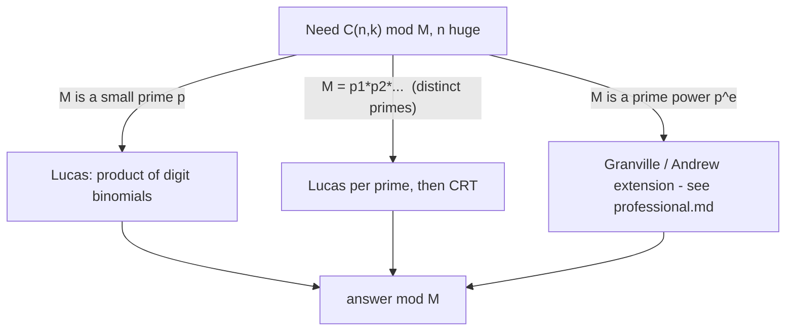

# Lucas' Theorem — Junior Level

> **One-line summary:** To compute a binomial coefficient `C(n, k) mod p` for a **prime** `p` when `n` and `k` are gigantic, write `n` and `k` in **base `p`**, then multiply together the *small* binomials of their matching digits: `C(n, k) ≡ ∏ C(n_i, k_i) (mod p)`. If any digit `k_i > n_i`, the whole answer is **0**. This turns an impossible factorial of a billion-digit number into a handful of tiny table lookups.

---

## Table of Contents

1. [Introduction](#introduction)
2. [Prerequisites](#prerequisites)
3. [Glossary](#glossary)
4. [Core Concepts](#core-concepts)
5. [Big-O Summary](#big-o-summary)
6. [Real-World Analogies](#real-world-analogies)
7. [Pros & Cons](#pros--cons)
8. [Step-by-Step Walkthrough](#step-by-step-walkthrough)
9. [Code Examples](#code-examples)
10. [Coding Patterns](#coding-patterns)
11. [Error Handling](#error-handling)
12. [Performance Tips](#performance-tips)
13. [Best Practices](#best-practices)
14. [Edge Cases & Pitfalls](#edge-cases--pitfalls)
15. [Common Mistakes](#common-mistakes)
16. [Cheat Sheet](#cheat-sheet)
17. [Visual Animation](#visual-animation)
18. [Summary](#summary)
19. [Further Reading](#further-reading)

---

## Introduction

Suppose an interviewer asks: *"What is `C(1000000000000, 500000000000) mod 13`?"* That binomial coefficient — "1 trillion choose half a trillion" — is an integer with **hundreds of billions of digits**. You cannot store it, let alone print it. Even computing the factorials `n!`, `k!`, `(n-k)!` is hopeless because each has astronomically many digits. The usual factorial method (see sibling `23-binomial-coefficients`) precomputes `factorial[0..n]`, but you cannot build an array with a trillion entries.

**Lucas' theorem** is the escape hatch. It works whenever the modulus is a **small prime `p`**, and it says something almost magical: instead of looking at `n` and `k` as whole numbers, look at their **digits in base `p`**. Then the giant binomial modulo `p` is just the product of the binomials of the *corresponding digits*:

> If `p` is prime, `n = (n_t … n_1 n_0)_p` and `k = (k_t … k_1 k_0)_p` (their base-`p` digit expansions), then
>
> **`C(n, k) ≡ C(n_t, k_t) · … · C(n_1, k_1) · C(n_0, k_0) (mod p)`**

Every digit `n_i` and `k_i` is in the range `0 … p-1`, so each `C(n_i, k_i)` is a *tiny* binomial that you can compute instantly from a small table of factorials of size `p`. And there is a beautiful shortcut: if **any** digit `k_i` is larger than the matching `n_i`, then `C(n_i, k_i) = 0`, which makes the entire product `0`. You can stop the moment you see one such digit — a **short-circuit to zero**.

So the trillion-digit question above becomes: write `10^12` and `5·10^11` in base 13, pair up their digits, multiply a few small binomials each at most `C(12, 12) = 1`, and you have the answer mod 13 in microseconds. That is the entire idea of this file: **digit decomposition in base `p`, the per-digit product rule, and the short-circuit to 0**.

---

## Prerequisites

Before reading this file you should be comfortable with:

- **Binomial coefficients** — what `C(n, k)` ("n choose k") means: the number of ways to choose `k` items from `n`. See sibling `23-binomial-coefficients`.
- **Modular arithmetic** — `(a · b) mod p`, residues, and the idea of reducing after each multiply. See sibling `02-modular-arithmetic`.
- **Modular inverse** — dividing mod a prime via `a^(p-2)` (Fermat). Needed to compute small binomials mod `p`. See siblings `05-fermat-euler` and `07-extended-euclidean-modular-inverse`.
- **Base conversion** — writing a number in a base other than 10, e.g. `13 = (1101)_2` in binary, or `(10)_13` in base 13.
- **Big-O notation** — `O(p)`, `O(log_p n)`.

Optional but helpful:

- The factorial-table technique for binomials mod a prime (sibling `33-factorial-mod-p`).
- Binary exponentiation `a^e mod m` in `O(log e)` (sibling `29-binary-exponentiation`).

---

## Glossary

| Term | Meaning |
|------|---------|
| **Binomial coefficient `C(n, k)`** | "n choose k" — the number of `k`-element subsets of an `n`-element set. Also written `(n k)` or `nCk`. |
| **Prime modulus `p`** | A prime number we compute remainders against. Lucas' theorem requires `p` to be **prime**. |
| **Base-`p` digit** | When you write `n` in base `p`, `n = n_t·p^t + … + n_1·p + n_0`, each `n_i` is a digit in `{0, …, p-1}`. |
| **Digit decomposition** | The process of repeatedly taking `n mod p` (a digit) and `n /= p` (drop that digit) until `n = 0`. |
| **Per-digit binomial** | A *small* binomial `C(n_i, k_i)` where both arguments are `< p`. |
| **Short-circuit to 0** | The rule: if any digit `k_i > n_i`, then `C(n, k) ≡ 0 (mod p)`, and you can stop early. |
| **Factorial table** | Precomputed `fact[0..p-1]` and `invFact[0..p-1]` modulo `p`, used to get each `C(n_i, k_i)` in `O(1)`. |
| **Modular inverse `a^(-1)`** | The `x` with `a·x ≡ 1 (mod p)`; for prime `p`, `x = a^(p-2) mod p`. Used in the small-binomial formula. |
| **CRT (Chinese Remainder Theorem)** | A way to combine answers mod several primes into an answer mod their product (sibling `06-crt`). Lets Lucas handle a square-free modulus. |

---

## Core Concepts

### 1. Why the factorial method fails for huge `n`

The standard way to compute `C(n, k) mod p` is:

```
C(n, k) = n! / (k! · (n-k)!)
```

so you precompute `fact[i] = i! mod p` for `i = 0 … n`, then combine with modular inverses:

```
C(n, k) ≡ fact[n] · invFact[k] · invFact[n-k] (mod p)
```

This is great — *as long as you can build an array of size `n + 1`*. For `n = 10^6` that is fine. For `n = 10^18` it is impossible: you would need an exabyte of memory and a thousand years to fill it. The factorial table approach is `O(n)` time and space, and `n` is the problem. (See sibling `23-binomial-coefficients` for that method in full.)

Lucas' theorem replaces the `n`-sized table with a **`p`-sized table**, and `p` is small.

### 2. Writing `n` and `k` in base `p`

Every non-negative integer has a unique representation in base `p`:

```
n = n_t·p^t + n_{t-1}·p^{t-1} + … + n_1·p + n_0,     each 0 ≤ n_i < p
```

You extract the digits with the classic loop: `digit = n % p`, then `n = n / p`, repeat until `n` becomes `0`. The number of digits is about `log_p(n) + 1`. For `n = 10^18` and `p = 13`, that is only about `16` digits. So a trillion-trillion number has just a *handful* of base-`p` digits.

### 3. The product rule (Lucas' theorem)

Lay the base-`p` digits of `n` and `k` side by side, least significant first, padding the shorter with leading zeros:

```
n:  n_t  n_{t-1}  …  n_1  n_0
k:  k_t  k_{t-1}  …  k_1  k_0
```

Then:

```
C(n, k) ≡ C(n_t, k_t) · C(n_{t-1}, k_{t-1}) · … · C(n_0, k_0) (mod p)
```

Each factor `C(n_i, k_i)` has both arguments in `{0, …, p-1}`, so it is a tiny binomial you can compute from a precomputed factorial table of size `p`. Multiply them all together mod `p` and you are done.

### 4. The short-circuit to zero

A binomial `C(a, b)` is `0` whenever `b > a` (you cannot choose more items than you have). So if at *any* digit position the `k` digit exceeds the `n` digit — `k_i > n_i` — that factor is `0`, and a single `0` factor kills the entire product. This gives a fast early exit:

```
if k_i > n_i for some i:  C(n, k) ≡ 0 (mod p)   ← stop immediately
```

Intuitively, in base `p` you "cannot borrow" across digit positions when subtracting `k` from `n` digit-by-digit; a borrow would make some digit binomial vanish. This is also the cleanest way to *understand* the famous corollary: `C(n, k)` is **not** divisible by `p` exactly when no digit of `k` exceeds the matching digit of `n`.

### 5. Computing one small binomial `C(a, b) mod p` with `a, b < p`

We use the factorial-table identity over a prime:

```
C(a, b) ≡ fact[a] · invFact[b] · invFact[a-b] (mod p)
```

where `fact[i] = i! mod p` for `i = 0 … p-1`, and `invFact[i]` is the modular inverse of `fact[i]`. Because `a, b < p`, none of these factorials is `≡ 0 (mod p)` (the first multiple of `p` inside a factorial is `p!`), so all the inverses exist. Build the two tables once in `O(p)`, and every per-digit binomial is then `O(1)`. (Sibling `33-factorial-mod-p` covers these tables in depth.)

### 6. Putting it together

The full algorithm:

1. Build `fact[0..p-1]` and `invFact[0..p-1]` once — `O(p)`.
2. While `n > 0` (or `k > 0`): take digits `n_i = n % p`, `k_i = k % p`. If `k_i > n_i`, return `0`. Else multiply the running answer by `C(n_i, k_i) mod p`. Then `n /= p`, `k /= p`.
3. Return the running answer.

Steps 2–3 run about `log_p(n)` times. Total cost: **`O(p + log_p n)`** — the `O(p)` to build tables plus `O(log_p n)` digits, each `O(1)`.

---

## Big-O Summary

| Operation | Time | Space | Notes |
|-----------|------|-------|-------|
| Build `fact`/`invFact` tables (size `p`) | **O(p)** | O(p) | One-time setup; reused for all queries. |
| One small binomial `C(a, b)`, `a, b < p` | **O(1)** | O(1) | Table lookups + two multiplies. |
| Digit decomposition of `n`, `k` | O(log_p n) | O(1) | About `log_p(n)` iterations. |
| Single Lucas query `C(n, k) mod p` | **O(p + log_p n)** | O(p) | Dominated by the one-time `O(p)` table build. |
| `Q` queries after tables built | O(p + Q·log_p n) | O(p) | Amortize the `O(p)` setup over many queries. |
| Plain factorial method `C(n, k) mod p` | O(n) | O(n) | **Impossible** when `n` is huge — Lucas avoids it. |

The headline cost is **`O(p + log_p n)`**: linear in the *small* prime, logarithmic in the *huge* `n`. That is the whole win — `n` only ever appears under a logarithm.

---

## Real-World Analogies

| Concept | Analogy |
|---------|---------|
| Base-`p` digits | Splitting a giant odometer reading into individual wheels; each wheel turns through `0 … p-1` independently. |
| The product rule | A combination lock where the overall verdict is "open" only if *every* dial matches — multiply each dial's small contribution. |
| Short-circuit to 0 | A bouncer who rejects you the instant *one* document fails; he does not check the rest. |
| Factorial table of size `p` | A small printed multiplication chart you keep on your desk — tiny, reused for every problem. |
| Lucas vs factorial method | Measuring a skyscraper by counting floors (digits) instead of stacking a billion individual bricks (the full factorial array). |
| CRT extension | Asking the question to several small "prime experts" separately, then a translator (CRT) merges their answers into the composite-modulus answer. |

Where the analogies break: the "independent dials" picture hides that the digits must be paired *by position* and that a single zero factor (a `k_i > n_i`) zeroes everything — the dials are not truly independent in their effect on the final product.

---

## Pros & Cons

| Pros | Cons |
|------|------|
| Handles `n, k` up to `10^18` (or bignum) with a tiny prime `p`. | **Requires `p` to be prime** — fails for general composite moduli directly. |
| Setup is `O(p)`; each query is `O(log_p n)` after that. | The modulus `p` must be **small** (table of size `p` must fit in memory). |
| Short-circuit to 0 makes many answers instant. | The popular contest modulus `10^9 + 7` is large — building a size-`p` table is `O(10^9)`, often too slow. |
| One clean idea: digits + product of small binomials. | For prime *powers* `p^e` you need the harder Granville/Andrew extension, not plain Lucas. |
| Combines with CRT for **square-free** composite moduli. | CRT extension needs the modulus to factor into *distinct* small primes. |

**When to use:** computing `C(n, k) mod p` for a **small prime `p`** with **huge `n, k`**; counting problems mod a small prime; combining several small primes via CRT for a square-free modulus.

**When NOT to use:** the modulus is large (like `10^9 + 7`) and `n` is small enough for a direct factorial table — then just use sibling `23`'s `O(n)` method; or the modulus is a prime *power* / has repeated prime factors — then use the Granville/Andrew extension (see `professional.md`).

---

## Step-by-Step Walkthrough

**Goal:** compute `C(13, 4) mod 3` by hand using Lucas' theorem, and verify against the true value.

**Step 0 — True value (for checking).** `C(13, 4) = 715`. And `715 mod 3`: `715 = 3·238 + 1`, so the answer should be `1`.

**Step 1 — Write `n = 13` and `k = 4` in base `p = 3`.**

```
13 in base 3:  13 = 1·9 + 1·3 + 1 = (1 1 1)_3      → digits (low→high): 1, 1, 1
 4 in base 3:   4 = 0·9 + 1·3 + 1 = (0 1 1)_3      → digits (low→high): 1, 1, 0
```

**Step 2 — Pair the digits by position (low to high):**

```
position 0:  n_0 = 1,  k_0 = 1
position 1:  n_1 = 1,  k_1 = 1
position 2:  n_2 = 1,  k_2 = 0
```

**Step 3 — Check the short-circuit.** Is any `k_i > n_i`? Position 0: `1 ≤ 1` ok. Position 1: `1 ≤ 1` ok. Position 2: `0 ≤ 1` ok. No zero factor — we proceed.

**Step 4 — Multiply the per-digit binomials mod 3:**

```
C(1, 1) = 1
C(1, 1) = 1
C(1, 0) = 1
product = 1 · 1 · 1 = 1 (mod 3)
```

**Step 5 — Compare.** Lucas gives `1`. The true value `715 mod 3 = 1`. They match.

**A second example showing the short-circuit:** compute `C(5, 3) mod 2`.

```
5 in base 2:  (1 0 1)_2   → digits low→high: 1, 0, 1
3 in base 2:  (0 1 1)_2   → digits low→high: 1, 1, 0
position 0: n_0=1, k_0=1  → C(1,1)=1
position 1: n_1=0, k_1=1  → k_1 > n_1  ⟹  C(0,1) = 0  ⟹  whole answer = 0
```

So `C(5, 3) ≡ 0 (mod 2)`. Check: `C(5, 3) = 10`, and `10 mod 2 = 0`. Correct — and we knew the answer the moment we hit position 1, without finishing.

---

## Code Examples

### Example: Lucas' Theorem with a Factorial Table

This builds `fact`/`invFact` tables of size `p`, computes a small binomial in `O(1)`, and walks the base-`p` digits with the short-circuit.

#### Go

```go
package main

import "fmt"

// powMod computes a^e mod m in O(log e).
func powMod(a, e, m int64) int64 {
	a %= m
	if a < 0 {
		a += m
	}
	res := int64(1) % m
	for e > 0 {
		if e&1 == 1 {
			res = res * a % m
		}
		a = a * a % m
		e >>= 1
	}
	return res
}

// Lucas holds the precomputed factorial tables for a fixed prime p.
type Lucas struct {
	p       int64
	fact    []int64
	invFact []int64
}

// NewLucas builds fact[0..p-1] and invFact[0..p-1] mod p in O(p).
func NewLucas(p int64) *Lucas {
	fact := make([]int64, p)
	invFact := make([]int64, p)
	fact[0] = 1 % p
	for i := int64(1); i < p; i++ {
		fact[i] = fact[i-1] * i % p
	}
	// invFact[p-1] via Fermat, then walk down.
	invFact[p-1] = powMod(fact[p-1], p-2, p)
	for i := p - 1; i > 0; i-- {
		invFact[i-1] = invFact[i] * i % p
	}
	return &Lucas{p: p, fact: fact, invFact: invFact}
}

// small computes C(a, b) mod p for 0 <= a, b < p.
func (l *Lucas) small(a, b int64) int64 {
	if b < 0 || b > a {
		return 0
	}
	return l.fact[a] * l.invFact[b] % l.p * l.invFact[a-b] % l.p
}

// C computes C(n, k) mod p (p prime) for arbitrarily large n, k.
func (l *Lucas) C(n, k int64) int64 {
	if k < 0 || k > n {
		return 0
	}
	res := int64(1) % l.p
	for n > 0 || k > 0 {
		ni, ki := n%l.p, k%l.p
		if ki > ni { // short-circuit to 0
			return 0
		}
		res = res * l.small(ni, ki) % l.p
		n /= l.p
		k /= l.p
	}
	return res
}

func main() {
	l := NewLucas(3)
	fmt.Println(l.C(13, 4)) // 1  (715 mod 3)
	fmt.Println(l.C(5, 3))  // C(5,3)=10; mod ... use p=2 below
	l2 := NewLucas(2)
	fmt.Println(l2.C(5, 3)) // 0  (10 mod 2)
	big := NewLucas(13)
	fmt.Println(big.C(1000000000000, 500000000000)) // huge n, small p
}
```

#### Java

```java
public class LucasTheorem {
    final long p;
    final long[] fact, invFact;

    LucasTheorem(long prime) {
        this.p = prime;
        fact = new long[(int) p];
        invFact = new long[(int) p];
        fact[0] = 1 % p;
        for (int i = 1; i < p; i++) fact[i] = fact[i - 1] * i % p;
        invFact[(int) p - 1] = powMod(fact[(int) p - 1], p - 2, p);
        for (int i = (int) p - 1; i > 0; i--) invFact[i - 1] = invFact[i] * i % p;
    }

    static long powMod(long a, long e, long m) {
        a %= m;
        if (a < 0) a += m;
        long res = 1 % m;
        while (e > 0) {
            if ((e & 1) == 1) res = res * a % m;
            a = a * a % m;
            e >>= 1;
        }
        return res;
    }

    long small(long a, long b) {
        if (b < 0 || b > a) return 0;
        return fact[(int) a] * invFact[(int) b] % p * invFact[(int) (a - b)] % p;
    }

    long binom(long n, long k) {
        if (k < 0 || k > n) return 0;
        long res = 1 % p;
        while (n > 0 || k > 0) {
            long ni = n % p, ki = k % p;
            if (ki > ni) return 0;        // short-circuit
            res = res * small(ni, ki) % p;
            n /= p;
            k /= p;
        }
        return res;
    }

    public static void main(String[] args) {
        System.out.println(new LucasTheorem(3).binom(13, 4)); // 1
        System.out.println(new LucasTheorem(2).binom(5, 3));  // 0
        System.out.println(new LucasTheorem(13).binom(1000000000000L, 500000000000L));
    }
}
```

#### Python

```python
class Lucas:
    """Lucas' theorem for C(n, k) mod p with prime p, huge n and k."""

    def __init__(self, p):
        self.p = p
        self.fact = [1] * p
        for i in range(1, p):
            self.fact[i] = self.fact[i - 1] * i % p
        self.inv_fact = [1] * p
        self.inv_fact[p - 1] = pow(self.fact[p - 1], p - 2, p)  # Fermat inverse
        for i in range(p - 1, 0, -1):
            self.inv_fact[i - 1] = self.inv_fact[i] * i % p

    def small(self, a, b):
        if b < 0 or b > a:
            return 0
        return self.fact[a] * self.inv_fact[b] % self.p * self.inv_fact[a - b] % self.p

    def binom(self, n, k):
        if k < 0 or k > n:
            return 0
        res = 1 % self.p
        while n > 0 or k > 0:
            ni, ki = n % self.p, k % self.p
            if ki > ni:           # short-circuit to 0
                return 0
            res = res * self.small(ni, ki) % self.p
            n //= self.p
            k //= self.p
        return res


if __name__ == "__main__":
    print(Lucas(3).binom(13, 4))   # 1  (715 mod 3)
    print(Lucas(2).binom(5, 3))    # 0  (10 mod 2)
    print(Lucas(13).binom(10**12, 5 * 10**11))  # huge n, small p
```

**What it does:** builds size-`p` factorial tables once, then answers `C(n, k) mod p` by multiplying per-digit binomials, short-circuiting to 0 on the first `k_i > n_i`.
**Run:** `go run main.go` | `javac LucasTheorem.java && java LucasTheorem` | `python lucas.py`

---

## Coding Patterns

### Pattern 1: Brute-Force Oracle (test against this)

**Intent:** On small `n, k, p`, compute `C(n, k) mod p` the obvious way (Pascal's triangle) and check Lucas agrees.

```python
def binom_pascal(n, k, p):
    # Build row by row mod p; O(n*k) — only for small n.
    C = [[0] * (k + 1) for _ in range(n + 1)]
    for i in range(n + 1):
        C[i][0] = 1 % p
        for j in range(1, min(i, k) + 1):
            C[i][j] = (C[i - 1][j - 1] + C[i - 1][j]) % p
    return C[n][k]
```

Run `assert Lucas(p).binom(n, k) == binom_pascal(n, k, p)` for all small `n, k, p` before trusting the fast version.

### Pattern 2: Many Queries, One Table

**Intent:** Build the size-`p` tables once and answer thousands of queries cheaply.

```python
luc = Lucas(p)            # O(p) once
for (n, k) in queries:    # each O(log_p n)
    print(luc.binom(n, k))
```

### Pattern 3: Square-Free Modulus via Lucas + CRT

**Intent:** Compute `C(n, k) mod M` when `M = p_1 · p_2 · … · p_r` is a product of **distinct** primes.

```python
def binom_squarefree(n, k, primes):
    # primes: distinct prime factors of M
    residues = [Lucas(p).binom(n, k) for p in primes]
    return crt(residues, primes)   # combine via Chinese Remainder Theorem (sibling 06)
```



---

## Error Handling

| Error | Cause | Fix |
|-------|-------|-----|
| Wrong answer for composite modulus | Applied plain Lucas with a non-prime `p`. | Lucas needs prime `p`; factor `M` and use CRT (square-free) or Granville (prime power). |
| Out-of-memory building tables | `p` is large (e.g. `10^9 + 7`). | Use the `O(n)` factorial method instead when `n` is small; Lucas only pays off for *small* `p`. |
| `invFact` is wrong | Tried to invert a factorial that is `0 mod p`. | With `a, b < p` no factorial is `0 mod p`; never call `small` with arguments `≥ p`. |
| Forgot the short-circuit | Multiplied `C(0, 1)`-style factors incorrectly. | Return `0` immediately when `k_i > n_i`. |
| Overflow in `fact[i-1]*i` | 64-bit product near `p^2` overflows when `p` is large. | Keep `p` small (Lucas's regime); reduce after each multiply; use 128-bit if needed. |
| Off-by-one in digit loop | Stopped at `n > 0` but `k` still had digits. | Loop while `n > 0 OR k > 0`. |

---

## Performance Tips

- **Build `fact`/`invFact` once**, reuse for every query — never rebuild per call.
- **Compute `invFact` backward** from `invFact[p-1]` (one Fermat inverse) using `invFact[i-1] = invFact[i] * i`, instead of `p` separate inversions. That is `O(p)` total, not `O(p log p)`.
- **Short-circuit early** — return `0` the instant a digit `k_i > n_i`; many real inputs hit this fast.
- **Keep `p` small** — Lucas is only attractive when the size-`p` table fits comfortably (say `p ≤ 10^6`). For a large prime modulus and small `n`, use sibling `23`'s `O(n)` table.
- **Use the language's fast modpow** — Python `pow(a, e, m)`, a hand-rolled `powMod` in Go/Java.

---

## Best Practices

- State clearly that `p` is **prime** next to every Lucas call — the method is silently wrong otherwise.
- Validate `0 ≤ k ≤ n`; return `0` for `k < 0` or `k > n` up front.
- Test the fast Lucas implementation against a Pascal's-triangle oracle (Pattern 1) on small inputs.
- Decompose digits **least-significant first** with `% p` and `/= p`; loop while either `n` or `k` is nonzero.
- For composite moduli, factor first: distinct primes → CRT; repeated prime → Granville extension. Document which path you took.

---

## Edge Cases & Pitfalls

- **`k = 0`** — every `k_i = 0`, every `C(n_i, 0) = 1`, so the product is `1` (and `C(n, 0) = 1` always).
- **`k > n`** — return `0` immediately; equivalently some digit will trigger the short-circuit.
- **`p = 2`** — Lucas mod 2 is just bitwise: `C(n, k)` is odd iff `(k AND n) == k` (every set bit of `k` is set in `n`). A neat special case.
- **`n` or `k` equal to `0`** — the loop runs zero times (when both are 0) and the answer is `1` (`C(0,0)=1`).
- **Large prime `p`** — building a size-`p` table may be infeasible; Lucas is the wrong tool there.
- **Composite or prime-power modulus** — plain Lucas does not apply; use CRT or Granville.
- **Negative arguments** — guard `k < 0` (return 0) before the digit loop.

---

## Common Mistakes

1. **Using a composite modulus with plain Lucas** — the theorem requires a *prime* `p`. For composite `M`, factor and use CRT or the prime-power extension.
2. **Forgetting the short-circuit** — if `k_i > n_i`, the answer is `0`; missing this gives a garbage product.
3. **Building a size-`p` table for a large prime** — for `p = 10^9 + 7` that is hopeless; switch to the `O(n)` factorial method when `n` is small.
4. **Looping only while `n > 0`** — you must continue while `k > 0` too, or you drop high `k` digits and miss a short-circuit.
5. **Inverting factorials one by one** — use the backward `invFact` recurrence; otherwise setup is needlessly slow.
6. **Calling the small-binomial helper with arguments `≥ p`** — the tables only cover `0 … p-1`; that is exactly why we reduce to digits first.
7. **Confusing "reduce the exponent mod φ" with Lucas** — Lucas reduces the *arguments* via base-`p` digits; it has nothing to do with exponent reduction.

---

## Cheat Sheet

| Question | Tool | Formula |
|----------|------|---------|
| `C(n, k) mod p`, `p` prime, huge `n` | Lucas | `∏_i C(n_i, k_i) mod p` over base-`p` digits |
| Any digit `k_i > n_i`? | short-circuit | answer is `0` |
| Small `C(a, b) mod p`, `a,b < p` | factorial table | `fact[a]·invFact[b]·invFact[a-b]` |
| Build `invFact` | backward recurrence | `invFact[p-1] = fact[p-1]^(p-2)`, then `invFact[i-1] = invFact[i]·i` |
| `C(n, k) mod 2` | Lucas mod 2 | odd iff `(k & n) == k` |
| `C(n, k) mod M`, `M` square-free | Lucas + CRT | per-prime Lucas, then combine (sibling `06`) |
| `C(n, k) mod p^e` | Granville extension | see `professional.md` |
| `C(n, 0)` / `C(n, n)` | base case | `1` |
| Setup cost | — | `O(p)` |
| Per-query cost | — | `O(log_p n)` |

Core routine:

```
lucas(n, k, p):
    res = 1
    while n > 0 or k > 0:
        ni, ki = n % p, k % p
        if ki > ni: return 0           # short-circuit
        res = res * smallC(ni, ki) % p
        n //= p; k //= p
    return res
```

---

## Visual Animation

> See [`animation.html`](./animation.html) for an interactive visualization.
>
> The animation demonstrates:
> - Writing `n` and `k` in **base `p`**, digit by digit
> - Pairing the digits and computing each small binomial `C(n_i, k_i)`
> - Multiplying the per-digit results into a running product mod `p`
> - The **short-circuit to 0** flashing red the instant a digit `k_i > n_i`
> - Editable `n`, `k`, `p` with Play / Step / Reset controls, a Big-O table, and a log

---

## Summary

Lucas' theorem computes `C(n, k) mod p` for a **prime `p`** even when `n` and `k` are astronomically large. The trick is to forget the giant numbers and look at their **base-`p` digits**: `C(n, k) ≡ ∏_i C(n_i, k_i) (mod p)`, a product of *tiny* binomials, one per digit position. Each small binomial comes from a precomputed factorial table of size `p`, so a query costs only `O(p + log_p n)` — linear in the small prime, logarithmic in the huge `n`. If any digit `k_i > n_i`, the answer **short-circuits to 0**. The method requires `p` to be prime, but combines with the Chinese Remainder Theorem (sibling `06-crt`) to handle a **square-free** composite modulus, and extends (via Granville/Andrew) to prime *powers*. Master the digit loop, the size-`p` table, and the zero short-circuit, and trillion-digit binomials become microsecond computations.

---

## Further Reading

- Sibling topic `23-binomial-coefficients` — the `O(n)` factorial-table method Lucas replaces for huge `n`.
- Sibling topic `33-factorial-mod-p` — building `fact`/`invFact` tables and Wilson-style facts mod a prime.
- Sibling topic `06-crt` — combining per-prime answers for a square-free modulus.
- Sibling topic `05-fermat-euler` — the Fermat inverse `a^(p-2)` used inside the factorial table.
- Sibling topic `29-binary-exponentiation` — the `O(log e)` fast-power engine.
- cp-algorithms.com — "Binomial coefficients" and "Lucas's theorem".
- É. Lucas (1878), original statement; A. Granville, "Binomial coefficients modulo prime powers".

Next step: continue to [`middle.md`](./middle.md) to learn *why* Lucas works, when to prefer it over the plain factorial method, and how the per-digit factorial table scales.
