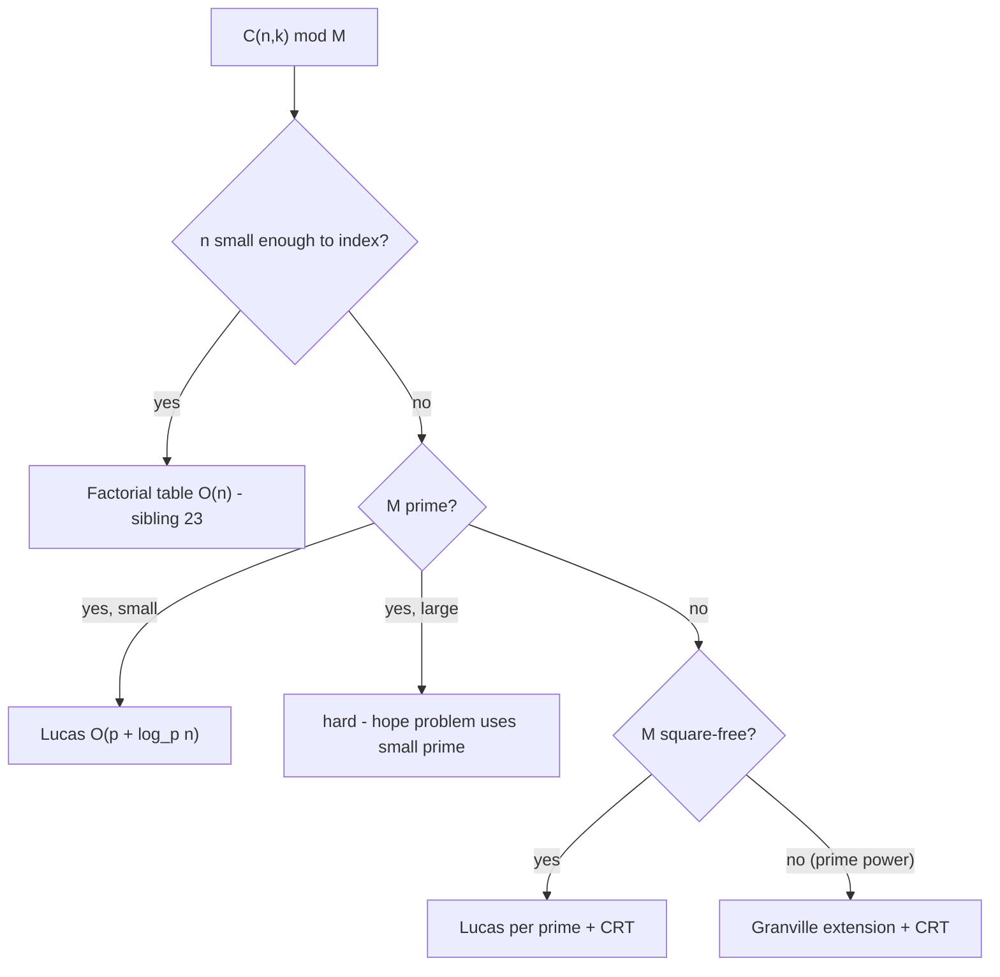
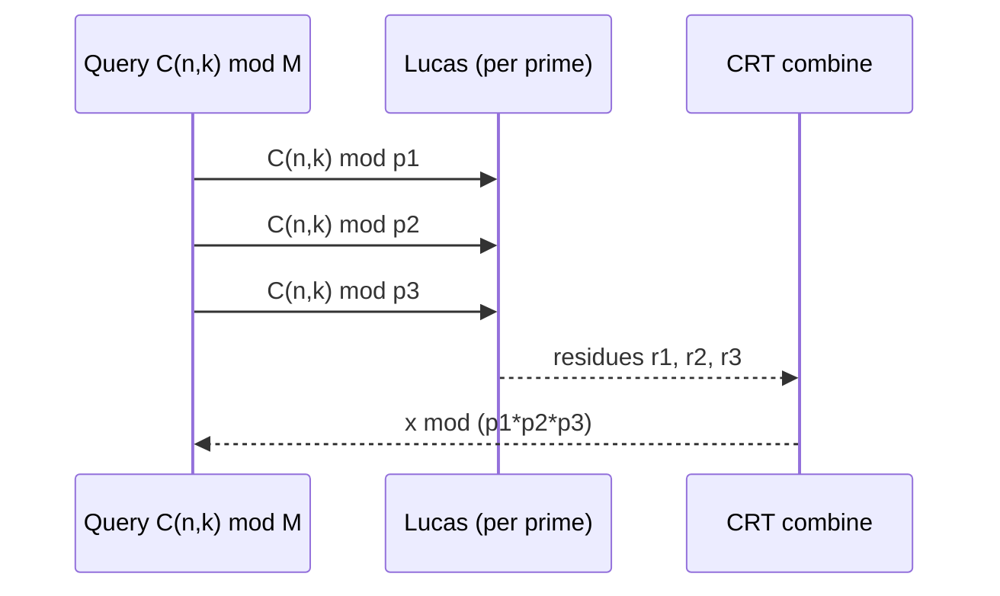

# Lucas' Theorem — Middle Level

> **Focus:** *Why* does the base-`p` product rule work, and *when* should you reach for Lucas instead of a plain factorial table? The short answer: use Lucas exactly when `n` is **too big to enumerate** and the modulus is a **small prime**. This file builds the intuition behind the theorem, compares it head-to-head with the `O(n)` factorial method (sibling `23-binomial-coefficients`), shows how the per-digit factorial table scales, and introduces the CRT bridge to square-free moduli.

---

## Table of Contents

1. [Introduction](#introduction)
2. [Why the Product Rule Works (Intuition)](#why-the-product-rule-works-intuition)
3. [Comparison with the Factorial Method](#comparison-with-the-factorial-method)
4. [When to Choose Lucas](#when-to-choose-lucas)
5. [The Per-Digit Factorial Table](#the-per-digit-factorial-table)
6. [Advanced Patterns](#advanced-patterns)
7. [Lucas + CRT for Square-Free Moduli](#lucas--crt-for-square-free-moduli)
8. [Code Examples](#code-examples)
9. [Error Handling](#error-handling)
10. [Performance Analysis](#performance-analysis)
11. [Best Practices](#best-practices)
12. [Visual Animation](#visual-animation)
13. [Summary](#summary)

---

## Introduction

At the junior level you learned the *mechanics*: split `n` and `k` into base-`p` digits, multiply the small binomials `C(n_i, k_i)` mod `p`, short-circuit to `0` when a digit `k_i > n_i`. That is enough to *use* Lucas. The middle-level questions are different:

- **Why** is `C(n, k) ≡ ∏ C(n_i, k_i) (mod p)` true at all? What property of primes makes the digits decouple?
- **When** is Lucas actually the right tool versus the ordinary precomputed-factorial approach? Both compute `C(n, k) mod p` — the choice hinges on the *sizes* of `n` and `p`.
- **How** does the per-digit factorial table behave as `p` grows, and where is the crossover?
- **How** do you extend the reach of a *small prime* method to a *composite square-free* modulus?

The unifying invariant to internalize is this: **Lucas trades an `O(n)` dependence for an `O(p + log_p n)` dependence.** Every decision below — whether to use it, how to size the table, how to combine primes — is a consequence of that trade.

---

## Why the Product Rule Works (Intuition)

The full proof (generating functions, Frobenius) lives in [`professional.md`](./professional.md). Here is the *intuition* a middle engineer should carry.

### The generating-function picture

The binomial coefficients are the coefficients of `(1 + x)^n`:

```
(1 + x)^n = Σ_k C(n, k) x^k
```

So `C(n, k) mod p` is "the coefficient of `x^k` in `(1 + x)^n`, reduced mod `p`." The magic fact about primes is the **Freshman's Dream / Frobenius identity**:

```
(1 + x)^p ≡ 1 + x^p (mod p)
```

This holds because every "middle" binomial `C(p, j)` for `0 < j < p` is divisible by `p` (the numerator `p!` contains the prime `p`, but the denominator `j!(p-j)!` does not). So all the interior terms vanish mod `p`, leaving only the ends.

Now write `n` in base `p`, `n = Σ n_i p^i`, and expand:

```
(1 + x)^n = (1 + x)^{Σ n_i p^i} = ∏_i ((1 + x)^{p^i})^{n_i}
          ≡ ∏_i (1 + x^{p^i})^{n_i}  (mod p)     ← apply Frobenius i times
```

Expanding each `(1 + x^{p^i})^{n_i}` produces powers of `x^{p^i}` with coefficients `C(n_i, j_i)`. Because the exponents `p^0, p^1, p^2, …` are the *place values of base `p`*, the only way to assemble `x^k` is to pick, in each factor, the term whose exponent contributes digit `k_i` to `k`. The coefficient of `x^k` is therefore the product `∏_i C(n_i, k_i)`. That is Lucas' theorem.

### The one-sentence version

> Frobenius collapses `(1+x)^{p^i}` to `1 + x^{p^i}`, so the base-`p` digits of the exponent stop interacting — and the coefficient of `x^k` factors digit-by-digit.

### Why the short-circuit appears

If digit `k_i > n_i`, then in the factor `(1 + x^{p^i})^{n_i}` there is **no** term `x^{k_i · p^i}` — you cannot choose `k_i` from only `n_i` copies. The coefficient is `C(n_i, k_i) = 0`, so the whole product is `0`. The "cannot borrow across base-`p` digits" intuition from junior is exactly this absence of a high-enough power in one factor.

---

## Comparison with the Factorial Method

Both methods compute `C(n, k) mod p` for a prime `p`. They occupy opposite ends of the `(n, p)` size spectrum.

| Attribute | Lucas' theorem | Factorial table (sibling `23`) | Pascal's triangle |
|-----------|----------------|--------------------------------|-------------------|
| Setup time | **O(p)** | O(n) | — |
| Setup space | O(p) | O(n) | O(n·k) or O(k) |
| Per-query time | O(log_p n) | O(1) | — |
| Max practical `n` | **10^18 / bignum** | ~10^7–10^8 | ~10^4 |
| Max practical `p` | ~10^6 (table must fit) | **10^9 + 7 ok** | any |
| Requires prime modulus? | Yes | Yes (for the inverse) | No |
| Best regime | huge `n`, **small** prime `p` | moderate `n`, **large** prime `p` | tiny `n`, any modulus |
| Composite modulus? | via CRT (square-free) / Granville | via CRT | direct (Pascal recurrence is +,−) |

**Choose Lucas when:** `n` is far larger than you can index (`n ≫ 10^8`) **and** the modulus is a small prime (`p` small enough that an array of size `p` fits — say `p ≤ 10^6`). Classic example: counting problems mod `3`, `7`, `1009`, etc., with `n` up to `10^18`.

**Choose the factorial table when:** the modulus is the usual large contest prime (`10^9 + 7`, `998244353`) **and** `n` fits in memory (`n ≤ ~10^7`). Here Lucas would need a billion-entry table — far worse.

**Choose Pascal's triangle when:** everything is tiny and you want a dependency-free `O(n·k)` reference (also the oracle you test the others against).

### The crossover, made concrete

- `C(10^18, k) mod 13`: Lucas builds a 13-entry table and walks ~16 digits. The factorial method is *impossible* (10^18-entry array). → **Lucas**.
- `C(10^6, k) mod (10^9 + 7)`: factorial method builds a 10^6-entry table, each query `O(1)`. Lucas would need a 10^9-entry table. → **Factorial**.
- `C(10^18, k) mod (10^9 + 7)`: *both* are bad — `n` too big for a table, `p` too big for a Lucas table. This needs neither plain method; it is genuinely hard (and usually the problem statement chooses a small prime so Lucas applies).

---

## When to Choose Lucas

A decision checklist:

1. **Is the modulus a single small prime `p`?** If yes and `n` is huge → Lucas. If the prime is large and `n` is small → factorial table.
2. **Is the modulus square-free composite (`p_1 p_2 … p_r`, distinct primes)?** → Lucas per prime + CRT.
3. **Is the modulus a prime power `p^e` (`e ≥ 2`)?** → plain Lucas is **wrong**; use the Granville/Andrew extension (`professional.md`).
4. **Is the modulus a general composite (repeated and distinct primes)?** → factor into prime powers, apply Granville per prime power, CRT the results.
5. **Is `n` small enough to index (`≤ 10^7`)?** → just use the factorial table regardless; it is simpler and `O(1)` per query.



---

## The Per-Digit Factorial Table

The per-digit binomial `C(n_i, k_i) mod p` with both arguments `< p` uses:

```
C(a, b) ≡ fact[a] · invFact[b] · invFact[a - b] (mod p)
```

### Building the tables in O(p)

```
fact[0] = 1
fact[i] = fact[i-1] * i mod p              for i = 1 .. p-1

invFact[p-1] = fact[p-1]^(p-2) mod p       ← one Fermat inverse
invFact[i-1] = invFact[i] * i mod p        for i = p-1 .. 1
```

The backward recurrence for `invFact` is the key efficiency: it computes all `p` inverses with **one** modular exponentiation plus `O(p)` multiplications, instead of `p` separate `O(log p)` inversions. Total setup: `O(p)`.

### Why no factorial is zero mod p here

The smallest factorial divisible by `p` is `p!` (it first contains the factor `p`). Since every argument is `< p`, every `fact[i]` for `i < p` is a product of numbers all `< p`, none of which is a multiple of `p` — so `fact[i] ≢ 0 (mod p)` and its inverse exists. This is *precisely why* we reduce to digits first: it guarantees invertibility.

### Table-size scaling

| Prime `p` | Table memory (int64) | Setup time (rough) | Lucas viable? |
|-----------|----------------------|--------------------|---------------|
| 13 | ~200 B | instant | yes |
| 1009 | ~16 KB | instant | yes |
| 10^5 | ~1.6 MB | < 1 ms | yes |
| 10^6 | ~16 MB | few ms | yes (borderline) |
| 10^7 | ~160 MB | tens of ms | risky |
| 10^9 + 7 | ~16 GB | seconds | **no** |

The viability ceiling is set by the table, not by `n`. Beyond `p ≈ 10^6` you should question whether Lucas is the right approach.

---

## Advanced Patterns

### Pattern: Lucas mod 2 as a bitwise test

For `p = 2`, every per-digit binomial is `C(0,0)=C(1,0)=C(1,1)=1` and `C(0,1)=0`. So `C(n, k)` is **odd** iff for every bit, `k`'s bit does not exceed `n`'s bit — i.e. `(k & n) == k` (`k` is a submask of `n`).

#### Go

```go
func binomMod2(n, k int64) int64 {
	if k&n == k {
		return 1
	}
	return 0
}
```

#### Java

```java
static long binomMod2(long n, long k) {
    return (k & n) == k ? 1 : 0;
}
```

#### Python

```python
def binom_mod2(n, k):
    return 1 if (k & n) == k else 0
```

This is the cheapest possible Lucas — no table, just one AND. It also explains the fractal "Sierpiński triangle" pattern of odd entries in Pascal's triangle.

### Pattern: Counting how many `C(n, k)` are nonzero mod p

By Lucas, `C(n, k) ≢ 0 (mod p)` iff every digit `k_i ≤ n_i`. The number of valid `k` (for fixed `n`) is `∏_i (n_i + 1)` — a direct product over the base-`p` digits of `n`. (Kummer's theorem connects this to carries; see `professional.md`.)

```python
def count_nonzero_binoms(n, p):
    prod = 1
    while n > 0:
        prod *= (n % p) + 1
        n //= p
    return prod   # number of k in [0,n] with C(n,k) not divisible by p
```

### Pattern: Iterative digit collection (avoid recursion)

```python
def digits_base_p(x, p):
    ds = []
    while x > 0:
        ds.append(x % p)
        x //= p
    return ds or [0]
```

Collecting digits explicitly makes the short-circuit and the pairing logic easy to read and test.

---

## Lucas + CRT for Square-Free Moduli

Plain Lucas only handles a *prime* modulus. But many problems ask for a composite modulus that happens to be **square-free** — a product of *distinct* primes, like `M = 2 · 3 · 5 · 7 = 210`. The Chinese Remainder Theorem (sibling `06-crt`) bridges the gap.

**Idea:** compute `r_j = C(n, k) mod p_j` with Lucas for each prime `p_j | M`. Then the unique residue `x mod M` with `x ≡ r_j (mod p_j)` for all `j` is `C(n, k) mod M`. CRT reconstructs it because the primes are pairwise coprime.



**Important caveat:** the primes must be **distinct** (the modulus square-free). If a prime appears squared, say `M = 12 = 2^2 · 3`, you cannot use plain Lucas mod `4` — `4` is not prime, and the digit decomposition is invalid. That case needs the Granville/Andrew prime-power extension (`professional.md`), after which CRT combines the prime-power residues.

---

## Code Examples

### Full Implementation: Lucas + CRT for a square-free modulus

#### Go

```go
package main

import "fmt"

func powMod(a, e, m int64) int64 {
	a %= m
	if a < 0 {
		a += m
	}
	r := int64(1) % m
	for e > 0 {
		if e&1 == 1 {
			r = r * a % m
		}
		a = a * a % m
		e >>= 1
	}
	return r
}

// lucas computes C(n, k) mod p for prime p.
func lucas(n, k, p int64) int64 {
	if k < 0 || k > n {
		return 0
	}
	fact := make([]int64, p)
	fact[0] = 1 % p
	for i := int64(1); i < p; i++ {
		fact[i] = fact[i-1] * i % p
	}
	res := int64(1) % p
	for n > 0 || k > 0 {
		ni, ki := n%p, k%p
		if ki > ni {
			return 0
		}
		// C(ni, ki) = fact[ni] / (fact[ki] * fact[ni-ki])
		denom := fact[ki] * fact[ni-ki] % p
		res = res * (fact[ni] * powMod(denom, p-2, p) % p) % p
		n /= p
		k /= p
	}
	return res
}

// crt merges residues r[i] mod m[i] (pairwise coprime) into x mod prod(m).
func crt(r, m []int64) int64 {
	M := int64(1)
	for _, mi := range m {
		M *= mi
	}
	x := int64(0)
	for i := range m {
		Mi := M / m[i]
		inv := powMod(Mi%m[i], m[i]-2, m[i]) // m[i] prime
		x = (x + r[i]%m[i]*Mi%M*inv) % M
	}
	return (x%M + M) % M
}

func main() {
	primes := []int64{2, 3, 5, 7} // M = 210, square-free
	n, k := int64(1000), int64(500)
	res := make([]int64, len(primes))
	for i, p := range primes {
		res[i] = lucas(n, k, p)
	}
	fmt.Println(crt(res, primes)) // C(1000,500) mod 210
}
```

#### Java

```java
import java.util.*;

public class LucasCRT {
    static long powMod(long a, long e, long m) {
        a %= m; if (a < 0) a += m;
        long r = 1 % m;
        while (e > 0) {
            if ((e & 1) == 1) r = r * a % m;
            a = a * a % m; e >>= 1;
        }
        return r;
    }

    static long lucas(long n, long k, long p) {
        if (k < 0 || k > n) return 0;
        long[] fact = new long[(int) p];
        fact[0] = 1 % p;
        for (int i = 1; i < p; i++) fact[i] = fact[i - 1] * i % p;
        long res = 1 % p;
        while (n > 0 || k > 0) {
            long ni = n % p, ki = k % p;
            if (ki > ni) return 0;
            long denom = fact[(int) ki] * fact[(int) (ni - ki)] % p;
            res = res * (fact[(int) ni] * powMod(denom, p - 2, p) % p) % p;
            n /= p; k /= p;
        }
        return res;
    }

    static long crt(long[] r, long[] m) {
        long M = 1;
        for (long mi : m) M *= mi;
        long x = 0;
        for (int i = 0; i < m.length; i++) {
            long Mi = M / m[i];
            long inv = powMod(Mi % m[i], m[i] - 2, m[i]);
            x = (x + r[i] % m[i] * (Mi % M) % M * inv) % M;
        }
        return (x % M + M) % M;
    }

    public static void main(String[] args) {
        long[] primes = {2, 3, 5, 7};
        long n = 1000, k = 500;
        long[] res = new long[primes.length];
        for (int i = 0; i < primes.length; i++) res[i] = lucas(n, k, primes[i]);
        System.out.println(crt(res, primes)); // C(1000,500) mod 210
    }
}
```

#### Python

```python
def lucas(n, k, p):
    if k < 0 or k > n:
        return 0
    fact = [1] * p
    for i in range(1, p):
        fact[i] = fact[i - 1] * i % p
    res = 1 % p
    while n > 0 or k > 0:
        ni, ki = n % p, k % p
        if ki > ni:
            return 0
        denom = fact[ki] * fact[ni - ki] % p
        res = res * (fact[ni] * pow(denom, p - 2, p) % p) % p
        n //= p
        k //= p
    return res


def crt(residues, mods):
    from math import prod
    M = prod(mods)
    x = 0
    for r, m in zip(residues, mods):
        Mi = M // m
        x = (x + r % m * Mi % M * pow(Mi % m, m - 2, m)) % M
    return x % M


if __name__ == "__main__":
    primes = [2, 3, 5, 7]            # M = 210, square-free
    n, k = 1000, 500
    res = [lucas(n, k, p) for p in primes]
    print(crt(res, primes))         # C(1000,500) mod 210
```

**What it does:** computes `C(1000, 500)` modulo each of the distinct primes `2, 3, 5, 7` via Lucas, then merges the residues with CRT to get the answer mod `210`.
**Run:** `go run main.go` | `javac LucasCRT.java && java LucasCRT` | `python lucas_crt.py`

---

## Error Handling

| Scenario | What goes wrong | Correct approach |
|----------|-----------------|------------------|
| Composite modulus passed to `lucas` | Digit decomposition is meaningless; wrong answer | Factor `M`; distinct primes → CRT, prime power → Granville |
| Prime appears squared in CRT inputs | CRT moduli not pairwise coprime | Use prime-power extension for that factor, not plain Lucas |
| Large prime `p` | Size-`p` table OOMs | Use factorial table (`23`) if `n` small; reconsider approach |
| Rebuilding `fact` every digit | `O(p)` per digit instead of once | Build `fact`/`invFact` once outside the loop (see junior `Lucas` struct) |
| `k < 0` | Spurious nonzero result | Return `0` for `k < 0` before the loop |
| Overflow in CRT product | `M` exceeds 64-bit | Use 128-bit / bignum when `M` is large |

---

## Performance Analysis

Benchmark the per-query cost as `n` grows (table prebuilt):

#### Go

```go
package main

import (
	"fmt"
	"time"
)

func main() {
	const p = int64(1009)
	// assume fact/invFact prebuilt elsewhere; here we time the digit walk
	ns := []int64{1e6, 1e9, 1e12, 1e15, 1e18}
	for _, n := range ns {
		start := time.Now()
		for i := 0; i < 100000; i++ {
			_ = lucas(n, n/2, p) // includes table build in this simple version
		}
		fmt.Printf("n=%-20d %.3f us/query\n", n, float64(time.Since(start).Microseconds())/100000)
	}
}
```

#### Java

```java
public static void main(String[] args) {
    long p = 1009;
    long[] ns = {1_000_000L, 1_000_000_000L, 1_000_000_000_000L,
                 1_000_000_000_000_000L, 1_000_000_000_000_000_000L};
    for (long n : ns) {
        long start = System.nanoTime();
        for (int i = 0; i < 100_000; i++) lucas(n, n / 2, p);
        double us = (System.nanoTime() - start) / 100_000.0 / 1000.0;
        System.out.printf("n=%-20d %.3f us/query%n", n, us);
    }
}
```

#### Python

```python
import timeit

p = 1009
for n in [10**6, 10**9, 10**12, 10**15, 10**18]:
    t = timeit.timeit(lambda: lucas(n, n // 2, p), number=10_000)
    print(f"n={n:<20} {t/10_000*1e6:.3f} us/query")
```

**What you observe:** per-query time grows *logarithmically* in `n` — roughly proportional to the number of base-`p` digits (`log_p n`). Doubling `n` barely moves the needle; going from `10^6` to `10^18` only triples the digit count. The dominant constant is the one-time `O(p)` table build, which the production code amortizes across queries.

---

## Best Practices

- **Separate setup from query.** Build `fact`/`invFact` once (the junior `Lucas` struct pattern); never rebuild per digit or per call.
- **Pick the method by the `(n, p)` regime**, not by habit. Huge `n` + small prime → Lucas; large prime + small `n` → factorial table.
- **For composite moduli, factor first.** Distinct primes → CRT; repeated prime → Granville extension, then CRT.
- **Use the bitwise shortcut for `p = 2`** — `(k & n) == k`.
- **Always validate against Pascal's triangle on small inputs** before trusting the fast path.
- **Keep `p` within the table budget** (≤ ~10^6); beyond that, Lucas loses its advantage.

---

## Visual Animation

> See [`animation.html`](./animation.html) for interactive visualization.
>
> Middle-level animation includes:
> - Base-`p` digit columns for `n` and `k`, side by side
> - The running product of per-digit binomials, updating each step
> - The short-circuit firing (red flash) when `k_i > n_i`
> - A side note comparing the digit count `log_p n` against the impossible `n`-sized factorial array
> - Editable `n`, `k`, `p`, plus a step counter and operation log

---

## Summary

At the middle level, Lucas' theorem is understood through its *generating-function proof* — the Frobenius identity `(1+x)^p ≡ 1 + x^p (mod p)` makes the base-`p` digits of the exponent stop interacting, so the coefficient of `x^k` factors into a product of digit binomials. The practical lesson is a regime decision: Lucas wins when `n` is too large to index and the prime is small (`O(p + log_p n)`), while the factorial-table method (sibling `23`) wins when the prime is large and `n` is moderate (`O(n)`, `O(1)` per query). The per-digit factorial table of size `p` — built in `O(p)` with a single Fermat inverse and a backward recurrence — is the engine, and its size caps Lucas's viability at roughly `p ≤ 10^6`. Finally, the Chinese Remainder Theorem (sibling `06-crt`) extends Lucas from a single prime to any **square-free** modulus by combining per-prime residues, while repeated prime factors demand the Granville extension covered next.

---

Next step: continue to [`senior.md`](./senior.md) to design large-scale counting systems with Lucas — choosing the prime, building shared factorial tables, and combining CRT across distributed services.
