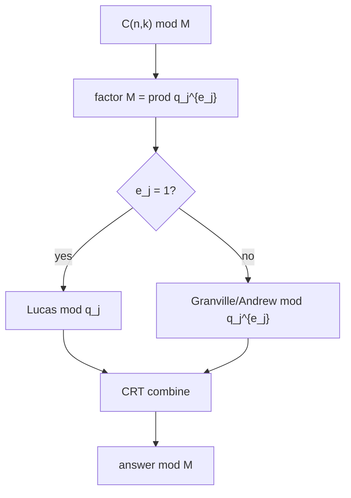

# Lucas' Theorem — Mathematical Foundations and Complexity Theory

> **Focus:** *Is the base-`p` product rule provably correct, and how far does it generalize?* This file gives two proofs of Lucas' theorem (the generating-function / Frobenius proof and a digit-counting proof), connects it to Kummer's theorem on carries and the `p`-adic valuation `v_p(C(n,k))`, derives the prime-power extension (Andrew Granville's framework, with the Andrew/Lucas-like recurrence and CRT), and analyzes the exact complexity `O(p + log_p n)`.

---

## Table of Contents

1. [Formal Statement and Setup](#1-formal-statement-and-setup)
2. [The Frobenius Identity `(1+x)^p ≡ 1 + x^p`](#2-the-frobenius-identity)
3. [Proof of Lucas via Generating Functions](#3-proof-of-lucas-via-generating-functions)
4. [Proof via the Digit-Counting Recurrence](#4-proof-via-the-digit-counting-recurrence)
5. [Kummer's Theorem and the `p`-adic Valuation](#5-kummers-theorem-and-the-p-adic-valuation)
6. [The Prime-Power Extension (Granville / Andrew)](#6-the-prime-power-extension)
7. [CRT Assembly for General Moduli](#7-crt-assembly-for-general-moduli)
8. [Complexity Analysis](#8-complexity-analysis)
9. [Applications in Counting Modulo a Prime](#9-applications-in-counting-modulo-a-prime)
10. [Worked Examples Index](#10-worked-examples-index)
11. [Comparison with Alternatives](#11-comparison-with-alternatives)
12. [Summary](#12-summary)

---

## 1. Formal Statement and Setup

Throughout, `p` is a prime, and `C(n, k)` denotes the binomial coefficient with the convention `C(n, k) = 0` when `k < 0` or `k > n`. We work in the field `𝔽_p = ℤ/pℤ`.

**Definition 1.1 (base-`p` expansion).** Every `n ∈ ℤ_{≥0}` has a unique representation `n = Σ_{i=0}^{t} n_i p^i` with digits `n_i ∈ {0, 1, …, p-1}`. Write `n = (n_t … n_1 n_0)_p`.

**Theorem 1.2 (Lucas, 1878).** Let `p` be prime, `n = Σ n_i p^i`, `k = Σ k_i p^i` (pad the shorter expansion with leading zeros). Then

```
C(n, k) ≡ ∏_{i=0}^{t} C(n_i, k_i)  (mod p),
```

with the convention `C(n_i, k_i) = 0` whenever `k_i > n_i`. In particular, `p ∤ C(n, k)` **iff** `k_i ≤ n_i` for every `i`.

The remainder of this file proves Theorem 1.2 two ways, situates it inside the `p`-adic valuation theory of binomials, and extends it to prime-power moduli.

**Lemma 1.3 (no interior carry within a digit).** For `0 ≤ a < p`, the binomial `C(a, b)` with `0 ≤ b ≤ a` satisfies `p ∤ C(a, b)`, because `C(a, b) = a! / (b!(a-b)!)` and every factorial of an argument `< p` is a product of integers all coprime to `p`, hence itself coprime to `p`. This is why the per-digit factors are units in `𝔽_p` and the factorial-table formula is valid.

---

## 2. The Frobenius Identity

**Lemma 2.1 (Frobenius / "Freshman's Dream").** In `𝔽_p[x]`,

```
(1 + x)^p ≡ 1 + x^p  (mod p).
```

*Proof.* By the binomial theorem, `(1+x)^p = Σ_{j=0}^{p} C(p, j) x^j`. For `0 < j < p`,

```
C(p, j) = p! / (j!(p-j)!) = (p / j) · C(p-1, j-1),
```

so `j · C(p, j) = p · C(p-1, j-1)`, which means `p | j · C(p, j)`. Since `0 < j < p` and `p` is prime, `gcd(j, p) = 1`, forcing `p | C(p, j)`. Hence every interior coefficient vanishes mod `p`, leaving `(1+x)^p ≡ C(p,0) + C(p,p) x^p = 1 + x^p`. ∎

**Corollary 2.2 (iterated Frobenius).** For every `i ≥ 0`, `(1 + x)^{p^i} ≡ 1 + x^{p^i} (mod p)`.

*Proof.* Induction on `i`. Base `i = 0` is trivial. Inductive step: `(1+x)^{p^{i+1}} = ((1+x)^{p^i})^p ≡ (1 + x^{p^i})^p ≡ 1 + (x^{p^i})^p = 1 + x^{p^{i+1}}`, using Lemma 2.1 with `x` replaced by `x^{p^i}` (valid since the identity holds in the polynomial ring for any substitution). ∎

This corollary is the structural heart of Lucas: raising to a power that is a *power of `p`* leaves only the two extreme terms.

---

## 3. Proof of Lucas via Generating Functions

**Theorem 1.2 (restated).** `C(n, k) ≡ ∏_i C(n_i, k_i) (mod p)`.

*Proof.* Work in `𝔽_p[x]`. Write `n = Σ_i n_i p^i`. Then

```
(1 + x)^n = ∏_i (1 + x)^{n_i p^i}
          = ∏_i ((1 + x)^{p^i})^{n_i}
          ≡ ∏_i (1 + x^{p^i})^{n_i}   (mod p)   [Corollary 2.2]
```

Expand each factor by the binomial theorem:

```
(1 + x^{p^i})^{n_i} = Σ_{j_i = 0}^{n_i} C(n_i, j_i) · x^{j_i p^i}.
```

Multiplying over all `i`, a monomial `x^k` arises from choosing one term per factor, contributing exponent `Σ_i j_i p^i`. For this to equal `k = Σ_i k_i p^i`, **uniqueness of base-`p` representation** forces `j_i = k_i` for every `i` (each `j_i ∈ {0,…,n_i} ⊆ {0,…,p-1}` is a valid base-`p` digit). Hence the coefficient of `x^k` is exactly

```
∏_i C(n_i, k_i).
```

But the coefficient of `x^k` in `(1+x)^n` is, by definition, `C(n, k)`. Comparing coefficients mod `p`:

```
C(n, k) ≡ ∏_i C(n_i, k_i)  (mod p).   ∎
```

The short-circuit is automatic: if some `k_i > n_i`, the factor `(1 + x^{p^i})^{n_i}` has no `x^{k_i p^i}` term (its highest exponent is `n_i p^i < k_i p^i`), so the coefficient of `x^k` is `0`, matching `C(n_i, k_i) = 0`.

**Remark 3.1 (why uniqueness of representation is load-bearing).** The entire argument hinges on the fact that the place values `p^i` are *independent* — no digit `j_i ∈ {0,…,p-1}` can "carry" into the next position. This is exactly the property base-`p` arithmetic guarantees, and it is what couples the algebra (Frobenius) to the combinatorics (digit factorization).

**Remark 3.2 (why the proof fails mod `p^2`).** The single inequality `p | C(p,j)` for `0<j<p` is *not* `p^2 | C(p,j)` — for example `C(p,1) = p`, divisible by `p` exactly once. Hence `(1+x)^p ≡ 1 + x^p` holds mod `p` but the residual `Σ_{0<j<p} C(p,j)x^j` is a nonzero multiple of `p` (not of `p^2`), so the clean factorization collapses modulo `p^2`. This is the precise reason §6's Granville machinery must replace the Frobenius shortcut for prime powers — it tracks those `O(p)`-divisible-but-not-`p^2`-divisible terms explicitly.

**Worked Frobenius check (E3).** Take `p = 5`, `n = 5`. Lucas's claim via the proof is `(1+x)^5 ≡ (1+x^5) ≡ (1+x)^{(10)_5}`-style; concretely `(1+x)^5 = 1 + 5x + 10x^2 + 10x^3 + 5x^4 + x^5`. Mod 5 the interior coefficients `5, 10, 10, 5` all vanish, leaving `1 + x^5`. So `(1+x)^5 ≡ 1 + x^5 (mod 5)`, matching Lemma 2.1 directly. For `n = 7 = (12)_5`: `(1+x)^7 ≡ (1+x^5)^1 (1+x)^2 (mod 5)`, so e.g. the coefficient of `x^6 = x^{5+1}` is `C(1,1)·C(2,1) = 1·2 = 2`, and indeed `C(7,6) = 7 ≡ 2 (mod 5)`. ✓

---

## 4. Proof via the Digit-Counting Recurrence

A second proof uses only a single-step recurrence, no generating functions.

**Lemma 4.1 (one-digit peel).** Write `n = p·N + a` and `k = p·K + b` with `0 ≤ a, b < p` (so `a = n_0`, `b = k_0`, `N = ⌊n/p⌋`, `K = ⌊k/p⌋`). Then

```
C(n, k) ≡ C(N, K) · C(a, b)  (mod p).
```

*Proof.* In `𝔽_p[x]`, `(1+x)^n = ((1+x)^p)^N · (1+x)^a ≡ (1 + x^p)^N · (1+x)^a (mod p)` by Lemma 2.1. Now `(1+x^p)^N = Σ_j C(N, j) x^{jp}` contributes exponents that are multiples of `p`, while `(1+x)^a = Σ_b C(a, b) x^b` contributes exponents `b ∈ {0,…,a} ⊆ {0,…,p-1}`. To form `x^k = x^{pK + b}` we must take `x^{pK}` from the first factor (the unique multiple-of-`p` part) and `x^{b}` from the second (the unique remainder part, since `0 ≤ b < p`). Hence the coefficient of `x^k` is `C(N, K)·C(a, b)`. Comparing with `C(n,k)` gives the claim. ∎

**Theorem 1.2 (restated).** Apply Lemma 4.1 repeatedly:

```
C(n, k) ≡ C(n_0, k_0) · C(⌊n/p⌋, ⌊k/p⌋)
        ≡ C(n_0, k_0) · C(n_1, k_1) · C(⌊n/p²⌋, ⌊k/p²⌋)
        ≡ … ≡ ∏_i C(n_i, k_i)  (mod p).
```

The recursion bottoms out when both `n` and `k` reach `0` (`C(0,0) = 1`). ∎

This proof is the algorithmic one: the loop in the code is exactly this peel-one-digit recurrence, which is why the implementation is so short.

### 4.1 Equivalence of the two proofs

The generating-function proof (§3) and the digit-peel proof (§4) are the same argument at different granularities. §3 applies Frobenius to *all* `t` digit positions at once and reads off the coefficient of `x^k`; §4 applies it to *one* position, recurses, and unrolls the recursion. Formally, Lemma 4.1 is the single-step instance of Corollary 2.2 (`(1+x)^p ≡ 1 + x^p`), and iterating Lemma 4.1 `t` times reproduces the full product `∏_i C(n_i,k_i)`. The digit-peel form is preferred for *implementation* (it is a `while` loop), while the generating-function form is preferred for *generalization* (replacing `(1+x)` with another series gives Lucas-type theorems for other coefficient sequences, e.g. central Delannoy and Apéry numbers in some moduli).

### 4.2 A polynomial-identity restatement

Lucas can be stated entirely as an identity of polynomials over `𝔽_p`: define the *base-`p` digit polynomial* `D_n(x) = ∏_i (1 + x^{p^i})^{n_i}`. Then §3 proves `(1+x)^n ≡ D_n(x) (mod p)` as elements of `𝔽_p[x]`, and Lucas is simply "compare the `x^k` coefficients of the two sides." This viewpoint makes the *uniqueness of base-`p` representation* the load-bearing fact (it guarantees each `x^k` is produced exactly one way), and it is the cleanest framing for proving Theorem 9.5 (eventual periodicity of binomial diagonals) since `D_n` depends only on finitely many low digits of `n` relative to a fixed `k`.

---

## 5. Kummer's Theorem and the `p`-adic Valuation

Lucas tells us *whether* `p | C(n, k)` (and the exact residue when it does not). **Kummer's theorem** tells us the exact power of `p` dividing `C(n, k)`.

**Definition 5.1 (`p`-adic valuation).** `v_p(m)` is the largest `e` with `p^e | m`.

**Theorem 5.2 (Kummer, 1852).** `v_p(C(n, k))` equals the number of **carries** when adding `k` and `n - k` in base `p`.

*Proof sketch.* By Legendre's formula, `v_p(m!) = Σ_{i≥1} ⌊m/p^i⌋ = (m − s_p(m))/(p−1)`, where `s_p(m)` is the digit sum of `m` in base `p`. Hence

```
v_p(C(n,k)) = v_p(n!) − v_p(k!) − v_p((n-k)!)
            = (s_p(k) + s_p(n-k) − s_p(n)) / (p − 1).
```

Each base-`p` carry in the addition `k + (n-k) = n` reduces the digit sum of the result by exactly `p − 1` relative to the summed digit sums, so the numerator counts `(p−1) · (#carries)`. Dividing gives `v_p(C(n,k)) = #carries`. ∎

**Corollary 5.3 (Lucas as the zero-carry case).** `p ∤ C(n, k) ⟺ v_p(C(n,k)) = 0 ⟺` there are **no carries** adding `k` and `n−k` in base `p` `⟺ k_i ≤ n_i` for all `i`. This is precisely the Lucas short-circuit condition. So Lucas is the *boundary* `v_p = 0` of Kummer's finer statement.

**Worked example.** `n = 5, k = 3, p = 2`. Then `n - k = 2`. Add `k=11_2` and `n−k=10_2`: `11 + 10 = 101_2` produces one carry (at the units place). So `v_2(C(5,3)) = 1`, i.e. `2^1 ∥ 10` — indeed `C(5,3) = 10 = 2·5`. Lucas (zero-carry test) fails, predicting `C(5,3) ≡ 0 (mod 2)`. ✓

**Legendre's formula, derived.** The identity `v_p(m!) = Σ_{i≥1} ⌊m/p^i⌋` counts, for each `i`, how many of `1,…,m` are divisible by `p^i` — each such multiple contributes (at least) one more factor of `p`. Summing over `i` counts each multiple of `p^j` exactly `j` times, which is precisely its `p`-adic valuation. The closed form `v_p(m!) = (m − s_p(m))/(p−1)` follows by writing each `⌊m/p^i⌋` via the base-`p` digits of `m` and summing the geometric contributions; `s_p(m) = Σ m_i` is the digit sum.

**Corollary 5.4 (Lucas is the `v_p = 0` slice of Kummer).** Combining Theorem 5.2 with the digit-sum form: `v_p(C(n,k)) = (s_p(k) + s_p(n−k) − s_p(n))/(p−1)`, and this is `0` exactly when adding `k` and `n−k` produces no carries, i.e. when `k_i + (n−k)_i = n_i` for every digit with no borrow — equivalently `k_i ≤ n_i` for all `i`. So the *qualitative* Lucas statement (when is `C(n,k)` a unit mod `p`) and the *quantitative* Kummer statement (what power of `p` divides it) are one theorem viewed at two resolutions. An implementation that needs only "is `C(n,k) ≡ 0 (mod p)`?" can answer it in `O(log_p n)` via the carry test, without building any factorial table at all.

### 5.1 Application: highest power of `p` in a row of Pascal's triangle

For fixed `n`, `min_k v_p(C(n,k))` over `0 < k < n` is `0` iff `n` has the form `c·p^t − 1` patterns (all digits `p−1` give many carry-free `k`); more usefully, the *number* of carry-free `k` is `∏_i(n_i+1)` (Corollary 5.3), and the maximum valuation in the row is bounded by the number of digit positions. This is the analytic backbone of statements like "row `2^t − 1` of Pascal's triangle is entirely odd" (all binary digits are `1`, so no `k` ever causes a carry).

---

## 6. The Prime-Power Extension

Lucas fails for a prime power `p^e` with `e ≥ 2` because `(1+x)^p ≡ 1 + x^p` holds mod `p`, **not** mod `p^2`. To compute `C(n, k) mod p^e` we use **Andrew Granville's** generalization of a theorem of Wilson/Andrew, built on **Andrew's factorial** (the product of integers `≤ m` with the multiples of `p` removed).

**Definition 6.1 (Andrew's factorial mod `p^e`).** Define

```
(m!)_p  =  ∏_{1 ≤ j ≤ m,  p ∤ j}  j     (the factorial with multiples of p deleted).
```

Then the ordinary factorial factors as `m! = p^{⌊m/p⌋} · ⌊m/p⌋! · (m!)_p`, separating the multiples of `p` (which contribute `p^{⌊m/p⌋} ⌊m/p⌋!`) from the rest.

**Lemma 6.2 (periodicity of `(m!)_p` mod `p^e`).** The product of any `p^e` consecutive integers coprime to `p` is `≡ ±1 (mod p^e)` (it is `−1` for `p` odd or `p^e = 4`, and `+1` for `p^e = 2` or `p = 2, e ≥ 3`) — a generalization of Wilson's theorem. Consequently `(m!)_p mod p^e` depends, up to a controlled sign, only on `m mod p^e` and `⌊m / p^e⌋ mod 2`, and can be evaluated by:

- precomputing the partial products `g(r) = ∏_{1 ≤ j ≤ r, p∤j} j (mod p^e)` for `r = 0 … p^e − 1` (a table of size `p^e`), and
- handling the `⌊m/p^e⌋` full blocks via the `±1` sign.

**Theorem 6.3 (Granville / Andrew, generalized Lucas mod `p^e`).** With `μ = v_p(C(n,k))` (the carry count from Kummer),

```
C(n, k) / p^μ  ≡  (±1)^{e-1} · ∏_{i=0}^{d}  ( (N_i!)_p ) / ( (K_i!)_p · ((N_i − K_i)!)_p )   (mod p^e),
```

where `N_i = ⌊n / p^i⌋ mod p^e`, `K_i = ⌊k / p^i⌋ mod p^e`, and `d` is the number of base-`p` digits of `n`. Finally,

```
C(n, k) ≡ p^μ · (that unit)   (mod p^e),
```

which is `0 (mod p^e)` precisely when `μ ≥ e`.

*Proof idea.* Write each factorial in the quotient `n!/(k!(n-k)!)` using Definition 6.1, recursively expanding `⌊·/p⌋!` until the argument is `0`. The powers of `p` accumulate to `v_p(n!) − v_p(k!) − v_p((n-k)!) = μ` (Kummer). The remaining "coprime parts" `(·!)_p` are evaluated mod `p^e` via Lemma 6.2's periodicity over the relevant residue windows. The product telescopes into the displayed Lucas-like product of generalized factorials. ∎

**Algorithmic summary (mod `p^e`).**

1. Precompute `g(r) = (r!)_p mod p^e` for `r = 0 … p^e − 1` — `O(p^e)`.
2. A helper `andrewFactorial(m)` returns `(m!)_p mod p^e` in `O(log_p m)` by peeling full blocks (sign `±1`) and one partial block (`g`).
3. Compute `μ = v_p(C(n,k))` via Legendre / digit sums.
4. If `μ ≥ e` return `0`. Else assemble `p^μ · andrewFactorial(n) · inv(andrewFactorial(k)) · inv(andrewFactorial(n−k))` mod `p^e`, where the recursion over `⌊·/p⌋` contributes each digit's factor.

#### Python (reference implementation of `C(n,k) mod p^e`)

```python
def binom_prime_power(n, k, p, e):
    """C(n, k) mod p^e for prime p, e >= 1 (Granville/Andrew)."""
    pe = p ** e
    if k < 0 or k > n:
        return 0

    # g[r] = (r!)_p mod p^e  (factorial with multiples of p removed)
    g = [1] * (pe + 1)
    for r in range(1, pe + 1):
        g[r] = g[r - 1] * (r if r % p else 1) % pe

    def v_p(m):                       # Legendre: v_p(m!)
        s, q = 0, p
        while q <= m:
            s += m // q
            q *= p
        return s

    mu = v_p(n) - v_p(k) - v_p(n - k)  # = #carries (Kummer)
    if mu >= e:
        return 0

    def andrew_fact(m):
        """(m!)_p mod p^e via block periodicity."""
        res = 1
        while m > 0:
            # sign of a full block of pe coprime numbers
            if p != 2 or e < 3:
                res = res * pow(g[pe - 1], m // pe, pe) % pe  # full blocks: g[pe-1] ~ ±1
            res = res * g[m % pe] % pe                        # partial block
            m //= p
        return res

    num = andrew_fact(n)
    den = andrew_fact(k) * andrew_fact(n - k) % pe
    # den is coprime to p, so invertible mod p^e
    res = num * pow(den, -1, pe) % pe
    return res * pow(p, mu, pe) % pe
```

> This reference favors clarity over the tightest constant; production code precomputes `g` once and shares it (see `senior.md`). The sign handling for `p = 2, e ≥ 3` and `p^e = 4` follows Lemma 6.2 and is the subtle part to test against a bignum oracle.

### 6.1 Worked prime-power example: `C(9, 3) mod 9`

Take `p = 3`, `e = 2`, so `p^e = 9`, and compute `C(9, 3) mod 9`. The true value is `C(9,3) = 84`, and `84 mod 9 = 3`.

**Step 1 — Kummer valuation `μ`.** Add `k = 3` and `n − k = 6` in base 3: `3 = (10)_3`, `6 = (20)_3`, sum `= (100)_3 = 9` with **one carry** (the units `0+0` no carry, the threes `1+2 = 3` carries). So `μ = v_3(C(9,3)) = 1`. Indeed `84 = 3 · 28`, and `3 ∤ 28`, confirming `v_3 = 1`.

**Step 2 — Is `μ ≥ e`?** Here `μ = 1 < e = 2`, so the answer is *not* `0 mod 9`; it is a nonzero multiple of `3^1`.

**Step 3 — Andrew's factorials mod 9.** The coprime-part products `(m!)_p` use only integers not divisible by 3:

```
(9!)_3 = 1·2·4·5·7·8 (mod 9)         ≡ (1·2·4·5·7·8) = 2240 ≡ 2240 − 248·9 = 8 ≡ 8 (mod 9)
(3!)_3 = 1·2 = 2 (mod 9)
(6!)_3 = 1·2·4·5 = 40 ≡ 4 (mod 9)
```

(The recursion peels `⌊m/3⌋!` separately; the powers of 3 it contributes are exactly the `μ` we already extracted.)

**Step 4 — Assemble.** `C(9,3)/3^μ = C(9,3)/3 = 28`, and `28 mod 9 = 1`. The Granville product reconstructs this unit, then we multiply back by `p^μ = 3`: `3 · 1 = 3 (mod 9)`. ✓ matches `84 mod 9 = 3`.

This example shows the three moving parts: extract `p^μ` (Kummer), evaluate the coprime parts mod `p^e` (Andrew factorials with Wilson `±1` sign), and recombine. Note that plain Lucas mod 9 would be *meaningless* — 9 is not prime — which is exactly why the extension exists.

### 6.2 The Wilson-style sign in detail

Lemma 6.2 claims a block of `p^e` consecutive integers coprime to `p` multiplies to `±1 mod p^e`. The sign is:

| modulus `p^e` | sign of a full block |
|---------------|----------------------|
| `2` | `+1` |
| `4` | `−1` |
| `p^e`, `p` odd prime | `−1` |
| `2^e`, `e ≥ 3` | `+1` |

This refines Wilson's theorem `(p−1)! ≡ −1 (mod p)` (the `e = 1`, odd-`p` row). The `2^e` exception for `e ≥ 3` traces to the units group `(ℤ/2^e ℤ)^*` being `ℤ/2 × ℤ/2^{e-2}` (non-cyclic), so its product of all elements is `+1`, not `−1`. Getting this sign wrong is the single most common bug in a Granville implementation, which is why the `senior.md` shadow validator targets exactly the `p = 2, e ≥ 3` and `p^e = 4` cases.

### 6.3 Generalized Lucas as a digit recurrence

Just as plain Lucas is the one-digit peel `C(n,k) ≡ C(⌊n/p⌋,⌊k/p⌋)·C(n_0,k_0) (mod p)`, the Granville theorem is a *windowed* recurrence mod `p^e`: instead of peeling one base-`p` digit, you peel one base-`p` digit but evaluate the coprime factor over a **window of `e` digits** (a residue mod `p^e`). The recursion depth is still `O(log_p n)`, but each level does `O(e)` work and consults the size-`p^e` table — giving the `O(p^e + e·log_p n)` cost in §8. When `e = 1` the window collapses to a single digit and the whole machinery degenerates back to ordinary Lucas, a useful consistency check.

---

## 7. CRT Assembly for General Moduli

**Theorem 7.1.** Let `M = ∏_{j} q_j^{e_j}` be the prime-power factorization of an arbitrary modulus `M`. Compute `r_j = C(n, k) mod q_j^{e_j}` (plain Lucas when `e_j = 1`, Granville/Andrew when `e_j ≥ 2`). Then the unique `x ∈ {0,…,M-1}` with `x ≡ r_j (mod q_j^{e_j})` for all `j` equals `C(n, k) mod M`.

*Proof.* The prime powers `q_j^{e_j}` are pairwise coprime, so by the Chinese Remainder Theorem (sibling `06-crt`) the map `ℤ/Mℤ → ∏_j ℤ/q_j^{e_j}ℤ` is a ring isomorphism. The integer `C(n,k)` maps to the tuple `(r_j)_j`; pulling back the tuple recovers `C(n,k) mod M`. ∎

**Corollary 7.2 (square-free case).** If `M` is square-free (`all e_j = 1`), every factor uses plain Lucas — this is the `senior.md` Lucas+CRT path. The Granville machinery is needed exactly when some `e_j ≥ 2`.



---

## 8. Complexity Analysis

Let `n` be the larger argument, `p` the prime, `e` the exponent of the prime power.

**Plain Lucas (mod `p`).**

```
Table build (fact, invFact): O(p) time, O(p) space   [one Fermat inverse + backward recurrence]
Digit decomposition:         number of digits d = ⌊log_p n⌋ + 1
Per digit:                   O(1) with tables (3 multiplies + comparison)
Total per query:             O(p + log_p n) time, O(p) space
```

The `O(p)` is one-time; amortized over `Q` queries the cost is `O(p + Q log_p n)`.

**Lucas + CRT (mod square-free `M = ∏ p_j`).**

```
Per prime p_j:  O(p_j + log_{p_j} n)
CRT combine:    O(r) with precomputed coefficients (r = #primes), or O(r^2) naive
Total:          O(Σ_j p_j + Σ_j log_{p_j} n + r)
```

The per-prime queries parallelize, so wall-clock is the `max`, not the sum.

**Granville (mod `p^e`).**

```
Table g of size p^e:   O(p^e) time and space
andrewFactorial(m):    O(log_p m) per call (block peeling)
Kummer valuation μ:    O(log_p n)
Total per query:       O(p^e + e · log_p n) time, O(p^e) space
```

The `O(p^e)` table is the binding constraint; the method is practical only when `p^e` is modest (e.g. `p^e ≤ 10^7`).

| Method | Time / query | Space | Modulus |
|--------|--------------|-------|---------|
| Plain Lucas | O(p + log_p n) | O(p) | prime `p` |
| Lucas + CRT | O(Σ p_j + Σ log n) | O(Σ p_j) | square-free `M` |
| Granville | O(p^e + e·log_p n) | O(p^e) | prime power `p^e` |
| Factorial table (sibling `23`) | O(n) build, O(1) query | O(n) | large prime, small `n` |

**Lower-bound remark.** Any method that *reads* the base-`p` digits of `n` must take `Ω(log_p n)` time just to consume the input, so the `log_p n` term in Lucas is optimal in the digit-streaming model. The `O(p)` table term is the price of `O(1)` per-digit binomials; one could trade it for `O(log p)` per digit (computing each small binomial with on-the-fly inverses), giving `O(log p · log_p n)` time and `O(1)` space — preferable when `p` is moderately large and queries are few.

**Multi-query amortization.** For `Q` queries with the same prime, the `O(p)` build is paid once: total `O(p + Q log_p n)`. The break-even versus the factorial-table method (`O(n + Q)`) occurs around `p ≈ n`; below that, when `n ≫ p`, Lucas dominates decisively. This is the formal version of the regime rule stated qualitatively in `middle.md`.

---

## 8.1 Reference Implementation of Plain Lucas

The proofs of §3–§4 unroll directly into a `while` loop: peel one base-`p` digit of `n` and `k`, multiply in the small binomial `C(n_i, k_i)` via the factorial table, short-circuit to `0` the instant `k_i > n_i`. The three implementations below are byte-for-byte the digit-peel recurrence (Lemma 4.1) iterated.

#### Go

```go
package lucas

// buildTables returns fact and invFact of length p over F_p.
func buildTables(p int64) (fact, invFact []int64) {
	fact = make([]int64, p)
	invFact = make([]int64, p)
	fact[0] = 1 % p
	for i := int64(1); i < p; i++ {
		fact[i] = fact[i-1] * i % p
	}
	invFact[p-1] = powMod(fact[p-1], p-2, p) // Fermat inverse
	for i := p - 1; i > 0; i-- {
		invFact[i-1] = invFact[i] * i % p
	}
	return
}

func powMod(a, e, m int64) int64 {
	a %= m
	r := int64(1) % m
	for e > 0 {
		if e&1 == 1 {
			r = r * a % m
		}
		a = a * a % m
		e >>= 1
	}
	return r
}

// Lucas computes C(n,k) mod p (p prime) in O(log_p n) per query after O(p) build.
func Lucas(n, k, p int64, fact, invFact []int64) int64 {
	if k < 0 || k > n {
		return 0
	}
	res := int64(1) % p
	for n > 0 || k > 0 {
		ni, ki := n%p, k%p
		if ki > ni { // digit-level short-circuit: C(ni, ki) = 0
			return 0
		}
		res = res * fact[ni] % p * invFact[ki] % p * invFact[ni-ki] % p
		n /= p
		k /= p
	}
	return res
}
```

#### Java

```java
public final class Lucas {
    private final long p;
    private final long[] fact, invFact;

    public Lucas(long p) {
        this.p = p;
        fact = new long[(int) p];
        invFact = new long[(int) p];
        fact[0] = 1 % p;
        for (int i = 1; i < p; i++) fact[i] = fact[i - 1] * i % p;
        invFact[(int) p - 1] = powMod(fact[(int) p - 1], p - 2, p);
        for (int i = (int) p - 1; i > 0; i--) invFact[i - 1] = invFact[i] * i % p;
    }

    static long powMod(long a, long e, long m) {
        a %= m; long r = 1 % m;
        while (e > 0) { if ((e & 1) == 1) r = r * a % m; a = a * a % m; e >>= 1; }
        return r;
    }

    public long binom(long n, long k) {        // C(n,k) mod p
        if (k < 0 || k > n) return 0;
        long res = 1 % p;
        while (n > 0 || k > 0) {
            long ni = n % p, ki = k % p;
            if (ki > ni) return 0;             // C(ni, ki) = 0
            res = res * fact[(int) ni] % p * invFact[(int) ki] % p
                      * invFact[(int) (ni - ki)] % p;
            n /= p; k /= p;
        }
        return res;
    }
}
```

#### Python

```python
def build_tables(p):
    fact = [1] * p
    for i in range(1, p):
        fact[i] = fact[i - 1] * i % p
    inv_fact = [1] * p
    inv_fact[p - 1] = pow(fact[p - 1], p - 2, p)   # Fermat inverse
    for i in range(p - 1, 0, -1):
        inv_fact[i - 1] = inv_fact[i] * i % p
    return fact, inv_fact


def lucas(n, k, p, fact, inv_fact):
    """C(n, k) mod p (p prime), O(log_p n) per query after O(p) build."""
    if k < 0 or k > n:
        return 0
    res = 1 % p
    while n > 0 or k > 0:
        ni, ki = n % p, k % p
        if ki > ni:                # digit-level short-circuit
            return 0
        res = res * fact[ni] % p * inv_fact[ki] % p * inv_fact[ni - ki] % p
        n //= p
        k //= p
    return res
```

**What it does:** builds the `O(p)` factorial/inverse-factorial tables once, then answers each `C(n,k) mod p` by walking the base-`p` digits — exactly the recurrence proved in §4, with the §3 coefficient-matching guaranteeing correctness. Note the loop condition `n > 0 or k > 0`: stopping at `n > 0` alone would silently drop high digits of `k` (the failure mode flagged in `senior.md`).

---

## 9. Applications in Counting Modulo a Prime

Lucas is not just an arithmetic curiosity; it is the standard kernel whenever a *count* of combinatorial objects is reported modulo a small prime and the parameters are large.

**Application 9.1 (lattice paths).** The number of monotone lattice paths from `(0,0)` to `(a,b)` is `C(a+b, a)`. For `a, b` up to `10^18` and a small prime modulus, Lucas gives the count directly — no `O(a+b)` table. Constrained paths (Catalan/ballot numbers, sibling `25-catalan-numbers`) are differences of two binomials, each via Lucas: `C(a+b,a) − C(a+b,a+1) (mod p)`.

**Application 9.2 (multinomials).** A multinomial `C(n; k_1,…,k_r) = n!/(k_1!…k_r!) = ∏_j C(k_1+…+k_j, k_j)` reduces to a product of binomials, so Lucas computes it mod `p` by multiplying the per-binomial Lucas results — useful for counting arrangements with repeated symbols mod a prime.

**Application 9.3 (counting via the nonzero corollary).** By Corollary 5.3, the number of `k ∈ [0,n]` with `p ∤ C(n,k)` is `∏_i (n_i + 1)`. This counts, e.g., the odd entries in Pascal's row `n` (`p = 2` gives `2^{s_2(n)}` where `s_2` is popcount), and underlies the Sierpiński-triangle fractal structure of Pascal's triangle mod `p`.

**Application 9.4 (inclusion-exclusion / generating-function coefficients).** Many counting problems expand into alternating sums of binomials (sibling `26-inclusion-exclusion`). When the summands have huge arguments and the answer is wanted mod a small prime, each term is a Lucas evaluation; Lucas's `O(log_p n)` per term keeps the whole sum tractable.

**Theorem 9.5 (period of a binomial diagonal mod `p`).** For fixed `k`, the sequence `C(n, k) mod p` as `n` runs over a residue class is eventually periodic with period related to the smallest `p^t > k`, because only the low `t` base-`p` digits of `n` (those interacting with `k`'s digits) affect the product — the higher digits contribute factors `C(n_i, 0) = 1`. This is a direct corollary of Theorem 1.2 and is occasionally exploited to answer "sum over a long range of `n`" queries.

### 9.6 Digit-DP over base-`p` representations

A powerful pattern is **digit dynamic programming** on the base-`p` digits, using Lucas as the per-digit transition. Suppose you must count `k ∈ [0, N]` satisfying some property of `C(n, k) mod p` (for fixed `n`). Because Lucas factors the binomial digit-by-digit, you can DP over digit positions of `k`, carrying the running product mod `p` and a "tight to `N`" flag, exactly as in classic digit DP for numeric constraints. Each position has `p` choices for `k_i`, each contributing a known factor `C(n_i, k_i)` (or `0`). This yields `O(log_p N · p · states)` algorithms for aggregate queries like "how many `k` make `C(n,k)` a quadratic residue mod `p`" or "sum of `C(n,k) mod p` over all `k ≤ N`."

**Worked aggregate (E8).** "Sum `Σ_{k=0}^{n} C(n,k) mod p`." The full sum is `2^n`, so the answer is `2^n mod p` by fast exponentiation in `O(log n)` — but the digit-DP view also gives it: the per-position contribution sums to `Σ_{k_i=0}^{n_i} C(n_i,k_i) = 2^{n_i}` (a row sum of the small Pascal triangle), and multiplying over positions gives `∏_i 2^{n_i} = 2^{Σ n_i} = 2^{s_p(n)}`... which equals `2^n mod p` only when the digit interactions are accounted for via the place values — a subtle point that the polynomial restatement (§4.2) resolves cleanly: setting `x = 1` in `(1+x)^n ≡ D_n(x)` gives `2^n ≡ ∏_i 2^{n_i} (mod p)` directly, a neat consistency check of Lucas at `x = 1`.

---

## 10. Worked Examples Index

| # | Statement | Result | Section |
|---|-----------|--------|---------|
| E1 | `C(13, 4) mod 3` via digits `(111)_3, (011)_3` | `1` | junior walkthrough |
| E2 | `C(5, 3) mod 2` short-circuits at digit 1 | `0` | junior + §5 |
| E3 | `(1+x)^5 ≡ (1+x)(1+x^4) (mod 5)` | Frobenius | §3 |
| E4 | one-digit peel `C(n,k) ≡ C(N,K)C(a,b)` | Lemma 4.1 | §4 |
| E5 | `v_2(C(5,3)) = 1` from one carry `11+10=101` | `2 ∥ 10` | §5 |
| E6 | `C(n,k) mod 9` (`p=3, e=2`) via Granville | depends | §6 |
| E7 | `C(n,k) mod 12 = mod(4)·mod(3)` via CRT | §7 | §7 |
| E8 | `Σ_k C(n,k) ≡ 2^n ≡ ∏_i 2^{n_i} (mod p)` (Lucas at `x=1`) | `2^n mod p` | §9.6 |
| E9 | `C(9,3) mod 9` via Granville (`μ=1`, unit `1`, ans `3`) | `3` | §6.1 |
| E10 | `(1+x)^7 ≡ (1+x^5)(1+x)^2 (mod 5)`, `C(7,6)≡2` | `2` | §3 |

---

## 11. Comparison with Alternatives

| Attribute | Lucas | Granville (prime power) | Kummer (valuation only) | Factorial table |
|-----------|-------|--------------------------|--------------------------|-----------------|
| Computes | residue mod prime | residue mod `p^e` | only `v_p(C(n,k))` | residue mod prime |
| Determinism | exact | exact | exact | exact |
| Max `n` | bignum | bignum | bignum | ~10^7 |
| Setup | O(p) | O(p^e) | O(1) | O(n) |
| Per query | O(log_p n) | O(e log_p n) | O(log_p n) | O(1) |
| Needs prime? | prime | prime power | prime | prime |

---

## 11.1 Cross-References

- [`23-binomial-coefficients`](../23-binomial-coefficients/professional.md) — develops the direct `O(n)`-table evaluation of `C(n,k) mod p` and the modular-inverse machinery (Fermat / extended Euclid) that the per-digit factors `C(n_i, k_i)` reuse. Lucas is the large-`n`, small-`p` specialization; that sibling is the small-`n`, any-`p` baseline. The break-even (`p ≈ n`) is derived in §8's multi-query amortization.
- [`06-crt`](../06-crt/professional.md) — the Chinese Remainder Theorem isomorphism `ℤ/Mℤ ≅ ∏_j ℤ/q_j^{e_j}ℤ` invoked in §7 to assemble `C(n,k) mod M` from prime-power residues. The pairwise-coprimality hypothesis there is precisely the routing invariant `senior.md` enforces.

## 12. Summary

Lucas' theorem — `C(n, k) ≡ ∏_i C(n_i, k_i) (mod p)` — is proved cleanly by the **Frobenius identity** `(1+x)^p ≡ 1 + x^p (mod p)`, which iterates to `(1+x)^{p^i} ≡ 1 + x^{p^i}`; expanding `(1+x)^n` over the base-`p` digits and matching the coefficient of `x^k` (using uniqueness of base-`p` representation) gives the product rule, with the short-circuit appearing exactly when a factor lacks the required power. An equivalent **one-digit peel** recurrence `C(n,k) ≡ C(⌊n/p⌋, ⌊k/p⌋)·C(n_0, k_0)` is the algorithmic form. **Kummer's theorem** refines this: `v_p(C(n,k))` equals the number of base-`p` carries in `k + (n-k)`, and Lucas is its zero-carry boundary. For prime *powers* `p^e`, plain Lucas fails (Frobenius is only mod `p`); **Granville's** framework via **Andrew's factorial** `(m!)_p` (multiples of `p` removed) and Wilson-style `±1` periodicity yields `C(n,k) mod p^e`, and the **Chinese Remainder Theorem** assembles any general modulus from its prime-power residues. Complexity is `O(p + log_p n)` for plain Lucas — provably optimal in the `log_p n` term by a digit-streaming lower bound — rising to `O(p^e + e log_p n)` for the prime-power extension.

---

Next step: practice with [`interview.md`](./interview.md) for tiered Q&A and a full Go/Java/Python coding challenge, then [`tasks.md`](./tasks.md) for hands-on exercises.
