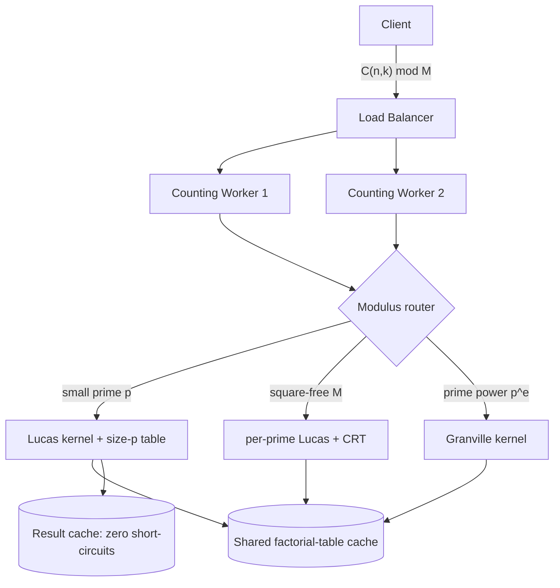
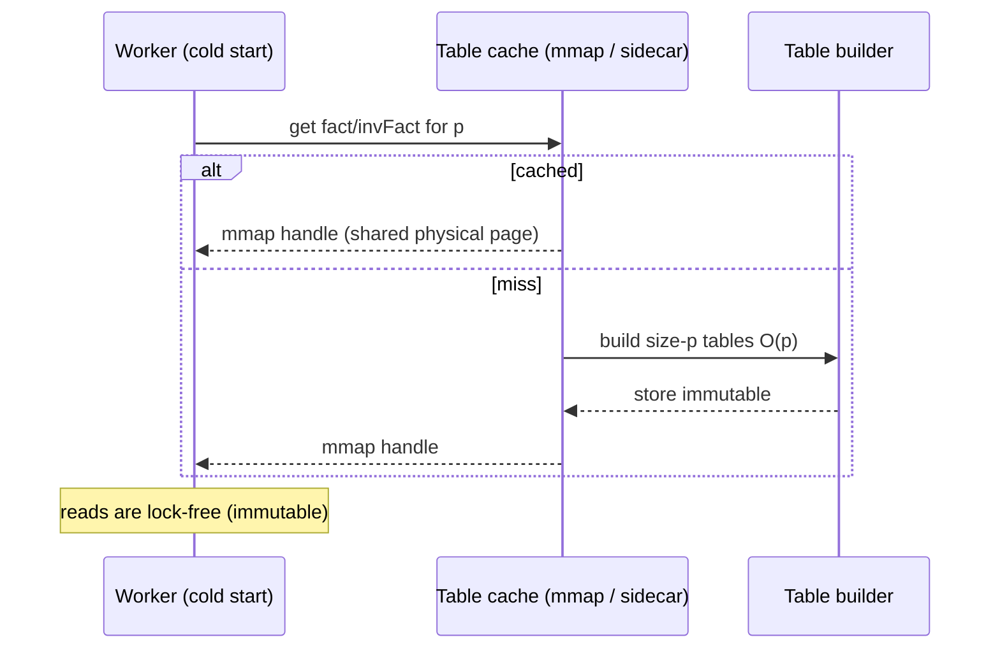
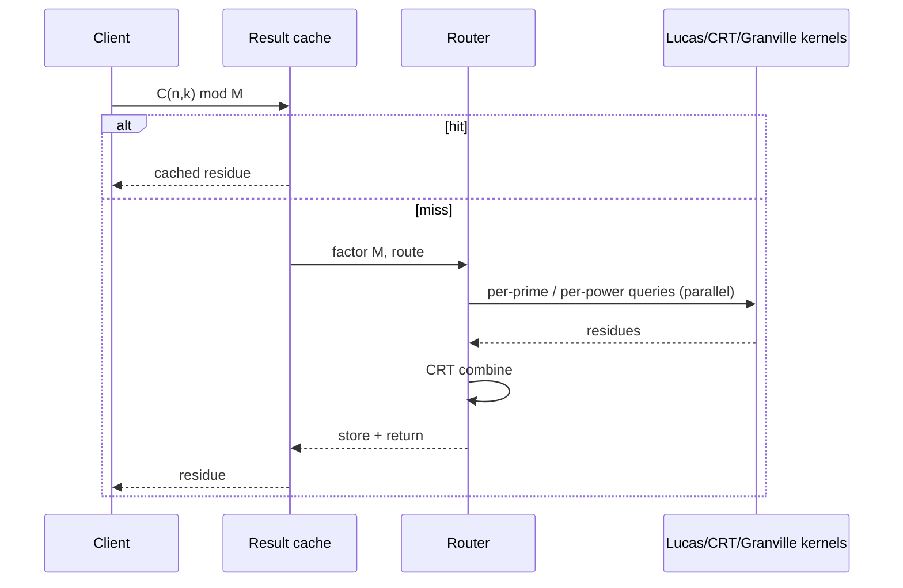
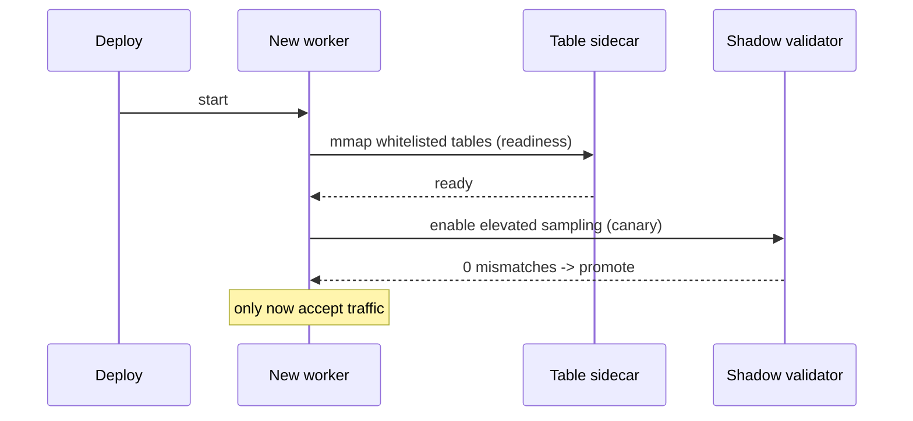

# Lucas' Theorem — Senior Level

> **Focus:** *How do you architect a large-scale counting system around Lucas' theorem?* When a service must answer millions of "how many ways, modulo `M`" queries with arguments up to `10^18`, the senior questions are about **choosing the modulus/prime**, **sharing precomputed factorial tables** across workers, **combining CRT** for composite moduli, **caching** the cheap and short-circuiting the rest, and **observing** correctness and latency in production. This file treats Lucas as an infrastructure component, not just a formula.

---

## Table of Contents

1. [Introduction](#introduction)
2. [System Design: A Combinatorics Service](#system-design-a-combinatorics-service)
3. [Choosing the Prime and the Modulus](#choosing-the-prime-and-the-modulus)
4. [Shared and Sharded Factorial Tables](#shared-and-sharded-factorial-tables)
5. [Combining CRT Across a Composite Modulus](#combining-crt-across-a-composite-modulus)
6. [Comparison with Alternatives](#comparison-with-alternatives)
7. [Architecture Patterns](#architecture-patterns)
8. [Code Examples](#code-examples)
9. [Observability](#observability)
10. [Failure Modes](#failure-modes)
11. [Summary](#summary)

---

## Introduction

A senior engineer rarely computes a single binomial. The real setting is a **counting service**: lattice-path counts, ballot/Catalan-derived quantities, multinomial weights, error-correcting-code sizes, or analytics over enormous combinatorial spaces — all reported *modulo* some `M` because the true integers are too large to transmit. The arguments `n, k` reach `10^18`, the query rate reaches tens of thousands per second, and the answers must be *provably* correct under a fixed modulus.

Lucas' theorem is the kernel that makes this feasible for a **small prime** modulus, and Lucas+CRT (and the Granville extension) handles composite moduli. The senior concerns are systemic:

- The modulus is often *given by the product spec* (e.g. "report mod `142857` for legacy reasons"). You must factor it and route each prime/prime-power to the right kernel.
- A size-`p` factorial table is a **shared, immutable resource**. Who builds it, where does it live, how is it warmed, and what is the memory budget per replica?
- Many queries short-circuit to `0`; a cache and an early-exit path turn those into nanosecond responses.
- Correctness is non-negotiable: a single off-by-one in the digit loop silently corrupts results, so the service needs continuous validation against an oracle.

---

## System Design: A Combinatorics Service



The request path:

1. **Modulus router** factors `M` (cached factorizations) and dispatches each prime factor to a kernel.
2. **Lucas kernel** owns a size-`p` `fact`/`invFact` table per relevant small prime, loaded from a shared cache at startup.
3. **CRT combiner** merges per-prime residues for square-free `M`.
4. **Result cache** memoizes hot `(n, k, M)` triples and serves zero short-circuits instantly.

The factorial tables are **immutable after build** — perfect for read replication and zero-lock sharing.

---

## Choosing the Prime and the Modulus

Often you *cannot* choose the modulus — it is dictated by the problem. But when you can, or when you must factor a given `M`, the choices matter.

| Situation | Decision |
|-----------|----------|
| You control the modulus, want speed | Pick a **small** prime so the size-`p` table is tiny and cache-resident (e.g. `p = 1009`, `9973`). |
| You control it, want a large prime field | Use `10^9 + 7` — but then **Lucas is the wrong tool**; use the `O(n)` factorial table (sibling `23`) if `n` fits. |
| Modulus is a fixed square-free `M` | Factor `M = ∏ p_i`; one Lucas table per distinct prime; CRT to combine. |
| Modulus is a prime power `p^e` | Granville kernel; table grows but stays `O(p^e)` or `O(p)` with care. |
| Modulus is general composite | Factor into prime powers; Granville per power; CRT. |

**Key tension:** Lucas's cost is `O(p + log_p n)`. A *larger* base `p` means *fewer* digits (`log_p n` shrinks) but a *bigger* table (`O(p)` grows). For huge `n` and a fixed memory budget `B`, pick the largest prime whose table fits in `B`; that minimizes the digit count without overflowing memory. In practice the table dominates, so you choose `p` near the memory ceiling.

| Prime `p` | digits for `n = 10^18` | table size | total work |
|-----------|------------------------|------------|-----------|
| 2 | ~60 | 16 B | tiny table, many digits |
| 1009 | ~6 | 16 KB | balanced |
| 10^5 | ~4 | 1.6 MB | few digits, modest table |
| 10^6 | ~3 | 16 MB | fewest digits, large table |

---

## Shared and Sharded Factorial Tables

The size-`p` `fact`/`invFact` arrays are the only nontrivial state. Treat them as a **shared immutable artifact**:

- **Build once at startup** (or lazily on first use per prime), then mark read-only. No locks needed for reads.
- **Replicate, do not recompute.** If many workers need the same prime's table, build it in one place and ship the bytes (e.g. via a sidecar or a memory-mapped file) rather than each worker spending `O(p)`.
- **Memory-map large tables.** For `p` near `10^6`, an mmap'd file lets the OS page-cache share one physical copy across processes on the same host.
- **Warm caches before taking traffic.** A cold worker that builds a 16 MB table on the first request adds a latency spike; warm it in a readiness probe.
- **Bound the set of supported primes.** Do not allow arbitrary user-supplied huge primes to trigger a multi-gigabyte table build — that is a denial-of-service vector (see Failure Modes).



---

## Combining CRT Across a Composite Modulus

For a square-free `M = p_1 · … · p_r`, the service runs `r` independent Lucas queries (parallelizable, one per prime) and merges with CRT. For a general `M`, factor into prime powers `M = ∏ q_j^{e_j}`, run the Granville kernel per power, then CRT.

Architectural points:

- **The per-prime queries are embarrassingly parallel** — fan them out across cores or workers, then reduce via CRT. Latency is `max` over primes, not the sum.
- **Precompute the CRT coefficients** for a fixed `M`: the `M_i = M / p_i` and their inverses depend only on the modulus, not on `(n, k)`. Compute them once when `M` is registered.
- **Distinct-prime requirement is a routing invariant.** The router must never send a non-prime (or a prime power) to the plain Lucas kernel. Enforce this at the factorization step.

---

## Comparison with Alternatives

| Attribute | Lucas kernel | Lucas + CRT | Granville (prime power) | Factorial table (sibling `23`) |
|-----------|--------------|-------------|--------------------------|-------------------------------|
| Modulus | single small prime | square-free composite | prime power | any prime (large ok) |
| Max `n` | 10^18 / bignum | 10^18 / bignum | 10^18 / bignum | ~10^7 |
| Setup memory | O(p) | Σ O(p_i) | O(p) or O(p^e) | O(n) |
| Per-query | O(log_p n) | Σ O(log_{p_i} n) | O(e · log_p n) | O(1) |
| Parallelism | per digit (limited) | **per prime (high)** | per digit | none needed |
| Production usage | counting mod small prime | mod square-free `M` | mod `p^e` quantities | mod `10^9+7` with small `n` |

**Senior takeaway:** the kernels are complementary, selected by `(n, M)`. The service's value is the **router** that picks correctly and the **shared tables** that amortize setup.

---

## Architecture Patterns



- **Zero short-circuit fast path:** before any table work, if `k > n` or any base-`p` digit comparison fails, return `0`. This is the cheapest possible response and very common.
- **Result memoization:** hot `(n, k, M)` triples (e.g. repeated analytics queries) cache well; the answer is a tiny integer.
- **Idempotent, stateless workers:** because tables are immutable, any worker can serve any query; scale horizontally behind a load balancer.

---

## Code Examples

### Thread-safe Lucas service with a shared immutable table

#### Go

```go
package main

import (
	"sync"
)

// LucasTable is an immutable, shareable factorial table for a prime p.
type LucasTable struct {
	p       int64
	fact    []int64
	invFact []int64
}

func powMod(a, e, m int64) int64 {
	a %= m
	if a < 0 {
		a += m
	}
	r := int64(1) % m
	for e > 0 {
		if e&1 == 1 {
			r = r * a % m
		}
		a = a * a % m
		e >>= 1
	}
	return r
}

func buildTable(p int64) *LucasTable {
	fact := make([]int64, p)
	invFact := make([]int64, p)
	fact[0] = 1 % p
	for i := int64(1); i < p; i++ {
		fact[i] = fact[i-1] * i % p
	}
	invFact[p-1] = powMod(fact[p-1], p-2, p)
	for i := p - 1; i > 0; i-- {
		invFact[i-1] = invFact[i] * i % p
	}
	return &LucasTable{p: p, fact: fact, invFact: invFact}
}

// Query is lock-free: the table is immutable after build.
func (t *LucasTable) Query(n, k int64) int64 {
	if k < 0 || k > n {
		return 0
	}
	res := int64(1) % t.p
	for n > 0 || k > 0 {
		ni, ki := n%t.p, k%t.p
		if ki > ni {
			return 0
		}
		res = res * t.fact[ni] % t.p * t.invFact[ki] % t.p * t.invFact[ni-ki] % t.p
		n /= t.p
		k /= t.p
	}
	return res
}

// TableCache builds each prime's table at most once.
type TableCache struct {
	mu     sync.Mutex
	tables map[int64]*LucasTable
}

func NewTableCache() *TableCache { return &TableCache{tables: map[int64]*LucasTable{}} }

func (c *TableCache) Get(p int64) *LucasTable {
	c.mu.Lock()
	t, ok := c.tables[p]
	if !ok {
		t = buildTable(p)
		c.tables[p] = t
	}
	c.mu.Unlock()
	return t // safe to use concurrently — immutable
}
```

#### Java

```java
import java.util.concurrent.ConcurrentHashMap;

public class LucasService {
    public static final class Table {
        final long p;
        final long[] fact, invFact;
        Table(long p) {
            this.p = p;
            fact = new long[(int) p];
            invFact = new long[(int) p];
            fact[0] = 1 % p;
            for (int i = 1; i < p; i++) fact[i] = fact[i - 1] * i % p;
            invFact[(int) p - 1] = powMod(fact[(int) p - 1], p - 2, p);
            for (int i = (int) p - 1; i > 0; i--) invFact[i - 1] = invFact[i] * i % p;
        }
        long query(long n, long k) {              // immutable -> thread-safe reads
            if (k < 0 || k > n) return 0;
            long res = 1 % p;
            while (n > 0 || k > 0) {
                long ni = n % p, ki = k % p;
                if (ki > ni) return 0;
                res = res * fact[(int) ni] % p * invFact[(int) ki] % p
                          * invFact[(int) (ni - ki)] % p;
                n /= p; k /= p;
            }
            return res;
        }
    }

    static long powMod(long a, long e, long m) {
        a %= m; if (a < 0) a += m;
        long r = 1 % m;
        while (e > 0) { if ((e & 1) == 1) r = r * a % m; a = a * a % m; e >>= 1; }
        return r;
    }

    private final ConcurrentHashMap<Long, Table> cache = new ConcurrentHashMap<>();
    public Table table(long p) { return cache.computeIfAbsent(p, Table::new); }
}
```

#### Python

```python
import threading


class LucasTable:
    """Immutable factorial table for a prime p; safe to share across threads."""

    def __init__(self, p):
        self.p = p
        self.fact = [1] * p
        for i in range(1, p):
            self.fact[i] = self.fact[i - 1] * i % p
        self.inv_fact = [1] * p
        self.inv_fact[p - 1] = pow(self.fact[p - 1], p - 2, p)
        for i in range(p - 1, 0, -1):
            self.inv_fact[i - 1] = self.inv_fact[i] * i % p

    def query(self, n, k):
        if k < 0 or k > n:
            return 0
        res = 1 % self.p
        p = self.p
        while n > 0 or k > 0:
            ni, ki = n % p, k % p
            if ki > ni:
                return 0
            res = res * self.fact[ni] % p * self.inv_fact[ki] % p * self.inv_fact[ni - ki] % p
            n //= p
            k //= p
        return res


class TableCache:
    def __init__(self):
        self._lock = threading.Lock()
        self._tables = {}

    def get(self, p):
        with self._lock:
            t = self._tables.get(p)
            if t is None:
                t = LucasTable(p)
                self._tables[p] = t
        return t  # immutable -> reads need no lock
```

**What it does:** a thread-safe cache that builds each prime's factorial table at most once; the immutable tables are then queried concurrently with no read locks.

---

## Capacity Planning and Latency Budget

Sizing a Lucas-based counting service is dominated by two numbers: the **table memory** per supported prime and the **per-query digit count**.

**Memory.** Each prime needs `fact` and `invFact` arrays of `p` `int64` each — `16p` bytes. A whitelist of, say, 20 small primes up to `10^5` costs `20 × 16 × 10^5 ≈ 32 MB` — trivial, and shareable across all workers on a host via mmap. A single prime near `10^6` costs `16 MB`. The budget blows up only if you allow primes near `10^9` (16 GB) — hence the whitelist.

**Latency.** A query is `O(log_p n)` digit iterations after the (amortized) table build. For `n ≤ 10^18` and `p ≥ 1000`, that is `≤ 6` iterations, each a handful of modular multiplies — sub-microsecond in compiled languages. The realistic p99 driver is *not* the math; it is request parsing, the result-cache lookup, and (for composite moduli) the CRT fan-out. Budget accordingly:

| Component | Typical cost | Notes |
|-----------|--------------|-------|
| Parse + validate request | ~1 µs | dominates for tiny math |
| Result-cache lookup | ~1 µs | hot zero short-circuits live here |
| Single Lucas digit walk | < 1 µs | `≤ 6` digits for `n ≤ 10^18`, `p ≥ 1000` |
| CRT fan-out (square-free `M`) | `max` over primes + combine | parallelizable |
| Cold table build (first hit) | `O(p)` ≈ ms | warm in readiness probe |

**Throughput.** With tables warm and immutable, queries are CPU-bound and lock-free, so throughput scales linearly with cores. A single modern core handles millions of `n ≤ 10^18` Lucas queries per second for a moderate prime; the service scales out horizontally behind the load balancer because workers are stateless.

---

## Deployment, Warming, and Rollout

Because the only state is immutable tables, deployment is simple — but the *first request* after a deploy can stall while a big table builds. Senior practices:

- **Warm in the readiness probe.** Build (or mmap) every whitelisted prime's table before the worker reports ready; do not accept traffic until tables are present. This converts a per-request latency spike into a fixed startup cost.
- **Pin tables in a sidecar or shared-memory segment.** One builder process produces the tables; workers map them read-only. A rolling deploy of workers does not rebuild tables.
- **Version the whitelist with the binary.** Adding a new supported prime is a config change that triggers a table build; treat it like a schema migration so capacity is checked first.
- **Canary the Granville path separately.** The prime-power extension has subtle sign logic (see `professional.md` §6.2); roll it out behind a flag and run the shadow validator at elevated sampling during the canary.



---

## A Worked Routing Example

A client asks for `C(n, k) mod 12600` with `n = 10^15`. The router proceeds:

1. **Factor the modulus:** `12600 = 2^3 · 3^2 · 5^2 · 7`. Cached factorization.
2. **Classify each factor:**
   - `2^3 = 8` → prime power, `e = 3` → **Granville kernel** (and note the `p = 2, e ≥ 3` sign rule!).
   - `3^2 = 9` → prime power → **Granville kernel**.
   - `5^2 = 25` → prime power → **Granville kernel**.
   - `7` → prime → **plain Lucas kernel**.
3. **Fan out** four independent queries (parallel), each returning a residue mod its prime power.
4. **CRT-combine** the four residues (precomputed CRT coefficients for `12600`) into the final answer mod `12600`.

The router's correctness invariant: every modulus reaching the *plain Lucas* kernel is a genuine prime, and every set of moduli reaching CRT is pairwise coprime. A misclassification here is the classic silent-wrong-answer bug, so the classification step is unit-tested against a bignum oracle for the whole supported modulus set.

---

## Observability

| Metric | What it tells you | Alert threshold |
|--------|-------------------|-----------------|
| `lucas_query_latency_p99` | tail latency of a single query | > 1 ms |
| `table_build_seconds{p}` | one-time setup cost per prime | > 200 ms (table too large) |
| `zero_shortcircuit_ratio` | fraction returning 0 early | track for cache sizing |
| `result_cache_hit_ratio` | memoization effectiveness | < 0.5 → reconsider keys |
| `crt_combine_errors` | non-coprime moduli reached CRT | **any > 0 is a bug** |
| `table_memory_bytes` | total factorial-table footprint | > 80% of budget |
| `oracle_mismatch_total` | shadow check vs Pascal/bignum disagreed | **any > 0 is a bug** |

A **continuous shadow validator** is the most important signal: periodically pick small `(n, k, p)`, compute via Pascal's triangle or Python bignum, and assert equality with the production kernel. Lucas bugs are silent — a wrong digit loop returns a *plausible* number, not an exception.

---

## Abuse, Input Validation, and Trust Boundaries

A counting service that accepts an arbitrary modulus `M` and arbitrary `n, k` from untrusted callers has a real attack surface — all of it stemming from the `O(p)` (or `O(p^e)`) table build:

- **Large-prime table bomb.** A request with modulus `= 999999937` (a large prime) would trigger a ~16 GB table build. **Defense:** maintain an allow-list of supported primes/moduli; reject anything outside it, or route large primes to a *table-free* path (per-digit on-the-fly inverses, `O(log p · log_p n)` time, `O(1)` space) with a hard `n` cap.
- **Prime-power blow-up.** Modulus `= 2^30` asks for a size-`2^30` Granville table. **Defense:** cap `p^e` (e.g. reject `p^e > 10^7`); the table-free per-digit variant handles larger `p` at higher per-query cost.
- **Pathological argument sizes.** `n` as a 10000-digit bignum is legitimate for Lucas (cost is `O(log_p n)` digits) but the *parser* and the result encoder must bound input length to avoid memory abuse.
- **Factorization cost.** Factoring an adversarial 64-bit `M` is cheap, but a 256-bit `M` is not. **Defense:** bound the modulus bit-length, and cache factorizations.

The trust boundary is the request edge: validate modulus membership, argument bit-length, and `0 ≤ k ≤ n` *before* any table work. The math kernels themselves should assume already-validated inputs.

---

## Distributed CRT and Multi-Region Considerations

For very high query volumes, the per-prime Lucas evaluations of a composite-modulus query can be sharded across machines, with a coordinator performing the final CRT:

- **Sharded fan-out:** route `C(n,k) mod p_i` to the worker that already holds prime `p_i`'s table (consistent hashing on the prime). This keeps each table resident on a fixed set of nodes rather than replicated everywhere — useful when supporting many distinct primes whose total table memory exceeds one host.
- **Coordinator-side CRT:** the coordinator collects the `r` residues and combines them with precomputed CRT coefficients. The CRT step is `O(r)` and stateless.
- **Idempotency for retries:** the computation is pure (no side effects), so a timed-out per-prime query can be retried on any replica holding that prime's table without correctness risk.
- **Consistency:** because tables are immutable and derived solely from `(prime, e)`, every region computes identical results — there is no replication-lag class of bug. The only cross-region concern is the *whitelist/config* version, which should be rolled out atomically.

```mermaid
graph TD
    Coord[Coordinator: C(n,k) mod M] --> A["shard for p1 (holds table p1)"]
    Coord --> B["shard for p2 (holds table p2)"]
    Coord --> C2["shard for p3 (holds table p3)"]
    A --> R[CRT combine on coordinator]
    B --> R
    C2 --> R
    R --> Out[answer mod M]
```

---

## Failure Modes

- **Oversized table from a large prime:** a user-supplied huge prime triggers an `O(p)` multi-GB build → OOM / DoS. **Mitigation:** whitelist supported primes; reject or route large-prime requests to the factorial-table kernel with an `n` bound.
- **Non-coprime CRT inputs:** a prime power slipped into the plain-Lucas/CRT path → wrong answer. **Mitigation:** the router must classify each factor (prime vs prime power) and send powers to Granville; assert pairwise coprimality before CRT.
- **Silent digit-loop bug:** looping while `n > 0` only (dropping high `k` digits) returns wrong values with no error. **Mitigation:** loop `while n > 0 or k > 0`; cover with the shadow validator.
- **Overflow in `fact[i]*j`:** when `p` is pushed large, intermediate products near `p^2` overflow 64-bit. **Mitigation:** keep `p` in the Lucas regime; use 128-bit or reduce frequently.
- **Cold-start latency spike:** first request after deploy builds a big table inline. **Mitigation:** warm tables in the readiness probe; do not serve until built.
- **Cache stampede on a hot miss:** many concurrent misses for the same prime each build the table. **Mitigation:** single-flight build (one builder, others wait) — the `TableCache` lock above does this.

---

## Caching Strategy in Depth

The result cache deserves senior attention because the distribution of Lucas answers is *bimodal*: a large fraction of real queries short-circuit to `0`, and the rest return small integers in `[0, M)`.

- **Cache the zeros aggressively.** A query short-circuits when some base-`p` digit `k_i > n_i`; such inputs are common in sparse counting problems. Caching `(n, k, M) → 0` (or even a Bloom filter of known-zero triples) serves them in nanoseconds.
- **Key normalization.** Use the symmetry `C(n,k) = C(n,n-k)` to canonicalize keys (`k ← min(k, n-k)`), roughly halving the key space.
- **TTL vs immutable.** Results are *mathematically immutable* — `C(n,k) mod M` never changes — so cache entries never expire for correctness reasons; eviction is purely an LRU memory-management decision.
- **Negative-result caching is safe.** Unlike most systems, caching a "this is 0" answer carries no staleness risk.

| Cache layer | Hit characteristic | Eviction |
|-------------|--------------------|----------|
| Zero Bloom filter | short-circuit triples | never (rebuild offline) |
| LRU result cache | hot `(n,k,M)` | LRU by memory budget |
| Factorial table cache | per supported prime | never (immutable, whitelisted) |

---

## Prime-Power (Granville) Path: What a Senior Must Know Operationally

When the modulus has a square factor (`M = p^e · …`, `e ≥ 2`), plain Lucas is *mathematically invalid* — `9` is not prime, so "`C(n,k) mod 9` via Lucas" is a category error. The service must route such factors to the **Granville/Andrew** kernel. The full derivation lives in `professional.md` §6; the senior-level operational facts are:

- **Table size is `O(p^e)`, not `O(p)`.** A factor `2^20` would demand a million-entry coprime-product table. The whitelist and the `p^e ≤ 10^7` cap from the Abuse section apply *to the prime power*, not just the prime.
- **There is a sign trap.** The Wilson-style block sign is `+1` for `2^e` with `e ≥ 3` but `−1` for odd `p^e` and for `p^e = 4` (`professional.md` §6.2). This is the single most common silent bug; it is why the canary in the Rollout section samples the `p = 2, e ≥ 3` and `p^e = 4` cases at elevated rate.
- **`μ = v_p(C(n,k))` is computed from carries (Kummer), independently of the table.** If `μ ≥ e` the answer is `0 mod p^e` and the whole table walk is skipped — another high-value short-circuit to cache.
- **Per-query cost is `O(e · log_p n)`** after the `O(p^e)` build — still tiny per query; the build dominates and must be warmed.

| Modulus shape | Kernel | Build cost | Per-query | Routing invariant |
|---------------|--------|-----------|-----------|-------------------|
| small prime `p` | plain Lucas | `O(p)` | `O(log_p n)` | factor is genuinely prime |
| square-free `M = ∏ p_i` | Lucas + CRT | `Σ O(p_i)` | `Σ O(log_{p_i} n)` | factors pairwise coprime, all prime |
| prime power `p^e` | Granville/Andrew | `O(p^e)` | `O(e·log_p n)` | factor classified as power, not prime |
| general composite | per-power Granville + CRT | `Σ O(p_i^{e_i})` | `Σ O(e_i log n)` | prime-power decomposition correct |

## Precompute Sizing: A Decision Procedure

Given a fixed modulus `M` and a memory budget `B`, a senior sizes the precompute *before* the first deploy, not reactively:

1. **Factor `M = ∏ p_i^{e_i}`** once at registration; cache it.
2. **Sum the table footprints:** plain-prime factors cost `16 p_i` bytes (`fact` + `invFact` as `int64`); prime-power factors cost `≈ 8 p_i^{e_i}` bytes (single coprime-product table `g`). Reject registration if `Σ > B`.
3. **For free-choice moduli**, pick the largest prime whose `16p ≤ B`; this minimizes the digit count `log_p n` (fewer, fatter digits) while staying in budget — the trade restated from the "Choosing the Prime" table.
4. **Decide table-free fallback** for any factor whose table would breach `B`: switch that factor to the on-the-fly inverse path (`O(log p · log_p n)` time, `O(1)` space), accepting slower per-query for zero memory.

This converts an unbounded "build whatever the request asks" liability into a bounded, reviewed capacity decision — the same discipline you would apply to any precomputed index.

## Cross-References

- **`23-binomial-coefficients`** — the sibling on the *unrestricted* `C(n,k) mod p` via an `O(n)` factorial table. That is the right tool when `n` is small enough to tabulate and `p` is large (e.g. `10^9+7`); Lucas is the right tool when `n` is astronomical and `p` is small. The router in this file chooses between them by the `(n, p)` regime — see the comparison table in [Comparison with Alternatives](#comparison-with-alternatives).
- **`06-crt`** — the Chinese Remainder Theorem machinery that the CRT combiner and the distributed coordinator depend on. The pairwise-coprimality invariant the router enforces is exactly CRT's precondition; review `06-crt` for the coefficient precomputation (`M_i = M/p_i` and their inverses) that makes the combine step `O(r)`.

## Summary

At the senior level, Lucas' theorem is an **infrastructure kernel** inside a counting service. The architecture centers on a **modulus router** that factors `M` and dispatches each prime to the right kernel (plain Lucas for a small prime, Lucas+CRT for a square-free composite, Granville for a prime power), backed by **shared immutable factorial tables** that are built once, memory-mapped, replicated, and queried lock-free. Prime choice trades digit count (`log_p n`) against table size (`O(p)`) under a memory budget; per-prime CRT queries fan out in parallel; zero short-circuits and result memoization serve the cheap cases instantly. The defining production risk is *silent incorrectness* — a wrong digit loop or a non-coprime CRT input returns a plausible-but-wrong integer — so a continuous shadow validator against a bignum/Pascal oracle, plus strict routing invariants and prime whitelisting, are the senior's primary safeguards.

---

Next step: continue to [`professional.md`](./professional.md) for the formal proof of Lucas via generating functions and Frobenius, Kummer's carry theorem, the prime-power (Granville/Andrew) extension, and the full complexity analysis.
