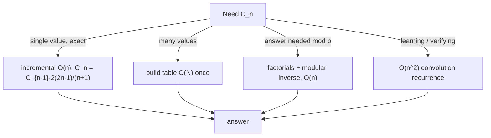

# Catalan Numbers — Junior Level

> **One-line summary:** The Catalan numbers `1, 1, 2, 5, 14, 42, 132, 429, …` are the single most-reused counting sequence in computer science. `C_n` counts the number of ways to *balance* `n` pairs of parentheses, the number of *shapes* of a binary tree with `n` nodes, the number of ways to triangulate a polygon, and dozens of other structures. They satisfy the recurrence `C_{n+1} = Σ C_i · C_{n-i}` and the closed form `C_n = C(2n, n) / (n + 1)`.

---

## Table of Contents

1. [Introduction](#introduction)
2. [Prerequisites](#prerequisites)
3. [Glossary](#glossary)
4. [Core Concepts](#core-concepts)
5. [Big-O Summary](#big-o-summary)
6. [Real-World Analogies](#real-world-analogies)
7. [Pros & Cons](#pros--cons)
8. [Step-by-Step Walkthrough](#step-by-step-walkthrough)
9. [Code Examples](#code-examples)
10. [Coding Patterns](#coding-patterns)
11. [Error Handling](#error-handling)
12. [Performance Tips](#performance-tips)
13. [Best Practices](#best-practices)
14. [Edge Cases & Pitfalls](#edge-cases--pitfalls)
15. [Common Mistakes](#common-mistakes)
16. [Cheat Sheet](#cheat-sheet)
17. [Visual Animation](#visual-animation)
18. [Summary](#summary)
19. [Further Reading](#further-reading)

---

## Introduction

Imagine you are given `n` opening brackets `(` and `n` closing brackets `)`. You want to arrange all `2n` of them in a row so that the result is **balanced** — every `(` has a matching `)` that comes after it, and at no point have you closed more than you have opened. For `n = 3`, the valid arrangements are:

```
((()))   (()())   (())()   ()(())   ()()()
```

There are exactly **5** of them. Not 6, not 4 — exactly 5. If you ask the same question for `n = 4`, the answer is **14**. For `n = 5`, it is **42**. These numbers `1, 1, 2, 5, 14, 42, 132, …` are the **Catalan numbers**, written `C_0, C_1, C_2, …`.

What makes them special is that the *same* sequence answers a startling number of seemingly unrelated questions:

- How many different **shapes** can a binary tree with `n` nodes have? `C_n`.
- How many ways can you cut a convex polygon with `n + 2` sides into triangles using non-crossing diagonals? `C_n`.
- How many **monotonic lattice paths** from one corner of an `n × n` grid to the opposite corner stay below the diagonal? `C_n`.
- How many ways can `n + 1` numbers be multiplied with different parenthesizations? `C_n`.

When you learn to *recognize* that a counting problem is "secretly" a Catalan problem, you replace a slow brute-force search with a single formula. That recognition skill is the real payoff of this topic. This file teaches you the two ways to compute `C_n` — the **recurrence** and the **closed form** — and shows you the most important interpretation, balanced parentheses, in full.

There are two formulas you will use constantly:

> **Recurrence:** `C_0 = 1`, and `C_{n+1} = C_0·C_n + C_1·C_{n-1} + … + C_n·C_0 = Σ_{i=0}^{n} C_i · C_{n-i}`.
>
> **Closed form:** `C_n = C(2n, n) / (n + 1) = (2n)! / ((n+1)! · n!)`.

The recurrence builds each Catalan number from all the smaller ones; the closed form jumps straight to the answer using binomial coefficients (sibling `23-binomial-coefficients`).

---

## Prerequisites

Before reading this file you should be comfortable with:

- **Basic combinatorics** — what a "choose" / binomial coefficient `C(n, k) = n! / (k!(n-k)!)` means. See sibling `23-binomial-coefficients`.
- **Factorials** — `n! = 1·2·3·⋯·n`, and that they grow extremely fast.
- **Recursion and loops** — reading a `for` loop and a recursive function in Go/Java/Python.
- **Big-O notation** — `O(n)`, `O(n²)`.

Optional but helpful:

- A glance at **binary trees** (sibling section on trees) — the "tree shape" interpretation is the most intuitive one.
- The idea of a **2D grid path** moving only right and up — used for the Dyck-path interpretation.

---

## Glossary

| Term | Meaning |
|------|---------|
| **Catalan number `C_n`** | The `n`-th term of the sequence `1, 1, 2, 5, 14, 42, …`; counts many "balanced" or "non-crossing" structures. |
| **Balanced parentheses** | A string of `(` and `)` where every prefix has at least as many `(` as `)`, and the totals are equal. |
| **Binomial coefficient `C(n, k)`** | The number of ways to choose `k` items from `n`; equals `n! / (k!(n-k)!)`. |
| **Recurrence (convolution)** | A formula for `C_{n+1}` as a sum of products of smaller Catalan numbers. |
| **Closed form** | A direct formula `C_n = C(2n, n)/(n+1)` needing no smaller terms. |
| **Dyck path** | A lattice path of up-steps and down-steps that never goes below where it started — the path form of balanced parentheses. |
| **Full binary tree** | A tree where every node has either 0 or 2 children. |
| **Triangulation** | A way to split a polygon into triangles using non-crossing diagonals. |
| **Modular arithmetic** | Doing arithmetic "mod `p`" so numbers stay small; needed because `C_n` overflows fast. See sibling `02-modular-arithmetic`. |

---

## Core Concepts

### 1. The sequence and the two indices that confuse everyone

The Catalan numbers are:

```
n:    0   1   2   3    4    5     6      7       8        9
C_n:  1   1   2   5   14   42   132    429    1430     4862
```

Note `C_0 = 1` and `C_1 = 1` are **both** equal to `1` — this trips up beginners. Always anchor on `C_0 = 1` (the empty structure: zero pairs of parentheses, the empty tree, etc., has exactly one arrangement).

### 2. The recurrence — building `C_n` from smaller ones

The defining recurrence is a **convolution**:

```
C_0 = 1
C_{n+1} = Σ_{i=0}^{n} C_i · C_{n-i}
```

Why does this work for balanced parentheses? Take any balanced string of `n + 1` pairs. Look at the *first* `(`. It must close at some matching `)`. Everything **inside** that pair is a balanced string of `i` pairs, and everything **after** that pair is a balanced string of `n - i` pairs. As `i` ranges over `0, 1, …, n`, you cover every possibility exactly once:

```
( A ) B      where A has i pairs, B has n - i pairs
```

So `C_{n+1} = Σ_i C_i · C_{n-i}` — the number of choices for `A` times the number of choices for `B`, summed over the split point. This "first-return decomposition" is the heart of *every* Catalan interpretation.

### 3. The closed form — jumping straight to the answer

```
C_n = C(2n, n) / (n + 1) = (2n)! / ((n+1)! · n!)
```

There is also a subtraction form (which the professional file derives via the reflection principle):

```
C_n = C(2n, n) − C(2n, n + 1)
```

Both give the same value. The closed form is faster (`O(n)` to build a binomial) than running the full `O(n²)` recurrence, but it requires care because `(2n)!` overflows even 64-bit integers quickly.

### 4. Balanced parentheses — the canonical interpretation

A string of `n` `(` and `n` `)` is **balanced** if:

1. Reading left to right, the count of `(` is *always* ≥ the count of `)`.
2. At the end, the counts are equal (both `n`).

`C_n` is exactly the number of balanced strings with `n` pairs. This is the example to keep in your head: it is concrete, easy to enumerate by hand for small `n`, and directly explains the recurrence (concept 2).

### 5. The same number, many disguises

Here is the magic. Each of these is counted by `C_n`:

| Structure | What `n` means | `C_3 = 5` example |
|-----------|----------------|-------------------|
| Balanced parentheses | `n` pairs | `((()))`, `(()())`, `(())()`, `()(())`, `()()()` |
| Binary tree shapes | `n` internal nodes | 5 distinct tree shapes with 3 nodes |
| Polygon triangulations | polygon with `n + 2` sides | 5 ways to triangulate a pentagon |
| Mountain ranges / Dyck paths | `n` up-strokes | 5 paths that never dip below the start |

The middle file (`middle.md`) explores this "interpretation zoo" in detail. For now, just internalize: **if a counting answer comes out `1, 1, 2, 5, 14, 42, …`, suspect Catalan.**

---

## Big-O Summary

| Operation | Time | Space | Notes |
|-----------|------|-------|-------|
| `C_n` via recurrence (one value, needs all smaller) | **O(n²)** | O(n) | Convolution: a double loop. |
| `C_0 … C_n` via recurrence (all values) | **O(n²)** | O(n) | Same cost gives the whole table. |
| `C_n` via closed form `C(2n,n)/(n+1)` | **O(n)** | O(1) | Build the binomial multiplicatively. |
| `C_n` via incremental form `C_n = C_{n-1}·(2(2n-1))/(n+1)` | **O(n)** | O(1) | Cheapest for a single value. |
| `C_n mod p` (prime `p`) | **O(n)** + inverse | O(n) | Needs factorials + modular inverse (sibling `33-factorial-mod-p`). |
| Enumerate all balanced strings | O(C_n · n) | O(n) | Output-sensitive; `C_n` grows ~ `4^n / n^{1.5}`. |

The headline: the **recurrence is `O(n²)`** (it sums `n` products for each term), while the **closed form is `O(n)`**. Both are far faster than brute-force enumeration, which is exponential.

---

## Real-World Analogies

| Concept | Analogy |
|---------|---------|
| Balanced parentheses | A valid sequence of "open a folder / close a folder" actions where you never close a folder you didn't open. |
| The recurrence split | Cutting a long balanced string at the spot where the *first* opened bracket finally closes — splitting one big problem into two smaller independent ones. |
| Binary tree shapes | The number of distinct "family tree" silhouettes you can draw with `n` branch-points. |
| Dyck path / mountain range | A hiker who starts and ends at sea level, only steps up or down, and is never allowed to go below sea level. |
| Polygon triangulation | Slicing a pizza shaped like a polygon into triangular pieces using straight cuts between corners that never cross. |
| Catalan growth `~ 4^n` | Each extra pair roughly *quadruples* the count — the structures explode in number, which is why brute force is hopeless. |

Where the analogies break: the "folder" picture suggests order matters in a simple way, but the deep content is the *non-crossing / never-go-negative* constraint, which is what makes the count Catalan rather than a plain `4^n`.

---

## Pros & Cons

| Pros | Cons |
|------|------|
| One sequence answers dozens of counting problems — huge reuse. | The two indices (`C_0 = C_1 = 1`) and "`n` pairs vs `n+2` sides" cause off-by-one bugs. |
| Closed form computes `C_n` in `O(n)`. | `C_n` overflows 64-bit integers around `n = 33`; you need big integers or `mod p`. |
| Recurrence is easy to code and to reason about. | The recurrence is `O(n²)` — slower than the closed form for a single value. |
| Recognizing "this is Catalan" turns exponential brute force into a formula. | Recognition is a skill; many problems hide the Catalan structure. |
| Modular version fits perfectly with competitive-programming `mod 10^9+7`. | Modular division requires a modular inverse, not plain `/`. |

**When to use:** counting balanced/non-crossing/nested structures, counting binary tree or BST shapes, validating that an enumeration count is correct, any "number of ways to fully parenthesize / triangulate / stack" problem.

**When NOT to use:** when the structures are *not* subject to a balance/non-crossing constraint (then the count is usually a plain power or factorial, not Catalan), or when you need the actual structures, not just the count (then you enumerate, you don't just compute `C_n`).

---

## Step-by-Step Walkthrough

**Goal:** compute `C_4` three ways and confirm they all give `14`.

**Step 1 — By the recurrence.** We already know `C_0 = 1, C_1 = 1, C_2 = 2, C_3 = 5`. Apply `C_4 = Σ_{i=0}^{3} C_i · C_{3-i}`:

```
C_4 = C_0·C_3 + C_1·C_2 + C_2·C_1 + C_3·C_0
    = 1·5 + 1·2 + 2·1 + 5·1
    = 5 + 2 + 2 + 5
    = 14.
```

Notice the sum is symmetric (`5, 2, 2, 5`) — that mirror pattern is a good sanity check.

**Step 2 — By the closed form.** `C_4 = C(8, 4) / 5`. Compute `C(8,4) = 8! / (4!·4!) = 70`. Then `70 / 5 = 14`. ✓

**Step 3 — By the subtraction form.** `C_4 = C(8, 4) − C(8, 5) = 70 − 56 = 14`. ✓

**Step 4 — Sanity-check via balanced parentheses for `C_3 = 5`.** List every balanced string of 3 pairs:

```
((()))   (()())   (())()   ()(())   ()()()
```

Count them: `5`. Matches `C_3 = 5`. ✓

**Step 5 — Verify the recurrence split on one example.** Take `(())()` (a string of 3 pairs). Its first `(` closes after `(())`, so the inside is `()` (`i = 1` pair) and the outside-after is `()` (`n - i = 1` pair). This is one of the `C_1 · C_1 = 1` strings in the `i = 1` term of `C_3 = C_0C_2 + C_1C_1 + C_2C_0 = 2 + 1 + 2 = 5`. ✓

Every Catalan computation reduces to one of these three formulas plus an off-by-one check on the index.

---

## Code Examples

### Example: Three ways to compute `C_n`

This computes the `n`-th Catalan number by (a) the `O(n²)` recurrence, (b) the `O(n)` closed form, and (c) the `O(n)` incremental form.

#### Go

```go
package main

import "fmt"

// catalanDP computes C_n via the convolution recurrence in O(n^2).
func catalanDP(n int) int64 {
	c := make([]int64, n+1)
	c[0] = 1
	for k := 1; k <= n; k++ {
		var sum int64
		for i := 0; i < k; i++ {
			sum += c[i] * c[k-1-i] // C_k = Σ C_i · C_{k-1-i}
		}
		c[k] = sum
	}
	return c[n]
}

// catalanClosed computes C_n = C(2n, n) / (n+1) in O(n).
func catalanClosed(n int) int64 {
	// Build C(2n, n) multiplicatively to delay overflow.
	var result int64 = 1
	for i := 0; i < n; i++ {
		result = result * int64(2*n-i) / int64(i+1)
	}
	return result / int64(n+1)
}

// catalanIncremental uses C_n = C_{n-1} * 2*(2n-1) / (n+1).
func catalanIncremental(n int) int64 {
	var c int64 = 1 // C_0
	for k := 1; k <= n; k++ {
		c = c * int64(2*(2*k-1)) / int64(k+1)
	}
	return c
}

func main() {
	for n := 0; n <= 10; n++ {
		fmt.Printf("C_%d = %d / %d / %d\n",
			n, catalanDP(n), catalanClosed(n), catalanIncremental(n))
	}
	// All three columns agree: 1 1 2 5 14 42 132 429 1430 4862 16796
}
```

#### Java

```java
public class Catalan {
    // O(n^2) convolution recurrence.
    static long catalanDP(int n) {
        long[] c = new long[n + 1];
        c[0] = 1;
        for (int k = 1; k <= n; k++) {
            long sum = 0;
            for (int i = 0; i < k; i++) sum += c[i] * c[k - 1 - i];
            c[k] = sum;
        }
        return c[n];
    }

    // O(n) closed form C(2n, n) / (n+1).
    static long catalanClosed(int n) {
        long result = 1;
        for (int i = 0; i < n; i++) {
            result = result * (2L * n - i) / (i + 1);
        }
        return result / (n + 1);
    }

    // O(n) incremental form.
    static long catalanIncremental(int n) {
        long c = 1;
        for (int k = 1; k <= n; k++) {
            c = c * (2L * (2 * k - 1)) / (k + 1);
        }
        return c;
    }

    public static void main(String[] args) {
        for (int n = 0; n <= 10; n++) {
            System.out.printf("C_%d = %d / %d / %d%n",
                n, catalanDP(n), catalanClosed(n), catalanIncremental(n));
        }
    }
}
```

#### Python

```python
from math import comb


def catalan_dp(n):
    """O(n^2) convolution recurrence."""
    c = [0] * (n + 1)
    c[0] = 1
    for k in range(1, n + 1):
        c[k] = sum(c[i] * c[k - 1 - i] for i in range(k))
    return c[n]


def catalan_closed(n):
    """O(n) closed form C(2n, n) / (n+1). Python ints never overflow."""
    return comb(2 * n, n) // (n + 1)


def catalan_incremental(n):
    """O(n) incremental form C_n = C_{n-1} * 2*(2n-1) / (n+1)."""
    c = 1  # C_0
    for k in range(1, n + 1):
        c = c * 2 * (2 * k - 1) // (k + 1)
    return c


if __name__ == "__main__":
    for n in range(11):
        print(f"C_{n} = {catalan_dp(n)} / {catalan_closed(n)} / {catalan_incremental(n)}")
    # 1 1 2 5 14 42 132 429 1430 4862 16796
```

**What it does:** prints `C_0 … C_10` computed three independent ways; all columns match, which is the simplest correctness check.
**Run:** `go run main.go` | `javac Catalan.java && java Catalan` | `python catalan.py`

---

## Coding Patterns

### Pattern 1: Brute-force enumerate balanced parentheses (the oracle)

**Intent:** Before trusting a formula, *count* the balanced strings directly and confirm the total equals `C_n`.

```python
def count_balanced(n):
    """Count balanced strings of n pairs by recursive enumeration."""
    def gen(open_left, close_left, balance):
        if open_left == 0 and close_left == 0:
            return 1
        total = 0
        if open_left > 0:                      # place a '('
            total += gen(open_left - 1, close_left, balance + 1)
        if close_left > 0 and balance > 0:     # place a ')' only if it stays valid
            total += gen(open_left, close_left - 1, balance - 1)
        return total
    return gen(n, n, 0)


# count_balanced(3) == 5 == C_3, count_balanced(4) == 14 == C_4
```

This is exponential — fine only as a small-`n` correctness oracle. The fast formulas must match it.

### Pattern 2: Closed form built multiplicatively (avoid huge factorials)

**Intent:** Never compute `(2n)!` directly; interleave multiply and divide so the running value stays small.

```python
def catalan(n):
    c = 1
    for i in range(n):
        c = c * (2 * n - i) // (i + 1)   # builds C(2n, n) step by step
    return c // (n + 1)
```

### Pattern 3: Build the whole table for repeated queries

**Intent:** If you need many Catalan numbers, compute the table once.

```python
def catalan_table(N):
    c = [0] * (N + 1)
    c[0] = 1
    for k in range(1, N + 1):
        c[k] = c[k - 1] * 2 * (2 * k - 1) // (k + 1)
    return c
```



---

## Error Handling

| Error | Cause | Fix |
|-------|-------|-----|
| `C_n` is negative / nonsense | 64-bit overflow (around `n = 33`). | Use big integers, or compute `C_n mod p`. |
| Off-by-one: got `C_{n-1}` or `C_{n+1}` | Confused "`n` pairs" with "`n+1` leaves" or "polygon with `n+2` sides". | Pin down what `n` counts; verify with a tiny hand example. |
| Division gives wrong value | Divided before the running product was a multiple of the divisor. | Build `C(2n,n)` multiplicatively so each `/ (i+1)` is exact. |
| Modular `/` gives garbage | Used integer `/` under `mod p` instead of a modular inverse. | Multiply by the modular inverse of `(n+1)`; see sibling `33-factorial-mod-p`. |
| Recurrence indexes out of range | Wrote `c[k-i]` instead of `c[k-1-i]`. | The convolution for `C_k` uses indices summing to `k-1`. |
| Stack overflow in recursion | Recursive enumeration for large `n`. | Use the iterative formula; only enumerate for small `n`. |

---

## Performance Tips

- **Prefer the incremental closed form** `C_n = C_{n-1}·2(2n-1)/(n+1)` for a single value — it is `O(n)` with `O(1)` extra space.
- **Build binomials multiplicatively** — alternate `*` and `/` so the running value never exceeds the final answer's magnitude, delaying overflow.
- **Compute the table once** if you will query many `C_n` values.
- **Switch to `mod p` early** when `n` is large — exact `C_n` needs big integers past `n ≈ 33`, but `C_n mod p` stays in a machine word (sibling `02-modular-arithmetic`).
- **Never brute-force enumerate** to *count*; enumeration is only for generating the structures or as a small-`n` oracle.

---

## Best Practices

- State clearly what your `n` indexes (pairs of brackets? tree nodes? polygon sides minus two?). Most Catalan bugs are off-by-one in this mapping.
- Memorize the first several values `1, 1, 2, 5, 14, 42, 132` so you instantly recognize the sequence in an answer.
- Cross-check two formulas (recurrence vs closed form) on small `n` before trusting either at scale.
- For exact large values use a big-integer type (Java `BigInteger`, Python native `int`, Go `math/big`).
- For modular answers, divide by `(n+1)` using a **modular inverse**, never integer division.

---

## Edge Cases & Pitfalls

- **`C_0 = 1`** (the empty structure has exactly one arrangement), not `0`. The recurrence depends on this base case.
- **`C_0 = C_1 = 1`** — two consecutive `1`s at the start; do not assume the sequence is strictly increasing from index 0.
- **Overflow** — `C_33 ≈ 1.9 × 10^18` is near the `int64` limit; `C_35` overflows. Plan for big integers or modular arithmetic.
- **Polygon indexing** — a polygon with `s` sides is triangulated in `C_{s-2}` ways (a pentagon, `s = 5`, gives `C_3 = 5`). Off-by-two is common.
- **Binary tree vs full binary tree** — `C_n` counts binary tree *shapes* with `n` nodes, and also full binary trees with `n + 1` leaves; know which one your `n` is.
- **Modular division** — `C(2n,n)/(n+1) mod p` must use the inverse of `(n+1)`; plain `/` is wrong under a modulus.

---

## Common Mistakes

1. **Treating the count as `4^n`** — there are `C(2n,n)` total strings of `n` `(` and `n` `)`, but only `C_n` are *balanced*. The balance constraint shrinks the count.
2. **Off-by-one on the index** — computing `C_{n-1}` or `C_{n+1}` because the problem's `n` does not equal the Catalan index. Always map carefully.
3. **Computing `(2n)!` directly** — it overflows almost immediately; build the binomial multiplicatively instead.
4. **Using integer `/` under a modulus** — modular division needs a modular inverse of `(n+1)`.
5. **Forgetting `C_0 = 1`** — seeding the recurrence with `C_0 = 0` makes every value `0`.
6. **Wrong convolution indices** — `C_k = Σ_{i=0}^{k-1} C_i · C_{k-1-i}`; the two indices must sum to `k - 1`, not `k`.
7. **Brute-forcing the count** — exponential enumeration when an `O(n)` formula exists.

---

## Cheat Sheet

| Question | Tool | Formula |
|----------|------|---------|
| `n`-th Catalan, single value | incremental | `C_n = C_{n-1}·2(2n-1)/(n+1)`, `C_0 = 1` |
| `n`-th Catalan, closed form | binomial | `C_n = C(2n,n)/(n+1)` |
| `n`-th Catalan, subtraction form | binomial | `C_n = C(2n,n) − C(2n,n+1)` |
| Build `C_{n+1}` from smaller | recurrence | `C_{n+1} = Σ_{i=0}^{n} C_i·C_{n-i}` |
| Balanced strings of `n` pairs | interpretation | `C_n` |
| Binary tree shapes, `n` nodes | interpretation | `C_n` |
| Triangulations of `s`-gon | interpretation | `C_{s-2}` |
| `C_n mod p` (prime) | factorials + inverse | `(2n)! · inv((n+1)!) · inv(n!) mod p` |
| First values | memorize | `1, 1, 2, 5, 14, 42, 132, 429` |

Core routine:

```
catalan(n):                         # O(n)
    c = 1                           # C_0
    for k = 1..n:
        c = c * 2*(2k-1) / (k+1)
    return c
```

---

## Visual Animation

> See [`animation.html`](./animation.html) for an interactive visualization.
>
> The animation demonstrates:
> - A **Dyck path** drawn as a mountain range, with each `(` an up-step and each `)` a down-step, highlighting that the path never dips below the start line — the visual meaning of "balanced".
> - The **convolution recurrence** building `C_n` from `C_0 … C_{n-1}`, showing each `C_i · C_{n-1-i}` term light up and accumulate.
> - A **toggle between interpretations** (balanced parentheses, binary tree shapes, polygon triangulations) for the same small `n`.
> - Controls (Start / Step / Reset), a speed slider, an info panel, a Big-O table, and an operation log.

---

## Summary

The Catalan numbers `1, 1, 2, 5, 14, 42, 132, …` count an astonishing range of "balanced" and "non-crossing" structures: balanced parentheses, binary tree shapes, polygon triangulations, and Dyck paths, all the *same* sequence. The two formulas you need are the **convolution recurrence** `C_{n+1} = Σ_{i=0}^{n} C_i·C_{n-i}` (built from the first-return decomposition, `O(n²)`) and the **closed form** `C_n = C(2n,n)/(n+1)` (`O(n)`, also written `C(2n,n) − C(2n,n+1)`). Compute single values with the incremental form `C_n = C_{n-1}·2(2n-1)/(n+1)`. Watch two recurring traps: **overflow** past `n ≈ 33` (use big integers or `mod p`) and **off-by-one** in mapping the problem's `n` to the Catalan index. The real skill is *recognition*: when a count comes out `1, 1, 2, 5, 14, 42`, you are almost certainly looking at a Catalan structure.

---

## Further Reading

- *Enumerative Combinatorics, Vol. 2* (Stanley) — the famous "Catalan addendum" lists 200+ interpretations.
- Sibling topic `23-binomial-coefficients` — the `C(2n, n)` that the closed form is built on.
- Sibling topic `24-lucas-theorem` — computing binomials mod a prime, useful for `C_n mod p`.
- Sibling topic `33-factorial-mod-p` — factorials and inverses for modular Catalan numbers.
- Sibling topic `02-modular-arithmetic` — the modular machinery for large `n`.
- Sibling section `13-dynamic-programming` — the convolution recurrence is a textbook DP; BST-counting (interval DP) is a Catalan problem.
- OEIS sequence A000108 — the Catalan numbers and their generating function.

---

Next step: continue to [`middle.md`](./middle.md) for the full interpretation zoo, modular computation, and how to recognize Catalan structure inside a problem.
