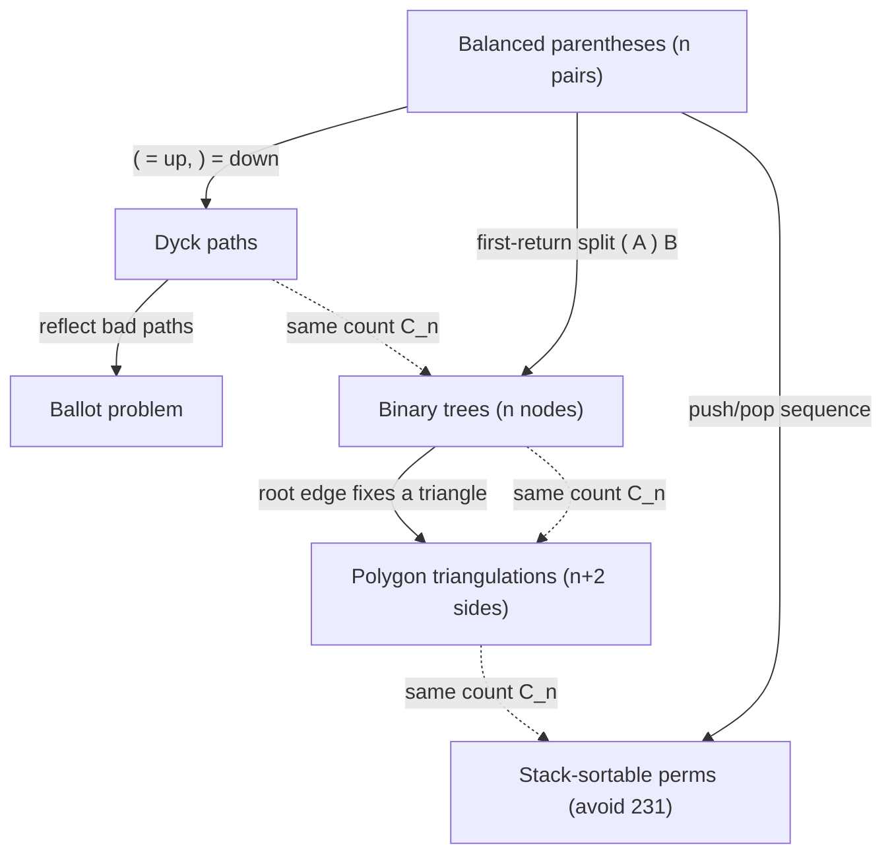

# Catalan Numbers — Middle Level

> **Focus:** *Why* the same number `C_n` counts so many different structures, *when* to reach for it, and *how* to compute it correctly — including the full **interpretation zoo** (balanced parens, full binary trees / BST shapes, triangulations, Dyck paths / ballot problem, non-crossing partitions, stack-sortable permutations), the **modular computation** with factorials and inverses, and a checklist for **recognizing Catalan** hidden inside a problem.

---

## Table of Contents

1. [Introduction](#introduction)
2. [Deeper Concepts](#deeper-concepts)
3. [The Interpretation Zoo](#the-interpretation-zoo)
4. [Bijections: Why They Are All the Same Number](#bijections-why-they-are-all-the-same-number)
5. [Comparison with Alternatives](#comparison-with-alternatives)
6. [Modular Computation of `C_n`](#modular-computation-of-c_n)
7. [Dynamic Programming Integration](#dynamic-programming-integration)
8. [Recognizing Catalan in a Problem](#recognizing-catalan-in-a-problem)
9. [Code Examples](#code-examples)
10. [Error Handling](#error-handling)
11. [Performance Analysis](#performance-analysis)
12. [Best Practices](#best-practices)
13. [Visual Animation](#visual-animation)
14. [Summary](#summary)

---

## Introduction

At junior level the message was two formulas: the recurrence `C_{n+1} = Σ C_i C_{n-i}` and the closed form `C_n = C(2n,n)/(n+1)`. At middle level you turn those into engineering judgment:

- *Why* do balanced parentheses, binary trees, triangulations, and lattice paths all yield the **same** sequence? (Answer: explicit bijections — structure-preserving one-to-one maps.)
- *When* should you suspect a counting problem is Catalan, and how do you confirm it cheaply?
- *How* do you compute `C_n mod p` correctly, since the closed form needs *division* by `(n+1)` and you cannot divide under a modulus without a modular inverse?
- *Where* does the recurrence become a real dynamic-programming algorithm (counting BST shapes, optimal triangulation skeleton)?

The dividing line between "I memorized the sequence" and "I can solve Catalan problems" is the ability to **map an unfamiliar structure onto a known interpretation** and then apply the formula with the indices lined up correctly.

---

## Deeper Concepts

### The first-return decomposition is universal

Every Catalan recurrence is the *same* idea applied to a different structure: find the *first* place a structure "closes back to the baseline", split there, and the two pieces are independent smaller instances.

| Structure | "First return" cut | Left piece | Right piece |
|-----------|--------------------|------------|-------------|
| Balanced parens | where the first `(` closes | inside that pair | everything after |
| Dyck path | first return to the x-axis | the arch above | the rest of the path |
| Binary tree | the root | left subtree | right subtree |
| Triangulation | the triangle on a fixed edge | polygon on one side | polygon on the other |

In each case the count is `Σ_i C_i · C_{n-1-i}` — a **convolution**. That single structural fact is *why* one sequence serves them all.

### Generating function (the algebraic shadow of the recurrence)

Let `c(x) = Σ_{n≥0} C_n x^n`. The convolution recurrence `C_{n+1} = Σ_i C_i C_{n-i}` translates into a clean quadratic equation:

```
c(x) = 1 + x · c(x)^2.
```

The `1` is `C_0`; the `x·c(x)^2` encodes "an opening bracket, then two independent Catalan structures". Solving the quadratic for `c(x)` gives a closed form whose Taylor coefficients are exactly `C(2n,n)/(n+1)`. The full derivation lives in [`professional.md`](./professional.md); the takeaway here is that **`c(x) = 1 + x c(x)^2` is the recurrence in one line**, and it is the cleanest proof that the closed form and the recurrence agree.

### Two closed forms, one value

```
C_n = C(2n, n) / (n + 1)            (division form)
C_n = C(2n, n) − C(2n, n + 1)       (subtraction form)
```

The subtraction form is the **reflection-principle** result (professional file): out of all `C(2n,n)` lattice paths, the *bad* ones (those that cross the diagonal) are in bijection with paths counted by `C(2n,n+1)`, so the good ones number `C(2n,n) − C(2n,n+1)`. For modular computation the subtraction form is sometimes handier because it avoids dividing by `(n+1)`.

### Asymptotic growth

```
C_n ~ 4^n / (n^{3/2} · √π).
```

Each extra unit of `n` multiplies the count by roughly `4` (with a polynomial correction). This is why brute-force enumeration is hopeless for large `n` and why you must compute, not enumerate. The derivation (Stirling's approximation applied to `C(2n,n)`) is in the professional file.

---

## The Interpretation Zoo

All of the following are counted by `C_n`. Internalizing this list is the core middle-level skill.

### 1. Balanced parentheses (`n` pairs)

Strings of `n` `(` and `n` `)` where every prefix has `#( ≥ #)`. The canonical interpretation — `C_3 = 5`: `((()))`, `(()())`, `(())()`, `()(())`, `()()()`. The prefix condition is what excludes the other `C(6,3) − 5 = 15` arrangements of three `(` and three `)` (e.g. `())(()` fails at position 3 where `#) > #(`). That `5` out of `20` ratio is exactly `1/(n+1) = 1/4` of the unconstrained count — the Catalan "pruning fraction" made concrete.

### 2. Full binary trees (`n + 1` leaves) and binary tree shapes (`n` nodes)

- The number of **binary tree shapes** with `n` internal nodes is `C_n`.
- The number of **full binary trees** (every node has 0 or 2 children) with `n + 1` leaves is `C_n`.
- The number of distinct **binary search tree** shapes storing `n` distinct keys is `C_n` (the shape is determined by the choice of root and recursively the subtrees — exactly the convolution).

This last one is the bridge to dynamic programming: counting BST shapes is the textbook Catalan DP (see [Dynamic Programming Integration](#dynamic-programming-integration)).

### 3. Polygon triangulations (`n + 2` sides)

The number of ways to cut a convex polygon with `n + 2` vertices into triangles using non-crossing diagonals is `C_n`. A pentagon (`5 = 3 + 2` sides) has `C_3 = 5` triangulations. This is Euler's original motivation for the sequence.

### 4. Dyck paths / the ballot problem (reflection principle)

A **Dyck path** is a lattice path from `(0,0)` to `(2n, 0)` using up-steps `(+1,+1)` and down-steps `(+1,−1)` that never goes below the x-axis. There are `C_n` of them. Equivalently, monotonic paths in an `n × n` grid from corner to corner that stay weakly below the diagonal. The **ballot problem** ("candidate A is never behind candidate B as votes are counted") is the same count, and the **reflection principle** that solves it gives the subtraction-form closed form.

### 5. Non-crossing partitions and non-crossing chords

The number of ways to connect `2n` points on a circle with `n` non-crossing chords is `C_n`. The number of non-crossing partitions of `n` points on a line is also `C_n`. The "non-crossing" constraint is the geometric face of the "balance" constraint.

### 6. Stack-sortable permutations

A permutation of `1…n` is **stack-sortable** (can be sorted to `1…n` using a single stack with the right sequence of pushes and pops) if and only if it avoids the pattern `231`. The number of such permutations is `C_n`. Each push/pop sequence is a balanced-parenthesis string — the bijection is direct.

### 7. Mountain ranges, handshakes, and more

`n` people around a table shaking hands across the table with no crossing arms: `C_n`. Ways to stack coins in a triangular pyramid with a base of `n` coins: `C_{n-1}`. The list runs to hundreds of entries (Stanley's *Enumerative Combinatorics* catalogs over 200).

### The index map — the one table that prevents off-by-ones

The single most common Catalan bug is using the wrong index. Each interpretation phrases its "size" differently; pin the mapping before computing:

| Interpretation | Problem's "size" | Catalan index | `n=3` value is `C_3 = 5` for… |
|----------------|------------------|---------------|--------------------------------|
| Balanced parentheses | `n` pairs | `C_n` | 3 pairs |
| Binary tree shapes | `n` nodes | `C_n` | 3 nodes |
| Full binary trees | `m` leaves | `C_{m-1}` | 4 leaves |
| BST shapes over distinct keys | `n` keys | `C_n` | 3 keys |
| Polygon triangulations | `s` sides | `C_{s-2}` | pentagon (5 sides) |
| Dyck paths | semilength `n` | `C_n` | length-6 paths |
| Non-crossing chords | `2n` points | `C_n` | 6 points |
| Handshakes (no crossing) | `2n` people | `C_n` | 6 people |
| 231-avoiding permutations | length `n` | `C_n` | length 3 |

When you read a problem, locate its size in the middle column, translate to the Catalan index in the third, and *only then* compute. A triangulated heptagon (7 sides) is `C_5 = 42`, not `C_7`; eight people shaking hands is `C_4 = 14`, not `C_8`.

---

## Bijections: Why They Are All the Same Number

Two sets have the same size if you can exhibit a **bijection** — a reversible one-to-one correspondence. Here are the two most important.

### Balanced parentheses ⟷ Dyck paths

Read the string left to right; map `(` to an up-step and `)` to a down-step. "Every prefix has `#( ≥ #)`" becomes "the path never goes below the x-axis". This is a perfect bijection, so the two counts are identical.

```
(  (  )  )  (  )        →    up up down down up down
                                /\        /\
                               /  \      /  \
                              /    \    /    \
   never dips below baseline ✓
```

### Balanced parentheses ⟷ binary trees

Recursively: an empty string maps to the empty tree. A nonempty balanced string decomposes (first-return) as `( A ) B`; map it to a node whose left subtree comes from `A` and whose right subtree comes from `B`. This is reversible, so balanced strings of `n` pairs correspond exactly to binary trees with `n` nodes.



Because every pair of these structures has an explicit bijection, **one formula computes them all** — you only need to map your problem to *any* one of them.

---

## Comparison with Alternatives

### Computing `C_n` — method selection

| Method | Cost | Space | Overflow-safe? | Best for |
|--------|------|-------|----------------|----------|
| Convolution recurrence | O(n²) | O(n) | only with big ints / mod | teaching, building the whole table |
| Closed form `C(2n,n)/(n+1)` | O(n) | O(1) | needs care | a single exact value |
| Incremental `C_{n-1}·2(2n-1)/(n+1)` | O(n) | O(1) | needs care | a single exact value, cheapest |
| Modular (factorials + inverse) | O(n) precompute | O(n) | yes (stays in a word) | large `n`, answer mod prime |
| Big-integer closed form | O(n · M(n)) | O(n) | yes | exact huge values |

**Choose the incremental form** when you want one exact value and `n` is small enough for `int64` (`n ≤ 32`). **Choose the modular form** when `n` is large and an exact value is not required. **Choose big integers** when you genuinely need the exact astronomically large value.

### Catalan vs other counting sequences

| Sequence | Counts | Formula | When it appears instead of Catalan |
|----------|--------|---------|-------------------------------------|
| `4^n` | all `(`/`)` strings of `n` pairs | `2^{2n}` | no balance constraint |
| `n!` | permutations / labeled orderings | `n!` | order matters, no nesting constraint |
| `C(2n, n)` | all monotone grid paths | `(2n)!/(n!)²` | paths *without* the stay-below-diagonal rule |
| **`C_n`** | balanced / non-crossing structures | `C(2n,n)/(n+1)` | a balance / non-crossing / nesting rule |
| Motzkin `M_n` | paths with up/down/**flat** steps | recurrence | when a "stay-level" move is allowed |
| Schröder | paths with diagonal steps | recurrence | when extra step types are allowed |

The discriminator: **a non-crossing / never-go-negative / proper-nesting constraint** is the fingerprint of Catalan. Remove that constraint and you usually get `C(2n,n)` or `4^n` instead.

A useful sanity ratio: `C_n / C(2n,n) = 1/(n+1)`. The balance constraint keeps exactly one out of every `n+1` unconstrained paths — a concrete feel for "how much the non-crossing rule prunes". If your candidate count is a *constant fraction* of `4^n` (not a `1/(n+1)` slice), it is probably not Catalan but a plain power; if it is exactly `1/(n+1)` of the central binomial, it almost certainly is.

---

## Modular Computation of `C_n`

For large `n`, the exact value overflows; competitive and numeric code computes `C_n mod p` for a prime `p` (commonly `10^9 + 7` or `998244353`). The challenge: the closed form *divides* by `(n+1)`, and division is not a native operation mod `p`. You must multiply by a **modular inverse** (sibling `05-fermat-euler`, `07-extended-euclidean-modular-inverse`).

### The recipe

```
C_n mod p = (2n)! · inverse((n+1)!) · inverse(n!)   (mod p)
```

Steps:

1. Precompute factorials `fact[0..2n] mod p`.
2. Precompute inverse factorials `invfact[0..2n] mod p` (one inverse via Fermat `a^(p-2)`, then sweep down — sibling `33-factorial-mod-p`).
3. `C_n = fact[2n] · invfact[n] % p · invfact[n+1] % p`.

This is `O(n)` after the `O(n)` precomputation, and every value stays inside a machine word.

> **Caveat — `p` must be prime and `n + 1 < p`.** If `(n+1)` is a multiple of `p`, its inverse does not exist and you need Lucas' theorem (sibling `24-lucas-theorem`) or a different prime. For the usual `p ≈ 10^9` and contest-sized `n`, this is not an issue.

### Why not just compute `C(2n,n)` then divide by `(n+1)`?

Because `C(2n,n) mod p` is some residue, and you cannot recover `C(2n,n)/(n+1) mod p` by integer-dividing the residue — the residue is not a multiple of `(n+1)` in general. You **must** multiply by `inverse(n+1) mod p`. This is the single most common bug in modular Catalan code.

---

## Dynamic Programming Integration

The convolution recurrence *is* a dynamic program, and several classic DP problems are Catalan in disguise (cross-reference sibling section `13-dynamic-programming`).

### Counting BST shapes (LeetCode "Unique Binary Search Trees")

The number of structurally distinct BSTs storing keys `1…n` is `C_n`. The DP: pick each key `k` as the root; the left subtree holds `k-1` keys and the right holds `n-k` keys, independently:

```
dp[0] = 1
dp[n] = Σ_{k=1}^{n} dp[k-1] · dp[n-k]
```

This is *exactly* the Catalan convolution — and a direct example of "optimal/structural substructure" from DP. The same recurrence underlies the **optimal triangulation** and **matrix-chain** skeletons (sibling `13-dynamic-programming/23-matrix-chain-multiplication`), which add a *cost* on top of the Catalan *count*.

#### Go

```go
func numTrees(n int) int64 {
	dp := make([]int64, n+1)
	dp[0] = 1
	for nodes := 1; nodes <= n; nodes++ {
		for root := 1; root <= nodes; root++ {
			dp[nodes] += dp[root-1] * dp[nodes-root]
		}
	}
	return dp[n] // == C_n
}
```

#### Java

```java
static long numTrees(int n) {
    long[] dp = new long[n + 1];
    dp[0] = 1;
    for (int nodes = 1; nodes <= n; nodes++)
        for (int root = 1; root <= nodes; root++)
            dp[nodes] += dp[root - 1] * dp[nodes - root];
    return dp[n]; // == C_n
}
```

#### Python

```python
def num_trees(n):
    dp = [0] * (n + 1)
    dp[0] = 1
    for nodes in range(1, n + 1):
        for root in range(1, nodes + 1):
            dp[nodes] += dp[root - 1] * dp[nodes - root]
    return dp[n]  # == C_n
```

### When the DP adds a cost (not just a count)

Counting triangulations gives `C_n`. *Minimizing the cost* of a triangulation (each triangle has a weight) is the same recurrence with `min` over a `+cost` instead of a sum of products — that is the **interval DP** family (sibling `13-dynamic-programming/05-interval-dp`). The Catalan number tells you the *size of the search space* the DP collapses.

The structural correspondence is exact: where the *count* DP writes `dp[n] = Σ_i dp[i]·dp[n-1-i]` (sum of products over the split), the *optimization* DP writes `best[i][j] = min_{i≤k<j} (best[i][k] + best[k+1][j] + cost(i,k,j))` (min of sums over the split). Same convolution skeleton, two different semirings — `(+, ×)` for counting, `(min, +)` for optimizing. Recognizing that a weighted-parenthesization problem shares the Catalan split is what lets you reach for interval DP immediately instead of rediscovering the recurrence.

---

## Recognizing Catalan in a Problem

A practical checklist. If several of these fire, compute `C_n` (or build the convolution DP) and verify against a brute-force count on small inputs.

| Signal | Example phrasing |
|--------|------------------|
| Balance / matching constraint | "valid parentheses", "every open has a close", "well-formed" |
| Non-crossing geometry | "no two chords cross", "non-crossing handshakes", "diagonals don't intersect" |
| Nesting / hierarchy | "ways to fully parenthesize", "binary tree shapes", "nested structures" |
| Path staying on one side | "lattice path stays below the diagonal", "never goes negative", "ballot" |
| Stack-realizable order | "sortable with one stack", "valid push/pop sequence" |
| The answer sequence | first few outputs are `1, 1, 2, 5, 14, 42, 132` |

**Confirmation step:** brute-force count for `n = 1, 2, 3, 4`. If you get `1, 2, 5, 14` (or `1, 1, 2, 5` depending on indexing), it is Catalan. This cheap check prevents the off-by-one that plagues Catalan problems.

### A worked recognition

> *"How many ways can you fully parenthesize a product of `k` matrices `A_1 · A_2 · ⋯ · A_k`?"*

Two signals fire: **nesting / full parenthesization** and **hierarchy** (each parenthesization is a binary tree of multiplications). Map it: a product of `k` matrices has `k − 1` multiplications, i.e. a binary tree with `k − 1` internal nodes, so the count is `C_{k-1}`. Confirm on small cases: `k = 2` (one product) gives `C_1 = 1` ✓; `k = 3` gives `C_2 = 2` (`(A·B)·C` and `A·(B·C)`) ✓; `k = 4` gives `C_3 = 5` ✓. The index map (`k` matrices ⇒ `C_{k-1}`) is exactly the kind of translation the [index map table](#the-index-map--the-one-table-that-prevents-off-by-ones) is for — and this is precisely the search-space size that matrix-chain DP (`13-dynamic-programming/23-matrix-chain-multiplication`) collapses to `O(k³)`.

---

## Code Examples

### Modular Catalan numbers (factorials + Fermat inverse)

#### Go

```go
package main

import "fmt"

const MOD = 1_000_000_007

func powMod(a, e, m int64) int64 {
	a %= m
	r := int64(1) % m
	for e > 0 {
		if e&1 == 1 {
			r = r * a % m
		}
		a = a * a % m
		e >>= 1
	}
	return r
}

// catalanMod returns C_0..C_N each mod p, in O(N).
func catalanMod(N int) []int64 {
	fact := make([]int64, 2*N+1)
	invf := make([]int64, 2*N+1)
	fact[0] = 1
	for i := 1; i <= 2*N; i++ {
		fact[i] = fact[i-1] * int64(i) % MOD
	}
	invf[2*N] = powMod(fact[2*N], MOD-2, MOD) // one Fermat inverse
	for i := 2 * N; i > 0; i-- {
		invf[i-1] = invf[i] * int64(i) % MOD
	}
	c := make([]int64, N+1)
	for n := 0; n <= N; n++ {
		// C_n = (2n)! * inv(n!) * inv((n+1)!)
		c[n] = fact[2*n] * invf[n] % MOD * invf[n+1] % MOD
	}
	return c
}

func main() {
	fmt.Println(catalanMod(10)) // [1 1 2 5 14 42 132 429 1430 4862 16796]
}
```

#### Java

```java
public class CatalanMod {
    static final long MOD = 1_000_000_007L;

    static long powMod(long a, long e, long m) {
        a %= m;
        long r = 1 % m;
        while (e > 0) {
            if ((e & 1) == 1) r = r * a % m;
            a = a * a % m;
            e >>= 1;
        }
        return r;
    }

    static long[] catalanMod(int N) {
        long[] fact = new long[2 * N + 1];
        long[] invf = new long[2 * N + 1];
        fact[0] = 1;
        for (int i = 1; i <= 2 * N; i++) fact[i] = fact[i - 1] * i % MOD;
        invf[2 * N] = powMod(fact[2 * N], MOD - 2, MOD);
        for (int i = 2 * N; i > 0; i--) invf[i - 1] = invf[i] * i % MOD;
        long[] c = new long[N + 1];
        for (int n = 0; n <= N; n++)
            c[n] = fact[2 * n] * invf[n] % MOD * invf[n + 1] % MOD;
        return c;
    }

    public static void main(String[] args) {
        System.out.println(java.util.Arrays.toString(catalanMod(10)));
        // [1, 1, 2, 5, 14, 42, 132, 429, 1430, 4862, 16796]
    }
}
```

#### Python

```python
MOD = 1_000_000_007


def catalan_mod(N):
    fact = [1] * (2 * N + 1)
    for i in range(1, 2 * N + 1):
        fact[i] = fact[i - 1] * i % MOD
    invf = [1] * (2 * N + 1)
    invf[2 * N] = pow(fact[2 * N], MOD - 2, MOD)   # one Fermat inverse
    for i in range(2 * N, 0, -1):
        invf[i - 1] = invf[i] * i % MOD
    return [fact[2 * n] * invf[n] % MOD * invf[n + 1] % MOD for n in range(N + 1)]


if __name__ == "__main__":
    print(catalan_mod(10))  # [1, 1, 2, 5, 14, 42, 132, 429, 1430, 4862, 16796]
```

### Generating all balanced strings (the structures, not just the count)

```python
def gen_balanced(n):
    """Yield every balanced string of n pairs (there are C_n of them)."""
    res = []
    def rec(s, open_used, close_used):
        if len(s) == 2 * n:
            res.append(s)
            return
        if open_used < n:
            rec(s + "(", open_used + 1, close_used)
        if close_used < open_used:
            rec(s + ")", open_used, close_used + 1)
    rec("", 0, 0)
    return res


# len(gen_balanced(3)) == 5 == C_3
```

---

## Error Handling

| Scenario | What goes wrong | Correct approach |
|----------|-----------------|------------------|
| Modular division by `(n+1)` | Integer `/` on a residue gives garbage. | Multiply by `inverse(n+1) mod p`. |
| `p` not prime | Fermat inverse `a^(p-2)` is invalid. | Use a prime modulus, or extended Euclid for the inverse. |
| `n + 1 ≥ p` | `(n+1) ≡ 0 (mod p)`, no inverse. | Use Lucas' theorem (sibling `24`) or a larger prime. |
| Off-by-one (`n` pairs vs `n+2`-gon) | Computed `C_{n-2}` or `C_{n+2}`. | Map the problem's `n` to the Catalan index; verify on small cases. |
| Overflow in non-modular DP | `dp[n]` exceeds `int64` past `n ≈ 33`. | Switch to big integers or modular. |
| Wrong recurrence indices | `dp[k] += dp[i]·dp[k-i]` (should be `k-1-i`). | The two indices must sum to `k-1`. |

---

## Performance Analysis

| Task | `n` scale | Cost |
|------|-----------|------|
| Single exact `C_n` (incremental) | `n ≤ 32` (int64) | `O(n)` |
| Whole table `C_0..C_N` (recurrence) | any | `O(N²)` |
| Whole table (incremental) | any | `O(N)` |
| `C_n mod p` after precompute | `n ≤ 10^7` | `O(n)` precompute, `O(1)` per query |
| Big-integer `C_n` | exact, any `n` | `O(n · M(n))`, `M` = bigint multiply cost |
| Enumerate all balanced strings | small `n` | `O(C_n · n)` — exponential |

The dominant choice is **`O(n)` modular** vs **`O(n²)` recurrence**. Use the recurrence only when you want the full table for free or are teaching; for a single value or modular answer, the `O(n)` methods win decisively. Enumeration is exponential and is reserved for generating structures or for a small-`n` correctness oracle.

```python
import time

def benchmark(N):
    start = time.perf_counter()
    _ = catalan_mod(N)
    return time.perf_counter() - start

# N = 10^6 computes a million Catalan numbers mod p in well under a second.
```

---

## Best Practices

- **Match the method to the need:** incremental form for one exact small value, modular form for large `n`, big integers for exact huge values, recurrence for the whole table or teaching.
- **Never divide under a modulus** — always multiply by a modular inverse; precompute inverse factorials once.
- **Pin the index** — write down what `n` counts and confirm with a brute-force count on `n = 1..4`.
- **Pick a bijection** — to solve a Catalan problem, map it to balanced parentheses or Dyck paths, whichever is clearest, then apply the formula.
- **Keep an oracle** — for any Catalan derivation, validate against the exponential brute-force count on small inputs before trusting it at scale.
- **Remember the fingerprint** — balance / non-crossing / nesting / stay-below-diagonal signals Catalan; its absence usually signals a plain power or binomial.
- **Translate the size before computing** — read the problem's "size" (pairs, nodes, sides, leaves), map it to the Catalan index via the [index map table](#the-index-map--the-one-table-that-prevents-off-by-ones), and only then plug into the formula; this one habit eliminates the dominant class of Catalan mistakes.

---

## Visual Animation

> See [`animation.html`](./animation.html) for an interactive view.
>
> The middle-level animation highlights:
> - A **Dyck path / mountain range** for an editable balanced string, showing the never-below-baseline constraint as `(` rises and `)` falls.
> - The **convolution recurrence** assembling `C_n` from products `C_i · C_{n-1-i}`, with each term highlighted as it is added.
> - A **toggle** between interpretations (parentheses, binary tree shape, polygon triangulation) so the *same* `n` is seen in three guises.
> - A Big-O table comparing the `O(n²)` recurrence with the `O(n)` closed form.

---

## Summary

Before computing anything, translate the problem's size into the Catalan index (the [index map table](#the-index-map--the-one-table-that-prevents-off-by-ones)): pairs and nodes map to `C_n`, but sides map to `C_{n-2}` and leaves to `C_{n-1}`. Getting that translation right is more than half the battle.

The Catalan numbers are a *single* sequence wearing many costumes: balanced parentheses, full binary trees and BST shapes, polygon triangulations, Dyck paths and the ballot problem, non-crossing partitions, and stack-sortable (231-avoiding) permutations are **all counted by `C_n`**, connected by explicit **bijections** rooted in one idea — the **first-return decomposition** that yields the convolution `C_{n+1} = Σ C_i C_{n-i}` (equivalently the generating function `c(x) = 1 + x c(x)²`). To *compute* `C_n`, choose by need: the `O(n)` incremental closed form for a single exact value, the `O(n²)` recurrence for the whole table, or — crucially — the **modular** form `C_n = (2n)! · inv(n!) · inv((n+1)!) (mod p)` for large `n`, never forgetting that division by `(n+1)` must go through a **modular inverse**. The convolution is also a textbook **dynamic program** (counting BST shapes, the triangulation/matrix-chain skeleton — sibling `13-dynamic-programming`). The master skill is **recognition**: a balance, non-crossing, nesting, or stay-below-diagonal constraint — and an answer that opens `1, 1, 2, 5, 14, 42` — means Catalan.

---

Next step: continue to [`senior.md`](./senior.md) for using Catalan counting at scale — precomputation strategy, overflow and modular pitfalls, and the engineering of large-`n` modular pipelines.
