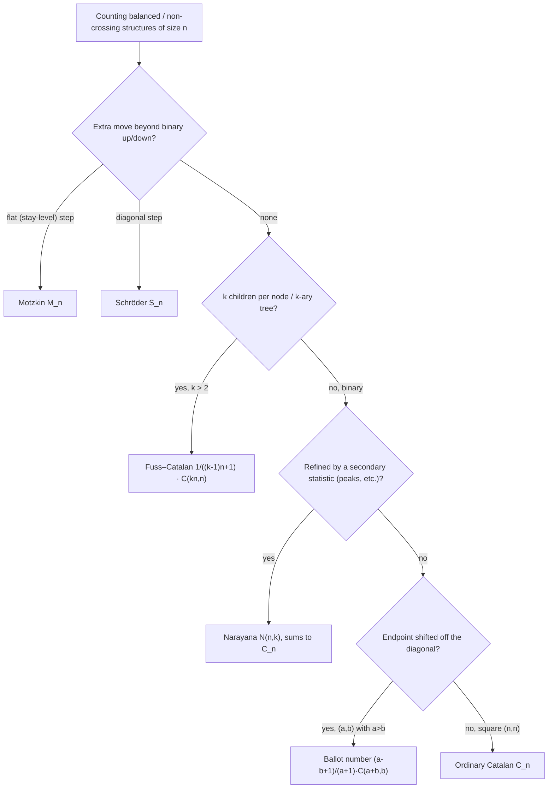

# Catalan Numbers — Senior Level

> Catalan numbers are almost never the *hard* part of a system — until you build a service that answers millions of "how many structures of size `n`" queries, ship a parser that counts well-formed nestings, or precompute a Catalan table mod a prime that someone later reconfigures to a non-prime. At that point every quiet assumption (the modulus is prime, `n + 1` is invertible, the value fits a machine word, the index maps correctly) becomes a correctness incident. This document treats Catalan computation as production engineering: precomputation strategy, overflow and modular safety, generalized Catalan families, and the testing that keeps an opaque combinatorial number honest.

## Table of Contents

1. [Introduction](#1-introduction)
2. [Counting at Scale: Precompute Once, Answer in O(1)](#2-counting-at-scale)
3. [Overflow: The Exact-vs-Modular Decision](#3-overflow)
4. [Modular Catalan Done Right](#4-modular-catalan-done-right)
5. [Generalized Catalan Families You Will Meet](#5-generalized-catalan-families)
6. [When Catalan Is the Search-Space Size of a DP](#6-catalan-as-search-space)
7. [Code Examples](#7-code-examples)
8. [Observability and Testing](#8-observability-and-testing)
9. [Failure Modes](#9-failure-modes)
10. [Summary](#10-summary)

---

## 1. Introduction

At the senior level the question is no longer "what is `C_n`" but "what system computes it, at what scale, and what breaks". Catalan numbers show up in production in three recurring guises, all sharing one engine — factorials with modular inverses:

1. **High-throughput counting services** — a combinatorics or scoring service answers "number of valid configurations of size `n`" across many `n`, often mod a prime. The right move is *precompute factorials once*, then every `C_n` is `O(1)`.
2. **Parser / validator instrumentation** — counting well-formed nestings (balanced delimiters, valid expression trees), where the count must agree with an independent enumeration and overflow must be impossible.
3. **DP search-space estimation** — Catalan tells you how large a brute-force space is (BST shapes, triangulations, matrix-chain orderings — sibling `13-dynamic-programming`), justifying the polynomial DP that collapses it.

All three reduce to: *establish that the modulus is prime and `n+1` is invertible, precompute factorial and inverse-factorial tables, and never integer-divide a residue.* The senior decisions are: how big to size the precompute, when to keep exact big integers vs go modular, how to handle the `n+1 ≥ p` corner with Lucas, and how to test an answer that is otherwise an opaque number.

---

## 2. Counting at Scale: Precompute Once, Answer in O(1)

The throughput payoff is dramatic. A naive per-request recompute of `(2n)!` is `O(n)` multiplies *per query*; at `10^4` QPS with `n = 10^3` that is `10^7` modular multiplies per second just for factorials. The precomputed table makes each query three multiplies — a `~300×` reduction in hot-path work — and the one-time `O(N)` fill is amortized to nothing across the request stream. This is the canonical "pay once at boot, serve forever in `O(1)`" pattern, identical to how a binomial-coefficient service is built (sibling `23-binomial-coefficients`).

### 2.1 The precompute pattern

If your service answers `C_n` for many `n` up to a bound `N`, do **not** recompute factorials per request. Precompute three arrays once at startup:

```
fact[i]   = i!          mod p,   i = 0..2N
invfact[i] = (i!)^{-1}  mod p,   i = 0..2N   (one Fermat inverse + downward sweep)
```

Then each query is a constant number of multiplies:

```
C_n = fact[2n] · invfact[n] · invfact[n+1]   (mod p)        — O(1)
```

The inverse-factorial table is built with a **single** modular inverse (`invfact[2N] = fact[2N]^{p-2}`), then swept down via `invfact[i-1] = invfact[i] · i`. This is the standard `O(N)` precompute that makes binomials and Catalan numbers `O(1)` per query (sibling `33-factorial-mod-p`, `23-binomial-coefficients`).

### 2.2 Sizing the precompute

`C_n` needs `fact` up to index `2n`, so for queries up to `N` you must size the tables to `2N`. A common production bug is sizing to `N` and reading `fact[2n]` out of bounds (or, worse, silently wrong if the array is shared). Size to `2·N_max` and assert `n ≤ N_max` at the query boundary.

Worked example: a service that must answer `C_n` for `n ≤ 10^6` needs `fact[0 .. 2·10^6]` and `invfact[0 .. 2·10^6]` — about `2·10^6 + 1` `int64` entries per array, ≈ 16 MB each, ≈ 32 MB total. That is the correct budget; sizing to `10^6` (16 MB total) *looks* right in a code review but silently reads `fact[2n]` past the end for any `n > 5·10^5`. The mnemonic: **the table index that bites you is `2n`, not `n`** — every Catalan and central-binomial computation touches `fact[2n]`, so the precompute bound is twice the query bound.

### 2.3 The cost table

| Strategy | Per-query cost | Precompute | Space | When |
|----------|----------------|-----------|-------|------|
| Recompute factorials each query | `O(n)` | none | `O(1)` | one-off, tiny `n` |
| Precompute fact + invfact | `O(1)` | `O(N)` | `O(N)` | many queries (the default at scale) |
| Recurrence table (exact, big int) | `O(1)` after `O(N²)` | `O(N²)` | `O(N)` bigints | need exact, moderate `N` |
| Incremental modular table | `O(1)` after `O(N)` | `O(N)` | `O(N)` | many queries, single prime |

At scale, **precompute fact + invfact** is almost always correct: linear startup, constant per query, and the same tables serve every binomial in the service.

---

## 3. Overflow: The Exact-vs-Modular Decision

### 3.1 The boundary

`C_n` grows like `4^n / n^{3/2}`. Concretely:

```
C_31 =  14,544,636,039,226,909        (fits int64)
C_33 = 192,627,266,438,818,210        (fits int64, ~1.9·10^17)
C_34 = 750,723,063,375,956,790        (fits int64, ~7.5·10^17)
C_35 ≈ 3.1·10^18                       (still under 9.22·10^18 = int64 max)
C_36 ≈ 1.2·10^19                       (OVERFLOWS signed int64)
```

So **`C_n` overflows signed 64-bit at `n = 36`** (the last safe exact value is `C_35`). Past that you have exactly two correct options: **big integers** (exact, slower) or **modular** (`C_n mod p`, fast but not the true value).

A second, subtler boundary is **32-bit**: `C_n` overflows signed `int32` already at `n = 17` (`C_17 = 129,644,790 < 2^31`, but `C_18 = 477,638,700` is still fine — actually `int32` survives to `C_18`; the first overflow is `C_19 = 1,767,263,190 > 2^31 − 1 ≈ 2.147·10^9`). The practical lesson: **never accumulate Catalan numbers in a 32-bit type** — even moderate `n` blows past it. Default to 64-bit for the exact regime and switch to big integers or modular at the `n = 36` wall.

### 3.2 The silent-overflow trap in the closed form

Even for `n` whose *answer* fits, an intermediate can overflow if you compute `(2n)!` or `C(2n,n)` before dividing. The safe pattern builds the binomial multiplicatively, interleaving `*` and `/` so the running value never exceeds the final magnitude:

```
result = 1
for i in 0..n-1:
    result = result * (2n - i) / (i + 1)   // each division is exact here
return result / (n + 1)
```

This keeps the running value ≤ `C(2n,n)`, buying a few extra `n` before overflow versus a naive `(2n)!`. But it only delays the wall at `n = 36`; for genuinely large `n` you must choose big integers or modular.

### 3.3 The decision matrix

| Requirement | `n` range | Choice |
|-------------|-----------|--------|
| Exact value, fits a word | `n ≤ 35` | `int64` incremental form |
| Exact value, any `n` | any | big integers (`math/big`, `BigInteger`, Python `int`) |
| Value mod prime `p` | any | factorial + inverse, `O(1)` per query after precompute |
| Value mod composite / `n+1 ≥ p` | any | Lucas / CRT (sibling `24`, `06`) |

The mistake that causes the most production incidents is computing in `int64` "because it worked in testing with small `n`" and silently overflowing in production with larger inputs. Decide the regime explicitly and assert the bound.

---

## 4. Modular Catalan Done Right

### 4.1 Two correct modular forms

```
C_n ≡ fact[2n] · invfact[n] · invfact[n+1]        (mod p)     — division form
C_n ≡ C(2n, n) − C(2n, n+1)                        (mod p)     — subtraction form
```

The division form divides by `(n+1)` *implicitly* through `invfact[n+1]`. The subtraction form avoids dividing by `(n+1)` entirely (it divides only by factorials, all invertible when `2n < p`) — sometimes preferable when you want to dodge the `n+1` corner. Both must use modular inverses; neither tolerates integer division of a residue.

### 4.2 The `n + 1 ≡ 0 (mod p)` corner

`invfact[n+1]` requires `(n+1)!` to be invertible mod `p`, i.e. no factor of `(n+1)!` is a multiple of `p`. That holds iff `n + 1 < p`. For the usual `p = 10^9 + 7` and contest-sized `n` (`≤ 10^7`), `n + 1 ≪ p`, so this is safe. But a service with a **small** prime modulus (say `p = 998244353` is still large, but a custom `p = 10007`) and `n ≥ p` will hit `(n+1)! ≡ 0` and the inverse vanishes. The fix is **Lucas' theorem** (sibling `24-lucas-theorem`): compute `C(2n,n) mod p` digit-by-digit in base `p`, then handle the `/(n+1)` factor carefully — or use a prime large enough that `2n < p`.

### 4.3 Why you cannot "divide the residue"

`C(2n,n) mod p` is a residue `r`. The true `C_n = C(2n,n)/(n+1)` is an integer, but `r / (n+1)` (integer division of the residue) is *not* `C_n mod p` — `r` is generally not divisible by `(n+1)`. You must compute `r · inverse(n+1) mod p`. Stating this explicitly in code review catches the single most common modular-Catalan bug.

### 4.4 Choosing the modulus

| Modulus | Property | Use |
|---------|----------|-----|
| `10^9 + 7` | prime, fits int32 sum in int64 | general competitive / service default |
| `998244353` | prime, NTT-friendly (`= 119·2^23 + 1`) | when convolving Catalan generating functions via NTT (sibling `15-ntt`) |
| custom small prime | may hit `n+1 ≥ p` | needs Lucas |
| composite | no field inverse | avoid; use CRT over prime factors (sibling `06`, `17`) |

If you ever need to *convolve* Catalan-like sequences (e.g. composing generating functions), pick the NTT-friendly `998244353` so the convolution itself is `O(n log n)` (sibling `15-ntt`).

### 4.5 The `n + 1 ≥ p` corner, worked

The danger is concrete and easy to reproduce with a small prime. Suppose someone reconfigures the modulus to `p = 7` and asks for `C_6`. Here `n + 1 = 7 ≡ 0 (mod 7)`, so `(n+1)^{-1}` does not exist and the division form returns nonsense. Worse, `invfact[7]` is `(7!)^{-1}`, but `7! ≡ 0 (mod 7)`, so its "inverse" is meaningless and the whole table is poisoned from index 7 upward. The correct value is `C_6 = 132 ≡ 132 − 18·7 = 132 − 126 = 6 (mod 7)`. To obtain it you must either (a) use **Lucas' theorem** to compute `\binom{12}{6} mod 7` digit-by-digit in base 7 and track the factor of 7 in `(n+1)` via Legendre/Kummer (sibling `24-lucas-theorem`), or (b) refuse the query because `2n = 12 ≥ p = 7`. The defensive default in a service is option (b): **assert `2n < p`** at the boundary so this corner is a loud rejection, not a silent `0` or garbage residue. Lucas is only worth wiring in when small-prime moduli are a genuine product requirement.

---

## 5. Generalized Catalan Families You Will Meet

Production "Catalan-shaped" problems are often a *generalization*. Recognizing the family saves you from re-deriving.

### 5.1 Ballot numbers / paths to a shifted endpoint

The number of lattice paths from `(0,0)` to `(a, b)` (with `a ≥ b`) staying weakly below the diagonal is the **ballot number** `((a-b+1)/(a+1)) · C(a+b, b)`. Catalan is the special case `a = b = n`. Many "stay on one side" counting problems are ballot, not pure Catalan — the reflection principle (professional file) handles both.

### 5.2 Fuss–Catalan (ternary and `k`-ary trees)

The number of `k`-ary trees with `n` internal nodes is the **Fuss–Catalan** number `(1/(kn+1)) · C(kn+1 over n)`... more precisely `\frac{1}{(k-1)n+1}\binom{kn}{n}`. The ordinary Catalan is `k = 2`. If a problem counts ternary trees or "each node has exactly `k` children", reach for Fuss–Catalan, not `C_n`.

### 5.3 Narayana numbers (refinement of Catalan)

`N(n,k) = (1/n) C(n,k) C(n,k-1)` counts Dyck paths of length `2n` with exactly `k` peaks, and `Σ_k N(n,k) = C_n`. When a problem asks for "balanced structures with exactly `k` of some feature", it is often Narayana — a refinement that *sums* to Catalan. Operationally this matters for two reasons. First, it gives a *cross-check*: if your refined counts do not sum to the Catalan total, the refinement is wrong. Second, it changes the API shape — a Narayana service answers a 2-D query `(n, k)` and is computed from the *same* `fact`/`invfact` tables as Catalan (two binomials and one inverse), so it slots into the §2 precompute architecture at no extra precompute cost. Recognizing "refined by a feature" lets you reuse the existing factorial engine rather than inventing a new pipeline.

### 5.4 Super-Catalan / Schröder

When extra step types are allowed (diagonal steps), you get the **Schröder numbers**; when a "flat" step is allowed, the **Motzkin numbers**. Misidentifying these as Catalan is a classic modeling error — the giveaway is an *extra allowed move* beyond the binary up/down. A concrete tell: if your brute-force first terms are `1, 1, 2, 4, 9, 21` it is Motzkin (a flat step exists), and `1, 2, 6, 22, 90` is large Schröder (a diagonal step exists) — neither matches the Catalan `1, 1, 2, 5, 14, 42`. These families lack a closed binomial form (only a recurrence), so the precompute-and-`O(1)` trick of §2 does **not** apply; you must build the table by recurrence in `O(N)` (Motzkin) or `O(N²)`/generating-function methods (Schröder). Recognizing the family early therefore changes not just the formula but the whole computational strategy.

| Family | Counts | When |
|--------|--------|------|
| Catalan `C_n` | binary trees, balanced parens | binary / up-down only |
| Fuss–Catalan | `k`-ary trees | `k` children per node |
| Narayana `N(n,k)` | Dyck paths with `k` peaks | refined by a feature count |
| Motzkin | paths with up/down/flat | a "stay-level" move allowed |
| Schröder | paths with diagonal steps | extra diagonal move allowed |

The first-term signatures, kept together for quick OEIS-style matching against a brute force:

```
Catalan   C_n : 1, 1,  2,  5, 14,  42, 132, 429
Motzkin   M_n : 1, 1,  2,  4,  9,  21,  51, 127
Schröder  S_n : 1, 2,  6, 22, 90, 394
Fuss (k=3)    : 1, 1,  3, 12, 55, 273          (ternary trees)
Narayana row n=4 : 1, 6, 6, 1   (sums to 14 = C_4)
```

If your brute force on `n = 0..5` matches one of these rows, you have identified the family — and, crucially, whether a closed binomial form (Catalan/Fuss/Narayana) or only a recurrence (Motzkin/Schröder) is available, which dictates the computational strategy.

### 5.5 Family-selection flow

Before writing any code, route the problem through this decision tree — picking the wrong family is a silent undercount that no amount of testing the *formula* will catch.



The single most reliable disambiguator is **"how many distinct moves / children are allowed"**: two ⇒ Catalan/Narayana/ballot family (closed binomial), three or more move types ⇒ Motzkin/Schröder (recurrence only), `k` children ⇒ Fuss–Catalan. Confirm the choice by brute-forcing the first four terms and matching the OEIS signature (`1,1,2,5,14` Catalan; `1,1,2,4,9` Motzkin; `1,2,6,22,90` large Schröder).

---

## 6. When Catalan Is the Search-Space Size of a DP

A senior often uses Catalan not to *output* the count but to *justify the algorithm*. If a problem's brute-force space has size `C_n ~ 4^n`, you know enumeration is hopeless and a polynomial DP is required.

- **Optimal BST / matrix-chain / triangulation** (sibling `13-dynamic-programming/05-interval-dp`, `23-matrix-chain-multiplication`): there are `C_n` parenthesizations, but the interval DP finds the optimal one in `O(n³)`. Catalan is the size of the space the DP collapses.
- **Expression-tree evaluation orders**: `C_n` ways to parenthesize `n+1` operands; a DP over intervals evaluates the best in polynomial time.
- **Capacity planning for enumeration**: if a feature *must* enumerate structures (e.g. generate all valid layouts), `C_n ~ 4^n / n^{1.5}` tells you the output size and hence whether it is feasible at all — `C_20 ≈ 6.5·10^9` already means "do not enumerate".

This is the senior framing: **Catalan is the cost model for the brute force, which is the argument for the DP.**

### 6.1 Capacity worksheet: "can we enumerate?"

When a feature must *materialize* structures (generate every valid layout, expression tree, or parenthesization) rather than merely count them, `C_n ~ 4^n / n^{3/2}` is the capacity model. A quick table converts `n` into a go/no-go decision:

| `n` | `C_n` | Enumeration verdict (~1µs/structure) |
|-----|-------|--------------------------------------|
| 10 | 16,796 | trivial (16 ms) |
| 15 | 9,694,845 | borderline interactive (~10 s) |
| 20 | 6,564,120,420 | offline batch only (~2 h) |
| 25 | 4,861,946,401,452 | infeasible (~56 days) |
| 30 | 3,814,986,502,092,304 | impossible |

The rule of thumb: each `+5` in `n` multiplies the count by ~`4^5 ≈ 1000`, so enumeration crosses from "instant" to "infeasible" inside a window of `n ≈ 10` to `n ≈ 22`. If a product requirement says "show the user all valid arrangements" and `n` can exceed ~18, push back: either cap `n`, paginate lazily (generate on demand without materializing the full set), or replace enumeration with a counting/sampling API. Uniform random *sampling* of a Dyck path is `O(n)` (via the cycle lemma or a ballot-sequence shuffle), which is the scalable substitute for "show me some examples".

### 6.2 Multi-modulus service architecture

A real counting service is often asked for `C_n` under *different* primes (one caller wants `10^9+7`, an NTT pipeline wants `998244353`). The clean architecture is a small registry keyed by modulus, each entry owning its own `fact`/`invfact` tables, built lazily on first use and sized to `2·N_max`:

```text
catalanRegistry: map[prime] -> {fact[], invfact[], nMax}
  on query(n, p):
    entry = registry.getOrBuild(p, defaultNMax)   // O(N) once per prime
    assert isPrime(p) and n <= entry.nMax and n+1 < p
    return entry.fact[2n] * entry.invfact[n] * entry.invfact[n+1] mod p
```

Two senior guardrails make this safe in production. First, **validate the modulus once at registration** (`isPrime(p)` and that it fits the accumulator without overflow), turning a silently-wrong Fermat inverse into a startup error. Second, **assert `n+1 < p` at the query boundary**, so the `(n+1) ≡ 0 (mod p)` corner (§4.2) fails loudly instead of returning a bogus residue. The registry also makes the cost model explicit: the *first* query per `(prime)` is `O(N)`, every subsequent one is `O(1)`, so warm the registry at startup for the primes you know you will serve.

---

## 7. Code Examples

Each example is production-shaped: a precompute-backed `O(1)` query service, an overflow-safe exact computation with an explicit regime check, and a generalized (Fuss–Catalan) routine.

### 7.1 Go — precompute-backed O(1) Catalan service (mod prime)

```go
package main

import "fmt"

const MOD = 1_000_000_007

type CatalanService struct {
	fact, invf []int64
	nMax       int
}

func powMod(a, e, m int64) int64 {
	a %= m
	r := int64(1) % m
	for e > 0 {
		if e&1 == 1 {
			r = r * a % m
		}
		a = a * a % m
		e >>= 1
	}
	return r
}

// NewCatalanService precomputes factorials up to 2*nMax in O(nMax).
func NewCatalanService(nMax int) *CatalanService {
	sz := 2*nMax + 1
	fact := make([]int64, sz)
	invf := make([]int64, sz)
	fact[0] = 1
	for i := 1; i < sz; i++ {
		fact[i] = fact[i-1] * int64(i) % MOD
	}
	invf[sz-1] = powMod(fact[sz-1], MOD-2, MOD) // single Fermat inverse
	for i := sz - 1; i > 0; i-- {
		invf[i-1] = invf[i] * int64(i) % MOD
	}
	return &CatalanService{fact, invf, nMax}
}

// Catalan answers C_n mod p in O(1). Panics if n exceeds the precomputed bound.
func (s *CatalanService) Catalan(n int) int64 {
	if n < 0 || n > s.nMax {
		panic("n out of precomputed range")
	}
	return s.fact[2*n] * s.invf[n] % MOD * s.invf[n+1] % MOD
}

func main() {
	svc := NewCatalanService(1_000_000)
	fmt.Println(svc.Catalan(3))       // 5
	fmt.Println(svc.Catalan(10))      // 16796
	fmt.Println(svc.Catalan(1_000_000)) // some residue, O(1)
}
```

### 7.2 Java — overflow-safe exact Catalan with regime guard

```java
import java.math.BigInteger;

public class ExactCatalan {
    // Exact C_n in a long, valid only for n <= 35 (else overflow).
    static long catalanLong(int n) {
        if (n > 35) throw new ArithmeticException("C_" + n + " overflows long; use BigInteger");
        long c = 1; // C_0
        for (int k = 1; k <= n; k++) {
            c = c * (2L * (2 * k - 1)) / (k + 1); // exact integer step
        }
        return c;
    }

    // Exact C_n for any n via BigInteger: C(2n,n)/(n+1).
    static BigInteger catalanBig(int n) {
        BigInteger num = BigInteger.ONE;
        for (int i = 0; i < n; i++) {
            num = num.multiply(BigInteger.valueOf(2L * n - i))
                     .divide(BigInteger.valueOf(i + 1));
        }
        return num.divide(BigInteger.valueOf(n + 1));
    }

    public static void main(String[] args) {
        System.out.println(catalanLong(10));  // 16796
        System.out.println(catalanLong(35));  // last safe long value
        System.out.println(catalanBig(50));   // exact 50th Catalan number
        // catalanLong(36) throws — the regime guard converts overflow into a loud error.
    }
}
```

### 7.3 Python — Fuss–Catalan (k-ary trees) and Narayana, modular

```python
from math import comb

MOD = 1_000_000_007


def precompute(n):
    fact = [1] * (n + 1)
    for i in range(1, n + 1):
        fact[i] = fact[i - 1] * i % MOD
    invf = [1] * (n + 1)
    invf[n] = pow(fact[n], MOD - 2, MOD)
    for i in range(n, 0, -1):
        invf[i - 1] = invf[i] * i % MOD
    return fact, invf


def fuss_catalan(n, k, fact, invf):
    """Number of k-ary trees with n internal nodes, mod p:
       (1/((k-1)n + 1)) * C(kn, n)."""
    top = fact[k * n] * invf[n] % MOD * invf[k * n - n] % MOD     # C(kn, n)
    return top * pow((k - 1) * n + 1, MOD - 2, MOD) % MOD


def narayana(n, k):
    """N(n,k) = (1/n) C(n,k) C(n,k-1); sum over k equals C_n (exact)."""
    return comb(n, k) * comb(n, k - 1) // n


if __name__ == "__main__":
    fact, invf = precompute(200000)
    print(fuss_catalan(3, 2, fact, invf))            # ordinary Catalan C_3 = 5
    print(sum(narayana(4, k) for k in range(1, 5)))  # 14 == C_4 (Narayana sums to Catalan)
```

### 7.4 Cold-start vs steady-state cost

The precompute-backed design trades a one-time `O(N)` startup for `O(1)` queries, so the operational question is whether the cold start fits the deployment budget.

| `nMax` | Table size (each of `fact`, `invf`) | Precompute work | Typical cold start |
|--------|-------------------------------------|-----------------|--------------------|
| `10^4` | ~20K `int64` (~160 KB each) | ~`2·10^4` mults + 1 powmod | sub-millisecond |
| `10^6` | ~2M `int64` (~16 MB each) | ~`2·10^6` mults + 1 powmod | a few milliseconds |
| `10^7` | ~20M `int64` (~160 MB each) | ~`2·10^7` mults + 1 powmod | tens of milliseconds, ~320 MB RAM |

The dominant cold-start cost is the linear factorial fill; the single Fermat `powmod` is `O(log p)` and negligible. The memory, not the time, is usually the binding constraint: `nMax = 10^7` already wants ~320 MB for the two `int64` tables, which can dominate a small container's footprint. Senior guidance: **size `nMax` to the real query distribution, not the theoretical maximum** — most services see `n` in the hundreds or low thousands, and an `nMax` of `10^5` (a few MB) is plenty while keeping cold start invisible. Reserve `10^7`-scale tables for offline batch jobs that genuinely query the tail.

---

## 8. Observability and Testing

A Catalan number is opaque — one wrong residue looks like any other. Build verification in from day one.

| Check | Why |
|-------|-----|
| `C_n` matches brute-force balanced-string count for `n ≤ 12` | Validates the formula and the index mapping. |
| Recurrence `C_{n+1} == Σ C_i C_{n-i}` over the table | Catches modular-inverse and convolution bugs. |
| Closed form vs subtraction form `C(2n,n) − C(2n,n+1)` agree | Cross-checks the division-form inverse. |
| `(n+1)·C_n == C(2n,n)` (mod p, or exact) | The defining identity; catches `/(n+1)` errors. |
| Determinism across Go/Java/Python on shared `n` | Catches `int64` overflow vs Python bignums. |
| `Σ_k N(n,k) == C_n` (Narayana) | Validates any refined-family code. |

### 8.1 The single most valuable test

Compare your fast `C_n` against an **independent brute-force enumeration count** of balanced parentheses for `n = 1..12`. If they match, both your formula and — critically — your *index mapping* are correct. This is the test that catches the off-by-one (`n` pairs vs `n+2`-gon vs `n+1` leaves) that accounts for most real Catalan bugs.

### 8.2 The identity assertion

In production code that computes `C_n mod p`, assert the defining relation:

```
assert ( (n+1) * C_n ) % p == C(2n, n) % p
```

This is cheap and converts a silent modular-inverse mistake (integer-dividing a residue, wrong inverse) into a loud failure at the call site. It is the Catalan analogue of asserting `a · inv(a) ≡ 1` for modular inverses.

### 8.3 Property-test battery

```text
for random n in [0, 12]:
    assert fast_catalan(n) == brute_force_balanced_count(n)
for random n in [0, N], prime p:
    assert ((n+1) * catalan_mod(n)) % p == binom_mod(2*n, n)      # defining identity
    assert catalan_mod(n) == (binom_mod(2*n,n) - binom_mod(2*n,n+1)) % p  # two forms agree
for random n:
    assert catalan_table[n+1] == sum(catalan_table[i]*catalan_table[n-i] for i in 0..n)  # recurrence
```

The brute-force comparison and the `(n+1)·C_n == C(2n,n)` identity together give very high confidence at negligible cost.

### 8.4 Metrics and guardrails worth emitting

A counting service hides correctness behind opaque residues, so instrument the *boundaries* rather than the values:

| Signal to emit / assert | Catches |
|-------------------------|---------|
| `n > nMax` rejected at the edge (counter) | undersized precompute, unexpected input growth |
| `n + 1 >= p` rejected (counter) | the `(n+1) ≡ 0` corner before it returns garbage |
| `isPrime(p)` checked at registration (boot assert) | a reconfigured non-prime modulus breaking Fermat |
| latency p99 of a query | a slipped `O(n)` recompute leaking into the hot path |
| startup time of the precompute | a too-large `nMax` blowing the cold-start budget |

The two `counter` rejections double as **alerts**: a sudden spike in "`n > nMax`" means real traffic outgrew your sizing assumption and the table must be enlarged (and redeployed) before it starts rejecting valid work. This is the operational complement to §8's unit tests — the tests prove the formula; the metrics prove the *deployment* still fits the traffic.

### 8.5 Cross-language determinism as a test

Because Python's `int` is arbitrary-precision while Go/Java use fixed-width words, running the *same* exact (non-modular) `C_n` across all three and diffing is a free overflow detector: the first `n` where Go/Java disagree with Python is exactly the overflow threshold (`n = 36` for signed `int64`). Bake this three-language comparison into CI for the exact path; it converts the silent `int64` wraparound (§3, §9.1) into a red build instead of a production incident.

---

## 9. Failure Modes

### 9.1 Silent integer overflow
`C_n` in `int64` overflows at `n = 36`, returning a wrong (often negative) number with no error. Mitigation: assert `n ≤ 35` for the `int64` path, or use big integers / modular.

### 9.2 Integer-dividing a residue
`(C(2n,n) mod p) / (n+1)` is not `C_n mod p`. Mitigation: multiply by `inverse(n+1) mod p`; assert `(n+1)·C_n ≡ C(2n,n)`. Concretely with `p = 11`, `n = 3`: `\binom{6}{3} = 20 ≡ 9`, and `9 / 4 = 2` (integer division) ≠ `5 = C_3 mod 11`; the correct `9 · 4^{-1} = 9 · 3 = 27 ≡ 5` requires the inverse `4^{-1} ≡ 3`.

### 9.3 Composite or reconfigured modulus
A Catalan table precomputed for prime `p` breaks if `p` is later set to a non-prime (Fermat inverse invalid). Mitigation: assert `p` is prime at startup; default the inverse to extended Euclid where feasible.

### 9.4 `n + 1 ≥ p`
`(n+1)!` becomes `≡ 0 (mod p)`, no inverse. Mitigation: require `2n < p`, or use Lucas' theorem (sibling `24`).

### 9.5 Undersized precompute
Sizing `fact` to `N` instead of `2N` reads `fact[2n]` out of bounds or returns garbage. Mitigation: size to `2·N_max`; bounds-check the query.

### 9.6 Off-by-one index mapping
Computing `C_{n}` when the structure needs `C_{n-1}` (polygon `n+2` sides, full binary tree `n+1` leaves, etc.). Mitigation: brute-force verify on small cases; document what `n` indexes.

### 9.7 Wrong family (Motzkin/Schröder/Fuss as Catalan)
Modeling a problem with an extra allowed move (flat/diagonal step, `k`-ary tree) as ordinary Catalan undercounts. Mitigation: check whether moves beyond binary up/down are allowed before assuming `C_n`.

### 9.8 Recomputing factorials per request
An `O(n)` recompute inside a hot query path instead of an `O(1)` table lookup. Mitigation: precompute fact/invfact once; cache by modulus.

### 9.9 Enumerating to count
Generating all `C_n ~ 4^n` structures merely to count them. Mitigation: compute the formula; enumerate only when the structures themselves are needed and `n` is tiny.

### 9.10 32-bit accumulation
Storing or summing Catalan numbers in `int32` overflows by `n = 19` (`C_19 ≈ 1.77·10^9 > 2^31 − 1`). Mitigation: use 64-bit for the exact regime; never let a Catalan value transit a 32-bit field (JSON-to-`int`, a narrow DB column, a protobuf `int32`).

### 9.11 Shared-table aliasing across moduli
Reusing one `fact`/`invfact` pair after the modulus changes returns residues for the *old* prime. Mitigation: key the precomputed tables by modulus (the registry of §6.2); never mutate `MOD` after building a table.

---

## 10. Summary

- **Precompute at scale.** For a service answering many `C_n mod p`, precompute `fact` and `invfact` up to `2·N_max` once (one Fermat inverse + downward sweep), then every `C_n = fact[2n]·invfact[n]·invfact[n+1]` is `O(1)` (sibling `33-factorial-mod-p`).
- **Decide the overflow regime explicitly.** `C_n` overflows signed `int64` at `n = 36`; choose `int64` (≤ 35), big integers (exact, any `n`), or modular (`O(1)` after precompute) and *assert the bound* rather than discovering overflow in production.
- **Modular Catalan needs an inverse, never integer division.** `C_n ≡ fact[2n]·invfact[n]·invfact[n+1]` or the subtraction form `C(2n,n) − C(2n,n+1)`; mind the `n+1 ≥ p` corner (use Lucas, sibling `24`).
- **Know the generalized families.** Fuss–Catalan (`k`-ary trees), Narayana (refined by peaks), Motzkin/Schröder (extra step types), and ballot numbers (shifted endpoints) — misidentifying these as `C_n` is a modeling bug.
- **Use Catalan as a cost model.** `C_n ~ 4^n / n^{3/2}` is the size of the brute-force space (BST shapes, triangulations, matrix-chain orderings), which is the argument for the polynomial DP that collapses it (sibling `13-dynamic-programming`).
- **Keep an oracle.** Compare against brute-force balanced-string counts for `n ≤ 12` and assert `(n+1)·C_n ≡ C(2n,n)` — these catch the off-by-one and modular-inverse mistakes that account for nearly every real bug.

### Decision summary

- **One exact value, `n ≤ 35`** → `int64` incremental form.
- **One exact value, any `n`** → big integers, multiplicative `C(2n,n)/(n+1)`.
- **Many values mod prime** → precompute fact/invfact (sized to `2·N_max`), `O(1)` per query.
- **Multiple moduli served** → registry keyed by prime, each owning its own tables (§6.2).
- **`n + 1 ≥ p` or small prime** → Lucas' theorem (sibling `24`).
- **Convolving generating functions** → NTT-friendly `998244353` (sibling `15-ntt`).
- **`k`-ary trees / refined counts** → Fuss–Catalan / Narayana, not `C_n`.
- **Need the structures, not the count** → enumerate (only for tiny `n`).

References: sibling `23-binomial-coefficients` and `33-factorial-mod-p` (the precompute engine), `24-lucas-theorem` (`n+1 ≥ p` corner), `05-fermat-euler` / `07-extended-euclidean-modular-inverse` (modular inverses), `06-crt` / `17-garner-algorithm` (composite moduli), `15-ntt` (convolutions), and `13-dynamic-programming` (Catalan as DP search space).

---

Next step: continue to [`professional.md`](./professional.md) for the mathematical foundations — the reflection-principle and cycle-lemma proofs of the closed form, the generating-function derivation `c(x) = (1−√(1−4x))/2x`, the asymptotic `C_n ~ 4^n/(n^{3/2}√π)`, and the relation to the ballot problem.
