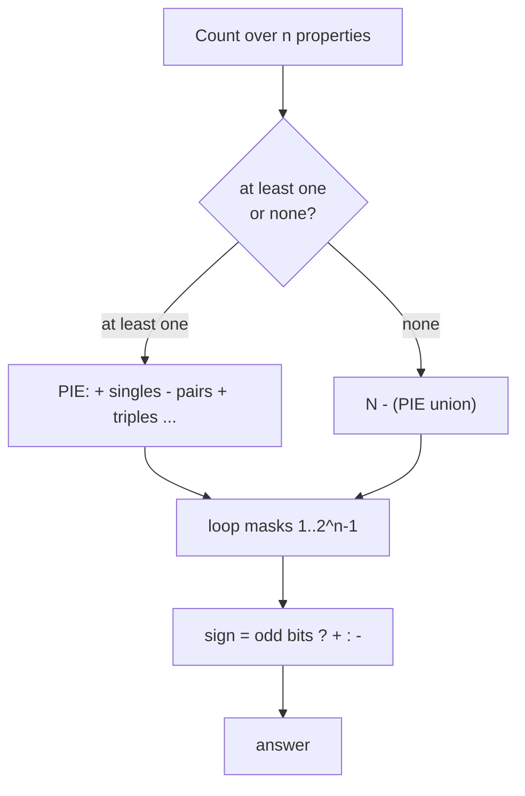

# Inclusion-Exclusion Principle (PIE) — Junior Level

> **One-line summary:** To count the size of a union of overlapping sets, **add the sizes of the individual sets, subtract the sizes of all pairwise intersections, add back the triple intersections, subtract the quadruples, and so on** — alternating signs. In symbols, `|A ∪ B| = |A| + |B| − |A ∩ B|`, and for three sets `|A ∪ B ∪ C| = |A| + |B| + |C| − |A∩B| − |A∩C| − |B∩C| + |A∩B∩C|`. The alternating add/subtract corrects for double-counting the overlaps.

---

## Table of Contents

1. [Introduction](#introduction)
2. [Prerequisites](#prerequisites)
3. [Glossary](#glossary)
4. [Core Concepts](#core-concepts)
5. [Big-O Summary](#big-o-summary)
6. [Real-World Analogies](#real-world-analogies)
7. [Pros & Cons](#pros--cons)
8. [Step-by-Step Walkthrough](#step-by-step-walkthrough)
9. [Code Examples](#code-examples)
10. [Coding Patterns](#coding-patterns)
11. [Error Handling](#error-handling)
12. [Performance Tips](#performance-tips)
13. [Best Practices](#best-practices)
14. [Edge Cases & Pitfalls](#edge-cases--pitfalls)
15. [Common Mistakes](#common-mistakes)
16. [Cheat Sheet](#cheat-sheet)
17. [Visual Animation](#visual-animation)
18. [Summary](#summary)
19. [Further Reading](#further-reading)

---

## Introduction

Imagine a classroom of 30 students. 18 of them take Math, 15 take Physics, and 8 take *both*. How many take **at least one** of the two subjects? The tempting answer is `18 + 15 = 33`, but that is more than the whole class — something is wrong. The mistake is that the 8 students who take both subjects were counted **twice**: once inside the 18 Math students and once inside the 15 Physics students. To fix the over-count we subtract the overlap once:

```
|Math ∪ Physics| = |Math| + |Physics| − |Math ∩ Physics| = 18 + 15 − 8 = 25.
```

That single correction — *add the parts, then subtract the double-counted overlap* — is the **Inclusion-Exclusion Principle** (PIE). The word "inclusion" is the adding step; "exclusion" is the subtracting step. With two sets you add then subtract once. With three sets you add the three singles, subtract the three pairwise overlaps, then **add back** the triple overlap (because subtracting all three pairs removed the very center one time too many). The pattern keeps alternating: `+` singles, `−` pairs, `+` triples, `−` quadruples, …

PIE is one of the most useful counting tools in all of computer science and mathematics. It answers questions of the form *"how many things satisfy **at least one** of these properties?"* — how many numbers in `1..N` are divisible by at least one of a given list of numbers, how many arrangements avoid all forbidden positions, how many functions hit every output. This file builds the two-set and three-set cases by hand, shows the general formula, and ends with a small program that counts integers divisible by at least one of several primes.

---

## Prerequisites

Before reading this file you should be comfortable with:

- **Basic set notation** — union `∪` ("or"), intersection `∩` ("and"), and the size/cardinality `|A|` of a set.
- **Counting basics** — how to count multiples of `k` in `1..N` (it is `⌊N/k⌋`).
- **Loops and arrays** in any of Go/Java/Python.
- **Big-O notation** — `O(n)`, `O(2^n)`.

Optional but helpful:

- **LCM (least common multiple)** — needed when counting numbers divisible by several values at once; see sibling `01-gcd-lcm`.
- A glance at **binary representation of numbers** — the bitmask trick later iterates over subsets using the bits of an integer `0 .. 2^n − 1`.

---

## Glossary

| Term | Meaning |
|------|---------|
| **Set** | A collection of distinct items, e.g. "students taking Math". |
| **Cardinality `|A|`** | The number of elements in set `A`. |
| **Union `A ∪ B`** | All items in `A` **or** `B` (or both) — counted once each. |
| **Intersection `A ∩ B`** | All items in **both** `A` and `B`. |
| **Inclusion-Exclusion (PIE)** | The rule that computes `|A₁ ∪ … ∪ Aₙ|` by alternating `+`/`−` over all intersections. |
| **Complement** | The items **not** in a set; "none of the properties" is the complement of "at least one". |
| **Subset** | A selection of some (possibly zero) of the `n` sets; PIE sums one term per non-empty subset. |
| **Bitmask** | An integer whose bits encode which sets are chosen; iterating `1 .. 2^n − 1` visits every non-empty subset. |
| **Divisible by at least one** | The classic PIE application: count `x ∈ [1, N]` with `k₁ | x` **or** `k₂ | x` **or** … |
| **`⌊N/k⌋`** | Floor division — the count of multiples of `k` in `1..N`. |

---

## Core Concepts

### 1. Two Sets: Add, Then Subtract the Overlap

For any two finite sets:

```
|A ∪ B| = |A| + |B| − |A ∩ B|.
```

The reasoning is a *picture*. Draw two overlapping circles. The lens-shaped middle is `A ∩ B`. When you add `|A| + |B|`, you have counted the middle **twice** — once as part of `A`, once as part of `B`. So you subtract it once to count it the correct single time. That is the whole idea in its smallest form.

### 2. Three Sets: Add Singles, Subtract Pairs, Add the Triple

For three sets:

```
|A ∪ B ∪ C| = |A| + |B| + |C|
            − |A∩B| − |A∩C| − |B∩C|
            + |A∩B∩C|.
```

Why does the triple come **back** with a `+`? Track the very center point that lies in all three sets. The three single terms count it `3` times (`+3`). The three pairwise terms each contain it, so they subtract it `3` times (`−3`), bringing the running total to `0`. That is wrong — it should be counted once! The final `+|A∩B∩C|` adds it back `1` time, giving `+1`. Every region of the diagram ends up counted exactly once after the alternating signs settle.

### 3. The Alternating Sign Pattern

In general, for `n` sets `A₁, …, Aₙ`:

```
|A₁ ∪ … ∪ Aₙ| =   Σ |Aᵢ|              (all singles,  + sign)
                − Σ |Aᵢ ∩ Aⱼ|         (all pairs,    − sign)
                + Σ |Aᵢ ∩ Aⱼ ∩ Aₖ|    (all triples,  + sign)
                − …                    (alternating)
                ± |A₁ ∩ … ∩ Aₙ|.       (the full intersection)
```

The sign of a term is `+` if it intersects an **odd** number of sets, and `−` if **even**. A clean way to remember: a term combining `k` sets carries the sign `(−1)^(k+1)` (so `k=1 → +`, `k=2 → −`, `k=3 → +`, …).

### 4. The Complement Form: "None of the Properties"

Often it is easier to count how many items satisfy **none** of the properties. If the total universe has size `N`, then:

```
#(none of the properties) = N − |A₁ ∪ … ∪ Aₙ|.
```

Substituting PIE gives a tidy alternating sum that *starts* at the whole universe:

```
#(none) = N − Σ|Aᵢ| + Σ|Aᵢ∩Aⱼ| − Σ|Aᵢ∩Aⱼ∩Aₖ| + …
```

This "at least one" ↔ "none" flip is the most common way PIE appears in counting problems (e.g. counting numbers **coprime** to a value = numbers divisible by **none** of its prime factors).

### 5. Counting "Divisible by at Least One"

The headline application: how many integers in `[1, N]` are divisible by **at least one** of `k₁, k₂, …, kₙ`?

Let `Aᵢ` = multiples of `kᵢ` in `[1, N]`. Then `|Aᵢ| = ⌊N / kᵢ⌋`. The intersection `Aᵢ ∩ Aⱼ` is the set of numbers divisible by **both** `kᵢ` and `kⱼ`, i.e. divisible by their **LCM**, so `|Aᵢ ∩ Aⱼ| = ⌊N / lcm(kᵢ, kⱼ)⌋`. PIE then alternates over subsets, using the LCM of the chosen `kᵢ` for each intersection. This is exactly the program at the end of this file.

### 6. Iterating Over Subsets with a Bitmask

PIE has one term per **non-empty subset** of the `n` sets — that is `2^n − 1` terms. The clean way to loop over them in code is a **bitmask**: an integer `mask` from `1` to `2^n − 1`, where bit `i` being `1` means "include set `i` in this intersection". For each `mask` you compute the intersection of the chosen sets and add it with sign `+` if the number of chosen bits is odd, `−` if even. This turns the whole principle into one short loop.

---

## Big-O Summary

| Operation | Time | Space | Notes |
|-----------|------|-------|-------|
| Two-set / three-set PIE (formula) | **O(1)** | O(1) | Just add and subtract known sizes. |
| PIE over `n` sets (subset loop) | **O(2ⁿ · n)** | O(1) | One term per subset; `n` work per term for the intersection. |
| Count "divisible by at least one" of `n` numbers | **O(2ⁿ · n)** | O(1) | Each subset computes an LCM and a floor-divide. |
| Count "divisible by none" (complement) | O(2ⁿ · n) | O(1) | Same loop, start from `N`. |
| Count multiples of one `k` in `[1, N]` | O(1) | O(1) | `⌊N/k⌋`. |
| Brute-force check each `x` in `[1, N]` | O(N · n) | O(1) | The naive oracle; only for small `N`. |

The headline cost is **`O(2ⁿ · n)`**: PIE is *exponential in the number of sets* but completely independent of how large `N` is. That trade is excellent when `n` is small (say `n ≤ 20`) and `N` is enormous (up to `10^18`), which is exactly when PIE shines over brute force.

---

## Real-World Analogies

| Concept | Analogy |
|---------|---------|
| Adding then subtracting overlaps | Counting guests at a party where some signed *two* guest lists — you add both lists, then subtract the people who appear on both so nobody is double-counted. |
| The triple add-back | Three overlapping spotlights on a stage: the center where all three meet gets dimmed too much when you subtract every pair, so you brighten it back up once. |
| Complement ("none") form | Counting clean rooms = total rooms − rooms with at least one problem, instead of listing every clean room. |
| Divisible by at least one | A calendar where events repeat every 2, 3, or 5 days — counting busy days means combining the cycles without double-booking the days that align. |
| Bitmask over subsets | A panel of `n` light switches; each setting of the switches (`2ⁿ` of them) is one subset, and you flip through all settings to weigh every overlap. |

Where the analogies break: the party analogy works for two lists, but with three or more lists you must remember to *add back* the triple-overlap people — the alternating sign is the part everyday intuition forgets.

---

## Pros & Cons

| Pros | Cons |
|------|------|
| Exact answer — no approximation, no rounding. | Cost grows as `2ⁿ`, so it is only practical for a small number of sets `n`. |
| Independent of universe size `N`; handles `N = 10^18`. | The alternating sign is easy to get backwards, producing silent off-by-a-term errors. |
| One short bitmask loop handles any `n`. | Computing each intersection (e.g. an LCM) can overflow if values are large. |
| Works for any "at least one of these properties" question. | Requires the intersections to be *easy to count* (e.g. via LCM) — not always true. |
| Pairs naturally with the complement to count "none". | For many sets with heavy overlap, most terms cancel — wasteful without pruning. |

**When to use:** counting "at least one / none" over a *small* number of overlapping properties — divisibility by a handful of numbers, derangements, surjections, forbidden positions, coprimality.

**When NOT to use:** when the number of sets `n` is large (`2ⁿ` blows up) — then look for structure (e.g. Möbius over prime factors, sibling `32-mobius-inversion`), or when intersections cannot be counted in closed form.

---

## Step-by-Step Walkthrough

**Goal:** count how many integers in `[1, 30]` are divisible by at least one of `2, 3, 5`, by hand using PIE.

**Step 1 — Set up the sets.** Let `A` = multiples of 2, `B` = multiples of 3, `C` = multiples of 5, all within `[1, 30]`.

**Step 2 — Count the singles (`+`).**

```
|A| = ⌊30/2⌋ = 15
|B| = ⌊30/3⌋ = 10
|C| = ⌊30/5⌋ = 6
sum of singles = 15 + 10 + 6 = 31.
```

**Step 3 — Count the pairs and subtract (`−`).** Each pair's intersection is "divisible by the LCM".

```
|A∩B| = ⌊30 / lcm(2,3)⌋ = ⌊30/6⌋  = 5
|A∩C| = ⌊30 / lcm(2,5)⌋ = ⌊30/10⌋ = 3
|B∩C| = ⌊30 / lcm(3,5)⌋ = ⌊30/15⌋ = 2
sum of pairs = 5 + 3 + 2 = 10.
```

**Step 4 — Count the triple and add back (`+`).**

```
|A∩B∩C| = ⌊30 / lcm(2,3,5)⌋ = ⌊30/30⌋ = 1.
```

**Step 5 — Combine with alternating signs.**

```
answer = 31 − 10 + 1 = 22.
```

**Step 6 — Sanity check by listing.** The numbers in `[1, 30]` divisible by *none* of `2, 3, 5` are exactly `{1, 7, 11, 13, 17, 19, 23, 29}` — that is `8` numbers. So the "at least one" count is `30 − 8 = 22`. The two methods agree. (Notice the "none" count `8` is `φ(30)` — Euler's totient — because being coprime to `30 = 2·3·5` is the same as being divisible by none of its primes. PIE *is* the totient formula here.)

That is the entire technique: add singles, subtract pairs, add triples, and read off the answer.

---

## Code Examples

### Example: Count Integers in [1, N] Divisible by at Least One of the Given Numbers

This walks every non-empty subset of the input list via a bitmask, computes the LCM of the chosen numbers, and adds `⌊N/lcm⌋` with the alternating sign.

#### Go

```go
package main

import "fmt"

// gcd by the Euclidean algorithm.
func gcd(a, b int64) int64 {
	for b != 0 {
		a, b = b, a%b
	}
	return a
}

// countAtLeastOne returns how many integers in [1, N] are divisible by at
// least one of nums, via inclusion-exclusion over all 2^n - 1 subsets.
func countAtLeastOne(N int64, nums []int64) int64 {
	n := len(nums)
	var total int64
	for mask := 1; mask < (1 << n); mask++ {
		l := int64(1)   // LCM of the chosen numbers
		bits := 0       // how many numbers are chosen
		for i := 0; i < n; i++ {
			if mask&(1<<i) != 0 {
				bits++
				l = l / gcd(l, nums[i]) * nums[i] // lcm(l, nums[i])
				if l > N {
					l = N + 1 // floor(N/l) will be 0; cap to avoid overflow
				}
			}
		}
		term := N / l
		if bits%2 == 1 {
			total += term // odd-sized subset: add
		} else {
			total -= term // even-sized subset: subtract
		}
	}
	return total
}

func main() {
	fmt.Println(countAtLeastOne(30, []int64{2, 3, 5})) // 22
	fmt.Println(countAtLeastOne(100, []int64{2, 5}))   // 60 (50 + 20 - 10)
}
```

#### Java

```java
public class InclusionExclusion {
    static long gcd(long a, long b) {
        while (b != 0) { long t = a % b; a = b; b = t; }
        return a;
    }

    // Count integers in [1, N] divisible by at least one of nums.
    static long countAtLeastOne(long N, long[] nums) {
        int n = nums.length;
        long total = 0;
        for (int mask = 1; mask < (1 << n); mask++) {
            long l = 1;     // LCM of chosen numbers
            int bits = 0;   // count of chosen numbers
            for (int i = 0; i < n; i++) {
                if ((mask & (1 << i)) != 0) {
                    bits++;
                    l = l / gcd(l, nums[i]) * nums[i];
                    if (l > N) l = N + 1; // floor(N/l) becomes 0
                }
            }
            long term = N / l;
            if (bits % 2 == 1) total += term; // odd: add
            else total -= term;               // even: subtract
        }
        return total;
    }

    public static void main(String[] args) {
        System.out.println(countAtLeastOne(30, new long[]{2, 3, 5})); // 22
        System.out.println(countAtLeastOne(100, new long[]{2, 5}));   // 60
    }
}
```

#### Python

```python
from math import gcd


def count_at_least_one(N, nums):
    """Count integers in [1, N] divisible by at least one of nums (PIE)."""
    n = len(nums)
    total = 0
    for mask in range(1, 1 << n):       # every non-empty subset
        lcm = 1
        bits = 0
        for i in range(n):
            if mask & (1 << i):
                bits += 1
                g = gcd(lcm, nums[i])
                lcm = lcm // g * nums[i]
        term = N // lcm
        if bits % 2 == 1:               # odd-sized subset
            total += term
        else:                           # even-sized subset
            total -= term
    return total


if __name__ == "__main__":
    print(count_at_least_one(30, [2, 3, 5]))  # 22
    print(count_at_least_one(100, [2, 5]))    # 60
```

**What it does:** counts numbers divisible by at least one input value; `[2,3,5]` up to 30 gives 22, matching the hand walkthrough.
**Run:** `go run main.go` | `javac InclusionExclusion.java && java InclusionExclusion` | `python pie.py`

---

## Coding Patterns

### Pattern 1: Brute-Force Oracle (the truth you test against)

**Intent:** Before trusting the `O(2ⁿ)` PIE formula, count the slow obvious way for small `N` and confirm they agree.

```python
def count_brute(N, nums):
    cnt = 0
    for x in range(1, N + 1):
        if any(x % k == 0 for k in nums):
            cnt += 1
    return cnt
```

This is `O(N · n)` — too slow for large `N` but a perfect correctness check. For every small `N`, `count_brute(N, nums)` must equal `count_at_least_one(N, nums)`.

### Pattern 2: Two-Set and Three-Set Closed Forms

**Intent:** For exactly two or three sets, skip the loop and write the formula directly — clearer and faster.

```python
def union2(a, b, ab):
    return a + b - ab

def union3(a, b, c, ab, ac, bc, abc):
    return a + b + c - ab - ac - bc + abc
```

### Pattern 3: Complement ("none of the properties")

**Intent:** Count items satisfying *none* of the properties by subtracting the union from the universe.

```python
def count_none(N, nums):
    return N - count_at_least_one(N, nums)   # numbers divisible by NONE
```



---

## Error Handling

| Error | Cause | Fix |
|-------|-------|-----|
| Answer larger than `N` | Forgot to subtract overlaps (used `Σ|Aᵢ|` only). | Apply the full alternating PIE, not just the sum of singles. |
| Sign flipped | Used `+` for even-sized subsets or `−` for odd. | Sign is `+` iff the number of chosen sets is **odd**. |
| Overflow computing LCM | LCM of several large numbers exceeds 64-bit. | Cap `lcm` at `N+1` once it exceeds `N` (its floor term is 0 anyway). |
| Wrong intersection count | Used `kᵢ · kⱼ` instead of `lcm(kᵢ, kⱼ)`. | The "divisible by both" count uses the **LCM**, not the product. |
| Counted empty subset | Looped `mask` from `0`. | Start the loop at `mask = 1` to skip the empty intersection. |
| Off-by-one in range | Counted `[0, N]` instead of `[1, N]`. | `⌊N/k⌋` already excludes 0; double-check the intended range. |

---

## Performance Tips

- **Keep `n` small.** PIE is `O(2ⁿ)`; for `n ≤ 20` it is instant, but `n = 40` is `10^12` terms — infeasible. If `n` is large, look for structure (Möbius over prime factors, sibling `32-mobius-inversion`).
- **Cap the LCM early.** Once the running LCM exceeds `N`, its floor-divide term is `0`; cap it at `N+1` to add nothing *and* avoid overflow.
- **Use the complement when it has fewer terms** — sometimes "none" is cheaper to reason about, though the loop cost is identical.
- **Precompute popcount** (number of set bits) if your language has a built-in, instead of re-counting bits each iteration.
- **Prefer the closed form** for `n = 2` or `n = 3`; the loop's overhead is unnecessary there.

---

## Best Practices

- **Always state the universe `N`** and what each set `Aᵢ` represents before writing any term — most PIE bugs are setup bugs, not arithmetic bugs.
- **Get the sign rule right once:** `+` for odd-sized intersections, `−` for even. Write it as `(−1)^(k+1)` and test on the two-set case.
- **Test against the brute-force oracle** (Pattern 1) for every small `N` — it catches sign and overlap mistakes instantly.
- **Use LCM, not product**, for "divisible by all of these" intersections.
- **Start the bitmask loop at 1**, not 0, so the empty subset (the whole universe) is not accidentally included as a term.

---

## Edge Cases & Pitfalls

- **`n = 0` (no sets)** — the union is empty, so the count is `0`; the loop `1 .. 2^0 − 1` runs zero times, which is correct.
- **`n = 1` (one set)** — PIE reduces to just `|A₁| = ⌊N/k₁⌋`, a single `+` term.
- **Duplicate values in `nums`** — `lcm(k, k) = k`, so duplicates do not break correctness but waste terms; dedupe first.
- **A value `> N`** — its multiple count `⌊N/k⌋` is `0`; harmless but contributes nothing.
- **One value divides another** (e.g. `nums = [2, 4]`) — `lcm(2,4) = 4`, so the math still works; multiples of 4 are a subset of multiples of 2.
- **Empty intersection cap** — if you forget to cap the LCM, two large primes multiply to overflow 64-bit even though the term is 0.
- **`N = 0`** — every floor term is `0`, so the answer is `0`.

---

## Common Mistakes

1. **Stopping after adding the singles** — `|A| + |B|` over-counts the overlap; you must subtract `|A∩B|`.
2. **Forgetting to add back the triple** — with three sets, subtracting all pairs removes the center too many times; re-add `|A∩B∩C|`.
3. **Flipping the sign rule** — odd-sized subsets are `+`, even-sized are `−`, not the other way around.
4. **Using the product instead of the LCM** — "divisible by both 4 and 6" means divisible by `lcm(4,6)=12`, not `4·6=24`.
5. **Looping `mask` from 0** — the empty subset is not a PIE term; start at 1.
6. **Letting the LCM overflow** — cap it at `N+1` as soon as it passes `N`.
7. **Using PIE when `n` is large** — `2ⁿ` explodes; reach for Möbius/structure instead.

---

## Cheat Sheet

| Question | Formula |
|----------|---------|
| `|A ∪ B|` | `|A| + |B| − |A∩B|` |
| `|A ∪ B ∪ C|` | `|A|+|B|+|C| − |A∩B|−|A∩C|−|B∩C| + |A∩B∩C|` |
| Sign of a `k`-set intersection term | `(−1)^(k+1)` → odd `k` is `+`, even `k` is `−` |
| #(none of the properties) | `N − |A₁ ∪ … ∪ Aₙ|` |
| Multiples of `k` in `[1, N]` | `⌊N/k⌋` |
| Multiples of both `kᵢ, kⱼ` | `⌊N / lcm(kᵢ, kⱼ)⌋` |
| #(divisible by at least one of `nums`) | `Σ_{∅≠S} (−1)^(|S|+1) ⌊N / lcm(S)⌋` |
| Number of PIE terms for `n` sets | `2ⁿ − 1` |

Core routine:

```
countAtLeastOne(N, nums):
    total = 0
    for mask = 1 .. 2^n - 1:
        l = lcm of nums[i] where bit i set
        term = floor(N / l)
        if popcount(mask) odd: total += term
        else:                  total -= term
    return total
```

---

## Visual Animation

> See [`animation.html`](./animation.html) for an interactive visualization.
>
> The animation demonstrates:
> - Two and three overlapping circles (a **Venn diagram**) with regions highlighted as each `+` / `−` term is applied
> - The alternating add/subtract: singles light up green (add), pairs red (subtract), the triple green again (add back)
> - A **bitmask subset enumeration** computing "divisible by at least one", showing each subset's LCM, its floor term, and its running signed total
> - Editable `N` and the list of numbers, with Play / Step / Reset controls and a running log of every term

---

## Summary

The Inclusion-Exclusion Principle counts a **union of overlapping sets** by alternating signs over all intersections: `+` singles, `−` pairs, `+` triples, and so on, with a `k`-set term carrying sign `(−1)^(k+1)`. For two sets it is `|A|+|B|−|A∩B|`; for three it adds back the triple overlap. The **complement form** `N − |union|` counts items satisfying *none* of the properties, which is how PIE counts coprimes and underlies Euler's totient. The marquee application — *how many integers in `[1, N]` are divisible by at least one of several numbers* — uses `⌊N/lcm⌋` for each subset's intersection, looped over all `2ⁿ − 1` subsets via a **bitmask**. The whole thing is `O(2ⁿ · n)`: exponential in the number of sets but independent of `N`, making it ideal when sets are few and `N` is huge. Master the sign rule, the LCM-for-intersection trick, and the bitmask loop, and you can count almost any "at least one / none" question exactly.

---

## Further Reading

- *Concrete Mathematics* (Graham, Knuth, Patashnik) — the inclusion-exclusion chapter.
- *A Walk Through Combinatorics* (Bóna) — PIE with derangements and surjections.
- Sibling topic `01-gcd-lcm` — LCM for the "divisible by both" intersections.
- Sibling topic `05-fermat-euler` — Euler's totient, which PIE computes over prime factors.
- Sibling topic `32-mobius-inversion` — the Möbius-function view of PIE over divisor/subset lattices.
- Sibling topic `23-binomial-coefficients` — the binomial cancellation behind PIE's proof.
- cp-algorithms.com — "Inclusion-Exclusion Principle".

Next step: continue to [`middle.md`](./middle.md) for the complement form in depth, the bitmask over `n` sets, and counting coprime / divisible-by examples.
