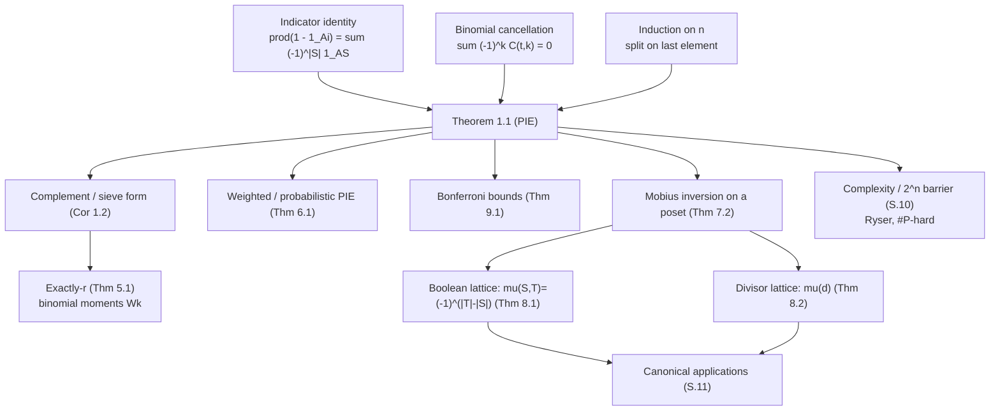

# Inclusion-Exclusion Principle (PIE) — Mathematical Foundations

## Table of Contents
1. [Formal Statement and Notation](#1-formal-statement-and-notation)
2. [Proof I — Indicator Functions (Algebraic)](#2-proof-i--indicator-functions)
3. [Proof II — Element Counting (Binomial Cancellation)](#3-proof-ii--element-counting)
4. [Proof III — Induction on the Number of Sets](#4-proof-iii--induction)
5. [The Complement Form and the Sieve Formula](#5-the-complement-form)
6. [The Weighted / Measure-Theoretic PIE](#6-the-weighted-pie)
7. [Möbius Inversion over a Poset (The Generalization)](#7-mobius-inversion-over-a-poset)
8. [The Boolean Lattice and the Divisor Lattice](#8-boolean-and-divisor-lattices)
9. [Bonferroni Inequalities (Truncated PIE)](#9-bonferroni-inequalities)
10. [Complexity, Limits, and the 2^n Barrier](#10-complexity-limits-and-the-2n-barrier)
11. [Canonical Applications, Derived Formally](#11-canonical-applications)
12. [Summary](#12-summary)

---

## 1. Formal Statement and Notation

Let `(Ω, |·|)` be a finite universe with the counting measure (`|X|` = number of elements). Let `A₁, …, Aₙ ⊆ Ω`. For a subset `S ⊆ [n] := {1, …, n}` write `A_S := ⋂_{i∈S} Aᵢ`, with the convention `A_∅ = Ω` (the empty intersection is the whole universe).

**Theorem 1.1 (Inclusion-Exclusion Principle).**

```
| ⋃_{i=1}^{n} Aᵢ | = Σ_{∅ ≠ S ⊆ [n]} (−1)^(|S|+1) |A_S|
                   = Σ_{k=1}^{n} (−1)^(k+1) Σ_{|S|=k} |A_S|.
```

**Corollary 1.2 (Complement form).** Writing `Aᵢ^c` for the complement and noting `⋂ Aᵢ^c = Ω ∖ ⋃ Aᵢ`,

```
| ⋂_{i=1}^{n} Aᵢ^c | = Σ_{S ⊆ [n]} (−1)^|S| |A_S|
                     = |Ω| − Σ|Aᵢ| + Σ|Aᵢ∩Aⱼ| − …
```

where the sum now **includes** `S = ∅`, contributing `+|Ω|`.

**Notation.** `[P]` is the Iverson bracket (`1` if `P` true, else `0`). `1_A : Ω → {0,1}` is the indicator function of `A`. `ω(m)` denotes the number of distinct prime factors of `m`. `rad(m) = ∏_{p|m} p` is the radical. We use `μ` for both the subset-lattice sign and the number-theoretic Möbius function; Section 8 shows they coincide.

**Roadmap.** Sections 2–4 prove Theorem 1.1 three independent ways (indicator algebra, element counting, induction). Section 5 derives the complement/sieve form. Section 6 lifts PIE to arbitrary measures. Sections 7–8 generalize it to Möbius inversion on a poset, identifying the Boolean and divisor lattices as the two cases this topic and sibling `32-mobius-inversion` care about. Section 9 gives the Bonferroni one-sided bounds. Section 10 fixes the complexity and the `2ⁿ` barrier. Section 11 derives the canonical applications rigorously.

### 1.1 The logical structure of this document



The three independent proofs (indicator, binomial, induction) all establish the same Theorem 1.1; everything downstream is a specialization (complement, exactly-`r`), a generalization (weighted, Möbius), a relaxation (Bonferroni), or a cost analysis. Read the diagram top-down for dependencies, bottom-up for "what is this used for".

---

## 2. Proof I — Indicator Functions

This is the cleanest proof: it reduces PIE to a pointwise algebraic identity.

**Lemma 2.1.** For any `A ⊆ Ω`, `1_{A^c} = 1 − 1_A`, and for intersections `1_{A_S} = ∏_{i∈S} 1_{Aᵢ}`.

*Proof.* `x ∈ A^c ⟺ x ∉ A`, so `1_{A^c}(x) = 1 − 1_A(x)`. And `x ∈ ⋂_{i∈S} Aᵢ ⟺ x ∈ Aᵢ ∀ i∈S ⟺ ∏_{i∈S} 1_{Aᵢ}(x) = 1`. ∎

**Theorem 2.2.** Theorem 1.1 holds.

*Proof.* Consider the complement of the union and expand the product of `(1 − 1_{Aᵢ})`:

```
1_{(⋃ Aᵢ)^c}(x) = ∏_{i=1}^{n} (1 − 1_{Aᵢ}(x))
                = Σ_{S ⊆ [n]} ∏_{i∈S} (−1_{Aᵢ}(x))
                = Σ_{S ⊆ [n]} (−1)^|S| ∏_{i∈S} 1_{Aᵢ}(x)
                = Σ_{S ⊆ [n]} (−1)^|S| 1_{A_S}(x).
```

The second equality is the distributive expansion of an `n`-fold product (one term per choice, for each factor, of `1` or `−1_{Aᵢ}`; choosing `−1_{Aᵢ}` exactly for `i ∈ S`). Sum both sides over all `x ∈ Ω`. Since `Σ_x 1_{A_S}(x) = |A_S|`:

```
|(⋃ Aᵢ)^c| = Σ_{S ⊆ [n]} (−1)^|S| |A_S|.            (★)
```

That is Corollary 1.2. Moving the `S = ∅` term (`+|Ω|`) to the left and using `|(⋃Aᵢ)^c| = |Ω| − |⋃Aᵢ|`:

```
|Ω| − |⋃Aᵢ| = |Ω| + Σ_{∅≠S} (−1)^|S| |A_S|
⟹ |⋃Aᵢ| = − Σ_{∅≠S} (−1)^|S| |A_S| = Σ_{∅≠S} (−1)^(|S|+1) |A_S|.  ∎
```

The whole principle is the algebraic identity `∏(1 − xᵢ) = Σ_S (−1)^|S| ∏_{i∈S} xᵢ` evaluated at indicators and summed. This is the proof to remember: it generalizes verbatim to any measure (Section 6) because it never used that `|·|` was a *count* — only additivity.

### 2.1 Worked indicator expansion (`n = 2`)

For two sets, the product expands to four terms:

```
(1 − 1_{A})(1 − 1_{B}) = 1 − 1_A − 1_B + 1_A·1_B = 1 − 1_A − 1_B + 1_{A∩B}.
```

Summing over `Ω`: `|(A∪B)^c| = |Ω| − |A| − |B| + |A∩B|`, hence `|A∪B| = |A| + |B| − |A∩B|`. Each of the `2² = 4` subsets `{∅, {A}, {B}, {A,B}}` corresponds to one expanded term with sign `(−1)^|S|`. Evaluated pointwise at an element `x ∈ A∩B`: `(1−1)(1−1) = 0`, correctly saying `x` is *not* in the complement of the union. At `x ∉ A∪B`: `(1−0)(1−0) = 1`, correctly counting it in the complement. The algebra *is* the casework, automated.

### 2.2 Why the expansion is exactly `2^n` terms

Distributing an `n`-fold product `∏_{i=1}^{n}(1 − 1_{Aᵢ})` chooses, independently for each factor, either the `1` or the `−1_{Aᵢ}` summand — `2^n` choices, one per subset `S` (those factors where `−1_{Aᵢ}` was chosen). The chosen term is `(−1)^{|S|} ∏_{i∈S}1_{Aᵢ} = (−1)^{|S|}1_{A_S}`. So the `2^n` terms of PIE are not an accident of the formula; they are the leaves of the binary "include / exclude" decision tree over the `n` factors — the same tree the bitmask loop and the DFS of `senior.md` enumerate.

---

## 3. Proof II — Element Counting (Binomial Cancellation)

This proof exposes *why* the alternation works, element by element.

**Theorem 3.1.** Theorem 1.1 holds.

*Proof.* Fix `x ∈ Ω` and let `t = t(x) = #{i : x ∈ Aᵢ}` be the number of sets containing `x`. We show `x` contributes exactly `[t ≥ 1]` (i.e. `1` if `x` is in the union, `0` otherwise) to the right-hand side of Theorem 1.1.

`x` belongs to `A_S` iff `S ⊆ {i : x ∈ Aᵢ}`, and there are `C(t, k)` subsets `S` of size `k` contained in that `t`-element index set. Hence `x`'s contribution to `Σ_{∅≠S}(−1)^(|S|+1)|A_S|` is:

```
Σ_{k=1}^{t} (−1)^(k+1) C(t, k).
```

For `t = 0` the sum is empty, giving `0` — correct, `x` is not in the union. For `t ≥ 1`, apply the binomial theorem `Σ_{k=0}^{t} (−1)^k C(t,k) = (1 − 1)^t = 0`:

```
Σ_{k=1}^{t} (−1)^(k+1) C(t,k) = −Σ_{k=1}^{t} (−1)^k C(t,k)
   = −[ Σ_{k=0}^{t} (−1)^k C(t,k) − C(t,0) ]
   = −[ 0 − 1 ] = 1.
```

So every `x` in the union contributes `1` and every `x` outside contributes `0`. Summing over `x` gives `|⋃Aᵢ|` on both sides. ∎

**Worked cancellation (`t = 3`).** An element in exactly 3 sets contributes `C(3,1) − C(3,2) + C(3,3) = 3 − 3 + 1 = 1`. The `+3` from singles, `−3` from pairs, `+1` from the triple collapse to `1` — the binomial-row identity `(1−1)^3 = 0` made concrete. This is the formal version of the junior-level "the center point gets counted +1 net" argument. Geometrically: in the three-circle Venn diagram, the central region lies in `C(3,1)=3` single circles, `C(3,2)=3` pairwise lenses, and `C(3,3)=1` triple intersection; adding singles, subtracting pairs, adding the triple counts it `3−3+1=1` time, exactly as the union demands.

**Worked cancellation (`t = 4`).** An element in 4 sets contributes `C(4,1)−C(4,2)+C(4,3)−C(4,4) = 4 − 6 + 4 − 1 = 1` — again exactly once, the alternating row of Pascal's triangle summing to `0` after restoring the missing `C(4,0)=1`. The pattern `Σ_{k=1}^{t}(−1)^{k+1}C(t,k) = 1` for every `t ≥ 1` is the heart of correctness, and it is *uniform* in `t`: no matter how many sets an element belongs to, the alternation nets exactly one count. This uniformity is what makes PIE a single formula rather than a case analysis on overlap multiplicity.

### 3.1 The generating-function view

The element-counting proof is the coefficient extraction of a generating function. Assign each element the formal variable `x^{t(x)}` and form `Σ_x x^{t(x)} = Σ_{t≥0} c_t x^t`, where `c_t` is the number of elements in exactly `t` sets. The binomial moment `Wₖ = Σ_x C(t(x), k) = Σ_t c_t C(t,k)` is the value of the `k`-th "binomial transform" of the sequence `c_t`. PIE inverts this transform: `c_r = Σ_k (−1)^{k−r} C(k,r) Wₖ` (Theorem 5.1). The inversion is precisely the statement that the matrices `[C(t,k)]` and `[(−1)^{k−r}C(k,r)]` are inverse — a fact equivalent to `(1+x)` and `(1−x)`... more carefully, to the umbral relation `Δ` (finite difference) being inverted by summation. This places PIE inside the theory of the **binomial transform**, the discrete analogue of multiplying by `e^{±x}`.

---

## 4. Proof III — Induction

**Theorem 4.1.** Theorem 1.1 holds, by induction on `n`.

*Proof.* **Base `n = 1`:** `|A₁| = |A₁|`. **Base `n = 2`:** `|A₁ ∪ A₂| = |A₁| + |A₂| − |A₁ ∩ A₂|` because `A₁ ∪ A₂` is the disjoint union of `A₁ ∖ A₂`, `A₂ ∖ A₁`, and `A₁ ∩ A₂`; counting `|A₁| + |A₂|` tallies the middle twice, so subtract it once.

**Inductive step.** Assume the formula for `n − 1` sets. Let `B = ⋃_{i=1}^{n-1} Aᵢ`. By the `n = 2` case,

```
|⋃_{i=1}^{n} Aᵢ| = |B ∪ Aₙ| = |B| + |Aₙ| − |B ∩ Aₙ|.
```

Now `B ∩ Aₙ = ⋃_{i=1}^{n-1} (Aᵢ ∩ Aₙ)`, a union of `n − 1` sets. Apply the inductive hypothesis to both `|B|` and `|B ∩ Aₙ|`:

```
|B|        = Σ_{∅≠S⊆[n-1]} (−1)^(|S|+1) |A_S|
|B ∩ Aₙ|   = Σ_{∅≠S⊆[n-1]} (−1)^(|S|+1) |A_S ∩ Aₙ|.
```

Substitute. The terms from `|B|` are exactly the PIE terms of subsets `S ⊆ [n]` *not* containing `n`. The `+|Aₙ|` term is the singleton `{n}`. The `−|B ∩ Aₙ|` terms become, with the sign flip from the leading `−`, the PIE terms of subsets `S ∪ {n}` *containing* `n` (note `(−1)^(|S|+1)` with the extra `−` and the extra element `n` gives `(−1)^(|S∪{n}|+1)`). Together these enumerate every nonempty `S ⊆ [n]` exactly once with the correct sign. ∎

This proof is the one that turns into the **DFS / subset-tree algorithm** of `senior.md`: splitting on "does `S` contain element `n`?" is exactly the recursion `dfs(idx)` branches on.

### 4.1 Worked induction step

Take `n = 3`, `B = A₁ ∪ A₂`. The `n = 2` step gives `|A₁∪A₂∪A₃| = |B| + |A₃| − |B∩A₃|`. Expand `|B| = |A₁|+|A₂|−|A₁∩A₂|` (inductive hypothesis on 2 sets) and `|B∩A₃| = |(A₁∩A₃)∪(A₂∩A₃)| = |A₁∩A₃|+|A₂∩A₃|−|A₁∩A₂∩A₃|`. Substituting:

```
|A₁∪A₂∪A₃| = (|A₁|+|A₂|−|A₁∩A₂|) + |A₃| − (|A₁∩A₃|+|A₂∩A₃|−|A₁∩A₂∩A₃|)
           = |A₁|+|A₂|+|A₃| − |A₁∩A₂|−|A₁∩A₃|−|A₂∩A₃| + |A₁∩A₂∩A₃|,
```

the three-set formula. The terms *not* containing `A₃` came from `|B|`; the singleton `|A₃|`; and the terms *containing* `A₃` came (with a flipped sign) from `−|B∩A₃|`. This "partition by membership of the last element" is the algorithmic skeleton of the recursive subset enumeration.

---

## 5. The Complement Form and the Sieve Formula

Corollary 1.2 — the "none of the properties" count — is the form most applications use. Define the **sieve function**

```
N_{=0} := |{x : x ∈ no Aᵢ}| = Σ_{S⊆[n]} (−1)^|S| |A_S|.
```

More generally, the number of `x` in **exactly `r`** of the sets is given by the **PIE for exactly `r`** (a refinement, sometimes called the *Charlier* / *Schuette–Nesbitt* formula):

**Theorem 5.1 (Exactly-`r` count).** Let `Eᵣ = #{x : x lies in exactly r of the Aᵢ}` and `Wₖ = Σ_{|S|=k} |A_S|` (the `k`-th "binomial moment"). Then

```
Eᵣ = Σ_{k=r}^{n} (−1)^(k−r) C(k, r) Wₖ.
```

*Proof.* An `x` in exactly `t` sets contributes to `Wₖ` a count of `C(t, k)` (one per size-`k` subset of its `t` sets). So `x`'s contribution to the RHS is `Σ_{k≥r} (−1)^(k−r) C(k,r) C(t,k)`. Using the subset-of-subset identity `C(t,k)C(k,r) = C(t,r)C(t−r, k−r)`:

```
Σ_{k=r}^{t} (−1)^(k−r) C(t,r) C(t−r, k−r) = C(t,r) Σ_{j=0}^{t−r} (−1)^j C(t−r, j) = C(t,r)(1−1)^{t−r}.
```

This is `0` unless `t = r` (when the sum is `C(r,r)·1 = 1`). So only elements in exactly `r` sets contribute, each once: RHS `= Eᵣ`. ∎

Setting `r = 0` recovers the complement form (`E₀ = Σ_k (−1)^k Wₖ`); the union is `Σ_{r≥1} Eᵣ = |Ω| − E₀`. Theorem 5.1 is the full strength of PIE: it computes the *entire distribution* of "how many properties each element has", not just "at least one".

**Worked exactly-`r`.** Three sets with `W₁ = 1200`, `W₂ = 260`, `W₃ = 30` (the dedup example of `senior.md`). Then `E₀ = N − 1200 + 260 − 30`, and `E₁ = W₁ − 2W₂ + 3W₃ = 1200 − 520 + 90 = 770` (people in exactly one campaign), `E₂ = W₂ − 3W₃ = 260 − 90 = 170` (exactly two), `E₃ = W₃ = 30` (all three). Check: `E₁+E₂+E₃ = 770+170+30 = 970 = ` the union. The binomial moments `Wₖ` carry strictly more information than the union alone.

**The "at least `r`" variant.** A companion to Theorem 5.1 counts elements in **at least `r`** sets: `L_r = Σ_{k=r}^{n}(−1)^{k−r}C(k−1,r−1)Wₖ`. For the same moments, `L_2 = W₂ − 2W₃ = 260 − 60 = 200 = E₂ + E₃ = 170 + 30` ✓ (people in two-or-more campaigns). The three quantities — union (`L_1`), exactly-`r` (`E_r`), at-least-`r` (`L_r`) — are all linear functions of the binomial-moment vector `(W_1,…,W_n)`, and each is obtained by a different signed binomial weighting. This is the full reach of PIE: from the `n` moments you reconstruct the entire overlap-multiplicity profile of the universe.

---

## 6. The Weighted / Measure-Theoretic PIE

PIE never used that `|·|` counts elements — only that it is **additive**. Let `w : Ω → ℝ` be any weight, and `W(X) = Σ_{x∈X} w(x)`.

**Theorem 6.1 (Weighted PIE).** `W(⋃ Aᵢ) = Σ_{∅≠S} (−1)^(|S|+1) W(A_S)`.

*Proof.* Multiply the pointwise identity (★) of Section 2 by `w(x)` and sum; additivity of `Σ w(x)` over `x` is all that is needed. ∎

**Corollary 6.2 (Probabilistic PIE).** For events `A₁, …, Aₙ` in a probability space, taking `w` = the probability measure,

```
Pr(⋃ Aᵢ) = Σ_{∅≠S} (−1)^(|S|+1) Pr(⋂_{i∈S} Aᵢ).
```

This is the form used to compute the probability that *at least one* of several events occurs. The same proof, the same alternation; only the meaning of `|·|` changed from "count" to "probability" to "integral against a measure". This unifies the combinatorial PIE of this topic with the probabilistic union bound and the measure-theoretic inclusion-exclusion.

### 6.1 Worked probabilistic PIE — the matching problem

`n` letters are placed at random into `n` addressed envelopes. What is the probability that **at least one** letter reaches its correct envelope? Let `Aᵢ` = "letter `i` is correct". By symmetry `Pr(A_S) = (n−|S|)!/n!` for `|S| = k`, and there are `C(n,k)` such subsets. By Corollary 6.2:

```
Pr(⋃Aᵢ) = Σ_{k=1}^{n} (−1)^{k+1} C(n,k) (n−k)!/n!
        = Σ_{k=1}^{n} (−1)^{k+1}/k! = 1 − Σ_{k=0}^{n}(−1)^k/k! → 1 − 1/e ≈ 0.632.
```

So the probability of **no** correct letter is `Σ(−1)^k/k! → 1/e ≈ 0.368` — the derangement density of `§11.2`, derived here purely probabilistically. Remarkably, this probability is *essentially independent of `n`* for `n ≥ 4`: shuffling 5 cards or 5 million cards, the chance that nothing lands in place is ~37%. PIE turns a daunting "at least one match" question into a truncated exponential series.

### 6.2 Why the weighted proof needs only additivity

The indicator identity `1_{(⋃Aᵢ)^c} = ∏(1−1_{Aᵢ})` is an equation of *functions on `Ω`*; integrating both sides against any countably-additive measure `μ` preserves it because integration is linear. Nothing in the derivation used that `μ` is a counting measure, that `Ω` is finite, or that the `Aᵢ` are "nice". Consequently PIE holds for finite measures, probability measures, and (with the obvious convergence caveats) signed measures alike. This is why the *same* eight applications of `§11` reappear in probability (matching, coupon collector, sieve methods) with `|·|` read as `Pr(·)`.

---

## 7. Möbius Inversion over a Poset

PIE is the special case of a far more general theorem about partially ordered sets (posets). This section states it; Section 8 specializes back to PIE, and sibling `32-mobius-inversion` develops it fully.

**Definition 7.1 (Incidence algebra & Möbius function).** Let `(P, ≤)` be a locally finite poset. The **Möbius function** `μ_P : {(x,y) : x ≤ y} → ℤ` is defined recursively by

```
μ_P(x, x) = 1,
μ_P(x, y) = − Σ_{x ≤ z < y} μ_P(x, z)   for x < y.
```

**Theorem 7.2 (Möbius Inversion).** For functions `f, g : P → ℝ`,

```
g(x) = Σ_{y ≤ x} f(y)   for all x   ⟺   f(x) = Σ_{y ≤ x} μ_P(y, x) g(y)   for all x.
```

(There is a dual "upward" form with `y ≥ x`.) *Proof.* The relation "`g = ζ * f`" in the incidence algebra (where `ζ` is the zeta function, `ζ(x,y)=1` for `x≤y`) inverts to `f = μ * g` because `μ` is by construction the convolution inverse of `ζ`: `Σ_{x≤z≤y} μ(x,z)ζ(z,y) = [x=y]`. ∎

The Möbius function *is* the abstract, signed "undo" operator; PIE's alternating sign is `μ` for one particular poset.

### 7.1 Worked Möbius function on a small poset

Take the divisor poset of `12 = 2²·3`: elements `{1,2,3,4,6,12}` ordered by divisibility. Compute `μ(1, ·)` bottom-up:

```
μ(1,1)  = 1
μ(1,2)  = −μ(1,1) = −1
μ(1,3)  = −μ(1,1) = −1
μ(1,4)  = −(μ(1,1)+μ(1,2)) = −(1−1) = 0      (4 = 2², not squarefree)
μ(1,6)  = −(μ(1,1)+μ(1,2)+μ(1,3)) = −(1−1−1) = 1
μ(1,12) = −(μ(1,1)+μ(1,2)+μ(1,3)+μ(1,4)+μ(1,6)) = −(1−1−1+0+1) = 0.
```

These are exactly the classical `μ(1)=1, μ(2)=−1, μ(3)=−1, μ(4)=0, μ(6)=1, μ(12)=0` — confirming Theorem 8.2 on a concrete interval. The zeros at `4` and `12` are the non-squarefree elements, where the interval `[1, d]` is **not** a Boolean lattice and the recursion cancels to `0`.

### 7.2 Worked Möbius inversion

Let `g(n) = Σ_{d|n} f(d)` with `f(d) = d` (so `g = ` sum-of-divisors `σ`). For `n = 6`: `g(6) = f(1)+f(2)+f(3)+f(6) = 1+2+3+6 = 12`. Möbius inversion recovers `f(6) = Σ_{d|6} μ(6/d) g(d) = μ(6)g(1) + μ(3)g(2) + μ(2)g(3) + μ(1)g(6) = 1·1 + (−1)·3 + (−1)·4 + 1·12 = 1−3−4+12 = 6 = f(6)`. ✓ The inversion is PIE's "recover the exact-membership counts from the at-least counts" on the divisor lattice.

---

## 8. Boolean and Divisor Lattices

**Theorem 8.1 (PIE = Möbius on the Boolean lattice).** Let `P = (2^[n], ⊆)` be the lattice of subsets of `[n]`. Its Möbius function is

```
μ(S, T) = (−1)^(|T| − |S|)   for S ⊆ T,  else 0.
```

*Proof.* By induction on `|T| − |S|`, or directly: the interval `[S, T]` is isomorphic to the Boolean lattice `2^{T∖S}`, and `Σ_{S⊆U⊆T} (−1)^(|U|−|S|) = (1−1)^{|T|−|S|} = [S=T]`, the defining relation. ∎

Apply Möbius inversion with `g(S) = |A_S|`... more directly: define `f(S) = #{x : x lies in *exactly* the sets indexed by S}` and `g(S) = |A_S| = #{x : x lies in *at least* the sets indexed by S} = Σ_{T ⊇ S} f(T)`. Upward Möbius inversion gives `f(S) = Σ_{T⊇S} (−1)^(|T|−|S|) g(T)`. The complement count `E₀ = f(∅) = Σ_{T} (−1)^|T| |A_T|` — **exactly Corollary 1.2.** So PIE is Möbius inversion on the Boolean lattice; the sign `(−1)^|S|` is the lattice's Möbius function.

**Theorem 8.2 (Number-theoretic Möbius is the divisor lattice).** Let `P = (divisors of m, |)` ordered by divisibility. Then `μ_P(d, e) = μ(e/d)`, the classical Möbius function (`μ(1)=1`, `μ(squarefree with k primes)=(−1)^k`, `μ(non-squarefree)=0`).

*Proof.* The interval `[d, e]` under divisibility is isomorphic to the Boolean lattice on the prime factors of `e/d` (when `e/d` squarefree) and is *not* a Boolean lattice otherwise — but the recursion forces `μ(d,e)=0` when `e/d` has a squared factor. The squarefree case reduces to Theorem 8.1. ∎

### 8.1 Worked Boolean-lattice Möbius

For `n = 2`, the subset lattice `2^{{1,2}}` has intervals; `μ(∅, {1,2}) = (−1)^{2−0} = 1`, `μ(∅, {1}) = (−1)^{1} = −1`, `μ(∅, ∅) = 1`. The defining relation on the interval `[∅, {1,2}]`: `Σ_{∅⊆U⊆{1,2}}μ(∅,U) = μ(∅,∅)+μ(∅,{1})+μ(∅,{2})+μ(∅,{1,2}) = 1 − 1 − 1 + 1 = 0` for the strictly-below part... precisely `(1−1)^2 = 0`, the Boolean-lattice identity. These signs `+,−,−,+` are exactly the PIE coefficients of the two-set complement formula `|Ω| − |A| − |B| + |A∩B|`.

**Consequence (PIE over prime factors = Möbius sum).** Counting `x ∈ [1,N]` coprime to `m` is PIE over the sets `Aₚ = {x : p | x}` for `p | m`. A subset `S` of primes ↔ the squarefree divisor `d = ∏_{p∈S} p`, with `|A_S| = ⌊N/d⌋` and sign `(−1)^|S| = μ(d)`. Hence

```
#(coprime to m) = Σ_{d | rad(m)} μ(d) ⌊N/d⌋,
```

the Boolean-lattice PIE and the divisor-lattice Möbius sum being literally the same expression. When `N = m` this is the totient `φ(m) = Σ_{d|m} μ(d)(m/d) = m∏(1−1/p)` (sibling `05-fermat-euler`). The general lattice viewpoint (sibling `32-mobius-inversion`) is what lets the same machinery count over GCD-lattices, subgroup lattices, and beyond.

---

## 9. Bonferroni Inequalities (Truncated PIE)

In practice (and in proofs) one often cannot or need not sum all `2ⁿ` terms. Truncating PIE after the `k`-th order gives provable one-sided bounds.

**Theorem 9.1 (Bonferroni).** Let `Sₖ = Σ_{|T|=k} |A_T|`. The partial sums `B_m = Σ_{k=1}^{m} (−1)^(k+1) Sₖ` satisfy:

```
|⋃ Aᵢ| ≤ B_m   if m is odd,
|⋃ Aᵢ| ≥ B_m   if m is even.
```

In particular `|⋃ Aᵢ| ≤ Σ|Aᵢ|` (union bound, `m=1`) and `|⋃ Aᵢ| ≥ Σ|Aᵢ| − Σ|Aᵢ∩Aⱼ|` (`m=2`).

*Proof.* For an element in `t ≥ 1` sets, its contribution to `B_m` is `Σ_{k=1}^{m}(−1)^(k+1)C(t,k)`. The partial sums of the alternating binomial row `Σ_{k=0}^{m}(−1)^k C(t,k) = (−1)^m C(t−1, m)` (a standard identity), so the per-element error of `B_m` versus the true `1` has sign `(−1)^m` and magnitude `C(t−1,m) ≥ 0`. Summing over elements, `B_m − |⋃Aᵢ|` has sign `(−1)^(m+1)`... i.e. `B_m ≥ union` for `m` odd and `≤` for `m` even. ∎

**Significance.** Bonferroni bounds let you *stop early*: compute only first- and second-order terms and still bracket the answer. This is the rigorous basis for the union bound in probability and for truncating PIE when high-order intersections are expensive or estimated (the error-amplification concern of `senior.md` §5).

### 9.1 Worked Bonferroni bracketing

Using the dedup moments `W₁ = 1200, W₂ = 260, W₃ = 30` (true union `970`):

```
B₁ = 1200             (m=1, odd)  ≥ 970   over-estimate
B₂ = 1200 − 260 = 940 (m=2, even) ≤ 970   under-estimate
B₃ = 940 + 30 = 970   (m=3, odd, = n) = 970 exact.
```

The partial sums oscillate around the true value, tightening monotonically: `940 ≤ 970 ≤ 1200`, then exact at `m = n`. The magnitude of the error of `B_m` is bounded by the first omitted term `W_{m+1}`, which is why discarding small high-order moments costs little. In probability the `m=1` bound is the **union bound** `Pr(⋃Aᵢ) ≤ ΣPr(Aᵢ)`, and the `m=2` bound `Pr(⋃Aᵢ) ≥ ΣPr(Aᵢ) − ΣPr(Aᵢ∩Aⱼ)` is the second Bonferroni inequality central to the probabilistic method.

### 9.2 Why the bounds alternate

The per-element error of `B_m` is `(−1)^m C(t−1, m)` (from `Σ_{k=0}^{m}(−1)^k C(t,k) = (−1)^m C(t−1,m)`). For `m` odd this is `≤ 0` per element, so `B_m` exceeds the per-element truth of `1` — an over-estimate; for `m` even it is `≥ 0`, an under-estimate. Because `C(t−1,m) ≥ 0` always, the *direction* of the error is fixed by the parity of `m`, never mixed across elements. That uniform sign upgrades "approximate sum" to "rigorous one-sided bound" — the reason Bonferroni is a theorem, not a heuristic.

### 9.3 The symmetric-function / binomial-transform viewpoint

The binomial moments `Wₖ = Σ_{|S|=k}|A_S|` are the statistics that tie PIE, the exactly-`r` formula, and Bonferroni into a single linear-algebraic object. Encode the count of elements in exactly `t` sets as `c_t`; then `Wₖ = Σ_t c_t C(t,k)`, i.e. `Wₖ` is the `k`-th *binomial moment* of `(c_t)`. The map `(c_t) ↦ (Wₖ)` is the lower-triangular matrix `M_{kt} = C(t,k)`, and its inverse is the signed binomial matrix `(M^{-1})_{tk} = (−1)^{t−k}C(k,t)`. Each PIE-family identity is then literally a row of `M^{-1}` applied to the moment vector:

| Quantity | Formula | Which row of the transform |
|----------|---------|----------------------------|
| Union `\|⋃Aᵢ\|` | `Σ_k (−1)^{k+1} Wₖ` | full alternating sum |
| Exactly-`r` `Eᵣ` | `Σ_{k≥r}(−1)^{k−r}C(k,r)Wₖ` | `r`-th inverse row (Thm 5.1) |
| At-least-`r` `Lᵣ` | `Σ_{k≥r}(−1)^{k−r}C(k−1,r−1)Wₖ` | cumulative inverse row |
| Bonferroni `B_m` | truncation of the union row | partial sum, one-sided |

This is why every result in the chapter carries the alternating-binomial signature `(1−1)^j = 0`: they are all the *same* inversion, read off different rows. The moment vector `(W₁,…,Wₙ)` is the complete sufficient statistic; the membership-multiplicity profile `(c_t)` is recovered from it by the inverse binomial transform — the discrete analogue of multiplying a generating function by `e^{−x}`.

---

## 10. Complexity, Limits, and the 2^n Barrier

**Proposition 10.1 (Term count).** Full PIE over `n` sets has `2ⁿ − 1` nonempty terms; computing each intersection size in `O(c)` gives total time `Θ(2ⁿ · c)` and `O(1)` extra space (a running sum).

**The barrier is intrinsic in general.** Without structure, the `2ⁿ` cannot be avoided: the binomial moments `W₁, …, Wₙ` are independent inputs, and reconstructing the union from them requires reading all of them in the worst case. Concretely, counting the permanent of a 0/1 matrix (a #P-complete problem) has a PIE formula (Ryser's formula) with `2ⁿ` terms, and no polynomial algorithm is known — PIE is the *best known* approach, and its exponential cost reflects genuine hardness.

**Theorem 10.2 (Ryser's formula for the permanent).** For an `n×n` matrix `A`,

```
perm(A) = (−1)^n Σ_{S ⊆ [n]} (−1)^|S| ∏_{i=1}^{n} Σ_{j∈S} a_{ij}.
```

This is PIE applied to "every column is used", and at `Θ(2ⁿ · n)` it remains the fastest known general permanent algorithm — a concrete monument to the `2ⁿ` barrier.

**When `2ⁿ` collapses.** The exponential vanishes when terms of equal `|S|` are interchangeable (derangements, surjections: `O(n)`), when intersections vanish above some order (pruning, Bonferroni truncation), or when the lattice has structure exploitable by a sieve (Möbius over `[1,N]`: `O(N log log N)` or `O(√N)`). The senior-level decision tree is precisely "does my instance have one of these structures, or am I stuck at `2ⁿ`?"

**Proposition 10.3 (Acceptability rule of thumb).** With ~`10⁹` simple ops/sec, `2ⁿ·n` is sub-second for `n ≤ 25`, minutes near `n = 30`, and infeasible past `n ≈ 40`. So unstructured PIE is a *small-n* technique; structure or approximation is mandatory beyond.

**Lower bound intuition.** One cannot do better than `2^n` in the worst case without extra structure: consider an adversary who fixes all binomial moments except a single high-order one `W_n = |A_{[n]}|`. The union depends on `W_n` with coefficient `(−1)^{n+1} ≠ 0`, so any correct algorithm must in principle read information that distinguishes the value of the full intersection — which, for arbitrary set systems, requires examining the size of that `n`-fold intersection. The PIE formula attains this by enumerating every subset; the genuine hardness (the permanent, Theorem 10.2, is #P-complete) certifies that the exponential is not mere algorithmic laziness but an apparent intrinsic cost.

| Method | Time | Space | Exactness |
|--------|------|-------|-----------|
| Full PIE | `Θ(2ⁿ n)` | O(1) | exact |
| Same-size collapse (derangement/surjection) | `O(n)` | O(1) | exact |
| DFS-pruned PIE | `≤ 2ⁿ`, data-dependent | O(n) | exact |
| Möbius/sieve over `[1,N]` | `O(N log log N)` or `O(√N)` | O(N) or O(√N) | exact |
| Bonferroni truncation (order `m`) | `Θ(nᵐ)` | O(1) | one-sided bound |
| HyperLogLog union | `O(n·b)` | `O(b)` | ~2% relative |

### 10.1 Worked: the same-size collapse, formally

The `O(n)` collapse of `§11.2`–`§11.3` is the statement that when `|A_S|` depends only on `k = |S|`, the `2ⁿ` sum factors through the `n+1` binomial coefficients. Write `|A_S| = a_k` for all `|S| = k`. Then

```
Σ_{S⊆[n]} (−1)^|S| |A_S| = Σ_{k=0}^{n} (−1)^k (#subsets of size k) a_k = Σ_{k=0}^{n} (−1)^k C(n,k) a_k.
```

The right side has `n+1` terms, not `2ⁿ`. Derangements are `a_k = (n−k)!`, surjections `a_k = (m−k)^n`. The *only* hypothesis is the symmetry `|A_S| = a_{|S|}`; whenever the bad-events are interchangeable (no event is "special"), the exponential collapses. This is the formal version of the `middle.md` "same-size collapse" table and the single most important complexity win in applied PIE.

### 10.2 Worked: Ryser's formula term count

For a `4×4` matrix Ryser's formula (Theorem 10.2) sums over `2⁴ = 16` subsets `S ⊆ {1,2,3,4}`, each contributing `(−1)^|S| ∏_i (Σ_{j∈S} a_{ij})` — a product of 4 row-sums-over-`S`, `O(n)` work per subset, hence `Θ(2ⁿ n) = 16·4 = 64` multiply-adds versus the `4! = 24` permutations of the naive permanent. The `2ⁿ` only beats `n!` for `n ≳ 4`; for `n = 20`, `2²⁰·20 ≈ 2·10⁷` vastly beats `20! ≈ 2.4·10¹⁸`. The formula is exact and remains, decades on, the asymptotically fastest known general permanent algorithm — the concrete face of the `2ⁿ` barrier being *intrinsic*, not lazy.

---

## 11. Canonical Applications

Each is PIE/complement applied to a specific universe and bad-event family; the formulas were stated in `middle.md` and are proven here.

**11.1 Euler's totient.** `Ω = [1,m]`, `Aₚ = {x : p|x}` for distinct primes `p|m`, `|A_S| = m/∏_{p∈S}p`. Complement form: `φ(m) = Σ_{S}(−1)^|S| m/∏p = m∏_{p|m}(1−1/p)`. ∎ **Worked (`m=30=2·3·5`):** `φ(30) = 30 − 15 − 10 − 6 + 5 + 3 + 2 − 1 = 8` — the eight coprime residues `{1,7,11,13,17,19,23,29}`, and indeed `30·½·⅔·⅘ = 8`.

**11.2 Derangements.** `Ω = Sₙ` (all permutations), `Aᵢ = {π : π(i)=i}`, `|A_S| = (n−|S|)!`. Complement: `D(n) = Σ_{k=0}^{n}(−1)^k C(n,k)(n−k)! = n!Σ_{k=0}^{n}(−1)^k/k!`. Since `Σ_{k=0}^{∞}(−1)^k/k! = e^{−1}`, `D(n) = round(n!/e)` for `n≥1`, and `D(n)=(n−1)(D(n−1)+D(n−2))`. ∎

**11.3 Surjections & Stirling numbers.** `Ω =` functions `[n]→[m]`, `Aᵢ = {f : i ∉ image(f)}`, `|A_S| = (m−|S|)^n`. Complement: `Surj(n,m) = Σ_{k=0}^{m}(−1)^k C(m,k)(m−k)^n`, and `S(n,m) = Surj(n,m)/m!` (Stirling 2nd kind). ∎ This also proves `Σ_m S(n,m)·m! ·` ... and the identity `m^n = Σ_k C(m,k)Surj(n,k)` by classifying functions by image size.

**11.4 Counting with forbidden positions (rook polynomials).** Placing `n` non-attacking rooks avoiding a forbidden board `B`: let `Aᵢ` be placements using forbidden cell `i`. The number of permutations avoiding all forbidden cells is `Σ_{k}(−1)^k rₖ (n−k)!`, where `rₖ` = number of ways to place `k` non-attacking rooks on `B` (the **rook polynomial** coefficients). Derangements are the special case where `B` is the main diagonal (`rₖ = C(n,k)`). ∎

**11.5 Squarefree / k-free counting.** `Aₚ = {x ≤ N : p²|x}`; complement gives `#squarefree = Σ_{d}(−1)^{ω(d)}⌊N/d²⌋ = Σ_{d≤√N}μ(d)⌊N/d²⌋ → N·6/π²`. ∎

**11.6 Counting coprime pairs.** `#{(a,b) ∈ [1,N]² : gcd(a,b)=1} = Σ_{d=1}^{N} μ(d)⌊N/d⌋²`, PIE over "both divisible by `d`" indexed by Möbius — the divisor-lattice form of Section 8. ∎

### 11.7 Worked: derangements of 4 letters

`D(4) = Σ_{k=0}^{4}(−1)^k C(4,k)(4−k)! = 24 − 4·6 + 6·2 − 4·1 + 1·1 = 24 − 24 + 12 − 4 + 1 = 9`. The nine derangements of `1234` are exactly the permutations with no number in its own place; `round(4!/e) = round(8.83) = 9` confirms the asymptotic. The recurrence check: `D(4) = 3(D(3)+D(2)) = 3(2+1) = 9`. ✓

### 11.8 Worked: surjections from 4 onto 2

`Surj(4,2) = Σ_{k=0}^{2}(−1)^k C(2,k)(2−k)^4 = 1·2^4 − 2·1^4 + 1·0^4 = 16 − 2 + 0 = 14`. The two excluded functions are the constant maps (everything → 1, everything → 2); all other `16 − 2 = 14` functions hit both outputs. Dividing by `2!` gives the Stirling number `S(4,2) = 7`: the seven ways to split `{1,2,3,4}` into two non-empty unlabeled blocks. ✓

### 11.7b Worked: coprime pairs up to 6

`#{(a,b) ∈ [1,6]² : gcd(a,b)=1} = Σ_{d=1}^{6} μ(d)⌊6/d⌋²` (Application 11.6). Compute term by term: `μ(1)·6² + μ(2)·3² + μ(3)·2² + μ(5)·1² = 36 − 9 − 4 − 1 = 22` (μ(4)=μ(6)=0 contribute nothing, and `⌊6/d⌋=0` for `d>6`). Direct enumeration of the 36 ordered pairs confirms 22 are coprime — the off-diagonal coprime pairs plus the single diagonal pair `(1,1)`. This is the divisor-lattice PIE: "both divisible by `d`" indexed by `μ(d)`, the two-dimensional analogue of the totient.

### 11.9 Worked: squarefree up to 30

`#squarefree ≤ 30 = Σ_{d=1}^{5} μ(d)⌊30/d²⌋ = μ(1)·30 + μ(2)·⌊30/4⌋ + μ(3)·⌊30/9⌋ + μ(5)·⌊30/25⌋` (μ(4)=0 omitted) `= 30 − 7 − 3 − 1 = 19`. The non-squarefree numbers ≤ 30 are the 11 multiples of `4, 9, 25` (deduplicated): `4,8,12,16,20,24,28` (mult. of 4), `9,18,27` (mult. of 9), `25` — eleven values, `30 − 11 = 19`. ✓ The density `19/30 = 0.633` already approaches `6/π² = 0.6079`.

---

## 11c. The Practical Algorithm and Its Invariant

The pseudocode below is the production form of all set-based PIE; its correctness is Theorem 1.1, its complexity Proposition 10.1.

```text
PIE_UNION(n, countIntersection):
  total ← 0
  for mask ← 1 to 2^n − 1:
    bits ← popcount(mask)
    term ← countIntersection(mask)          # |⋂ of sets selected by mask|
    if bits is odd: total ← total + term
    else:           total ← total − term
  return total
```

**Loop invariant.** After processing all masks with value `< M`, `total` equals the partial PIE sum over those subsets. *Maintenance:* each iteration adds the single correctly-signed term for subset `mask`. *Termination:* `mask` strictly increases and is bounded by `2^n − 1`, so the loop runs exactly `2^n − 1` times. *Postcondition:* `total = Σ_{∅≠S}(−1)^{|S|+1}|A_S| = |⋃Aᵢ|` by Theorem 1.1. ∎

**The pruned variant** (senior `§3`) replaces the flat loop with a DFS whose invariant is "the running intersection / LCM equals that of the current subset prefix", pruning when the term is provably 0; soundness requires the pruned quantity be **monotone** under adding elements (intersection shrinks, LCM grows), so a zero term implies all supersets are zero. This is the algorithmic content of Theorem 4.1's "membership of the last element" split.

---

## 12. Summary

- **PIE (Theorem 1.1):** `|⋃Aᵢ| = Σ_{∅≠S}(−1)^(|S|+1)|A_S|`; complement form `|⋂Aᵢ^c| = Σ_S(−1)^|S||A_S|` includes the `+|Ω|` universe term.
- **Three proofs:** the indicator-product expansion `∏(1−1_{Aᵢ})` (measure-agnostic, the deepest), element-counting via the binomial cancellation `Σ_k(−1)^{k+1}C(t,k)=1`, and induction (which becomes the DFS algorithm).
- **Exactly-`r` and binomial moments (Theorem 5.1):** PIE computes the entire distribution `Eᵣ = Σ_{k≥r}(−1)^{k−r}C(k,r)Wₖ`, not just the union.
- **Weighted/probabilistic PIE (Theorem 6.1–6.2):** the same alternation holds for any additive measure — `Pr(⋃Aᵢ) = Σ(−1)^{|S|+1}Pr(A_S)`.
- **Möbius inversion (Theorems 7.2, 8.1–8.2):** PIE is Möbius inversion on the **Boolean lattice** (`μ(S,T)=(−1)^{|T|−|S|}`); the **divisor lattice** gives number-theoretic `μ(d)`, making "PIE over prime factors" and "Möbius sum over squarefree divisors" the same expression (sibling `32`).
- **Bonferroni (Theorem 9.1):** truncating PIE yields alternating one-sided bounds — odd order over-estimates, even under-estimates — the rigorous basis for stopping early.
- **Complexity (Section 10):** full PIE is `Θ(2ⁿ·c)`; the `2ⁿ` is intrinsic in general (Ryser's permanent formula, #P-hard), but collapses to `O(n)` under same-size symmetry, to data-dependent sub-`2ⁿ` under pruning, and to `O(N log log N)` under sieve structure.
- **Canonical applications (Section 11):** totient, derangements, surjections/Stirling, rook polynomials / forbidden positions, squarefree counting, coprime pairs — each a complement-form PIE over a specific bad-event family.

### Theorem-Dependency Table

| Result | Depends on | Used by |
|--------|-----------|---------|
| PIE (Thm 1.1) | indicator algebra / binomial id | every application |
| Complement form (Cor 1.2) | PIE | totient, derangements, surjections |
| Exactly-`r` (Thm 5.1) | binomial moment identity | full distribution, reliability |
| Weighted PIE (Thm 6.1) | additivity of measure | probabilistic union |
| Möbius inversion (Thm 7.2) | incidence algebra | lattice generalization (`32`) |
| PIE = Boolean Möbius (Thm 8.1) | interval = Boolean lattice | divisor-lattice link |
| Bonferroni (Thm 9.1) | partial binomial sums | early stopping, union bound |
| Ryser (Thm 10.2) | PIE on columns | permanent, `2ⁿ` barrier |

### Formal Pitfalls (and Their Resolutions)

| Pitfall | Why it is wrong | Correct statement |
|---------|-----------------|-------------------|
| `A_∅ = ∅` | The empty intersection is the universe, not the empty set | `A_∅ = Ω`, contributing `+|Ω|` in the complement form |
| Sign `(−1)^|S|` in the union form | Union starts at `+` for singletons | Union uses `(−1)^{|S|+1}`; complement uses `(−1)^{|S|}` |
| Using all prime *powers* of `m` for the totient | Adds duplicate sets | Use distinct primes only; `μ(p²)=0` enforces this in the divisor form |
| Bonferroni "always over-estimates" | Direction depends on parity | Odd order over-estimates, even order under-estimates |
| `Wₖ` is `\|⋂ of some fixed k sets\|` | It is the *sum* over all size-`k` subsets | `Wₖ = Σ_{\|S\|=k}\|A_S\|` |
| Möbius `μ(d)` defined for all `d` as `(−1)^{#primes}` | Fails on non-squarefree `d` | `μ(d)=0` when `d` has a squared prime factor |

These are the formal mistakes that produce *plausible but wrong* numbers — each is a one-line definitional slip with a clean fix.

### Closing Notes

- **One identity, many faces.** `∏(1 − xᵢ) = Σ_S(−1)^|S|∏_{i∈S}xᵢ` is PIE; evaluated at indicators it counts, at probabilities it bounds unions, on a lattice it becomes Möbius inversion.
- **The sign *is* a Möbius function.** `(−1)^|S|` on the subset lattice, `μ(d)` on the divisor lattice — recognizing the lattice tells you the sign and the generalization.
- **`2ⁿ` is the honest cost without structure.** PIE is optimal-or-near for #P-hard problems (the permanent); accept it for small `n`, and exploit symmetry, pruning, or a sieve otherwise.
- **Truncation is principled.** Bonferroni turns "I can't afford all terms" into rigorous two-sided brackets, not a guess.
- **The moments are the object.** The binomial-moment vector `(W₁,…,Wₙ)` is the sufficient statistic; union, exactly-`r`, at-least-`r`, and Bonferroni are all rows of the (inverse) binomial transform applied to it (§9.3). One linear map underlies the entire chapter.
- **The collapse is symmetry.** Whenever the bad events are interchangeable (`|A_S|=a_{|S|}`), the `2ⁿ` sum factors through the `n+1` binomial coefficients (§10.1) — the formal reason derangements and surjections are `O(n)`, not exponential.
- **Zero is structural, not accidental.** `μ(d)=0` on non-squarefree `d`, the empty per-element error outside `t=r`, and the vanishing of high-LCM terms are all instances of the same `(1−1)^j` cancellation — recognizing it is what turns a `2ⁿ` formula into a tractable algorithm.

Foundational references: Stanley, *Enumerative Combinatorics, Vol. 1* (incidence algebras, Möbius inversion, Ch. 2 & 3); Aigner, *Combinatorial Theory*; van Lint & Wilson, *A Course in Combinatorics* (PIE, derangements, rook polynomials); Ryser, *Combinatorial Mathematics* (permanent formula). Sibling topics: `01-gcd-lcm`, `04-dirichlet-linear-sieve`, `05-fermat-euler`, `23-binomial-coefficients`, `27-burnside-polya`, `32-mobius-inversion`.

Next step: continue to sibling [`27-burnside-polya`](../27-burnside-polya/junior.md) for counting up to symmetry (orbit counting), which uses the same "sum over a structure with signs/weights" machinery, and to [`32-mobius-inversion`](../32-mobius-inversion/professional.md) for the full incidence-algebra generalization of the Möbius function previewed in Sections 7–8.
