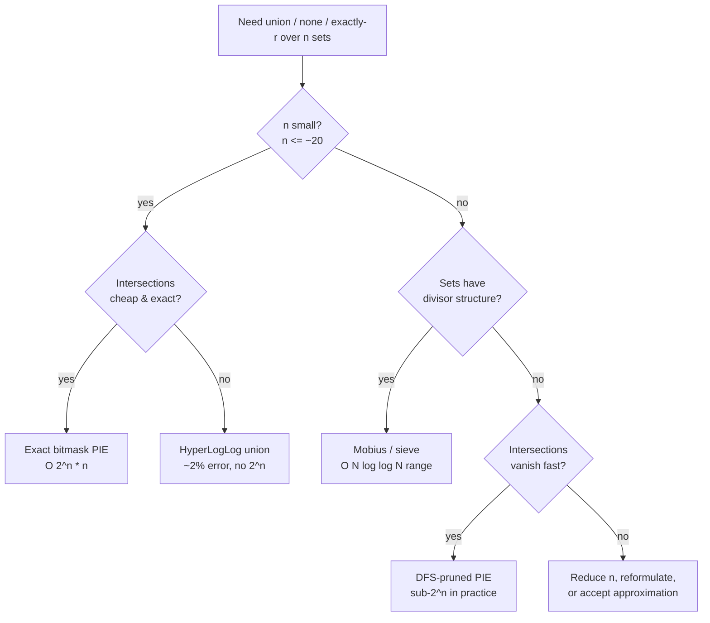

# Inclusion-Exclusion Principle (PIE) — Senior Level

> PIE is rarely the bottleneck on a textbook exercise — but the moment you use it to deduplicate records across overlapping data sources, compute reach/frequency over many ad-targeting filters, or count divisibility over a set so large that `2ⁿ` is no longer free, every decision (direct vs complement, prune-or-not, exact-vs-approximate, PIE vs Möbius vs sieve) becomes a latency, memory, or correctness concern. This document treats PIE as a production counting tool and its `2ⁿ` cost as something to engineer around.

## Table of Contents
1. [Introduction](#1-introduction)
2. [Large-Scale Counting: Analytics, Reach, and Dedup](#2-large-scale-counting)
3. [Pruning the 2^n Blowup](#3-pruning-the-2n-blowup)
4. [Combining PIE with Sieves and Möbius](#4-combining-pie-with-sieves-and-mobius)
5. [Exact vs Approximate: When PIE Loses to Sketches](#5-exact-vs-approximate)
6. [Real Systems and Architecture](#6-real-systems-and-architecture)
7. [Code Examples](#7-code-examples)
8. [Observability and Testing](#8-observability-and-testing)
9. [Failure Modes](#9-failure-modes)
10. [Summary](#10-summary)

---

## 1. Introduction

At senior level the question is no longer "what is the alternating formula" but "what system am I counting in, and what breaks at scale or under adversarial input?" PIE shows up in production in four guises that share one engine — *the signed sum over intersections of a family of sets*:

1. **Deduplicated counting across overlapping sources** — "how many *distinct* users appear in at least one of these `n` campaigns / lists / shards?" The naive `Σ|source|` double-counts; PIE corrects it exactly when intersection sizes are known.
2. **Reach / frequency over targeting filters** — ad and marketing systems combine `n` audience predicates; PIE gives exact reach when the predicates' pairwise (and higher) overlaps are queryable.
3. **Constraint counting** — number of arrangements / assignments avoiding all of `n` forbidden configurations (scheduling, seating, Latin-square-like constraints).
4. **Number-theoretic counting at scale** — count integers in `[1, N]` (with `N` astronomically large) divisible by at least one of many moduli, or coprime to a value with many prime factors.

All four reduce to: *enumerate the relevant subsets, count each intersection, sum with alternating sign*. The senior decisions are: which form (direct/complement) minimizes terms, **how to prune** the `2ⁿ` subsets when most intersections vanish, when to **replace PIE with Möbius or a sieve** because the sets have divisor structure, and when to abandon exact PIE for a **probabilistic sketch** (HyperLogLog, MinHash) because intersection sizes are themselves expensive or unknown.

### 1.1 The senior decision tree



The branches are the rest of this document: exact PIE (§2), pruning (§3), Möbius/sieve (§4), and the approximate sketch path (§5). Every production decision is one walk down this tree.

---

## 2. Large-Scale Counting

### 2.1 Dedup across overlapping sources

Suppose `n` data sources (campaigns, mailing lists, shards) each report a *count*, and you can also query the size of any *intersection* (users present in a specified subset of sources). The number of distinct users in at least one source is exactly the PIE union:

```
distinct = Σ_{∅≠S} (−1)^(|S|+1) |⋂_{i∈S} sourceᵢ|.
```

This is *exact* — unlike `Σ|sourceᵢ|`, which overcounts everyone in multiple sources. The catch is that you must be able to count each intersection. If sources are stored as sorted ID sets or roaring bitmaps, an intersection is a bitmap-AND and a popcount; PIE then needs `2ⁿ` AND-and-popcount operations.

### 2.2 The cost reality

For `n` sources with bitmaps of `B` bits each, PIE costs `O(2ⁿ · n · B/64)` word operations — the `2ⁿ` subsets, `n` ANDs to build each intersection (or `O(2ⁿ · B/64)` if you reuse partial ANDs along a Gray-code / subset-tree walk). For `n = 10` sources this is ~1000 bitmap ops; for `n = 25` it is ~33M — the boundary where exact PIE stops being free. Beyond ~`n = 25` you either prune (Section 3) or go approximate (Section 5).

### 2.3 Reusing partial intersections (the subset tree)

Naively each mask recomputes the full intersection from scratch (`n` ANDs). Instead, walk subsets in an order where consecutive masks differ by adding one element, caching the intersection of the current prefix. A DFS over the `n` elements maintains a running intersection bitmap and a running LCM (for the number-theoretic case), so each new term is **one** additional AND / LCM step rather than `|S|` steps. This turns `O(2ⁿ · n)` into `O(2ⁿ)` and is the same structure that enables pruning.

### 2.4 Worked dedup numeric

Three campaigns with `|A|=500, |B|=400, |C|=300`, pairwise `|A∩B|=120, |A∩C|=80, |B∩C|=60`, triple `|A∩B∩C|=30`:

```
distinct = 500+400+300 − 120−80−60 + 30
         = 1200 − 260 + 30 = 970.
```

Reporting `Σ = 1200` would overstate reach by 230 users (24%) — the exact PIE correction is the difference between an honest reach number and an inflated one.

### 2.5 Frequency, not just reach: the binomial-moment view

Marketing systems rarely want only "reach" (≥ 1 exposure); they want **frequency distribution** — how many users saw *exactly* 1, 2, 3 … campaigns. PIE delivers the whole distribution from the same intersection data. Define the binomial moments `Wₖ = Σ_{|S|=k} |⋂ source_S|` (so `W₁ = 1200`, `W₂ = 260`, `W₃ = 30` above). Then the count of users in **exactly `r`** sources is `Eᵣ = Σ_{k≥r} (−1)^(k−r) C(k,r) Wₖ` (proven in `professional.md` §5):

```
E₁ = W₁ − 2W₂ + 3W₃ = 1200 − 520 + 90 = 770   (exactly one campaign)
E₂ = W₂ − 3W₃        = 260 − 90       = 170   (exactly two)
E₃ = W₃              = 30                       (all three)
check: E₁ + E₂ + E₃ = 970 = reach ✓
```

This matters operationally: a planner that reports only reach hides over-exposure. The same `2ⁿ` intersection counts you already paid for yield the full frequency histogram for free — compute the `Wₖ` once, derive every `Eᵣ`. The senior lesson is that the *moments*, not the union, are the reusable artifact worth caching.

### 2.6 Comparison: counting strategies at scale

| Strategy | Exact? | Cost | Reusable artifact | Best for |
|----------|--------|------|-------------------|----------|
| `Σ \|sourceᵢ\|` | no (overcounts) | `O(n)` | per-source counts | nothing (a bug, not a strategy) |
| Materialize full union set | yes | `O(Σ\|sourceᵢ\|)` mem+time | the union itself | tiny sets, ad-hoc |
| Bitmask PIE on bitmaps | yes | `O(2ⁿ · B/64)` | binomial moments `Wₖ` | `n ≤ 20`, queryable intersections |
| DFS-pruned PIE | yes | sub-`2ⁿ` (data-dependent) | — | large/sparse sets, vanishing intersections |
| HyperLogLog union | ~2% | `O(n · b)` | mergeable sketches | huge sets, `n` large, estimate OK |
| MinHash + PIE | approximate | `O(n · h)` per pair | signatures | pairwise Jaccard, small `n` |

The defensible default in a counting service is **bitmap PIE for small `n`, HLL beyond** — the rest are special cases of pruning or exactness/approximation trade-offs.

---

## 3. Pruning the 2^n Blowup

### 3.1 The key observation: zero terms have zero supersets

In the number-theoretic case, once a subset's running LCM exceeds `N`, its term `⌊N/lcm⌋ = 0`, and **every superset** (which only grows the LCM) is also zero. In the bitmap case, once a running intersection is *empty*, every superset intersection is empty too. This monotonicity is exactly what makes a **DFS with pruning** dramatically faster than a flat `2ⁿ` loop.

### 3.2 DFS pruning skeleton

```text
dfs(index, runningLCM, sign):
    if runningLCM > N: return            # prune: this and all supersets are 0
    total += sign * (N / runningLCM)     # term for the current subset
    for j in index .. n-1:
        dfs(j+1, lcm(runningLCM, k[j]), -sign)
```

The empty subset (`runningLCM = 1`) is the universe; the recursion only descends while the term is nonzero. On inputs where most LCMs blow past `N` quickly (large `kᵢ`), this visits far fewer than `2ⁿ` nodes — often polynomial in practice.

### 3.3 When pruning helps and when it does not

Pruning is powerful when intersections vanish quickly: large divisors, sparse bitmaps, or tight constraints. It does **not** help when most intersections are non-empty (small `kᵢ`, dense overlaps) — there the full `2ⁿ` is unavoidable, and you must reduce `n` or go approximate. The senior judgment is estimating the *effective* branching: if the inputs are pairwise coprime and small, expect close to `2ⁿ`; if they are large or share factors, expect heavy pruning.

### 3.4 Deduplicating the input

Before any PIE, **remove redundant sets**: if `kᵢ | kⱼ` then "divisible by `kⱼ`" ⊆ "divisible by `kᵢ`", so `kⱼ` adds no new union members and can sometimes be dropped (carefully — it still affects intersection terms, so removal is only safe when reasoning about the union, not arbitrary intersections). For coprime counting, reduce each `kᵢ` to its radical and dedupe. Shrinking `n` by even a few elements halves the work per element removed.

### 3.5 Worked pruning trace

Count divisible-by-at-least-one of `{6, 10, 15, 35}` in `[1, 100]`. A flat loop does `2^4 − 1 = 15` terms. With DFS pruning and `N = 100`: `lcm(6,10,15) = 30 ≤ 100` (term 3), but `lcm(6,10,15,35) = 210 > 100` → prune the depth-4 branch (saves the 1 term that would be 0); `lcm(10,15,35) = 210 > 100` → prune; `lcm(6,15,35)=210`, `lcm(6,10,35)=210` → all pruned. Here pruning removes the 4 quadruple/triple-with-35 terms that are 0. For larger `N` fewer prune, for larger moduli more prune — the trace shows pruning is data-dependent, exactly why you measure rather than assume.

### 3.6 Flat vs pruned: a comparison

| Aspect | Flat `2ⁿ` loop | DFS-pruned |
|--------|----------------|------------|
| Worst-case nodes | `2ⁿ` | `2ⁿ` (no overlap → no pruning) |
| Best-case nodes | `2ⁿ` | `O(n)` (all moduli > `N`: only singletons survive) |
| Per-node work | `O(n)` re-build, or `O(1)` with Gray code | `O(1)` (incremental LCM/AND on the stack) |
| State | running sum only | recursion stack `O(n)` + running intersection |
| Predictability | constant, easy to budget | data-dependent — **log node counts** |
| Implementation risk | low | medium (prune only on monotone quantity) |

The senior trade-off: the flat loop is predictable and trivially correct; the pruned DFS can be orders of magnitude faster but its cost depends on the input, so you must instrument node counts and keep the flat loop as a test oracle (§8.1). Choose pruning when you have evidence intersections vanish; otherwise the flat loop's predictability is worth more than a speedup that may not materialize.

---

## 4. Combining PIE with Sieves and Möbius

### 4.1 PIE over prime factors *is* Möbius

When the family of sets is "divisible by prime `pᵢ`" for the distinct primes of some `m`, each subset ↔ a squarefree divisor `d = ∏ pᵢ`, and the alternating sign `(−1)^(#primes)` is the **Möbius function** `μ(d)`. The coprime count collapses to a Möbius sum:

```
#(x ∈ [1,N], gcd(x, m) = 1) = Σ_{d | rad(m)} μ(d) ⌊N/d⌋.
```

This is not a different algorithm — it is PIE with the sign renamed `μ`. The value is conceptual and computational: Möbius lets you precompute `μ` over a range with a linear sieve (sibling `04-dirichlet-linear-sieve`) and answer many coprime queries fast, and it generalizes PIE from "subset lattice" to "divisor lattice" and beyond (sibling `32-mobius-inversion`).

### 4.2 Range queries: sieve the answers

If you must answer "count coprime to `m` in `[1, N]`" for *many* `m` over a range, do not re-run PIE per query. Precompute with a sieve:

- **Linear sieve of `μ`** (sibling `04`) gives all `μ(d)` up to `N` in `O(N)`; then each query is `O(#divisors of rad(m))`.
- **Sieve of Euler's `φ`** (sibling `05-fermat-euler` / `04`) gives all totients `φ(1..N)` in `O(N log log N)` directly, no PIE per value.

The crossover: PIE (or Möbius) per query for *few* queries with *huge* `N`; a sieve for *many* queries over a *bounded* range.

### 4.3 Counting square-free / k-free numbers

The count of squarefree integers in `[1, N]` is a clean Möbius/PIE sum:

```
#squarefree ≤ N = Σ_{d=1}^{√N} μ(d) ⌊N/d²⌋,
```

PIE over "divisible by `p²`" for each prime `p`. Only `d ≤ √N` matter (else `⌊N/d²⌋ = 0` — the pruning of Section 3 made automatic). This counts `N - O(√N)` terms, far cheaper than `2^(#primes)`.

### 4.4 The lattice generalization

PIE on a subset lattice and Möbius inversion on a divisor (or general poset) lattice are the *same* principle: `g(x) = Σ_{y ≤ x} f(y) ⟹ f(x) = Σ_{y ≤ x} μ(x, y) g(y)`. PIE is the special case where the poset is the Boolean lattice of subsets and `μ(S, T) = (−1)^(|T|−|S|)`. Recognizing your counting problem's lattice tells you which `μ` to use; the subset lattice gives the alternating PIE sign, the divisor lattice gives the number-theoretic `μ(d)`. Full treatment in sibling [`32-mobius-inversion`](../32-mobius-inversion/senior.md).

### 4.5 When to reach for Möbius instead of raw PIE — a checklist

In a real number-theory service, prefer the Möbius/sieve formulation over an ad-hoc bitmask PIE when **any** of these hold:

| Signal | Why Möbius/sieve wins |
|--------|-----------------------|
| Sets are "divisible by prime `pᵢ`" | the sign *is* `μ(d)`; no separate sign bookkeeping |
| Many queries over a bounded range `[1, N]` | precompute `μ`/`φ` once with a linear sieve, then O(divisors) per query |
| Need totient `φ`, squarefree count, coprime-pair count | each is a one-line Möbius sum, well-tested |
| Want to compose with Dirichlet convolution downstream | the incidence-algebra view composes; raw PIE does not |
| The divisor lattice has non-squarefree elements | `μ(d)=0` automatically drops them; a manual bitmask would double-count prime powers |

Conversely, stick with raw bitmask/DFS PIE when the sets are **not** prime-divisibility (arbitrary `kᵢ` with shared factors, audience segments, forbidden positions) — there is no clean `μ` to exploit and the bitmask is the honest tool. The cross-link to remember: **prime-factor PIE ⇒ Möbius** (sibling [`32-mobius-inversion`](../32-mobius-inversion/senior.md)); everything else stays PIE.

---

## 5. Exact vs Approximate

### 5.1 When intersection sizes are the bottleneck

PIE assumes each intersection `|⋂ Aᵢ|` is *cheap to compute*. At web scale that assumption fails: if each `Aᵢ` is a billion-element user set, materializing intersections is expensive, and there are `2ⁿ` of them. Two escapes:

- **Probabilistic cardinality sketches.** **HyperLogLog** estimates `|⋃ Aᵢ|` directly via mergeable sketches — union is a sketch-merge, giving the "at least one" count in `O(n · sketch_size)` with ~2% error, *no* `2ⁿ`. This is how analytics systems report distinct counts over many sources without exact PIE.
- **MinHash / Jaccard** estimates pairwise overlaps; combined with PIE for small `n` it gives approximate higher-order terms, but error compounds across the alternating sum (Section 5.2).

### 5.2 Why PIE amplifies estimation error

PIE alternates large terms that nearly cancel: the true answer may be small while individual terms are huge. If each term carries relative error `ε`, the *absolute* errors do **not** cancel — they accumulate. So plugging estimated intersection sizes into PIE is numerically dangerous: a 1% error on terms summing to `1200 − 260 + 30 = 970` can swamp the `+30` triple term entirely. The senior rule: **use a sketch that estimates the union directly (HLL), not estimated terms fed through PIE.** Reserve PIE for cases where intersections are computed *exactly*.

### 5.3 Worked: when the error actually swamps the answer

Suppose three huge user sets with true `|A|=|B|=|C| = 10⁹`, true pairwise overlaps `≈ 9.9·10⁸` each, and true triple overlap `≈ 9.8·10⁸` (heavily overlapping audiences). The true union is `3·10⁹ − 3·9.9·10⁸ + 9.8·10⁸ ≈ 1.01·10⁹`. Now suppose each intersection is estimated by MinHash with a modest **1% relative error**. The absolute error on each `10⁹`-scale term is `~10⁷`; six terms accumulate up to `~6·10⁷` absolute error on an answer of `~10⁹` — a **6%** swing, and worse near-cancellation cases can flip the sign of small high-order corrections entirely.

Contrast a direct HyperLogLog of the union: it estimates the `~1.01·10⁹` answer with ~2% *relative* error end-to-end, with no term cancellation to amplify. This is the quantitative justification for the rule "estimate the union, never the terms": PIE's alternating structure converts per-term relative error into accumulated absolute error, while a direct union sketch keeps the error relative to the (small) final answer.

### 5.4 Decision matrix

| Situation | Method | Why |
|-----------|--------|-----|
| Small `n`, exact intersections cheap | exact PIE | exact, fast |
| Sets are prime-divisibility | Möbius (PIE renamed) | precompute `μ`, range queries |
| Many range queries | sieve `μ` / `φ` | amortize over the range |
| Huge sets, distinct-union count | HyperLogLog | mergeable, no `2ⁿ`, ~2% error |
| Large `n`, intersections vanish fast | DFS-pruned PIE | sub-`2ⁿ` in practice |
| Large `n`, dense overlaps, exactness required | reduce `n` or reformulate | `2ⁿ` is intrinsic |

---

## 6. Real Systems and Architecture

### 6.1 Where PIE actually lives in production

PIE is rarely a service of its own; it is a *correction step* embedded in counting pipelines. The recurring shapes:

| System | The "sets" `Aᵢ` | What PIE computes | Why not just `Σ` |
|--------|-----------------|-------------------|------------------|
| Ad reach/frequency planner | audience segments / targeting filters | de-duplicated reach over selected segments | overlapping segments double-count users |
| Marketing audience builder | list memberships, suppression lists | size of `(L₁ ∪ L₂) ∖ suppress` | unioned lists overlap heavily |
| Analytics distinct-count | event sources / device IDs per channel | distinct users in ≥1 channel | a user appears in many channels |
| Billing / quota dedup | resource tags, project scopes | distinct billable resources | a resource matches multiple tags |
| Number-theory libraries | "divisible by `pᵢ`" | totient, coprime counts, squarefree counts | naive scan is `O(N)` for huge `N` |
| Combinatorial search/scheduling | "violates constraint `i`" | arrangements satisfying *no* violation | brute enumeration is `n!` |

In every row the engineering judgment is the same: PIE is the exact answer **iff intersections are computable**; the moment they are not (huge user sets), you switch to a sketch (§5).

### 6.2 Case study: ad-campaign reach planner

A planner lets a media buyer select up to ~12 audience segments and shows projected *unique* reach. Architecture:

1. **Offline.** Each segment is stored as a compressed bitmap (Roaring) of hashed user IDs, plus a precomputed pairwise-intersection cache for the most common segment pairs.
2. **Online.** On a selection of `k ≤ 12` segments, run **DFS-pruned PIE** over the bitmaps: maintain a running AND; when the running intersection's cardinality hits 0, prune the whole subtree (every superset is also empty). Reuse the pairwise cache to skip the cheapest re-ANDs.
3. **Budget.** `2¹² = 4096` worst-case terms, each an AND + popcount over ~`B/64` words; with pruning, typical selections (segments with limited overlap) visit only a few hundred nodes — single-digit milliseconds.
4. **Fallback.** If a buyer selects > 12 segments, the system *cannot* afford exact PIE on demand; it switches to a HyperLogLog union (mergeable sketches per segment) and labels the result "estimated (±2%)" in the UI.

The two-tier design — exact PIE for small `n`, HLL beyond — is the canonical production pattern, and the `n ≈ 12–20` boundary is where it flips.

### 6.3 Caching and incremental updates

Two caching layers pay off repeatedly:

- **Intersection cache.** Pairwise (and frequently-used triple) intersection cardinalities are stable between data refreshes; cache them keyed by the sorted set of segment IDs. PIE then reads cached low-order terms and only computes high-order intersections on demand.
- **Factorization cache.** In the number-theoretic path (coprime/totient over many `m`), cache distinct-prime factorizations; do not re-factor per request. Re-factoring `m` is often more expensive than the PIE sum over its ≤ 15 distinct primes.

Incremental updates are harder: PIE is not naturally incremental, because adding one element to a base set changes potentially all `2ⁿ` intersection sizes. The practical answer is to recompute on each query against fresh bitmaps (cheap with pruning) rather than maintain a running PIE total — a key architectural constraint to surface in design review.

### 6.4 Latency and memory budget

| Scale | n (sets) | Method | Latency | Memory |
|-------|----------|--------|---------|--------|
| Small selection | ≤ 12 | DFS-pruned bitmap PIE | sub-ms to few ms | `n · B/64` words live |
| Medium | 13–20 | pruned PIE or precomputed low-order + truncation | tens of ms | + intersection cache |
| Large | > 20, exact needed | reduce `n` (merge/redundancy removal) | varies | — |
| Huge sets | any, estimate OK | HyperLogLog union | `O(n · b)`, ms | `O(n · b)`, `b` ≈ 12–16 KB/sketch |
| Number theory, huge `N` | ω(m) ≤ 15 | Möbius/PIE over distinct primes | microseconds | O(1) |

The memory headline: exact PIE itself is `O(1)` extra (a running sum) — the cost is in *materializing the sets and their intersections*, which is why the sketch path trades exactness for fixed, tiny per-set memory.

---

## 7. Code Examples

### 7.1 Go — DFS-pruned divisible-by-at-least-one (sub-2^n)

```go
package main

import "fmt"

func gcd(a, b int64) int64 {
	for b != 0 {
		a, b = b, a%b
	}
	return a
}

func lcm(a, b int64) int64 { return a / gcd(a, b) * b }

// countPruned counts integers in [1,N] divisible by >=1 of k, pruning any
// branch whose running LCM exceeds N (its term and all supersets are 0).
func countPruned(N int64, k []int64) int64 {
	var total int64
	var dfs func(idx int, runLCM, sign int64)
	dfs = func(idx int, runLCM, sign int64) {
		if runLCM > N {
			return // prune: this term is 0 and so are all supersets
		}
		if runLCM > 1 { // skip the empty subset (universe) for the union form
			total += sign * (N / runLCM)
		}
		for j := idx; j < len(k); j++ {
			dfs(j+1, lcm(runLCM, k[j]), -sign)
		}
	}
	dfs(0, 1, 1)
	return total
}

func main() {
	fmt.Println(countPruned(100, []int64{6, 10, 15, 35})) // exact union count
	fmt.Println(countPruned(30, []int64{2, 3, 5}))        // 22
}
```

### 7.2 Java — bitmap dedup union over n sources

```java
import java.util.*;

public class BitmapPIE {
    // Count distinct elements in the union of n sets via PIE on bitmaps.
    static long unionSize(List<BitSet> sets) {
        int n = sets.size();
        long total = 0;
        for (int mask = 1; mask < (1 << n); mask++) {
            BitSet inter = null;
            int bits = 0;
            for (int i = 0; i < n; i++) {
                if ((mask & (1 << i)) != 0) {
                    bits++;
                    if (inter == null) inter = (BitSet) sets.get(i).clone();
                    else inter.and(sets.get(i));
                }
            }
            long c = inter.cardinality();
            if (bits % 2 == 1) total += c; else total -= c;
        }
        return total;
    }

    public static void main(String[] args) {
        BitSet a = new BitSet(), b = new BitSet(), c = new BitSet();
        for (int x : new int[]{1, 2, 3, 4, 5}) a.set(x);
        for (int x : new int[]{4, 5, 6, 7}) b.set(x);
        for (int x : new int[]{7, 8, 1}) c.set(x);
        System.out.println(unionSize(List.of(a, b, c))); // 8 distinct: {1..8}
    }
}
```

### 7.3 Python — squarefree count and Möbius-as-PIE

```python
def mobius_sieve(n):
    """mu[1..n] via linear sieve, O(n)."""
    mu = [0] * (n + 1)
    primes, is_comp = [], [False] * (n + 1)
    mu[1] = 1
    for i in range(2, n + 1):
        if not is_comp[i]:
            primes.append(i)
            mu[i] = -1
        for p in primes:
            if i * p > n:
                break
            is_comp[i * p] = True
            if i % p == 0:
                mu[i * p] = 0
                break
            mu[i * p] = -mu[i]
    return mu


def count_squarefree(N):
    """#squarefree in [1,N] = sum_{d<=sqrt(N)} mu(d) * floor(N/d^2)  (PIE)."""
    import math
    root = int(math.isqrt(N))
    mu = mobius_sieve(root)
    return sum(mu[d] * (N // (d * d)) for d in range(1, root + 1))


def count_coprime(N, m):
    """#x in [1,N] with gcd(x,m)=1, via PIE = Mobius over distinct primes of m."""
    primes, t = [], m
    p = 2
    while p * p <= t:
        if t % p == 0:
            primes.append(p)
            while t % p == 0:
                t //= p
        p += 1
    if t > 1:
        primes.append(t)
    total = 0
    for mask in range(1 << len(primes)):       # complement form, include empty
        d, bits = 1, 0
        for i, pr in enumerate(primes):
            if mask & (1 << i):
                d *= pr
                bits += 1
        total += (-1) ** bits * (N // d)        # (-1)^bits is mu(d)
    return total


if __name__ == "__main__":
    print(count_squarefree(100))   # 61
    print(count_coprime(30, 30))   # 8  (= phi(30))
    print(count_coprime(100, 12))  # 33 (coprime to 12 in [1,100])
```

---

## 8. Observability and Testing

A PIE result is a single number — a wrong sign on one term changes it silently. Build checks in from day one.

| Check | Why |
|-------|-----|
| PIE union vs brute-force `O(N·n)` on small `N` | catches sign and overlap errors |
| `#none == N − union` consistency | direct and complement must agree |
| `count_coprime(m, m) == φ(m)` (sieved totient) | validates the Möbius/PIE coprime path |
| `count_squarefree(N)` vs brute squarefree scan | validates the `μ`-over-`d²` sum |
| Pruned DFS result == flat `2ⁿ` loop result | ensures pruning is sound, not lossy |
| Derangement PIE vs recurrence `D(n)=(n−1)(D(n−1)+D(n−2))` | cross-checks the collapsed sum |
| Cross-language determinism (Go/Java/Python) | catches overflow/sign portability bugs |

### 8.1 The most valuable test

Compare the **pruned** implementation against the **flat `2ⁿ`** implementation on randomized inputs (small enough that `2ⁿ` is affordable). A divergence pinpoints a pruning bug — usually a branch pruned that still had nonzero supersets through a *different* element, or a sign error in the alternation. This is the PIE analogue of the "optimized vs reference" oracle and catches nearly every real bug.

### 8.2 Production guardrails

- **Range sanity.** The union count must satisfy `max|Aᵢ| ≤ union ≤ min(ΣAᵢ, N)`. Assert it; a value outside this range is a definite bug.
- **Overflow guard for LCM.** Cap running LCM at `N+1`; in dedup, watch that intersection cardinalities fit the integer type.
- **Term-count budget.** For DFS-pruned PIE, log the number of nodes visited; a sudden jump toward `2ⁿ` signals inputs that defeat pruning (small/coprime moduli) and may need a different method.
- **Cache distinct-prime factorizations** when coprime-counting many `m` against the same modulus space; do not refactor per call.
- **Flag the approximate path.** If a code path silently swaps exact PIE for an HLL estimate, tag the result as approximate so downstream consumers do not treat ~2% error as exact.

---

## 9. Failure Modes

### 9.1 Sign error on one term
A flipped `+`/`−` on a single subset corrupts the total silently. Mitigation: derive the sign as `(−1)^(popcount)` in one place; brute-force oracle on small inputs. The classic instance: hand-unrolling the three-set formula and writing `+ |A∩B∩C|` as `−`, which passes casual review because the number is still "in the right ballpark". Centralizing the sign in `(−1)^(popcount(mask))` makes such a slip impossible.

### 9.2 Summing source counts without PIE (double counting)
`Σ|sourceᵢ|` overstates a deduplicated union by everyone in multiple sources. Mitigation: always apply the full alternating correction; never report `Σ` as "distinct".

### 9.3 `2ⁿ` blowup with large `n`
A flat loop over `n = 30` sets is `10^9` terms. Mitigation: DFS pruning, input dedup/radical reduction, or switch to Möbius/sieve/HLL.

### 9.4 Estimated intersections fed through PIE
Plugging sketch-estimated overlaps into the alternating sum amplifies error (terms nearly cancel). Mitigation: estimate the *union* directly (HyperLogLog), or use exact intersections only.

### 9.5 LCM / cardinality overflow
Several large moduli multiply past 64-bit even when the term is 0. Mitigation: cap LCM at `N+1`; use 128-bit or bignum where exactness is required.

### 9.6 Using product instead of LCM for intersections
"Divisible by both `4` and `6`" is `lcm=12`, not `24`. Mitigation: always combine moduli with LCM; unit-test on non-coprime pairs.

### 9.7 Forgetting repeated primes in coprime counting
Using all prime *powers* of `m` instead of distinct primes adds duplicate sets. Mitigation: reduce to the radical (distinct primes) before PIE.

### 9.8 Pruning unsound branches
Pruning a branch whose term is 0 but whose *supersets through other elements* are nonzero — only valid because LCM/intersection is monotone (supersets only shrink intersections / grow LCM). Mitigation: prune only on the proven-monotone quantity; verify against the flat loop.

### 9.9 Mixing direct and complement signs
Using `(−1)^(k+1)` (union) while iterating from `mask=0` (which includes the empty/universe term meant for the complement) double-counts or mis-signs the universe. Mitigation: pick one form; start the loop at `1` for union, `0` for complement, and match the sign convention.

### 9.10 Silent approximate-path swap
A planner that falls back to HyperLogLog beyond `n = 12` (the §6.2 case) but does **not** flag the result as estimated lets a ~2% error masquerade as an exact figure downstream — e.g. a billing or compliance number derived from it inherits the error invisibly. Mitigation: tag every result with an `exact | estimated` provenance flag and surface it in the API and UI; never let exact and approximate values share a type with no discriminator.

### 9.11 Stale intersection cache after data refresh
Caching pairwise/triple intersection cardinalities (§6.3) is a major speedup, but if the underlying segment bitmaps are refreshed and the cache is not invalidated, PIE mixes fresh low-order terms with stale high-order ones and returns a plausible-but-wrong number. Mitigation: key the cache by a data-version/epoch token and invalidate atomically with each refresh; assert the version matches before reusing a cached term.

### 9.12 Integer type chosen for the wrong scale
Dedup over billion-element sources accumulates a running sum whose intermediate terms (`W₁`) reach into the low billions — past `int32` (`~2.1·10⁹`). A 32-bit accumulator silently wraps to a negative reach. Mitigation: use `int64`/`long` for the accumulator and every intersection cardinality; add a range assertion `max|Aᵢ| ≤ union ≤ min(Σ|Aᵢ|, N)` so a wrap is caught immediately rather than shipped as a negative or absurd count.

---

## 10. Summary

- **PIE is the exact dedup tool:** distinct-union over `n` overlapping sources is `Σ(−1)^(|S|+1)|⋂|`, not `Σ|sourceᵢ|` — the latter inflates reach by the overlap. Exactness requires computable intersection sizes.
- **The cost is `2ⁿ` in the number of sets**, independent of universe size. It is free for `n ≤ ~20`, borderline at ~`n = 25`, and must be engineered beyond that.
- **Prune the blowup** with a DFS that stops when the running LCM exceeds `N` (number theory) or the running intersection empties (bitmaps) — every superset of a zero term is zero. Effectiveness is data-dependent; measure node counts.
- **PIE over prime factors *is* Möbius** (`(−1)^#primes = μ(d)`), turning coprime/squarefree counts into divisor sums; precompute `μ`/`φ` with a sieve for many range queries (siblings `04`, `05`, `32`).
- **Exact vs approximate:** when sets are huge, estimate the *union* with HyperLogLog (mergeable, no `2ⁿ`) rather than feeding estimated intersections through PIE, where nearly-cancelling terms amplify error.
- **Always keep an oracle:** brute force on small `N`, the `#none = N − union` identity, and pruned-vs-flat agreement catch nearly every sign and pruning bug.
- **The reusable artifact is the binomial moments `Wₖ`,** not the union: from them you derive reach (`L₁`), the full frequency histogram (`Eᵣ`), and Bonferroni brackets — so cache the moments, not just the final number.
- **Architecture is two-tier:** exact bitmap PIE under the `n ≈ 12–20` boundary, HyperLogLog beyond, with an explicit `exact | estimated` provenance flag and version-keyed intersection caches to avoid the silent-error failure modes (§9.10–§9.11).

### Decision summary

- **Few sets, exact intersections** → exact bitmask PIE.
- **Prime-divisibility / coprime / squarefree** → Möbius (PIE renamed); sieve `μ` for range queries.
- **Large `n`, intersections vanish fast** → DFS-pruned PIE.
- **Huge sets, distinct-union estimate OK** → HyperLogLog, not PIE on estimates.
- **Many queries over a bounded range** → precomputed sieve of `μ` / `φ`.
- **Dedup reporting** → PIE union, never `Σ` of source counts.
- **Frequency reporting** → derive `Eᵣ` from the cached binomial moments `Wₖ`, never re-scan the data per `r`.

References to study further: Möbius inversion and lattice generalization (sibling `32-mobius-inversion`), linear sieve of `μ` (sibling `04-dirichlet-linear-sieve`), Euler totient and its sieve (sibling `05-fermat-euler`), Burnside/Pólya counting (sibling `27-burnside-polya`), and HyperLogLog / MinHash for approximate distinct counting at scale.

Next step: continue to [`professional.md`](./professional.md) for the formal proofs of PIE (indicator algebra, binomial cancellation, induction), the exactly-`r` / Bonferroni refinements, the full Möbius-over-a-poset generalization, and the `2ⁿ` complexity barrier (Ryser's permanent formula, #P-hardness).
