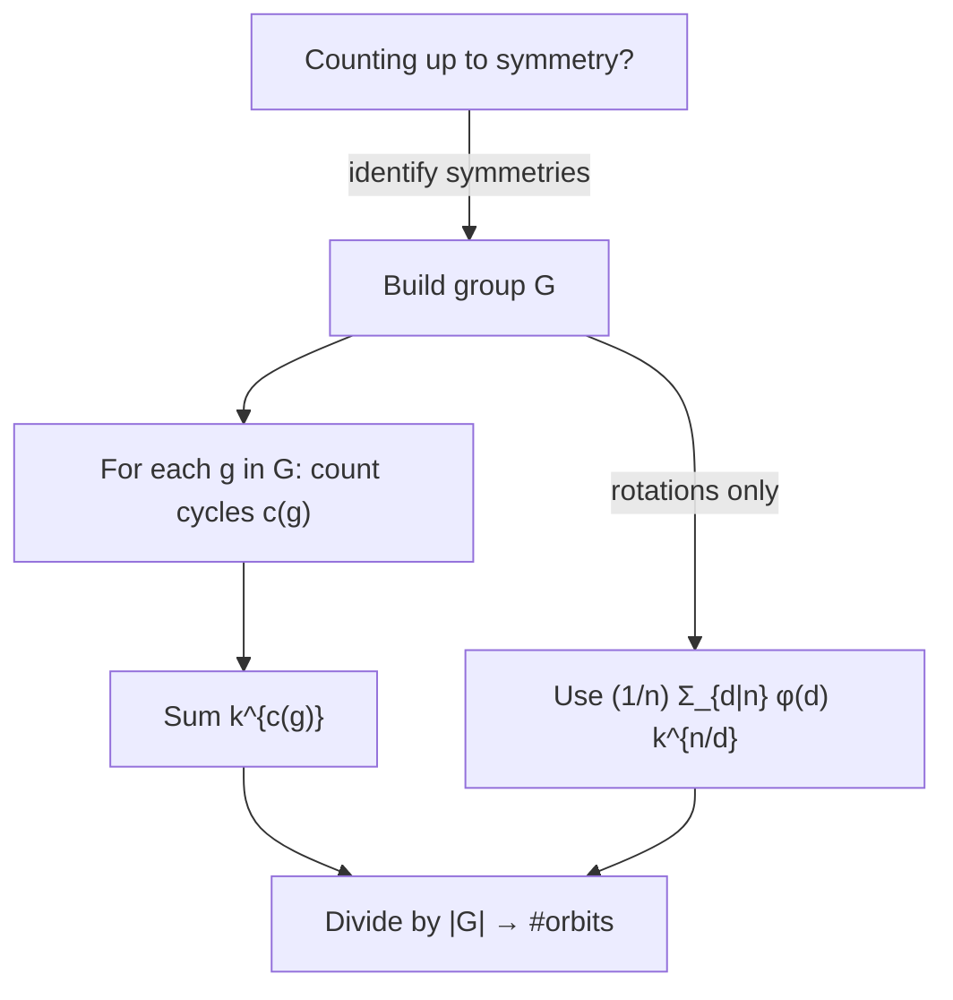

# Burnside's Lemma & Pólya Enumeration — Junior Level

> **One-line summary:** When you count colorings or arrangements that you consider "the same" if one turns into another by a **symmetry** (rotating a necklace, flipping a bracelet, turning a cube), the number of genuinely distinct ones is **the average number of colorings left unchanged by each symmetry**: `|distinct| = (1/|G|) · Σ_{g∈G} |Fix(g)|`. That single averaging formula is **Burnside's lemma**, and **Pólya's theorem** is the bookkeeping trick that computes the same average for `k` colors with a polynomial.

---

## Table of Contents

1. [Introduction](#introduction)
2. [Prerequisites](#prerequisites)
3. [Glossary](#glossary)
4. [Core Concepts](#core-concepts)
5. [Big-O Summary](#big-o-summary)
6. [Real-World Analogies](#real-world-analogies)
7. [Pros & Cons](#pros--cons)
8. [Step-by-Step Walkthrough](#step-by-step-walkthrough)
9. [Code Examples](#code-examples)
10. [Coding Patterns](#coding-patterns)
11. [Error Handling](#error-handling)
12. [Performance Tips](#performance-tips)
13. [Best Practices](#best-practices)
14. [Edge Cases & Pitfalls](#edge-cases--pitfalls)
15. [Common Mistakes](#common-mistakes)
16. [Cheat Sheet](#cheat-sheet)
17. [Visual Animation](#visual-animation)
18. [Summary](#summary)
19. [Further Reading](#further-reading)

---

## Introduction

Imagine you have a bracelet with 4 beads, and each bead can be **red** or **blue**. How many different bracelets are there?

A naive count says: each of the 4 beads has 2 choices, so `2^4 = 16` colorings. But a bracelet is a *physical object* — you can rotate it. The coloring `R B B B` and the coloring `B R B B` are the **same bracelet**, just rotated by one position. If we only care about bracelets up to rotation, `16` is an over-count. The real answer is `6`. Where did `16` go wrong, and how do we get `6` reliably?

This is the central question of this topic: **count distinct configurations when some configurations are considered identical under a group of symmetries.** Counting `16` is easy. Dividing by "the number of symmetries" (here, 4 rotations) to get `16/4 = 4` is **wrong** — it ignores that some colorings (like all-red `R R R R`) look the same after rotation, so they should not be divided down as hard. The correct tool is **Burnside's lemma**.

> **Burnside's lemma:** The number of distinct objects equals the **average**, over all symmetries `g`, of the number of colorings that symmetry leaves **completely unchanged**:
>
> `|distinct| = (1/|G|) · Σ_{g∈G} |Fix(g)|`

Here `G` is the set of symmetries (the "group"), `|G|` is how many there are, and `Fix(g)` is the set of colorings that look *exactly the same* after applying `g`. You count fixed colorings for each symmetry, add them up, and divide by the number of symmetries. That average is always a whole number, and it is always the right count.

**Pólya's enumeration theorem** is the same idea made mechanical. Instead of recounting fixed colorings every time you change the number of colors, Pólya gives you one polynomial — the **cycle index** — into which you substitute `k` (the number of colors) to read off the answer for *any* `k` at once. For necklaces under rotation this collapses to a famous closed form:

> **Necklace count (n beads, k colors, rotations only):** `(1/n) · Σ_{d | n} φ(d) · k^{n/d}`

This file builds the four ideas you need: what a symmetry does to a coloring, what "fixed" means, the Burnside average, and the necklace formula. Middle and senior levels then extend it to reflections, cube faces, and graphs.

---

## Prerequisites

Before reading this file you should be comfortable with:

- **Basic counting** — the rule of product (`k^n` colorings of `n` slots with `k` colors). See sibling `28-stars-and-bars` for related counting.
- **Modular thinking on a cycle** — "position `i` moves to position `(i+1) mod n`" when you rotate.
- **GCD and divisors** — the necklace formula sums over divisors `d` of `n`, weighted by Euler's totient `φ(d)`. See sibling `01-gcd-lcm` and `05-fermat-euler` for `φ`.
- **Big-O notation** — `O(n)`, `O(n · |G|)`.

Optional but helpful:

- A glance at **permutations** — a symmetry is just a permutation of the slots (positions).
- **Cycle decomposition of a permutation** — every permutation splits the slots into disjoint cycles; this is the heart of computing fixed counts. We explain it from scratch below.

---

## Glossary

| Term | Meaning |
|------|---------|
| **Configuration / coloring** | An assignment of a color (or label) to each slot — e.g. each bead of a necklace gets one of `k` colors. |
| **Symmetry** | A transformation (rotation, reflection, …) that rearranges the slots but produces an object we still consider "the same kind." |
| **Group `G`** | The full set of symmetries we allow, including the "do nothing" identity. Closed under composing two symmetries. |
| **Identity `e`** | The do-nothing symmetry; it fixes **every** coloring. |
| **`Fix(g)`** | The set of colorings unchanged when we apply symmetry `g`. `|Fix(g)|` is its size. |
| **Orbit** | A bucket of colorings that are all reachable from one another by symmetries — i.e. "the same object." The count we want is the **number of orbits**. |
| **Burnside's lemma** | `#orbits = (1/|G|) Σ_g |Fix(g)|` — orbits equal the average fixed-point count. |
| **Cycle of a permutation** | A group of slots that rotate among themselves under the symmetry (e.g. `0→1→2→0`). |
| **Cycle index** | A polynomial summarizing the cycle structure of every symmetry; the engine of Pólya's theorem. |
| **`φ(d)` (Euler totient)** | Count of integers in `{1,…,d}` coprime to `d`; appears in the necklace formula. |

---

## Core Concepts

### 1. A symmetry permutes the slots

Number the slots (bead positions) `0, 1, …, n-1`. A **rotation by 1** of an `n`-bead necklace sends the color at slot `0` to slot `1`, slot `1` to slot `2`, …, and slot `n-1` wraps back to slot `0`. So a symmetry is nothing more than a **permutation** of the slot indices. For a square (4 slots) the rotation-by-1 permutation is:

```
slot:   0  1  2  3
goes to:1  2  3  0
```

The full **rotation group** of an `n`-bead necklace has `n` elements: rotate by `0` (identity), by `1`, by `2`, …, by `n-1`.

### 2. "Fixed" means unchanged after applying the symmetry

A coloring is **fixed** by symmetry `g` if, after you apply `g`, the picture looks *identical*. For a rotation by 1 of a 4-bead necklace, a coloring is fixed only when bead `0` = bead `1` = bead `2` = bead `3` — i.e. **all beads the same color**. With `k` colors there are exactly `k` such colorings (one per color). So `|Fix(rotation by 1)| = k`.

The deep reason: a symmetry forces every slot in the same **cycle** to share one color. Rotation by 1 of a 4-cycle is a single cycle `0→1→2→3→0`, so all 4 must match: `k^1 = k` fixed colorings (one free color per cycle).

### 3. The Burnside average

List every symmetry, count its fixed colorings, average. For the 4-bead necklace under rotation (`k` colors), the four rotations and their cycle structures are:

| Rotation | Permutation of slots | Number of cycles | `|Fix|` |
|----------|----------------------|------------------|---------|
| by 0 (identity) | `0,1,2,3` (4 fixed points) | 4 | `k^4` |
| by 1 | `0→1→2→3→0` | 1 | `k^1` |
| by 2 | `0→2→0`, `1→3→1` | 2 | `k^2` |
| by 3 | `0→3→2→1→0` | 1 | `k^1` |

```
#necklaces = (k^4 + k^1 + k^2 + k^1) / 4 = (k^4 + k^2 + 2k) / 4
```

For `k = 2`: `(16 + 4 + 4) / 4 = 24/4 = 6`. There are the 6 distinct 2-color bracelets-under-rotation. The averaging "fixed" the over-count: all-same colorings were counted in every rotation (so they survive division), while "generic" colorings were counted only by the identity (so they get divided by 4).

### 4. The number of fixed colorings = `k^(#cycles)`

This is the one rule that powers everything: **a symmetry `g` fixes exactly `k^(c(g))` colorings, where `c(g)` is the number of cycles** when you write `g` as a permutation of the slots. Why? Every slot in a cycle is forced to equal the next, so a whole cycle must be one color; different cycles are independent. With `c(g)` independent cycles and `k` colors, that's `k^(c(g))` choices. So Burnside becomes:

```
#orbits = (1/|G|) Σ_{g∈G} k^{c(g)}
```

Counting the cycles of each symmetry is therefore the *entire* computational task.

### 5. The necklace formula (rotations only)

For the rotation group of an `n`-bead necklace, the rotation by `j` decomposes into exactly `gcd(j, n)` cycles, each of length `n/gcd(j, n)`. Plugging `c = gcd(j, n)` into Burnside and grouping rotations by `d = gcd(j, n)` (there are `φ(n/d)`... equivalently `φ(d)` rotations with each gcd value) yields the closed form:

```
#necklaces(n, k) = (1/n) · Σ_{d | n} φ(d) · k^{n/d}
```

For `n = 4, k = 2`: divisors `1, 2, 4` give `(1/4)(φ(1)·2^4 + φ(2)·2^2 + φ(4)·2^1) = (1/4)(1·16 + 1·4 + 2·2) = (16+4+4)/4 = 6`. Same answer, no per-rotation table needed.

### 6. Orbits are what we are really counting

An **orbit** is the full set of colorings that are "the same object" — all rotations/reflections of one coloring. Burnside's magic is that it counts orbits *without ever building them*: you never group colorings into buckets, you just average fixed-point counts. The animation visualizes both views: the buckets (orbits) and the averaging.

---

## Big-O Summary

| Operation | Time | Space | Notes |
|-----------|------|-------|-------|
| Apply one symmetry to one coloring | O(n) | O(1) | Permute `n` slots. |
| Count cycles of one symmetry | O(n) | O(n) | Follow each slot once with a visited array. |
| `|Fix(g)| = k^{c(g)}` | O(log k · log exp) or O(c) | O(1) | One exponentiation per symmetry. |
| Burnside over a group of size `|G|` | O(|G| · n) | O(n) | Cycle-count each symmetry, sum powers. |
| Necklace formula `(1/n) Σ_{d|n} φ(d) k^{n/d}` | O(√n + (#divisors)·log n) | O(1) | Only divisors of `n`; far faster than `O(n)`. |
| Brute force (enumerate all colorings) | O(k^n · n) | O(k^n) | Only for tiny `n, k` as a correctness oracle. |

The headline costs are **O(|G| · n)** for the general Burnside loop (cycle-count each group element), and **O(√n + #divisors)** for the rotation-only necklace formula — exponentially faster than enumerating `k^n` colorings.

---

## Real-World Analogies

| Concept | Analogy |
|---------|---------|
| Orbits (distinct objects) | Bracelets in a jewelry shop: two that are the same once you rotate/flip them are "one product," not two. |
| Burnside averaging | Asking every possible "viewing angle" how many designs look unchanged from that angle, then averaging — symmetric designs get counted from many angles, generic ones only from straight-on. |
| `Fix(g)` | The patterns on a spinning top that look frozen at a particular spin — only patterns matching that rotation appear still. |
| Cycle of a permutation | A group of chairs in musical chairs that just keep passing the same person around among themselves. |
| Cycle index polynomial | A recipe card that records "how many groups-of-slots-move-together" for every symmetry, so you can plug in any number of colors later. |
| Necklace formula with `φ(d)` | A shortcut that bundles all rotations sharing the same cycle pattern, weighted by how many there are. |

Where the analogies break: the "average viewing angle" picture suggests a probabilistic count, but Burnside is exact — the average is always an integer because it equals a count of orbits, never a fraction.

---

## Pros & Cons

| Pros | Cons |
|------|------|
| Counts distinct objects **without enumerating** all `k^n` colorings. | You must correctly identify the **group** of symmetries (rotations? reflections? both?). |
| Burnside reduces to one rule: `|Fix(g)| = k^{#cycles}`. | Wrong group ⟹ wrong answer (counting rotations only when reflections also matter is a classic bug). |
| Pólya's cycle index answers **all `k` at once** and supports per-color limits. | Cycle index can be tedious to derive by hand for complex symmetry groups. |
| Necklace formula is `O(√n)` — handles huge `n`. | The closed form is rotation-only; bracelets (with flips) need the dihedral group. |
| Generalizes to 3D objects (cube, tetrahedron) and graph isomorphism. | For large symmetry groups you must generate every group element (can be costly). |

**When to use:** counting necklaces/bracelets, colorings of cube/polyhedron faces, distinct dice, chemical isomers, graphs up to isomorphism on few vertices, any "count up to symmetry" problem.

**When NOT to use:** when there is no symmetry (then it's plain `k^n`), or when the group is astronomically large and you cannot enumerate or summarize it cheaply.

---

## Step-by-Step Walkthrough

**Goal:** count distinct 3-bead necklaces with 2 colors (R, B) under rotation, by hand, three ways.

**Step 1 — Identify the group.** Rotations of a 3-bead necklace: rotate by 0, 1, 2. So `|G| = 3`.

**Step 2 — Write each rotation as a permutation and count its cycles.**

```
rotate by 0:  0,1,2 stay put         → 3 cycles (each a fixed point)  → |Fix| = 2^3 = 8
rotate by 1:  0→1→2→0                 → 1 cycle                        → |Fix| = 2^1 = 2
rotate by 2:  0→2→1→0                 → 1 cycle                        → |Fix| = 2^1 = 2
```

A rotation by 1 fixes a coloring only if all three beads match (one cycle), giving the 2 monochrome colorings `RRR, BBB`.

**Step 3 — Average (Burnside).**

```
#necklaces = (8 + 2 + 2) / 3 = 12 / 3 = 4.
```

**Step 4 — Verify by listing orbits.** The `2^3 = 8` colorings group into orbits:

```
{RRR}                          (size 1)
{BBB}                          (size 1)
{RRB, RBR, BRR}                (size 3)
{BBR, BRB, RBB}                (size 3)
```

That's **4 orbits** — matching Burnside exactly. Notice the orbit sizes (`1, 1, 3, 3`) sum to `8`, the total colorings.

**Step 5 — Cross-check with the necklace formula.** `n = 3, k = 2`, divisors of 3 are `{1, 3}`:

```
(1/3)(φ(1)·2^3 + φ(3)·2^1) = (1/3)(1·8 + 2·2) = (8 + 4)/3 = 12/3 = 4.
```

All three methods agree: **4 distinct necklaces**. That is the entire junior toolkit — find the group, count cycles per element, average.

---

## Code Examples

### Example: Burnside for Rotations + the Necklace Formula

This counts distinct necklaces three ways: a brute-force orbit count (oracle), the general Burnside loop, and the closed-form necklace formula.

#### Go

```go
package main

import "fmt"

// gcd for the cycle-count of a rotation.
func gcd(a, b int) int {
	for b != 0 {
		a, b = b, a%b
	}
	return a
}

// powInt computes base^exp (no modulus; small inputs).
func powInt(base, exp int) int {
	r := 1
	for i := 0; i < exp; i++ {
		r *= base
	}
	return r
}

// totient computes Euler's φ(m) by trial division.
func totient(m int) int {
	res := m
	for p := 2; p*p <= m; p++ {
		if m%p == 0 {
			for m%p == 0 {
				m /= p
			}
			res -= res / p
		}
	}
	if m > 1 {
		res -= res / m
	}
	return res
}

// burnsideRotations: average of k^(#cycles) over the n rotations.
// Rotation by j has gcd(j, n) cycles.
func burnsideRotations(n, k int) int {
	sum := 0
	for j := 0; j < n; j++ {
		cycles := gcd(j, n)
		if j == 0 {
			cycles = n // identity: n fixed points = n cycles
		}
		sum += powInt(k, cycles)
	}
	return sum / n
}

// necklaceFormula: (1/n) Σ_{d|n} φ(d) k^{n/d}.
func necklaceFormula(n, k int) int {
	sum := 0
	for d := 1; d*d <= n; d++ {
		if n%d == 0 {
			sum += totient(d) * powInt(k, n/d)
			if d != n/d {
				e := n / d
				sum += totient(e) * powInt(k, n/e)
			}
		}
	}
	return sum / n
}

func main() {
	fmt.Println(burnsideRotations(4, 2)) // 6
	fmt.Println(necklaceFormula(4, 2))   // 6
	fmt.Println(burnsideRotations(3, 2)) // 4
	fmt.Println(necklaceFormula(6, 3))   // 130
}
```

#### Java

```java
public class Burnside {
    static int gcd(int a, int b) { return b == 0 ? a : gcd(b, a % b); }

    static int powInt(int base, int exp) {
        int r = 1;
        for (int i = 0; i < exp; i++) r *= base;
        return r;
    }

    static int totient(int m) {
        int res = m;
        for (int p = 2; (long) p * p <= m; p++) {
            if (m % p == 0) {
                while (m % p == 0) m /= p;
                res -= res / p;
            }
        }
        if (m > 1) res -= res / m;
        return res;
    }

    // Average of k^(#cycles) over the n rotations.
    static int burnsideRotations(int n, int k) {
        int sum = 0;
        for (int j = 0; j < n; j++) {
            int cycles = (j == 0) ? n : gcd(j, n);
            sum += powInt(k, cycles);
        }
        return sum / n;
    }

    // (1/n) Σ_{d|n} φ(d) k^{n/d}
    static int necklaceFormula(int n, int k) {
        int sum = 0;
        for (int d = 1; (long) d * d <= n; d++) {
            if (n % d == 0) {
                sum += totient(d) * powInt(k, n / d);
                if (d != n / d) {
                    int e = n / d;
                    sum += totient(e) * powInt(k, n / e);
                }
            }
        }
        return sum / n;
    }

    public static void main(String[] args) {
        System.out.println(burnsideRotations(4, 2)); // 6
        System.out.println(necklaceFormula(4, 2));   // 6
        System.out.println(burnsideRotations(3, 2)); // 4
        System.out.println(necklaceFormula(6, 3));   // 130
    }
}
```

#### Python

```python
from math import gcd


def totient(m):
    """Euler's φ(m) by trial division."""
    res, p = m, 2
    while p * p <= m:
        if m % p == 0:
            while m % p == 0:
                m //= p
            res -= res // p
        p += 1
    if m > 1:
        res -= res // m
    return res


def burnside_rotations(n, k):
    """Average of k^(#cycles) over the n rotations; rotation j has gcd(j, n) cycles."""
    total = 0
    for j in range(n):
        cycles = n if j == 0 else gcd(j, n)
        total += k ** cycles
    return total // n


def necklace_formula(n, k):
    """(1/n) Σ_{d|n} φ(d) k^{n/d}."""
    total = 0
    d = 1
    while d * d <= n:
        if n % d == 0:
            total += totient(d) * k ** (n // d)
            if d != n // d:
                e = n // d
                total += totient(e) * k ** (n // e)
        d += 1
    return total // n


if __name__ == "__main__":
    print(burnside_rotations(4, 2))  # 6
    print(necklace_formula(4, 2))    # 6
    print(burnside_rotations(3, 2))  # 4
    print(necklace_formula(6, 3))    # 130
```

**What it does:** counts 2-color 4-necklaces (6), 2-color 3-necklaces (4), and 3-color 6-necklaces (130), via both the explicit Burnside average and the closed-form formula — they agree.
**Run:** `go run main.go` | `javac Burnside.java && java Burnside` | `python burnside.py`

---

## Coding Patterns

### Pattern 1: Brute-Force Orbit Count (the oracle you test against)

**Intent:** Before trusting Burnside, enumerate all `k^n` colorings, group them into orbits by applying every symmetry, and count buckets. Slow but unarguable for small inputs.

```python
def orbit_count_bruteforce(n, k):
    from itertools import product
    seen = set()
    orbits = 0
    for coloring in product(range(k), repeat=n):
        if coloring in seen:
            continue
        orbits += 1
        # mark every rotation of this coloring as seen
        for r in range(n):
            rotated = tuple(coloring[(i - r) % n] for i in range(n))
            seen.add(rotated)
    return orbits
```

This is `O(k^n · n)` — only for tiny `n, k`, but it must match `burnside_rotations(n, k)` exactly.

### Pattern 2: Count Cycles of an Arbitrary Permutation

**Intent:** The general Burnside loop needs `#cycles` of each symmetry, not just rotations. Follow each unvisited slot around its cycle.

```python
def count_cycles(perm):
    """perm[i] = where slot i goes. Returns the number of disjoint cycles."""
    n = len(perm)
    seen = [False] * n
    cycles = 0
    for start in range(n):
        if not seen[start]:
            cycles += 1
            j = start
            while not seen[j]:
                seen[j] = True
                j = perm[j]
    return cycles
```

### Pattern 3: General Burnside Over Any Group

**Intent:** Given a list of symmetries (each a permutation), apply the master rule `Σ k^{#cycles} / |G|`.

```python
def burnside(group, k):
    """group: list of permutations (each perm[i] = image of slot i)."""
    total = sum(k ** count_cycles(g) for g in group)
    return total // len(group)
```



---

## Error Handling

| Error | Cause | Fix |
|-------|-------|-----|
| Answer is not an integer | Forgot a symmetry, or counted `|Fix|` wrong, so the sum is not divisible by `|G|`. | Burnside's sum is *always* divisible by `|G|`; a fraction signals a bug — recheck the group and fixed counts. |
| Off by reflections | Used only rotations when bracelets (flips allowed) were intended. | Use the **dihedral** group (rotations + reflections), size `2n`. |
| Identity miscounted | Treated rotation-by-0 as 1 cycle instead of `n`. | Identity has `n` fixed points ⟹ `n` cycles ⟹ `k^n` fixed colorings. |
| `gcd(0, n)` confusion | Rotation by 0 gives `gcd(0,n)=n`, which is actually correct (n cycles). | Either special-case `j==0` or rely on `gcd(0,n)=n`. |
| Overflow in `k^n` | `k^n` blows past 64-bit for large `n`. | Use big integers, or work modulo a prime (see senior). |
| Wrong divisor pairing | Double-counting the divisor `d = √n`. | Add the paired divisor `n/d` only when `d != n/d`. |

---

## Performance Tips

- **Prefer the closed form for rotations:** `O(√n)` beats the `O(n)` Burnside loop and the `O(k^n)` brute force by a wide margin.
- **Count cycles in one pass** with a visited array — `O(n)` per symmetry, never re-follow a slot.
- **Reuse `φ` via a sieve** if you call the necklace formula for many `n`. See sibling `05-fermat-euler` for the totient sieve.
- **Avoid materializing orbits** — Burnside never needs them; building orbit buckets is the slow brute-force path.
- **Use modular exponentiation** (`pow(k, e, mod)`) when answers are huge and only needed mod a prime.

---

## Best Practices

- **Name the group explicitly** before computing: "rotations only" (cyclic group `C_n`, size `n`) vs "rotations + reflections" (dihedral `D_n`, size `2n`). The whole answer hinges on it.
- **Always include the identity** in `G` — it contributes the `k^n` term and is easy to forget.
- **Validate with the brute-force oracle** (Pattern 1) on small `n, k`; Burnside and the formula must match it.
- **Check divisibility** as a sanity test: the Burnside sum must be divisible by `|G|`.
- **Reduce the master rule to cycle counting** — once you can count cycles of a permutation, every Burnside problem is the same loop.

---

## Edge Cases & Pitfalls

- **`n = 1`** — one bead; `k^1 / 1 = k` distinct necklaces (each color is its own necklace). The formula gives `(1/1)φ(1)k^1 = k`.
- **`k = 1`** — one color; exactly 1 distinct object regardless of `n`. The formula yields `(1/n)Σ φ(d)·1 = (1/n)·n = 1` (using `Σ_{d|n} φ(d) = n`).
- **Identity element** — fixes all `k^n` colorings; omitting it makes the average wrong (and usually non-integer).
- **Rotation by 0** — `gcd(0, n) = n`, so it has `n` cycles; correct, but easy to mishandle if you special-case poorly.
- **Reflections of even vs odd `n`** — for bracelets, reflections split into two cycle patterns depending on parity (covered in `middle.md`).
- **Big numbers** — `k^n` overflows quickly; switch to big integers or modular arithmetic.
- **Empty group** — `|G| = 0` is invalid; every group contains at least the identity.

---

## Common Mistakes

1. **Dividing `k^n` by `|G|` directly** — `16/4 = 4` is *wrong*; you must average the **fixed counts**, not the total. Burnside gives `6`.
2. **Forgetting reflections** — counting necklaces (rotation) when the problem wants bracelets (rotation + flip), or vice versa.
3. **Miscounting the identity's cycles** — identity has `n` cycles (`k^n` fixed), not 1.
4. **Treating `|Fix(g)|` as `k`** for every `g` — it is `k^{c(g)}`, and `c(g)` varies per symmetry.
5. **Double-counting divisors** at `d = √n` in the necklace formula.
6. **Assuming the average might be fractional** — it is always an integer; a fraction means a bug in `G` or a `|Fix|`.
7. **Confusing "color the same" with "fixed"** — a coloring is fixed by `g` only if `g` maps it to *itself*, not merely to a same-color-count coloring.

---

## Cheat Sheet

| Question | Tool | Formula |
|----------|------|---------|
| Count distinct objects under symmetries | Burnside | `(1/|G|) Σ_g |Fix(g)|` |
| Fixed colorings of one symmetry `g` | cycle rule | `k^{c(g)}` (`c(g)` = #cycles) |
| Cycles of rotation by `j` (n beads) | gcd | `gcd(j, n)` cycles |
| Necklaces (rotation only) | closed form | `(1/n) Σ_{d|n} φ(d) k^{n/d}` |
| Bracelets (rotation + reflection) | dihedral | necklace term + reflection terms (see middle) |
| Identity element contribution | always | `k^n` |
| `k = 1` objects | sanity | always `1` |
| Test correctness | brute force | enumerate `k^n`, bucket into orbits |

Core routines:

```
c(g)        = number of cycles of permutation g          # O(n) with visited array
|Fix(g)|    = k^{c(g)}
#orbits     = (Σ_{g∈G} k^{c(g)}) / |G|                   # Burnside
#necklaces  = (1/n) Σ_{d|n} φ(d) k^{n/d}                 # rotation-only closed form
```

---

## Visual Animation

> See [`animation.html`](./animation.html) for an interactive visualization.
>
> The animation demonstrates:
> - A necklace of beads cycling through each group element (rotation, then reflection)
> - For each symmetry, **which colorings are fixed** (highlighted) and the count `k^{#cycles}`
> - The running **average** of fixed counts converging to the orbit count
> - Editable bead count `n` and color count `k`, with Play / Pause / Step controls
> - A live Big-O table and an operation log of each symmetry's contribution

---

## Summary

Burnside's lemma answers "how many distinct objects are there up to symmetry?" with one averaging rule: `#orbits = (1/|G|) Σ_{g∈G} |Fix(g)|`. The only computation you ever need is **counting cycles**: a symmetry `g` fixes exactly `k^{c(g)}` colorings, where `c(g)` is the number of cycles in `g` viewed as a permutation of the slots. For an `n`-bead necklace under rotation, rotation by `j` has `gcd(j, n)` cycles, and grouping rotations by their gcd collapses Burnside into the closed form `(1/n) Σ_{d|n} φ(d) k^{n/d}` — answering huge `n` in `O(√n)`. The averaging is exact: it always yields a whole number because it equals a count of orbits. Master the cycle rule, always include the identity, and pick the right group (rotations `C_n`, or rotations-plus-reflections `D_n`), and you can count necklaces, bracelets, cube colorings, and more without ever enumerating all `k^n` possibilities.

---

## Further Reading

- *A Walk Through Combinatorics* (Bóna) — Burnside's lemma and Pólya counting with worked examples.
- *Concrete Mathematics* (Graham, Knuth, Patashnik) — generating functions and symmetry counting.
- Sibling topic `28-stars-and-bars` — complementary counting techniques.
- Sibling topic `26-inclusion-exclusion` — the other major "count by correcting over-counts" tool.
- Sibling topic `05-fermat-euler` — Euler's totient `φ`, used in the necklace formula.
- Sibling topic `01-gcd-lcm` — gcd, which gives the cycle count of a rotation.
- cp-algorithms.com — "Burnside's lemma / Pólya enumeration theorem".

---

Next step: [middle.md](./middle.md) — the rotation necklace formula with `φ` in depth, reflections and the dihedral group (bracelets), and the cycle index polynomial basics.
