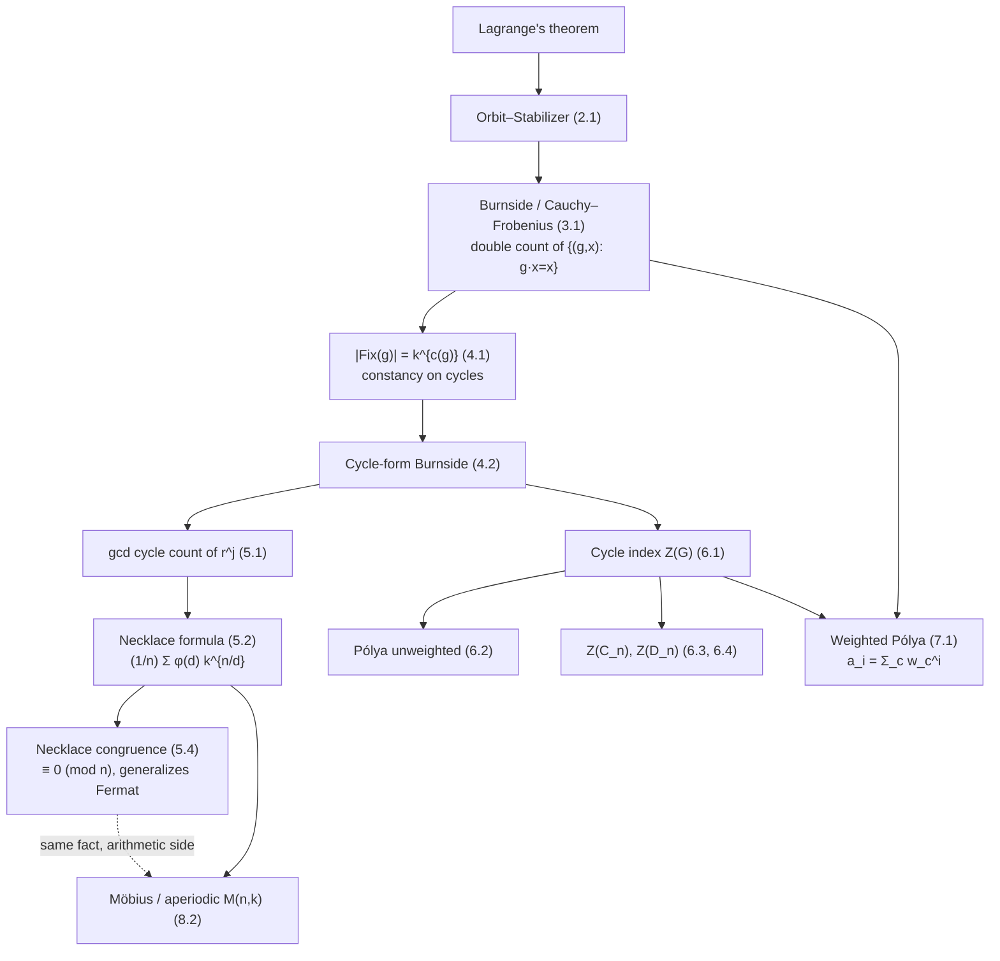

# Burnside's Lemma & Pólya Enumeration — Mathematical Foundations

## Table of Contents
1. [Formal Definitions: Group Actions](#1-formal-definitions-group-actions)
2. [Orbits, Stabilizers, and the Orbit–Stabilizer Theorem](#2-orbits-stabilizers-and-the-orbitstabilizer-theorem)
3. [Burnside's Lemma (Cauchy–Frobenius), Two Proofs](#3-burnsides-lemma-cauchyfrobenius-two-proofs)
4. [The Cycle-Count Formula for Colorings](#4-the-cycle-count-formula-for-colorings)
5. [The Necklace Formula and the φ Divisor Sum](#5-the-necklace-formula-and-the-φ-divisor-sum)
6. [The Cycle Index and Pólya's Enumeration Theorem](#6-the-cycle-index-and-polyas-enumeration-theorem)
7. [The Weighted (Generating-Function) Version](#7-the-weighted-generating-function-version)
8. [Aperiodic Necklaces and Möbius Inversion](#8-aperiodic-necklaces-and-möbius-inversion)
9. [Complexity Analysis](#9-complexity-analysis)
10. [Summary](#10-summary)

---

## 1. Formal Definitions: Group Actions

Throughout, `G` is a finite group with identity `e`, and `X` is a finite set (the set of configurations / colorings).

**Definition 1.1 (Group action).** A (left) **action** of `G` on `X` is a map `· : G × X → X` written `(g, x) ↦ g·x` satisfying:

```
(A1)  e·x = x                        for all x ∈ X
(A2)  g·(h·x) = (gh)·x               for all g, h ∈ G, x ∈ X.
```

Equivalently, an action is a group homomorphism `ρ : G → Sym(X)` into the symmetric group on `X`; `ρ(g)` is the permutation `x ↦ g·x`. Axiom (A1) says `ρ(e) = id`, and (A2) says `ρ` is a homomorphism. We freely identify `g` with the permutation `ρ(g)` of `X`.

**Definition 1.2 (Fixed-point set).** For `g ∈ G`,

```
Fix(g) = X^g = { x ∈ X : g·x = x }.
```

**Definition 1.3 (Stabilizer).** For `x ∈ X`,

```
Stab(x) = G_x = { g ∈ G : g·x = x }.
```

`Stab(x)` is a subgroup of `G` (it contains `e`; closed under product and inverse by (A1)–(A2)).

**Definition 1.4 (Orbit).** For `x ∈ X`,

```
Orb(x) = G·x = { g·x : g ∈ G }.
```

**Proposition 1.5 (Orbits partition `X`).** The relation `x ∼ y ⟺ y = g·x for some g ∈ G` is an equivalence relation; its classes are the orbits.

*Proof.* Reflexive: `x = e·x`. Symmetric: `y = g·x ⟹ x = g^{-1}·y` by (A2) and (A1). Transitive: `y = g·x, z = h·y ⟹ z = (hg)·x`. Equivalence classes of `∼` are exactly the sets `Orb(x)`. ∎

The number we seek — distinct objects up to symmetry — is `|X/G|`, the **number of orbits**.

**Worked action.** Let `X` be the `2^4 = 16` two-colorings of a 4-bead necklace and `G = C_4 = {e, r, r², r³}` the rotation group, `r` acting by `(r·x)_i = x_{(i-1) mod 4}`. Axioms hold: `e` does nothing, and rotating by `r` then `r` equals rotating by `r²`. The orbit of `RRBB` is `{RRBB, BRRB, BBRR, RBBR}` (size 4); the orbit of `RBRB` is `{RBRB, BRBR}` (size 2); the orbit of `RRRR` is `{RRRR}` (size 1). These sizes (`4, 2, 1`) will be explained by orbit–stabilizer (Section 2).

---

## 2. Orbits, Stabilizers, and the Orbit–Stabilizer Theorem

**Theorem 2.1 (Orbit–Stabilizer).** For every `x ∈ X`,

```
|Orb(x)| · |Stab(x)| = |G|,    equivalently  |Orb(x)| = [G : Stab(x)].
```

*Proof.* Define `ψ : G/Stab(x) → Orb(x)` on left cosets by `ψ(g·Stab(x)) = g·x`. 

- **Well-defined & injective:** `g·x = h·x ⟺ (h^{-1}g)·x = x ⟺ h^{-1}g ∈ Stab(x) ⟺ g·Stab(x) = h·Stab(x)`. The chain of iff's gives both well-definedness and injectivity.
- **Surjective:** every element of `Orb(x)` is `g·x = ψ(g·Stab(x))` by definition.

So `ψ` is a bijection, hence `|Orb(x)| = |G/Stab(x)| = |G|/|Stab(x)|` (the last by Lagrange's theorem). ∎

**Worked verification.** For `x = RBRB` above, `Stab(RBRB) = {e, r²}` (only the identity and the half-turn fix it), `|Stab| = 2`, so `|Orb| = |G|/|Stab| = 4/2 = 2` ✓. For `x = RRRR`, `Stab = G`, so `|Orb| = 4/4 = 1` ✓. For `x = RRBB`, `Stab = {e}`, `|Orb| = 4/1 = 4` ✓. Orbit–stabilizer is the bridge that converts the per-element fixed-point count into the per-orbit count, which is exactly what Burnside's proof exploits.

**Corollary 2.2 (class equation form).** Summing `|Orb(x)| = |G|/|Stab(x)|` over a set of orbit representatives recovers `|X| = Σ_{orbits} |G|/|Stab|`. This is the **orbit decomposition** of `|X|`, the action-theoretic analogue of the class equation `|G| = Σ [G : C_G(g_i)]` (the special case `X = G` acting by conjugation). The two faces of orbit–stabilizer — small orbits have large stabilizers, large orbits have small ones, and the product is constant — are precisely what makes the double count in Burnside's proof collapse cleanly.

**Lemma 2.3 (stabilizers within an orbit are conjugate).** If `y = g·x`, then `Stab(y) = g·Stab(x)·g^{-1}`. *Proof.* `h ∈ Stab(y) ⟺ h·(g·x) = g·x ⟺ (g^{-1}hg)·x = x ⟺ g^{-1}hg ∈ Stab(x) ⟺ h ∈ g Stab(x) g^{-1}`. ∎ Hence all stabilizers in one orbit have the *same size* `|G|/|Orb(x)|`, which is the fact `(★★)` uses below: every `x` in a given orbit contributes the identical term `|G|/|O|`.

---

## 3. Burnside's Lemma (Cauchy–Frobenius), Two Proofs

**Theorem 3.1 (Burnside / Cauchy–Frobenius / orbit-counting).** The number of orbits is the average number of fixed points:

```
|X/G| = (1/|G|) · Σ_{g∈G} |Fix(g)|.
```

> **Historical note.** Burnside stated it in his 1897 text attributing it to Frobenius (1887); Cauchy had the prime-order case (1845). "Cauchy–Frobenius lemma" is the historically accurate name; "Burnside's lemma" is the common one.

### 3.1 Proof A — Double counting the incidence set

Consider the set of "fixed pairs"

```
S = { (g, x) ∈ G × X : g·x = x }.
```

Count `|S|` two ways.

*By `g` first:* for fixed `g`, the `x` with `g·x = x` are exactly `Fix(g)`, so

```
|S| = Σ_{g∈G} |Fix(g)|.        (★)
```

*By `x` first:* for fixed `x`, the `g` with `g·x = x` are exactly `Stab(x)`, so

```
|S| = Σ_{x∈X} |Stab(x)|.       (★★)
```

Now group `(★★)` by orbits. Within one orbit `O`, every `x ∈ O` has `|Stab(x)| = |G|/|O|` (Theorem 2.1), so the orbit contributes `Σ_{x∈O} |G|/|O| = |O| · (|G|/|O|) = |G|`. Summing over all orbits:

```
|S| = Σ_{orbits O} |G| = |G| · (number of orbits) = |G| · |X/G|.   (★★★)
```

Equating `(★)` and `(★★★)` and dividing by `|G|` gives Theorem 3.1. ∎

The elegance: each orbit contributes *exactly `|G|`* to `Σ_x |Stab(x)|`, regardless of its size, because small orbits have large stabilizers and vice versa (orbit–stabilizer). That cancellation is the heart of the lemma.

### 3.2 Proof B — Indicator functions and averaging

Let `1_{g·x = x}` be the Iverson indicator. The number of orbits equals `Σ_{x∈X} 1/|Orb(x)|` (each orbit `O` contributes `|O| · (1/|O|) = 1`). By orbit–stabilizer, `1/|Orb(x)| = |Stab(x)|/|G|`. Hence

```
|X/G| = Σ_{x∈X} |Stab(x)|/|G| = (1/|G|) Σ_{x∈X} |Stab(x)|
      = (1/|G|) Σ_{x∈X} Σ_{g∈G} 1_{g·x=x}
      = (1/|G|) Σ_{g∈G} Σ_{x∈X} 1_{g·x=x}     (Fubini / swap finite sums)
      = (1/|G|) Σ_{g∈G} |Fix(g)|.  ∎
```

Proof B is Proof A repackaged with indicator functions; the swap of summation order is the same incidence-set double count.

**Worked numeric verification.** For `C_4` on the 16 two-colorings: `|Fix(e)| = 16`, `|Fix(r)| = |Fix(r³)| = 2` (only monochrome), `|Fix(r²)| = 4` (period-2 colorings `xyxy`). Average: `(16 + 2 + 4 + 2)/4 = 24/4 = 6` orbits. Direct orbit enumeration (Section 1 worked action, extended) indeed yields 6 — `{RRRR},{BBBB},{RBRB,BRBR},{RRBB+rotations},{RRRB+rotations},{BBBR+rotations}` — confirming the lemma.

### 3.3 The prime-order special case (Cauchy, 1845)

Historically the first instance: if `|G| = p` is prime and `G` acts on `X`, then `|X| ≡ |Fix(G)| (mod p)`, where `Fix(G) = ∩_g Fix(g)` is the set of points fixed by *every* element. *Proof.* Every orbit has size dividing `|G| = p` (orbit–stabilizer), so size `1` or `p`. Size-`1` orbits are exactly the points of `Fix(G)`. Partitioning `X` into orbits, `|X| = |Fix(G)| + p·(#orbits of size p)`, hence `|X| ≡ |Fix(G)| (mod p)`. ∎ Taking `X = ` set of `p`-tuples from a `k`-symbol alphabet with `G = C_p` rotating, `Fix(G)` is the `k` constant tuples, giving `k^p ≡ k (mod p)` — **Fermat's little theorem as a corollary of orbit counting** (sibling `05-fermat-euler`). This is the combinatorial bridge: the necklace argument and Fermat's theorem are the same statement.

### 3.4 Why the average is always an integer

`Σ_g |Fix(g)|` is a sum of non-negative integers, yet dividing by `|G|` always yields an integer — a non-obvious arithmetic fact that the proof *explains*: the sum equals `|G| · #orbits` (line `★★★`), so the quotient is literally the orbit count. There is no rounding, no approximation. Consequently, in any implementation, a non-integer Burnside result is a *proof of a bug* (wrong group, missing identity, or miscounted `|Fix|`), never a numerical artifact. This integrality is the single most useful invariant for testing symmetry-counting code.

---

## 4. The Cycle-Count Formula for Colorings

The abstract `|Fix(g)|` becomes concrete when `X` is the set of colorings of a finite set of **slots** `[n] = {1,…,n}` with `k` colors, and `G` acts by permuting slots.

**Setup.** `X = [k]^{[n]}` (functions from slots to colors), `|X| = k^n`. A group element `g` acts on a coloring `χ : [n] → [k]` by `(g·χ)(i) = χ(g^{-1}(i))` (so the color physically moves with the slot).

**Theorem 4.1 (Fixed colorings = `k^{c(g)}`).** Let `c(g)` be the number of disjoint cycles of `g` as a permutation of `[n]`. Then

```
|Fix(g)| = k^{c(g)}.
```

*Proof.* `g·χ = χ` means `χ(g^{-1}(i)) = χ(i)` for all `i`, i.e. `χ(i) = χ(g(i))` for all `i`. Iterating, `χ` is constant along each orbit of `⟨g⟩` on `[n]` — that is, constant on each **cycle** of `g`. Conversely, any coloring constant on each cycle is fixed. A coloring is therefore determined by one free color choice per cycle, independently; with `c(g)` cycles and `k` colors there are exactly `k^{c(g)}` such colorings. ∎

**Corollary 4.2 (Burnside in cycle form).**

```
|X/G| = (1/|G|) Σ_{g∈G} k^{c(g)}.
```

This is the workhorse identity: counting orbits of colorings reduces entirely to counting cycles of group elements.

**Worked example.** `C_4`, `k = 2`: cycle counts are `c(e)=4, c(r)=1, c(r²)=2, c(r³)=1`, giving `(2^4 + 2^1 + 2^2 + 2^1)/4 = (16+2+4+2)/4 = 6` ✓, matching Section 3.2 where the fixed sets were counted directly. Theorem 4.1 is what lets us skip the direct fixed-set count.

**Remark 4.3 (the induced action).** When the colored objects are not the base set on which `G` acts naturally but derived objects (edges, faces, pairs), `c(g)` must be the cycle count of the **induced** permutation. Formally, if `G` acts on `[n]` and we color the set `Y = {ordered/unordered tuples of [n]}`, then `G` acts on `Y` via `g·(i_1,…,i_t) = (g(i_1),…,g(i_t))`, and Theorem 4.1 applies with `c(g)` = number of cycles of `g` *on `Y`*. The arithmetic of computing `c` on `Y` from `c` on `[n]` (e.g. the edge-cycle formula of Section 9 in `senior.md`) is the only added complexity; Theorem 4.1 itself is unchanged. This is the formal justification for the graph-counting and polyhedron-coloring algorithms.

**Proposition 4.4 (number of orbits of the trivial color count).** For `k = 1`, `c(g)` is irrelevant since `1^{c(g)} = 1`, so `|X/G| = (1/|G|)·|G| = 1`. For `k = 0` (empty palette) `X = ∅` and there are `0` orbits, with the convention `0^0 = 1` for the identity only when `n = 0`. These degenerate cases are exactly the boundary tests every implementation should pass.

---

## 5. The Necklace Formula and the φ Divisor Sum

**Lemma 5.1 (Cycle count of a rotation).** In `C_n` acting on `[n]` by `r^j : i ↦ (i+j) mod n`, the element `r^j` has exactly `gcd(j, n)` cycles, each of length `n/gcd(j, n)`.

*Proof.* The cycle of `r^j` through `0` is `{0, j, 2j, …} mod n = ⟨j⟩` as a subgroup of `ℤ/nℤ`, of size `n/gcd(j,n)` (the order of `j` in the additive group). All cycles are cosets of this subgroup, hence of equal length `n/gcd(j,n)`; their number is `n / (n/gcd(j,n)) = gcd(j, n)`. ∎

**Theorem 5.2 (Necklace formula).** The number of `k`-colorings of an `n`-bead necklace up to rotation is

```
N(n, k) = (1/n) Σ_{j=0}^{n-1} k^{gcd(j,n)} = (1/n) Σ_{d|n} φ(d) · k^{n/d}.
```

*Proof.* The first equality is Corollary 4.2 with Lemma 5.1. For the second, partition the index set `{0,…,n-1}` by the value `e = gcd(j, n)`, a divisor of `n`. The count of `j` with `gcd(j, n) = e` is `φ(n/e)`: write `j = e·j'`, then `gcd(j,n) = e ⟺ gcd(j', n/e) = 1`, and there are `φ(n/e)` such `j'` in `[0, n/e)`. Thus

```
Σ_j k^{gcd(j,n)} = Σ_{e|n} φ(n/e) · k^{e} = Σ_{d|n} φ(d) · k^{n/d}   (substitute d = n/e).  ∎
```

**Theorem 5.3 (Integrality).** `N(n, k)` is a non-negative integer for all `n, k ≥ 1`.

*Proof.* It counts orbits (Theorem 3.1), hence is a non-negative integer a priori. Equivalently, `Σ_{d|n} φ(d) k^{n/d} ≡ 0 (mod n)` — a number-theoretic statement that follows from the orbit interpretation, and whose direct proof generalizes Fermat's little theorem (`n = p` prime gives `k^p + (p-1)k ≡ 0 (mod p)`, i.e. `k^p ≡ k`). ∎

**Worked check.** `n = 6, k = 2`: divisors `1,2,3,6` give `(1/6)(φ(1)·2^6 + φ(2)·2^3 + φ(3)·2^2 + φ(6)·2^1) = (64 + 8 + 8 + 4)/6 = 84/6 = 14` ✓ (OEIS A000031). The `k=1` case gives `(1/n)Σ_{d|n}φ(d) = (1/n)·n = 1` by the totient divisor-sum identity `Σ_{d|n}φ(d) = n` (sibling `05-fermat-euler`).

### 5.1 The divisibility statement, proved directly

Theorem 5.3 asserts integrality via the orbit interpretation. It is illuminating to see the equivalent pure number theory standing on its own, because it is the precondition that the modular implementation (`senior.md` §5) silently relies on.

**Theorem 5.4 (Necklace congruence).** For all integers `n ≥ 1` and `k ≥ 1`,

```
Σ_{d|n} φ(d) · k^{n/d} ≡ 0   (mod n).
```

*Proof (combinatorial).* By Lemma 5.1 the left side equals `Σ_{j=0}^{n-1} k^{gcd(j,n)}`, which counts pairs `(j, χ)` where `0 ≤ j < n` and `χ` is a coloring fixed by the rotation `r^j` — precisely the incidence set `S` of Burnside's proof for the action of `C_n`. By `(★★★)`, `|S| = |C_n| · #orbits = n · N(n,k)`, an integer multiple of `n`. Hence the sum is `≡ 0 (mod n)`. ∎

*Proof (prime-power kernel, no group theory).* It suffices to handle `n = p^a` and combine via the Chinese Remainder Theorem, since both sides are multiplicative-compatible in the relevant sense; here we show the prime case `n = p`, the seed of the induction. For `n = p`, divisors are `1` and `p`:

```
φ(1)·k^p + φ(p)·k^1 = k^p + (p-1)k = (k^p − k) + p·k.
```

By Fermat's little theorem `k^p ≡ k (mod p)`, so `k^p − k ≡ 0 (mod p)`, and `p·k ≡ 0 (mod p)`; the sum is `≡ 0 (mod p)`. The general prime-power and composite cases follow by the same lifting-the-exponent / CRT bookkeeping (sibling `05-fermat-euler`, `05-crt`). ∎

The two proofs are the same fact wearing different clothes: the combinatorial one *is* Burnside specialized to `C_n`, and the arithmetic one *is* Fermat's theorem generalized over the divisor lattice. This is why the necklace formula is the canonical bridge between group-action counting and elementary number theory — and why a modular implementation may divide by `n` (via a Fermat inverse) with the guarantee that the numerator is a genuine multiple of `n`.

### 5.2 The full φ-grouping, step by step

The substitution `Σ_{j} k^{gcd(j,n)} = Σ_{d|n} φ(d) k^{n/d}` in Theorem 5.2 compresses a length-`n` sum to a length-`σ_0(n)` sum and deserves to be seen explicitly. Fix `n` and partition the index range `{0, 1, …, n−1}` by the value `e := gcd(j, n)`, which is always a divisor of `n`:

```
{0,…,n−1} = ⊔_{e | n} A_e,   A_e := { j : gcd(j, n) = e }.
```

Every `j ∈ A_e` contributes the identical term `k^{gcd(j,n)} = k^{e}`, so `Σ_{j∈A_e} k^{gcd(j,n)} = |A_e| · k^{e}`. It remains to count `|A_e|`. Writing `j = e·j'`, the condition `gcd(e·j', n) = e` is equivalent to `gcd(j', n/e) = 1`, and `j` ranges over `[0, n)` iff `j'` ranges over `[0, n/e)`; the number of such coprime `j'` is exactly `φ(n/e)`. Therefore `|A_e| = φ(n/e)` and

```
Σ_{j} k^{gcd(j,n)} = Σ_{e|n} φ(n/e) · k^{e}.
```

Re-indexing with `d := n/e` (a bijection on the divisors of `n`) turns `φ(n/e)·k^{e}` into `φ(d)·k^{n/d}`, giving the closed form. The same grouping, with the monomial `a_d^{n/d}` in place of the scalar `k^{n/d}`, produces the cycle index `Z(C_n)` of Theorem 6.3 — one derivation, reused.

---

## 6. The Cycle Index and Pólya's Enumeration Theorem

**Definition 6.1 (Cycle index).** For `G` acting on `[n]`, let `j_i(g)` be the number of cycles of length `i` in `g`. The **cycle index** is the polynomial in indeterminates `a_1, …, a_n`:

```
Z(G; a_1, …, a_n) = (1/|G|) Σ_{g∈G} ∏_{i=1}^{n} a_i^{j_i(g)}.
```

Note `Σ_i i·j_i(g) = n` (cycles partition `[n]`) and `Σ_i j_i(g) = c(g)`.

**Theorem 6.2 (Pólya, unweighted form).** The number of `k`-colorings up to `G` is

```
|X/G| = Z(G; k, k, …, k).
```

*Proof.* Substitute `a_i = k` for all `i`. Then `∏_i a_i^{j_i(g)} = k^{Σ_i j_i(g)} = k^{c(g)}`, so `Z(G; k,…,k) = (1/|G|) Σ_g k^{c(g)}`, which is Corollary 4.2. ∎

**Theorem 6.3 (Cycle index of `C_n`).**

```
Z(C_n) = (1/n) Σ_{d|n} φ(d) · a_d^{n/d}.
```

*Proof.* By Lemma 5.1, `r^j` has `gcd(j,n)` cycles all of length `n/gcd(j,n)`, contributing the monomial `a_{n/gcd(j,n)}^{gcd(j,n)}`. Grouping by `e = gcd(j,n)` as in Theorem 5.2 (with `φ(n/e)` elements per group, and writing `d = n/e` so the cycle length is `d` with `n/d` cycles) yields `(1/n) Σ_{d|n} φ(d) a_d^{n/d}`. ∎

**Theorem 6.4 (Cycle index of `D_n`).**

```
Z(D_n) = (1/2) Z(C_n) + R_n,   where
R_n = (1/2) a_1 a_2^{(n-1)/2}                              if n is odd,
R_n = (1/4)( a_1^2 a_2^{(n-2)/2} + a_2^{n/2} )            if n is even.
```

*Proof.* `D_n = C_n ⊔ (reflections)`. The rotation half gives `(1/2)Z(C_n)` (averaging over `2n` elements, the `n` rotations contribute `(1/2n)Σ_{rot} = (1/2)·[(1/n)Σ_{rot}]`). The reflections split by parity as derived in `middle.md`: odd `n` has `n` reflections each of type `a_1 a_2^{(n-1)/2}`, giving `(1/2n)·n·a_1 a_2^{(n-1)/2} = (1/2)a_1 a_2^{(n-1)/2}`; even `n` has `n/2` vertex-axis reflections (`a_1^2 a_2^{(n-2)/2}`) and `n/2` edge-axis reflections (`a_2^{n/2}`), giving `(1/2n)(n/2)(a_1^2 a_2^{(n-2)/2} + a_2^{n/2}) = (1/4)(…)`. ∎

**Worked.** `Z(C_4) = (1/4)(a_1^4 + a_2^2 + 2a_4)`; `Z(D_4) = (1/2)Z(C_4) + (1/4)(a_1^2 a_2 + a_2^2) = (1/8)(a_1^4 + 2a_4 + 3a_2^2 + 2a_1^2 a_2)`. Setting `a_i = 2`: `Z(D_4) = (16 + 4 + 12 + 16)/8 = 6` ✓ (bracelets of 4 beads, 2 colors).

**Theorem 6.5 (Cycle index of `S_n`).** Summing over cycle types `λ = (1^{m_1} 2^{m_2} ⋯)` with `Σ_i i·m_i = n`,

```
Z(S_n) = Σ_{λ ⊢ n}  ∏_{i≥1}  (a_i^{m_i}) / (i^{m_i} · m_i!),
```

and these polynomials satisfy the **exponential generating identity**

```
Σ_{n≥0} Z(S_n) · t^n = exp( Σ_{i≥1} a_i · t^i / i ).
```

*Proof.* By Definition 6.1, `Z(S_n) = (1/n!) Σ_{σ∈S_n} ∏_i a_i^{m_i(σ)}`. Permutations with a fixed cycle type `λ` all give the same monomial `∏_i a_i^{m_i}`, and the number of such permutations (the conjugacy-class size in `S_n`) is the classical

```
|class(λ)| = n! / ∏_i (i^{m_i} · m_i!),
```

because choosing a permutation of cycle type `λ` amounts to writing `n` elements in a row (`n!` ways) and cutting them into cycles of the prescribed lengths, overcounting by `i^{m_i}` for the cyclic rotation of each length-`i` cycle and by `m_i!` for permuting the `m_i` cycles of equal length. Dividing the class size by `n!` cancels the `n!`, leaving `∏_i 1/(i^{m_i} m_i!)`, and summing over all cycle types `λ ⊢ n` gives the displayed `Z(S_n)`. The generating identity is then the **exponential formula**: `exp(Σ_i a_i t^i / i) = ∏_i exp(a_i t^i / i) = ∏_i Σ_{m_i ≥ 0} (a_i t^i / i)^{m_i}/m_i!`, and the coefficient of `t^n` collects exactly the terms with `Σ_i i m_i = n`, reproducing `Z(S_n)`. ∎

This is the formal justification for the `senior.md` claim that `S_n`-symmetry counting sums over the `p(n)` integer partitions rather than the `n!` group elements: the `p(n)` cycle types are precisely the monomials of `Z(S_n)`, each pre-weighted by its conjugacy-class size. Setting `a_i = k` recovers the unweighted count, and substituting the induced edge-cycle exponents (Remark 4.3) gives the graph-enumeration formula.

---

## 7. The Weighted (Generating-Function) Version

Pólya's theorem is strongest in its **weighted** form, which resolves how many colorings use each color a prescribed number of times.

**Setup.** Assign each color `c` a formal weight `w_c` (a monomial like `x`, `y`, …). The **weight of a coloring** is the product of its slot weights; colorings in the same orbit have equal weight (the action permutes slots, preserving the multiset of colors).

**Theorem 7.1 (Pólya, weighted).** The generating function enumerating orbits by weight is obtained by substituting the **power sums** of the color weights:

```
Σ_{orbits O} weight(O) = Z(G; p_1, p_2, …, p_n),   where  p_i = Σ_c w_c^i.
```

In particular, with `k` colors weighted `x_1, …, x_k`, set `a_i = x_1^i + … + x_k^i`.

*Proof (full).* The argument is a weighted Burnside double count, mirroring Section 3.1 but carrying a weight on each configuration. Work in the polynomial ring `R = ℤ[w_1, …, w_k]` so that "weight" is a ring element and sums/products are formal.

**Step 1 — a weighted incidence sum.** Define the weighted analogue of `|S|`:

```
W = Σ_{g∈G} Σ_{χ ∈ Fix(g)} weight(χ).
```

**Step 2 — count `W` by `χ` first (orbit side).** Reorder the double sum to range over configurations:

```
W = Σ_{χ∈X} weight(χ) · |{g : g·χ = χ}| = Σ_{χ∈X} weight(χ) · |Stab(χ)|.
```

Group by orbits. All `χ` in one orbit `O` share the same weight `w_O` (the action permutes slots, leaving the color multiset — hence the weight monomial — invariant) and the same stabilizer size `|G|/|O|` (Theorem 2.1). So the orbit contributes `Σ_{χ∈O} w_O·(|G|/|O|) = |O|·w_O·(|G|/|O|) = |G|·w_O`. Summing over orbits:

```
W = |G| · Σ_{orbits O} w_O.        (◆)
```

**Step 3 — count `W` by `g` first (cycle side).** For a fixed `g`, a fixed coloring is constant on each cycle of `g`. A cycle of length `i` colored with color `c` contributes `i` slots all of weight `w_c`, i.e. a factor `w_c^i`; the total weight of a fixed coloring is the product over cycles of these per-cycle factors. Because each cycle is colored **independently**, summing `weight(χ)` over all `χ ∈ Fix(g)` factors as a product over cycles, and the sum over the single color of one length-`i` cycle is the power sum `p_i = Σ_c w_c^i`:

```
Σ_{χ ∈ Fix(g)} weight(χ) = ∏_{cycles of g} (Σ_c w_c^{len}) = ∏_{i} p_i^{j_i(g)}.
```

Summing over `g`:

```
W = Σ_{g∈G} ∏_i p_i^{j_i(g)}.        (◆◆)
```

**Step 4 — equate.** From `(◆)` and `(◆◆)`, `|G|·Σ_O w_O = Σ_g ∏_i p_i^{j_i(g)}`, so

```
Σ_{orbits O} weight(O) = (1/|G|) Σ_g ∏_i p_i^{j_i(g)} = Z(G; p_1, …, p_n). ∎
```

The unweighted Theorem 6.2 is the special case all `w_c = 1`, so `p_i = Σ_c 1 = k`, and `(◆)` becomes the bare orbit count. Every step is the weighted echo of the incidence double count in Section 3.1: `(◆)` is the orbit side `(★★★)`, `(◆◆)` is the fixed-point side `(★)`, and Theorem 4.1's constancy-on-cycles is what makes Step 3 factor.

**Worked.** Two-color necklaces of length 4 with weights `x` (red), `y` (blue). Power sums `p_i = x^i + y^i`. Then

```
Z(C_4; p_1, p_2, p_3, p_4) = (1/4)[ (x+y)^4 + (x^2+y^2)^2 + 2(x^4 + y^4) ].
```

Expanding: the coefficient of `x^2 y^2` is `(1/4)[ 6 + 2 + 0 ] = 2`, so there are exactly **2** distinct necklaces with two red and two blue beads (`RRBB` and `RBRB`). The coefficients `1 + 1 + 2 + 1 + 1` (for `x^4, x^3y, x^2y^2, xy^3, y^4`) sum to `6 = N(4,2)` ✓. The weighted theorem thus refines the single number `6` into its full color-composition distribution — impossible from Burnside's scalar form alone.

**Corollary 7.2 (closed form for a fixed color count).** The number of `k=2`-color necklaces of length `n` with exactly `r` beads of the first color is the coefficient of `x^r y^{n-r}` in `Z(C_n; x^i + y^i)`, which simplifies (using `Z(C_n) = (1/n)Σ_{d|n}φ(d)a_d^{n/d}` and the binomial expansion of each `a_d = x^d + y^d`) to

```
(1/n) Σ_{d | gcd(n, r)} φ(d) · C(n/d, r/d).
```

*Proof.* In `a_d^{n/d} = (x^d + y^d)^{n/d}`, the term with `x`-exponent `r` exists only if `d | r` (each chosen factor contributes `d` to the `x`-exponent), and then equals `C(n/d, r/d)·x^r y^{n-r}`. Summing `φ(d)` of these over the divisors `d` of both `n` and `r` (i.e. `d | gcd(n, r)`), divided by `n`, gives the coefficient. ∎ For `n = 4, r = 2`: `gcd(4,2) = 2`, divisors `{1, 2}`, giving `(1/4)[φ(1)C(4,2) + φ(2)C(2,1)] = (1/4)[6 + 2] = 2` ✓. This is the formula implemented in `tasks.md` Task 8.

**Multivariate generalization.** With `k` colors and weights `x_1, …, x_k`, the same substitution `a_i = x_1^i + … + x_k^i` yields a generating function in `k` variables whose coefficient of `∏ x_c^{r_c}` (with `Σ r_c = n`) counts necklaces using color `c` exactly `r_c` times. Setting every `x_c = 1` recovers `p_i = k` and the scalar count `N(n, k)`. The cycle index is thus the *universal* enumerator: one polynomial answers every color-constrained question simultaneously, which is precisely Pólya's contribution beyond Burnside.

---

## 8. Aperiodic Necklaces and Möbius Inversion

A necklace is **aperiodic** (a "Lyndon necklace") if its only rotational symmetry is the identity — its orbit has full size `n`. Counting these connects Burnside to Möbius inversion (sibling `32-mobius-inversion`).

**Definition 8.1.** Let `M(n, k)` = number of aperiodic `k`-colorings of `n` slots up to rotation (orbits of size exactly `n`).

**Theorem 8.2.** Every necklace has a primitive period `d | n`, and grouping all necklaces by their period gives

```
k^n = Σ_{d|n} d · M(d, k)        (each length-d aperiodic necklace's orbit accounts for d colorings).
```

By **Möbius inversion**:

```
M(n, k) = (1/n) Σ_{d|n} μ(n/d) · k^{d} = (1/n) Σ_{d|n} μ(d) · k^{n/d}.
```

*Proof.* A coloring of period exactly `d` (smallest period) comes from an aperiodic length-`d` coloring repeated `n/d` times; there are `d·M(d,k)` colorings of `[n]` whose minimal period is `d` (each of the `M(d,k)` aperiodic orbits of size `d` corresponds to `d` distinct colorings of `[d]`, repeated to length `n`). Summing the count of colorings by minimal period `d | n` recovers all `k^n` colorings, giving the first identity. Möbius inversion of `k^n = Σ_{d|n} d·M(d,k)` (treating `n·M(n,k)` and `k^n` as the inverted pair) yields the formula. ∎

**Relation to Burnside.** The total necklace count `N(n,k) = Σ_{d|n} M(d,k)` (every necklace has *some* period `d | n`). Substituting the φ-formula for `N` and the μ-formula for `M` and equating is an instance of the φ–μ duality `Σ_{d|n} φ(d) = n` vs `Σ_{d|n} μ(d) = [n=1]`.

**Worked.** `M(4, 2) = (1/4)(μ(1)·2^4 + μ(2)·2^2 + μ(4)·2^1) = (1/4)(16 - 4 + 0) = 12/4 = 3` — the 3 aperiodic 2-color 4-necklaces (`RRRB`, `RRBB`, `RBBB` orbits, each of full size 4). Check via `N(4,2) = Σ_{d|4} M(d,2) = M(1,2)+M(2,2)+M(4,2) = 2 + 1 + 3 = 6` ✓. The Lyndon-word count `M(n,k)` is exactly the number of degree-`n` monic irreducible-like necklaces and appears in free Lie algebra dimensions and LFSR theory.

---

## 9. Complexity Analysis

```text
Parameters: n = #slots, k = #colors, |G| = group size, c(g) = cycle count.
```

### 9.0 Method comparison

The four computational regimes, side by side, with the precondition that selects each:

| Method | Time | Space | Use when | Exact output bound |
|--------|------|-------|----------|--------------------|
| General Burnside loop | `O(\|G\|·n)` | `O(n)` | small/irregular `G` given or generated | `O(n log k)` digits |
| Conjugacy-batched loop | `O(#classes·n)` | `O(n)` | cycle types repeat (e.g. `S_n`) | same |
| `C_n` / `D_n` closed form | `O(√n + σ_0(n)·log n)` | `O(1)` | pure rotation / dihedral | `O(n log k)` digits |
| `S_n` partition sum | `O(p(n)·n²)` | `O(n)` | structures up to relabeling | `O(n² log k)` digits |
| Brute-force orbits (oracle) | `O(k^n·\|G\|·n)` | `O(k^n)` | validation only, tiny `n` | — |

The headline separation: the closed form is **sub-linear in `n`** while the brute-force oracle is **exponential in `n`**, and the partition sum sits between — super-polynomial in `n` (since `p(n) ~ exp(π√(2n/3))`) yet astronomically below `n!`. The right column reminds us that even the fastest method must emit `Ω(n² log k)` bits for graph counts, so no algorithm beats the partition sum by more than the output-size floor (the lower-bound remark below).

The conjugacy-batched loop is the workhorse middle ground: it is exactly the general loop with the observation that conjugate elements share a cycle type (Lemma 2.3 / `senior.md` §2.5), so one computes `c(g)` and `k^{c(g)}` once per class and multiplies by the class size — turning `|G|` iterations into `#classes`, which for `S_n` is the `p(n)` partitions and for the cube's rotation group is `5` instead of `24`.

**General Burnside loop.**
```
For each g ∈ G: count cycles (O(n)), compute k^{c(g)} (O(log c) modular, or O(n) plain).
Total: O(|G| · n)  time,  O(n) space.
```

**Necklace closed form (`C_n`).**
```
Iterate divisors of n: O(√n) to find them; per divisor a totient (O(√n)) and a power (O(log n)).
Total: O(√n · (√n)) = O(n) naive, or O(σ_0(n) · √n) with divisor enumeration,
       or O(σ_0(n) · log n) if totients are precomputed.   Space O(1).
```
where `σ_0(n)` is the number of divisors. In practice `O(√n)` dominates (factoring `n`).

**`S_n`-symmetry (graphs up to iso).**
```
Sum over p(n) integer partitions (cycle types), each costing O(n²) to compute induced
edge-cycle count and class size.   Total: O(p(n) · n²).
Since p(n) ~ exp(π√(2n/3))/(4n√3), this is sub-`n!` but still super-polynomial in n.
```

**Brute-force orbit count (oracle).**
```
Enumerate k^n colorings, apply |G| group elements each: O(k^n · |G| · n).  Space O(k^n).
Validation only.
```

**Theorem 9.1 (Burnside is exponentially better than enumeration).** For rotation symmetry, the closed form runs in `O(√n + σ_0(n)·log n)` time and `O(1)` space, versus `Θ(k^n)` for enumeration — a separation from exponential to sub-linear in `n`.

*Proof.* The closed form touches only the `σ_0(n) = O(n^{o(1)})` divisors of `n`, performing a bounded number of `O(log n)` modular powers and `O(√n)` factorizations each. Enumeration must visit all `k^n ≥ 2^n` colorings. The ratio is `2^n / poly(n) → ∞`. ∎

**Modular variant.** Replacing exact arithmetic with operations mod a prime `p` makes every power `O(log)` and bounds intermediate sizes to `O(log p)` bits; the `(1/|G|)` division is one Fermat inverse `O(log p)`. No asymptotic change, but constants and memory are controlled — essential when exact answers have `Ω(n)`-digit magnitude.

**Lower-bound remark.** Counting graphs up to isomorphism exactly (as a function of `n`) is believed hard in general; the partition-sum method is efficient *per `n`* but the values themselves grow as `2^{C(n,2)}/n!`, so any algorithm printing the exact integer needs `Ω(n²)` output bits. Burnside is optimal up to the unavoidable output size.

---

## 10. Summary

- **Group actions (Defs 1.1–1.4).** An action is a homomorphism `G → Sym(X)`; orbits partition `X` (Prop 1.5), and the count we want is `|X/G|`.
- **Orbit–Stabilizer (Theorem 2.1).** `|Orb(x)|·|Stab(x)| = |G|`, proved by the coset-to-orbit bijection. This is the structural bridge of the whole theory.
- **Burnside / Cauchy–Frobenius (Theorem 3.1).** `|X/G| = (1/|G|) Σ_g |Fix(g)|`, proved by double-counting the incidence set `{(g,x): g·x=x}`; each orbit contributes exactly `|G|` to `Σ_x |Stab(x)|`.
- **Cycle-count formula (Theorem 4.1).** For colorings, `|Fix(g)| = k^{c(g)}` because a fixed coloring is constant on each cycle; hence `|X/G| = (1/|G|) Σ_g k^{c(g)}` (Cor 4.2).
- **Necklace formula (Theorem 5.2).** A rotation `r^j` has `gcd(j,n)` cycles (Lemma 5.1); grouping by gcd gives `N(n,k) = (1/n) Σ_{d|n} φ(d) k^{n/d}`, always an integer (Theorem 5.3, generalizing Fermat).
- **Cycle index & Pólya (Defs 6.1, Theorems 6.2–6.5).** `Z(G) = (1/|G|) Σ_g ∏_i a_i^{j_i(g)}`; setting `a_i = k` recovers the count; `Z(C_n) = (1/n)Σ_{d|n}φ(d)a_d^{n/d}`, `Z(D_n) = (1/2)Z(C_n) + R_n`, and `Z(S_n) = Σ_{λ⊢n} ∏_i a_i^{m_i}/(i^{m_i} m_i!)` with exp-formula `Σ_n Z(S_n)t^n = exp(Σ_i a_i t^i/i)`.
- **Weighted Pólya (Theorem 7.1).** Substituting power sums `a_i = Σ_c w_c^i` yields a generating function whose coefficients are per-color-composition counts (e.g. exactly two red beads).
- **Aperiodic necklaces (Theorem 8.2).** Möbius inversion gives `M(n,k) = (1/n) Σ_{d|n} μ(d) k^{n/d}`, the Lyndon-word count, dual to the φ-formula via `Σφ(d)=n` vs `Σμ(d)=[n=1]`.
- **Complexity (Section 9).** General Burnside is `O(|G|·n)`; rotation closed form `O(√n)`; `S_n` symmetry `O(p(n)·n²)`; all exponentially better than the `Θ(k^n)` enumeration oracle.

### Theorem-Dependency Graph

Every result in this document descends from one double count. The dependency structure makes that lineage explicit:



### Theorem-Dependency Cheat Table

| Result | Depends on | Used by |
|--------|-----------|---------|
| Orbit–Stabilizer (2.1) | Lagrange, coset bijection | Burnside proof |
| Burnside (3.1) | incidence double count + 2.1 | every counting formula here |
| `|Fix(g)| = k^{c(g)}` (4.1) | constancy on cycles | cycle-form Burnside |
| Necklace formula (5.2) | 4.1 + gcd cycle count (5.1) | Pólya `Z(C_n)`, modular necklaces |
| Cycle index (6.1) | 4.1 generalized to cycle lengths | Pólya unweighted/weighted |
| `Z(S_n)` + exp formula (6.5) | conjugacy-class sizes in `S_n` | `S_n` symmetry / graph counts |
| Weighted Pólya (7.1) | weighted Burnside + 6.1 | per-color counts |
| Möbius `M(n,k)` (8.2) | Möbius inversion + period decomposition | aperiodic / Lyndon counts |

### Closing Notes

- **One theorem, one proof technique.** Burnside is a double count of `{(g,x): g·x=x}`; orbit–stabilizer makes each orbit contribute `|G|`. Everything else — necklaces, cube colorings, graph counts, Pólya — is a specialization of `|Fix(g)| = k^{c(g)}` plus arithmetic over the group's cycle structure.
- **Cycle structure is the only data that matters.** The cycle index discards everything about `G` except the multiset of cycle-length profiles; that is exactly the information Burnside needs, which is why conjugacy classes (same cycle type) can be batched.
- **The φ and μ duality.** The total necklace count uses Euler's `φ` (`Σφ(d)=n`); the aperiodic count uses Möbius `μ` (`Σμ(d)=[n=1]`). They are inverse under Dirichlet convolution, mirroring the period-decomposition of colorings.
- **Integrality is structural.** The average is always an integer because it counts orbits — never trust a fractional Burnside result; it signals a wrong group or fixed count.

Foundational references: Burnside, *Theory of Groups of Finite Order* (1897); Pólya, *Kombinatorische Anzahlbestimmungen für Gruppen, Graphen und chemische Verbindungen* (1937); de Bruijn's generalization; Stanley, *Enumerative Combinatorics* Vol. 2 (cycle index, exponential formula); Harary & Palmer, *Graphical Enumeration* (graphs up to isomorphism). Sibling topics: `01-gcd-lcm`, `05-fermat-euler` (φ, modular inverse), `26-inclusion-exclusion`, `28-stars-and-bars`, `32-mobius-inversion`.

Next step: [interview.md](./interview.md) — a tiered question bank, behavioral prompts, and four end-to-end coding challenges (with runnable Go, Java, and Python solutions) that drill identifying the right group, counting cycles, applying the necklace formula, and avoiding the divide-`k^n`-by-`|G|` trap under interview time pressure.
