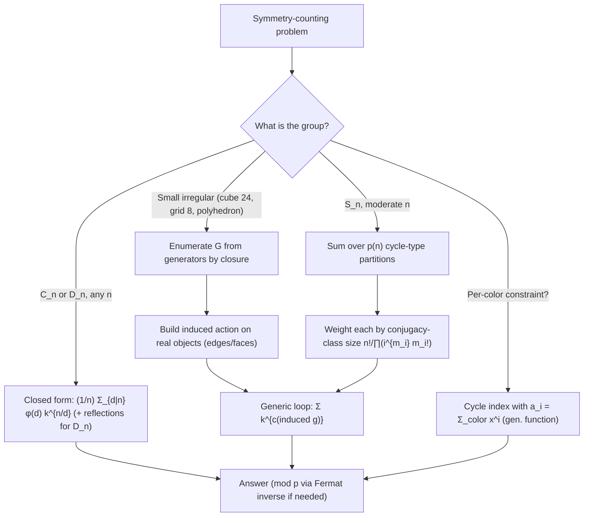

# Burnside's Lemma & Pólya Enumeration — Senior Level

> The clean two-line formula survives contact with a square necklace. It does not survive a cube colored under its full rotation group, a graph counted up to isomorphism over `2^{C(n,2)}` adjacency matrices, an answer that must be returned **mod `10^9+7`** despite the `(1/|G|)` division, or a symmetry group generated from a handful of permutations rather than handed to you as a list. This document treats those as the engineering problems they are: how to **build the group programmatically**, how to compute cycle indices for product structures (edge-permutations induced by vertex-permutations), how to do Burnside's division **under a prime modulus**, and how to keep the whole thing inside time and memory budgets.

## Table of Contents
1. [Introduction](#1-introduction)
2. [Building the Group Programmatically](#2-building-the-group-programmatically)
3. [Coloring a Cube: Faces, Edges, Vertices](#3-coloring-a-cube-faces-edges-vertices)
4. [Counting Graphs up to Isomorphism](#4-counting-graphs-up-to-isomorphism)
5. [Burnside Under a Modulus](#5-burnside-under-a-modulus)
6. [Performance Engineering](#6-performance-engineering)
7. [Code Examples](#7-code-examples)
8. [Observability and Testing](#8-observability-and-testing)
9. [Failure Modes](#9-failure-modes)
10. [Summary](#10-summary)

---

## 1. Introduction

At the senior level the question is no longer "why does the average equal the orbit count" but "what symmetry-counting problem am I building, and what breaks when the group is large, the configuration space is exponential, or the answer must live mod a prime?" Burnside/Pólya shows up in production-shaped problems with one shared engine — *sum `k^{c(g)}` over the group, divide by `|G|`* — but three things change at scale:

1. **The group is not given as a list.** It is generated by a few permutations (a polyhedron's rotations, a grid's symmetries, a graph's vertex relabelings). You must enumerate the group by closure, or know its structure to summarize the cycle index without enumeration.
2. **The configuration set is exponential and implicit.** For graphs on `n` vertices there are `2^{C(n,2)}` adjacency matrices; you never enumerate them. You count fixed points of each induced **edge permutation** combinatorially.
3. **The answer is astronomically large.** `(1/|G|) Σ k^{c(g)}` must often be returned mod `p`. The division by `|G|` becomes a **modular inverse**, and that is only valid when the sum is genuinely divisible by `|G|` (it always is — but you must compute it correctly under the modulus).

The senior decisions are: enumerate-vs-summarize the group, derive the **induced action** on the real objects (edges, faces) from the action on the base set (vertices), divide by `|G|` correctly under a modulus via Fermat's inverse, and keep both `|G|` enumeration and per-element cycle counting within budget.

---

## 2. Building the Group Programmatically

### 2.1 From generators to the full group (orbit/closure)

A symmetry group is usually specified by a small set of **generators** (e.g. "rotate the cube 90° about the z-axis" and "about the x-axis"). The full group is the closure under composition. Compute it by BFS/DFS over permutations:

```
GENERATE(generators):
  G := { identity }
  frontier := { identity }
  while frontier not empty:
    take g from frontier
    for each s in generators:
      h := compose(g, s)          # h(i) = g(s(i)) or s(g(i)), fix one convention
      if h not in G:
        add h to G and frontier
  return G
```

This terminates because the symmetric group `S_n` is finite, and `|G| | n!`. The cost is `O(|G| · |gen| · n)` with a hash set of permutation tuples. For the cube rotation group `|G| = 24`; for the full octahedral group (with reflections) `|G| = 48` — trivial to enumerate.

### 2.2 Composition convention matters

Fix one convention and never mix it: either `(g∘s)(i) = g(s(i))` (apply `s` first) or the reverse. Cycle counts are convention-independent (the group is the same set), but a buggy `compose` that mixes conventions can generate a *different* set or fail to close. Unit-test that the generated set is closed: for every `g, h ∈ G`, `compose(g, h) ∈ G`.

### 2.3 Summarize instead of enumerate when `|G|` is huge

For `S_n` acting on `n` items (counting multisets / set partitions up to relabeling), `|G| = n!` is too large to enumerate beyond small `n`. But the cycle index of `S_n` has a clean recurrence (the **exponential formula** / cycle-type sum over integer partitions), so you sum over the `p(n)` integer partitions of `n` weighted by the size of each conjugacy class, never touching `n!` elements. Knowing the group's structure replaces brute enumeration — the difference between `n!` and `p(n)` (e.g. `10! = 3.6M` vs `p(10) = 42`).

### 2.4 The induced action is the real work

You rarely color the base set directly. You color **edges**, **faces**, or **pairs**, and a base permutation `σ` of vertices *induces* a permutation `σ̂` on those derived objects. Burnside is applied to `σ̂`, not `σ`:

```
induced edge permutation:  σ̂({u, v}) = {σ(u), σ(v)}.
```

The number of `k`-colorings of edges fixed by `σ` is `k^{c(σ̂)}` where `c(σ̂)` is the number of cycles of the *induced* edge permutation. Deriving `σ̂` from `σ` and counting *its* cycles is the central senior skill — it is what turns "vertex symmetries" into "graph counts."

### 2.5 Conjugacy classes: the key to batching

Two group elements are **conjugate** (related by `h = g σ g^{-1}`) iff they have the same cycle type, and conjugate elements have *identical* `c(σ̂)` for any induced action — because conjugation just relabels the objects. This means you never need to process every element of `G` individually: group them into **conjugacy classes**, compute `c(σ̂)` once per class, and weight by the class size. For the cube's rotation group the 24 elements fall into 5 classes (Section 3.1); for `S_n` the classes are the integer partitions of `n` (Section 4.3). Recognizing and exploiting conjugacy is what turns an `O(|G|)` loop into an `O(#classes)` one — the difference between `n!` and `p(n)` for symmetric-group problems.

### 2.6 Pitfall: generators that don't generate the intended group

A common modeling bug is supplying generators that produce a *subgroup* of the intended symmetry group. For example, giving only "rotate 90° about the z-axis" for a cube generates `C_4` (4 elements), not the full 24-element rotation group — you also need a rotation about a perpendicular axis. Always verify `|G|` against the known order after closure (cube rotations: 24, octahedral with reflections: 48, dihedral: `2n`). An under-generated group *under-counts symmetries* and therefore *over-counts* distinct objects — a silent, plausible-looking error.

---

## 3. Coloring a Cube: Faces, Edges, Vertices

The cube's rotation group has `|G| = 24` elements. To count colorings of its 6 faces (or 12 edges, or 8 vertices), you need the cycle structure of each rotation **as it acts on faces** (resp. edges, vertices).

### 3.1 The 24 rotations by conjugacy class, acting on faces

| Class | Count | Axis | Face cycle structure | `c` (faces) | `|Fix| = k^c` |
|-------|-------|------|----------------------|-------------|----------------|
| identity | 1 | — | 6 fixed | 6 | `k^6` |
| 90°/270° face axis | 6 | through 2 opposite faces | 2 fixed + one 4-cycle | 3 | `k^3` |
| 180° face axis | 3 | through 2 opposite faces | 2 fixed + two 2-cycles | 4 | `k^4` |
| 120°/240° vertex axis | 8 | through 2 opposite vertices | two 3-cycles | 2 | `k^2` |
| 180° edge axis | 6 | through 2 opposite edges | three 2-cycles | 3 | `k^3` |

### 3.2 Face-coloring count

```
#face-colorings(k) = (1/24)( k^6 + 6k^3 + 3k^4 + 8k^2 + 6k^3 )
                   = (1/24)( k^6 + 3k^4 + 12k^3 + 8k^2 ).
```

For `k = 2`: `(64 + 48 + 96 + 32)/24 = 240/24 = 10` — the classic "10 distinct ways to 2-color a cube's faces." For `k = 3`: `(729 + 243 + 324 + 72)/24 = 1368/24 = 57`.

### 3.3 The cycle index of the cube's face action

```
Z = (1/24)( a_1^6 + 6 a_1^2 a_4 + 3 a_1^2 a_2^2 + 8 a_3^2 + 6 a_2^3 ).
```

Each monomial is one conjugacy class: `a_1^6` (identity, six 1-cycles), `6 a_1^2 a_4` (face-axis quarter turns, two fixed faces + one 4-cycle), and so on. Setting `a_i = k` reproduces Section 3.2; substituting `a_i = (x^i + y^i)` resolves "how many colorings with exactly 3 white and 3 black faces" (answer: coefficient of `x^3 y^3`, which is `2` — the two distinct 3-3 arrangements).

### 3.4 Edges and vertices use the same machinery

The *same* 24 rotations act on the 12 edges and 8 vertices with different cycle structures; you derive each induced permutation programmatically (Section 2.4) and run the same Burnside sum. This is why senior code computes the induced action once and reuses the generic Burnside loop, rather than hand-tabulating each object type. For the 8 vertices, the face-axis quarter-turn forms two 4-cycles of vertices (`c = 2`), the vertex-axis 120° turn fixes 2 vertices and forms two 3-cycles (`c = 2 + 2 = 4`), and the edge-axis 180° forms four 2-cycles (`c = 4`). The discipline is identical: never re-derive by hand — build the induced permutation from the geometric action and let `count_cycles` do the work.

### 3.5 Reflections double the group

Adding the cube's reflections gives the full **octahedral group** `O_h` of order 48. The face-coloring count under `O_h` differs from the rotation-only count: with reflections, mirror-image colorings merge, so `#face-colorings(2)` drops from 10 to 10 (the 2-color case happens to be reflection-symmetric) but `#face-colorings(3)` drops from 57 to a smaller value. The senior point: **always confirm whether the problem wants the chiral (rotation-only) or achiral (with-reflection) count** — "10 ways to paint a die" assumes rotations only, because a physical die's faces are distinguishable up to rotation, not mirror image. State the convention explicitly.

---

## 4. Counting Graphs up to Isomorphism

This is the flagship application: count **labeled graphs on `n` vertices up to isomorphism** — i.e. distinct graphs where relabeling vertices does not create a new graph.

### 4.1 The setup

- **Objects colored:** the `C(n, 2) = n(n-1)/2` possible **edges**, each "colored" present (1) or absent (0), so `k = 2`.
- **Group:** the symmetric group `S_n` acting on vertices, **inducing** an action on the `C(n,2)` edge-slots: vertex permutation `σ` sends edge `{u,v}` to `{σ(u), σ(v)}`.
- **Count:** `#graphs(n) = (1/n!) Σ_{σ∈S_n} 2^{c(σ̂)}`, where `c(σ̂)` is the number of cycles of the induced edge permutation.

### 4.2 Cycle count of the induced edge permutation

For a vertex permutation `σ` with vertex-cycle lengths `(ℓ_1, ℓ_2, …)`, there is a classical formula for the number of edge-cycles, summing contributions *within* each vertex-cycle and *between* each pair of vertex-cycles:

```
edges within a cycle of length ℓ:      floor(ℓ/2) edge-cycles  (plus parity detail)
edges between cycles of lengths a, b:   gcd(a, b) edge-cycles, each of length lcm(a,b).
```

Precisely, for a single vertex-cycle of length `ℓ`, the induced edges split into `(ℓ-1)/2` cycles if `ℓ` is odd and `ℓ/2` if `ℓ` is even (one of length `ℓ/2`, the rest of length `ℓ`); for two distinct vertex-cycles of lengths `a` and `b`, the `a·b` cross edges form `gcd(a, b)` cycles each of length `lcm(a, b)`. Summing these over the cycle-type of `σ` gives `c(σ̂)` without ever materializing the edge permutation.

### 4.3 Summing over conjugacy classes, not `n!` elements

For `n = 10`, `n! = 3,628,800` permutations is borderline; for `n = 15`, `15! ≈ 1.3·10^{12}` is infeasible to enumerate. The fix: permutations with the **same cycle type** have the same `c(σ̂)`, so sum over **integer partitions of `n`** (there are `p(n)` of them — `p(10)=42`, `p(15)=176`), weighting each cycle-type by the size of its conjugacy class:

```
#graphs(n) = (1/n!) Σ_{partitions λ of n}  (class size of λ) · 2^{c_edges(λ)}.
```

The class size for cycle type with `m_i` cycles of length `i` is `n! / ∏_i (i^{m_i} · m_i!)`. This collapses an `n!`-element sum to a `p(n)`-term sum — the standard senior optimization for `S_n`-symmetry counting.

### 4.4 Worked small cases

```
n=1: 1 graph        n=2: 2 (edge / no edge)      n=3: 4
n=4: 11             n=5: 34                       n=6: 156
```

These match OEIS A000088 (number of graphs on `n` nodes). The `n=4` value `11` comes from `(1/24)·Σ` over the 5 cycle types of `S_4` acting on `C(4,2)=6` edges. Computing it via partitions is a few dozen arithmetic operations.

### 4.5 Variants that reuse the identical engine

The graph-counting machine generalizes to a whole family of "structures up to relabeling" problems by changing only **what is colored** and **how many colors**, never the group or the Burnside loop:

| Problem | Colored object | `k` | Notes |
|---------|----------------|-----|-------|
| Simple graphs up to iso | `C(n,2)` edge-slots | 2 | A000088, the canonical case. |
| Directed graphs (digraphs) | `n(n-1)` ordered pairs | 2 | Induced action on **ordered** pairs; A000595. |
| Edge-`c`-colored graphs | `C(n,2)` edge-slots | `c` | Multigraph / colored-edge enumeration. |
| Tournaments | `C(n,2)` edge-slots | 2 | Each pair gets one of two orientations; A000568. |
| Relations on a set | `n²` ordered pairs incl. loops | 2 | Includes the diagonal as a separate orbit family. |

The induced cycle count differs per variant (ordered pairs vs unordered pairs vs pairs-with-diagonal), but the surrounding code — generate/summarize the group, count cycles of the induced action, sum `k^{c}`, divide by `|G|` — is byte-for-byte identical. Senior code factors out a single `inducedCycleCount(cycleType, objectKind)` and parameterizes everything else.

### 4.6 Bracelets and graphs under the full symmetric-plus-reflection group

A "necklace" counts under `C_n` (rotations); a "bracelet" adds reflections (`D_n`). The graph analogue is rarely needed — `S_n` already contains every relabeling, so there is no separate "reflected graph" — but the *bead* analogue (linear arrangements up to flip) appears constantly in tiling, scheduling, and chemistry problems. The rule is mechanical: take the cyclic answer, average in the reflection contributions, and you have switched from `C_n` to `D_n` without re-deriving anything. The senior trap is using the wrong one: a physical bracelet that can be flipped over is `D_n`; a directed cycle that cannot is `C_n`. State which physical operation is allowed and the group follows.

---

## 5. Burnside Under a Modulus

### 5.1 The division problem

Competitive and large-count problems want the answer mod `p = 10^9 + 7`. Burnside ends in `(Σ k^{c(g)}) / |G|`. You cannot do integer division after reducing mod `p` — you must multiply by the **modular inverse** of `|G|`:

```
answer ≡ ( Σ_g powmod(k, c(g), p) ) · inverse(|G|, p)  (mod p).
```

`inverse(|G|, p) = powmod(|G|, p-2, p)` by Fermat's little theorem (sibling `05-fermat-euler`), valid because `p` is prime and `|G| < p` (so `gcd(|G|, p) = 1`).

### 5.2 Why this is exact despite "dividing"

The true integer sum `Σ k^{c(g)}` **is** divisible by `|G|` (Burnside guarantees an integer orbit count). Multiplying its residue by `|G|^{-1} mod p` recovers the residue of the true quotient, because `(|G| · Q) · |G|^{-1} ≡ Q (mod p)` whenever `Q` is the genuine integer quotient. The modular inverse is not an approximation — it is the unique field element that undoes multiplication by `|G|`.

### 5.3 The precondition that bites

`inverse(|G|, p)` requires `gcd(|G|, p) = 1`. If `p | |G|` (rare, but possible if `|G|` is huge or `p` is chosen badly), the inverse does **not exist** and the naive modular Burnside is invalid — you must either pick a different prime, or compute the integer sum with big integers and divide exactly. Always assert `|G| % p != 0` before inverting. For the standard `p = 10^9+7` and typical group sizes (`n!` for `n ≤ 30` is coprime to `10^9+7` since `10^9+7 > 30`), this holds, but a defensive check belongs in production code.

### 5.4 Worked modular necklace

Count necklaces `n = 10^9, k = 5` mod `p = 10^9+7`. Use the formula `(1/n) Σ_{d|n} φ(d) k^{n/d} mod p`. Each term: factor a divisor `d`, compute `φ(d) mod p` (φ is computed as an integer then reduced), compute `powmod(k, n/d, p)`, accumulate. Finally multiply the accumulated sum by `inverse(n mod p, p)`. The `(1/n)` becomes `powmod(n, p-2, p)`. The whole computation is `O(#divisors(n) · log n)` modular operations — instant even for `n = 10^9`.

### 5.5 A subtle modular pitfall: reducing φ and n correctly

Two reductions must be done with care. First, `φ(d)` is computed as a *true integer* (it never exceeds `d ≤ n`, so it fits) and then reduced mod `p` before multiplying — reducing intermediate factors of the totient formula mod `p` is wrong because `(1 − 1/q)` is not a modular operation; compute `φ` exactly, then take `φ(d) mod p`. Second, the `(1/n)` inverse uses `n mod p`, not `n` itself: if `n ≥ p` (possible since `n ≤ 10^9 < p = 10^9+7`, so actually safe here, but for larger `n` it matters), you must reduce `n` mod `p` *before* the Fermat inverse, and you must ensure `n mod p ≠ 0` — if `p | n` the necklace formula's `(1/n)` has no modular inverse and you must fall back to exact big-integer division. For the standard `p = 10^9+7` and `n ≤ 10^9` this never triggers, but a general-purpose routine asserts `n % p != 0`.

### 5.6 Möbius variant for aperiodic counts

The aperiodic (Lyndon) necklace count `M(n, k) = (1/n) Σ_{d|n} μ(d) k^{n/d}` (sibling `32-mobius-inversion`) is computed the same way mod `p`, but with **signed** terms: `μ(d) ∈ {−1, 0, 1}`. Under a modulus, a `−1` coefficient means *subtract* `k^{n/d}`, i.e. add `p − (k^{n/d} mod p)`, to keep the running sum non-negative. Forgetting to normalize negatives is the classic Möbius-under-modulus bug — the result comes out as a huge near-`p` number instead of the small true count. Always reduce with `((x % p) + p) % p` after subtractions.

---

## 6. Performance Engineering

### 6.1 Where the cost lives

| Component | Cost | Dominant when |
|-----------|------|---------------|
| Enumerate `G` from generators | `O(|G| · |gen| · n)` | irregular groups (polyhedra, grids) |
| Per-element cycle count | `O(n)` (base) or `O(#objects)` (induced) | large object sets (edges of dense graph) |
| Closed-form necklace/bracelet | `O(√n + #div · log n)` | rotation/dihedral, large `n` |
| `S_n` via partitions | `O(p(n) · n)` | graph isomorphism counting |
| Modular powers | `O(log exp)` each | every term under a modulus |

### 6.2 Enumerate vs summarize — the key fork

- **Small irregular group** (cube: 24, grid: 8): enumerate `G`, compute induced action, run the generic loop. Trivial.
- **`C_n` / `D_n`, large `n`**: never enumerate — use the closed form. `O(√n)`.
- **`S_n`, moderate `n`**: never enumerate `n!` — sum over the `p(n)` cycle types with class-size weights. `O(p(n)·n)`.

Recognizing which regime you are in is the whole performance game. The fork is mechanical once stated as a decision tree:



The single most expensive mistake is taking the wrong branch — enumerating `n!` when a `p(n)` partition sum exists, or materializing the `k^{#objects}` configuration space when only cycle counts are needed.

### 6.3 Avoid materializing the configuration space

The cardinal sin is enumerating colorings (the `k^{#objects}` set). Burnside *never* needs them: you only ever count cycles of group elements and raise `k` to that count. For graphs, `2^{C(n,2)}` is astronomically large; the algorithm touches only `p(n)` cycle types. Any solution that loops over colorings is exponentially wrong-headed.

### 6.4 Precompute and cache

- **Totient sieve** when many `n` are queried (sibling `05-fermat-euler`).
- **Cache `|G|^{-1} mod p`** once per modulus; do not recompute the Fermat inverse per query.
- **Memoize induced cycle counts by cycle type** — many group elements share a conjugacy class and hence the same `c(σ̂)`.

### 6.5 Overflow discipline

Without a modulus, `k^{#objects}` overflows 64-bit almost immediately (`2^{45}` for a 10-vertex graph's edges already needs care; the *answers* are far larger). Use big integers for exact counts, or fix a prime modulus and do every multiply/power modularly. Mixing the two — accumulating partly in `int64` then reducing — silently corrupts results; pick one regime per computation.

---

## 7. Code Examples

### 7.1 Go — build a group from generators and run Burnside on an induced action

```go
package main

import "fmt"

type perm []int

func compose(g, s perm) perm { // (g∘s)(i) = g(s(i))
	n := len(g)
	r := make(perm, n)
	for i := 0; i < n; i++ {
		r[i] = g[s[i]]
	}
	return r
}

func key(p perm) string {
	b := make([]byte, 0, len(p)*2)
	for _, x := range p {
		b = append(b, byte(x/10)+'0', byte(x%10)+'0')
	}
	return string(b)
}

func generate(gens []perm, n int) []perm {
	id := make(perm, n)
	for i := range id {
		id[i] = i
	}
	seen := map[string]bool{key(id): true}
	group := []perm{id}
	for qi := 0; qi < len(group); qi++ {
		g := group[qi]
		for _, s := range gens {
			h := compose(g, s)
			if k := key(h); !seen[k] {
				seen[k] = true
				group = append(group, h)
			}
		}
	}
	return group
}

func countCycles(p perm) int {
	seen := make([]bool, len(p))
	cycles := 0
	for s := range p {
		if !seen[s] {
			cycles++
			for j := s; !seen[j]; j = p[j] {
				seen[j] = true
			}
		}
	}
	return cycles
}

func powInt(b, e int) int {
	r := 1
	for ; e > 0; e-- {
		r *= b
	}
	return r
}

func burnside(group []perm, k int) int {
	sum := 0
	for _, g := range group {
		sum += powInt(k, countCycles(g))
	}
	return sum / len(group)
}

func main() {
	// Square's 4 rotations as generators (rotation by 1 generates C_4).
	n := 4
	rot := perm{1, 2, 3, 0} // i -> (i+1) mod 4
	g := generate([]perm{rot}, n)
	fmt.Println(len(g), burnside(g, 2)) // 4 6  (C_4, 2 colors)
}
```

### 7.2 Java — cube face colorings (group given by induced face permutations)

```java
import java.util.*;

public class CubeFaces {
    // The 24 rotations as permutations of the 6 faces (precomputed standard layout).
    // Faces: 0=top,1=bottom,2=front,3=back,4=left,5=right
    static int countCycles(int[] p) {
        boolean[] seen = new boolean[p.length];
        int cycles = 0;
        for (int s = 0; s < p.length; s++)
            if (!seen[s]) {
                cycles++;
                for (int j = s; !seen[j]; j = p[j]) seen[j] = true;
            }
        return cycles;
    }

    static long powInt(long b, int e) {
        long r = 1;
        while (e-- > 0) r *= b;
        return r;
    }

    public static void main(String[] args) {
        // Cycle-type multiset of the 24 rotations on faces (from Section 3.1):
        // c=6 (×1), c=3 (×6 quarter-turns), c=4 (×3 half-turns face),
        // c=2 (×8 vertex axis), c=3 (×6 edge axis).
        int[][] classes = {{6, 1}, {3, 6}, {4, 3}, {2, 8}, {3, 6}};
        for (int k = 2; k <= 3; k++) {
            long sum = 0;
            for (int[] cl : classes) sum += (long) cl[1] * powInt(k, cl[0]);
            System.out.println("k=" + k + " -> " + sum / 24);
            // k=2 -> 10, k=3 -> 57
        }
    }
}
```

### 7.3 Python — graphs up to isomorphism via cycle-type partitions, modular

```python
from math import gcd, factorial
from functools import lru_cache

MOD = 10**9 + 7


def edge_cycles(cycle_type):
    """Number of induced edge-cycles for a vertex permutation of given cycle type.
    cycle_type: list of vertex-cycle lengths."""
    total = 0
    # within each cycle of length L
    for L in cycle_type:
        total += L // 2  # floor(L/2): for odd L -> (L-1)/2; even L -> L/2
    # between each unordered pair of cycles
    for i in range(len(cycle_type)):
        for j in range(i + 1, len(cycle_type)):
            a, b = cycle_type[i], cycle_type[j]
            total += gcd(a, b)
    return total


def partitions(n, mx=None):
    """Generate integer partitions of n as lists of cycle lengths."""
    if mx is None:
        mx = n
    if n == 0:
        yield []
        return
    for first in range(min(n, mx), 0, -1):
        for rest in partitions(n - first, first):
            yield [first] + rest


def class_size(cycle_type, n):
    """Number of permutations in S_n with this cycle type: n! / prod(i^{m_i} m_i!)."""
    from collections import Counter
    cnt = Counter(cycle_type)
    denom = 1
    for length, m in cnt.items():
        denom *= (length ** m) * factorial(m)
    return factorial(n) // denom


def graphs_up_to_iso(n, mod=MOD):
    total = 0
    for ct in partitions(n):
        c = edge_cycles(ct)
        total += class_size(ct, n) * pow(2, c, mod)
        total %= mod
    inv = pow(factorial(n) % mod, mod - 2, mod)  # Fermat inverse of n!
    return total * inv % mod


if __name__ == "__main__":
    for n in range(1, 8):
        print(n, graphs_up_to_iso(n))
    # 1 2 4 11 34 156 1044   (OEIS A000088)
```

---

## 8. Observability and Testing

A Burnside result is a single integer with no obvious structure — a wrong group or a miscounted cycle produces a plausible but wrong number. Build checks from the start.

| Check | Why |
|-------|-----|
| Brute-force orbit count matches Burnside for small `n, k` | Validates the group and the cycle rule end-to-end. |
| `k = 1` ⟹ answer `1` | Catches a malformed group (sum should equal `|G|`). |
| Integer sum divisible by `|G|` | A fraction means a missing/extra element or wrong `|Fix|`. |
| Generated group is **closed** (`compose(g,h) ∈ G`) | Catches a buggy composition convention. |
| `|G|` equals the known order (cube: 24, `D_n`: 2n) | Catches missing generators. |
| Graph counts match OEIS A000088 | Validates the induced edge-cycle formula. |
| Modular vs big-integer answer agree (small cases) | Catches modular-inverse and reduction bugs. |

### 8.1 The most valuable test

Compare the **general Burnside loop** (enumerate group, count cycles, sum `k^c`) against the **closed form / partition sum** on the same inputs. The loop is "obviously correct but slow"; the closed form is "fast but easy to derive wrong." Agreement across a range of `n, k` certifies the fast path. For graphs, compare the partition sum against a direct `S_n` enumeration for `n ≤ 6`.

### 8.2 A regression only the oracle catches

Suppose someone "optimizes" `edge_cycles` by using `(L+1)//2` instead of `L//2` for the within-cycle term (a plausible off-by-one). It happens to be correct for odd `L` and wrong for even `L`. For `n ≤ 3` all cycle types have only odd or unit lengths, so it passes; the bug first appears at `n = 4` with the 4-cycle type `[4]`, where correct `edge_cycles([4]) = 2` but the buggy version gives... a different value, throwing off the `n=4` count from `11`. Only a test that goes to `n ≥ 4` and cross-checks OEIS catches it. Lesson: validate against an external sequence at enough scale that *every* cycle-length parity appears.

### 8.3 Production guardrails

- **Assert `|G| % p != 0`** before the modular inverse — a non-coprime group order makes the inverse invalid.
- **Assert closure** of any group generated from generators, once at startup.
- **Cache `|G|^{-1} mod p`** and induced cycle counts per conjugacy class.
- **Range-check exponents** so `k^{c}` does not silently overflow when not using a modulus.

---

## 9. Failure Modes

### 9.1 Wrong group
Counting necklaces (`C_n`) when bracelets (`D_n`) were intended, or omitting reflections of a polyhedron. Mitigation: verify `|G|` equals the known order; validate against brute force.

### 9.2 Acting on the base set instead of the induced objects
Counting cycles of the vertex permutation when you must count cycles of the **induced edge/face permutation**. Mitigation: always derive `σ̂` and count *its* cycles; unit-test the induced action.

### 9.3 Integer division after modular reduction
Doing `(sum % p) / |G|` is wrong — `/` is not defined mod `p`. Mitigation: multiply by `powmod(|G|, p-2, p)`.

### 9.4 Modular inverse when `p | |G|`
`inverse(|G|, p)` does not exist if `gcd(|G|, p) ≠ 1`. Mitigation: assert coprimality; use big-integer exact division otherwise.

### 9.5 Enumerating the configuration space
Looping over `k^{#objects}` colorings instead of `|G|` group elements — exponential blowup. Mitigation: Burnside counts cycles of group elements only.

### 9.6 Enumerating `n!` for `S_n`
Brute-forcing all `n!` permutations for graph counting. Mitigation: sum over the `p(n)` cycle types with conjugacy-class-size weights.

### 9.7 Composition convention mix
A `compose` that mixes "apply left first" and "apply right first" can generate a wrong set or fail to close. Mitigation: fix one convention, assert closure.

### 9.8 Overflow without a modulus
`k^{c}` and the running sum overflow 64-bit for any non-trivial object set. Mitigation: big integers or consistent modular arithmetic.

### 9.9 Wrong induced-edge-cycle formula
Off-by-one in the within-cycle (`L//2`) or between-cycle (`gcd(a,b)`) term. Mitigation: validate graph counts against OEIS A000088 to `n ≥ 6`.

### 9.10 Forgetting the identity
Omitting the identity drops the `k^{#objects}` term, the largest one — answer is badly low and usually non-integer. Mitigation: always seed `G` with the identity.

---

## 10. Summary

- **Burnside at scale is an engineering problem:** build the group from generators by closure (small irregular groups), or summarize its cycle index by structure (`C_n`/`D_n` closed form; `S_n` via the `p(n)` cycle-type partitions). Never enumerate `n!` or the `k^{#objects}` configuration space.
- **The induced action is the real work:** color edges/faces, not vertices; a vertex permutation `σ` induces `σ̂` on the derived objects, and you count cycles of `σ̂`. For graphs, within-cycle (`L//2`) plus between-cycle (`gcd(a,b)`) terms give `c(σ̂)` from the cycle type alone.
- **Cube faces:** `(1/24)(k^6 + 3k^4 + 12k^3 + 8k^2)`; `k=2 ⟹ 10`. The same 24 rotations, re-induced, count edge and vertex colorings.
- **Graphs up to isomorphism:** `(1/n!) Σ_{cycle types} (class size)·2^{c_edges}` matches OEIS A000088 (`n=6 ⟹ 156`); the partition sum replaces the `n!` enumeration.
- **Burnside under a modulus:** the `(1/|G|)` division is a Fermat modular inverse `powmod(|G|, p-2, p)` (sibling `05-fermat-euler`), exact because the integer sum is genuinely divisible by `|G|`; assert `gcd(|G|, p)=1` first.
- **Always keep an oracle:** brute-force orbit counts and OEIS cross-checks catch wrong groups, induced-action mistakes, and modular-inverse bugs.

### Decision summary

- **Necklace / bracelet, large `n`** → closed form (`C_n` / `D_n`), `O(√n)`.
- **Polyhedron / grid, small group** → enumerate `G` from generators, induced action, generic loop.
- **Graphs / multisets up to relabeling (`S_n`)** → sum over the `p(n)` cycle types with class-size weights.
- **Answer mod `p`** → Fermat inverse of `|G|`; assert `p ∤ |G|`.
- **Per-color constraints** → cycle index with `a_i = Σ_color x_color^i` (generating function).
- **Validation** → brute-force orbit count + OEIS + divisibility + closure checks.

References to study further: Pólya's original enumeration theorem and the cycle index (sibling `26-inclusion-exclusion` for the complementary correction technique, `32-mobius-inversion` for aperiodic necklaces), Fermat's modular inverse for the modular division (sibling `05-fermat-euler`), Euler's totient for the necklace formula (sibling `01-gcd-lcm`, `05-fermat-euler`), and OEIS A000088 / A000031 for cross-checking graph and necklace counts.

Next step: [professional.md](./professional.md) — the full mathematical foundations: a rigorous proof of Burnside's lemma via double-counting the incidence set `{(g,x): g·x=x}`, the orbit–stabilizer theorem, Pólya's cycle-index theorem (unweighted and weighted), the `φ`-divisor-sum derivation of the necklace formula, the Möbius variant for aperiodic counts, and complexity analysis.
