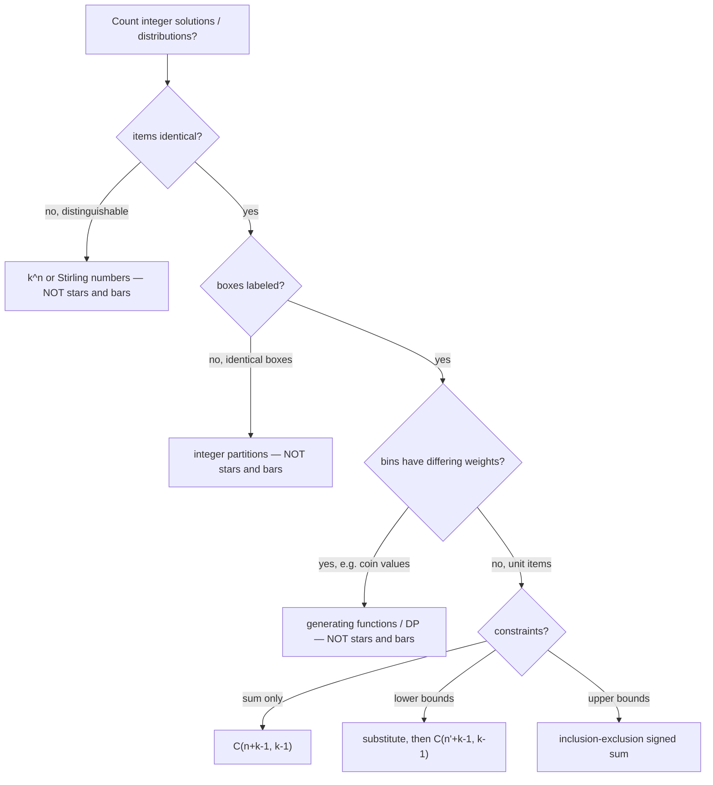

# Stars and Bars — Interview Preparation

> **Lead with this:** *"To count non-negative integer solutions of `x₁ + … + x_k = n`, lay out `n` stars and `k − 1` bars and choose the bar positions — that's `C(n + k − 1, k − 1)`. For all-positive solutions it's `C(n − 1, k − 1)`. Lower bounds substitute away for free; upper bounds need inclusion–exclusion."*

---

## Quick-Reference Cheat Sheet

| Question | Answer | Condition |
|----------|--------|-----------|
| `Σxᵢ = n`, `xᵢ ≥ 0` | `C(n + k − 1, k − 1)` | `n ≥ 0, k ≥ 1` |
| `Σxᵢ = n`, `xᵢ ≥ 1` | `C(n − 1, k − 1)` | `n ≥ k` |
| `xᵢ ≥ Lᵢ` | `C(n − ΣLᵢ + k − 1, k − 1)` | `n − ΣLᵢ ≥ 0` |
| `Σxᵢ ≤ n` | `C(n + k, k)` | add slack box |
| `xᵢ ≤ c` (uniform) | `Σ(−1)^t C(k,t) C(n−t(c+1)+k−1, k−1)` | PIE |
| multiset `n` from `k` types | `C(n + k − 1, n)` | repetition ok |
| compositions of `n` into `k` parts | `C(n − 1, k − 1)` | positive parts |
| total compositions of `n` | `2^{n−1}` | — |
| `C(m, r) mod p`, `p` prime, `p > m` | `fact[m]·invFact[r]·invFact[m−r]` | factorial table |
| `C(m, r) mod p`, `p ≤ m` | Lucas' theorem | digits in base `p` |

---

## Decision Flowchart

When a problem looks like a counting problem, walk this tree out loud — the interviewer wants to hear the recognition step before the formula.



The three `NOT stars and bars` leaves are the anti-patterns interviewers probe with follow-ups; naming them unprompted is what separates a memorized formula from genuine understanding.

---

## Junior Questions (16 Q&A)

### J1. What does stars and bars count?
The number of ways to write `n` as an ordered sum of `k` non-negative integers — equivalently, ways to put `n` identical items into `k` distinct boxes: `C(n + k − 1, k − 1)`.

### J2. Why is the answer `C(n + k − 1, k − 1)`?
Represent a distribution as `n` stars and `k − 1` bars in a row. Each distinct arrangement is one distribution. There are `n + k − 1` symbols and you choose which `k − 1` are bars: `C(n + k − 1, k − 1)`.

### J3. Why `k − 1` bars and not `k`?
`k` boxes are separated by `k − 1` dividers — like 3 fence sections need 2 internal posts. This is the most common off-by-one in the topic.

### J4. What is the formula when every box must be non-empty (each `xᵢ ≥ 1`)?
`C(n − 1, k − 1)`. Pre-place one item in each box, then distribute the remaining `n − k` freely.

### J5. Compute the ways to put 5 identical candies into 3 children, zero allowed.
`C(5 + 3 − 1, 3 − 1) = C(7, 2) = 21`.

### J6. Same as J5 but each child gets at least one.
`C(5 − 1, 3 − 1) = C(4, 2) = 6`.

### J7. Why are `C(n + k − 1, k − 1)` and `C(n + k − 1, n)` equal?
By symmetry `C(m, r) = C(m, m − r)`: choosing the `k − 1` bar positions is the same as choosing the `n` star positions. Use the smaller index to compute faster.

### J8. How many non-negative solutions does `x₁ + x₂ = 4` have?
`C(4 + 2 − 1, 2 − 1) = C(5, 1) = 5`: `(0,4),(1,3),(2,2),(3,1),(4,0)`.

### J9. What if `n = 0`?
Exactly one solution — all boxes get zero: `C(0 + k − 1, k − 1) = 1`.

### J10. What if there is only one box, `k = 1`?
One solution `(n)`: `C(n + 0, 0) = 1`.

### J11. Does stars and bars work if the items are distinguishable?
No. Distinguishable items into distinct boxes is `k^n` (each item independently picks a box). Stars and bars is for **identical** items.

### J12. Does it work if the boxes are identical?
No. Identical boxes is an integer-partition problem (no simple binomial). Stars and bars needs **labeled** boxes.

### J13 (analysis). What is the time to compute `C(n + k − 1, k − 1)` with a multiplicative loop?
`O(min(k, n))` arithmetic operations: loop over the smaller index `r = min(k − 1, n)`, doing one multiply and one exact divide per step.

### J14. How many non-negative solutions does `x₁ + x₂ + x₃ = 0` have?
Exactly one: `(0, 0, 0)`. The formula agrees: `C(0 + 3 − 1, 3 − 1) = C(2, 2) = 1`.

### J15. If you have 3 boxes, how many bars separate them in the stars-and-bars picture?
Two bars. `k` boxes need `k − 1` separators — the recurring off-by-one. With 3 boxes the layout is `★…★ | ★…★ | ★…★`.

### J16. Put 4 identical coins into 2 distinct piggy banks, zero allowed — how many ways?
`C(4 + 2 − 1, 2 − 1) = C(5, 1) = 5`: the splits `(0,4),(1,3),(2,2),(3,1),(4,0)`.

---

## Middle Questions (17 Q&A)

### M1. How do you handle a lower bound `xᵢ ≥ Lᵢ`?
Substitute `yᵢ = xᵢ − Lᵢ ≥ 0`. The total drops to `n − ΣLᵢ`; the count is `C(n − ΣLᵢ + k − 1, k − 1)` (0 if negative).

### M2. How do you count solutions of `x₁ + … + x_k ≤ n` (inequality)?
Add a slack variable `x_{k+1} = n − Σxᵢ ≥ 0`, turning it into an equality with `k + 1` boxes: `C(n + k, k)`.

### M3. How do you handle an upper bound `xᵢ ≤ c`?
Inclusion–exclusion. Count everything, subtract arrangements where a box exceeds `c` (force `c + 1` into it), add back double-counted: `Σ(−1)^t C(k, t) C(n − t(c+1) + k − 1, k − 1)`.

### M4. Walk through `x₁+x₂+x₃ = 10`, each `0 ≤ xᵢ ≤ 4`.
`C(12,2) − 3·C(7,2) + 3·C(2,2) = 66 − 63 + 3 = 6`. (Permutations of `(4,4,2)` and `(4,3,3)`.)

### M5. How many compositions does `n` have into exactly `k` positive parts?
`C(n − 1, k − 1)` — the gap argument: cut `k − 1` of the `n − 1` gaps between unit blocks.

### M6. How many compositions does `n` have in total (any number of parts)?
`2^{n−1}` — each of the `n − 1` gaps is independently cut or not. Equals `Σ_k C(n−1, k−1)`.

### M7. How is stars and bars the same as "multichoose"?
Choosing `n` items from `k` types with repetition (order irrelevant) is distributing `n` identical items into `k` type-bins: `C(n + k − 1, n)`.

### M8. Count monomials of total degree `d` in `v` variables.
Exponents `a₁ + … + a_v = d` with `aᵢ ≥ 0`: `C(d + v − 1, v − 1)`.

### M9. When do you apply substitution vs inclusion–exclusion?
Lower bounds → substitution (free, one binomial). Upper bounds → inclusion–exclusion (signed sum). Apply lower-bound substitution first, then PIE.

### M10. Why is coin change NOT stars and bars?
Coin change has **weighted** bins (a coin contributes its value, not 1). Stars and bars only handles unit items. Use generating functions / DP for weighted sums.

### M11. How do you compute the binomial when `n, k` are huge?
Modulo a prime: precompute `fact[]` and `invFact[]` once, then `C(m, r) = fact[m]·invFact[r]·invFact[m−r] mod p` in `O(1)`.

### M12. How many terms does the uniform-cap inclusion–exclusion sum have?
At most `⌊n/(c+1)⌋ + 1 ≤ k + 1`; terms vanish once `n − t(c+1) < 0`, so you break early.

### M13 (analysis). What is the cost of an upper-bound count with equal caps after factorial precompute?
`O(k)` — at most `k + 1` PIE terms, each an `O(1)` modular binomial.

### M14. How do you combine a lower bound and an upper bound on the same box?
Apply the lower-bound substitution first (`yᵢ = xᵢ − Lᵢ`), then the upper cap shifts to `cᵢ − Lᵢ` over the new total `n − ΣLᵢ`. Run PIE on the shifted caps. Doing it in the wrong order — capping before shifting — gives the wrong forced amount.

### M15. Count `x₁ + x₂ + x₃ + x₄ = 6` with each `xᵢ ≥ 1`.
Pre-place one in each: remaining `6 − 4 = 2` over 4 boxes, `C(2 + 4 − 1, 4 − 1) = C(5, 3) = 10`. Equivalently `C(n − 1, k − 1) = C(5, 3) = 10`.

### M16. How many ways to choose 4 scoops from 3 ice-cream flavors, repeats allowed, order irrelevant?
Multichoose: distribute `4` identical scoops into `3` flavor-bins, `C(4 + 3 − 1, 4) = C(6, 4) = 15`.

### M17. Count `x₁ + x₂ + x₃ ≤ 4`, all `xᵢ ≥ 0`.
Add a slack box: `C(4 + 3, 3) = C(7, 3) = 35`. The slack box absorbs the difference `4 − Σxᵢ`, turning `≤` into `=` with one more box.

---

## Senior Questions (13 Q&A)

### S1. How do you recognize stars and bars in a disguised problem?
Check three conditions: items identical, boxes distinct, and only sum/bound constraints. If all hold, it's stars and bars (plus PIE for caps).

### S2. What are the look-alikes that are NOT stars and bars?
Distinguishable items (`k^n`), identical boxes (integer partitions), weighted bins (coin change → generating functions). Misapplying the formula here is a confident wrong answer.

### S3. How do you build the modular binomial pipeline?
Precompute `fact[0..N] mod p`; set `invFact[N] = fact[N]^{p−2}` (one Fermat power); fill `invFact[i−1] = invFact[i]·i` backward. Then each `C(m,r)` is `O(1)`.

### S4. Why one Fermat exponentiation instead of `N` inverses?
The backward recurrence `invFact[i−1] = invFact[i]·i` derives all inverse factorials from a single `invFact[N]`, avoiding `N` separate `O(log p)` inversions.

### S5. What breaks if the prime `p ≤ n`?
`fact[n] mod p = 0`, so the formula returns garbage. Switch to Lucas' theorem: `C(m,r) ≡ ∏ C(mⱼ, rⱼ) (mod p)` over base-`p` digits.

### S6. How do you compute `C(m, r)` mod a composite modulus?
Factor the modulus into prime powers, compute mod each (Lucas / generalized Lucas), recombine with CRT (Garner's algorithm).

### S7. How do you handle varied per-box caps?
Inclusion–exclusion over subsets: `Σ_S (−1)^{|S|} C(n − Σ_{i∈S}(cᵢ+1) + k − 1, k − 1)`. Up to `2^k` terms; prune those with forced > `n`.

### S8. The varied-cap PIE is `2^k`. What if `k` is large?
Meet-in-the-middle, or switch to an `O(n·k)` generating-function / DP coefficient extraction when `n` is moderate.

### S9. How do you guard against negative residues in the PIE sum (mod p)?
Always reduce subtractions as `(total − term + MOD) % MOD`; a raw negative propagates through subsequent multiplications.

### S10. How do you validate a stars-and-bars implementation in production?
Randomized brute-force cross-check on small `(n, k, caps)` in CI — it's the only reliable catch for the `k−1` off-by-one and the PIE sign.

### S11. Why prefer `998244353` over `10^9 + 7` in some settings?
`998244353` is NTT-friendly (it's `119·2^23 + 1`), so the same prime supports fast polynomial multiplication (sibling `15-ntt`) if the problem also needs convolution.

### S12 (analysis). What dominates the cost of answering `Q` queries each a capped count?
`O(N)` one-time factorial precompute plus `O(Q · k)` for the PIE loops — the precompute amortizes across all queries; per-query work is just the signed-binomial sum.

### S13. Count `Σxᵢ = 50`, `x₁ ≥ 3`, all `xᵢ ≤ 20`, mod `10^9+7`. Outline the steps.
Substitute `y₁ = x₁ − 3` → `n = 47`, cap on `x₁` becomes `17`; then PIE over the 4 caps `(17,20,20,20)`: `Σ_S (−1)^{|S|} C(47 − forced + 3, 3)`, each an `O(1)` lookup.

### S14. Two cheap runtime invariants that catch most stars-and-bars bugs?
(1) **Monotonicity:** raising any cap can only increase or hold the count — if it drops, the PIE sign is wrong. (2) **Vacuous-cap idempotence:** setting every cap `≥ n` must reproduce the plain `C(n+k−1, k−1)` — if not, the subset iteration or pruning is off. Both are `O(1)` to assert on a sampled query.

---

## Professional Questions (11 Q&A)

### P1. Prove `|S₀(n,k)| = C(n+k−1, k−1)`.
Exhibit mutually inverse maps: `Φ` writes `x₁` stars, a bar, …, `x_k` stars; `Ψ` reads run lengths between bars. `Ψ∘Φ = id` and `Φ∘Ψ = id`, so the solution set bijects with arrangements of `n` stars and `k−1` bars, of which there are `C(n+k−1, k−1)`.

### P2. Prove the positive count is `C(n−1, k−1)`.
The shift `T(x) = (x₁−1, …, x_k−1)` bijects positive solutions of total `n` with non-negative solutions of total `n−k`; the latter is `C(n−k+k−1, k−1) = C(n−1, k−1)`.

### P3. Derive the uniform-cap count by inclusion–exclusion.
Let `Aᵢ = {xᵢ ≥ c+1}`. Valid solutions are `U \ ⋃Aᵢ`. PIE: `Σ_S (−1)^{|S|} |⋂_{i∈S} Aᵢ|`. Forcing `c+1` into each box of `S` gives `|⋂| = C(n − |S|(c+1) + k − 1, k − 1)`; group by `|S| = t` and multiply by `C(k, t)`.

### P4. Derive stars and bars from generating functions.
Each box contributes `1/(1−z) = Σ z^{xᵢ}`. The coefficient of `z^n` in `(1−z)^{-k}` is `C(n+k−1, k−1)` by the generalized binomial theorem.

### P5. Derive the capped count from generating functions.
A capped box contributes `(1 − z^{c+1})/(1−z)`. Expand `(1−z^{c+1})^k = Σ(−1)^t C(k,t) z^{t(c+1)}` times `(1−z)^{-k}`; the `z^n` coefficient is the PIE sum — the sign pattern is the binomial expansion.

### P6. Where does stars and bars sit in the twelvefold way?
Identical balls into distinct boxes: "any map" cell → `C(n+k−1, k−1)`; "surjective" cell → `C(n−1, k−1)`. Neighbouring rows give `k^n`, Stirling numbers, and partitions.

### P7. Prove the modular formula `fact[m]·invFact[r]·invFact[m−r]` is `C(m,r) mod p`.
For prime `p > m`, all of `1..m` are units mod `p`, so `m!, r!, (m−r)!` are invertible; `invFact` via Fermat (`(j!)^{p−2}`) and the recurrence are correct, giving `m!/(r!(m−r)!) ≡ C(m,r)`.

### P8. Why is the multiplicative loop's division always exact?
After `i+1` steps the running value equals `C(m, i+1)`, an integer; the product of `i+1` consecutive integers is divisible by `(i+1)!`, so dividing one `(i+1)` per step keeps every prefix integral.

### P9 (analysis). Give a lower bound on the time to output `C(n+k−1, k−1)` exactly.
The value has `Θ(min(k,n))` bits for balanced parameters, so emitting it is `Ω(min(k,n))`; the multiplicative loop is output-optimal up to arithmetic cost. The modular version returns one residue in `O(1)` post-precompute.

### P10. Prove `f(n, k) = f(n−1, k) + f(n, k−1)` for the non-negative count.
Condition on the last box. Either it holds `≥ 1` item — peel one unit, leaving `f(n−1, k)` — or it holds `0` — drop the box, leaving `f(n, k−1)`. The two cases are disjoint and exhaustive, so the counts add. This is Pascal's rule re-indexed through `m = n+k−1`, `r = k−1` (sibling `23-binomial-coefficients`).

### P11. Why is the capped count a *closed-form* signed sum rather than a recursion?
Because the bad events `Aᵢ = {xᵢ ≥ cᵢ+1}` are independent lower bounds on distinct coordinates, every intersection `⋂_{i∈S} Aᵢ` is itself a stars-and-bars instance (force `cᵢ+1` into each box of `S`). So each inclusion–exclusion term (sibling `26-inclusion-exclusion`) is a single binomial, and the whole count is one finite signed sum — no residual messy intersection to recurse into.

---

## Coding Challenge (3 Languages)

### Challenge: Count constrained non-negative integer solutions, modulo 1e9+7

> Given `n`, `k`, and an array `caps` of length `k` where `caps[i]` is the maximum value of `xᵢ` (use a large value like `n` for "no cap"), count the non-negative integer solutions of `x₁ + … + x_k = n` with `0 ≤ xᵢ ≤ caps[i]`, modulo `1_000_000_007`. Use a precomputed factorial table and inclusion–exclusion over the caps.
>
> Examples:
> - `n=10, k=3, caps=[4,4,4]` → `6`
> - `n=5,  k=3, caps=[5,5,5]` → `21` (caps vacuous)
> - `n=7,  k=3, caps=[3,2,5]` → `9`
> - `n=0,  k=4, caps=[2,2,2,2]` → `1` (only the all-zero tuple)
>
> The core idea is one routine: precompute factorials mod `p`, then iterate subsets of the capped boxes, adding or subtracting `C(rem + k − 1, k − 1)` per the inclusion–exclusion sign. Lower bounds, if present, are absorbed by a one-line shift before the loop.

#### Go

```go
package main

import "fmt"

const MOD = int64(1_000_000_007)

var fact, invFact []int64

func powMod(a, e, m int64) int64 {
	a %= m
	r := int64(1)
	for e > 0 {
		if e&1 == 1 {
			r = r * a % m
		}
		a = a * a % m
		e >>= 1
	}
	return r
}

func initComb(n int) {
	fact = make([]int64, n+1)
	invFact = make([]int64, n+1)
	fact[0] = 1
	for i := 1; i <= n; i++ {
		fact[i] = fact[i-1] * int64(i) % MOD
	}
	invFact[n] = powMod(fact[n], MOD-2, MOD)
	for i := n; i > 0; i-- {
		invFact[i-1] = invFact[i] * int64(i) % MOD
	}
}

func C(m, r int64) int64 {
	if r < 0 || m < 0 || r > m {
		return 0
	}
	return fact[m] * invFact[r] % MOD * invFact[m-r] % MOD
}

// countSolutions: 0 <= xi <= caps[i], sum = n, mod p, via subset PIE.
func countSolutions(n int64, caps []int64) int64 {
	k := len(caps)
	total := int64(0)
	for mask := 0; mask < (1 << k); mask++ {
		forced := int64(0)
		bits := 0
		for i := 0; i < k; i++ {
			if mask&(1<<i) != 0 {
				forced += caps[i] + 1
				bits++
			}
		}
		rem := n - forced
		if rem < 0 {
			continue
		}
		term := C(rem+int64(k)-1, int64(k)-1)
		if bits%2 == 0 {
			total = (total + term) % MOD
		} else {
			total = (total - term + MOD) % MOD
		}
	}
	return total
}

func main() {
	initComb(1_000_00) // size to max n+k for the test set
	fmt.Println(countSolutions(10, []int64{4, 4, 4})) // 6
	fmt.Println(countSolutions(5, []int64{5, 5, 5}))  // 21
	fmt.Println(countSolutions(7, []int64{3, 2, 5}))  // 9
}
```

#### Java

```java
public class Solution {
    static final long MOD = 1_000_000_007L;
    static long[] fact, invFact;

    static long powMod(long a, long e, long m) {
        a %= m; long r = 1;
        while (e > 0) { if ((e & 1) == 1) r = r * a % m; a = a * a % m; e >>= 1; }
        return r;
    }

    static void initComb(int n) {
        fact = new long[n + 1];
        invFact = new long[n + 1];
        fact[0] = 1;
        for (int i = 1; i <= n; i++) fact[i] = fact[i - 1] * i % MOD;
        invFact[n] = powMod(fact[n], MOD - 2, MOD);
        for (int i = n; i > 0; i--) invFact[i - 1] = invFact[i] * i % MOD;
    }

    static long C(long m, long r) {
        if (r < 0 || m < 0 || r > m) return 0;
        return fact[(int) m] * invFact[(int) r] % MOD * invFact[(int) (m - r)] % MOD;
    }

    static long countSolutions(long n, long[] caps) {
        int k = caps.length;
        long total = 0;
        for (int mask = 0; mask < (1 << k); mask++) {
            long forced = 0; int bits = 0;
            for (int i = 0; i < k; i++) {
                if ((mask & (1 << i)) != 0) { forced += caps[i] + 1; bits++; }
            }
            long rem = n - forced;
            if (rem < 0) continue;
            long term = C(rem + k - 1, k - 1);
            total = (bits % 2 == 0) ? (total + term) % MOD : (total - term + MOD) % MOD;
        }
        return total;
    }

    public static void main(String[] args) {
        initComb(100_000);
        System.out.println(countSolutions(10, new long[]{4, 4, 4})); // 6
        System.out.println(countSolutions(5, new long[]{5, 5, 5}));  // 21
        System.out.println(countSolutions(7, new long[]{3, 2, 5}));  // 9
    }
}
```

#### Python

```python
MOD = 1_000_000_007


def init_comb(n):
    fact = [1] * (n + 1)
    for i in range(1, n + 1):
        fact[i] = fact[i - 1] * i % MOD
    inv_fact = [1] * (n + 1)
    inv_fact[n] = pow(fact[n], MOD - 2, MOD)
    for i in range(n, 0, -1):
        inv_fact[i - 1] = inv_fact[i] * i % MOD
    return fact, inv_fact


def make_C(fact, inv_fact):
    def C(m, r):
        if r < 0 or m < 0 or r > m:
            return 0
        return fact[m] * inv_fact[r] % MOD * inv_fact[m - r] % MOD
    return C


def count_solutions(n, caps, C):
    k = len(caps)
    total = 0
    for mask in range(1 << k):
        forced, bits = 0, 0
        for i in range(k):
            if mask & (1 << i):
                forced += caps[i] + 1
                bits += 1
        rem = n - forced
        if rem < 0:
            continue
        term = C(rem + k - 1, k - 1)
        total = (total + term) % MOD if bits % 2 == 0 else (total - term) % MOD
    return total % MOD


if __name__ == "__main__":
    fact, inv_fact = init_comb(100_000)
    C = make_C(fact, inv_fact)
    print(count_solutions(10, [4, 4, 4], C))  # 6
    print(count_solutions(5, [5, 5, 5], C))   # 21
    print(count_solutions(7, [3, 2, 5], C))   # 9
```

### Complexity of the challenge solution

- **Precompute:** `O(N)` time and space for the factorial / inverse-factorial tables, `N = n + k`, using one Fermat exponentiation (sibling `05-fermat-euler`) plus a linear backward pass.
- **Per query:** the subset loop is `O(2^k)` masks, each doing `O(k)` work to sum the forced amount, so `O(k · 2^k)` — fine for the `k ≤ 20` range typical of capped problems. Each base binomial is `O(1)` (sibling `23-binomial-coefficients`).
- **Pruning win:** masks whose forced amount exceeds `n` contribute `0`; skipping them early (or iterating only *binding* caps) collapses the effective term count to the few subsets that fit under `n`, which is usually a handful.

The interviewer's likely follow-up — *"what if `k` is 50?"* — is answered by switching from subset PIE to the uniform-cap closed form when caps are equal (`O(k)` terms), or to an `O(n·k)` DP / generating-function coefficient extraction when caps vary widely (sibling `22-polynomial-operations`).

### Verifying the answer with a brute-force oracle

The single best way to defend the `k − 1` exponent and the inclusion–exclusion sign in an interview is to show a tiny enumerator that cross-checks the formula on small inputs:

```python
from itertools import product


def brute(n, caps):
    """Count by direct enumeration; only for small n, k — the oracle."""
    k = len(caps)
    total = 0
    for combo in product(*[range(c + 1) for c in caps]):
        if sum(combo) == n:
            total += 1
    return total


if __name__ == "__main__":
    fact, inv_fact = init_comb(200)
    C = make_C(fact, inv_fact)
    for n in range(0, 12):
        for caps in ([4, 4, 4], [3, 2, 5], [2, 2, 2, 2]):
            assert count_solutions(n, caps, C) == brute(n, caps), (n, caps)
    print("all small cases match the oracle")
```

Stating "I'd guard this with a brute-force oracle in CI" signals production maturity; the PIE sign and the off-by-one in `k − 1` are exactly the bugs that pass code review and die only against an oracle.

---

## Common Mistakes to Avoid

| Mistake | Symptom | Fix |
|---------|---------|-----|
| Using `k` bars instead of `k − 1` | answer is `C(n+k, k)` — too large | `k` boxes ⇒ `k − 1` dividers |
| Forgetting `n ≥ k` for the positive count | negative or wrong value when `n < k` | positive count is `0` when `n < k` |
| Capping before shifting lower bounds | wrong forced amount in PIE | substitute lower bounds first, then cap |
| Dropping the `+MOD` after a PIE subtraction | negative residue propagates | `(total − term + MOD) % MOD` |
| Sizing the factorial table to `n`, not `n + k` | index-out-of-bounds on the largest input | allocate `N = n_max + k_max` |
| Applying the formula to weighted bins (coins) | silent overcount | weighted sums need generating functions / DP |
| Using a prime `p ≤ n` | `fact[n] ≡ 0`, answer collapses to `0` | switch to Lucas' theorem (sibling `24`) |

---

## Mock Interview Walkthrough

**Prompt:** *"A vending machine dispenses 4 flavors. A customer buys exactly 10 drinks. Flavor A must be bought at least twice; no flavor may be bought more than 5 times. How many distinct purchases are possible?"*

**Step 1 — recognize the shape.** Identical drinks of a flavor, distinct (labeled) flavors, only sum-and-bound constraints ⇒ stars and bars with one lower bound and uniform caps. Say so out loud first; it frames everything.

**Step 2 — absorb the lower bound (substitution).** Let `a' = a − 2`. New total `n = 10 − 2 = 8`; flavor A's cap becomes `5 − 2 = 3`; the other three caps stay `5`. So: `a' ≤ 3`, `b, c, d ≤ 5`, sum `= 8`, all `≥ 0`.

**Step 3 — inclusion–exclusion over the caps.** Forced amounts are `cap + 1`: `4` for A, `6` for each of B, C, D.

```
S=∅        : +C(8+3,3)            = +C(11,3) = +165
S={A}      : −C(8−4+3,3)          = −C(7,3)  = −35
S={B}/{C}/{D} (3 of): −C(8−6+3,3) = −C(5,3)  = −10 each → −30
S={A,B}/{A,C}/{A,D} (3): +C(8−4−6+3,3) negative top  = 0
S={B,C}/{B,D}/{C,D} (3): +C(8−12+3,3) negative top    = 0
larger subsets: negative top                            = 0
answer = 165 − 35 − 30 = 100.
```

**Step 4 — sanity-check.** Vacuous-cap check: if all caps were `≥ 8` the answer would be the plain `C(11, 3) = 165`; caps only remove solutions, and `100 < 165`, consistent. Offer to confirm `100` with a one-loop brute force. This four-step rhythm — recognize, substitute, PIE, sanity-check — is the senior signal the interviewer is listening for.

---

## Final Tips

- Open with the bijection: *"`n` stars, `k − 1` bars, choose the bar positions."* It instantly proves `C(n+k−1, k−1)` and prevents the `k` vs `k−1` slip.
- State the two formulas together: non-negative `C(n+k−1, k−1)`, positive `C(n−1, k−1)`, and that the positive one needs `n ≥ k`.
- Flag the constraint rules immediately: **lower bounds → substitution** (free), **upper bounds → inclusion–exclusion** (sibling `26`).
- Name the anti-patterns unprompted: distinguishable items (`k^n`), identical boxes (partitions), weighted bins (coin change). It signals depth.
- For large inputs, describe the **factorial table mod a prime** with a Fermat inverse (siblings `23`, `05`), and mention **Lucas** (sibling `24`) for small primes.
- Offer to verify against a **brute-force enumerator** for small inputs — the cleanest way to defend the `k−1` exponent and the PIE sign.
- When asked for the closed form of a capped count, write the **uniform-cap** sum `Σ(−1)^t C(k,t) C(n−t(c+1)+k−1, k−1)` and note it has at most `⌊n/(c+1)⌋+1` nonzero terms — interviewers like the explicit early-termination bound.
- If the interviewer pushes on huge `n` or `k`, separate the **one-time `O(N)` precompute** from the **`O(1)` per-query** lookup; that framing alone often satisfies the scalability question.
- Walk the four-step rhythm on any worded problem: **recognize** the shape, **substitute** lower bounds, **inclusion–exclusion** for caps, **sanity-check** against the vacuous-cap baseline.

---

Next step: continue to [`tasks.md`](./tasks.md) to practice the recognition, substitution, and inclusion–exclusion steps on a graded set of exercises.
