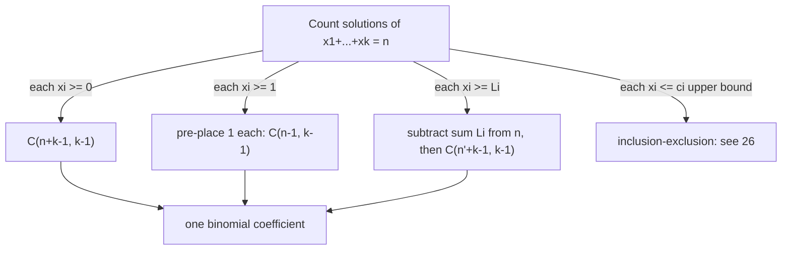

# Stars and Bars — Junior Level

> **One-line summary:** To count how many ways you can write `n` as an **ordered** sum of `k` **non-negative** integers — equivalently, how many ways to drop `n` identical balls into `k` distinct boxes — the answer is **`C(n + k - 1, k - 1)`**. If every box must get **at least one** ball (positive integers), the answer is **`C(n - 1, k - 1)`**. The whole idea is a picture: lay out `n` stars and `k - 1` bars in a row, and every arrangement is one distribution.

---

## Table of Contents

1. [Introduction](#introduction)
2. [Prerequisites](#prerequisites)
3. [Glossary](#glossary)
4. [Core Concepts](#core-concepts)
5. [Big-O Summary](#big-o-summary)
6. [Real-World Analogies](#real-world-analogies)
7. [Pros & Cons](#pros--cons)
8. [Step-by-Step Walkthrough](#step-by-step-walkthrough)
9. [Code Examples](#code-examples)
10. [Coding Patterns](#coding-patterns)
11. [Error Handling](#error-handling)
12. [Performance Tips](#performance-tips)
13. [Best Practices](#best-practices)
14. [Edge Cases & Pitfalls](#edge-cases--pitfalls)
15. [Common Mistakes](#common-mistakes)
16. [Cheat Sheet](#cheat-sheet)
17. [Visual Animation](#visual-animation)
18. [Summary](#summary)
19. [Further Reading](#further-reading)

---

## Introduction

Imagine someone asks: *"How many ways can I split **5 identical candies** among **3 children**, where a child is allowed to get zero?"* You could try to list them — `(5,0,0)`, `(0,5,0)`, `(4,1,0)`, `(2,2,1)`, and so on — but that gets out of hand fast, and you would never be sure you found them all. Stars and bars gives you the exact count with a single binomial coefficient, and a picture so simple you can draw it on a napkin.

Here is the trick. Write the `5` candies as **5 stars**:

```
★ ★ ★ ★ ★
```

Now you need to split this row into **3 groups** (one per child). To cut a row into 3 groups you place **2 dividers** — call them **bars** (`|`). For example:

```
★ ★ | ★ | ★ ★      means child A=2, child B=1, child C=2
★ ★ ★ ★ ★ | |      means child A=5, child B=0, child C=0
| ★ ★ ★ ★ ★ |      means child A=0, child B=5, child C=0
```

Every way to place the bars among the stars gives exactly one distribution, and every distribution corresponds to exactly one bar placement. So **counting distributions = counting arrangements of stars and bars**. You have `5` stars and `2` bars, which is `7` symbols total, and you choose **which 2 of the 7 positions hold bars**. That number is

```
C(7, 2) = C(5 + 3 - 1, 3 - 1) = 21.
```

So there are exactly **21** ways. That is the entire idea. The general statement: the number of ways to write

```
x₁ + x₂ + … + x_k = n        with each xᵢ ≥ 0
```

is

> **`C(n + k - 1, k - 1)`**   (also written `C(n + k - 1, n)` — they are equal).

And if every box must be **non-empty** (each `xᵢ ≥ 1`), the count is

> **`C(n - 1, k - 1)`**.

This file builds the bijection (the "stars = items, bars = dividers" picture), both formulas, and how to compute the binomial coefficient safely — including modulo a prime, which you need the moment `n` and `k` get large.

---

## Prerequisites

Before reading this file you should be comfortable with:

- **Binomial coefficients** — `C(n, k)` ("n choose k"), Pascal's triangle, and the factorial formula `C(n, k) = n! / (k!·(n−k)!)`. See sibling `23-binomial-coefficients`.
- **Basic counting** — the idea that choosing `k` positions out of `m` gives `C(m, k)` ways.
- **Modular arithmetic** — `(a · b) mod p` and what a remainder means, for the modular version. See sibling `02-modular-arithmetic`.
- **Big-O notation** — `O(k)`, `O(n)`.

Optional but helpful:

- **Modular inverse** — `a^(-1) mod p`, used to divide under a prime modulus. See sibling `05-fermat-euler`.
- A glance at the words **composition** and **multiset**, defined in the glossary below.

---

## Glossary

| Term | Meaning |
|------|---------|
| **Star (`★`)** | A single identical item / one unit of `n`. There are `n` of them. |
| **Bar (`\|`)** | A divider between two adjacent boxes. With `k` boxes you use `k − 1` bars. |
| **Bin / box** | A distinct container that receives some non-negative number of items. There are `k`. |
| **Non-negative solution** | A tuple `(x₁,…,x_k)` with each `xᵢ ≥ 0` summing to `n`. Counted by `C(n+k−1, k−1)`. |
| **Positive solution** | A tuple with each `xᵢ ≥ 1`. Counted by `C(n−1, k−1)`. |
| **Composition of `n`** | An **ordered** way to write `n` as a sum of positive parts. `(2,1,2)` and `(1,2,2)` are different compositions. |
| **Multiset of size `n`** | An unordered selection of `n` items from `k` types, repeats allowed. Counted by the same `C(n+k−1, n)`. |
| **Binomial coefficient `C(m, r)`** | The number of ways to choose `r` items from `m`; equals `m!/(r!(m−r)!)`. |
| **Bijection** | A one-to-one pairing between two sets — proves they have the same size. |
| **Inclusion–exclusion (PIE)** | A counting method to handle upper-bound constraints; see sibling `26-inclusion-exclusion`. |

---

## Core Concepts

### 1. The Bijection: Stars Are Items, Bars Are Dividers

The heart of the topic is a **bijection** (a perfect pairing) between two things that look unrelated:

- **Set A:** all solutions `(x₁, …, x_k)` of `x₁ + … + x_k = n` with `xᵢ ≥ 0`.
- **Set B:** all arrangements of `n` stars and `k − 1` bars in a row.

Given a solution, write `x₁` stars, then a bar, then `x₂` stars, then a bar, …, then `x_k` stars. Given an arrangement, read off the runs of stars between consecutive bars (including the ends). The two operations undo each other, so the sets have the **same size**. Counting Set B is easy: you have `n + (k − 1)` symbols and you choose which `k − 1` of them are bars, giving `C(n + k − 1, k − 1)`.

### 2. The Non-Negative Formula

```
# of (x₁,…,x_k) with xᵢ ≥ 0 and Σxᵢ = n   =   C(n + k - 1, k - 1)   =   C(n + k - 1, n)
```

The two forms are equal because `C(m, r) = C(m, m − r)`: choosing the `k − 1` bar positions is the same as choosing the `n` star positions. Use whichever has the **smaller** lower index for faster computation (`min(k−1, n)`).

### 3. The Positive Formula (Each Box ≥ 1)

If every box must receive at least one item, **pre-place one star in each box**. That uses `k` stars and leaves `n − k` stars to distribute freely (now each box may get zero *extra*). Apply the non-negative formula to the remaining `n − k`:

```
# with each xᵢ ≥ 1   =   C((n - k) + k - 1, k - 1)   =   C(n - 1, k - 1)
```

This requires `n ≥ k` (you cannot give each of `k` boxes a star if you have fewer than `k` stars); otherwise the count is `0`.

### 4. Substitution Handles Lower Bounds

The "pre-place one" trick generalizes. If box `i` must receive **at least `Lᵢ`**, substitute `yᵢ = xᵢ − Lᵢ ≥ 0`. The equation becomes

```
y₁ + … + y_k = n − (L₁ + … + L_k),   each yᵢ ≥ 0
```

so the count is `C(n − ΣLᵢ + k − 1, k − 1)` (and `0` if `n − ΣLᵢ < 0`). Lower bounds are *free* — they just shrink `n`.

### 5. Upper Bounds Need Inclusion–Exclusion

Upper bounds (e.g. "no box gets more than `c`") are harder. There is no single binomial coefficient; instead you **subtract** the bad cases with inclusion–exclusion (sibling `26-inclusion-exclusion`). The middle/professional files derive the full formula; for now, just know: lower bounds = easy substitution, upper bounds = PIE.

### 6. Connection to Multisets and Compositions

- **Multiset coefficient:** choosing `n` items from `k` types with repetition allowed is exactly distributing `n` identical items into `k` type-bins, so it equals `C(n + k − 1, n)`. This number is often written `((k choose n))` and called "k multichoose n".
- **Compositions:** the number of compositions of `n` into exactly `k` positive parts is the positive formula `C(n − 1, k − 1)`. Summing over all `k` from `1` to `n` gives `2^(n−1)`, the total number of compositions of `n`.

---

## Big-O Summary

| Operation | Time | Space | Notes |
|-----------|------|-------|-------|
| `C(n+k−1, k−1)` by multiplicative loop | **O(min(k, n))** | O(1) | Multiply `r` terms, divide as you go. |
| `C(n+k−1, k−1)` by full factorials | O(n + k) | O(1) | Slower; overflow-prone without a modulus. |
| `C(m, r) mod p` with precomputed factorials | **O(1)** per query, O(m) precompute | O(m) | Standard competitive setup; see `23-binomial-coefficients`. |
| Positive count `C(n−1, k−1)` | O(min(k, n)) | O(1) | After the `n ≥ k` check. |
| Lower-bound count (substitution) | O(min(k, n)) | O(1) | Just shrink `n`, then one binomial. |
| Upper-bound count (PIE over `t` violated boxes) | O(k · cost(C)) | O(1) | Sum of `≤ k + 1` binomials; see `26-inclusion-exclusion`. |
| Brute-force enumerate all solutions | O(C(n+k−1, k−1)) | O(k) depth | Exponential; only for tiny inputs / testing. |

The headline cost is **one binomial coefficient**, computed in `O(min(k, n))` arithmetic operations, or `O(1)` per query if you precompute factorials mod `p`.

---

## Real-World Analogies

| Concept | Analogy |
|---------|---------|
| Stars and bars | Splitting a chocolate bar of `n` squares into `k` pieces by choosing where to snap it — you make `k − 1` snaps. |
| Non-negative solutions | Pouring `n` liters of water into `k` buckets where a bucket may stay empty. |
| Positive solutions | The same buckets, but every bucket must be "primed" with at least one liter first. |
| Lower bounds via substitution | Each bucket has a mandatory deposit; pay the deposits first, then freely distribute what's left. |
| Upper bounds via PIE | Buckets that overflow are "bad"; count everything, then subtract the overflow cases, adding back double-counted ones. |
| Multiset of size `n` | Buying `n` donuts from `k` flavors — you only care how many of each flavor, not the order you picked them. |

Where the analogies break: real water is continuous, but stars and bars counts only **whole** units (integer solutions). And the chocolate-snap picture assumes pieces can be empty (a "snap" can be at the very edge) — that is the non-negative case.

---

## Pros & Cons

| Pros | Cons |
|------|------|
| Reduces a hard counting question to **one binomial coefficient**. | Only counts **identical** items into **distinct** boxes — not items-distinct or boxes-identical. |
| The bijection is a one-line proof you can reconstruct from memory. | Upper bounds are *not* a single binomial; they need inclusion–exclusion. |
| Lower bounds cost nothing — just substitute and shrink `n`. | Easy to confuse `k − 1` (bars) with `k` (boxes) — a classic off-by-one. |
| Composes cleanly with modular binomials for huge `n`, `k`. | Requires the boxes to be **labeled/distinct**; identical boxes is a partition problem (much harder). |
| Same formula answers multiset, composition, and donut problems. | The all-zero / `n < k` corner cases trip people up if not guarded. |

**When to use:** counting non-negative (or positive, or lower-bounded) integer solutions of `x₁ + … + x_k = n`; counting multisets / "choose with repetition"; counting monomials of a given degree; any "distribute identical items into distinct bins" question.

**When NOT to use:** items are distinguishable (use `k^n` or surjection counts), boxes are indistinguishable (integer partitions), or each box has an upper bound (use stars and bars **plus** inclusion–exclusion).

---

## Step-by-Step Walkthrough

**Goal:** count the non-negative integer solutions of `x₁ + x₂ + x₃ = 5`, by hand and by formula, then redo it with the constraint `x₁ ≥ 1`.

**Step 1 — Identify `n` and `k`.** The right-hand side is `n = 5` (total items). The number of variables is `k = 3` (boxes).

**Step 2 — Draw stars and bars.** Write `5` stars and `k − 1 = 2` bars. Total symbols `= 5 + 2 = 7`.

```
★ ★ ★ ★ ★ | |       (positions for the 2 bars are what we choose)
```

**Step 3 — Apply the non-negative formula.**

```
C(n + k - 1, k - 1) = C(5 + 3 - 1, 3 - 1) = C(7, 2) = 21.
```

**Step 4 — Sanity-check by listing a few.** `(5,0,0)`, `(0,5,0)`, `(0,0,5)` — that's 3 with two zeros. `(4,1,0)` and its arrangements — there are `3 · 2 = 6` ways to place a `4`, a `1`, and a `0`. Continue and the running total reaches `21`. (You do not have to finish; the formula is the point.)

**Step 5 — Add a lower bound `x₁ ≥ 1`.** Substitute `y₁ = x₁ − 1 ≥ 0`. The equation becomes `y₁ + x₂ + x₃ = 5 − 1 = 4`, still `3` non-negative variables:

```
C(4 + 3 - 1, 3 - 1) = C(6, 2) = 15.
```

**Step 6 — Cross-check the "all positive" case.** If *every* variable must be `≥ 1`, the positive formula gives `C(n − 1, k − 1) = C(4, 2) = 6`. Indeed the compositions of `5` into `3` positive parts are `(3,1,1),(1,3,1),(1,1,3),(2,2,1),(2,1,2),(1,2,2)` — exactly `6`.

That is the whole workflow: read off `n` and `k`, pick the right formula, push lower bounds into `n` by substitution, and compute the binomial.

---

## Code Examples

### Example: Stars-and-Bars Counts (non-negative, positive, lower-bounded)

This computes `C(m, r)` with a safe multiplicative loop, then derives the three core counts. The loop multiplies `r` terms and divides as it goes so intermediate values stay small and exact.

#### Go

```go
package main

import "fmt"

// binom computes C(m, r) exactly using a multiplicative loop in O(min(r, m-r)).
// Returns 0 when r < 0 or r > m.
func binom(m, r int64) int64 {
	if r < 0 || r > m {
		return 0
	}
	if r > m-r {
		r = m - r // use the smaller index: C(m,r) == C(m,m-r)
	}
	result := int64(1)
	for i := int64(0); i < r; i++ {
		result = result * (m - i) / (i + 1) // exact: divides evenly each step
	}
	return result
}

// starsBarsNonNeg: # of (x1..xk) >= 0 with sum = n  ->  C(n+k-1, k-1).
func starsBarsNonNeg(n, k int64) int64 {
	if n < 0 || k <= 0 {
		return 0
	}
	return binom(n+k-1, k-1)
}

// starsBarsPositive: # of (x1..xk) >= 1 with sum = n  ->  C(n-1, k-1).
func starsBarsPositive(n, k int64) int64 {
	if k <= 0 || n < k {
		return 0
	}
	return binom(n-1, k-1)
}

// withLowerBounds: each xi >= lows[i]; shrink n by the sum of lower bounds.
func withLowerBounds(n int64, lows []int64) int64 {
	k := int64(len(lows))
	for _, l := range lows {
		n -= l
	}
	return starsBarsNonNeg(n, k)
}

func main() {
	fmt.Println(starsBarsNonNeg(5, 3))                 // 21
	fmt.Println(starsBarsPositive(5, 3))               // 6
	fmt.Println(withLowerBounds(5, []int64{1, 0, 0}))  // 15
}
```

#### Java

```java
public class StarsAndBars {
    // C(m, r) exact via multiplicative loop, O(min(r, m-r)).
    static long binom(long m, long r) {
        if (r < 0 || r > m) return 0;
        if (r > m - r) r = m - r;
        long result = 1;
        for (long i = 0; i < r; i++) {
            result = result * (m - i) / (i + 1);
        }
        return result;
    }

    static long starsBarsNonNeg(long n, long k) {
        if (n < 0 || k <= 0) return 0;
        return binom(n + k - 1, k - 1);
    }

    static long starsBarsPositive(long n, long k) {
        if (k <= 0 || n < k) return 0;
        return binom(n - 1, k - 1);
    }

    static long withLowerBounds(long n, long[] lows) {
        long k = lows.length;
        for (long l : lows) n -= l;
        return starsBarsNonNeg(n, k);
    }

    public static void main(String[] args) {
        System.out.println(starsBarsNonNeg(5, 3));                  // 21
        System.out.println(starsBarsPositive(5, 3));                // 6
        System.out.println(withLowerBounds(5, new long[]{1, 0, 0})); // 15
    }
}
```

#### Python

```python
from math import comb  # Python 3.8+: comb(m, r) == C(m, r), returns 0 if r > m


def stars_bars_non_neg(n, k):
    """# of (x1..xk) >= 0 with sum = n  ->  C(n+k-1, k-1)."""
    if n < 0 or k <= 0:
        return 0
    return comb(n + k - 1, k - 1)


def stars_bars_positive(n, k):
    """# of (x1..xk) >= 1 with sum = n  ->  C(n-1, k-1)."""
    if k <= 0 or n < k:
        return 0
    return comb(n - 1, k - 1)


def with_lower_bounds(n, lows):
    """Each xi >= lows[i]; shrink n by sum of lower bounds, then non-negative count."""
    k = len(lows)
    n -= sum(lows)
    return stars_bars_non_neg(n, k)


if __name__ == "__main__":
    print(stars_bars_non_neg(5, 3))        # 21
    print(stars_bars_positive(5, 3))       # 6
    print(with_lower_bounds(5, [1, 0, 0])) # 15
```

**What it does:** computes the 21 non-negative solutions of `x₁+x₂+x₃=5`, the 6 all-positive ones, and the 15 with `x₁ ≥ 1`.
**Run:** `go run main.go` | `javac StarsAndBars.java && java StarsAndBars` | `python stars.py`

---

## Coding Patterns

### Pattern 1: Brute-Force Enumerator (the oracle you test against)

**Intent:** Before trusting the formula, count solutions the slow, obvious way and check they agree on small inputs.

```python
def count_bruteforce(n, k):
    # recursively place items into k bins
    if k == 1:
        return 1               # one way: the last bin gets all n
    return sum(count_bruteforce(n - first, k - 1) for first in range(n + 1))
```

This is exponential, so it is useless for large `n, k`, but it is the perfect correctness oracle: `count_bruteforce(5, 3)` must equal `comb(7, 2) = 21`.

### Pattern 2: Choosing the Smaller Index

**Intent:** Compute the same binomial faster by exploiting `C(m, r) = C(m, m − r)`.

```python
# C(n+k-1, k-1) == C(n+k-1, n). Loop over the smaller of (k-1, n).
m = n + k - 1
r = min(k - 1, n)
# ... multiply r terms ...
```

### Pattern 3: Lower Bounds by Substitution

**Intent:** Turn "each `xᵢ ≥ Lᵢ`" into a plain non-negative count.

```python
def lower_bounded(n, lows):
    n -= sum(lows)            # pre-place the required minimums
    if n < 0:
        return 0
    return comb(n + len(lows) - 1, len(lows) - 1)
```



---

## Error Handling

| Error | Cause | Fix |
|-------|-------|-----|
| Off-by-one: used `C(n+k, k)` | Confused boxes `k` with bars `k − 1`. | The exponent of bars is `k − 1`: use `C(n + k − 1, k − 1)`. |
| Negative or wrong count | Lower bounds make `n − ΣLᵢ < 0` but you didn't return `0`. | Guard: if shrunk `n < 0`, the count is `0`. |
| Positive count wrong | Applied `C(n−1, k−1)` when `n < k`. | If `n < k` there are no positive solutions; return `0`. |
| Integer overflow | `n + k − 1` large and full-factorial product overflows. | Use the multiplicative loop, or compute mod a prime; in Go/Java use `int64`/`BigInteger`. |
| Upper bound ignored | Used plain stars and bars when a box has a cap. | Apply inclusion–exclusion (sibling `26`); plain formula overcounts. |
| Division not exact | Multiplied all terms first, then divided once. | Divide *inside* the loop: `r = r*(m−i)/(i+1)` is always exact at each step. |

---

## Performance Tips

- **Use the multiplicative loop, not factorials** — computing `n!`, `k!`, `(n−k)!` separately overflows far sooner and is slower. The loop `result = result*(m−i)/(i+1)` keeps values small and exact.
- **Pick the smaller index** — compute `C(n+k−1, min(k−1, n))`. The cost is `O(min(k, n))`, not `O(n + k)`.
- **Precompute factorials mod `p` once** — if you answer many queries under a prime modulus, build `fact[]` and `invFact[]` arrays once for `O(1)` per query. See sibling `23-binomial-coefficients`.
- **Reduce lower bounds before computing** — subtract `ΣLᵢ` from `n` first; never enumerate.
- **Cap inclusion–exclusion early** — for upper bounds, the PIE sum has at most `k + 1` terms and most vanish once the shrunk `n` goes negative; stop there.

---

## Best Practices

- State clearly whether your problem is **non-negative** (`≥ 0`) or **positive** (`≥ 1`) — the formula differs by exactly which index you plug in.
- Write the bijection in a comment: "`n` stars, `k − 1` bars, choose bar positions." It makes the `k − 1` impossible to forget.
- Always guard the corner cases: `n < 0`, `k ≤ 0`, and (for positive) `n < k`.
- Push **lower bounds** into `n` by substitution; reach for **inclusion–exclusion** only when there are **upper bounds**.
- Validate the formula against the brute-force enumerator (Pattern 1) for all small `n, k` before scaling up.
- When `n, k` are large, compute the binomial **modulo a prime** using precomputed factorials and a modular inverse (siblings `23` and `05`).

---

## Edge Cases & Pitfalls

- **`n = 0`** — there is exactly **one** non-negative solution (every box gets `0`): `C(0 + k − 1, k − 1) = C(k−1, k−1) = 1`. The formula already returns `1`.
- **`k = 1`** — there is exactly one solution `(n)`: `C(n + 0, 0) = 1`. Correct.
- **`k = 0`** — no variables; the count is `1` if `n = 0` (empty sum) and `0` otherwise. Many implementations just guard `k ≤ 0`; document your choice.
- **Positive case with `n < k`** — `0` solutions; the unguarded `C(n−1, k−1)` would return `0` anyway since `k−1 > n−1`, but guard it for clarity.
- **Negative lower bounds** — a "lower bound" of `−2` is just no real constraint; substitution still works but verify the resulting `n` is handled.
- **Upper bound equal to or above the total** — if a box's cap `cᵢ ≥ n`, that constraint is **vacuous** and contributes nothing to the inclusion–exclusion sum.
- **Confusing identical vs distinct boxes** — stars and bars needs **distinct** boxes. "Identical boxes" is the partition function, a different (harder) problem.

---

## Common Mistakes

1. **Using `C(n + k, k)` or `C(n + k, k − 1)`** — the correct top is `n + k − 1` and the bottom is `k − 1` (the number of *bars*, not boxes).
2. **Applying the formula with upper bounds** — plain stars and bars overcounts when boxes are capped; you must subtract via inclusion–exclusion.
3. **Forgetting the `n ≥ k` requirement for the positive count** — with fewer items than boxes you cannot give each box one; the answer is `0`.
4. **Computing factorials directly and overflowing** — use the multiplicative loop or modular factorials; never form `n!` for large `n` in fixed-width integers.
5. **Treating boxes as identical** — stars and bars assumes **labeled** boxes; identical boxes is integer partitioning.
6. **Treating items as distinct** — if the items are distinguishable, the count is `k^n` (each item picks a box), *not* a binomial.
7. **Dividing all at once** — multiply then divide once can lose exactness; divide inside the loop where each step divides evenly.

---

## Cheat Sheet

| Question | Formula | Condition |
|----------|---------|-----------|
| `x₁+…+x_k = n`, each `xᵢ ≥ 0` | `C(n + k − 1, k − 1)` = `C(n+k−1, n)` | `n ≥ 0`, `k ≥ 1` |
| `x₁+…+x_k = n`, each `xᵢ ≥ 1` | `C(n − 1, k − 1)` | `n ≥ k` (else `0`) |
| each `xᵢ ≥ Lᵢ` | `C(n − ΣLᵢ + k − 1, k − 1)` | `n − ΣLᵢ ≥ 0` |
| `≤ n` total (allow leftover) | `C(n + k, k)` (add a "slack" box) | `n ≥ 0` |
| multiset: `n` from `k` types, repeats ok | `C(n + k − 1, n)` | same as non-negative |
| compositions of `n` into `k` positive parts | `C(n − 1, k − 1)` | `n ≥ k` |
| compositions of `n` into any number of parts | `2^(n−1)` | `n ≥ 1` |
| each `xᵢ ≤ cᵢ` (upper bounds) | inclusion–exclusion sum | see sibling `26` |

Core routine:

```
binom(m, r):                       # O(min(r, m-r))
    if r < 0 or r > m: return 0
    r = min(r, m - r)
    result = 1
    for i in 0 .. r-1:
        result = result * (m - i) / (i + 1)
    return result

stars_bars_non_neg(n, k) = binom(n + k - 1, k - 1)
stars_bars_positive(n, k) = binom(n - 1, k - 1)   # requires n >= k
```

---

## Visual Animation

> See [`animation.html`](./animation.html) for an interactive visualization.
>
> The animation demonstrates:
> - A row of **`n` stars** and **`k − 1` bars** that you can **drag** to change the distribution
> - The live tuple `(x₁, …, x_k)` updating as you move a bar, always summing to `n`
> - The running count **`C(n + k − 1, k − 1)`** for the current `n` and `k`
> - The **upper-bound** mode showing how inclusion–exclusion subtracts the "bad" arrangements
> - Editable `n` and `k`, with a step-through of how each arrangement maps to a solution

---

## Summary

Stars and bars answers "how many ways to write `n` as an ordered sum of `k` non-negative integers" — equivalently, "how many ways to drop `n` identical items into `k` distinct boxes" — with a single picture and a single binomial coefficient: **`C(n + k − 1, k − 1)`** (lay out `n` stars and `k − 1` bars, choose the bar positions). If every box must be non-empty, pre-place one item each and get **`C(n − 1, k − 1)`**, valid when `n ≥ k`. General **lower bounds** are free: substitute `yᵢ = xᵢ − Lᵢ` and shrink `n` by `ΣLᵢ`. **Upper bounds** are the one hard case and need inclusion–exclusion (sibling `26`). The same `C(n + k − 1, n)` counts multisets and "choose with repetition," while `C(n − 1, k − 1)` counts compositions. Compute the binomial with a multiplicative loop for `O(min(k, n))`, or with precomputed factorials **modulo a prime** (siblings `23` and `05`) when `n` and `k` are large.

---

## Further Reading

- *Concrete Mathematics* (Graham, Knuth, Patashnik) — binomial coefficients and the "balls into boxes" twelvefold way.
- Sibling topic `23-binomial-coefficients` — computing `C(n, k)` and `C(n, k) mod p`.
- Sibling topic `26-inclusion-exclusion` — handling upper-bound constraints.
- Sibling topic `05-fermat-euler` — modular inverse for division under a prime modulus.
- Sibling topic `25-catalan-numbers` — another binomial-based counting family.
- cp-algorithms.com — "Stars and bars" and "Binomial coefficients".
- Next step: continue to [`middle.md`](./middle.md) for constraints, substitution, inclusion–exclusion, and the multiset/composition connections.
