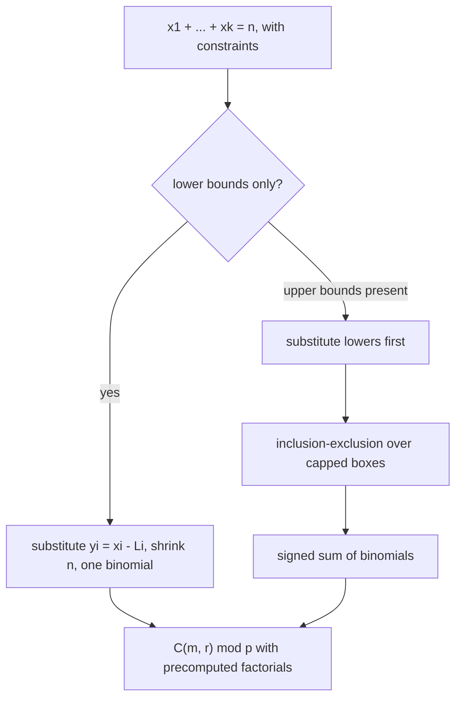

# Stars and Bars — Middle Level

> **One-line summary:** The non-negative count `C(n+k-1, k-1)` and the positive count `C(n-1, k-1)` are two faces of the same bijection. The *middle* skill is handling **constraints**: lower bounds collapse into a single substitution that just shrinks `n`, while **upper bounds** require **inclusion–exclusion** (sibling `26-inclusion-exclusion`) — one signed binomial per subset of violated boxes. Underneath, everything is one `C(m, r)` computation, which you compute **mod a prime** with precomputed factorials (sibling `23-binomial-coefficients`) once `n` and `k` grow.

---

## Table of Contents

1. [Introduction](#introduction)
2. [Deeper Concepts](#deeper-concepts)
3. [Comparison with Alternatives](#comparison-with-alternatives)
4. [Constraints: Lower Bounds by Substitution](#lower-bounds)
5. [Constraints: Upper Bounds by Inclusion–Exclusion](#upper-bounds)
6. [Multisets and Compositions](#multisets-and-compositions)
7. [Computing Binomials at Scale (mod p)](#computing-binomials-mod-p)
8. [Code Examples](#code-examples)
9. [Error Handling](#error-handling)
10. [Performance Analysis](#performance-analysis)
11. [Best Practices](#best-practices)
12. [Visual Animation](#visual-animation)
13. [Summary](#summary)

---

## Introduction

> Focus: "Why does the bijection work, and when do I reach for substitution vs inclusion–exclusion?"

At the junior level you learned the two formulas and the stars-and-bars picture. The middle level is about **recognizing variations** and **transforming them** into the basic form. Almost every "count the integer solutions of `x₁ + … + x_k = n`" problem in practice comes wrapped in constraints:

- *each variable at least something* → **lower bounds**, dissolved by a single substitution;
- *each variable at most something* → **upper bounds**, handled by inclusion–exclusion;
- *a `≤ n` budget instead of exactly `n`* → add a **slack variable**;
- *a mixture* → apply lower-bound substitution first, then PIE for what remains.

The unifying idea is that all of these reduce to **evaluating `C(m, r)`** one or several times — and once `n + k` exceeds a few thousand you compute that binomial **modulo a prime** with precomputed factorials. So the two technical pillars of this file are *constraint transformation* and *modular binomial computation*.

---

## Deeper Concepts

### The invariant: a solution is a placement of `k − 1` bars

The structural invariant that makes stars and bars correct: an arrangement of `n` stars and `k − 1` bars is **completely determined** by the set of `k − 1` positions (out of `n + k − 1`) that hold bars, and *every* such set is legal (bars may be adjacent → empty box; bars may be at the ends → first/last box empty). There is no "illegal" arrangement to exclude, which is exactly why the answer is a clean `C(n + k − 1, k − 1)` with no correction term. The moment a constraint makes some arrangements illegal (an upper bound), the clean count breaks and you need inclusion–exclusion to remove the illegal ones.

### Two equivalent expressions, one cheaper

```
C(n + k - 1, k - 1) = C(n + k - 1, n)
```

These are equal by symmetry `C(m, r) = C(m, m − r)`. Choose `r = min(k − 1, n)` to minimize work: if you have many boxes but few items, loop over `n`; if many items but few boxes, loop over `k − 1`.

### The "at most" trick: a slack box

To count solutions of `x₁ + … + x_k ≤ n` (an inequality), introduce a **slack variable** `x_{k+1} = n − Σxᵢ ≥ 0` that absorbs the leftover. Now `x₁ + … + x_{k+1} = n` exactly, with `k + 1` non-negative variables:

```
# of (x₁..x_k ≥ 0) with Σ ≤ n   =   C(n + k, k)
```

This is the standard way to convert an inequality into an equality. It also explains the cheat-sheet row "≤ n total".

### Generalized lower bounds

If `xᵢ ≥ Lᵢ`, set `yᵢ = xᵢ − Lᵢ ≥ 0`. The new total is `n' = n − ΣLᵢ`, and the count is `C(n' + k − 1, k − 1)` (zero if `n' < 0`). Lower bounds never need inclusion–exclusion; they are absorbed for free.

### Why upper bounds are fundamentally different

The asymmetry between lower and upper bounds is worth internalizing. A lower bound `xᵢ ≥ Lᵢ` is a *translation* of the lattice of solutions — it slides the whole solution set without changing its shape, so the count is just the count of a smaller stars-and-bars problem. An upper bound `xᵢ ≤ cᵢ` *truncates* the lattice: it carves away an unbounded region (everything with `xᵢ ≥ cᵢ + 1`) that itself looks like a stars-and-bars region. You cannot translate away a truncation, so you must *subtract* it — and subtracting overlapping regions is exactly what inclusion–exclusion is for. This is why every constrained-count algorithm normalizes lower bounds *first* (cheap, exact) and only then pays the inclusion–exclusion cost for the upper bounds that remain.

---

## Comparison with Alternatives

| Attribute | Stars & Bars | Direct enumeration | Generating functions |
|-----------|--------------|--------------------|----------------------|
| Time | O(min(k, n)) per binomial | O(C(n+k−1, k−1)) (exponential) | O(n·k) for the coefficient |
| Handles `xᵢ ≥ 0` | One formula | Yes (slow) | `1/(1−x)^k` coefficient |
| Handles `xᵢ ≥ Lᵢ` | Substitution (free) | Yes (slow) | shift by `x^{ΣLᵢ}` |
| Handles `xᵢ ≤ cᵢ` | Stars & bars + PIE | Yes (slow) | `(1−x^{cᵢ+1})/(1−x)` product |
| Best for | Closed-form counts, large `n` | Tiny inputs / testing | When constraints are messy/varied |

**Choose stars & bars when:** you want a closed-form count and the only constraints are lower bounds (free) or a handful of upper bounds (PIE).
**Choose generating functions when:** constraints differ per variable in complicated ways and you just need the coefficient of `x^n` — a polynomial-multiplication approach (sibling `22-polynomial-operations`) can be cleaner than a giant PIE.
**Choose enumeration only** for tiny inputs or as a correctness oracle.



---

## Lower Bounds

The substitution `yᵢ = xᵢ − Lᵢ` is the cleanest move in the topic. It turns *any* set of lower bounds into a single non-negative count.

**Worked example.** Count `x₁ + x₂ + x₃ + x₄ = 20` with `x₁ ≥ 2`, `x₂ ≥ 5`, `x₃ ≥ 0`, `x₄ ≥ 1`.

```
ΣLᵢ = 2 + 5 + 0 + 1 = 8
n'  = 20 - 8 = 12
count = C(12 + 4 - 1, 4 - 1) = C(15, 3) = 455.
```

If the lower bounds had summed to more than `20`, `n'` would be negative and the count would be `0` — no valid distribution exists.

---

## Upper Bounds

Upper bounds (`xᵢ ≤ cᵢ`) are where inclusion–exclusion enters. The idea: count **everything** with stars and bars, then **subtract** the arrangements where some box exceeds its cap, **add back** the ones where two boxes both exceed (double-subtracted), and so on — the alternating PIE pattern (sibling `26-inclusion-exclusion`).

### The single-cap case (all boxes capped at the same `c`)

Count `x₁ + … + x_k = n` with each `0 ≤ xᵢ ≤ c`. Let `Aᵢ` be the "bad" event "`xᵢ ≥ c + 1`". To force `xᵢ ≥ c + 1`, **pre-place `c + 1` items** in box `i` (the substitution trick again), reducing `n` by `c + 1`. The count of arrangements violating a *specific* set `S` of `t` boxes is

```
C(n - t(c+1) + k - 1, k - 1)
```

By inclusion–exclusion, summing over how many boxes are violated:

> **`Σ_{t=0}^{k} (−1)^t · C(k, t) · C(n − t(c+1) + k − 1, k − 1)`**

Terms vanish once `n − t(c+1) < 0`, so the practical number of terms is `⌊n / (c+1)⌋ + 1`, at most `k + 1`.

**Worked example.** Count `x₁ + x₂ + x₃ = 10` with each `0 ≤ xᵢ ≤ 4` (so `c = 4`, `c + 1 = 5`).

```
t=0:  + C(3,0)·C(10 + 2, 2) = 1·C(12,2) = 66
t=1:  − C(3,1)·C(10−5 + 2, 2) = 3·C(7,2) = 3·21 = 63
t=2:  + C(3,2)·C(10−10 + 2, 2) = 3·C(2,2) = 3·1 = 3
t=3:  − C(3,3)·C(10−15 + 2, 2) = (negative top) = 0
total = 66 − 63 + 3 = 6.
```

So there are **6** ways. Check: the only tuples summing to `10` with each part `≤ 4` are permutations of `(4,4,2)` (3 ways) and `(4,3,3)` (3 ways) — exactly `6`.

### Different caps per box

When caps differ, sum over **subsets** `S ⊆ {1,…,k}` of violated boxes:

```
Σ_{S} (−1)^{|S|} · C(n − Σ_{i∈S}(cᵢ + 1) + k − 1, k − 1)
```

This is `2^k` terms in the worst case, but in practice you only iterate subsets whose forced total `Σ(cᵢ+1) ≤ n` (the rest are zero). For small `k` this is fine; for large `k` with varied caps you typically switch to generating functions.

---

## Multisets and Compositions

Stars and bars is the same object as several classic counting families — recognizing the equivalence is half the middle-level skill.

| Problem | Phrasing | Count |
|---------|----------|-------|
| Multiset / "multichoose" | choose `n` items from `k` types, repetition allowed, order irrelevant | `C(n + k − 1, n)` |
| Non-negative solutions | `x₁ + … + x_k = n`, `xᵢ ≥ 0` | `C(n + k − 1, k − 1)` |
| Compositions into exactly `k` parts | `n` as ordered sum of `k` positive integers | `C(n − 1, k − 1)` |
| Compositions into any number of parts | ordered sums of positive integers totaling `n` | `2^{n−1}` |
| Monomials of degree `n` in `k` variables | terms `x₁^{a₁}…x_k^{a_k}` with `Σaᵢ = n` | `C(n + k − 1, k − 1)` |

The last row is a frequent application: the number of distinct monomials of total degree exactly `n` in `k` variables is a stars-and-bars count (the exponents `a₁,…,a_k` are a non-negative composition of `n`). This shows up when counting terms of a multivariate polynomial or the dimension of a space of homogeneous polynomials.

### Why compositions sum to `2^{n−1}`

A composition of `n` corresponds to choosing, among the `n − 1` "gaps" between `n` unit blocks, which gaps are "cut". Each gap is independently cut or not, giving `2^{n−1}` compositions total. Splitting by the number of cuts `k − 1` recovers `Σ_{k} C(n − 1, k − 1) = 2^{n−1}` — the same identity from Pascal's triangle.

### The multiset bijection in detail

The claim "choosing `n` items from `k` types with repetition = `C(n+k−1, n)`" deserves a concrete bijection, because it is the single most-tested equivalence. Encode a multiset by *how many of each type* it contains: let `xᵢ` be the count of type `i`. Then `x₁ + … + x_k = n` with `xᵢ ≥ 0` — exactly the non-negative stars-and-bars equation. So a multiset of size `n` over `k` types is *the same object* as a non-negative composition of `n` into `k` parts. The "donut" phrasing (*"buy `n` donuts, `k` flavors"*) is the canonical mnemonic: you only record how many of each flavor, never the order of selection, so order-irrelevance is baked in.

A subtle point: this is *with* repetition. Choosing `n` items from `k` types *without* repetition (each type used at most once) is the ordinary `C(k, n)` — a completely different count. The "multichoose" `C(n+k−1, n)` is strictly larger because it permits any number of repeats per type.

### Compositions vs partitions

One more distinction the middle level must nail: a **composition** is *ordered* (`(2,1,2)` ≠ `(1,2,2)`) and is counted by stars and bars; a **partition** is *unordered* (`2+1+2` and `1+2+2` are the same partition `{2,2,1}`) and has **no** stars-and-bars formula. Partitions correspond to the identical-boxes case and require a dynamic program. Mixing these up is the classic trap: stars and bars counts ordered tuples, full stop.

---

## Computing Binomials mod p

For large `n` and `k`, the binomial coefficient is astronomically large, so problems ask for the count **modulo a prime** `p` (commonly `10^9 + 7` or `998244353`). The standard recipe (full detail in sibling `23-binomial-coefficients`):

1. Precompute `fact[i] = i! mod p` for `i` up to `N = n + k`.
2. Precompute `invFact[i] = (i!)^{-1} mod p`, using a modular inverse (Fermat: `invFact[N] = fact[N]^{p-2}`, then `invFact[i-1] = invFact[i]·i`).
3. Then `C(m, r) mod p = fact[m] · invFact[r] · invFact[m−r] mod p`, in `O(1)` per query.

The modular inverse uses Fermat's little theorem (sibling `05-fermat-euler`): for prime `p`, `a^{-1} ≡ a^{p−2} (mod p)`. With this, an entire inclusion–exclusion sum of `k + 1` signed binomials costs `O(k)` after an `O(N)` precompute.

> Caution: this `O(1)` recipe needs `p` prime **and** `p > N`. If `p` is small relative to `n` (e.g. `n` larger than `p`), use **Lucas' theorem** (sibling `24-lucas-theorem`) to compute `C(m, r) mod p` digit-by-digit in base `p`.

---

## Code Examples

### Example 1: Upper-bound count via inclusion–exclusion (exact, big integers)

#### Go

```go
package main

import (
	"fmt"
	"math/big"
)

// binom returns C(m, r) as a big.Int (0 if out of range).
func binom(m, r int64) *big.Int {
	if r < 0 || r > m {
		return big.NewInt(0)
	}
	if r > m-r {
		r = m - r
	}
	res := big.NewInt(1)
	for i := int64(0); i < r; i++ {
		res.Mul(res, big.NewInt(m-i))
		res.Div(res, big.NewInt(i+1))
	}
	return res
}

// cappedSameC: # of (x1..xk) with 0 <= xi <= c and sum = n, via PIE.
func cappedSameC(n, k, c int64) *big.Int {
	total := big.NewInt(0)
	for t := int64(0); t <= k; t++ {
		rem := n - t*(c+1)
		if rem < 0 {
			break
		}
		term := new(big.Int).Mul(binom(k, t), binom(rem+k-1, k-1))
		if t%2 == 0 {
			total.Add(total, term)
		} else {
			total.Sub(total, term)
		}
	}
	return total
}

func main() {
	fmt.Println(cappedSameC(10, 3, 4)) // 6
	fmt.Println(cappedSameC(5, 3, 5))  // 21 (caps vacuous -> plain stars and bars)
}
```

#### Java

```java
import java.math.BigInteger;

public class CappedStarsBars {
    static BigInteger binom(long m, long r) {
        if (r < 0 || r > m) return BigInteger.ZERO;
        if (r > m - r) r = m - r;
        BigInteger res = BigInteger.ONE;
        for (long i = 0; i < r; i++) {
            res = res.multiply(BigInteger.valueOf(m - i))
                     .divide(BigInteger.valueOf(i + 1));
        }
        return res;
    }

    // 0 <= xi <= c, sum = n, via inclusion-exclusion.
    static BigInteger cappedSameC(long n, long k, long c) {
        BigInteger total = BigInteger.ZERO;
        for (long t = 0; t <= k; t++) {
            long rem = n - t * (c + 1);
            if (rem < 0) break;
            BigInteger term = binom(k, t).multiply(binom(rem + k - 1, k - 1));
            total = (t % 2 == 0) ? total.add(term) : total.subtract(term);
        }
        return total;
    }

    public static void main(String[] args) {
        System.out.println(cappedSameC(10, 3, 4)); // 6
        System.out.println(cappedSameC(5, 3, 5));  // 21
    }
}
```

#### Python

```python
from math import comb


def capped_same_c(n, k, c):
    """# of (x1..xk) with 0 <= xi <= c and sum = n, via inclusion-exclusion."""
    total = 0
    t = 0
    while True:
        rem = n - t * (c + 1)
        if rem < 0 or t > k:
            break
        term = comb(k, t) * comb(rem + k - 1, k - 1)
        total += term if t % 2 == 0 else -term
        t += 1
    return total


if __name__ == "__main__":
    print(capped_same_c(10, 3, 4))  # 6
    print(capped_same_c(5, 3, 5))   # 21
```

### Example 2: Lower-bounded count with a guard

#### Go

```go
package main

import "fmt"

func binom(m, r int64) int64 {
	if r < 0 || r > m {
		return 0
	}
	if r > m-r {
		r = m - r
	}
	res := int64(1)
	for i := int64(0); i < r; i++ {
		res = res * (m - i) / (i + 1)
	}
	return res
}

// each xi >= lows[i]; subtract the required minimums first.
func lowerBounded(n int64, lows []int64) int64 {
	k := int64(len(lows))
	for _, l := range lows {
		n -= l
	}
	if n < 0 {
		return 0 // minimums alone already exceed n
	}
	return binom(n+k-1, k-1)
}

func main() {
	fmt.Println(lowerBounded(20, []int64{2, 5, 0, 1})) // 455
	fmt.Println(lowerBounded(3, []int64{2, 2}))        // 0
}
```

#### Java

```java
public class LowerBounded {
    static long binom(long m, long r) {
        if (r < 0 || r > m) return 0;
        if (r > m - r) r = m - r;
        long res = 1;
        for (long i = 0; i < r; i++) res = res * (m - i) / (i + 1);
        return res;
    }

    static long lowerBounded(long n, long[] lows) {
        long k = lows.length;
        for (long l : lows) n -= l;
        if (n < 0) return 0;
        return binom(n + k - 1, k - 1);
    }

    public static void main(String[] args) {
        System.out.println(lowerBounded(20, new long[]{2, 5, 0, 1})); // 455
        System.out.println(lowerBounded(3, new long[]{2, 2}));        // 0
    }
}
```

#### Python

```python
from math import comb


def lower_bounded(n, lows):
    """each xi >= lows[i]; shrink n, guard negative, then non-negative count."""
    k = len(lows)
    n -= sum(lows)
    if n < 0:
        return 0
    return comb(n + k - 1, k - 1)


if __name__ == "__main__":
    print(lower_bounded(20, [2, 5, 0, 1]))  # 455
    print(lower_bounded(3, [2, 2]))         # 0
```

### Example 3: Different caps per box (subset PIE)

#### Python

```python
from itertools import combinations
from math import comb


def capped_varied(n, caps):
    """0 <= xi <= caps[i], sum = n. PIE over subsets of violated boxes."""
    k = len(caps)
    total = 0
    for t in range(k + 1):
        for S in combinations(range(k), t):
            forced = sum(caps[i] + 1 for i in S)
            rem = n - forced
            if rem < 0:
                continue
            term = comb(rem + k - 1, k - 1)
            total += term if t % 2 == 0 else -term
    return total


if __name__ == "__main__":
    print(capped_varied(10, [4, 4, 4]))  # 6  (matches capped_same_c)
    print(capped_varied(7, [3, 2, 5]))   # solutions with those caps
```

---

## Error Handling

| Scenario | What goes wrong | Correct approach |
|----------|----------------|------------------|
| Upper bound treated as free | Plain `C(n+k−1, k−1)` overcounts capped boxes | Use inclusion–exclusion; subtract the over-cap arrangements |
| PIE loop runs past valid range | Negative `C(rem+k−1, k−1)` with `rem < 0` | Stop (or skip) once `rem < 0`; those terms are `0` |
| Lower bounds make `n` negative | Count should be `0`, but unguarded code returns garbage | Return `0` when `n − ΣLᵢ < 0` |
| `p` not prime in mod recipe | `invFact` via Fermat is wrong | Ensure `p` is prime, or use a CRT/Lucas approach (siblings `06`, `24`) |
| `n ≥ p` with small prime | `fact[n] mod p = 0`, formula breaks | Use Lucas' theorem (sibling `24-lucas-theorem`) |
| Subset PIE explodes | `2^k` subsets for large `k` | Use the per-`t` form when caps are equal; otherwise generating functions |

---

## Worked Recognition Gallery

The middle-level skill is *seeing* the stars-and-bars shape under different phrasings. Each of the following is the same `C(n+k−1, k−1)` (or a close variant) in disguise; learning to translate them quickly is more valuable than memorizing the formula.

### Gallery 1 — "Distribute identical resources"

*"A company has 12 identical laptops to allocate across 4 departments; a department may get none. How many allocations?"* This is `n = 12`, `k = 4`, non-negative: `C(12 + 4 − 1, 4 − 1) = C(15, 3) = 455`. If every department must get at least one laptop, it is `C(11, 3) = 165`.

### Gallery 2 — "Non-decreasing sequences"

*"How many non-decreasing sequences `1 ≤ a₁ ≤ a₂ ≤ … ≤ a_m ≤ k` are there?"* Map each sequence to the multiset of values it uses; choosing a multiset of size `m` from `k` values is `C(m + k − 1, m)`. The bijection: let `xᵥ` be how many times value `v` appears; then `x₁ + … + x_k = m` with `xᵥ ≥ 0`. For `m = 2`, `k = 3` this is `C(4, 2) = 6`, matching `(1,1),(1,2),(1,3),(2,2),(2,3),(3,3)`.

### Gallery 3 — "Polynomial / monomial counting"

*"How many distinct monomials of total degree exactly `d` are there in `v` variables?"* A monomial `x₁^{a₁} … x_v^{a_v}` of degree `d` is a non-negative solution of `a₁ + … + a_v = d`, so the count is `C(d + v − 1, v − 1)`. This is precisely the dimension of the space of homogeneous polynomials of degree `d` in `v` variables — a number that shows up constantly in symbolic computation and algebraic geometry. The number of monomials of degree **at most** `d` is `C(d + v, v)` (add a slack "degree-deficit" variable).

### Gallery 4 — "Anagrams with repeated dividers"

Counting arrangements of a string with `n` copies of one symbol and `k − 1` copies of another is `C(n + k − 1, k − 1)` — the multinomial `((n + k − 1)! / (n! (k−1)!))` — which is literally the stars-and-bars count, since stars and bars *is* an anagram count of the alphabet `{★, |}`.

---

## Performance Analysis

The dominant costs:

- A single stars-and-bars count is **one binomial**, `O(min(k, n))` exact, or `O(1)` mod `p` after `O(n+k)` precompute.
- A same-cap upper-bound count is a PIE sum of at most `⌊n/(c+1)⌋ + 1 ≤ k + 1` terms → `O(k)` after precompute.
- A varied-cap count is up to `2^k` subsets → exponential in `k`; fine for `k ≤ ~20`, otherwise switch strategies.

#### Go

```go
import (
	"fmt"
	"time"
)

func benchmark() {
	// Precompute factorials mod p once, then C(m,r) is O(1).
	const p = int64(1_000_000_007)
	const N = 2_000_000
	fact := make([]int64, N+1)
	fact[0] = 1
	for i := 1; i <= N; i++ {
		fact[i] = fact[i-1] * int64(i) % p
	}
	start := time.Now()
	_ = fact[N] // queries would be O(1) here
	fmt.Printf("precompute N=%d: %v\n", N, time.Since(start))
}
```

#### Java

```java
public static void benchmark() {
    final long p = 1_000_000_007L;
    final int N = 2_000_000;
    long[] fact = new long[N + 1];
    fact[0] = 1;
    long start = System.nanoTime();
    for (int i = 1; i <= N; i++) fact[i] = fact[i - 1] * i % p;
    System.out.printf("precompute N=%d: %.1f ms%n", N,
        (System.nanoTime() - start) / 1e6);
}
```

#### Python

```python
import timeit

def precompute(N, p=1_000_000_007):
    fact = [1] * (N + 1)
    for i in range(1, N + 1):
        fact[i] = fact[i - 1] * i % p
    return fact

t = timeit.timeit(lambda: precompute(1_000_000), number=1)
print(f"precompute N=10^6: {t*1000:.1f} ms")
```

---

## Common Mistakes at This Level

1. **Treating an upper bound like a lower bound.** Lower bounds substitute away to a smaller `n`; upper bounds do not. Subtracting `cᵢ` from `n` does **not** count `xᵢ ≤ cᵢ` — it has no combinatorial meaning. Use inclusion–exclusion.
2. **Forgetting to shift the caps after a lower-bound substitution.** If you substitute `yᵢ = xᵢ − Lᵢ` and box `i` also has an upper bound `xᵢ ≤ cᵢ`, the new cap is `yᵢ ≤ cᵢ − Lᵢ`. Carrying the old `cᵢ` into the PIE overcounts.
3. **Running the PIE loop too far.** Once `n − t(c+1) < 0`, every further term is `0`; continuing wastes time and, in modular code, risks a spurious negative binomial argument.
4. **Wrong sign on the slack-box reduction.** `Σxᵢ ≤ n` becomes `Σxᵢ + slack = n` with `slack ≥ 0`, giving `k + 1` boxes and `C(n + k, k)` — not `C(n + k − 1, k)`. The extra box adds one to both the top and the bottom relative to the equality case.
5. **Using the factorial recipe when `p ≤ n`.** `fact[n] mod p` is `0` once `n ≥ p`; the answer is silently wrong. Switch to Lucas (sibling `24`).
6. **Confusing "multichoose" with "choose".** Selecting `n` from `k` *with* repetition is `C(n+k−1, n)`; *without* repetition it is `C(k, n)`. They coincide only in degenerate cases.

---

## Best Practices

- **Reduce constraints in order:** apply lower-bound substitution first (shrinks `n`), *then* inclusion–exclusion for any remaining upper bounds.
- **Stop PIE terms early:** break as soon as the shrunk `n` goes negative; do not iterate all `k + 1` blindly.
- **Use the same-cap closed form** (`Σ(−1)^t C(k,t) C(...)`) when all caps are equal — it is `O(k)`, not `2^k`.
- **Precompute factorials mod p once** and answer each binomial in `O(1)`; share the arrays across the whole PIE sum (siblings `23`, `05`).
- **Pick Lucas** (sibling `24`) when the prime is small relative to `n`; the factorial recipe silently fails there.
- **Test against the brute-force enumerator** for all small `(n, k, caps)` before scaling.

---

## Visual Animation

> See [`animation.html`](./animation.html) for interactive visualization.
>
> Middle-level animation includes:
> - Dragging a bar to change the distribution while the tuple and the `C(n+k−1, k−1)` count update live
> - An **upper-bound mode** that highlights arrangements where a box exceeds its cap (the "bad" sets PIE removes)
> - A side-by-side view of the signed inclusion–exclusion terms accumulating to the final count
> - Editable `n`, `k`, and a shared cap `c`

---

## Summary

The middle-level mastery of stars and bars is **constraint transformation**. Lower bounds (`xᵢ ≥ Lᵢ`) dissolve into a single substitution that shrinks `n` to `n − ΣLᵢ`, leaving one binomial `C(n − ΣLᵢ + k − 1, k − 1)`. Inequalities (`Σ ≤ n`) add a slack box, giving `C(n + k, k)`. Upper bounds (`xᵢ ≤ cᵢ`) are the genuinely harder case: count everything, then subtract the over-cap arrangements with **inclusion–exclusion** (sibling `26`), yielding a signed sum `Σ(−1)^t C(k, t) C(n − t(c+1) + k − 1, k − 1)` for equal caps, or a subset sum for varied caps. The same `C(n + k − 1, n)` simultaneously counts **multisets**, **monomials of degree `n`**, and (in its positive form) **compositions**. Every count is one or several `C(m, r)` evaluations, computed **modulo a prime** with precomputed factorials and a Fermat inverse (siblings `23` and `05`), or via Lucas (sibling `24`) when the prime is small.

---

Next step: continue to [`senior.md`](./senior.md) for counting at scale, recognizing the pattern inside larger problems, and engineering the modular binomial pipeline.
