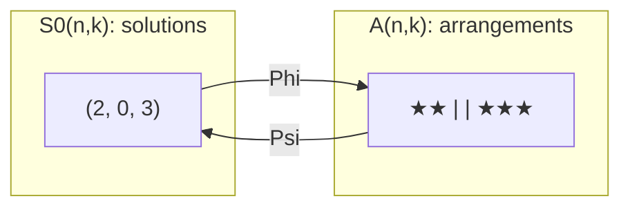
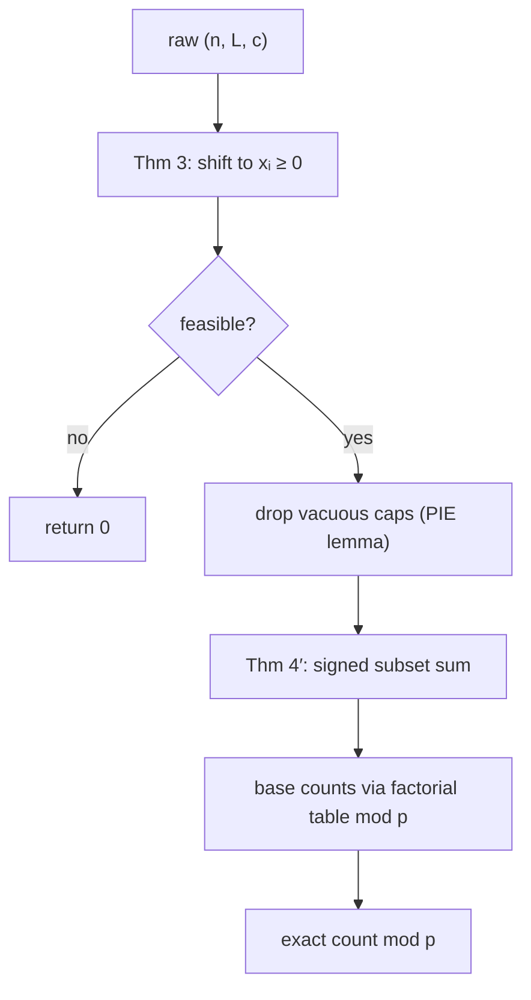

# Stars and Bars — Mathematical Foundations and Complexity

> **One-line summary:** This file proves, rigorously, that the number of non-negative integer solutions of `x₁ + … + x_k = n` is exactly `C(n + k − 1, k − 1)` (via an explicit bijection), derives the positive-solution count `C(n − 1, k − 1)`, derives the bounded-variable count by inclusion–exclusion, connects all of it to generating functions, and analyzes the complexity of computing the result both exactly and modulo a prime.

---

## Table of Contents

1. [Formal Definitions](#formal-definitions)
2. [The Bijection Theorem and Proof](#the-bijection-theorem)
3. [The Positive-Solution Count](#the-positive-solution-count)
4. [Lower Bounds via Affine Substitution](#lower-bounds-substitution)
5. [The Bounded-Variable Count (Inclusion–Exclusion)](#bounded-variable-count)
6. [Generating-Function Derivation](#generating-function-derivation)
7. [The Twelvefold-Way Placement](#twelvefold-way)
8. [Identities and Corollaries](#identities-and-corollaries)
9. [Formal Inclusion–Exclusion Foundation](#formal-pie-foundation)
10. [Edge Cases and Degeneracies](#edge-cases)
11. [Complexity Analysis](#complexity-analysis)
12. [Modular Computation Correctness](#modular-computation-correctness)
13. [Comparison with Alternatives](#comparison-with-alternatives)
14. [Summary](#summary)

---

## Formal Definitions

```text
Fix integers n ≥ 0 and k ≥ 1.

Solution set (non-negative):
    S₀(n, k) = { (x₁, …, x_k) ∈ ℤ^k : xᵢ ≥ 0 for all i, and Σ xᵢ = n }.

Solution set (positive):
    S₁(n, k) = { (x₁, …, x_k) ∈ ℤ^k : xᵢ ≥ 1 for all i, and Σ xᵢ = n }.

Arrangement set:
    A(n, k) = the set of strings over the alphabet {★, |} containing exactly
              n copies of ★ and exactly (k − 1) copies of |.

Goal: |S₀(n, k)| = C(n + k − 1, k − 1).
```

A string in `A(n, k)` has length `n + (k − 1)`. It is determined uniquely by the choice of which `k − 1` of the `n + k − 1` positions hold a bar; hence `|A(n, k)| = C(n + k − 1, k − 1)` by definition of the binomial coefficient (the number of `(k−1)`-subsets of an `(n+k−1)`-set).

---

## The Bijection Theorem

> **Theorem 1.** `|S₀(n, k)| = |A(n, k)| = C(n + k − 1, k − 1)`.

**Proof (explicit bijection).**

Define `Φ : S₀(n, k) → A(n, k)` by

```
Φ(x₁, …, x_k) = ★^{x₁} | ★^{x₂} | … | ★^{x_k}
```

i.e. write `x₁` stars, a bar, `x₂` stars, a bar, …, a bar, then `x_k` stars. The result uses `Σxᵢ = n` stars and `k − 1` bars, so `Φ(x) ∈ A(n, k)`. The map is well defined.

Define `Ψ : A(n, k) → S₀(n, k)` by reading a string `w ∈ A(n, k)` and letting `xᵢ` be the number of stars strictly between the `(i−1)`-th and `i`-th bars (with the string's start acting as a virtual "0-th bar" and its end as a virtual "k-th bar"). Each `xᵢ ≥ 0` (a run may be empty), and `Σxᵢ = n` because every star lies in exactly one run. So `Ψ(w) ∈ S₀(n, k)`.

**`Ψ ∘ Φ = id`:** Applying `Φ` to `x` produces a string whose `i`-th run has exactly `xᵢ` stars; reading those runs back gives `xᵢ`. Hence `Ψ(Φ(x)) = x`.

**`Φ ∘ Ψ = id`:** Applying `Ψ` to `w` records the run lengths; rewriting `★^{x₁}|…|★^{x_k}` reconstructs `w` symbol for symbol, because a string in `A(n,k)` is fully described by its `k` star-run lengths in order. Hence `Φ(Ψ(w)) = w`.

Since `Φ` and `Ψ` are mutually inverse, they are bijections, so `|S₀(n, k)| = |A(n, k)|`. And `|A(n, k)| = C(n + k − 1, k − 1)` because choosing the arrangement is choosing the `k − 1` bar positions among `n + k − 1` slots. ∎

**Remark (symmetry).** Equivalently one may choose the `n` star positions, giving `|A(n,k)| = C(n + k − 1, n)`; `C(n+k−1, k−1) = C(n+k−1, n)` confirms the two forms agree.



### Fully traced example of the bijection

To see that `Φ` and `Ψ` really are inverse, trace every element of a small instance. Take `n = 2`, `k = 3`; Theorem 1 predicts `C(2 + 3 − 1, 3 − 1) = C(4, 2) = 6` solutions, and indeed `S₀(2, 3)` and `A(2, 3)` each have six elements:

```text
solution (x1,x2,x3) ∈ S0(2,3)   --Φ-->   arrangement ∈ A(2,3)   --Ψ-->   back to solution
       (2, 0, 0)                          ★★ | |                          (2, 0, 0)
       (0, 2, 0)                          | ★★ |                          (0, 2, 0)
       (0, 0, 2)                          | | ★★                          (0, 0, 2)
       (1, 1, 0)                          ★ | ★ |                          (1, 1, 0)
       (1, 0, 1)                          ★ | | ★                          (1, 0, 1)
       (0, 1, 1)                          | ★ | ★                          (0, 1, 1)
```

Every arrangement is a length-`4` string with exactly `2` stars and `2` bars, and there are `C(4, 2) = 6` such strings — the rows of the table are *all* of them. The third column reproduces the first column exactly, which is the content of `Ψ ∘ Φ = id`; reading any middle-column string by its run lengths and re-emitting `★^{x₁}|★^{x₂}|★^{x₃}` reproduces the same string, which is `Φ ∘ Ψ = id`. No solution is missing and none is counted twice, so the bijection is total — this is exactly what a proof by explicit construction buys over a proof by formula manipulation.

### Alternative proof by induction on `k`

The bijection is the cleanest argument, but an inductive proof is worth recording because it generalizes to weighted variants. Let `f(n, k) = |S₀(n, k)|`.

```text
Base k = 1:  Σx₁ = n with x₁ ≥ 0 has the single solution (n);
             f(n, 1) = 1 = C(n + 0, 0).            ✓

Step:   condition on the last coordinate x_k = j, for j = 0, 1, …, n.
        The remaining coordinates satisfy x₁ + … + x_{k-1} = n − j, xᵢ ≥ 0,
        of which there are f(n − j, k − 1).  Hence

            f(n, k) = Σ_{j=0}^{n} f(n − j, k − 1).

        Assume f(m, k − 1) = C(m + k − 2, k − 2) for all m ≤ n.  Then

            f(n, k) = Σ_{m=0}^{n} C(m + k − 2, k − 2)
                    = C(n + k − 1, k − 1)      (hockey-stick identity).
```

The final step is the hockey-stick (column-sum) identity for binomial coefficients (sibling `23-binomial-coefficients`): summing a fixed lower index down a column telescopes to the next coefficient. So the recurrence `f(n, k) = Σ_j f(n − j, k − 1)` plus the hockey-stick identity reproduces Theorem 1 without ever drawing a star — useful when the cells of a problem are weighted and the bijection is no longer available.

---

## The Positive-Solution Count

> **Theorem 2.** For `n ≥ k ≥ 1`, `|S₁(n, k)| = C(n − 1, k − 1)`. For `n < k`, `|S₁(n, k)| = 0`.

**Proof (bijection by shifting).** Define `T : S₁(n, k) → S₀(n − k, k)` by `T(x₁, …, x_k) = (x₁ − 1, …, x_k − 1)`. Since each `xᵢ ≥ 1`, each `xᵢ − 1 ≥ 0`, and `Σ(xᵢ − 1) = n − k`. The inverse `T^{-1}(y) = (y₁ + 1, …, y_k + 1)` maps `S₀(n − k, k)` back into `S₁(n, k)`. Both are well defined and mutually inverse, so `T` is a bijection and

```
|S₁(n, k)| = |S₀(n − k, k)| = C((n − k) + k − 1, k − 1) = C(n − 1, k − 1).
```

When `n < k`, `n − k < 0`, so `S₀(n − k, k) = ∅` and the count is `0`. ∎

**Alternative proof (gaps).** Lay `n` stars in a row; there are `n − 1` internal gaps. A composition into `k` positive parts is a choice of `k − 1` of those gaps to "cut", giving `C(n − 1, k − 1)` directly. This gap argument is the combinatorial twin of the shift bijection.

---

## Lower Bounds via Substitution

> **Theorem 3.** The number of integer solutions of `Σxᵢ = n` with `xᵢ ≥ Lᵢ` (for fixed integers `Lᵢ`) equals `C(n − ΣLᵢ + k − 1, k − 1)`, interpreted as `0` when `n − ΣLᵢ < 0`.

**Proof.** The affine substitution `yᵢ = xᵢ − Lᵢ` is a bijection `ℤ^k → ℤ^k` carrying the constraint `xᵢ ≥ Lᵢ` to `yᵢ ≥ 0` and the equation `Σxᵢ = n` to `Σyᵢ = n − ΣLᵢ`. Hence solutions of the bounded system biject with `S₀(n − ΣLᵢ, k)`, whose size is `C(n − ΣLᵢ + k − 1, k − 1)` by Theorem 1. ∎

This subsumes Theorem 2 (take all `Lᵢ = 1`, giving `C(n − k + k − 1, k − 1) = C(n − 1, k − 1)`), and it shows lower bounds require **no** inclusion–exclusion: a single affine shift suffices.

---

## Bounded-Variable Count

We now derive the count with **upper** bounds, where the clean bijection fails and inclusion–exclusion is required.

> **Theorem 4 (single uniform cap).** The number of solutions of `Σxᵢ = n` with `0 ≤ xᵢ ≤ c` for all `i` is
>
> ```
> N(n, k, c) = Σ_{t=0}^{k} (−1)^t · C(k, t) · C(n − t(c+1) + k − 1, k − 1),
> ```
>
> where binomials with negative top are `0`.

**Proof (inclusion–exclusion).** Let `U = S₀(n, k)` be the universe of non-negative solutions, `|U| = C(n+k−1, k−1)`. For each `i`, let

```
Aᵢ = { x ∈ U : xᵢ ≥ c + 1 }   ("box i overflows its cap").
```

A solution is **valid** (all `xᵢ ≤ c`) iff it lies in none of the `Aᵢ`, i.e. in `U \ ⋃ Aᵢ`. By the inclusion–exclusion principle (sibling `26-inclusion-exclusion`),

```
|U \ ⋃ Aᵢ| = Σ_{S ⊆ {1,…,k}} (−1)^{|S|} · |⋂_{i∈S} Aᵢ|.
```

**Evaluate `|⋂_{i∈S} Aᵢ|`.** Membership in `⋂_{i∈S} Aᵢ` means `xᵢ ≥ c + 1` for every `i ∈ S`. By the lower-bound substitution (Theorem 3) applied to the boxes in `S` (each with lower bound `c + 1`, the rest with `0`),

```
|⋂_{i∈S} Aᵢ| = C(n − |S|(c+1) + k − 1, k − 1).
```

This depends on `S` only through `|S| = t`, and there are `C(k, t)` subsets of size `t`. Grouping the `2^k` subset terms by `t` gives

```
|U \ ⋃ Aᵢ| = Σ_{t=0}^{k} (−1)^t · C(k, t) · C(n − t(c+1) + k − 1, k − 1).   ∎
```

> **Theorem 4′ (general caps).** With caps `xᵢ ≤ cᵢ`,
>
> ```
> N = Σ_{S ⊆ {1,…,k}} (−1)^{|S|} · C(n − Σ_{i∈S}(cᵢ + 1) + k − 1, k − 1).
> ```

The proof is identical except the forced amount `Σ_{i∈S}(cᵢ + 1)` differs per subset, so terms no longer collapse by size and the sum genuinely ranges over subsets.

### Worked verification

`N(10, 3, 4)`:

```
t=0: +C(3,0)·C(12,2) = 1·66 = 66
t=1: −C(3,1)·C(7,2)  = −3·21 = −63
t=2: +C(3,2)·C(2,2)  = +3·1 = +3
t=3: −C(3,3)·C(−3,2) = 0
N = 66 − 63 + 3 = 6.
```

Direct enumeration: tuples of `(≤4,≤4,≤4)` summing to `10` are the permutations of `(4,4,2)` and `(4,3,3)`, i.e. `3 + 3 = 6`. ✓

### Worked verification with mixed caps (Theorem 4′)

Mixed caps exercise the subset form, where terms no longer collapse by size. Count `x₁ + x₂ + x₃ = 7` with `x₁ ≤ 3`, `x₂ ≤ 2`, `x₃ ≤ 5` (the third interview example). The forced amount for box `i` is `cᵢ + 1`, i.e. `4, 3, 6`:

```text
S = ∅          : +C(7 + 2, 2)            = +C(9,2)  = +36
S = {1}        : −C(7−4 + 2, 2)          = −C(5,2)  = −10
S = {2}        : −C(7−3 + 2, 2)          = −C(6,2)  = −15
S = {3}        : −C(7−6 + 2, 2)          = −C(3,2)  = −3
S = {1,2}      : +C(7−4−3 + 2, 2)        = +C(2,2)  = +1
S = {1,3}      : +C(7−4−6 + 2, 2)  → top −1 < 2     = 0
S = {2,3}      : +C(7−3−6 + 2, 2)  → top 0 < 2      = 0
S = {1,2,3}    : −C(7−4−3−6 + 2, 2) → negative top  = 0
N = 36 − 10 − 15 − 3 + 1 = 9.
```

Direct enumeration confirms `9`: the valid triples are the permutations-with-constraints summing to `7` under `(≤3, ≤2, ≤5)`, e.g. `(0,2,5), (1,1,5), (1,2,4), (2,0,5), (2,1,4), (2,2,3), (3,0,4), (3,1,3), (3,2,2)` — exactly nine. The three subsets whose forced amount exceeds `n` contribute zero, which is why the general-cap sum, though nominally `2^k` terms, is dominated by the few subsets that fit under `n`.

---

## Generating-Function Derivation

Theorems 1–4 also fall out of generating functions, which is the cleanest unifying view (sibling `22-polynomial-operations`).

**Non-negative case.** Each box `i` contributes a factor `Σ_{xᵢ ≥ 0} z^{xᵢ} = 1/(1 − z)`. The number of solutions of `Σxᵢ = n` is the coefficient of `z^n` in the product:

```
[z^n] ( 1/(1 − z) )^k = [z^n] (1 − z)^{-k}.
```

By the **generalized binomial theorem**, `(1 − z)^{-k} = Σ_{n ≥ 0} C(n + k − 1, k − 1) z^n`. Hence the coefficient is exactly `C(n + k − 1, k − 1)`, re-deriving Theorem 1.

**Capped case.** A box capped at `c` contributes `1 + z + … + z^c = (1 − z^{c+1})/(1 − z)`. With `k` such boxes,

```
[z^n] ( (1 − z^{c+1})/(1 − z) )^k = [z^n] (1 − z^{c+1})^k · (1 − z)^{-k}.
```

Expand `(1 − z^{c+1})^k = Σ_t (−1)^t C(k, t) z^{t(c+1)}` and multiply by the series for `(1−z)^{-k}`; the coefficient of `z^n` is

```
Σ_t (−1)^t C(k, t) · [z^{n − t(c+1)}] (1 − z)^{-k}
  = Σ_t (−1)^t C(k, t) · C(n − t(c+1) + k − 1, k − 1),
```

which is exactly Theorem 4. The generating function makes the inclusion–exclusion sign pattern manifest: it is the expansion of `(1 − z^{c+1})^k`.

```text
Identity used:  (1 − z)^{-k} = Σ_{n≥0} C(n+k−1, k−1) z^n     (generalized binomial)
```

### Why `(1 − z)^{-k}` has those coefficients

The identity above is the one load-bearing fact of the generating-function view, so it deserves its own derivation rather than a citation. Newton's generalized binomial theorem says, for any real `α`,

```
(1 + u)^α = Σ_{n≥0} C(α, n) u^n,     C(α, n) = α(α−1)…(α−n+1) / n!.
```

Substitute `α = −k` (a negative integer) and `u = −z`:

```
C(−k, n) = (−k)(−k−1)…(−k−n+1) / n!
         = (−1)^n · k(k+1)…(k+n−1) / n!
         = (−1)^n · C(n + k − 1, n).
```

Therefore the `z^n` coefficient of `(1 − z)^{-k} = (1 + (−z))^{-k}` is `C(−k, n)·(−1)^n = C(n + k − 1, n) = C(n + k − 1, k − 1)`. The two `(−1)^n` factors cancel — the negative-exponent expansion is *exactly* the stars-and-bars count, with the sign absorbed. This is the analytic shadow of the bijection: the same numbers arise whether you count arrangements or read Taylor coefficients.

### The product rule as "independent boxes"

The factorization `(1 − z)^{-k} = ∏_{i=1}^{k} (1 − z)^{-1}` mirrors the combinatorial structure precisely: multiplying generating functions convolves their coefficient sequences, and convolution over `Σxᵢ = n` is exactly "choose how the total `n` splits across independent boxes." Each factor `(1 − z)^{-1} = 1 + z + z^2 + …` is the catalogue of one box (it may receive `0, 1, 2, …` items, each with weight `1`). This "one factor per box" discipline is what makes generating functions extend cleanly to the cases stars-and-bars cannot: a weighted box becomes `1/(1 − z^{w})`, a capped box becomes a finite polynomial, and a box that must be non-empty becomes `z/(1 − z)`. Reading off `[z^n]` of the product always answers the count.

---

## Twelvefold Way

Stars and bars occupies specific cells of Stanley's **twelvefold way**, which classifies "balls into boxes" by whether balls/boxes are distinguishable and whether the map is unrestricted / injective / surjective.

| Balls | Boxes | Any map | Injective (`≤1`/box) | Surjective (`≥1`/box) |
|-------|-------|---------|----------------------|------------------------|
| distinct (`n`) | distinct (`k`) | `k^n` | `k!/(k−n)!` | `k! · S(n, k)` |
| **identical (`n`)** | **distinct (`k`)** | **`C(n+k−1, k−1)`** | `C(k, n)` | **`C(n−1, k−1)`** |
| distinct (`n`) | identical (`k`) | `Σ S(n, j)` | `[n ≤ k]` | `S(n, k)` |
| identical (`n`) | identical (`k`) | partitions `≤ k` parts | `[n ≤ k]` | partitions into `k` parts |

The bolded row is precisely stars and bars: **identical balls into distinct boxes**, with "any map" → `C(n+k−1, k−1)` (Theorem 1) and "surjective" → `C(n−1, k−1)` (Theorem 2). The neighbouring rows are the anti-patterns of the senior file: distinct balls give powers and Stirling numbers `S(n,k)`; identical boxes give integer partitions.

---

## Identities and Corollaries

**Hockey-stick / total over `k`.** Summing the positive count over `k`:

```
Σ_{k=1}^{n} C(n − 1, k − 1) = Σ_{j=0}^{n−1} C(n − 1, j) = 2^{n−1},
```

the total number of compositions of `n` (each of the `n−1` gaps is independently cut or not).

**Vandermonde-style decomposition.** Splitting `k` boxes into two groups gives

```
C(n + k − 1, k − 1) = Σ_{j=0}^{n} C(j + a − 1, a − 1) · C((n−j) + b − 1, b − 1),   a + b = k,
```

which is the convolution `(1−z)^{-a}(1−z)^{-b} = (1−z)^{-(a+b)}` read off coefficients — an instance of Vandermonde's identity. Combinatorially: partition the `k` boxes into a left block of `a` and a right block of `b`, condition on how many of the `n` items (`j`) land in the left block, and sum. This is the additive analogue of the multiplicative box-splitting, and it gives a divide-and-conquer route to the count when `k` is structured.

**Absorption / committee identity.** From `(k−1)·C(n+k−1, k−1) = (n+k−1)·C(n+k−2, k−2)` (the absorption identity for binomials, sibling `23-binomial-coefficients`) one obtains a single-step recurrence in `k` alone, useful for streaming the counts `f(n, 1), f(n, 2), …` without recomputing each factorial: each successive count is the previous times a rational factor `(n+k−1)/(k−1)`. Because the running value is always an integer (it is a binomial coefficient), the division is exact at every step — the same exactness argument as the multiplicative loop in the complexity section.

**Reflection / upper negation.** Writing `C(n + k − 1, n)` and applying upper negation `C(m, r) = (−1)^r C(r − m − 1, r)` recovers the `(1 − z)^{-k}` coefficient sign analysis of the generating-function section, linking the two derivations: the negative-exponent expansion and the integer count are the *same identity* viewed from opposite ends.

**Diagonal sum (parallel summation).** Fixing the total `n` and summing the non-negative count as the box count `k` ranges, `Σ_{k=0}^{K} C(n + k − 1, k) = C(n + K, K)`, another hockey-stick instance. It answers "how many ways to distribute at most `n` items into *up to* `K` boxes" in one binomial, and is the box-count dual of the item-count inequality identity above.

**Inequality count.** The number of solutions with `Σxᵢ ≤ n`, `xᵢ ≥ 0`, equals `C(n + k, k)` (add a slack box `x_{k+1} = n − Σxᵢ ≥ 0`, then apply Theorem 1 with `k + 1` boxes and total `n`). Equivalently `Σ_{m=0}^{n} C(m + k − 1, k − 1) = C(n + k, k)` (hockey-stick identity).

**Pascal recurrence in two variables.** The count itself satisfies a Pascal-style recurrence that mirrors the inductive proof: `f(n, k) = f(n − 1, k) + f(n, k − 1)`, with `f(0, k) = 1` and `f(n, 1) = 1`. The first term covers "box `k` receives at least one item" (peel one unit off, keep `k` boxes), the second "box `k` receives nothing" (drop the box). This is exactly Pascal's rule `C(m, r) = C(m−1, r) + C(m−1, r−1)` (sibling `23-binomial-coefficients`) re-indexed through `m = n + k − 1`, `r = k − 1`, and it is the basis of the `O(n·k)` DP alternative when no modular table is available.

---

## Formal PIE Foundation

Theorem 4 invoked the inclusion–exclusion principle; this section states it precisely so the capped derivation rests on a named theorem rather than a hand-wave (full treatment in sibling `26-inclusion-exclusion`).

> **Inclusion–Exclusion Principle.** For finite sets `A₁, …, A_k` inside a universe `U`,
>
> ```
> |U \ (A₁ ∪ … ∪ A_k)| = Σ_{S ⊆ {1,…,k}} (−1)^{|S|} · |⋂_{i∈S} Aᵢ|,
> ```
>
> with the empty intersection `⋂_{i∈∅} Aᵢ = U` contributing `+|U|`.

**Why it applies cleanly here.** The capped problem has a property that makes PIE especially well behaved: the "bad events" `Aᵢ = {xᵢ ≥ cᵢ + 1}` are defined by *independent lower bounds on distinct coordinates*. Consequently any intersection `⋂_{i∈S} Aᵢ` is again a stars-and-bars instance — it forces `cᵢ + 1` into each box of `S` and leaves the rest free — so every term in the PIE expansion is itself a binomial computable by Theorem 3. There is no residual "messy" intersection to handle, which is what makes the whole count a *closed-form signed sum* rather than a recursive descent. Contrast this with PIE applications where intersections grow combinatorially complex (e.g. counting surjections, sibling `26`); stars-and-bars caps are the friendly case.

**Sign-cancellation sanity check.** Setting every `cᵢ = n` (vacuous caps) must recover `|U|`. Each `Aᵢ = {xᵢ ≥ n + 1}` is then empty, so every term with `|S| ≥ 1` is `0`, leaving only the `S = ∅` term `+C(n+k−1, k−1)`. This is the same vacuous-cap invariant the senior file asserts at runtime, here proven from the PIE statement: empty bad-events collapse the signed sum to the unconstrained count.

---

## Edge Cases

A rigorous treatment must pin down the boundary values, where naive code most often diverges from the combinatorial truth.

| Input | Correct count | Reason |
|-------|--------------|--------|
| `n = 0`, `k ≥ 1` | `1` | All boxes zero; `C(k−1, k−1) = 1`. |
| `n ≥ 1`, `k = 0` | `0` | No boxes can hold a positive total; `C(n−1, −1) = 0`. |
| `n = 0`, `k = 0` | `1` | Empty sum equals `0`; the empty tuple is the unique solution; `C(−1, −1) := 1` by convention. |
| `n < 0` (any `k`) | `0` | No non-negative tuple sums to a negative; binomial with negative top is `0`. |
| positive count, `n < k` | `0` | Cannot give every box `≥ 1`; Theorem 2 gives `C(n−1, k−1) = 0`. |
| cap `c < 0` on some box | `0` | That box admits no value; the whole system is infeasible. |
| lower bound with `ΣLᵢ > n` | `0` | Substitution yields negative total `n − ΣLᵢ`. |

The two subtle conventions are `C(m, r) = 0` whenever `r < 0` or `r > m` (which makes the negative-top and over-large-bottom rows fall out automatically) and `C(−1, −1) := 1` for the doubly-empty instance. A correct binomial helper that returns `0` for out-of-range arguments — exactly the guard in every code sample in this topic — handles all but the last row without special-casing, which is why that guard is not optional decoration but a correctness requirement.

---

## Complexity Analysis

```text
Let N = n + k. Let r = min(k − 1, n) be the chosen binomial lower index.

(1) Exact single count C(n+k−1, k−1):
      multiplicative loop: r multiply-divide steps with exact division
      Time  = O(r) = O(min(k, n)) big-integer ops.
      The result has Θ(min(k,n)·log N) bits, so each op is O(M(min(k,n)·log N))
      under fast multiplication M(·); for word-size results it is O(r).

(2) Capped count, uniform cap c (Theorem 4):
      number of nonzero PIE terms = ⌊n/(c+1)⌋ + 1 ≤ k + 1.
      Time  = O((k+1) · cost(C)).

(3) Capped count, varied caps (Theorem 4′):
      up to 2^k subset terms (pruned to those with forced ≤ n).
      Time  = O(2^k · cost(C))  worst case.

(4) Modular pipeline (prime p, p > N):
      precompute fact[0..N], invFact[0..N]:  O(N) time, O(N) space,
        using ONE modular exponentiation (Fermat) + one linear backward pass.
      each C(m, r) mod p:                     O(1).
      a uniform-cap count:                    O(k) after precompute.
```

**Why exact division stays integral.** In the loop `r ← r · (m − i) / (i + 1)`, after processing `i+1` factors the value equals `C(m_partial, i+1)`, an integer; the product of `i+1` consecutive integers `(m)(m−1)…(m−i)` is always divisible by `(i+1)!`, and dividing one factor `(i+1)` at a time keeps every prefix an integer (the running value is itself a binomial coefficient). Hence no rounding error and no need for big rationals.

**Lower bound on output size.** `C(n+k−1, k−1)` can be exponentially large in `min(k, n)` (roughly `2^{Θ(min(k,n))}` for balanced parameters), so any algorithm that *writes the exact value* must take `Ω(min(k, n))` time just to emit the digits. The multiplicative loop is therefore output-optimal up to the cost of arithmetic. The modular version sidesteps this by returning a single residue in `O(1)` post-precompute.

### Asymptotic size of the count

For intuition about *how* large the exact value gets — which dictates whether you need big integers and how many PIE terms ever fire — apply Stirling's approximation to the central case `n = k`:

```
C(2k − 1, k − 1) = (1/2) · C(2k, k) ≈ (1/2) · 4^k / √(π k).
```

So a balanced count grows like `4^k / √k`, i.e. `Θ(k)` bits — roughly `2k` binary digits, or `0.6k` decimal digits. Concretely `C(199, 99) ≈ 4.5·10^{58}`, a `59`-digit number; emitting it exactly is unavoidable work, and this is precisely why the modular residue is the production representation. The same Stirling estimate bounds the number of *binding* caps that can ever matter: a cap `c` is binding only when `c < n`, and the forced amount `t(c+1)` must stay `≤ n`, so at most `⌊n/(c+1)⌋ + 1` PIE terms are nonzero regardless of how many boxes nominally carry caps. The exponential `2^k` worst case for varied caps is therefore reached only when `k` is small enough that every cap fits — large-`k` instances are self-limiting.

### Worked complexity comparison across regimes

| Regime | Exact (big-int) | Modular (after `O(N)` precompute) |
|--------|-----------------|-----------------------------------|
| Plain `C(n+k−1, k−1)` | `O(min(k,n))` multiply/divide | `O(1)` |
| Lower bounds only | `O(min(k,n))` after one shift | `O(1)` |
| Uniform cap `c` | `O((⌊n/(c+1)⌋+1)·min(k,n))` | `O(⌊n/(c+1)⌋+1) ≤ O(k)` |
| Varied caps, `b` binding | `O(2^b · min(k,n))` | `O(2^b)` |
| Inequality `Σ ≤ n` | `O(min(k,n))` with slack box | `O(1)` |

The modular column strips a factor of `min(k, n)` from every row because each base binomial drops from a `min(k,n)`-step loop to a single `O(1)` table lookup. This is the entire engineering case for the factorial-table pipeline: it converts the per-binomial cost from "proportional to the smaller parameter" to constant, after which only the *number of PIE terms* — never the binomial size — drives the runtime.

---

## Modular Computation Correctness

> **Proposition.** For prime `p` and `0 ≤ r ≤ m < p`, the value `fact[m] · invFact[r] · invFact[m−r] mod p` equals `C(m, r) mod p`, where `invFact[i] ≡ (i!)^{-1} (mod p)`.

**Proof.** Since `p` is prime and `m < p`, none of `1, …, m` is divisible by `p`, so `m!`, `r!`, `(m−r)!` are all units mod `p` (invertible). By Fermat's little theorem (sibling `05-fermat-euler`), `(j!)^{-1} ≡ (j!)^{p−2} (mod p)`, and the recurrence `invFact[i−1] = invFact[i]·i` is correct because `((i−1)!)^{-1} = (i!)^{-1} · i`. Then

```
fact[m]·invFact[r]·invFact[m−r] ≡ m! · (r!)^{-1} · ((m−r)!)^{-1}
                                ≡ m! / (r!(m−r)!) = C(m, r)   (mod p).   ∎
```

**Boundary `m ≥ p`.** If `m ≥ p`, then `p | m!`, so `fact[m] ≡ 0` and the formula returns `0`, which is *correct only by accident* and generally wrong for `C(m, r) mod p` (which may be nonzero). The remedy is **Lucas' theorem** (sibling `24-lucas-theorem`):

```
C(m, r) ≡ ∏_j C(m_j, r_j) (mod p),   where m = Σ m_j p^j, r = Σ r_j p^j  (base-p digits),
```

each digit-binomial `C(m_j, r_j)` having `m_j, r_j < p` and thus computable by the factorial table. For composite moduli, factor and recombine by CRT (siblings `06-crt`, `17-garner-algorithm`).

### Worked Lucas example for a stars-and-bars count

Suppose `p = 7` and we want the non-negative count for `n = 9`, `k = 4`, i.e. `C(9 + 4 − 1, 4 − 1) = C(12, 3) = 220`, reduced mod `7`. A factorial table mod `7` cannot help directly because `12 ≥ 7` makes `fact[12] ≡ 0`. Lucas in base `7`:

```text
m = 12 = (1, 5)_7      (12 = 1·7 + 5)
r =  3 = (0, 3)_7      ( 3 = 0·7 + 3)

C(12, 3) ≡ C(1, 0) · C(5, 3)  (mod 7)
         ≡ 1 · 10
         ≡ 3        (mod 7).
```

Check: `220 = 31·7 + 3`, so `220 ≡ 3 (mod 7)`. ✓ The digit-binomials `C(1,0) = 1` and `C(5,3) = 10` both have arguments below `7`, so a tiny factorial table mod `7` evaluates them in `O(1)`; Lucas multiplies the `O(log_p m)` digit results. This is the standard escape hatch whenever the stars-and-bars top index `n + k − 1` can exceed a small modulus.

### Correctness of the inverse-factorial recurrence

The single subtlety in the `O(N)` pipeline is computing all inverse factorials from one Fermat power. The recurrence `invFact[i−1] = invFact[i] · i (mod p)` is justified by reading `invFact[i] ≡ (i!)^{-1}` and observing that `(i!)^{-1} · i = (i · (i−1)!)^{-1} · i = ((i−1)!)^{-1} = invFact[i−1]`, where the cancellation `i · i^{-1} ≡ 1` uses that `i` is a unit mod `p` (true for all `1 ≤ i ≤ N < p`). Starting from `invFact[N] = (N!)^{-1} = fact[N]^{p−2}` (one Fermat exponentiation, sibling `05-fermat-euler`) and descending, every `invFact[i]` is correct by downward induction. This replaces `N` separate `O(log p)` inversions with one, the decisive constant-factor that makes the precompute genuinely `O(N)` rather than `O(N log p)`.

---

## Comparison with Alternatives

| Attribute | Stars & Bars (Thm 1/4) | Generating functions | DP over (box, partial sum) |
|-----------|------------------------|----------------------|----------------------------|
| Worst-case time | O(min(k,n)) exact; O(1) mod p per base count | O(n·k) coefficient extraction | O(n·k) |
| Space | O(1) exact; O(N) table mod p | O(n) polynomial | O(n) |
| Handles upper bounds | Yes, via PIE (`≤ k+1` or `2^k` terms) | Yes, `(1−z^{c+1})^k` factor | Yes |
| Handles weighted boxes | No | Yes | Yes |
| Closed form | Yes | Coefficient (no closed form generally) | No |
| Deterministic | Yes | Yes | Yes |

Generating functions are the *most general* lens (they prove every stars-and-bars identity as a coefficient extraction) but give a closed form only in the unweighted case — which is exactly where stars and bars wins with its single binomial.

---

## From Theorems to a Verified Algorithm

The four theorems compose into one decision procedure whose correctness is the conjunction of their proofs. Stated as a recipe with its justification attached:

```text
INPUT:  n, k, lower bounds L[1..k], upper caps c[1..k]   (caps optional)
OUTPUT: number of integer solutions of Σxᵢ = n with Lᵢ ≤ xᵢ ≤ cᵢ, mod p

1. n ← n − Σ Lᵢ;  cᵢ ← cᵢ − Lᵢ           # Theorem 3: affine shift to xᵢ ≥ 0
2. if n < 0 or any cᵢ < 0: return 0       # infeasible (Edge Cases table)
3. binding ← { i : cᵢ < n }               # vacuous caps drop (PIE sign-cancellation)
4. answer ← Σ_{S ⊆ binding} (−1)^{|S|} ·
              C(n − Σ_{i∈S}(cᵢ+1) + k − 1, k − 1)   # Theorem 4′
5. return answer mod p                     # base binomials via factorial table
```

**Termination and correctness.** Step 4's outer loop is finite (at most `2^{|binding|}` subsets), and each binomial is a finite `O(1)` table lookup, so the procedure halts. Correctness is layered: step 1 is the bijection of Theorem 3 (lower bounds add nothing combinatorially, they only translate the lattice); step 3 is justified by the PIE sign-cancellation lemma (vacuous caps yield empty bad-events, contributing zero); step 4 is Theorem 4′ verbatim; step 5 is the modular-correctness proposition for primes `p > n + k`. Each step is a *bijection or a proven identity*, so the composition computes the exact count — there is no approximation anywhere in the chain. This is why the topic's code samples need no tolerance checks: every line corresponds to a theorem.



---

## Summary

The non-negative count `|S₀(n, k)| = C(n + k − 1, k − 1)` is proven by the explicit, mutually inverse bijection `Φ/Ψ` between solution tuples and star/bar arrangements (Theorem 1); choosing the `k − 1` bar positions among `n + k − 1` slots is the entire content. The positive count `C(n − 1, k − 1)` follows by the shift bijection `xᵢ ↦ xᵢ − 1` (Theorem 2), and arbitrary lower bounds by the affine substitution `yᵢ = xᵢ − Lᵢ` (Theorem 3) — no inclusion–exclusion needed. Upper bounds break the bijection and require inclusion–exclusion over the overflow events `Aᵢ`, producing the signed sum `Σ(−1)^t C(k, t) C(n − t(c+1) + k − 1, k − 1)` (Theorem 4), which the generating function `((1 − z^{c+1})/(1 − z))^k` re-derives with its sign pattern made explicit. Stars and bars occupies the *identical-balls / distinct-boxes* row of the twelvefold way. Computationally, the exact value costs `Θ(min(k, n))` — output-optimal — while the modular version is `O(1)` per base count after an `O(N)` factorial precompute whose correctness rests on Fermat's little theorem, with Lucas' theorem (sibling `24`) and CRT (sibling `06`) covering small or composite moduli. Every step of the practical recipe corresponds to a proven bijection or identity, so the computed count is exact, never approximate — the defining property that lets the topic's code dispense with tolerance checks.

### Cross-references

| Sibling topic | Role in this file |
|---------------|-------------------|
| `23-binomial-coefficients` | Pascal's rule, hockey-stick, absorption, and upper-negation identities used in the inductive proof and corollaries; defines `C(m, r)` and its out-of-range `= 0` convention. |
| `26-inclusion-exclusion` | The named principle behind Theorem 4/4′; stars-and-bars caps are the "friendly" PIE case where every intersection is again a binomial. |
| `05-fermat-euler` | Fermat's little theorem underpinning the inverse-factorial pipeline. |
| `24-lucas-theorem` | Digit-wise binomials mod a small prime when `n + k − 1 ≥ p`. |
| `06-crt`, `17-garner-algorithm` | Recombination of per-prime-power results for composite moduli. |
| `22-polynomial-operations` | Generating-function multiplication = box-convolution; the route to weighted (coin-change) variants. |

---

Next step: continue to [`interview.md`](./interview.md) for tiered question-and-answer practice and a multi-language coding challenge.
