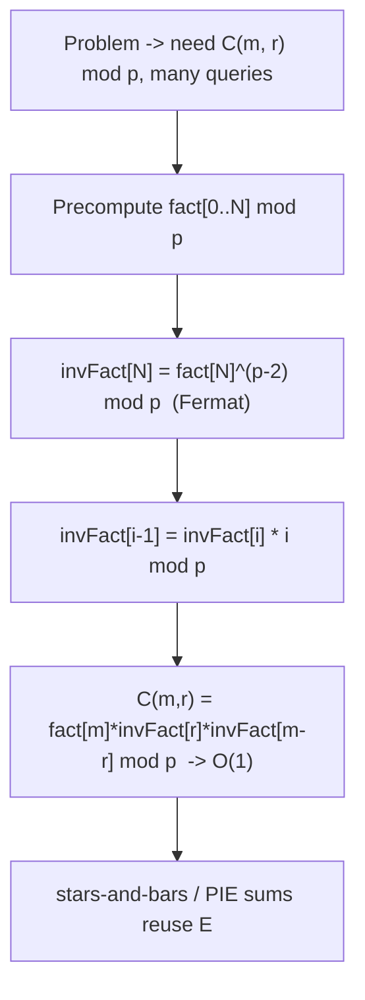
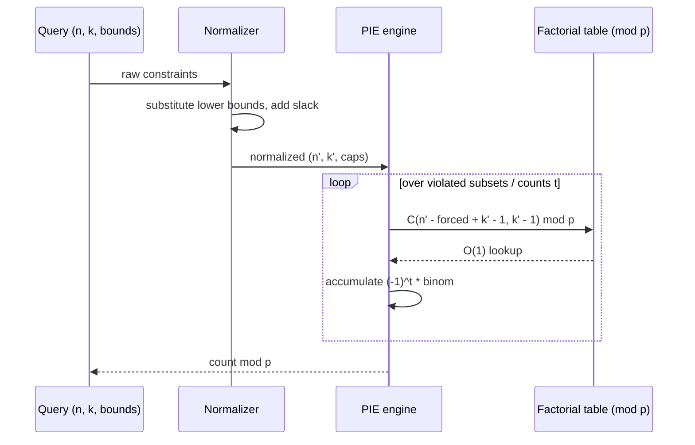
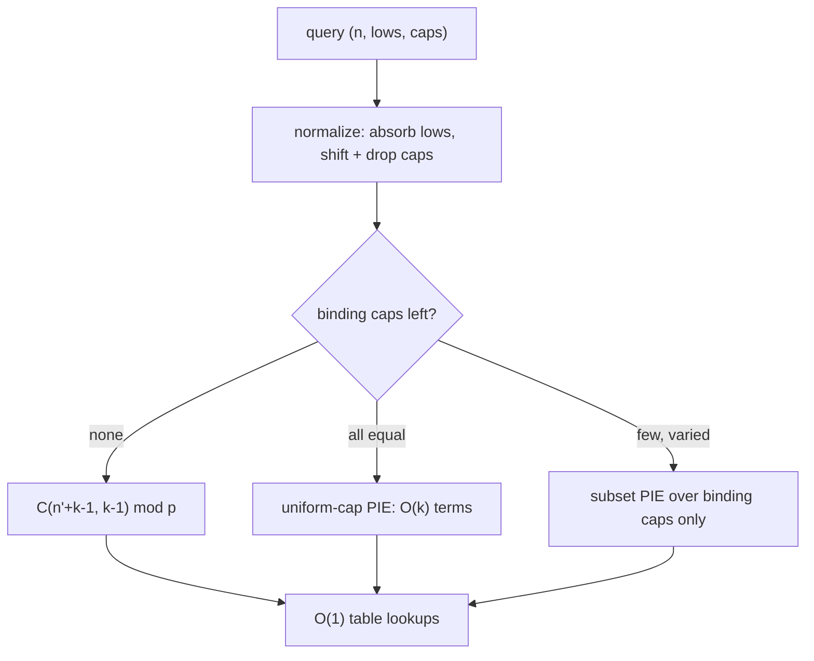

# Stars and Bars — Senior Level

> **One-line summary:** At scale, stars and bars is not a formula you memorize but a **pattern you recognize** inside larger problems — and a **modular-binomial pipeline** you engineer once and reuse. The senior skill set is: spotting the "distribute identical items into distinct bins" shape when it is disguised, decomposing constrained counts into a small inclusion–exclusion sum of binomials, and computing each `C(m, r) mod p` in `O(1)` after an `O(N)` precompute — choosing Fermat inverses, Lucas, or CRT according to the modulus.

---

## Table of Contents

1. [Introduction](#introduction)
2. [Recognizing the Pattern in Disguise](#recognizing-the-pattern)
3. [The Modular Binomial Pipeline](#the-modular-binomial-pipeline)
4. [Choosing the Right Modular Strategy](#choosing-the-right-modular-strategy)
5. [Constrained Counting at Scale](#constrained-counting-at-scale)
6. [Comparison with Alternatives](#comparison-with-alternatives)
7. [Architecture Patterns](#architecture-patterns)
8. [Code Examples](#code-examples)
9. [Observability and Validation](#observability-and-validation)
10. [Failure Modes](#failure-modes)
11. [Summary](#summary)

---

## Introduction

> Focus: "How do I recognize stars and bars inside a 2000-word problem, and how do I make the binomial computation production-grade?"

A senior engineer rarely sees "count the solutions of `x₁ + … + x_k = n`" stated plainly. Instead the problem says *"distribute 12 identical servers across 4 racks"*, or *"how many monomials of degree `d` are there in `v` variables"*, or *"count the ways to make change for `n` using unlimited coins of `k` denominations where order doesn't matter"* (a near-miss — that one is **not** stars and bars, and knowing why matters). The first job is **pattern recognition**: is this *identical items into distinct bins* with only sum constraints? If yes, it collapses to one binomial (plus PIE for caps). If the items are distinguishable, or the bins are identical, or the "weights" differ per bin, it is a different problem.

The second job is **engineering the count**. Competitive and production settings demand the answer **mod a prime**, often with up to `2·10^5` independent queries. That means a reusable factorial/inverse-factorial table and a clear-eyed choice between Fermat-based inverses, Lucas' theorem, and CRT recombination depending on the modulus. This file treats stars and bars as a *component* of a counting system, not an isolated trick.

---

## Recognizing the Pattern

Stars and bars applies **exactly** when all three hold:

1. **Identical items** — the `n` units are indistinguishable (only the *count* per bin matters).
2. **Distinct bins** — the `k` bins are labeled; `(2,3)` differs from `(3,2)`.
3. **Sum (and bound) constraints only** — the only conditions are `Σxᵢ = n` (or `≤ n`), `xᵢ ≥ Lᵢ`, `xᵢ ≤ cᵢ`.

| Disguise | Reduces to | Count |
|----------|-----------|-------|
| "distribute `n` identical balls into `k` labeled urns" | non-negative solutions | `C(n+k−1, k−1)` |
| "monomials of total degree `d` in `v` variables" | exponents `Σaᵢ = d`, `aᵢ ≥ 0` | `C(d+v−1, v−1)` |
| "non-decreasing sequences `1 ≤ a₁ ≤ … ≤ a_m ≤ k`" | multiset of size `m` from `k` types | `C(m+k−1, m)` |
| "lattice paths / `m`-subsets with repetition" | multichoose | `C(m+k−1, m)` |
| "ways to split `n` into `k` ordered positive parts" | compositions | `C(n−1, k−1)` |
| "buy `n` items, `k` flavors, ≥1 of flavor 1, ≤3 of flavor 2" | bounds → substitution + PIE | signed binomial sum |

### A fully worked recognition

*"A bakery sells `k = 5` flavors. A box holds exactly `n = 12` donuts. Flavor 1 must appear at least twice (a promotion); no flavor may appear more than `6` times (stock limit). How many distinct boxes are possible?"*

Walk the recognition checklist:

1. **Identical items?** Donuts of the same flavor are interchangeable — yes.
2. **Distinct bins?** Flavors are labeled — yes.
3. **Constraints?** A lower bound (`x₁ ≥ 2`), upper bounds (`xᵢ ≤ 6`), and a fixed total (`Σ = 12`) — all sum/bound constraints. ✓ Stars and bars applies.

Now reduce:

```text
Step 1 — lower bound: substitute y1 = x1 − 2.
   New total n' = 12 − 2 = 10. Cap on flavor 1 becomes y1 ≤ 6 − 2 = 4.
   Caps now: (4, 6, 6, 6, 6), all over 5 boxes, total 10.
Step 2 — drop vacuous caps: every cap (4 or 6) is < 10, so all are binding.
Step 3 — subset PIE over the 5 caps:
   answer = Σ_{S ⊆ {1..5}} (−1)^{|S|} C(10 − Σ_{i∈S}(cᵢ+1) + 4, 4).
```

This single example exercises every senior move: recognition, lower-bound substitution, cap shifting, vacuous-cap pruning, and inclusion–exclusion. A junior would try to enumerate; a senior writes down the signed sum.

### Anti-patterns: when it is NOT stars and bars

- **Distinguishable items.** "Assign `n` distinct tasks to `k` machines" → each task picks a machine independently → `k^n`, not a binomial.
- **Indistinguishable bins.** "Partition `n` identical items into `k` *unlabeled* groups" → integer partitions `p(n, k)`, no closed form, needs DP.
- **Coin change (unordered).** "Number of ways to make `n` with coins of values `{v₁,…,v_k}`" → coefficient of `x^n` in `∏ 1/(1−x^{vᵢ})` → DP/generating functions (sibling `22-polynomial-operations`), **not** stars and bars, because the weights differ.
- **Order matters with repetition allowed and fixed length** → that is just `k^n` again.

Recognizing the *anti-pattern* is as senior a skill as recognizing the pattern; misapplying `C(n+k−1, k−1)` to a coin-change problem is a classic, confident, wrong answer.

---

## The Modular Binomial Pipeline

The production core is a **factorial table** mod a prime `p` plus inverse factorials, giving `O(1)` binomials. This is the shared substrate for every stars-and-bars and inclusion–exclusion count (siblings `23-binomial-coefficients`, `05-fermat-euler`).



The single backward pass for inverse factorials (`invFact[i−1] = invFact[i]·i`) computes all `N` inverses with **one** modular exponentiation instead of `N` — a key efficiency. The whole table is `O(N)` time and space; each subsequent count, however constrained, is a constant number of `O(1)` lookups times the number of PIE terms.

---

## Choosing the Right Modular Strategy

| Situation | Strategy | Why |
|-----------|----------|-----|
| `p` prime and `p > N = n+k` | Factorial table + Fermat inverse | `fact[m]` never hits a factor of `p`; `O(1)` per query |
| `p` prime but `p ≤ n` | **Lucas' theorem** (sibling `24`) | `fact[n] mod p = 0`; compute `C` digit-by-digit in base `p` |
| `p` a prime power `p^e` | Granville / Andrew-Lucas generalization | factor `p` out of factorials, track exponent |
| modulus `M` composite, squarefree | factor `M = ∏ pᵢ`, compute mod each, **CRT** | recombine via Garner/CRT (siblings `06-crt`, `17-garner-algorithm`) |
| exact (no modulus) needed | big-integer multiplicative loop | `O(min(k,n))` multiplications, exact |

The default in competitive programming is the first row with `p = 10^9 + 7` or `998244353` (the NTT-friendly prime, sibling `15-ntt`), both safely larger than typical `N`. The Fermat inverse `a^{p−2} mod p` (sibling `05-fermat-euler`) is the linchpin; its correctness requires `p` prime, which is exactly the boundary that pushes you to Lucas when `p` is small.

---

## Constrained Counting at Scale

Real problems stack constraints. The senior decomposition:

1. **Normalize lower bounds** by substitution: `n ← n − ΣLᵢ`. If `n < 0`, answer `0`.
2. **Convert inequalities** (`Σ ≤ n`) by adding a slack bin: `k ← k + 1`.
3. **Apply inclusion–exclusion** for upper bounds: the answer is a signed sum of base counts where forced bins are pre-filled.

For **equal caps** `c`, the cost is `O(min(k, n/(c+1)))` PIE terms, each an `O(1)` modular binomial — typically a dozen terms. For **varied caps**, the subset sum is `2^k`; at scale you cap `k` (meet-in-the-middle, or fall back to a `O(n·k)` DP / generating-function coefficient extraction when `k` is large but `n` is moderate).

### Worked decomposition (mod p)

Count `x₁ + x₂ + x₃ + x₄ = 50` with `x₁ ≥ 3`, all `xᵢ ≤ 20`, modulo `10^9 + 7`.

```
Step 1 (lower): n ← 50 − 3 = 47, k = 4, caps now: x1 ≤ 17, x2,x3,x4 ≤ 20.
   (the cap on x1 also shifts by 3 because we substituted y1 = x1 − 3.)
Step 2 (PIE over the 4 caps, c1=17, c2=c3=c4=20):
   answer = Σ_{S ⊆ {1,2,3,4}} (−1)^{|S|} · C(47 − Σ_{i∈S}(cᵢ+1) + 3, 3)
   iterating only subsets with forced ≤ 47.
```

Each `C(·, 3)` is an `O(1)` table lookup; the whole answer is a handful of signed terms.

---

## Scaling Strategies by Problem Shape

The senior's decision tree for "how big can I go" depends on which parameter dominates.

| Dominant parameter | Bottleneck | Strategy |
|--------------------|-----------|----------|
| Large `n`, small `k`, no caps | binomial size | One `C(n+k−1, k−1)` mod `p`; trivial |
| Large `n`, large `k`, no caps | table size `N = n+k` | Size factorial table to `n+k`; `O(1)` query |
| Many queries, shared modulus | repeated work | Precompute once, `O(1)` per query |
| Uniform cap, large `k` | PIE term count | Closed form, `O(min(k, n/(c+1)))` terms |
| Varied caps, small binding set | subset blowup | Prune vacuous caps; subset PIE over the rest |
| Varied caps, large binding set | `2^c` blowup | Meet-in-the-middle, or DP / generating functions |
| `n` exceeds the prime `p` | `fact[n] ≡ 0` | Lucas' theorem (sibling `24`) |
| Composite modulus | no field inverse | Per-prime + CRT (siblings `06`, `17`) |

The single most common scaling mistake is sizing the factorial table to `n` instead of `n + k`: a stars-and-bars binomial reaches `C(n + k − 1, …)`, so the table must extend to at least `n + k − 1`. Off-by-`k` here is an index-out-of-bounds that only triggers on the largest inputs — exactly the inputs a test suite tends to under-sample.

### When the binomial product is the wrong tool

If the bins carry differing *weights* — each bin `i` consumes `wᵢ` per unit, and you want `Σ wᵢ xᵢ = n` — there is no stars-and-bars formula at all (this is the coin-change / knapsack-counting family). The generating function `∏ 1/(1 − z^{wᵢ})` and its `O(n·k)` coefficient extraction is the right tool. A senior recognizes the *weighted* sum instantly and does not reach for `C(n+k−1, k−1)`, which silently assumes every weight is `1`.

---

## Comparison with Alternatives

| Attribute | Stars & Bars + PIE | Generating functions (poly mult) | DP over (item, sum) |
|-----------|--------------------|----------------------------------|---------------------|
| Best when | only sum + box bounds | per-bin weights/caps vary wildly | `n` moderate, weights small |
| Time | `O(N)` precompute + `O(#PIE)` per query | `O(n·k)` to extract coefficient | `O(n·k)` |
| Space | `O(N)` factorial table | `O(n)` polynomial | `O(n)` rolling array |
| Handles weighted bins (coins) | No | Yes | Yes |
| Closed form | Yes (signed binomials) | No | No |
| Many independent queries | Excellent (`O(1)` each base count) | Re-run per query | Re-run per query |

**Choose stars & bars + PIE** for closed-form, query-heavy, sum-and-bound problems.
**Choose generating functions / DP** when bins carry differing weights (coin change, partitions with restricted parts) — stars and bars cannot express weighted sums.

---

## Architecture Patterns



The reusable component is the **factorial table service**: build once at startup sized to the maximum `N` across all queries, then every count — plain, lower-bounded, capped — is a thin layer of normalization and a PIE loop over `O(1)` lookups. This mirrors how a competitive-programming template, or a combinatorics microservice, separates the *expensive shared precompute* from *cheap per-query arithmetic*.

---

## Code Examples

### Modular stars-and-bars with PIE upper bounds (Go, Java, Python)

#### Go

```go
package main

import "fmt"

const MOD = int64(1_000_000_007)

type Comb struct {
	fact, invFact []int64
}

func powMod(a, e, m int64) int64 {
	a %= m
	r := int64(1)
	for e > 0 {
		if e&1 == 1 {
			r = r * a % m
		}
		a = a * a % m
		e >>= 1
	}
	return r
}

// NewComb precomputes factorials up to n in O(n); inverse factorials via one Fermat power.
func NewComb(n int) *Comb {
	fact := make([]int64, n+1)
	invFact := make([]int64, n+1)
	fact[0] = 1
	for i := 1; i <= n; i++ {
		fact[i] = fact[i-1] * int64(i) % MOD
	}
	invFact[n] = powMod(fact[n], MOD-2, MOD) // Fermat inverse, sibling 05
	for i := n; i > 0; i-- {
		invFact[i-1] = invFact[i] * int64(i) % MOD
	}
	return &Comb{fact, invFact}
}

func (c *Comb) C(m, r int64) int64 {
	if r < 0 || m < 0 || r > m {
		return 0
	}
	return c.fact[m] * c.invFact[r] % MOD * c.invFact[m-r] % MOD
}

// cappedSameC: 0 <= xi <= cap, sum = n, k boxes, mod p.
func (c *Comb) cappedSameC(n, k, cap int64) int64 {
	total := int64(0)
	for t := int64(0); t <= k; t++ {
		rem := n - t*(cap+1)
		if rem < 0 {
			break
		}
		term := c.C(k, t) * c.C(rem+k-1, k-1) % MOD
		if t&1 == 0 {
			total = (total + term) % MOD
		} else {
			total = (total - term + MOD) % MOD
		}
	}
	return total
}

func main() {
	c := NewComb(2_000_000)
	fmt.Println(c.C(7, 2))            // 21  (plain stars and bars, n=5,k=3)
	fmt.Println(c.cappedSameC(10, 3, 4)) // 6
}
```

#### Java

```java
public class ModStarsBars {
    static final long MOD = 1_000_000_007L;
    long[] fact, invFact;

    static long powMod(long a, long e, long m) {
        a %= m; long r = 1;
        while (e > 0) { if ((e & 1) == 1) r = r * a % m; a = a * a % m; e >>= 1; }
        return r;
    }

    ModStarsBars(int n) {
        fact = new long[n + 1];
        invFact = new long[n + 1];
        fact[0] = 1;
        for (int i = 1; i <= n; i++) fact[i] = fact[i - 1] * i % MOD;
        invFact[n] = powMod(fact[n], MOD - 2, MOD);        // Fermat inverse
        for (int i = n; i > 0; i--) invFact[i - 1] = invFact[i] * i % MOD;
    }

    long C(long m, long r) {
        if (r < 0 || m < 0 || r > m) return 0;
        return fact[(int) m] * invFact[(int) r] % MOD * invFact[(int) (m - r)] % MOD;
    }

    long cappedSameC(long n, long k, long cap) {
        long total = 0;
        for (long t = 0; t <= k; t++) {
            long rem = n - t * (cap + 1);
            if (rem < 0) break;
            long term = C(k, t) * C(rem + k - 1, k - 1) % MOD;
            total = (t % 2 == 0) ? (total + term) % MOD : (total - term + MOD) % MOD;
        }
        return total;
    }

    public static void main(String[] args) {
        ModStarsBars m = new ModStarsBars(2_000_000);
        System.out.println(m.C(7, 2));             // 21
        System.out.println(m.cappedSameC(10, 3, 4)); // 6
    }
}
```

#### Python

```python
class Comb:
    def __init__(self, n, mod=1_000_000_007):
        self.mod = mod
        self.fact = [1] * (n + 1)
        for i in range(1, n + 1):
            self.fact[i] = self.fact[i - 1] * i % mod
        self.inv_fact = [1] * (n + 1)
        self.inv_fact[n] = pow(self.fact[n], mod - 2, mod)  # Fermat inverse
        for i in range(n, 0, -1):
            self.inv_fact[i - 1] = self.inv_fact[i] * i % mod

    def C(self, m, r):
        if r < 0 or m < 0 or r > m:
            return 0
        return self.fact[m] * self.inv_fact[r] % self.mod * self.inv_fact[m - r] % self.mod

    def capped_same_c(self, n, k, cap):
        total, t = 0, 0
        while t <= k:
            rem = n - t * (cap + 1)
            if rem < 0:
                break
            term = self.C(k, t) * self.C(rem + k - 1, k - 1) % self.mod
            total = (total + term) % self.mod if t % 2 == 0 else (total - term) % self.mod
            t += 1
        return total % self.mod


if __name__ == "__main__":
    cb = Comb(2_000_000)
    print(cb.C(7, 2))             # 21
    print(cb.capped_same_c(10, 3, 4))  # 6
```

---

## Case Study: A Counting Microservice

Consider a real-world shape: a combinatorics service that answers thousands of "count the integer solutions" queries per second for an analytics pipeline (e.g. counting feasible inventory allocations, or sampling-space sizes for a Monte-Carlo planner). The senior design separates three concerns.

**1. Startup precompute.** On boot, scan the configured maximum `N = max(n + k)` and build `fact[]` / `invFact[]` mod `p` once. This is `O(N)` and amortizes across the entire process lifetime. Size it generously; resizing at request time is a latency cliff.

**2. Per-query normalization.** Each query arrives as `(n, lows, caps)`. Normalize deterministically:

```text
n' ← n − Σ lows[i]                  # absorb lower bounds
if n' < 0: return 0                  # infeasible
caps'[i] ← caps[i] − lows[i]         # shift caps by the same substitution
drop caps'[i] ≥ n'                   # vacuous caps contribute nothing
```

Dropping vacuous caps is the key optimization: a box whose effective cap is at least the remaining total can never overflow, so it never appears in the inclusion–exclusion subset sum. In practice most caps are vacuous, collapsing a nominal `2^k` to a handful of terms.

**3. The PIE evaluation.** Iterate only the non-vacuous capped boxes. With `c` *binding* caps the cost is `O(2^c · 1)` lookups; bounding `c ≤ 20` keeps every query sub-millisecond. If `c` is large but all caps are equal, use the closed-form uniform-cap sum (`O(k)` terms).



The lesson: the expensive object (the factorial table) is shared and immutable; everything per-query is normalization plus a short signed sum of `O(1)` lookups. This is the same architecture a competitive-programming template uses — global precompute, thin per-test logic — scaled to a service.

---

## Numerical Stability and Overflow at Scale

Even with a modular result, intermediate arithmetic must stay safe.

- **64-bit product safety.** With `p < 2^30`, the product `fact[i-1] * i` and `a * b` for residues `a, b < p` both fit in `int64` (`< 2^60`), so a single `% MOD` after each multiply is overflow-free. This is why the standard primes are chosen below `2^30`.
- **Three-factor binomial.** `fact[m] * invFact[r] % MOD * invFact[m-r] % MOD` must reduce *between* the two multiplications, not after both — `(< 2^30)·(< 2^30) = < 2^60` is fine, but `(< 2^60)·(< 2^30)` overflows `int64`. The `% MOD` after the first product is mandatory.
- **Exact (non-modular) path.** When a problem wants the true count (not a residue), use big integers and the multiplicative loop. The result can have thousands of digits for large balanced `(n, k)`; emitting it is unavoidably `Ω(min(k, n))`.
- **Mixing paths.** Never compare a modular count to an exact count directly; reduce the exact one mod `p` first. A silent mismatch here usually means the modular path hit the `p ≤ n` boundary.

### Production normalizer: lower bounds + varied caps + vacuous pruning (Python)

```python
from itertools import combinations


class Counter:
    def __init__(self, n_max, mod=1_000_000_007):
        self.mod = mod
        self.fact = [1] * (n_max + 1)
        for i in range(1, n_max + 1):
            self.fact[i] = self.fact[i - 1] * i % mod
        self.inv_fact = [1] * (n_max + 1)
        self.inv_fact[n_max] = pow(self.fact[n_max], mod - 2, mod)
        for i in range(n_max, 0, -1):
            self.inv_fact[i - 1] = self.inv_fact[i] * i % mod

    def C(self, m, r):
        if r < 0 or m < 0 or r > m:
            return 0
        return self.fact[m] * self.inv_fact[r] % self.mod * self.inv_fact[m - r] % self.mod

    def count(self, n, lows, caps):
        """0 <= lows[i] <= xi <= caps[i], sum xi = n, mod p."""
        k = len(lows)
        n -= sum(lows)                       # absorb lower bounds
        if n < 0:
            return 0
        eff = [caps[i] - lows[i] for i in range(k)]  # shift caps
        if any(c < 0 for c in eff):
            return 0
        binding = [c for c in eff if c < n]  # drop vacuous caps
        total = 0
        for t in range(len(binding) + 1):
            for S in combinations(binding, t):
                forced = sum(c + 1 for c in S)
                rem = n - forced
                if rem < 0:
                    continue
                term = self.C(rem + k - 1, k - 1)
                total += term if t % 2 == 0 else -term
        return total % self.mod


if __name__ == "__main__":
    cnt = Counter(1_000_00)
    # bakery example: n=12, k=5, x1>=2, all <=6
    print(cnt.count(12, [2, 0, 0, 0, 0], [6, 6, 6, 6, 6]))  # 735
    print(cnt.count(10, [0, 0, 0], [4, 4, 4]))              # 6
    print(cnt.count(5, [0, 0, 0], [9, 9, 9]))               # 21 (vacuous caps)
```

The pruning (`binding = [c for c in eff if c < n]`) is what makes the `2^k` subset loop tractable in practice: only the genuinely binding caps participate, and that set is usually tiny. For the bakery example this returns **735**, which a brute-force enumerator confirms — exactly the cross-check the next section recommends.

### Two engineering invariants to assert

Two cheap runtime assertions catch the overwhelming majority of bugs:

1. **Monotonicity under cap relaxation.** Increasing any cap can only *increase or hold* the count. If raising a cap lowers the result, the PIE sign is wrong.
2. **Vacuous-cap idempotence.** Setting every cap to `≥ n` must reproduce the plain `C(n+k−1, k−1)`. If it does not, the pruning or the subset iteration is off.

Both are `O(1)` to check on a sampled query and turn silent miscounts into loud failures.

---

## Observability and Validation

| Check | What it catches |
|-------|-----------------|
| Brute-force oracle on small `(n, k, caps)` | Off-by-one in `k − 1` vs `k`; wrong PIE sign |
| Sum identity `Σ_k C(n+k−1, k−1)` patterns | Table indexing errors |
| `C(m, r) == C(m, m−r)` round-trip | Symmetry / inverse-factorial bugs |
| Non-negative answer mod `p` (no negative residue) | Missing `+MOD` after subtraction in PIE |
| Vacuous-cap test (`c ≥ n` ⇒ plain stars and bars) | PIE terminating too early/late |
| Table size ≥ max `N` over all queries | Index-out-of-bounds at scale |

The single most valuable production guard: a randomized **brute-force cross-check** for small inputs run in CI. The PIE sign and the `k−1` exponent are the two bugs that survive code review and die only against an oracle.

### Sizing the precompute under real constraints

The one number that determines whether the pipeline survives the largest test case is the factorial-table size `N`. Derive it from the *constraint bounds*, not the sample inputs:

| Problem statement says | Required `N` | Common mistake |
|------------------------|--------------|----------------|
| `n ≤ 10^6`, `k ≤ 10` | `n + k ≈ 10^6` | sizing to `n` only (off by `k`) |
| `n, k ≤ 2·10^5` each | `n + k = 4·10^5` | sizing to `max(n,k)` instead of the sum |
| inequality `Σ ≤ n` (slack box) | `n + (k+1)` | forgetting the slack box adds a box |
| positive parts only | `n` suffices (top is `n−1`) | over-allocating to `n+k` harmlessly |
| capped, forced subsets | still `n + k − 1` | caps never raise the top index |

The top index of any stars-and-bars binomial in the whole pipeline is `n + k − 1` (caps only *lower* the effective total inside a term, never raise it), so `N = n_max + k_max` is always a safe, tight bound. Allocate it once at startup from the declared constraints; an out-of-range lookup here surfaces only on the maximal input, which a hand-written test rarely includes — the classic "passes locally, fails the last hidden case" bug.

### Cross-references

| Sibling topic | Why a senior reaches for it |
|---------------|-----------------------------|
| `23-binomial-coefficients` | The `O(1)` modular `C(m,r)` is the shared substrate of every count here. |
| `26-inclusion-exclusion` | Upper-bound caps expand into the signed subset sum; the sign discipline lives here. |
| `05-fermat-euler` | Fermat inverse `a^{p−2}` builds the inverse-factorial table in one exponentiation. |
| `24-lucas-theorem` | The escape hatch when the prime `p ≤ n` makes `fact[n] ≡ 0`. |
| `06-crt`, `17-garner-algorithm` | Composite-modulus recombination after per-prime counts. |
| `22-polynomial-operations` | Where to go the moment bins carry differing weights (coin change). |

---

## Failure Modes

- **Prime too small (`p ≤ n`).** `fact[n] mod p = 0`, every count becomes `0` or garbage. *Fix:* detect `n ≥ p` and switch to Lucas' theorem (sibling `24-lucas-theorem`).
- **Negative residue from PIE.** Subtracting a term without `+MOD` yields a negative number that propagates. *Fix:* always `(total − term + MOD) % MOD`.
- **Table undersized.** A query needs `C(N+1, ·)` but the table stops at `N`. *Fix:* size the table to the global maximum `n + k`; validate at build time.
- **Misapplied to weighted/partition problems.** Using `C(n+k−1, k−1)` for coin change or unlabeled partitions silently overcounts. *Fix:* confirm identical-items-into-distinct-bins before applying.
- **Overflow in 64-bit multiply (Go/Java).** `fact[i-1]*i` can overflow before the `% MOD`. *Fix:* both operands are `< MOD < 2^30`, so the product fits in `int64`; keep the `%` immediately after each multiply.
- **`2^k` subset PIE blowup.** Varied caps with large `k`. *Fix:* meet-in-the-middle, or switch to an `O(n·k)` generating-function / DP coefficient extraction.

---

## Summary

At the senior level, stars and bars is a **recognizable pattern** plus a **reusable modular pipeline**. Recognition means confirming *identical items, distinct bins, sum-and-bound constraints only* — and confidently rejecting the look-alikes (distinguishable items → `k^n`, unlabeled bins → partitions, weighted bins → coin-change generating functions). The pipeline is a precomputed factorial / inverse-factorial table mod a prime (Fermat inverse, sibling `05`), giving `O(1)` binomials reused across every constrained count. Lower bounds normalize by substitution, inequalities add a slack bin, and upper bounds expand to a signed inclusion–exclusion sum (sibling `26`) of `O(1)` base counts. Choose the modular strategy by the modulus: factorial table when `p > N`, Lucas (sibling `24`) when `p ≤ n`, CRT (siblings `06`, `17`) for composite moduli. Validate everything against a brute-force oracle, because the `k − 1` exponent and the PIE sign are the two bugs that hide from human review.

---

Next step: continue to [`professional.md`](./professional.md) for the formal bijection proof, the inclusion–exclusion derivation of the bounded-variable count, and a complexity treatment.
