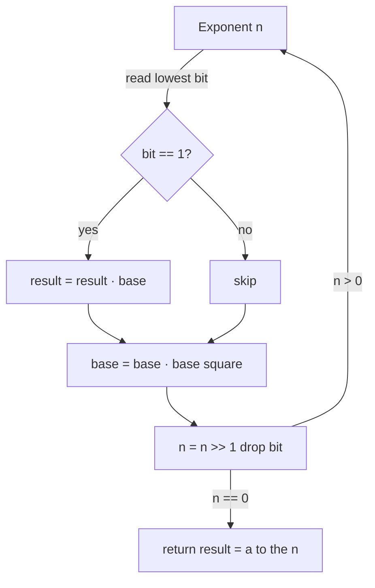

# Binary Exponentiation (Fast Power) — Junior Level

> **One-line summary:** To compute `a^n` you do **not** need `n` multiplications. By repeatedly **squaring** the base and **multiplying** it into the answer only when the matching bit of `n` is `1`, you get `a^n` in just **`O(log n)`** multiplications. The same trick computes `a^n mod m` for huge `n` (the heart of RSA and modular inverses), and it works for *anything* you can multiply — numbers, matrices, polynomials.

---

## Table of Contents

1. [Introduction](#introduction)
2. [Prerequisites](#prerequisites)
3. [Glossary](#glossary)
4. [Core Concepts](#core-concepts)
5. [Big-O Summary](#big-o-summary)
6. [Real-World Analogies](#real-world-analogies)
7. [Pros & Cons](#pros--cons)
8. [Step-by-Step Walkthrough](#step-by-step-walkthrough)
9. [Code Examples](#code-examples)
10. [Coding Patterns](#coding-patterns)
11. [Error Handling](#error-handling)
12. [Performance Tips](#performance-tips)
13. [Best Practices](#best-practices)
14. [Edge Cases & Pitfalls](#edge-cases--pitfalls)
15. [Common Mistakes](#common-mistakes)
16. [Cheat Sheet](#cheat-sheet)
17. [Frequently Asked Questions](#frequently-asked-questions)
18. [Visual Animation](#visual-animation)
19. [Summary](#summary)
20. [Further Reading](#further-reading)

---

## Introduction

Suppose someone asks: *"What is `3^45`?"* The obvious approach multiplies `3` by itself 45 times — `3 × 3 × 3 × …` — needing 44 multiplications. Now make it harder: *"What is `3^1000000000` modulo `10^9 + 7`?"* The obvious loop would need a *billion* multiplications. Far too slow.

There is a beautiful shortcut that finishes in about **30 multiplications**, no matter how large the exponent. It is called **binary exponentiation**, **fast power**, or **exponentiation by squaring**. It is one of the most useful tiny algorithms you will ever learn: it powers RSA encryption, modular inverses, fast Fibonacci, and much more.

The key idea has two halves:

1. **Squaring is cheap progress.** If you know `a^k`, then `a^(2k) = (a^k)^2` is just *one* more multiplication. So by squaring repeatedly you reach `a^1, a^2, a^4, a^8, a^16, …` — the powers double each time. After only `log₂ n` squarings you have passed `a^n`.
2. **The bits of `n` tell you which squared powers to combine.** Every number is a sum of powers of two (its binary form). For example `45 = 32 + 8 + 4 + 1`, which in binary is `101101`. So:

```
a^45 = a^32 · a^8 · a^4 · a^1
```

You already produced `a^1, a^2, a^4, a^8, a^16, a^32` by squaring. You just multiply together the ones whose bit is set in `45`. That is at most one multiply per bit, so the whole thing is **`O(log n)`**.

> **The headline:** computing `a^n` takes `O(log n)` multiplications instead of `O(n)`. For `n = 10^9` that is the difference between ~30 operations and a billion.

This file uses small scalar examples (`3^13`, `3^45`) as the spine, then shows the **modular** version `a^n mod m` that makes the technique indispensable in cryptography and competitive programming. The exact same machinery, applied to *matrices* instead of numbers, gives fast Fibonacci and linear-recurrence evaluation — that is the sibling topic `19-number-theory/11-matrix-exponentiation`, which you should cross-reference once you are comfortable here.

---

## Prerequisites

Before reading this file you should be comfortable with:

- **Basic arithmetic and loops** — multiplication, a `while` loop, integer division.
- **Binary representation of numbers** — that every non-negative integer is a unique sum of distinct powers of two, e.g. `13 = 8 + 4 + 1 = 1101₂`.
- **Bit operations** — `n & 1` (is the lowest bit set?), `n >> 1` (drop the lowest bit, i.e. integer-divide by 2). These two operations *are* binary exponentiation's control logic.
- **Modular arithmetic** — `(a · b) mod m`, and why we reduce mod `m` to keep numbers small. (Foundations in `19-number-theory/02-modular-arithmetic`.)
- **Big-O notation** — what `O(n)` versus `O(log n)` means.

Optional but helpful:

- **Recursion basics** — there is an elegant recursive form of the algorithm alongside the iterative one.
- **64-bit integer limits** — knowing that `int`/`int64` overflows around `2^31` / `2^63` explains *why* we take things mod `m`.

---

## Glossary

| Term | Meaning |
|------|---------|
| **Base `a`** | The number (or matrix) being raised to a power. |
| **Exponent `n`** | How many times to multiply the base by itself. |
| **`a^n`** | `a` multiplied by itself `n` times; by convention `a^0 = 1`. |
| **Binary exponentiation** | Computing `a^n` in `O(log n)` multiplications by squaring and reading the bits of `n`. |
| **Exponentiation by squaring** | A synonym for binary exponentiation; emphasizes the repeated-squaring step. |
| **Square-and-multiply** | The pair of operations the algorithm alternates: square the base, multiply into the result if the bit is set. |
| **Modulus `m`** | A number we reduce by (often a prime like `10^9 + 7`) so products never overflow. |
| **`a^n mod m`** | The remainder of `a^n` divided by `m`; computable directly without ever forming the giant `a^n`. |
| **Right-to-left** | The common iterative form: read `n`'s bits from least significant to most, squaring the base each step. |
| **Left-to-right** | The recursive / MSB-first form: process the most significant bit first. |
| **Identity element** | The "do nothing" value you start the result at: `1` for numbers, the identity matrix `I` for matrices. |

---

## Core Concepts

### 1. Powers Can Be Built by Doubling

If you know `a^k`, then `a^(2k) = (a^k)^2`. One squaring doubles the exponent. Starting from `a^1` and squaring repeatedly you get the **ladder**:

```
a^1 → a^2 → a^4 → a^8 → a^16 → a^32 → …
```

Each rung costs one multiplication, and after `t` rungs you have reached `a^(2^t)`. To pass `a^n` you only need about `log₂ n` rungs. This is the engine of the whole method.

### 2. Every Exponent Is a Sum of Powers of Two

Binary notation says `n = b_0·1 + b_1·2 + b_2·4 + b_3·8 + …` where each `b_i` is `0` or `1`. So:

```
a^n = a^(Σ b_i · 2^i) = Π (a^(2^i))^(b_i)
```

In words: multiply together exactly those rungs `a^(2^i)` whose bit `b_i` is `1`, skip the rest. For `n = 13 = 1101₂` the set bits are at positions `0, 2, 3`, so `a^13 = a^1 · a^4 · a^8`.

### 3. Square-and-Multiply (the algorithm)

Combine the two ideas into one loop. Keep a running `result` (start at `1`) and a running `base` (start at `a`). Read `n` bit by bit from the **right** (lowest bit first):

- If the current lowest bit of `n` is `1`, multiply `base` into `result`.
- Square `base` (move up one rung of the ladder).
- Shift `n` right by one (drop the bit you just handled).

When `n` reaches `0`, `result` holds `a^n`. Each iteration does at most two multiplications and there are `⌊log₂ n⌋ + 1` iterations — hence `O(log n)`.

### 4. The Modular Version Is the Same Loop with `% m`

The plain version overflows fast: `3^45` already has 22 digits. The fix is to reduce **after every multiplication**:

```
result = (result * base) % m
base   = (base * base) % m
```

Because `(x · y) mod m = ((x mod m) · (y mod m)) mod m`, reducing as you go gives *exactly* the same residue as computing the giant `a^n` first and reducing at the end — but the numbers never grow past `m²`. This is what makes `3^(10^9) mod (10^9+7)` instant and overflow-free. (For very large `m`, the product `base*base` can itself overflow; the fix — `mulmod` / 128-bit math — is covered in `middle.md`.)

### 5. Start the Result at the Identity

You begin with `result = 1` because `1` is the multiplicative identity: multiplying by `1` changes nothing, so it is the correct "empty product" before any bits are processed. This also makes `a^0 = 1` fall out for free (the loop never runs, `result` stays `1`). For matrices the identity is the identity matrix `I` — same principle, different identity.

### 6. It Works for Anything Associative

Nothing in the algorithm assumes the values are numbers. It needs only an operation that is **associative** (so `(x·y)·z = x·(y·z)`, letting you regroup the multiplications freely) and an **identity** element. Numbers, matrices, polynomials mod something, permutations — all qualify. That is why the *same* code raises a matrix to a power for fast Fibonacci (`19-number-theory/11-matrix-exponentiation`).

---

## Big-O Summary

| Operation | Time | Space | Notes |
|-----------|------|-------|-------|
| Naive loop `result *= a`, `n` times | O(n) | O(1) | Too slow for huge `n`. |
| Binary exponentiation (iterative) | **O(log n)** | O(1) | The standard method; ~`2 log₂ n` multiplies. |
| Binary exponentiation (recursive) | O(log n) | O(log n) | Same multiplies; uses `O(log n)` call-stack space. |
| Modular version `a^n mod m` | **O(log n)** mults | O(1) | Each multiply is on numbers `< m`. |
| Matrix power `M^n` (`k × k`) | O(k³ log n) | O(k²) | Same loop, matrix multiply per step. |

The headline is **`O(log n)` multiplications**. For a 64-bit exponent that is at most ~64 squarings and ~64 multiplies — about 128 operations regardless of how astronomically large `n` is.

---

## Real-World Analogies

| Concept | Analogy |
|---------|---------|
| Squaring to climb the ladder | Folding a piece of paper: each fold doubles the thickness. A few folds and you have thousands of layers. |
| Binary form of `n` choosing rungs | Paying an exact amount with coins of value `1, 2, 4, 8, 16, …` — you use each coin at most once, and the set bits say which coins. |
| Reducing mod `m` each step | A clock: after 12 you wrap to 1. You only ever track the position on the dial, never the total hours elapsed. |
| The identity `result = 1` | An empty shopping cart with running total `1` (for a product) — multiplying in items changes it, an empty cart leaves it neutral. |
| Works for any associative op | A relay baton pass: it does not matter *what* is being passed, only that passing is well-defined and order of grouping does not change the outcome. |

Where the analogy breaks: paper-folding stops after ~7 physical folds, but mathematical squaring never runs out; and the coin analogy assumes you *have* every power-of-two coin, which the squaring ladder manufactures for you on demand.

---

## Pros & Cons

| Pros | Cons |
|------|------|
| `O(log n)` instead of `O(n)` — turns a billion multiplications into ~30. | Slightly trickier to read than a plain loop; an off-by-one in the bit logic silently corrupts the answer. |
| Tiny, branch-light code — a `while` loop with a shift and a test. | For very large modulus `m`, the inner product can overflow 64 bits; you need `mulmod` or 128-bit math (middle level). |
| The modular version never overflows when `m` is small, and never forms the giant `a^n`. | The *time* depends on the bits of `n`, which leaks information — a side-channel risk in crypto (senior level). |
| Generalizes verbatim to matrices, polynomials, any associative operation (monoid). | Negative exponents need a modular inverse first (an extra concept). |
| Foundation for RSA, modular inverse via Fermat, fast linear recurrences. | Overkill for small `n`, where a plain loop is simpler and just as fast. |

**When to use:** large exponents (thousands to `10^18`), any `a^n mod m` (cryptography, hashing, combinatorics mod a prime), matrix powers for linear recurrences, and modular inverses via Fermat's little theorem.

**When NOT to use:** tiny fixed exponents (`a^2`, `a^3` — just multiply directly), or when you need the *exact* non-modular value of a huge power (that requires big integers and the cost is dominated by the size of the result, not the number of multiplies).

---

## Step-by-Step Walkthrough

Let us compute `3^13` by square-and-multiply. The true answer is `3^13 = 1594323`. In binary, `13 = 1101₂ = 8 + 4 + 1`, so we expect `3^13 = 3^8 · 3^4 · 3^1`.

We track two values: `result` (starts at `1`) and `base` (starts at `3`). We read the bits of `n = 13` from the **right** (lowest first).

```
n = 13 (binary 1101)   result = 1     base = 3

bit 0 of 13 = 1  ->  result = result · base = 1 · 3   = 3        (= 3^1)
                     base   = base · base   = 3 · 3   = 9        (= 3^2)
                     n >>= 1  ->  n = 6 (binary 110)

bit 0 of 6  = 0  ->  (skip the multiply into result; result stays 3)
                     base   = base · base   = 9 · 9   = 81       (= 3^4)
                     n >>= 1  ->  n = 3 (binary 11)

bit 0 of 3  = 1  ->  result = result · base = 3 · 81  = 243      (= 3^1 · 3^4 = 3^5)
                     base   = base · base   = 81 · 81 = 6561     (= 3^8)
                     n >>= 1  ->  n = 1 (binary 1)

bit 0 of 1  = 1  ->  result = result · base = 243 · 6561 = 1594323  (= 3^5 · 3^8 = 3^13)
                     base   = base · base   = 6561 · 6561 = ...   (computed but never used)
                     n >>= 1  ->  n = 0  ->  loop ends
```

The final `result = 1594323 = 3^13`. Correct! We did exactly **4 multiplies into `result`** (one per set bit, but we skipped the `0` bit) and **4 squarings of `base`** — about `2 log₂ 13 ≈ 8` operations, versus 12 for the naive loop. The gap explodes as `n` grows: for `n = 10^18` it is ~120 operations versus `10^18`.

**Why we squared one extra time.** Notice the last squaring (`base = 6561²`) is computed but never used, because the loop checks the bit *before* the final shift. That wasted squaring is harmless and not worth special-casing — it does not change the answer and costs one multiplication.

**The modular version on the same example.** Suppose we want `3^13 mod 100` (keeping only the last two digits). The true answer `1594323` ends in `23`, so we expect `23`. Reduce every step mod `100`:

```
n = 13   result = 1   base = 3   (MOD = 100)

bit 1 -> result = 1·3 % 100 = 3        base = 3·3 % 100 = 9
bit 0 -> (skip)                        base = 9·9 % 100 = 81
bit 1 -> result = 3·81 % 100 = 243%100 = 43   base = 81·81 % 100 = 6561%100 = 61
bit 1 -> result = 43·61 % 100 = 2623%100 = 23   base = 61·61 % 100 = ...
n = 0 -> done
```

So `result = 23 = 3^13 mod 100`. The reduction kept every number under 100, yet produced the exact residue. The [animation](#visual-animation) shows these bits driving the square-vs-multiply decision and the running `result`/`base` step by step.

---

## Code Examples

### Example: `power(a, n)` and `powmod(a, n, m)`

The plain version computes `a^n` exactly (use only for small results); the modular version computes `a^n mod m` and is the one you will use most.

#### Go

```go
package main

import "fmt"

// power computes a^n exactly (no modulus). Use only when a^n fits in int64.
// Time: O(log n) multiplications. Space: O(1).
func power(a, n int64) int64 {
	result := int64(1) // identity: a^0 = 1
	base := a
	for n > 0 {
		if n&1 == 1 { // lowest bit set -> multiply this rung in
			result *= base
		}
		base *= base // climb the ladder: base = base^2
		n >>= 1      // drop the bit we just handled
	}
	return result
}

// powmod computes a^n mod m. Reduces after every multiply so nothing overflows
// (assumes m*m fits in int64, i.e. m < ~3*10^9).
func powmod(a, n, m int64) int64 {
	a %= m
	result := int64(1) % m // handles m == 1 (everything is 0 mod 1)
	for n > 0 {
		if n&1 == 1 {
			result = result * a % m
		}
		a = a * a % m
		n >>= 1
	}
	return result
}

func main() {
	fmt.Println(power(3, 13))                       // 1594323
	fmt.Println(powmod(3, 13, 100))                 // 23
	fmt.Println(powmod(2, 1_000_000_000, 1_000_000_007)) // instant
}
```

#### Java

```java
public class FastPower {
    // a^n exactly. Use only when a^n fits in long.
    static long power(long a, long n) {
        long result = 1; // a^0 = 1
        long base = a;
        while (n > 0) {
            if ((n & 1) == 1) result *= base; // bit set -> multiply rung in
            base *= base;                     // square the base
            n >>= 1;                          // drop the bit
        }
        return result;
    }

    // a^n mod m, reducing after each multiply (assumes m*m fits in long).
    static long powmod(long a, long n, long m) {
        a %= m;
        long result = 1 % m; // handles m == 1
        while (n > 0) {
            if ((n & 1) == 1) result = result * a % m;
            a = a * a % m;
            n >>= 1;
        }
        return result;
    }

    public static void main(String[] args) {
        System.out.println(power(3, 13));                          // 1594323
        System.out.println(powmod(3, 13, 100));                    // 23
        System.out.println(powmod(2, 1_000_000_000L, 1_000_000_007L)); // instant
    }
}
```

#### Python

```python
def power(a, n):
    """a^n exactly. Python ints are unbounded, so no overflow.
    Time: O(log n) multiplications (each multiply costs more as digits grow)."""
    result = 1  # a^0 = 1
    base = a
    while n > 0:
        if n & 1:            # lowest bit set -> multiply rung in
            result *= base
        base *= base         # square the base
        n >>= 1              # drop the bit
    return result


def powmod(a, n, m):
    """a^n mod m, reducing every step."""
    a %= m
    result = 1 % m           # handles m == 1
    while n > 0:
        if n & 1:
            result = result * a % m
        a = a * a % m
        n >>= 1
    return result


if __name__ == "__main__":
    print(power(3, 13))                       # 1594323
    print(powmod(3, 13, 100))                 # 23
    print(powmod(2, 1_000_000_000, 1_000_000_007))  # instant
    # Python also has it built in:
    print(pow(2, 1_000_000_000, 1_000_000_007))     # same, native C speed
```

**What it does:** raises `a` to the power `n` using square-and-multiply, optionally modulo `m`.
**Run:** `go run main.go` | `javac FastPower.java && java FastPower` | `python fast_power.py`

**Note for Python users:** the built-in `pow(a, n, m)` *is* binary exponentiation in optimized C — use it in production. We implement it by hand here to understand the mechanism.

---

## Coding Patterns

### Pattern 1: Naive Loop (the oracle you test against)

**Intent:** Before trusting fast power, compute `a^n mod m` the slow, obvious way and check they agree on small `n`.

```python
def power_loop(a, n, m=10**9 + 7):
    result = 1
    for _ in range(n):
        result = result * a % m
    return result
```

This is `O(n)`. Too slow for huge `n`, but perfect as a correctness oracle. Fast power must give the same answer.

### Pattern 2: Recursive (Left-to-Right) Form

**Intent:** Express the algorithm as a recurrence: `a^n = (a^(n/2))² ` for even `n`, and `a·a^(n-1)` for odd `n`. Some people find this clearer.

```python
def power_rec(a, n, m=10**9 + 7):
    if n == 0:
        return 1 % m
    half = power_rec(a, n // 2, m)   # compute a^(n/2) once
    half = half * half % m           # square it
    if n & 1:                        # n was odd -> one extra factor of a
        half = half * a % m
    return half
```

This uses `O(log n)` stack frames. Computing `a^(n/2)` *once* and squaring (not calling twice) is what keeps it `O(log n)` — calling `power_rec` twice would be `O(n)`.

### Pattern 3: Modular Inverse via Fermat

**Intent:** When `m` is prime, the inverse of `a` mod `m` is `a^(m-2) mod m` (Fermat's little theorem). Fast power computes it in `O(log m)`.

```python
def mod_inverse(a, m):           # m must be prime, gcd(a, m) == 1
    return powmod(a, m - 2, m)   # a^(m-2) ≡ a^(-1) (mod m)
```

This is the standard way to "divide" in modular arithmetic — used constantly in combinatorics mod a prime (binomial coefficients, etc.).



---

## Error Handling

| Error | Cause | Fix |
|-------|-------|-----|
| Wildly wrong huge number | Forgot the modulus; the exact `a^n` overflowed and wrapped. | Reduce after *every* `*` in the loop. |
| Overflow even with `% m` | The product `base*base` exceeds 64 bits before the `% m` (large `m`). | Use 128-bit / `mulmod` (see `middle.md`); keep `m < ~3·10^9` for the simple form. |
| Wrong answer for `n = 0` | Started `result` at `a` instead of `1`. | `a^0 = 1`; always start `result = 1` (or `1 % m`). |
| Crash / wrong for `m = 1` | `result = 1` but everything is `0 mod 1`. | Use `result = 1 % m` so it becomes `0` when `m == 1`. |
| Negative result in Go/Java | `%` returns negative for negative operands (negative base). | Normalize: `((x % m) + m) % m`. |
| Wrong inverse | Used Fermat (`a^(m-2)`) when `m` is *not* prime. | Use extended Euclid for non-prime `m`. |
| Infinite loop | Forgot `n >>= 1`, so `n` never reaches 0. | Always shift `n` right each iteration. |

---

## Performance Tips

- **Reduce mod `m` once per multiply** — exactly after each `*`, no more, no less. Extra reductions waste cycles; fewer risk overflow.
- **Use the language built-in when it exists.** Python's `pow(a, n, m)` and Java's `BigInteger.modPow` are heavily optimized; hand-roll only for learning or for custom types (matrices).
- **Skip work for trivial exponents.** `n == 0` → `1`; `n == 1` → `a`. A guard avoids loop overhead.
- **Keep `base` reduced from the start** (`a %= m`) so the first squaring already stays small.
- **For repeated powers of the same base**, precompute the squaring ladder `a^1, a^2, a^4, …` once and reuse it across many exponents.

---

## Best Practices

- Always test fast power against the naive `O(n)` loop (Pattern 1) on small `n` before trusting it on huge `n`.
- State your modulus once, at the top, as a named constant — never sprinkle magic `1000000007` literals.
- Reduce the base first (`a %= m`) and use `result = 1 % m` to handle the `m == 1` corner cleanly.
- Write `powmod` as a small, separately testable function; most bugs hide in the bit logic.
- Document whether your exponent can be `0` and whether the base can be negative; both have well-known fixes.

---

## Edge Cases & Pitfalls

- **`n = 0`** — answer is `1` (or `0` when `m == 1`); the loop body never runs.
- **`n = 1`** — answer is `a mod m`; one set bit.
- **`a = 0`** — `0^n = 0` for `n > 0`, but `0^0 = 1` by the empty-product convention (the loop returns `1`).
- **`a` larger than `m`** — reduce first (`a %= m`); otherwise the first square may overflow.
- **Negative base** — reduce into `[0, m)` with `((a % m) + m) % m` before starting.
- **Negative exponent** — `a^(-n) = (a^(-1))^n`; first compute the modular inverse, then raise it.
- **Large modulus `m`** — `base*base` can overflow 64 bits even though each factor is `< m`; use `mulmod`/128-bit (middle level).

---

## Common Mistakes

1. **Forgetting the modulus** — the exact `a^n` overflows and silently wraps to garbage.
2. **Starting `result` at `a`** instead of `1` — gives `a^(n+1)` and breaks `n = 0`.
3. **Calling the recursive form twice** (`power(a, n/2) * power(a, n/2)`) — that is `O(n)`; compute once and square.
4. **Reducing too late** — `base*base` overflows *before* the `% m` if you reduce outside the multiply.
5. **Using Fermat's inverse with a non-prime modulus** — `a^(m-2)` is only the inverse when `m` is prime.
6. **Off-by-one in bits** — using `>=` or forgetting `n >>= 1`, producing wrong powers or infinite loops.
7. **Negative residues** in Go/Java when the base is negative — normalize with `((x % m) + m) % m`.

---

## Cheat Sheet

| Question | Tool | Formula |
|----------|------|---------|
| `a^n` (small result) | binary exponentiation | square-and-multiply loop |
| `a^n mod m` | modular binary exponentiation | reduce after each multiply |
| `a^(-1) mod m`, `m` prime | Fermat's little theorem | `a^(m-2) mod m` |
| `a^(-n) mod m`, `m` prime | inverse then power | `(a^(m-2))^n mod m` |
| `M^n` (matrix) | same loop, matrix multiply | see `11-matrix-exponentiation` |
| Large modulus product | `mulmod` / 128-bit | see `middle.md` |

Core algorithm:

```
powmod(a, n, m):
    a %= m
    result = 1 % m            # identity; a^0
    while n > 0:
        if n is odd:  result = result · a % m
        a = a · a % m          # square the base
        n = n >> 1             # drop the lowest bit
    return result
# cost: O(log n) multiplications
```

---

## Frequently Asked Questions

**Q: Why is it `O(log n)` and not `O(n)`?**
Because the exponent is *halved* each iteration (`n >>= 1`), so the loop runs only `⌊log₂ n⌋ + 1` times. Each iteration does at most two multiplications. Doubling `n` adds just one iteration, not double the work.

**Q: Why read the bits from the right (lowest first)?**
The right-to-left form lets you keep a single running `base` that you square each step — after `i` steps `base = a^(2^i)`, exactly the rung you need for bit `i`. It needs no extra storage. There is also a left-to-right (MSB-first) form, shown recursively in Pattern 2; both are `O(log n)`.

**Q: Why start `result` at `1`?**
`1` is the multiplicative identity (the "empty product"), so before any bits are processed the result correctly represents `a^0 = 1`. Starting at `a` would give you `a^(n+1)`.

**Q: It works for small `n` but gives garbage for huge `n`. What is wrong?**
Almost always a missing modulus: the exact `a^n` overflowed your integer type and wrapped around. Reduce after every multiply, or (for the exact value) use big integers.

**Q: How big can `n` be?**
As big as your integer type allows. `n = 10^18` fits in a signed 64-bit integer and takes about 60 squarings. Python ints are unbounded, so `n` can be enormous.

**Q: Can the exponent be negative?**
Not directly — `a^(-n)` means `(a^(-1))^n`. First compute the modular inverse `a^(-1) mod m` (via Fermat when `m` is prime), then raise it to `n`.

**Q: Why does this matter for cryptography?**
RSA encryption/decryption is literally `c = m^e mod N` and `m = c^d mod N` with `e, d, N` having hundreds of digits. Without binary exponentiation those powers would be impossible to compute. (Senior level covers the side-channel concern — the timing leaks the bits of the secret exponent.)

---

## Visual Animation

> See [`animation.html`](./animation.html) for an interactive visualization.
>
> The animation demonstrates:
> - The bits of `n` shown in binary, with the current bit highlighted
> - The running `base` doubling its exponent (`a^1 → a^2 → a^4 → …`) at each step
> - The running `result` updated only when the current bit is `1` (square-vs-multiply)
> - The modular reduction keeping every value small
> - Step / Run / Reset controls and an editable `a`, `n`, `m`
> - A Big-O panel and an operation log of every square and multiply

---

## Summary

Binary exponentiation computes `a^n` in **`O(log n)`** multiplications instead of `O(n)`, by squaring the base to build the ladder `a^1, a^2, a^4, a^8, …` and multiplying into the result only at the set bits of `n`. The modular version reduces after every multiply, computing `a^n mod m` for astronomically large `n` without ever forming the giant power — the engine behind RSA, modular inverses via Fermat, and combinatorics mod a prime. Two rules never to forget: start `result` at the identity (`1`, or `1 % m`), and reduce mod `m` everywhere. The exact same loop, with matrix multiplication in place of scalar multiplication, gives fast Fibonacci and linear-recurrence evaluation — the sibling topic `19-number-theory/11-matrix-exponentiation`.

---

## Further Reading

- Sibling topic `19-number-theory/11-matrix-exponentiation` — the same algorithm applied to matrices for fast linear recurrences.
- Foundation topic `19-number-theory/02-modular-arithmetic` — `(a·b) mod m`, modular inverses, Fermat's little theorem.
- Related topic `19-number-theory/16-montgomery-multiplication` — fast modular multiplication for the inner step when `m` is large.
- *Introduction to Algorithms* (CLRS) — modular exponentiation, used in the RSA section.
- *The Art of Computer Programming, Vol. 2* (Knuth) — addition chains and the optimality of exponentiation.
- cp-algorithms.com — "Binary exponentiation".

---

Next step: [middle.md](./middle.md) — why it works for any monoid, overflow and `mulmod`, recursive vs iterative, and when to choose each.
