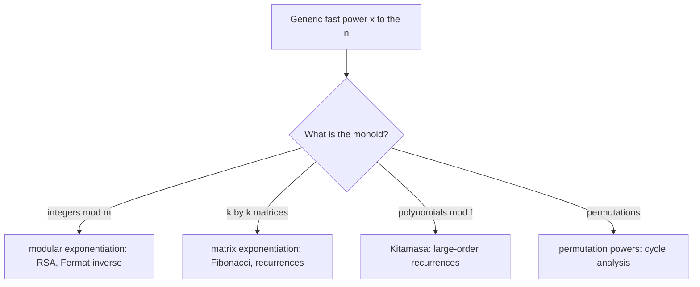

# Binary Exponentiation (Fast Power) — Middle Level

> **Focus:** *Why* the algorithm is correct and *when* to reach for each variant. The deep idea is the **monoid generalization** — square-and-multiply works for any associative operation with an identity, which is why the same code raises numbers, matrices, and polynomials. We cover **overflow** and the `mulmod` / `__int128` fix for large moduli, **right-to-left vs left-to-right** (iterative vs recursive) forms with their trade-offs, and the families of applications: modular inverse, fast Fibonacci, and linear-recurrence acceleration.

---

## Table of Contents

1. [Introduction](#introduction)
2. [Deeper Concepts](#deeper-concepts)
3. [The Monoid Generalization](#the-monoid-generalization)
4. [Right-to-Left vs Left-to-Right](#right-to-left-vs-left-to-right)
5. [Overflow and Modular Multiplication](#overflow-and-modular-multiplication)
6. [Comparison with Alternatives](#comparison-with-alternatives)
7. [Worked Examples](#worked-examples)
8. [Code Examples](#code-examples)
9. [Error Handling](#error-handling)
10. [Performance Analysis](#performance-analysis)
11. [Best Practices](#best-practices)
12. [Frequently Asked Questions](#frequently-asked-questions)
13. [Visual Animation](#visual-animation)
14. [Summary](#summary)

---

## Introduction

At junior level the message was a single mechanism: square the base, multiply into the result at the set bits of `n`, and you get `a^n` in `O(log n)`. At middle level you learn three things that turn "I can code fast power" into "I know exactly which variant to use and why it is correct":

- **Why does it generalize?** Square-and-multiply never uses any property of numbers except *associativity* and an *identity*. That makes it a **monoid** algorithm — the same code powers matrices (fast Fibonacci), polynomials (fast Kitamasa), and permutations.
- **What breaks at scale?** When the modulus `m` is large (say `m ≈ 10^18`), the inner product `a·a` overflows 64 bits *before* the `% m`. You need **`mulmod`** (128-bit or Russian-peasant multiplication), or Montgomery multiplication (`19-number-theory/16-montgomery-multiplication`).
- **Which form?** The **right-to-left** iterative loop is the default (`O(1)` space). The **left-to-right** recursive form is sometimes clearer and is the natural shape for the "constant-time" crypto variant (senior level). They do the same number of multiplications.

This is the scalar / general-operation angle. The matrix angle — building a companion matrix and powering it for a linear recurrence — is the sibling topic `19-number-theory/11-matrix-exponentiation`; the *power* engine there is exactly the algorithm of this file.

---

## Deeper Concepts

### The invariant that makes it correct

Run the right-to-left loop and watch the pair `(result, base, n)`. Let `N` be the original exponent. The loop maintains, at the **start of every iteration**, the invariant:

```
result · base^n  =  a^N
```

Initially `result = 1`, `base = a`, `n = N`, so `1 · a^N = a^N` ✓. Each iteration preserves it: if the lowest bit of `n` is `1`, we do `result *= base` and `n` loses that bit, moving a factor of `base` from the `base^n` term into `result`; then `base = base²` and `n = n >> 1` together leave `base^n` unchanged because `(base²)^(n/2) = base^n`. When the loop ends, `n = 0`, so `base^0 = 1` and the invariant reads `result · 1 = a^N`. Hence `result = a^N`. This single invariant is the entire correctness proof (formalized in `professional.md`).

### Number of multiplications

The loop runs `⌊log₂ N⌋ + 1` times. Each iteration does one squaring (always) and one multiply-into-result (only when the bit is set). So the total is:

```
squarings:        ⌊log₂ N⌋          (one per iteration except possibly the last)
multiplies:       popcount(N)        (number of 1-bits in N)
total multiplies: ⌊log₂ N⌋ + popcount(N) − 1   ≈   1.5 · log₂ N   on average
```

For `N = 2^k` (a single bit) it is just `k` squarings — the minimum. For `N = 2^k − 1` (all bits set) it is the maximum, `2(k−1)`. This count is *not always optimal* — for some exponents a cleverer "addition chain" uses fewer multiplications (professional level), but binary exponentiation is within a factor of ~2 of optimal and is what everyone uses.

### Why halving the exponent is the whole game

The recursive view says `a^n = (a^(n/2))²` when `n` is even, and `a · a^(n−1)` when `n` is odd. The even case *halves* the exponent for the cost of one squaring; the odd case strips one factor and makes `n` even. Since `n` at least halves every one or two steps, it reaches `0` in `O(log n)` steps. The iterative loop is just this recurrence unrolled, reading the bits from the bottom.

---

## The Monoid Generalization

A **monoid** is a set with an associative binary operation `·` and an identity element `e` (so `e·x = x·e = x`). Binary exponentiation computes `x^n` in *any* monoid, because the only facts it uses are:

1. **Associativity** — `(x·y)·z = x·(y·z)`. This is what lets us regroup the `n` copies of `x` into squared blocks: `x^4 = (x·x)·(x·x)`. Without associativity, "the `n`-th power" is not even well-defined.
2. **An identity `e`** — the starting value of `result`. For numbers `e = 1`; for `k×k` matrices `e = I`; for permutations `e = id`; for strings under concatenation `e = ""`.

Commutativity is **not** required — matrices do not commute, yet `M^n` is well-defined and fast power computes it correctly, because powers of a *single* element always commute with each other (`M^i · M^j = M^(i+j) = M^j · M^i`).

| Monoid | Element `x` | Operation `·` | Identity `e` | `x^n` computes |
|--------|-------------|---------------|--------------|----------------|
| Integers mod `m` | a residue | multiplication mod `m` | `1` | `a^n mod m` (RSA, inverses) |
| `k×k` matrices mod `m` | a matrix | matrix multiply | `I` | linear recurrences, path counts |
| Polynomials mod `f(x)` | a polynomial | poly multiply mod `f` | `1` | Kitamasa, NTT-based recurrences |
| Permutations | a permutation | composition | identity perm | `σ^n` (cycle structure) |
| `2×2` over a tropical semiring | a matrix | (min, +) | tropical identity | shortest paths of length `n` |

> **Practical upshot:** to make fast power work for a new type, you only need to supply a `multiply` function and an `identity` value. The bit-loop is unchanged. This is exactly how `11-matrix-exponentiation` reuses this algorithm.



---

## Right-to-Left vs Left-to-Right

There are two standard orders to process the bits of `n`. Both are `O(log n)` and do the same number of multiplications; they differ in structure and in which is natural for certain uses.

### Right-to-left (LSB first) — the iterative default

Process bits from least significant to most. Keep a running `base` that you square each step; multiply it into `result` when the current bit is `1`.

```text
result = e
while n > 0:
    if n & 1:  result = result · base
    base = base · base       # base becomes a^(2^i) after step i
    n >>= 1
return result
```

- **Space:** `O(1)` — two accumulators, no stack.
- **Natural for:** modular powers, matrix powers, anything iterative.

### Left-to-right (MSB first) — the recursive / Horner form

Process bits from most significant to least. Start `result = e` and, for each bit, *square* `result` then multiply by `base` if the bit is `1`.

```text
result = e
for bit in bits_of_n_from_high_to_low:
    result = result · result          # square the accumulated result
    if bit == 1:  result = result · base
return result
```

- **Space:** `O(1)` iterative, or `O(log n)` if written as recursion.
- **Natural for:** the **constant-time / "always-multiply" Montgomery ladder** used in cryptography (senior level), because the work per bit is uniform.
- **Subtlety:** you must process bits from the *top*, which means knowing the bit length first (or recursing).

| Aspect | Right-to-left (iterative) | Left-to-right (recursive/MSB) |
|--------|--------------------------|-------------------------------|
| Bit order | LSB → MSB | MSB → LSB |
| Extra storage | `O(1)` | `O(log n)` if recursive |
| Squares | the `base` | the `result` |
| Needs bit length up front | No | Yes |
| Constant-time variant | awkward | natural (Montgomery ladder) |
| Default choice | **Yes** | when uniform per-bit work matters |

Both compute the same value via the same number of operations; pick right-to-left unless you specifically need MSB-first uniformity (crypto side-channel hardening).

---

## Overflow and Modular Multiplication

The simple `result = result * a % m` is correct **only if `a * a` fits in your integer type**. With `int64` (max ~`9.2·10^18`), the product of two values each `< m` is `< m²`, which fits only when `m < ~3·10^9`. For `m = 10^9 + 7` you are fine. But cryptographic and number-theoretic problems often use `m ≈ 10^18`, where `m²` overflows 64 bits badly.

### Fix 1: 128-bit intermediate (`__int128`, `math/bits`, Python ints)

Compute the product in a wider type, then reduce.

```text
mulmod(a, b, m):  return (a * b) % m       # but in a 128-bit type
```

- C/C++: `__int128`. Go: `math/bits.Mul64` + `math/bits.Div64` (or `big.Int` for clarity). Java: `Math.multiplyHigh` or `BigInteger`. Python: native (ints are unbounded).
- This is the fastest portable fix when 128-bit math is available.

### Fix 2: Russian-peasant (binary) multiplication

If no 128-bit type is available, compute `a·b mod m` by the *same* square-and-add idea applied to *multiplication* — add `a` into the result at the set bits of `b`, doubling `a` each step, reducing mod `m` throughout. Each step's value stays `< 2m < 2^64`.

```text
mulmod(a, b, m):
    result = 0
    a %= m
    while b > 0:
        if b & 1:  result = (result + a) % m   # add, never overflows past 2m
        a = (a + a) % m                          # double
        b >>= 1
    return result
```

This makes each multiply `O(log m)` instead of `O(1)`, so a full power becomes `O(log n · log m)`. Slower, but bulletproof on 64-bit-only platforms.

### Fix 3: Montgomery multiplication

For *many* modular multiplications under a fixed odd modulus (exactly the case inside a power loop), **Montgomery multiplication** replaces the expensive `% m` division with cheap shifts and multiplies after a one-time transform. It is the production technique in crypto libraries. Full treatment in `19-number-theory/16-montgomery-multiplication`; for fast power, the take-away is: the inner `mulmod` is the bottleneck, and Montgomery form removes the per-multiply division.

| Method | Per-multiply cost | When to use |
|--------|-------------------|-------------|
| `a*b % m` directly | `O(1)`, but needs `m² < 2^63` | small modulus (`m ≤ ~3·10^9`) |
| 128-bit `__int128` | `O(1)` | large modulus, 128-bit type available |
| Russian-peasant | `O(log m)` | large modulus, no 128-bit type |
| Montgomery | `O(1)`, no division | many multiplies, fixed odd modulus (crypto) |

---

## Comparison with Alternatives

| Attribute | Binary exponentiation | Naive loop | `pow` with floating point | Big-integer `a^n` then mod |
|-----------|----------------------|-----------|---------------------------|----------------------------|
| Multiplications | `O(log n)` | `O(n)` | n/a (1 call) | `O(log n)` but on huge numbers |
| Exact (integer) | Yes | Yes | **No** — rounding | Yes |
| Overflow-safe | Yes, with `% m` | Yes, with `% m` | n/a | needs big ints, slow/large |
| Works mod `m` | Yes | Yes | No | Yes (reduce at end) |
| Generalizes to matrices | Yes | Yes (slow) | No | n/a |

**Choose binary exponentiation when:** the exponent is large and you want an exact integer or modular result. It is the default for *every* power computation with `n` beyond a handful.

**Choose the naive loop when:** `n` is tiny (≤ ~4) and clarity beats micro-optimization.

**Never use floating-point `pow`** for exact integer powers or modular results — `double` loses precision past ~15 significant digits and cannot reduce mod `m`.

---

## Worked Examples

### Example A: `2^10 mod 1000` (right-to-left)

`10 = 1010₂`. Expect `1024 mod 1000 = 24`.

```
n=10  result=1  base=2  (m=1000)
bit 0 = 0 -> skip;            base = 2·2 = 4;     n=5
bit 0 = 1 -> result = 1·4 = 4; base = 4·4 = 16;   n=2
bit 0 = 0 -> skip;            base = 16·16 = 256;  n=1
bit 0 = 1 -> result = 4·256 = 1024 % 1000 = 24; base = 256² (unused); n=0
-> result = 24 ✓  (2^2 · 2^8 = 4 · 256 = 1024)
```

### Example B: modular inverse via Fermat

Find `7^(-1) mod 13`. Since 13 is prime, `7^(-1) ≡ 7^(13−2) = 7^11 (mod 13)`.

```
7^1 = 7
7^2 = 49 mod 13 = 10
7^4 = 10² = 100 mod 13 = 9
7^8 = 9²  = 81  mod 13 = 3
11 = 1011₂ = 8 + 2 + 1  ->  7^11 = 7^8 · 7^2 · 7^1 = 3 · 10 · 7 = 210 mod 13 = 2
```

Check: `7 · 2 = 14 ≡ 1 (mod 13)` ✓. So `7^(-1) ≡ 2 (mod 13)`, computed in `O(log m)`.

### Example C: fast Fibonacci (preview of the matrix angle)

`F_n` satisfies `[[1,1],[1,0]]^n = [[F_{n+1}, F_n],[F_n, F_{n−1}]]`. Powering the `2×2` matrix with the *same* loop (replacing scalar `*` with matrix multiply, `1` with `I`) gives `F_n mod p` in `O(log n)`. This is the monoid generalization in action — full treatment in `11-matrix-exponentiation`.

### Example D: overflow demonstration (why `mulmod` matters)

Suppose `m = 9·10^18` (near `int64`'s max) and you compute `a·a` with `a ≈ 8·10^18`. The true product is `~6.4·10^37`, which overflows `int64` (`< 9.2·10^18`) by 19 orders of magnitude — the result silently wraps to garbage *before* the `% m` ever runs. The simple `a*a % m` is therefore wrong here; only a 128-bit intermediate (`bits.Mul64`/`__int128`) or Russian-peasant `mulmod` produces the correct residue. The boundary is `m ≤ ⌊√(2^63)⌋ ≈ 3.04·10^9`: below it `a*a` fits, above it you must use `mulmod`. This single threshold decides which implementation you reach for.

---

## Code Examples

### Example: generic monoid fast power + large-modulus `powmod`

The first snippet shows the *generic* shape (supply `multiply` and `identity`); the second shows the large-modulus `mulmod`-based version.

#### Go

```go
package main

import (
	"fmt"
	"math/bits"
)

// ---- Generic monoid power via a multiply closure ----
// fastPow computes x^n in any monoid, given mul and the identity e.
func fastPow(x, e int64, n int64, mul func(a, b int64) int64) int64 {
	result := e
	base := x
	for n > 0 {
		if n&1 == 1 {
			result = mul(result, base)
		}
		base = mul(base, base)
		n >>= 1
	}
	return result
}

// ---- Large-modulus mulmod using 128-bit math (bits.Mul64 / Div64) ----
func mulmod(a, b, m uint64) uint64 {
	hi, lo := bits.Mul64(a, b) // 128-bit product (hi:lo)
	_, rem := bits.Div64(hi%m, lo, m)
	return rem
}

func powmodBig(a, n, m uint64) uint64 {
	a %= m
	var result uint64 = 1 % m
	for n > 0 {
		if n&1 == 1 {
			result = mulmod(result, a, m)
		}
		a = mulmod(a, a, m)
		n >>= 1
	}
	return result
}

func main() {
	mulMod1000 := func(a, b int64) int64 { return a * b % 1000 }
	fmt.Println(fastPow(2, 1, 10, mulMod1000))         // 24
	fmt.Println(powmodBig(3, 13, 1_000_000_000_000007)) // large modulus, exact
}
```

#### Java

```java
import java.math.BigInteger;

public class FastPowerMid {
    // Generic-ish power over longs with a custom multiply (functional interface)
    interface Mul { long apply(long a, long b); }

    static long fastPow(long x, long e, long n, Mul mul) {
        long result = e, base = x;
        while (n > 0) {
            if ((n & 1) == 1) result = mul.apply(result, base);
            base = mul.apply(base, base);
            n >>= 1;
        }
        return result;
    }

    // Large-modulus mulmod via Math.multiplyHigh (Java 9+) or BigInteger fallback
    static long mulmod(long a, long b, long m) {
        return BigInteger.valueOf(a)
                .multiply(BigInteger.valueOf(b))
                .mod(BigInteger.valueOf(m))
                .longValue();
    }

    static long powmodBig(long a, long n, long m) {
        a %= m;
        long result = 1 % m;
        while (n > 0) {
            if ((n & 1) == 1) result = mulmod(result, a, m);
            a = mulmod(a, a, m);
            n >>= 1;
        }
        return result;
    }

    public static void main(String[] args) {
        Mul mod1000 = (a, b) -> a * b % 1000;
        System.out.println(fastPow(2, 1, 10, mod1000));            // 24
        System.out.println(powmodBig(3, 13, 1_000_000_000_000007L)); // large modulus
    }
}
```

#### Python

```python
from typing import Callable


def fast_pow(x, e, n, mul: Callable):
    """x^n in any monoid: supply mul and identity e."""
    result, base = e, x
    while n > 0:
        if n & 1:
            result = mul(result, base)
        base = mul(base, base)
        n >>= 1
    return result


def powmod_big(a, n, m):
    """a^n mod m for arbitrarily large m — Python ints never overflow,
    so a plain '* % m' is already safe (no mulmod needed)."""
    a %= m
    result = 1 % m
    while n > 0:
        if n & 1:
            result = result * a % m
        a = a * a % m
        n >>= 1
    return result


if __name__ == "__main__":
    print(fast_pow(2, 1, 10, lambda a, b: a * b % 1000))  # 24
    print(powmod_big(3, 13, 1_000_000_000_000007))        # large modulus, exact
    print(pow(3, 13, 1_000_000_000_000007))               # built-in, same result
```

**What it does:** the generic `fastPow` powers any monoid via a supplied `mul`; the `powmodBig` variants handle a modulus too large for the simple `a*b % m`.
**Run:** `go run main.go` | `javac FastPowerMid.java && java FastPowerMid` | `python fast_power_mid.py`

**Language note:** Python's unbounded ints make `mulmod` unnecessary — `a * a % m` is always exact. Go and Java need 128-bit helpers (`math/bits`, `BigInteger`) once `m` exceeds ~`3·10^9`.

---

## Error Handling

| Scenario | What goes wrong | Correct approach |
|----------|----------------|------------------|
| Large modulus, simple `a*b % m` | `a*b` overflows `int64` before the mod | Use 128-bit `mulmod` or Russian-peasant |
| Negative coefficients/base | `%` returns negative in Go/Java | Normalize `((x % m) + m) % m` |
| `m == 1` | `result = 1` but all residues are `0` | Start `result = 1 % m` |
| Wrong identity for a matrix | Started `result` at zero matrix | Use the identity matrix `I` |
| Recursive form, double call | `pow(n/2) * pow(n/2)` is `O(n)` | Compute once, then square |
| Fermat inverse, composite `m` | `a^(m-2)` is not the inverse | Use extended Euclidean algorithm |

---

## Performance Analysis

The cost is `(number of multiplies) × (cost per multiply)`:

- **Number of multiplies:** `⌊log₂ n⌋ + popcount(n) − 1`, between `log₂ n` (single bit) and `2 log₂ n` (all bits).
- **Cost per multiply:** `O(1)` for small modulus with native ints; `O(log m)` for Russian-peasant; effectively `O(1)` for Montgomery; growing with digit count for big integers.

So modular fast power with a small modulus is `O(log n)`; with Russian-peasant `mulmod` it is `O(log n · log m)`; matrix power is `O(k³ log n)`.

#### Go

```go
import (
	"fmt"
	"time"
)

func benchmark() {
	exps := []int64{1 << 10, 1 << 20, 1 << 30, 1 << 40, 1 << 60}
	for _, n := range exps {
		start := time.Now()
		for i := 0; i < 100000; i++ {
			_ = powmod(2, n, 1_000_000_007) // your powmod from junior
		}
		fmt.Printf("n=2^%d: %v\n", log2(n), time.Since(start)/100000)
	}
}
```

#### Java

```java
public static void benchmark() {
    long[] exps = {1L<<10, 1L<<20, 1L<<30, 1L<<40, 1L<<60};
    for (long n : exps) {
        long start = System.nanoTime();
        for (int i = 0; i < 100000; i++) powmod(2, n, 1_000_000_007L);
        long ns = (System.nanoTime() - start) / 100000;
        System.out.printf("n=%d: %d ns%n", n, ns);
    }
}
```

#### Python

```python
import timeit

for k in (10, 20, 30, 40, 60):
    n = 1 << k
    t = timeit.timeit(lambda: pow(2, n, 1_000_000_007), number=100000)
    print(f"n=2^{k}: {t/100000*1e9:.0f} ns")
```

You will see runtime grow *linearly with `k = log₂ n`*, not with `n` — doubling `n` adds one iteration. That flat-looking curve (constant per extra bit) is the signature of an `O(log n)` algorithm.

---

## Best Practices

- Implement `powmod` once, test it against the naive `O(n)` loop on small `n`, then reuse everywhere.
- Choose the `mulmod` strategy by modulus size: native `% m` for `m ≤ ~3·10^9`, 128-bit for larger, Montgomery for hot crypto loops.
- For matrices/polynomials, factor out a generic `fastPow(mul, identity)` so the bit-loop is written once.
- Document the modulus and whether the base/exponent can be negative or zero; handle `m == 1` with `1 % m`.
- Prefer the iterative right-to-left form by default; switch to the MSB ladder only when you need uniform per-bit work (crypto).

---

## Frequently Asked Questions

**Q: Why does fast power work for matrices but not for, say, `gcd`?**
Matrix multiplication is associative with an identity (the identity matrix), so it forms a monoid — fast power applies. `gcd` is associative too, but `gcd(a, gcd(a, …))` stabilizes immediately, so "powering" it is meaningless; the algorithm needs an operation whose repeated application is what you actually want.

**Q: Does commutativity matter?**
No. Matrices do not commute in general, yet `M^n` is well-defined and fast power computes it, because powers of the *same* matrix commute with each other. Only associativity and an identity are required.

**Q: When is the simple `a*b % m` unsafe?**
When `m² ` exceeds your integer's max. For `int64` (`< 9.2·10^18`) that means `m > ~3·10^9`. Cryptographic moduli (hundreds of bits) always need `mulmod`/big integers.

**Q: Right-to-left or left-to-right — does the answer differ?**
No, both compute exactly `a^n` with the same number of multiplications. They differ only in structure and in which is convenient for constant-time crypto (left-to-right ladder).

**Q: How many multiplications does it really take?**
`⌊log₂ n⌋ + popcount(n) − 1`. Best case (power of two) is `log₂ n`; worst case (all bits set) is `2(log₂ n) − 1`. Addition chains can sometimes do better (professional level).

**Q: Why is this the heart of RSA?**
RSA encryption is `c = m^e mod N` and decryption `m = c^d mod N`, with `N, e, d` hundreds of digits long. Only `O(log e)` modular multiplications make this feasible. The senior file covers the security caveat (timing side-channels).

**Q: Iterative or recursive — which should I write?**
Iterative right-to-left by default: `O(1)` space, no stack-overflow risk for huge `n`, and the simplest correct loop. Use the recursive form only when it reads more clearly to you or when you specifically want the MSB-first structure (e.g. building toward the constant-time ladder). Both do the same multiplications.

**Q: How do I adapt fast power to a new type (say, polynomials)?**
Provide two things: a `multiply(a, b)` for your type and its `identity` element. Drop them into the generic `fastPow` bit-loop unchanged. That is the entire porting effort — the control logic never changes, which is the whole value of the monoid abstraction.

---

## Visual Animation

> See [`animation.html`](./animation.html) for interactive visualization.
>
> Middle-level focus in the animation:
> - The bits of `n` driving square-vs-multiply, with the invariant `result · base^n = a^N` displayed
> - Switching between the modulus to see reductions keep values bounded
> - A running count of squarings vs multiplies (`popcount` vs `log n`)
> - The Big-O panel contrasting `O(n)` naive vs `O(log n)` fast power

---

## Summary

Binary exponentiation is correct because of one loop invariant — `result · base^n = a^N` — and it generalizes to **any monoid** (associative operation with identity), which is why the identical bit-loop powers numbers, matrices, and polynomials. At scale, the inner modular multiply is the bottleneck: a simple `a*b % m` works only while `m² ` fits your integer type, otherwise reach for 128-bit `mulmod`, Russian-peasant multiplication, or Montgomery form (`16-montgomery-multiplication`). The right-to-left iterative form is the `O(1)`-space default; the left-to-right ladder is the basis of constant-time crypto variants. Its application families — modular inverse via Fermat, fast Fibonacci, and linear-recurrence acceleration via the matrix angle (`11-matrix-exponentiation`) — all rest on this one engine.

---

Next step: [senior.md](./senior.md) — fast power in cryptography (RSA), constant-time and side-channel hardening, and matrix/recurrence acceleration in production.
