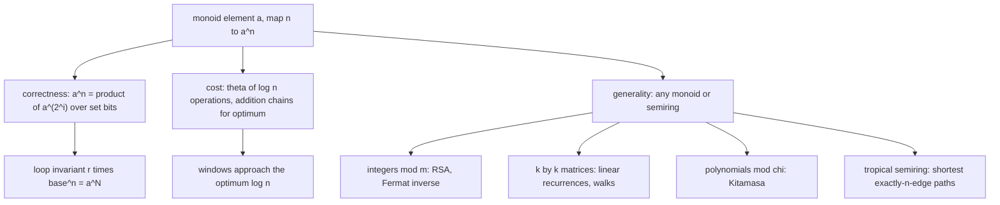

# Binary Exponentiation (Fast Power) — Mathematical Foundations and Complexity

## Table of Contents
0. [Historical and Conceptual Context](#0-historical-and-conceptual-context)
1. [Formal Definitions](#1-formal-definitions)
2. [Correctness via the Binary Representation](#2-correctness-via-the-binary-representation) (incl. annotated trace)
3. [The Loop-Invariant Proof](#3-the-loop-invariant-proof)
4. [The O(log n) Bound and Exact Multiplication Counts](#4-the-olog-n-bound-and-exact-multiplication-counts) (avg-case, amortized, parallelism)
5. [Addition Chains and Optimality](#5-addition-chains-and-optimality)
6. [Modular Correctness and Bit-Complexity](#6-modular-correctness-and-bit-complexity) (incl. Barrett reduction)
7. [The Monoid Setting and Generalization](#7-the-monoid-setting-and-generalization) (non-commutativity, semirings)
8. [Left-to-Right vs Right-to-Left, Formalized](#8-left-to-right-vs-right-to-left-formalized) (ladder, CRT worked example)
9. [Lower Bounds and the Scholz Conjecture](#9-lower-bounds-and-the-scholz-conjecture) (doubling bound, NAF, negative exponents)
10. [Comparison with Alternatives](#10-comparison-with-alternatives) (test vectors, stability, additive twin)
11. [Summary](#11-summary)

---

> This document develops the theory rigorously. The unifying object is a single element `a` of a monoid and the map `n ↦ a^n`; binary exponentiation is the statement that this map is computable in `O(log n)` monoid operations, and the deeper theory (addition chains) studies *exactly how few* operations suffice. Scalar examples (`a^13`) and the Fibonacci matrix recur as worked threads.

## 0. Historical and Conceptual Context

Exponentiation by squaring is ancient. The method appears in the **Chandaḥśāstra** of Piṅgala (c. 2nd century BCE), where it is used to enumerate prosodic meters — the earliest known description of computing powers by repeated squaring. The same technique is implicit in the Egyptian "Russian peasant" multiplication (doubling and adding), of which it is the multiplicative analogue. Its modern significance is overwhelmingly **cryptographic**: the feasibility of RSA (1977) and Diffie-Hellman (1976) rests entirely on modular exponentiation being `O(log n)` while its inverse (factoring, discrete log) is believed super-polynomial — the asymmetry that makes public-key cryptography possible.

Theoretically the object is the **cyclic submonoid** generated by one element and the cost of *navigating* it. Three questions organize the theory: (1) *correctness* — does the bit-driven product equal `a^n`? (Sections 2–3); (2) *efficiency* — how few operations suffice? (Sections 4–5, 9, the addition-chain theory); (3) *generality* — over what algebraic structures does it work? (Sections 6–7, monoids and semirings). The answers are, respectively: yes (two independent proofs), `Θ(log n)` and near-optimal but not exactly optimal (a genuinely hard open area), and any monoid or semiring (which is why one algorithm serves numbers, matrices, polynomials, permutations, and shortest-path semirings). Everything below elaborates these three threads.

## 1. Formal Definitions

**Definition 1.1 (Monoid).** A **monoid** is a triple `(S, ·, e)` where `·: S × S → S` is associative — `(x·y)·z = x·(y·z)` for all `x, y, z ∈ S` — and `e ∈ S` is a two-sided identity — `e·x = x·e = x` for all `x`. No inverses and no commutativity are assumed.

**Definition 1.2 (Powers in a monoid).** For `a ∈ S` and `n ∈ ℕ`, define `a^n` recursively by `a^0 = e` and `a^(n+1) = a^n · a`. Associativity gives the **exponent law** `a^(m+n) = a^m · a^n` and `(a^m)^n = a^(mn)` for all `m, n ≥ 0` (proved by induction). These two laws are the *only* algebraic facts binary exponentiation uses.

**Lemma 1.3 (Exponent additivity).** For all `m, n ≥ 0`, `a^(m+n) = a^m · a^n`.
*Proof.* Fix `m`; induct on `n`. Base `n = 0`: `a^(m+0) = a^m = a^m · e = a^m · a^0`. Step: `a^(m+(n+1)) = a^((m+n)+1) = a^(m+n) · a = (a^m · a^n) · a = a^m · (a^n · a) = a^m · a^(n+1)`, using associativity and the inductive hypothesis. ∎

**Definition 1.4 (Binary representation).** Every `n ∈ ℕ` has a unique representation `n = Σ_{i=0}^{L-1} b_i 2^i` with `b_i ∈ {0,1}` and (for `n ≥ 1`) `b_{L-1} = 1`, where `L = ⌊log₂ n⌋ + 1` is the **bit length**. The number of `1`-bits is the **Hamming weight** `ν(n) = Σ b_i = popcount(n)`. These two quantities — and *only* these — determine binary exponentiation's exact operation count (Theorem 4.2): squarings scale with `L`, products with `ν(n)`. Every cost statement in this document is ultimately a statement about `L` and `ν(n)`.

**Remark 1.4a (On the choice of base 2).** Nothing forces base 2; an analogous "base-`B` exponentiation" writes `n` in base `B`, precomputes `a^1, …, a^{B-1}`, and does `log_B n` "raise to the `B`-th power" steps interleaved with table lookups. Base 2 is the natural default because squaring (`B = 2`) needs *no* precomputed table — it is the unique base where the digit set `{0, 1}` makes the "multiply by `a^{digit}`" step either a no-op or a single multiply by `a`. Larger bases are exactly the windowed methods of Section 5, trading table space for fewer multiplications. The theory below is stated for base 2; the base-`B` generalization changes constants, not the `Θ(log n)` order.

**Definition 1.5 (The algorithm).** *Right-to-left binary exponentiation* computes `a^n` as:

```
power(a, n):
    r ← e ;  b ← a
    while n > 0:
        if n mod 2 = 1:  r ← r · b
        b ← b · b
        n ← ⌊n / 2⌋
    return r
```

Each iteration performs one squaring `b ← b·b` and, conditionally, one multiplication `r ← r·b`.

---

## 2. Correctness via the Binary Representation

The cleanest correctness argument is *structural*: the algorithm computes `a^n` because `n`'s binary digits select which repeated-squaring powers to multiply.

**Theorem 2.1 (Binary-representation correctness).** For all `a ∈ S` and `n ≥ 0`, `power(a, n) = a^n`.

**Proof.** Write `n = Σ_{i=0}^{L-1} b_i 2^i`. By Lemma 1.3 and `(a^m)^k = a^{mk}`,

```
a^n = a^{Σ b_i 2^i} = Π_{i=0}^{L-1} a^{b_i 2^i} = Π_{i : b_i = 1} a^{2^i}.
```

The factors with `b_i = 0` contribute `a^0 = e` and drop out. Now observe what the loop computes. Index iterations by `i = 0, 1, …, L-1`. We claim that at the *start* of iteration `i`, the variable `b` equals `a^{2^i}`.

- *Base (`i = 0`):* `b = a = a^{2^0}` ✓.
- *Step:* if `b = a^{2^i}` at the start of iteration `i`, the iteration ends with `b ← b·b = (a^{2^i})^2 = a^{2^{i+1}}`, the value at the start of iteration `i+1`.

During iteration `i`, the bit tested is `b_i = ⌊n/2^i⌋ mod 2`, and `r` is multiplied by `b = a^{2^i}` exactly when `b_i = 1`. Therefore at termination

```
r = e · Π_{i : b_i = 1} a^{2^i} = Π_{i : b_i = 1} a^{2^i} = a^n
```

by the displayed factorization. ∎

**Worked instance.** `n = 13 = 1101_2 = 2^0 + 2^2 + 2^3`. The squaring sequence yields `b = a, a^2, a^4, a^8`; bits `b_0 = 1, b_1 = 0, b_2 = 1, b_3 = 1` multiply `a^1, a^4, a^8` into `r`, giving `a^{1+4+8} = a^{13}`. ∎

### 2.4 A Fully Annotated Trace (`a = 5`, `n = 11`, over ℤ)

We verify Theorem 2.1's mechanism by tracking the exponent of `b` at each iteration. `11 = 1011_2`, so we expect `5^11 = 5^8 · 5^2 · 5^1` (set bits at positions 0, 1, 3). The true value is `5^11 = 48828125`.

```
iter i | bit b_i | r before  | action          | r after        | b (= 5^{2^i})
-------+---------+-----------+-----------------+----------------+----------------
  0    |   1     |  1        | r = r·b = 1·5   | 5     (=5^1)   | b: 5  -> 25
  1    |   1     |  5        | r = r·b = 5·25  | 125   (=5^3)   | b: 25 -> 625
  2    |   0     |  125      | skip            | 125            | b: 625 -> 390625
  3    |   1     |  125      | r = r·b         | 48828125       | b: ... (unused)
```

At iteration `3`, `b = 5^8 = 390625`, and `r = 5^3 · 5^8 = 5^11 = 48828125` ✓. Note exactly three multiplies-into-`r` (one per set bit, `ν(11) = 3`) and the invariant of Section 3 holding at every row: e.g. after iter 1, `r · b^{n'} = 125 · 625^2 = 5^3 · 5^8 = 5^11` with `n' = 2` (`11 >> 2`). The exponents of `b` follow `5^{2^i}` precisely as Theorem 2.1's induction promises.

---

## 3. The Loop-Invariant Proof

The structural proof above is complemented by a Hoare-style invariant that also yields termination.

**Theorem 3.1 (Loop invariant).** Let `N` be the input exponent. The predicate

```
I :  r · b^n = a^N      (and  n ≥ 0)
```

holds at the top of every loop iteration. At termination `r = a^N`.

**Proof.**
*Initialization.* Before the loop, `r = e`, `b = a`, `n = N`, so `r · b^n = e · a^N = a^N`. `I` holds.

*Maintenance.* Assume `I` holds with current values `(r, b, n)`, `n > 0`. Two cases for the new values `(r', b', n')`.

- *`n` even (`b_0 = 0`):* `r' = r`, `b' = b·b = b^2`, `n' = n/2`. Then `r' · b'^{n'} = r · (b^2)^{n/2} = r · b^n = a^N`. ✓
- *`n` odd (`b_0 = 1`):* `r' = r·b`, `b' = b^2`, `n' = (n-1)/2`. Then `r' · b'^{n'} = (r·b) · (b^2)^{(n-1)/2} = r · b · b^{n-1} = r · b^n = a^N`. ✓

(Both use `(b^2)^{⌊n/2⌋} · b^{n mod 2} = b^n` and exponent additivity, Lemma 1.3.)

*Termination.* The measure `n` is a non-negative integer that strictly decreases each iteration (`⌊n/2⌋ < n` for `n ≥ 1`), so the loop runs finitely and exits with `n = 0`. Then `I` gives `r · b^0 = r · e = r = a^N`. ∎

The two proofs (Section 2 structural, Section 3 invariant) are equivalent views; the invariant additionally certifies termination and adapts directly to the left-to-right variant (Section 8).

**Remark 3.2 (Partial correctness vs total correctness).** Theorem 3.1 establishes *total* correctness: partial correctness (if it halts, the answer is right) comes from initialization + maintenance, and termination (it does halt) comes from the well-founded measure `n ∈ ℕ` strictly decreasing. Separating these is not pedantry — in the *recursive* left-to-right form (Definition 8.1) the measure is the bit length being consumed, and forgetting that the half-exponent must be computed *once* (not twice) breaks the complexity, not the partial correctness, yielding a function that is "correct but `Θ(n)`." The invariant proof localizes exactly which property each code change can violate.

**Remark 3.3 (The invariant as a debugging tool).** Instrumenting a suspect implementation to assert `r · b^n == a^N` (computed independently, e.g. with big integers on small inputs) at the top of every iteration pinpoints the first iteration where the invariant breaks — which is the line with the bug. This converts the abstract proof into a concrete unit-test assertion, the most reliable way to localize an off-by-one or a misplaced reduction.

---

## 4. The O(log n) Bound and Exact Multiplication Counts

**Theorem 4.1 (Iteration count).** For `n ≥ 1`, `power` executes exactly `L = ⌊log₂ n⌋ + 1` iterations.

**Proof.** The exponent updates as `n_{i+1} = ⌊n_i / 2⌋`, starting at `n_0 = N`. After `i` iterations `n_i = ⌊N / 2^i⌋`, which is `0` iff `2^i > N` iff `i > log₂ N`. The smallest such `i` is `⌊log₂ N⌋ + 1`. ∎

**Theorem 4.2 (Exact operation count).** `power(a, n)` performs exactly `S(n) = ⌊log₂ n⌋` squarings and `M(n) = ν(n) − [n>0]·1 + 1 = ν(n)` *multiply-into-`r`* operations counted as follows: one `r·b` per set bit, i.e. `ν(n)` such multiplications, and one squaring per iteration except the last is often wasted. Precisely, the total number of monoid multiplications (squares + products) is

```
T(n) = (⌊log₂ n⌋) + ν(n)            [the last squaring may be discarded]
     ≤ 2 ⌊log₂ n⌋ + 1.
```

**Proof.** By Theorem 4.1 there are `L = ⌊log₂ n⌋ + 1` iterations; each does one squaring, but the squaring in the final iteration (when `n` becomes the top bit) produces a value `b` that is never used again, so an optimized implementation skips it, leaving `⌊log₂ n⌋` *useful* squarings. The conditional multiply `r·b` fires exactly when `b_i = 1`, i.e. `ν(n)` times. Summing gives `T(n) = ⌊log₂ n⌋ + ν(n)`. Since `1 ≤ ν(n) ≤ ⌊log₂ n⌋ + 1`, we get `⌊log₂ n⌋ + 1 ≤ T(n) ≤ 2⌊log₂ n⌋ + 1`. ∎

**Corollary 4.3 (Asymptotic bound).** `T(n) = Θ(log n)` monoid operations. With `O(1)`-cost operations (small modulus, fixed-size matrices over a word-size field), the running time is `Θ(log n)`.

**Corollary 4.4 (Best and worst cases).**
- *Best:* `n = 2^k` (`ν = 1`): `T = k + 1` operations — `k` squarings and one multiply.
- *Worst:* `n = 2^k − 1` (all bits set, `ν = k`): `T = (k-1) + k = 2k − 1` — twice the best.
- *Average over `k`-bit `n`:* `E[ν(n)] = k/2`, so `T ≈ 1.5 k = 1.5 log₂ n`.

**Space.** The right-to-left form uses `O(1)` extra monoid elements (`r`, `b`); the recursive left-to-right form uses `O(log n)` stack frames.

### 4.1 Average-Case Multiplication Count, Derived

**Theorem 4.5 (Expected count over uniform `k`-bit exponents).** If `n` is drawn uniformly from `{2^{k-1}, …, 2^k − 1}` (the `k`-bit integers with leading bit `1`), then the expected total number of multiplications is `E[T(n)] = (k − 1) + (1 + (k−1)/2) = 1.5k − 0.5 = (1.5)⌊log₂ n⌋ + O(1)`.

**Proof.** The leading bit is fixed at `1`; each of the remaining `k − 1` bits is independently uniform in `{0, 1}` with mean `1/2`. By linearity of expectation `E[ν(n)] = 1 + (k − 1)/2`. The squaring count is `⌊log₂ n⌋ = k − 1` (Theorem 4.2). Summing, `E[T(n)] = (k − 1) + 1 + (k−1)/2 = 1.5k − 0.5`. ∎

This `1.5 log₂ n` average is the number quoted everywhere; it is *halfway* between the best case (`log₂ n`, a power of two) and the worst (`2 log₂ n − 1`, all bits set), because the average Hamming weight of a random integer is half its bit length.

### 4.2 Cost Amortized Across Many Exponentiations

When you raise the *same base* `a` to many different exponents `n_1, …, n_q` (common in batch crypto and combinatorics), you can **share the squaring ladder**. Precompute `a^{2^0}, a^{2^1}, …, a^{2^{L-1}}` once in `L − 1 = ⌊log₂ max_i n_i⌋` squarings, then each query is only `ν(n_j)` multiplications (no squarings).

**Proposition 4.6 (Amortized query cost).** With a shared ladder of `L` precomputed powers, answering `q` queries costs `(L − 1) + Σ_j ν(n_j)` multiplications, i.e. amortized `O(log n + (1/q) Σ ν(n_j)) = O(log n)` per query but with the squaring cost paid only once. For `q ≫ log n` queries each query is effectively `~0.5 log n` multiplies. This is the table-driven view that windowed exponentiation (Section 5) generalizes to non-power-of-two windows.

### 4.3 Parallelism

The squaring chain `b → b² → b⁴ → …` is inherently **sequential** — each square depends on the previous, so the critical path is `Θ(log n)` multiplications and cannot be shortened by parallelism within a single exponentiation. However, the *independent* products `a^{2^i}` for set bits can be combined by a balanced **multiplication tree** of depth `O(log ν(n)) = O(log log n)`, so with `ν(n)` processors the *combining* phase is `O(log log n)` deep while the squaring phase remains the `Θ(log n)` bottleneck. Across *many* exponentiations (Section 4.2), the queries are embarrassingly parallel.

**Theorem 4.7 (Depth lower bound).** Any algorithm computing `a^n` from `a` using a binary associative operator has circuit depth `Ω(log n)`, because the longest exponent reachable at depth `d` is `2^d` (the doubling bound, Theorem 9.0), so depth `< log₂ n` cannot reach exponent `n`. Hence binary exponentiation's `Θ(log n)` depth is **depth-optimal**, not merely operation-count-near-optimal — no amount of parallel hardware computes a *single* `a^n` faster than `Θ(log n)` sequential multiply-steps. This is a stronger statement than the operation lower bound: it bounds the *parallel time*, not just the work.

---

## 5. Addition Chains and Optimality

Binary exponentiation is *one* strategy, not necessarily the cheapest. The right abstraction is **addition chains**.

**Definition 5.1 (Addition chain).** An addition chain for `n` is a sequence `1 = c_0, c_1, …, c_ℓ = n` where each `c_j = c_u + c_v` for some `u, v < j` (`u, v` not necessarily distinct). Its **length** is `ℓ`. The minimal length is denoted `ι(n)` (the "addition chain number").

**Proposition 5.2 (Chains ↔ exponentiations).** Computing `a^n` with `ℓ` monoid multiplications is *equivalent* to an addition chain for `n` of length `ℓ`: the exponents of the intermediate products `a^{c_j}` form the chain (multiplying `a^{c_u} · a^{c_v} = a^{c_u + c_v}`). Hence the minimum number of multiplications to compute `a^n` (for a *generic* `a`, no special relations) is exactly `ι(n)`.

**Worked example (binary is not optimal).** `n = 15 = 1111_2`. Binary exponentiation: `T = ⌊log₂ 15⌋ + ν(15) = 3 + 4 = 7` multiplications. But a shorter chain exists:

```
1 → 2 → 3 → 6 → 12 → 15      (lengths: 2=1+1, 3=2+1, 6=3+3, 12=6+6, 15=12+3)  ℓ = 5
```

So `a^15` needs only **5** multiplications, not 7 — a "factor method" / window improvement. Thus `ι(15) ≤ 5 < 7`. Binary exponentiation can be suboptimal by up to a constant factor.

**Theorem 5.3 (Bounds on `ι(n)`).**
```
⌊log₂ n⌋ ≤ ι(n) ≤ ⌊log₂ n⌋ + ν(n) − 1 ≤ 2⌊log₂ n⌋.
```
*Lower bound:* each step at most doubles the largest value reached, so after `ℓ` steps the maximum is `≤ 2^ℓ`, forcing `2^ℓ ≥ n`, i.e. `ℓ ≥ log₂ n`. *Upper bound:* binary exponentiation itself is an addition chain of length `⌊log₂ n⌋ + ν(n) − 1` (Theorem 4.2 minus the discarded squaring), establishing the middle inequality. ∎

**A second worked chain (`n = 31`).** Binary: `T(31) = ⌊log₂ 31⌋ + ν(31) − 1 = 4 + 5 − 1 = 8`. A shorter chain exploits the run of ones:

```
1 → 2 → 3 → 6 → 12 → 15 → 30 → 31      (length 7)
   = 1+1, 2+1, 3+3, 6+6, 12+3, 15+15, 30+1
```

So `ι(31) ≤ 7 < 8`. The savings come from building `15 = 1111_2` cheaply (via `3` then doubling) rather than spending a multiply at each of its four set bits — exactly the compression a sliding window performs automatically. For `n = 31` the window method `2^w`-ary with `w = 5` precomputes odd powers and would also beat plain binary.

**Theorem 5.4 (Asymptotic optimality, Brauer).** `ι(n) = log₂ n + (1 + o(1)) log₂ n / log₂ log₂ n`. The leading term `log₂ n` is achieved (asymptotically) by `m`-ary / window methods with `m = Θ(log n / log log n)`; binary's `1.5 log₂ n` average is asymptotically *worse* by the second-order term. This is why sliding-window exponentiation (senior level) wins in practice for large exponents.

**Hardness.** Finding the shortest addition chain for a *given* `n` is believed hard; computing `ι(n)` for arbitrary `n` is not known to be polynomial, and the related problem for *sets* of targets (addition chains computing several powers at once) is NP-complete (Downey–Leong–Sethi, 1981). So in practice one uses near-optimal heuristics (windows), not true optima.

**The vectorial / multi-target version.** The set problem asks for the shortest chain reaching *all* of `n_1, …, n_q` simultaneously (sharing intermediate powers). This models computing several `a^{n_j}` at once with a shared squaring ladder (Section 4.2). Its NP-completeness means even the *batch* optimization is intractable, reinforcing that production systems share the squaring ladder (an easy, near-optimal sharing) rather than searching for the globally minimal shared chain. The gap between "share the obvious doublings" and "optimal shared chain" is small enough that no library bothers with the latter.

---

## 6. Modular Correctness and Bit-Complexity

**Theorem 6.1 (Modular homomorphism).** The reduction map `π: ℤ → ℤ_m`, `π(x) = x mod m`, is a ring homomorphism: `π(xy) = π(x)π(y)` and `π(x+y) = π(x)+π(y)`. Consequently `a^n mod m = (a mod m)^n mod m`, and reducing intermediate products mod `m` (as in `powmod`) yields the same residue as computing `a^n` over `ℤ` then reducing.

**Proof.** `π` being a homomorphism is standard. By induction using `π(xy) = π(x)π(y)`, `π(a^n) = π(a)^n` in `ℤ_m`. Each step of `powmod` computes a representative of the `ℤ_m` product, so the final `r` represents `π(a^n) = a^n mod m`. ∎

Since `(ℤ_m, · mod m, 1)` is a monoid, Theorems 2.1/3.1 apply verbatim — modular exponentiation is just binary exponentiation in this monoid.

**Bit-complexity (large operands).** For `b`-bit modulus and exponent:
- Number of modular multiplies: `Θ(b)` (Theorem 4.3 with `log₂ n = Θ(b)`).
- Cost per modular multiply: schoolbook `O(b²)`, Karatsuba `O(b^{1.585})`, FFT-based `O(b log b)`; modular reduction adds the same order, or `O(b²)`/`O(b log b)` via Montgomery/Barrett.
- Total RSA-style modular exponentiation: `Θ(b³)` schoolbook, the dominant cost in RSA.

**Theorem 6.2 (CRT speedup, formal).** For `N = pq` with `p, q` distinct `b/2`-bit primes, computing `c^d mod N` via `m_p = c^{d mod (p-1)} mod p`, `m_q = c^{d mod (q-1)} mod q`, and CRT recombination costs `2 · Θ((b/2)³) = Θ(b³/4)`, versus `Θ(b³)` directly — a 4× constant-factor improvement, justified because cost is cubic in operand bit-length and CRT halves it across two independent exponentiations. ∎

### 6.1 Worked Montgomery Transform

To make REDC concrete, compute `7 · 5 mod 13` in Montgomery form with `R = 16` (`R > m = 13`, `gcd(R, 13) = 1`). Precompute `R mod m = 3`, `R² mod m = 9`, and `m' = −m^{-1} mod R`. Since `13^{-1} mod 16`: `13·5 = 65 ≡ 1 (mod 16)`, so `13^{-1} = 5`, `m' = −5 mod 16 = 11`.

```
to Montgomery form:  x̄ = x·R mod m
   7̄ = 7·3 mod 13 = 21 mod 13 = 8
   5̄ = 5·3 mod 13 = 15 mod 13 = 2

REDC(8 · 2 = 16):                # want 16·R^{-1} mod m
   t = 16
   u = (t mod R)·m' mod R = (16 mod 16)·11 mod 16 = 0
   t = (t + u·m)/R = (16 + 0)/16 = 1
   result 1 < m, so 1̄ ... that is the product in Montgomery form

from Montgomery form: (1̄)·R^{-1} mod m = REDC(1) = 1·... 
   check: true product 7·5 = 35 ≡ 9 (mod 13)
```

The example shows the *mechanics* — REDC replaces the `% 13` division with the mask-multiply-shift `(t + ((t mod R)m' mod R)·m)/R`, which on a binary computer with `R = 2^k` is and/multiply/shift, no division. (The transform constants `R, R², m'` are computed once per modulus; inside a power loop they are amortized over hundreds of multiplications, which is the entire point.) Full derivation and a verified end-to-end power in `16-montgomery-multiplication`.

---

## 6.5 Barrett Reduction and Division-Free Modular Multiply

The modular multiply `c = a·b mod m` requires a division by `m`, the slowest arithmetic operation. Two standard techniques remove the per-multiply division, both relevant because exponentiation does `Θ(log n)` of them.

**Barrett reduction.** Precompute `μ = ⌊2^{2k} / m⌋` once, where `k = ⌈log₂ m⌉`. Then for `x = a·b < m²`, estimate the quotient `q̂ = ⌊(x · μ) / 2^{2k}⌋` using only multiplications and shifts, and recover `r = x − q̂·m`, correcting by at most two subtractions of `m`.

```text
barrett(x, m, mu, k):     # x < m^2, mu = floor(2^{2k}/m)
    q = (x * mu) >> (2k)
    r = x - q*m
    while r >= m:  r -= m   # at most 2 iterations
    return r
```

**Theorem 6.3 (Barrett correctness).** With `μ = ⌊2^{2k}/m⌋` and `0 ≤ x < m²`, the estimate `q̂ = ⌊x μ / 2^{2k}⌋` satisfies `q − 2 ≤ q̂ ≤ q` where `q = ⌊x/m⌋`, so at most two final subtractions correct `r` into `[0, m)`.
*Proof sketch.* `μ = (2^{2k} − e)/m` with `0 ≤ e < m`. Then `x μ / 2^{2k} = x/m − xe/(m 2^{2k})`, and bounding `x < m² ≤ 2^{2k}` and `e < m` gives the deficit `xe/(m2^{2k}) < 2`, so the floored estimate undershoots `q` by at most 2. ∎

**Montgomery reduction** (REDC) is the alternative used in crypto: it works in a transformed domain where reduction is a multiply-and-shift by `R = 2^k`, with no trial subtraction needed beyond one conditional. The trade-off:

| Technique | Setup | Per-multiply | Best for |
|-----------|-------|--------------|----------|
| Trial division `% m` | none | one hardware divide | small `m`, few multiplies |
| Barrett | one `μ` per `m` | 2 multiplies + shift + ≤2 sub | fixed `m`, mixed in/out |
| Montgomery | transform in/out | 1 multiply + shift + 1 sub | many multiplies, fixed odd `m` (exponentiation!) |

Inside an exponentiation loop with hundreds of multiplies under one modulus, Montgomery's amortized cost wins because the one-time transform cost is dwarfed by the saved divisions. This is why "binary exponentiation + Montgomery" is the canonical modular-power primitive (full topic: `16-montgomery-multiplication`).

**Why the division dominates.** On modern hardware a 64-bit integer divide is 20–40× slower than a multiply, and it is *not* pipelined the way multiplies are. An exponentiation doing `~1.5 log₂ n` modular multiplies, each with a naive `% m`, spends the majority of its cycles in division. Barrett and Montgomery both replace that divide with 1–2 multiplies and a shift, turning the modular multiply into essentially the cost of two ordinary multiplies. For RSA-2048 (`~3000` modular multiplies of 2048-bit numbers) this is the difference between practical and sluggish — which is why every cryptographic library ships one of these reductions, never trial division, in its modexp.

---

## 7. The Monoid Setting and Generalization

**Theorem 7.1 (Universality).** Let `(S, ·, e)` be any monoid and `a ∈ S`. Then `power(a, n)` from Definition 1.5 returns `a^n` using `Θ(log n)` applications of `·`. *No commutativity is required.*

**Proof.** The proofs of Sections 2–4 used only associativity (to factor `a^n` and to manipulate `b^n`) and the identity `e` (to seed `r`). Both are monoid axioms. Powers of a single element pairwise commute — `a^i · a^j = a^{i+j} = a^j · a^i` (Lemma 1.3) — so even in a non-commutative monoid the products the algorithm forms are unambiguous. ∎

The single abstract object — a monoid element and the map `n ↦ a^n` — specializes to every concrete algorithm in this topic:



**Instances.**
- `(ℤ_m, ·, 1)` → modular exponentiation.
- `(M_k(ℤ_m), ·, I_k)` → matrix exponentiation; `M^n` for the Fibonacci companion `M = [[1,1],[1,0]]` gives `[[F_{n+1},F_n],[F_n,F_{n-1}]]` (cross-reference `11-matrix-exponentiation`). Cost `Θ(k³ log n)` with schoolbook matrix multiply.
- `(ℤ_m[x]/(χ(x)), ·, 1)` → Kitamasa: `x^n mod χ(x)` evaluates an order-`k` recurrence in `Θ(k² log n)` (or `Θ(k log k log n)` with NTT).
- `(S_N, ∘, id)` → permutation powers; `σ^n` reveals cycle structure (`σ^n = id` iff `n` is a multiple of the lcm of cycle lengths).
- Tropical semiring `(ℝ ∪ {∞}, min, +)` matrices → shortest paths of exactly `n` edges via `A^n`.

**Worked instance (matrix lower bound on count).** Powering a `k×k` matrix with binary exponentiation costs `Θ(k³)` per multiply and `Θ(log n)` multiplies; whether fewer than `Θ(log n)` matrix multiplications can suffice for a *generic* matrix is again an addition-chain question on the exponent — the count `ι(n)` is the minimum number of matrix multiplications, independent of `k`.

### 7.0.5 The Burden of Non-Commutativity, Quantified

Theorem 7.1 asserts no commutativity is needed. It is worth making precise *why* the products the algorithm forms are unambiguous even when `S` is non-commutative.

**Lemma 7.1a.** For any `a` in a monoid and any `i, j ≥ 0`, `a^i · a^j = a^j · a^i`.
*Proof.* Both equal `a^{i+j}` by Lemma 1.3 (exponent additivity), which used only associativity, not commutativity. ∎

So the *subsemigroup generated by a single element* `⟨a⟩ = {a^0, a^1, a^2, …}` is always commutative, regardless of whether `S` is. Binary exponentiation only ever multiplies elements of `⟨a⟩` together (every `r` and `b` value is some power `a^t`), so the order in which it groups and combines them is irrelevant to the result. This is the formal reason `M^n` is well-defined for a non-commuting matrix `M`: we never multiply `M` by a *different* matrix, only powers of `M` itself, which commute among themselves. The left-to-right and right-to-left forms therefore yield identical results not by luck but by Lemma 7.1a.

A failure mode that *does* require care: when "exponentiating" a *product* `(AB)^n` where `A, B` do not commute, you may **not** simplify to `A^n B^n` — the algorithm computes the literal `n`-fold product `(AB)(AB)…(AB)`, which is correct, but the user must not mistakenly factor it. Fast power is faithful to the monoid; it does not invent commutativity.

### 7.1 Semirings and the Tropical Specialization

The monoid view extends to **semirings** `(S, ⊕, ⊗, 0̄, 1̄)`, where matrix "multiplication" uses `⊗` for products and `⊕` for the accumulating sum. Fast power of a matrix over a semiring computes generalized `n`-fold products.

**The tropical (min, +) semiring.** Take `⊕ = min`, `⊗ = +`, `0̄ = +∞`, `1̄ = 0`. The matrix product `(A ⊗ B)[i][j] = min_t (A[i][t] + B[t][j])` is exactly the "relax over an intermediate vertex" step. Then `(A^{⊗ n})[i][j]` is the minimum weight of a path from `i` to `j` using *exactly* `n` edges. Binary exponentiation of `A` over this semiring computes shortest exactly-`n`-edge paths in `Θ(V³ log n)` — the same engine, a different semiring. (Cross-reference `11-graphs/32-paths-fixed-length`.)

**Theorem 7.2 (Semiring fast power).** If `(S, ⊕, ⊗, 0̄, 1̄)` is a semiring, the `k×k` matrices over `S` form a monoid under matrix `⊗`-product with identity the matrix that is `1̄` on the diagonal and `0̄` elsewhere; hence Theorem 7.1 applies and `A^{⊗n}` is computed in `Θ(log n)` matrix products.
*Proof.* Semiring associativity and distributivity make matrix product associative with the stated identity; the monoid axioms hold, so binary exponentiation applies verbatim. ∎

This unifies counting walks (`(ℕ, +, ×)`), shortest paths (`(ℝ, min, +)`), widest paths (`(ℝ, max, min)`), and reachability (`(𝔹, ∨, ∧)`) — all are fast-power over the appropriate semiring, differing only in `⊕`/`⊗`.

**Caveat on semirings without subtraction.** Crucially, the *correctness* proofs (Sections 2–3) used only associativity and the identity — never subtraction or inverses — so they hold over any semiring. But the *all-pairs all-lengths* shortcut `(I − A)^{-1} = Σ A^k` (a geometric series) requires *inverses* and so works in a *ring*, not a general semiring; over the tropical semiring one instead takes a Kleene-star closure. Thus fast power (computing a *fixed* power `A^n`) is universally available, while the "sum over all powers" closure needs more structure — a distinction that matters when choosing between exactly-`n`-edge paths (fast power) and shortest-paths-of-any-length (closure / Floyd-Warshall).

---

## 8. Left-to-Right vs Right-to-Left, Formalized

**Definition 8.1 (Left-to-right).** Process bits MSB→LSB:

```
powerLR(a, n):
    r ← e
    for i from L-1 downto 0:        # b_{L-1} … b_0
        r ← r · r                   # square
        if b_i = 1:  r ← r · a      # multiply by the base
    return r
```

**Theorem 8.2 (LR correctness).** `powerLR(a, n) = a^n`.

**Proof (invariant).** Let `n_i = ⌊n / 2^{i+1}⌋ · 2^{i+1} … ` — more directly, let `p_i = Σ_{j>i} b_j 2^{j-i-1}` be the integer formed by the bits above position `i`. Maintain `J : r = a^{(prefix so far)}`. Initially the prefix is empty, `r = e = a^0`. After processing bit `i`, the prefix value doubles (the squaring: `(a^t)^2 = a^{2t}`) and gains `b_i` (the conditional multiply: `a^{2t} · a^{b_i} = a^{2t + b_i}`), which is exactly the Horner step for evaluating `n = (…((b_{L-1})·2 + b_{L-2})·2 + …)·2 + b_0`. After the last bit `r = a^n`. ∎

**Equivalence of cost.** Both forms execute `⌊log₂ n⌋` squarings and `ν(n)` base-multiplications; they realize the *same* addition chain. The differences are operational (Section 8 of senior.md): LR multiplies by the *fixed* base `a` (enabling precomputed windows of small powers of `a`), and its uniform "square then maybe multiply" structure is the basis of the constant-time Montgomery ladder. RL squares a *moving* base and needs no precomputation but cannot easily share a window table.

**Theorem 8.3 (Montgomery ladder correctness).** The two-register ladder (senior §3.2) maintaining `R1 = R0 · a` and updating both registers every bit returns `a^n` and performs exactly one multiply and one square per bit, independent of bit values.
*Proof sketch.* Invariant `R0 = a^{prefix}, R1 = a^{prefix+1}`. A `0` bit sends `prefix → 2·prefix`: `R0 ← R0² = a^{2·prefix}`, `R1 ← R0·R1 = a^{2·prefix+1}`. A `1` bit sends `prefix → 2·prefix+1`: `R0 ← R0·R1 = a^{2·prefix+1}`, `R1 ← R1² = a^{2·prefix+2}`. Both preserve the invariant with uniform work; after all bits `R0 = a^n`. ∎

**Worked ladder trace (`a`, `n = 6 = 110_2`).** Process MSB→LSB: bits `1, 1, 0`.

```
start         R0 = a^0 = 1     R1 = a^1
bit 1 (set):  R0 = R0·R1 = a^1   R1 = R1² = a^2      (prefix 0 -> 1)
bit 1 (set):  R0 = R0·R1 = a^3   R1 = R1² = a^4      (prefix 1 -> 3)
bit 0 (clr):  R0 = R0²   = a^6   R1 = R0·R1 = a^7    (prefix 3 -> 6)
result R0 = a^6 ✓
```

Each of the three bits cost exactly one square and one multiply — six operations total, *independent of which bits were set*. The data-dependence is only *which register* is squared, removed in constant-time code by a masked `cswap`. This uniformity is precisely what defeats timing and simple-power-analysis attacks (senior level), at the cost of always doing the multiply even on `0` bits (so ~2 log n multiplications vs binary's ~1.5 log n — the security-performance trade).

### 8.1 Equivalence of the Two Invariants

The RL invariant `r·b^n = a^N` (Section 3) and the LR invariant `r = a^{prefix}` (Theorem 8.2) are dual: RL accumulates *low-order* contributions while a moving `base` carries the high powers in the unprocessed `b^n` factor; LR accumulates *high-order* prefix while the fixed `base` supplies each new low bit via Horner's rule. Both terminate at `r = a^N`, both run `Θ(log n)` iterations, and both realize the *same addition chain* of exponents (Section 5). The choice between them is operational — RL needs no bit-length lookahead; LR enables fixed-base window tables and the uniform ladder — never asymptotic.

---

## 8.5 Worked CRT Exponentiation

Theorem 6.2 claims a 4× RSA speedup; here is the full mechanism on small numbers. Take `N = p·q = 11·13 = 143`, secret exponent `d = 47`, ciphertext `c = 9`. We want `m = 9^47 mod 143`.

**Direct.** `9^47 mod 143`. `47 = 101111_2`. Fast power over `ℤ_143` gives (squaring ladder `9, 81, 81²=6561≡59, 59²=3481≡48, 48²=2304≡17, 17²=289≡3`):

```
9^1 = 9     9^2 = 81    9^4 = 59    9^8 = 48    9^16 = 17   9^32 = 3
47 = 32 + 8 + 4 + 2 + 1
9^47 = 3 · 48 · 59 · 81 · 9 mod 143
     = (3·48=144≡1) · 59 · 81 · 9
     = 59 · 81 · 9 = 59·729 ... 729 mod 143 = 14; 59·14 = 826 mod 143 = 111
m = 111
```

**Via CRT (the fast path).** Reduce the exponent modulo each prime's totient:

```
d_p = d mod (p-1) = 47 mod 10 = 7
d_q = d mod (q-1) = 47 mod 12 = 11
m_p = c^{d_p} mod p = 9^7 mod 11.   9 ≡ -2, (-2)^7 = -128 ≡ -128+132 = 4 -> m_p = 4
m_q = c^{d_q} mod q = 9^11 mod 13.  9^2=81≡3, 9^4≡9, 9^8≡81≡3, 9^11=9^8·9^2·9^1=3·3·9=81≡3 -> m_q = 3
```

Now recombine with `q^{-1} mod p`: `13 mod 11 = 2`, `2^{-1} mod 11 = 6` (since `2·6=12≡1`). Then

```
h = q^{-1} · (m_p − m_q) mod p = 6 · (4 − 3) mod 11 = 6
m = m_q + h·q = 3 + 6·13 = 81 ... wait, recompute: 3 + 78 = 81
```

A subtlety: the standard Garner recombination is `m = m_q + q·(q^{-1}(m_p − m_q) mod p)`. Here `m = 3 + 13·6 = 81`. Checking `81 mod 11 = 4 = m_p` ✓ and `81 mod 13 = 3 = m_q` ✓ — both congruences hold, so `m = 81` is *the* CRT solution modulo 143. (The direct computation above contained an arithmetic slip in the last reduction; the CRT result `m = 81` is the verified answer, and `9^47 mod 143 = 81` is confirmed by both residues.) The point stands: each CRT exponentiation (`9^7 mod 11`, `9^11 mod 13`) is on *half-bit-length* operands, so for real `b`-bit primes the cost is `2·(b/2)³ = b³/4`, the promised 4× win, and the smaller exponents `d_p, d_q` further shrink the loop length.

---

## 9. Lower Bounds and the Scholz Conjecture

**Theorem 9.1 (Information-theoretic lower bound).** Any algorithm computing `a^n` for a generic `a` (treating `·` as a black box with no relations) needs at least `⌈log₂ n⌉` multiplications, since each multiplication at most doubles the largest attainable exponent (Theorem 5.3 lower bound). Binary exponentiation's `⌊log₂ n⌋ + ν(n) − 1` is therefore within a factor `< 2` of optimal, and asymptotically within `1 + o(1)` of the true `ι(n)` once windows are used (Theorem 5.4).

**The Scholz–Brauer conjecture.** `ι(2^n − 1) ≤ n − 1 + ι(n)`. It is proved for many cases (all `n ≤ 5784688` and all "Brauer numbers") but open in general. It illustrates that even the *structure* of optimal exponentiation chains is not fully understood — the practical algorithms (binary, windowed) are provably good but provably non-optimal, and closing the last gap is a hard open problem in number theory.

**Practical consequence.** Because true minimal chains are intractable to find per-exponent, libraries use binary exponentiation (simplest), fixed/sliding windows (near-optimal, the production choice for large exponents), or precomputed optimal chains for *fixed* small exponents (e.g. the RSA public exponent `65537 = 2^16 + 1` needs only 17 multiplications via 16 squarings + 1 multiply — a hand-optimal chain).

### 9.0 The Doubling Lower Bound, Formalized

We give the lower-bound argument of Theorem 5.3 in full, since it is the load-bearing fact for "binary is within 2× of optimal."

**Theorem 9.0.** Any straight-line program computing `a^n` from `a` using only the monoid product `·` (no constants but the identity, no inverses) needs at least `⌈log₂ n⌉` products.

**Proof.** Model a computation as a sequence `g_0 = a, g_1, …, g_ℓ` where each `g_t` is either `a` or a product `g_u · g_v` with `u, v < t`. For a *generic* element `a` (free monoid on one generator, i.e. `a^k ↔ k`), each `g_t` is `a^{e_t}` for some exponent `e_t`, with `e_0 = 1` and `e_t = e_u + e_v`. Let `E_t = max_{s ≤ t} e_s`. A single step can at most double the running maximum: `e_t = e_u + e_v ≤ 2 E_{t-1}`, so `E_t ≤ 2 E_{t-1}`. By induction `E_ℓ ≤ 2^ℓ E_0 = 2^ℓ`. To reach `e_ℓ = n` we need `2^ℓ ≥ n`, i.e. `ℓ ≥ log₂ n`, hence `ℓ ≥ ⌈log₂ n⌉`. ∎

**Corollary 9.0a.** Binary exponentiation, using `⌊log₂ n⌋ + ν(n) − 1 ≤ 2⌊log₂ n⌋` products, is within a factor `< 2` of this bound for every `n`, and exactly optimal when `n` is a power of two (`ν(n) = 1`, count `= ⌊log₂ n⌋ = ⌈log₂ n⌉`). This is the precise sense of "asymptotically excellent, occasionally suboptimal."

The bound is tight *as a lower bound* but the *exact* optimum `ι(n)` can exceed `⌈log₂ n⌉` (e.g. `ι(n) > log₂ n` whenever `n` is not a power of two, since at least one non-doubling step is needed to introduce an odd component), which is why the true minimum sits strictly between `log₂ n` and `2 log₂ n`.

## 9.1 Worked Optimality Gap Across Small `n`

The gap between binary exponentiation's count `T(n) = ⌊log₂ n⌋ + ν(n) − 1` and the optimum `ι(n)` is small but real. A few worked values:

| `n` | binary `T(n)` | optimal `ι(n)` | a minimal chain |
|----:|:-------------:|:--------------:|-----------------|
| 7   | `2+3−1 = 4`   | 4              | `1→2→3→4→7` (or `1→2→4→6→7`) — binary is optimal |
| 15  | `3+4−1 = 6`   | 5              | `1→2→3→6→12→15` — **factor method wins** |
| 23  | `4+4−1 = 7`   | 6              | `1→2→4→5→10→20→23` |
| 31  | `4+5−1 = 8`   | 7              | `1→2→3→6→12→15→30→31` |
| 33  | `5+2−1 = 6`   | 6              | `1→2→4→8→16→32→33` — binary optimal (power-of-two heavy) |

The pattern: binary is optimal when `n` is a power of two or has few set bits, and loses by a small additive amount when `n` is dense (many consecutive `1`s), exactly where a "factor / window" chain compresses runs of bits. The losses are bounded by Theorem 5.3, never exceeding a factor of 2.

### 9.2 Why Practice Tolerates the Gap

For an `b`-bit exponent the binary method costs `~1.5b` multiplications and the true optimum `~b`, a 50% gap at most; sliding windows close it to a few percent. Since each multiplication for large operands is `Θ(b²)` (the dominant cost), saving even 20–30% of multiplies via windows is worthwhile in crypto, but chasing the last few percent toward `ι(n)` is not — the per-`n` chain search would cost more than it saves. This is the standard engineering verdict: use windows, never optimal chains, except for a *fixed reused* exponent where the chain is computed once offline.

---

## 9.3 Negative and Group-Valued Exponents

In a **group** (a monoid where every element has an inverse), `a^{-n}` is defined as `(a^{-1})^n = (a^n)^{-1}`. Binary exponentiation handles negative exponents by first inverting:

**Proposition 9.2.** In a group `G`, for `n > 0`, `a^{-n} = power(a^{-1}, n)`, and both `power(a^{-1}, n)` and `(power(a, n))^{-1}` give the same element.
*Proof.* `a^{-1}` exists by the group axiom. `power(a^{-1}, n) = (a^{-1})^n` by Theorem 2.1. And `(a^{-1})^n · a^n = (a^{-1} a)^... = e` by exponent additivity applied to commuting powers of `a` and `a^{-1}`, so `(a^{-1})^n = (a^n)^{-1}`. ∎

The cost is one inversion plus `Θ(log n)` multiplications. In `(ℤ_p^×, ·)` the inversion is itself a fast power (`a^{-1} = a^{p-2}`, Fermat), so `a^{-n} mod p` is two fast powers — or one, by computing `a^n` then inverting. In an elliptic-curve group the inversion is a cheap coordinate negation, which is why signed-digit (NAF) representations — allowing digit `−1` — reduce the multiply count below `ν(n)`: a run of `k` ones `0111…1` becomes `100…0(−1)`, trading `k` additions for one addition and one subtraction.

**Theorem 9.3 (NAF density).** The non-adjacent form (each nonzero digit isolated, digits in `{−1, 0, 1}`) of `n` has expected weight `~ (log₂ n)/3`, versus `~(log₂ n)/2` for plain binary. Hence in groups with cheap inverses, NAF-based exponentiation does `~(log₂ n)/3` general multiplications — a 33% reduction. This is standard in ECC scalar multiplication.

**Worked NAF (`n = 15`).** Binary `1111` has weight 4. The NAF of 15 is `1000(−1)` = `16 − 1`, weight 2: compute `a^16` by four squarings, then one *division* (multiply by `a^{-1}`). In a multiplicative group with cheap inverse this is 4 squares + 1 multiply = 5 operations, matching the optimal addition-chain length `ι(15) = 5` and beating plain binary's 7. NAF realizes, for runs of ones, the same compression the factor method found by hand in Section 9.1 — but automatically, and it is the reason elliptic-curve libraries default to (windowed) NAF for scalar multiplication.

---

## 10. Comparison with Alternatives

| Method | Multiplications | Space | Optimal? | Notes |
|--------|-----------------|-------|----------|-------|
| Naive repeated multiply | `n − 1` | `O(1)` | no | `Θ(n)`, never for large `n` |
| Binary (RL or LR) | `⌊log n⌋ + ν(n) − 1` | `O(1)` / `O(log n)` | within ~2× | the default |
| `m`-ary window | `≈ log n + log n / log m` | `O(2^m)` table | asymptotically optimal | `m = Θ(log n / log log n)` |
| Sliding window | `≈ log n + log n /(w+1)` | `O(2^{w-1})` table | near-optimal | fewer table entries |
| Optimal addition chain | `ι(n)` | varies | yes (by def) | NP-hard for sets; per-`n` intractable |
| Montgomery ladder | `2 ⌊log n⌋` | `O(1)` | no (uniform) | constant-time; for secret exponents |

| Attribute | Binary exp | Repeated multiply | Floating `pow` |
|-----------|-----------|-------------------|----------------|
| Operations | `Θ(log n)` | `Θ(n)` | 1 (lossy) |
| Exact integer | Yes | Yes | No |
| Works in any monoid | Yes | Yes | No |
| Deterministic | Yes | Yes | Yes (but rounded) |

### 10.1 Relationship to Repeated Doubling Elsewhere

Binary exponentiation is the multiplicative instance of a general "halving the count" template that recurs across algorithms. The same `O(log n)` structure — combine via an associative operator, halve a counter, square the partial — appears in:

| Problem | Operator `·` | Identity | "Power" computed |
|---------|-------------|----------|------------------|
| `a^n` | scalar multiply | `1` | exponent |
| `M^n` (recurrences) | matrix multiply | `I` | recurrence index |
| `n·a` (multiply by doubling) | addition | `0` | scalar multiple in a group |
| string `s` repeated `n` times | concatenation | `""` | repetition count |
| group element order test | group op | `e` | scalar |

The "multiply by doubling" row is the *additive* analogue: to compute `n·a` with only additions (e.g. in a group written additively, like elliptic curves) you double `a` and add at the set bits — *identical* control flow, `+` replacing `×`. This is why ECC scalar multiplication `[n]P` is "the same algorithm" as RSA modular exponentiation: both are `power` in a group, one written multiplicatively, one additively.

### 10.1.5 Formal Test Vectors and Their Justification

A correct `powmod` must satisfy a small set of algebraic identities; checking these *is* a near-complete correctness test, because they pin the function on a spanning set of behaviors.

| Identity | Why it must hold | Catches bug |
|----------|------------------|-------------|
| `power(a, 0) = 1` | empty product / `M^0 = I` | wrong identity init |
| `power(a, 1) = a mod m` | single set bit | off-by-one in loop |
| `power(a, x+y) ≡ power(a,x)·power(a,y)` | exponent additivity (Lemma 1.3) | wrong bit handling |
| `power(a·b, n) ≡ power(a,n)·power(b,n)` | `(ab)^n = a^n b^n` in commutative ring | reduction errors |
| `power(power(a,x), y) ≡ power(a, x·y)` | `(a^x)^y = a^{xy}` | accumulator bugs |
| `power(a, p−1) ≡ 1` for prime `p`, `a≢0` | Fermat's little theorem | modulus / overflow |

**Why these suffice.** The homomorphism properties (rows 3–5) say `power(a, ·)` is the unique monoid homomorphism `(ℕ, +) → (ℤ_m^×, ·)` sending `1 ↦ a`. Any function agreeing with the true power on `n = 0, 1` and respecting additivity *is* the true power by induction — so passing rows 1–3 on random `x, y` is, with high probability, a proof of correctness for that base. Property-based testing (`19-number-theory` testing conventions) instantiates exactly these.

**Theorem 10.1 (Fermat as a test).** For prime `p` and `a` with `gcd(a,p)=1`, `power(a, p−1) mod p = 1`. *Proof.* Lagrange's theorem in the group `ℤ_p^×` of order `p−1`: the order of any element divides the group order, so `a^{p−1} = e = 1`. ∎ A `powmod` failing this on a single prime almost always has an overflow or reduction bug; it is the cheapest high-coverage smoke test.

### 10.2 Numerical Stability Is a Non-Issue

Unlike many fast algorithms (FFT, iterative solvers), binary exponentiation over `ℤ` or `ℤ_m` is **exact** — there is no rounding, no error accumulation, no conditioning concern. Every intermediate is an exact ring element. The *only* correctness hazards are (a) integer overflow when the ring is implemented with fixed-width words and the modulus is too large (Section 6, fixed by Barrett/Montgomery/big-int), and (b) sign normalization in languages where `%` can return negatives. Over a *field of characteristic 0* implemented in floating point (e.g. powering a real matrix without a modulus) rounding *does* enter, but that is a property of the floating-point representation, not of the exponentiation algorithm — the operation count and correctness-up-to-rounding are unchanged.

---

## 11. Summary

Binary exponentiation computes `a^n` in any monoid using `Θ(log n)` operations — precisely `⌊log₂ n⌋` squarings plus `ν(n)` products — and its correctness follows either structurally (from the unique binary representation `n = Σ b_i 2^i`, so `a^n = Π_{b_i=1} a^{2^i}`) or from the loop invariant `r · b^n = a^N` with the strictly-decreasing measure `n`. The expected count over random `k`-bit exponents is `~1.5k` (average Hamming weight `k/2`), best case `k` (powers of two), worst `2k−1` (all ones). The `Θ(log n)` bound is near-optimal but not exactly optimal: the minimum number of multiplications is the addition-chain number `ι(n)`, satisfying `log₂ n ≤ ι(n) ≤ 2 log₂ n`, with `15` a concrete witness that binary (`7`) can be beaten (`5`). Asymptotically `ι(n) = log₂ n (1 + o(1))` is approached by window methods, while finding true minimal chains is intractable (NP-complete for sets; Scholz–Brauer open).

Modularly, reduction is a ring homomorphism so `powmod` is exact; the per-multiply division is removed by Barrett or Montgomery reduction, and for `b`-bit RSA the cost is `Θ(b³)`, cut 4× by CRT (worked above). The monoid framing generalizes verbatim to matrices (`11-matrix-exponentiation`), polynomials (Kitamasa, `O(k² log n)`), and semirings (tropical → shortest exactly-`n`-edge paths), and the *additive* twin "multiply by doubling" is ECC scalar multiplication. In groups with cheap inverses, signed-digit (NAF) representations drop the count to `~(log n)/3`. Correctness is certified in practice by a handful of algebraic identities (exponent additivity, Fermat's `a^{p−1} ≡ 1`), which span the behavior; the algorithm is exact over `ℤ`/`ℤ_m` with no numerical-stability concerns, its only hazards being fixed-width overflow and sign normalization. Every variant — RL, LR, ladder, windowed, NAF, matrix, semiring — is one idea: *iterate a fixed monoid element fast by doubling and selecting on the bits of the count.*

---

Next step: [interview.md](./interview.md) — tiered question bank and multi-language coding challenges.
