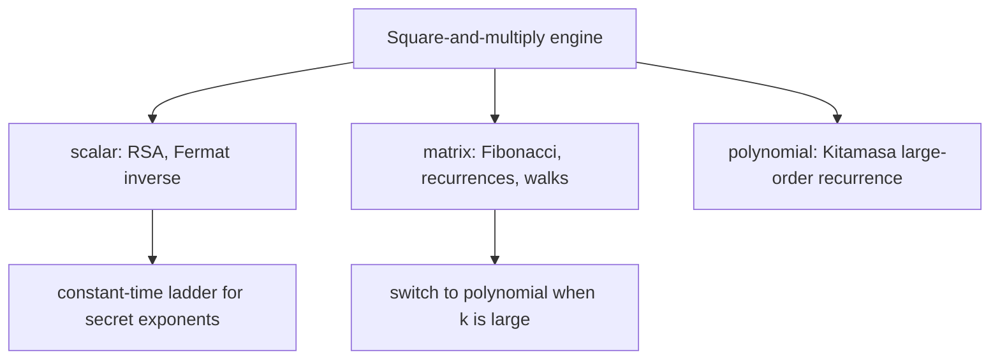

# Binary Exponentiation (Fast Power) — Senior Level

> A `powmod` one-liner is trivial — but the moment it runs inside RSA with a secret 2048-bit exponent, the *timing* of square-vs-multiply leaks the private key (a real attack class), the modular multiply becomes the hot path that decides throughput, and the same engine has to power matrices and polynomials for huge linear recurrences. At senior level the questions are: how do you make exponentiation **constant-time** and side-channel-resistant, how do you make the inner multiply fast (Montgomery, sliding windows), and when do you abandon scalar power for matrix or Kitamasa acceleration?

## Table of Contents

1. [Introduction](#1-introduction)
2. [Fast Power in Cryptography (RSA, Diffie-Hellman)](#2-fast-power-in-cryptography)
3. [Side-Channel Attacks and Constant-Time Exponentiation](#3-side-channel-attacks-and-constant-time-exponentiation) (concrete leak, blinding)
4. [Speeding Up the Inner Multiply: Montgomery and Windows](#4-speeding-up-the-inner-multiply) (worked window, strategy table)
5. [Matrix and Recurrence Acceleration](#5-matrix-and-recurrence-acceleration) (matrix vs Kitamasa, ladder caching)
6. [Modular Inverses, CRT, and Decryption Speedups](#6-modular-inverses-crt-and-decryption-speedups)
7. [Code Examples](#7-code-examples) (ladder, CRT decrypt, windowing, batch inverse) + hardware/SIMD + failure case studies
8. [When Fast Power Beats the Alternatives](#8-when-fast-power-beats-the-alternatives)
9. [Observability and Testing](#9-observability-and-testing) (property suite, determinism)
10. [Failure Modes](#10-failure-modes)
11. [Summary](#11-summary)

---

## 1. Introduction

Binary exponentiation appears in production in three guises that share one engine:

1. **Public-key cryptography** — RSA, Diffie-Hellman, DSA, and ElGamal are *all* modular exponentiation with operands hundreds to thousands of bits long. The exponent is often a *secret* (the RSA private key `d`, the DH private exponent), which turns the algorithm's data-dependent branching into a security liability.
2. **Combinatorics and hashing at scale** — modular inverses for binomial coefficients mod a prime, polynomial hashing, and number-theoretic transforms all call `powmod` in tight loops where the inner multiply dominates.
3. **Linear-recurrence and graph acceleration** — the same square-and-multiply, applied to matrices (`11-matrix-exponentiation`) or polynomials (Kitamasa), evaluates order-`k` recurrences and counts length-`n` walks in `O(k³ log n)` or `O(k² log n)`.

The senior decisions are therefore: (a) is the exponent secret, and if so make the algorithm **constant-time**; (b) make the inner `mulmod` fast (Montgomery, sliding-window exponentiation); (c) pick the right *monoid* — scalar for RSA, matrix for recurrences, polynomial for large-order ones; and (d) verify correctness against a slow oracle since `n` is too large to loop.

A useful mental model: at junior/middle level "fast power" is *an algorithm*; at senior level it is *a primitive others depend on*, so the questions shift from "is it correct" to "is it correct under adversarial timing, fast enough at this operand size, and the right monoid for this workload." The three failure axes are **security** (side channels), **performance** (the inner multiply), and **fit** (scalar vs matrix vs polynomial). Each section below addresses one axis, and the worked failure-mode case studies (§7.5) show what happens when an axis is neglected in shipped code. The cross-references — `16-montgomery-multiplication` for the multiply, `11-matrix-exponentiation` for the matrix monoid, `02-modular-arithmetic` for the field — are the topics this one composes.

---

## 2. Fast Power in Cryptography

### 2.1 RSA is exponentiation

RSA's entire operation is two modular exponentiations:

```
encrypt:  c = m^e mod N        (e public, small, e.g. 65537)
decrypt:  m = c^d mod N        (d secret, ~|N| bits)
sign:     s = h^d mod N        (d secret)
verify:   h = s^e mod N        (e public)
```

`N` is the product of two large primes (2048–4096 bits). Without binary exponentiation these powers are uncomputable — `d` can be 2048 bits, so the naive loop would need `~2^2048` multiplications. Fast power needs ~2048 squarings plus ~1024 multiplies. The whole security and performance of RSA rests on this algorithm being fast *and* on the modular multiply being correct and (ideally) constant-time.

### 2.2 Diffie-Hellman and discrete log

DH key exchange is `A = g^a mod p`, `B = g^b mod p`, shared secret `g^(ab) mod p` — three modular exponentiations. Its security rests on the *hardness* of the inverse problem (discrete log): easy to exponentiate, believed hard to invert. Binary exponentiation is the "easy direction."

### 2.3 Operand sizes change the cost model

For RSA-sized operands the inner multiply is **not** `O(1)` — multiplying two `b`-bit numbers is `O(b²)` schoolbook or `O(b^1.585)` Karatsuba, and the modular reduction is another `O(b²)` (or Montgomery, below). So an RSA decryption is `O(log d) = O(b)` multiplies, each `O(b²)`, giving `O(b³)` bit operations. This is why hardware acceleration and Montgomery multiplication matter so much.

This `O(b³)` cost model flips the optimization priorities relative to small-integer fast power. With word-size operands the *number of multiplies* (`~1.5 log n`) is everything; with `b`-bit operands the *cost per multiply* (`O(b²)`) dominates, so a 20% reduction in multiply count (windows) matters less than a 2× faster multiply (Montgomery, SIMD limbs). Senior tuning therefore targets the inner multiply first, the multiply *count* second — the reverse of the competitive-programming instinct.

---

## 3. Side-Channel Attacks and Constant-Time Exponentiation

### 3.1 The leak

The textbook right-to-left loop does a multiply **only when the current bit is 1**:

```
if (n & 1) result = mulmod(result, base, m);   // <-- executes only for 1-bits
base = mulmod(base, base, m);
```

An attacker who can measure *time*, *power consumption*, or *cache behavior* can tell whether the extra multiply happened — and therefore recover each bit of the secret exponent `d`. This is a real, deployed attack class (timing attacks on RSA, the basis of work by Kocher and many CVEs). Conditional branches and data-dependent memory access are the enemy.

### 3.2 The Montgomery ladder (constant-time)

The fix is to do the **same work for every bit**, regardless of its value. The Montgomery powering ladder maintains two values `R0, R1` with the invariant `R1 = R0 · base`, and at each bit performs *one multiply and one square unconditionally*, swapping based on the bit:

```text
montgomery_ladder(base, n, m):     # process bits MSB -> LSB
    R0 = 1
    R1 = base
    for bit from most-significant to least:
        if bit == 0:
            R1 = mulmod(R0, R1, m)   # always: one mul
            R0 = mulmod(R0, R0, m)   # always: one square
        else:
            R0 = mulmod(R0, R1, m)
            R1 = mulmod(R1, R1, m)
    return R0
```

Every bit costs exactly one multiply and one square; the *only* data-dependence is which register receives the result, which can be made constant-time with a conditional swap (`cswap`) that selects via arithmetic masks, not branches. This removes the timing and simple-power-analysis leak. It is the standard in modern crypto libraries (used for both modular and elliptic-curve scalar multiplication).

| Property | Right-to-left loop | Montgomery ladder |
|----------|-------------------|-------------------|
| Multiplies per bit | 0 or 1 (data-dependent) | exactly 1 |
| Squares per bit | 1 | exactly 1 |
| Timing leaks bits? | **Yes** | No |
| Branch on secret bit? | Yes | No (use `cswap`) |
| Use for secret exponents | Never | Yes |

### 3.3 Other hardening

- **Blinding:** randomize the base/exponent (`m' = m · r^e`, decrypt, multiply by `r^(-1)`) so each operation uses different operands, defeating statistical power analysis.
- **Constant-time `cswap`/`cmov`:** select between `R0`/`R1` with bitmasks, never `if`.
- **Avoid secret-dependent table indices:** sliding-window methods (below) index a precomputed table by exponent bits; with a secret exponent this is a cache-timing leak unless the table access is masked.

> **Senior rule:** if the exponent is secret, never use the data-dependent right-to-left loop. Use a constant-time ladder. If the exponent is public (the RSA *public* `e`, a problem's modulus reduction), the fast variable-time loop is fine and faster.

### 3.4 A concrete leak, step by step

To see *why* the basic loop leaks, suppose an RSA private exponent has the low bits `…1011`. The basic loop runs:

```
bit 1 (=1): MULTIPLY then SQUARE   -> two modular multiplies this iteration
bit 1 (=1): MULTIPLY then SQUARE   -> two
bit 0 (=0):          SQUARE only   -> one
bit 1 (=1): MULTIPLY then SQUARE   -> two
```

An attacker timing each iteration (or watching a power trace) sees the pattern "long, long, short, long" and reads off the bits `1,1,0,1` directly. Over a full 2048-bit exponent, this recovers the entire private key from a single trace — no cryptanalysis, just counting operations. The Montgomery ladder makes every iteration "long, long, long, long" (one multiply + one square always), erasing the pattern. This is not theoretical: timing attacks against unprotected RSA and the related Lucky-13 / cache-timing families are deployed, CVE-tracked vulnerabilities.

### 3.5 Why blinding is still needed

Even a constant-time ladder can leak through *power analysis* if the same secret operands are processed repeatedly, because differential power analysis (DPA) correlates many traces. **Exponent blinding** adds a random multiple of the group order to the exponent (`d' = d + r·φ(N)`, which gives the same result since `a^{φ(N)} ≡ 1`), so each operation uses a different exponent. **Base blinding** multiplies the input by `r^e` before and `r^{-1}` after. Together they decorrelate traces, defeating DPA on top of the timing protection from the ladder. Production RSA uses both.

---

## 4. Speeding Up the Inner Multiply

The exponentiation does `O(log n)` multiplies; making each multiply cheaper is the main performance lever.

### 4.1 Montgomery multiplication (not the ladder)

`mulmod` requires a division by `m` (the `% m`), which is the slowest CPU operation. **Montgomery multiplication** transforms operands into "Montgomery form" once, after which each modular product needs only multiplies and shifts (`REDC`), no division. For a power loop doing thousands of multiplies under a fixed odd modulus, this is a large win. Full treatment: `19-number-theory/16-montgomery-multiplication`. The pairing "binary exponentiation + Montgomery multiplication" is *the* production modular-power primitive.

### 4.2 Windowed exponentiation (fewer multiplies)

Instead of one bit at a time, process `w` bits per step. Precompute `base^1, base^3, base^5, …, base^(2^w − 1)` (odd powers), then for each window of `w` bits do `w` squarings and at most one multiply. This reduces the number of *non-squaring* multiplies from `~popcount(n)` to `~ log n / w`.

| Method | Multiplies (besides squares) | Precompute | Notes |
|--------|------------------------------|-----------|-------|
| Plain binary | `~ log n / 2` (avg) | none | simplest |
| Fixed `w`-ary window | `~ log n / w` | `2^w` powers | classic speedup |
| Sliding window | `~ log n / (w+1)` | `2^(w-1)` odd powers | fewer table entries, fewer mults |

For RSA, sliding windows with `w = 4..6` are standard, cutting multiply count by ~25–35%. With a secret exponent the table lookup must be constant-time.

### 4.4 Worked window example

Take `n = 0b11011001` (217) and `w = 2`. Group bits into 2-bit windows from the top: `11 01 10 01`. Precompute `base^1, base^2, base^3`. Process each window: square twice (shift the accumulator left by 2), then multiply by `base^{window value}` (skipping multiply for window `00`):

```
acc = base^3              # first window 11 = 3
acc = (acc^2)^2 · base^1  # window 01 = 1
acc = (acc^2)^2 · base^2  # window 10 = 2
acc = (acc^2)^2 · base^1  # window 01 = 1
```

That is 6 squarings (2 per window after the first) + 3 multiplies (one per nonzero window) + 1 initial = far fewer non-squaring multiplies than the `popcount(217) = 5` of plain binary, and the precompute was only 2 multiplies. The win grows with `w`, bounded by the `2^w` table cost — the classic time-space trade.

### 4.5 Choosing the inner-multiply strategy in production

| Operand size | Modulus | Inner multiply | Reduction |
|--------------|---------|----------------|-----------|
| ≤ 31 bits | `< 3·10^9` | native `int64 *` | `% m` |
| ≤ 62 bits | `< 9.2·10^18` | 128-bit (`__int128`/`bits.Mul64`) | Barrett or `% u128` |
| 256–4096 bits (crypto) | fixed odd | bignum limbs | **Montgomery REDC** |
| arbitrary one-off | any | `BigInteger` | library `modPow` |

The rule of thumb: native for small competitive-programming moduli; Montgomery for crypto-sized fixed moduli inside a hot power loop; `BigInteger.modPow` / Python `pow` for correctness-first one-offs. Never trial-divide in a crypto inner loop — Section 6 of `professional.md` quantifies why the division dominates.

### 4.3 CRT for RSA decryption (a 4x speedup)

RSA decryption `m = c^d mod N` can be split via the Chinese Remainder Theorem: compute `m_p = c^(d mod (p-1)) mod p` and `m_q = c^(d mod (q-1)) mod q`, then recombine. Each exponentiation is on *half-size* operands (half the bits), and modular multiply is `O(b²)`, so two half-size exponentiations cost ~`2 · (b/2)³ · 2 = b³/2` versus `b³` — roughly **4x faster**. Every real RSA implementation uses CRT decryption. (CRT itself: `19-number-theory` CRT topic.)

---

## 5. Matrix and Recurrence Acceleration

The same engine, different monoid:

- **Linear recurrences:** order-`k` recurrence → `k×k` companion matrix → `M^n` by fast power → `O(k³ log n)`. Fibonacci at `n = 10^18`, tilings, restricted-string counts. Full topic: `11-matrix-exponentiation`.
- **Graph walks:** adjacency matrix `A`, `(A^n)[i][j]` = number of length-`n` walks `i → j`; over the (min,+) tropical semiring it gives shortest paths of exactly `n` edges. Topic `11-graphs/32-paths-fixed-length`.
- **Large-order recurrences (Kitamasa):** when `k` is in the hundreds, the `k³` matrix multiply dominates. Kitamasa works in the *polynomial* monoid `ℤ_p[x]/(χ(x))` — fast-power a polynomial `x^n mod χ(x)`, then read coefficients — for `O(k² log n)` (or `O(k log k log n)` with NTT multiply). Same square-and-multiply, polynomial `mul`.

| Need | Monoid | Cost |
|------|--------|------|
| `a^n mod m` | integers mod `m` | `O(log n)` mults |
| order-`k` recurrence, small `k` | `k×k` matrices | `O(k³ log n)` |
| order-`k` recurrence, large `k` | polynomials mod `χ` | `O(k² log n)` |
| length-`n` walk count | adjacency matrices | `O(V³ log n)` |
| length-`n` shortest path | tropical matrices | `O(V³ log n)` |
| ECC scalar `[n]P` | curve group (additive) | `O(log n)` point ops |
| permutation `σ^n` | symmetric group | `O(N log n)` |

The unifying production lesson: write the bit-loop *once* as a generic `fastPow(multiply, identity)`, then supply the monoid. A single, well-tested loop then serves every row of this table — and any bug in the loop is found once, not per-monoid. This is why mature competitive-programming and crypto codebases have exactly one exponentiation routine, parameterized by the operation.



### 5.1 When does matrix vs Kitamasa actually pay off?

Concretely, for order `k` and index `n`:

| `k` | Matrix `O(k³ log n)` | Kitamasa `O(k² log n)` | NTT-Kitamasa `O(k log k log n)` |
|----:|----------------------|------------------------|---------------------------------|
| 2 (Fibonacci) | ~`8 log n` ops | ~`4 log n` | overhead not worth it |
| 10 | ~`1000 log n` | ~`100 log n` | ~`33 log n` |
| 100 | ~`10^6 log n` | ~`10^4 log n` | ~`660 log n` |
| 1000 | ~`10^9 log n` (too slow) | ~`10^6 log n` | ~`10^4 log n` |

For tiny `k` (Fibonacci, tribonacci) the matrix method's simplicity wins — the constant factors and code clarity dominate. Around `k ≈ 10–50` Kitamasa's `k²` overtakes. Beyond `k ≈ 100`, NTT-based polynomial multiplication inside Kitamasa is the only feasible route. The decision is purely `k`-driven; `n` affects all three identically (the `log n` factor). All three are the *same* binary-exponentiation loop with different `multiply` operations — scalar, matrix, polynomial.

### 5.2 Caching the squaring ladder for batch queries

When many queries share one base/matrix (e.g. answer `a^{n_1}, …, a^{n_q} mod p`), precompute the squaring ladder `a, a², a⁴, …, a^{2^{L}}` once (`L` squarings), then each query is only its popcount worth of multiplies. For `q` queries with `max n_j < 2^L`, total cost is `L + Σ ν(n_j)` instead of `Σ (log n_j + ν(n_j))` — the squarings are paid once. In a server answering modular-power requests against a fixed base, this caching turns each request into `~0.5 log n` multiplies. The same idea underlies fixed-base windowing in crypto (a precomputed table of base powers for a long-lived key).

---

## 6. Modular Inverses, CRT, and Decryption Speedups

Fast power is the standard modular-inverse primitive when the modulus is prime: `a^(-1) ≡ a^(p-2) (mod p)` by Fermat's little theorem, in `O(log p)`. This underlies:

- **Binomial coefficients mod a prime** — `C(n,k) = n! · (k!)^(-1) · ((n-k)!)^(-1) mod p`; the inverses come from fast power (or a precomputed inverse-factorial table built with one fast-power call plus a backward pass).
- **Division in modular hashing / NTT** — dividing by the transform length needs its inverse mod the NTT prime.
- **Batch inversion** — to invert many values, multiply prefix products, take *one* fast-power inverse of the total, then unwind — turning `n` inversions into `1` fast-power plus `O(n)` multiplies.

For composite moduli Fermat does not apply; use the extended Euclidean algorithm (`O(log m)` too, but works for any coprime `m`).

### 6.1 Euler's generalization and power towers

When the modulus is composite, the right exponent reduction uses **Euler's totient** `φ(m)`: `a^φ(m) ≡ 1 (mod m)` for `gcd(a, m) = 1`, so `a^e ≡ a^(e mod φ(m)) (mod m)`. This is what makes **power towers** `a^(a^(a^…)) mod m` computable: reduce the exponent at each level modulo the totient of the level above, recursing `φ(m), φ(φ(m)), …`, which collapses to `1` in `O(log m)` levels (the totient shrinks fast). The subtlety — when `gcd(a, m) ≠ 1` or the inner exponent is small — requires the *generalized* Euler theorem `a^e ≡ a^(e mod φ(m) + φ(m)) (mod m)` for `e ≥ log₂ m`. Each level is one fast power. This pattern (`tasks.md` Task 13) shows fast power composing with number theory beyond a single exponentiation.

### 6.2 Order finding and primitive roots

Fast power is the test inside **multiplicative-order** computation: the order of `a mod p` divides `p−1`, so factor `p−1` and, for each prime factor `q`, check `a^((p-1)/q) mod p` with fast power, dividing out `q` while the result is `1`. Finding a **primitive root** (an element of order exactly `p−1`) is the same test applied to candidates. Both are `O(log p)` per fast power and underlie Diffie-Hellman parameter generation and NTT root selection (`tasks.md` Task 14).

---

## 7. Code Examples

The examples below illustrate the three senior concerns: a **constant-time ladder** (security), **CRT decryption** (performance), **windowing** and **batch inversion** (throughput). Each is production-shaped but uses a placeholder `mulmod` for clarity — swap in Montgomery or a vetted big-integer library for real deployments. The structural point recurs: every variant is the same bit-loop with a different inner multiply and a different selection rule.

### 7.1 Constant-time Montgomery ladder (Go)

```go
package main

import "fmt"

// mulmod assumes m*m fits in 128 bits; use math/bits in production.
func mulmod(a, b, m uint64) uint64 {
	// placeholder: in production use bits.Mul64 + bits.Div64 or Montgomery REDC
	var res uint64 = 0
	a %= m
	for b > 0 {
		if b&1 == 1 {
			res = (res + a) % m
		}
		a = (a + a) % m
		b >>= 1
	}
	return res
}

// powLadder is constant-time in the exponent's bit *values*: every bit does
// exactly one multiply and one square. Use for SECRET exponents.
func powLadder(base, n, m uint64) uint64 {
	base %= m
	var R0 uint64 = 1 % m
	R1 := base
	// process bits from MSB to LSB
	for i := 63; i >= 0; i-- {
		bit := (n >> uint(i)) & 1
		// constant-time: do both products, select by bit (here via branch for clarity;
		// production uses a masked cswap to avoid the branch entirely)
		if bit == 0 {
			R1 = mulmod(R0, R1, m)
			R0 = mulmod(R0, R0, m)
		} else {
			R0 = mulmod(R0, R1, m)
			R1 = mulmod(R1, R1, m)
		}
	}
	return R0
}

func main() {
	fmt.Println(powLadder(3, 13, 1_000_000_007)) // 1594323
	fmt.Println(powLadder(2, 1_000_000, 1_000_000_007))
}
```

### 7.2 RSA-style modProw with BigInteger and CRT decryption (Java)

```java
import java.math.BigInteger;

public class RSAExp {
    // Public exponentiation (variable-time is fine for the PUBLIC exponent e).
    static BigInteger encrypt(BigInteger m, BigInteger e, BigInteger N) {
        return m.modPow(e, N); // BigInteger.modPow is binary exponentiation in C
    }

    // CRT decryption: ~4x faster than c.modPow(d, N) directly.
    static BigInteger decryptCRT(BigInteger c, BigInteger d,
                                 BigInteger p, BigInteger q) {
        BigInteger dp = d.mod(p.subtract(BigInteger.ONE));
        BigInteger dq = d.mod(q.subtract(BigInteger.ONE));
        BigInteger qInv = q.modInverse(p);
        BigInteger mp = c.modPow(dp, p);          // half-size exponentiation
        BigInteger mq = c.modPow(dq, q);          // half-size exponentiation
        BigInteger h = qInv.multiply(mp.subtract(mq)).mod(p);
        return mq.add(h.multiply(q));             // recombine via CRT
    }

    public static void main(String[] args) {
        BigInteger p = BigInteger.valueOf(61), q = BigInteger.valueOf(53);
        BigInteger N = p.multiply(q), e = BigInteger.valueOf(17);
        BigInteger phi = p.subtract(BigInteger.ONE).multiply(q.subtract(BigInteger.ONE));
        BigInteger d = e.modInverse(phi);
        BigInteger m = BigInteger.valueOf(65);
        BigInteger c = encrypt(m, e, N);
        System.out.println(decryptCRT(c, d, p, q)); // 65
    }
}
```

### 7.3b Fixed-window exponentiation (Python)

A `w`-bit window cuts the number of non-squaring multiplies. Precompute odd-or-all small powers, then process `w` bits at a time.

```python
def powmod_window(a, n, m, w=4):
    a %= m
    # precompute a^0 .. a^(2^w - 1)
    table = [1 % m] * (1 << w)
    for i in range(1, 1 << w):
        table[i] = table[i - 1] * a % m
    # process exponent in w-bit windows, MSB first
    bits = n.bit_length()
    result = 1 % m
    i = bits - 1
    # pad so we read full windows
    while i >= 0:
        lo = max(i - w + 1, 0)
        width = i - lo + 1
        for _ in range(width):       # square `width` times
            result = result * result % m
        window = (n >> lo) & ((1 << width) - 1)
        if window:                   # multiply by the window's power
            result = result * table[window] % m
        i = lo - 1
    return result


if __name__ == "__main__":
    M = 1_000_000_007
    assert powmod_window(3, 13, M) == pow(3, 13, M)
    assert powmod_window(2, 10**9, M) == pow(2, 10**9, M)
    print("window method matches built-in pow")
```

This does `~log n` squarings (unchanged) but only `~log n / w` multiplies — the speedup grows with `w`, capped by the `2^w` table-build cost. Sliding windows refine this further by only tabulating odd powers and floating the window over runs of zeros.

### 7.3 Fermat inverse and batch inversion (Python)

```python
def powmod(a, n, m):
    return pow(a, n, m)  # built-in binary exponentiation


def inv_fermat(a, p):
    """Modular inverse via Fermat — p must be prime."""
    return powmod(a, p - 2, p)


def batch_inverse(vals, p):
    """Invert many values with ONE fast-power call + O(n) multiplies."""
    n = len(vals)
    prefix = [1] * (n + 1)
    for i, v in enumerate(vals):
        prefix[i + 1] = prefix[i] * v % p
    inv_all = inv_fermat(prefix[n], p)   # the only fast-power call
    res = [0] * n
    for i in range(n - 1, -1, -1):
        res[i] = inv_all * prefix[i] % p
        inv_all = inv_all * vals[i] % p
    return res


if __name__ == "__main__":
    P = 1_000_000_007
    print(inv_fermat(7, 13))                  # 2 (7*2=14≡1 mod 13)
    invs = batch_inverse([2, 3, 5, 7], P)
    print([(v * iv) % P for v, iv in zip([2, 3, 5, 7], invs)])  # [1,1,1,1]
```

---

## 7.4 Hardware, SIMD, and big-number layout

For crypto-sized operands the inner multiply is itself a multi-limb algorithm, and exponentiation throughput is dominated by how well that multiply maps to hardware:

- **Limb representation:** big numbers are arrays of 32- or 64-bit "limbs". Choosing a redundant representation (e.g. 51-bit limbs in 64-bit words for Curve25519) leaves headroom so carries can be deferred across several multiplies — fewer carry-propagation stalls in the hot squaring loop.
- **Squaring is cheaper than general multiply:** `a²` has symmetric partial products, so a dedicated squaring routine does ~half the limb-multiplies of `a·b`. Since exponentiation does `log n` squarings and only `~0.5 log n` general multiplies, optimizing the squaring path is the highest-leverage micro-optimization.
- **SIMD / vector units:** AVX-512 IFMA and ARM's big-integer instructions multiply several limb-products in parallel; libraries hand-tune the modexp inner loop per microarchitecture.
- **Hardware accelerators:** TPMs, HSMs, and smartcards have dedicated modexp engines; the algorithm is the same square-and-multiply, but executed in constant-time silicon to also defeat side channels.

The senior takeaway: at the algorithm level you choose binary-exp + windows + Montgomery; the *remaining* performance is an engineering problem in the limb-multiply, where squaring specialization and SIMD dominate.

## 7.5 Failure-mode case studies

- **The CRT fault attack (Bellcore).** If RSA-CRT decryption computes `m_p` correctly but `m_q` is corrupted by a hardware glitch, the attacker can factor `N` from `gcd(m − m_faulty, N)`. *Mitigation:* verify the result by re-encrypting (`s^e ?= h`) before releasing a signature — a single extra public-exponent fast power.
- **Small-exponent / no-padding RSA.** Using `e = 3` with no padding lets `m` be recovered by a plain cube root when `m³ < N`. The exponentiation is correct; the *protocol* is broken. *Mitigation:* OAEP padding, `e = 65537`.
- **Non-constant-time `BigInteger.modPow`.** Some library versions are variable-time; using them for a secret exponent reintroduces the timing leak. *Mitigation:* use the library's explicitly constant-time API (e.g. `modPow` on a key flagged secret, or a vetted crypto library).
- **Forgotten `mod` in a recurrence matrix.** A matrix fast power that reduces entries but forgets to reduce after the *additive* accumulation overflows for large `k`. *Mitigation:* reduce inside the dot-product accumulation, or use a 128-bit accumulator with a bounded deferral count.

## 8. When Fast Power Beats the Alternatives

| Situation | Use | Why |
|-----------|-----|-----|
| `a^n mod m`, public `n` | variable-time right-to-left loop | fastest, no security concern |
| `c^d mod N`, secret `d` (crypto) | constant-time Montgomery ladder | prevents timing/SPA key recovery |
| RSA decryption | CRT + per-prime fast power | ~4x speedup on half-size operands |
| Many multiplies, fixed odd `m` | fast power + Montgomery mult | removes per-multiply division |
| order-`k` recurrence, small `k` | matrix fast power | `O(k³ log n)` |
| order-`k` recurrence, large `k` | polynomial fast power (Kitamasa) | `O(k² log n)` beats `k³` |
| invert many values mod prime | batch inversion (1 fast-power) | `O(n)` multiplies, one inverse |
| exact huge integer power | big-int fast power | cost dominated by result size |

**Do not** use fast power for tiny fixed exponents (just multiply), and **do not** use a variable-time loop for secret exponents.

A second-order rule: match the *reduction strategy* to the call pattern. A single one-off `a^n mod m` with a one-time modulus does not justify a Montgomery transform (the setup cost is not amortized); a long-lived RSA key processing thousands of operations under a fixed modulus absolutely does. Profile the call pattern, not just the algorithm — the "right" exponentiation for a batch server differs from the "right" one for a single CLI invocation, even though the bit-loop is identical.

---

## 9. Observability and Testing

Because `n` is typically too large to brute-force, observability for fast power is mostly about *trusting correctness without an oracle on the real input* and *detecting security regressions*. The tooling splits into algebraic property tests (correctness) and timing-correlation tests (constant-time guarantees).

- **Oracle testing:** for any `powmod` (scalar, matrix, polynomial), test against the naive `O(n)` loop on small `n` and small `m` before trusting huge inputs. A property test `powmod(a, x+y, m) == powmod(a,x,m)*powmod(a,y,m) % m` catches many bugs.
- **Constant-time verification:** for crypto code, measure that runtime does not correlate with the exponent's Hamming weight (e.g. `dudect`-style statistical tests). A correlation means a leak.
- **Overflow assertions:** assert `m * m` fits the integer type before using the simple `mulmod`; otherwise route to 128-bit/big-int.
- **Metrics in hot paths:** track `modexp_latency_p99` and `modexp_calls_per_sec`; a regression often means a fallback to big-integer slow path or a missing Montgomery transform.

| Metric | Alert threshold |
|--------|-----------------|
| `modexp_latency_p99` | > expected for key size (e.g. >5 ms for RSA-2048 decrypt) |
| timing-vs-Hamming-weight correlation | statistically significant ≠ 0 |
| big-int fallback rate | > 0 in a path that should be fixed-width |

### 9.1 A property-test suite that catches real bugs

Beyond the oracle, encode the algebraic laws as randomized property tests — they span the function's behavior (see `professional.md` §10.1.5):

```python
import random

def check(powmod, p=1_000_000_007, trials=10_000):
    for _ in range(trials):
        a = random.randrange(1, p)
        x = random.randrange(0, 10**18)
        y = random.randrange(0, 10**18)
        # exponent additivity
        assert powmod(a, x + y, p) == powmod(a, x, p) * powmod(a, y, p) % p
        # identity
        assert powmod(a, 0, p) == 1 % p
        # Fermat (p prime)
        assert powmod(a, p - 1, p) == 1
        # tower law
        assert powmod(powmod(a, x % (p-1), p), 2, p) == powmod(a, 2*(x % (p-1)), p)
    print("all properties hold")
```

The additivity and Fermat checks together catch essentially every overflow, off-by-one, and bad-identity bug. For a *new monoid* (matrices, polynomials) the same laws apply with the monoid's product — `power(M, x+y) == power(M,x)·power(M,y)` — which is the standard way to validate a matrix-exponentiation port before trusting it on huge `n`.

### 9.2 Reproducibility and determinism

Modular exponentiation is fully deterministic — the same `(a, n, m)` always yields the same residue across languages and platforms, with *no* floating-point nondeterminism. This makes it ideal for cross-language test vectors: a Go, Java, and Python `powmod` must agree bit-for-bit, and any divergence is a concrete bug (usually overflow or sign handling), not a tolerance issue. Crypto test suites (NIST CAVP for RSA) ship fixed `(a, n, m, expected)` vectors precisely because the operation is reproducible.

---

## 10. Failure Modes

- **Timing side-channel:** variable-time loop on a secret exponent leaks the key. *Fix:* constant-time ladder + blinding.
- **Overflow in `mulmod`:** `a*b` exceeds 64 bits for large `m`. *Fix:* 128-bit math, Russian-peasant, or Montgomery.
- **Wrong inverse:** Fermat used with composite modulus. *Fix:* extended Euclid for composite `m`.
- **Negative residues:** subtraction-based recurrences/bases produce negatives in Go/Java. *Fix:* normalize `((x%m)+m)%m`.
- **Matrix `k³` blowup:** large-order recurrence powered as a matrix. *Fix:* switch to polynomial Kitamasa.
- **Cache-timing on window tables:** secret-indexed precomputed powers leak via cache. *Fix:* masked/constant-time table access or scatter-gather.
- **Float contamination:** using `math.pow`/`Math.pow` for exact or modular results. *Fix:* never; integers only.
- **Missing result verification in signing:** releasing an RSA-CRT signature without re-checking `s^e ≡ h` exposes the Bellcore fault attack. *Fix:* one public-exponent fast power to verify before output.
- **Wrong reduction strategy for the call pattern:** a Montgomery transform on a one-off power wastes the setup; trial division in a hot loop wastes cycles. *Fix:* pick reduction by amortization (one-off vs batch), not by habit.
- **Untested monoid port:** reusing the bit-loop for a new type (matrix/polynomial) without re-validating the new `multiply`. *Fix:* run the algebraic property suite (§9.1) against the new monoid before trusting huge `n`.

---

- **Discrete-log "easy direction" misuse:** assuming `g^x mod p` hides `x` for small `x` — a brute-force or baby-step-giant-step recovers small exponents quickly. *Mitigation:* exponents must be cryptographically large and random; fast power's speed does not imply the inverse is hard for *small* `x`.
- **Tower / Euler-theorem off-by-one:** computing `a^(a^a) mod m` by reducing the exponent `mod φ(m)` without the `+φ(m)` correction is wrong when the inner exponent is small relative to `log m`. *Mitigation:* use the generalized Euler theorem form `a^e ≡ a^(e mod φ(m) + φ(m)) (mod m)` for `e ≥ log₂ m` (see `tasks.md` Task 13).
- **Negative-coefficient matrix recurrence:** a companion matrix with negative entries (from a recurrence that subtracts) yields negative residues under Go/Java `%`, corrupting the result silently. *Mitigation:* normalize every accumulation with `((x % m) + m) % m` inside the matrix `multiply`.
- **Variable-time table index on a secret exponent:** windowed exponentiation indexes a precomputed table by exponent bits; a cache-timing attacker reads the index. *Mitigation:* constant-time scatter-gather over the whole table, or avoid windows for secret exponents.

## 11. Summary

At senior level, binary exponentiation is the engine of public-key cryptography (RSA, DH), and its data-dependent branching is a security liability: a variable-time loop leaks a secret exponent through timing and power side-channels. Secret-exponent code must use a **constant-time Montgomery ladder** (uniform multiply+square per bit, masked `cswap`) plus blinding. Performance comes from making the inner `mulmod` cheap — **Montgomery multiplication** removes the per-multiply division, **windowed/sliding-window** exponentiation cuts the multiply count, and **CRT decryption** halves operand sizes for a ~4x RSA speedup. The same square-and-multiply, in the matrix or polynomial monoid, accelerates linear recurrences (`O(k³ log n)` matrices, `O(k² log n)` Kitamasa) and graph-walk counting. Always verify against a slow oracle, and for crypto verify constant-time behavior empirically.

The through-line across all senior concerns: binary exponentiation is one bit-loop parameterized by a monoid and a reduction strategy. Choose the monoid by the problem (residue / matrix / polynomial / curve point), the reduction by the operand size (native / Barrett / Montgomery), and the bit-handling by the threat model (variable-time if public, constant-time ladder if secret). Get those three choices right and the rest is the well-tested loop you wrote once.

---

Next step: [professional.md](./professional.md) — correctness via the binary-representation invariant, the `O(log n)` bound, multiplication counts, and addition-chain optimality.
