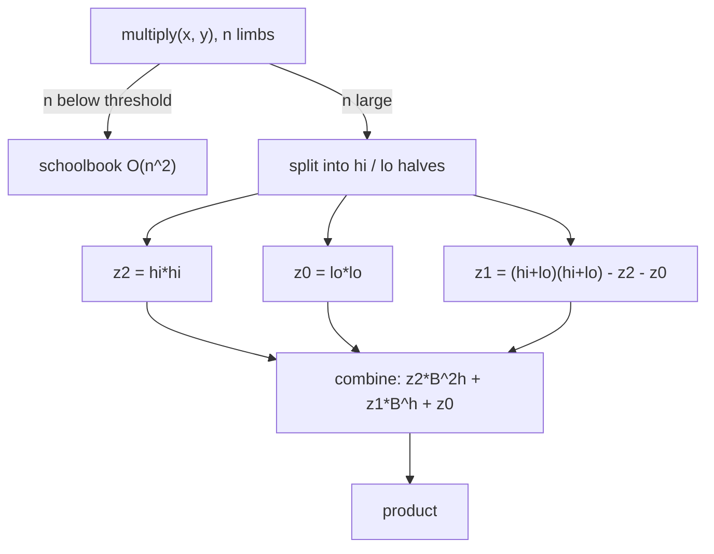

# Big Integer (Arbitrary-Precision) Arithmetic — Middle Level

> **One-line summary:** Schoolbook multiply is `O(n²)`; for big numbers that is too slow. **Karatsuba** splits each number into a high and a low half and computes the product with **three** half-size multiplications instead of four, giving `O(n^1.585)`. This file explains *why* that works, when to switch from schoolbook to Karatsuba (the crossover threshold), how to choose base and limb size, how **long division** and **modular reduction** work, how to handle **signs and normalization** cleanly, and when to just use the language built-in (`big.Int`, `BigInteger`, Python `int`).

---

## Table of Contents

1. [Introduction](#introduction)
2. [Deeper Concepts](#deeper-concepts)
3. [Karatsuba Multiplication](#karatsuba-multiplication)
4. [Toom-Cook (a Preview)](#toom-cook-a-preview)
5. [Comparison with Alternatives](#comparison-with-alternatives)
6. [Long Division and Modular Reduction](#long-division-and-modular-reduction)
7. [Signed Handling and Normalization](#signed-handling-and-normalization)
8. [Base and Limb Choice](#base-and-limb-choice)
9. [Code Examples](#code-examples)
10. [Error Handling](#error-handling)
11. [Performance Analysis](#performance-analysis)
12. [Best Practices](#best-practices)
13. [Visual Animation](#visual-animation)
14. [Summary](#summary)

---

## Introduction

> Focus: "Why does Karatsuba beat `O(n²)`?" and "When do I choose each algorithm?"

The junior file built a working bignum with `O(n)` add/subtract and `O(n²)` schoolbook multiply. That is enough until the numbers get large. Multiplying two 100-digit numbers (`n ≈ 12` limbs) does `~144` limb multiplies — trivial. Multiplying two **million-digit** numbers (`n ≈ 110_000` limbs) does `~10^10` limb multiplies — minutes of CPU time. The quadratic term dominates, and we need a sub-quadratic algorithm.

The breakthrough is **Karatsuba's algorithm** (Anatoly Karatsuba, 1960), which disproved the then-common belief that multiplication required `Θ(n²)` operations. The key realization: when you split each number into two halves and multiply, the naive divide-and-conquer needs **four** half-size products, which recurses back to `O(n²)`. Karatsuba shows that **three** half-size products suffice, by reusing one cleverly arranged sum. Three-instead-of-four turns the recurrence from `T(n)=4T(n/2)` (which is `O(n²)`) into `T(n)=3T(n/2)+O(n)` (which is `O(n^log₂3) = O(n^1.585)`).

This is a textbook **divide-and-conquer** result (cross-link `15-divide-and-conquer`), and the same idea generalizes: split into 3 parts (**Toom-Cook**, `O(n^1.465)`), and in the limit, transform to the frequency domain (**FFT/NTT**, `O(n log n)`, the senior file and `15-ntt`). Real libraries chain all of these by size: schoolbook for small, Karatsuba for medium, Toom-Cook larger, FFT/NTT for huge.

Beyond multiplication, the middle engineer must handle the *other* operations: **division** (the genuinely hard one — quotient digit estimation), **modular reduction** (`a mod m`, the backbone of cryptography), **base conversion**, **signs**, and the practical question of **when to just use the built-in** rather than rolling your own.

---

## Deeper Concepts

### Invariant: Limbs Stay in `[0, B)`, Length Encodes Magnitude

Every correct bignum operation must restore two invariants before returning:

1. **Range invariant** — every limb is in `[0, B)`. Carries/borrows enforce this.
2. **Canonical-length invariant** — no leading (most-significant) zero limbs, except the single limb `[0]` representing zero.

If either breaks, comparison and printing silently misbehave. Division and multiplication are the operations most likely to leave temporary violations, so they normalize at the end.

### Recurrence Relations: Why 3 Beats 4

Write each `n`-limb number as `x = x_hi·B^h + x_lo`, where `h = n/2` and `x_hi`, `x_lo` are `h`-limb halves. Then

```
x·y = x_hi·y_hi·B^(2h) + (x_hi·y_lo + x_lo·y_hi)·B^h + x_lo·y_lo
```

The naive version computes four products: `x_hi·y_hi`, `x_hi·y_lo`, `x_lo·y_hi`, `x_lo·y_lo`. Its cost recurrence is

```text
T(n) = 4·T(n/2) + O(n)      → by Master Theorem (a=4,b=2,log_b a=2) → Θ(n²)
```

Karatsuba observes the middle term `x_hi·y_lo + x_lo·y_hi` equals `(x_hi+x_lo)(y_hi+y_lo) − x_hi·y_hi − x_lo·y_lo`. The two outer products are already needed, so only **one new product** `(x_hi+x_lo)(y_hi+y_lo)` is required — three total:

```text
T(n) = 3·T(n/2) + O(n)      → Θ(n^(log_2 3)) = Θ(n^1.585)
```

The `+O(n)` covers the additions/subtractions to combine pieces — cheap relative to the multiplies.

---

## Karatsuba Multiplication

The three products, named by convention:

```
z2 = x_hi · y_hi          (high product)
z0 = x_lo · y_lo          (low product)
z1 = (x_hi+x_lo)(y_hi+y_lo) - z2 - z0     (middle product, the saving)

result = z2·B^(2h) + z1·B^h + z0
```

The `·B^h` and `·B^(2h)` are **limb shifts** (prepend `h` or `2h` zero limbs) — `O(n)`, not real multiplications. The whole thing recurses: each sub-product calls Karatsuba again until the operands are small enough that schoolbook is faster, then bottoms out.

**The crossover threshold.** Karatsuba's extra additions, allocations, and recursion overhead make it *slower* than schoolbook for small `n`. Production libraries fall back to schoolbook below a threshold (typically `n ≈ 20–80` limbs, tuned per platform). GMP, Java's `BigInteger`, and Go's `math/big` all keep such cutoffs.



---

## Toom-Cook (a Preview)

Karatsuba is the 2-way (`Toom-2`) case of a family. **Toom-Cook-3** splits each number into **three** parts and, by treating the parts as a polynomial evaluated at several points, computes the product with **five** multiplications of size `n/3` instead of nine:

```text
Toom-3: T(n) = 5·T(n/3) + O(n)  →  Θ(n^(log_3 5)) ≈ Θ(n^1.465)
```

The trick: write `x` and `y` as degree-2 polynomials in `B^(n/3)`, multiply the polynomials (a degree-4 result has 5 coefficients), recover the coefficients by **evaluating at 5 points and interpolating** (this is the same evaluate–multiply–interpolate idea that FFT pushes to its extreme — see `22-polynomial-operations`). The combine step is messier (interpolation with small rational coefficients), so Toom-3 only pays off above a larger threshold than Karatsuba. Libraries use Toom-3, sometimes Toom-4, in the band between Karatsuba and FFT.

---

## Comparison with Alternatives

| Algorithm | Time | Crossover (approx) | Combine cost | Notes |
|-----------|------|--------------------|--------------|-------|
| Schoolbook | O(n²) | best below ~20–80 limbs | trivial | cache-friendly, tiny constant |
| Karatsuba | O(n^1.585) | ~20–80 to ~few hundred | moderate (3 adds/subs) | easy to implement |
| Toom-Cook-3 | O(n^1.465) | ~hundreds to thousands | high (interpolation) | diminishing returns |
| FFT / NTT | O(n log n) | thousands of limbs and up | high constant, exact via NTT | senior file; see `15-ntt` |

| Attribute | Schoolbook | Karatsuba | FFT/NTT |
|-----------|-----------|-----------|---------|
| Asymptotic | O(n²) | O(n^1.585) | O(n log n) |
| Constant factor | smallest | small | largest |
| Implementation effort | trivial | low | high |
| Best for | small numbers | medium numbers | huge numbers |
| Exact (no rounding)? | yes | yes | yes (NTT); FFT needs care |

**Choose schoolbook when:** numbers are small (a few limbs) or you need dead-simple, obviously correct code.
**Choose Karatsuba when:** numbers are medium-to-large and you want a big speedup with little implementation cost.
**Choose FFT/NTT when:** numbers are huge (thousands+ of limbs) — see the senior file.

---

## Long Division and Modular Reduction

Division is the hardest of the four basic operations: there is no simple closed form, you must **estimate quotient digits** and correct them.

### Division by a Single Limb — Easy

Sweep limbs from **most**-significant down, carrying a remainder:

```text
divmod_small(a, k):          # a is little-endian, k fits in a limb
    rem = 0
    for i from top limb down to 0:
        cur = rem*B + a[i]
        q[i] = cur / k
        rem  = cur % k
    return normalize(q), rem
```

This is `O(n)` and is the workhorse of **base conversion** (repeatedly divide by `10^9` to peel off limbs, or by `10` to peel decimal digits).

### Full Long Division — Knuth's Algorithm D

Dividing by a multi-limb divisor uses **Knuth's Algorithm D** (TAOCP Vol. 2). Outline:

1. **Normalize** so the divisor's top limb is `≥ B/2` (multiply both `a` and `b` by a scaling factor `d`); this makes the quotient-digit estimate accurate.
2. For each quotient digit (top to bottom), **estimate** `q̂ = (top two limbs of remainder) / (top limb of divisor)`.
3. **Correct** `q̂` down by at most 2 if the estimate was too large (a provable bound).
4. **Multiply-and-subtract** `q̂ · divisor` from the running remainder; if it went negative, add the divisor back and decrement `q̂`.
5. Continue; the leftover is the remainder, which you **de-normalize** by dividing by `d`.

Total cost: `O(n·m)` for an `n`-limb dividend and `m`-limb divisor — same order as schoolbook multiply.

### Modular Reduction `a mod m`

`a mod m` is the remainder of long division. For cryptography you repeat it constantly (every multiply in modular exponentiation), so libraries use faster reductions that avoid general division:

- **Barrett reduction** — precompute `μ = floor(B^{2k} / m)` once; each reduction becomes two multiplies and a subtraction.
- **Montgomery reduction** — work in a transformed "Montgomery domain" where reduction is shifts and adds, no division. (Dedicated topic: `16-montgomery-multiplication`.)

Both turn `O(n²)` trial division into the cost of a multiply (which Karatsuba/FFT then accelerate).

---

## Signed Handling and Normalization

The junior file used unsigned magnitudes. Real bignums are signed. The clean design: **sign-magnitude** — store `sign ∈ {−1, 0, +1}` plus an unsigned magnitude (limb array).

| Operation | Rule (with signs) |
|-----------|-------------------|
| `+a + +b` | add magnitudes, sign `+` |
| `−a + −b` | add magnitudes, sign `−` |
| `+a + −b` | compare magnitudes; subtract smaller from larger; sign of larger |
| `a − b` | rewrite as `a + (−b)` |
| `a · b` | multiply magnitudes; sign = `sign(a)·sign(b)` |
| `a / b` | divide magnitudes; sign = `sign(a)·sign(b)`; **define rounding** (truncate vs floor) explicitly |

**Zero is special:** its sign is canonically `0` (or `+`), never `−0`. Normalization must collapse any all-zero magnitude to the canonical zero. This is why every operation ends with a normalize step.

**Division rounding gotcha:** languages disagree on the sign of `%` for negatives. Decide whether your bignum follows *truncated* division (Go/Java `%` can be negative) or *floored* division (Python `%` follows the divisor's sign) and document it — mismatches cause subtle bugs across languages.

---

## Base and Limb Choice

| Choice | Pros | Cons |
|--------|------|------|
| Base `10^9` (32-bit limb) | trivial decimal I/O; product fits 64-bit | division/mod cost real `%`/`/` |
| Base `2^32` (in 64-bit limb) | mask/shift instead of `%`/`/`; fast | decimal conversion needs work |
| Base `2^64` (with 128-bit mul) | densest, fewest limbs | needs `__int128` / `math/bits.Mul64`; harder |

**Practical guidance:**
- For **competitive programming** with decimal I/O, base `10^9` is the sweet spot — simple and fast enough.
- For **performance/crypto libraries**, base `2^32` or `2^64` wins because reductions become bit operations and CPUs have wide-multiply instructions (`MULX`, `UMULH`).
- The hard constraint is always: **`limb × limb + carry` must fit a native wide type**. `10^9 · 10^9 < 10^18 < 2^63` ✓. `2^32 · 2^32 = 2^64`, which fits an *unsigned* 64-bit with the high half captured separately.

---

## Code Examples

### Karatsuba Multiplication (with schoolbook fallback)

Base `10^9`, little-endian, non-negative magnitudes. The threshold keeps small cases on schoolbook.

#### Go

```go
package main

import "fmt"

const Base = 1_000_000_000
const KaratsubaCutoff = 32 // below this many limbs, use schoolbook

func norm(a []int64) []int64 {
	for len(a) > 1 && a[len(a)-1] == 0 {
		a = a[:len(a)-1]
	}
	return a
}

func add(a, b []int64) []int64 {
	n := len(a)
	if len(b) > n {
		n = len(b)
	}
	res := make([]int64, 0, n+1)
	var c int64
	for i := 0; i < n; i++ {
		s := c
		if i < len(a) {
			s += a[i]
		}
		if i < len(b) {
			s += b[i]
		}
		res = append(res, s%Base)
		c = s / Base
	}
	if c > 0 {
		res = append(res, c)
	}
	return norm(res)
}

func sub(a, b []int64) []int64 { // a >= b
	res := make([]int64, len(a))
	var borrow int64
	for i := 0; i < len(a); i++ {
		d := a[i] - borrow
		if i < len(b) {
			d -= b[i]
		}
		if d < 0 {
			d += Base
			borrow = 1
		} else {
			borrow = 0
		}
		res[i] = d
	}
	return norm(res)
}

// shiftLimbs multiplies by Base^k (prepend k zero limbs).
func shiftLimbs(a []int64, k int) []int64 {
	res := make([]int64, k+len(a))
	copy(res[k:], a)
	return norm(res)
}

func schoolbook(a, b []int64) []int64 {
	res := make([]int64, len(a)+len(b))
	for i := 0; i < len(a); i++ {
		var c int64
		for j := 0; j < len(b); j++ {
			cur := res[i+j] + a[i]*b[j] + c
			res[i+j] = cur % Base
			c = cur / Base
		}
		res[i+len(b)] += c
	}
	return norm(res)
}

func karatsuba(a, b []int64) []int64 {
	if len(a) < KaratsubaCutoff || len(b) < KaratsubaCutoff {
		return schoolbook(a, b)
	}
	n := len(a)
	if len(b) > n {
		n = len(b)
	}
	h := n / 2

	split := func(x []int64) (lo, hi []int64) {
		if len(x) <= h {
			return norm(append([]int64{}, x...)), []int64{0}
		}
		return norm(append([]int64{}, x[:h]...)), norm(append([]int64{}, x[h:]...))
	}
	aLo, aHi := split(a)
	bLo, bHi := split(b)

	z0 := karatsuba(aLo, bLo)
	z2 := karatsuba(aHi, bHi)
	z1 := karatsuba(add(aLo, aHi), add(bLo, bHi))
	z1 = sub(sub(z1, z2), z0)

	// result = z2*B^(2h) + z1*B^h + z0
	res := add(shiftLimbs(z2, 2*h), shiftLimbs(z1, h))
	return add(res, z0)
}

func main() {
	a := []int64{234, 1} // 1234
	b := []int64{678, 5} // 5678
	fmt.Println(karatsuba(a, b)) // [652 6 7] = 7006652
}
```

#### Java

```java
import java.util.Arrays;

public class Karatsuba {
    static final long BASE = 1_000_000_000L;
    static final int CUTOFF = 32;

    static long[] norm(long[] a) {
        int n = a.length;
        while (n > 1 && a[n - 1] == 0) n--;
        return Arrays.copyOf(a, n);
    }

    static long[] add(long[] a, long[] b) {
        int n = Math.max(a.length, b.length);
        long[] r = new long[n + 1];
        long c = 0;
        for (int i = 0; i < n; i++) {
            long s = c + (i < a.length ? a[i] : 0) + (i < b.length ? b[i] : 0);
            r[i] = s % BASE; c = s / BASE;
        }
        r[n] = c;
        return norm(r);
    }

    static long[] sub(long[] a, long[] b) { // a >= b
        long[] r = new long[a.length];
        long borrow = 0;
        for (int i = 0; i < a.length; i++) {
            long d = a[i] - borrow - (i < b.length ? b[i] : 0);
            if (d < 0) { d += BASE; borrow = 1; } else borrow = 0;
            r[i] = d;
        }
        return norm(r);
    }

    static long[] shift(long[] a, int k) {
        long[] r = new long[a.length + k];
        System.arraycopy(a, 0, r, k, a.length);
        return norm(r);
    }

    static long[] schoolbook(long[] a, long[] b) {
        long[] r = new long[a.length + b.length];
        for (int i = 0; i < a.length; i++) {
            long c = 0;
            for (int j = 0; j < b.length; j++) {
                long cur = r[i + j] + a[i] * b[j] + c;
                r[i + j] = cur % BASE; c = cur / BASE;
            }
            r[i + b.length] += c;
        }
        return norm(r);
    }

    static long[] karatsuba(long[] a, long[] b) {
        if (a.length < CUTOFF || b.length < CUTOFF) return schoolbook(a, b);
        int n = Math.max(a.length, b.length), h = n / 2;
        long[] aLo = norm(Arrays.copyOfRange(a, 0, Math.min(h, a.length)));
        long[] aHi = a.length > h ? norm(Arrays.copyOfRange(a, h, a.length)) : new long[]{0};
        long[] bLo = norm(Arrays.copyOfRange(b, 0, Math.min(h, b.length)));
        long[] bHi = b.length > h ? norm(Arrays.copyOfRange(b, h, b.length)) : new long[]{0};

        long[] z0 = karatsuba(aLo, bLo);
        long[] z2 = karatsuba(aHi, bHi);
        long[] z1 = sub(sub(karatsuba(add(aLo, aHi), add(bLo, bHi)), z2), z0);

        return add(add(shift(z2, 2 * h), shift(z1, h)), z0);
    }

    public static void main(String[] args) {
        long[] a = {234, 1}, b = {678, 5};
        System.out.println(Arrays.toString(karatsuba(a, b))); // [652, 6, 7]
    }
}
```

#### Python

```python
BASE = 10 ** 9
CUTOFF = 32


def norm(a):
    while len(a) > 1 and a[-1] == 0:
        a.pop()
    return a


def add(a, b):
    r, c = [], 0
    for i in range(max(len(a), len(b))):
        s = c + (a[i] if i < len(a) else 0) + (b[i] if i < len(b) else 0)
        r.append(s % BASE); c = s // BASE
    if c:
        r.append(c)
    return norm(r)


def sub(a, b):  # a >= b
    r, borrow = [], 0
    for i in range(len(a)):
        d = a[i] - borrow - (b[i] if i < len(b) else 0)
        if d < 0:
            d += BASE; borrow = 1
        else:
            borrow = 0
        r.append(d)
    return norm(r)


def shift(a, k):
    return norm([0] * k + a[:]) if a != [0] else [0]


def schoolbook(a, b):
    r = [0] * (len(a) + len(b))
    for i in range(len(a)):
        c = 0
        for j in range(len(b)):
            cur = r[i + j] + a[i] * b[j] + c
            r[i + j] = cur % BASE; c = cur // BASE
        r[i + len(b)] += c
    return norm(r)


def karatsuba(a, b):
    if len(a) < CUTOFF or len(b) < CUTOFF:
        return schoolbook(a, b)
    n = max(len(a), len(b)); h = n // 2
    a_lo, a_hi = norm(a[:h]), norm(a[h:]) if len(a) > h else [0]
    b_lo, b_hi = norm(b[:h]), norm(b[h:]) if len(b) > h else [0]
    z0 = karatsuba(a_lo, b_lo)
    z2 = karatsuba(a_hi, b_hi)
    z1 = sub(sub(karatsuba(add(a_lo, a_hi), add(b_lo, b_hi)), z2), z0)
    return add(add(shift(z2, 2 * h), shift(z1, h)), z0)


if __name__ == "__main__":
    print(karatsuba([234, 1], [678, 5]))  # [652, 6, 7]
```

**What it does:** multiplies via Karatsuba, recursing with three half-size products and falling back to schoolbook below the cutoff.
**Run:** `go run main.go` | `javac Karatsuba.java && java Karatsuba` | `python karatsuba.py`

### Division by a Small Number + Base Conversion

#### Go

```go
// divmodSmall divides little-endian a by limb k, returning quotient and remainder.
func divmodSmall(a []int64, k int64) ([]int64, int64) {
	q := make([]int64, len(a))
	var rem int64
	for i := len(a) - 1; i >= 0; i-- {
		cur := rem*Base + a[i]
		q[i] = cur / k
		rem = cur % k
	}
	return norm(q), rem
}
```

#### Java

```java
static long[] divmodSmall(long[] a, long k, long[] remOut) {
    long[] q = new long[a.length];
    long rem = 0;
    for (int i = a.length - 1; i >= 0; i--) {
        long cur = rem * BASE + a[i];
        q[i] = cur / k; rem = cur % k;
    }
    remOut[0] = rem;
    return norm(q);
}
```

#### Python

```python
def divmod_small(a, k):
    q, rem = [0] * len(a), 0
    for i in range(len(a) - 1, -1, -1):
        cur = rem * BASE + a[i]
        q[i] = cur // k
        rem = cur % k
    return norm(q), rem
```

---

## Error Handling

| Scenario | What goes wrong | Correct approach |
|----------|-----------------|------------------|
| Karatsuba split with uneven lengths | misaligned shifts → wrong product | split at a fixed `h`, treat missing high half as `[0]` |
| Forgetting `z1 = z1 − z2 − z0` | middle term doubled | always subtract both outer products |
| Division by zero | crash / infinite loop | check divisor `≠ 0` before dividing |
| Quotient-digit overestimate | remainder goes negative | add divisor back, decrement quotient digit (Algorithm D) |
| Negative `%` across languages | sign mismatch in results | fix one convention (truncate or floor) and document |
| Cutoff too low | Karatsuba overhead slows small cases | tune cutoff (~20–80 limbs) by benchmarking |

---

## Performance Analysis

Benchmark schoolbook vs Karatsuba vs the language built-in as `n` grows. The crossover and the asymptotic gap should be visible.

#### Go

```go
package main

import (
	"fmt"
	"math/big"
	"math/rand"
	"time"
)

func randBig(digits int) *big.Int {
	n := new(big.Int)
	for i := 0; i < digits; i++ {
		n.Mul(n, big.NewInt(10))
		n.Add(n, big.NewInt(int64(rand.Intn(10))))
	}
	return n
}

func main() {
	for _, d := range []int{100, 1000, 10000, 100000} {
		a, b := randBig(d), randBig(d)
		start := time.Now()
		for i := 0; i < 20; i++ {
			new(big.Int).Mul(a, b) // math/big auto-selects schoolbook/Karatsuba/Toom/FFT
		}
		fmt.Printf("digits=%6d: %.3f ms\n", d, float64(time.Since(start).Microseconds())/20.0/1000)
	}
}
```

#### Java

```java
import java.math.BigInteger;
import java.util.Random;

public class Bench {
    public static void main(String[] args) {
        Random rng = new Random(1);
        for (int d : new int[]{100, 1000, 10000, 100000}) {
            BigInteger a = new BigInteger(d * 3, rng);
            BigInteger b = new BigInteger(d * 3, rng);
            long start = System.nanoTime();
            for (int i = 0; i < 20; i++) a.multiply(b); // auto Karatsuba/Toom
            System.out.printf("bits~%6d: %.3f ms%n", d * 3, (System.nanoTime() - start) / 20.0 / 1e6);
        }
    }
}
```

#### Python

```python
import random, timeit

for d in [100, 1000, 10000, 100000]:
    a = random.randint(10 ** (d - 1), 10 ** d)
    b = random.randint(10 ** (d - 1), 10 ** d)
    t = timeit.timeit(lambda: a * b, number=20)  # CPython uses Karatsuba above ~70 digits
    print(f"digits={d:>6}: {t / 20 * 1000:.3f} ms")
```

You will observe roughly `4×` time per `10×` size for schoolbook (`O(n²)`), but closer to `3^log` scaling for Karatsuba, and near-linear for the built-ins at large sizes (they switch to FFT/Toom).

---

## Best Practices

- **Layer your multiply:** schoolbook → Karatsuba → (optionally Toom/FFT), each with a benchmarked cutoff.
- **Implement unsigned magnitude first**, then wrap signs around it — never tangle sign logic into the carry loops.
- **Normalize after every shrinking op** (sub, mul, div).
- For division, use **Knuth Algorithm D** with the top-limb `≥ B/2` normalization; don't invent your own quotient estimate.
- For repeated `mod m` (crypto), switch to **Barrett or Montgomery** (`16-montgomery-multiplication`).
- **Prefer the built-in for production:** Go `math/big`, Java `BigInteger`, Python `int` are correct, fast, and battle-tested. Roll your own only to learn or to meet a special constraint (e.g. constant-time crypto — senior file).
- **Test against the built-in** on random inputs every time you hand-roll.

---

## Visual Animation

> See [`animation.html`](./animation.html) for interactive visualization.
>
> Middle-level animation includes:
> - **Limb-array addition** with the carry highlighted as it propagates left.
> - **Schoolbook vs Karatsuba multiplication side by side**, showing 4 partial products vs Karatsuba's 3 sub-products and the high/low split.
> - Step counter and a Big-O table contrasting `O(n²)` and `O(n^1.585)`.

---

## Summary

At the middle level, the central win is **Karatsuba**: split each number into high/low halves and use the identity `mid = (hi+lo)(hi+lo) − hi·hi − lo·lo` to need only **three** half-size products, turning `T(n)=4T(n/2)` into `T(n)=3T(n/2)+O(n) = O(n^1.585)`. Above a benchmarked cutoff you switch from schoolbook to Karatsuba; far above that, libraries chain Toom-Cook and FFT/NTT. The other operations round out a real bignum: **long division** via Knuth's Algorithm D (`O(n·m)`, with quotient-digit estimation), **modular reduction** sped up by Barrett/Montgomery, **base conversion** via repeated small division, and clean **sign-magnitude** handling with consistent normalization. For real code, prefer `big.Int` / `BigInteger` / Python `int` — they already do all of this — and always test hand-rolled code against them.

---

**Next step:** [senior.md](./senior.md) — FFT/NTT multiplication, memory and cache behavior, constant-time crypto-grade arithmetic, and bignum library design.
