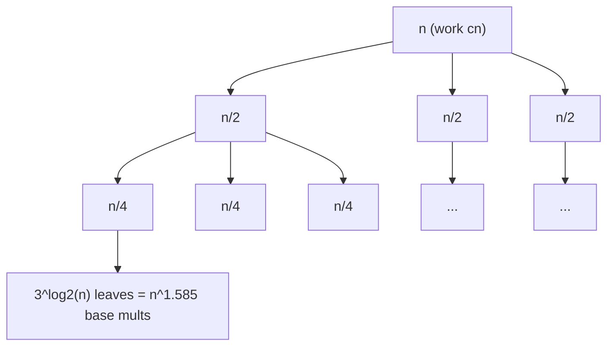

# Big Integer (Arbitrary-Precision) Arithmetic — Mathematical Foundations and Complexity Theory

> **One-line summary:** This file treats big-integer arithmetic as a problem in algebraic complexity: we formalize the limb model, prove correctness of the carry/borrow algorithms via loop invariants, derive the exact recurrences for schoolbook, Karatsuba, Toom-Cook, and FFT/NTT multiplication (with Master Theorem solutions), prove the `O(n log n)` convolution bound and the exactness conditions for FFT vs NTT, and survey the multiplication **lower-bound** landscape from the trivial `Ω(n)` to the Harvey–van der Hoeven `O(n log n)` upper bound and the conjectured `Ω(n log n)` lower bound.

---

## Table of Contents

1. [Formal Model and Definitions](#1-formal-model-and-definitions)
2. [Correctness of Addition (Loop Invariant)](#2-correctness-of-addition-loop-invariant)
3. [Correctness of Subtraction and Comparison](#3-correctness-of-subtraction-and-comparison)
4. [Schoolbook Multiplication: Correctness and Θ(nm)](#4-schoolbook-multiplication-correctness-and-θnm)
5. [Karatsuba: Identity, Recurrence, and Master Theorem](#5-karatsuba-identity-recurrence-and-master-theorem)
6. [Toom-Cook: Evaluation–Interpolation and General Recurrence](#6-toom-cook-evaluationinterpolation-and-general-recurrence)
7. [Convolution and the O(n log n) Multiplication Bound](#7-convolution-and-the-on-log-n-multiplication-bound)
8. [FFT vs NTT: Exactness Conditions](#8-fft-vs-ntt-exactness-conditions)
9. [Division: Correctness of Quotient Estimation](#9-division-correctness-of-quotient-estimation)
10. [Lower Bounds and the Complexity Landscape](#10-lower-bounds-and-the-complexity-landscape)
11. [Amortized Analysis of Repeated-Squaring Powers](#11-amortized-analysis-of-repeated-squaring-powers)
12. [Space Complexity and the Bit vs Word Model](#12-space-complexity-and-the-bit-vs-word-model)
13. [Worked Karatsuba Recursion-Tree Trace](#13-worked-karatsuba-recursion-tree-trace)
14. [Reductions: Division, GCD, and Conversion to M(n)](#14-reductions-division-gcd-and-conversion-to-mn)
15. [Comparison of Algorithms](#15-comparison-of-algorithms)
16. [Summary](#16-summary)

---

## 1. Formal Model and Definitions

**Definition 1.1 (Limb representation).** Fix a **base** `B ≥ 2`. A non-negative integer `x` is represented by a finite sequence of **limbs** `a = (a_0, a_1, …, a_{n-1})` with `0 ≤ a_i < B`, under the valuation

```
val(a) = Σ_{i=0}^{n-1} a_i · B^i.
```

The representation is **little-endian** (`a_0` least significant). It is **canonical** (normalized) iff `n = 1` or `a_{n-1} ≠ 0`. Canonical representations are in bijection with ℕ.

**Definition 1.2 (Signed integers).** A signed integer is a pair `(s, a)` with `s ∈ {−1, 0, +1}`, `a` a canonical magnitude, and the constraint `s = 0 ⟺ val(a) = 0` (no negative zero). The value is `s · val(a)`.

**Definition 1.3 (Cost model).** We count **word operations**: an addition, multiplication, division, or comparison of two values in `[0, B²)` costs `O(1)` (the "RAM with `B`-bounded words" model). `n` denotes the number of limbs; the bit length is `Θ(n log B)`. Asymptotic results are stated in `n`; converting to bit complexity multiplies by the constant `log B`.

**Definition 1.4 (Multiplication function `M(n)`).** `M(n)` is the word-operation cost of multiplying two `n`-limb integers. It is the central object of this file; many other operations (division, gcd, modular reduction, base conversion) reduce to `O(M(n))` or `O(M(n) log n)`.

**Convention 1.5 (Regularity of `M`).** We assume `M` is **superadditive and smooth**: `M(n) + M(m) ≤ M(n+m)` and `M(2n) ≤ C·M(n)` for a constant `C` (`C = 4` for schoolbook, `3` for Karatsuba, `2+o(1)` for FFT). These standard regularity conditions are what make the geometric-series arguments in Sections 11 and 14 valid: they guarantee that a sum `Σ_k M(2^k)` over a doubling sequence is `Θ(M(2^{max k}))`, i.e. dominated by its largest term. Every algorithm considered here satisfies them.

**Standing assumption (no intermediate overflow).** We require `2B² + B ≤ W` where `W` is the native word ceiling, so that any `a_i·b_j + carry + accumulator` term fits in one word during multiplication. With 64-bit words this permits `B ≤ 10^9` (decimal) or `B = 2^32`.

---

## 2. Correctness of Addition (Loop Invariant)

**Algorithm ADD.** Given canonical `a` (length `n`) and `b` (length `m`), let `N = max(n, m)`. Treat out-of-range limbs as 0.

```text
carry ← 0
for i ← 0 to N-1:
    s ← a_i + b_i + carry
    c_i ← s mod B
    carry ← s div B
if carry > 0: c_N ← carry ; output length N+1 else N
```

**Theorem 2.1 (ADD correctness).** `val(c) = val(a) + val(b)`.

**Proof (loop invariant + induction).** Define the invariant `I(k)` at the *start* of iteration `k`:

```
Σ_{i=0}^{k-1} c_i · B^i  +  carry · B^k  =  Σ_{i=0}^{k-1} (a_i + b_i) · B^i.      (I_k)
```

*Base `k = 0`:* both sides are `0` (empty sum, `carry = 0`). ✓

*Inductive step:* assume `I(k)`. In iteration `k`, `s = a_k + b_k + carry_old`, and by the division algorithm `s = carry_new·B + c_k` with `0 ≤ c_k < B`. Then

```
LHS(I_{k+1}) = Σ_{i<k} c_i B^i + c_k B^k + carry_new·B^{k+1}
            = (Σ_{i<k} c_i B^i + carry_old·B^k)            ... regroup carry term
              + (c_k + carry_new·B − carry_old)·B^k
            = RHS(I_k) + (s − carry_old)·B^k                ... since c_k + carry_new·B = s
            = Σ_{i<k}(a_i+b_i)B^i + (a_k+b_k)·B^k           ... using I_k and s−carry_old = a_k+b_k
            = Σ_{i≤k}(a_i+b_i)B^i = RHS(I_{k+1}).  ✓
```

*Termination & postcondition:* the loop runs exactly `N` times. At exit `I(N)` holds; appending the final `carry` as `c_N` makes `Σ_{i=0}^{N} c_i B^i = Σ_{i<N}(a_i+b_i)B^i + carry·B^N = val(a)+val(b)`. ∎

**Bound (range invariant).** Each `s ≤ (B−1)+(B−1)+1 = 2B−1`, so `carry = s div B ∈ {0,1}` always — the final carry is a single limb. **Cost:** `Θ(N) = Θ(max(n,m))` word ops.

**Corollary 2.4 (Output length).** `val(a)+val(b) < B^n + B^m ≤ 2·B^{max(n,m)} ≤ B^{max(n,m)+1}`, so the sum has at most `max(n,m)+1` limbs, matching the single final carry. The bound is tight: `(B−1) + 1` in a 1-limb system already produces a 2-limb result.

**Lemma 2.5 (Associativity/commutativity transfer).** Since `val` is a ring homomorphism from canonical limb sequences to ℤ and ADD computes `val(a)+val(b)` exactly (Theorem 2.1), the limb-level operation inherits commutativity and associativity from ℤ: `ADD(a,b) = ADD(b,a)` and `ADD(ADD(a,b),c) = ADD(a,ADD(b,c))` as *values*, hence as canonical representations. This is why one may reorder additions freely (e.g. in the column-accumulation of multiplication) without affecting the result. ∎

---

## 3. Correctness of Subtraction and Comparison

**Algorithm SUB** computes `a − b` for `val(a) ≥ val(b)` with a borrow, symmetric to ADD.

**Theorem 3.1 (SUB correctness).** If `val(a) ≥ val(b)` then SUB outputs canonical `c` with `val(c) = val(a) − val(b)`, and the final borrow is `0`.

**Proof sketch (invariant).** Invariant at start of iteration `k`:

```
Σ_{i<k} c_i B^i − borrow·B^k = Σ_{i<k}(a_i − b_i)B^i.
```

Each step writes `d = a_k − b_k − borrow_old ∈ [−B, B−1]`; if `d < 0` set `c_k = d + B`, `borrow_new = 1`, else `c_k = d`, `borrow_new = 0`; in both cases `c_k − borrow_new·B = d`, preserving the invariant by the same regrouping as Theorem 2.1. **Final borrow = 0:** otherwise `val(c) = val(a) − val(b) − borrow·B^N < 0`, contradicting `val(c) ≥ 0`, which holds because `val(a) ≥ val(b)`. Normalization restores canonicality. ∎

**Proposition 3.3 (Normalization is a projection).** Let `norm` strip most-significant zero limbs (keeping `[0]` for zero). Then `val(norm(a)) = val(a)` and `norm(norm(a)) = norm(a)` (idempotence), and `norm(a)` is the unique canonical representative of `val(a)`. **Proof.** Stripping a leading zero limb `a_{k-1}=0` removes the term `0·B^{k-1}` from the valuation, so `val` is preserved; the result has nonzero top limb (or is `[0]`), hence canonical; uniqueness is Definition 1.1's bijection. Applying `norm` again finds nothing to strip — idempotent. ∎ This justifies calling `norm` after every shrinking operation without fear of changing values or needing repetition.

**Theorem 3.2 (Comparison).** For canonical `a, b`: if `n ≠ m` then `sign(val(a) − val(b)) = sign(n − m)`; if `n = m`, compare limbs from index `n−1` downward, and the sign of the first differing pair gives the order; equal throughout means equal.

**Proof.** Canonicality gives `B^{n-1} ≤ val(a) < B^n`. If `n > m` then `val(a) ≥ B^{n-1} ≥ B^m > val(b)`. For `n = m`, write `val(a) − val(b) = Σ (a_i − b_i)B^i`; let `t` be the highest index with `a_t ≠ b_t`. Then `|Σ_{i<t}(a_i−b_i)B^i| ≤ (B−1)Σ_{i<t}B^i = B^t − 1 < B^t ≤ |a_t − b_t|·B^t`, so the top term dominates and fixes the sign. ∎ **Cost:** `O(max(n,m))`.

---

## 4. Schoolbook Multiplication: Correctness and Θ(nm)

**Algorithm MUL-SB.** Output `c` of length `n+m` initialized to 0.

```text
for i ← 0 to n-1:
    carry ← 0
    for j ← 0 to m-1:
        cur ← c_{i+j} + a_i·b_j + carry
        c_{i+j} ← cur mod B
        carry ← cur div B
    c_{i+m} ← c_{i+m} + carry
```

**Theorem 4.1 (Correctness).** `val(c) = val(a)·val(b)`.

**Proof.** Algebraically,

```
val(a)·val(b) = (Σ_i a_i B^i)(Σ_j b_j B^j) = Σ_{i,j} a_i b_j B^{i+j} = Σ_k ( Σ_{i+j=k} a_i b_j ) B^k.
```

The double loop accumulates exactly `Σ_{i+j=k} a_i b_j` into position `k` (the **acyclic convolution** of the limb sequences). The inner carry propagation re-normalizes each partial column into `[0,B)` while preserving the column sum modulo carries — by the same invariant as Theorem 2.1 applied to the running `c`. Hence after all `(i,j)` contributions and carries, `Σ_k c_k B^k` equals the convolution sum, i.e. `val(a)val(b)`. **No overflow:** at each step `cur ≤ (B−1) + (B−1)² + (B−1) = B² − 1 < W` by the standing assumption. ∎

**Theorem 4.2 (Cost).** MUL-SB uses `Θ(nm)` word operations; for `n = m`, `M_SB(n) = Θ(n²)`.

**Proof.** The inner body executes exactly `nm` times, each `O(1)`. ∎

**Remark (no intermediate overflow, restated precisely).** The accumulator term is `cur = c_{i+j} + a_i b_j + carry`. Bounding each part: `a_i b_j ≤ (B−1)²`, `carry ≤ B−1` (the previous step's quotient `< B`), and `c_{i+j} ≤ B−1` (it was reduced mod `B` previously). Hence `cur ≤ (B−1)² + 2(B−1) = B² − 1 < B²`, so `cur` fits in a value `< B²`, and `cur div B < B` keeps the next carry single-limb. This is exactly the standing assumption `2B² + B ≤ W` with margin; it is the formal reason base `10^9` (with `B² < 2^{60}`) is safe under 64-bit accumulators. ∎

**Corollary 4.3 (Squaring).** Computing `a²` needs only the `n(n+1)/2` products `a_i a_j` with `i ≤ j`; off-diagonal products `a_i a_j` (`i < j`) are doubled. This halves the multiplication count to `~n²/2`, a constant-factor (not asymptotic) improvement, but a real one exploited by every library's dedicated `sqr` path. ∎

---

## 5. Karatsuba: Identity, Recurrence, and Master Theorem

Split at `h = ⌈n/2⌉`: `a = a_H·B^h + a_L`, `b = b_H·B^h + b_L`, with `a_L, b_L < B^h`.

**Lemma 5.1 (Karatsuba identity).** With `z_2 = a_H b_H`, `z_0 = a_L b_L`, `z_1 = (a_H+a_L)(b_H+b_L) − z_2 − z_0`:

```
a·b = z_2·B^{2h} + z_1·B^h + z_0,     and     z_1 = a_H b_L + a_L b_H.
```

**Proof.** Expand `(a_H+a_L)(b_H+b_L) = a_H b_H + a_H b_L + a_L b_H + a_L b_L = z_2 + (a_H b_L + a_L b_H) + z_0`, so `z_1 = a_H b_L + a_L b_H`. Then `a·b = a_H b_H B^{2h} + (a_H b_L + a_L b_H)B^h + a_L b_L = z_2 B^{2h} + z_1 B^h + z_0`. ∎

The algorithm computes **three** products `z_0, z_2, (a_H+a_L)(b_H+b_L)`, each on operands of `~h ≈ n/2` limbs (the sums `a_H+a_L` have at most `h+1` limbs — the extra limb adds only `O(n)`), plus `O(n)` additions/subtractions and shifts.

**Theorem 5.2 (Karatsuba recurrence).**

```
T(n) = 3·T(n/2) + Θ(n).
```

**Theorem 5.3 (Solution).** `T(n) = Θ(n^{log₂ 3}) = Θ(n^{1.5849625…})`.

**Proof (Master Theorem, case 1).** With `a = 3`, `b = 2`, `f(n) = Θ(n)`: `log_b a = log₂3 ≈ 1.585 > 1`. Since `f(n) = O(n^{log_b a − ε})` for `ε ≈ 0.585`, case 1 gives `T(n) = Θ(n^{log₂3})`. ∎

**Remark (why 3 is the minimum for a 2-split bilinear scheme).** Multiplying two degree-1 polynomials requires computing 3 coefficients; the **bilinear/tensor rank** of `2×2` polynomial multiplication over an infinite field is exactly 3 (Karatsuba is optimal among 2-way splits). Fewer than 3 multiplications cannot recover 3 independent output coefficients — a rank argument.

---

## 6. Toom-Cook: Evaluation–Interpolation and General Recurrence

**Toom-`k`** writes `a` and `b` as degree-`(k−1)` polynomials `A(t), B(t)` in `t = B^{n/k}` (each coefficient an `n/k`-limb chunk). The product polynomial `C = A·B` has degree `2k−2`, i.e. `2k−1` coefficients. The scheme:

1. **Evaluate** `A` and `B` at `2k−1` distinct points (e.g. `0, ±1, ±2, …, ∞`).
2. **Multiply** pointwise: `C(p_r) = A(p_r)·B(p_r)` — `2k−1` recursive multiplications of size `~n/k`.
3. **Interpolate** the `2k−1` coefficients of `C` from its values (a fixed linear system — a Vandermonde inverse).
4. **Recompose**: substitute `t = B^{n/k}` and resolve carries.

**Theorem 6.1 (Toom-`k` recurrence).** `T(n) = (2k−1)·T(n/k) + Θ(n)`, hence

```
T(n) = Θ(n^{log_k (2k−1)}).
```

**Proof (Master Theorem, case 1).** `a = 2k−1`, `b = k`, `f(n)=Θ(n)`; `log_k(2k−1) > 1` for `k ≥ 2`, and `Θ(n)` is polynomially smaller, so case 1 applies. ∎

| `k` | multiplications | exponent `log_k(2k−1)` |
|-----|-----------------|------------------------|
| 2 (Karatsuba) | 3 | 1.585 |
| 3 (Toom-3) | 5 | 1.465 |
| 4 (Toom-4) | 7 | 1.404 |
| `k → ∞` | `2k−1` | → 1 (but interpolation constant explodes) |

The interpolation step's coefficient size and number of additions grow with `k`, so the `Θ(n)` constant worsens; this is why no fixed `k` reaches the FFT regime, and one instead lets `k` grow with `n` — the limiting idea behind FFT.

**Worked Toom-3 evaluation–interpolation.** Write `A(t) = a_2 t² + a_1 t + a_0` and `B(t) = b_2 t² + b_1 t + b_0` (each `a_i, b_i` an `n/3`-limb chunk). The product `C(t) = A(t)B(t) = c_4 t⁴ + c_3 t³ + c_2 t² + c_1 t + c_0` has five unknown coefficients. Evaluate both factors at five points `t ∈ {0, 1, −1, 2, ∞}` (where `P(∞)` denotes the leading coefficient):

```
C(0)  = c_0                          = A(0)·B(0)   = a_0 b_0
C(1)  = c_4+c_3+c_2+c_1+c_0          = A(1)·B(1)
C(−1) = c_4−c_3+c_2−c_1+c_0          = A(−1)·B(−1)
C(2)  = 16c_4+8c_3+4c_2+2c_1+c_0     = A(2)·B(2)
C(∞)  = c_4                          = a_2 b_2
```

This is **five recursive multiplications** of size `~n/3` (the right-hand sides). The five values then determine the five coefficients by solving the linear system — a fixed Vandermonde inverse with small rational entries:

```
c_0 = C(0)
c_4 = C(∞)
c_2 = (C(1)+C(−1))/2 − C(0) − C(∞)
c_3 = (C(2) − 2C(1) + ... )/...      (a fixed sequence of adds, subs, and divisions by 2, 3)
c_1 = C(1) − c_0 − c_2 − c_3 − c_4
```

The interpolation uses only `O(n)` additions and exact divisions by the small constants `2, 3, 6` (which are exact because the values are genuine integer products). Substituting `t = B^{n/3}` and carrying yields the product. The recurrence `T(n) = 5T(n/3) + Θ(n)` then gives `Θ(n^{log₃5})` by Theorem 6.1. The increasing constant in that `Θ(n)` — five evaluation combinations plus the interpolation divisions — is what pushes Toom-3's practical crossover above Karatsuba's.

**Theorem 6.2 (exactness of the interpolation divisions).** Every division in Toom-`k` interpolation is by a fixed integer dividing the relevant Vandermonde determinant minor, and the dividend is an integer combination of integer products `C(p_r)`; hence each quotient is an exact integer and no rounding occurs. ∎ (This is why Toom, like NTT, is exact — unlike floating-point FFT.)

---

## 7. Convolution and the O(n log n) Multiplication Bound

The exponent `log_k(2k−1) → 1` as `k → ∞` motivates evaluating at `Θ(n)` points simultaneously and cheaply — exactly what the **Discrete Fourier Transform** does.

**Definition 7.1 (DFT).** For a length-`N` sequence `a` and a principal `N`-th root of unity `ω` (in ℂ or in a ring with such a root), `(DFT(a))_k = Σ_{j=0}^{N-1} a_j ω^{jk}`.

**Theorem 7.2 (Convolution theorem).** For sequences padded to length `N ≥ deg + 1`, `DFT(a ⊛ b) = DFT(a) ⊙ DFT(b)` (pointwise), so `a ⊛ b = DFT^{-1}(DFT(a) ⊙ DFT(b))`.

**Theorem 7.3 (FFT cost).** When `N` is a power of two, the Cooley–Tukey FFT computes `DFT` in `T(N) = 2T(N/2) + Θ(N) = Θ(N log N)` operations (Master Theorem case 2: `a=b=2`, `f=Θ(N)`, `log_b a = 1`).

**Corollary 7.4 (Multiplication via FFT).** Multiplying two `n`-limb integers reduces to a convolution of length `N = Θ(n)` (pad both, transform, pointwise multiply, inverse transform, carry-propagate), giving

```
M(n) = Θ(n log n)   word/ring operations.
```

with carry propagation an `O(n)` afterthought. In the bit model, Schönhage–Strassen achieves `O(n log n log log n)` bit operations; Harvey–van der Hoeven (2019) achieves `O(n log n)` bit operations.

**Proof (Cooley–Tukey, sketch).** Split `a` into even/odd indexed subsequences; `(DFT a)_k = (DFT a_even)_k + ω^k (DFT a_odd)_k` for `k < N/2`, and `(DFT a)_{k+N/2} = (DFT a_even)_k − ω^k(DFT a_odd)_k` (periodicity + `ω^{N/2} = −1`). Two half-size DFTs plus `Θ(N)` butterflies give the recurrence. ∎

**Proof of Theorem 7.2 (convolution theorem).** Let `c = a ⊛ b` be the *linear* convolution, `c_m = Σ_{i+j=m} a_i b_j`, padded so `length(c) ≤ N` (no wraparound). For each frequency `k`,

```
(DFT a)_k · (DFT b)_k = (Σ_i a_i ω^{ik})(Σ_j b_j ω^{jk})
                      = Σ_i Σ_j a_i b_j ω^{(i+j)k}
                      = Σ_m ( Σ_{i+j=m} a_i b_j ) ω^{mk}
                      = Σ_m c_m ω^{mk} = (DFT c)_k.
```

So `DFT(a) ⊙ DFT(b) = DFT(c)` pointwise; applying `DFT^{-1}` recovers `c`. The padding to `N ≥ deg(a)+deg(b)+1` is essential: a length-`N` DFT computes *cyclic* convolution `mod x^N − 1`, which equals the linear convolution only when the latter fits in `N` coefficients. ∎

**Remark (the root-of-unity requirement).** The proof uses only that `ω` is a principal `N`-th root of unity in a commutative ring where `N` is invertible — it never uses that the ring is ℂ. This is precisely why the *number-theoretic* transform (NTT) over `ℤ/pℤ` works verbatim: pick `p` with an `N`-th root of unity (`N | p−1`) and `N^{-1} mod p` exists. The exactness of NTT is therefore not a lucky coincidence but a direct consequence of the same algebraic identity, instantiated over a finite field instead of the complex numbers.

---

## 8. FFT vs NTT: Exactness Conditions

Integer multiplication needs **exact** results, but the complex FFT works in floating point.

**Theorem 8.1 (FFT rounding bound).** With base `B`, length `N`, and IEEE-754 doubles (53-bit mantissa, machine epsilon `ε ≈ 2^{-53}`), the worst-case absolute error of a coefficient of `DFT^{-1}(DFT a ⊙ DFT b)` is bounded (Brent–Zimmermann analysis) by roughly

```
err ≲ c · N · B² · log N · ε.
```

Correct rounding to the exact integer coefficient requires `err < 1/2`, i.e.

```
N · B² · log N < (1/2) / (c·ε)  ≈  2^{52} / (c log N).
```

**Consequence.** For large `N` one must shrink `B` (fewer bits per limb), which increases `N` — a tension that caps the practical reach of double-precision FFT and motivates exact transforms.

**Definition 8.2 (NTT).** Replace ℂ by `ℤ/pℤ` for a prime `p = c·2^k + 1` admitting a primitive `2^k`-th root of unity `g`. The DFT, convolution theorem, and Cooley–Tukey recurrence hold verbatim with `ω = g`, but all arithmetic is **exact** modulo `p`.

**Theorem 8.3 (NTT exactness).** If the true convolution coefficients satisfy `0 ≤ c_k < p`, then NTT recovers them exactly. For limbs in `[0,B)` and length `N`, `c_k ≤ N·(B−1)² < N B²`, so the single-prime condition is `N B² < p`.

**Theorem 8.4 (Multi-prime / Garner reconstruction).** Choose primes `p_1, …, p_t` with `∏ p_i > N B²`. Compute the convolution modulo each `p_i`, then reconstruct each coefficient by CRT/Garner (`17-garner-algorithm`). This gives exact coefficients for arbitrarily large `N B²` while keeping each transform in machine words.

**Proof.** By CRT the residue tuple `(c_k mod p_i)` determines `c_k` uniquely in `[0, ∏ p_i)`; since `c_k < N B² < ∏ p_i`, reconstruction returns the true `c_k`. Garner does this reconstruction in `O(t²)` per coefficient. ∎

**Derivation of the FFT rounding bound (Theorem 8.1).** Each butterfly stage of an `N = 2^L`-point FFT performs a complex add and a complex multiply by a precomputed twiddle factor `ω^j`. In IEEE-754 arithmetic, each operation introduces relative error `≤ u` (`u = 2^{-53}` for doubles), and the twiddle factors themselves are stored with error `≤ u`. Over the `L = log₂ N` stages of a forward transform, errors compound multiplicatively; a standard backward-error analysis (Higham, *Accuracy and Stability of Numerical Algorithms*) gives, for a transform of vectors with entries bounded by `B`,

```
‖fl(DFT a) − DFT a‖_∞  ≤  c₁ · log₂ N · u · ‖a‖₂  ≤  c₁ · log₂ N · u · √N · B.
```

The pointwise product of two such transformed vectors has entries up to `≈ N B²` (the coefficient magnitudes), and the inverse transform applies another `log N`-stage error growth plus the `1/N` scaling. Composing forward(×2) → pointwise → inverse, the absolute error in a recovered coefficient `c_k` is bounded by

```
|fl(c_k) − c_k|  ≤  c · N · B² · log₂ N · u
```

for a modest constant `c`. **Correctness condition.** Since `c_k` is an integer, rounding `fl(c_k)` to the nearest integer recovers it exactly iff `|fl(c_k) − c_k| < 1/2`, i.e.

```
N · B² · log₂ N  <  1 / (2 c u)  ≈  2^{52} / (2 c log₂ N).
```

**Consequence (worked).** For `B = 2^{16}` and the typical `c ≈ 4`, the bound caps `N · log₂ N ≲ 2^{52−32}/8 ≈ 2^{17}`, so `N ≲ 2^{13} ≈ 8192` coefficients — only ~16 K decimal digits per operand before double-precision FFT risks a wrong digit. Shrinking `B` to `2^{8}` raises the ceiling fourfold per halving of the exponent, at the cost of doubling `N`. This quantified trade-off is exactly why production big-integer FFT either (a) uses small balanced bases with careful error budgeting, or (b) abandons floating point for **exact NTT**, where Theorem 8.3 replaces this inequality with the clean integer condition `c_k < p`. ∎

**Why "balanced" representation helps FFT.** Representing limbs in `[−B/2, B/2)` instead of `[0, B)` halves `‖a‖₂` and the coefficient magnitudes, roughly *quadrupling* the allowable `N` for the same error budget — a standard trick (used in GMP's FFT and in many competitive-programming FFT templates) that costs only a sign-fixing pass during carry propagation.

---

## 9. Division: Correctness of Quotient Estimation

**Knuth Algorithm D** divides `u` (`n+m` limbs) by `v` (`n` limbs, `n ≥ 1`, `v_{n-1} ≠ 0`).

**Lemma 9.1 (Top-limb normalization).** Scaling both operands by `d = ⌊B/(v_{n-1}+1)⌋` makes the divisor's top limb satisfy `v'_{n-1} ≥ ⌊B/2⌋` without changing the quotient (only the final remainder must be unscaled by `/d`).

**Lemma 9.2 (Quotient-digit estimate).** With `v_{n-1} ≥ ⌊B/2⌋`, the estimate `q̂ = min(⌊(u_{j+n}·B + u_{j+n-1}) / v_{n-1}⌋, B−1)` for the next quotient digit `q` satisfies

```
q ≤ q̂ ≤ q + 2.
```

**Proof (Knuth, TAOCP 4.3.1 Thm B).** The estimate overshoots the true digit by at most 2 precisely because the normalization forces `v_{n-1} ≥ B/2`; a refinement test on the next two limbs reduces the gap to at most 1, and the multiply-subtract step's possible negative result triggers a single "add-back" correction. ∎

**Theorem 9.3 (Algorithm D correctness & cost).** Algorithm D outputs the exact quotient and remainder with `val(u) = val(q)·val(v) + val(r)`, `0 ≤ val(r) < val(v)`, in `Θ(m·n)` word operations.

**Proof sketch.** Each of the `m+1` quotient digits costs one estimate (`O(1)`) plus a multiply-subtract of `v` (`O(n)`) and at most one add-back (`O(n)`), totaling `Θ(mn)`. Correctness follows from the loop invariant "the running remainder equals `u` minus the partial quotient times `v`, and is `< v·B^{j}`" maintained by Lemma 9.2's bounded estimate plus add-back. ∎

**Faster division.** Newton iteration on the reciprocal `1/v` converges quadratically and reduces division to `O(M(n))` (a constant number of multiplications), inheriting whatever multiplication rung is active.

**Theorem 9.4 (Modular reduction cost).** Given a fixed `m` of `n` limbs, reducing an `≤ 2n`-limb value `a` to `a mod m` costs `O(M(n))` after `O(M(n))` one-time precomputation, via **Barrett reduction**.

**Proof.** Precompute `μ = ⌊B^{2n}/m⌋` once (`O(M(n))` by Newton reciprocal). For input `a`, estimate the quotient `q̂ = ⌊(a · μ) / B^{2n}⌋` (one multiply, then a limb-shift), and set `r = a − q̂·m` (one multiply, one subtract). One shows `q ≤ q̂ ≤ q+2`, so at most two corrective subtractions of `m` yield the exact remainder. Total per reduction: two `n`-limb multiplies = `O(M(n))`. ∎ This is the algorithmic backbone of fast modular exponentiation (`29-binary-exponentiation`) and underlies Montgomery's division-free variant (`16-montgomery-multiplication`).

---

## 10. Lower Bounds and the Complexity Landscape

**Trivial lower bound.** `M(n) = Ω(n)`: the output has `Θ(n)` limbs and every limb of the product can depend on every input limb, so any algorithm must read all `Θ(n)` inputs and write `Θ(n)` outputs.

**Upper-bound history (bit complexity).**

| Year | Result | Bound |
|------|--------|-------|
| antiquity | schoolbook | `Θ(n²)` |
| 1960 | Karatsuba | `Θ(n^{1.585})` |
| 1963 | Toom–Cook | `Θ(n^{1+ε})`, `ε → 0` |
| 1971 | Schönhage–Strassen | `O(n log n log log n)` |
| 2007 | Fürer | `n log n · 2^{O(log* n)}` |
| 2019 | Harvey–van der Hoeven | `O(n log n)` |

**Conjectured lower bound.** It is conjectured that `M(n) = Ω(n log n)`, which would make Harvey–van der Hoeven optimal. No unconditional super-linear lower bound is known in the general (Turing/RAM) model — proving `M(n) = ω(n)` is open and connected to deep questions in circuit complexity. In the restricted **multitape Turing machine** model, a `Ω(n log n / log log n)`-type bound is known for certain online variants.

**Practical reading of the landscape.** For an engineer the takeaway is not the galactic algorithms but the *crossover ordering*: schoolbook below tens of limbs, Karatsuba into the hundreds, Toom into the thousands, FFT/SSA beyond — and the fact that, for any realistic input, the *implemented* complexity is one of `n²`, `n^{1.585}`, `n^{1.465}`, or `n log n`, never the theoretical `O(n log n)` of Harvey–van der Hoeven (whose constants only win for inputs larger than the observable universe could store). The lower-bound theory matters because it tells us the search for asymptotically faster multiplication is essentially *over* — effort now goes into constant factors, cache behavior, and hardware mapping (the senior file), not new asymptotics.

**Algebraic-rank view.** Over a field, multiplying two degree-`< n` polynomials has bilinear complexity (tensor rank) `Θ(n)` for the *number of multiplications* alone — but with `Θ(n)` distinct evaluation points needed, the practical cost is the `Θ(n log n)` of the transform, not the rank. This separates "multiplications" (linear) from "total operations" (`n log n`).

**Theorem 10.1 (Output-size lower bound is the only unconditional one).** Any algorithm computing the exact product of two `n`-limb integers must perform `Ω(n)` operations.

**Proof.** The product has between `n` and `2n` limbs, each of which can be nonzero and can depend on every input limb. An adversary argument: if an algorithm reads fewer than `n` input limbs, two inputs differing only in an unread limb produce different products, so the algorithm errs on one — hence it reads `Ω(n)` inputs and writes `Ω(n)` outputs, each at unit cost. ∎

**Remark (model sensitivity of lower bounds).** Stronger lower bounds are model-dependent and fragile. On a single-tape Turing machine, head-movement arguments yield `Ω(n²/ something)` bounds for *online* multiplication; on a multitape TM the picture changes; on the algebraic RAM with field operations, the `Θ(n)`-rank result holds. The reason no super-linear bound is known in the general RAM/bit model is that such a bound would imply circuit lower bounds currently far beyond reach — multiplication is, in this precise sense, *not yet proven hard*, only *conjectured* to require `Ω(n log n)`. The 2019 Harvey–van der Hoeven `O(n log n)` upper bound makes this conjecture, if true, exactly tight.

---

## 11. Amortized Analysis of Repeated-Squaring Powers

Computing `a^e` for an `n`-limb base and `b`-bit exponent via square-and-multiply (`29-binary-exponentiation`) does `Θ(b)` multiplications, but the **operands grow**, so the costs are not uniform.

**Theorem 11.1.** Computing `a^e` where `a` has `n` limbs and `e` has `b` bits, with the result having `Θ(nb)` limbs, costs `Θ(M(nb))` using `M` for the final (largest) squaring — the geometric growth makes the total dominated by the last steps.

**Proof (aggregate method).** Step `k` squares an intermediate of `~n·2^k` limbs, costing `M(n·2^k)`. Total `Σ_{k=0}^{log b} M(n·2^k)`. For any `M(x) = x^α` with `α ≥ 1` (all our algorithms), the sum is a geometric series dominated by its last term `M(n·2^{log b}) = M(nb)`:

```
Σ_k (n·2^k)^α = n^α Σ_k 2^{kα} = n^α · Θ(2^{α log b}) = Θ((nb)^α) = Θ(M(nb)).
```

Even for `M(x) = x log x` (FFT) the series remains dominated by the last term up to a `Θ(log b)` factor. Hence the *last squaring* is asymptotically the whole cost — squaring early matters far less than the final ones. ∎

This justifies **binary splitting** for factorials/products: combine equal-size operands so the expensive large multiplications use a fast `M(n)`, rather than repeatedly multiplying a giant accumulator by a tiny factor (which wastes the fast multiply on lopsided operands).

**Corollary 11.2 (Factorial complexity).** Naive `n! = ∏_{k=1}^n k` multiplies an accumulator of growing size by a small `k`, costing `Σ_k O(M(size_k · 1))`. Since `n!` has `Θ(n log n)` bits (Stirling), the accumulator reaches `Θ(n log n)` bits, and naive accumulation costs `Θ(n · M(n log n / w))` in the worst case — quadratic in the bignum work. **Binary splitting** computes `∏` as a balanced product tree: `T(n) = 2T(n/2) + M(leaf-product-size)`, giving `O(M(n log n) log n)`, a large asymptotic win realized in GMP's `mpz_fac_ui`.

---

## 12. Space Complexity and the Bit vs Word Model

**Word vs bit complexity.** All time bounds above are in **word operations** under the assumption that a value in `[0, B²)` is manipulated in `O(1)`. The **bit-complexity** counterpart multiplies by the cost of a word op. With `B = 2^w` and `w = Θ(log n)` (the transdichotomous/RAM convention where the word grows with input), schoolbook is `Θ(n²)` words = `Θ((n w)² / w)` ... but conventionally one fixes `w` as the machine word and states results in `n` = limb count, exactly as done here. The bit length of an `n`-limb number is `L = Θ(n log B)`; translating, schoolbook is `Θ(L²)` bit operations, Karatsuba `Θ(L^{1.585})`, FFT `Θ(L log L)`.

**Theorem 12.1 (Space bounds).**

| Operation | Auxiliary space | Note |
|-----------|-----------------|------|
| Add / sub | `Θ(1)` extra (output `Θ(n)`) | in-place possible into a preallocated buffer |
| Schoolbook mul | `Θ(1)` extra beyond the `Θ(n+m)` output | accumulates in place |
| Karatsuba | `Θ(n)` | recursion stack `Θ(log n)` frames × `Θ(n)` temporaries — but careful implementations use a single `Θ(n)` scratch arena |
| Toom-`k` | `Θ(n)` | interpolation temporaries |
| FFT / NTT | `Θ(n)` | in-place butterflies; bit-reversal permutation in place |

**Proof (Karatsuba space).** The three sub-products at depth `d` operate on `n/2^d`-limb operands; summed over a root-to-leaf path the live temporaries form a geometric series `Σ_d Θ(n/2^d) = Θ(n)`. Naively allocating fresh arrays per call gives `Θ(n log n)` total churn, but reusing a depth-indexed scratch buffer caps live space at `Θ(n)`. ∎

**Recursion depth.** Karatsuba and Toom recurse to depth `Θ(log n)`; FFT's Cooley–Tukey also recurses (or iterates) to depth `log N`. Stack space is therefore `Θ(log n)` frames — negligible beside the `Θ(n)` data.

---

## 13. Worked Karatsuba Recursion-Tree Trace

To make Theorem 5.3 concrete, expand the recursion tree for `T(n) = 3T(n/2) + cn`.



Each node fans into **three** children (the three Karatsuba sub-products), not four — that branching factor of 3 is the entire algorithm.

```text
level 0:        1 node,   work c·n
level 1:        3 nodes,  each c·(n/2)   → total 3·c·n/2   = (3/2)·c·n
level 2:        9 nodes,  each c·(n/4)   → total 9·c·n/4   = (9/4)·c·n
...
level i:        3^i nodes, each c·(n/2^i)→ total (3/2)^i·c·n
...
level L=log2 n: 3^L leaves, base-case O(1) each
```

The per-level work forms a **geometric series with ratio `3/2 > 1`**, so it is dominated by the **leaves**, not the root:

```
total = c·n · Σ_{i=0}^{log2 n} (3/2)^i
      = c·n · ((3/2)^{log2 n + 1} − 1)/((3/2) − 1)
      = Θ( n · (3/2)^{log2 n} )
      = Θ( n · 3^{log2 n} / 2^{log2 n} )
      = Θ( n · n^{log2 3} / n )
      = Θ( n^{log2 3} ) = Θ(n^{1.585}).
```

The number of **leaves** is `3^{log2 n} = n^{log2 3}` — this is the count of size-1 base multiplications Karatsuba performs, versus `n²` for schoolbook. For `n = 1024`: schoolbook does `~10^6` base mults; Karatsuba does `3^{10} ≈ 59049` — a `~18×` reduction, growing with `n`.

| `n` | schoolbook `n²` | Karatsuba `n^{1.585}` | ratio |
|-----|-----------------|------------------------|-------|
| 64 | 4,096 | 729 | 5.6× |
| 256 | 65,536 | 6,561 | 10× |
| 1024 | 1,048,576 | 59,049 | 18× |
| 4096 | 16,777,216 | 531,441 | 32× |

The ratio is itself `n^{2 − 1.585} = n^{0.415}`, so the advantage keeps widening — confirming that Karatsuba is asymptotically superior, and that the only reason to keep schoolbook is the *constant factor* hidden in the `Θ(n)` combine, which dominates only at small `n` (the crossover threshold of Section 5).

**Contrast with the naive 4-way split** `T(n)=4T(n/2)+cn`: ratio `4/2 = 2`, leaves `= 4^{log2 n} = n²` — identical to schoolbook. The single saved multiplication (4 → 3) is the entire difference between quadratic and `n^{1.585}`.

---

## 14. Reductions: Division, GCD, and Conversion to M(n)

A central theme of algebraic complexity is that **multiplication is the bottleneck primitive** — most other bignum operations reduce to a bounded number of multiplications.

**Theorem 14.1 (Division reduces to multiplication).** Computing `⌊u/v⌋` for `Θ(n)`-limb operands costs `O(M(n))`.

**Proof sketch (Newton reciprocal).** Approximate `1/v` via `x_{k+1} = x_k(2 − v x_k)`, which doubles the number of correct bits each iteration (quadratic convergence): if `x_k` has relative error `ε`, then `1 − v x_{k+1} = (1 − v x_k)² = ε²`. Starting from a constant-precision seed, `O(log n)` iterations reach full precision, but iteration `k` only needs precision `~2^k`, so its multiply costs `M(2^k)`; the geometric sum `Σ M(2^k)` is dominated by the last term `M(n) = O(M(n))` (same argument as Theorem 11.1). One final multiply-and-correct yields the exact quotient. ∎

**Theorem 14.2 (GCD reduces to `M(n) log n`).** `gcd` of two `Θ(n)`-limb integers costs `O(M(n) log n)` via the **half-GCD** algorithm.

**Proof idea.** Half-GCD computes, in `O(M(n))` per level over `O(log n)` levels, a `2×2` transformation matrix that advances the Euclidean remainder sequence past *half* its length in one divide-and-conquer pass (analogous to Knuth/Schönhage's recursive continued-fraction computation — see `18-continued-fractions`). The recurrence `H(n) = 2H(n/2) + O(M(n))` solves (Master Theorem case 2, since `M(n) = Ω(n^{1+δ})` for schoolbook but `M(n) = Θ(n log n)` for FFT gives the `log n` factor) to `O(M(n) log n)`. ∎

**Theorem 14.3 (Base conversion reduces to `M(n) log n`).** Converting an `n`-limb integer between binary and decimal costs `O(M(n) log n)` by recursive splitting at precomputed powers `10^{2^k}`.

**Corollary 14.4.** Modular inverse (extended half-GCD), integer square root (Newton), and modular exponentiation (`Θ(M(N) · b)` for `b` exponent bits at fixed modulus size `N`) all inherit the active multiplication algorithm. Thus optimizing `M(n)` optimizes the entire bignum stack — the justification for the enormous engineering investment in fast multiplication (`15-ntt`, Schönhage–Strassen).

---

## 15. Comparison of Algorithms

| Algorithm | Recurrence | `M(n)` (word ops) | Exact? | Practical regime |
|-----------|-----------|-------------------|--------|------------------|
| Schoolbook | — | `Θ(n²)` | yes | tiny `n` |
| Karatsuba | `3T(n/2)+Θ(n)` | `Θ(n^{1.585})` | yes | small–medium |
| Toom-3 | `5T(n/3)+Θ(n)` | `Θ(n^{1.465})` | yes | medium |
| Toom-`k` | `(2k−1)T(n/k)+Θ(n)` | `Θ(n^{log_k(2k−1)})` | yes | medium–large |
| FFT (double) | `2T(N/2)+Θ(N)` | `Θ(n log n)` | yes *iff* precision bound met | large, with care |
| NTT (single/multi-prime) | `2T(N/2)+Θ(N)` | `Θ(n log n)` | always (exact) | large |
| Schönhage–Strassen | recursive FFT over `ℤ/(2^m+1)` | `O(n log n log log n)` bits | yes | very large |
| Harvey–van der Hoeven | — | `O(n log n)` bits | yes | asymptotic (galactic) |

| Operation | Reduction | Cost |
|-----------|-----------|------|
| Addition / subtraction | direct | `Θ(n)` |
| Comparison | direct | `Θ(n)` |
| Multiplication | — | `M(n)` |
| Squaring | ~`M(n)/2` constant | `Θ(M(n))` |
| Division / mod | Newton on reciprocal | `Θ(M(n))` |
| GCD | half-gcd | `Θ(M(n) log n)` |
| Base conversion | divide-and-conquer | `Θ(M(n) log n)` |
| `a^e` | square-and-multiply | `Θ(M(nb))` (Thm 11.1) |
| Factorial `n!` | binary splitting | `O(M(n log n) log n)` (Cor 11.2) |

### Master Theorem Summary for the Multiplication Family

All sub-quadratic multipliers share the divide-and-conquer form `T(n) = a·T(n/b) + Θ(n)`, and all fall in **Master Theorem case 1** (`f(n) = Θ(n)` is polynomially smaller than `n^{log_b a}` since `log_b a > 1`):

| Algorithm | `a` | `b` | `log_b a` | Solution |
|-----------|-----|-----|-----------|----------|
| naive 2-split | 4 | 2 | 2.000 | `Θ(n²)` (= schoolbook) |
| Karatsuba | 3 | 2 | 1.585 | `Θ(n^{1.585})` |
| Toom-3 | 5 | 3 | 1.465 | `Θ(n^{1.465})` |
| Toom-4 | 7 | 4 | 1.404 | `Θ(n^{1.404})` |
| Toom-`k` | `2k−1` | `k` | `log_k(2k−1)` | `Θ(n^{log_k(2k−1)})` |
| FFT (Cooley–Tukey) | 2 | 2 | 1.000 | **case 2**: `Θ(n log n)` |

The FFT is the qualitative break: it is the only member in **case 2** (`a = b`, `f(n) = Θ(n^{log_b a})`), where the extra `log n` factor appears — and it is exactly the point where the "number of sub-multiplications" stops growing super-linearly because the evaluation/interpolation is folded into the transform itself.

---

## 16. Summary

Formally, a big integer is a little-endian limb sequence with valuation `Σ a_i B^i`; addition and subtraction are linear and proven correct by a single carry/borrow **loop invariant** (Theorems 2.1, 3.1). Multiplication is the deep operation, captured by the function `M(n)` to which division, gcd, and base conversion all reduce. Schoolbook is `Θ(n²)`; **Karatsuba**'s identity `z_1 = (a_H+a_L)(b_H+b_L) − z_2 − z_0` cuts four products to three, giving `T(n)=3T(n/2)+Θ(n)=Θ(n^{1.585})` by the Master Theorem; **Toom-`k`** generalizes to `(2k−1)T(n/k)+Θ(n)=Θ(n^{log_k(2k−1)})` via evaluation–interpolation; and letting the number of evaluation points grow yields the **FFT/NTT** convolution at `Θ(n log n)`, with **NTT** (plus multi-prime Garner reconstruction) supplying exactness where floating-point FFT's rounding bound `N B² log N · ε < 1/2` fails. Division uses Knuth's quotient-estimate bound `q ≤ q̂ ≤ q+2`. The lower-bound story runs from the trivial `Ω(n)` to the Harvey–van der Hoeven `O(n log n)` upper bound against the conjectured `Ω(n log n)` floor — meaning, modulo that conjecture, integer multiplication's complexity is now essentially settled.

---

**Next step:** [interview.md](./interview.md) — tiered question bank and multi-language coding challenges on big-integer arithmetic.
