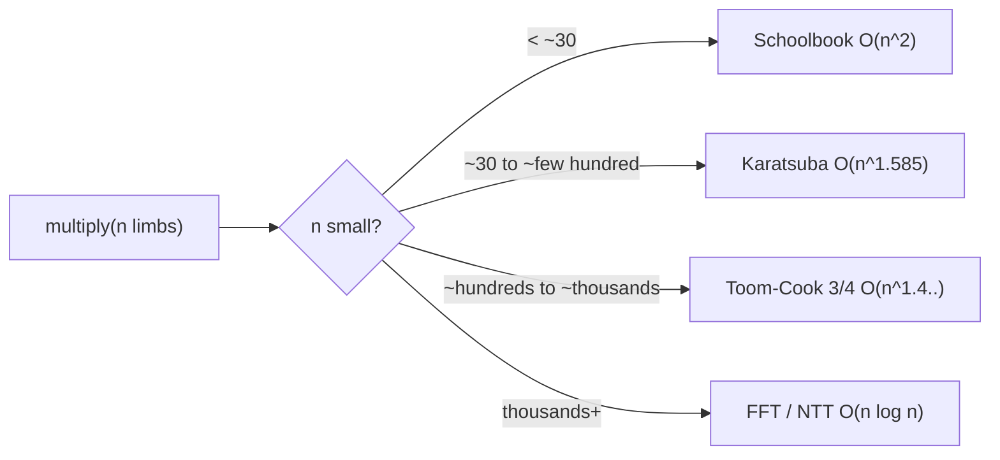
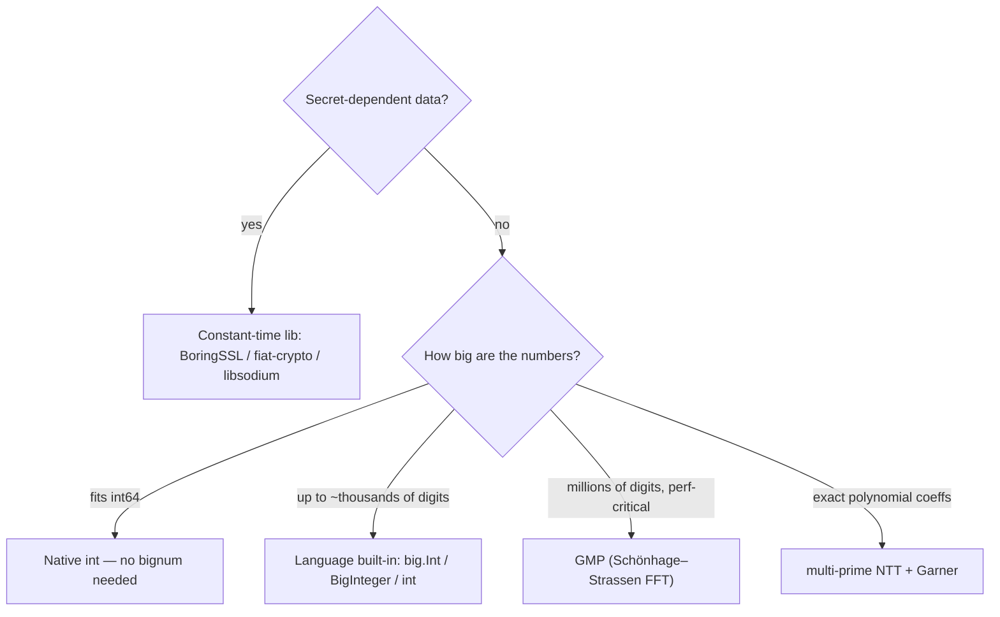

# Big Integer (Arbitrary-Precision) Arithmetic — Senior Level

> **One-line summary:** At scale, big-integer multiplication is dominated by **FFT/NTT** (`O(n log n)`), the representation must respect **cache and memory hierarchy**, and *cryptographic* use demands **constant-time, secret-independent** code that ordinary bignum libraries deliberately do not provide. This file is about engineering a production bignum: choosing the multiplication ladder, laying out limbs for cache locality, designing the library surface (immutability, allocation, error model), and meeting the timing-attack constraints of crypto-grade arithmetic.

---

## Table of Contents

1. [Introduction](#introduction)
2. [The Multiplication Ladder at Scale](#the-multiplication-ladder-at-scale)
3. [FFT / NTT Multiplication](#fft--ntt-multiplication)
4. [Worked NTT Multiplication Pipeline](#worked-ntt-multiplication-pipeline)
5. [Fast Division, GCD, and Base Conversion at Scale](#fast-division-gcd-and-base-conversion-at-scale)
6. [Memory and Cache Behavior](#memory-and-cache-behavior)
7. [Comparison with Alternatives](#comparison-with-alternatives)
8. [Library and API Design](#library-and-api-design)
9. [Constant-Time, Crypto-Grade Arithmetic](#constant-time-crypto-grade-arithmetic)
10. [Choosing a Library: A Decision Guide](#choosing-a-library-a-decision-guide)
11. [Code Examples](#code-examples)
12. [Observability](#observability)
13. [Failure Modes](#failure-modes)
14. [Summary](#summary)

---

## Introduction

> Focus: "How do I architect a bignum that is fast, memory-sane, and safe for the use case?"

A senior engineer rarely *writes* a bignum from scratch for production — they pick `math/big`, `BigInteger`, GMP, or a constant-time crypto library, and they must know *which* and *why*. The decision turns on three axes the lower levels glossed over:

1. **Asymptotics at real sizes.** For thousands-to-millions of limbs (RSA key generation, π-to-a-billion-digits, polynomial-coefficient blowups), even Karatsuba's `O(n^1.585)` is too slow. The library must reach `O(n log n)` via **FFT** or, for exactness, **NTT** (number-theoretic transform over a prime field — `15-ntt`). Choosing FFT vs NTT, and combining multiple NTT primes with **Garner/CRT** (`17-garner-algorithm`), is a senior-level call.

2. **The memory hierarchy.** A million-limb number is ~8 MB; it does not fit in L1/L2 cache. Multiplication that strides badly through memory can be **memory-bound**, not compute-bound. Limb layout, in-place transforms, and blocking matter as much as the algorithm's flop count.

3. **Security.** General bignum libraries optimize for *throughput*: they normalize away leading zeros (length leaks magnitude), branch on values, and early-exit. Every one of those is a **side channel** that leaks secret key bits via timing. Cryptographic arithmetic must be **constant-time**: fixed-size limbs, no secret-dependent branches, no secret-dependent memory access. This is a fundamentally different design, which is why crypto code uses *separate* fixed-width "field element" libraries, not the general bignum.

---

## The Multiplication Ladder at Scale

Production libraries select the multiplication algorithm by operand size:



| Range (limbs, ~64-bit) | GMP uses | Why |
|------------------------|----------|-----|
| `< ~26` | schoolbook | tiny constant, cache-resident |
| `~26 – ~120` | Karatsuba | 3 vs 4 sub-products |
| `~120 – ~1500` | Toom-3 / Toom-4 / Toom-6.5 | 5/7/... vs Karatsuba's 3 |
| `> ~1500` | FFT (Schönhage–Strassen / split-radix) | `O(n log n)` |

The exact thresholds are **machine-tuned** (GMP ships per-CPU tuning tables generated by `tune/`). A senior engineer treats thresholds as a tunable, not a constant: they shift with cache sizes, SIMD width, and the cost of a multiply instruction.

**Theoretical frontier:** Schönhage–Strassen gives `O(n log n log log n)`. Fürer (2007) reached `n log n · 2^{O(log* n)}`, and Harvey–van der Hoeven (2019) proved an `O(n log n)` algorithm — matching the conjectured lower bound. These are galactic (only beat Toom for astronomically large `n`); in practice FFT/SSA dominates real workloads.

---

## FFT / NTT Multiplication

Multiplying two numbers is the same as **multiplying two polynomials** whose coefficients are the limbs, then resolving carries. Polynomial multiplication is a **convolution**, and convolution is `O(n log n)` via the transform-pointwise-multiply-inverse-transform pattern (the foundation in `22-polynomial-operations` and `15-ntt`):

```
A(x) = Σ a_i x^i        (limbs as coefficients)
B(x) = Σ b_j x^j
C = A·B  via:  Â = FFT(A); B̂ = FFT(B); Ĉ = Â ⊙ B̂ (pointwise); C = invFFT(Ĉ)
then propagate carries on C's coefficients → product limbs
```

**FFT (floating-point) vs NTT (modular):**

| | FFT (complex doubles) | NTT (mod prime) |
|---|----------------------|------------------|
| Arithmetic | floating-point | exact integer mod `p` |
| Error | rounding — must bound it | none (exact) |
| Speed | fast (hardware FP) | slightly slower; integer mul + mod |
| Risk | silent wrong digit if precision too low | none |
| Limb/base | small base to keep products in `double` mantissa | base bounded by `p` and the convolution length |

**Why NTT for bignums.** Floating-point FFT accumulates rounding error proportional to coefficient size and length; to stay below `0.5` (so rounding to nearest is exact) you must shrink the base, which costs limbs. NTT is **exact** by construction. The catch: a single prime `p < 2^62` overflows for large convolutions, so you compute modulo **several** NTT-friendly primes and **CRT/Garner-combine** the residues into the true coefficient (`17-garner-algorithm`). Three carefully chosen primes (each `≈ 2^30`, of the form `c·2^k+1` with a primitive root) cover coefficients up to `~2^90` — enough for huge multiplications.

**Schönhage–Strassen** is the classic recursive FFT-over-`ℤ/(2^m+1)` scheme that GMP uses for the largest sizes; it avoids floating point entirely by transforming over a ring where roots of unity are powers of two (so "multiply by a root" is a bit shift).

---

## Worked NTT Multiplication Pipeline

To make the `O(n log n)` route concrete, here is the end-to-end shape of a single-prime NTT multiply of two limb arrays. A senior engineer should be able to reason about each stage's cost and failure mode.

```text
ntt_multiply(A, B):                       # A, B: limb arrays, base b small
    1. choose prime p = c·2^k + 1 with primitive root g, and 2^k >= len(A)+len(B)
    2. N = next power of two >= len(A)+len(B)
    3. pad A, B with zeros to length N           # O(N)
    4. forward transform:  Â = NTT(A, g);  B̂ = NTT(B, g)     # 2 · O(N log N)
    5. pointwise product:  Ĉ[i] = Â[i]·B̂[i] mod p           # O(N)
    6. inverse transform:  C = INTT(Ĉ, g)                    # O(N log N)
    7. carry-propagate C's coefficients into base-b limbs    # O(N)
    8. normalize, attach sign
```

Cost is dominated by steps 4 and 6: three length-`N` transforms, each `Θ(N log N)`. The pointwise multiply (step 5) is the *only* place quadratic work would have lived — and it is now linear. Step 7 is crucial and easy to forget: the convolution output coefficients can be much larger than `b` (up to `N·b²`), so they must be carried just like schoolbook partial sums.

| Stage | Cost | Dominant resource | Failure if wrong |
|-------|------|-------------------|------------------|
| pad to power of two | O(N) | memory | wrong length → cyclic wrap |
| forward NTT ×2 | O(N log N) | compute + cache | wrong root → garbage |
| pointwise mul | O(N) | compute | overflow if `p` too small |
| inverse NTT | O(N log N) | compute + cache | forgot `N^{-1}` scale |
| carry propagation | O(N) | memory bandwidth | wrong digits |

**The single-prime ceiling.** Step 5 requires every coefficient `< p`. Since a coefficient can reach `N·(b−1)²`, you need `p > N·b²`. With `p ≈ 2^62` and `b = 2^15`, that caps `N ≈ 2^32 / b² ≈` a few thousand — too small for million-limb numbers. The fix is the **multi-prime** scheme: run the pipeline over several primes `p_1, …, p_t` and **Garner/CRT-reconstruct** each coefficient (`17-garner-algorithm`), so the effective modulus is `∏ p_i`. This is exactly why bignum FFT, multi-prime NTT, and Garner's algorithm are siblings in this section.

---

## Fast Division, GCD, and Base Conversion at Scale

Once multiplication is `O(M(n))`, the other "hard" operations are re-expressed as a constant (or logarithmic) number of multiplications, so they ride the same algorithm ladder for free.

### Division via Newton's Reciprocal

General `O(n·m)` long division (Knuth Algorithm D) is acceptable for small divisors but too slow when both operands are huge. The scalable approach computes an approximate **reciprocal** `1/v` with **Newton iteration**, which doubles the number of correct digits each step:

```text
x_{k+1} = x_k · (2 − v · x_k)        # converges quadratically to 1/v
q ≈ u · (1/v),  then one correction step fixes the last digit
```

Because each Newton step is a multiply, division costs `O(M(n))` — the same order as one multiplication. GMP and modern libraries use this for large quotients.

### GCD via Half-GCD

Euclid's algorithm on bignums is `O(n²)` (each remainder step is an `O(n)` division, repeated `O(n)` times). The **half-GCD** (subquadratic GCD) uses a divide-and-conquer matrix recurrence to reach `O(M(n) log n)` — essential for, e.g., computing modular inverses on cryptographic-sized numbers without quadratic blowup.

### Base Conversion (binary ↔ decimal)

Printing a huge number in decimal naively (repeated divide by `10^9`) is `O(n²)`. The **divide-and-conquer** method splits the number at a power of `10^k` (computed once), recursively converts the high and low halves, and concatenates — `O(M(n) log n)`. This matters in practice: converting a million-digit `π` to a decimal string is otherwise the bottleneck, not the computation.

| Operation | Naive | Scalable | Reduction |
|-----------|-------|----------|-----------|
| Division | O(n·m) | O(M(n)) | Newton reciprocal |
| GCD | O(n²) | O(M(n) log n) | half-GCD |
| Modular inverse | O(n²) | O(M(n) log n) | extended half-GCD |
| Base conversion | O(n²) | O(M(n) log n) | D&C split |
| Square root | O(n²) | O(M(n)) | Newton |

The unifying principle: **make multiplication fast, and everything else follows** by reducing to `O(M(n))` or `O(M(n) log n)`.

---

## Hardware Acceleration: Wide Multiply, SIMD, and Carry Chains

The constant factor of a bignum multiply is dominated by how well it maps to CPU instructions. A senior engineer choosing or tuning a library should know the relevant hardware primitives:

- **Wide multiply.** `64×64 → 128` bit multiply is a single instruction (`MUL`/`MULX` on x86-64, `UMULH`+`MUL` on ARM). Using `2^64` limbs harnesses this directly; using base `10^9` wastes part of each word. GMP's inner loops are hand-written assembly around these.
- **Carry-chain instructions.** `ADCX`/`ADOX` (x86 BMI2/ADX) maintain *two independent carry chains*, letting the CPU run two add-with-carry sequences in parallel — roughly doubling add/mul-accumulate throughput. This is why modern GMP and OpenSSL bignum add inner loops are assembly.
- **SIMD (AVX-512, NEON).** Vectorizing carry propagation is hard because carries are inherently sequential. The workaround is a **redundant representation** (limbs slightly smaller than the base so carries can be deferred), allowing several limbs to be added in one SIMD lane before a single normalization pass. This trades a few extra bits per limb for vector parallelism — a technique used in high-performance ECC field arithmetic.
- **Branch prediction.** General bignum code branches on limb values (carry==0 shortcuts, length checks). For throughput this is fine; for crypto it is a leak (see below).

| Technique | Win | Where used |
|-----------|-----|------------|
| `MULX` wide multiply | 1 instr for `64×64→128` | GMP, OpenSSL inner loops |
| `ADCX`/`ADOX` dual carry | ~2× add-mul throughput | GMP `mpn_addmul`, OpenSSL |
| SIMD redundant limbs | vectorized field ops | fiat-crypto, curve25519 |
| Assembly inner loops | removes compiler overhead | GMP, BoringSSL |

The practical takeaway: pure-Go/Java/Python bignums cannot match GMP because the JIT/runtime cannot emit `ADCX`/`MULX` carry chains as tightly as hand assembly. When extreme performance matters, libraries bind to GMP (e.g. via cgo, JNI).

---

## Memory and Cache Behavior

Asymptotics assume unit-cost operations, but at scale the **memory hierarchy** governs wall-clock time.

- **Working-set size.** Two `n`-limb operands plus result and scratch is `~4n` limbs. At `n = 10^6` (64-bit limbs) that is ~32 MB — far past L2/L3. Multiplication becomes **bandwidth-bound**.
- **Access pattern.** Schoolbook strides linearly (cache-friendly, low miss rate) but does too many ops. FFT does few ops but its butterfly access pattern has poor locality at large transform sizes — the classic *cache-oblivious vs cache-aware* tension. SSA's recursive structure helps because sub-transforms fit in cache.
- **In-place transforms.** Allocating new arrays per FFT stage thrashes the allocator and cache. Production FFTs are **in-place** (bit-reversal permutation + in-place butterflies) to keep the working set minimal.
- **Limb width vs density.** Wider limbs (`2^64`) mean fewer limbs → smaller working set → fewer cache lines touched, but require a `128`-bit multiply (`mulhi`). On modern x86 (`MULX`, `ADCX/ADOX`) and ARM (`UMULH`), `2^64` limbs win.
- **Allocation strategy.** Bignum-heavy loops (e.g. computing `n!`) allocate a fresh array per multiply, stressing GC. A pooled/arena allocator or in-place accumulation (`acc *= i`) cuts allocation pressure dramatically.

| Layout decision | Cache effect |
|-----------------|--------------|
| Little-endian contiguous limbs | sequential carry sweep = ideal prefetch |
| `2^64` limbs | fewer cache lines than `10^9` limbs |
| In-place FFT | working set ≈ operand size, not 2–3× |
| Arena/pool reuse | avoids per-op alloc + GC pauses |

---

## Comparison with Alternatives

| Attribute | Go `math/big` | Java `BigInteger` | GMP (C) | Crypto field lib (e.g. fixed-width) |
|-----------|---------------|-------------------|---------|--------------------------------------|
<!-- comparison of bignum implementations across runtimes and the constant-time crypto path -->
| Limb width | 64-bit (`Word`) | 32-bit `int[]` (sign-magnitude) | 32/64-bit, tuned per CPU | fixed, modulus-sized |
| Multiply ceiling | Karatsuba (+ basic FFT in newer Go) | Karatsuba + Toom-3 | full ladder incl. SSA FFT | fixed-width Montgomery |
| Constant-time | no | no | no | **yes** |
| Allocation | per-op (GC) | per-op (immutable) | manual / mpz pool | stack / fixed |
| Best for | general Go programs | general JVM programs | extreme performance | RSA/ECC secrets |
| Exact huge mul | yes (slower) | yes | yes (fastest) | n/a (fixed size) |

| Workload | Recommended |
|----------|-------------|
| Competitive programming, scripting | language built-in |
| Billion-digit π, research | GMP (SSA FFT) |
| RSA/ECC signing with secret keys | dedicated **constant-time** library (BoringSSL, libsodium, Go `crypto/internal`) — **never** `math/big` on secrets |
| Exact polynomial coefficients | multi-prime NTT + Garner (`15-ntt`, `17-garner-algorithm`) |

---

## Library and API Design

Designing a bignum surface involves trade-offs the standard libraries made differently:

- **Immutable vs mutable.** Java's `BigInteger` is **immutable** — every op allocates a new object (clean, thread-safe, GC-heavy). Go's `big.Int` is **mutable** with a receiver-as-destination convention (`z.Add(x, y)` writes into `z`) — fewer allocations, but you must manage aliasing. Senior design: offer a mutable core and an immutable wrapper.
- **Aliasing rules.** If `z`, `x`, `y` may alias (`z.Mul(z, z)` for squaring), every method must be alias-safe — write to scratch, then copy. `math/big` documents this explicitly.
- **Error model.** Division by zero, invalid radix in parsing: panic (Go `math/big` panics) vs exception (Java) vs sentinel. Be consistent.
- **Special fast paths.** Squaring (`x²`) is ~`2×` cheaper than general multiply (the cross terms `a_i a_j` and `a_j a_i` are equal — compute once, double). Multiply-by-small-int, power-of-two shifts, and `mod 2^k` (mask) are worth special-casing.
- **Thread safety.** Immutable types are trivially safe; mutable ones are not — document that a `big.Int` value is not safe for concurrent mutation. The example below shows a thread-safe *wrapper* for a shared accumulator.

---

## Constant-Time, Crypto-Grade Arithmetic

This is the senior-most concern and the most misunderstood. **General bignum libraries are unsafe for secret data.**

The threat: an attacker who can measure how long your modular exponentiation takes (or its cache footprint, or power draw) can recover the secret exponent — a **timing/side-channel attack**. The leaks come from optimizations the general library *wants*:

| Leak | Source in a normal bignum | Constant-time fix |
|------|---------------------------|-------------------|
| Magnitude leaks via length | normalization strips leading zeros | **fixed-width** limbs; never trim secrets |
| Branch on bit value | square-and-multiply skips multiply on `0` bit | always multiply; **conditional-select** the result (Montgomery ladder) |
| Early-exit comparison | `memcmp`-style compare returns on first diff | compare all limbs, OR the differences, branchless |
| Data-dependent memory access | table lookup indexed by secret | scan whole table with masking, or use bitslicing |
| Division timing | quotient-digit loop iterates a value-dependent count | avoid division: **Montgomery reduction** (`16-montgomery-multiplication`) |

The disciplines:

- **Fixed-width representation** sized to the modulus, padded with zeros, *never normalized away*.
- **Branchless conditional select:** `r = cond ? a : b` implemented as `r = b ^ (mask & (a ^ b))` where `mask = 0 or all-ones` derived from `cond` without a branch.
- **Montgomery multiplication** so reduction is shifts/adds with no value-dependent division (`16-montgomery-multiplication`).
- **Montgomery powering ladder** so every exponent bit does the same operations regardless of its value.
- **Compiler-resistant code:** mark secrets `volatile`/use barriers so the optimizer does not reintroduce branches; many teams write these in assembly for guarantees.

This is why ECC/RSA code lives in `crypto/elliptic`, BoringSSL `fiat-crypto`, libsodium — **not** in `math/big`. A senior engineer's most important rule here: **do RSA/ECC with secret data only through a vetted constant-time library; never roll modular exponentiation on `big.Int` for secrets.**

> **Note on Go's `crypto`:** Go's standard `crypto/rsa` historically used `math/big` and has been progressively migrated to a constant-time `crypto/internal/bigmod` precisely because of these timing concerns. This real-world migration is the canonical case study for why "the general bignum is not the crypto bignum."

---

## Choosing a Library: A Decision Guide

Most senior decisions are *which tool*, not *what algorithm*. Use this flow:



| Scenario | Choice | Rationale |
|----------|--------|-----------|
| Web app summing money exactly | built-in (or fixed-point decimal) | correctness, simplicity |
| Competitive programming, no-lib rule | hand-rolled limb array | rule compliance; base `10^9` |
| RSA key generation / signing | constant-time crypto lib | side-channel safety |
| Compute `π` to 10⁹ digits | GMP | SSA FFT, tuned thresholds |
| Polynomial multiplication, exact integer coeffs | multi-prime NTT + Garner | exactness at scale |
| JVM service, occasional big math | `BigInteger` | immutable, thread-safe, good enough |

The senior anti-patterns to flag in review: (1) hand-rolling a bignum when a built-in exists "for speed" (almost always slower and buggier), (2) using `math/big`/`BigInteger` on secret keys, (3) running `O(n²)` decimal conversion on million-digit outputs, (4) per-op allocation in a hot loop without pooling.

---

## Code Examples

### Thread-Safe Big-Integer Accumulator

A shared accumulator (e.g. summing huge results across goroutines/threads). Note: this guards the *container*, it is not constant-time and not for secrets.

#### Go

```go
package main

import (
	"fmt"
	"math/big"
	"sync"
)

type SafeBig struct {
	mu  sync.Mutex
	val big.Int
}

func (s *SafeBig) Add(x *big.Int) {
	s.mu.Lock()
	defer s.mu.Unlock()
	s.val.Add(&s.val, x) // mutable receiver; alias-safe here (s.val != x)
}

func (s *SafeBig) Get() *big.Int {
	s.mu.Lock()
	defer s.mu.Unlock()
	return new(big.Int).Set(&s.val) // return a copy
}

func main() {
	acc := &SafeBig{}
	var wg sync.WaitGroup
	for i := 1; i <= 1000; i++ {
		wg.Add(1)
		go func(k int) {
			defer wg.Done()
			term := new(big.Int).Exp(big.NewInt(int64(k)), big.NewInt(20), nil)
			acc.Add(term)
		}(i)
	}
	wg.Wait()
	fmt.Println(acc.Get())
}
```

#### Java

```java
import java.math.BigInteger;
import java.util.concurrent.atomic.AtomicReference;

public class SafeBig {
    // BigInteger is immutable, so a CAS loop is lock-free.
    private final AtomicReference<BigInteger> val =
            new AtomicReference<>(BigInteger.ZERO);

    public void add(BigInteger x) {
        BigInteger prev, next;
        do {
            prev = val.get();
            next = prev.add(x);
        } while (!val.compareAndSet(prev, next));
    }

    public BigInteger get() { return val.get(); }

    public static void main(String[] args) throws InterruptedException {
        SafeBig acc = new SafeBig();
        Thread[] ts = new Thread[8];
        for (int t = 0; t < ts.length; t++) {
            final int base = t;
            ts[t] = new Thread(() -> {
                for (int k = base + 1; k <= 1000; k += 8)
                    acc.add(BigInteger.valueOf(k).pow(20));
            });
            ts[t].start();
        }
        for (Thread th : ts) th.join();
        System.out.println(acc.get());
    }
}
```

#### Python

```python
import threading


class SafeBig:
    """Python int is immutable + arbitrary precision; the lock guards the rebind."""
    def __init__(self):
        self._val = 0
        self._lock = threading.Lock()

    def add(self, x):
        with self._lock:
            self._val += x  # CPython int add is GIL-atomic, but lock for clarity

    def get(self):
        with self._lock:
            return self._val


if __name__ == "__main__":
    acc = SafeBig()
    threads = [threading.Thread(target=lambda b=b: [acc.add(k ** 20)
                                                    for k in range(b + 1, 1001, 8)])
               for b in range(8)]
    for t in threads: t.start()
    for t in threads: t.join()
    print(acc.get())
```

### Constant-Time Conditional Select (the crypto primitive)

Branchless `r = cond ? a : b` on a fixed-width limb array — no secret-dependent branch.

#### Go

```go
// ctSelect copies a into dst if cond==1, else b — constant time, fixed width.
func ctSelect(dst, a, b []uint64, cond uint64) {
	mask := -cond // cond is 0 or 1 → mask is 0x000... or 0xFFF...
	for i := range dst {
		dst[i] = b[i] ^ (mask & (a[i] ^ b[i]))
	}
}
```

#### Java

```java
static void ctSelect(long[] dst, long[] a, long[] b, long cond) {
    long mask = -cond; // 0 or all-ones
    for (int i = 0; i < dst.length; i++)
        dst[i] = b[i] ^ (mask & (a[i] ^ b[i]));
}
```

#### Python

```python
def ct_select(a, b, cond, width):
    # cond in {0,1}; fixed-width limb lists of equal length
    mask = (1 << 64) - 1 if cond else 0
    return [b[i] ^ (mask & (a[i] ^ b[i])) for i in range(width)]
```

---

## Correctness Strategy for a Production Bignum

A bignum is the kind of code where a one-in-a-billion carry bug is catastrophic (it silently corrupts a financial total or a cryptographic signature). Senior-level confidence comes from a layered test strategy, not from reading the code carefully once.

- **Differential testing against a trusted oracle.** Generate millions of random operand pairs and assert `mine(a, b) == native(a, b)` for every operation against `big.Int` / `BigInteger` / Python `int`. This catches carry/borrow/sign/normalization bugs that hand-written unit tests miss. It is the single highest-value test for any hand-rolled bignum.
- **Property-based / metamorphic tests.** Assert algebraic invariants that must hold regardless of the oracle: `(a + b) − b == a`, `(a · b) / b == a` (for `b ≠ 0`), `a · (b + c) == a·b + a·c`, `a mod m < m`, `parse(format(x)) == x`. These find bugs even where no oracle exists (e.g. a custom NTT path).
- **Boundary corpus.** A fixed set of adversarial inputs: zero, one, `B−1`, `B`, `B²−1`, numbers that are all-`9` limbs (maximal carry chains), numbers differing by one limb in length, exact powers of `B`, and the algorithm-cutoff sizes (one below and one above each schoolbook→Karatsuba→Toom→FFT threshold).
- **Cross-algorithm agreement.** Every multiply rung must agree: `schoolbook(a,b) == karatsuba(a,b) == ntt_mul(a,b)`. A mismatch localizes the bug to the rung that disagrees.
- **Fuzzing.** Feed random byte strings to the parser and arithmetic to surface panics, index-out-of-bounds, and infinite loops in division.
- **Crypto-specific: timing-leak tests.** For constant-time paths, run `dudect`/`ctgrind` in CI; a statistically significant timing difference between two secret inputs is a *failing test*, not a perf note.

| Test layer | Catches | Cost |
|------------|---------|------|
| Differential vs native | carry/sign/normalize bugs | cheap, run millions |
| Property/metamorphic | logic bugs without oracle | cheap |
| Boundary corpus | edge cases, cutoff seams | one-time authoring |
| Cross-algorithm | rung-specific bugs | cheap |
| Fuzzing | crashes, hangs | continuous |
| Timing-leak (crypto) | side channels | CI gate |

---

## Observability

| Metric | Why it matters | Alert threshold |
|--------|----------------|-----------------|
| `bignum_alloc_bytes_per_op` | per-op allocation drives GC pressure | sustained > expected → introduce pooling |
| `multiply_algo` histogram | which rung of the ladder is hit | unexpected schoolbook on huge inputs → cutoff misconfigured |
| `gc_pause_p99` (Go/Java) | immutable bignums churn the heap | rising under bignum load → reuse buffers |
| `op_latency_p99` | tail latency for big ops | spikes correlate with FFT working-set > cache |
| `constant_time_check` (crypto) | dudect/timing tests pass | any data-dependent timing → side channel |

For crypto code, the critical "observability" is **continuous timing-leak testing** (e.g. `dudect`, `ctgrind`, `valgrind --tool=memcheck` with uninit secrets) in CI — a regression that introduces a branch on secret data is a security bug, not a perf bug.

**Reading the `multiply_algo` histogram.** In a healthy service the histogram should concentrate on the rung appropriate to your operand sizes. Common diagnoses: a spike in `schoolbook` for known-large inputs means the cutoff was reset (e.g. after a refactor) or the size estimate is wrong; an unexpected `fft` for tiny inputs means a missing fast-path; bimodal latency tracking the histogram boundary means inputs straddle a cutoff and you should widen the hysteresis so borderline sizes don't flip-flop between rungs cache-coldly.

---

## Failure Modes

- **Silent FFT rounding error** — floating-point FFT with too-large a base yields a single wrong digit, far from any exception. Mitigation: bound the base, or use **NTT** (exact).
- **NTT prime overflow** — one prime too small for the convolution length wraps modular sums. Mitigation: pick primes by `length · base² < p`, or use multi-prime + Garner.
- **Memory blowup** — naive `n!` keeps every intermediate; a million-digit result times a small int still allocates fresh. Mitigation: in-place accumulation, buffer pools, binary-splitting for factorials.
- **GC thrash from immutables** — tight loops on `BigInteger`/`big.Int` allocate per op. Mitigation: mutable receivers, scratch reuse.
- **Side channel on secrets** — using `math/big.Exp` on an RSA private exponent leaks via timing. Mitigation: constant-time library only.
- **Compiler defeating constant-time code** — an optimizing compiler can re-introduce a branch (e.g. turning a masked select back into a conditional move that becomes a branch, or constant-folding a secret). Mitigation: optimization barriers, `volatile` reads of secrets, or hand-written assembly with verified disassembly.
- **Aliasing bugs** — `z.Mul(z, z)` corrupting input mid-write. Mitigation: write to scratch then copy; honor documented aliasing rules.
- **Sign/normalization drift** — `−0`, leading zeros, or inconsistent floor/trunc division across language boundaries. Mitigation: canonicalize on every op; pin a division convention.
- **Threshold misconfiguration after a port** — schoolbook→Karatsuba cutoffs tuned for one CPU are wrong on another (different cache, SIMD width), silently leaving performance on the table. Mitigation: re-tune thresholds per target, or auto-tune at build (GMP's approach).
- **Integer-overflow in the limb accumulator** — choosing a base where `limb·limb + carry + accumulator` exceeds the wide type wraps without a trap. Mitigation: enforce the standing bound `2B² + B ≤ W` at construction; prefer `2^32`/`10^9` with 64-bit accumulators.

---

## Summary

At senior level, big-integer arithmetic is an **engineering ladder**: schoolbook → Karatsuba → Toom-Cook → **FFT/NTT (`O(n log n)`)**, with machine-tuned thresholds. The hard parts are no longer the carry loops but the systemic ones: keeping the **working set within cache** (in-place transforms, wide `2^64` limbs, contiguous layout), choosing **FFT vs NTT** (and multi-prime NTT + Garner for exactness — `15-ntt`, `17-garner-algorithm`), and designing the **library surface** (mutable vs immutable, aliasing, allocation, error model). Above all, **cryptographic** arithmetic is a different discipline: general bignums leak secrets through length normalization, value-dependent branches, and data-dependent memory access, so secret-key RSA/ECC must use **fixed-width, branchless, constant-time** code (Montgomery reduction — `16-montgomery-multiplication`) from a vetted library, never the general-purpose `math/big`/`BigInteger`.

---

## Capacity Planning: A Worked Example

Suppose you must multiply two 1,000,000-decimal-digit numbers (e.g. a step in computing `π`). Sizing the work:

- **Limbs.** At base `2^64` (~19.3 decimal digits/limb): `n ≈ 10^6 / 19.3 ≈ 51,800` limbs per operand. Working set (two operands + result + scratch) ≈ `4 · 2n · 8 bytes ≈ 3.3 MB` — fits L3 on a server, spills L2.
- **Algorithm choice.** At ~52 K limbs we are deep in **FFT/SSA** territory; schoolbook would do `~2.7·10^9` limb mults (seconds to minutes), Karatsuba `~52800^1.585 ≈ 3·10^7` (sub-second), FFT `~n log n ≈ 52800·16 ≈ 8.4·10^5` butterflies (milliseconds).
- **Exactness.** Single-prime NTT needs `p > N·b²`. With `N ≈ 2^17` and `b = 2^16`, `N b² ≈ 2^49 < 2^62` — one ~62-bit prime suffices here; for larger inputs, switch to 2–3 primes + Garner.
- **Decimal output.** Naive base conversion is `O(n²) ≈ 2.7·10^9` ops — *slower than the multiply itself*. Use D&C conversion (`O(M(n) log n)`).
- **Allocation.** In a loop (many such multiplies), reuse FFT scratch buffers; per-op allocation of ~3 MB would dominate via GC.

This is the senior reasoning pattern: translate the problem size into limbs, pick the algorithm rung, verify the exactness/precision budget, and account for the *often-forgotten* output-conversion and allocation costs.

> **Rule of thumb:** before optimizing the multiply, confirm it is actually the bottleneck — for one-shot computations the decimal output conversion and the I/O of a million-digit string frequently dominate, and no amount of FFT tuning helps if you then print with an `O(n²)` converter.

### Quick sizing checklist

When a new bignum-heavy workload lands, run the same five-question triage before writing any code:

| Question | Why it matters | Typical answer |
|---|---|---|
| How many limbs per operand? | Picks the algorithm rung | `digits / 19.3` at base `2^64` |
| Is the product exact or modular? | NTT-mod vs FFT/Toom | Exact → NTT + Garner |
| One-shot or hot loop? | Allocation strategy | Loop → scratch pools |
| Are any operands secret? | Constant-time discipline | Yes → vetted CT library |
| What is the *output* path? | Conversion often dominates | D&C base conversion |

The discipline is to answer these **before** reaching for an FFT — half the time the limb count is small enough that Karatsuba (or even the language built-in) is the correct, boring answer, and the engineering effort belongs in the output and allocation paths instead.

---

**Next step:** [professional.md](./professional.md) — formal complexity of each algorithm (Karatsuba recurrence, Toom-Cook, FFT `O(n log n)`), correctness proofs, and the multiplication lower-bound landscape.
