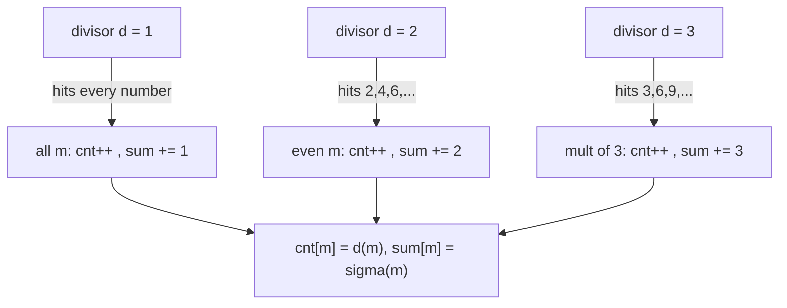
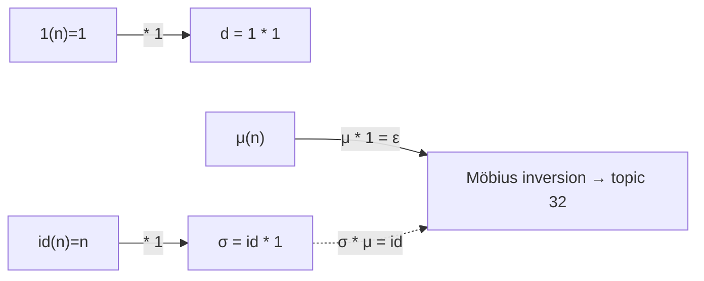
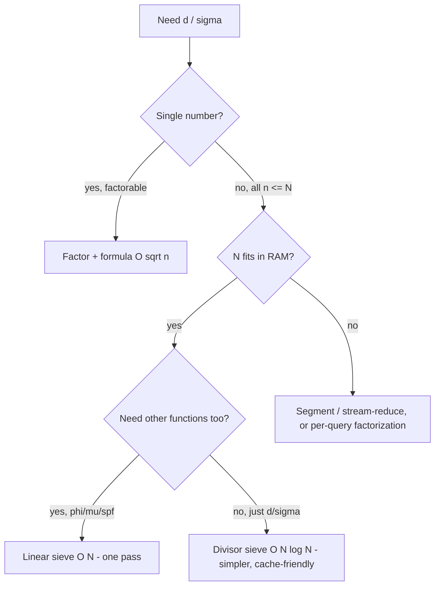

# Divisor Functions — Middle Level

> **Focus:** Why `d` and `σ` are **multiplicative**, what that buys you, the **divisor sieve** that computes them for all `n ≤ N` in `O(N log N)`, the classification of numbers as **perfect / abundant / deficient** via `σ(n)`, amicable numbers, highly composite numbers, and the first taste of the **Dirichlet-convolution** view (`d = 1 * 1`, `σ = id * 1`) that connects to Möbius inversion (topic `32-mobius-inversion`).

---

## Table of Contents

1. [Introduction](#introduction)
2. [Deeper Concepts: Multiplicativity](#deeper-concepts-multiplicativity)
3. [The Divisor Sieve for All n](#the-divisor-sieve-for-all-n)
4. [Perfect, Abundant, and Deficient Numbers](#perfect-abundant-and-deficient-numbers)
5. [Amicable and Highly Composite Numbers](#amicable-and-highly-composite-numbers)
6. [Dirichlet Convolution View](#dirichlet-convolution-view)
7. [Comparison with Alternatives](#comparison-with-alternatives)
8. [Advanced Patterns](#advanced-patterns)
9. [Code Examples](#code-examples)
10. [Error Handling](#error-handling)
11. [Performance Analysis](#performance-analysis)
12. [Best Practices](#best-practices)
13. [Visual Animation](#visual-animation)
14. [Summary](#summary)

---

## Introduction

At junior level the message was: from `n = p₁^a₁ · … · p_k^a_k`, the number of divisors is `d(n) = Π(a_i+1)` and the sum is `σ(n) = Π(p_i^{a_i+1}−1)/(p_i−1)`. At middle level we explain *why those product formulas are legitimate* — they are a consequence of **multiplicativity** — and we turn that understanding into practical machinery:

- **Multiplicativity** (`f(ab) = f(a)f(b)` when `gcd(a,b)=1`) is the structural property that lets a function over `n` factor into a product over its prime powers. `d` and `σ` are both multiplicative, which is the real reason the closed forms exist.
- The **divisor sieve** computes `d` and `σ` for *every* `n ≤ N` in `O(N log N)` by iterating over divisors and striking their multiples — the all-at-once tool for ranges.
- `σ(n)` classifies numbers as **perfect** (`σ(n) = 2n`), **abundant** (`σ(n) > 2n`), or **deficient** (`σ(n) < 2n`), a 2,000-year-old taxonomy with deep open problems.
- **Amicable** numbers, **highly composite** numbers, and the **Dirichlet-convolution** identities `d = 1 * 1` and `σ = id * 1` connect divisor functions to the broader theory and to Möbius inversion (topic `32-mobius-inversion`).

These are the tools that show up whenever a problem says "for all numbers up to `N`, compute / count / sum something about divisors."

---

## Deeper Concepts: Multiplicativity

### What multiplicative means

A function `f: ℤ⁺ → ℤ` (or ℂ) is **multiplicative** if `f(1) = 1` and

```
f(a · b) = f(a) · f(b)        whenever gcd(a, b) = 1.
```

The coprimality condition is essential — it is *not* required to hold for arbitrary `a, b`. A function that satisfies `f(ab) = f(a)f(b)` for *all* `a, b` is called **completely multiplicative** (e.g. `id(n) = n` and the constant `1(n) = 1`). `d` and `σ` are multiplicative but *not* completely multiplicative: e.g. `d(2·2) = d(4) = 3`, but `d(2)·d(2) = 2·2 = 4 ≠ 3` — and indeed `gcd(2,2) = 2 ≠ 1`, so the rule does not apply.

### Why `d` and `σ` are multiplicative (intuition)

If `gcd(a, b) = 1`, then `a` and `b` share no prime factors, so the prime factorization of `ab` is just the factorizations of `a` and `b` placed side by side. The divisors of `ab` are then exactly the products `d_a · d_b` where `d_a ∣ a` and `d_b ∣ b`, and each such pair is distinct (again by coprimality). That bijection gives:

```
d(ab) = (#divisors of a) · (#divisors of b) = d(a) d(b)
σ(ab) = (Σ d_a) · (Σ d_b) = σ(a) σ(b)        [by distributing the product of sums]
```

The full bijection proof is in [`professional.md`](./professional.md). The payoff is immediate: a multiplicative function is **completely determined by its values on prime powers**. So to know `d` and `σ` everywhere, you only need:

```
d(p^a) = a + 1
σ(p^a) = 1 + p + p² + … + p^a = (p^{a+1} − 1)/(p − 1)
```

and then `d(n) = Π d(p_i^{a_i})`, `σ(n) = Π σ(p_i^{a_i})` — which is exactly the junior-level closed form, now *justified* rather than asserted.

### `σ_k` is multiplicative too

The same argument works for every `σ_k(n) = Σ_{d∣n} d^k`: divisors of a coprime product split into a product of divisor sets, and summing `k`-th powers distributes. So `σ_k` is multiplicative with `σ_k(p^a) = 1 + p^k + p^{2k} + … + p^{ak} = (p^{k(a+1)}−1)/(p^k−1)`.

### A small table of values

| `n` | factorization | `d(n)` | `σ(n)` | `σ(n) − n` (proper) |
|-----|---------------|--------|--------|----------------------|
| 1 | — | 1 | 1 | 0 |
| 6 | 2·3 | 4 | 12 | 6 (perfect) |
| 12 | 2²·3 | 6 | 28 | 16 (abundant) |
| 16 | 2⁴ | 5 | 31 | 15 (deficient) |
| 28 | 2²·7 | 6 | 56 | 28 (perfect) |
| 60 | 2²·3·5 | 12 | 168 | 108 (abundant) |
| 97 | 97 | 2 | 98 | 1 (deficient) |

---

## The Divisor Sieve for All n

When you need `d(n)` or `σ(n)` for *all* `n ≤ N`, do **not** factor each number. Instead exploit the dual view: rather than "for each `n`, find its divisors," do "for each divisor `d`, find its multiples." Every multiple of `d` counts `d` among its divisors.

```
divisor_sieve(N):
    cnt[1..N] = 0     # will hold d(m)
    sm[1..N]  = 0     # will hold σ(m)
    for d = 1 .. N:
        for m = d, 2d, 3d, … ≤ N:
            cnt[m] += 1
            sm[m]  += d
    # cnt[m] = d(m), sm[m] = σ(m)
```

**Why it is correct.** `cnt[m]` is incremented once for each `d` that divides `m` (because `m` is hit exactly when iterating multiples of each of its divisors), so `cnt[m]` ends equal to the number of divisors of `m`. Likewise `sm[m]` accumulates each divisor `d` exactly once, giving `σ(m)`.

**Why it is `O(N log N)`.** The inner loop runs `⌊N/d⌋` times for divisor `d`. Summing:

```
Σ_{d=1}^{N} ⌊N/d⌋ ≤ N · Σ_{d=1}^{N} 1/d = N · H_N ≈ N · ln N = O(N log N)
```

where `H_N` is the `N`-th harmonic number. The harmonic sum's `ln N` growth is the source of the `log N` factor (full derivation in [`professional.md`](./professional.md)). This is slightly more than the prime sieve's `O(N log log N)` because here *every* `d`, not just primes, strides its multiples.

**Generalizing to `σ_k`.** Replace `sm[m] += d` with `sm[m] += d^k`. The same sieve computes any divisor power sum.



---

## Perfect, Abundant, and Deficient Numbers

The sum of *proper* divisors (all divisors except `n` itself) is `s(n) = σ(n) − n`. Comparing `s(n)` to `n` — equivalently `σ(n)` to `2n` — classifies every integer:

| Class | Condition | Examples |
|-------|-----------|----------|
| **Perfect** | `σ(n) = 2n`, i.e. `s(n) = n` | 6, 28, 496, 8128 |
| **Abundant** | `σ(n) > 2n`, i.e. `s(n) > n` | 12, 18, 20, 24, 30, 60 |
| **Deficient** | `σ(n) < 2n`, i.e. `s(n) < n` | all primes, prime powers, 1, 8, 9, 10 |

**Perfect numbers** are rare and beautiful. `6 = 1 + 2 + 3`; `28 = 1 + 2 + 4 + 7 + 14`. Euclid proved that if `2^p − 1` is prime (a **Mersenne prime**), then `2^{p−1}(2^p − 1)` is perfect; Euler proved every *even* perfect number has this form (the **Euclid–Euler theorem**, proved in [`professional.md`](./professional.md)). Whether any *odd* perfect number exists is one of the oldest open problems in mathematics — none has been found below `10^1500`.

**Deficiency is the default.** Primes are maximally deficient: `σ(p) = p + 1`, so `s(p) = 1`. Prime powers and most numbers are deficient. Abundant numbers are denser among highly composite numbers (many small prime factors push `σ` up).

```
classify(n):
    s = σ(n) − n            # sum of proper divisors
    if s == n: return "perfect"
    if s > n:  return "abundant"
    return "deficient"
```

---

## Amicable and Highly Composite Numbers

**Amicable numbers.** Two distinct numbers `a, b` are *amicable* if each equals the sum of the other's proper divisors: `s(a) = b` and `s(b) = a` (equivalently `σ(a) = σ(b) = a + b`). The smallest pair is `(220, 284)`: `s(220) = 284` and `s(284) = 220`. A perfect number is the degenerate case `a = b`. Finding amicable pairs up to `N` is a direct application of a sieved `s(n) = σ(n) − n` array.

**Highly composite numbers.** A number `n` is *highly composite* if it has more divisors than any smaller positive integer — `d(n) > d(m)` for all `m < n`. Examples: `1, 2, 4, 6, 12, 24, 36, 48, 60, 120, 180, 240, 360, …`. Ramanujan studied them; they are exactly the numbers you want when you need "the smallest integer with at least `k` divisors." Their factorizations use small primes with non-increasing exponents (e.g. `360 = 2³·3²·5`), because to maximize `Π(a_i+1)` for a given size you spend exponents on the smallest primes first. A sieved `d(n)` array plus a running maximum finds them.

```
highly_composite_up_to(N):
    cnt = divisor_count_sieve(N)
    best = 0; result = []
    for n = 1 .. N:
        if cnt[n] > best:
            best = cnt[n]
            result.append((n, best))
    return result
```

---

## Dirichlet Convolution View

The **Dirichlet convolution** of two functions `f, g` is

```
(f * g)(n) = Σ_{d ∣ n} f(d) · g(n/d).
```

Two basic functions: `1(n) = 1` for all `n` (the constant one), and `id(n) = n` (the identity). Then divisor functions are convolutions:

```
d   = 1 * 1     because (1 * 1)(n) = Σ_{d∣n} 1·1 = #divisors = d(n)
σ   = id * 1    because (id * 1)(n) = Σ_{d∣n} d·1 = Σ_{d∣n} d = σ(n)
σ_k = id_k * 1  where id_k(n) = n^k
```

This is more than notation. A theorem (proved in [`professional.md`](./professional.md)) says **the convolution of two multiplicative functions is multiplicative**. Since `1` and `id` are (completely) multiplicative, `d` and `σ` are *automatically* multiplicative — a one-line proof of the property we argued combinatorially above. The convolution view also connects to **Möbius inversion** (topic `32-mobius-inversion`): because `μ * 1 = ε` (the identity for convolution), you can invert these relations, e.g. recover `id` from `σ` via `id = σ * μ`. This is the bridge from divisor functions to the Möbius machinery used in counting problems.



---

## Comparison with Alternatives

| Method | Time | Space | Gives you | Use when |
|--------|------|-------|-----------|----------|
| Naive walk `1..n` | `O(n)` per number | `O(1)` | `d(n)`, `σ(n)` for one `n` | tiny `n`, quick check |
| Pair walk `1..√n` | `O(√n)` per number | `O(1)` | `d(n)`, `σ(n)` for one `n` | one moderate `n`, no factorization needed |
| Factorization + formula | `O(√n)` per number | `O(log n)` | `d`, `σ`, `σ_k` for one `n` | one `n` you can factor; also gives the factorization |
| **Divisor sieve** | `O(N log N)` total | `O(N)` | `d`, `σ`, `σ_k` for **all** `n ≤ N` | a dense range up to `N` |
| **Linear sieve** | `O(N)` total | `O(N)` | same, true linear | large `N`, need best asymptotics (see `senior.md`) |
| SPF table + per-query | `O(N)` build, `O(log n)` query | `O(N)` | `d`, `σ` for queried `n ≤ N` | many queries, sparse over `[1,N]` |

**Rule of thumb:** one number you can factor → factorization + formula. All numbers up to a RAM-fittable `N` → divisor sieve (or linear sieve for the best constant/asymptotics). A single huge number whose factorization you lack → that is really a *factoring* problem (topics `08`/`09`), not a divisor-function problem.

**Choose the divisor sieve when:** you need values for a dense range and `O(N log N)` is fast enough (it is, up to `N ≈ 10^7`–`10^8`).
**Choose the linear sieve when:** `N` is large enough that the `log N` factor matters, or you are already running a linear sieve for SPF / φ / μ and want `d` and `σ` in the same pass.

### The harmonic-sum cost, intuitively

Why is the divisor sieve `O(N log N)` while the prime sieve is `O(N log log N)`? Both stride multiples, but the prime sieve only strides *primes*: its cost is `N·Σ_{p≤N} 1/p ≈ N ln ln N`. The divisor sieve strides *every* divisor `d`, so its cost is `N·Σ_{d≤N} 1/d = N·H_N ≈ N ln N`. The extra `ln N / ln ln N` factor is the price of accounting for *all* divisors, not just prime ones. Concretely, at `N = 10^7`: `ln N ≈ 16` versus `ln ln N ≈ 2.8` — the divisor sieve does roughly `6×` more striking than a prime sieve of the same `N`. This is the entire motivation for the `O(N)` linear sieve when `N` is large.

---

## Advanced Patterns

### Pattern: sum of `σ` over a range via prefix sums

Many problems ask for `Σ_{i=a}^{b} σ(i)`. Sieve `σ`, prefix-sum once, then each range query is `O(1)`.

```python
sig = sigma_sieve(N)
pref = [0] * (N + 1)
for i in range(1, N + 1):
    pref[i] = pref[i - 1] + sig[i]
# answer for [a, b] = pref[b] - pref[a-1]
```

### Pattern: count divisors using SPF (when you already sieved SPF)

If you have a smallest-prime-factor table (from a linear sieve), factor any `n ≤ N` in `O(log n)` and apply the formula — handy when you need `d`/`σ` for scattered queries, not the whole range.

### Pattern: `σ(n) = 2n` test without a sieve

For checking perfection of a single `n`, compute `σ(n)` by factorization and compare to `2n`. No array needed.

### Pattern: divisor-sum identity `Σ_{d∣n} d(d)`-style problems

Convolution identities turn "sum a multiplicative function over divisors" into a single multiplicative function you can sieve. Recognizing `f = g * 1` lets you compute `f` with a divisor sieve seeded by `g`.

### Pattern: abundance is contagious — propagate, do not recompute

A useful structural fact: if `m` is abundant and `m ∣ N`, then `N` is abundant too (because `σ(N)/N ≥ σ(m)/m > 2`). So when classifying a whole range, abundant numbers cluster around multiples of the small abundant numbers `12, 18, 20, 24, …`. This is why, for example, "express `n` as a sum of two abundant numbers" (Project Euler 23) only needs the abundant numbers up to `N`, and they are dense above ~`20161`.

### Pattern: `d(n)` of a product of coprime parts

If you can write `n = a · b` with `gcd(a, b) = 1` and you already know `d(a)`, `d(b)` (or `σ`), use multiplicativity directly: `d(n) = d(a)d(b)`. The classic use is `d` of a triangular number `T_n = n(n+1)/2`: since `gcd(n, n+1) = 1`, split off the factor of 2 and multiply the two coprime halves' divisor counts — far cheaper than factoring the product.

---

## Worked Example: Classifying [1, 12]

To make the perfect/abundant/deficient taxonomy concrete, here is the full classification of `1..12` using `s(n) = σ(n) − n`:

| `n` | divisors | `σ(n)` | `s(n)=σ−n` | class |
|-----|----------|--------|------------|-------|
| 1 | 1 | 1 | 0 | deficient |
| 2 | 1,2 | 3 | 1 | deficient |
| 3 | 1,3 | 4 | 1 | deficient |
| 4 | 1,2,4 | 7 | 3 | deficient |
| 5 | 1,5 | 6 | 1 | deficient |
| 6 | 1,2,3,6 | 12 | 6 | **perfect** |
| 7 | 1,7 | 8 | 1 | deficient |
| 8 | 1,2,4,8 | 15 | 7 | deficient |
| 9 | 1,3,9 | 13 | 4 | deficient |
| 10 | 1,2,5,10 | 18 | 8 | deficient |
| 11 | 1,11 | 12 | 1 | deficient |
| 12 | 1,2,3,4,6,12 | 28 | 16 | **abundant** |

Note how deficiency is the norm (10 of the first 12), `6` is the first perfect number, and `12` is the first abundant number. Primes are maximally deficient (`s = 1`). This table is exactly what a sieved `σ` array, minus `n`, produces — a good unit-test fixture.

---

## Code Examples

### Divisor sieve computing `d`, `σ`, and classification

#### Go

```go
package main

import "fmt"

// sieve returns d(m) and sigma(m) for all m <= N.
func sieve(N int) (d []int, sigma []int64) {
	d = make([]int, N+1)
	sigma = make([]int64, N+1)
	for div := 1; div <= N; div++ {
		for m := div; m <= N; m += div {
			d[m]++
			sigma[m] += int64(div)
		}
	}
	return
}

func classify(n int, sigma []int64) string {
	s := sigma[n] - int64(n) // sum of proper divisors
	switch {
	case s == int64(n):
		return "perfect"
	case s > int64(n):
		return "abundant"
	default:
		return "deficient"
	}
}

func main() {
	N := 30
	d, sigma := sieve(N)
	for _, n := range []int{6, 12, 16, 28} {
		fmt.Printf("n=%d d=%d sigma=%d -> %s\n", n, d[n], sigma[n], classify(n, sigma))
	}
}
```

#### Java

```java
public class DivisorSieve {
    static int[] d;
    static long[] sigma;

    static void sieve(int N) {
        d = new int[N + 1];
        sigma = new long[N + 1];
        for (int div = 1; div <= N; div++) {
            for (int m = div; m <= N; m += div) {
                d[m]++;
                sigma[m] += div;
            }
        }
    }

    static String classify(int n) {
        long s = sigma[n] - n;
        if (s == n) return "perfect";
        if (s > n) return "abundant";
        return "deficient";
    }

    public static void main(String[] args) {
        sieve(30);
        for (int n : new int[]{6, 12, 16, 28}) {
            System.out.printf("n=%d d=%d sigma=%d -> %s%n", n, d[n], sigma[n], classify(n));
        }
    }
}
```

#### Python

```python
def sieve(N):
    d = [0] * (N + 1)
    sigma = [0] * (N + 1)
    for div in range(1, N + 1):
        for m in range(div, N + 1, div):
            d[m] += 1
            sigma[m] += div
    return d, sigma


def classify(n, sigma):
    s = sigma[n] - n
    if s == n:
        return "perfect"
    return "abundant" if s > n else "deficient"


if __name__ == "__main__":
    d, sigma = sieve(30)
    for n in (6, 12, 16, 28):
        print(f"n={n} d={d[n]} sigma={sigma[n]} -> {classify(n, sigma)}")
```

**Expected:** `6 perfect`, `12 abundant`, `16 deficient`, `28 perfect`.

### Amicable pairs up to N (Python)

```python
def amicable_pairs(N):
    sigma = sieve(N)[1]
    s = [sigma[i] - i for i in range(N + 1)]  # sum of proper divisors
    pairs = []
    for a in range(2, N + 1):
        b = s[a]
        if b != a and b <= N and s[b] == a and a < b:
            pairs.append((a, b))
    return pairs


if __name__ == "__main__":
    print(amicable_pairs(1500))  # [(220, 284), (1184, 1210)]
```

### Highly composite numbers up to N (Python)

```python
def highly_composite(N):
    d = sieve(N)[0]
    best, out = 0, []
    for n in range(1, N + 1):
        if d[n] > best:
            best = d[n]
            out.append((n, best))
    return out


if __name__ == "__main__":
    print(highly_composite(60))
    # [(1,1),(2,2),(4,3),(6,4),(12,6),(24,8),(36,9),(48,10),(60,12)]
```

---

## Error Handling

| Error | Cause | Fix |
|-------|-------|-----|
| `σ` overflow in sieve | `sm[m] += d` overflows 32-bit for large `N`. | Use `int64`/`long` for the `σ` array. |
| Wrong classification | Compared `σ(n)` to `n` instead of `2n`, or forgot proper-divisor subtraction. | Use `s = σ(n) − n`; perfect ⇔ `s == n`. |
| Amicable self-pairs | Counted `a == b` (a perfect number) as amicable. | Require `a != b`. |
| Duplicate amicable pairs | Reported both `(a,b)` and `(b,a)`. | Require `a < b`. |
| Sieve slow for huge `N` | `O(N log N)` too slow at `N = 10^8`+. | Switch to the linear sieve (`senior.md`). |
| `σ_k` overflow | `d^k` grows very fast. | Use big integers or modular arithmetic as the problem demands. |

---

## Performance Analysis

- **Divisor sieve constant.** The inner loop is a simple add; the cost is the `N·H_N ≈ N ln N` total iterations. At `N = 10^7` that is ~`1.6·10^8` iterations — fast in Go/Java, slower (but feasible) in pure Python; use the linear sieve or numpy-style tricks if Python is too slow.
- **Memory.** Two arrays of size `N+1`. For `σ` use 64-bit; that doubles the `σ` array's bytes versus `d`. At `N = 10^8`, the `σ` array alone is ~800 MB — often the binding constraint.
- **Linear vs `N log N`.** The linear sieve removes the `log N` factor but writes more per element (tracking exponents) and is less cache-friendly; for moderate `N` the simple divisor sieve is often competitive wall-clock. Use linear when `N` is large or you need it alongside other sieved functions.
- **Prefix sums.** Many "sum of `σ` over a range" problems become a second `O(N)` pass after sieving; do not recompute per query.

### When to choose the divisor sieve vs the linear sieve (decision flow)



### Worked multiplicativity check (small trace)

Verify `σ(12) = σ(4)·σ(3)` since `gcd(4,3)=1`:

```
σ(4) = 1 + 2 + 4 = 7
σ(3) = 1 + 3 = 4
σ(4)·σ(3) = 28 = σ(12)   ✓
```

And `d(12) = d(4)·d(3) = 3·2 = 6` ✓. But `σ(12) ≠ σ(2)·σ(6)` because `gcd(2,6)=2≠1`: `σ(2)·σ(6) = 3·12 = 36 ≠ 28`. Multiplicativity needs coprime parts.

---

### Worked linear-sieve preview (why it is harder than φ/μ)

For φ and μ the linear sieve needs no auxiliary state: the coprime and square-factor branches each give a direct formula. For `d` and `σ` you must track the **exponent of the smallest prime** because raising that exponent changes the contribution non-trivially. Concretely, when `p = spf(i)` and you form `i·p`:

```
φ:  square-factor branch → φ(i·p) = φ(i)·p              (one multiply, no state)
μ:  square-factor branch → μ(i·p) = 0                   (constant, no state)
d:  exponent-raise       → d(i·p) = d(i)/(e+1)·(e+2)    (needs e = exponent of p in i)
σ:  exponent-raise       → σ(i·p) = σ(i)/σ(p^e)·σ(p^{e+1})  (needs σ(p^e))
```

So a `d`/`σ` linear sieve carries an extra `cnt[]` (exponent) array and, for `σ`, a `σ(p^e)` partial. That bookkeeping is the price of `O(N)`; the full code and correctness proof are in [`senior.md`](./senior.md) and [`professional.md`](./professional.md). At middle level the takeaway is: **`d`/`σ` are sievable in `O(N)`, but unlike φ/μ they need exponent tracking** — which is why many people just use the simpler `O(N log N)` divisor sieve.

## Best Practices

- Use 64-bit for `σ` and `σ_k` everywhere; they overflow 32-bit quickly.
- For all-`n` computation, default to the **divisor sieve** (`O(N log N)`); upgrade to the **linear sieve** only when `N` is large or you need `d`/`σ` alongside φ/μ/SPF.
- Classify perfection by `s(n) = σ(n) − n` vs `n`, never by comparing `σ(n)` to `n` directly.
- For amicable pairs, enforce `a != b` and `a < b` to avoid self-pairs and duplicates.
- Validate the sieve against the formula on all `n ≤ 1000`: a tiny brute-force `d`/`σ` is the perfect regression oracle.
- Remember `d(1) = σ(1) = 1` (empty product); seed or check index `1` explicitly.
- Recognize convolution structure (`f = g * 1`) to turn divisor-sum problems into single sievable functions.

---

## Common Pitfalls at This Level

- **Assuming complete multiplicativity.** `σ(ab) = σ(a)σ(b)` needs `gcd(a,b) = 1`. Applying it to non-coprime parts (e.g. `σ(2·6)`) gives wrong answers — a frequent mistake when splitting numbers.
- **Forgetting `f(1) = 1`.** The empty product means `d(1) = σ(1) = 1`; seeding index 1 to `0` corrupts every multiplicative computation that starts from it.
- **Using the `O(N log N)` sieve when `O(N)` is needed.** At `N = 5·10^7` the `log N` factor (~17×) can be the difference between passing and timing out; switch to the linear sieve.
- **Classifying with `σ(n)` vs `n` directly.** Perfection is `σ(n) = 2n`, not `σ(n) = n`; always compute the proper-divisor sum `s = σ(n) − n`.
- **32-bit `σ` in the sieve.** `sum[m] += d` overflows quickly; the array must be 64-bit even mid-build.

---

## Further Reading

- *Introduction to Algorithms* (CLRS) — number-theoretic algorithms and harmonic-sum analysis.
- Sibling file [`junior.md`](./junior.md) — the closed forms and the divisor sieve basics.
- Sibling file [`senior.md`](./senior.md) — the linear-sieve `O(N)` computation and batch-query systems.
- Sibling file [`professional.md`](./professional.md) — multiplicativity proofs, the `O(N log N)` bound, convolution, asymptotics.
- Sibling topic `04-dirichlet-linear-sieve` — the shared multiplicative-function sieve framework.
- Sibling topic `32-mobius-inversion` — the convolution-inversion view (`μ*1=ε`, `id = σ*μ`).
- cp-algorithms.com — "Number of divisors / sum of divisors" and "Linear Sieve".
- Project Euler problems 12, 21, 23 — triangular divisors, amicable numbers, abundant-sum representations.

---

## Visual Animation

> See [`animation.html`](./animation.html) for the interactive visualization.
>
> Middle-level relevance: the animation's **factorization → product** panel makes multiplicativity tangible (each coprime prime-power block contributes an independent factor), and the **divisor sieve sweep** shows exactly the `Σ N/d` striking pattern whose harmonic sum gives `O(N log N)`.

---

## Summary

Divisor functions are **multiplicative**: because the divisors of a coprime product split into a product of divisor sets, `d(ab) = d(a)d(b)` and `σ(ab) = σ(a)σ(b)` whenever `gcd(a,b)=1`. That property *is* the reason the closed forms `d(n) = Π(a_i+1)` and `σ(n) = Π(1+p_i+…+p_i^{a_i})` work — a multiplicative function is fixed by its values on prime powers. To compute these for all `n ≤ N`, the **divisor sieve** strides each divisor through its multiples in `O(N log N)` (the harmonic sum `Σ N/d ≈ N ln N`). The divisor sum classifies numbers as perfect (`σ = 2n`), abundant, or deficient, underpins amicable pairs and highly composite numbers, and — via the **Dirichlet convolution** identities `d = 1 * 1` and `σ = id * 1` — links directly to Möbius inversion (topic `32-mobius-inversion`). At scale, batch precompute, memory budgeting, and the linear-sieve `O(N)` computation are the senior concerns.

Next step: continue to [`senior.md`](./senior.md) — large-`N` precompute systems, memory budgeting, batch queries, and the linear-sieve `O(N)` computation of `d` and `σ`.
