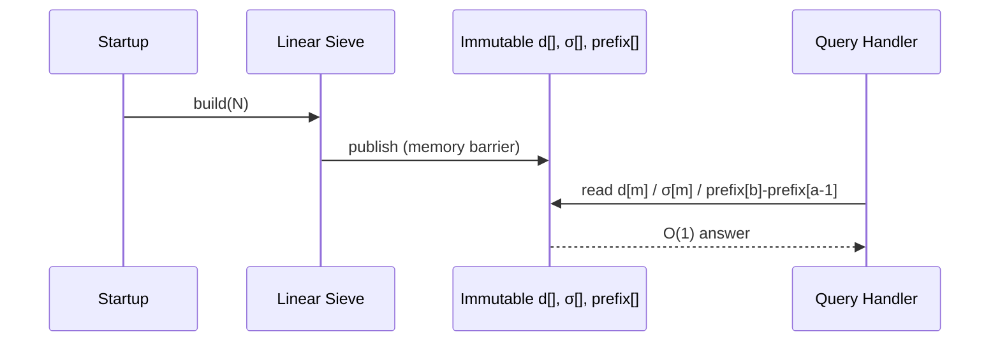
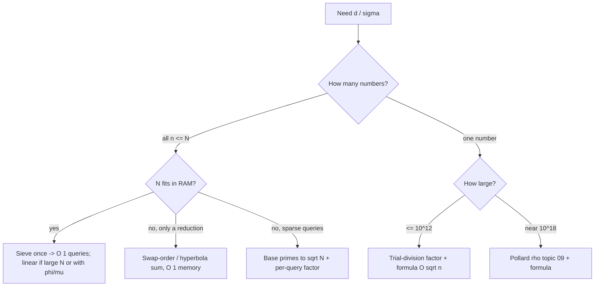

# Divisor Functions — Senior / Production Level

> **Focus:** Computing `d` and `σ` for *all* `n ≤ N` at production scale — the **linear-sieve** `O(N)` computation with exponent tracking, memory budgeting (which arrays, what integer width, when `σ` is the binding constraint), **batch query** systems, segmented/blocked precompute when `N` exceeds RAM, modular `σ` for huge values, cache and parallelism considerations, the decision boundary between *sieve* vs *per-query factorization*, testing, and the failure modes that bite in real systems.

---

## Table of Contents

1. [Introduction](#introduction)
2. [Linear-Sieve Computation of d and σ](#linear-sieve-computation-of-d-and-σ)
3. [Memory Budgeting at Scale](#memory-budgeting-at-scale)
4. [Batch Queries and Precompute Architecture](#batch-queries-and-precompute-architecture)
5. [Segmented / Blocked Precompute for Huge N](#segmented--blocked-precompute-for-huge-n)
6. [Modular σ and Overflow Control](#modular-σ-and-overflow-control)
7. [Sieve vs Per-Query Factorization](#sieve-vs-per-query-factorization)
8. [Production Code](#production-code)
9. [Testing Strategy](#testing-strategy)
10. [Failure Modes](#failure-modes)
11. [Observability and Operational Concerns](#observability-and-operational-concerns)
12. [Best Practices](#best-practices)
13. [Summary](#summary)
14. [Further Reading](#further-reading)

---

## Introduction

A divisor-function routine that prints `d(72) = 12` in a tutorial and one that serves millions of `σ(n)` queries under a memory cap are different artifacts. The math is identical; the engineering is not. At senior level the questions are:

- How do we compute `d` and `σ` for all `n ≤ N` in true `O(N)` instead of `O(N log N)`, and when is that worth the extra code and the less-cache-friendly access?
- How big can `N` get before the arrays no longer fit in RAM — and which array (`σ`, being 64-bit) is the binding constraint?
- How do we serve *batch* queries: build once, answer `O(1)`, share immutable across threads?
- What if `N` is too large to materialize — can we segment, or must we fall back to per-query factorization?
- `σ(n)` overflows fast; when do we need modular arithmetic or big integers, and how do we keep the multiplicative recurrence valid under a modulus?
- How do we test a function that produces `N` values where a single wrong exponent corrupts one entry among millions?

The recurring theme, as with prime sieves, is that this is **memory- and access-pattern-dominated, not arithmetic-dominated**. The arithmetic per element is a few adds/multiplies; the cost and the bugs live in *where the bytes are and how often they move*.

---

## Linear-Sieve Computation of d and σ

The `O(N log N)` divisor sieve is simple but does `Σ N/d ≈ N ln N` work. The **linear sieve** computes `d` and `σ` for all `n ≤ N` in `O(N)` by visiting each composite exactly once as `n = i · p` with `p = spf(n)` (the smallest prime factor), and propagating the multiplicative recurrence. It is the same machinery used for φ/μ in topic `04-dirichlet-linear-sieve` and `03-prime-sieves`.

The subtlety is that `d` and `σ` need **auxiliary exponent state**, because the recurrence differs depending on whether `p` is a *new* prime factor of `n` or *raises the exponent* of the smallest prime already in `i`.

Maintain:
- `spf[n]` — smallest prime factor (or a primes list).
- `cnt[n]` — the exponent of `spf(n)` in `n` (how many times the smallest prime divides `n`).
- For `σ`: `pw[n] = σ(p^{cnt})` partial, i.e. the contribution `1 + p + … + p^{cnt}` of the smallest prime power; or equivalently keep `g[n]` = the value of `σ` restricted to the smallest-prime power and `low[n]` = `n` with all factors of `spf(n)` removed.

The recurrences when forming `n = i · p` (`p` a prime, processed in increasing order, breaking when `p | i`):

```
Case A: p ∤ i  (p is a NEW smallest prime for n; gcd(i,p)=1)
    cnt[n] = 1
    d[n]   = d[i] * 2
    σ[n]   = σ[i] * (1 + p)

Case B: p | i  (p == spf(i); raises p's exponent)
    cnt[n] = cnt[i] + 1
    d[n]   = d[i] / (cnt[i] + 1) * (cnt[i] + 2)
    σ[n]   = σ[i] / σ(p^{cnt[i]}) * σ(p^{cnt[i]+1})
           where σ(p^e) = (p^{e+1} - 1)/(p - 1) = 1 + p + ... + p^e
```

For Case B's `σ`, dividing by `σ(p^{cnt[i]})` removes the old smallest-prime-power contribution and multiplies in the new one. To avoid division, many implementations carry `low[i]` (= `i` with all `spf(i)` factors stripped) so `σ[n] = σ[low[i]] * σ(p^{cnt[n]})` with `low[n] = low[i]`. The full correctness proof — that each `n` is built once from a finalized smaller `i` — is in [`professional.md`](./professional.md).

The result: `d` and `σ` for all `n ≤ N` in `O(N)`, in the same pass that can also yield primes, φ, μ. Cross-link: topic `04-dirichlet-linear-sieve` covers the shared framework; topic `03-prime-sieves` covers the underlying linear sieve.

---

## Memory Budgeting at Scale

The arrays you keep determine your ceiling. Per element:

| Array | Width | `N = 10^7` | `N = 10^8` | `N = 5·10^8` |
|-------|-------|-----------|-----------|--------------|
| `d[]` (int32) | 4 B | 40 MB | 400 MB | 2 GB |
| `d[]` (int16, since `d(n)` is small) | 2 B | 20 MB | 200 MB | 1 GB |
| `σ[]` (int64, required) | 8 B | 80 MB | 800 MB | 4 GB |
| `cnt[]` aux (int8) | 1 B | 10 MB | 100 MB | 500 MB |
| `spf[]` (int32, or √N-width) | 4 B | 40 MB | 400 MB | 2 GB |

Two observations drive sizing:

1. **`σ` is the binding constraint.** It must be 64-bit (`σ(n)` exceeds `n` and grows fast), so it is the heaviest array. If you only need `d`, you save the 8-byte `σ` array entirely.
2. **`d(n)` is tiny — pack it.** The maximum number of divisors of any `n ≤ 10^9` is `1344` (at `n = 735134400`), which fits in 16 bits. So `d[]` can be `int16` up to enormous `N`, halving its footprint. Do not store `d` as 64-bit out of habit.

When even the `σ` array will not fit, you stop materializing the whole range and either **segment** (next section) or fall back to **per-query factorization** (later section). The trade-off mirrors prime sieves: a materialized array gives `O(1)` random lookups but costs `O(N)` memory; segmenting streams values once with bounded memory but loses random access.

---

## Batch Queries and Precompute Architecture

The dominant production pattern is **precompute once, query many**:

1. **Build phase (single-threaded or window-parallel):** run the linear sieve (or `O(N log N)` divisor sieve) to fill `d[]` and/or `σ[]`. Mutates the arrays. No readers yet.
2. **Publish:** once built, store the arrays behind a memory barrier and treat them as **immutable**. After publication, concurrent reads are data-race-free with no locks.
3. **Serve phase:** each query `d(m)` / `σ(m)` is a single array read, `O(1)`, sub-microsecond. Range-sum queries (`Σ σ(i)` over `[a,b]`) use a precomputed prefix-sum array for `O(1)` answers.



Cap the requested `N` against available RAM *before* allocating; reject or auto-segment beyond the cap rather than letting the OOM killer decide. Build the arrays lazily once (guarded by a one-time initializer) and never rebuild per request — re-sieving in the hot path is the classic latency sink.

---

## Segmented / Blocked Precompute for Huge N

When `N` is too large to hold `σ[]` in RAM, you cannot keep a full array. Two strategies:

- **Stream-and-consume.** If you only need to *reduce* over the range (sum `σ`, count perfect numbers, find the max `d`), process `[1, N]` in blocks. For each block `[lo, hi]`, you still need each number's full factorization contribution, which requires divisors that can be as large as the number — so a pure "sieve this block" does not work the way the prime segmented sieve does. Instead, **stride divisors into the block**: for each `d` from `1` to `hi`, add `d` to the `σ`-accumulator of multiples of `d` that fall in `[lo, hi]`. This keeps memory at `O(block)` but the *time* is still `O(N log N)` overall (each block re-walks divisors up to `hi`), and large divisors only hit a few blocks. It is the bounded-memory version of the divisor sieve.
- **Per-query factorization.** If queries are *sparse* over a huge `[1, N]`, do not precompute at all — sieve base primes up to `√N` once (cheap), then factor each queried `n` by trial division against those primes in `O(√n / ln √n)` and apply the formula. Memory is `O(√N)`, independent of `N`.

The choice is the same cardinality question as everywhere: **dense range, fits in RAM → materialize**; **dense range, too big → blocked stream-and-reduce**; **sparse queries over huge range → per-query factorization with base primes**.

### Cache and blocking note

The `O(N log N)` divisor sieve, like the prime sieve, becomes memory-bandwidth-bound for large `N` because small divisors stride across the entire array. Cache-blocking — process the array in L2-sized windows, iterating divisors within each window — recovers locality and gives a 2–5× speedup, exactly as in topic `03-prime-sieves`. The linear sieve is harder to block (it builds `n` from `i = n/spf(n)`, a non-local access), which is one reason the simpler divisor sieve sometimes wins wall-clock despite the worse asymptotics.

---

## Modular σ and Overflow Control

`σ(n)` grows roughly like `n log log n` on average but can be much larger for highly composite `n`; over a *range*, sums of `σ` overflow 64-bit. Two regimes:

- **Exact values needed:** use big integers (Java `BigInteger`, Python's native ints, Go `math/big`). Slower, but correct. Necessary for, e.g., exact prefix sums of `σ` over large `N`.
- **Modular values needed** (typical in competitive programming, "answer mod `1e9+7`"): keep all arithmetic mod `M`. The multiplicative recurrence stays valid mod `M` for `d` and `σ` *additions and multiplications*, but the **geometric-sum closed form `(p^{a+1}−1)/(p−1)` requires a modular inverse** of `(p−1)` (only valid when `gcd(p−1, M) = 1`, true for prime `M` and `p ≠ 1`). Safer is to accumulate `1 + p + … + p^a` by repeated addition mod `M`, avoiding the inverse entirely — exactly the integer-accumulation pattern from `junior.md`, now under a modulus.

```
σ_mod(p^a) under modulus M:
    term = 1; pk = 1
    for k = 1 .. a:
        pk = pk * p % M
        term = (term + pk) % M
    return term
```

Pitfall: do *not* use the division-based closed form under a modulus unless you compute the modular inverse correctly; the repeated-addition form is the robust default.

---

## Sieve vs Per-Query Factorization

Choosing wrong is the most common senior mistake. The decision is *how many* numbers and *how large*:

| Situation | Best tool | Why |
|-----------|-----------|-----|
| `d`/`σ` for **all** `n ≤ N`, `N` fits in RAM | **Sieve** (linear or `N log N`) | Amortizes one `O(N)`/`O(N log N)` build over `O(1)` lookups |
| `d`/`σ` for **one** `n` up to ~`10^{12}` | **Trial-division factorization** + formula | `O(√n)` is fine for a single moderate number |
| `d`/`σ` for **sparse** queries over huge `[1, N]` | Base primes to `√N` + **per-query factorization** | `O(√N)` memory, `O(√n)` per query |
| `d`/`σ` for **one** `n` near `10^{18}` | **Factor** `n` (Pollard's rho, topic `09`) then formula | Trial division too slow; needs a real factoring algorithm |
| Range *sum* of `σ` over `[a,b]`, `N` fits | Sieve + **prefix sums** | `O(1)` per range query |

The boundary in one sentence: **sieve for a dense range up to a RAM-fittable bound; factor per-query for sparse or huge inputs; reach for a real factoring algorithm (topic `09-pollard-rho`) only when the single number is too large to trial-divide.** A frequent anti-pattern is building a `10^9` sieve to answer a handful of `σ(n)` queries — per-query factorization with base primes is thousands of times cheaper and uses almost no memory.

---

## Production Code

### Linear sieve for d and σ (Go) — O(N)

```go
package main

import "fmt"

// linearDivisor computes d[n] and sigma[n] for all n <= N in O(N).
// cnt[n] = exponent of spf(n) in n; sigmaPrimePow[n] = sigma(spf(n)^cnt[n]).
func linearDivisor(N int) (d []int, sigma []int64) {
	d = make([]int, N+1)
	sigma = make([]int64, N+1)
	cnt := make([]int, N+1)              // exponent of smallest prime
	spp := make([]int64, N+1)            // sigma of that smallest prime power
	var primes []int
	composite := make([]bool, N+1)

	if N >= 1 {
		d[1], sigma[1] = 1, 1
	}
	for i := 2; i <= N; i++ {
		if !composite[i] { // i is prime
			primes = append(primes, i)
			d[i] = 2
			sigma[i] = int64(i) + 1
			cnt[i] = 1
			spp[i] = int64(i) + 1
		}
		for _, p := range primes {
			if i*p > N {
				break
			}
			composite[i*p] = true
			if i%p == 0 {
				// p == spf(i): raise exponent
				cnt[i*p] = cnt[i] + 1
				d[i*p] = d[i] / (cnt[i] + 1) * (cnt[i] + 2)
				newSPP := spp[i]*int64(p) + 1 // 1+p+...+p^{e+1} = p*(prev) + 1
				sigma[i*p] = sigma[i] / spp[i] * newSPP
				spp[i*p] = newSPP
				break
			}
			// p is a new smallest prime for i*p (gcd(i,p)=1)
			cnt[i*p] = 1
			d[i*p] = d[i] * 2
			sigma[i*p] = sigma[i] * (int64(p) + 1)
			spp[i*p] = int64(p) + 1
		}
	}
	return
}

func main() {
	d, sigma := linearDivisor(360)
	for _, n := range []int{6, 12, 72, 360} {
		fmt.Printf("n=%d d=%d sigma=%d\n", n, d[n], sigma[n])
	}
	// n=6 d=4 sigma=12 ; n=12 d=6 sigma=28 ; n=72 d=12 sigma=195 ; n=360 d=24 sigma=1170
}
```

Note the neat identity `σ(p^{e+1}) = p·σ(p^e) + 1`, used to update `spp` in `O(1)` without recomputing the geometric series.

### Batch query service (Java) — build once, query O(1)

```java
public final class DivisorService {
    private final int[] d;       // d(n), int is plenty (16-bit would also work)
    private final long[] sigma;  // sigma(n), must be 64-bit
    private final long[] prefSigma; // prefix sums for range queries
    private final int n;

    public DivisorService(int n) {
        this.n = n;
        d = new int[n + 1];
        sigma = new long[n + 1];
        for (int div = 1; div <= n; div++) {       // O(N log N) divisor sieve
            for (int m = div; m <= n; m += div) {
                d[m]++;
                sigma[m] += div;
            }
        }
        prefSigma = new long[n + 1];
        for (int i = 1; i <= n; i++) prefSigma[i] = prefSigma[i - 1] + sigma[i];
    }

    public int divisors(int m) { check(m); return d[m]; }
    public long sigma(int m)   { check(m); return sigma[m]; }
    public long sigmaRange(int a, int b) { check(a); check(b); return prefSigma[b] - prefSigma[a - 1]; }

    private void check(int m) {
        if (m < 1 || m > n) throw new IllegalArgumentException("out of range: " + m);
    }

    public static void main(String[] args) {
        DivisorService s = new DivisorService(1_000_000);
        System.out.println(s.divisors(360)); // 24
        System.out.println(s.sigma(360));     // 1170
        System.out.println(s.sigmaRange(1, 10)); // 1+3+4+7+6+12+8+15+13+18 = 87
    }
}
```

The `check` guard *throws* on out-of-range input rather than returning a wrong answer — callers must explicitly route `m > n` to per-query factorization.

### Per-query factorization with base primes (Python) — bounded memory for huge N

```python
import math


def base_primes(limit):
    is_comp = bytearray(limit + 1)
    ps = []
    for p in range(2, limit + 1):
        if not is_comp[p]:
            ps.append(p)
            for m in range(p * p, limit + 1, p):
                is_comp[m] = 1
    return ps


def d_sigma_via_primes(n, primes):
    d, sigma = 1, 1
    for p in primes:
        if p * p > n:
            break
        if n % p == 0:
            a, term, pk = 0, 1, 1
            while n % p == 0:
                n //= p
                a += 1
                pk *= p
                term += pk
            d *= a + 1
            sigma *= term
    if n > 1:
        d *= 2
        sigma *= 1 + n
    return d, sigma


if __name__ == "__main__":
    primes = base_primes(10**6)  # enough to factor any n <= 10^12
    print(d_sigma_via_primes(999_999_000_001, primes))
```

This uses `O(√N)` memory (base primes to `10^6` covers `n ≤ 10^{12}`) and answers each query in `O(√n)` — the right tool when queries are sparse over a huge range.

---

## Testing Strategy

A divisor-function table emits `N` values; one wrong exponent corrupts a single entry that example tests miss. Layer the defenses:

1. **Known small values.** Assert `d(12)=6, σ(12)=28, d(360)=24, σ(360)=1170, σ(6)=12, d(1)=σ(1)=1`.
2. **Cross-check sieve vs formula.** For all `n ≤ 10^5`, assert the sieved `d[n]`/`σ[n]` equal an independent trial-division computation. Two methods agreeing is strong evidence.
3. **Cross-check linear sieve vs `O(N log N)` sieve.** They must produce identical arrays for all `n ≤ N`.
4. **Multiplicativity property.** For random coprime `a, b ≤ √N`, assert `d[a*b]==d[a]*d[b]` and `σ[a*b]==σ[a]*σ[b]`.
5. **Identity checks.** `Σ_{d∣n} d(d)`-style identities; `σ(p)=p+1` for sampled primes; perfect numbers `6,28,496,8128` satisfy `σ(n)=2n`.
   - Also assert the Möbius-inverse relation `n = Σ_{d∣n} σ(d) μ(n/d)` for sampled `n` if you have a `μ` array — a joint check on `σ` and `μ` together.
6. **Boundary fuzz.** `N ∈ {1,2,3}`, `n=1`, `n` prime, `n` a high prime power, `n` a perfect square.
7. **Overflow guard.** For large `N`, assert `σ` is 64-bit and a known large `σ` value matches (e.g. `σ(720720)` for a highly composite number).

### Cross-check harness (Python)

```python
def brute_d_sigma(n):
    d, s = 0, 0
    i = 1
    while i * i <= n:
        if n % i == 0:
            d += 1; s += i
            j = n // i
            if j != i:
                d += 1; s += j
        i += 1
    return d, s


def test(sieve_fn, N=100_000):
    d, sigma = sieve_fn(N)
    for n in range(1, N + 1):
        bd, bs = brute_d_sigma(n)
        assert d[n] == bd and sigma[n] == bs, f"mismatch at {n}"
    print("all divisor-function tests passed")
```

Run this in CI; it catches exponent off-by-ones, leftover-prime bugs, and overflow corruption that example-based tests miss, because it checks *every* value against an independent oracle.

### Benchmarking discipline

Before claiming a sieve optimization "works," measure correctly:

- **Warm the cache and the JIT.** Discard the first run(s); measure steady-state. A cold JVM or page cache reports warmup, not the algorithm.
- **Fix `N`, vary one knob.** Compare divisor sieve vs linear sieve, or int16 vs int32 `d[]`, at the *same* `N` on the *same* machine.
- **Report throughput** ("numbers processed per second"), which normalizes across `N` and exposes the cache cliff once `σ[]` exceeds L3.
- **Validate every run.** Assert a checksum (e.g. `Σ d[n] mod M`) inside the benchmark so a "speedup" from skipped work is caught immediately.
- **Benchmark large `N`.** The most common mistake is comparing at a small `N` that fits in L3, where blocking and the linear sieve show no benefit; the real effect appears only well beyond cache.

A frequent surprising result: the simpler `O(N log N)` divisor sieve *beats* the `O(N)` linear sieve at moderate `N` (say `≤ 10^6`) because its sequential striding is cache-friendly, while the linear sieve's `i = n/spf(n)` access is scattered. The asymptotics only win once `N` is large enough that the `log N` factor dominates the constant — always measure at your actual `N`.

---

## Real-World Deployment Scenarios

### Scenario 1: a service answering `d(x)` / `σ(x)` for `x ≤ 10^7`

Build the `O(N log N)` divisor sieve once at startup: `d[]` as `int16` (~20 MB) and `σ[]` as `int64` (~80 MB), ~100 MB total. Publish immutable; each request is a single array read, sub-microsecond. Cap requests to `x ≤ 10^7`; for `x` above the cap, fall through to per-query factorization with base primes to `√x`. This hybrid — sieve for the dense common case, factor for the long tail — is the standard production shape, mirroring the prime-sieve service in topic `03`.

### Scenario 2: a batch job summing `σ` over `[1, 10^9]`

You cannot hold a `10^9`-entry `σ[]` array (8 GB). Since you only need the *sum* (a reduction), use the swap-order identity `Σ_{n≤N} σ(n) = Σ_{d≤N} d·⌊N/d⌋`, computable in `O(N)` (or `O(√N)` with the hyperbola method, see topic professional / `tasks.md` Task 13) with `O(1)` memory — no array at all. Recognizing that a reduction does not need the materialized array is the key senior move; it turns an 8 GB job into a few-KB one.

### Scenario 3: counting perfect / abundant numbers up to `10^8`

Sieve `σ` in `int64` (~800 MB) in cache-blocked chunks, classify each `n` by `σ(n)` vs `2n`, accumulate counts, and discard the chunk. Memory stays at `O(√N + block)` if you stream; or materialize if 800 MB fits. Abundant numbers dominate the count above ~`20161` because abundance propagates through divisibility (a multiple of an abundant number is abundant), so the count grows roughly linearly.

## Anti-Patterns Checklist

| Anti-pattern | Why it hurts | Do instead |
|--------------|--------------|------------|
| 32-bit `σ` array | Silent overflow corrupts values | 64-bit `σ`, always |
| `int64` `d` array | Wastes 4× memory; `d(n)` is tiny | `int16` (`d(n) ≤ 1344` for `n ≤ 10^9`) |
| Materialize `σ[]` just to sum it | OOM for huge `N` | Swap-order / hyperbola reduction, `O(1)` memory |
| Factor every `n` for a dense range | `O(N√n)` total, far slower | One divisor or linear sieve |
| Build `10^9` sieve for a few queries | 800 MB + seconds for a handful | Per-query factorization with base primes |
| Re-sieve in the request handler | Repeated `O(N log N)` per request | Build once, share immutable |
| Division closed form for modular `σ` | Wrong without modular inverse | Accumulate geometric sum by addition mod M |
| Monolithic big-`N` sieve, no blocking | Memory-bandwidth-bound | Cache-block into L2-sized windows |

## Capacity Planning Cheat Sheet

Estimate memory and time from the bound `N` before deploying:

| Need | Memory | Time | Notes |
|------|--------|------|-------|
| `d[]` only (int16) | `2N` bytes | `O(N log N)` or `O(N)` | `d(n)` fits 16 bits |
| `σ[]` only (int64) | `8N` bytes | `O(N log N)` or `O(N)` | the binding constraint |
| `d[]` + `σ[]` | `10N` bytes | one pass | linear sieve does both |
| `+` prefix sums for range-`σ` | `+8N` bytes | `+O(N)` | `O(1)` range queries |
| Sum of `σ` over `[1,N]` only | `O(1)` | `O(N)` or `O(√N)` | swap-order / hyperbola, no array |
| Sparse queries over huge `N` | `O(√N)` (base primes) | `O(√n)` per query | per-query factorization |

Worked example: a `d`/`σ` service for `N = 2·10^7`. `d[]` int16 = 40 MB, `σ[]` int64 = 160 MB, ~200 MB total — fits a small container. Build once at startup (~hundreds of ms), share immutable.

## Failure Modes

| Failure | Symptom | Root cause | Mitigation |
|---------|---------|------------|------------|
| `σ` overflow | Negative/garbage `σ(n)` for large `n` | 32-bit `σ` array | Use 64-bit; for ranges use bigint or modulus |
| OOM at large `N` | Process killed | 8-byte `σ` array too big | Cap `N`; segment; per-query factorize; pack `d` as int16 |
| Wrong `d`/`σ` for one value | Rare incorrect result | Linear-sieve exponent recurrence off-by-one, or missing leftover prime | Cross-check vs brute force over dense range |
| Modular `σ` wrong | Off by inverse | Used `(p^{a+1}-1)/(p-1)` mod M without modular inverse | Accumulate `1+p+…+p^a` by addition mod M |
| Re-sieve per request | High latency / CPU | Building in the hot path | Build once, publish immutable |
| Range-sum overflow | Wrong prefix-sum totals | `Σ σ` exceeds 64-bit | Bigint prefix sums or modular |
| Per-query slower than sieve | Latency spike under dense queries | Factoring every `n` when a sieve was warranted | Match tool to query density |
| Linear sieve cache thrash | Big-`N` sieve crawls | Non-local `i = n/p` access | Use blocked `O(N log N)` sieve for cache locality |

---

## Thread-Safety and Lifecycle

The divisor-function arrays have a clean concurrency story if you respect their lifecycle:

1. **Build phase** — single-threaded (or window-parallel with private buffers). Mutates `d[]`/`σ[]`. No readers allowed yet.
2. **Publish** — once built, store the arrays behind a memory barrier (`sync.Once`-guarded global in Go, a `final` field set in a constructor in Java, a module-level constant in Python). After publication they are **immutable**.
3. **Serve phase** — many threads read `d[m]`/`σ[m]` concurrently. No locks needed because there are no writers — the data-race-free "immutable after construction" pattern.

The bug to avoid is letting a reader observe a half-built array (lazy init without proper synchronization), which returns wrong answers during the brief construction window. Use the language's standard one-time-initialization primitive so the publish is a happens-before edge for all readers.

## War Stories (field notes)

A few hard-won notes that turn "works on my machine" into "works under load":

- **The 32-bit `σ` regression.** A service stored `σ` in `int` "to save memory." It worked until a customer queried a highly abundant number whose `σ` exceeded `2^31`; the wrapped value was reported as a smaller-than-`n` number, misclassifying it as deficient. *Lesson:* `σ` is 64-bit, non-negotiable; cross-check against brute force in CI.
- **The materialize-to-sum OOM.** A batch job summed `σ` over `[1, 10^9]` by first building the full array — 8 GB, instant OOM. *Lesson:* a reduction does not need the array; the swap-order identity sums in `O(1)` memory.
- **The modular division bug.** A contest solution used `(p^{a+1}−1)·inv(p−1) mod M` and got wrong answers when `p−1` shared a factor with a (non-prime) modulus. *Lesson:* accumulate the geometric sum by addition unless you have verified `gcd(p−1, M) = 1`.
- **The re-sieve-per-request.** A handler called `buildSieve(N)` inside the request path "for simplicity," pegging CPU under load. *Lesson:* build once, memoize, share immutable; the arrays are read-only after construction.

These map one-to-one onto the failure-mode table; the table is the checklist, the stories are why each row exists.

## Observability and Operational Concerns

- **Log the bound and footprint** at startup (`N`, bytes for `d[]`, `σ[]`, prefix). A surprise `N` from config is a classic OOM trigger.
- **Bound and cap the input** before allocating; reject or auto-segment beyond a RAM-derived cap.
- **Validate the cap against the `σ`-array width**, since the 8-byte `σ[]` (not the packed `d[]`) sets the real memory ceiling — a cap derived from `d[]` alone will under-estimate by ~4×.
- **Build once, lazily, cache it.** Guard with a one-time initializer; treat arrays as immutable, safe to share read-only across threads.
- **Track build time and a checksum** (e.g. `Σ d[n] mod M`) as metrics; a sudden change signals a correctness or config regression.
- **Surface the build path and array widths in a startup log line** so on-call engineers can read, at a glance, exactly how much memory the process committed and which algorithm produced it.
- **Warm up** before serving if the build gates request latency; the first build of a large array can take seconds.
- **Expose a readiness probe** that flips only after the arrays are built and published, so the orchestrator does not route traffic to a pod mid-construction.
- **Emit the build algorithm and total committed bytes** in one structured startup log line, so capacity and regression issues are visible on dashboards before they OOM.
- **Emit which path is in use** (materialized vs segmented vs per-query) so a silent fallback to the memory-heavy path is visible before it OOMs.
- **Alert on a `σ`-range-sum nearing the 64-bit ceiling.** If you serve exact range sums, a prefix value approaching `2^63` is a signal to switch to big integers or a modulus before silent overflow corrupts every answer above that point.
- **Record the integer width chosen for each array** (`d` int16 vs int32, `σ` int64 vs bigint). A config change that bumps `N` past the int16 `d`-overflow point (`d(n) > 32767`, never for realistic `N` but worth a guard) should be caught at build time, not in a wrong answer.

---

## Best Practices

- Default to the **`O(N log N)` divisor sieve** for clarity and cache-friendliness; switch to the **linear sieve** when `N` is large or you compute `d`/`σ` alongside φ/μ/SPF (topic `04-dirichlet-linear-sieve`).
- Always 64-bit `σ`; pack `d` as 16-bit if memory is tight (`d(n)` is small even for huge `n`).
- For modular `σ`, accumulate the geometric sum by addition — never the division closed form without a verified modular inverse.
- Pick the tool by cardinality and size: **sieve a dense range**, **factor per-query for sparse/huge inputs**, **Pollard's rho (topic `09`) for a single huge number**.
- Test against **brute force over a dense prefix** and **linear-vs-`N log N` parity**; one wrong exponent hides among millions otherwise.
- Validate and cap `N` before allocating; build once and share immutable; precompute prefix sums for range queries.
- Use the `σ(p^{e+1}) = p·σ(p^e) + 1` identity to update the smallest-prime-power contribution in `O(1)`.

---

## Decision Recap (the one diagram to remember)



This single diagram encodes the whole senior chapter: cardinality (one vs many) and size (fits vs huge) pick the tool, while `σ` width (64-bit) and build-once-immutable govern the implementation.

---

## Summary

At production scale the divisor-function algorithm is easy; the engineering around memory, integer width, and query architecture is where the wins and bugs live. Compute `d` and `σ` for all `n ≤ N` in true `O(N)` with the **linear sieve** (tracking the exponent of the smallest prime and the partial geometric sum `σ(p^e)`, updated via `σ(p^{e+1}) = p·σ(p^e)+1`), or in `O(N log N)` with the simpler, more cache-friendly divisor sieve. Budget memory around the **64-bit `σ` array** (the binding constraint) and pack `d` as 16-bit. Serve **batch queries** by building once, publishing immutable, and answering `O(1)` (with prefix sums for range queries). When `N` outgrows RAM, **segment / stream-and-reduce** or fall back to **per-query factorization** with base primes to `√N`. Keep `σ` from overflowing with 64-bit, big integers, or a modulus (accumulating the geometric sum by addition, not division). Test relentlessly against brute force and linear-vs-`N log N` parity, and cap the bound before you allocate — or the OOM killer will cap it for you.

Next step: continue to [`professional.md`](./professional.md) — multiplicativity proofs, the `Σ N/i = O(N log N)` sieve-complexity derivation, the Dirichlet-convolution foundation, the Euclid–Euler perfect-number theorem, and `σ`/`d` asymptotics.

---

## Further Reading

- Sibling file [`middle.md`](./middle.md) — multiplicativity, the divisor sieve, perfect/abundant/amicable numbers.
- Sibling file [`professional.md`](./professional.md) — proofs of multiplicativity, the `O(N log N)` bound, convolution, and asymptotics.
- Sibling topic `04-dirichlet-linear-sieve` — the shared linear-sieve framework for multiplicative functions.
- Sibling topic `03-prime-sieves` — the underlying linear sieve, segmentation, and cache blocking.
- Sibling topic `09-pollard-rho` — factoring a single huge number whose `σ`/`d` you need.
- Sibling topic `32-mobius-inversion` — the convolution/inversion view of divisor sums.
- cp-algorithms.com — "Linear Sieve" and "Number of divisors / sum of divisors".
- Sibling file [`interview.md`](./interview.md) — system-design and coding questions on precomputing divisor functions.
- Sibling file [`junior.md`](./junior.md) — the closed forms and the basic divisor sieve.
- Kim Walisch, *primesieve* — engineering patterns (segmentation, blocking) that transfer directly to large-`N` divisor precompute.
- Sibling file [`tasks.md`](./tasks.md) — Tasks 6 (linear sieve), 11 (huge-`n` per-query), and 15 (divisor-vs-linear benchmark) operationalize this chapter.
