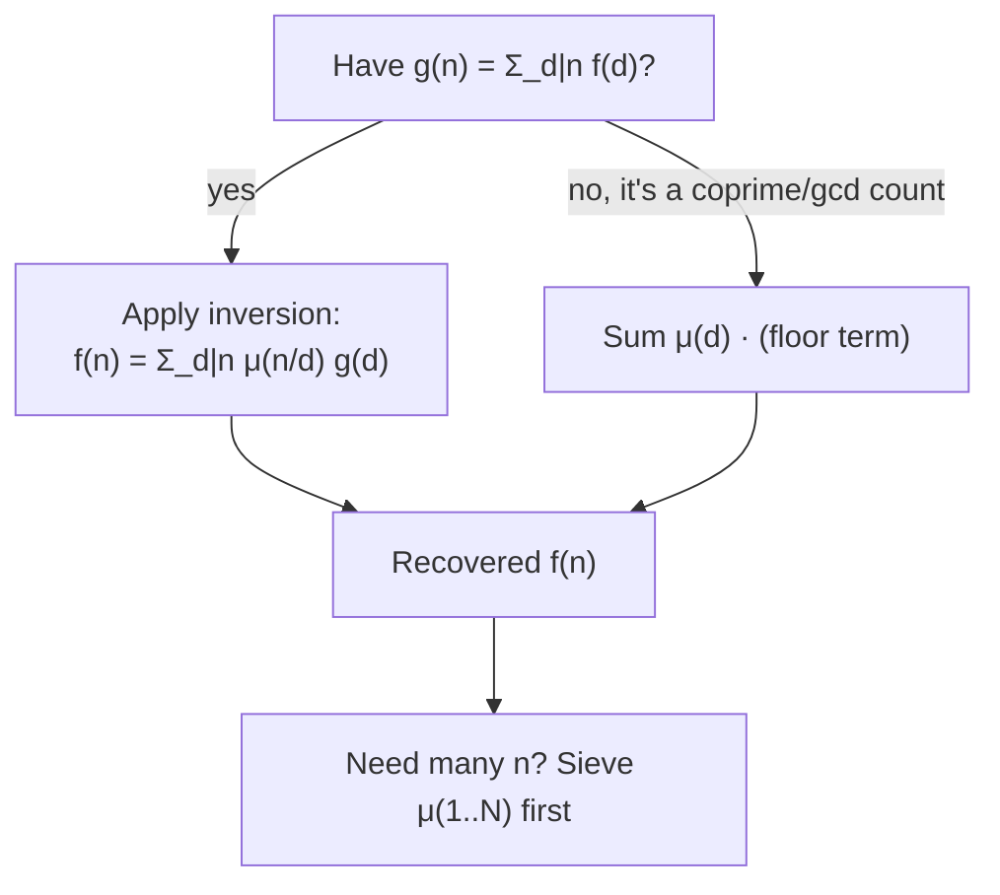

# Möbius Function & Möbius Inversion — Junior Level

> **One-line summary:** The **Möbius function** `μ(n)` is a tiny three-valued function — `1`, `-1`, or `0` — that tags each integer by its prime structure: `0` if `n` is divisible by a square, otherwise `(-1)^k` where `k` is the number of distinct primes. Its magic is **Möbius inversion**: if a quantity `g(n)` is the sum of `f(d)` over all divisors `d` of `n`, then you can *recover* `f(n) = Σ_{d|n} μ(n/d) · g(d)`. It is the number theorist's version of "undo a running total," and it powers counting tricks like "how many coprime pairs are there up to `n`?"

---

## Table of Contents

1. [Introduction](#introduction)
2. [Prerequisites](#prerequisites)
3. [Glossary](#glossary)
4. [Core Concepts](#core-concepts)
5. [Big-O Summary](#big-o-summary)
6. [Real-World Analogies](#real-world-analogies)
7. [Pros & Cons](#pros--cons)
8. [Step-by-Step Walkthrough](#step-by-step-walkthrough)
9. [Code Examples](#code-examples)
10. [Coding Patterns](#coding-patterns)
11. [Error Handling](#error-handling)
12. [Performance Tips](#performance-tips)
13. [Best Practices](#best-practices)
14. [Edge Cases & Pitfalls](#edge-cases--pitfalls)
15. [Common Mistakes](#common-mistakes)
16. [Cheat Sheet](#cheat-sheet)
17. [Visual Animation](#visual-animation)
18. [Summary](#summary)
19. [Further Reading](#further-reading)

---

## Introduction

Imagine you keep a running total. Every day you write down `g(n)` = "the sum of all my daily incomes for days whose number divides `n`." Someone hands you the list of running totals and asks: *"What was the income on exactly day `n`?"* You cannot just read it off — each total mixes several days together. You need a way to *subtract back out* the contributions of the other days. **Möbius inversion** is exactly that "subtract back out" recipe, and the **Möbius function** `μ` is the set of plus/minus signs that makes the subtraction land perfectly.

Let us define the star of the show. For a positive integer `n`, the **Möbius function** is:

```
μ(1) = 1
μ(n) = 0            if n is divisible by any perfect square > 1  (i.e. p² | n for some prime p)
μ(n) = (-1)^k       if n is a product of k distinct primes (squarefree)
```

So you look at the prime factorization of `n`:

- If a prime appears **twice or more** (like `4 = 2²`, or `12 = 2²·3`), then `μ(n) = 0`.
- Otherwise `n` is **squarefree** — every prime appears exactly once — and the sign is `+1` if there is an even number of primes, `-1` if odd.

A few values to anchor it:

```
μ(1)  = 1     (empty product, 0 primes → (-1)^0 = 1)
μ(2)  = -1    (one prime)
μ(3)  = -1    (one prime)
μ(4)  = 0     (2² divides it)
μ(5)  = -1    (one prime)
μ(6)  = 1     (= 2·3, two distinct primes → (-1)² = 1)
μ(7)  = -1
μ(8)  = 0     (2³)
μ(9)  = 0     (3²)
μ(10) = 1     (= 2·5)
μ(12) = 0     (= 2²·3)
μ(30) = -1    (= 2·3·5, three primes → (-1)³ = -1)
```

The single most important property — the reason `μ` was invented — is its **divisor sum**:

```
Σ_{d | n} μ(d) = 1 if n = 1, and 0 for every n > 1.
```

In words: add up `μ(d)` over every divisor `d` of `n`, and you get `1` only when `n = 1`, and exactly `0` otherwise. That clean "1 at the start, 0 everywhere else" behavior is what makes `μ` act like a perfect cancelling agent. This whole file builds two things on top of it: how to **compute** `μ(n)`, and how to **use** it via the inversion formula.

---

## Prerequisites

Before reading this file you should be comfortable with:

- **Divisors and divisibility** — what "`d` divides `n`" means, and how to list every divisor of a number. See sibling `01-gcd-lcm`.
- **Prime factorization** — writing `n = p₁^{e₁} · p₂^{e₂} · …`. See sibling `03-prime-sieves`.
- **Squarefree numbers** — an integer with no repeated prime factor (no `p²` divides it).
- **GCD and coprimality** — `gcd(a, b) = 1` means "no shared prime factor." See sibling `01-gcd-lcm`.
- **Big-O notation** — `O(√n)`, `O(n log log n)`.

Optional but helpful:

- A glance at the **Sieve of Eratosthenes** — we will modify it to compute `μ` for many numbers at once (sibling `03-prime-sieves` and `04-dirichlet-linear-sieve`).
- Familiarity with **floor division** `⌊n/d⌋`, which appears in the coprime-counting application.

---

## Glossary

| Term | Meaning |
|------|---------|
| **Möbius function `μ(n)`** | `1` if `n=1`; `0` if a square divides `n`; `(-1)^k` if `n` is a product of `k` distinct primes. |
| **Squarefree** | An integer with no repeated prime factor — no `p²` divides it (e.g. `30 = 2·3·5` is squarefree, `12 = 2²·3` is not). |
| **Divisor `d \| n`** | `d` divides `n` evenly, i.e. `n = d·k` for some integer `k`. |
| **Divisor sum** | A sum `Σ_{d \| n} f(d)` taken over every divisor `d` of `n`. |
| **Multiplicative function** | A function `f` with `f(ab) = f(a)·f(b)` whenever `gcd(a,b)=1`. `μ` is multiplicative. |
| **Möbius inversion** | If `g(n) = Σ_{d \| n} f(d)`, then `f(n) = Σ_{d \| n} μ(n/d)·g(d)`. |
| **Coprime pair** | A pair `(a, b)` with `gcd(a, b) = 1`. |
| **`⌊x⌋` (floor)** | The greatest integer ≤ `x`; `⌊7/3⌋ = 2`. Counts "how many multiples of `d` are ≤ `n`." |
| **Linear sieve** | An `O(n)` sieve that computes `μ` (and other multiplicative functions) for all numbers `≤ n`. See `04-dirichlet-linear-sieve`. |
| **Constant-1 function `1(n)`** | The function that returns `1` for every `n`. `μ` is its "Dirichlet inverse" (covered in `middle.md`). |

---

## Core Concepts

### 1. The Definition by Prime Structure

`μ(n)` cares only about the *shape* of the prime factorization, not the actual primes:

- **Has a repeated prime?** → `μ(n) = 0`. The number is "contaminated" by a square.
- **All primes distinct (squarefree)?** → count them, call it `k`, and `μ(n) = (-1)^k`.

That is the entire definition. `μ(1) = 1` because `1` is the empty product (zero primes, `(-1)^0 = 1`). The reason this is useful is that the `0`s knock out non-squarefree terms in sums, and the alternating `±1` signs let contributions cancel in pairs.

### 2. The Killer Property: `Σ_{d|n} μ(d)`

This is the identity everything rests on:

```
Σ_{d | n} μ(d) = [n = 1]      (the Iverson bracket: 1 if n=1, else 0)
```

Check it for `n = 6`. Divisors of `6` are `1, 2, 3, 6`:

```
μ(1) + μ(2) + μ(3) + μ(6) = 1 + (-1) + (-1) + 1 = 0.  ✓
```

Check `n = 12`. Divisors `1, 2, 3, 4, 6, 12`:

```
μ(1) + μ(2) + μ(3) + μ(4) + μ(6) + μ(12)
= 1 + (-1) + (-1) + 0 + 1 + 0 = 0.  ✓
```

And `n = 1`: the only divisor is `1`, so the sum is `μ(1) = 1`. ✓ This "1 then 0 forever" behaviour is precisely what makes `μ` the inverse of summing — it is the number-theory analogue of an *identity element* for the divisor-sum operation. The full reason it always gives `0` for `n > 1` is a neat counting argument over squarefree divisors, shown in [`professional.md`](./professional.md).

### 3. Möbius Inversion (the main event)

Here is the formula you will use most:

> **If** `g(n) = Σ_{d | n} f(d)` **for every `n`,**
> **then** `f(n) = Σ_{d | n} μ(n/d) · g(d)` **for every `n`.**

In plain terms: if `g` is the "total over divisors" of some hidden function `f`, then you can recover `f` by summing `g` over divisors again — but this time weighted by `μ` of the *complementary* divisor `n/d`. The `μ` factor supplies exactly the right `+`/`-`/`0` signs to undo the over-counting. Notice the symmetry: going forward you sum `f` over divisors; going backward you sum `g` over divisors with `μ` weights.

### 4. The Classic Example: Totient as an Inversion

A famous identity is `Σ_{d | n} φ(d) = n`, where `φ` is Euler's totient (sibling `05-fermat-euler`). That says `n` itself is the divisor-sum of `φ`. Apply Möbius inversion (with `g(n) = n` and `f = φ`):

```
φ(n) = Σ_{d | n} μ(n/d) · d.
```

So the totient is "`n` summed over divisors, signed by `μ`." This is one of the cleanest demonstrations that inversion really does recover the hidden function.

### 5. Computing `μ` — One Number vs Many

- **One number** `μ(n)`: factor `n` by trial division in `O(√n)`. If any prime appears twice, return `0`; otherwise return `(-1)^{#primes}`.
- **All numbers `μ(1..n)`**: use a sieve. A modified Sieve of Eratosthenes computes every `μ` in `O(n log log n)`; the **linear sieve** does it in `O(n)` (sibling `04-dirichlet-linear-sieve`). The sieve is how every large-scale application actually obtains `μ`.

### 6. The Coprime-Counting Application (preview)

The reason competitive programmers love `μ`: it counts coprime things with a single sum. The number of integers in `1..n` that are coprime to `n`, or the number of coprime pairs up to `n`, both collapse to sums of the form `Σ_d μ(d) · (something with ⌊n/d⌋)`. The `μ` signs implement inclusion-exclusion over prime factors automatically — no manual "add singles, subtract pairs, add triples." We work a full example in the [walkthrough](#step-by-step-walkthrough). The deeper "why" (inclusion-exclusion) is in `middle.md` and cross-linked to `26-inclusion-exclusion`.

---

## Big-O Summary

| Operation | Time | Space | Notes |
|-----------|------|-------|-------|
| `μ(n)` for one `n` (trial division) | **O(√n)** | O(1) | Factor; return `0` on a repeated prime, else `(-1)^k`. |
| `μ(1..n)` via Eratosthenes-style sieve | **O(n log log n)** | O(n) | Modified prime sieve — see `03-prime-sieves`. |
| `μ(1..n)` via linear sieve | **O(n)** | O(n) | Smallest-prime-factor sieve — see `04-dirichlet-linear-sieve`. |
| Möbius inversion `f(n)` from `g` (one `n`) | O(d(n)) | O(1) | `d(n)` = number of divisors of `n`. |
| Count coprime-to-`n` integers via `μ` over divisors | O(d(n)) | O(1) | Equals `φ(n)`. |
| Count coprime pairs ≤ `n` via `Σ μ(d)⌊n/d⌋²` | O(n) | O(n) | Needs `μ(1..n)` sieved first. |
| Verify `Σ_{d\|n} μ(d) = [n=1]` | O(d(n)) | O(1) | Sanity check on small `n`. |

The two headline costs are **`O(√n)`** to compute a single `μ` by factoring, and **`O(n)`–`O(n log log n)`** to sieve all of them. Every application is built from these.

---

## Real-World Analogies

| Concept | Analogy |
|---------|---------|
| `μ(n) = 0` for non-squarefree `n` | A spam filter that throws away (sets to zero) any message with a "repeated" red flag — only "clean" squarefree numbers survive. |
| Alternating `±1` signs | A see-saw of add/subtract: include the wholes, subtract the pairs, add back the triples — the signs come for free from `μ`. |
| Möbius inversion | The "undo running-total" key: given the cumulative sums, peel back the layers to recover each original entry. |
| `Σ_{d\|n} μ(d) = [n=1]` | A perfectly balanced ledger: every column cancels to zero except the very first. |
| Inclusion-exclusion via `μ` | A Venn diagram where the overlap corrections (subtract A∩B, add A∩B∩C) are applied automatically by the sign of `μ`. |
| Counting coprime pairs | Counting people who share *no* common interest — start from "all pairs," then strip out those sharing factor 2, factor 3, …, with `μ` orchestrating the bookkeeping. |

Where the analogies break: the "undo running total" picture only works because divisors form a clean lattice; for general "totals" with no divisor structure, ordinary inverses are needed instead.

---

## Pros & Cons

| Pros | Cons |
|------|------|
| One formula inverts *any* divisor-sum relationship. | Only applies to divisor-sum (or its poset generalization) relationships — not arbitrary sums. |
| Replaces hand-written inclusion-exclusion with a single `μ` sum. | You must correctly identify `f` and `g`; mislabelling them flips the formula. |
| `μ` precomputes for all `n ≤ N` in `O(N)` via the linear sieve. | A single large `μ(n)` needs factoring (`O(√n)`), which is slow for cryptographic-size `n`. |
| Coprime-counting / gcd-sum problems collapse to short sums. | The non-squarefree `0`s and alternating signs are error-prone to derive by hand. |
| Multiplicative, so it composes cleanly with `φ`, `d`, `σ`. | The `n/d` (complementary divisor) is easy to swap with `d` by mistake. |

**When to use:** inverting a `g(n) = Σ_{d|n} f(d)` relation, counting coprime pairs / triples, gcd-sum problems (`Σ gcd(i, j)`), deriving `φ` from `n`, and any problem that "smells like inclusion-exclusion over prime factors."

**When NOT to use:** problems with no divisor/poset structure (use ordinary algebra), or when you need a single `μ(n)` for a number too large to factor (then the value is genuinely hard).

---

## Step-by-Step Walkthrough

**Goal A — compute `μ(n)` by hand for `n = 90` and `n = 105`.**

**Step 1 — factor `90`.** `90 = 2 · 3² · 5`. The prime `3` appears squared, so a square divides `90`. Therefore `μ(90) = 0`.

**Step 2 — factor `105`.** `105 = 3 · 5 · 7`. Three *distinct* primes, none repeated, so `105` is squarefree with `k = 3`. Hence `μ(105) = (-1)³ = -1`.

**Goal B — recover `φ(n)` from the identity `Σ_{d|n} φ(d) = n` via inversion, for `n = 12`.**

**Step 3 — list divisors of `12`:** `1, 2, 3, 4, 6, 12`. We use `φ(n) = Σ_{d|n} μ(n/d)·d`.

**Step 4 — for each divisor `d`, pair it with `μ(12/d)`:**

```
d=1:  μ(12/1)·1  = μ(12)·1  = 0·1  = 0
d=2:  μ(12/2)·2  = μ(6)·2   = 1·2  = 2
d=3:  μ(12/3)·3  = μ(4)·3   = 0·3  = 0
d=4:  μ(12/4)·4  = μ(3)·4   = -1·4 = -4
d=6:  μ(12/6)·6  = μ(2)·6   = -1·6 = -6
d=12: μ(12/12)·12= μ(1)·12  = 1·12 = 12
```

**Step 5 — sum them:** `0 + 2 + 0 − 4 − 6 + 12 = 4`. And indeed `φ(12) = 4` (the residues `1, 5, 7, 11`). Inversion recovered the totient. ✓

**Goal C — count integers in `1..30` that are coprime to `30`, using `μ` (this is `φ(30)`).**

**Step 6 — the formula.** The count of `k ≤ n` with `gcd(k, n) = 1` is `Σ_{d|n} μ(d)·⌊n/d⌋`. For `n = 30 = 2·3·5`, the divisors with nonzero `μ` are the squarefree ones: `1, 2, 3, 5, 6, 10, 15, 30`.

**Step 7 — evaluate term by term** (`⌊30/d⌋` counts multiples of `d` up to 30):

```
d=1:  μ(1)·⌊30/1⌋  =  1·30 = 30
d=2:  μ(2)·⌊30/2⌋  = -1·15 = -15
d=3:  μ(3)·⌊30/3⌋  = -1·10 = -10
d=5:  μ(5)·⌊30/5⌋  = -1·6  = -6
d=6:  μ(6)·⌊30/6⌋  =  1·5  = 5
d=10: μ(10)·⌊30/10⌋=  1·3  = 3
d=15: μ(15)·⌊30/15⌋=  1·2  = 2
d=30: μ(30)·⌊30/30⌋= -1·1  = -1
```

**Step 8 — sum:** `30 − 15 − 10 − 6 + 5 + 3 + 2 − 1 = 8`. And `φ(30) = 8` (the coprime residues `1, 7, 11, 13, 17, 19, 23, 29`). The `μ` signs performed inclusion-exclusion over the primes `2, 3, 5` automatically: subtract multiples of each prime, add back multiples of each pair, subtract the triple. ✓

That is the complete junior toolkit: read off `μ` from the factorization, plug into the inversion formula with the *complementary* divisor `n/d`, and watch coprime counts fall out as a signed sum of floor terms.

---

## Code Examples

### Example: Compute `μ(n)`, sieve `μ(1..n)`, and verify the divisor-sum identity

#### Go

```go
package main

import "fmt"

// mobiusSingle computes μ(n) by trial division in O(√n).
func mobiusSingle(n int) int {
	if n == 1 {
		return 1
	}
	primes := 0
	for p := 2; p*p <= n; p++ {
		if n%p == 0 {
			n /= p
			if n%p == 0 { // p appears at least twice → square divides n
				return 0
			}
			primes++
		}
	}
	if n > 1 { // a leftover prime factor > √(original n)
		primes++
	}
	if primes%2 == 0 {
		return 1
	}
	return -1
}

// sieveMobius computes mu[0..n] with mu[i] = μ(i) in O(n log log n).
func sieveMobius(n int) []int {
	mu := make([]int, n+1)
	isComposite := make([]bool, n+1)
	if n >= 1 {
		mu[1] = 1
	}
	primes := []int{}
	// Linear sieve variant: each i gets its μ from its smallest prime factor.
	for i := 2; i <= n; i++ {
		if !isComposite[i] {
			primes = append(primes, i)
			mu[i] = -1 // prime → one distinct factor
		}
		for _, p := range primes {
			if i*p > n {
				break
			}
			isComposite[i*p] = true
			if i%p == 0 {
				mu[i*p] = 0 // p² divides i*p → not squarefree
				break
			}
			mu[i*p] = -mu[i] // multiply by one more distinct prime → flip sign
		}
	}
	return mu
}

func main() {
	fmt.Println(mobiusSingle(90))  // 0  (2·3²·5)
	fmt.Println(mobiusSingle(105)) // -1 (3·5·7)
	fmt.Println(mobiusSingle(6))   // 1  (2·3)

	mu := sieveMobius(12)
	fmt.Println(mu[1:]) // [1 -1 -1 0 -1 1 -1 0 0 1 -1 0]

	// Verify Σ_{d|n} μ(d) = [n==1] for n = 1..12.
	for n := 1; n <= 12; n++ {
		s := 0
		for d := 1; d <= n; d++ {
			if n%d == 0 {
				s += mu[d]
			}
		}
		fmt.Printf("Σμ(d|%d)=%d ", n, s)
	}
	fmt.Println()
}
```

#### Java

```java
import java.util.ArrayList;
import java.util.Arrays;
import java.util.List;

public class Mobius {
    // μ(n) by trial division, O(√n).
    static int mobiusSingle(int n) {
        if (n == 1) return 1;
        int primes = 0;
        for (int p = 2; (long) p * p <= n; p++) {
            if (n % p == 0) {
                n /= p;
                if (n % p == 0) return 0; // square factor
                primes++;
            }
        }
        if (n > 1) primes++; // leftover prime
        return (primes % 2 == 0) ? 1 : -1;
    }

    // Linear sieve of μ(0..n), O(n).
    static int[] sieveMobius(int n) {
        int[] mu = new int[n + 1];
        boolean[] composite = new boolean[n + 1];
        if (n >= 1) mu[1] = 1;
        List<Integer> primes = new ArrayList<>();
        for (int i = 2; i <= n; i++) {
            if (!composite[i]) {
                primes.add(i);
                mu[i] = -1;
            }
            for (int p : primes) {
                if ((long) i * p > n) break;
                composite[i * p] = true;
                if (i % p == 0) {
                    mu[i * p] = 0;
                    break;
                }
                mu[i * p] = -mu[i];
            }
        }
        return mu;
    }

    public static void main(String[] args) {
        System.out.println(mobiusSingle(90));  // 0
        System.out.println(mobiusSingle(105)); // -1
        System.out.println(mobiusSingle(6));   // 1

        int[] mu = sieveMobius(12);
        System.out.println(Arrays.toString(Arrays.copyOfRange(mu, 1, 13)));
        // [1, -1, -1, 0, -1, 1, -1, 0, 0, 1, -1, 0]

        for (int n = 1; n <= 12; n++) {
            int s = 0;
            for (int d = 1; d <= n; d++) if (n % d == 0) s += mu[d];
            System.out.printf("Σμ(d|%d)=%d ", n, s);
        }
        System.out.println();
    }
}
```

#### Python

```python
def mobius_single(n):
    """μ(n) by trial division in O(√n)."""
    if n == 1:
        return 1
    primes = 0
    p = 2
    while p * p <= n:
        if n % p == 0:
            n //= p
            if n % p == 0:        # p appears again → square divides n
                return 0
            primes += 1
        p += 1
    if n > 1:                     # leftover prime factor
        primes += 1
    return 1 if primes % 2 == 0 else -1


def sieve_mobius(n):
    """Linear sieve: mu[i] = μ(i) for i in 0..n, in O(n)."""
    mu = [0] * (n + 1)
    composite = [False] * (n + 1)
    if n >= 1:
        mu[1] = 1
    primes = []
    for i in range(2, n + 1):
        if not composite[i]:
            primes.append(i)
            mu[i] = -1
        for p in primes:
            if i * p > n:
                break
            composite[i * p] = True
            if i % p == 0:
                mu[i * p] = 0      # p² divides i*p
                break
            mu[i * p] = -mu[i]     # one more distinct prime
    return mu


if __name__ == "__main__":
    print(mobius_single(90))   # 0
    print(mobius_single(105))  # -1
    print(mobius_single(6))    # 1

    mu = sieve_mobius(12)
    print(mu[1:])  # [1, -1, -1, 0, -1, 1, -1, 0, 0, 1, -1, 0]

    # Verify Σ_{d|n} μ(d) = [n == 1].
    for n in range(1, 13):
        s = sum(mu[d] for d in range(1, n + 1) if n % d == 0)
        print(f"Σμ(d|{n})={s}", end="  ")
    print()
```

**What it does:** computes single Möbius values, sieves `μ(1..12)`, and confirms the divisor-sum identity gives `1` for `n=1` and `0` otherwise.
**Run:** `go run main.go` | `javac Mobius.java && java Mobius` | `python mobius.py`

---

## Coding Patterns

### Pattern 1: Brute-Force `μ` (the oracle you test against)

**Intent:** Compute `μ` the slow, obvious way from a full factorization, so you can validate the fast sieve on small inputs.

```python
def mobius_bruteforce(n):
    if n == 1:
        return 1
    factors = {}
    d, m = 2, n
    while d * d <= m:
        while m % d == 0:
            factors[d] = factors.get(d, 0) + 1
            m //= d
        d += 1
    if m > 1:
        factors[m] = factors.get(m, 0) + 1
    if any(e >= 2 for e in factors.values()):  # repeated prime → not squarefree
        return 0
    return (-1) ** len(factors)
```

This is the reference: the linear sieve must match it for every small `n`.

### Pattern 2: Möbius Inversion in One Direction

**Intent:** Given `g(n) = Σ_{d|n} f(d)`, recover `f(n)`.

```python
def divisors(n):
    ds = []
    d = 1
    while d * d <= n:
        if n % d == 0:
            ds.append(d)
            if d != n // d:
                ds.append(n // d)
        d += 1
    return ds

def invert(g, n, mu):
    # f(n) = Σ_{d|n} μ(n/d) · g(d)
    return sum(mu(n // d) * g(d) for d in divisors(n))
```

### Pattern 3: Coprime Count via `μ` over Divisors

**Intent:** Count integers `k ≤ n` with `gcd(k, n) = 1` (this is `φ(n)`).

```python
def coprime_count(n, mu):
    return sum(mu(d) * (n // d) for d in divisors(n))
```



---

## Error Handling

| Error | Cause | Fix |
|-------|-------|-----|
| `μ(n)` always `±1`, never `0` | Forgot to test for a repeated prime factor. | After dividing out `p` once, check `n % p == 0` again → return `0`. |
| Inversion gives wrong `f` | Used `μ(d)` instead of `μ(n/d)`. | The weight is always `μ` of the **complementary** divisor `n/d`. |
| Sieve `μ` all zero or wrong | Forgot `mu[1] = 1` base case, or flipped the sign rule. | Set `mu[1]=1`; on coprime extension flip sign, on `i%p==0` set `0`. |
| Off-by-one over divisors | Looped `d` past `n` or skipped `d = n`. | Divisors of `n` include both `1` and `n`. |
| Single `μ` of huge `n` too slow | Trial division on a cryptographic-size `n`. | Either sieve a range, or accept that single large `μ` needs factoring. |
| Coprime count negative or wrong | Summed `μ(d)·⌊n/d⌋` over *all* `d`, not divisors of `n`. | For `φ(n)` sum over divisors of `n`; for coprime-pair counts sum over all `d ≤ n`. |

---

## Performance Tips

- **Sieve once for ranges.** If you need `μ` for many values, run the linear sieve (`O(n)`) once; never call the `O(√k)` single routine per value.
- **Reuse `μ` across queries.** Coprime-count and gcd-sum problems with many test cases share a single global `μ(1..N)` array.
- **Only squarefree divisors matter.** In any `Σ_{d|n} μ(d)·…` sum, terms with `μ(d)=0` vanish — skip non-squarefree `d` to save work.
- **Pair divisors when factoring.** Enumerate divisors by scanning `d` up to `√n` and adding both `d` and `n/d`.
- **Prefer the linear sieve** (sibling `04-dirichlet-linear-sieve`) when you also need `φ`, `d(n)`, or other multiplicative functions — it computes them together.

---

## Best Practices

- Always handle `μ(1) = 1` explicitly; it is the base case of every routine and identity.
- Detect non-squarefree numbers *as you factor* (a second division by the same prime ⇒ return `0`), rather than re-factoring.
- In the inversion formula, write `μ(n/d)` and double-check the `n/d`, not `d` — the single most common slip.
- Validate the fast sieve against the brute-force `μ` (Pattern 1) on all small `n`.
- For coprime/gcd problems, decide upfront whether you sum over **divisors of `n`** (for `φ`-style counts) or over **all `d ≤ n`** (for pair counts) — they look similar but are different sums.

---

## Edge Cases & Pitfalls

- **`n = 1`** — `μ(1) = 1` (empty product), and `Σ_{d|1} μ(d) = 1`. Every routine must special-case this.
- **Prime `n`** — `μ(p) = -1` always (one distinct prime).
- **Prime power `p^e`, `e ≥ 2`** — `μ = 0` (a square divides it). Includes `4, 8, 9, 16, 25, 27, …`.
- **Largest prime factor leftover** — after trial division up to `√n`, a remaining `n > 1` is one more distinct prime; count it.
- **Confusing `d` and `n/d`** — inversion weights by `μ(n/d)`; coprime counts weight by `μ(d)`. Mixing them silently breaks results.
- **Squarefree but many primes** — `μ(2·3·5·7·11) = (-1)^5 = -1`; the magnitude is always `0` or `1`, never larger.
- **Sieve bound `i*p` overflow** — in Go/Java guard `i*p > n` with care near the array bound.

---

## Common Mistakes

1. **Returning `±1` for non-squarefree `n`** — forgetting the `0` case. Always test for a repeated prime.
2. **Weighting by `μ(d)` in the inversion formula** — it must be `μ(n/d)`, the complementary divisor.
3. **Forgetting `mu[1] = 1` in the sieve** — leaves the base case as `0`, corrupting every later value via the recurrence.
4. **Summing over all `d ≤ n` for `φ(n)`** — `φ(n) = Σ_{d|n} μ(d)⌊n/d⌋` sums only over **divisors of `n`**; pair-counting sums over all `d`.
5. **Recomputing `μ` per query** — for many queries, sieve once and look up.
6. **Trusting a single `μ(n)` for huge `n`** — it requires factoring, which is the genuinely hard part for large `n`.
7. **Sign error in the linear sieve** — on the coprime extension you flip the sign (`-mu[i]`); on the `i%p==0` branch you set `0` and break.

---

## Cheat Sheet

| Question | Tool | Formula |
|----------|------|---------|
| `μ(1)` | definition | `1` |
| `μ(n)`, `n` not squarefree | definition | `0` |
| `μ(n)`, `n` = product of `k` distinct primes | definition | `(-1)^k` |
| `Σ_{d\|n} μ(d)` | killer identity | `1` if `n=1`, else `0` |
| Recover `f` from `g(n)=Σ_{d\|n}f(d)` | Möbius inversion | `f(n)=Σ_{d\|n} μ(n/d)·g(d)` |
| `φ(n)` from `Σ_{d\|n}φ(d)=n` | inversion | `φ(n)=Σ_{d\|n} μ(n/d)·d` |
| Count `k≤n`, `gcd(k,n)=1` | `μ` over divisors | `Σ_{d\|n} μ(d)·⌊n/d⌋` = `φ(n)` |
| Count coprime pairs ≤ `n` | `μ` over all `d` | `Σ_{d=1}^{n} μ(d)·⌊n/d⌋²` |
| Compute `μ(n)` for one `n` | trial division | `O(√n)` |
| Compute `μ(1..n)` | linear sieve | `O(n)` |

Core routines:

```
mobius(n):                      # O(√n)
    factor n; if any prime repeats: return 0
    else return (-1)^(#distinct primes)

invert(g, n):                   # Möbius inversion
    return Σ over d | n of μ(n/d) * g(d)

coprime_count(n) = Σ over d | n of μ(d) * floor(n/d)   # = φ(n)
```

---

## Visual Animation

> See [`animation.html`](./animation.html) for an interactive visualization.
>
> The animation demonstrates:
> - The **linear sieve** filling in `μ(1), μ(2), …` cell by cell, color-coded `+1` / `-1` / `0`
> - How each composite inherits its `μ` from its smallest prime factor (sign flip or zero)
> - A **coprime-count** demo summing `μ(d)·⌊n/d⌋²` term by term, with running total
> - Editable `n`, with Play / Pause / Step controls and a Big-O panel

---

## Summary

The **Möbius function** `μ(n)` is a three-valued tag on the integers: `1` for `n=1`, `0` whenever a square divides `n`, and `(-1)^k` for a squarefree product of `k` distinct primes. Its defining superpower is the divisor-sum identity `Σ_{d|n} μ(d) = [n=1]`, which makes `μ` behave like a perfect cancelling agent. That powers **Möbius inversion**: if `g(n) = Σ_{d|n} f(d)`, then `f(n) = Σ_{d|n} μ(n/d)·g(d)` — letting you recover a hidden function from its divisor totals (for example `φ(n) = Σ_{d|n} μ(n/d)·d`). Compute one `μ(n)` by factoring in `O(√n)`, or all of `μ(1..n)` by the linear sieve in `O(n)` (sibling `04-dirichlet-linear-sieve`). The payoff at this level is **coprime counting**: `φ(n) = Σ_{d|n} μ(d)⌊n/d⌋`, with the `μ` signs performing inclusion-exclusion over prime factors for free. Master the definition, the inversion formula (mind the `n/d`!), and the coprime-count sum, and you hold the entry point to a whole family of counting techniques.

---

## Next step: [middle.md](./middle.md) — Dirichlet convolution, `μ` as the inverse of the constant-1 function, coprime-pair and gcd-sum techniques, and Möbius vs inclusion-exclusion.

## Further Reading

- *An Introduction to the Theory of Numbers* (Hardy & Wright) — the Möbius function and inversion formula.
- Sibling topic `01-gcd-lcm` — divisors, gcd, and coprimality.
- Sibling topic `03-prime-sieves` — the Sieve of Eratosthenes we modify for `μ`.
- Sibling topic `04-dirichlet-linear-sieve` — the `O(n)` linear sieve that computes `μ`.
- Sibling topic `05-fermat-euler` — Euler's totient `φ`, which `μ` inverts.
- Sibling topic `26-inclusion-exclusion` — the combinatorial principle `μ` generalizes.
- cp-algorithms.com — "Möbius function" and "Sieve of Eratosthenes".
