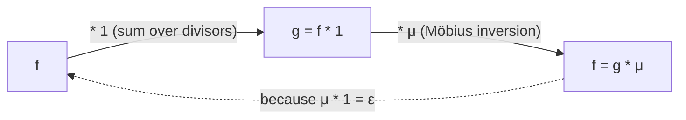

# Möbius Function & Möbius Inversion — Middle Level

> **Focus:** *Why* Möbius inversion works and *when* to reach for it. We frame everything through **Dirichlet convolution**, show that `μ = 1^{-1}` (the inverse of the constant-1 function), turn inversion into a counting engine for **coprime pairs** and **gcd-sums**, and compare it head-to-head with raw **inclusion-exclusion** (sibling `26-inclusion-exclusion`).

---

## Table of Contents

1. [Introduction](#introduction)
2. [Deeper Concepts](#deeper-concepts)
3. [Comparison with Alternatives](#comparison-with-alternatives)
4. [Advanced Patterns](#advanced-patterns)
5. [Coprime-Pair Counting and GCD-Sums](#coprime-pair-counting-and-gcd-sums)
6. [Möbius vs Inclusion-Exclusion](#möbius-vs-inclusion-exclusion)
7. [Code Examples](#code-examples)
8. [Error Handling](#error-handling)
9. [Performance Analysis](#performance-analysis)
10. [Best Practices](#best-practices)
11. [Visual Animation](#visual-animation)
12. [Summary](#summary)

---

## Introduction

At junior level Möbius inversion was a formula you applied: `g(n) = Σ_{d|n} f(d)` implies `f(n) = Σ_{d|n} μ(n/d)·g(d)`. At middle level you learn the *algebra* that makes it inevitable and the *engineering* that makes it useful:

- What operation turns "summing over divisors" into a clean, invertible structure? Answer: **Dirichlet convolution** — a multiplication on arithmetic functions.
- Why is `μ` the right set of signs? Because `μ` is the **Dirichlet inverse of the constant-1 function**: `μ * 1 = ε`, where `ε` is the identity. Inversion is then just "multiply both sides by `μ`."
- How do you turn this into fast counting? **Coprime-pair counting** and **gcd-sum** problems become `Σ_d μ(d)·(floor term)`, evaluated in `O(n)` after a sieve.
- When is `μ` better than writing inclusion-exclusion by hand? Almost always when the "events" are *divisibility by primes* — `μ` *is* inclusion-exclusion over the prime lattice, automated.

These ideas separate "I can plug into the formula" from "I can recognize a divisor-sum hiding in a problem and invert it on sight."

---

## Deeper Concepts

### Arithmetic functions and Dirichlet convolution

An **arithmetic function** is any `f : ℤ⁺ → ℂ` (here, → ℤ). The **Dirichlet convolution** of two arithmetic functions `f` and `g` is a new function:

```
(f * g)(n) = Σ_{d | n} f(d) · g(n/d).
```

You split `n` into an ordered pair of divisors `(d, n/d)` and sum the products. Three special functions name themselves:

| Function | Definition | Role |
|----------|-----------|------|
| **`ε(n)`** (identity) | `ε(1)=1`, `ε(n)=0` for `n>1` | identity of `*`: `f * ε = f` |
| **`1(n)`** (constant one) | `1(n)=1` for all `n` | summation operator: `(f * 1)(n) = Σ_{d\|n} f(d)` |
| **`Id(n)`** | `Id(n)=n` | used in `φ = μ * Id` |

Notice that `(f * 1)(n) = Σ_{d|n} f(d)·1(n/d) = Σ_{d|n} f(d)` — convolving with `1` is *exactly* "sum over divisors." So the junior statement "`g = Σ_{d|n} f(d)`" is precisely "`g = f * 1`."

### `μ` is the inverse of `1`

The killer identity from junior level, `Σ_{d|n} μ(d) = [n=1]`, says exactly:

```
(μ * 1)(n) = Σ_{d|n} μ(d)·1(n/d) = Σ_{d|n} μ(d) = ε(n).
```

So `μ * 1 = ε`. In the algebra of Dirichlet convolution, **`μ` is the multiplicative inverse of `1`**. That single fact makes inversion a one-line manipulation:

```
g = f * 1
g * μ = f * 1 * μ = f * (1 * μ) = f * ε = f.
```

Therefore `f = g * μ`, i.e. `f(n) = Σ_{d|n} g(d)·μ(n/d)` — the Möbius inversion formula, derived as "multiply both sides by `μ`." This is the *why* behind the formula, and it is the framing every senior/professional treatment uses.



### Convolution is commutative, associative, has identity `ε`

These three properties (proved in [`professional.md`](./professional.md)) make arithmetic functions under `*` a **commutative ring** with identity `ε`. The convolution `μ * 1 = ε` says `μ` and `1` are units. This is the structural home of every divisor-sum identity:

| Identity | Convolution form |
|----------|------------------|
| `Σ_{d\|n} μ(d) = [n=1]` | `μ * 1 = ε` |
| `Σ_{d\|n} φ(d) = n` | `φ * 1 = Id` |
| `φ(n) = Σ_{d\|n} μ(n/d)·d` | `φ = μ * Id` |
| `d(n) = Σ_{d\|n} 1` (number of divisors) | `d = 1 * 1` |
| `σ(n) = Σ_{d\|n} d` (sum of divisors) | `σ = Id * 1` |

From `φ * 1 = Id`, convolve both sides by `μ`: `φ = Id * μ = μ * Id`. That re-derives `φ(n) = Σ_{d|n} μ(d)·(n/d)` instantly — no clever counting needed.

### `μ` is multiplicative, and so is any convolution of multiplicatives

`μ(ab) = μ(a)μ(b)` whenever `gcd(a,b)=1`. A core theorem (proved in `professional.md`): **the Dirichlet convolution of two multiplicative functions is multiplicative.** Since `μ`, `1`, and `Id` are all multiplicative, so are `φ = μ * Id`, `d = 1 * 1`, etc. This is why a multiplicative function is fully determined by its values on prime powers — and why the linear sieve can compute it in `O(n)`.

---

## Comparison with Alternatives

### Möbius inversion vs other "undo a sum" tools

| Tool | What it inverts | When to use |
|------|-----------------|-------------|
| **Möbius inversion** | divisor-sum `g = f * 1` | relation indexed by divisibility |
| **Prefix-sum / difference** | running sums over a linear order | array prefix sums, 1-D accumulation |
| **Inclusion-exclusion** | union/intersection over a set of events | overlapping-set counting |
| **Subset-sum (zeta/Möbius on `2^S`)** | sums over subsets of a set | bitmask DP, SOS DP |
| **Poset Möbius** (general) | sums over any partial order | the general theory; divisor lattice is one case |

Möbius inversion is the *divisor-lattice special case* of the general poset Möbius function (sibling `26-inclusion-exclusion` covers the Boolean-lattice special case, which is ordinary inclusion-exclusion). They are siblings, not rivals.

### Computing `μ`: one value vs a range

| Need | Method | Cost |
|------|--------|------|
| `μ(n)` for one `n` | trial-division factor | `O(√n)` |
| `μ(n)` for one huge `n`, factorable | Pollard's rho first (`10-...`) | sub-exponential |
| `μ(1..n)` for all | linear sieve (`04-dirichlet-linear-sieve`) | `O(n)` |
| `μ(1..n)` + `φ`, `d`, `σ` together | linear sieve (multiplicative) | `O(n)` |

The crossover is the usual one: a *range* of values ⇒ sieve once; a *single* value ⇒ factor it.

---

## Advanced Patterns

### Pattern: Dirichlet convolution and inverse, computed directly

#### Go

```go
package main

import "fmt"

// divisors returns all divisors of n.
func divisors(n int) []int {
	var ds []int
	for d := 1; d*d <= n; d++ {
		if n%d == 0 {
			ds = append(ds, d)
			if d != n/d {
				ds = append(ds, n/d)
			}
		}
	}
	return ds
}

// dirichlet computes (f * g)(n) = Σ_{d|n} f(d)·g(n/d).
func dirichlet(f, g func(int) int, n int) int {
	s := 0
	for _, d := range divisors(n) {
		s += f(d) * g(n/d)
	}
	return s
}

func one(n int) int { return 1 }
func id(n int) int  { return n }

func mobius(n int) int { // O(√n)
	if n == 1 {
		return 1
	}
	primes := 0
	for p := 2; p*p <= n; p++ {
		if n%p == 0 {
			n /= p
			if n%p == 0 {
				return 0
			}
			primes++
		}
	}
	if n > 1 {
		primes++
	}
	if primes%2 == 0 {
		return 1
	}
	return -1
}

func main() {
	// φ = μ * Id : compute φ(12) via convolution.
	phi12 := dirichlet(mobius, id, 12)
	fmt.Println(phi12) // 4

	// μ * 1 = ε : (μ*1)(n) is 1 only at n=1.
	for n := 1; n <= 6; n++ {
		fmt.Printf("(μ*1)(%d)=%d ", n, dirichlet(mobius, one, n))
	}
	fmt.Println()
}
```

#### Java

```java
import java.util.ArrayList;
import java.util.List;
import java.util.function.IntUnaryOperator;

public class Dirichlet {
    static List<Integer> divisors(int n) {
        List<Integer> ds = new ArrayList<>();
        for (int d = 1; d * d <= n; d++)
            if (n % d == 0) {
                ds.add(d);
                if (d != n / d) ds.add(n / d);
            }
        return ds;
    }

    static int dirichlet(IntUnaryOperator f, IntUnaryOperator g, int n) {
        int s = 0;
        for (int d : divisors(n)) s += f.applyAsInt(d) * g.applyAsInt(n / d);
        return s;
    }

    static int mobius(int n) {
        if (n == 1) return 1;
        int primes = 0;
        for (int p = 2; (long) p * p <= n; p++)
            if (n % p == 0) {
                n /= p;
                if (n % p == 0) return 0;
                primes++;
            }
        if (n > 1) primes++;
        return (primes % 2 == 0) ? 1 : -1;
    }

    public static void main(String[] args) {
        IntUnaryOperator one = x -> 1;
        IntUnaryOperator id = x -> x;
        System.out.println(dirichlet(Dirichlet::mobius, id, 12)); // φ(12) = 4
        for (int n = 1; n <= 6; n++)
            System.out.printf("(μ*1)(%d)=%d ", n, dirichlet(Dirichlet::mobius, one, n));
        System.out.println();
    }
}
```

#### Python

```python
def divisors(n):
    ds = []
    d = 1
    while d * d <= n:
        if n % d == 0:
            ds.append(d)
            if d != n // d:
                ds.append(n // d)
        d += 1
    return ds


def dirichlet(f, g, n):
    """(f * g)(n) = Σ_{d|n} f(d)·g(n/d)."""
    return sum(f(d) * g(n // d) for d in divisors(n))


def mobius(n):
    if n == 1:
        return 1
    primes, p = 0, 2
    while p * p <= n:
        if n % p == 0:
            n //= p
            if n % p == 0:
                return 0
            primes += 1
        p += 1
    if n > 1:
        primes += 1
    return 1 if primes % 2 == 0 else -1


one = lambda n: 1
idf = lambda n: n

if __name__ == "__main__":
    print(dirichlet(mobius, idf, 12))  # φ(12) = 4  (φ = μ * Id)
    print([dirichlet(mobius, one, n) for n in range(1, 7)])  # [1, 0, 0, 0, 0, 0]
```

### Pattern: Generic inversion both directions

```python
def forward(f, n):   # g = f * 1
    return sum(f(d) for d in divisors(n))

def backward(g, n, mu):  # f = g * μ
    return sum(g(d) * mu(n // d) for d in divisors(n))
```

`backward(forward(f, ·), n)` returns `f(n)` for any `f` — a direct, testable statement of inversion.

---

## Coprime-Pair Counting and GCD-Sums

This is where `μ` earns its keep. The recurring trick: the indicator `[gcd(a,b)=1]` equals `Σ_{d | gcd(a,b)} μ(d)` (the killer identity applied to `gcd(a,b)`). Substituting that into a sum and swapping the order of summation turns a coprimality constraint into a single weighted floor-sum.

### Counting coprime pairs `≤ n`

How many ordered pairs `(a, b)` with `1 ≤ a, b ≤ n` have `gcd(a, b) = 1`?

```
Count = Σ_{a=1}^{n} Σ_{b=1}^{n} [gcd(a,b)=1]
      = Σ_{a,b} Σ_{d | gcd(a,b)} μ(d)            (killer identity)
      = Σ_{d=1}^{n} μ(d) · #{(a,b) : d|a, d|b}    (swap order)
      = Σ_{d=1}^{n} μ(d) · ⌊n/d⌋².
```

The last line is computable in `O(n)` after sieving `μ`. For `n = 6`:

```
Σ μ(d)⌊6/d⌋²:
 d=1:  1·6² = 36
 d=2: -1·3² = -9
 d=3: -1·2² = -4
 d=4:  0
 d=5: -1·1² = -1
 d=6:  1·1² = 1
 total = 36 - 9 - 4 - 1 + 1 = 23.
```

So 23 of the 36 ordered pairs in `{1..6}²` are coprime. (The probability tends to `6/π² ≈ 0.6079`, and `23/36 ≈ 0.639` — close for small `n`.)

### GCD-sum: `Σ_{a,b} gcd(a,b)`

A common variant asks for `Σ_{a=1}^{n} Σ_{b=1}^{n} gcd(a,b)`. Use `gcd = Σ_{d|gcd} φ(d)` (since `Id = φ * 1`):

```
Σ_{a,b} gcd(a,b) = Σ_{a,b} Σ_{d | gcd(a,b)} φ(d)
                 = Σ_{d=1}^{n} φ(d) · ⌊n/d⌋².
```

The same swap-and-floor technique, now with `φ` weights instead of `μ`. Both forms live in the same family: **express the constraint as a divisor-sum, swap, and collect floor terms.** Either `μ` or `φ` shows up depending on what you are summing.

### Pairs with `gcd = g` exactly

The number of pairs with `gcd(a,b) = g` is the number of coprime pairs in `{1..⌊n/g⌋}²`, i.e. `Σ_{d} μ(d)⌊n/(gd)⌋²`. So one sieve answers "how many pairs have each possible gcd."

---

## Möbius vs Inclusion-Exclusion

### They are the same principle on different posets

Ordinary **inclusion-exclusion** (sibling `26-inclusion-exclusion`) counts `|A₁ ∪ … ∪ A_k|` by alternating sums over subsets:

```
|∪ Aᵢ| = Σ_S (-1)^{|S|+1} |∩_{i∈S} Aᵢ|.
```

The signs `(-1)^{|S|}` are exactly the **Möbius function of the Boolean lattice** `2^{{1..k}}`. The Möbius function of the **divisor lattice** is our `μ(n)` (where `μ(p₁…p_k) = (-1)^k` mirrors `(-1)^{|S|}`, and the `0` on non-squarefree numbers handles "no such subset"). So:

> Counting coprime pairs by "subtract multiples of 2, subtract multiples of 3, add back multiples of 6, …" **is** inclusion-exclusion over the prime divisors — and `μ` packages those signs into one function.

### Side-by-side: coprime count to `n`

| Step | Inclusion-exclusion (by hand) | Möbius (one sum) |
|------|-------------------------------|------------------|
| Setup | Events `Aᵢ` = "divisible by prime `pᵢ`" | `Σ_{d\|n} μ(d)⌊n/d⌋` |
| Singles | subtract `⌊n/pᵢ⌋` | `μ(pᵢ) = -1` term |
| Pairs | add `⌊n/(pᵢpⱼ)⌋` | `μ(pᵢpⱼ) = +1` term |
| Triples | subtract `⌊n/(pᵢpⱼpₖ)⌋` | `μ(pᵢpⱼpₖ) = -1` term |
| Higher powers | never appear (squarefree only) | `μ(p²·…)=0` zeroes them |
| Bookkeeping | manual, `2^k` terms | automatic, one loop over divisors |

The Möbius form is not faster asymptotically for a single `n` (both touch the squarefree divisors), but it is **far less error-prone** and generalizes to sums where the events are not a finite hand-listed set.

### When inclusion-exclusion is still better

If the "bad sets" are *not* indexed by primes/divisibility (e.g. arbitrary forbidden patterns, derangements, surjections), there is no divisor structure and you use raw inclusion-exclusion directly. Reach for `μ` specifically when the constraint is "coprime / gcd / divisibility by primes."

---

## Code Examples

### Coprime-pair count and gcd-sum with a sieved `μ` / `φ`

#### Python

```python
def sieve_mu_phi(n):
    """Linear sieve: returns (mu, phi) arrays for 0..n in O(n)."""
    mu = [0] * (n + 1)
    phi = [0] * (n + 1)
    comp = [False] * (n + 1)
    primes = []
    if n >= 1:
        mu[1] = 1
        phi[1] = 1
    for i in range(2, n + 1):
        if not comp[i]:
            primes.append(i)
            mu[i] = -1
            phi[i] = i - 1
        for p in primes:
            if i * p > n:
                break
            comp[i * p] = True
            if i % p == 0:
                mu[i * p] = 0
                phi[i * p] = phi[i] * p   # p already divides i
                break
            mu[i * p] = -mu[i]
            phi[i * p] = phi[i] * (p - 1)  # new prime
    return mu, phi


def coprime_pairs(n, mu):
    return sum(mu[d] * (n // d) ** 2 for d in range(1, n + 1))


def gcd_sum(n, phi):
    return sum(phi[d] * (n // d) ** 2 for d in range(1, n + 1))


if __name__ == "__main__":
    mu, phi = sieve_mu_phi(6)
    print(coprime_pairs(6, mu))  # 23
    print(gcd_sum(6, phi))       # Σ_{a,b≤6} gcd(a,b) = 61
```

#### Go

```go
package main

import "fmt"

func sieveMuPhi(n int) (mu, phi []int) {
	mu = make([]int, n+1)
	phi = make([]int, n+1)
	comp := make([]bool, n+1)
	var primes []int
	if n >= 1 {
		mu[1], phi[1] = 1, 1
	}
	for i := 2; i <= n; i++ {
		if !comp[i] {
			primes = append(primes, i)
			mu[i] = -1
			phi[i] = i - 1
		}
		for _, p := range primes {
			if i*p > n {
				break
			}
			comp[i*p] = true
			if i%p == 0 {
				mu[i*p] = 0
				phi[i*p] = phi[i] * p
				break
			}
			mu[i*p] = -mu[i]
			phi[i*p] = phi[i] * (p - 1)
		}
	}
	return
}

func main() {
	mu, phi := sieveMuPhi(6)
	cp := 0
	for d := 1; d <= 6; d++ {
		cp += mu[d] * (6 / d) * (6 / d)
	}
	fmt.Println(cp) // 23

	gs := 0
	for d := 1; d <= 6; d++ {
		gs += phi[d] * (6 / d) * (6 / d)
	}
	fmt.Println(gs) // 61
}
```

#### Java

```java
public class CoprimeCounts {
    static int[][] sieveMuPhi(int n) {
        int[] mu = new int[n + 1], phi = new int[n + 1];
        boolean[] comp = new boolean[n + 1];
        int[] primes = new int[n + 1];
        int pc = 0;
        if (n >= 1) { mu[1] = 1; phi[1] = 1; }
        for (int i = 2; i <= n; i++) {
            if (!comp[i]) { primes[pc++] = i; mu[i] = -1; phi[i] = i - 1; }
            for (int j = 0; j < pc && (long) i * primes[j] <= n; j++) {
                int p = primes[j];
                comp[i * p] = true;
                if (i % p == 0) { mu[i * p] = 0; phi[i * p] = phi[i] * p; break; }
                mu[i * p] = -mu[i];
                phi[i * p] = phi[i] * (p - 1);
            }
        }
        return new int[][]{mu, phi};
    }

    public static void main(String[] args) {
        int n = 6;
        int[][] r = sieveMuPhi(n);
        int[] mu = r[0], phi = r[1];
        long cp = 0, gs = 0;
        for (int d = 1; d <= n; d++) {
            long q = n / d;
            cp += (long) mu[d] * q * q;
            gs += (long) phi[d] * q * q;
        }
        System.out.println(cp); // 23
        System.out.println(gs); // 61
    }
}
```

---

## Error Handling

| Scenario | What goes wrong | Correct approach |
|----------|-----------------|------------------|
| Coprime count summed over divisors of `n` | Got `φ(n)` instead of pair count | Pair counts sum `μ(d)` over **all** `d ≤ n`, not divisors of `n`. |
| `φ` sieve wrong on `i%p==0` branch | Used `(p-1)` factor when `p` already divides `i` | Multiply by `p` (not `p-1`) when `p | i`. |
| Convolution direction flipped | Computed `g * μ` as `Σ g(n/d)μ(d)` inconsistently | `(f*g)(n)=Σ f(d)g(n/d)`; `*` is commutative so either pairing is fine if consistent. |
| Overflow in `⌊n/d⌋²` | `n²` overflows 32-bit for large `n` | Use 64-bit (`long`/`int64`); Python is exact. |
| Treated `μ` as always invertible "undo" | Applied it to a non-divisor-sum relation | Inversion needs `g = f * 1`; verify the relation first. |
| gcd-sum used `μ` instead of `φ` | Summing `gcd` needs `Id = φ*1` weights | Use `φ(d)` weights for gcd-sums, `μ(d)` for coprime counts. |

---

## Performance Analysis

| Task | Scale | Cost |
|------|-------|------|
| Sieve `μ`, `φ` together (linear) | `n ≤ 10^7` | `O(n)` — under a second |
| Coprime-pair count `Σ μ(d)⌊n/d⌋²` (naive) | `n ≤ 10^7` | `O(n)` |
| Coprime-pair count with **divisor blocks** | `n` large | `O(√n)` (see senior) |
| One `μ(n)` by factoring | `n ≤ 10^{14}` | `O(√n)` |
| Generic inversion for one `n` | any | `O(d(n))` |
| GCD-sum `Σ φ(d)⌊n/d⌋²` | `n ≤ 10^7` | `O(n)` |

The naive coprime-pair sum is `O(n)` because every `d ≤ n` contributes. The key senior optimization is **divisor-block / floor grouping**: `⌊n/d⌋` takes only `O(√n)` distinct values, so consecutive `d` with the same quotient can be batched using a prefix sum of `μ` (the Mertens function). That drops the cost to `O(√n)` per query — covered in [`senior.md`](./senior.md).

```python
import time
def bench(n):
    t = time.perf_counter()
    mu, _ = sieve_mu_phi(n)
    _ = sum(mu[d] * (n // d) ** 2 for d in range(1, n + 1))
    return time.perf_counter() - t
# n = 10^6 runs in a fraction of a second in CPython.
```

---

## Best Practices

- **Think in convolutions.** Recognize `g = f * 1` and the inverse `f = g * μ`; it makes inversion automatic and prevents the `μ(d)` vs `μ(n/d)` slip.
- **Sieve multiplicative functions together.** One linear sieve yields `μ`, `φ`, `d`, `σ` in `O(n)` — share it across queries.
- **Reduce coprimality to a divisor-sum** via `[gcd=1] = Σ_{d|gcd} μ(d)`, then swap summation order to get a floor-sum.
- **Pick the right weight:** `μ(d)` for coprime *counts*, `φ(d)` for gcd-*sums*. They follow from `[gcd=1]=Σμ` vs `gcd=Σφ`.
- **Validate via the round-trip** `backward(forward(f)) == f` on small `n` before trusting a derivation.
- **Defer to divisor blocks** (senior) only when `n` is too large for an `O(n)` pass; for `n ≤ 10^7` the linear sieve plus `O(n)` sum is simpler and fast enough.

---

## Visual Animation

> See [`animation.html`](./animation.html) for an interactive view.
>
> The middle-level animation highlights:
> - `μ * 1 = ε`: watch `Σ_{d|n} μ(d)` collapse to `1` at `n=1` and `0` elsewhere.
> - The coprime-pair sum `Σ μ(d)⌊n/d⌋²` accumulating term by term, with each `+`/`-`/`0` contribution shown.
> - Editable `n` so you can compare the running total against the brute-force pair count.

---

## Summary

Möbius inversion is best understood as **multiplication in the ring of arithmetic functions under Dirichlet convolution** `(f*g)(n)=Σ_{d|n}f(d)g(n/d)`. Summing over divisors is "convolving with `1`" (`g = f * 1`), and `μ` is precisely the **inverse of `1`** because the killer identity `Σ_{d|n}μ(d)=[n=1]` says `μ * 1 = ε`. So inversion is just "multiply by `μ`": `f = g * μ`. This framing instantly yields identities like `φ = μ * Id`. The engineering payoff is **counting**: reduce a coprimality constraint to `[gcd=1]=Σ_{d|gcd}μ(d)`, swap summation order, and coprime-pair counts become `Σ_d μ(d)⌊n/d⌋²` while gcd-sums become `Σ_d φ(d)⌊n/d⌋²` — each an `O(n)` pass after a single linear sieve (sibling `04-dirichlet-linear-sieve`). Finally, `μ` is exactly **inclusion-exclusion specialized to the divisor lattice**: its `±1`/`0` signs are the same as `(-1)^{|S|}` on the Boolean lattice (sibling `26-inclusion-exclusion`), packaged into one function so you never hand-list `2^k` terms. Master convolution thinking, the coprime/gcd reduction, and the inclusion-exclusion connection, and `μ` becomes a reflex for any divisibility-flavoured counting problem.

---

## Next step: [senior.md](./senior.md) — large-scale number-theoretic counting with sieve precompute, divisor-block / floor-division grouping, the Mertens function, and performance engineering.
