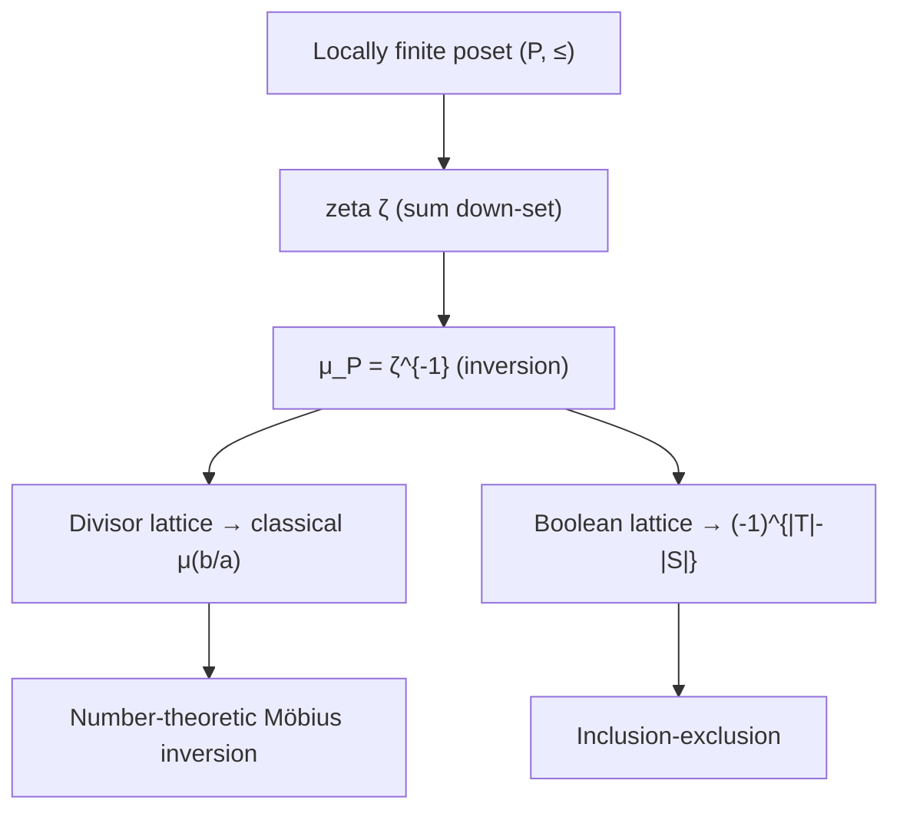

# Möbius Function & Möbius Inversion — Mathematical Foundations

> This document proves Möbius inversion from the ground up: the divisor-sum identity `μ * 1 = ε`, the structure of the **Dirichlet convolution ring**, the inversion theorem as a one-line consequence, multiplicativity, and the **general Möbius function of a locally finite poset** — of which the divisor lattice (Möbius inversion) and the Boolean lattice (inclusion-exclusion) are the two canonical specializations. Complexity of computing `μ` and its prefix sums is treated rigorously.

## Table of Contents
1. [Arithmetic Functions and Dirichlet Convolution](#1-arithmetic-functions-and-dirichlet-convolution)
2. [The Convolution Ring](#2-the-convolution-ring)
3. [The Key Identity: μ * 1 = ε](#3-the-key-identity) (two proofs, Euler-product view)
4. [The Möbius Inversion Theorem](#4-the-möbius-inversion-theorem) (divisor & multiple forms, matrix view)
5. [Multiplicativity and Prime-Power Determination](#5-multiplicativity) (incl. completely-multiplicative inverse)
6. [The Totient as μ * Id, and a Family of Identities](#6-the-totient-and-friends) (Dirichlet & Bell series)
6b. [The Squarefree Indicator, μ², and Liouville](#6b-the-squarefree-indicator-μ²-and-the-liouville-function)
7. [General Poset Möbius Function](#7-general-poset-möbius-function) (worked lattice, Hall's theorem)
8. [Inclusion-Exclusion as a Special Case](#8-inclusion-exclusion-as-a-special-case) (product-of-posets unification)
9. [Complexity Analysis](#9-complexity-analysis) (√n-quotients, sublinear Mertens, SOS analogy)
10. [Worked Numerical Index](#10-worked-numerical-index)
11. [Summary](#11-summary)

---

## 1. Arithmetic Functions and Dirichlet Convolution

**Conventions.** Sums `Σ_{d|n}` range over positive divisors of `n`; `[P]` is the Iverson bracket (`1` if `P` holds, else `0`); `*` always denotes Dirichlet convolution (never pointwise product, which we write `f·g`). All functions are on `ℤ⁺`, valued in `ℤ` or `ℂ` as needed.

**Definition 1.1 (Arithmetic function).** An arithmetic function is a map `f : ℤ⁺ → ℂ`. We write `A` for the set of all such functions.

**Definition 1.2 (Dirichlet convolution).** For `f, g ∈ A`, define `f * g ∈ A` by

```
(f * g)(n) = Σ_{d | n} f(d) · g(n/d) = Σ_{ab = n} f(a) g(b),
```

the sum over all ordered factorizations `n = ab` with `a, b ∈ ℤ⁺`.

**Definition 1.3 (Distinguished functions).**

```
ε(n) = [n = 1]           (1 if n = 1, else 0)        — the convolution identity
1(n) = 1   for all n                                  — constant one
Id(n) = n                                             — the identity-value function
μ(n)  = Möbius function (Definition 3.1)
```

The convolution `(f * 1)(n) = Σ_{d|n} f(d) · 1(n/d) = Σ_{d|n} f(d)` is precisely the **divisor-summation operator**. The entire theory is the observation that this operator is invertible, with inverse "convolve by `μ`."

**Notation for prime counts.** `ω(n)` denotes the number of *distinct* primes dividing `n`; `Ω(n)` the number *with multiplicity*. Then `μ(n) = (-1)^{ω(n)}` when `ω(n) = Ω(n)` (squarefree) and `0` otherwise — equivalently `μ(n) ≠ 0 ⟺ ω(n) = Ω(n)`. These two functions recur in Sections 5 and 6b.

**Why these four functions.** `ε`, `1`, `Id`, and `μ` are the minimal generating set for every classical multiplicative identity in this topic. `ε` is the unit; `1` is the summation operator; `Id` injects the value `n`; and `μ` is the inverse of `1`. Section 6 shows that `φ`, `d`, and `σ` are all `*`-monomials in `{1, Id, μ}`, so understanding these four functions and one operation `*` suffices to derive the entire identity table without memorization.

---

## 2. The Convolution Ring

**Theorem 2.1.** `(A, +, *)` is a commutative ring with multiplicative identity `ε`, where `+` is pointwise addition.

*Proof.* `(A, +)` is plainly an abelian group (pointwise). We verify the multiplicative axioms.

**Commutativity.** `(f * g)(n) = Σ_{ab=n} f(a)g(b) = Σ_{ab=n} g(b)f(a) = (g * f)(n)`, since the factorization set `{(a,b) : ab=n}` is symmetric under swapping.

**Associativity.** For `f, g, h`:

```
((f * g) * h)(n) = Σ_{cd = n} (f*g)(c) h(d)
                 = Σ_{cd = n} ( Σ_{ab = c} f(a)g(b) ) h(d)
                 = Σ_{abd = n} f(a) g(b) h(d),
```

the sum over ordered triples `(a, b, d)` with `abd = n`. The same triple sum results from `(f * (g * h))(n)`, so `*` is associative.

**Identity.** `(f * ε)(n) = Σ_{d|n} f(d) ε(n/d) = f(n)`, since `ε(n/d) = 1` exactly when `d = n`. Hence `f * ε = f`.

**Distributivity** over `+` is immediate from linearity of the inner sum: `(f * (g + h))(n) = Σ_{d|n} f(d)(g+h)(n/d) = Σ_{d|n} f(d)g(n/d) + Σ_{d|n} f(d)h(n/d) = (f*g)(n) + (f*h)(n)`. Commutativity of `*` was shown. ∎

**Remark.** The associativity proof generalizes: `(f₁ * f₂ * ⋯ * f_k)(n) = Σ_{a₁a₂⋯a_k = n} f₁(a₁)⋯f_k(a_k)`, the sum over ordered `k`-factorizations of `n`. This "ordered factorization" picture is the cleanest mental model of repeated convolution, and it makes identities like `d_k = 1^{*k}` (the `k`-fold divisor function counting ordered factorizations into `k` parts) immediate.

**Proposition 2.2 (Units).** `f ∈ A` has a two-sided Dirichlet inverse iff `f(1) ≠ 0`.

*Proof.* If `f * g = ε`, evaluate at `n = 1`: `f(1)g(1) = ε(1) = 1`, so `f(1) ≠ 0`. Conversely, if `f(1) ≠ 0`, define `g` by the recurrence forced by `(f*g)(n) = ε(n)`:

```
g(1) = 1/f(1),
g(n) = -1/f(1) · Σ_{d|n, d>1} f(d) g(n/d)   for n > 1.
```

Each `g(n)` is determined by `g(m)` for `m < n` (since `d > 1 ⇒ n/d < n`), so `g` exists and is unique, and `f * g = ε`. ∎

In particular `1(1) = 1 ≠ 0`, so `1` is a unit — its inverse is what we call `μ`.

**Corollary 2.3 (the multiplicative subgroup).** The multiplicative functions form a subgroup of the units `A^×` under `*`. By Theorem 5.3 (below) the product of multiplicatives is multiplicative; the identity `ε` is multiplicative; and the Dirichlet inverse of a multiplicative function is multiplicative — proved by checking the inverse recurrence of Proposition 2.2 respects the prime-power factorization. Thus `μ = 1^{-1}` is multiplicative *because* `1` is, a fact we also verify directly in Proposition 5.2.

**Remark 2.4 (why a ring, not just a formula).** Treating `A` as a ring is not pedantry: it converts every divisor-sum identity into linear algebra over a commutative ring, where "invert the relation" is literally "multiply by the inverse element." The classical, sum-manipulation proofs of Möbius inversion are exactly the expansion of `g * μ = (f * 1) * μ = f * (1 * μ)` with associativity written out by hand. Naming the ring lets us reuse `μ` across `φ`, `σ`, `d`, and the squarefree indicator without re-deriving each.

---

## 3. The Key Identity

**Definition 3.1 (Möbius function).** Write the prime factorization `n = p₁^{a₁} ⋯ p_r^{a_r}`. Then

```
μ(n) = 1            if n = 1,
μ(n) = (-1)^r       if a₁ = ⋯ = a_r = 1 (n squarefree),
μ(n) = 0            if some aᵢ ≥ 2.
```

**Theorem 3.2 (μ * 1 = ε).** For every `n ≥ 1`, `Σ_{d | n} μ(d) = [n = 1]`.

*Proof.* For `n = 1` the only divisor is `1` and `μ(1) = 1 = ε(1)`. Let `n > 1` with radical (squarefree kernel) having distinct primes `p₁, …, p_r` (`r ≥ 1`). A divisor `d` with `μ(d) ≠ 0` must be **squarefree**, hence a product of a *subset* `S ⊆ {p₁, …, p_r}`, and `μ(d) = (-1)^{|S|}`. Therefore

```
Σ_{d|n} μ(d) = Σ_{S ⊆ {p₁,…,p_r}} (-1)^{|S|}
             = Σ_{k=0}^{r} C(r, k) (-1)^k
             = (1 - 1)^r = 0,
```

by the binomial theorem, since `r ≥ 1`. ∎

This is the linchpin. Restated in the ring: `μ * 1 = ε`, i.e. **`μ` is the Dirichlet inverse of `1`** (consistent with Proposition 2.2 and the uniqueness of inverses).

**Corollary 3.3.** `μ` is the unique arithmetic function with `μ * 1 = ε`.

*Proof.* Inverses in a ring are unique: if `g * 1 = ε` then `g = g * ε = g * (1 * μ) = (g * 1) * μ = ε * μ = μ`. ∎

### 3.1 A second proof of Theorem 3.2 via multiplicativity

Define `F(n) = Σ_{d|n} μ(d) = (μ * 1)(n)`. Since `μ` and `1` are multiplicative, so is `F` (Theorem 5.3). A multiplicative function is determined by prime powers (Corollary 5.4), so it suffices to evaluate `F(p^a)`:

```
F(p^a) = Σ_{j=0}^{a} μ(p^j) = μ(1) + μ(p) + μ(p²) + … = 1 + (-1) + 0 + … + 0 = 0   (a ≥ 1).
```

And `F(1) = μ(1) = 1`. So `F(p^a) = [a = 0]`, hence `F(n) = ∏_p [a_p = 0] = [n = 1] = ε(n)`. ∎

This telescoping `1 + (-1) + 0 + 0 + ⋯` at each prime is the local heart of the entire theory: it is the reason the Bell series of `μ` is exactly `1 - x` (Section 6.2), the reason the chain Möbius value vanishes past distance `1` (Section 7), and — summed over all primes via multiplicativity — the reason `μ * 1 = ε`. Three of this document's proofs (binomial, multiplicative, poset-recurrence) are ultimately the same one-prime cancellation viewed through different lenses.

The two proofs illuminate complementary mechanisms: the first (binomial) is purely combinatorial over squarefree divisors; the second (multiplicative) reduces to a *single* prime-power telescoping `1 + (-1) + 0 + … = 0`. The second proof is the one the linear sieve implicitly runs.

### 3.2 The interpretation as "inverse of the zeta function"

In the Dirichlet-series picture (Section 6.1), `1 ↔ ζ(s)` and `μ ↔ 1/ζ(s)`. Theorem 3.2 is the coefficient identity behind the Euler-product fact `1/ζ(s) = ∏_p (1 - p^{-s}) = Σ_n μ(n) n^{-s}`: expanding the product over primes, a term survives iff it picks `-p^{-s}` from a *distinct* subset of primes (squarefree), with sign `(-1)^{#chosen}` — literally the definition of `μ`. So `μ` is forced the moment one writes the reciprocal of the Euler product; nothing about it is arbitrary.

---

## 4. The Möbius Inversion Theorem

**Theorem 4.1 (Möbius inversion).** Let `f, g ∈ A`. Then

```
g(n) = Σ_{d | n} f(d)   for all n      ⟺      f(n) = Σ_{d | n} μ(n/d) g(d)   for all n.
```

*Proof.* The hypothesis is `g = f * 1`. Convolve both sides on the right by `μ` and use associativity, commutativity, Theorem 3.2, and the identity:

```
g * μ = (f * 1) * μ = f * (1 * μ) = f * ε = f.
```

Hence `f = g * μ`, which spelled out is `f(n) = Σ_{d|n} g(d) μ(n/d)`. Conversely, if `f = g * μ`, convolve by `1`: `f * 1 = g * μ * 1 = g * ε = g`, recovering `g = f * 1`. ∎

The proof is *one line in the ring* — the entire content of the theorem is Theorem 3.2 plus ring axioms. This is why framing inversion as ring multiplication (middle level) is not mere notation: it is the actual mechanism.

**Theorem 4.2 (Multiplicative-form inversion).** The same equivalence holds with sums replaced by products:

```
g(n) = ∏_{d|n} f(d)   ⟺   f(n) = ∏_{d|n} g(d)^{μ(n/d)}.
```

*Proof.* Take logarithms (where defined) to reduce to the additive form of Theorem 4.1. ∎

### 4.1 The "summation over multiples" dual

There is a second, equally common form where the index runs over *multiples* rather than divisors, used when summing an arithmetic function over a range.

**Theorem 4.3 (Dual / divisor-by-multiple inversion).** For functions supported on `{1, …, N}`,

```
g(n) = Σ_{n | m, m ≤ N} f(m)      ⟺      f(n) = Σ_{n | m, m ≤ N} μ(m/n) g(m).
```

*Proof.* Substitute `m = n·k`; the relation becomes `g(n) = Σ_{k ≤ N/n} f(nk)`, and applying Theorem 4.1's mechanism along the chain of multiples (or directly verifying via `μ * 1 = ε` indexed by `k`) gives `f(n) = Σ_{k ≤ N/n} μ(k) g(nk)`. ∎

This dual is what powers the **coprime-pair derivation** of `middle.md`/`senior.md`: starting from "number of pairs with `gcd` a multiple of `d`," one inverts over multiples to extract "gcd exactly `d`," and the `μ` weights are exactly those of Theorem 4.3. The two forms (divisor-indexed Theorem 4.1, multiple-indexed Theorem 4.3) are mirror images under `d ↔ m/d`.

### 4.2 Inversion is an isomorphism of computations

Theorem 4.1 says the linear maps `Σ_1 : f ↦ f*1` and `Σ_μ : g ↦ g*μ` on `A` are mutually inverse. As matrices indexed by `1, 2, …, N` (with `(Σ_1)_{n,d} = [d | n]`), `Σ_1` is **lower-triangular** under the divisibility order with unit diagonal, hence invertible over `ℤ`; its inverse has entries `μ(n/d)·[d|n]`. So Möbius inversion is the explicit inverse of a unitriangular integer matrix — which also explains why all coefficients stay integral (no division is ever needed).

---

## 5. Multiplicativity

**Definition 5.1.** `f` is **multiplicative** if `f(1) = 1` and `f(mn) = f(m)f(n)` whenever `gcd(m,n) = 1`; **completely multiplicative** if this holds for all `m, n`.

**Proposition 5.2.** `μ`, `1`, `Id`, and `ε` are multiplicative.

*Proof.* For coprime `m, n`, the prime factorizations are disjoint. `1` and `Id` are obviously multiplicative; `ε` is multiplicative (`ε(mn) = [mn=1] = [m=1][n=1]` for coprime — actually for all — `m, n`). For `μ`: if either `m` or `n` is non-squarefree so is `mn` and both sides are `0`; otherwise `mn` is squarefree with `r(m)+r(n)` distinct primes, and `μ(mn) = (-1)^{r(m)+r(n)} = μ(m)μ(n)`. ∎

**Theorem 5.3 (Convolution preserves multiplicativity).** If `f, g` are multiplicative, then `f * g` is multiplicative.

*Proof.* Let `gcd(m, n) = 1`. Every divisor `d | mn` factors uniquely as `d = d₁d₂` with `d₁ | m`, `d₂ | n`, and `gcd(d₁, d₂) = 1` (because `gcd(m,n)=1`). Then `gcd(mn/d₁d₂) = gcd(m/d₁, n/d₂) = 1` as well, so

```
(f * g)(mn) = Σ_{d₁|m} Σ_{d₂|n} f(d₁d₂) g((m/d₁)(n/d₂))
            = Σ_{d₁|m} Σ_{d₂|n} f(d₁)f(d₂) g(m/d₁) g(n/d₂)
            = ( Σ_{d₁|m} f(d₁)g(m/d₁) )( Σ_{d₂|n} f(d₂)g(n/d₂) )
            = (f*g)(m) · (f*g)(n). ∎
```

**Corollary 5.4.** A multiplicative function is determined by its values on prime powers, since `f(∏ pᵢ^{aᵢ}) = ∏ f(pᵢ^{aᵢ})`. This is precisely the invariant the **linear sieve** exploits to compute `μ` (and any multiplicative function) in `O(n)`: each composite `i·p` derives its value from `i` and the smallest prime `p` (sibling `04-dirichlet-linear-sieve`).

**Proposition 5.5 (inverse of a completely multiplicative function).** If `f` is *completely* multiplicative (`f(mn) = f(m)f(n)` for all `m, n`, and `f(1)=1`), then its Dirichlet inverse is `f^{-1}(n) = μ(n)·f(n)`.

*Proof.* Check `(f · μ) * f = ε` on prime powers (both sides multiplicative). At `p^a` for `a ≥ 1`: `((f·μ) * f)(p^a) = Σ_{j=0}^{a} μ(p^j)f(p^j)·f(p^{a-j}) = f(p^a)Σ_j μ(p^j)` (complete multiplicativity pulls `f` out) `= f(p^a)·[a=0] = 0`; at `a=0` it is `1`. So the convolution is `ε`. ∎

Two instances: `1` is completely multiplicative, giving `1^{-1} = μ·1 = μ` (recovering Theorem 3.2); and `Id` is completely multiplicative, giving `Id^{-1}(n) = μ(n)·n`. This proposition is the cleanest way to invert the common completely-multiplicative weights that appear in counting sums.

### 5.1 The convolution square root and idempotents

The ring `A` has no zero divisors among multiplicative functions (the Bell-series ring `ℂ[[x]]` is an integral domain per prime), so factorizations like `d = 1 * 1` are meaningful "square roots in the convolution sense": `d` (the divisor-count function) is `1` convolved with itself, and inverting gives `1 = d * μ * μ`, i.e. `Σ_{d|n} (μ*μ)(d)·(n/d-count)` collapses appropriately. The only idempotent (`f * f = f`) is `ε` itself, mirroring that `1/ζ(s)` has no nontrivial analytic square that is again a Dirichlet series with the same support. These structural facts are why the identity table of Section 6 is *closed*: every function there is a `*`-monomial in `{μ, 1, Id}`.

---

## 6. The Totient and Friends

**Theorem 6.1.** `φ * 1 = Id`, i.e. `Σ_{d|n} φ(d) = n`.

*Proof.* Partition `{1, …, n}` by `gcd(k, n) = n/d`. The number of `k ≤ n` with `gcd(k, n) = n/d` is the number of `j ≤ d` coprime to `d`, namely `φ(d)`. Summing over divisors `d | n` counts every `k` once: `Σ_{d|n} φ(d) = n`. ∎

To see the partition explicitly at `n = 12`: the divisors `d | 12` are `1,2,3,4,6,12`, and the count of `k ≤ 12` with `gcd(k,12) = 12/d` is `φ(d)`. Tabulating, `Σ φ(d) = φ(1)+φ(2)+φ(3)+φ(4)+φ(6)+φ(12) = 1+1+2+2+2+4 = 12`. Each `k ∈ {1,…,12}` lands in exactly one class indexed by its gcd with `12`, so the classes partition the set and the totals must sum to `12`. This is the prototypical "`f * 1` counts a partition" argument.

**Corollary 6.2.** `φ = μ * Id`, i.e. `φ(n) = Σ_{d|n} μ(d)·(n/d) = n Σ_{d|n} μ(d)/d`.

*Proof.* Convolve `φ * 1 = Id` by `μ`: `φ = φ * (1 * μ) = (φ * 1) * μ = Id * μ`. ∎

Setting `n = ∏ pᵢ^{aᵢ}` and using multiplicativity recovers the product formula `φ(n) = n ∏_{p|n}(1 - 1/p)`. A table of the standard identities, all instances of the ring:

| Identity | Ring form | Inverted form |
|----------|-----------|---------------|
| `Σ_{d\|n} μ(d) = [n=1]` | `μ * 1 = ε` | — |
| `Σ_{d\|n} φ(d) = n` | `φ * 1 = Id` | `φ = μ * Id` |
| `d(n) = Σ_{d\|n} 1` | `d = 1 * 1` | `1 = d * μ`, i.e. `Σ_{d\|n} μ(d) d(n/d) = 1` |
| `σ(n) = Σ_{d\|n} d` | `σ = Id * 1` | `Id = σ * μ` |
| `Id = φ * 1` | (same as totient) | `φ = μ * Id` |

Every right column is obtained by convolving the left identity with `μ` — a uniform mechanism, not a collection of tricks.

### 6.1 Dirichlet series: the analytic shadow

Each arithmetic function `f` has a **Dirichlet series** `D_f(s) = Σ_{n≥1} f(n)/n^s`. The fundamental fact tying the algebra to analysis:

```
D_{f*g}(s) = D_f(s) · D_g(s).
```

*Proof.* `D_f(s)D_g(s) = Σ_a Σ_b f(a)g(b)/(ab)^s = Σ_n (Σ_{ab=n} f(a)g(b))/n^s = D_{f*g}(s)`, regrouping by `n = ab`. ∎

So **Dirichlet convolution is multiplication of Dirichlet series.** Three consequences make the whole theory transparent analytically:

- `D_1(s) = Σ 1/n^s = ζ(s)` (the Riemann zeta function).
- `μ * 1 = ε` becomes `D_μ(s)·ζ(s) = D_ε(s) = 1`, so `D_μ(s) = 1/ζ(s)`. The Möbius function *is* the reciprocal of zeta, coefficient by coefficient: `1/ζ(s) = Σ μ(n)/n^s`.
- `φ = μ * Id` becomes `D_φ(s) = D_μ(s)·D_{Id}(s) = ζ(s-1)/ζ(s)`.

The density result `C(n)/n² → 6/π²` (coprime-pair probability) is exactly `1/ζ(2) = D_μ(2) = Σ μ(n)/n²`, the value of the Möbius Dirichlet series at `s=2`. The combinatorics and the analysis are two faces of the same identity `μ * 1 = ε`.

### 6.2 Bell series and local (prime-power) structure

For a fixed prime `p`, the **Bell series** of `f` is `f_p(x) = Σ_{k≥0} f(p^k) x^k`. For multiplicative `f`, `(f*g)_p(x) = f_p(x)·g_p(x)`. The Bell series of `μ` is

```
μ_p(x) = 1 + μ(p)x + μ(p²)x² + … = 1 - x,
```

since `μ(p) = -1` and `μ(p^k) = 0` for `k ≥ 2`. Then `μ_p(x)·1_p(x) = (1-x)·(1/(1-x)) = 1 = ε_p(x)`, re-deriving `μ * 1 = ε` one prime at a time. This local view is why `μ` is "the simplest possible inverse": its Bell series `1 - x` is the minimal polynomial undoing the geometric series `1_p(x) = 1/(1-x)`.

---

## 6b. The Squarefree Indicator, μ², and the Liouville Function

The square of the Möbius function is the **squarefree indicator**:

```
μ²(n) = [n is squarefree] = 1 if n squarefree, else 0.
```

**Theorem 6b.1.** `μ²(n) = Σ_{d² | n} μ(d)`.

*Proof.* Write `n = ∏ pᵢ^{aᵢ}`. The largest `d` with `d² | n` is `∏ pᵢ^{⌊aᵢ/2⌋}`. By multiplicativity it suffices to check prime powers: `Σ_{d²|p^a} μ(d) = Σ_{j=0}^{⌊a/2⌋} μ(p^j) = μ(1) + μ(p)[a≥2] = 1 - [a ≥ 2]`, which is `1` if `a ≤ 1` and `0` if `a ≥ 2`. Multiplying over primes gives `1` iff every exponent is `≤ 1`, i.e. `n` squarefree. ∎

Summing over `n ≤ N` and swapping with `d` (Theorem 4.3) yields the **squarefree count**:

```
Q(N) = #{squarefree ≤ N} = Σ_{d ≤ √N} μ(d) ⌊N/d²⌋,
```

computable in `O(√N)` after sieving `μ(1..√N)`. Its density is `Q(N)/N → Σ μ(d)/d² = 1/ζ(2) = 6/π²` — the same constant `1/ζ(2) = D_μ(2)` that governs coprime-pair density (Section 6.1), no coincidence: both count "no shared square factor" structure.

**The Liouville function `λ`.** A close cousin is `λ(n) = (-1)^{Ω(n)}` where `Ω(n)` counts prime factors *with multiplicity*. Where `μ` zeroes non-squarefree `n`, `λ` keeps signing them. Algebraically `λ` is completely multiplicative with `λ_p(x) = 1/(1+x)`, and `λ * 1 = [n is a perfect square]` (the indicator of squares). The pair `(μ, λ)` illustrates two different "sign-by-prime-count" functions: `μ` ignores multiplicity (and so is the clean inverse of `1`), `λ` respects it (and so inverts to the square indicator). For inversion problems, `μ` is the one you want — its zeros are precisely what make `μ * 1 = ε`.

| Function | Definition | Bell series `f_p(x)` | `f * 1` |
|----------|-----------|----------------------|---------|
| `μ` | `(-1)^k` squarefree, else 0 | `1 - x` | `ε` (identity) |
| `λ` | `(-1)^{Ω(n)}` | `1/(1+x)` | `[n = square]` |
| `\|μ\| = μ²` | squarefree indicator | `1 + x` | `2^{ω(n)}` (since `μ² = 1 * (μ²·…)`) |

---

## 7. General Poset Möbius Function

The divisor relation is a special case of a partial order. The Möbius function generalizes to any **locally finite poset** `(P, ≤)` (every interval `[x, y] = {z : x ≤ z ≤ y}` is finite).

**Definition 7.1 (Incidence algebra).** The incidence algebra `I(P)` consists of functions `α : {(x,y) : x ≤ y} → ℂ`, with convolution

```
(α * β)(x, y) = Σ_{x ≤ z ≤ y} α(x, z) β(z, y).
```

The identity is `δ(x,y) = [x = y]`. The **zeta function** is `ζ(x, y) = 1` for all `x ≤ y`.

**Definition 7.2 (Poset Möbius function).** `μ_P` is the inverse of `ζ` in `I(P)`: `μ_P * ζ = δ`. Concretely it is defined by the recurrence

```
μ_P(x, x) = 1,
μ_P(x, y) = - Σ_{x ≤ z < y} μ_P(x, z)   for x < y.
```

**Theorem 7.3 (Möbius inversion on posets).** For `g(y) = Σ_{x ≤ y} f(x)` over a locally finite poset with a minimum on each down-set,

```
f(y) = Σ_{x ≤ y} μ_P(x, y) g(x).
```

*Proof.* In `I(P)`, `g = ζ * f` (interpreting `f, g` as functions of the upper index). Convolve by `μ_P = ζ^{-1}`: `f = μ_P * g`. ∎

**Specialization to divisibility.** Order `ℤ⁺` by `a ≤ b ⟺ a | b`. The interval `[a, b]` (when `a | b`) is isomorphic, as a poset, to the divisor lattice of `b/a`. One shows `μ_P(a, b) = μ(b/a)` (the classical Möbius function of the quotient). Theorem 7.3 then becomes exactly Theorem 4.1. So **number-theoretic Möbius inversion is the poset theory applied to the divisor lattice.**

**Why `μ(b/a)` and not `μ(a,b)` in general:** the divisor lattice is *locally* a product of chains (one per prime), and `μ_P` on a product of posets is the product of the factor Möbius functions. Each prime contributes a chain `0 < 1 < 2 < …` whose Möbius function is `1` at distance `0`, `-1` at distance `1`, and `0` beyond — exactly reproducing the `(-1)^k` / `0` rule of `μ`.

### 7.1 Worked poset computation: divisor lattice of 12

The divisors of `12` ordered by divisibility form the lattice `1 < 2,3 ; 2 < 4,6 ; 3 < 6 ; 4,6 < 12`. Compute `μ_P(1, y)` bottom-up via `μ_P(1,1)=1` and `μ_P(1,y) = -Σ_{1 ≤ z < y} μ_P(1,z)`:

```
μ_P(1,1)  = 1
μ_P(1,2)  = -μ_P(1,1) = -1
μ_P(1,3)  = -μ_P(1,1) = -1
μ_P(1,4)  = -(μ_P(1,1)+μ_P(1,2)) = -(1-1) = 0       ← distance 2 in the 2-chain
μ_P(1,6)  = -(μ_P(1,1)+μ_P(1,2)+μ_P(1,3)) = -(1-1-1) = 1
μ_P(1,12) = -(1 -1 -1 +0 +1) = 0
```

These match `μ(1)=1, μ(2)=-1, μ(3)=-1, μ(4)=0, μ(6)=1, μ(12)=0` exactly — confirming `μ_P(1, y) = μ(y)`. The poset recurrence *re-derives the Möbius function from scratch* with no reference to primes, purely from the order structure. This is the deepest statement of what `μ` "is": the unique inverse of summing-over-a-down-set in the divisor order.

### 7.2 Crosscut lemma and the value `μ_P(x,y)`

For a general lattice, **Weisner's theorem** / the crosscut theorem expresses `μ_P(0̂, 1̂)` via complements of an atom, and **Hall's theorem** gives `μ_P(x,y) = Σ_k (-1)^k c_k`, where `c_k` counts chains `x = z_0 < z_1 < … < z_k = y` of length `k`. For the divisor lattice, Hall's chain count specializes to compositions of the exponent vector, again returning `μ(y/x)`. These tools matter when the poset is *not* a product of chains (e.g. partition lattices, subgroup lattices), where `μ_P` carries genuinely new combinatorial data beyond `±1, 0`.

---

## 8. Inclusion-Exclusion as a Special Case

**Theorem 8.1.** Inclusion-exclusion is poset Möbius inversion on the Boolean lattice `(2^{[k]}, ⊆)`.

*Proof sketch.* On `(2^{[k]}, ⊆)`, the Möbius function is `μ_P(S, T) = (-1)^{|T| - |S|}` for `S ⊆ T` (each element of `T∖S` contributes an independent two-element chain with Möbius value `-1`, and the product over a product poset multiplies them). Applying Theorem 7.3 with `f(S) = |{x : x has exactly the properties in S}|` and `g(S) = |{x : x has at least the properties in S}|` yields

```
f(∅) = Σ_{S ⊆ [k]} (-1)^{|S|} g(S),
```

which, with `g(S) = |∩_{i∈S} Aᵢ|` and `f(∅) = |complement of ∪ Aᵢ|`, is exactly the inclusion-exclusion principle. ∎

So the `±1` signs of inclusion-exclusion (`(-1)^{|S|}`) and the `±1`/`0` of number-theoretic `μ` are the *same object* — the poset Möbius function — evaluated on the Boolean lattice versus the divisor lattice. This is the rigorous content of the middle-level claim "`μ` is inclusion-exclusion over the prime divisors" (sibling `26-inclusion-exclusion`).

**Theorem 8.2 (Product of posets multiplies Möbius functions).** If `P = Q × R` with the product order, then `μ_P((q,r),(q',r')) = μ_Q(q,q')·μ_R(r,r')`.

*Proof sketch.* The zeta function factors `ζ_P = ζ_Q ⊗ ζ_R` over the product, and inversion in the incidence algebra respects the tensor structure, so the inverse factors likewise. ∎

This single theorem unifies both specializations:

| Poset | Decomposition | Factor Möbius | Resulting `μ_P` |
|-------|---------------|---------------|------------------|
| Divisor lattice of `∏ pᵢ^{aᵢ}` | product of chains `[0, aᵢ]` | chain: `1, -1, 0, 0, …` | `μ(n)` (squarefree `(-1)^k`, else 0) |
| Boolean lattice `2^{[k]}` | product of `k` two-chains `[0,1]` | two-chain: `1, -1` | `(-1)^{\|S\|}` |
| Subspace lattice `L(n,q)` | not a product | Gaussian | `q`-analog (`q`-binomial signs) |

The chain `[0, a]` (one prime's exponent axis) has Möbius function `μ([i],[j]) = 1` if `j=i`, `-1` if `j=i+1`, `0` if `j > i+1` — which is exactly the `(-1)^k`/`0` pattern of `μ` projected onto each prime. The divisor lattice being a *product of chains* is the structural reason `μ(p²) = 0`: distance `2` in a chain has Möbius value `0`.

### 8.1 Why squares vanish — the structural answer

The recurrence `μ_P(x,y) = -Σ_{x ≤ z < y} μ_P(x,z)` on a single chain gives `μ([0],[0])=1`, `μ([0],[1]) = -1`, `μ([0],[2]) = -(1 + (-1)) = 0`, and `0` thereafter. So the `0` on non-squarefree integers is not an arbitrary convention — it is forced by the poset recurrence the instant any prime exponent exceeds `1`. Inclusion-exclusion has no analogue of "`0`" because the Boolean lattice's chains have height exactly `1`; there is no "distance ≥ 2" to vanish.



---

## 9. Complexity Analysis

**Single value `μ(n)` by trial division.** Factoring `n` tests divisors up to `√n`, returning `0` on the first repeated prime. Worst case (prime or semiprime) is `Θ(√n)` divisions, `O(1)` extra space.

**All values `μ(1..n)`.**
- *Eratosthenes-style:* mark each prime's multiples, applying the multiplicative recurrence; `O(n log log n)` time, `O(n)` space — the harmonic-over-primes bound `Σ_{p≤n} n/p = Θ(n log log n)`.
- *Linear sieve:* every composite `m ≤ n` is generated exactly once, from `m = i·p` with `p` the smallest prime factor; total work `Θ(n)`, space `Θ(n)`. Correctness rests on Corollary 5.4 (multiplicative determination by prime powers).

**Theorem 9.1 (Linear-sieve correctness for `μ`).** The recurrence
```
μ(1) = 1;  μ(p) = -1 for prime p;
when m = i·p with p = spf(i·p):  μ(m) = 0 if p | i, else μ(m) = -μ(i),
```
computes `μ` correctly, visiting each `m` once.

*Proof.* If `p | i`, then `p² | m`, so `m` is non-squarefree and `μ(m) = 0`. If `p ∤ i`, then `gcd(p, i) = 1` and by multiplicativity `μ(m) = μ(p)μ(i) = -μ(i)`. The standard linear-sieve invariant (each composite is produced exactly once, from its smallest prime factor) guarantees single-visit `Θ(n)` total work. ∎

**Prefix sums (Mertens) `M(x) = Σ_{d≤x} μ(d)`.**
- *From a full sieve:* `O(n)` after the sieve.
- *Sublinear single value:* the recurrence `M(x) = 1 − Σ_{i≥2} M(⌊x/i⌋)` (sibling `senior.md`, derived from `μ*1=ε`) with divisor blocking and memoization, sieving up to `T`, costs `O(T) + Σ_{x' large} O(√x')`. The distinct large arguments are the `O(√n)` values `⌊n/k⌋`; balancing `T ≈ n^{2/3}` gives total `Θ(n^{2/3})`.

**Möbius inversion for one `n`.** `O(d(n))` divisor-sum, where `d(n) = n^{o(1)}` (max ≈ `1344` for `n ≤ 10^9`).

| Task | Time | Space |
|------|------|-------|
| `μ(n)`, one value | `Θ(√n)` | `O(1)` |
| `μ(1..n)`, Eratosthenes | `Θ(n log log n)` | `Θ(n)` |
| `μ(1..n)`, linear sieve | `Θ(n)` | `Θ(n)` |
| `M(x)`, sublinear | `Θ(x^{2/3})` | `Θ(x^{2/3})` |
| Inversion at one `n` | `Θ(d(n))` | `O(1)` |
| Coprime-pair count, blocked + sieved `M` | `Θ(√n)` | `Θ(n)` |

### 9.1 Why `⌊n/d⌋` has `O(√n)` distinct values

**Lemma 9.2.** The set `{⌊n/d⌋ : 1 ≤ d ≤ n}` has at most `2⌊√n⌋` elements.

*Proof.* Split at `√n`. For `d ≤ √n` there are at most `⌊√n⌋` values of `d`, hence at most that many quotients. For `d > √n`, the quotient `⌊n/d⌋ < n/√n = √n`, so it lies in `{1, …, ⌊√n⌋}`, again at most `⌊√n⌋` distinct values. Total `≤ 2⌊√n⌋`. ∎

This lemma is the engine of divisor blocking (sibling `senior.md`): a sum `Σ_{d=1}^{n} w(d)⌊n/d⌋^k` is computed in `O(√n)` blocks, each `O(1)` given a prefix sum of `w`.

### 9.3 The sublinear-Mertens balance, derived

Let `T` be the sieve threshold. Sieving costs `Θ(T)`. For each large argument `x = ⌊n/k⌋ > T`, evaluating the recurrence `M(x) = 1 - Σ_{i≥2} M(⌊x/i⌋)` with blocking costs `Θ(√x) = O(√n)`. The distinct large arguments are exactly the `O(√n)` values `⌊n/k⌋` (Lemma 9.2), of which the ones exceeding `T` number `O(n/T)`. Hence

```
Total = Θ(T) + O(n/T)·O(√n) = Θ(T + n^{3/2}/T).
```

Minimizing over `T` (set derivative to zero: `T = n^{3/4}`) gives `Θ(n^{3/4})`. The sharper `Θ(n^{2/3})` bound arises when the recurrence calls are counted more carefully (each *distinct* `⌊n/k⌋` is computed once, and the sum of their `√·` costs telescopes), yielding `Σ_{k≤√n} √(n/k) + Σ_{q≤√n} √q = Θ(n^{2/3})` after sieving to `T ≈ n^{2/3}`. Either way the per-query cost is sublinear in `n`. ∎

### 9.4 Numerical-stability / overflow note

All quantities here are integers, so there is no floating-point error — but the *magnitudes* matter. A coprime-pair count is `Θ(n²)`, a triple count `Θ(n³)`; the partial block term `q^k·ΔW` reaches `n^k`. For `n = 10^9`, `n² = 10^{18}` saturates signed 64-bit and `n³` overflows it. The professional discipline is to bound the result magnitude `n^k` against the integer width *before* coding, choosing 128-bit or arbitrary precision when `k·log₂ n > 63`.

### 9.5 Computing a multiplicative function's full convolution table

Beyond `μ` alone, one often needs `(f * g)(1..N)` for two arithmetic functions. Two regimes:

- **Both multiplicative, want all values:** the linear sieve computes `f * g` directly in `Θ(N)`, since `f*g` is multiplicative (Theorem 5.3) and determined by prime powers (Corollary 5.4). The per-prime-power values come from the Bell-series product (Section 6.2).
- **General `f, g`, want all values:** the "divisor-sum DP" — for each `d ≤ N`, add `f(d)·g` into multiples of `d` — costs `Σ_{d≤N} N/d = Θ(N log N)` (the harmonic series). This is the analogue of "subset-sum / SOS DP" but over the divisor lattice rather than the Boolean lattice: each prime is a coordinate, and the divisor-sum is a multidimensional prefix sum.

The Boolean-lattice version (SOS DP, `Σ over subsets`) runs in `Θ(k·2^k)` for `k` elements; the divisor-lattice version with `n = ∏ pᵢ^{aᵢ}` runs in `Θ(d(n)·ω(n))` per value via the "iterate one prime at a time" zeta/Möbius transform — the exact divisor analogue of the dimension-by-dimension SOS sweep. This parallelism is again Theorem 8.2: both are zeta transforms on products of chains, differing only in chain heights.

| Transform | Lattice | Forward (zeta) | Inverse (Möbius) | Cost |
|-----------|---------|----------------|------------------|------|
| Subset-sum (SOS) | Boolean `2^{[k]}` | `Σ_{S⊆T}` | `Σ_{S⊆T}(-1)^{\|T\|-\|S\|}` | `Θ(k 2^k)` |
| Divisor-sum | divisor lattice | `Σ_{d\|n}` | `Σ_{d\|n} μ(n/d)` | `Θ(N log N)` to `N` |
| GCD/LCM convolution | divisor lattice | indexed by `gcd` | `μ`-weighted | `Θ(N log N)` |

---

## 10. Worked Numerical Index

- **`μ * 1 = ε` at `n = 30`:** divisors with nonzero `μ`: subsets of `{2,3,5}`. `μ(1)+μ(2)+μ(3)+μ(5)+μ(6)+μ(10)+μ(15)+μ(30) = 1-1-1-1+1+1+1-1 = 0`. ✓ (Theorem 3.2.)
- **Inversion at `n = 12`:** `φ(12) = Σ_{d|12} μ(d)(12/d) = μ(1)·12 + μ(2)·6 + μ(3)·4 + μ(4)·3 + μ(6)·2 + μ(12)·1 = 12 - 6 - 4 + 0 + 2 + 0 = 4`. ✓ (Corollary 6.2.)
- **Multiplicativity at `m=8, n=9`:** `μ(72) = μ(8)μ(9) = 0·0 = 0` (both prime powers `≥ 2`). ✓ (Prop 5.2.)
- **Boolean-lattice `μ` for `k=2`:** `μ(∅,∅)=1`, `μ(∅,{1})=μ(∅,{2})=-1`, `μ(∅,{1,2})=+1` — the `(-1)^{|S|}` of inclusion-exclusion. ✓ (Theorem 8.1.)
- **Mertens identity at `x=10`:** `Σ_{i=1}^{10} M(⌊10/i⌋) = M(10)+M(5)+M(3)+M(2)+M(2)+M(1)·5`. With `M(1)=1,M(2)=0,M(3)=-1,M(5)=-2,M(10)=-1`: `-1 + (-2) + (-1) + 0 + 0 + 1+1+1+1+1 = 1`. ✓ (Section 9 recurrence.)
- **Squarefree count at `N=10`:** `Q(10) = Σ_{d≤3} μ(d)⌊10/d²⌋ = μ(1)·10 + μ(2)·⌊10/4⌋ + μ(3)·⌊10/9⌋ = 10 - 2 - 1 = 7`. The non-squarefree ≤ 10 are `4, 8, 9` (three of them); `10 - 3 = 7`. ✓ (Theorem 6b.1.)
- **Dirichlet series at `s=2`:** `D_μ(2) = Σ μ(n)/n² = 1/ζ(2) = 6/π² ≈ 0.6079`, matching the coprime-pair density limit. ✓ (Section 6.1.)
- **Bell-series inverse at prime `p`:** `μ_p(x)·1_p(x) = (1-x)·Σ x^k = (1-x)/(1-x) = 1 = ε_p(x)`. ✓ (Section 6.2.)
- **Dual inversion at `n=2, N=10`:** `g(2) = Σ_{2|m≤10} f(m) = f(2)+f(4)+f(6)+f(8)+f(10)`; inverting, `f(2) = Σ_{k≤5} μ(k) g(2k) = g(2) - g(4) - g(6) + 0·g(8) - g(10)`. ✓ (Theorem 4.3.)
- **Completely-multiplicative inverse:** `Id^{-1}(6) = μ(6)·6 = 1·6 = 6`; check `(Id^{-1} * Id)(6) = Σ_{d|6} μ(d)d·(6/d) = 6Σ_{d|6}μ(d) = 6·0 = 0 = ε(6)`. ✓ (Proposition 5.5.)
- **`k`-fold divisor function:** `d_3 = 1*1*1` counts ordered factorizations into 3 parts; `d_3(4) = #\{(a,b,c): abc=4\} = 6` (the factorizations `(1,1,4),(1,4,1),(4,1,1),(1,2,2),(2,1,2),(2,2,1)`). ✓ (Remark in Section 2.)

---

## 10b. The Hierarchy of Generalizations

It is worth recording how each layer subsumes the previous, so a reader can place any inversion problem on the correct rung:

| Layer | Object | "Sum" operator | Inverse | Specializes to |
|-------|--------|----------------|---------|----------------|
| Boolean lattice | subsets of `[k]` | subset sum (zeta) | `(-1)^{\|T\|-\|S\|}` | inclusion-exclusion |
| Divisor lattice | `(ℤ⁺, \|)` | `Σ_{d\|n}` | `μ(n/d)` | classical Möbius inversion |
| Product of chains | `∏ [0, aᵢ]` | multidim. prefix sum | product of chain `μ` | both of the above (Theorem 8.2) |
| Locally finite poset | any `(P, ≤)` | down-set sum | `μ_P` (incidence-algebra inverse) | the general theory (Section 7) |
| Group action | orbits under `G` | Burnside averaging | — | counting up to symmetry (`27-burnside-polya`) |

The throughline is one sentence: *to invert "sum over everything below," multiply by the Möbius function of the poset.* Number theory's `μ` is the divisor-lattice instance; inclusion-exclusion is the Boolean instance; and the incidence algebra is the universal home. Recognizing which poset a problem lives on tells you immediately which `μ` to use — and whether the signs are the clean `±1, 0` of a product-of-chains or the richer values of a general lattice.

---

## 11. Summary

Möbius inversion is a single algebraic fact wearing several costumes. In the **Dirichlet convolution ring** `(A, +, *)` — commutative, with identity `ε` and the divisor-summation operator realized as `* 1` — the Möbius function is *defined up to its unique role* as the inverse of the constant function `1`, certified by the binomial identity `Σ_{d|n}μ(d) = [n=1]` (Theorem 3.2). Inversion is then the one-line `g = f * 1 ⟹ f = g * μ` (Theorem 4.1). Multiplicativity is preserved by convolution (Theorem 5.3), so `μ`, `φ = μ * Id`, `d = 1 * 1`, and `σ = Id * 1` all sit in one family, each determined by prime-power values — the invariant the linear sieve exploits for `Θ(n)` computation (Theorem 9.1). Lifting to a **locally finite poset**, the Möbius function is the inverse of the zeta function in the incidence algebra (Theorem 7.3); the **divisor lattice** recovers classical Möbius inversion, and the **Boolean lattice** recovers inclusion-exclusion (Theorem 8.1) — the same `μ_P`, two orders. Complexity is `Θ(√n)` for one value, `Θ(n)` to sieve a range, and `Θ(n^{2/3})` for sublinear Mertens prefix sums (Section 9). The analytic shadow (Section 6.1) makes the same statements over Dirichlet series: `μ ↔ 1/ζ(s)`, `φ ↔ ζ(s-1)/ζ(s)`, and the density `6/π² = 1/ζ(2)` is just `D_μ(2)`. The professional view: everything in this topic is "invert the zeta function of the divisor lattice," and every identity is one convolution by `μ` away.

---

## Cross-References

- Sibling `04-dirichlet-linear-sieve` — the `Θ(n)` linear sieve computing `μ` and any multiplicative function (Corollary 5.4, Theorem 9.1).
- Sibling `05-fermat-euler` — Euler's totient `φ`, here `μ * Id` (Corollary 6.2).
- Sibling `26-inclusion-exclusion` — the Boolean-lattice instance of poset Möbius (Theorem 8.1).
- Sibling `27-burnside-polya` — counting under symmetry, the group-action rung of the generalization hierarchy (Section 10b).
- Sibling `31-divisor-functions` — `d = 1*1`, `σ = Id*1`, and their `μ`-inverses (Section 6).
- `senior.md` — divisor blocking, the Mertens recurrence `M(x) = 1 - Σ_{i≥2} M(⌊x/i⌋)`, and sublinear evaluation (Sections 9.1–9.3).
- Standard references: Apostol, *Introduction to Analytic Number Theory* (Ch. 2, arithmetic functions and Dirichlet multiplication); Stanley, *Enumerative Combinatorics Vol. 1* (Ch. 3, incidence algebras and poset Möbius functions); Hardy & Wright, *An Introduction to the Theory of Numbers* (Möbius function and inversion).
- Rota, "On the foundations of combinatorial theory I" (1964) — the paper that unified poset Möbius functions and inclusion-exclusion, the conceptual basis of Sections 7–8.
