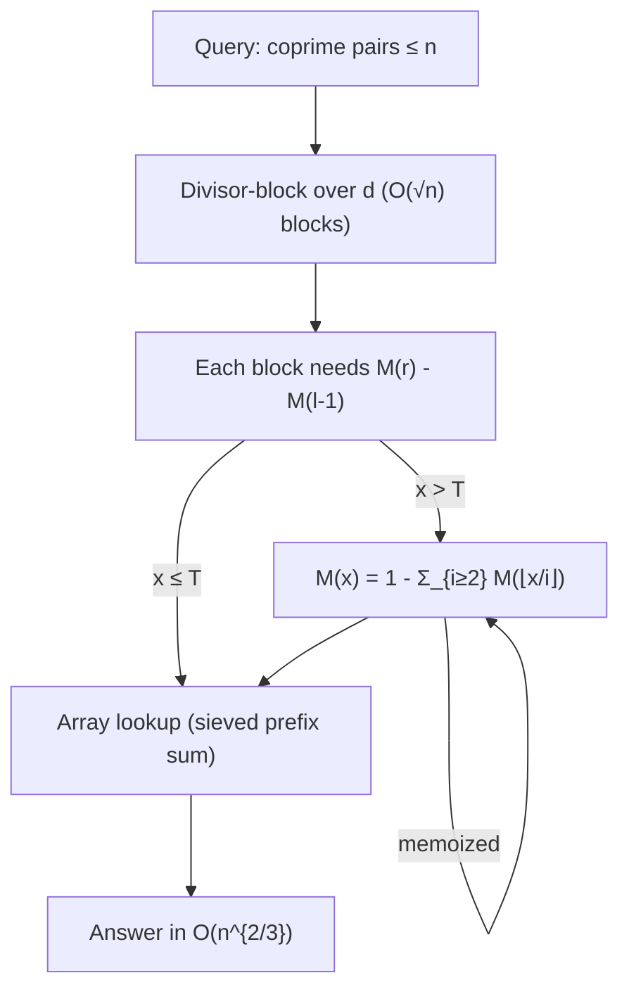

# Möbius Function & Möbius Inversion — Senior Level

> A single coprime-pair count is a textbook exercise. The senior reality is `Q ≈ 10^5` queries asking "coprime pairs up to `nᵢ`" or "`Σ gcd(i,j)` up to `nᵢ`" with `nᵢ` up to `10^9`, under a time limit — far beyond any `O(n)` per query. The craft is precomputing the right multiplicative function once, then answering each query in `O(√n)` via **floor-division (divisor) blocking** over a **prefix sum of `μ`** (the Mertens function). This document treats those scaling decisions, the memory/precompute tradeoffs, and the failure surfaces (overflow, block boundaries, query mix) in production terms.

## Table of Contents

1. [Introduction](#1-introduction)
2. [The Scaling Problem: From O(n) to O(√n) per Query](#2-the-scaling-problem)
3. [Divisor Blocking and the Floor-Division Trick](#3-divisor-blocking)
4. [The Mertens Function and Prefix Sums of μ](#4-the-mertens-function)
5. [Sublinear Mertens (Sieve + Dirichlet Hyperbola)](#5-sublinear-mertens)
6. [Code Examples](#6-code-examples)
7. [Performance Engineering](#7-performance-engineering)
8. [Observability and Testing](#8-observability-and-testing)
9. [Failure Modes](#9-failure-modes)
10. [Summary](#10-summary)

---

## 1. Introduction

At senior level the question is not "what is `μ`" but "how do I answer many large number-theoretic counting queries within a latency budget?" Three production-shaped workloads recur, all built on the same engine:

1. **Coprime-pair / coprime-triple counts** up to a bound `n` — `Σ_d μ(d)⌊n/d⌋²` (or `⌊n/d⌋³`), where `n` can be `10^9`.
2. **GCD-sum and GCD-distribution** queries — `Σ_d φ(d)⌊n/d⌋²`, or "how many pairs have each gcd value."
3. **Squarefree counts and density** — `#squarefree ≤ n = Σ_d μ(d)⌊n/d²⌋`.

A naive `O(n)` pass per query dies at `n = 10^9`. The senior toolkit is:

- **Sieve precompute** of `μ` (and partial sums) up to a threshold `T ≈ n^{2/3}`.
- **Divisor blocking**: `⌊n/d⌋` has only `O(√n)` distinct values; batch consecutive `d` that share a quotient.
- **Prefix sums** of the weight function so each block is `O(1)`.
- For the largest `n`, **sublinear Mertens** via the Dirichlet hyperbola method to get prefix sums of `μ` beyond the sieved range.

The result: each query drops from `O(n)` to `O(√n)` (with precompute), or to `O(n^{2/3})` amortized when even `√n` blocks need a Mertens value that itself must be computed sublinearly.

---

## 2. The Scaling Problem

Recall the middle-level identity for coprime pairs in `{1..n}²`:

```
C(n) = Σ_{d=1}^{n} μ(d) · ⌊n/d⌋².
```

For `n = 10^9`, the sum has `10^9` terms — far too many. Two observations rescue it:

1. **Only `O(√n)` distinct values of `⌊n/d⌋`.** As `d` runs `1..n`, the quotient `q = ⌊n/d⌋` takes at most `2√n` distinct values. All `d` in a contiguous block share the same `q`.
2. **The block weight is a prefix sum of `μ`.** Within a block `[l, r]` where `⌊n/d⌋ = q` is constant, the contribution is `q² · Σ_{d=l}^{r} μ(d) = q² · (M(r) − M(l−1))`, where `M(x) = Σ_{d=1}^{x} μ(d)` is the **Mertens function**.

So if we can evaluate `M(x)` cheaply, the whole sum is a walk over `O(√n)` blocks. The problem reduces to: **compute prefix sums of `μ` fast.**

| Approach | Per-query cost | Precompute | Good for |
|----------|----------------|------------|----------|
| Naive `Σ μ(d)⌊n/d⌋²` | `O(n)` | `O(n)` sieve | tiny `n`, single query |
| Divisor blocking + sieved `M` | `O(√n)` | `O(n)` sieve to `n` | `n ≤ 10^7`, many queries |
| Blocking + sublinear `M` | `O(n^{3/4})` or `O(n^{2/3})` | sieve to `n^{2/3}` | `n` up to `10^{9}–10^{11}` |

---

## 3. Divisor Blocking

### The block enumeration

For a fixed `n`, iterate `d` from `1`; for each starting `l`, the quotient `q = ⌊n/l⌋` stays constant up to `r = ⌊n/q⌋`. Then jump to `l = r + 1`.

```text
l = 1
while l <= n:
    q = n / l                # integer division
    r = n / q                # largest d with n/d == q
    process block [l, r] with quotient q
    l = r + 1
```

There are at most `2⌊√n⌋` iterations. This is the **divisor-block (a.k.a. "整除分块" / floor-division grouping)** pattern, the workhorse of large-`n` number-theoretic sums.

### Applying it to coprime pairs

```
C(n) = Σ_blocks  q² · (M(r) − M(l−1)).
```

If `M` is precomputed as a prefix-sum array up to `n`, each block is `O(1)` and the whole query is `O(√n)`. The same skeleton handles:

| Quantity | Weight `w(d)` | Block term |
|----------|---------------|------------|
| Coprime pairs ≤ `n` | `μ(d)` | `q² · ΔW` |
| Coprime triples ≤ `n` | `μ(d)` | `q³ · ΔW` |
| GCD-sum `Σ gcd(i,j)` | `φ(d)` | `q² · ΔΦ` |
| `Σ_{d≤n} d(d)` (divisor count sum) | — | `Σ q` over blocks |
| Squarefree count ≤ `n` | `μ(d)` over `⌊n/d²⌋` | needs `d²` blocking |

`ΔW = W(r) − W(l−1)` is the prefix-sum difference of the relevant weight.

### Why blocking is correct

Within `[l, r]`, every `d` satisfies `⌊n/d⌋ = q` (by construction `r = ⌊n/q⌋` is the last such `d`). So `Σ_{d=l}^{r} w(d)⌊n/d⌋^k = q^k Σ_{d=l}^{r} w(d)`. Summing over disjoint blocks that partition `[1, n]` reproduces the full sum exactly. No `d` is double-counted because each block ends precisely where the quotient changes.

---

## 4. The Mertens Function

The **Mertens function** is the prefix sum of `μ`:

```
M(x) = Σ_{d=1}^{x} μ(d).
```

It grows slowly and erratically: `M(1)=1, M(2)=0, M(3)=-1, M(4)=-1, M(5)=-2, M(10)=-1, M(100)=1`. It is conjectured (and known for the ranges we care about) that `|M(x)| = O(x^{1/2+ε})`; the famous (disproved) Mertens conjecture was `|M(x)| < √x`. For algorithmic purposes, `M` is what every divisor-blocked Möbius sum queries.

### Two regimes

| `x` relative to sieve threshold `T` | How to get `M(x)` |
|-------------------------------------|-------------------|
| `x ≤ T` | direct array lookup (precomputed prefix sum of sieved `μ`) |
| `x > T` | compute on demand via the **Dirichlet hyperbola recurrence** (Section 5), memoized |

The threshold `T` is tuned to balance sieve cost against the number of large-`x` recurrence calls — typically `T ≈ n^{2/3}`.

### The recurrence for `M(x)`

From `μ * 1 = ε`, i.e. `Σ_{d|n} μ(d) = [n=1]`, sum over `n ≤ x`:

```
Σ_{n=1}^{x} Σ_{d|n} μ(d) = Σ_{n=1}^{x} [n=1] = 1.
```

Group by quotient `i = n/d`: `Σ_{i=1}^{x} M(⌊x/i⌋) = 1`. Pull out the `i=1` term (`M(x)`):

```
M(x) = 1 − Σ_{i=2}^{x} M(⌊x/i⌋).
```

The arguments `⌊x/i⌋` again take only `O(√x)` distinct values, so with divisor blocking and memoization this recurrence computes `M(x)` in `O(x^{2/3})` overall (when small values are sieved up to `~x^{2/3}`).

---

## 5. Sublinear Mertens

Combining the sieve and the recurrence gives the standard sublinear scheme:

1. **Sieve** `μ(1..T)` and its prefix sums `M(1..T)` with `T ≈ n^{2/3}`.
2. For `M(x)` with `x > T`, apply `M(x) = 1 − Σ_{i≥2} M(⌊x/i⌋)` with divisor blocking, recursing and **memoizing** results in a hash map keyed by `x`.
3. Every recursive argument is of the form `⌊n/k⌋`, so there are only `O(√n)` distinct large arguments — the memo stays small.

Total complexity: `O(T + (n/T)·√n)` minimized at `T ≈ n^{2/3}`, giving `O(n^{2/3})`. This is the engine behind answering coprime-pair/gcd queries for `n` up to `10^{10}–10^{11}`.



---

## 6. Code Examples

### Divisor-blocked coprime-pair count with precomputed Mertens (range `n ≤ T`)

#### Go

```go
package main

import "fmt"

// sieveMertens returns prefix sums M[0..T] of μ, using a linear sieve.
func sieveMertens(T int) []int64 {
	mu := make([]int8, T+1)
	comp := make([]bool, T+1)
	var primes []int
	if T >= 1 {
		mu[1] = 1
	}
	for i := 2; i <= T; i++ {
		if !comp[i] {
			primes = append(primes, i)
			mu[i] = -1
		}
		for _, p := range primes {
			if i*p > T {
				break
			}
			comp[i*p] = true
			if i%p == 0 {
				mu[i*p] = 0
				break
			}
			mu[i*p] = -mu[i]
		}
	}
	M := make([]int64, T+1)
	for i := 1; i <= T; i++ {
		M[i] = M[i-1] + int64(mu[i])
	}
	return M
}

// coprimePairs counts ordered (a,b) in {1..n}² with gcd=1, via divisor blocking.
// Requires M precomputed up to n.
func coprimePairs(n int, M []int64) int64 {
	var total int64
	for l := 1; l <= n; {
		q := n / l
		r := n / q
		dM := M[r] - M[l-1]
		total += int64(q) * int64(q) * dM
		l = r + 1
	}
	return total
}

func main() {
	const N = 1000
	M := sieveMertens(N)
	fmt.Println(coprimePairs(6, M))    // 23
	fmt.Println(coprimePairs(1000, M)) // 608383
}
```

#### Java

```java
public class CoprimeBlocked {
    static long[] sieveMertens(int T) {
        byte[] mu = new byte[T + 1];
        boolean[] comp = new boolean[T + 1];
        int[] primes = new int[T + 1];
        int pc = 0;
        if (T >= 1) mu[1] = 1;
        for (int i = 2; i <= T; i++) {
            if (!comp[i]) { primes[pc++] = i; mu[i] = -1; }
            for (int j = 0; j < pc && (long) i * primes[j] <= T; j++) {
                int p = primes[j];
                comp[i * p] = true;
                if (i % p == 0) { mu[i * p] = 0; break; }
                mu[i * p] = (byte) (-mu[i]);
            }
        }
        long[] M = new long[T + 1];
        for (int i = 1; i <= T; i++) M[i] = M[i - 1] + mu[i];
        return M;
    }

    static long coprimePairs(int n, long[] M) {
        long total = 0;
        for (int l = 1; l <= n; ) {
            int q = n / l, r = n / q;
            long dM = M[r] - M[l - 1];
            total += (long) q * q * dM;
            l = r + 1;
        }
        return total;
    }

    public static void main(String[] args) {
        long[] M = sieveMertens(1000);
        System.out.println(coprimePairs(6, M));    // 23
        System.out.println(coprimePairs(1000, M)); // 608383
    }
}
```

#### Python

```python
def sieve_mertens(T):
    mu = [0] * (T + 1)
    comp = [False] * (T + 1)
    primes = []
    if T >= 1:
        mu[1] = 1
    for i in range(2, T + 1):
        if not comp[i]:
            primes.append(i)
            mu[i] = -1
        for p in primes:
            if i * p > T:
                break
            comp[i * p] = True
            if i % p == 0:
                mu[i * p] = 0
                break
            mu[i * p] = -mu[i]
    M = [0] * (T + 1)
    for i in range(1, T + 1):
        M[i] = M[i - 1] + mu[i]
    return M


def coprime_pairs(n, M):
    total, l = 0, 1
    while l <= n:
        q = n // l
        r = n // q
        total += q * q * (M[r] - M[l - 1])
        l = r + 1
    return total


if __name__ == "__main__":
    M = sieve_mertens(1000)
    print(coprime_pairs(6, M))      # 23
    print(coprime_pairs(1000, M))   # 608383
```

### Sublinear Mertens `M(x)` for `x` beyond the sieved range (Python)

```python
import sys

def make_mertens(threshold):
    """Return M(x) for any x, sieving small μ up to `threshold` and
    using the hyperbola recurrence + memoization for larger x."""
    T = threshold
    mu = [0] * (T + 1)
    comp = [False] * (T + 1)
    primes = []
    mu[1] = 1
    for i in range(2, T + 1):
        if not comp[i]:
            primes.append(i)
            mu[i] = -1
        for p in primes:
            if i * p > T:
                break
            comp[i * p] = True
            if i % p == 0:
                mu[i * p] = 0
                break
            mu[i * p] = -mu[i]
    Msmall = [0] * (T + 1)
    for i in range(1, T + 1):
        Msmall[i] = Msmall[i - 1] + mu[i]

    memo = {}

    def M(x):
        if x <= T:
            return Msmall[x]
        if x in memo:
            return memo[x]
        res = 1
        i = 2
        while i <= x:
            q = x // i
            j = x // q            # block [i, j] all share quotient q
            res -= (j - i + 1) * M(q)
            i = j + 1
        memo[x] = res
        return res

    return M


if __name__ == "__main__":
    sys.setrecursionlimit(1 << 20)
    M = make_mertens(10 ** 6)
    print(M(100))        # 1
    print(M(10 ** 6))    # 212
    print(M(10 ** 9))    # -222 (computed sublinearly)
```

---

### 6.1 Two-variable sums and the Dirichlet hyperbola method

Some queries are sums of a *Dirichlet convolution* over a range, e.g. `Σ_{n≤N} (f*g)(n) = Σ_{n≤N} Σ_{d|n} f(d)g(n/d)`. Reindex by the pair `(d, e)` with `de ≤ N`:

```
Σ_{n≤N} (f*g)(n) = Σ_{de ≤ N} f(d) g(e).
```

The **hyperbola method** splits this rectangle-under-a-hyperbola at `√N`:

```
Σ_{de≤N} f(d)g(e) = Σ_{d≤√N} f(d) G(⌊N/d⌋) + Σ_{e≤√N} g(e) F(⌊N/e⌋) − F(√N)·G(√N),
```

where `F, G` are prefix sums of `f, g`. Each piece is `O(√N)`, so a convolution-sum query costs `O(√N)` given prefix sums — the same budget as a single divisor-blocked sum. This is how `Σ_{n≤N} d(n)` (with `d = 1*1`) is computed in `O(√N)` instead of `O(N)`, and it generalizes the Mertens recurrence (which is the hyperbola method applied to `μ * 1 = ε`).

### 6.2 GCD-distribution queries

A frequent production query: "for every `g`, how many pairs `(i, j) ≤ n` have `gcd(i, j) = g`?" Let `P(n) = Σ_d μ(d)⌊n/d⌋²` be the coprime-pair count. Then

```
cnt[g] = P(⌊n/g⌋),
```

because pairs with `gcd = g` correspond to coprime pairs in `{1..⌊n/g⌋}²`. Computing `cnt[g]` for all `g ≤ n` naively is `Σ_g √(n/g) = O(n)` with blocking per `g` — but `⌊n/g⌋` again takes only `O(√n)` distinct values, so you compute `P` at those `O(√n)` arguments once and broadcast. The full distribution is delivered in `O(√n · √n) = O(n)`, or `O(√n)` distinct `P`-evaluations if only aggregate statistics (mean gcd, max-count gcd) are needed.

---

## 7. Performance Engineering

### Choosing the sieve threshold `T`

| `n` (query bound) | Sieve threshold `T` | Per-query cost |
|-------------------|---------------------|----------------|
| `≤ 10^7` | `T = n` | `O(√n)` (lookup blocks) |
| `10^7 – 10^9` | `T ≈ n^{2/3}` | `O(n^{2/3})` |
| `> 10^9` | `T ≈ n^{2/3}`, 64-bit, packed `μ` | `O(n^{2/3})`, memory-bound |

The classic result: sieving to `n^{2/3}` and recursing for larger arguments minimizes total work to `O(n^{2/3})`.

### Memory layout

- Store sieved `μ` as `int8`/`byte` (values in `{-1, 0, 1}`) — 1 byte each, so `T = 10^7` fits in 10 MB.
- Store the prefix-sum `M` as `int64`/`long` (the running sum can exceed 32-bit indices conceptually, though `|M|` stays small; use 64-bit defensively).
- For multi-query workloads, memoize `M(⌊n/k⌋)` keyed by the *argument value*, not by `k` — distinct arguments are `O(√n)`.

### Overflow discipline

The block term `q² · ΔM` with `q ≈ n` and `n = 10^9` gives `q² ≈ 10^{18}` — at the edge of signed 64-bit. For `⌊n/d⌋³` (coprime triples) or `n > 10^9`, use 128-bit (`__int128` in C/Go via `math/bits`, `BigInteger` in Java, native ints in Python). Always reason about the magnitude `n^k` before choosing the type.

### Avoiding recomputation across queries

If queries share a bound family (e.g. all `⌊N/k⌋`), the Mertens memo persists across queries — the second query reuses the first's recursion tree. Keep the memo and small sieve as long-lived state.

### 7.1 A production scenario: 10⁵ coprime-count queries

Suppose a service answers `Q = 10^5` queries, each "coprime pairs ≤ nᵢ" with `nᵢ ≤ 10^9`. Budget the work:

1. **One-time:** linear-sieve `μ(1..T)` with `T = 10^6 ≈ (10^9)^{2/3}`, prefix-sum to `M`. Cost `O(T) = 10^6`, memory ~1 MB (`int8` μ) + ~8 MB (`int64` M).
2. **Per query:** divisor-block over `d` (`O(√nᵢ) ≤ ~63 000` blocks), each needing `M(r), M(l-1)`. Values `≤ T` are array lookups; values `> T` use the memoized sublinear recurrence.
3. **Shared memo:** because all large arguments are `⌊nᵢ/k⌋`, queries with related `nᵢ` reuse recursion subtrees. Worst case per query `O(nᵢ^{2/3}) ≈ 10^6`, but typical amortized cost is far lower.

Total: `O(T + Q·√n)` in the lookup regime, or `O(T + Q·n^{2/3})` worst case. Tuning `T` upward trades memory for fewer recurrence calls; profile against the actual `nᵢ` distribution. The key engineering lever is the **shared persistent memo** — without it, each query re-derives the same `M(⌊n/k⌋)` values.

### 7.2 Cache and SIMD considerations

The divisor-block loop is branch-light and array-bound: each iteration reads `M[r]` and `M[l-1]` (two scattered loads) and does one multiply-add. For `n ≤ T`, the `M` array is read in a *strided, decreasing* pattern (`r` shrinks as `l` grows), which is cache-unfriendly for huge `T`; blocking the queries by magnitude or sorting them can improve locality. The single-`μ` sieve itself is the classic linear-sieve memory-bandwidth workload — store `μ` as `int8` to keep the working set in L2 for `T ≤ 10^7`.

---

### 7.3 Extending to coprime triples and higher tuples

The same machinery counts coprime `k`-tuples — ordered `(a_1, …, a_k) ≤ n` with `gcd = 1`:

```
C_k(n) = Σ_{d=1}^{n} μ(d)·⌊n/d⌋^k.
```

Divisor-blocked, this is `Σ_blocks q^k·(M(r) − M(l−1))` — `O(√n)` per query, weight still the Mertens prefix sum, only the exponent `k` changes. The **overflow ceiling drops fast**: with `n = 10^9`, `q^2 ≈ 10^{18}` already nears signed 64-bit, and `q^3 ≈ 10^{27}` overflows it by nine orders of magnitude. For triples at large `n` you must use 128-bit accumulators (`__int128`, Go `math/big` or manual hi/lo, Java `BigInteger`, Python native). The density `C_k(n)/n^k → 1/ζ(k)`: `1/ζ(2) ≈ 0.6079` for pairs, `1/ζ(3) ≈ 0.8319` for triples — higher tuples are *more* likely coprime, since sharing a prime across all `k` coordinates is rarer.

### 7.4 Choosing μ-sum vs φ-sum vs raw inclusion-exclusion at scale

| Query | Best large-`n` method | Weight |
|-------|----------------------|--------|
| Coprime `k`-tuples ≤ n | divisor block + Mertens | `μ` |
| `Σ gcd(i,j)` | divisor block + `Φ` prefix sum | `φ` |
| `Σ lcm(i,j)` | derive from gcd via `lcm = ij/gcd` | mixed |
| Few primes, single small `n` | direct inclusion-exclusion over the `≤ 9` primes ≤ 2·3·…·23 < 2³¹ | `(-1)^{\|S\|}` |
| Pairs coprime to a *fixed* `m` | inclusion-exclusion over distinct primes of `m` | `(-1)^{\|S\|}` |

When the modulus has few distinct prime factors (true of any `m < 2·3·5·7·11·13·17·19·23 ≈ 2.2·10^8`, which has ≤ 8 distinct primes), enumerating the `2^{ω(m)} ≤ 256` squarefree divisors by hand can beat a full sieve — this is the inclusion-exclusion shortcut and is preferred when you do not need a range of `μ` values.

---

## 8. Observability and Testing

| Check | How |
|-------|-----|
| Block partition is exact | Assert `Σ (r − l + 1)` over blocks equals `n`. |
| `M(x)` matches naive | For `x ≤ 10^6`, compare sublinear `M(x)` against the sieved prefix sum. |
| Coprime count vs brute force | For `n ≤ 2000`, compare blocked result against `O(n²)` gcd double loop. |
| Identity sanity | Verify `Σ_{i≥1} M(⌊x/i⌋) = 1` (the hyperbola identity) for several `x`. |
| Density sanity | `C(n)/n² → 6/π² ≈ 0.6079`; assert convergence as `n` grows. |
| Overflow guard | Run with `n = 10^9` and assert results fit the chosen integer type. |

Property-based testing pays off: generate random `n`, compute coprime pairs both by the blocked formula and (for small `n`) by brute force, and assert equality.

---

## 9. Failure Modes

- **Quotient-block off-by-one.** `r = ⌊n/q⌋` where `q = ⌊n/l⌋`; computing `r` from `l` directly (instead of via `q`) silently breaks the block end. Always go `l → q → r`.
- **`q = 0` when `l > n`.** Guard the loop with `l <= n`; otherwise division by zero in `r = n/q`.
- **Overflow in `q²`/`q³`.** `n = 10^9` makes `q²` reach `10^{18}`; use 64-bit, and 128-bit for cubes. A silent wrap produces a plausible-but-wrong count.
- **Mertens memo keyed by `k` not by value.** Memoizing on the divisor index instead of `⌊n/k⌋` explodes the memo and loses the `O(√n)`-distinct-arguments guarantee.
- **Recursion depth.** The hyperbola recurrence can recurse deeply for huge `x`; raise the stack limit or convert to an explicit stack / iterative DP over distinct arguments.
- **Threshold too low.** `T` far below `n^{2/3}` makes the recurrence dominate; too high wastes sieve memory. Tune empirically.
- **Wrong weight function.** Using `μ` where the problem wants `φ` (gcd-sum) or vice versa — both blocked identically but answer different questions. Encode the weight choice explicitly.
- **Squarefree-count uses `⌊n/d²⌋`.** Reusing the `⌊n/d⌋` block boundaries for the squarefree count (which needs `d²`) gives wrong blocks; that sum blocks over `d ≤ √n` directly instead.

---

## 10. Summary

Scaling Möbius-based counting from one small `n` to many large ones rests on three ideas. First, **divisor blocking**: `⌊n/d⌋` has only `O(√n)` distinct values, so `Σ_d w(d)⌊n/d⌋^k` collapses to `O(√n)` blocks, each contributing `q^k · (W(r) − W(l−1))` for a prefix sum `W` of the weight. Second, the weight prefix sum for coprime counts is the **Mertens function** `M(x) = Σ_{d≤x} μ(d)`; gcd-sums use the prefix sum of `φ` instead. Third, when `n` exceeds the sieveable range, compute `M(x)` **sublinearly** via the hyperbola recurrence `M(x) = 1 − Σ_{i≥2} M(⌊x/i⌋)` — sieve `μ` up to `T ≈ n^{2/3}`, memoize the `O(√n)` distinct large arguments, and reach `O(n^{2/3})` per query. The senior craft is the integer-type discipline (`q²` and `q³` overflow fast at `n = 10^9`), the block off-by-one (`l → q → r`), the memo keyed by argument value, and choosing the weight (`μ` vs `φ`) for the question asked. With these, coprime-pair, gcd-sum, and squarefree-count queries that are hopeless at `O(n)` become routine at `O(√n)`–`O(n^{2/3})`. The recurring shape across all of them — *express the per-element quantity as a divisor-sum, swap order, divisor-block over `⌊n/d⌋`, and difference a prefix sum of the right weight (μ for coprime counts, φ for gcd-sums)* — is the senior-level mental template; the only moving parts are the weight function and the exponent on the quotient.

---

## Operational Checklist

Before shipping a large-`n` Möbius-counting service, confirm:

- [ ] Result magnitude `n^k` fits the chosen integer type (`q²` at `n=10^9` needs 64-bit; `q³` needs 128-bit).
- [ ] Divisor blocks advance `l → q = ⌊n/l⌋ → r = ⌊n/q⌋ → l = r+1`, with the loop guarded by `l ≤ n`.
- [ ] Mertens memo is keyed by the *argument value* `⌊n/k⌋`, persistent across queries.
- [ ] Sieve threshold `T ≈ n^{2/3}`, tuned against the real `nᵢ` distribution.
- [ ] Weight matches the question: `μ` for coprime counts, `φ` for gcd-sums, `⌊n/d²⌋`-blocking for squarefree counts.
- [ ] Property test: blocked result equals the `O(n²)` brute force for all `n ≤ 2000`.
- [ ] Density sanity: `C_k(n)/n^k → 1/ζ(k)`.

## Related Topics

- Sibling `04-dirichlet-linear-sieve` — the `O(n)` sieve producing `μ` and `φ` together, the precompute step for every query here.
- Sibling `05-fermat-euler` — Euler's totient `φ`, the weight for gcd-sums.
- Sibling `01-gcd-lcm` — gcd, lcm, and the coprimality predicate underlying all these counts.
- Sibling `26-inclusion-exclusion` — the by-hand alternative when the modulus has few distinct primes.
- Sibling `31-divisor-functions` — `d(n)`, `σ(n)`, and their divisor-sum / prefix-sum queries (same hyperbola/blocking toolkit).

---

## Next step: [professional.md](./professional.md) — proof that `μ * 1 = ε`, the convolution ring, the general poset Möbius function (with inclusion-exclusion as a special case), and rigorous complexity.
