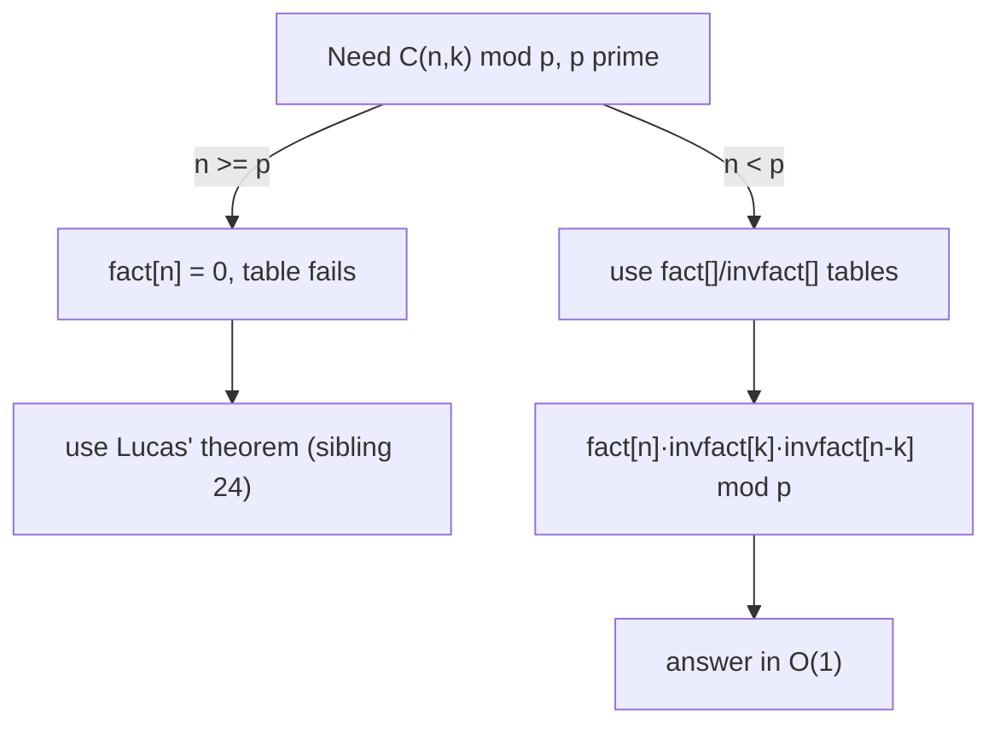

# Factorial modulo a Prime — Junior Level

> **One-line summary:** To compute combinations like `C(n, k) mod p` for a prime `p`, you precompute two tables once: `fact[i] = i! mod p` and `invfact[i] = (i!)^(-1) mod p`. The factorial table is a single forward loop; the inverse-factorial table is one modular inverse followed by a **backward** loop. After that, every `C(n, k)` is just three multiplications. This is the workhorse of competitive combinatorics under a modulus such as `10^9 + 7`.

---

## Table of Contents

1. [Introduction](#introduction)
2. [Prerequisites](#prerequisites)
3. [Glossary](#glossary)
4. [Core Concepts](#core-concepts)
5. [Big-O Summary](#big-o-summary)
6. [Real-World Analogies](#real-world-analogies)
7. [Pros & Cons](#pros--cons)
8. [Step-by-Step Walkthrough](#step-by-step-walkthrough)
9. [Code Examples](#code-examples)
10. [Coding Patterns](#coding-patterns)
11. [Error Handling](#error-handling)
12. [Performance Tips](#performance-tips)
13. [Best Practices](#best-practices)
14. [Edge Cases & Pitfalls](#edge-cases--pitfalls)
15. [Common Mistakes](#common-mistakes)
16. [Cheat Sheet](#cheat-sheet)
17. [Visual Animation](#visual-animation)
18. [Summary](#summary)
19. [Further Reading](#further-reading)

---

## Introduction

Suppose a problem asks: *"In how many ways can you choose 30 items out of 1000? Give the answer modulo `1000000007`."* The true count `C(1000, 30)` has about 60 digits — it does not fit in a 64-bit integer. But the problem only wants the **remainder** modulo a prime `p = 10^9 + 7`. That changes everything: you can do *all* the arithmetic modulo `p`, where every number stays below `10^9`, and never form the giant value at all.

The binomial coefficient is defined as

```
C(n, k) = n! / (k! · (n-k)!)
```

There is a `/` in that formula, and you cannot just "divide mod p". Instead you multiply by the **modular inverse**. Since `p` is prime, the inverse of any `a` (not divisible by `p`) is `a^(p-2) mod p` (Fermat's little theorem, sibling `05-fermat-euler`). So:

```
C(n, k) ≡ n! · (k!)^(-1) · ((n-k)!)^(-1)  (mod p)
```

If you are computing many binomial coefficients (and you usually are), it would be wasteful to recompute factorials and inverses each time. Instead you **precompute** two arrays once, up to the largest `n` you will ever need:

- `fact[i] = i! mod p` — a forward loop, `fact[i] = fact[i-1] · i`.
- `invfact[i] = (i!)^(-1) mod p` — the inverse of each factorial.

The clever part is the inverse-factorial table. Inverting each `i!` separately would cost `O(n log p)`. Instead, compute **just one** inverse — `invfact[n] = (n!)^(-1)` via Fermat — and then walk **backward**: `invfact[i-1] = invfact[i] · i`. That makes the whole table cost `O(n)` plus a single `O(log p)` inverse. This single trick — *one inverse plus a backward recurrence* — is the heart of this topic.

This file builds that toolkit: the factorial table, the inverse-factorial backward recurrence, and the three-multiply `C(n, k)`. It also explains a fact that surprises beginners: **`n! mod p` is `0` whenever `n ≥ p`**, because `n!` then contains the factor `p` itself.

---

## Prerequisites

Before reading this file you should be comfortable with:

- **Modular arithmetic** — `(a · b) mod m`, residues, and reducing after every multiply. See sibling `02-modular-arithmetic`.
- **Modular inverse** — that "dividing by `a` mod `p`" means multiplying by `a^(-1)`, and that for a **prime** `p`, `a^(-1) ≡ a^(p-2) (mod p)`. See sibling `05-fermat-euler`.
- **Binary exponentiation** — computing `a^e mod m` in `O(log e)`. See sibling `29-binary-exponentiation`.
- **Binomial coefficients** — what `C(n, k)` counts and the formula `n!/(k!(n-k)!)`. See sibling `23-binomial-coefficients`.
- **Big-O notation** — `O(n)`, `O(log p)`.

Optional but helpful:

- A glance at **arrays** and how to fill them with a loop.
- The idea that a **prime** modulus makes inverses always exist (for nonzero residues).

---

## Glossary

| Term | Meaning |
|------|---------|
| **Factorial `n!`** | `n! = 1 · 2 · 3 · ⋯ · n`, with `0! = 1` by convention. |
| **`fact[i]`** | The precomputed table `fact[i] = i! mod p`. |
| **Modular inverse `a^(-1)`** | The number `x` with `a · x ≡ 1 (mod p)`. For prime `p` and `a ≢ 0`, equals `a^(p-2) mod p`. |
| **Inverse factorial `invfact[i]`** | The precomputed table `invfact[i] = (i!)^(-1) mod p`. |
| **Backward recurrence** | Computing `invfact[i-1]` from `invfact[i]` via `invfact[i-1] = invfact[i] · i mod p`. |
| **Binomial coefficient `C(n, k)`** | The number of ways to choose `k` items from `n`; `= n!/(k!(n-k)!)`. |
| **Prime modulus `p`** | A prime such as `10^9 + 7` or `998244353`, used so inverses always exist. |
| **`p`-free factorial** | The factorial with all factors of `p` stripped out — needed for `C(n, k) mod p^e` and Wilson's theorem. |
| **Wilson's theorem** | `(p-1)! ≡ -1 (mod p)` for any prime `p`. |
| **Legendre's formula** | The exponent of prime `p` in `n!` equals `⌊n/p⌋ + ⌊n/p²⌋ + ⌊n/p³⌋ + ⋯`. |

---

## Core Concepts

### 1. The factorial table (forward loop)

The factorial table is built by one pass from `0` to `N`:

```
fact[0] = 1
fact[i] = fact[i-1] · i  (mod p)   for i = 1 .. N
```

Each step uses the previous value, so the whole table costs `O(N)` multiplications. For example, mod `p = 11`:

```
fact[0]=1, fact[1]=1, fact[2]=2, fact[3]=6, fact[4]=24≡2, fact[5]=120≡10, …
```

### 2. The inverse-factorial table (one inverse + backward loop)

You need `invfact[i] = (i!)^(-1) mod p` for the denominator of `C(n, k)`. The naive way is to invert each `fact[i]` separately — `N` inverses, each `O(log p)`, total `O(N log p)`. The fast way uses **one** inverse and a backward recurrence:

```
invfact[N] = (fact[N])^(-1) mod p     # ONE Fermat inverse, O(log p)
invfact[i-1] = invfact[i] · i  (mod p)  for i = N .. 1
```

Why does the backward step work? Because `(i-1)! = i! / i`, so `((i-1)!)^(-1) = (i!)^(-1) · i`. In symbols:

```
invfact[i-1] = ((i-1)!)^(-1) = (i! / i)^(-1) = (i!)^(-1) · i = invfact[i] · i.
```

The whole table now costs `O(N)` plus one `O(log p)` inverse. **This is the single most important pattern in the topic.**

### 3. The three-multiply binomial coefficient

With both tables ready, every `C(n, k)` is computed in `O(1)`:

```
C(n, k) ≡ fact[n] · invfact[k] · invfact[n-k]  (mod p)     for 0 ≤ k ≤ n
```

If `k < 0` or `k > n`, the answer is `0` by definition.

### 4. Why `n! ≡ 0 (mod p)` for `n ≥ p`

Look at `p!`. It is `1 · 2 · ⋯ · p`, and one of those factors is `p` itself. So `p!` is divisible by `p`, meaning `p! ≡ 0 (mod p)`. The same is true for `(p+1)!`, `(p+2)!`, and every larger factorial: each one still contains the factor `p`. So:

```
n! ≡ 0 (mod p)   for every n ≥ p.
```

This is why the `fact[]`/`invfact[]` table method only works when **`n < p`**. With `p = 10^9 + 7`, that is fine — `n` rarely exceeds a few million. But if `n ≥ p` (a small prime, say `p = 7` with `n = 100`), you cannot invert `fact[n] = 0`; you need Lucas' theorem (sibling `24-lucas-theorem`) or the `p`-free factorial (middle/professional levels).

### 5. Wilson's theorem (a preview)

A beautiful fact about factorials mod a prime: `(p-1)! ≡ -1 (mod p)`. For `p = 5`: `4! = 24 = 25 - 1 ≡ -1 (mod 5)`. For `p = 7`: `6! = 720 = 721 - 1 = 7·103 - 1 ≡ -1 (mod 7)`. This is mostly of theoretical interest at the junior level, but it shows that the residue `fact[p-1]` is always `p - 1` — a free correctness self-check. The middle file explains why.

### 6. Legendre's formula (a preview)

How many times does the prime `p` divide `n!`? Count the multiples of `p`, then of `p²`, and so on:

```
v_p(n!) = ⌊n/p⌋ + ⌊n/p²⌋ + ⌊n/p³⌋ + ⋯
```

For `n = 10`, `p = 2`: `⌊10/2⌋ + ⌊10/4⌋ + ⌊10/8⌋ = 5 + 2 + 1 = 8`, so `2^8` divides `10! = 3628800` exactly. This formula tells you *whether* `C(n, k) mod p` is zero (when `p` is small) and is the gateway to the prime-power case. The middle file develops it fully.

---

## Big-O Summary

| Operation | Time | Space | Notes |
|-----------|------|-------|-------|
| Build `fact[0..N]` | **O(N)** | O(N) | One forward loop. |
| Build `invfact[0..N]` | **O(N + log p)** | O(N) | One inverse + backward loop. |
| Single `C(n, k)` after precompute | **O(1)** | O(1) | Three table lookups + two multiplies. |
| Single `n! mod p` from table | O(1) | — | Just `fact[n]`. |
| Single modular inverse (Fermat) | O(log p) | O(1) | `a^(p-2) mod p`. |
| Naive per-call `C(n, k)` (no table) | O(n log p) | O(1) | Recompute factorials + inverses; avoid. |
| Legendre `v_p(n!)` | O(log_p n) | O(1) | Sum of floor divisions. |

The headline costs are **O(N)** to build both tables and **O(1)** per binomial coefficient afterward. The single `O(log p)` inverse is paid exactly once.

---

## Real-World Analogies

| Concept | Analogy |
|---------|---------|
| The `fact[]` table | A running product you fill once, like keeping a running bank balance — each entry builds on the last. |
| One inverse + backward loop | Buying one master key (the single inverse) and cutting all the smaller keys from it by walking down a staircase, instead of forging each key from scratch. |
| `C(n, k)` in O(1) | A pre-baked lookup: once the pantry (tables) is stocked, every recipe (coefficient) is three quick grabs. |
| `n! ≡ 0` for `n ≥ p` | Once a chain of multiplications hits the "poison" factor `p`, the whole product is contaminated (divisible by `p`) forever after. |
| Legendre's formula | Counting how many people in a stadium are wearing a hat, then a second hat, then a third — summing each layer of `p`-multiples. |
| Wilson's theorem | A round-trip where everyone pairs off with their inverse and only the lone self-inverse `p-1` is left over, contributing the `-1`. |

Where the analogies break: the "master key" picture assumes the modulus is **prime**, so every nonzero factorial is invertible. For composite or prime-power moduli the single-inverse trick needs the `p`-free factorial (covered later).

---

## Pros & Cons

| Pros | Cons |
|------|------|
| After `O(N)` precompute, every `C(n, k)` is `O(1)`. | Only valid when `n < p` (else `fact[n] = 0`). |
| Inverse-factorial table costs only **one** modular inverse. | Needs `O(N)` memory for both tables. |
| Reuses one `powMod` routine you already have. | Wrong for composite modulus — needs the `p`-free factorial. |
| Numbers stay below `p`, so no big-integer arithmetic. | Off-by-one in table size silently reads garbage / out of bounds. |
| Powers an entire combinatorics library (Catalan, stars-and-bars, etc.). | The backward-recurrence direction is easy to get wrong. |

**When to use:** computing many binomial coefficients (or factorials) modulo a large prime, with `n` up to a few million — the standard competitive-programming setup under `10^9 + 7` or `998244353`.

**When NOT to use:** when `n ≥ p` (use Lucas, sibling `24`), when the modulus is composite or a prime power (use the `p`-free factorial / generalized Wilson), or when you need only one coefficient with tiny `n` (a direct loop is simpler).

---

## Step-by-Step Walkthrough

**Goal:** compute `C(5, 2) mod 11` by hand using the table method.

**Step 1 — Build `fact[0..5] mod 11`.**

```
fact[0] = 1
fact[1] = 1·1 = 1
fact[2] = 1·2 = 2
fact[3] = 2·3 = 6
fact[4] = 6·4 = 24 ≡ 2 (mod 11)
fact[5] = 2·5 = 10 (mod 11)
```

**Step 2 — Compute the single inverse `invfact[5] = (fact[5])^(-1) = 10^(-1) mod 11`.**
By Fermat, `10^(-1) ≡ 10^(11-2) = 10^9 mod 11`. Easier: `10 ≡ -1 (mod 11)`, and `(-1)·(-1) = 1`, so `10^(-1) ≡ 10`. Thus `invfact[5] = 10`.

**Step 3 — Walk backward to fill `invfact`.**

```
invfact[5] = 10
invfact[4] = invfact[5]·5 = 10·5 = 50 ≡ 6 (mod 11)
invfact[3] = invfact[4]·4 = 6·4 = 24 ≡ 2 (mod 11)
invfact[2] = invfact[3]·3 = 2·3 = 6 (mod 11)
invfact[1] = invfact[2]·2 = 6·2 = 12 ≡ 1 (mod 11)
invfact[0] = invfact[1]·1 = 1
```

Sanity check: `fact[2]·invfact[2] = 2·6 = 12 ≡ 1 (mod 11)` ✓.

**Step 4 — Combine for `C(5, 2)`.**

```
C(5, 2) ≡ fact[5]·invfact[2]·invfact[3]  (mod 11)
        = 10 · 6 · 2 = 120 ≡ 10 (mod 11).
```

**Step 5 — Verify against the true value.** `C(5, 2) = 10`, and `10 mod 11 = 10` ✓.

**Step 6 — Spot the Wilson check.** Note `fact[p-1] = fact[10]` would be `≡ -1 ≡ 10 (mod 11)` — Wilson's theorem, a free self-test if you build the table up to `p-1`.

That is the entire junior workflow: build `fact` forward, compute one inverse, fill `invfact` backward, and read off any `C(n, k)` in three multiplies.

---

## Code Examples

### Example: Precompute factorials + inverse factorials, then `C(n, k)`

This precomputes both tables up to `N`, then answers binomial-coefficient queries in `O(1)`.

#### Go

```go
package main

import "fmt"

const MOD = int64(1_000_000_007)

// powMod computes a^e mod m in O(log e).
func powMod(a, e, m int64) int64 {
	a %= m
	if a < 0 {
		a += m
	}
	r := int64(1) % m
	for e > 0 {
		if e&1 == 1 {
			r = r * a % m
		}
		a = a * a % m
		e >>= 1
	}
	return r
}

var fact, invfact []int64

// precompute builds fact[0..N] and invfact[0..N] in O(N + log MOD).
func precompute(N int) {
	fact = make([]int64, N+1)
	invfact = make([]int64, N+1)
	fact[0] = 1
	for i := 1; i <= N; i++ {
		fact[i] = fact[i-1] * int64(i) % MOD // forward loop
	}
	// ONE inverse via Fermat, then walk backward.
	invfact[N] = powMod(fact[N], MOD-2, MOD)
	for i := N; i >= 1; i-- {
		invfact[i-1] = invfact[i] * int64(i) % MOD // backward recurrence
	}
}

// binom returns C(n, k) mod MOD in O(1).
func binom(n, k int) int64 {
	if k < 0 || k > n {
		return 0
	}
	return fact[n] * invfact[k] % MOD * invfact[n-k] % MOD
}

func main() {
	precompute(1000)
	fmt.Println(binom(5, 2))    // 10
	fmt.Println(binom(1000, 30) % MOD)
	fmt.Println(fact[10])       // 10! mod p = 3628800
}
```

#### Java

```java
public class FactorialMod {
    static final long MOD = 1_000_000_007L;
    static long[] fact, invfact;

    static long powMod(long a, long e, long m) {
        a %= m;
        if (a < 0) a += m;
        long r = 1 % m;
        while (e > 0) {
            if ((e & 1) == 1) r = r * a % m;
            a = a * a % m;
            e >>= 1;
        }
        return r;
    }

    static void precompute(int N) {
        fact = new long[N + 1];
        invfact = new long[N + 1];
        fact[0] = 1;
        for (int i = 1; i <= N; i++)
            fact[i] = fact[i - 1] * i % MOD;          // forward loop
        invfact[N] = powMod(fact[N], MOD - 2, MOD);   // one Fermat inverse
        for (int i = N; i >= 1; i--)
            invfact[i - 1] = invfact[i] * i % MOD;    // backward recurrence
    }

    static long binom(int n, int k) {
        if (k < 0 || k > n) return 0;
        return fact[n] * invfact[k] % MOD * invfact[n - k] % MOD;
    }

    public static void main(String[] args) {
        precompute(1000);
        System.out.println(binom(5, 2));   // 10
        System.out.println(binom(1000, 30));
        System.out.println(fact[10]);      // 3628800
    }
}
```

#### Python

```python
MOD = 1_000_000_007


def precompute(N):
    fact = [1] * (N + 1)
    for i in range(1, N + 1):
        fact[i] = fact[i - 1] * i % MOD        # forward loop
    invfact = [1] * (N + 1)
    invfact[N] = pow(fact[N], MOD - 2, MOD)    # one Fermat inverse
    for i in range(N, 0, -1):
        invfact[i - 1] = invfact[i] * i % MOD  # backward recurrence
    return fact, invfact


def binom(n, k, fact, invfact):
    if k < 0 or k > n:
        return 0
    return fact[n] * invfact[k] % MOD * invfact[n - k] % MOD


if __name__ == "__main__":
    fact, invfact = precompute(1000)
    print(binom(5, 2, fact, invfact))     # 10
    print(binom(1000, 30, fact, invfact))
    print(fact[10])                       # 3628800
```

**What it does:** builds the factorial and inverse-factorial tables once, then computes `C(5, 2) = 10` and `C(1000, 30) mod p` in `O(1)` each.
**Run:** `go run main.go` | `javac FactorialMod.java && java FactorialMod` | `python factorial.py`

---

## Coding Patterns

### Pattern 1: One-inverse backward recurrence (the core)

**Intent:** build all `invfact[i]` from a single modular inverse.

```python
invfact[N] = pow(fact[N], MOD - 2, MOD)   # the only inverse you compute
for i in range(N, 0, -1):
    invfact[i - 1] = invfact[i] * i % MOD  # cheap multiply, no inverse
```

This replaces `N` inverses (`O(N log p)`) with `1` inverse plus `O(N)` multiplies.

### Pattern 2: Single-inverse modular value (the oracle)

**Intent:** before trusting the table, compute one `C(n, k)` the slow, direct way and check it agrees.

```python
def binom_slow(n, k, p):
    if k < 0 or k > n:
        return 0
    num = den = 1
    for i in range(k):
        num = num * (n - i) % p
        den = den * (i + 1) % p
    return num * pow(den, p - 2, p) % p
```

This is `O(k log p)` per call — too slow for many queries, but a perfect correctness oracle for small inputs.

### Pattern 3: Guard `n ≥ p`

**Intent:** detect the case where the table method silently fails.

```python
def binom_guarded(n, k, p, fact, invfact):
    if n >= p:
        raise ValueError("n >= p: use Lucas' theorem, fact[n] is 0")
    if k < 0 or k > n:
        return 0
    return fact[n] * invfact[k] % p * invfact[n - k] % p
```



---

## Error Handling

| Error | Cause | Fix |
|-------|-------|-----|
| `C(n, k)` always 0 for large `n` | `n ≥ p`, so `fact[n] = 0`. | Use Lucas' theorem (sibling `24`) for `n ≥ p`. |
| Wrong inverse factorials | Walked the recurrence forward instead of backward. | Compute `invfact[N]` first, loop `i` from `N` down to `1`. |
| Index out of bounds | Table sized smaller than the largest `n` queried. | Size `N` to the maximum `n` (or `p-1`) you will ever use. |
| Wrong answer for composite modulus | Used Fermat inverse with non-prime `p`. | Use the `p`-free factorial / generalized Wilson (professional). |
| Overflow in `fact[i-1]·i` | Product exceeds 64-bit before reducing. | Reduce mod `p` after every multiply; use `int64`/`long`. |
| `C(n, k)` nonzero for `k > n` | Forgot the `k < 0 || k > n` guard. | Return `0` when `k` is out of `[0, n]`. |

---

## Performance Tips

- **Precompute once, query many.** The whole point is `O(N)` setup so each `C(n, k)` is `O(1)`. Never recompute factorials inside a query loop.
- **One inverse, not N.** Use the backward recurrence; inverting each factorial separately is `O(N log p)` and pointless.
- **Reduce after every multiply** so products stay below `p²` (which fits in `int64` for `p ≈ 10^9`).
- **Size the table to the true maximum.** A single global `N = 2·10^6` covers most problems; growing it later means re-running precompute.
- **Reuse the tables** for Catalan numbers, stars-and-bars, and other combinatorial identities — they all reduce to `C(n, k)`.

---

## Best Practices

- State up front that the modulus is **prime** and that **`n < p`** — both are required for the table method.
- Build `fact` forward and `invfact` backward; document the direction in a comment, since reversing it is a classic bug.
- Validate `0 ≤ k ≤ n` and return `0` otherwise, matching the combinatorial definition.
- Test `fact[i]·invfact[i] ≡ 1 (mod p)` for several `i` right after precompute — a one-line sanity check.
- Use Wilson's theorem (`fact[p-1] ≡ -1`) as a free self-test when the table reaches `p-1`.
- Keep one shared `powMod` and one shared precompute; do not scatter ad-hoc inverse computations.

---

## Edge Cases & Pitfalls

- **`n = 0` or `k = 0`** — `C(n, 0) = 1` and `C(0, 0) = 1`; the formula handles these since `fact[0] = invfact[0] = 1`.
- **`k = n`** — `C(n, n) = 1`; `invfact[0]` is `1`, so it works.
- **`k > n` or `k < 0`** — return `0`; the formula would otherwise read invalid indices.
- **`n ≥ p`** — `fact[n] = 0`, the inverse does not exist; switch to Lucas.
- **Table too small** — querying `C(n, k)` with `n > N` reads out of bounds; size `N` generously.
- **Composite / prime-power modulus** — the single-inverse trick is invalid; you need the `p`-free factorial.
- **Forgetting `invfact[N]` must come from `fact[N]`** — not from `fact[N-1]` or any other index.

---

## Common Mistakes

1. **Filling `invfact` forward** — the recurrence only works backward (`invfact[i-1] = invfact[i]·i`); going forward gives garbage.
2. **Using the table when `n ≥ p`** — `fact[n] = 0` and the answer is wrong; use Lucas' theorem.
3. **Inverting every factorial separately** — correct but `O(N log p)`; the backward recurrence makes it `O(N)`.
4. **Wrong modulus assumption** — Fermat's `a^(p-2)` inverse needs `p` prime; composite moduli need a different method.
5. **Off-by-one table size** — building up to `N-1` but querying `C(N, k)`; size to the true maximum.
6. **Forgetting the `k > n` guard** — produces a nonzero "coefficient" that should be `0`.
7. **Overflow** — `fact[i-1]·i` for `p ≈ 10^9` needs `int64`; reduce immediately.

---

## Cheat Sheet

| Task | Formula |
|------|---------|
| Factorial table | `fact[0]=1`, `fact[i]=fact[i-1]·i mod p` |
| One inverse | `invfact[N]=pow(fact[N], p-2, p)` |
| Inverse-factorial table | `invfact[i-1]=invfact[i]·i mod p` (backward) |
| `C(n, k)` (0 ≤ k ≤ n) | `fact[n]·invfact[k]·invfact[n-k] mod p` |
| `C(n, k)` otherwise | `0` |
| `n! mod p`, `n ≥ p` | `0` |
| Wilson check | `fact[p-1] ≡ p-1 (mod p)` |
| Legendre `v_p(n!)` | `⌊n/p⌋+⌊n/p²⌋+⌊n/p³⌋+…` |
| Inverse self-test | `fact[i]·invfact[i] ≡ 1 (mod p)` |

Core routine:

```
precompute(N, p):
    fact[0] = 1
    for i in 1..N: fact[i] = fact[i-1]*i % p          # forward
    invfact[N] = pow(fact[N], p-2, p)                 # one inverse
    for i in N..1: invfact[i-1] = invfact[i]*i % p    # backward

binom(n, k):  return fact[n]*invfact[k]%p*invfact[n-k]%p   # if 0<=k<=n else 0
```

---

## Visual Animation

> See [`animation.html`](./animation.html) for an interactive visualization.
>
> The animation demonstrates:
> - The **forward** fill of `fact[i] = fact[i-1]·i mod p`, cell by cell.
> - The single modular inverse `invfact[N] = fact[N]^(p-2)` highlighted in green.
> - The **backward** fill of `invfact[i-1] = invfact[i]·i mod p`, walking right-to-left.
> - **Legendre's formula** counting the factors of `p` in `n!` as a stack of floor divisions.
> - Editable `n` and `p` with Step / Run / Reset controls and a Big-O panel.

---

## Summary

To compute binomial coefficients modulo a prime `p`, precompute two tables. The **factorial table** `fact[i] = i! mod p` is a forward loop. The **inverse-factorial table** `invfact[i] = (i!)^(-1) mod p` is built from **one** modular inverse (`invfact[N] = fact[N]^(p-2)` by Fermat) followed by the **backward recurrence** `invfact[i-1] = invfact[i]·i`, exploiting `(i-1)! = i!/i`. This makes the whole setup `O(N + log p)`, after which every `C(n, k) ≡ fact[n]·invfact[k]·invfact[n-k] (mod p)` is `O(1)`. The method requires `p` prime and `n < p` — because `n! ≡ 0 (mod p)` once `n ≥ p`, since `n!` then contains the factor `p`. Two famous facts decorate the topic: **Wilson's theorem** (`(p-1)! ≡ -1 mod p`, a free self-check) and **Legendre's formula** (the exponent of `p` in `n!` is `Σ ⌊n/p^i⌋`), which the next level develops into the prime-power case.

---

## Further Reading

- *Concrete Mathematics* (Graham, Knuth, Patashnik) — factorials, binomial coefficients, and identities.
- Sibling topic `05-fermat-euler` — the modular inverse via `a^(p-2)`.
- Sibling topic `23-binomial-coefficients` — the combinatorics this powers.
- Sibling topic `24-lucas-theorem` — computing `C(n, k) mod p` when `n ≥ p`.
- Sibling topic `29-binary-exponentiation` — the `O(log e)` fast-power engine.
- Sibling topic `25-catalan-numbers` — a direct application of `C(n, k) mod p`.
- cp-algorithms.com — "Binomial coefficients" and "Factorial modulo p".

---

Next step: continue to [`middle.md`](./middle.md) for Wilson's theorem, Legendre's formula, the `p`-free factorial, and why `n! ≡ 0` for `n ≥ p`.
