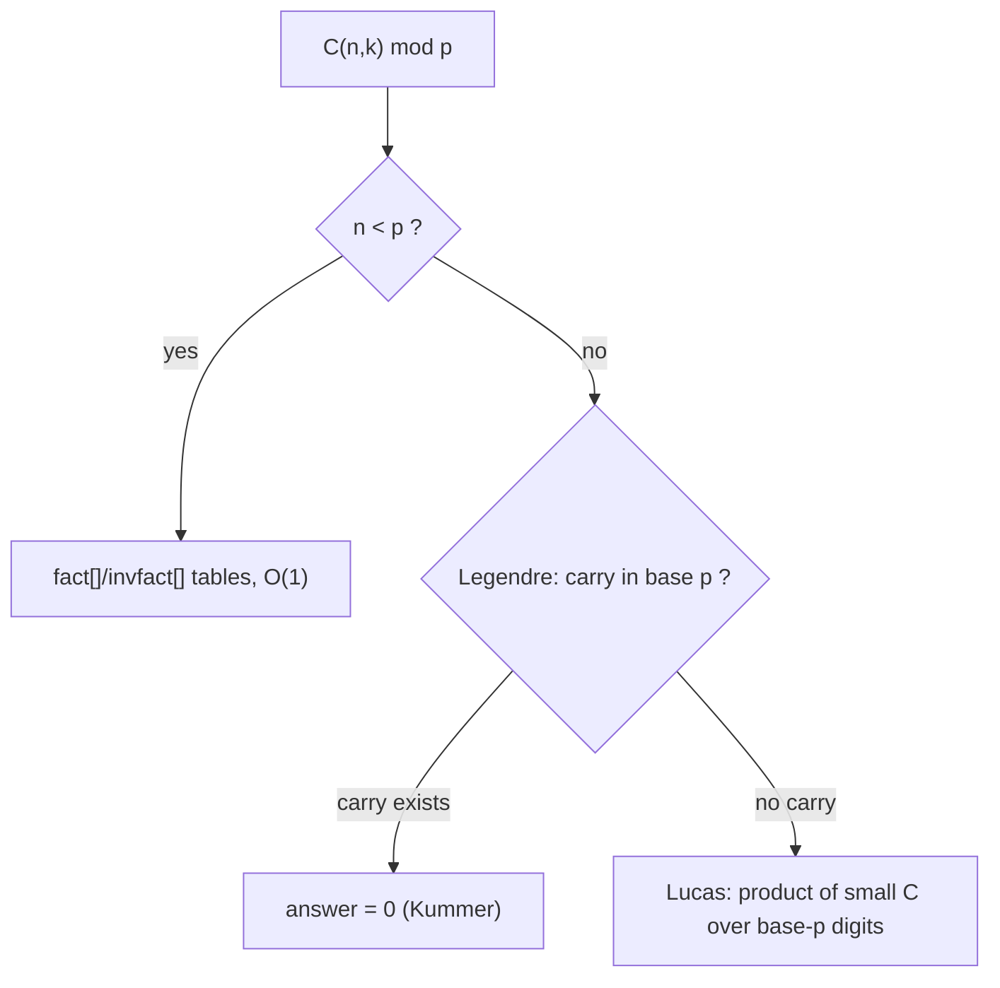
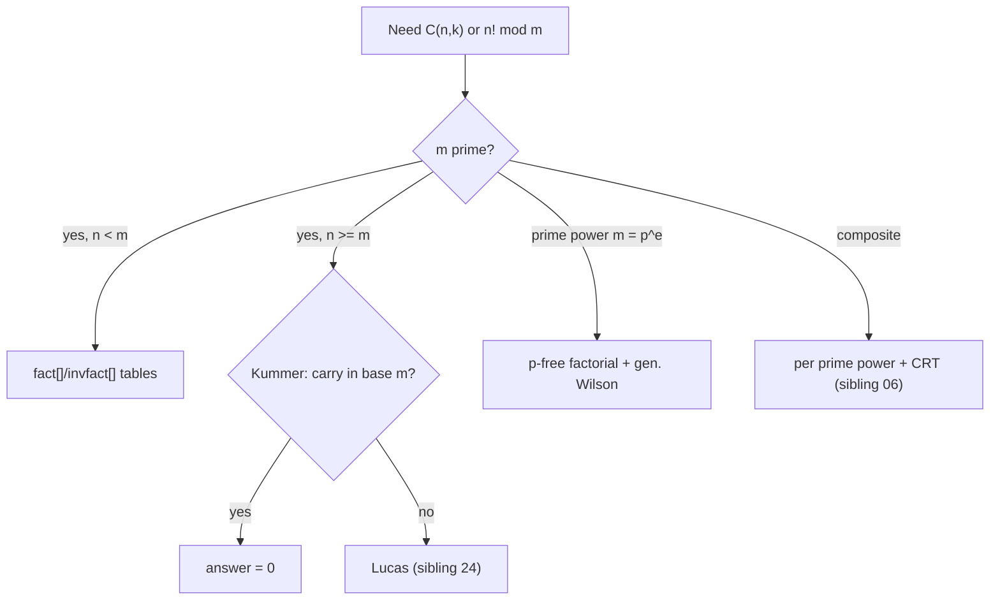

# Factorial modulo a Prime — Middle Level

> **Focus:** the *why* and *when* behind factorial-mod-p. Wilson's theorem (`(p-1)! ≡ -1`), Legendre's formula for the exponent of `p` in `n!`, the reason `n! ≡ 0 (mod p)` for `n ≥ p`, and the **`p`-free factorial** — the factorial with all factors of `p` removed — which is the bridge to computing `C(n, k)` when `n ≥ p` (Lucas) and modulo a prime power.

---

## Table of Contents

1. [Introduction](#introduction)
2. [Deeper Concepts](#deeper-concepts)
3. [Wilson's Theorem](#wilsons-theorem)
4. [Legendre's Formula](#legendres-formula)
5. [The `p`-Free Factorial](#the-p-free-factorial)
6. [Comparison with Alternatives](#comparison-with-alternatives)
7. [Advanced Patterns](#advanced-patterns)
8. [Code Examples](#code-examples)
9. [Error Handling](#error-handling)
10. [Performance Analysis](#performance-analysis)
11. [Best Practices](#best-practices)
12. [Visual Animation](#visual-animation)
13. [Summary](#summary)

---

## Introduction

At junior level the message was operational: build `fact[]`, build `invfact[]` from one inverse via a backward recurrence, and read off `C(n, k)`. At middle level you answer the *why* questions that decide whether the method even applies:

- **Why** is `n! ≡ 0 (mod p)` for `n ≥ p`, and what do you do then?
- **Wilson's theorem**: why is `(p-1)! ≡ -1 (mod p)`, and how does it give a clean self-check and the residue of `(p-1)!`?
- **Legendre's formula**: exactly how many times does `p` divide `n!`? This tells you when `C(n, k) mod p` is zero and is the first step toward the prime-power case.
- **Kummer's theorem**: the exponent of `p` in `C(n, k)` equals the number of carries when adding `k` and `n-k` in base `p` — a surprising bridge between arithmetic and combinatorics.
- The **`p`-free factorial** `(n!)_p` — `n!` with every factor of `p` stripped — which lets you compute `C(n, k) mod p` even when `n ≥ p`, and is the building block for `mod p^e`.

These ideas separate "I can call `binom()`" from "I know when `binom()` is wrong and what to use instead."

---

## Deeper Concepts

### Why `n! ≡ 0 (mod p)` for `n ≥ p`

`n! = 1·2·⋯·n`. As soon as `n ≥ p`, the product includes the factor `p`, so `p | n!`, hence `n! ≡ 0 (mod p)`. More precisely, the *number of times* `p` divides `n!` is given by Legendre's formula (below); for `n ≥ p` that count is at least 1, so the residue is exactly `0`.

The consequence for the table method: `fact[n] = 0` for `n ≥ p`, and `0` has no modular inverse, so `invfact[n]` is undefined. The whole `fact[]`/`invfact[]` machinery is valid **only for `n < p`**. With `p = 10^9 + 7` this is rarely a constraint, but with a small prime (`p = 7`, `n = 100`) it fails completely — and you reach for the `p`-free factorial and Lucas' theorem.

### The factorial recurrence as a homomorphism

The forward recurrence `fact[i] = fact[i-1]·i mod p` and the backward inverse recurrence `invfact[i-1] = invfact[i]·i mod p` are two sides of the same coin. Multiplication mod `p` is associative and reduction is a ring homomorphism, so you may reduce after each step without changing the result. The backward recurrence works because `(i-1)! = i!/i` and inverses respect products: `(xy)^(-1) = x^(-1) y^(-1)`.

### What "removing factors of `p`" means

Define `(n!)_p` (the **`p`-free factorial**) as the product of all integers in `1..n` that are **not** divisible by `p`, taken mod `p` (or mod `p^e`). For example with `p = 3`, `n = 7`:

```
7! = 1·2·3·4·5·6·7.  Remove the multiples of 3 (namely 3 and 6):
(7!)_3 = 1·2·4·5·7 = 280 ≡ 1 (mod 3).
```

This is the piece of `n!` that survives modulo `p` after the `p^(v_p(n!))` part is factored out. It is well-defined and invertible mod `p`, which is exactly why it rescues the `n ≥ p` case.

---

## Wilson's Theorem

### Statement

> **Wilson's theorem:** for a prime `p`, `(p-1)! ≡ -1 (mod p)`. Conversely, if `(n-1)! ≡ -1 (mod n)` then `n` is prime.

### Why it is true (pairing argument)

Work in the group of nonzero residues `{1, 2, …, p-1}` mod `p`. Every element `a` has a unique inverse `a^(-1)` in this set. Pair each `a` with its inverse. Most elements pair off with a *different* partner, and each such pair multiplies to `1`. The only elements that are their **own** inverse satisfy `a² ≡ 1`, i.e. `a ≡ ±1`, namely `a = 1` and `a = p-1`. So the product `(p-1)! = 1·2·⋯·(p-1)` collapses: all the off-diagonal pairs contribute `1`, leaving just `1 · (p-1) ≡ -1`. Hence `(p-1)! ≡ -1 (mod p)`. (The full proof is in `professional.md`.)

### Worked examples

```
p = 5:  4! = 24 = 25 - 1 ≡ -1 ≡ 4 (mod 5)
p = 7:  6! = 720 = 7·103 - 1 ≡ -1 ≡ 6 (mod 7)
p = 11: 10! = 3628800 ≡ -1 ≡ 10 (mod 11)
```

### Practical uses

- **Self-check.** If you build `fact[]` up to `p-1`, then `fact[p-1]` *must* equal `p-1`. A mismatch means a bug in your factorial loop or modulus.
- **A factor of `(p-1)!`.** Wilson tells you the residue of a "complete block" of residues `1..p-1` — exactly what shows up when you split `n!` into blocks of length `p` for the `p`-free factorial.
- **Block sign in `(n!)_p`.** Each full block `1·2·⋯·(p-1)` (skipping the multiple of `p`) contributes `(p-1)! ≡ -1` mod `p`. So the `p`-free factorial picks up a sign `(-1)^(number of full blocks)` — Wilson is the reason that sign appears.
- **A (slow) primality test.** The converse gives a primality test, but it needs `(n-1)!` — `O(n)` multiplies — so it is impractical compared to Miller-Rabin (sibling `09`).

---

## Legendre's Formula

### Statement

> The exponent of a prime `p` in `n!` (written `v_p(n!)`) is
> ```
> v_p(n!) = ⌊n/p⌋ + ⌊n/p²⌋ + ⌊n/p³⌋ + ⋯ = Σ_{i≥1} ⌊n/p^i⌋.
> ```

The sum is finite: once `p^i > n`, every term is `0`.

### Intuition

Count how many integers in `1..n` are divisible by `p` — that is `⌊n/p⌋`, and each contributes (at least) one factor of `p`. Then count those divisible by `p²` — that is `⌊n/p²⌋`, each contributing an *extra* factor. And so on. Summing all the layers gives the total exponent.

### Worked example

`v_2(10!)`:

```
⌊10/2⌋ + ⌊10/4⌋ + ⌊10/8⌋ + ⌊10/16⌋ = 5 + 2 + 1 + 0 = 8.
```

Indeed `10! = 3628800 = 2^8 · 14175`, so `2^8` divides it exactly. Check `v_5(10!) = ⌊10/5⌋ + ⌊10/25⌋ = 2 + 0 = 2`, and `3628800 = 5^2 · 145152` ✓.

### The digit-sum form

There is an elegant equivalent: if `s_p(n)` is the sum of the base-`p` digits of `n`, then

```
v_p(n!) = (n - s_p(n)) / (p - 1).
```

For `n = 10`, `p = 2`: binary of 10 is `1010`, digit sum `s_2(10) = 2`, so `v_2(10!) = (10 - 2)/(2-1) = 8` ✓. This form is `O(log n)` and is the key to Kummer's theorem.

### When is `C(n, k) mod p` zero?

`C(n, k) mod p = 0` exactly when `v_p(C(n, k)) > 0`, i.e. when

```
v_p(n!) > v_p(k!) + v_p((n-k)!).
```

By Kummer's theorem (next), this happens iff there is at least one **carry** when adding `k` and `n-k` in base `p`. This is how Lucas' theorem (sibling `24`) decides zero entries.

### Kummer's theorem (carries)

> **Kummer's theorem:** the exponent of `p` in `C(n, k)` equals the number of **carries** when adding `k` and `(n-k)` in base `p`.

Using the digit-sum form of Legendre:

```
v_p(C(n,k)) = v_p(n!) − v_p(k!) − v_p((n-k)!)
            = [ s_p(k) + s_p(n-k) − s_p(n) ] / (p - 1),
```

and the bracketed quantity, divided by `p-1`, is exactly the number of carries in the base-`p` addition `k + (n-k) = n`. So `C(n, k)` is divisible by `p` iff that addition carries at least once. Example: `n = 5`, `k = 2`, `p = 2`. In binary, `2 = 10` and `3 = 11`; adding `10 + 11 = 101 = 5` carries once, so `2 | C(5,2) = 10` ✓.

### Two more Kummer examples

- `C(6, 3) mod 5`: `k = 3 = (3)_5`, `n-k = 3 = (3)_5`; `3 + 3 = 6 = (1,1)_5` carries once, so `5 | C(6,3) = 20` ✓ (`20 = 5·4`).
- `C(6, 1) mod 5`: `1 + 5 = (0,1)_5 + (1,0)_5 = (1,1)_5`, no carry, so `5 ∤ C(6,1) = 6` ✓.

The practical upshot: to decide whether `C(n, k) mod p` is zero you never need the value — just add `k` and `n-k` in base `p` and look for a carry, an `O(log_p n)` test. This is exactly how Lucas' theorem (sibling `24`) prunes zero entries before doing any multiplication.

---

## The `p`-Free Factorial

### Definition and recurrence

Write `n!` by separating the multiples of `p`:

```
n! = (product of non-multiples of p in 1..n) × (product of multiples of p in 1..n)
   = (n!)_p × p^{⌊n/p⌋} × (⌊n/p⌋)!
```

because the multiples of `p` are `p, 2p, …, ⌊n/p⌋·p`, whose product is `p^{⌊n/p⌋} · (⌊n/p⌋)!`. This gives a **recursive** way to peel off all factors of `p`:

```
(n!)_p  is the product of {i in 1..n : p ∤ i}  mod p,
and      n! = p^{v_p(n!)} · [ (n!)_p · (⌊n/p⌋!)_p · (⌊n/p²⌋!)_p · ⋯ ]   (the bracket is invertible mod p).
```

The product of `(⌊n/p^i⌋!)_p` over all `i` is the `p`-free part of `n!` — invertible mod `p`. This is precisely what you invert to compute `C(n, k) mod p` when `n ≥ p`.

### Worked `p`-free factorial

Take `p = 3`, `n = 7`. Non-multiples of 3 in `1..7`: `1, 2, 4, 5, 7`. So `(7!)_3 = 1·2·4·5·7 = 280 ≡ 1 (mod 3)`. The multiples of 3 are `3, 6 = 3·1, 3·2`, contributing `3^2 · 2! = 9·2 = 18`. Check: `7! = 5040 = 18 · 280` ✓, and `v_3(7!) = ⌊7/3⌋ + ⌊7/9⌋ = 2 + 0 = 2`, matching the `3^2`.

### Why this rescues `n ≥ p`

For `C(n, k) mod p` with `n ≥ p`, naive `fact[n] = 0` fails. Instead compute `v_p(C(n,k))` by Legendre/Kummer; if it is `> 0` the answer is `0`. Otherwise the answer is the ratio of `p`-free factorials, each invertible mod `p`. Lucas' theorem (sibling `24`) packages this as a digit-by-digit product of small binomials. For `mod p^e`, you keep more of the structure (generalized Wilson — see `professional.md`).

---

## Applications of the Factorial Tables

The same `fact[]`/`invfact[]` tables that give `C(n, k)` power a whole family of combinatorial counts mod `p`. Each is just a re-arrangement of factorials, so once the tables exist every formula below is `O(1)` (or `O(terms)`).

### Multinomial coefficients

The number of ways to partition `n` items into groups of sizes `k_1, …, k_r` (with `Σ k_i = n`) is

```
C(n; k_1, …, k_r) = n! / (k_1! k_2! ⋯ k_r!) ≡ fact[n] · ∏_i invfact[k_i]  (mod p).
```

For two groups this is the ordinary binomial. The cost is `O(r)` multiplies per query.

### Catalan numbers

The `n`-th Catalan number `Cat(n) = C(2n, n) / (n + 1)` counts balanced parentheses, binary trees, and monotone lattice paths (sibling `25-catalan-numbers`). Mod `p`:

```
Cat(n) ≡ fact[2n] · invfact[n] · invfact[n] · inv(n + 1)  (mod p),
```

where `inv(n+1) = pow(n+1, p-2, p)` (or `invfact[n+1]·fact[n]`). It needs the table built to at least `2n`.

### Stars and bars

The number of ways to place `n` identical balls into `k` distinct boxes is `C(n + k - 1, k - 1)` (sibling `28-stars-and-bars`) — again a single binomial lookup once the table reaches `n + k - 1`.

### Pascal's recurrence as a cross-check

The identity `C(n, k) = C(n-1, k-1) + C(n-1, k)` holds mod `p` and is the strongest end-to-end test of the tables: pick random `n, k` and verify the recurrence. A failure localizes the bug to the factorial loop, the inverse loop, or the index arithmetic.

---

## Comparison with Alternatives

### Methods to compute `C(n, k) mod m`

| Method | Modulus | Constraint | Precompute | Per query |
|--------|---------|------------|------------|-----------|
| `fact[]`/`invfact[]` tables | prime `p` | `n < p` | `O(N)` | `O(1)` |
| Lucas' theorem | prime `p` | any `n` | `O(p)` (tables to `p-1`) | `O(log_p n)` |
| `p`-free factorial (Andrew Granville) | prime power `p^e` | any `n` | `O(p^e)` | `O(e · log_p n)` |
| Pascal's triangle | any | small `n` | `O(n²)` | `O(1)` |
| CRT over prime-power factors | composite `m` | any `n` | per factor | combine via CRT (sibling `06`) |

**Choose the table method** when `m = p` is a large prime and `n < p` (the common case). **Choose Lucas** when `p` is small and `n ≥ p`. **Choose the `p`-free / generalized-Wilson approach** for prime-power moduli. **Combine via CRT** for general composite `m`.

### Building `invfact`: backward recurrence vs alternatives

| Approach | Cost for table to `N` | Notes |
|----------|----------------------|-------|
| One inverse + backward recurrence | `O(N + log p)` | The standard; invert only `fact[N]`. |
| Invert each `fact[i]` separately | `O(N log p)` | Correct but `log p`× slower. |
| Linear inverses `inv[i]` then prefix-mult | `O(N)` | `inv[i] = -(p/i)·inv[p mod i]`; also gives single-number inverses. |

The backward recurrence is the simplest `O(N)` method when you only need inverse *factorials*; the linear-inverse recurrence is preferred when you also need inverses of arbitrary `1..N`.

---

## Advanced Patterns

### Pattern: Legendre exponent and zero test for `C(n, k) mod p`

```python
def vp_factorial(n, p):
    """Exponent of p in n! via Legendre's formula, O(log_p n)."""
    e = 0
    while n:
        n //= p
        e += n
    return e


def binom_is_zero_mod_p(n, k, p):
    """True if C(n, k) ≡ 0 (mod p) — equivalently a carry occurs in base p."""
    return vp_factorial(n, p) > vp_factorial(k, p) + vp_factorial(n - k, p)
```

### Pattern: Kummer carry count

```python
def kummer_carries(k, nk, p):
    """Number of carries adding k and nk in base p = v_p(C(k+nk, k))."""
    carries = carry = 0
    while k or nk or carry:
        s = (k % p) + (nk % p) + carry
        carry = 1 if s >= p else 0
        carries += carry
        k //= p
        nk //= p
    return carries
```

### Pattern: `p`-free factorial mod `p`

```python
def factorial_p_free(n, p):
    """Product of i in 1..n with p ∤ i, mod p (one block, no recursion)."""
    res = 1
    for i in range(1, n + 1):
        if i % p:
            res = res * i % p
    return res
```



---

## Code Examples

### Wilson's theorem check + Legendre's formula

#### Go

```go
package main

import "fmt"

// vpFactorial returns the exponent of prime p in n! (Legendre), O(log_p n).
func vpFactorial(n, p int64) int64 {
	var e int64
	for n > 0 {
		n /= p
		e += n
	}
	return e
}

// factorialMod returns n! mod p directly (0 if n >= p), for small checks.
func factorialMod(n, p int64) int64 {
	if n >= p {
		return 0
	}
	r := int64(1)
	for i := int64(2); i <= n; i++ {
		r = r * i % p
	}
	return r
}

func main() {
	for _, p := range []int64{5, 7, 11, 13} {
		w := factorialMod(p-1, p) // Wilson: (p-1)! ≡ -1 ≡ p-1
		fmt.Printf("(%d-1)! mod %d = %d  (expect %d)\n", p, p, w, p-1)
	}
	fmt.Println(vpFactorial(10, 2)) // 8
	fmt.Println(vpFactorial(10, 5)) // 2
	fmt.Println(vpFactorial(100, 3)) // 48
}
```

#### Java

```java
public class WilsonLegendre {
    static long vpFactorial(long n, long p) {
        long e = 0;
        while (n > 0) { n /= p; e += n; }
        return e;
    }

    static long factorialMod(long n, long p) {
        if (n >= p) return 0;
        long r = 1;
        for (long i = 2; i <= n; i++) r = r * i % p;
        return r;
    }

    public static void main(String[] args) {
        for (long p : new long[]{5, 7, 11, 13}) {
            long w = factorialMod(p - 1, p); // Wilson
            System.out.printf("(%d-1)! mod %d = %d (expect %d)%n", p, p, w, p - 1);
        }
        System.out.println(vpFactorial(10, 2));   // 8
        System.out.println(vpFactorial(10, 5));   // 2
        System.out.println(vpFactorial(100, 3));  // 48
    }
}
```

#### Python

```python
def vp_factorial(n, p):
    """Exponent of prime p in n! (Legendre's formula)."""
    e = 0
    while n:
        n //= p
        e += n
    return e


def factorial_mod(n, p):
    if n >= p:
        return 0
    r = 1
    for i in range(2, n + 1):
        r = r * i % p
    return r


if __name__ == "__main__":
    for p in (5, 7, 11, 13):
        w = factorial_mod(p - 1, p)  # Wilson: (p-1)! ≡ -1 ≡ p-1
        print(f"({p}-1)! mod {p} = {w} (expect {p-1})")
    print(vp_factorial(10, 2))   # 8
    print(vp_factorial(10, 5))   # 2
    print(vp_factorial(100, 3))  # 48
```

### Full table precompute reused with a Legendre zero test

#### Python

```python
MOD = 10**9 + 7


def precompute(N, p=MOD):
    fact = [1] * (N + 1)
    for i in range(1, N + 1):
        fact[i] = fact[i - 1] * i % p
    invfact = [1] * (N + 1)
    invfact[N] = pow(fact[N], p - 2, p)
    for i in range(N, 0, -1):
        invfact[i - 1] = invfact[i] * i % p
    return fact, invfact


def binom(n, k, fact, invfact, p=MOD):
    if k < 0 or k > n:
        return 0
    return fact[n] * invfact[k] % p * invfact[n - k] % p


if __name__ == "__main__":
    fact, invfact = precompute(2000)
    print(binom(2000, 1000, fact, invfact))  # huge, mod p
    print(fact[MOD - 1] if False else "skip: N < p required")
```

---

## Error Handling

| Scenario | What goes wrong | Correct approach |
|----------|-----------------|------------------|
| `n ≥ p` with table method | `fact[n] = 0`, inverse undefined | Use Lucas' theorem or `p`-free factorial |
| Wilson check fails | bug in factorial loop or wrong `p` | `fact[p-1]` must equal `p-1`; debug the loop |
| Legendre sum doesn't terminate | infinite loop when `p = 1` | guard `p ≥ 2`; `p` must be prime |
| Wrong zero test | compared `v_p(n!)` to wrong sum | zero iff `v_p(n!) > v_p(k!) + v_p((n-k)!)` |
| `p`-free factorial includes multiples of `p` | forgot the `i % p` skip | skip every `i` divisible by `p` |
| Overflow in factorial loop | product before reduction exceeds 64-bit | reduce mod `p` after each multiply |

---

## Performance Analysis

| Task | Scale | Cost |
|------|-------|------|
| Build `fact`/`invfact` to `N` | `N ≤ 10^7` | `O(N + log p)` — sub-second |
| One `C(n, k)` after precompute | any `n < p` | `O(1)` |
| Legendre `v_p(n!)` | any `n` | `O(log_p n)` |
| Kummer carry count | any `n, k` | `O(log_p n)` |
| `p`-free factorial (one block) | `n < p` | `O(n)` |
| Lucas `C(n, k) mod p` | any `n` | `O(log_p n)` with size-`p` tables |

The dominant cost is the one-time `O(N)` table build. Everything per-query is logarithmic or constant. For a range of primes (CRT for composite modulus), repeat the precompute per prime factor.

```python
import time

def benchmark_precompute(N):
    start = time.perf_counter()
    _ = precompute(N)
    return time.perf_counter() - start

# Typical: N = 10^6 builds both tables in well under 0.5s in CPython.
```

---

## Best Practices

- **Know the regime.** Table method for `n < p`; Lucas for `n ≥ p`; `p`-free/generalized-Wilson for prime powers; CRT for composites.
- **Self-check with Wilson:** `fact[p-1] ≡ p-1`; and `fact[i]·invfact[i] ≡ 1` for sampled `i`.
- **Use Legendre/Kummer to detect zero entries** before inverting anything — a carry in base `p` means `C(n, k) ≡ 0`.
- **Build `fact` forward, `invfact` backward** — the single most error-prone direction choice.
- **Reduce after every multiply**; keep all values in `[0, p)`.
- **Strip multiples of `p` correctly** in the `p`-free factorial — the `i % p` skip is the whole point.
- **Size the table to the true index ceiling.** Catalan needs `2n`; stars-and-bars needs `n + k - 1`. Building only to `n` reads out of bounds.
- **Reduce `k` to `min(k, n-k)`** in non-table methods via `C(n,k) = C(n,n-k)` — it halves the digit work in Lucas and the block work in Granville.

---

## Decision Guide

A compact rule set for picking the method, consolidating this level:



- **Is `m` prime?** If yes and `n < m`, use the tables — the common case.
- **Is `n ≥ p`?** Run the Kummer carry test first; if it carries, the answer is `0` for free. Otherwise use Lucas.
- **Is `m` a prime power?** Use the `p`-free factorial with generalized Wilson (professional level).
- **Is `m` composite?** Factor it, solve each prime power, and merge by CRT.

This single decision tree is the practical distillation of the whole topic at the middle level.

---

## Visual Animation

> See [`animation.html`](./animation.html) for an interactive view.
>
> The middle-level animation highlights:
> - The forward fill of `fact[]` and the **single** green inverse, then the backward fill of `invfact[]`.
> - **Legendre's formula** as a stack of floor divisions `⌊n/p⌋, ⌊n/p²⌋, …` summing to `v_p(n!)`.
> - Editable `n, p` so you can watch `v_p(n!)` and observe `fact[p-1] ≡ p-1` (Wilson) when `n` reaches `p-1`.
> - The boundary where `n` crosses `p` and `fact[n]` becomes `0`.

---

## Summary

The factorial-mod-p toolkit rests on three theorems. **`n! ≡ 0 (mod p)` for `n ≥ p`** because `n!` then contains the factor `p` — so the `fact[]`/`invfact[]` table method is valid only for `n < p`. **Wilson's theorem** (`(p-1)! ≡ -1 mod p`) comes from pairing each residue with its inverse, leaving only the self-inverse `±1`; it gives a free self-check (`fact[p-1] ≡ p-1`) and the sign each full block contributes to the `p`-free factorial. **Legendre's formula** (`v_p(n!) = Σ ⌊n/p^i⌋ = (n - s_p(n))/(p-1)`) gives the exact exponent of `p` in `n!`, and **Kummer's theorem** turns the exponent of `p` in `C(n, k)` into the number of carries when adding `k` and `n-k` in base `p` — so `C(n, k) ≡ 0 (mod p)` iff that addition carries. The **`p`-free factorial** `(n!)_p` — `n!` with all multiples of `p` removed — is invertible mod `p` and is the structural bridge to Lucas' theorem (`n ≥ p`, sibling `24`) and to the prime-power case (generalized Wilson, `professional.md`). Master these and you know not just how to compute `C(n, k) mod p`, but exactly when each method applies and when the answer is forced to zero.

---

Next step: continue to [`senior.md`](./senior.md) for high-throughput `C(n, k)` services, precompute sizing, and the prime-power case overview.
