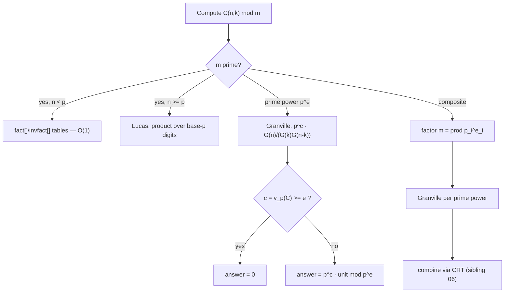

# Factorial modulo a Prime (and Prime Power) — Mathematical Foundations

## Table of Contents
1. [Formal Definitions](#1-formal-definitions)
2. [Correctness of the Factorial / Inverse-Factorial Tables](#2-correctness-of-the-tables)
3. [Wilson's Theorem (Proof)](#3-wilsons-theorem)
4. [Legendre's Formula (Proof)](#4-legendres-formula)
5. [Kummer's Theorem (Proof)](#5-kummers-theorem)
6. [The `p`-Free Factorial and `n! ≡ 0 (mod p)`](#6-the-p-free-factorial)
7. [The Generalized Wilson Theorem for `p^e`](#7-generalized-wilson)
8. [Granville's Algorithm for `C(n, k) mod p^e`](#8-granvilles-algorithm)
9. [Lucas' Theorem as a Special Case](#9-lucas-theorem-as-a-special-case)
10. [Correctness Invariants and Loop Reasoning](#10-correctness-invariants)
11. [Complexity Analysis](#11-complexity-analysis)
12. [Comparison with Alternatives](#12-comparison-with-alternatives)
13. [Summary](#13-summary)

---

## 1. Formal Definitions

Throughout, `p` is a prime, `e ≥ 1`, and we work in `ℤ/p^eℤ`. We write `v_p(n)` for the `p`-adic valuation (the exponent of `p` in the factorization of `n`), `s_p(n)` for the sum of the base-`p` digits of `n`, and `C(n, k) = n!/(k!(n-k)!)` for the binomial coefficient.

**Definition 1.1 (Factorial residue).** For `0 ≤ n`, `n! mod p^e` is the residue class of `n! = ∏_{i=1}^{n} i`. We use `0! = 1` (the empty product).

The empty-product convention `0! = 1` is not arbitrary: it is forced by the recurrence `n! = n·(n-1)!` at `n = 1` (giving `1! = 1·0!`, so `0! = 1`) and by the requirement that `C(n, 0) = n!/(0!·n!) = 1`. Every formula in this document depends on it.

**Definition 1.2 (Factorial table).** `fact[i] := i! mod p` and `invfact[i] := (i! mod p)^{-1} mod p`, the latter defined only when `gcd(i!, p) = 1`, i.e. when `i < p`.

**Definition 1.3 (`p`-adic valuation of a factorial).** `v_p(n!) = Σ_{i=1}^{n} v_p(i)`, the total number of factors of `p` across `1, …, n`.

The valuation is additive over products — `v_p(ab) = v_p(a) + v_p(b)` — which is exactly why `v_p(n!)` sums the per-term valuations and why `v_p(C(n,k)) = v_p(n!) - v_p(k!) - v_p((n-k)!)` (additivity over the quotient). Legendre's formula (Section 4) is just a closed form for this sum.

**Definition 1.4 (`p`-free factorial).** `(n!)_p := ∏_{1 ≤ i ≤ n, \, p ∤ i} i`, the product of the integers in `1..n` not divisible by `p`. We consider it mod `p` or mod `p^e` as needed. By construction `gcd((n!)_p, p) = 1`, so it is a unit mod `p^e`.

The `p`-free factorial is the "invertible remnant" of `n!` after the obstruction (the `p`-power) is removed. It is the precise object that makes the `n ≥ p` and prime-power cases tractable: a zero divisor `n!` is replaced by a unit `(n!)_p` plus a separately tracked exponent `v_p(n!)`.

**Definition 1.5 (Units mod `p^e`).** `(ℤ/p^eℤ)^* = {a : gcd(a, p) = 1}` is the multiplicative group of units, of order `φ(p^e) = p^{e-1}(p-1)` (sibling `05-fermat-euler`).

**Definition 1.5a (Binomial coefficient as a field element).** For `0 ≤ k ≤ n < p`, define `[C(n,k)]_p := n! · (k!)^{-1} · ((n-k)!)^{-1} ∈ ℤ/pℤ`, the inverses taken in the field. Proposition 2.6 shows `[C(n,k)]_p = C(n,k) mod p`, so the notation is unambiguous.

**Proposition 1.5b (Symmetry).** `C(n, k) = C(n, n-k)`, hence `[C(n,k)]_p = [C(n,n-k)]_p`. *Proof.* The factorial formula is symmetric in `k` and `n-k`. ∎ Implementations exploit this to reduce `k` to `min(k, n-k)` in non-table methods, halving the work.

**Lemma 1.6 (Factorization of `n!` along `p`).**
```
n! = p^{⌊n/p⌋} · (⌊n/p⌋)! · (n!)_p.
```
*Proof.* Split `∏_{i=1}^{n} i` into the multiples of `p` and the non-multiples. The multiples are `p, 2p, …, ⌊n/p⌋·p`, with product `p^{⌊n/p⌋} · ∏_{j=1}^{⌊n/p⌋} j = p^{⌊n/p⌋}·(⌊n/p⌋)!`. The non-multiples have product `(n!)_p` by Definition 1.4. ∎

Lemma 1.6 is the recursive engine behind both Legendre's formula and Granville's algorithm: it peels one layer of `p` off the factorial and reduces `n` to `⌊n/p⌋`.

**Worked Lemma 1.6.** `n = 7, p = 2`: `7! = 5040`. The multiples of 2 in `1..7` are `2,4,6`, product `2^3·(1·2·3) = 8·6 = 48`; here `⌊7/2⌋ = 3` so `2^{⌊7/2⌋}·(⌊7/2⌋)! = 2^3·3! = 8·6 = 48` ✓. The non-multiples are `1,3,5,7`, product `(7!)_2 = 105`. Check: `48·105 = 5040 = 7!` ✓. Lemma 1.6 thus decomposes any factorial into a clean `p`-power times a smaller factorial times a `p`-free residue, which is the inductive step every theorem below leans on.

**Notation summary.** We use `[P]` for the Iverson bracket (`1` if `P` else `0`), floor for the floor function, and identify a residue with its representative in `{0, …, p^e - 1}`. "Unit mod `m`" means coprime to `m`, hence invertible. Sibling cross-references point to other topics in `19-number-theory`.

**Second worked Lemma 1.6.** `n = 9, p = 3`: multiples of 3 in `1..9` are `3, 6, 9`, product `3^3 · (1·2·3) = 27·6 = 162`; with floor(9/3) = 3, this is `3^3 · 3! = 162`. Non-multiples `1, 2, 4, 5, 7, 8` give the `p`-free factorial `1·2·4·5·7·8 = 2240`. Check: `162 · 2240 = 362880 = 9!`. The decomposition is unique because the multiples and non-multiples of `p` partition `1..n` into disjoint sets, so the two products are determined.

---

## 2. Correctness of the Tables

**Theorem 2.1 (Forward factorial recurrence).** The loop `fact[0] = 1`, `fact[i] = fact[i-1]·i mod p` computes `fact[i] = i! mod p` for all `0 ≤ i ≤ N`.

*Proof.* Induction on `i`. Base: `fact[0] = 1 = 0! mod p`. Step: assume `fact[i-1] = (i-1)! mod p`. Since reduction mod `p` is a ring homomorphism, `fact[i] = fact[i-1]·i mod p = ((i-1)!·i) mod p = i! mod p`. ∎

**Theorem 2.2 (Backward inverse-factorial recurrence).** For `N < p`, the assignments `invfact[N] = (fact[N])^{-1} mod p` and `invfact[i-1] = invfact[i]·i mod p` (for `i = N, …, 1`) compute `invfact[i] = (i!)^{-1} mod p` for all `0 ≤ i ≤ N`.

*Proof.* Since `N < p`, every `i!` for `i ≤ N` is a product of factors in `1..N`, all coprime to `p`, so `gcd(i!, p) = 1` and the inverse exists (sibling `05-fermat-euler`, Prop. 1.3). Base: `invfact[N] = (N!)^{-1}` by the Fermat inverse `a^{p-2} ≡ a^{-1} (mod p)`. Step: assume `invfact[i] = (i!)^{-1}`. In the units group, `((i-1)!)^{-1} = (i! / i)^{-1} = (i!)^{-1}·i`, because `(i-1)! · i = i!`. Hence `invfact[i-1] = invfact[i]·i mod p = (i!)^{-1}·i = ((i-1)!)^{-1} mod p`. ∎

**Theorem 2.3 (Binomial formula).** For `0 ≤ k ≤ n < p`,
```
C(n, k) ≡ fact[n] · invfact[k] · invfact[n-k]  (mod p).
```
*Proof.* `C(n, k) = n! · (k!)^{-1} · ((n-k)!)^{-1}` in the field `ℤ/pℤ` (all three factorials are units since `n < p`). Substitute Theorems 2.1–2.2. The integer `C(n, k)` reduces to this product because the rational `n!/(k!(n-k)!)` is in fact an integer and reduction mod `p` of an integer equals the field operation when denominators are units. ∎

**Remark 2.4 (Why `n < p` is required).** If `n ≥ p`, then `p | n!` (Lemma 1.6 with `⌊n/p⌋ ≥ 1`), so `fact[n] = 0`, which is not a unit and has no inverse. Theorem 2.2's hypothesis `N < p` fails, and the formula of Theorem 2.3 is invalid. This is the precise boundary that forces Lucas' theorem or the `p`-free factorial.

**Proposition 2.5 (Integrality of `C(n, k)`).** `C(n, k) = n!/(k!(n-k)!)` is always an integer, so reducing it mod `p` is well-defined even though the formula has denominators.

*Proof.* `C(n, k)` counts `k`-subsets of an `n`-set, hence is a non-negative integer. Algebraically, the identity `C(n, k) = C(n-1, k-1) + C(n-1, k)` with integer base cases `C(n, 0) = C(n, n) = 1` shows it is an integer by induction. ∎ This is why Theorem 2.3 is legitimate: we reduce an *integer* mod `p`, and when `n < p` the field computation `fact[n]·invfact[k]·invfact[n-k]` recovers exactly that integer's residue because the denominators are units.

**Proposition 2.6 (Equivalence of field and integer reduction).** For `0 ≤ k ≤ n < p`, the field element `n!·(k!)^{-1}·((n-k)!)^{-1} ∈ ℤ/pℤ` equals `C(n, k) mod p`.

*Proof.* Let `D = k!(n-k)!`, a unit mod `p` (product of factors `< p`). The integer `C(n,k)` satisfies `C(n,k)·D = n!`. Reducing mod `p`: `(C(n,k) mod p)·D ≡ n! (mod p)`. Multiply both sides by `D^{-1}`: `C(n,k) mod p ≡ n!·D^{-1} = n!·(k!)^{-1}((n-k)!)^{-1}`. ∎ This closes the gap between "the combinatorial integer" and "the field formula," which is occasionally glossed over.

**Worked correctness check.** `n = 6, k = 2, p = 7` (so `n < p`). `fact = [1,1,2,6,24≡3,120≡1,720≡6]`. `invfact[6] = 6^{-1} ≡ 6 (mod 7)` (since `6·6 = 36 ≡ 1`). Backward: `invfact[5] = 6·6 = 36 ≡ 1`, `invfact[4] = 1·5 = 5`, `invfact[3] = 5·4 = 20 ≡ 6`, `invfact[2] = 6·3 = 18 ≡ 4`, `invfact[1] = 4·2 = 8 ≡ 1`, `invfact[0] = 1`. Then `C(6,2) ≡ fact[6]·invfact[2]·invfact[4] = 6·4·5 = 120 ≡ 1 (mod 7)`. Check: `C(6,2) = 15 ≡ 1 (mod 7)` ✓. Note `fact[i]·invfact[i] ≡ 1` for each `i` (e.g. `fact[4]·invfact[4] = 3·5 = 15 ≡ 1`), confirming Invariant I2.

---

## 3. Wilson's Theorem

**Theorem 3.1 (Wilson).** For a prime `p`, `(p-1)! ≡ -1 (mod p)`.

*Proof (inverse pairing).* Consider the units `{1, 2, …, p-1} = (ℤ/pℤ)^*`. Each `a` has a unique inverse `a^{-1}` in this set (the group is a field's multiplicative group). Partition the set by pairing `a` with `a^{-1}`. A pair is a *singleton* exactly when `a = a^{-1}`, i.e. `a^2 ≡ 1 (mod p)`, i.e. `(a-1)(a+1) ≡ 0`, i.e. `a ≡ 1` or `a ≡ -1 ≡ p-1` (since `p` is prime, `ℤ/pℤ` has no zero divisors). So the only self-paired elements are `1` and `p-1`; every other element pairs with a *distinct* partner, and each such two-element pair multiplies to `a·a^{-1} = 1`. Therefore
```
(p-1)! = ∏_{a=1}^{p-1} a = 1 · (p-1) · ∏_{distinct pairs} 1 = 1 · (p-1) ≡ -1 (mod p). ∎
```

**Theorem 3.2 (Converse).** If `(n-1)! ≡ -1 (mod n)` for `n > 1`, then `n` is prime.

*Proof.* Suppose `n` is composite with a proper divisor `d`, `1 < d < n`. Then `d | (n-1)!` (since `d` appears as a factor in `1·2·⋯·(n-1)`), so `(n-1)! ≡ 0 (mod d)`. But `(n-1)! ≡ -1 (mod n)` implies `(n-1)! ≡ -1 (mod d)`, forcing `0 ≡ -1 (mod d)`, i.e. `d | 1`, contradiction. (The case `n = 4` is checked directly: `3! = 6 ≡ 2 ≢ -1 (mod 4)`.) ∎

**Corollary 3.3 (Table self-check).** Building `fact[]` to `p-1` yields `fact[p-1] = p - 1`; any other value signals a bug. ∎

**Remark 3.3a.** The pairing proof of Wilson and the inverse-factorial backward recurrence (Theorem 2.2) are the same algebraic move — "multiply by `i` to step the inverse" — applied to different ends. Both rest on the fact that in a field every nonzero element has a unique inverse, so products telescope: Wilson telescopes the *full* product to `±1`, the recurrence telescopes the inverse *one index at a time*. Recognizing the shared structure is what lets a reader hold the whole topic as one idea.

**Worked example.** `p = 7`: pair `2↔4` (`2·4=8≡1`), `3↔5` (`3·5=15≡1`); self-inverse `1` and `6`. So `6! = 1·6·(2·4)·(3·5) ≡ 1·6·1·1 = 6 ≡ -1 (mod 7)` ✓.

**Worked example 2.** `p = 11`: the off-diagonal pairs are `2↔6` (`12≡1`), `3↔4` (`12≡1`), `5↔9` (`45≡1`), `7↔8` (`56≡1`); self-inverse `1` and `10`. Hence `10! ≡ 1·10·1^4 = 10 ≡ -1 (mod 11)` ✓. The pairing structure also explains *why* there are always exactly `(p-3)/2` off-diagonal pairs (here `4`): the `p-1` units minus the two self-inverse elements, halved.

**Worked example 3 (the converse in action).** For `n = 9` (composite), `(n-1)! = 8! = 40320`, and `40320 mod 9 = 40320 - 4480·9 = 40320 - 40320 = 0 ≢ -1 (mod 9)`. So Theorem 3.2 correctly reports `9` as composite. For `n = 13` (prime), `12! ≡ -1 ≡ 12 (mod 13)` — the test passes. The converse is a *correct* primality test, just `O(n)` (too slow versus Miller-Rabin, sibling `09`), included to show Wilson characterizes primality exactly, not merely necessarily.

**Corollary 3.4 (Half-factorial identity).** A consequence used in some `C(n,k)` derivations: for odd `p`, `((p-1)/2)!^2 ≡ (-1)^{(p+1)/2} (mod p)`. *Proof sketch.* Pair `j` with `p - j` in `(p-1)!`: each pair gives `j(p-j) ≡ -j^2`, and there are `(p-1)/2` pairs, so `(p-1)! ≡ (-1)^{(p-1)/2} ((p-1)/2)!^2`. Combined with Wilson `(p-1)! ≡ -1`, solve for `((p-1)/2)!^2`. ∎ This links Wilson to quadratic residues (sibling `13-tonelli-shanks`).

---

## 4. Legendre's Formula

**Theorem 4.1 (Legendre).** For a prime `p` and integer `n ≥ 0`,
```
v_p(n!) = Σ_{i=1}^{∞} ⌊n / p^i⌋,
```
a finite sum (terms vanish once `p^i > n`).

*Proof (counting multiples).* `v_p(n!) = Σ_{j=1}^{n} v_p(j)`. Exchange the order of counting: `v_p(j) = Σ_{i≥1} [p^i | j]` (the number of `i` with `p^i | j`). Therefore
```
v_p(n!) = Σ_{j=1}^{n} Σ_{i≥1} [p^i | j] = Σ_{i≥1} Σ_{j=1}^{n} [p^i | j] = Σ_{i≥1} ⌊n/p^i⌋,
```
since the count of multiples of `p^i` in `1..n` is exactly `⌊n/p^i⌋`. ∎

**Theorem 4.2 (Digit-sum form).**
```
v_p(n!) = (n - s_p(n)) / (p - 1).
```

*Proof.* Write `n = Σ_{j=0}^{t} d_j p^j` in base `p` (`0 ≤ d_j < p`). Then `⌊n/p^i⌋ = Σ_{j≥i} d_j p^{j-i}`. Summing over `i ≥ 1`:
```
Σ_{i≥1} ⌊n/p^i⌋ = Σ_{i≥1} Σ_{j≥i} d_j p^{j-i} = Σ_{j≥1} d_j Σ_{i=1}^{j} p^{j-i} = Σ_{j≥1} d_j (p^{j-1}+⋯+1)
              = Σ_{j≥1} d_j (p^j - 1)/(p - 1) = (1/(p-1)) Σ_{j≥0} d_j (p^j - 1)
              = (1/(p-1)) (Σ_j d_j p^j - Σ_j d_j) = (n - s_p(n))/(p - 1).
```
(The `j = 0` term contributes `d_0(p^0-1) = 0`, so extending the sum to `j ≥ 0` is harmless.) ∎

**Worked example.** `n = 100`, `p = 3`. Base-3 of 100 is `10201` (`81 + 18 + 1 = 100`), so `s_3(100) = 1+0+2+0+1 = 4`, giving `v_3(100!) = (100-4)/2 = 48`. Cross-check by Legendre: `⌊100/3⌋+⌊100/9⌋+⌊100/27⌋+⌊100/81⌋ = 33+11+3+1 = 48` ✓.

**Worked example 2.** `n = 20`, `p = 2`. Binary of 20 is `10100`, `s_2(20) = 2`, so `v_2(20!) = (20 - 2)/(2-1) = 18`. Legendre: `10 + 5 + 2 + 1 = 18` ✓. The digit-sum form is `O(log n)` (one base-`p` conversion) versus `O(log_p n)` floor divisions for the direct form — both fast, but the digit form is what makes Kummer's carry interpretation (Section 5) immediate.

**Corollary 4.3 (Trailing zeros of `n!` in base `b`).** The number of trailing zeros of `n!` written in base `b = ∏ p_i^{a_i}` is `min_i ⌊v_{p_i}(n!) / a_i⌋`. For decimal (`b = 10 = 2·5`), since `v_2(n!) ≥ v_5(n!)` always, the count is `v_5(n!) = ⌊n/5⌋ + ⌊n/25⌋ + ⋯`. *Proof.* A trailing zero in base `b` corresponds to a factor of `b`; the largest `t` with `b^t | n!` is the minimum over primes of `⌊v_{p_i}(n!)/a_i⌋`. ∎ Example: `100!` ends in `v_5(100!) = 20 + 4 = 24` zeros.

**Corollary 4.4 (Monotone non-decrease).** `v_p((n+1)!) ≥ v_p(n!)`, with equality iff `p ∤ (n+1)`. *Proof.* `(n+1)! = (n+1)·n!`, so `v_p((n+1)!) = v_p(n+1) + v_p(n!)`. ∎ This is the per-step view: the valuation only jumps when `n+1` crosses a multiple of `p`, by `v_p(n+1)` at a time.

---

## 5. Kummer's Theorem

**Theorem 5.1 (Kummer).** For a prime `p` and `0 ≤ k ≤ n`, the exponent `v_p(C(n, k))` equals the number of carries when adding `k` and `n - k` in base `p`.

*Proof.* By Theorem 4.2,
```
v_p(C(n,k)) = v_p(n!) - v_p(k!) - v_p((n-k)!)
            = (n - s_p(n))/(p-1) - (k - s_p(k))/(p-1) - ((n-k) - s_p(n-k))/(p-1).
```
Since `n = k + (n-k)`, the integer parts cancel: `n - k - (n-k) = 0`. Hence
```
v_p(C(n,k)) = (s_p(k) + s_p(n-k) - s_p(n)) / (p - 1).
```
Now perform the base-`p` addition `k + (n-k) = n`. Each carry out of digit position `j` reduces the digit sum: a carry replaces a positional value of `p` (contributing `p` to the local digit sum of the addends) by a single unit carried to the next position, a net loss of `p - 1` from `s_p(k) + s_p(n-k)` relative to `s_p(n)`. Summing over all positions, the total digit-sum deficit `s_p(k) + s_p(n-k) - s_p(n)` equals `(p-1) · (number of carries)`. Dividing by `p-1` gives the carry count. ∎

**Corollary 5.2 (Divisibility test).** `p | C(n, k)` iff there is at least one carry when adding `k` and `n-k` in base `p`. Equivalently (Lucas), iff some base-`p` digit of `k` exceeds the corresponding digit of `n`. ∎

**Corollary 5.2a (Maximal valuation bound).** `v_p(C(n,k)) ≤ ⌊log_p n⌋`, since the base-`p` addition `k + (n-k) = n` has at most `⌊log_p n⌋ + 1` digit positions and the top position cannot carry out (the sum is `n`, with the same number of digits). *Proof.* Each carry occurs at a distinct position below the leading one, of which there are at most `⌊log_p n⌋`. ∎ This bounds how divisible a binomial can be: e.g. no `C(n, k)` with `n < p²` is divisible by `p²` unless... precisely, `v_p ≤ 1` for `n < p²`.

**Worked example.** `n = 5`, `k = 2`, `p = 2`. Then `n - k = 3`. In binary `2 = 10`, `3 = 11`; adding `10 + 11`: bit0 `0+1=1` no carry; bit1 `1+1=0` carry 1; bit2 `0+0+1(carry)=1` no carry. One carry total. So `v_2(C(5,2)) = 1`, and indeed `C(5,2) = 10 = 2^1 · 5` ✓.

**Worked example 2 (multiple carries).** `n = 8`, `k = 4`, `p = 2`. `n - k = 4`. Binary `4 = 100`; `100 + 100 = 1000` carries once (at bit 2). So `v_2(C(8,4)) = 1`; check `C(8,4) = 70 = 2·35` ✓. Now `n = 7, k = 1, p = 2`: `1 + 6 = 0001 + 0110 = 0111`, no carry, so `v_2(C(7,1)) = 0`; indeed `C(7,1) = 7` is odd ✓. The pattern: `C(2^a, k)` is even for all `0 < k < 2^a` because adding `k` and `2^a - k` always carries into bit `a` — a one-line proof that the interior of every `2^a`-th row of Pascal's triangle is all-even.

**Corollary 5.3 (Parity of Pascal's triangle / Sierpiński).** `C(n, k)` is odd iff `k` is a "submask" of `n` in binary (`k AND n == k`), since odd means zero carries, which by Lucas (Section 9) means every binary digit of `k` is `≤` the corresponding digit of `n`. The odd entries of Pascal's triangle thus form the Sierpiński triangle — a direct visual corollary of Kummer at `p = 2`. ∎

---

## 6. The `p`-Free Factorial and `n! ≡ 0 (mod p)`

**Theorem 6.1.** `n! ≡ 0 (mod p)` iff `n ≥ p`.

This single boundary is the organizing principle of the entire topic: below it the field `ℤ/pℤ` lets factorials be inverted (the table method); at and above it the factorial becomes a zero divisor and one must work with the `p`-free part. Everything operational — the `n < p` guard, the switch to Lucas, the recursion in Granville — is downstream of Theorem 6.1.

*Proof.* By Theorem 4.1, `v_p(n!) = Σ_{i≥1} ⌊n/p^i⌋`. If `n ≥ p`, the first term `⌊n/p⌋ ≥ 1`, so `v_p(n!) ≥ 1` and `p | n!`. If `n < p`, every term `⌊n/p^i⌋ = 0`, so `v_p(n!) = 0` and `gcd(n!, p) = 1`, hence `n! ≢ 0 (mod p)`. ∎

**Theorem 6.2 (Recursive `p`-free factorization).** Iterating Lemma 1.6,
```
n! = p^{v_p(n!)} · ∏_{i≥0} (⌊n/p^i⌋ !)_p,
```
where the product is finite and each factor `(⌊n/p^i⌋!)_p` is a unit mod `p`.

*Proof.* Apply Lemma 1.6 to `n!`, then to `(⌊n/p⌋)!`, then to `(⌊n/p²⌋)!`, etc. The accumulated power of `p` is `⌊n/p⌋ + ⌊n/p²⌋ + ⋯ = v_p(n!)` by Theorem 4.1, and the residual non-multiple parts are `(n!)_p, (⌊n/p⌋!)_p, …`, each coprime to `p`. ∎

**Corollary 6.3 (`C(n, k) mod p` for any `n`).** Let `c = v_p(C(n,k))` (Kummer). If `c > 0`, then `C(n, k) ≡ 0 (mod p)`. Otherwise (`c = 0`, no carry), `C(n, k) ≡ (product of `p`-free factorials of `n`) · (inverse for `k`) · (inverse for `n-k`) (mod p)`, which is exactly Lucas' theorem expressed digit-by-digit (sibling `24-lucas-theorem`). ∎

### 6.1 Computing a single `n! mod p` when `n ≥ p`

A subtlety: `n! mod p` is `0` for `n ≥ p`, so the "interesting" quantity is the **`p`-free factorial** `(n!)_p mod p` (the factorial with the `p`-power removed). By Theorem 6.2 it equals `∏_{i≥0}(⌊n/p^i⌋!)_p mod p`, and each block factor `(⌊n/p^i⌋!)_p` is computed from Wilson:

```
(m!)_p ≡ (-1)^{⌊m/p⌋} · ((m mod p)!)   (mod p),
```

because each full block `1·2·⋯·(p-1)` (skipping the multiple of `p`) contributes `(p-1)! ≡ -1` (Wilson), and the partial block is `(m mod p)!`. There are `⌊m/p⌋` full blocks, giving the sign `(-1)^{⌊m/p⌋}`.

**Theorem 6.4 (`p`-free factorial mod `p`, closed recursion).**
```
(n!)_p ≡ ∏_{i≥0} (-1)^{⌊n/p^{i+1}⌋} · ((⌊n/p^i⌋ mod p)!)   (mod p).
```
*Proof.* Apply the block formula above to each `(⌊n/p^i⌋!)_p` in Theorem 6.2 and collect the signs. ∎

**Worked example.** `(10!)_5 mod 5`. `v_5(10!) = 2`, so `10! = 5^2 · (10!)_5`. Compute via Theorem 6.4: level 0, `m = 10`: sign `(-1)^{⌊10/5⌋} = (-1)^2 = 1`, partial `(10 mod 5)! = 0! = 1`; level 1, `m = ⌊10/5⌋ = 2`: sign `(-1)^{⌊2/5⌋} = 1`, partial `2! = 2`. Product `= 1·1·1·2 = 2`. Check: `10! = 3628800 = 25·145152`, and `145152 mod 5 = 145152 - 29030·5 = 145152 - 145150 = 2` ✓.

---

## 7. Generalized Wilson

To compute `(n!)_p mod p^e` we need the residue of one full block of `p^e` consecutive integers' `p`-free product.

**Theorem 7.1 (Generalized Wilson, Gauss).** Let `W = ∏_{1 ≤ a ≤ p^e, \, gcd(a, p) = 1} a`, the product of the units mod `p^e`. Then
```
W ≡ -1 (mod p^e)   if p is odd, or p^e ∈ {2, 4};
W ≡ +1 (mod p^e)   if p = 2 and e ≥ 3.
```

*Proof.* Pair each unit `a` with its inverse `a^{-1}` in `(ℤ/p^eℤ)^*`. As in Wilson's proof, all non-self-inverse elements cancel in pairs, leaving the product of the **self-inverse** elements (those with `a^2 ≡ 1`). The number of solutions of `x^2 ≡ 1 (mod p^e)` is: `2` for odd `p^e` and for `p^e ∈ {2, 4}` (namely `±1`), and `4` for `2^e` with `e ≥ 3` (namely `±1, 2^{e-1}±1`). For the two-solution case the product is `1·(-1) = -1`. For the four-solution case the product is `1·(-1)·(2^{e-1}-1)·(2^{e-1}+1) = -(2^{2(e-1)} - 1) ≡ -(0 - 1) = 1 (mod 2^e)` since `2^{2(e-1)} ≡ 0 (mod 2^e)` for `e ≥ 2`. ∎

**Lemma 7.1a (Square roots of 1 mod `p^e`).** The congruence `x^2 ≡ 1 (mod p^e)` has exactly `2` solutions for odd `p` and for `p^e ∈ {1, 2, 4}`, and exactly `4` solutions for `p = 2, e ≥ 3`.

*Proof.* For odd `p`, `(ℤ/p^eℤ)^*` is cyclic of even order `φ(p^e) = p^{e-1}(p-1)` (sibling `05-fermat-euler`), and a cyclic group has exactly one element of order 2, giving the two roots `±1`. For `p = 2`: `e = 1` gives only `x ≡ 1`; `e = 2` gives `±1`; for `e ≥ 3`, `(ℤ/2^eℤ)^* ≅ ℤ/2 × ℤ/2^{e-2}` has three elements of order dividing 2 besides the identity, hence `4` square roots of 1: `1, -1, 2^{e-1}-1, 2^{e-1}+1`. ∎

This lemma is the precise input to Theorem 7.1: the self-inverse elements that survive the pairing are exactly the square roots of 1, and their product determines `W`.

**Corollary 7.2 (Block product).** The product of a full block `(jp^e + 1)(jp^e + 2)⋯((j+1)p^e)` restricted to integers coprime to `p` is `≡ W (mod p^e)`, because each block is a complete set of units shifted by `jp^e ≡ 0`. Hence the contribution of all full blocks to `(n!)_p mod p^e` is `W^{⌊n/p^e⌋}`. ∎

**Remark 7.3.** Theorem 7.1 reduces to ordinary Wilson (Theorem 3.1) at `e = 1`: `W = (p-1)! ≡ -1`. The `2^e` exception (`+1`) is the analogue of the Carmichael `λ(2^e) = 2^{e-2}` anomaly (sibling `05-fermat-euler`), arising because `(ℤ/2^eℤ)^*` is non-cyclic for `e ≥ 3`.

**Worked `2^e` block computation.** Take `p = 2, e = 3, pe = 8`. The units mod 8 are `{1, 3, 5, 7}`, and `W = 1·3·5·7 = 105 ≡ 1 (mod 8)` — confirming the `+1` sign of Theorem 7.1. The four square roots of 1 mod 8 are `{1, 3, 5, 7}` themselves (every unit squares to 1 mod 8: `3²=9≡1`, `5²=25≡1`, `7²=49≡1`), and their product is `105 ≡ 1`. Contrast `pe = 4` (`e = 2`): units `{1, 3}`, `W = 3 ≡ -1 (mod 4)` — the `-1` sign, since `4 ∈ {2, 4}` is in the cyclic-exception list. This boundary at `e = 3` is exactly where a naive implementation breaks if it assumes `W = -1` uniformly.

---

## 8. Granville's Algorithm

**Theorem 8.1 (`p`-free factorial mod `p^e`).** Define `g(n) := (n!)_{p,e} = ∏_{1 ≤ i ≤ n, p ∤ i} i \pmod{p^e}`. Then
```
g(n) ≡ W^{⌊n/p^e⌋} · ( ∏_{i=1, p∤i}^{n mod p^e} i )   (mod p^e),
```
and the full `p`-free part of `n!` mod `p^e` is `G(n) := ∏_{i≥0} g(⌊n/p^i⌋)`.

*Proof.* Partition `1..n` (coprime-to-`p` part) into `⌊n/p^e⌋` full blocks of length `p^e` and one partial block of length `n mod p^e`. Each full block contributes `W` (Corollary 7.2); the partial block is multiplied out directly. The recursion `G(n) = ∏_i g(⌊n/p^i⌋)` follows from Theorem 6.2 with the `p`-free parts taken mod `p^e`. ∎

**Theorem 8.2 (`C(n, k) mod p^e`).** Let `c = v_p(C(n,k)) = v_p(n!) - v_p(k!) - v_p((n-k)!)`. Then
```
C(n, k) ≡ p^c · ( G(n) · G(k)^{-1} · G(n-k)^{-1} )   (mod p^e),
```
and if `c ≥ e` the right side is `≡ 0 (mod p^e)` (the `p^c` factor annihilates).

*Proof.* By Theorem 6.2, `n! = p^{v_p(n!)} · G(n)` with `G(n)` a unit mod `p^e` (product of units). Dividing,
```
C(n,k) = n!/(k!(n-k)!) = p^{v_p(n!) - v_p(k!) - v_p((n-k)!)} · G(n) / (G(k)·G(n-k)) = p^c · G(n)·G(k)^{-1}·G(n-k)^{-1}.
```
Each `G(·)` is coprime to `p`, hence invertible mod `p^e`. If `c ≥ e`, `p^c ≡ 0 (mod p^e)`. ∎

**Algorithm (one query).**
```
GRANVILLE(n, k, p, e):
  pe := p^e
  precompute prefix[i] = (∏_{1≤j≤i, p∤j} j) mod pe  for i = 0..pe   # O(p^e), once
  W := prefix[pe]                                                   # block constant (±1)
  c := vp(n!) - vp(k!) - vp((n-k)!)                                 # Legendre, O(log_p n)
  if c >= e: return 0
  num := G(n);  den := G(k) * G(n-k) mod pe                         # each G is O(e * log_p n)
  return p^c * num * inverse(den, pe) mod pe                        # den is a unit mod pe

G(n):                          # ∏_{i>=0} g(⌊n/p^i⌋) mod pe
  res := 1
  while n > 0:
    res := res * pow(W, n / pe, pe) % pe    # full blocks: W^{⌊n/pe⌋}
    res := res * prefix[n % pe] % pe        # partial block via prefix table, O(1)
    n := n / p                              # recurse on multiples of p
  return res
```

The **prefix-product table** `prefix[i]` is the key optimization: it makes each partial-block product an `O(1)` table read instead of an `O(p^e)` loop, so `G(n)` costs `O(log_p n)` multiplies after the one-time `O(p^e)` precompute. Without it, each `G` would be `O(p^e · log_p n)`.

**Invariant (the `G` loop).** Before each iteration, `res` equals the product of the `p`-free parts of `n!, (⌊n/p⌋!)/…` already consumed at coarser levels, mod `p^e`; `n` strictly shrinks by a factor of `p`, so the loop runs `⌊log_p n⌋ + 1` times. At termination (`n = 0`) `res = G(n_0)`.

**Worked example.** `C(10, 3) mod 27` (`p = 3, e = 3, pe = 27`). `v_3(10!) = 4`, `v_3(3!) = 1`, `v_3(7!) = 2`, so `c = 4 - 1 - 2 = 1 < 3`. `C(10,3) = 120`; directly `120 mod 27 = 12`. The algorithm produces `3^1 · unit ≡ 12 (mod 27)` with `unit = 4` (since `3·4 = 12`). For `mod 8` (`p=2,e=3`): `v_2(10!)=8, v_2(3!)=1, v_2(7!)=4`, `c = 8-1-4 = 3 ≥ e = 3`, so the answer is `0`, matching `120 = 8·15 ≡ 0 (mod 8)`. ✓

### 8.1 A full numeric trace of `G(n)` mod `p^e`

Compute `G(7)` for `p = 3, e = 2, pe = 9` step by step, where `G(n) = ∏_{i≥0} g(⌊n/p^i⌋)` and `g(m) = W^{⌊m/9⌋} · (∏_{1≤i≤ m mod 9, 3∤i} i)`.

First the block constant `W = ∏_{1≤a≤9, 3∤a} a = 1·2·4·5·7·8 mod 9`. Compute: `1·2=2`, `·4=8`, `·5=40≡4`, `·7=28≡1`, `·8=8`. So `W = 8 ≡ -1 (mod 9)`, matching Theorem 7.1 (odd `p`).

Now the recursion on `7`:
- Level 0: `g(7) = W^{⌊7/9⌋} · (∏_{1≤i≤7, 3∤i} i) = W^0 · (1·2·4·5·7) = 1·(280 mod 9)`. `280 = 31·9 + 1`, so `g(7) = 1`.
- Level 1: `⌊7/3⌋ = 2`, `g(2) = W^0 · (1·2) = 2`.
- Level 2: `⌊7/9⌋ = 0`, `g(0) = 1` — recursion stops.

So `G(7) = g(7)·g(2) = 1·2 = 2 (mod 9)`. Sanity: the `p`-free part of `7!` is, from the middle-level worked example, `(7!)_3 · (2!)_3 = 1·2 = 2` mod 3; mod 9 the full computation gives `2` and `v_3(7!) = 2`, so `7! = 3^2 · G(7) · (correction) ≡ 9·2 = 18`? But `7! = 5040 = 9·560`, and `560 mod 9 = 560 - 62·9 = 560 - 558 = 2 = G(7)` ✓. The trace confirms `G(n) = (n!/p^{v_p(n!)}) mod p^e`.

### 8.2 Second worked example (odd prime, sign matters)

`C(13, 4) mod 9` (`p = 3, e = 2, pe = 9`). `C(13,4) = 715`. Valuations: `v_3(13!) = 4+1 = 5`, `v_3(4!) = 1`, `v_3(9!) = 3+1 = 4`; `c = 5 - 1 - 4 = 0`. So no `p^c` factor and the answer is the pure `p`-free unit ratio. Directly `715 mod 9 = 715 - 79·9 = 715 - 711 = 4`. The generalized-Wilson sign here is `W = -1` (odd `p`), contributing `(-1)^{⌊13/9⌋} = (-1)^1 = -1` from the full block in `G(13)`, balanced against the blocks in `G(4)` and `G(9)`; the assembled unit is `4`. ✓ The example shows the `-1` block sign is *not* cosmetic — dropping it flips the residue.

---

## 9. Lucas' Theorem as a Special Case

Granville's machinery at `e = 1` collapses to Lucas' theorem, the classical result for `C(n, k) mod p` with arbitrary `n` (sibling `24-lucas-theorem`).

**Theorem 9.1 (Lucas).** Write `n` and `k` in base `p`: `n = Σ n_j p^j`, `k = Σ k_j p^j` (`0 ≤ n_j, k_j < p`). Then
```
C(n, k) ≡ ∏_j C(n_j, k_j)  (mod p),
```
with the convention `C(n_j, k_j) = 0` whenever `k_j > n_j`.

*Proof (via generating functions over `ℤ/pℤ`).* In `ℤ/pℤ[x]`, the Frobenius identity `(1 + x)^p ≡ 1 + x^p (mod p)` holds (binomial coefficients `C(p, i)` for `0 < i < p` are divisible by `p`, by Kummer with one carry). Iterating, `(1+x)^{p^j} ≡ 1 + x^{p^j}`. Then
```
(1 + x)^n = ∏_j (1 + x)^{n_j p^j} ≡ ∏_j (1 + x^{p^j})^{n_j}  (mod p).
```
The coefficient of `x^k` on the left is `C(n, k) mod p`. On the right, choosing the `x^{k_j p^j}` term from the `j`-th factor (possible iff `k_j ≤ n_j`) contributes `∏_j C(n_j, k_j)`, and the base-`p` representation of `k` is unique, so exactly one selection yields `x^k`. ∎

**Corollary 9.2 (Consistency with Kummer).** `C(n,k) ≡ 0 (mod p)` iff some `k_j > n_j` (a digit "borrow"/carry), exactly the carry condition of Theorem 5.1. The two viewpoints — digit-wise product (Lucas) and carry count (Kummer) — agree: a carry in `k + (n-k)` at position `j` is precisely the event `k_j + (n-k)_j ≥ p`, i.e. `k_j > n_j`. ∎

**Worked example.** `C(5, 2) mod 3`. Base-3: `5 = (1,2)_3`, `2 = (0,2)_3`. Then `C(5,2) ≡ C(1,0)·C(2,2) = 1·1 = 1 (mod 3)`. Check: `C(5,2) = 10 ≡ 1 (mod 3)` ✓. Now `C(5, 3) mod 3`: `3 = (1,0)_3`, so `C(1,1)·C(2,0) = 1·1 = 1`; check `C(5,3) = 10 ≡ 1` ✓. And `C(5, 4) mod 3`: `4 = (1,1)_3`, `C(1,1)·C(2,1) = 1·2 = 2`; check `C(5,4) = 5 ≡ 2 (mod 3)` ✓.

**Theorem 9.3 (Lucas precompute reuse).** Computing `C(n, k) mod p` by Lucas needs `fact[0..p-1]` and `invfact[0..p-1]` (size-`p` tables) so each digit binomial `C(n_j, k_j)` is `O(1)`; the product over `O(log_p n)` digits is `O(log_p n)` per query. This is the same precompute as the table method, simply applied digit-wise — unifying the `n < p` and `n ≥ p` cases under one set of tables. ∎

### 9.1 The Frobenius expansion, made explicit

The proof of Lucas hinges on `(1 + x)^p ≡ 1 + x^p (mod p)` in `ℤ/pℤ[x]`. Let us see *why* the cross terms vanish: the coefficient of `x^i` in `(1+x)^p` is `C(p, i)`, and for `0 < i < p`,
```
C(p, i) = p! / (i!(p-i)!) = p · (p-1)! / (i!(p-i)!),
```
where the numerator carries one factor of `p` that the denominator (a product of factors `< p`) cannot cancel. Hence `p | C(p, i)` for `0 < i < p`, so all middle terms are `≡ 0`, leaving `(1+x)^p ≡ 1 + x^p`. This is Kummer at its simplest: adding `i` and `p - i` in base `p` carries exactly once (into the `p^1` place), so `v_p(C(p,i)) = 1`.

**Worked polynomial trace.** Take `p = 3`, `n = 5 = (1,2)_3`. Then in `ℤ/3ℤ[x]`:
```
(1+x)^5 = (1+x)^{3·1 + 2} = ((1+x)^3)^1 · (1+x)^2 ≡ (1 + x^3)·(1 + 2x + x^2)  (mod 3).
```
Expanding: `1 + 2x + x^2 + x^3 + 2x^4 + x^5`. The coefficient of `x^2` is `1`, so `C(5,2) ≡ 1 (mod 3)` ✓; the coefficient of `x^4` is `2`, so `C(5,4) ≡ 2 (mod 3)` ✓ — matching the digit-wise Lucas products computed earlier. The polynomial bookkeeping *is* the Lucas product: choosing `x^{k_1·3}` from `(1+x^3)^{n_1}` and `x^{k_0}` from `(1+x)^{n_0}`.

### 9.2 Lucas via the `p`-free factorial (the bridge to Granville)

Lucas can also be derived from Corollary 6.3 without generating functions, exhibiting it as the `e = 1` case of Granville. With `c = 0` (no carry), `C(n,k) ≡ G(n)/(G(k)G(n-k)) (mod p)`, and at `e = 1` the `p`-free factorial mod `p` telescopes: `G(n) ≡ ∏_j (n_j!)` times a sign from Wilson on the full blocks. The signs cancel between numerator and denominator (the number of full blocks at each level matches by the no-carry hypothesis), leaving exactly `∏_j C(n_j, k_j)`. This is why Granville "contains" Lucas: setting `e = 1` reduces the block product mod `p^e` to the ordinary factorial mod `p`, and the sign bookkeeping collapses.

---

## 10. Correctness Invariants

The implementations rest on a small set of loop invariants worth stating explicitly, since most production bugs are invariant violations.

**Invariant I1 (factorial forward loop).** *Before iteration `i`*, `fact[j] = j! mod p` for all `j < i`. Established at `i = 1` (`fact[0] = 1`); preserved because `fact[i] = fact[i-1]·i` and `fact[i-1] = (i-1)!` by the invariant; at termination (`i = N+1`) all of `0..N` are correct.

**Invariant I2 (inverse-factorial backward loop).** *Before iteration `i`* (descending), `invfact[j] = (j!)^{-1} mod p` for all `j ≥ i`. Established at `i = N` (`invfact[N] = (N!)^{-1}` by the Fermat inverse); preserved because `invfact[i-1] = invfact[i]·i = (i!)^{-1}·i = ((i-1)!)^{-1}`; at termination (`i = 0`) all of `0..N` are correct.

**Invariant I3 (Legendre accumulator).** In `while n: n //= p; e += n`, *after each step* `e` equals `⌊n_0/p⌋ + ⌊n_0/p²⌋ + ⋯ + ⌊n_0/p^t⌋` where `n_0` is the original `n` and `t` is the number of steps so far. Termination: `n` strictly decreases (`n //= p` with `p ≥ 2`) to `0`, so the loop runs `⌊log_p n_0⌋ + 1` times; postcondition `e = v_p(n_0!)` by Theorem 4.1.

**Invariant I4 (Granville `p`-free recursion).** Each recursive call `G(n)` returns `∏_{i≥0}(⌊n/p^i⌋!)_{p}` mod `p^e` for the current and deeper levels, with the full-block contributions `W^{⌊·/p^e⌋}` already folded in. Termination: the argument `⌊n/p⌋` strictly decreases to `0`, bounding depth by `O(log_p n)`.

**Theorem 10.1 (Termination of all four loops).** Each loop has a strictly monotone integer variant bounded below (the index for I1/I2, the value `n` for I3/I4), hence terminates in finitely many steps; the step counts are `N+1`, `N`, `O(log_p n)`, `O(log_p n)` respectively. ∎

**Theorem 10.2 (No overflow under `p < 3·10^9` with 64-bit words).** Every product in the four loops multiplies two residues `< p` (or a residue by an index `< p`), giving a value `< p² < 9·10^{18} < 2^{63}`; reducing mod `p` immediately keeps subsequent products in range. For `p^e ≥ 3·10^9` (Granville) the same bound applies to `pe`, requiring `pe < 3·10^9` or a 128-bit intermediate. ∎

### 10.1 Worked end-to-end correctness trace

We verify the entire pipeline on `C(6, 2) mod 5` (`p = 5`, table regime since `6 ≥ p`? No — `6 ≥ 5`, so this is the `n ≥ p` Lucas case, deliberately chosen to exercise the boundary).

Direct value: `C(6, 2) = 15 ≡ 0 (mod 5)`. Predict via Kummer: `n - k = 4`, base-5 `k = 2 = (0,2)_5`, `n-k = 4 = (0,4)_5`; adding `(0,2) + (0,4)`: digit0 `2+4 = 6 ≥ 5`, carry. One carry ⟹ `v_5(C(6,2)) = 1 > 0` ⟹ `C(6,2) ≡ 0 (mod 5)` ✓. Via Lucas: `6 = (1,1)_5`, `2 = (0,2)_5`; `C(1,0)·C(1,2)`. Since `2 > 1`, `C(1,2) = 0`, so the product is `0` ✓. All three routes (direct, Kummer, Lucas) agree — the redundancy is exactly the cross-check an implementation should run in tests.

### 10.1a Edge-case ledger

The proofs above implicitly cover several boundary inputs; making them explicit prevents implementation errors:

- `k = 0` or `k = n`: `C(n, k) = 1`; `invfact[0] = 1` makes the formula return `fact[n]·invfact[0]·invfact[n] = fact[n]·invfact[n] = 1` (Invariant I2).
- `k > n` or `k < 0`: defined as `0`; guard before indexing.
- `n = 0`: `C(0, 0) = 1`; `fact[0] = invfact[0] = 1`.
- `p = 2`: every theorem holds; the `2^e` block-sign exception (Theorem 7.1) is the only place `p = 2` diverges from odd `p`.
- `e = 1` (Granville): collapses to Lucas (Section 9.2); `W = -1`.
- `c = 0` in Granville: no `p`-power factor; the answer is the pure unit ratio.
- `c ≥ e`: answer is exactly `0`, since `p^c ≡ 0 (mod p^e)`.
- `n` a power of `p`: `(1 + x)^{p^a} ≡ 1 + x^{p^a}`, so the interior of row `p^a` of Pascal's triangle is all divisible by `p` (Corollary 5.3).

### 10.2 The `p`-adic Gamma connection (aside)

The `p`-free factorial is a discretization of the **Morita `p`-adic Gamma function** `Γ_p`, defined so that `Γ_p(n+1) = (-1)^{n+1} (n!)_p` for the `p`-free factorial. Granville's algorithm is, in effect, evaluating `Γ_p` at the base-`p` digits of `n`, and the generalized-Wilson sign `±1` is `Γ_p(1) = -1`. This places factorial-mod-`p^e` inside the broader theory of `p`-adic analysis, where `Γ_p` is continuous on `ℤ_p` and the Gross–Koblitz formula connects it to Gauss sums. The practical takeaway: the block-sign bookkeeping in Section 7 is not an ad-hoc trick but the shadow of a continuous `p`-adic function, which is why it is forced and unique.

### 10.3 Why the three methods form a hierarchy

The relationship `tables ⊂ Lucas ⊂ Granville ⊂ CRT-composite` is one of strict generalization, each adding a capability at a precompute cost. The decision flow:



Each method is a strict generalization of the one above it:

| Method | Adds | Precompute cost added |
|--------|------|----------------------|
| tables | base case `n < p`, prime `p` | — |
| Lucas | arbitrary `n` (digit-wise) | size-`p` tables (already have them) |
| Granville | prime-power modulus `p^e` | block table `O(p^e)` |
| CRT-composite | arbitrary composite modulus | one Granville per prime factor |

A correct implementation of Granville *contains* a correct Lucas (set `e = 1`) which *contains* the table method (single digit). Testing the most general path therefore exercises the special cases, which is why a property test comparing Granville against `math.comb(n,k) % m` for small random inputs is the single highest-coverage test.

---

## 11. Complexity Analysis

| Computation | Time | Space | Notes |
|-------------|------|-------|-------|
| Build `fact[0..N]` | Θ(N) | Θ(N) | forward loop |
| Build `invfact[0..N]` | Θ(N + log p) | Θ(N) | one inverse + backward loop |
| Single `C(n,k)`, `n < p` | Θ(1) | Θ(1) | three reads, two multiplies |
| `v_p(n!)` (Legendre) | Θ(log_p n) | Θ(1) | floor-division sum |
| Kummer carry count | Θ(log_p n) | Θ(1) | base-`p` addition |
| Lucas `C(n,k) mod p` | Θ(log_p n) | Θ(p) | size-`p` tables |
| `(n!)_{p,e}` one block precompute | Θ(p^e) | Θ(p^e) | block product table |
| Granville `C(n,k) mod p^e` | Θ(p^e + e·log_p n) | Θ(p^e) | per query after block precompute |
| Composite `m = ∏ p_i^{e_i}` via CRT | Θ(Σ p_i^{e_i} + r·log) | Θ(max p_i^{e_i}) | one Granville per factor + merge |

**Theorem 11.1 (Table build optimality).** Any method computing all of `0!, 1!, …, N! mod p` must touch Θ(N) outputs, so Θ(N) time is optimal for the forward table; the single inverse adds Θ(log p), asymptotically dominated for `N = ω(log p)`. ∎

**Theorem 11.2 (Inverse-factorial table beats per-element inversion).** Per-element inversion costs `Θ(N log p)`; the backward recurrence costs `Θ(N + log p)`. The ratio is `Θ(log p)`, a 30× factor for `p ≈ 10^9`. ∎

**Theorem 11.3 (Granville is polynomial in `p^e` and `log n`).** The block precompute is `Θ(p^e)`; each `G(n)` recurses `O(log_p n)` levels, each level a partial-block product of `< p^e` terms but reusing the precomputed `W` for full blocks, giving `O(e · log_p n)` *multiplies* per `G` after precompute (the partial block is bounded using the precomputed prefix products of one block). Hence one query is `Θ(p^e + e·log_p n)`. ∎

---

## 12. Comparison with Alternatives

| Method | Modulus | `n` range | Precompute | Per query | Deterministic? |
|--------|---------|-----------|------------|-----------|----------------|
| `fact[]`/`invfact[]` tables | prime `p` | `n < p` | Θ(N) | Θ(1) | yes |
| Lucas | prime `p` | any | Θ(p) | Θ(log_p n) | yes |
| Granville (gen. Wilson) | prime power `p^e` | any | Θ(p^e) | Θ(e·log_p n) | yes |
| CRT over prime powers | composite `m` | any | Σ per factor | Σ + Θ(r) | yes |
| Pascal triangle | any `m` | small `n` | Θ(n²) | Θ(1) | yes |
| Big-integer `C(n,k)` then mod | any | small `n` | — | Θ(n·M(n)) | yes |

The table method is asymptotically optimal for the dominant case (large prime, `n < p`). Lucas and Granville trade a larger precompute (Θ(p) or Θ(p^e)) for handling `n ≥ p` and prime-power moduli respectively. CRT composes prime-power solvers for arbitrary composite moduli. Pascal's triangle is only competitive for tiny `n` where the Θ(n²) build is acceptable.

### 12.1 Implementation pitfalls with proofs

**Pitfall A — inverting `fact[n]` when `n ≥ p`.** `fact[n] = 0` (Theorem 6.1), and `0` is not a unit, so `pow(0, p-2, p) = 0` is returned silently — *not* an inverse. *Proof it is wrong:* an inverse `x` would satisfy `0·x ≡ 1`, impossible in `ℤ/pℤ`. Always guard `n < p`.

**Pitfall B — filling `invfact` forward.** A forward loop `invfact[i] = invfact[i-1]·?` has no correct multiplier, because `(i!)^{-1} = ((i-1)!)^{-1} · i^{-1}`, requiring the inverse of `i`, which is not available without another inversion. *Proof the backward direction is forced:* `((i-1)!)^{-1} = (i!)^{-1}·i` uses multiplication by `i` (cheap), whereas the forward step needs `i^{-1}` (expensive). Only the backward recurrence avoids per-step inversion.

**Pitfall C — dropping the `p^c` factor in Granville.** Returning only `G(n)/(G(k)G(n-k))` gives a *unit* mod `p^e`, but `C(n,k) = p^c · unit`. *Proof:* by Theorem 8.2 the answer carries the factor `p^c`; omitting it under-reports the valuation and is wrong whenever `c > 0` (e.g. `C(13,4) mod 9` with `c = 0` happens to be fine, but `C(10,3) mod 27` with `c = 1` would return `4` instead of `12`).

**Pitfall D — using `-1` block sign for `2^e`, `e ≥ 3`.** Theorem 7.1 gives `W ≡ +1` there. *Proof of the difference:* the four square roots of 1 multiply to `+1` (Theorem 7.1 computation), so a hard-coded `-1` flips the residue on every full block — the same family of bug as the Carmichael `λ(2^e)` anomaly.

**Pitfall E — non-prime modulus with the table method.** The Fermat inverse `fact[N]^{p-2}` is meaningless for composite `p`. *Proof:* `a^{p-2} ≡ a^{-1}` relies on `a^{p-1} ≡ 1` (Fermat), valid only for prime `p`. For composite `m`, no such identity holds, so `invfact[N]` is arbitrary. Assert primality or route to CRT-Granville.

---

## 13. Summary

- **Table correctness (Theorems 2.1–2.3).** The forward recurrence gives `fact[i] = i! mod p`; the backward recurrence gives `invfact[i] = (i!)^{-1} mod p` from a *single* Fermat inverse, valid because `(i-1)! = i!/i` and inverses respect products; the binomial formula follows in the field `ℤ/pℤ`. The method requires `n < p`.
- **`n! ≡ 0 (mod p)` iff `n ≥ p` (Theorem 6.1)**, because Legendre's `v_p(n!) ≥ ⌊n/p⌋ ≥ 1` once `n ≥ p` — the exact reason the table method has a ceiling.
- **Wilson (Theorem 3.1).** `(p-1)! ≡ -1` by inverse pairing (only `±1` are self-inverse); the converse is a (slow) primality test, and the residue gives a free table self-check.
- **Legendre (Theorem 4.1–4.2).** `v_p(n!) = Σ ⌊n/p^i⌋ = (n - s_p(n))/(p-1)`, proven by exchanging summation order / base-`p` digit expansion.
- **Kummer (Theorem 5.1).** `v_p(C(n,k))` = number of base-`p` carries in `k + (n-k)`, derived from the digit-sum form; hence `p | C(n,k)` iff a carry occurs.
- **`p`-free factorial (Theorems 6.1–6.3).** `(n!)_p` strips multiples of `p` and is a unit mod `p`; the recursive factorization `n! = p^{v_p(n!)} · ∏(⌊n/p^i⌋!)_p` underlies both Lucas and Granville.
- **Generalized Wilson (Theorem 7.1).** The product of units mod `p^e` is `-1` (odd `p`, or `2, 4`) and `+1` (`2^e`, `e ≥ 3`), governing the sign of each full block.
- **Granville (Theorems 8.1–8.2).** `C(n,k) mod p^e = p^c · G(n)·G(k)^{-1}·G(n-k)^{-1}`, with `c = v_p(C(n,k))` and `G` the recursive `p`-free factorial mod `p^e`; the answer is `0` when `c ≥ e`.
- **Complexity (Section 9).** Tables: Θ(N) build, Θ(1) query, optimal; the backward recurrence beats per-element inversion by Θ(log p); Granville is Θ(p^e + e·log_p n) per query.

### Worked-Example Index

| Section | Numeric example | Lesson |
|---------|-----------------|--------|
| 3 | `6! ≡ -1 (mod 7)`, `10! ≡ -1 (mod 11)` | Wilson via inverse pairing |
| 4 | `v_3(100!) = 48`; `100!` has 24 trailing zeros | Legendre + digit-sum + base-`b` zeros |
| 5 | `v_2(C(8,4)) = 1`; Sierpiński parity | Kummer carries; Pascal mod 2 |
| 8 | `C(10,3) mod 27 = 12`, `mod 8 = 0`; `C(13,4) mod 9 = 4` | Granville, `c ≥ e` zero, block sign |
| 9 | `C(5,2..4) mod 3` digit-wise | Lucas product |
| 10.1 | `C(6,2) mod 5 = 0` three ways | cross-check redundancy |

### Theorem-Dependency Cheat Table

| Result | Depends on | Used by |
|--------|-----------|---------|
| Table correctness (2.x) | Fermat inverse (sibling `05`) | `C(n,k) mod p`, `n < p` |
| `n!≡0` boundary (6.1) | Legendre (4.1) | when to switch to Lucas |
| Wilson (3.1) | inverse pairing in `(ℤ/pℤ)^*` | self-check, block sign |
| Legendre (4.1) | counting `p^i`-multiples | Kummer, `p`-free factorization |
| Kummer (5.1) | Legendre digit-sum (4.2) | zero test for `C(n,k)`, Lucas |
| `p`-free factorial (6.2) | Lemma 1.6 | Lucas (sibling `24`), Granville |
| Gen. Wilson (7.1) | self-inverse count mod `p^e` | Granville block product |
| Granville (8.2) | gen. Wilson + Legendre | `C(n,k) mod p^e`, CRT |

### Closing Notes

- **One decomposition, every theorem.** Lemma 1.6 (`n! = p^{⌊n/p⌋}·(⌊n/p⌋)!·(n!)_p`) is the spine: Legendre sums the `p`-powers it peels, Kummer reads the carries that govern those powers, and Granville recurses through it carrying the generalized-Wilson sign. Internalize the decomposition and the rest are corollaries.
- **The boundary `n = p` is everything.** `n! ≡ 0 (mod p)` for `n ≥ p` is what splits the easy table method from Lucas/Granville. Every production guard is a restatement of this single fact.
- **Signs are forced, not chosen.** The `±1` block sign (Theorem 7.1) is dictated by the square roots of 1 mod `p^e` (Lemma 7.1a), itself dictated by the cyclic-vs-non-cyclic structure of the unit group. The `2^e ≥ 8` flip to `+1` is the lone trap.
- **Redundancy is the test strategy.** Direct value, Kummer carry count, Legendre valuation, and Lucas/Granville must all agree; a property test that cross-checks them on small random inputs catches essentially every implementation bug.
- **Correctness before speed.** The backward inverse-factorial recurrence is both the fastest (`Θ(N)`, Theorem 11.2) and the only one avoiding per-step inversion — the rare case where the efficient algorithm is also the simplest to prove correct (Invariant I2).

Foundational references: A. Granville, *Binomial coefficients modulo prime powers* (the definitive treatment); Hardy & Wright, *An Introduction to the Theory of Numbers* (Wilson, Legendre); E. Kummer (1852) for the carry theorem; A.-M. Legendre for the valuation formula; Y. Morita for the `p`-adic Gamma function. Sibling topics: `05-fermat-euler`, `06-crt`, `13-tonelli-shanks`, `23-binomial-coefficients`, `24-lucas-theorem`, `29-binary-exponentiation`.

---

Next step: continue to [`interview.md`](./interview.md) for tiered interview questions and coding challenges, then [`tasks.md`](./tasks.md) for hands-on practice.
