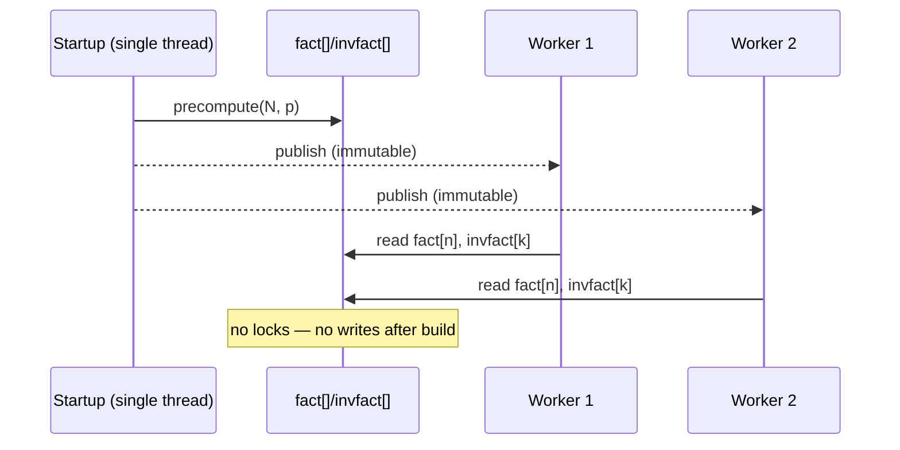

# Factorial modulo a Prime — Senior Level

> A single `C(n, k)` mod a prime is a textbook one-liner. The senior reality is different: a service that answers **millions** of binomial-coefficient queries per second under a fixed prime, sized to a maximum `n` that must not be exceeded, sharing one precomputed table across concurrent requests, and degrading gracefully when a query arrives with `n ≥ p`, a composite modulus, or a prime-power modulus it was never built for. This document treats factorial-mod-p as the arithmetic core of a high-throughput combinatorics service and maps the failure surfaces — table sizing, concurrency, modulus assumptions, and the prime-power generalization — in production terms.

## Table of Contents

1. [Introduction](#1-introduction)
2. [A High-Throughput C(n,k) Service](#2-a-high-throughput-cnk-service)
3. [Precompute Sizing and Memory](#3-precompute-sizing-and-memory)
4. [Concurrency and the Shared Table](#4-concurrency-and-the-shared-table)
5. [When the Prime Assumption Breaks](#5-when-the-prime-assumption-breaks)
6. [The Prime-Power Case (Overview)](#6-the-prime-power-case-overview)
7. [Code Examples](#7-code-examples)
8. [Observability and Testing](#8-observability-and-testing)
9. [Failure Modes](#9-failure-modes)
10. [Summary](#10-summary)

---

## 1. Introduction

At senior level the question is no longer "what is `C(n, k) mod p`" but "what system computes it at scale, and what breaks under load or unexpected input?" Factorial-mod-p shows up in three production guises that share one precomputed pair of tables:

1. **Combinatorics services** — endpoints that return `C(n, k)`, multinomials, Catalan numbers, stars-and-bars counts, and inclusion-exclusion sums, all mod a fixed prime such as `10^9 + 7` or the NTT-friendly `998244353`.
2. **Hot inner loops** — DP transitions and counting recurrences that call `binom()` billions of times; here even the constant factor of the three multiplies matters.
3. **Cross-modulus reconstruction** — exact large counts recovered via CRT from several prime moduli (sibling `06-crt`), each needing its own factorial tables.

All three reduce to: *build `fact[]` and `invfact[]` once for the right `N` and the right prime, then serve `O(1)` queries.* The senior decisions are: how big to size the table (and what to do when a query exceeds it), how to share it safely across threads, how to detect and route the `n ≥ p` / composite / prime-power cases, and how to keep an oracle so a silently wrong residue never ships.

---

## 2. A High-Throughput C(n,k) Service

### 2.1 Architecture

```mermaid
graph TD
    Client -->|C(n,k) mod p| LB[Load Balancer]
    LB --> S1[Service replica 1]
    LB --> S2[Service replica 2]
    S1 -->|read-only| T[(Shared fact[]/invfact[] table)]
    S2 -->|read-only| T
    S1 -->|n >= p| Lucas[Lucas fallback]
    S1 -->|composite m| CRT[CRT over prime powers]
```

The factorial tables are **immutable after startup** — built once during initialization, then read concurrently with no locking. A query is three array reads and two modular multiplies. The only branches are the validity guards (`0 ≤ k ≤ n`, `n < N`, `n < p`) and the fallback routing.

### 2.2 The hot path

```
binom(n, k):
    if k < 0 or k > n: return 0
    if n >= N: route to "table too small" handling
    if n >= p: route to Lucas
    return fact[n] * invfact[k] % p * invfact[n-k] % p
```

The three multiplies and two `mod` operations are the entire cost. On a fixed `p ≈ 10^9`, each multiply of two reduced residues stays below `p² < 2^60`, safe in `int64` — no overflow handling needed. This is why the prime is chosen below `~3·10^9`: it keeps the multiply single-word.

### 2.3 Why `998244353` is special

The prime `998244353 = 119 · 2^23 + 1` is **NTT-friendly**: it has a large power-of-two dividing `p - 1`, enabling the Number Theoretic Transform (sibling `15-ntt`) for fast polynomial multiplication. Services that compute *generating functions* (convolutions of binomial coefficients) prefer it. For pure binomial queries, `10^9 + 7` and `998244353` are interchangeable; the choice is dictated by whether downstream code needs NTT.

### 2.3a Exact reconstruction via multiple primes

Sometimes the *true* value of `C(n, k)` (not a residue) is needed but is too large for `int64`. The standard trick: compute `C(n, k) mod p_i` for several distinct primes `p_1, …, p_r` whose product exceeds the true value, then reconstruct the exact integer by CRT (sibling `06-crt`). Each prime needs its own `fact[]`/`invfact[]` tables. With three primes near `10^9`, the product exceeds `10^{27}`, enough for binomials with `n` up to a few thousand. This is how libraries return exact big-integer combinatorics without arbitrary-precision factorials — the per-prime arithmetic stays in machine words.

### 2.4 Batching and amortization

When many `C(n, k)` are requested together, there is nothing to batch in the table method — each is already `O(1)`. The batching win appears only if you *don't* have inverse factorials and must compute single inverses; then the prefix-product batch-inverse trick (sibling `05-fermat-euler`) applies. With `invfact[]` precomputed, queries are independent and trivially parallelizable.

---

## 3. Precompute Sizing and Memory

### 3.1 The sizing decision

The table size `N` must be at least the largest `n` any query will use. Under-sizing causes out-of-bounds reads (or a fallback); over-sizing wastes memory and startup time. The senior approach: derive `N` from the problem's documented bound, add a safety margin, and **fail loudly** (not silently) if a query exceeds `N`.

| `N` | `fact[]` + `invfact[]` memory (int64) | Build time (CPython-ish) |
|-----|---------------------------------------|--------------------------|
| 10^5 | ~1.6 MB | ~10 ms |
| 10^6 | ~16 MB | ~0.3 s |
| 2·10^6 | ~32 MB | ~0.6 s |
| 10^7 | ~160 MB | ~3 s |

Two `int64` arrays of length `N+1` cost `16(N+1)` bytes. At `N = 10^7` that is ~160 MB — often the practical ceiling for a single table. In Go/Java the same arrays are `8(N+1)` bytes each (so ~160 MB total at 10^7), with much faster build times.

### 3.2 Lazy growth vs upfront sizing

For a long-lived service, **upfront sizing** to the documented maximum is simplest and avoids a stall mid-traffic. **Lazy growth** (rebuild a larger table when a bigger `n` arrives) introduces a latency spike and a thread-safety problem (replacing the table under concurrent readers). Prefer upfront sizing; if growth is unavoidable, build the new table off to the side and swap an atomic pointer.

### 3.3 The single inverse cost

Recall the table costs `O(N)` multiplies plus **one** `O(log p)` modular inverse (for `invfact[N]`). Even at `N = 10^7`, that single Fermat exponentiation (~30 multiplies) is negligible against the `10^7` factorial multiplies. Never invert per element — that would add `N · log p ≈ 3·10^8` multiplies, a 10× regression.

### 3.4 Memory layout

Keep `fact` and `invfact` as separate contiguous arrays (not an array of structs) for cache-friendly sequential build and predictable read latency. A `C(n, k)` touches `fact[n]`, `invfact[k]`, `invfact[n-k]` — three reads, two of them into the same `invfact` array, which helps locality when `k` and `n-k` are close.

---

## 4. Concurrency and the Shared Table

### 4.1 Immutable-after-build is the key

Once `precompute()` finishes, `fact[]` and `invfact[]` are **read-only**. Concurrent readers need no synchronization — there is no writer. This is the cleanest concurrency model: build during single-threaded startup, publish the tables, then serve.



### 4.2 Safe publication

The subtlety is **safe publication**: workers must observe the fully built table, not a half-filled one. In Go, build before launching goroutines (the goroutine creation is a happens-before edge). In Java, store the arrays in a `final` field set in a constructor or use a memory barrier; `final` fields are guaranteed visible after construction. In Python, the GIL plus building before spawning threads/processes suffices; for multiprocessing, build in the parent and let `fork` share copy-on-write pages.

### 4.2a Per-modulus table caching

A service that supports several configured moduli (e.g. `10^9 + 7` for one tenant, `998244353` for another) keeps a small map from modulus to its `(fact, invfact)` pair, each built lazily on first use and then immutable. The cache key is `(modulus, N)`; a request needing a larger `N` than cached triggers a rebuild (Section 4.3). Never share a table across moduli — the residues are modulus-specific and mixing them silently corrupts every result. A `sync.Map` (Go), `ConcurrentHashMap` (Java), or a process-wide dict guarded at build time (Python) holds the cache; reads after build need no lock because each table is immutable.

### 4.3 The lazy-growth hazard

If you must grow the table at runtime, do **not** mutate the existing arrays in place — a reader mid-query could see a partially overwritten array. Build a fresh, larger pair and swap a single pointer/reference atomically. Readers either see the old table (still correct for their `n`) or the new one. This is the read-copy-update pattern; the old table is garbage-collected once no reader references it.

---

## 5. When the Prime Assumption Breaks

### 5.1 `n ≥ p` — the table is zero

If a query has `n ≥ p`, `fact[n] = 0` and the formula gives a wrong `0`. Route to **Lucas' theorem** (sibling `24`): build size-`p` factorial tables and combine the base-`p` digits of `n` and `k`. This requires `p` small enough to tabulate (`p ≤ ~10^6`); for large `p` the case `n ≥ p` simply cannot occur in `int64` range, so the guard is a safety net.

### 5.2 Composite modulus — silent wrongness

The Fermat inverse `fact[N]^(p-2)` is valid **only** for prime `p`. If `m` is composite, `invfact[N]` is garbage and every `C(n, k)` is wrong with no exception. The decision matrix:

| Modulus | Method | Constraint |
|---------|--------|------------|
| prime `p`, `n < p` | `fact[]`/`invfact[]` tables | the standard |
| prime `p`, `n ≥ p` | Lucas' theorem | `p` tabulatable |
| prime power `p^e` | generalized Wilson / `p`-free factorial | Section 6 |
| general composite `m = ∏ p_i^{e_i}` | per-prime-power, combine via CRT | sibling `06-crt` |

### 5.3 The decision: assert primality at startup

A robust service **asserts** at startup that the configured modulus is prime (a quick Miller-Rabin, sibling `09`). This converts a silent data-corruption bug — a composite modulus producing plausible-but-wrong residues — into a loud startup failure. The classic incident: a helper hard-wired for `10^9 + 7` is reconfigured with a composite hashing modulus, and `C(n, k)` is subtly wrong only for some inputs, with no exception ever firing.

### 5.4 General composite via CRT

For `m = ∏ p_i^{e_i}`, compute `C(n, k) mod p_i^{e_i}` for each prime power (Section 6) and recombine via the Chinese Remainder Theorem (sibling `06-crt`). This is the fully general algorithm; it costs one prime-power computation per factor plus an `O(r)` CRT merge.

---

## 6. The Prime-Power Case (Overview)

### 6.1 Why prime powers need more than the `p`-free factorial mod `p`

To compute `C(n, k) mod p^e`, you cannot just strip factors of `p` and invert mod `p` — you need the `p`-free factorial mod `p^e`, plus an accounting of the power of `p` that survives. The exponent of `p` in `C(n, k)` is `v_p(n!) − v_p(k!) − v_p((n-k)!)` (Legendre); call it `c` (the Kummer carry count). If `c ≥ e`, then `p^e | C(n, k)` and the answer mod `p^e` is `0`. Otherwise the answer is `p^c · (unit) mod p^e`, where the unit is a ratio of `p`-free factorials mod `p^e`.

### 6.2 Andrew Granville's generalized Wilson

The key tool is the generalized Wilson theorem: the product of the integers in `1..p^e` coprime to `p` is `≡ -1 (mod p^e)` for `p^e` with a primitive root (odd `p`, or `p^e ∈ {2, 4}`), and `≡ +1 (mod p^e)` for `2^e` with `e ≥ 3`. This lets you evaluate the `p`-free factorial `(n!)_{p,e}` mod `p^e` block by block:

```
(n!)_{p,e} ≡ (±1)^{⌊n/p^e⌋} · (product of the partial last block) · (recurse on ⌊n/p⌋)   (mod p^e).
```

Each full block of `p^e` consecutive coprime residues contributes the generalized-Wilson sign; the leftover partial block is multiplied out directly; and the multiples of `p` are peeled off recursively (the `⌊n/p⌋!` factor), accumulating the `p`-exponent.

### 6.3 The assembled formula

```
C(n, k) mod p^e  =  p^c · ( (n!)_{p,e} · ((k!)_{p,e})^(-1) · (((n-k)!)_{p,e})^(-1) ) mod p^e,
```

where `c = v_p(C(n,k))` and the `p`-free factorials are computed via Section 6.2. The inverses exist because each `p`-free factorial is coprime to `p` (hence a unit mod `p^e`). The full derivation, with the exact block-product recurrence and complexity, is in [`professional.md`](./professional.md).

### 6.3a A worked prime-power trace

Consider a service that must answer `C(n, k) mod 1000` for analytics with rounding to three decimal-equivalent digits. `1000 = 2^3 · 5^3` is **not** prime, so the simple tables are invalid. The general algorithm:

1. Factor the modulus: `1000 = 8 · 125`.
2. Compute `C(n, k) mod 8` via Granville with `p = 2, e = 3` (note the `+1` block sign).
3. Compute `C(n, k) mod 125` via Granville with `p = 5, e = 3` (`-1` block sign).
4. Combine the two residues by CRT (sibling `06-crt`) into the answer mod `1000`.

For `C(10, 3) = 120`: `120 mod 8 = 0`, `120 mod 125 = 120`; CRT of `(0 mod 8, 120 mod 125)` gives `120 mod 1000` ✓. This is the canonical shape of a composite-modulus combinatorics endpoint: never the simple tables, always per-prime-power Granville plus a CRT merge.

### 6.4 Complexity and when to bother

Granville's method computes one `C(n, k) mod p^e` in `O(p^e + e · log_p n)` after an `O(p^e)` precompute of the `p`-free factorial table mod `p^e`. It is worth the complexity only when the modulus is genuinely a prime power (or a composite handled via CRT). For the overwhelmingly common large-prime case, the simple `fact[]`/`invfact[]` tables are all you need.

| Case | Method | Precompute | Per query |
|------|--------|------------|-----------|
| large prime, `n < p` | tables | `O(N)` | `O(1)` |
| small prime, `n ≥ p` | Lucas | `O(p)` | `O(log_p n)` |
| prime power `p^e` | generalized Wilson | `O(p^e)` | `O(e · log_p n)` |
| composite | per-factor + CRT | `Σ O(p_i^{e_i})` | `Σ + O(r)` |

---

## 7. Code Examples

### 7.1 Go — thread-safe combinatorics service core

```go
package main

import (
	"errors"
	"fmt"
)

type Combin struct {
	mod, n      int64
	fact, inv   []int64
}

func powMod(a, e, m int64) int64 {
	a %= m
	if a < 0 {
		a += m
	}
	r := int64(1) % m
	for e > 0 {
		if e&1 == 1 {
			r = r * a % m
		}
		a = a * a % m
		e >>= 1
	}
	return r
}

// NewCombin builds immutable tables once. After this returns, the struct is
// safe for concurrent read-only use with no locking.
func NewCombin(N, mod int64) *Combin {
	c := &Combin{mod: mod, n: N}
	c.fact = make([]int64, N+1)
	c.inv = make([]int64, N+1)
	c.fact[0] = 1
	for i := int64(1); i <= N; i++ {
		c.fact[i] = c.fact[i-1] * i % mod
	}
	c.inv[N] = powMod(c.fact[N], mod-2, mod) // ONE inverse
	for i := N; i >= 1; i-- {
		c.inv[i-1] = c.inv[i] * i % mod
	}
	return c
}

// Binom returns C(n, k) mod p, or an error if it falls outside the table regime.
func (c *Combin) Binom(n, k int64) (int64, error) {
	if k < 0 || k > n {
		return 0, nil
	}
	if n >= c.mod {
		return 0, errors.New("n >= p: use Lucas")
	}
	if n > c.n {
		return 0, errors.New("n exceeds table size")
	}
	return c.fact[n] * c.inv[k] % c.mod * c.inv[n-k] % c.mod, nil
}

func main() {
	c := NewCombin(1_000_000, 1_000_000_007)
	v, _ := c.Binom(1000, 30)
	fmt.Println(v)
}
```

### 7.2 Java — immutable table with safe publication

```java
public final class Combin {
    private final long mod;
    private final long[] fact;   // final fields are safely published
    private final long[] inv;

    public Combin(int N, long mod) {
        this.mod = mod;
        this.fact = new long[N + 1];
        this.inv = new long[N + 1];
        fact[0] = 1;
        for (int i = 1; i <= N; i++) fact[i] = fact[i - 1] * i % mod;
        inv[N] = powMod(fact[N], mod - 2, mod);          // ONE inverse
        for (int i = N; i >= 1; i--) inv[i - 1] = inv[i] * i % mod;
    }

    private static long powMod(long a, long e, long m) {
        a %= m; if (a < 0) a += m;
        long r = 1 % m;
        while (e > 0) {
            if ((e & 1) == 1) r = r * a % m;
            a = a * a % m;
            e >>= 1;
        }
        return r;
    }

    public long binom(int n, int k) {
        if (k < 0 || k > n) return 0;
        if (n >= mod) throw new ArithmeticException("n >= p: use Lucas");
        return fact[n] * inv[k] % mod * inv[n - k] % mod;
    }

    public static void main(String[] args) {
        Combin c = new Combin(1_000_000, 1_000_000_007L);
        System.out.println(c.binom(1000, 30));
    }
}
```

### 7.3 Python — prime-power C(n,k) via the p-free factorial (Granville sketch)

```python
def vp_factorial(n, p):
    e = 0
    while n:
        n //= p
        e += n
    return e


def factmod_pe(n, p, pe):
    """p-free factorial (n!)_{p,e} mod pe = p**e, via block products + recursion."""
    if n == 0:
        return 1
    # Precompute the product of one full block 1..pe coprime to p (mod pe).
    block = 1
    for i in range(1, pe):
        if i % p:
            block = block * i % pe
    res = pow(block, n // pe, pe)          # full blocks (generalized Wilson sign baked in)
    for i in range(1, n % pe + 1):         # leftover partial block
        if i % p:
            res = res * i % pe
    return res * factmod_pe(n // p, p, pe) % pe  # recurse on multiples of p


def binom_prime_power(n, k, p, e):
    """C(n, k) mod p^e using Legendre exponent + p-free factorials."""
    pe = p ** e
    c = vp_factorial(n, p) - vp_factorial(k, p) - vp_factorial(n - k, p)
    if c >= e:
        return 0                            # p^e divides C(n, k)
    num = factmod_pe(n, p, pe)
    den = factmod_pe(k, p, pe) * factmod_pe(n - k, p, pe) % pe
    unit = num * pow(den, -1, pe) % pe      # den is coprime to p -> invertible
    return p ** c * unit % pe


if __name__ == "__main__":
    # C(10, 3) = 120; mod 8 = 0 (since 120 = 8*15), mod 27 = 120 % 27 = 12
    print(binom_prime_power(10, 3, 2, 3))   # 0
    print(binom_prime_power(10, 3, 3, 3))   # 12
    print(binom_prime_power(1000, 500, 7, 2))  # mod 49
```

---

## 8. Observability and Testing

A binomial residue is opaque — one wrong number looks like any other. Build checks in from day one.

| Check | Why |
|-------|-----|
| `fact[i] * invfact[i] % p == 1` for sampled `i` | Validates the inverse table. |
| `fact[p-1] == p-1` (when `N ≥ p-1`) | Wilson's theorem self-test. |
| `binom(n, k) == binom_slow(n, k)` on small inputs | Catches table/index bugs. |
| Pascal identity `C(n,k) = C(n-1,k-1)+C(n-1,k)` mod `p` | End-to-end recurrence check. |
| Startup primality assertion on the modulus | Catches composite-modulus misconfiguration. |
| Prime-power result vs direct `C(n,k) % p^e` for small `n` | Validates the Granville path. |
| Cross-language determinism (Go/Java/Python) | Catches overflow / sign bugs. |

### 8.0a Monitoring signals

For a long-running combinatorics service, emit and alert on:

| Metric | Healthy | Alert when |
|--------|---------|-----------|
| `precompute_duration_ms` | one spike at startup | recurring (lazy growth on hot path) |
| `table_bytes` | fixed `16(N+1)` | approaching pod memory limit |
| `query_p99_ns` | tens of ns | rising (cache misses, GC pressure) |
| `n_ge_p_rejections` | ~0 | nonzero (clients sending out-of-regime `n`) |
| `modulus_primality_check` | pass at startup | fail (misconfiguration) |
| `oob_index_errors` | 0 | any (table under-sized) |

The two highest-value alerts are `modulus_primality_check` (a composite modulus silently corrupts every result) and `oob_index_errors` (an under-sized table). Both are startup/config issues that, caught early, prevent a class of silent data-correctness incidents.

### 8.1 The most valuable check

Compare `binom(n, k)` against the Pascal-triangle value (or a direct `math.comb(n, k) % p`) for all `n ≤ ~200` and all `k`. This exercises the table build, the index arithmetic, and the boundary guards in one sweep. The second most valuable check is the **startup primality assertion** — it is the difference between a loud config error and weeks of subtly wrong analytics.

### 8.1a Capacity estimation

Back-of-envelope for sizing a replica. A `C(n, k)` query after precompute is ~5 arithmetic ops (3 multiplies, 2 `mod`), call it ~10 ns on a modern core. A single core thus serves ~10^8 queries/s; the table is read-only, so `C` cores serve ~`C·10^8` queries/s with no contention. The memory cost is fixed at `16(N+1)` bytes regardless of QPS. For `N = 2·10^6` (32 MB) and an 8-core pod, one replica handles ~`8·10^8` queries/s — the network and serialization layer, not the arithmetic, becomes the bottleneck. This is why combinatorics services are almost always I/O-bound, and why the right optimization is batching many `(n, k)` pairs per request rather than speeding up the multiply.

### 8.1b Latency profile

| Operation | Typical latency | Notes |
|-----------|-----------------|-------|
| Startup precompute (`N = 2·10^6`, Go/Java) | ~5–15 ms | one-time, off the request path |
| Startup precompute (`N = 2·10^6`, CPython) | ~600 ms | consider a compiled extension or smaller `N` |
| Single `C(n, k)` query | ~10 ns | three reads + two multiplies |
| Lucas fallback (`n ≥ p`) | ~`log_p n` lookups | small constant for tabulated `p` |
| Granville (`p^e`) per query | ~`e·log_p n` mults | only on the prime-power path |
| CRT merge (`r` factors) | ~`r` mults | composite-modulus path |

The precompute is the only non-trivial latency, and it is off the hot path. The design rule: pay the `O(N)` build once at startup, then every request is constant-time.

### 8.2 Production guardrails

- **Modulus primality at startup.** Run Miller-Rabin on the configured modulus; refuse to start if composite (unless the prime-power/CRT path is explicitly enabled).
- **Table-bound guard.** Reject (or route) queries with `n` exceeding the built `N` rather than reading out of bounds.
- **`n ≥ p` routing.** Detect and send to Lucas, or reject with a clear error, never return a silent `0`.
- **Inverse postcondition in tests.** `fact[i]·invfact[i] ≡ 1` for random `i` in CI.
- **Memory budget alert.** Track `16(N+1)` bytes against the pod limit; a too-large `N` is an OOM at startup.

---

## 9. Failure Modes

### 9.1 `n ≥ p` returns a wrong zero
`fact[n] = 0`, so the formula yields `0`. Mitigation: guard `n < p` and route to Lucas.

### 9.2 Composite modulus, silent wrong residues
The Fermat inverse is invalid; results are plausible but wrong. Mitigation: assert primality at startup.

### 9.3 Table too small, out-of-bounds read
A query with `n > N` reads past the array. Mitigation: bound-check and fail loudly or route.

### 9.4 In-place table growth under concurrent readers
A reader sees a half-rewritten array. Mitigation: build a new table and swap an atomic reference (RCU).

### 9.5 Inverting every factorial separately
`O(N log p)` instead of `O(N)` — a 10–30× build regression. Mitigation: one inverse + backward recurrence.

### 9.6 Forgetting the prime-power exponent `c`
Computing only the `p`-free ratio mod `p^e` and dropping the `p^c` factor gives a wrong (unit) answer. Mitigation: multiply by `p^c` (Legendre); return `0` when `c ≥ e`.

### 9.7 Overflow for moduli above ~`3·10^9`
`fact[i-1]·i` overflows `int64`. Mitigation: keep `p < 3·10^9`, or use 128-bit multiply / Montgomery.

### 9.8 Unsafe publication of the table
Workers observe a partially built table. Mitigation: build before spawning workers; use `final`/memory barriers (Java), happens-before goroutine creation (Go).

### 9.9 Lucas without size-`p` tables
Calling Lucas with `p` too large to tabulate exhausts memory. Mitigation: Lucas only for small `p`; large `p` never has `n ≥ p` in range.

### 9.10 Wrong NTT prime assumption
Using `10^9 + 7` where downstream NTT needs `998244353` breaks the transform (no large 2-adic factor in `p-1`). Mitigation: pick the modulus to match the heaviest downstream requirement.

### 9.11 Sharing a table across moduli
A cached `(fact, invfact)` built for one modulus reused for another yields residues in the wrong ring. Mitigation: key the cache by modulus; never share.

### 9.12 Forgetting symmetry in non-table paths
Computing `C(n, k)` with large `k` when `n - k` is small wastes work in Lucas/Granville. Mitigation: reduce `k` to `min(k, n-k)` via `C(n,k) = C(n,n-k)`.

### 9.13 Precompute on the request path
Building the table lazily on the first request adds a multi-hundred-millisecond stall for one unlucky caller. Mitigation: build during startup/warm-up, before accepting traffic.

### 9.14 Off-by-one table ceiling for Catalan / stars-and-bars
These need the table to `2n` or `n + k - 1`, not just `n`. Mitigation: size `N` to the largest *index* any formula reads, not the largest `n` argument.

---

## 10. Summary

- **The service is a precomputed pair of immutable tables.** Build `fact[]` forward and `invfact[]` from **one** Fermat inverse plus a backward recurrence; then every `C(n, k)` is three reads and two multiplies, `O(1)`, with no locking because the tables are read-only after build.
- **Sizing is the first decision.** `N` must cover the largest `n`; two `int64` arrays cost `16(N+1)` bytes (~160 MB at `10^7`). Size upfront from the documented bound; if you must grow, swap an atomic pointer (RCU), never mutate in place.
- **The prime assumption is load-bearing.** `n ≥ p` makes `fact[n] = 0` (route to Lucas); a composite modulus makes every result silently wrong (assert primality at startup). The fully general algorithm handles each prime power and merges via CRT.
- **The prime-power case** uses Legendre's exponent `c = v_p(C(n,k))` plus `p`-free factorials mod `p^e` evaluated via **Granville's generalized Wilson** (block products with a `±1` sign per full block); the answer is `p^c · unit mod p^e`, or `0` when `c ≥ e`.
- **Keep an oracle.** Validate against Pascal's triangle / `math.comb` on small inputs, self-check with Wilson (`fact[p-1] ≡ p-1`) and the inverse postcondition (`fact[i]·invfact[i] ≡ 1`), and assert modulus primality — the cheapest defenses against a silently wrong residue.

### Worked-example index

| Section | Example | Lesson |
|---------|---------|--------|
| 2.3a | exact `C` via 3 primes + CRT | reconstruct big values in machine words |
| 6.3a | `C(10,3) mod 1000` via 8·125 + CRT | composite modulus = per-prime-power + CRT |
| 8.1a | 8-core pod ≈ 8·10^8 q/s | service is I/O-bound, batch requests |
| 8.1b | precompute 5–15 ms vs query 10 ns | pay build once, queries are constant |

### Decision summary

- **Large prime, `n < p`** → `fact[]`/`invfact[]` tables, `O(1)` queries.
- **Small prime, `n ≥ p`** → Lucas' theorem with size-`p` tables.
- **Prime power `p^e`** → generalized Wilson / `p`-free factorial, answer `p^c · unit`.
- **Composite `m`** → per-prime-power, recombine via CRT (sibling `06`).
- **Downstream NTT** → choose `998244353`; otherwise `10^9 + 7`.
- **Concurrency** → build once, publish immutable, serve lock-free.

### Operational checklist

Before shipping a factorial-mod-p service, confirm each:

- [ ] Modulus asserted prime at startup (or prime-power/CRT path explicitly enabled).
- [ ] Table `N` sized to the largest *index* (account for Catalan `2n`, stars-and-bars `n + k - 1`).
- [ ] `invfact` built from one inverse + backward recurrence, not per-element.
- [ ] Tables immutable after build; readers lock-free; safe publication verified.
- [ ] `n ≥ p` and `n > N` queries routed or rejected, never silently `0`.
- [ ] Inverse self-check (`fact[i]·invfact[i] ≡ 1`) and Wilson (`fact[p-1] ≡ p-1`) in CI.
- [ ] Cross-checked against `math.comb` / Pascal on small inputs across all three languages.
- [ ] Per-modulus tables cached by `(modulus, N)`, never shared across moduli.

References to study further: Lucas' theorem (sibling `24-lucas-theorem`), binomial coefficients (sibling `23-binomial-coefficients`), CRT (sibling `06-crt`), NTT (sibling `15-ntt`), Miller-Rabin (sibling `09-miller-rabin-primality`), and Granville's "Binomial coefficients modulo prime powers."

---

Next step: continue to [`professional.md`](./professional.md) for the Legendre and Kummer proofs, the generalized Wilson theorem for `p^e`, and full complexity and correctness analysis.
