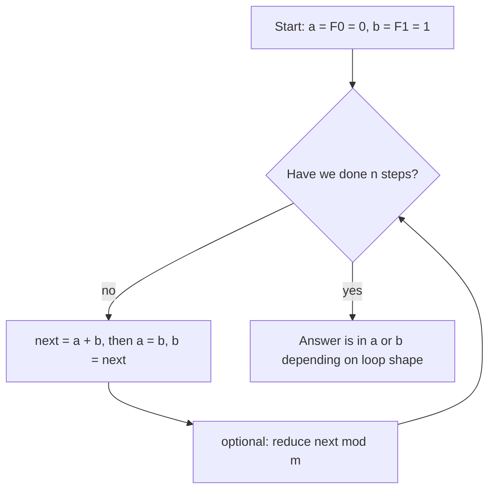

# Fibonacci Numbers — Junior Level

> **One-line summary:** The Fibonacci sequence `0, 1, 1, 2, 3, 5, 8, 13, …` is defined by `F(n) = F(n-1) + F(n-2)` with `F(0) = 0, F(1) = 1`. The naive recursive definition is beautiful but *exponentially slow* (`O(φ^n)`); the simple iterative / dynamic-programming version computes `F(n)` in `O(n)` time and `O(1)` space. This file teaches *what* Fibonacci is and *how* to compute it correctly and fast at the beginner level.

---

## Table of Contents

1. [Introduction](#introduction)
2. [Prerequisites](#prerequisites)
3. [Glossary](#glossary)
4. [Core Concepts](#core-concepts)
5. [Big-O Summary](#big-o-summary)
6. [Real-World Analogies](#real-world-analogies)
7. [Pros & Cons](#pros--cons)
8. [Step-by-Step Walkthrough](#step-by-step-walkthrough)
9. [Code Examples](#code-examples)
10. [Coding Patterns](#coding-patterns)
11. [Error Handling](#error-handling)
12. [Performance Tips](#performance-tips)
13. [Best Practices](#best-practices)
14. [Edge Cases & Pitfalls](#edge-cases--pitfalls)
15. [Common Mistakes](#common-mistakes)
16. [Cheat Sheet](#cheat-sheet)
17. [Frequently Asked Questions](#frequently-asked-questions)
18. [Visual Animation](#visual-animation)
19. [Summary](#summary)
20. [Further Reading](#further-reading)

---

## Introduction

The **Fibonacci numbers** are one of the most famous sequences in mathematics and a rite of passage in programming. They start

```
F(0) = 0
F(1) = 1
F(2) = F(1) + F(0) = 1
F(3) = F(2) + F(1) = 2
F(4) = F(3) + F(2) = 3
F(5) = F(4) + F(3) = 5
F(6) = F(5) + F(4) = 8
F(7) = 13,  F(8) = 21,  F(9) = 34,  F(10) = 55,  …
```

The rule is wonderfully simple: **each term is the sum of the two before it.** That single line, `F(n) = F(n-1) + F(n-2)`, is a *linear recurrence* — every future term is built from earlier ones by a fixed addition.

The interesting part for a programmer is not the definition but **how you compute it.** There are several ways, and they differ enormously in speed:

1. **Naive recursion** — translate the definition directly into a recursive function. Correct, but *exponentially slow*: computing `F(50)` this way takes over a billion calls because the same subproblems are recomputed again and again.
2. **Dynamic programming (memoization or a bottom-up loop)** — remember each `F(i)` once you compute it. This is `O(n)` time, and the loop version uses only `O(1)` extra memory.

This file focuses on these two approaches — the *what* and the *how* — and shows why the naive recursion is a trap. The faster `O(log n)` methods (matrix exponentiation and *fast doubling*) are introduced in [`middle.md`](./middle.md); for now, mastering the `O(n)` loop and understanding *why* naive recursion is slow is the goal.

> Fibonacci is also the canonical first example for two big ideas you will meet everywhere: **dynamic programming** (turning exponential recursion into a linear loop by remembering subproblems) and **linear recurrences** (which can later be evaluated in `O(log n)` — see the sibling topic `19-number-theory/11-matrix-exponentiation`).

---

## Prerequisites

Before reading this file you should be comfortable with:

- **Loops and variables** — a `for` loop that updates a couple of variables each iteration.
- **Functions and recursion** — what it means for a function to call itself, and what a *base case* is.
- **Arrays / lists** — storing computed values in a table (for the memoized version).
- **Integer types and overflow** — Fibonacci grows fast and overflows 32-bit and 64-bit integers quickly; you should know your language's integer limits.
- **Big-O notation (basic)** — `O(n)`, `O(2^n)`, and why exponential is catastrophic.

Optional but helpful:

- A first taste of **modular arithmetic** (`x % m`) — many problems ask for `F(n) mod m` to keep numbers small.
- Familiarity with the word **memoization** (caching results so you never recompute them).

---

## Glossary

| Term | Meaning |
|------|---------|
| **Fibonacci number `F(n)`** | The `n`-th term of the sequence defined by `F(n) = F(n-1) + F(n-2)`, `F(0)=0`, `F(1)=1`. |
| **Recurrence** | A rule that defines each term using earlier terms (here, the sum of the previous two). |
| **Base case** | The starting values that stop the recursion: `F(0)=0`, `F(1)=1`. |
| **Naive recursion** | Computing `F(n)` by directly calling `F(n-1)` and `F(n-2)` — exponentially slow. |
| **Memoization** | Caching each computed `F(i)` so it is never recomputed (top-down DP). |
| **Bottom-up DP** | Filling values from `F(0)` upward in a loop (no recursion). |
| **Overflow** | When a number grows beyond what the integer type can hold and wraps to garbage. |
| **`F(n) mod m`** | The remainder of `F(n)` divided by `m`; keeps values small and is what most problems ask for. |
| **Golden ratio `φ`** | `(1+√5)/2 ≈ 1.618`; Fibonacci numbers grow roughly like `φ^n`. |
| **Index** | The position `n` in the sequence; `F(7)` has index 7. |

---

## Core Concepts

### 1. The Definition Is a Recurrence

Fibonacci is defined by *recursion on the previous two terms*:

```
F(0) = 0                 (base case)
F(1) = 1                 (base case)
F(n) = F(n-1) + F(n-2)   for n ≥ 2
```

The two **base cases** are essential — without them the recursion never stops. The recurrence says: to know term `n`, you only need the two terms immediately before it. That "depends on the last two" property is what makes Fibonacci an *order-2 linear recurrence*.

### 2. Naive Recursion Recomputes Everything

If you translate the definition straight into code, `fib(n)` calls `fib(n-1)` and `fib(n-2)`, each of which calls *their* two predecessors, and so on. The problem: the **same subproblems are solved over and over.** Computing `fib(5)` calls `fib(3)` twice, `fib(2)` three times, `fib(1)` five times. The number of calls grows like `φ^n` — roughly *doubling* every two steps. `fib(40)` already makes hundreds of millions of calls; `fib(50)` is hopeless.

### 3. Dynamic Programming Fixes the Repetition

The cure is to compute each `F(i)` **exactly once** and reuse it. Two flavors:

- **Top-down (memoization):** keep the recursive shape but store results in a table; before recomputing `F(i)`, check the table.
- **Bottom-up (iterative):** start from `F(0), F(1)` and build upward in a loop. This is the cleanest version — `O(n)` time, and because each new term needs only the previous two, you can keep just **two variables** and use `O(1)` memory.

### 4. You Only Need the Last Two Values

The bottom-up loop is the key beginner insight: you do **not** need to store the whole array. Keep two running variables `a = F(i-1)` and `b = F(i)`; each step computes the next term and slides the window forward:

```
a, b = b, a + b
```

After `n` such updates starting from `a=0, b=1`, you have `F(n)`. This is the workhorse loop you should be able to write from memory.

### 5. Fibonacci Grows Very Fast

Each term is about `1.618×` the previous (the **golden ratio** `φ`). Consequences for a programmer:

- `F(47)` overflows a signed 32-bit integer.
- `F(93)` overflows a signed 64-bit integer.
- Beyond that you need either **big integers** (arbitrary precision) or, far more commonly, the answer **modulo `m`** (e.g. `mod 10^9 + 7`), where you reduce after every addition to keep values small.

### 6. `F(n) mod m` Is Computed As You Go

When a problem asks for `F(n) mod m`, you do **not** compute the giant number and then reduce — that would overflow. Instead reduce *inside the loop*: `b = (a + b) % m` each step. Because `(+)` works fine with remainders, `F(n) mod m` comes out exactly. (The deeper structure of `F(n) mod m` — the *Pisano period* — is a middle/senior topic.)

---

## Big-O Summary

| Method | Time | Space | Notes |
|--------|------|-------|-------|
| Naive recursion | **O(φ^n) ≈ O(1.618^n)** | O(n) call stack | Exponential — unusable past ~`n=40`. |
| Memoized recursion (top-down DP) | **O(n)** | O(n) table + O(n) stack | Each `F(i)` computed once. |
| Bottom-up loop (no array) | **O(n)** | **O(1)** | The standard beginner method. |
| Bottom-up with array | O(n) | O(n) | Useful if you need *all* `F(0..n)`. |
| Matrix exponentiation | O(log n) | O(1) | Faster method — see `middle.md`. |
| Fast doubling | O(log n) | O(log n) stack | Faster method — see `middle.md`. |

The headline at this level: **naive recursion is `O(1.618^n)` and must be avoided; the bottom-up loop is `O(n)` time and `O(1)` space and is what you should reach for.**

---

## Real-World Analogies

| Concept | Analogy |
|---------|---------|
| The recurrence (sum of previous two) | Rabbit-pair breeding: each mature pair produces a new pair, so this month's pairs = last month's + the month before's. (Fibonacci's original 1202 problem.) |
| Naive recursion redoing work | Asking two friends a question; each asks two more friends the *same* sub-questions, who ask two more — the same question answered thousands of times. |
| Memoization | Writing each answer on a sticky note so nobody has to re-derive it. |
| The two-variable loop | Carrying just the last two odometer readings to predict the next, instead of keeping the whole log. |
| Fast growth (`φ^n`) | Compound interest at ~62% per step — the numbers explode. |
| `F(n) mod m` | Only tracking the last few digits because the full number is astronomically large. |

Where the analogies break: the rabbit model assumes immortal rabbits and ignores death; real growth is never exactly `φ^n`. The point of each analogy is the *structure* (depends on two predecessors, recomputation is wasteful), not the biology.

---

## Pros & Cons

These compare the **two beginner methods** (naive recursion vs the DP loop).

| Pros of the DP loop | Cons / caveats |
|---------------------|----------------|
| `O(n)` time and `O(1)` space — fast and memory-light. | Still `O(n)` — too slow for `n = 10^18` (use the `O(log n)` methods in `middle.md`). |
| Trivial to write correctly; only two variables to track. | Easy to start the loop with the wrong base values and be off by one. |
| Naturally extends to `F(n) mod m` (reduce inside the loop). | Without a modulus, overflows fast (32-bit by `n=47`, 64-bit by `n=93`). |
| No deep stack — no risk of stack overflow. | If you need *all* terms `F(0..n)`, you must keep an array (`O(n)` space). |

**When to use the DP loop:** almost always at this level — any `n` up to a few million, with or without a modulus.

**When NOT to use naive recursion:** essentially never for real computation. It is a teaching example of *why* DP exists. (Memoized recursion is fine and `O(n)`, but the loop is simpler and uses less memory.)

---

## Step-by-Step Walkthrough

Let us compute `F(7) = 13` two ways and watch the difference.

### The naive recursion tree (why it is slow)

To compute `fib(5)` the recursion expands into a *tree* where the same nodes appear many times:

```
                       fib(5)
                 /                \
            fib(4)                fib(3)
           /      \              /      \
      fib(3)     fib(2)      fib(2)    fib(1)
      /    \      /   \       /   \
  fib(2) fib(1) fib(1) fib(0) fib(1) fib(0)
   /  \
fib(1) fib(0)
```

Count the leaves: `fib(1)` and `fib(0)` together appear **8 times** for `fib(5)`. For `fib(7)` it is far worse, and for `fib(50)` the tree has more nodes than there are seconds in thousands of years of computing. The waste is the *repetition*: `fib(3)` is computed twice, `fib(2)` three times, and so on. **Same work, redone.**

### The bottom-up loop (fast)

Now build `F(7)` from the bottom with two variables. Start `a = F(0) = 0`, `b = F(1) = 1`, then repeat `a, b = b, a + b`:

```
start:  a=0 (F0)  b=1 (F1)
step 1: a=1 (F1)  b=1 (F2)   # b = 0+1
step 2: a=1 (F2)  b=2 (F3)   # b = 1+1
step 3: a=2 (F3)  b=3 (F4)   # b = 1+2
step 4: a=3 (F4)  b=5 (F5)   # b = 2+3
step 5: a=5 (F5)  b=8 (F6)   # b = 3+5
step 6: a=8 (F6)  b=13(F7)   # b = 5+8
```

After 6 steps (from `F(1)` to `F(7)`), `b = 13 = F(7)`. Each value was computed **exactly once**. Seven steps, not a tree of hundreds of calls. That is the whole difference between `O(n)` and `O(1.618^n)`.

### A convention check

Different books index differently. Throughout this roadmap we use `F(0) = 0, F(1) = 1`, so:

```
n :  0  1  2  3  4  5  6  7  8   9  10
F :  0  1  1  2  3  5  8 13 21  34  55
```

Confirm your loop reproduces this table for small `n` before trusting it on large `n`.

---

## Code Examples

### Example 1: Naive Recursion (the slow way — for understanding only)

#### Go

```go
package main

import "fmt"

// fibNaive directly mirrors the definition. Correct but O(phi^n) — never use for large n.
func fibNaive(n int) int64 {
	if n < 2 {
		return int64(n) // F(0)=0, F(1)=1
	}
	return fibNaive(n-1) + fibNaive(n-2)
}

func main() {
	fmt.Println(fibNaive(10)) // 55
	fmt.Println(fibNaive(20)) // 6765
	// fibNaive(50) would take far too long — do NOT call it.
}
```

#### Java

```java
public class FibNaive {
    // Correct but O(phi^n) — for understanding, not for real use.
    static long fibNaive(int n) {
        if (n < 2) return n; // F(0)=0, F(1)=1
        return fibNaive(n - 1) + fibNaive(n - 2);
    }

    public static void main(String[] args) {
        System.out.println(fibNaive(10)); // 55
        System.out.println(fibNaive(20)); // 6765
    }
}
```

#### Python

```python
def fib_naive(n):
    """Direct definition. Correct but O(phi^n) — never use for large n."""
    if n < 2:
        return n  # F(0)=0, F(1)=1
    return fib_naive(n - 1) + fib_naive(n - 2)


if __name__ == "__main__":
    print(fib_naive(10))  # 55
    print(fib_naive(20))  # 6765
    # fib_naive(50) would hang — do NOT call it.
```

**What it does:** computes Fibonacci by the definition. Use it only to *understand* the recurrence and to see how slow exponential recursion is.

### Example 2: Bottom-Up Loop (the method to actually use)

#### Go

```go
package main

import "fmt"

// fib computes F(n) iteratively in O(n) time, O(1) space.
func fib(n int) int64 {
	if n < 2 {
		return int64(n)
	}
	var a, b int64 = 0, 1 // F(0), F(1)
	for i := 2; i <= n; i++ {
		a, b = b, a+b // slide the window forward
	}
	return b // F(n)
}

func main() {
	for n := 0; n <= 10; n++ {
		fmt.Printf("F(%d) = %d\n", n, fib(n))
	}
}
```

#### Java

```java
public class Fib {
    // O(n) time, O(1) space.
    static long fib(int n) {
        if (n < 2) return n;
        long a = 0, b = 1; // F(0), F(1)
        for (int i = 2; i <= n; i++) {
            long next = a + b;
            a = b;
            b = next;
        }
        return b; // F(n)
    }

    public static void main(String[] args) {
        for (int n = 0; n <= 10; n++)
            System.out.println("F(" + n + ") = " + fib(n));
    }
}
```

#### Python

```python
def fib(n):
    """F(n) iteratively: O(n) time, O(1) space."""
    if n < 2:
        return n
    a, b = 0, 1  # F(0), F(1)
    for _ in range(2, n + 1):
        a, b = b, a + b  # slide the window forward
    return b  # F(n)


if __name__ == "__main__":
    for n in range(11):
        print(f"F({n}) = {fib(n)}")
```

**What it does:** builds `F(n)` from the bottom in a single loop, keeping only the last two values.
**Run:** `go run main.go` | `javac Fib.java && java Fib` | `python fib.py`

### Example 3: Modular Fibonacci and Memoization

#### Go

```go
package main

import "fmt"

const MOD = 1_000_000_007

// fibMod computes F(n) mod m, reducing inside the loop so nothing overflows.
func fibMod(n int) int64 {
	if n < 2 {
		return int64(n)
	}
	var a, b int64 = 0, 1
	for i := 2; i <= n; i++ {
		a, b = b, (a+b)%MOD
	}
	return b
}

func main() {
	fmt.Println(fibMod(10))      // 55
	fmt.Println(fibMod(1000000)) // big index, small (mod) answer, instant
}
```

#### Java

```java
import java.util.HashMap;
import java.util.Map;

public class FibMod {
    static final long MOD = 1_000_000_007L;

    static long fibMod(int n) {
        if (n < 2) return n;
        long a = 0, b = 1;
        for (int i = 2; i <= n; i++) {
            long next = (a + b) % MOD;
            a = b;
            b = next;
        }
        return b;
    }

    // Top-down memoization: same O(n), keeps the recursive shape.
    static Map<Integer, Long> memo = new HashMap<>();

    static long fibMemo(int n) {
        if (n < 2) return n;
        if (memo.containsKey(n)) return memo.get(n);
        long v = (fibMemo(n - 1) + fibMemo(n - 2)) % MOD;
        memo.put(n, v);
        return v;
    }

    public static void main(String[] args) {
        System.out.println(fibMod(10));   // 55
        System.out.println(fibMemo(10));  // 55
    }
}
```

#### Python

```python
from functools import lru_cache

MOD = 1_000_000_007


def fib_mod(n):
    """F(n) mod MOD — reduce inside the loop to avoid huge numbers."""
    if n < 2:
        return n
    a, b = 0, 1
    for _ in range(2, n + 1):
        a, b = b, (a + b) % MOD
    return b


@lru_cache(maxsize=None)
def fib_memo(n):
    """Top-down DP: each F(i) computed once and cached."""
    if n < 2:
        return n
    return fib_memo(n - 1) + fib_memo(n - 2)


if __name__ == "__main__":
    print(fib_mod(10))        # 55
    print(fib_memo(10))       # 55
    print(fib_mod(1_000_000)) # instant, mod p
```

**What it does:** the loop version reduces mod `m` every step so values stay small; the memoized version shows the top-down DP alternative. Both are `O(n)`.

---

## Coding Patterns

### Pattern 1: The Two-Variable Slide

**Intent:** Compute `F(n)` keeping only the last two values — the canonical `O(1)`-space Fibonacci.

```python
def fib(n):
    a, b = 0, 1
    for _ in range(n):     # note: n iterations starting from a=F(0)
        a, b = b, a + b
    return a               # after n slides, a = F(n)
```

There are two equivalent loop shapes: iterate `n` times and return `a`, or iterate `n-1` times and return `b`. Pick one and test it against the small table — mixing them up is the classic off-by-one.

### Pattern 2: Memoize a Naive Recursion

**Intent:** Keep the readable recursive form but make it `O(n)` by caching.

```python
from functools import lru_cache

@lru_cache(maxsize=None)
def fib(n):
    if n < 2:
        return n
    return fib(n - 1) + fib(n - 2)
```

The `@lru_cache` decorator turns the exponential tree into a linear chain: each `fib(i)` is computed once, then served from the cache.

### Pattern 3: Reduce Mod `m` Inside the Loop

**Intent:** Get `F(n) mod m` without ever forming the giant number.

```python
def fib_mod(n, m):
    a, b = 0, 1
    for _ in range(n):
        a, b = b, (a + b) % m
    return a % m
```



---

## Error Handling

| Error | Cause | Fix |
|-------|-------|-----|
| Hangs / times out | Used naive recursion for large `n`. | Switch to the `O(n)` loop or memoization. |
| Stack overflow | Deep naive/un-memoized recursion (large `n`). | Use the iterative loop; recursion depth is then zero. |
| Wrong answer for `n = 0` or `n = 1` | Forgot the base cases. | Return `n` directly when `n < 2`. |
| Garbage for moderately large `n` | Integer overflow (32-bit by `n=47`, 64-bit by `n=93`). | Use a 64-bit type, big integers, or `F(n) mod m`. |
| Off-by-one (`F(n)` vs `F(n+1)`) | Loop runs one too few / too many times, or wrong return variable. | Verify against the table `0,1,1,2,3,5,8,…`. |
| Negative result after mod (Go/Java) | `%` can be negative for negative operands. | Only matters with subtraction; for plain Fibonacci, sums are non-negative. |

---

## Performance Tips

- **Never use naive recursion for `n` beyond ~30** — it is exponential. Memoize it or use the loop.
- **Prefer the loop over memoization** when you only need `F(n)`: it is `O(1)` space and has no recursion overhead.
- **Reduce mod `m` every step** when a modulus is requested; do not build the big number first.
- **Use a 64-bit type** (`int64` / `long`) by default — 32-bit overflows by `F(47)`.
- **If you need many Fibonacci values**, fill an array once (`O(n)` total) and answer each query in `O(1)`.
- For *huge* `n` (millions to `10^18`), the `O(n)` loop is too slow — use the `O(log n)` matrix or fast-doubling methods in [`middle.md`](./middle.md).

---

## Best Practices

- Always handle the base cases `F(0) = 0` and `F(1) = 1` first.
- Verify your function against the known small table before trusting it.
- State your indexing convention (this roadmap: `F(0) = 0`).
- Name the modulus as a constant (`MOD = 1_000_000_007`); never inline magic numbers.
- Use the two-variable loop as your default; reach for an array only when you need all terms.
- When learning, write the naive version *once* to feel the recurrence, then immediately replace it with the loop.

---

## Edge Cases & Pitfalls

- **`n = 0`** → `F(0) = 0`. **`n = 1`** → `F(1) = 1`. Get these right or every later answer shifts.
- **Negative `n`** — not defined here (negafibonacci exists but is out of scope). Validate `n ≥ 0`.
- **Overflow without a modulus** — `F(47)` exceeds `int32`, `F(93)` exceeds `int64`. Choose big integers or `mod m`.
- **Floating-point shortcut (Binet's formula)** — `F(n) = round(φ^n / √5)` *looks* `O(1)` but loses precision past `n ≈ 70`. Do not use it for exact values (covered in `professional.md`).
- **Off-by-one in the loop** — decide whether you return `a` or `b` and how many times you iterate; pin it with the table.
- **Different conventions** — some sources start `F(1) = F(2) = 1`. Mismatched conventions shift every answer by one; state yours explicitly.

---

## Common Mistakes

1. **Shipping naive recursion** — it works for tiny `n` in tests, then times out on the real input.
2. **Forgetting the base cases** — infinite recursion or wrong answers for `n = 0, 1`.
3. **Integer overflow** — using 32-bit, or not reducing mod `m`, so large-`n` answers are silently wrong.
4. **Off-by-one** — returning `F(n-1)` or `F(n+1)` because the loop count or return variable is wrong.
5. **Reducing mod `m` only at the end** — the intermediate sum already overflowed; reduce *every* step.
6. **Using Binet's float formula for exact answers** — rounding errors corrupt results past `n ≈ 70`.
7. **Storing the whole array when you only need `F(n)`** — wastes `O(n)` memory; two variables suffice.

---

## Cheat Sheet

| Task | Method | Complexity |
|------|--------|-----------|
| Understand the recurrence | naive recursion | `O(φ^n)` — teaching only |
| Compute `F(n)`, small/medium `n` | two-variable loop | `O(n)` time, `O(1)` space |
| Keep recursive shape, fast | memoization | `O(n)` time, `O(n)` space |
| `F(n) mod m` | loop with `% m` each step | `O(n)` |
| Need all `F(0..n)` | bottom-up array | `O(n)` time and space |
| Huge `n` (see `middle.md`) | matrix exp / fast doubling | `O(log n)` |

Core loop to memorize:

```
fib(n):
    a, b = 0, 1          # F(0), F(1)
    repeat n times:
        a, b = b, a + b   # (use (a+b) % m for modular)
    return a              # F(n)
```

Small table to test against:

```
n :  0  1  2  3  4  5  6  7  8   9  10  11   12
F :  0  1  1  2  3  5  8 13 21  34  55  89  144
```

---

## Frequently Asked Questions

**Q: Why is naive recursion so slow if the rule is so simple?**
Because it recomputes the same subproblems exponentially many times. `fib(n)` calls `fib(n-1)` *and* `fib(n-2)`, and those overlap massively. The total number of calls grows like `φ^n ≈ 1.618^n`. Memoization or the loop computes each `F(i)` once, making it `O(n)`.

**Q: Memoization or the loop — which should I use?**
The loop, if you only need `F(n)`: it is `O(1)` space and has no recursion overhead. Memoization is fine and equally `O(n)` in time, but uses `O(n)` memory for the cache and the call stack. Memoization shines when the recursion structure is more complex; for plain Fibonacci, the loop wins.

**Q: My answer is correct for small `n` but wrong for `n = 50`. Why?**
Almost certainly **integer overflow**. `F(47)` exceeds a signed 32-bit integer and `F(93)` exceeds signed 64-bit. Use a 64-bit type, big integers, or compute `F(n) mod m` (reducing every step).

**Q: How do I compute `F(n) mod m` correctly?**
Reduce *inside* the loop: `b = (a + b) % m`. Never compute the full `F(n)` and then take `% m` — the full value overflows long before you get there. Because addition commutes with taking remainders, the modular loop gives the exact `F(n) mod m`.

**Q: Can I just use the formula `F(n) = round(φ^n / √5)`?**
That is **Binet's formula**. It is mathematically exact but uses the irrational `φ`, so in floating point it loses precision and gives wrong answers past `n ≈ 70`. It is useful for *estimating* size, not for exact computation. See `professional.md`.

**Q: Is `O(n)` good enough?**
For `n` up to a few million, yes. For `n` in the billions or `10^18` (common in competitive problems), `O(n)` is far too slow and you need the `O(log n)` matrix-exponentiation or fast-doubling methods in [`middle.md`](./middle.md).

**Q: What indexing convention does this use?**
`F(0) = 0`, `F(1) = 1`. Some textbooks start `F(1) = F(2) = 1`. Always check the convention, because it shifts every value by one.

---

## Visual Animation

> See [`animation.html`](./animation.html) for an interactive visualization.
>
> The animation demonstrates:
> - The **naive recursion tree** expanding, with repeated `fib(k)` nodes highlighted to show wasted work.
> - The **bottom-up DP loop** filling values left to right, each computed once.
> - The two running variables `a` and `b` sliding forward step by step.
> - The Fibonacci values **growing** and the comparison of operation counts (recursion vs DP).
> - Step / Run / Reset controls and an editable `n`.

---

## Summary

The Fibonacci sequence `F(n) = F(n-1) + F(n-2)` with `F(0)=0, F(1)=1` is the textbook example of a linear recurrence. The crucial lesson for a beginner is *how to compute it*: the **naive recursion** that mirrors the definition is `O(φ^n)` and unusable because it recomputes the same subproblems exponentially many times, while **dynamic programming** — either memoization or, better, a two-variable bottom-up loop — computes each term once in `O(n)` time and `O(1)` space. Handle the base cases, watch for overflow (use 64-bit, big integers, or `F(n) mod m` reduced every step), and verify against the small table. For huge `n`, the `O(log n)` matrix-exponentiation and fast-doubling methods come next.

---

## Next step:

Continue to [`middle.md`](./middle.md) to learn the `O(log n)` methods — **matrix exponentiation** with `[[1,1],[1,0]]` and the faster **fast-doubling** method — plus modular Fibonacci and the Pisano period.

---

## Further Reading

- Sibling topic `19-number-theory/11-matrix-exponentiation` — the general linear-recurrence machinery that gives `O(log n)` Fibonacci.
- *Introduction to Algorithms* (CLRS) — dynamic programming and the Fibonacci example.
- *Concrete Mathematics* (Graham, Knuth, Patashnik) — Fibonacci numbers and identities.
- OEIS A000045 — the Fibonacci sequence and its properties.
- cp-algorithms.com — "Fibonacci numbers".
