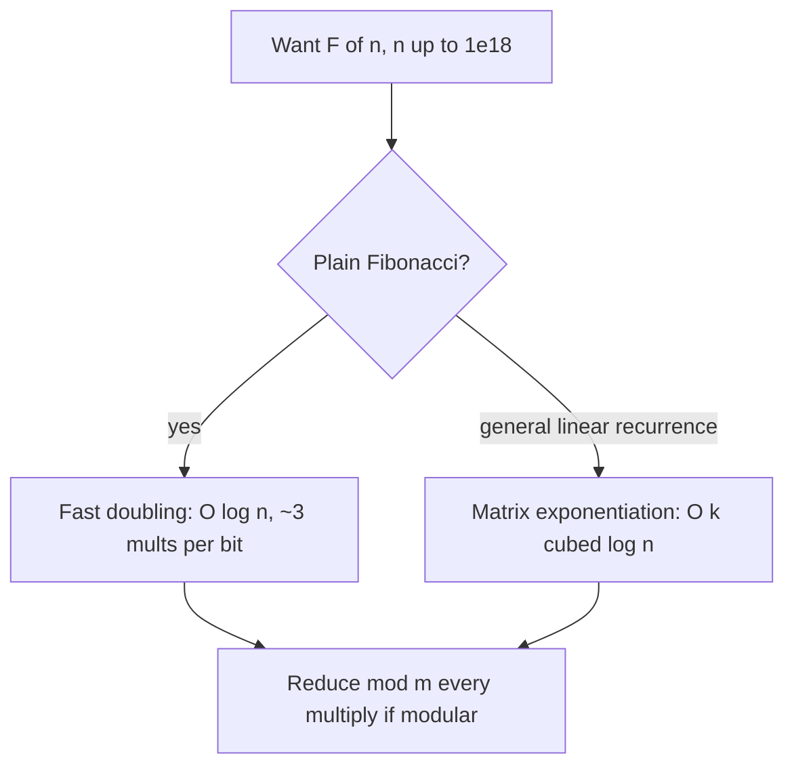

# Fibonacci Numbers — Middle Level

> **Focus:** Going from `O(n)` to `O(log n)`. Two methods reach `F(n)` in logarithmic time: **matrix exponentiation** of `M = [[1,1],[1,0]]` (cross-link `19-number-theory/11-matrix-exponentiation`), and the faster **fast-doubling** method using `F(2k) = F(k)·(2F(k+1) − F(k))` and `F(2k+1) = F(k)² + F(k+1)²`. We also cover **modular Fibonacci**, why fast doubling beats the matrix by a constant factor, and where each method fits.

---

## Table of Contents

1. [Introduction](#introduction)
2. [Deeper Concepts](#deeper-concepts)
3. [Method 1: Matrix Exponentiation](#method-1-matrix-exponentiation)
4. [Method 2: Fast Doubling](#method-2-fast-doubling)
5. [Why Fast Doubling Beats the Matrix](#why-fast-doubling-beats-the-matrix)
6. [Modular Fibonacci](#modular-fibonacci)
7. [Comparison with Alternatives](#comparison-with-alternatives)
8. [Worked Examples](#worked-examples)
9. [Code Examples](#code-examples)
10. [Error Handling](#error-handling)
11. [Performance Analysis](#performance-analysis)
12. [Best Practices](#best-practices)
13. [Frequently Asked Questions](#frequently-asked-questions)
14. [Visual Animation](#visual-animation)
15. [Summary](#summary)

---

## Introduction

At junior level the message was: the naive recursion is `O(φ^n)`, and the bottom-up DP loop is `O(n)` time, `O(1)` space. That loop is perfect for `n` up to a few million. But a great many problems ask for `F(n)` with `n` as large as `10^18`, almost always **modulo a prime** like `10^9 + 7`. An `O(n)` loop with `n = 10^18` would take longer than the age of the universe. We need `O(log n)`.

Two methods deliver it:

1. **Matrix exponentiation.** The recurrence `F(n) = F(n-1) + F(n-2)` is *linear*, so it can be written as `state_n = M · state_{n-1}` with the transition matrix `M = [[1,1],[1,0]]`. Then `state_n = M^n · state_0`, and `M^n` is computed by **binary exponentiation** (squaring) in `O(log n)`. This is the general technique for *any* linear recurrence, covered in depth in `19-number-theory/11-matrix-exponentiation`.

2. **Fast doubling.** A pair of Fibonacci identities lets you jump from `(F(k), F(k+1))` straight to `(F(2k), F(2k+1))` in a constant number of multiplications. Reading the bits of `n` from the top down, each bit *doubles* the index (and conditionally adds one), reaching `F(n)` in `O(log n)` — but with a *smaller constant* than the matrix method, because it does fewer multiplications per bit.

Both are `O(log n)`; fast doubling is the one to prefer in practice for plain Fibonacci. This file builds both, explains *why* they work and *when* to use each, and handles the modular case carefully.

> This is the *number-theory* angle on Fibonacci. The general "any linear recurrence is a matrix power" story — companion matrices, augmentation, Kitamasa — lives in `19-number-theory/11-matrix-exponentiation`. Cross-reference it for recurrences beyond Fibonacci.

---

## Deeper Concepts

### Fibonacci is an order-2 linear recurrence

"Linear" means the next term is a fixed linear combination of previous terms — here `1·F(n-1) + 1·F(n-2)`, no squares, no products of terms, constant coefficients. "Order 2" means it depends on the **last two** terms. These two properties are exactly what make the `O(log n)` methods possible. Any change that breaks linearity (e.g. `F(n) = F(n-1)·F(n-2)`) would invalidate both methods.

### The state vector

Because Fibonacci depends on the last two terms, the *state* that determines the future is the pair `(F(n), F(n-1))`. Advancing the state one step is a fixed operation, and *that* is what we will speed up: instead of advancing one step at a time (`O(n)`), we advance many steps at once via repeated squaring/doubling (`O(log n)`).

### Binary exponentiation, the shared engine

Both methods rely on the same idea: to reach index `n`, do not take `n` single steps; instead exploit the binary representation of `n`. Matrix exponentiation squares the matrix (`M → M² → M⁴ → …`); fast doubling doubles the index (`k → 2k`). Either way the work is proportional to the number of bits of `n`, which is `⌊log₂ n⌋ + 1` — about 60 for `n = 10^18`.

### The matrix-power identity

A key fact, provable by induction (full proof in `professional.md`), ties the matrix to Fibonacci:

```
M^n = [ F(n+1)  F(n)   ]
      [ F(n)    F(n-1) ]      where  M = [[1,1],[1,0]].
```

So powering `M` *is* computing Fibonacci numbers — `F(n)` sits in the top-right (and bottom-left) corner of `M^n`.

---

## Method 1: Matrix Exponentiation

### The setup

Write the one-step advance as a matrix-vector product:

```
[ F(n)   ]   [ 1  1 ] [ F(n-1) ]
[ F(n-1) ] = [ 1  0 ] [ F(n-2) ]
```

The top row `(1, 1)` is the recurrence; the bottom row `(1, 0)` is a *shift* that copies `F(n-1)` down so the window slides. Iterating, `state_n = M^n · state_0`, and we compute `M^n` by binary exponentiation.

### Binary exponentiation of the matrix

To compute `M^n`, start with `result = I` (the identity, since `M^0 = I`) and `base = M`. Read the bits of `n`: square `base` every step, and multiply it into `result` whenever the current bit is 1:

```
matPow(M, n):
    result = I          # identity; M^0
    while n > 0:
        if n is odd: result = result · M
        M = M · M        # square
        n = n >> 1
    return result        # M^n
```

Each `2×2` matrix multiply is constant work, and the loop runs `O(log n)` times, so the whole thing is `O(log n)`. Reading `F(n)` from `M^n` uses the identity above: `F(n) = (M^n)[0][1]`.

### What to remember

- `M^0 = I` (a very common bug is returning `M` for `n = 0`).
- `F(n)` is at entry `[0][1]` of `M^n`.
- For modular Fibonacci, reduce every `+` and `*` inside the multiply mod `m`.

The full general treatment of this method (companion matrices for any recurrence, augmentation for constants and prefix sums, the `O(k³ log n)` cost) is in `19-number-theory/11-matrix-exponentiation`. Here it is specialized to the `2×2` Fibonacci case.

---

## Method 2: Fast Doubling

### The two identities

Fast doubling computes `F(n)` from two identities that express *doubled-index* Fibonacci numbers in terms of `F(k)` and `F(k+1)`:

```
F(2k)   = F(k) · ( 2·F(k+1) − F(k) )
F(2k+1) = F(k)² + F(k+1)²
```

Both are derived from the matrix identity (proof in `professional.md`), but you can use them directly. Given the pair `(F(k), F(k+1))`, these two formulas produce `(F(2k), F(2k+1))` using just a **few multiplications** — no full matrix multiply needed.

### The algorithm

Process the bits of `n` from the **most significant to the least significant.** Maintain the pair `(a, b) = (F(k), F(k+1))`, starting from `k = 0`, i.e. `(F(0), F(1)) = (0, 1)`. For each bit:

1. **Double:** compute `(F(2k), F(2k+1))` from `(a, b)` using the identities.
2. **If the current bit is 1, add one:** advance `(F(2k), F(2k+1))` to `(F(2k+1), F(2k+2))` by one Fibonacci step (`c, d = d, c + d`).

After consuming all bits, `a = F(n)`. This is `O(log n)` iterations, each doing a small fixed number of multiplications.

```text
fastDoubling(n) returns (F(n), F(n+1)):
    if n == 0: return (0, 1)
    (a, b) = fastDoubling(n >> 1)        # a = F(k), b = F(k+1), k = n//2
    c = a * (2*b - a)                    # F(2k)
    d = a*a + b*b                        # F(2k+1)
    if n is even: return (c, d)          # F(2k), F(2k+1)
    else:         return (d, c + d)      # F(2k+1), F(2k+2)
```

The recursion depth is `O(log n)`; each level does a constant number of multiplications. An iterative top-down-bits version avoids the recursion stack (shown in Code Examples).

### Reading the bits top-down

The "double then maybe add one" pattern mirrors how `n` is built from its bits left to right: `n = ((…((b_{top})·2 + b_{next})·2 + …)·2 + b_0)`. Each `·2` is a *doubling* step on the index; each `+ b_i` is the conditional *add-one* step. That is exactly the recursion structure above.

---

## Why Fast Doubling Beats the Matrix

Both are `O(log n)`, so why prefer fast doubling? **Constant factors.** Count the multiplications per bit of `n`:

| Per bit | Matrix exponentiation (`2×2`) | Fast doubling |
|---------|-------------------------------|---------------|
| Squaring | one `2×2 × 2×2` multiply = **8 scalar multiplies** | the doubling formulas = **~3 scalar multiplies** |
| Conditional step (set bit) | another `2×2` multiply = up to 8 more | one Fibonacci add-step = **0 multiplies** (just adds) |

A `2×2` matrix multiply is 8 scalar multiplications (plus 4 additions); fast doubling's doubling step needs only `a·(2b−a)`, `a·a`, `b·b` — about **3 multiplications** — and the conditional step is pure addition. So fast doubling does roughly **2–3× fewer multiplications per bit.** For modular Fibonacci where each multiply is the expensive operation (especially with a `mulmod` for large moduli), that constant factor is the difference between fast and very fast.

The matrix method's advantage is *generality*: it works for any linear recurrence. Fast doubling is *specialized* to Fibonacci (and a few close cousins). For Fibonacci specifically, **fast doubling is the method of choice**; for an arbitrary recurrence, reach for the matrix (see `19-number-theory/11-matrix-exponentiation`).



---

## Modular Fibonacci

Almost every large-`n` Fibonacci problem asks for `F(n) mod m`. The rules:

- **Reduce after every arithmetic operation.** In the matrix multiply, `c[i][j] = (c[i][j] + a[i][t]*b[t][j]) % m`. In fast doubling, reduce `c`, `d`, and intermediate products mod `m`.
- **Watch the subtraction in `2·F(k+1) − F(k)`.** This can go negative *after* reducing mod `m`. Normalize: `(2*b - a) mod m` should be made non-negative with `((2*b - a) % m + m) % m`. This is the single most common modular-Fibonacci bug.
- **Use 64-bit products before reducing.** `a*b` of two residues below `m ≈ 10^9` fits in `int64` (`< 2^60`); for moduli near `2^62` you need a `mulmod` (senior topic).

### The Pisano period (preview)

The sequence `F(n) mod m` is **periodic** — it eventually repeats. The length of that repeat is the **Pisano period** `π(m)`. For example `F(n) mod 10` cycles with period 60, and `F(n) mod 2` cycles `0, 1, 1` with period 3. This means `F(n) mod m = F(n mod π(m)) mod m`, which can collapse an astronomically large index. Computing `π(m)` and using it is a *senior* topic, covered in `senior.md`; for now, just know the modular sequence repeats.

---

## Comparison with Alternatives

| Method | Time | Space | Mults / bit | Best for |
|--------|------|-------|-------------|----------|
| Naive recursion | `O(φ^n)` | `O(n)` stack | — | never (teaching only) |
| Bottom-up loop | `O(n)` | `O(1)` | — | `n` up to a few million |
| Memoization | `O(n)` | `O(n)` | — | when recursion shape is needed |
| **Matrix exponentiation** | `O(log n)` | `O(1)` | ~8–16 | any linear recurrence, large `n` |
| **Fast doubling** | `O(log n)` | `O(log n)` stack | ~3 | plain Fibonacci, large `n` |
| Binet (float) | `O(1)`* | `O(1)` | — | size estimates only; **not exact** past `n≈70` |

\* Binet looks `O(1)` but is unsafe for exact values — see `professional.md`.

Concrete operation counts to reach `F(n)`:

| `n` | Loop additions | Matrix `2×2` multiplies | Fast-doubling multiplies |
|------|----------------|--------------------------|---------------------------|
| 10 | 10 | ~6 | ~12 |
| 10⁶ | 10⁶ | ~40 | ~60 |
| 10¹⁸ | 10¹⁸ (infeasible) | ~120 | ~180 |

The loop loses badly for large `n`; both `O(log n)` methods are trivial even at `10^18`, with fast doubling doing fewer *multiplications* (the costly operation) per bit.

**Choose the loop when:** `n` is small (≤ a few million) and clarity matters.
**Choose fast doubling when:** `n` is large and you want plain `F(n)` (mod `m` or exact).
**Choose matrix exponentiation when:** you have a *general* linear recurrence, or you want one uniform technique for a family of problems.

---

## Worked Examples

### Matrix exponentiation for `F(6)`

`M = [[1,1],[1,0]]`. Using `M^n = [[F(n+1), F(n)],[F(n), F(n-1)]]`, we need `M^6`. Square up:

```
M   = [[1,1],[1,0]]
M²  = [[2,1],[1,1]]      (top-right = F(2) = 1)
M⁴  = M²·M² = [[5,3],[3,2]]   (top-right = F(4) = 3)
M⁶  = M⁴·M² = [[13,8],[8,5]]  (top-right = F(6) = 8)
```

So `F(6) = (M⁶)[0][1] = 8`. ✓

### Fast doubling for `F(10)`

`10 = 1010₂`. Recurse on `k = n>>1`:

```
fib(10):  k=5, need fib(5)
  fib(5):  k=2, need fib(2)
    fib(2): k=1, need fib(1)
      fib(1): k=0 -> (F0,F1) = (0,1)
        c = 0*(2*1-0) = 0 = F(0); d = 0²+1² = 1 = F(1)
        n=1 odd -> return (d, c+d) = (1, 1) = (F(1), F(2))
      back in fib(2): (a,b)=(1,1)
      c = 1*(2*1-1)=1 = F(2); d = 1²+1²=2 = F(3)
      n=2 even -> return (1, 2) = (F(2), F(3))
    back in fib(5): (a,b)=(1,2)
    c = 1*(2*2-1)=3 = F(4); d = 1²+2²=5 = F(5)
    n=5 odd -> return (5, 8) = (F(5), F(6))
  back in fib(10): (a,b)=(5,8)
  c = 5*(2*8-5)=5*11=55 = F(10); d = 5²+8²=25+64=89 = F(11)
  n=10 even -> return (55, 89) = (F(10), F(11))
```

So `F(10) = 55`, `F(11) = 89`. ✓ Notice each level used only a handful of multiplications.

### Modular subtraction trap

Compute `F(2k)` with `F(k)=5, F(k+1)=8`, `m = 7`. The identity gives `c = 5·(2·8 − 5) = 5·11 = 55`, and `55 mod 7 = 6 = F(10) mod 7`. Reducing the inner part first: `(2·8 − 5) mod 7 = 11 mod 7 = 4`, then `5·4 mod 7 = 20 mod 7 = 6`. ✓ Same answer. The danger appears when `2b − a` is *negative after reduction* — always normalize with `((x % m) + m) % m`.

---

## Code Examples

### Example: Matrix Exponentiation (Fibonacci `mod m`)

#### Go

```go
package main

import "fmt"

const MOD = 1_000_000_007

func mul(a, b [2][2]int64) [2][2]int64 {
	var c [2][2]int64
	for i := 0; i < 2; i++ {
		for j := 0; j < 2; j++ {
			for t := 0; t < 2; t++ {
				c[i][j] = (c[i][j] + a[i][t]*b[t][j]) % MOD
			}
		}
	}
	return c
}

func fibMatrix(n int64) int64 {
	result := [2][2]int64{{1, 0}, {0, 1}} // identity = M^0
	base := [2][2]int64{{1, 1}, {1, 0}}   // M
	for n > 0 {
		if n&1 == 1 {
			result = mul(result, base)
		}
		base = mul(base, base)
		n >>= 1
	}
	return result[0][1] // F(n)
}

func main() {
	fmt.Println(fibMatrix(10))                 // 55
	fmt.Println(fibMatrix(1_000_000_000_000))  // instant, mod p
}
```

#### Java

```java
public class FibMatrix {
    static final long MOD = 1_000_000_007L;

    static long[][] mul(long[][] a, long[][] b) {
        long[][] c = new long[2][2];
        for (int i = 0; i < 2; i++)
            for (int j = 0; j < 2; j++)
                for (int t = 0; t < 2; t++)
                    c[i][j] = (c[i][j] + a[i][t] * b[t][j]) % MOD;
        return c;
    }

    static long fibMatrix(long n) {
        long[][] r = {{1, 0}, {0, 1}};
        long[][] b = {{1, 1}, {1, 0}};
        while (n > 0) {
            if ((n & 1) == 1) r = mul(r, b);
            b = mul(b, b);
            n >>= 1;
        }
        return r[0][1];
    }

    public static void main(String[] args) {
        System.out.println(fibMatrix(10));               // 55
        System.out.println(fibMatrix(1_000_000_000_000L)); // instant
    }
}
```

#### Python

```python
MOD = 1_000_000_007


def mul(a, b):
    return [[sum(a[i][t] * b[t][j] for t in range(2)) % MOD
             for j in range(2)] for i in range(2)]


def fib_matrix(n):
    r = [[1, 0], [0, 1]]   # identity = M^0
    b = [[1, 1], [1, 0]]   # M
    while n > 0:
        if n & 1:
            r = mul(r, b)
        b = mul(b, b)
        n >>= 1
    return r[0][1]


if __name__ == "__main__":
    print(fib_matrix(10))                  # 55
    print(fib_matrix(1_000_000_000_000))   # instant, mod p
```

### Example: Fast Doubling (recursive and iterative, `mod m`)

#### Go

```go
package main

import "fmt"

const MOD = 1_000_000_007

// fibPair returns (F(n), F(n+1)) mod MOD using fast doubling.
func fibPair(n int64) (int64, int64) {
	if n == 0 {
		return 0, 1
	}
	a, b := fibPair(n >> 1) // a = F(k), b = F(k+1), k = n/2
	// F(2k)   = F(k) * (2*F(k+1) - F(k))
	twoB := (2*b%MOD - a%MOD + MOD) % MOD
	c := a * twoB % MOD
	// F(2k+1) = F(k)^2 + F(k+1)^2
	d := (a*a%MOD + b*b%MOD) % MOD
	if n&1 == 0 {
		return c, d
	}
	return d, (c + d) % MOD
}

func fib(n int64) int64 {
	f, _ := fibPair(n)
	return f
}

func main() {
	fmt.Println(fib(10))                 // 55
	fmt.Println(fib(1_000_000_000_000))  // instant
}
```

#### Java

```java
public class FibFastDoubling {
    static final long MOD = 1_000_000_007L;

    // returns {F(n), F(n+1)} mod MOD
    static long[] fibPair(long n) {
        if (n == 0) return new long[]{0, 1};
        long[] p = fibPair(n >> 1);
        long a = p[0], b = p[1];
        long twoB = ((2 * b % MOD - a) % MOD + MOD) % MOD;
        long c = a * twoB % MOD;             // F(2k)
        long d = (a * a % MOD + b * b % MOD) % MOD; // F(2k+1)
        if ((n & 1) == 0) return new long[]{c, d};
        return new long[]{d, (c + d) % MOD};
    }

    static long fib(long n) {
        return fibPair(n)[0];
    }

    public static void main(String[] args) {
        System.out.println(fib(10));               // 55
        System.out.println(fib(1_000_000_000_000L)); // instant
    }
}
```

#### Python

```python
MOD = 1_000_000_007


def fib_pair(n):
    """Return (F(n), F(n+1)) mod MOD via fast doubling."""
    if n == 0:
        return (0, 1)
    a, b = fib_pair(n >> 1)            # F(k), F(k+1), k = n//2
    c = a * ((2 * b - a) % MOD) % MOD  # F(2k)
    d = (a * a + b * b) % MOD          # F(2k+1)
    if n & 1 == 0:
        return (c, d)
    return (d, (c + d) % MOD)


def fib(n):
    return fib_pair(n)[0]


# Iterative top-down-bits version (no recursion stack):
def fib_iter(n):
    a, b = 0, 1  # F(0), F(1)
    for bit in bin(n)[2:]:            # most-significant bit first
        c = a * ((2 * b - a) % MOD) % MOD
        d = (a * a + b * b) % MOD
        if bit == '1':
            a, b = d, (c + d) % MOD
        else:
            a, b = c, d
    return a


if __name__ == "__main__":
    print(fib(10))        # 55
    print(fib_iter(10))   # 55
    print(fib(1_000_000_000_000))  # instant
```

**What it does:** the recursive `fib_pair` returns `(F(n), F(n+1))` using the doubling identities; `fib_iter` does the same by scanning the bits of `n` top-down without recursion.
**Run:** `go run main.go` | `javac FibFastDoubling.java && java FibFastDoubling` | `python fib.py`

---

## Error Handling

| Scenario | What goes wrong | Correct approach |
|----------|-----------------|------------------|
| Forgot the modulus | Numbers overflow; garbage answers. | Reduce every `+` and `*` mod `m`. |
| Negative `2b − a` after mod | A negative residue corrupts later terms. | Normalize: `((2*b - a) % m + m) % m`. |
| Returned `M` for `n = 0` (matrix) | Wrong base case breaks the power loop. | `M^0 = I`; start `result = I`. |
| Wrong result entry (matrix) | Read `[0][0]` (= `F(n+1)`) instead of `[0][1]`. | `F(n)` is at `[0][1]` of `M^n`. |
| `a*b` overflows before `% m` | Product exceeds 64 bits for large `m`. | Reduce operands first, or use a `mulmod` for large `m`. |
| Off-by-one in fast doubling | Returned `F(n+1)` instead of `F(n)`. | `fib_pair(n)[0]` is `F(n)`; verify against the loop. |

---

## Performance Analysis

```python
import time

MOD = 1_000_000_007


def bench(fn, n, reps=1000):
    start = time.perf_counter()
    for _ in range(reps):
        fn(n)
    return (time.perf_counter() - start) / reps * 1e6  # microseconds


# Typical pattern (relative):
#   - loop is O(n): unusable for n = 10**18
#   - matrix:   ~8 scalar mults per bit -> ~120 mults at n=1e18
#   - fast dbl: ~3 scalar mults per bit -> ~180 mults at n=1e18 but smaller per-op,
#               and fewer expensive multiplies overall
```

For modular Fibonacci, the dominant cost is the number of *multiplications* (each is a multiply plus a reduction). Fast doubling does about 3 multiplications per bit versus the matrix's ~8 for the squaring alone (plus up to 8 more for the conditional multiply). In practice fast doubling is roughly **2× faster** than the `2×2` matrix method, which is itself already trivial. Both are dwarfed by the `O(n)` loop's cost for large `n`.

The biggest practical win at this level: **pick fast doubling for plain Fibonacci**, and stop reaching for the loop once `n` exceeds a few million.

---

## Best Practices

- **Default to fast doubling** for plain `F(n)` at large `n`; it does the fewest multiplications.
- **Use matrix exponentiation** when you need a general linear-recurrence solver, not just Fibonacci.
- **Always reduce mod `m`** inside the inner operations; never form the full number.
- **Normalize the subtraction** `2b − a` to a non-negative residue.
- **Test against the `O(n)` loop** on small `n` before trusting either method on huge `n`.
- **Remember `M^0 = I`** and that `F(n)` sits at `M^n[0][1]`.
- For the modular sequence, recall it is **periodic** (Pisano period) — useful when many queries share one modulus (see `senior.md`).

---

## Frequently Asked Questions

**Q: Both methods are `O(log n)` — does it matter which I use?**
For correctness, no. For speed, yes: fast doubling does about 2–3× fewer multiplications per bit than the `2×2` matrix method, and multiplications (with their modular reductions) are the costly operation. For *plain* Fibonacci, prefer fast doubling. For a *general* linear recurrence, the matrix method generalizes and is the right tool.

**Q: Where do the fast-doubling identities come from?**
They follow from the matrix identity `M^n = [[F(n+1), F(n)],[F(n), F(n-1)]]` by computing `M^{2k} = (M^k)²` and matching entries. The full derivation is in `professional.md`. You can use the identities directly without re-deriving them.

**Q: Why does `2·F(k+1) − F(k)` show up?**
It is `F(k+1) + (F(k+1) − F(k)) = F(k+1) + F(k-1)`, which after algebra gives the `F(2k)` identity. The subtraction is exact over the integers, but mod `m` it can produce a negative residue, so normalize it.

**Q: Can I avoid recursion in fast doubling?**
Yes — scan the bits of `n` from most significant to least significant in a loop (`fib_iter` above), maintaining `(F(k), F(k+1))` and doubling/adding per bit. This removes the `O(log n)` recursion stack.

**Q: How do I read `F(n)` out of the matrix?**
`M^n = [[F(n+1), F(n)],[F(n), F(n-1)]]`, so `F(n)` is at entry `[0][1]` (and `[1][0]`). Reading `[0][0]` gives `F(n+1)` — a common off-by-one.

**Q: My modular answer is wrong only sometimes. Why?**
Most likely the `2b − a` subtraction went negative after a modular reduction and you did not normalize it. Wrap it as `((2*b - a) % m + m) % m`. Also confirm products are reduced before they overflow.

**Q: Does `F(n) mod m` repeat?**
Yes — it is periodic with the **Pisano period** `π(m)`. So `F(n) mod m = F(n mod π(m)) mod m`. Computing and exploiting `π(m)` is a senior topic (`senior.md`); it is mainly useful for batches of queries against one modulus.

---

## Visual Animation

> See [`animation.html`](./animation.html) for an interactive view.
>
> The middle-level animation highlights:
> - The matrix `M = [[1,1],[1,0]]` being squared `M → M² → M⁴ → …` with `F(n)` read from the corner.
> - The **fast-doubling** index ladder: each bit of `n` *doubling* the index, conditionally *adding one*, with the running pair `(F(k), F(k+1))`.
> - A side-by-side multiplication-count comparison of naive recursion vs DP vs fast doubling.
> - The Fibonacci values growing as the index advances.

---

## Summary

To compute `F(n)` for large `n` you need `O(log n)`, and two methods deliver it. **Matrix exponentiation** writes the recurrence as `state_n = M^n · state_0` with `M = [[1,1],[1,0]]` and powers `M` by binary squaring; it is the general technique for any linear recurrence (`19-number-theory/11-matrix-exponentiation`). **Fast doubling** uses the identities `F(2k) = F(k)(2F(k+1) − F(k))` and `F(2k+1) = F(k)² + F(k+1)²` to jump from index `k` to `2k` directly, doing about 3 multiplications per bit versus the matrix's ~8, so it is the faster choice for plain Fibonacci. Both run in `O(log n)`; both must reduce mod `m` for modular problems, normalizing the subtraction `2b − a`. The modular sequence repeats with the Pisano period — a senior optimization.

---

## Next step:

Continue to [`senior.md`](./senior.md) for computing `F(n)` at astronomical indices and moduli: the **Pisano period** for modular reduction, **big-integer** growth and CRT, and generalizing fast doubling to arbitrary linear recurrences in production systems.

---

## Further Reading

- Sibling topic `19-number-theory/11-matrix-exponentiation` — the general linear-recurrence / companion-matrix machinery.
- *Concrete Mathematics* (Graham, Knuth, Patashnik) — Fibonacci identities and the fast-doubling relations.
- cp-algorithms.com — "Fibonacci numbers" (fast doubling and matrix forms).
- Project Nayuki — "Fast Fibonacci algorithms" (the canonical fast-doubling write-up).
- OEIS A000045 — Fibonacci, with identities and references.
