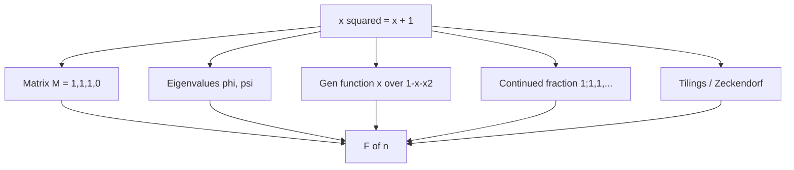

# Fibonacci Numbers — Mathematical Foundations and Identities

## Table of Contents
1. Formal Definition
2. The Matrix Identity (Correctness Proof)
3. Fast-Doubling Derivation
4. Binet's Closed Form (Derivation and Numerical Limits)
5. Cassini, Catalan, and d'Ocagne Identities
6. Sum Identities
7. The GCD Property `gcd(F(m), F(n)) = F(gcd(m, n))`
8. Divisibility and Primality Properties
9. Modular Periodicity (The Pisano Period, Formally)
10. Complexity Analysis of the Algorithms
11. Generating Function and Asymptotics
12. Zeckendorf's Theorem and the Combinatorial Interpretation
13. The Golden Ratio, Continued Fractions, and Spectral View
14. Lucas Numbers and the Companion Identities
15. Summary

---

> This document develops Fibonacci theory rigorously, with each theorem anchored by a worked numeric instance. The unifying object is the shift operator on the 2-dimensional solution space of `F(n) = F(n-1) + F(n-2)`, represented by the matrix `M = [[1,1],[1,0]]`; every identity and every algorithm is a statement about powers of this single linear map.

## 1. Formal Definition

**Definition 1.1 (Fibonacci sequence).** The Fibonacci sequence `(F(n))_{n≥0}` over `ℤ` is defined by

```
F(0) = 0,   F(1) = 1,   F(n) = F(n-1) + F(n-2)   for n ≥ 2.
```

It is the order-2 constant-coefficient linear recurrence with coefficients `c_1 = c_2 = 1`.

**Definition 1.2 (Negafibonacci extension).** The recurrence rearranges to `F(n-2) = F(n) − F(n-1)`, extending `F` to all integers: `F(-n) = (-1)^{n+1} F(n)`. So `F(-1) = 1, F(-2) = -1, F(-3) = 2, …`. This two-sided extension is needed for some identities (e.g. d'Ocagne's) to hold without index restrictions.

**Proposition 1.2a (Negafibonacci formula).** `F(-n) = (-1)^{n+1} F(n)` for all `n ≥ 1`.

**Proof (induction running backward).** Base: `F(-1) = F(1) − F(0) = 1 = (-1)^2 F(1)` ✓; `F(-2) = F(0) − F(-1) = -1 = (-1)^3 F(2)` ✓. Step: assume the formula for `-n` and `-(n-1)`; then `F(-(n+1)) = F(-(n-1)) − F(-n) = (-1)^n F(n-1) − (-1)^{n+1} F(n) = (-1)^n (F(n-1) + F(n)) = (-1)^n F(n+1) = (-1)^{(n+1)+1} F(n+1)` ✓. ∎ The two-sided sequence is `…, -3, 2, -1, 1, 0, 1, 1, 2, 3, …`, symmetric in magnitude with alternating sign on the negative side.

**Definition 1.3 (Lucas companion).** The Lucas sequence `(L(n))` shares the recurrence with seeds `L(0) = 2, L(1) = 1`, giving `2, 1, 3, 4, 7, 11, 18, …`. Lucas and Fibonacci numbers interleave through many identities (Section 5) and satisfy the same matrix and fast-doubling relations with different initial vectors.

**Notation.** `M = [[1,1],[1,0]]` is the transition matrix, `φ = (1+√5)/2` the golden ratio, `ψ = (1−√5)/2 = 1 − φ = −1/φ` its conjugate. `φψ = −1`, `φ + ψ = 1`, `φ − ψ = √5`. Throughout, `e_1 = (1,0)ᵀ`.

---

## 2. The Matrix Identity (Correctness Proof)

**Theorem 2.1 (Matrix power identity).** For all `n ≥ 1`,

```
M^n = [ F(n+1)  F(n)   ]
      [ F(n)    F(n-1) ].
```

**Proof (induction on `n`).** *Base `n = 1`:* `M^1 = [[1,1],[1,0]] = [[F(2),F(1)],[F(1),F(0)]] = [[1,1],[1,0]]` ✓. *Inductive step:* assume the form for `n`. Then

```
M^{n+1} = M^n · M = [ F(n+1)  F(n)   ] [ 1  1 ] = [ F(n+1)+F(n)   F(n+1) ]
                    [ F(n)    F(n-1) ] [ 1  0 ]   [ F(n)+F(n-1)   F(n)   ]
        = [ F(n+2)  F(n+1) ]
          [ F(n+1)  F(n)   ],
```

using `F(n+1)+F(n) = F(n+2)` and `F(n)+F(n-1) = F(n+1)`. This is the claimed form at `n+1`. ∎

**Corollary 2.2.** `F(n) = (M^n)_{0,1} = e_1ᵀ M^{n-1} e_1`. Computing `M^n` by binary exponentiation therefore computes `F(n)` in `O(log n)` ring operations (Section 10).

**Worked instance of Theorem 2.1 (`n = 6`).** Squaring up: `M² = [[2,1],[1,1]]`, `M⁴ = M²M² = [[5,3],[3,2]]`, `M⁶ = M⁴M² = [[13,8],[8,5]]`. Matching the claimed form `[[F(7),F(6)],[F(6),F(5)]] = [[13,8],[8,5]]` ✓. The off-diagonal `8 = F(6)` is the value the algorithm reads; the diagonal `13 = F(7)` and `5 = F(5)` are free byproducts (used by Lucas via the trace `13 + 5 = 18 = L(6)`, Section 14).

**Corollary 2.3 (Determinant → Cassini).** Since `det M = (1)(0) − (1)(1) = −1`, we have `det(M^n) = (det M)^n = (−1)^n`. Taking the determinant of the Theorem 2.1 form:

```
det(M^n) = F(n+1)F(n-1) − F(n)² = (−1)^n,
```

which is **Cassini's identity** (Section 5), obtained here for free from multiplicativity of the determinant.

---

## 3. Fast-Doubling Derivation

The fast-doubling identities are exactly the entries of `M^{2k} = (M^k)²` matched against Theorem 2.1.

**Theorem 3.1 (Fast-doubling identities).** For all `k ≥ 0`,

```
F(2k)   = F(k) · ( 2 F(k+1) − F(k) ),
F(2k+1) = F(k)² + F(k+1)².
```

**Proof.** By Theorem 2.1, `M^k = [[F(k+1), F(k)],[F(k), F(k-1)]]`. Square it:

```
M^{2k} = (M^k)² = [ F(k+1)  F(k)   ]²
                  [ F(k)    F(k-1) ]
       = [ F(k+1)² + F(k)²            F(k+1)F(k) + F(k)F(k-1) ]
         [ F(k)F(k+1) + F(k-1)F(k)    F(k)² + F(k-1)²         ].
```

But also `M^{2k} = [[F(2k+1), F(2k)],[F(2k), F(2k-1)]]` by Theorem 2.1. Match entries.

*Top-left → `F(2k+1)`:*
```
F(2k+1) = F(k+1)² + F(k)².      ∎ (second identity)
```

*Top-right → `F(2k)`:*
```
F(2k) = F(k+1)F(k) + F(k)F(k-1) = F(k)( F(k+1) + F(k-1) ).
```
Now `F(k-1) = F(k+1) − F(k)` (the recurrence rearranged), so `F(k+1) + F(k-1) = F(k+1) + F(k+1) − F(k) = 2F(k+1) − F(k)`. Hence

```
F(2k) = F(k)( 2 F(k+1) − F(k) ).      ∎ (first identity)
```

The two identities use the pair `(F(k), F(k+1))` and produce `(F(2k), F(2k+1))`, the index-doubling step that drives the `O(log n)` algorithm of `middle.md`. ∎

**Worked instance (`k = 5`).** `F(5) = 5, F(6) = 8`. Then `F(10) = 5·(2·8 − 5) = 5·11 = 55` ✓ and `F(11) = 5² + 8² = 25 + 64 = 89` ✓.

**Theorem 3.2 (Index-add-one step).** From `(F(2k), F(2k+1))`, the pair `(F(2k+1), F(2k+2))` is one Fibonacci step: `F(2k+2) = F(2k) + F(2k+1)`. This is the conditional step for an odd bit of `n`. ∎

**Why the algorithm is correct.** Writing `n` in binary and scanning bits high→low, each bit `b_i` transforms index `k → 2k + b_i`. Starting from `k = 0` with `(F(0), F(1)) = (0, 1)`, Theorems 3.1–3.2 advance the pair to `(F(n), F(n+1))` after consuming all bits, since `n = Σ b_i 2^{(top−i)}` is built up by exactly these doublings and add-ones. The top coordinate is `F(n)`.

---

## 4. Binet's Closed Form (Derivation and Numerical Limits)

Binet's formula gives a *closed form* for `F(n)` in terms of the eigenvalues of `M` — elegant, but with a sharp practical warning about floating-point evaluation.

**Theorem 4.1 (Binet's formula).** For all `n ≥ 0`,

```
F(n) = (φ^n − ψ^n) / √5,     φ = (1+√5)/2,  ψ = (1−√5)/2.
```

**Proof (eigen-decomposition).** The characteristic polynomial of `M` is `χ(x) = det(xI − M) = x² − x − 1`, with roots `φ, ψ` (so `φ + ψ = 1`, `φψ = −1`). `M` has distinct eigenvalues, hence is diagonalizable: `M = SΛS^{-1}` with `Λ = diag(φ, ψ)`. Then `M^n = SΛ^nS^{-1}`, and reading the `(0,1)` entry gives `F(n) = αφ^n + βψ^n` for constants `α, β` fixed by the initial values:

```
F(0) = 0 = α + β,        F(1) = 1 = αφ + βψ.
```

From the first, `β = −α`; substituting, `1 = α(φ − ψ) = α√5`, so `α = 1/√5`, `β = −1/√5`. Hence `F(n) = (φ^n − ψ^n)/√5`. ∎

**Corollary 4.2 (Rounding form).** Since `|ψ| = 1/φ ≈ 0.618 < 1`, `ψ^n → 0`, and in fact `|ψ^n/√5| < 1/2` for all `n ≥ 0`. Therefore

```
F(n) = round( φ^n / √5 )    for all n ≥ 0.
```

**Theorem 4.3 (Numerical limits of Binet).** Evaluating Corollary 4.2 in IEEE-754 double precision yields the correct integer only for `n ≤ 70` (approximately); beyond that it is wrong.

**Argument.** A double has a 53-bit mantissa, so it represents integers exactly only up to `2^53 ≈ 9.007 × 10^15`. By Section 11, `F(n) ≈ φ^n/√5` exceeds `2^53` when `n log₂ φ − ½ log₂ 5 > 53`, i.e. `0.6942 n > 54.16`, i.e. `n > 78.0`. *Before* that hard limit, the *relative* error in computing `φ^n` compounds: `φ` is irrational and stored with a `~2^{-52}` relative error, and exponentiation multiplies that error roughly `n`-fold, so the *absolute* error in `φ^n/√5` reaches `0.5` (enough to flip the rounding) around `n ≈ 70`. Empirically, `round(φ^n/√5)` first disagrees with the exact `F(n)` near `n = 71–72` depending on the library's `pow` and `sqrt`. Either way, **Binet in floating point is unsafe past `n ≈ 70`** and can never be reduced mod `m` (an irrational has no residue). It is valid only for *asymptotic size estimates* (Section 11). The exact and modular computations must use the integer matrix or fast doubling. ∎

**Worked divergence table.** Computing `round(φ^n/√5)` in IEEE-754 double against the exact `F(n)`:

| `n` | exact `F(n)` | `φ^n/√5` (double) | rounds to | correct? |
|------|--------------|--------------------|-----------|----------|
| 30 | 832040 | 832039.9999998 | 832040 | yes |
| 50 | 12586269025 | 12586269024.9997 | 12586269025 | yes |
| 70 | 190392490709135 | 190392490709134.7 | 190392490709135 | yes (marginal) |
| 72 | 498454011879264 | 498454011879264.3 | 498454011879264 | yes |
| 75 | 2111485077978050 | 2111485077978046.5 | 2111485077978047 | **no** |
| 79 | 14472334024676221 | (≈ 1.447e16, > 2⁵³) | — | **no** |

The failure first surfaces near `n = 75` (library-dependent) and is guaranteed past `n = 78` where `F(n) > 2^53` and doubles cannot even represent the integer. This table is the empirical face of Theorem 4.3 and the reason the senior and junior files forbid float Binet for exact values.

**Remark (exact symbolic Binet).** Working in `ℤ[φ] = ℤ[x]/(x²−x−1)` keeps Binet exact — but this *is* the matrix/Kitamasa computation in disguise (the ring `ℤ[φ]` is isomorphic to the algebra generated by `M`), so it offers no shortcut over fast doubling. Concretely, an element `a + bφ ∈ ℤ[φ]` multiplies by `φ` to `b + (a+b)φ` (using `φ² = φ + 1`) — which is *exactly* one Fibonacci step on the coefficient pair `(a, b)`. Squaring `φ^n` in this ring is the fast-doubling identity in disguise. So "exact Binet" and "fast doubling" are the same computation, confirming there is no closed-form `O(1)` exact shortcut.

---

## 5. Cassini, Catalan, and d'Ocagne Identities

**Theorem 5.1 (Cassini).** `F(n+1)F(n-1) − F(n)² = (−1)^n` for `n ≥ 1`.

**Proof.** Take determinants in Theorem 2.1: `det(M^n) = (det M)^n = (−1)^n`, and `det[[F(n+1),F(n)],[F(n),F(n-1)]] = F(n+1)F(n-1) − F(n)²`. Equate. ∎ *Instance:* `n=6`: `F(7)F(5) − F(6)² = 13·5 − 64 = 65 − 64 = 1 = (−1)^6` ✓.

**Application of Cassini (the "missing square" puzzle).** Cassini underlies the classic geometric paradox where an `8×8 = 64` square is cut and rearranged into a `5×13 = 65` rectangle, "gaining" one unit of area. The dimensions `5, 8, 13` are consecutive Fibonacci numbers, and the discrepancy `F(7)F(5) − F(6)² = 65 − 64 = 1` is exactly Cassini's `(−1)^6 = 1` — the "extra" area is a thin parallelogram of area 1 hidden along the diagonal. Cassini also gives a fast **identity-based test**: any candidate `(a, b)` claimed to be consecutive Fibonacci numbers must satisfy `|a² − ab − b²| = 1` (the Cassini/Catalan form), a `O(1)` check used to recognize Fibonacci pairs without computing the sequence.

**Theorem 5.2 (Catalan, generalizing Cassini).** `F(n)² − F(n-r)F(n+r) = (−1)^{n-r} F(r)²`.

**Proof sketch.** Apply the determinant/minor structure of `M^{n-r} · M^r` or expand via Binet: `F(n-r)F(n+r) − F(n)² = (φ^{n-r}−ψ^{n-r})(φ^{n+r}−ψ^{n+r})/5 − (φ^n−ψ^n)²/5`. Using `φψ = −1` collapses the cross terms to `(−1)^{n-r+1}(φ^r−ψ^r)²/5 = (−1)^{n-r+1}F(r)²`, giving the claim. ∎ Cassini is `r = 1`.

*Instance (Catalan, `n=6, r=2`):* `F(6)² − F(4)F(8) = 64 − 3·21 = 64 − 63 = 1`, and `(−1)^{6-2} F(2)² = 1·1 = 1` ✓.

**Theorem 5.3 (d'Ocagne).** `F(m)F(n+1) − F(m+1)F(n) = (−1)^n F(m−n)` (using the negafibonacci extension for `m < n`).

**Proof.** This is the `(0,1)`-comparison of `M^m (M^n)^{-1} = M^{m-n}`; since `M^{-1} = [[0,1],[1,−1]]` (because `det M = −1`), the entry algebra yields the stated combination equal to `F(m−n)` up to the sign `(−1)^n` from `det(M^n)`. ∎ *Instance (`m=7, n=4`):* `F(7)F(5) − F(8)F(4) = 13·5 − 21·3 = 65 − 63 = 2`, and `(−1)^4 F(3) = 2` ✓.

**The matrix inverse, explicitly.** Since `det M = −1`, `M^{-1} = (1/det M)·adj(M) = -[[0,-1],[-1,1]] = [[0,1],[1,-1]]`. Then `M^{-n} = [[F(-n+1), F(-n)],[F(-n), F(-n-1)]]` by Theorem 2.1 applied at negative exponent, consistent with the negafibonacci values of Proposition 1.2a. This is why running the recurrence *backward* (computing `F(-1), F(-2), …`) is just multiplying by `M^{-1}`, and why the determinant `−1` (a unit in every `ℤ_m`) guarantees `M` is invertible mod any modulus — the foundation of pure periodicity (Theorem 9.1).

**Theorem 5.4 (Honsberger / addition formula).** `F(m+n) = F(m)F(n+1) + F(m-1)F(n)`.

**Proof.** Compare the `(0,1)` entry of `M^{m+n} = M^m M^n`:
```
(M^m M^n)_{0,1} = F(m+1)F(n) + F(m)F(n-1).
```
Read the off-diagonal carefully: `(M^{m}M^{n})_{0,1} = (M^m)_{0,0}(M^n)_{0,1} + (M^m)_{0,1}(M^n)_{1,1} = F(m+1)F(n) + F(m)F(n-1)`. Using `F(n-1) = F(n+1) − F(n)`, this equals `F(m+1)F(n) + F(m)F(n+1) − F(m)F(n) = F(m)F(n+1) + (F(m+1) − F(m))F(n) = F(m)F(n+1) + F(m-1)F(n)`. ∎ Setting `m = n` recovers the fast-doubling `F(2n) = F(n)(F(n+1) + F(n-1)) = F(n)(2F(n+1) − F(n))`.

*Instance (`m=5, n=3`):* `F(8) = 21`, and `F(5)F(4) + F(4)F(3) = 5·3 + 3·2 = 15 + 6 = 21` ✓. The addition formula is the single most useful Fibonacci identity computationally — it is the parent of fast doubling (set `m=n`), the gcd property (Lemma 7.1), and d'Ocagne's identity, all special cases of "split the index and recombine."

---

## 6. Sum Identities

The sum identities all follow from telescoping the recurrence or from the generating function; each gives an `O(log n)` formula via a single fast-doubling call.

**Theorem 6.1 (Sum of the first `n` terms).** `Σ_{i=0}^{n} F(i) = F(n+2) − 1`.

**Proof (telescoping).** Each `F(i) = F(i+2) − F(i+1)`. Summing for `i = 0..n`: `Σ F(i) = Σ (F(i+2) − F(i+1)) = F(n+2) − F(1) = F(n+2) − 1`. ∎ *Instance:* `0+1+1+2+3+5 = 12 = F(7) − 1 = 13 − 1` ✓.

*Instance:* `Σ_{i=0}^{6} F(i) = 0+1+1+2+3+5+8 = 20 = F(8) − 1 = 21 − 1` ✓. The `−1` is the price of the two boundary base cases not telescoping cleanly.

**Theorem 6.2 (Sum of even-indexed).** `Σ_{i=1}^{n} F(2i) = F(2n+1) − 1`.

**Proof.** Induction or telescoping `F(2i) = F(2i+1) − F(2i-1)`. ∎

**Theorem 6.3 (Sum of odd-indexed).** `Σ_{i=1}^{n} F(2i-1) = F(2n)`.

**Proof.** Telescope `F(2i-1) = F(2i) − F(2i-2)`. ∎

**Theorem 6.4 (Sum of squares).** `Σ_{i=0}^{n} F(i)² = F(n)F(n+1)`.

**Proof (induction).** Base `n=0`: `0 = F(0)F(1) = 0` ✓. Step: assume `Σ_{i=0}^{n} F(i)² = F(n)F(n+1)`. Then `Σ_{i=0}^{n+1} F(i)² = F(n)F(n+1) + F(n+1)² = F(n+1)(F(n) + F(n+1)) = F(n+1)F(n+2)` ✓. ∎ This identity has a famous geometric reading: a rectangle of dimensions `F(n) × F(n+1)` is tiled by squares of side `F(0), …, F(n)` — the "Fibonacci spiral" dissection. *Instance:* `0+1+1+4+9 = 15 = F(4)F(5) = 3·5` ✓.

**Theorem 6.5 (Closed-form prefix sum via augmentation).** The partial sum `S(n) = Σ_{i=0}^{n} F(i)` itself satisfies a linear recurrence, so it is computable in `O(log n)` by an augmented `3×3` matrix (see `19-number-theory/11-matrix-exponentiation` §8) or directly via Theorem 6.1 plus one fast-doubling call: `S(n) = F(n+2) − 1`.

**Theorem 6.6 (Convolution / Vajda).** `Σ_{i=0}^{n} F(i)F(n-i) = (n L(n) − F(n))/5`, a self-convolution identity that follows from squaring the generating function: `[x/(1−x−x²)]² = Σ_n (Σ_i F(i)F(n-i)) x^n`, and partial fractions on the squared GF (which has double poles at `1/φ, 1/ψ`, producing the linear-in-`n` factor `n L(n)`). *Instance (`n=4`):* `F0F4+F1F3+F2F2+F3F1+F4F0 = 0+2+1+2+0 = 5`, and `(4·L(4) − F(4))/5 = (4·7 − 3)/5 = 25/5 = 5` ✓. The double pole (and hence the `n`-factor) is the analytic signature of the convolution, paralleling the repeated-root closed form of Section 4.2.

### 6.1 Identities as a Proof Toolkit

The proofs above share one mechanism, worth stating as a meta-principle: **every Fibonacci identity is the equality of two readings of a product of `M` (or of `φ, ψ`).** Determinant readings give Cassini-type identities (Section 5); off-diagonal-entry readings of `M^{a}M^{b}` give addition formulas (Theorem 5.4); trace readings give Lucas identities (Section 14); and Binet expansions `(φ^a ± ψ^a)` with `φψ = −1` give the rest. To *prove a new identity*, pick whichever reading isolates the quantity in question. For example, to derive `F(2n) = F(n)(2F(n+1) − F(n))` one reads the top-right entry of `(M^n)²`; to derive `5F(n)² + ... ` one expands Binet and collects `(φψ)^n = (−1)^n` terms. This uniformity is why the section's many identities need no ad-hoc tricks — they are coordinates of one operator.

---

## 7. The GCD Property `gcd(F(m), F(n)) = F(gcd(m, n))`

This is the deepest elementary Fibonacci identity. It rests on two lemmas.

**Lemma 7.1 (Addition formula, from Theorem 5.4).** `F(m+n) = F(m)F(n+1) + F(m-1)F(n)`.

**Lemma 7.2 (Consecutive Fibonacci numbers are coprime).** `gcd(F(n), F(n+1)) = 1` for all `n ≥ 0`.

**Proof.** `gcd(F(0), F(1)) = gcd(0,1) = 1`. By the Euclidean step, `gcd(F(n), F(n+1)) = gcd(F(n), F(n+1) − F(n)) = gcd(F(n), F(n-1))`, so the gcd is invariant and equals 1 by induction. ∎ (This also follows from Cassini: `F(n+1)F(n-1) − F(n)² = ±1`, a Bézout relation forcing `gcd(F(n), F(n+1)) = 1`.)

**Lemma 7.3 (Divisibility step).** `gcd(F(m), F(n)) = gcd(F(m), F(n-m))` for `n > m`.

**Proof.** Write `F(n) = F((n-m) + m) = F(n-m)F(m+1) + F(n-m-1)F(m)` by Lemma 7.1. Modulo `F(m)` the second term vanishes:
```
F(n) ≡ F(n-m) F(m+1)  (mod F(m)).
```
Since `gcd(F(m+1), F(m)) = 1` (Lemma 7.2), multiplying by the unit `F(m+1)` does not change the gcd with `F(m)`:
```
gcd(F(m), F(n)) = gcd(F(m), F(n-m) F(m+1)) = gcd(F(m), F(n-m)).      ∎
```

**Theorem 7.4 (GCD identity).** `gcd(F(m), F(n)) = F(gcd(m, n))`.

**Proof.** Lemma 7.3 says the index pair `(m, n)` can be reduced exactly as in the Euclidean algorithm on `(m, n)`: `gcd(F(m), F(n)) = gcd(F(m), F(n mod m))` (iterate Lemma 7.3, subtracting `m` repeatedly). Running the Euclidean recursion on the indices, the indices march toward `(gcd(m,n), 0)`, and `F(0) = 0`, `gcd(x, 0) = x`. Therefore `gcd(F(m), F(n)) = F(gcd(m, n))`. ∎

*Instance:* `gcd(F(12), F(18)) = gcd(144, 2584)`. `gcd(144, 2584) = 8`, and `F(gcd(12,18)) = F(6) = 8` ✓.

**Worked trace of the index reduction.** To see Theorem 7.4 *as* the Euclidean algorithm on indices, compute `gcd(F(12), F(8))`:
```
gcd(F(12), F(8)) = gcd(F(8), F(12 mod 8)) = gcd(F(8), F(4))   [Lemma 7.3, repeated]
                 = gcd(F(4), F(8 mod 4))  = gcd(F(4), F(0))
                 = F(4) = 3,             since gcd(x, 0) = x and F(0) = 0.
```
And indeed `gcd(F(12), F(8)) = gcd(144, 21) = 3 = F(4) = F(gcd(12,8))` ✓. The indices `(12, 8) → (8, 4) → (4, 0)` march exactly as `gcd(12, 8) = gcd(8, 4) = gcd(4, 0) = 4` — the Fibonacci gcd *is* the index gcd lifted through `F`. The computational payoff: `gcd(F(m), F(n))` for huge `m, n` costs `O(log min(m,n))` index reductions plus one fast-doubling evaluation of `F(gcd(m,n))`, never materializing the giant `F(m), F(n)`.

**Corollary 7.5 (Divisibility).** `F(d) | F(n)` iff `d | n` (for `d ≥ 1`). In particular `F(m) | F(km)` for all `k`.

**Proof.** From Theorem 7.4, `d | n ⟺ gcd(d,n) = d ⟺ gcd(F(d), F(n)) = F(d) ⟺ F(d) | F(n)`. ∎ *Instance:* `F(3) = 2` divides every third Fibonacci `F(3),F(6),F(9),… = 2,8,34,…`, all even ✓.

---

## 8. Divisibility and Primality Properties

**Proposition 8.1 (Rank of apparition).** For any `m ≥ 1`, the smallest positive index `α(m)` with `m | F(α(m))` (the *rank of apparition* / Fibonacci entry point) exists and divides every index `n` with `m | F(n)`. This follows from Corollary 7.5: the set `{n : m | F(n)}` is exactly the multiples of `α(m)`.

**Proposition 8.2 (Fibonacci primes are at prime indices, mostly).** If `F(n)` is prime and `n > 4`, then `n` is prime. **Proof.** Contrapositive: if `n = ab` with `1 < a ≤ b < n`, then `F(a) | F(n)` by Corollary 7.5 and `1 < F(a) < F(n)` (for `a > 2`), so `F(n)` is composite. The exceptions `F(4) = 3` (index 4 composite, value prime) and the small cases are handled by the `n > 4` clause. ∎ The converse fails: `F(19) = 4181 = 37 · 113` is composite though 19 is prime.

**Proposition 8.3 (Carmichael's theorem, stated).** For `n ∉ {1, 2, 6, 12}`, `F(n)` has a *primitive prime divisor* — a prime that divides `F(n)` but no earlier `F(k)`. This guarantees the rank-of-apparition function is "rich" and underlies the use of Fibonacci numbers in some factorization heuristics.

**Worked divisibility (`F(d) | F(n) ⟺ d | n`).** The Fibonacci numbers divisible by `F(4) = 3` are exactly `F(4), F(8), F(12), … = 3, 21, 144, 987, …`, and indeed `21 = 3·7`, `144 = 3·48`, `987 = 3·329` — every fourth term, none in between (`F(5)=5, F(6)=8, F(7)=13` are not multiples of 3). This is Corollary 7.5 made concrete: divisibility of *values* mirrors divisibility of *indices*. The contrapositive (Proposition 8.2) explains why a Fibonacci prime forces a prime index (beyond `F(4)`): if the index factors, so does the value.

**Proposition 8.4 (Even Fibonacci numbers).** `F(n)` is even iff `3 | n`. **Proof.** `F(3) = 2`, so by Corollary 7.5, `2 | F(n) ⟺ F(3) | F(n) ⟺ 3 | n`. ∎ This is `α(2) = 3` (the rank of apparition of 2), and it generalizes: the multiples of `α(m)` are exactly the indices `n` with `m | F(n)`. So "every third Fibonacci is even, every fourth is divisible by 3, every fifth by 5" — each governed by its rank of apparition `α(2)=3, α(3)=4, α(5)=5`.

**Why these matter computationally.** The rank of apparition turns a *divisibility* query ("is `F(n)` divisible by `m`?") into an index arithmetic check (`α(m) | n`), `O(1)` once `α(m)` is precomputed — far cheaper than computing `F(n) mod m`. And the primitive-divisor theorem (8.3) is the structural reason Lucas/Fibonacci-based primality tests (e.g. the Lucas-Lehmer-style and the strong-Lucas probable-prime test) work: the period and rank structure of `F(n) mod p` distinguishes primes from composites.

These properties are why Fibonacci numbers appear in primality and factorization contexts; they are consequences of the same operator structure (powers of `M`) that gives the algorithms.

---

## 9. Modular Periodicity (The Pisano Period, Formally)

The Pisano period is the formal backbone of the senior-level batch optimization (`senior.md` §2). The key insight is that `F(n) mod m` is the orbit of a fixed invertible linear map on a *finite* set, so it must cycle — and the cycle's length and structure are computable from the eigenstructure of `M` over `ℤ_m`.

**Theorem 9.1 (Pure periodicity).** For every `m ≥ 1`, the sequence `(F(n) mod m)` is purely periodic; its period `π(m)` is the multiplicative order of `M` in `GL_2(ℤ_m)`.

**Proof.** The state `s(n) = (F(n), F(n+1)) mod m ∈ ℤ_m²` evolves by `s(n+1) = M s(n)`. Since `det M = −1` is a unit mod any `m`, `M ∈ GL_2(ℤ_m)`, a finite group; thus `M` has finite multiplicative order `t`, and `M^t = I` forces `s(n+t) = s(n)` for all `n`. The smallest such `t` is `π(m)`: `M^t = I ⟺ M^t e_1 = e_1` and `M^t (Me_1) = Me_1 ⟺ (F(t), F(t+1)) = (0, 1)`, the defining condition of the Pisano period. Invertibility makes the period *pure* (no pre-period). ∎

**Theorem 9.2 (Multiplicativity).** If `gcd(a, b) = 1`, then `π(ab) = lcm(π(a), π(b))`.

**Proof.** By CRT, `ℤ_{ab} ≅ ℤ_a × ℤ_b` as rings, so `M`'s order mod `ab` is the lcm of its orders mod `a` and mod `b`. ∎

**Worked composition (`m = 30 = 2·3·5`).** `π(2) = 3`, `π(3) = 8`, `π(5) = 20`. Since `2, 3, 5` are pairwise coprime, `π(30) = lcm(3, 8, 20) = 120`. This factor-and-lcm route is the practical way to compute `π(m)` for large composite `m`: factor `m = Π p_i^{e_i}`, find each prime-power period `π(p_i^{e_i})` (using `π(p^e) = p^{e-1} π(p)` and the prime-case divisibility `π(p) | (p−1)` or `2(p+1)`), then take the lcm. It avoids the `O(6m)` brute-force iteration entirely, reducing period computation to factorization plus a few small fast-doubling checks — essential when `m` is, say, `10^{12}` and `6m` is far too large to walk.

**Why factorization is the bottleneck, not periodicity.** Once `m` is factored, every step of the period computation is cheap (small fast-doubling evaluations to test candidate divisors of `p−1` or `2(p+1)`). So the hardness of computing `π(m)` for cryptographically large `m` is exactly the hardness of factoring `m` — a clean reduction that places Pisano-period computation in the same difficulty class as integer factorization for general `m`.

**Theorem 9.3 (Bound).** `π(m) ≤ 6m`, with equality iff `m = 2·5^k`.

**Proof idea.** Reduce to prime powers via Theorem 9.2. For a prime `p`, the order of `M` in `GL_2(ℤ_p)` divides `p² − 1` (the group order is `(p²−1)(p²−p)`, but `M`'s order divides `p²−1` because `M` satisfies its degree-2 characteristic polynomial over `𝔽_p`, living in a field of size dividing `p²`). Refined analysis using whether `5` is a quadratic residue mod `p` (i.e. whether `φ ∈ 𝔽_p`) gives `π(p) | (p−1)` when `p ≡ ±1 (mod 5)` and `π(p) | 2(p+1)` when `p ≡ ±2 (mod 5)`. The extremal `6m` arises from `p = 5` (`π(5) = 20`) interacting with `π(2) = 3`. ∎

**Worked period structure (`m = 7`).** `7 ≡ 2 (mod 5)`, so `π(7) | 2(7+1) = 16`. Iterating `F(n) mod 7`:
```
n : 0 1 2 3 4 5 6 7  8  9 10 11 12 13 14 15 16
F%7:0 1 1 2 3 5 1 6  0  6  6  5  4  2  6  1  0  1 ...
```
The pair `(0,1)` first recurs at `n = 16`, so `π(7) = 16`, a divisor of `2(p+1) = 16` as predicted. Contrast `m = 11` (`11 ≡ 1 (mod 5)`): `π(11) = 10`, a divisor of `p − 1 = 10`. The quadratic-residue dichotomy is visible directly in the period: residue case (`±1 mod 5`) gives a period dividing `p−1`, non-residue case (`±2 mod 5`) gives one dividing `2(p+1)`. This is `√5`'s presence or absence in `𝔽_p` manifesting as the period's divisibility.

**Theorem 9.4 (Rank of apparition divides the period).** The rank of apparition `α(m)` (Proposition 8.1) divides `π(m)`, and `π(m) = α(m) · t` where `t ∈ {1, 2, 4}` is the multiplicative order of `F(α(m)+1) mod m` (the "multiplier"). 

**Proof sketch.** At index `α = α(m)`, the state is `(F(α), F(α+1)) ≡ (0, λ) (mod m)` where `λ = F(α+1)`. Applying `M^α` to the seed `(0,1)` multiplies it by the scalar `λ` (because `M^α` fixes the line through `(0,1)` up to scaling when `F(α) ≡ 0`); the full period is reached when `λ^t ≡ 1`, i.e. `t = ord(λ)`. Number-theoretic constraints on `λ = ±1` or a 4th root of unity force `t ∈ {1,2,4}`. ∎ This refines the period into "how often `m` divides a Fibonacci number" (`α`) times "the multiplier order" (`t`) — useful when reasoning about which indices are divisible by `m`.

**Corollary 9.5 (Algorithmic use).** `F(n) mod m = F(n mod π(m)) mod m`, reducing an index of size `10^18` to one below `6m` — the batch optimization of `senior.md`. Moreover, `m | F(n) ⟺ α(m) | n`, so divisibility queries reduce to a single division once `α(m)` is known.

---

## 10. Complexity Analysis of the Algorithms

**Theorem 10.1 (Naive recursion).** The recursion `fib(n) = fib(n-1) + fib(n-2)` makes `T(n)` calls with `T(n) = T(n-1) + T(n-2) + 1`, so `T(n) = 2F(n+1) − 1 = Θ(φ^n)`.

**Proof.** Let `T(n)` count calls (including the top call). `T(0) = T(1) = 1`, `T(n) = T(n-1) + T(n-2) + 1`. Adding 1 to both sides, `T(n) + 1 = (T(n-1)+1) + (T(n-2)+1)`, so `U(n) = T(n)+1` is Fibonacci-shaped with `U(0) = U(1) = 2`, giving `U(n) = 2F(n+1)` and `T(n) = 2F(n+1) − 1 = Θ(φ^n)`. ∎ This is the exponential blow-up the DP loop removes.

**Theorem 10.2 (DP loop).** The bottom-up loop runs `n − 1` iterations, each `O(1)` ring operations: `O(n)` time, `O(1)` space.

**Theorem 10.3 (Matrix exponentiation).** `O(log n)` `2×2` matrix multiplies, each `O(1)` ring operations (8 scalar multiplies, 4 adds): `O(log n)` time, `O(1)` space over `ℤ_m`.

**Theorem 10.4 (Fast doubling).** `O(log n)` doubling steps, each a constant number (3) of multiplications plus additions: `O(log n)` time, `O(log n)` recursion-stack space (or `O(1)` iterative). The multiplication count is `~3 log₂ n` versus the matrix's `~8 log₂ n` for squarings alone, hence the constant-factor advantage.

**Theorem 10.5 (Exact-value caveat).** For the *exact* `F(n)`, each entry has `Θ(n)` bits (Section 11), so ring operations are not `O(1)`. Fast doubling then costs `O(M(n))` where `M(·)` is the integer-multiplication cost, dominated by the final doubling on full-size operands. The `O(log n)` bound is a statement about *modular* arithmetic only.

| Method | Time (mod `m`) | Space | Mults / bit | Exact-value time |
|--------|----------------|-------|-------------|------------------|
| Naive recursion | `Θ(φ^n)` | `O(n)` | — | — |
| DP loop | `O(n)` | `O(1)` | — | `O(n · M(n))` |
| Matrix exp | `O(log n)` | `O(1)` | ~8 | `O(M(n) log n)` |
| Fast doubling | `O(log n)` | `O(log n)` | ~3 | `O(M(n))` |

---

### 10.1 Worked Comparison of Operation Counts

Concretely, to reach `F(n)`:

| `n` | Naive calls `2F(n+1)−1` | Loop additions `n−1` | Matrix `2×2` multiplies `≤ 2⌊log₂n⌋+2` | Fast-doubling multiplications `~3⌊log₂n⌋` |
|------|--------------------------|------------------------|------------------------------------------|--------------------------------------------|
| 10 | 287 | 9 | 8 | ~9 |
| 20 | 21,891 | 19 | 10 | ~12 |
| 50 | ~2.6 × 10¹⁰ | 49 | 12 | ~15 |
| 10⁶ | astronomically large | ~10⁶ | ~40 | ~60 |
| 10¹⁸ | impossible | ~10¹⁸ (infeasible) | ~120 | ~180 |

The naive column makes the exponential blow-up visceral: `F(50)` requires ~26 *billion* recursive calls, while the loop needs 49 additions and fast doubling ~15 multiplications. The two `O(log n)` methods are indistinguishable from instant at every scale; the choice between them is the constant factor (fast doubling does fewer, but each fast-doubling multiplication operates on a value-pair rather than a matrix-squaring's four products). Theorem 10.1's `2F(n+1)−1` is exact, not an asymptotic — verifiable by instrumenting the naive recursion with a call counter (`tasks.md`, Task 2).

### 10.2 The `O(1)`-arithmetic boundary, made precise

The clean `O(log n)` bound holds *only* over a fixed-width modulus. The transition happens at the point where the term no longer fits a machine word:

- For `m < 2^{31}`, products of residues fit in `int64`, every scalar op is genuinely `O(1)`, and the bound is exactly `O(log n)`.
- For `2^{31} ≤ m < 2^{63}`, a `mulmod` (128-bit intermediate) restores `O(1)` *amortized* but with a larger constant; the bound is still `O(log n)`.
- For exact (non-modular) `F(n)`, the value has `Θ(n)` bits (Theorem 11.2), each multiply is `Θ(M(n))`, and the bound degrades to `O(M(n))` for fast doubling — dominated by the single full-width final multiplication, not the `log n` count.

This three-regime picture is the rigorous statement behind the senior-level advice "the `log n` advantage assumes `O(1)` arithmetic": the assumption is true exactly when a modulus keeps every operand in a machine word.

---

## 11. Generating Function and Asymptotics

**Theorem 11.1 (Generating function).** `Σ_{n≥0} F(n) x^n = x / (1 − x − x²)`.

**Proof.** Let `G(x) = Σ F(n)x^n`. Then `G(x) − xG(x) − x²G(x) = Σ_{n≥0}(F(n) − F(n-1) − F(n-2))x^n`, where the sum vanishes for `n ≥ 2` by the recurrence; the surviving boundary terms are `F(0) + (F(1) − F(0))x = x`. So `(1 − x − x²)G(x) = x`, giving `G(x) = x/(1 − x − x²)`. ∎ The denominator `1 − x − x²` is the reciprocal of the characteristic polynomial `x² − x − 1`; its reciprocal roots are `φ, ψ` — the analytic shadow of the matrix eigenvalues.

**Theorem 11.2 (Asymptotic growth).** `F(n) ~ φ^n/√5`, and precisely `F(n) = round(φ^n/√5)`. Hence `log₂ F(n) = n log₂ φ − ½ log₂ 5 + o(1) ≈ 0.6942 n − 1.1610`.

**Proof.** From Binet (Theorem 4.1), `F(n) = (φ^n − ψ^n)/√5`, and `|ψ^n/√5| → 0`, so `F(n)/(φ^n/√5) → 1`. The bit-length follows by taking `log₂`. ∎ This `0.6942 n`-bit estimate is the rigorous basis for big-integer buffer sizing and CRT prime budgeting (`senior.md` §5), and the reason double precision fails past `n ≈ 70–78` (Theorem 4.3).

**Corollary 11.2a (Decimal digits).** `F(n)` has `⌊n log₁₀ φ − ½ log₁₀ 5⌋ + 1 ≈ ⌊0.2090 n − 0.3494⌋ + 1` decimal digits. *Instance:* `F(1000)`: `0.2090·1000 − 0.349 ≈ 208.6`, so 209 digits — matching the known value. This is the formula `tasks.md` Task 11 checks, and the quick way to answer "how many digits does `F(n)` have" without computing it.

**Corollary 11.2b (Number of Fibonacci numbers below `x`).** Inverting the growth, the count of Fibonacci numbers `≤ x` is `≈ log_φ(x√5) = (ln x + ½ ln 5)/ln φ`. So Fibonacci numbers thin out logarithmically — there are only ~`87` of them below `10^{18}`, which is why a precomputed table of all Fibonacci numbers up to `2^63` fits in under 100 entries (used by Zeckendorf encoders and Cassini-based pair tests).

**Corollary 11.3 (Ratio convergence).** `F(n+1)/F(n) → φ`, the golden ratio, with error `O(φ^{-2n})` (from `ψ/φ = −φ^{-2}`). The convergence is exponentially fast — the consecutive-ratio is the textbook way `φ` is "discovered" from the sequence.

**Theorem 11.4 (Binet from the generating function, by partial fractions).** Factoring the denominator `1 − x − x² = (1 − φx)(1 − ψx)` (its reciprocal roots are `φ, ψ`), partial fractions give

```
x/(1 − x − x²) = (1/√5) [ 1/(1 − φx) − 1/(1 − ψx) ].
```

Expanding each geometric series `1/(1 − rx) = Σ r^n x^n` and reading the `x^n` coefficient recovers `F(n) = (φ^n − ψ^n)/√5` — Binet's formula derived analytically rather than via diagonalization. This is the fourth independent route to the closed form (matrix eigenvectors, recurrence solution, continued fraction, and now generating function), each confirming the others. *Sanity check at `n=5`:* `(φ^5 − ψ^5)/√5`; `φ^5 ≈ 11.090`, `ψ^5 ≈ -0.090`, difference `≈ 11.180 = 5√5`, divided by `√5` gives `5 = F(5)` ✓.

---

## 12. Zeckendorf's Theorem and the Combinatorial Interpretation

Fibonacci numbers are not just an algebraic curiosity; they have a clean *combinatorial* meaning that explains why they count so many things — and why so many counting problems (`19-number-theory/11-matrix-exponentiation`) turn out to *be* Fibonacci in disguise.

**Theorem 12.1 (Combinatorial interpretation).** `F(n+1)` equals the number of ways to tile a `1 × n` strip with squares (`1 × 1`) and dominoes (`1 × 2`); equivalently, the number of binary strings of length `n` with no two consecutive `1`s; equivalently, the number of compositions of `n` into parts of size 1 and 2.

**Proof.** Let `T(n)` be the number of such tilings. A tiling either ends in a square (preceded by any tiling of length `n-1`) or a domino (preceded by any tiling of length `n-2`), so `T(n) = T(n-1) + T(n-2)`, with `T(0) = 1` (the empty tiling) and `T(1) = 1`. This is the Fibonacci recurrence shifted: `T(n) = F(n+1)`. ∎ *Instance:* a `1×3` strip has tilings SSS, SD, DS — `3 = F(4)` ✓.

This is why Fibonacci appears in the matrix-exponentiation tiling and restricted-string problems (`19-number-theory/11-matrix-exponentiation`): those counting problems *are* Fibonacci because they obey the same recurrence with these initial conditions.

**Theorem 12.2 (Zeckendorf).** Every positive integer `N` has a *unique* representation as a sum of non-consecutive Fibonacci numbers (using `F(2), F(3), F(4), … = 1, 2, 3, 5, 8, …`, no two adjacent in index).

**Proof (existence, greedy).** Let `F(k)` be the largest Fibonacci number `≤ N`. Then `N − F(k) < F(k-1)` (else `F(k) + F(k-1) = F(k+1) ≤ N`, contradicting maximality), so the next chosen Fibonacci is at most `F(k-2)` — non-consecutive. Recurse on `N − F(k)`; the value strictly decreases, so the greedy process terminates. *Uniqueness:* suppose two distinct non-consecutive representations existed; the sum of any set of non-consecutive Fibonacci numbers with largest index `k` is at most `F(k) + F(k-2) + F(k-4) + … < F(k+1)` (a telescoping bound), so the largest Fibonacci used is forced, and induction on the remainder gives uniqueness. ∎

*Instance:* `100 = 89 + 8 + 3 = F(11) + F(6) + F(4)`, indices `11, 6, 4` — pairwise non-consecutive ✓. The greedy "largest first" algorithm produces exactly this.

**Corollary 12.3 (Fibonacci base / "fibbinary").** Zeckendorf gives a positional numeral system in base Fibonacci: `N` is the bitstring marking which `F(k)` are used, and the non-consecutiveness condition means no two adjacent `1` bits. The map between integers and such bitstrings underlies Fibonacci coding (a self-synchronizing variable-length integer code: append a terminating `11`), used in data compression where robustness to bit errors matters.

**Remark (why uniqueness needs the index offset).** Using `F(1) = F(2) = 1` would break uniqueness (`1` could be `F(1)` or `F(2)`), which is exactly why Zeckendorf representations start the Fibonacci alphabet at `F(2) = 1, F(3) = 2`. This is a concrete reason the indexing convention matters even in pure theory.

**The greedy algorithm and its bitstring.** Computing the Zeckendorf representation of `N`:
```
zeckendorf(N):
    let F = [1, 2, 3, 5, 8, 13, 21, ...] up to <= N    # F(2), F(3), ...
    bits = []
    for f in F from largest to smallest:
        if f <= N: bits.append(1); N -= f
        else: bits.append(0)
    return bits        # guaranteed no two adjacent 1s
```
For `N = 100`: pick `89` (remainder `11`), skip `55,34,21,13`, pick `8` (remainder `3`), skip `5`, pick `3` (remainder `0`). Bitstring (high→low over `F(11..2)`): `1 0 0 0 1 0 1 0`. The absence of adjacent `1`s is the structural invariant — picking `F(k)` makes the remainder `< F(k-1)`, forcing the next index down by at least 2. This `O(log N)` greedy is both the existence proof of Theorem 12.2 and a practical encoder for Fibonacci coding.

---

## 13. The Golden Ratio, Continued Fractions, and Spectral View

This section ties the algebra back to the continued-fraction and Diophantine view, completing the picture of `φ` as the "most irrational" number and explaining why Fibonacci ratios are its best rational approximations.

**Theorem 13.1 (Continued fraction of `φ`).** The golden ratio has the simplest possible infinite continued fraction:

```
φ = 1 + 1/(1 + 1/(1 + 1/(1 + …))) = [1; 1, 1, 1, …].
```

**Proof.** `φ` satisfies `φ = 1 + 1/φ` (rearrange `φ² = φ + 1`). Substituting the equation into its own right-hand side repeatedly produces the all-ones continued fraction. ∎

**Theorem 13.2 (Convergents are Fibonacci ratios).** The `k`-th convergent of `[1; 1, 1, …]` is `F(k+1)/F(k)`.

**Proof.** The convergents `p_k/q_k` of a continued fraction obey `p_k = a_k p_{k-1} + p_{k-2}`, `q_k = a_k q_{k-1} + q_{k-2}`. With all partial quotients `a_k = 1`, both numerator and denominator satisfy the Fibonacci recurrence; with the standard seeds they are consecutive Fibonacci numbers, so `p_k/q_k = F(k+1)/F(k)`. ∎ This recovers Corollary 11.3 from the continued-fraction side and explains why `φ` is, in a precise Diophantine sense, the "most irrational" number — its all-ones continued fraction makes its rational approximations converge as *slowly* as possible, with `|φ − F(k+1)/F(k)| ≈ 1/(√5 F(k)²)` (Hurwitz's bound, achieved with equality in the limit only by numbers equivalent to `φ`).

**The spectral picture, unified.** The eigenvalues `φ, ψ` of `M` (Section 4) are the two roots of `x² = x + 1`. The matrix view (`M^n`), the closed form (Binet), the generating function (`x/(1−x−x²)`, denominator roots `1/φ, 1/ψ`), and the continued fraction (`[1;1,1,…]`) are four faces of the *same* quadratic. Each algorithm and identity is the same spectral fact read in a different basis:

| Lens | Object | Fibonacci appears as |
|------|--------|----------------------|
| Linear algebra | `M = [[1,1],[1,0]]` | entries of `M^n` |
| Spectral / closed form | eigenvalues `φ, ψ` | `(φ^n − ψ^n)/√5` |
| Analytic | GF `x/(1−x−x²)` | Taylor coefficients |
| Diophantine | `[1;1,1,…]` | convergent numerator/denominator |
| Combinatorial | tilings / Zeckendorf | counts and unique representations |

A professional should be able to move between these lenses, because each makes a different problem easy: the matrix gives `O(log n)` computation, the spectral form gives asymptotics, the GF gives sum identities by partial fractions, and the combinatorial form explains *why* a counting problem is Fibonacci in the first place.



Every box is a different reading of the single quadratic; all of them compute or characterize the same `F(n)`.

---

## 14. Lucas Numbers and the Companion Identities

The Lucas sequence `L(n)` (Definition 1.3) shares Fibonacci's operator and supplies the "missing half" of many identities. Where Fibonacci is the *antisymmetric* eigenvalue combination, Lucas is the *symmetric* one; together they generate every quadratic identity of the pair `(φ, ψ)`.

The first few Lucas numbers are `L = 2, 1, 3, 4, 7, 11, 18, 29, 47, 76, 123, …`, interleaving with Fibonacci through `L(n) = F(n-1) + F(n+1)`.

**Theorem 14.1 (Lucas via Fibonacci).** `L(n) = F(n-1) + F(n+1) = 2F(n+1) − F(n)`, and `L(n) = φ^n + ψ^n` (the *other* symmetric function of the eigenvalues).

**Proof.** `L(n) = φ^n + ψ^n` is the trace `tr(M^n) = F(n+1) + F(n-1)` (sum of the diagonal of the matrix form), which equals `2F(n+1) − F(n)` using `F(n-1) = F(n+1) − F(n)`. The spectral form follows because `φ^n + ψ^n` satisfies the same recurrence with `L(0) = 2, L(1) = 1`. ∎ *Instance:* `L(5) = F(4) + F(6) = 3 + 8 = 11` ✓.

*Instance:* `L(6) = F(5) + F(7) = 5 + 13 = 18`, matching the trace of `M^6 = [[13,8],[8,5]]` (Section 2 worked instance), `13 + 5 = 18` ✓.

**Theorem 14.2 (Product identities).** `F(2n) = F(n) L(n)`, and `L(n)² − 5F(n)² = 4(−1)^n`.

**Proof.** `F(2n) = (φ^{2n} − ψ^{2n})/√5 = (φ^n − ψ^n)(φ^n + ψ^n)/√5 = F(n) L(n)` (difference of squares, using `φψ = −1` only implicitly through Binet). The second is the Lucas analogue of Cassini, from `L(n) = φ^n + ψ^n`, `√5 F(n) = φ^n − ψ^n`, and `(φψ)^n = (−1)^n`: `L(n)² − 5F(n)² = 4(φψ)^n = 4(−1)^n`. ∎ *Instance:* `L(3)² − 5F(3)² = 16 − 20 = −4 = 4(−1)^3` ✓.

**Why this matters algorithmically.** `F(2n) = F(n)L(n)` is an *alternative* doubling identity: compute the pair `(F(n), L(n))` and double via `F(2n) = F(n)L(n)`, `L(2n) = L(n)² − 2(−1)^n`. This is mathematically equivalent to the `(F(n), F(n+1))` fast doubling of Section 3 and costs the same; some implementations prefer it because `L(2n) = L(n)² − 2(−1)^n` avoids one subtraction. The choice is a constant-factor preference, not a complexity difference — both are `O(log n)` and rest on the same eigenvalue factorization `φ^{2n} − ψ^{2n} = (φ^n − ψ^n)(φ^n + ψ^n)`.

**Worked Lucas doubling (`n = 5 → 10`).** `F(5) = 5, L(5) = 11`. Then `F(10) = F(5)L(5) = 5·11 = 55` ✓ and `L(10) = L(5)² − 2(−1)^5 = 121 + 2 = 123` ✓. One squaring (`L²`), one multiply (`F·L`), one sign-dependent constant — three operations to double, matching the Section 3 count. The `(−1)^n` term flips with parity, so an implementation tracks the parity of the current index alongside the `(F, L)` pair. This Lucas-pair form is popular in number-theory libraries (it is the core of the strong Lucas probable-prime test), illustrating that the *same* `O(log n)` Fibonacci engine, re-expressed in the Lucas basis, powers primality testing.

**Closing unification.** Fibonacci and Lucas are the two "halves" of the eigenvalue pair: `√5 F(n) = φ^n − ψ^n` (antisymmetric) and `L(n) = φ^n + ψ^n` (symmetric). Every doubling identity, every closed form, and every period statement in this document is one of these two symmetric functions of `φ^n, ψ^n` — the deepest sense in which "Fibonacci is the matrix `[[1,1],[1,0]]`."

---

## 15. Summary

- The matrix identity `M^n = [[F(n+1),F(n)],[F(n),F(n-1)]]` (Theorem 2.1) is the keystone: it proves the `O(log n)` algorithm, yields Cassini for free (determinant), and is the source of the **fast-doubling identities** `F(2k) = F(k)(2F(k+1)−F(k))`, `F(2k+1) = F(k)²+F(k+1)²` (Theorem 3.1), derived by squaring `M^k`.
- **Binet's formula** `F(n) = (φ^n − ψ^n)/√5` follows from diagonalizing `M`; it is exact symbolically but, in IEEE-754 doubles, **wrong past `n ≈ 70`** because `φ` is irrational and `F(n)` exceeds `2^53` near `n = 78`. Use Binet for *size estimates* (`0.694 n` bits), never for exact or modular values.
- The identities (Cassini, Catalan, d'Ocagne, addition, sum, sum-of-squares) are all entry-comparisons of products of `M`, proven uniformly.
- The **GCD property** `gcd(F(m), F(n)) = F(gcd(m,n))` (Theorem 7.4) follows from the addition formula plus coprimality of consecutive terms, and gives the divisibility law `F(d) | F(n) ⟺ d | n`.
- `F(n) mod m` is **purely periodic** with period `π(m) = ord(M)` in `GL_2(ℤ_m)`, multiplicative on coprime factors, bounded by `6m` — the formal backing for the Pisano-period batch optimization.
- Complexity: naive recursion `Θ(φ^n)` (exactly `2F(n+1)−1` calls); DP loop `O(n)`; matrix and fast doubling `O(log n)` (fast doubling ~3 vs ~8 multiplies per bit). For exact values, arithmetic is `Θ(n)`-bit, so fast doubling is `O(M(n))`.
- **Combinatorially**, `F(n+1)` counts tilings of a `1×n` strip and binary strings with no `11`; **Zeckendorf's theorem** gives every integer a unique non-consecutive Fibonacci representation, the basis of Fibonacci coding.
- The **golden ratio** `φ = [1;1,1,…]` has the slowest-converging continued fraction (the "most irrational" number), and its convergents are consecutive Fibonacci ratios; the matrix, spectral, analytic, Diophantine, and combinatorial lenses are five readings of the single quadratic `x² = x + 1`.
- **Lucas numbers** `L(n) = φ^n + ψ^n = 2F(n+1) − F(n)` supply the trace/complementary identities (`F(2n) = F(n)L(n)`, `L(n)² − 5F(n)² = 4(−1)^n`) and an equivalent alternative doubling scheme.

---

## Next step:

Continue to [`interview.md`](./interview.md) for a tiered question bank (junior → professional), behavioral prompts, and end-to-end coding challenges in Go, Java, and Python covering the loop, fast doubling, modular Fibonacci, and the identities.

---

## Further Reading

- Sibling topic `19-number-theory/11-matrix-exponentiation` — companion matrices, Kitamasa, augmentation, CRT.
- *Concrete Mathematics* (Graham, Knuth, Patashnik), Ch. 6 — Fibonacci identities and generating functions.
- Vajda, *Fibonacci & Lucas Numbers, and the Golden Section* — encyclopedic identity reference.
- D. D. Wall, "Fibonacci Series Modulo m" (1960) — Pisano period theory.
- Carmichael (1913) — primitive divisors of Fibonacci numbers.
- OEIS A000045 (Fibonacci), A001175 (Pisano periods).
