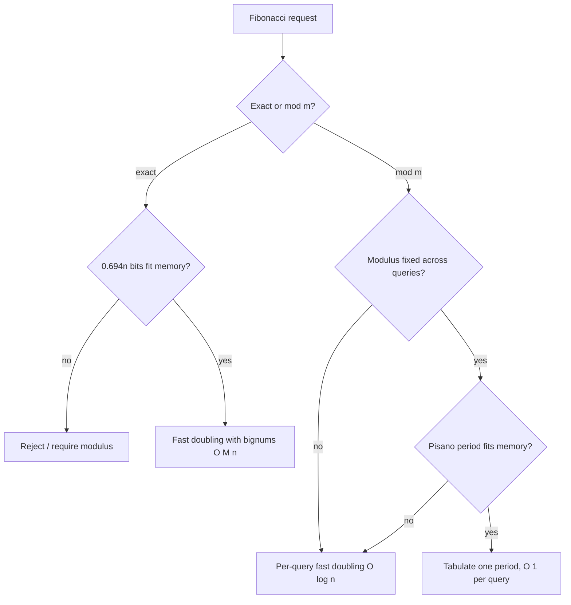

# Fibonacci Numbers — Senior Level

> Computing `F(n)` for tiny `n` is a one-liner — but when `n` reaches `10^18`, the answer is wanted modulo an arbitrary `m` (not just a prime), the exact non-modular value has hundreds of millions of digits, thousands of queries share one modulus, and the code runs in a hot service loop, every decision (Pisano-period reduction, the right `O(log n)` method, overflow with a 64-bit modulus, big-integer growth, generalizing to arbitrary linear recurrences) becomes a correctness or performance incident.

## Table of Contents

1. [Introduction](#1-introduction)
2. [The Pisano Period: Modular Fibonacci at Scale](#2-the-pisano-period-modular-fibonacci-at-scale)
3. [Computing the Pisano Period](#3-computing-the-pisano-period)
4. [Modulus That Is Not Prime](#4-modulus-that-is-not-prime)
5. [Big-Integer Growth and Exact Values](#5-big-integer-growth-and-exact-values)
6. [Choosing the Method at Scale](#6-choosing-the-method-at-scale)
7. [Code Examples](#7-code-examples)
8. [Generalizing to Arbitrary Linear Recurrences](#8-generalizing-to-arbitrary-linear-recurrences)
9. [Observability and Testing](#9-observability-and-testing)
10. [Failure Modes](#10-failure-modes)
11. [Summary](#11-summary)

---

## 1. Introduction

At senior level the question is no longer "how do I compute `F(n)`" but "what breaks when I scale this, and which tool is actually right?" Fibonacci computation shows up in three production guises that share the `O(log n)` engine from `middle.md`:

1. **Single huge-index modular evaluation** — "compute `F(10^18) mod m`" for an arbitrary `m`. Fast doubling or the matrix gives `O(log n)`; the Pisano period can shrink the index first.
2. **Many queries on one modulus** — thousands of `F(n_i) mod m` queries. Precompute the Pisano period `π(m)` once, reduce every index `n_i mod π(m)`, and answer from a single tabulated period in `O(1)` each.
3. **Exact (non-modular) value** — the true `F(n)`, which has `Θ(n)` digits. Now arithmetic is *not* `O(1)` per operation; big-integer multiplication dominates, and the `log n` advantage erodes.

All three reduce to the same skill set: keep the arithmetic exact and overflow-free, exploit the periodicity of `F(n) mod m`, pick fast doubling over the matrix for plain Fibonacci, know when the value is too big for `O(1)` arithmetic, and verify against a slow oracle. The general "any linear recurrence is a matrix power" machinery (companion matrices, Kitamasa, CRT) lives in `19-number-theory/11-matrix-exponentiation`; this document specializes those ideas to Fibonacci and adds the Fibonacci-specific Pisano-period optimization.

The recurring senior theme is **matching the tool to the workload, not the textbook**: fast doubling for a single large-`n` value, a Pisano table only when the period fits memory, a prefix array for dense small indices, big integers or CRT for exact values, and early *rejection* of requests whose exact answer would not fit at all. Each of these is a different point in a `(modulus fixed?, index range, exact?, query volume)` design space, and choosing wrong — e.g. tabulating a 2-billion-entry period, or attempting an 80 GB exact value — is a real incident. The sections below walk that design space.

---

## 2. The Pisano Period: Modular Fibonacci at Scale

### 2.1 The sequence `F(n) mod m` is periodic

Because each state `(F(n) mod m, F(n+1) mod m)` is one of only `m²` possible pairs, by the pigeonhole principle some pair must repeat as `n` increases. The map `(a, b) → (b, a+b)` mod `m` is *invertible* (you can recover `(a, b)` from `(b, a+b)` as `(a+b − b, b) = (a, b)`), so the repetition is *pure*: there is no pre-period, the sequence cycles from the very start. The pair `(F(0), F(1)) = (0, 1)` reappears, and the gap until it does is the **Pisano period** `π(m)`.

```
m = 2:  0 1 1 | 0 1 1 | ...        π(2)  = 3
m = 3:  0 1 1 2 0 2 2 1 | 0 1 ...  π(3)  = 8
m = 10: ... period 60               π(10) = 60
```

### 2.2 Why it matters

For a *single* query, `O(log n)` fast doubling already makes `n = 10^18` trivial — the Pisano period saves nothing. The period is a **batch** optimization:

> Given many queries `F(n_i) mod m` for a *fixed* `m`: compute `π(m)` once, tabulate one full period `F(0..π(m)-1) mod m` once (`O(π(m))`), then answer each query as `table[n_i mod π(m)]` in `O(1)`.

This turns `Q` queries from `O(Q log n)` into `O(π(m) + Q)`. When `π(m)` is small relative to `Q log n`, it is a large win. The known bound `π(m) ≤ 6m` (with equality only for `m = 2·5^k`) guarantees the table is at most linear in `m`.

### 2.3 Bounds and structure

- `π(m) ≤ 6m`, with `π(m) = 6m` iff `m = 2·5^k`.
- `π` is **multiplicative on coprime factors**: if `gcd(a, b) = 1` then `π(ab) = lcm(π(a), π(b))`. So factor `m`, compute `π(p^k)` per prime power, and `lcm` them.
- For a prime `p`, `π(p)` divides `p − 1` if `p ≡ ±1 (mod 5)`, and divides `2(p+1)` if `p ≡ ±2 (mod 5)`. (`5` itself has `π(5) = 20`.) This number-theoretic structure comes from where `√5` lives mod `p` (the golden ratio is rational mod `p` iff 5 is a quadratic residue).
- `π(p^k) = p^{k-1} · π(p)` is conjectured (and verified for all checked `p`); the rare exceptions ("Wall–Sun–Sun primes") are unknown to exist.

### 2.4 A worked period-by-factoring

To compute `π(120)`: factor `120 = 2^3 · 3 · 5`. Then `π(2^3) = 2^2 · π(2) = 4 · 3 = 12`, `π(3) = 8`, `π(5) = 20`. Since the factors are coprime, `π(120) = lcm(12, 8, 20) = 120`. This factor-and-lcm path computes a period for `m` far beyond what the `O(6m)` brute-force loop could reach — the bottleneck becomes factoring `m`, not walking the sequence. For `m` up to ~`10^7` the brute-force `pisano(m)` loop is simpler and fast enough; beyond that, factor-and-lcm is the only feasible route. A production period-finder should branch on `m`'s size: brute force below a threshold, factor-and-lcm above it.

---

## 3. Computing the Pisano Period

### 3.1 The robust general method

The bulletproof way to get `π(m)` for *any* `m` is to iterate the modular recurrence until the seed pair `(0, 1)` returns:

```
pisano(m):
    if m == 1: return 1
    a, b = 0, 1
    for i in 1 .. 6*m:
        a, b = b, (a + b) % m
        if a == 0 and b == 1:
            return i
```

This is `O(π(m)) ≤ O(6m)` time, `O(1)` space — fine for `m` up to about `10^7`. For larger `m`, use the factor-and-lcm structure (Section 2.3): factor `m`, compute each `π(p^k)` (the prime case `π(p)` divides a small known multiple, so test divisors of `p−1` or `2(p+1)` by checking `F(d) ≡ 0, F(d+1) ≡ 1 mod p^k` via fast doubling), and `lcm` the results.

### 3.2 Worked period: `m = 10`

```
n : 0 1 2 3 4 5 6 7 8 9 10 11 ... 
F%10: 0 1 1 2 3 5 8 3 1 4  5  9 ...
```

The pair `(0,1)` reappears at `n = 60`, so `π(10) = 60`. Check via structure: `10 = 2·5`, `π(2) = 3`, `π(5) = 20`, and `lcm(3, 20) = 60`. ✓

### 3.3 Using it for a query batch

Given `π(m)` and a precomputed table of one period, `F(n) mod m = table[n mod π(m)]`. For `n = 10^18` and `m = 10`: `π(10) = 60`, `10^18 mod 60 = 40`, so `F(10^18) mod 10 = table[40]`. No fast doubling needed at query time — just a modulo and a table lookup.

### 3.4 When the period is too large to tabulate

The Pisano table is only useful when `π(m)` fits in memory. For `m = 10^9 + 7` (a prime `≡ 2 mod 5`), `π(m)` can be near `2(p+1) ≈ 2·10^9` — 16 GB as an `int64` table, infeasible. The decision rule:

```
if pisano(m) * 8 bytes <= memory_budget:  build table, O(1) per query
else:                                       per-query fast doubling, O(log n) each
```

So the period optimization is *conditional*: it shines for small or moderate `m` (where `π(m) ≤ 6m` is a manageable table) and is abandoned for large prime moduli where `π(m)` is astronomically large. Never assume the table is always the answer; compute `π(m)` first and compare against the budget. This is the single most common Pisano mistake at scale — tabulating a 2-billion-entry period because "the Pisano period is the optimization."

### 3.5 Partial periods and on-demand fill

A middle ground: if a *batch* of queries on a fixed large-`m` falls within a bounded index window `[0, N]` with `N ≪ π(m)`, tabulate only `F(0..N) mod m` (the prefix, not the full period) and serve from it. This `O(N)` prefix is cheaper than the full period and answers all in-window queries in `O(1)`; out-of-window queries fall back to fast doubling. Choosing prefix-vs-period-vs-fast-doubling is exactly the `N` vs `π(m)` vs `log n` comparison of §8.5.

---

## 4. Modulus That Is Not Prime

A subtle but important senior point: **Fibonacci needs no division**, so a composite or even non-coprime modulus is completely fine for *computing* `F(n) mod m`.

- The recurrence `F(n) = F(n-1) + F(n-2)` and the fast-doubling identities use only `+`, `−`, `×` — never a modular inverse. So `F(n) mod m` is well-defined and computed identically whether `m` is prime, a prime power, or an arbitrary composite. This is unlike many number-theory algorithms (e.g. binomial coefficients mod `m`) that *require* `m` prime for the inverse.
- The only care is the **subtraction** `2·F(k+1) − F(k)` in fast doubling: normalize to `[0, m)` with `((x % m) + m) % m`. This holds for any `m`.
- If you *do* want to exploit structure (CRT across prime-power factors, or the multiplicative Pisano period), factor `m` — but for plain computation, you can hand fast doubling any `m`.

This makes Fibonacci a rare "modulus-agnostic" algorithm: pass it `m = 12`, `m = 2^32`, or `m = 10^9+7` and the code is the same.

### 4.1 Why this is worth emphasizing

Many number-theory algorithms (binomial coefficients `mod m`, modular division, discrete logs) *require* `m` prime — or require factoring `m` and applying CRT and Lucas's theorem — because they divide. A reviewer who pattern-matches "number theory mod m" to "needs a prime modulus" will over-engineer Fibonacci with unnecessary CRT machinery. State explicitly in code comments that the modulus is unrestricted, with the only hidden requirement being the subtraction normalization. The `m = 2^k` case (natural `uint` wraparound) is especially clean: with an unsigned type and `m = 2^32` or `2^64`, the reduction is *implicit* (hardware wraps), so modular Fibonacci is the plain recurrence on `uint32`/`uint64` with no explicit `% m` at all — the fastest possible modular variant.

---

## 5. Big-Integer Growth and Exact Values

### 5.1 The `O(log n)` advantage assumes `O(1)` arithmetic

Over `ℤ_m` with fixed-width `m`, each scalar operation is `O(1)`, so fast doubling and the matrix are `O(log n)`. But the **exact** (non-modular) `F(n)` grows like `φ^n`, so it has about `n · log₂ φ ≈ 0.694 n` bits. For `n = 10^6` that is ~694,000 bits (~209,000 decimal digits); for `n = 10^9` it is gigabytes. Big-integer multiplication of `d`-bit numbers costs `M(d)` (schoolbook `O(d²)`, Karatsuba `O(d^{1.585})`, FFT `O(d log d)`), so the per-operation cost is *not* `O(1)`.

### 5.2 Fast doubling is still the right exact method

Even for exact big-integer Fibonacci, fast doubling beats the `O(n)` loop because it does only `O(log n)` *big multiplications*, and the dominant cost is the final few multiplications on near-full-size numbers. The total is `O(M(n))` (dominated by the last doubling step), versus the loop's `O(n²)`-ish cost of `n` additions on growing numbers. In Python, `fib_pair(n)` with native bignums is the standard way to get an exact `F(10^6)`.

A subtle performance note: the *additions* in the loop are not free for big numbers — adding two `d`-bit numbers is `O(d)`, and over `n` steps with `d` growing to `Θ(n)`, the loop's total is `Θ(n²)` bit-operations. Fast doubling replaces this with `O(log n)` multiplications; the last multiplication on `Θ(n)`-bit operands dominates at `O(M(n))`, which with an FFT-based bignum library is `O(n log n log log n)` — vastly better than `Θ(n²)`. So for *exact* large Fibonacci, fast doubling is not merely a constant-factor win over the loop; it is asymptotically faster, and the gap widens with `n`.

### 5.3 CRT for a bounded exact value

If you need the exact value but it fits below a product of small primes, run fast doubling under several coprime moduli `m_1, …, m_t` (each `O(log n)` with `O(1)` arithmetic) and reconstruct via CRT. The number of primes is `⌈0.694 n / log₂(m)⌉`. Each modular run is independent and parallelizable. This is the same pipeline as in `19-number-theory/11-matrix-exponentiation`, applied to Fibonacci; it is worthwhile when the bignum path is the bottleneck and the value's size is known.

### 5.4 Estimating size with Binet (safely)

Binet's formula `F(n) ≈ φ^n / √5` is *unsafe for exact values* (Section 9 / `professional.md`) but *perfect for size estimation*: `log₂ F(n) ≈ n log₂ φ − ½ log₂ 5 ≈ 0.694 n − 1.16`. Use it to budget big-integer buffers or CRT prime counts — never to produce a digit of the answer.

### 5.5 Memory and time profile of exact computation

A senior must be able to predict the resource cost *before* running an exact-Fibonacci job, because the numbers blow up fast:

| `n` | bits of `F(n)` (≈0.694n) | bytes (exact) | fast-doubling time (FFT bignum) |
|------|---------------------------|----------------|----------------------------------|
| 10³ | ~694 | ~87 B | microseconds |
| 10⁶ | ~694,000 | ~87 KB | milliseconds |
| 10⁹ | ~694 Mb | ~87 MB | seconds |
| 10¹² | ~694 Gb | ~87 GB | minutes-to-hours, likely OOM |

The lesson: exact `F(n)` is feasible to about `n = 10^8`–`10^9` on a single machine; beyond that, either the answer is wanted modulo something (restoring `O(1)` arithmetic and `O(log n)` time) or it genuinely does not fit in memory. A request for "exact `F(10^{12})`" should be *rejected at validation time* using the Binet size estimate, not attempted. This early-rejection discipline — sizing the answer before computing it — is a hallmark of senior-level capacity planning.

---

## 6. Choosing the Method at Scale

| Situation | Best tool | Why |
|-----------|-----------|-----|
| Small `n` (≤ ~10⁶), single value | `O(n)` loop | Simplest; no `log n` machinery needed. |
| Large `n`, single `F(n) mod m` | **Fast doubling** | `O(log n)`, fewest multiplications; modulus-agnostic. |
| Large `n`, single value, need generality | Matrix exponentiation | Same `O(log n)`; reuse the general recurrence solver. |
| Many queries, one fixed `m` | **Pisano period + table** | `O(π(m) + Q)` instead of `O(Q log n)`; `π(m) ≤ 6m`. |
| Exact (non-modular) `F(n)`, moderate `n` | Fast doubling with bignums | `O(M(n))`; only `O(log n)` big multiplies. |
| Exact value, parallel infrastructure | CRT across primes | Each prime an independent `O(log n)` modular run. |
| Size estimate only | Binet `0.694 n` bits | `O(1)`; never for exact digits. |



The two senior reflexes: **fast doubling for a single value, Pisano period for a batch on a fixed modulus** (when the period fits memory). Reaching for the matrix when fast doubling would do adds constant-factor cost for no gain on plain Fibonacci; reaching for fast doubling per query when a Pisano table would serve the whole batch wastes `O(Q log n)`; and tabulating a period that is gigabytes wide is worse than just using fast doubling. The decision is genuinely multi-dimensional — there is no single "best" method, only the best match to the workload's `(modulus, index range, exactness, volume)` profile.

A useful sanity check before committing to any method: estimate the answer's *size* (`0.694 n` bits) and the *period's* size (`≤ 6m`) first. Those two numbers — value size and period size — decide almost every branch: a huge value size rules out exact computation; a huge period size rules out the Pisano table. Compute them in the request validator, not after allocating buffers.

---

## 7. Code Examples

### 7.1 Go — Pisano period and batched modular queries

```go
package main

import "fmt"

// pisano computes the Pisano period for any modulus m (robust O(6m) method).
func pisano(m int) int {
	if m == 1 {
		return 1
	}
	a, b := 0, 1
	for i := 1; i <= 6*m; i++ {
		a, b = b, (a+b)%m
		if a == 0 && b == 1 {
			return i
		}
	}
	return -1 // unreachable for valid m
}

// fibModBatch answers many F(n_i) mod m queries via one tabulated period.
func fibModBatch(m int, queries []int64) []int {
	p := pisano(m)
	table := make([]int, p)
	if p >= 1 {
		table[0] = 0
	}
	if p >= 2 {
		table[1] = 1 % m
	}
	for i := 2; i < p; i++ {
		table[i] = (table[i-1] + table[i-2]) % m
	}
	ans := make([]int, len(queries))
	for i, n := range queries {
		ans[i] = table[int(n%int64(p))]
	}
	return ans
}

func main() {
	fmt.Println(pisano(10)) // 60
	// F(10^18) mod 10 = table[10^18 mod 60] = table[40]
	fmt.Println(fibModBatch(10, []int64{10, 1_000_000_000_000_000_000}))
}
```

### 7.2 Java — fast doubling for arbitrary (possibly composite) modulus

```java
public class FibAnyMod {
    // Returns {F(n), F(n+1)} mod m for ANY m (no division needed).
    static long[] fibPair(long n, long m) {
        if (n == 0) return new long[]{0 % m, 1 % m};
        long[] p = fibPair(n >> 1, m);
        long a = p[0], b = p[1];
        long twoBMinusA = (((2 * b % m) - a) % m + m) % m; // normalize subtraction
        long c = a * twoBMinusA % m;          // F(2k)
        long d = (a * a % m + b * b % m) % m;  // F(2k+1)
        if ((n & 1) == 0) return new long[]{c, d};
        return new long[]{d, (c + d) % m};
    }

    static long fibMod(long n, long m) {
        return fibPair(n, m)[0];
    }

    public static void main(String[] args) {
        System.out.println(fibMod(100, 1_000_000_007L)); // 687995182
        System.out.println(fibMod(100, 12L));            // composite modulus, fine
        System.out.println(fibMod(1_000_000_000_000_000_000L, 1_000_000L));
    }
}
```

### 7.3 Python — exact big-integer Fibonacci and CRT size budgeting

```python
import math

PHI = (1 + 5 ** 0.5) / 2


def fib_exact(n):
    """Exact F(n) using fast doubling with Python bignums. O(log n) big multiplies."""
    def pair(k):
        if k == 0:
            return (0, 1)
        a, b = pair(k >> 1)
        c = a * (2 * b - a)   # F(2k)  -- exact integers, no mod
        d = a * a + b * b     # F(2k+1)
        return (c, d) if k & 1 == 0 else (d, c + d)
    return pair(n)[0]


def fib_bits(n):
    """Approximate bit-length of F(n) for buffer/CRT budgeting (NOT the value)."""
    if n <= 1:
        return 1
    return max(1, int(n * math.log2(PHI) - 0.5 * math.log2(5)))


def crt_primes_needed(n, prime_bits=30):
    return fib_bits(n) // prime_bits + 1


if __name__ == "__main__":
    print(fib_exact(10))          # 55
    print(len(str(fib_exact(1000))))  # 209 digits
    print(fib_bits(10**6), "bits;", crt_primes_needed(10**6), "CRT primes")
    # Reminder: fib_bits is a SIZE estimate via Binet; never a source of digits.
```

### 7.4 Cross-check oracle (all three languages)

The highest-value safeguard is a slow `O(n)` loop diffed against the fast path for every small `n`. It catches the off-by-one (`F(n)` vs `F(n+1)`), the negative-residue bug, and the wrong matrix entry — the bugs that survive every algebraic check.

```python
def fib_loop(n, m=10**9 + 7):
    a, b = 0, 1
    for _ in range(n):
        a, b = b, (a + b) % m
    return a


def cross_check():
    for n in range(2001):
        assert fib_pair(n)[0] == fib_loop(n), f"mismatch at {n}"  # fib_pair from middle.md
```

```go
func fibLoop(n int64, m int64) int64 {
	a, b := int64(0), int64(1)
	for i := int64(0); i < n; i++ {
		a, b = b, (a+b)%m
	}
	return a
}
// crossCheck: for n in 0..2000, assert fastDoubling(n) == fibLoop(n).
```

```java
static long fibLoop(long n, long m) {
    long a = 0, b = 1;
    for (long i = 0; i < n; i++) { long t = (a + b) % m; a = b; b = t; }
    return a;
}
// crossCheck: for n in 0..2000, assert fibMod(n, m) == fibLoop(n, m).
```

---

## 8. Generalizing to Arbitrary Linear Recurrences

Fibonacci is the order-2 case of a general pattern. The senior who understands Fibonacci should recognize the generalization:

- **Any constant-coefficient linear recurrence** `f(n) = c_1 f(n-1) + … + c_k f(n-k)` is `state_n = M^n · state_0` with a `k × k` **companion matrix** (top row = coefficients, sub-diagonal = identity shift). This is `O(k³ log n)`. Fibonacci is `k = 2`. Full treatment: `19-number-theory/11-matrix-exponentiation`.
- **Fast doubling generalizes too**, but the clean two-identity form is special to Fibonacci (and Lucas-like sequences). For general `k`, the analogous speedup is **Kitamasa** (`O(k² log n)`), working with the characteristic polynomial. For order 2, fast doubling is the hand-tuned optimum.
- **The Pisano period generalizes** to the eventual period of `f(n) mod m`, which exists for the same pigeonhole reason (finite state space `m^k`). For Fibonacci the period has the clean `≤ 6m` bound and the `√5`-mod-`p` structure; general recurrences have periods dividing the order of `M` in `GL_k(ℤ_m)`.
- **Lucas numbers** `L(n) = L(n-1) + L(n-2)`, `L(0)=2, L(1)=1`, satisfy the *same* matrix and admit *the same* fast-doubling identities (with different seeds), plus `L(n) = F(n-1) + F(n+1)` and `L(n) = F(2n)/F(n)`. They often appear alongside Fibonacci and share all the machinery.

The lesson: Fibonacci's `O(log n)` methods, modulus-agnosticism, and periodicity are *instances* of general linear-recurrence theory. When a problem presents a different recurrence, lift the same ideas to the companion matrix.

---

## 8.5 Caching, Precomputation, and Service Design

Beyond a single call, Fibonacci shows up in services that answer streams of requests. The right caching strategy depends on the query distribution.

### 8.5.1 Fixed modulus, unbounded indices → Pisano table

This is the canonical case (Section 2). Build `π(m)` and the period table once at startup, share it read-only across workers, and each request is `n mod π(m)` plus an array read. Memory is `O(π(m)) ≤ O(6m)` integers; for `m = 10^6` that is at most ~6M entries (~48 MB of `int64`), which is fine. For larger `m` where `6m` would be too big to tabulate, fall back to per-query fast doubling — the table is an optimization, not a requirement, and you choose based on whether `π(m)` fits your memory budget.

### 8.5.2 Many distinct moduli → no shared table

If each request carries its own `m`, there is no shared period to precompute. Use per-query fast doubling, `O(log n)` each, and ensure the subtraction normalization and (for large `m`) the `mulmod` are in place. Do not attempt to cache per-`m` tables unless a few moduli dominate the traffic (then cache the hot ones with an LRU keyed on `m`).

### 8.5.3 Dense small indices → precompute a prefix array

If requests cluster in `[0, N]` for a modest `N` (say `≤ 10^7`), precompute `F(0..N) mod m` once (`O(N)`) and answer in `O(1)`. This beats both fast doubling (no per-query `log n`) and the Pisano table (no modulo needed) when `N ≪ π(m)`. The decision is `N` vs `π(m)`: tabulate whichever is smaller.

### 8.5.4 Cross-language determinism

A service often has components in different languages. Because Fibonacci is pure integer arithmetic, Go, Java, and Python produce *bit-identical* `F(n) mod m` for the same inputs — a useful invariant for cross-language consistency tests and for migrating a hot path from Python to Go without behavior drift. The only caveat is the large-`m` `mulmod`: Python is implicitly correct (bignums), so a Go/Java port must add the explicit `mulmod` to match.

---

## 8.6 Estimation and Capacity Planning

A senior is often asked "how big / how slow / how much memory" before writing code. Binet gives instant back-of-envelope answers — for *sizing*, never for digits.

- **How many bits is `F(n)`?** `≈ 0.694 n`. So `F(10^6)` is ~694 Kb (~87 KB), `F(10^9)` is ~83 MB, `F(10^{12})` is ~83 GB. This immediately tells you whether an exact value is even storable.
- **How many decimal digits?** `≈ 0.209 n`. `F(1000)` has 209 digits; `F(10^6)` has ~209,000.
- **How long to compute exactly?** Fast doubling does `O(log n)` big multiplies; the last one dominates at `O(M(0.694 n))` bit-operations. For `n = 10^6`, that is one ~700 Kb × 700 Kb multiply — milliseconds with an FFT-based bignum, sub-second with Karatsuba.
- **How many CRT primes for an exact bounded value?** `⌈0.694 n / bits(prime)⌉`. With 30-bit primes, `F(10^4)` (≈6940 bits) needs ~232 primes — each an independent `O(log n)` modular run.

These estimates let you reject infeasible requests early (e.g. "return exact `F(10^{12})`" needs 83 GB — refuse or switch to modular) instead of discovering the blow-up at runtime.

---

## 8.7 Backward Computation and the Negafibonacci Extension

Occasionally a system needs Fibonacci numbers at *negative* indices — running the recurrence backward, or treating Fibonacci as a two-sided sequence (e.g. in lattice/Diophantine code). The rule is `F(-n) = (-1)^{n+1} F(n)`, so:

- To compute `F(-n) mod m`, compute `F(n) mod m` by fast doubling, then negate if `n` is even: `F(-n) ≡ (n even ? -F(n) : F(n)) (mod m)`, normalized to `[0, m)`.
- The matrix view: `M^{-1} = [[0,1],[1,-1]]` (since `det M = -1`), so stepping backward is multiplying by `M^{-1}`. Because `det M` is a unit mod any `m`, `M` is always invertible mod `m`, and backward computation is as well-defined as forward.
- A common bug is mishandling the sign parity. Verify: `F(-1) = 1, F(-2) = -1, F(-3) = 2, F(-4) = -3`. The magnitudes mirror the positive side; only the sign alternates.

This is rarely on the hot path, but when it appears (negafibonacci coding, two-sided recurrences), the senior should reach for the `(-1)^{n+1}` rule rather than re-deriving a separate backward loop.

## 8.8 Sharding and Divisibility via the Rank of Apparition

For systems that must answer *divisibility* questions ("is `F(n)` divisible by `m`?") or shard work by Fibonacci structure, the **rank of apparition** `α(m)` — the least `n > 0` with `m | F(n)` — is the right tool.

- `m | F(n) ⟺ α(m) | n`. So a divisibility query becomes a single modulo on the *index*, `O(1)` once `α(m)` is precomputed, never computing `F(n)` at all.
- `α(m)` divides the Pisano period `π(m)` (with `π(m) = α(m)·t`, `t ∈ {1,2,4}`), so computing `α(m)` is a byproduct of period analysis: scan the period table for the first zero.
- Practical use: if you partition Fibonacci-indexed work across shards by "indices where `m | F(n)`," those are exactly the multiples of `α(m)` — a clean, evenly spaced sharding key. Examples: every 3rd Fibonacci is even (`α(2)=3`), every 4th divisible by 3 (`α(3)=4`), every 5th by 5 (`α(5)=5`).

This turns expensive value-divisibility into cheap index-arithmetic, the senior pattern of "reduce the question to the index domain before touching the values."

## 9. Observability and Testing

A Fibonacci term is opaque — one wrong digit looks like any other large number. Build checks in from day one.

| Check | Why |
|-------|-----|
| Naive `O(n)` loop oracle on small `n` | Catches off-by-one, negative-residue, wrong-entry bugs. |
| Known values: `F(10)=55`, `F(20)=6765`, `F(100) mod 10^9+7 = 687995182` | Cheap spot checks. |
| Identity `F(2k) = F(k)(2F(k+1)−F(k))` | Validates the fast-doubling step independently. |
| `gcd(F(m), F(n)) = F(gcd(m, n))` | A structural property test (see `professional.md`). |
| Pisano: `table[π(m)] == 0`, `table[π(m)+1] == 1` | Confirms the period and the table. |
| `F(n) mod m == F(n mod π(m)) mod m` | Cross-validates the period optimization against direct fast doubling. |
| Residues stay in `[0, m)` | Catches un-normalized subtraction. |
| Growth `log₂ F(n) ≈ 0.694 n` | Sanity-checks exact magnitudes. |

The single most valuable test is the **naive-loop oracle** for `n` up to a few thousand. It catches the overwhelming majority of bugs, especially the `F(n)`-vs-`F(n+1)` off-by-one and the negative-residue corruption that survive every algebraic check.

### 9.1 Production metrics

For a Fibonacci-serving endpoint, the metrics that matter:

| Metric | Why / alert threshold |
|--------|------------------------|
| `query_latency_p99` | Fast doubling is `O(log n)`; a spike signals fallback to a loop or an oversized bignum path. |
| `pisano_table_build_seconds` | One-time at startup; if it recurs, the table is being rebuilt per request (a regression). |
| `pisano_table_bytes` | `≤ 6m · 8` bytes; alert if `π(m)` is unexpectedly large (near the `6m` bound for `m = 2·5^k`). |
| `bigint_value_bits` | `≈ 0.694 n`; alert before an exact request would exhaust memory. |
| `modulus_overflow_guard_hits` | Counts large-`m` requests routed to `mulmod`; confirms the guard fires. |
| `cross_lang_mismatch_count` | Must stay zero; any nonzero means a port diverged (often a missing `mulmod`). |

### 9.2 Worked production scenario

A leaderboard service must answer `F(n_i) mod 10^9+7` for up to `10^6` requests/second, with `n_i` up to `10^18`. Design: `m` is fixed, so compute `π(10^9+7)` once at startup. Here `10^9+7` is prime and `≡ 2 (mod 5)`, so `π | 2(p+1) ≈ 2·10^9` — too large to tabulate (16 GB). Therefore the Pisano table is *not* viable for this `m`; fall back to per-request **fast doubling**, `O(log n) ≈ 60` multiplications each, easily sustaining `10^6` rps per core. The senior lesson: the Pisano table is the right tool only when `π(m)` is small enough to tabulate; for a large prime modulus it is not, and plain fast doubling wins. Always check `π(m)`'s size against the memory budget before choosing the table.

---

## 10. Failure Modes

### 10.1 Negative residue from the subtraction
`2·F(k+1) − F(k)` can be negative after a modular reduction; `%` is negative in Go/Java, poisoning later steps. Mitigation: `((x % m) + m) % m` on the subtraction.

### 10.2 Wrong matrix entry / off-by-one
Reading `M^n[0][0]` (= `F(n+1)`) instead of `[0][1]` (= `F(n)`), or returning `fib_pair(n)[1]`. Algebraically "correct for *some* index," so it passes property tests and only fails against the oracle's human-specified `n`. Mitigation: diff against the loop for the exact `n`.

### 10.3 Overflow with a large modulus
With `m` near `2^62`, the product `a*b` of two residues overflows `int64` *before* the `% m`, silently corrupting entries even though `m` "fits." Mitigation: use a `mulmod` (128-bit intermediate; see `19-number-theory/11-matrix-exponentiation` §2.5). Python is immune (bignums); Go and Java are not.

### 10.4 Treating Fibonacci like an inverse-requiring algorithm
Assuming `m` must be prime. It need not — Fibonacci uses no division. Mitigation: pass any `m`; only normalize the subtraction.

### 10.5 Float Binet for exact values
Using `round(φ^n / √5)` for an exact term fails past `n ≈ 70` (53-bit mantissa). Mitigation: exact terms → integer fast doubling (or CRT); floats only for size estimates.

### 10.6 Big-integer cost ignored
Assuming exact `F(10^9)` is `O(log n)` — it is not, the value has ~700 million bits. Mitigation: budget `O(M(n))` time and gigabytes of memory; consider whether a modulus or CRT bound suffices instead.

### 10.7 Per-query fast doubling when a Pisano table would serve
For a batch on a fixed `m`, recomputing fast doubling per query wastes `O(Q log n)`. Mitigation: build `π(m)` and the period table once; answer each query in `O(1)`.

### 10.8 Pisano loop bound too small
Iterating only `m` (not `6m`) times to find the period misses periods up to `6m`. Mitigation: bound the search by `6m`, or use the factor-and-lcm method for large `m`.

### 10.9 Tabulating an enormous period
Building a Pisano table for a large prime modulus (period near `2(p+1)`) allocates gigabytes and OOMs at startup. Mitigation: compute `π(m)` first, compare against the memory budget, and fall back to per-query fast doubling when the period is too large. The table is conditional, never automatic.

### 10.10 Attempting an infeasibly large exact value
Accepting "exact `F(10^{12})`" tries to allocate ~80 GB. Mitigation: estimate `0.694 n` bits in the validator and reject (or switch to modular) before any computation begins.

---

## 11. Summary

The senior view of Fibonacci is less about the algorithm and more about the *workload-to-tool mapping*:

- For a **single** `F(n) mod m`, fast doubling is `O(log n)` and modulus-agnostic (no division, so any `m` works); the matrix is the same complexity but slower by a constant factor.
- The **Pisano period** `π(m) ≤ 6m` makes `F(n) mod m` periodic; for a **batch** of queries on a fixed `m`, tabulate one period once and answer each in `O(1)` — `O(π(m) + Q)` instead of `O(Q log n)`. `π` is multiplicative on coprime factors and has clean prime structure from where `√5` lives mod `p`.
- A **non-prime modulus** is fine — Fibonacci needs no modular inverse; only normalize the subtraction `2F(k+1) − F(k)`.
- The **exact** value has `Θ(0.694 n)` bits, so arithmetic is not `O(1)`; fast doubling with bignums (`O(M(n))`) or CRT across primes (parallel, modular) are the exact paths. Binet estimates size only — never digits.
- Generalize the same ideas to **arbitrary linear recurrences** via the companion matrix (`O(k³ log n)`) or Kitamasa (`O(k² log n)`), and to **Lucas numbers** via shared identities. See `19-number-theory/11-matrix-exponentiation`.
- Keep a **naive-loop oracle**; it catches the off-by-one, negative-residue, and wrong-entry bugs that account for nearly every real Fibonacci defect.
- Use the **rank of apparition** `α(m)` for divisibility queries and Fibonacci-structured sharding — it reduces a value-divisibility test to `O(1)` index arithmetic.
- Always **size the answer and the period first** (in the request validator): `0.694 n` bits and `≤ 6m` decide nearly every method choice and let you reject infeasible requests early.

### Decision summary

- **Single `F(n) mod m`, large `n`** → fast doubling, `O(log n)`.
- **Batch on a fixed `m`** → Pisano period + tabulated period.
- **Exact value, moderate `n`** → fast doubling with bignums, `O(M(n))`.
- **Exact value, parallel** → CRT across primes.
- **General recurrence** → companion matrix / Kitamasa.
- **Large modulus near 2⁶²** → `mulmod` to avoid pre-reduction overflow.
- **Size estimate only** → Binet `0.694 n` bits; never for exact digits.
- **Large modulus, period too big to tabulate** → per-query fast doubling, not a Pisano table.
- **Modulus is a power of two** → unsigned-integer wraparound, no explicit `% m`.
- **Divisibility query (`m | F(n)?`)** → rank of apparition `α(m)`; check `α(m) | n` in `O(1)`.
- **Negative index** → `F(-n) = (-1)^{n+1} F(n)` via one forward fast doubling.

---

## Next step:

Continue to [`professional.md`](./professional.md) for the proofs: the **fast-doubling derivation** from the matrix identity, **Binet's closed form** and its numerical limits, the **gcd property** `gcd(F(m), F(n)) = F(gcd(m, n))`, Cassini's and the sum identities, and rigorous complexity.

---

## Further Reading

- Sibling topic `19-number-theory/11-matrix-exponentiation` — general companion matrices, Kitamasa, CRT pipeline, `mulmod`.
- cp-algorithms.com — "Fibonacci numbers" (Pisano period, fast doubling).
- Project Nayuki — "Fast Fibonacci algorithms" with exact-arithmetic timings.
- D. D. Wall, "Fibonacci Series Modulo m" (1960) — the original Pisano-period analysis.
- *Concrete Mathematics* — Fibonacci identities, Lucas numbers, generating functions.
