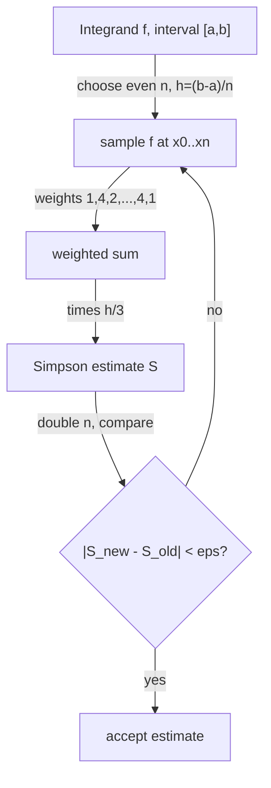

# Simpson's Rule and Numerical Integration — Junior Level

> **One-line summary:** To estimate a definite integral `∫_a^b f(x) dx` (the signed area under a curve) when you cannot solve it by hand, you slice `[a, b]` into small pieces and approximate the curve on each piece by a simple shape. The **trapezoidal rule** uses straight lines; **Simpson's rule** does better by fitting a **parabola** through three points, giving the formula `(h/3)·(f0 + 4f1 + 2f2 + 4f3 + ... + 4f_{n-1} + fn)` and an error that shrinks like `O(h^4)` — far faster than the trapezoid's `O(h^2)`.

---

## Table of Contents

1. [Introduction](#introduction)
2. [Prerequisites](#prerequisites)
3. [Glossary](#glossary)
4. [Core Concepts](#core-concepts)
5. [Big-O Summary](#big-o-summary)
6. [Real-World Analogies](#real-world-analogies)
7. [Pros & Cons](#pros--cons)
8. [Step-by-Step Walkthrough](#step-by-step-walkthrough)
9. [Code Examples](#code-examples)
10. [Coding Patterns](#coding-patterns)
11. [Error Handling](#error-handling)
12. [Performance Tips](#performance-tips)
13. [Best Practices](#best-practices)
14. [Edge Cases & Pitfalls](#edge-cases--pitfalls)
15. [Common Mistakes](#common-mistakes)
16. [Cheat Sheet](#cheat-sheet)
17. [Visual Animation](#visual-animation)
18. [Summary](#summary)
19. [Further Reading](#further-reading)

---

## Introduction

Suppose someone hands you a function `f(x) = e^(-x^2)` (the bell curve) and asks: *what is the area under it between `x = 0` and `x = 1`?* In calculus terms that is the definite integral `∫_0^1 e^(-x^2) dx`. The trouble is that this particular function has **no elementary antiderivative** — there is no neat formula `F(x)` you can plug the endpoints into. You cannot "just integrate it." So what do you do?

You estimate. The whole idea of **numerical integration** (also called **quadrature**) is: *if you cannot find the exact area, approximate it by chopping the region into thin vertical slices and adding up the areas of simple shapes that hug the curve.* The more slices, the closer your sum gets to the true area.

The simplest version is the one you may already know from a calculus class: the **trapezoidal rule**. On each thin slice you connect the two endpoints of the curve with a straight line, forming a trapezoid, and add up the trapezoid areas. It works, but a straight line is a crude stand-in for a curve — wherever the function bends, the line cuts a corner.

**Simpson's rule** is the smarter cousin. Instead of a straight line, it lays a little **parabola** (a curve of the form `y = αx^2 + βx + γ`) over each pair of slices, threading it through three points of `f`. A parabola can bend, so it follows a curving function much more faithfully than a straight line can. The result is a formula that is almost as easy to compute but dramatically more accurate:

```
∫_a^b f(x) dx ≈ (h/3) · [ f0 + 4f1 + 2f2 + 4f3 + 2f4 + ... + 4f_{n-1} + fn ]
```

where `h = (b - a)/n` is the slice width and `f_i = f(a + i·h)`. Notice the curious pattern of coefficients: `1, 4, 2, 4, 2, ..., 4, 1`. That `1-4-2-4-...-4-1` rhythm is the signature of Simpson's rule, and understanding *where it comes from* is the heart of this topic.

This file teaches the junior-level core:

- What a definite integral means as an **area**, and why we sometimes must approximate it.
- The **trapezoidal rule** as the warm-up, and exactly why a parabola beats a straight line.
- The **composite Simpson's 1/3 rule** — the `1-4-2-...-4-1` formula — with a fully worked example.
- The crucial fact that Simpson's error shrinks like `O(h^4)` while the trapezoid's only shrinks like `O(h^2)`.

The deeper material — *why* the error is exactly `O(h^4)`, the **adaptive Simpson** method that automatically puts more slices where the function is wiggly, comparison with **Gaussian quadrature**, and handling nasty integrands with spikes or infinities — is built up in `middle.md`, `senior.md`, and `professional.md`. This is a **numerical-methods topic**: the answers are approximations with controllable error, not exact integers, so a recurring theme is "how wrong might I be, and how do I make it less wrong?"

---

## Prerequisites

Before reading this file you should be comfortable with:

- **The definite integral as area** — `∫_a^b f(x) dx` is the signed area between the curve `y = f(x)` and the x-axis from `a` to `b`. Area above the axis counts positive, below counts negative.
- **Evaluating a function** — you can compute `f(x)` for any given `x` (in code, `f` is just a function you call).
- **Loops and arrays** — summing a series of terms in a `for` loop.
- **Floating-point numbers** — `double` / `float64`; you know that they are approximate and carry rounding error.
- **Big-O notation** — `O(n)` for "linear in the number of slices," and the idea that smaller error is better.

Optional but helpful:

- A glance at the **trapezoidal rule** if you have seen it — Simpson is a direct upgrade.
- The **area of a trapezoid** `(1/2)(base1 + base2)·width` and the idea of a **parabola** `y = αx^2 + βx + γ`.
- Knowing that some functions (like `e^(-x^2)`, `sin(x)/x`) have **no closed-form antiderivative**, which is precisely why numerical integration exists.

---

## Glossary

| Term | Meaning |
|------|---------|
| **Definite integral** | `∫_a^b f(x) dx`, the signed area under `f` between `a` and `b`. |
| **Numerical integration / quadrature** | Estimating that integral by sampling `f` at points and combining the values. |
| **Integrand** | The function `f(x)` being integrated. |
| **Interval `[a, b]`** | The range we integrate over. `a` is the lower limit, `b` the upper. |
| **n (number of subintervals)** | How many equal slices we cut `[a, b]` into. For Simpson, `n` must be **even**. |
| **h (step size)** | The width of each slice: `h = (b - a)/n`. Smaller `h` means more slices and more accuracy. |
| **Node / sample point** | An x-value `x_i = a + i·h` where we evaluate `f`. There are `n + 1` of them: `x_0 = a` up to `x_n = b`. |
| **`f_i`** | Shorthand for `f(x_i)`, the function value at node `i`. |
| **Trapezoidal rule** | Approximate each slice by a straight line (a trapezoid). Error `O(h^2)`. |
| **Midpoint rule** | Approximate each slice by a rectangle whose height is `f` at the slice's midpoint. Error `O(h^2)`. |
| **Simpson's 1/3 rule** | Approximate each *pair* of slices by a parabola. Error `O(h^4)`. |
| **Composite rule** | Applying a basic rule to many slices and summing — what we always do in practice. |
| **Approximation error** | The difference between the estimate and the true integral. |
| **Degree of precision** | The highest-degree polynomial a rule integrates *exactly*. Simpson's is 3. |
| **Adaptive integration** | Automatically using more slices where the curve is hard and fewer where it is easy (see `middle.md`). |

---

## Core Concepts

### 1. The integral is an area we slice into pieces

Picture the curve `y = f(x)` sitting above the x-axis between `a` and `b`. The integral is the area of that region. We cannot measure a curved region directly, so we **cut it into `n` thin vertical strips**, each of width `h = (b - a)/n`. If we can estimate the area of each strip and add them up, we get an estimate of the whole. This "cut, approximate each piece, sum" structure is shared by *every* quadrature rule — the rules differ only in **what simple shape they use for each strip**.

### 2. Trapezoidal rule: straight lines (the warm-up)

The easiest shape is a straight line connecting the top of the left edge `(x_i, f_i)` to the top of the right edge `(x_{i+1}, f_{i+1})`. That makes each strip a **trapezoid** with area `(h/2)(f_i + f_{i+1})`. Sum over all strips and the inner endpoints get counted twice:

```
T = (h/2) · [ f0 + 2f1 + 2f2 + ... + 2f_{n-1} + fn ]
```

The coefficient pattern is `1, 2, 2, ..., 2, 1`. Simple and decent — but a straight line cannot follow a curving function, so it systematically over- or under-shoots wherever `f` bends. Its error is `O(h^2)`: halve `h` and the error drops by a factor of about 4.

### 3. Simpson's rule: fit a parabola through three points

Here is the key upgrade. Take **two** adjacent strips at once — three points `(x_0, f_0)`, `(x_1, f_1)`, `(x_2, f_2)`, evenly spaced. Through any three points there passes exactly one parabola `y = αx^2 + βx + γ`. A parabola can *bend*, so it hugs a curving `f` much more tightly than a chord could. Now integrate that parabola exactly (we can — parabolas have easy integrals). The result, for one pair of strips of width `h`, is the beautifully simple:

```
∫_{x0}^{x2} (parabola) dx = (h/3) · (f0 + 4f1 + f2)
```

That `1, 4, 1` weighting — the **basic Simpson rule** — is the atom of everything. The middle point gets weight 4 because the parabola spends most of its arc near the middle; the endpoints get weight 1.

### 4. Composite Simpson: stitch many parabolas together

In practice one pair of strips is not enough, so we chain the basic rule across the whole interval. We need `n` to be **even** (so the strips pair up cleanly into `n/2` parabolas). When we add up the per-pair `(h/3)(f0 + 4f1 + f2)` contributions, the *shared* boundary points between consecutive pairs get weight `1 + 1 = 2`, while the strictly-interior odd points keep weight `4`. That produces the famous composite pattern:

```
S = (h/3) · [ f0 + 4f1 + 2f2 + 4f3 + 2f4 + ... + 2f_{n-2} + 4f_{n-1} + fn ]
```

Read it as: **endpoints weight 1, odd-index points weight 4, even-index interior points weight 2, all times h/3.** This single formula is what you will implement.

### 5. Why Simpson is so much better: O(h^4)

The payoff is accuracy. The trapezoidal rule's error is proportional to `h^2`; Simpson's error is proportional to `h^4`. That difference is enormous. Halve `h` (double the number of slices):

```
Trapezoid error: divides by 2^2 = 4
Simpson error:   divides by 2^4 = 16
```

So with the *same* number of function evaluations, Simpson is typically far more accurate — often by orders of magnitude on smooth functions. The reason, intuitively, is that a parabola matches not just the value but the *curvature* of `f`; and a happy accident (symmetry) buys an extra order on top, making Simpson exact for cubics too. The full story is in `professional.md`.

### 6. Degree of precision: Simpson is exact for cubics

A surprising bonus: Simpson's rule integrates **every cubic polynomial exactly**, not just quadratics — even though it was built from a *parabola*. We say its **degree of precision is 3**. (Trapezoid's degree of precision is only 1 — exact for straight lines.) This is why Simpson punches above its weight: you fit a degree-2 curve but get degree-3 accuracy for free, thanks to error symmetry. The midpoint rule, similarly, has degree of precision 1 but a smaller constant than the trapezoid.

### 7. The numerical-methods mindset: error is the product

Unlike an exact algorithm (sort, GCD), the *answer here is approximate*. The real deliverable of numerical integration is **an estimate together with confidence in its error**. You control accuracy by choosing `n` (more slices = smaller `h` = smaller error), but more slices cost more function calls, and at some point floating-point round-off stops you from improving. Balancing "how accurate" against "how much work" is the engineer's job — and the **adaptive** methods in `middle.md` automate exactly that trade-off.

---

## Big-O Summary

| Operation | Time | Space | Notes |
|-----------|------|-------|-------|
| Trapezoidal rule, `n` slices | **O(n)** | O(1) | One pass; `n + 1` function evaluations. |
| Midpoint rule, `n` slices | O(n) | O(1) | `n` function evaluations (at the midpoints). |
| Composite Simpson, `n` slices | O(n) | O(1) | `n + 1` evaluations; `n` must be even. |
| One basic Simpson panel | O(1) | O(1) | Three evaluations, the `(h/3)(f0+4f1+f2)` formula. |
| Adaptive Simpson (target error `ε`) | O(depends on `f`) | O(depth) | More panels where `f` is hard; recursion depth is the space cost. See `middle.md`. |

The headline cost is **O(n)** — numerical integration is linear in the number of slices, and the *dominant* expense is usually the function evaluations `f(x_i)` themselves, not the arithmetic. The win of Simpson is not a better Big-O than the trapezoid (both are `O(n)`); it is that Simpson reaches a given accuracy with **far smaller `n`** because its error decays as `h^4` rather than `h^2`.

---

## Real-World Analogies

| Concept | Analogy |
|---------|---------|
| Slicing `[a, b]` into strips | Measuring the area of a lake by laying down many thin parallel measuring tapes and adding the strip areas. |
| Trapezoidal rule | Approximating a hilly skyline with straight ramps between lamp-posts — fine on flat stretches, sloppy on curves. |
| Simpson's parabola | Approximating the same skyline with gentle arches instead of ramps — the arches bend to follow the hills. |
| Weight 4 on the middle point | A see-saw balanced so the center of each arch carries most of the area's "vote." |
| Smaller `h` | Using more, narrower measuring tapes — more work, more precision. |
| `O(h^4)` vs `O(h^2)` | Doubling your tapes makes the trapezoid 4× better but Simpson 16× better, for the same extra effort. |
| Adaptive Simpson | A surveyor who walks slowly with tiny steps across rocky ground and fast with big steps across a flat field. |

Where the analogies break: real integrands can dip **below** the axis (negative area), oscillate, or shoot to infinity — cases a literal "lake area" picture does not capture, and which we handle carefully in `senior.md`.

---

## Pros & Cons

| Pros | Cons |
|------|------|
| Much more accurate than the trapezoid for the same number of points (`O(h^4)` vs `O(h^2)`). | Requires `n` to be **even**; an odd `n` needs a fix-up panel. |
| Exact for all cubics (degree of precision 3), a free extra order. | Needs evenly spaced samples — awkward if you only have scattered data points. |
| Dead-simple formula: one loop with a `1-4-2-...-4-1` weighting. | Poor on functions with kinks, spikes, or discontinuities (the parabola assumption fails). |
| Only `O(1)` extra memory; one linear pass. | Accuracy is capped by floating-point round-off once `h` is tiny. |
| Generalizes to the **adaptive** method that auto-targets an error tolerance. | For *very* high accuracy on smooth functions, Gaussian quadrature beats it per evaluation (see `senior.md`). |

**When to use:** estimating `∫_a^b f(x) dx` for a **smooth** function with no closed-form antiderivative — probability integrals (the normal CDF), arc length, areas in geometry/CP problems, physics quantities (work, center of mass), and anywhere you can evaluate `f` cheaply at chosen points.

**When NOT to use:** when an exact antiderivative exists (just use it), when the integrand has discontinuities or spikes (use adaptive or split the interval), when you only have irregularly spaced data (use the trapezoid on the given points), or when you need extreme accuracy on very smooth functions (prefer Gaussian quadrature).

---

## Step-by-Step Walkthrough

Let us estimate `∫_0^1 e^(-x^2) dx` with **composite Simpson** using `n = 4` slices. (The true value is about `0.7468241...`.)

**Phase 1 — set up the grid.** `a = 0`, `b = 1`, `n = 4` (even, good). Step size:

```
h = (b - a)/n = (1 - 0)/4 = 0.25
```

Nodes `x_i = a + i·h` for `i = 0..4`:

```
x0 = 0.00   x1 = 0.25   x2 = 0.50   x3 = 0.75   x4 = 1.00
```

**Phase 2 — evaluate `f(x) = e^(-x^2)` at each node:**

```
f0 = e^(-0.0000) = 1.0000000
f1 = e^(-0.0625) = 0.9394131
f2 = e^(-0.2500) = 0.7788008
f3 = e^(-0.5625) = 0.5697828
f4 = e^(-1.0000) = 0.3678794
```

**Phase 3 — apply the `1-4-2-4-1` weighting.** With `n = 4` the pattern is `f0 + 4f1 + 2f2 + 4f3 + f4` (endpoints 1, odd points 4, the single even-interior point `f2` gets 2):

```
weighted_sum = f0 + 4·f1 + 2·f2 + 4·f3 + f4
             = 1.0000000 + 4(0.9394131) + 2(0.7788008) + 4(0.5697828) + 0.3678794
             = 1.0000000 + 3.7576524 + 1.5576016 + 2.2791312 + 0.3678794
             = 8.9622646
```

**Phase 4 — multiply by `h/3`:**

```
S = (h/3) · weighted_sum = (0.25/3) · 8.9622646 = 0.0833333 · 8.9622646 = 0.7468554
```

**Phase 5 — check the error.** True value ≈ `0.7468241`. Our estimate `0.7468554` is off by about `0.0000313` — accurate to four decimal places with **only five function evaluations**.

**Compare to the trapezoidal rule** on the same five points (`1-2-2-2-1`):

```
T = (h/2)·[f0 + 2f1 + 2f2 + 2f3 + f4]
  = (0.25/2)·[1 + 2(0.9394131) + 2(0.7788008) + 2(0.5697828) + 0.3678794]
  = 0.125 · 7.9438528 = 0.7429816
```

The trapezoid is off by about `0.0038`, roughly **120× worse** than Simpson on the identical sample points. That gap is the whole reason Simpson exists.

---

## Code Examples

### Example: Composite Simpson's 1/3 Rule

This evaluates `∫_a^b f(x) dx` with `n` even subintervals using the `1-4-2-...-4-1` weighting.

#### Go

```go
package main

import (
	"fmt"
	"math"
)

// simpson approximates the integral of f over [a, b] using n (even) subintervals.
func simpson(f func(float64) float64, a, b float64, n int) float64 {
	if n%2 != 0 {
		n++ // Simpson requires an even number of subintervals
	}
	h := (b - a) / float64(n)
	sum := f(a) + f(b) // endpoints, weight 1
	for i := 1; i < n; i++ {
		x := a + float64(i)*h
		if i%2 == 1 {
			sum += 4 * f(x) // odd index: weight 4
		} else {
			sum += 2 * f(x) // even interior index: weight 2
		}
	}
	return sum * h / 3
}

func main() {
	f := func(x float64) float64 { return math.Exp(-x * x) }
	fmt.Printf("%.7f\n", simpson(f, 0, 1, 4)) // ~0.7468554
	fmt.Printf("%.7f\n", simpson(f, 0, 1, 100)) // ~0.7468241 (true value)
}
```

#### Java

```java
import java.util.function.DoubleUnaryOperator;

public class Simpson {
    // Approximate the integral of f over [a, b] with n (even) subintervals.
    static double simpson(DoubleUnaryOperator f, double a, double b, int n) {
        if (n % 2 != 0) n++; // Simpson needs an even n
        double h = (b - a) / n;
        double sum = f.applyAsDouble(a) + f.applyAsDouble(b); // endpoints
        for (int i = 1; i < n; i++) {
            double x = a + i * h;
            sum += (i % 2 == 1 ? 4 : 2) * f.applyAsDouble(x);
        }
        return sum * h / 3.0;
    }

    public static void main(String[] args) {
        DoubleUnaryOperator f = x -> Math.exp(-x * x);
        System.out.printf("%.7f%n", simpson(f, 0, 1, 4));   // ~0.7468554
        System.out.printf("%.7f%n", simpson(f, 0, 1, 100)); // ~0.7468241
    }
}
```

#### Python

```python
import math


def simpson(f, a, b, n):
    """Approximate the integral of f over [a, b] with n (even) subintervals."""
    if n % 2 != 0:
        n += 1  # Simpson requires an even number of subintervals
    h = (b - a) / n
    total = f(a) + f(b)  # endpoints, weight 1
    for i in range(1, n):
        x = a + i * h
        total += (4 if i % 2 == 1 else 2) * f(x)  # 4 on odd, 2 on even interior
    return total * h / 3.0


if __name__ == "__main__":
    f = lambda x: math.exp(-x * x)
    print(f"{simpson(f, 0, 1, 4):.7f}")    # ~0.7468554
    print(f"{simpson(f, 0, 1, 100):.7f}")  # ~0.7468241 (true value)
```

**What it does:** integrates `e^(-x^2)` over `[0, 1]`; `n = 4` already nails four decimals, `n = 100` matches the true value.
**Run:** `go run main.go` | `javac Simpson.java && java Simpson` | `python simpson.py`

---

## Coding Patterns

### Pattern 1: Trapezoidal Rule (the baseline to compare against)

**Intent:** The simplest quadrature — straight lines, `1-2-...-2-1` weighting. Always implement it alongside Simpson so you can compare and sanity-check.

```python
def trapezoid(f, a, b, n):
    h = (b - a) / n
    total = (f(a) + f(b)) / 2.0      # endpoints get half weight
    for i in range(1, n):
        total += f(a + i * h)        # interior points full weight
    return total * h
```

`trapezoid` is `O(n)` and exact only for straight lines; use it as a cross-check, never as your final answer when accuracy matters.

### Pattern 2: Basic Simpson Panel (the atom)

**Intent:** Integrate one pair of strips with the `(h/3)(f0 + 4f1 + f2)` rule. Composite Simpson is just this summed; adaptive Simpson recurses on this.

```python
def simpson_panel(f, a, b):
    """Basic Simpson on [a, b] using the midpoint as the third point."""
    m = (a + b) / 2.0
    return (b - a) / 6.0 * (f(a) + 4 * f(m) + f(b))  # (b-a)/6 = h/3 with h=(b-a)/2
```

Note `(b - a)/6 = h/3` when `h = (b - a)/2`. This one-line panel is reused everywhere.

### Pattern 3: Refine Until the Answer Stops Changing

**Intent:** Don't guess `n`. Double `n` repeatedly until two successive Simpson estimates agree to your tolerance — a poor-man's convergence check before the proper adaptive method.

```python
def simpson_until_converged(f, a, b, eps=1e-9):
    n, prev = 2, None
    while True:
        cur = simpson(f, a, b, n)
        if prev is not None and abs(cur - prev) < eps:
            return cur
        prev, n = cur, n * 2
```



---

## Error Handling

| Error | Cause | Fix |
|-------|-------|-----|
| Wrong answer, off by a constant | Used `h/2` (trapezoid) instead of `h/3` (Simpson). | Simpson multiplies by `h/3`, never `h/2`. |
| Slightly wrong, hard to spot | `n` was odd, so the `4/2/4/2` pattern misaligned. | Force `n` even (`if n%2: n++`) or add a correction panel. |
| Coefficients `4` and `2` swapped | Treated even indices as 4 and odd as 2. | Interior **odd** index → 4, interior **even** index → 2. |
| Endpoints weighted 4 or 2 | Loop included `i = 0` or `i = n` in the weighting. | Endpoints `f0, fn` always get weight **1**; loop interior `i = 1..n-1`. |
| `NaN` / `Inf` in result | `f` blew up at an endpoint (e.g. `1/x` at 0). | Substitute, split the interval, or use an open rule (midpoint). |
| Error never shrinks | `f` has a kink/discontinuity inside `[a, b]`. | Split `[a, b]` at the kink, or use adaptive Simpson. |
| Division by zero | `n = 0`. | Require `n >= 2`. |

---

## Performance Tips

- **Function evaluations dominate.** The arithmetic (`+`, `*`) is trivial; the cost is calling `f`. Minimize redundant `f(x)` calls — never evaluate the same node twice.
- **Don't over-refine.** Past a point, more slices buy nothing because floating-point round-off creeps in. For a smooth function, `n` in the hundreds usually saturates `double` precision.
- **Cache shared endpoints.** When you double `n` to check convergence, reuse the old samples instead of recomputing all of them (Richardson-style reuse; see `middle.md`).
- **Pick the cheaper rule first.** If a coarse trapezoid is "good enough" for a rough sketch, do not pay for Simpson.
- **Vectorize in Python.** With NumPy, build the node array and dot it with the `[1,4,2,...,4,1]` weight vector instead of looping in pure Python.

---

## Best Practices

- **Always make `n` even** for Simpson, and assert it in code so the bug surfaces loudly.
- **Cross-check with the trapezoid** on the same points during development; Simpson should be visibly closer to a known answer.
- **Test on polynomials you can integrate by hand.** Simpson must return the *exact* integral for any cubic (degree of precision 3) up to round-off — a perfect unit test.
- **Report the error estimate**, not just the number. A numerical answer without an error bar is half an answer.
- **Refine until convergence** rather than hard-coding `n`; double `n` and stop when successive estimates agree to tolerance.
- **Keep the integrand pure** (no side effects) so it can be sampled freely and in any order.

---

## Edge Cases & Pitfalls

- **`a == b`** — the integral is exactly `0`; return early.
- **`a > b`** — the integral is the negative of the `b`-to-`a` integral; swap and negate.
- **Odd `n`** — Simpson's pairing breaks; bump `n` up by one or add a final correction panel.
- **`n = 2`** — the minimum; this is exactly one basic Simpson panel `(h/3)(f0 + 4f1 + f2)`.
- **Endpoint singularity** — `f` undefined or infinite at `a` or `b` (e.g. `1/sqrt(x)` at 0); Simpson samples the endpoints and breaks. Use a substitution or an open rule.
- **Discontinuity inside `[a, b]`** — the parabola assumption is wrong across a jump; split the interval at the jump.
- **Highly oscillatory `f`** — if `f` wiggles many times per slice, a few parabolas alias badly; you need many slices or a specialized method (see `senior.md`).
- **Very large interval** — round-off accumulates over millions of slices; subdivide and sum in stable order.

---

## Common Mistakes

1. **Multiplying by `h/2` instead of `h/3`** — the single most common Simpson bug. Trapezoid uses `h/2`; Simpson uses `h/3`.
2. **Swapping the 4 and 2 coefficients** — odd interior indices are 4, even interior indices are 2. Get it backwards and the answer is subtly wrong.
3. **Weighting the endpoints** — `f0` and `fn` are always weight 1; do not fold them into the `4/2` loop.
4. **Using an odd `n`** — silently misaligns the pattern. Always enforce even.
5. **Forgetting that the answer is approximate** — comparing a Simpson result to an exact value with `==` will fail; compare within a tolerance.
6. **Re-evaluating `f` at shared points** — wasteful when refining; reuse old samples.
7. **Trusting Simpson on a kinked or spiky function** — the parabola model fails; the error does not shrink as `O(h^4)` there.
8. **Ignoring sign** — area below the axis is negative; the integral can be negative or zero even when the curve is "tall."

---

## Cheat Sheet

| Question | Tool | Formula |
|----------|------|---------|
| Step size | grid | `h = (b - a)/n` |
| Trapezoidal rule | straight lines | `(h/2)·[f0 + 2f1 + ... + 2f_{n-1} + fn]` |
| Midpoint rule | rectangles | `h·[f(x_{1/2}) + f(x_{3/2}) + ... ]` |
| Basic Simpson (one panel) | one parabola | `(h/3)·(f0 + 4f1 + f2)` |
| Composite Simpson | many parabolas | `(h/3)·[f0 + 4f1 + 2f2 + 4f3 + ... + 4f_{n-1} + fn]` |
| Coefficient pattern | weighting | endpoints 1, odd 4, even-interior 2 |
| Trapezoid error | order | `O(h^2)` |
| Simpson error | order | `O(h^4)` |
| Degree of precision | exactness | trapezoid 1, midpoint 1, Simpson 3 |
| `n` constraint | parity | Simpson needs `n` even |

Core algorithm:

```
simpson(f, a, b, n):    # n even
    h = (b - a) / n
    s = f(a) + f(b)              # endpoints, weight 1
    for i in 1 .. n-1:
        x = a + i*h
        s += (i odd ? 4 : 2) * f(x)
    return s * h / 3
# cost: O(n) function evaluations; error: O(h^4)
```

---

## Visual Animation

> See [`animation.html`](./animation.html) for an interactive visualization.
>
> The animation demonstrates:
> - The curve `y = f(x)` with parabolic Simpson panels drawn over each pair of strips, shading the approximated area
> - The `1-4-2-...-4-1` weights appearing on each node as the formula is assembled
> - The estimate converging toward the true integral as you increase `n`
> - **Adaptive subdivision** refining the grid only where the curve bends sharply (large local error)
> - Controls for the integrand, interval, `n`, and tolerance, plus a Big-O / error table and an operation log

---

## Summary

Numerical integration estimates a definite integral `∫_a^b f(x) dx` by slicing `[a, b]` into pieces and approximating the curve on each piece with a simple shape. The **trapezoidal rule** uses straight lines and has error `O(h^2)`; **Simpson's 1/3 rule** fits a **parabola** through three points and has error `O(h^4)` — dramatically better for the same work. The composite formula is `(h/3)·[f0 + 4f1 + 2f2 + 4f3 + ... + 4f_{n-1} + fn]`: **endpoints weight 1, odd-index nodes weight 4, even-interior nodes weight 2**, with `n` required to be even and `h = (b - a)/n`. Simpson is exact for cubics (degree of precision 3), making polynomials perfect test cases. Master this composite formula and the parabola intuition here, and the next levels — *why* the error is `O(h^4)`, the **adaptive Simpson** method that targets a tolerance automatically, and the comparison with Gaussian quadrature — follow naturally.

---

## Further Reading

- *Numerical Recipes* (Press, Teukolsky, Vetterling, Flannery) — the classic chapter on integration of functions.
- *Numerical Analysis* (Burden & Faires) — derivation of Newton–Cotes rules (trapezoid, Simpson) and their errors.
- Sibling topic `18-continued-fractions` — another numerical-flavored number-theory topic with the same "approximate well, bound the error" spirit.
- Sibling topic `18-matrix-determinant` — the parabola-fit underneath Simpson is a small linear system.
- cp-algorithms.com — "Simpson's integration" and "Numerical methods".

---

Next step: continue to [`middle.md`](./middle.md) to learn *why* the error is `O(h^4)`, how to choose `n` and `ε`, and the adaptive Simpson method.
