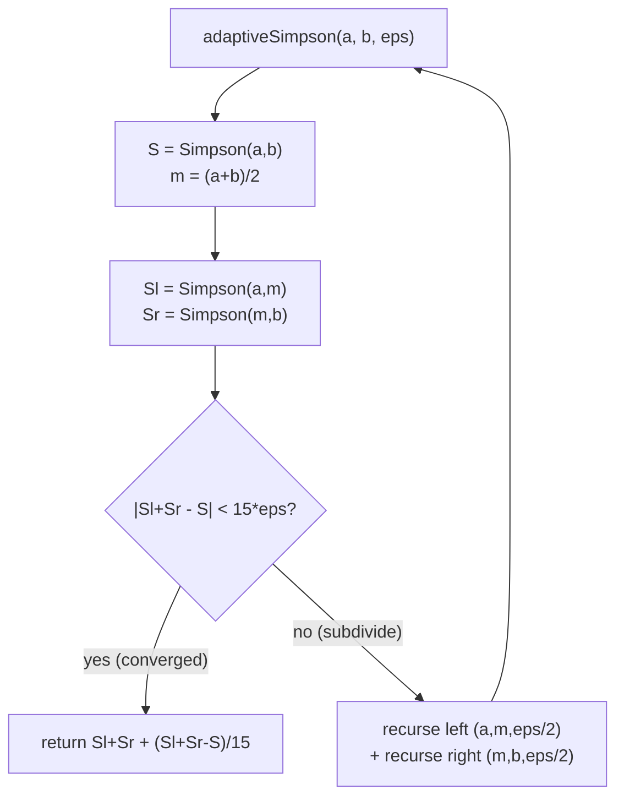

# Simpson's Rule and Numerical Integration — Middle Level

> **One-line summary:** The reason Simpson beats the trapezoid is an **error formula**: the composite trapezoid error is `-(b-a)h^2 f''(ξ)/12 = O(h^2)`, while composite Simpson's error is `-(b-a)h^4 f''''(ξ)/180 = O(h^4)`. Knowing the *order* tells you exactly how to trade accuracy for work (halving `h` cuts Simpson's error 16×), and it motivates **adaptive Simpson**, which recursively subdivides only where the local estimate has not yet converged, using the criterion `|S(whole) − S(left) − S(right)| < 15·ε`.

---

## Table of Contents

1. [Introduction](#introduction)
2. [Deeper Concepts](#deeper-concepts)
3. [The Error Orders Side by Side](#the-error-orders-side-by-side)
4. [Comparison with Alternatives](#comparison-with-alternatives)
5. [Adaptive Simpson](#adaptive-simpson)
6. [Choosing n and ε](#choosing-n-and-ε)
7. [Code Examples](#code-examples)
8. [Error Handling](#error-handling)
9. [Performance Analysis](#performance-analysis)
10. [Best Practices](#best-practices)
11. [Visual Animation](#visual-animation)
12. [Summary](#summary)

---

## Introduction

> Focus: "Why does Simpson work so much better, and when should I reach for it — or for something else?"

At the junior level you learned the composite Simpson formula and saw, on one example, that it crushed the trapezoidal rule. Now we make that precise. The single most important fact at this level is the **error formula** for each rule — a closed expression for how wrong the estimate is. From the error formula everything else follows: *why* Simpson is `O(h^4)`, *how many slices* you need for a target accuracy, *when* the trapezoid or midpoint is actually fine, and *how* the adaptive method decides where to spend effort.

The mental shift is this: at junior level you pick `n` and hope. At middle level you **reason about error**. You ask "what order does my rule converge at?", "how does the error scale when I refine?", and "can I *estimate* my own error and let the algorithm refine itself?" The answer to the last question is **adaptive Simpson** — the workhorse behind real integration libraries — which compares a coarse estimate to a refined one and recurses only into the regions that still disagree.

---

## Deeper Concepts

### Invariant: the Newton–Cotes idea

All the rules here (trapezoid, Simpson, and higher) are **Newton–Cotes** rules: replace `f` on a panel by the interpolating polynomial through equally spaced nodes, then integrate that polynomial exactly. The trapezoid uses a degree-1 interpolant (a line through 2 nodes); Simpson uses a degree-2 interpolant (a parabola through 3 nodes). The structural invariant is: **the rule is exact whenever `f` equals its interpolating polynomial** — i.e. whenever `f` is a polynomial of low enough degree. This is what "degree of precision" measures.

### The single-panel error terms

For one panel, Taylor expansion of `f` against the interpolant yields:

```text
Trapezoid (one panel, width h):   E = -(h^3 / 12) · f''(ξ)        for some ξ in the panel
Midpoint  (one panel, width h):   E = +(h^3 / 24) · f''(ξ)
Simpson   (one panel, width 2h):  E = -(h^5 / 90) · f''''(ξ)
```

Two observations. First, the midpoint error is *half* the trapezoid error and of opposite sign — a hint that some weighted blend of them is even better (that blend is essentially Simpson). Second, Simpson's per-panel error involves `f''''` and `h^5`, not `f''` and `h^3`. The `f''''` is why Simpson is exact for cubics: the fourth derivative of any cubic is zero, so the error term vanishes.

### Composite error: summing the panels

To integrate `[a, b]` we sum many panels. Summing `n` (or `n/2`) per-panel errors and applying the Mean Value Theorem for the derivative collapses the sum into one term:

```text
Composite Trapezoid:  E_T = -(b - a) · h^2 / 12  · f''(ξ)     = O(h^2)
Composite Midpoint:   E_M = +(b - a) · h^2 / 24  · f''(ξ)     = O(h^2)
Composite Simpson:    E_S = -(b - a) · h^4 / 180 · f''''(ξ)   = O(h^4)
```

These three formulas are the heart of this whole topic. The `(b-a)` and the derivative factor are constants for a given problem; the `h^k` factor is what you control. (The full derivation — Taylor remainders, the MVT collapse, why the constant is exactly `1/180` — is in `professional.md`.)

### Why O(h^4) is a big deal

Refine by halving `h` (doubling `n`):

```text
Trapezoid: error × (1/2)^2 = 1/4   → ~0.6 extra correct digits per refinement
Simpson:   error × (1/2)^4 = 1/16  → ~1.2 extra correct digits per refinement
```

Simpson roughly *doubles the rate* at which digits appear. To get 8 correct digits on a smooth function you might need millions of trapezoid slices but only thousands of Simpson slices — orders of magnitude fewer function evaluations.

### Richardson extrapolation: getting O(h^4) from trapezoids

Because the trapezoid error has a clean `h^2` leading term, you can **extrapolate it away**. If `T(h)` and `T(h/2)` are trapezoid estimates, then

```text
S = (4·T(h/2) - T(h)) / 3
```

is exactly composite Simpson — the `h^2` terms cancel, leaving `O(h^4)`. Iterating this idea (cancel `h^4`, then `h^6`, ...) gives **Romberg integration**, a table of ever-higher-order estimates built purely from trapezoid evaluations. This is the cleanest way to see that "Simpson = trapezoid with one Richardson step."

---

## The Error Orders Side by Side

| Rule | Nodes per panel | Interpolant | Per-panel error | Composite error | Degree of precision |
|------|-----------------|-------------|-----------------|-----------------|---------------------|
| Midpoint | 1 (center) | constant | `+(h^3/24) f''` | `O(h^2)` | 1 |
| Trapezoid | 2 | line | `-(h^3/12) f''` | `O(h^2)` | 1 |
| Simpson 1/3 | 3 | parabola | `-(h^5/90) f''''` | `O(h^4)` | 3 |
| Simpson 3/8 | 4 | cubic | `-(3h^5/80) f''''` | `O(h^4)` | 3 |
| Boole | 5 | quartic | `-(8h^7/945) f^(6)` | `O(h^6)` | 5 |

Notice the pattern: rules using an **odd** number of nodes (midpoint=1, Simpson=3, Boole=5) get a *bonus* order from symmetry — degree of precision is one higher than the interpolant degree. That symmetry bonus is exactly why Simpson (parabola, degree 2) integrates cubics (degree 3) exactly. Even-node rules (trapezoid=2, Simpson 3/8=4) do not get the bonus.

---

## Comparison with Alternatives

| Attribute | Simpson 1/3 | Trapezoidal | Midpoint | Gaussian quadrature (n-point) |
|-----------|-------------|-------------|----------|-------------------------------|
| Error order (equal spacing) | `O(h^4)` | `O(h^2)` | `O(h^2)` | exact to degree `2n-1` |
| Nodes needed | `n+1` (n even) | `n+1` | `n` | `n` (non-uniform) |
| Uses endpoints? | Yes | Yes | No | No |
| Exact for polynomials up to | degree 3 | degree 1 | degree 1 | degree `2n-1` |
| Works on tabulated data? | Yes (even spacing) | Yes (any spacing) | Needs midpoints | No (needs special nodes) |
| Handles endpoint singularity? | No (samples endpoints) | No | Yes (open rule) | Often yes (open) |
| Best for | smooth `f`, even grid | rough estimate, scattered data | open intervals, simple | very smooth `f`, max accuracy per eval |

**Choose Simpson when:** `f` is smooth, you can sample on a uniform even grid, and you want excellent accuracy with a trivially simple formula.
**Choose the trapezoid when:** you only have irregularly spaced data, or you need a quick lower-effort estimate, or you plan to Richardson-extrapolate.
**Choose the midpoint when:** the integrand misbehaves at the endpoints (it never samples them) but is fine inside.
**Choose Gaussian quadrature when:** `f` is very smooth and function evaluations are expensive — Gauss gets degree `2n-1` accuracy from just `n` cleverly placed nodes (covered in `senior.md`).

---

## Adaptive Simpson

A fixed `n` wastes effort: it uses the same fine grid over the flat parts of `f` (where a coarse grid would do) as over the wiggly parts (where even a fine grid struggles). **Adaptive Simpson** fixes this by recursively subdividing *only where needed*.

### The self-error-estimate trick

The core insight: you can **estimate your own error** by comparing a coarse Simpson estimate to a refined one. Let `S(a,b)` be the basic Simpson estimate on `[a, b]`, and let `S2 = S(a,m) + S(m,b)` be the estimate after splitting at the midpoint `m`. Because Simpson's error scales as `h^4`, halving the panel cuts the error by `16`. So:

```text
true ≈ S2 + (S2 - S)/15
```

and the error of `S2` is approximately `(S2 - S)/15`. This is **Richardson extrapolation applied to the error estimate.** The quantity `|S2 - S|` is therefore a cheap, reliable proxy for "how wrong am I here?"

### The adaptive criterion

If `|S2 - S| < 15·ε`, then `S2` (plus its Richardson correction) is accurate to within `ε` on this subinterval — accept it. Otherwise split `[a, b]` at `m`, give each half a tolerance of `ε/2`, and recurse. Summing the per-piece tolerances keeps the **total** error under the global `ε`.



The result: the algorithm automatically lavishes function evaluations on the hard regions (sharp peaks, rapid curvature) and breezes through the easy ones. For a function with one sharp spike and a long flat tail, adaptive Simpson can be hundreds of times cheaper than a uniform grid of the same accuracy.

### Practical guards

Real implementations add a **recursion depth limit** (to avoid runaway recursion on a discontinuity, where the criterion can never be met) and reuse the already-computed function values across the recursion (each panel's three samples become inputs to the children). Both refinements appear in the code below and are discussed further in `senior.md`.

---

## Choosing n and ε

Two ways to control accuracy:

**Fixed-`n` (a-priori):** if you know a bound `|f''''| ≤ M` on `[a, b]`, solve the error formula for `n`:

```text
|E_S| ≤ (b - a) h^4 M / 180 ≤ tol
  with h = (b - a)/n
  →  n ≥ (b - a) · ( (b - a)^4 M / (180 · tol) )^(1/4)
```

This guarantees the tolerance *before* you run, but requires a derivative bound you rarely have.

**Adaptive / convergence (a-posteriori):** far more common — don't bound the derivative, just refine until successive estimates agree. Either double `n` until `|S(2n) - S(n)| < tol`, or run adaptive Simpson with tolerance `ε`. You measure the error *during* the computation.

| Strategy | Needs | Pros | Cons |
|----------|-------|------|------|
| Fixed `n` (a-priori) | derivative bound `M` | predictable cost, one pass | `M` usually unknown; often over-refines |
| Double-and-compare | nothing | simple, reuses samples | uniform refinement wastes work on easy regions |
| Adaptive Simpson | tolerance `ε` | spends effort where needed | recursion overhead, needs depth guard |

Rule of thumb: **use adaptive Simpson with a relative tolerance** (e.g. `ε = 1e-9 · max(1, |estimate|)`) for general work; fall back to fixed-`n` only when you need a guaranteed bound and have the derivative information.

---

## Code Examples

### Example: Adaptive Simpson with Sample Reuse

#### Go

```go
package main

import (
	"fmt"
	"math"
)

// basic Simpson on [a,b] given precomputed fa, fb, fm at a, b, midpoint m.
func simp(fa, fb, fm, a, b float64) float64 {
	return (b - a) / 6 * (fa + 4*fm + fb)
}

func adaptive(f func(float64) float64, a, b, eps, whole, fa, fb, fm float64, depth int) float64 {
	m := (a + b) / 2
	lm := (a + m) / 2
	rm := (m + b) / 2
	flm, frm := f(lm), f(rm)
	left := simp(fa, fm, flm, a, m)
	right := simp(fm, fb, frm, m, b)
	if depth <= 0 || math.Abs(left+right-whole) <= 15*eps {
		// Richardson correction: (left+right-whole)/15
		return left + right + (left+right-whole)/15
	}
	return adaptive(f, a, m, eps/2, left, fa, fm, flm, depth-1) +
		adaptive(f, m, b, eps/2, right, fm, fb, frm, depth-1)
}

func integrate(f func(float64) float64, a, b, eps float64) float64 {
	m := (a + b) / 2
	fa, fb, fm := f(a), f(b), f(m)
	whole := simp(fa, fb, fm, a, b)
	return adaptive(f, a, b, eps, whole, fa, fb, fm, 50)
}

func main() {
	f := func(x float64) float64 { return math.Exp(-x * x) }
	fmt.Printf("%.12f\n", integrate(f, 0, 1, 1e-12)) // ~0.746824132812
}
```

#### Java

```java
import java.util.function.DoubleUnaryOperator;

public class AdaptiveSimpson {
    static double simp(double fa, double fb, double fm, double a, double b) {
        return (b - a) / 6 * (fa + 4 * fm + fb);
    }

    static double rec(DoubleUnaryOperator f, double a, double b, double eps,
                      double whole, double fa, double fb, double fm, int depth) {
        double m = (a + b) / 2, lm = (a + m) / 2, rm = (m + b) / 2;
        double flm = f.applyAsDouble(lm), frm = f.applyAsDouble(rm);
        double left = simp(fa, fm, flm, a, m);
        double right = simp(fm, fb, frm, m, b);
        if (depth <= 0 || Math.abs(left + right - whole) <= 15 * eps) {
            return left + right + (left + right - whole) / 15;
        }
        return rec(f, a, m, eps / 2, left, fa, fm, flm, depth - 1)
             + rec(f, m, b, eps / 2, right, fm, fb, frm, depth - 1);
    }

    static double integrate(DoubleUnaryOperator f, double a, double b, double eps) {
        double m = (a + b) / 2;
        double fa = f.applyAsDouble(a), fb = f.applyAsDouble(b), fm = f.applyAsDouble(m);
        return rec(f, a, b, eps, simp(fa, fb, fm, a, b), fa, fb, fm, 50);
    }

    public static void main(String[] args) {
        DoubleUnaryOperator f = x -> Math.exp(-x * x);
        System.out.printf("%.12f%n", integrate(f, 0, 1, 1e-12)); // ~0.746824132812
    }
}
```

#### Python

```python
import math


def _simp(fa, fb, fm, a, b):
    return (b - a) / 6 * (fa + 4 * fm + fb)


def _rec(f, a, b, eps, whole, fa, fb, fm, depth):
    m = (a + b) / 2
    lm, rm = (a + m) / 2, (m + b) / 2
    flm, frm = f(lm), f(rm)
    left = _simp(fa, fm, flm, a, m)
    right = _simp(fm, fb, frm, m, b)
    if depth <= 0 or abs(left + right - whole) <= 15 * eps:
        return left + right + (left + right - whole) / 15
    return (_rec(f, a, m, eps / 2, left, fa, fm, flm, depth - 1) +
            _rec(f, m, b, eps / 2, right, fm, fb, frm, depth - 1))


def integrate(f, a, b, eps=1e-12):
    m = (a + b) / 2
    fa, fb, fm = f(a), f(b), f(m)
    return _rec(f, a, b, eps, _simp(fa, fb, fm, a, b), fa, fb, fm, 50)


if __name__ == "__main__":
    print(f"{integrate(lambda x: math.exp(-x * x), 0, 1, 1e-12):.12f}")  # ~0.746824132812
```

**What it does:** adaptively integrates `e^(-x^2)` to 12 digits, reusing the three samples of each panel as inputs to its children (only two new evaluations per recursion).
**Run:** `go run main.go` | `javac AdaptiveSimpson.java && java AdaptiveSimpson` | `python adaptive.py`

### Example: Simpson as Richardson Extrapolation of the Trapezoid

#### Go

```go
func trap(f func(float64) float64, a, b float64, n int) float64 {
	h := (b - a) / float64(n)
	s := (f(a) + f(b)) / 2
	for i := 1; i < n; i++ {
		s += f(a + float64(i)*h)
	}
	return s * h
}

func simpsonViaRichardson(f func(float64) float64, a, b float64, n int) float64 {
	return (4*trap(f, a, b, 2*n) - trap(f, a, b, n)) / 3 // cancels the O(h^2) term
}
```

#### Java

```java
static double trap(DoubleUnaryOperator f, double a, double b, int n) {
    double h = (b - a) / n, s = (f.applyAsDouble(a) + f.applyAsDouble(b)) / 2;
    for (int i = 1; i < n; i++) s += f.applyAsDouble(a + i * h);
    return s * h;
}

static double simpsonViaRichardson(DoubleUnaryOperator f, double a, double b, int n) {
    return (4 * trap(f, a, b, 2 * n) - trap(f, a, b, n)) / 3;
}
```

#### Python

```python
def trap(f, a, b, n):
    h = (b - a) / n
    s = (f(a) + f(b)) / 2
    for i in range(1, n):
        s += f(a + i * h)
    return s * h


def simpson_via_richardson(f, a, b, n):
    return (4 * trap(f, a, b, 2 * n) - trap(f, a, b, n)) / 3  # O(h^2) term cancels
```

**What it does:** demonstrates the identity `Simpson = (4·T(h/2) − T(h))/3` — one Richardson step on the trapezoid yields Simpson and bumps the order from 2 to 4.

---

## Error Handling

| Scenario | What goes wrong | Correct approach |
|----------|-----------------|------------------|
| Adaptive recursion never returns | discontinuity makes `|S2 - S|` never small | enforce a depth cap; accept best estimate at the cap |
| Tolerance too tight | `ε` below round-off floor → infinite refinement | clamp `ε` to a few × machine epsilon × scale |
| Endpoint singularity | `f(a)` or `f(b)` is `Inf`/`NaN` | split off the singular endpoint or substitute variables |
| Relative vs absolute confusion | absolute `ε` meaningless for huge/tiny integrals | scale: `ε = ε_rel · max(1, |estimate|)` |
| Wasted evaluations | recomputing shared panel samples | thread `fa, fb, fm` into the recursion (as above) |
| Oscillatory aliasing | grid resonates with `f`'s frequency | force a minimum subdivision before trusting the criterion |

---

## Performance Analysis

The cost of any method is dominated by the number of **function evaluations**. The benchmark below measures how many slices each rule needs to hit a fixed accuracy.

#### Go

```go
import (
	"fmt"
	"math"
)

func benchmark() {
	f := func(x float64) float64 { return math.Exp(-x * x) }
	const truth = 0.7468241328124270
	for _, n := range []int{4, 8, 16, 32, 64, 128} {
		t := math.Abs(trap(f, 0, 1, n) - truth)
		s := math.Abs(simpson(f, 0, 1, n) - truth)
		fmt.Printf("n=%4d  trap err=%.2e  simpson err=%.2e\n", n, t, s)
	}
}
```

#### Java

```java
public static void benchmark() {
    java.util.function.DoubleUnaryOperator f = x -> Math.exp(-x * x);
    final double truth = 0.7468241328124270;
    for (int n : new int[]{4, 8, 16, 32, 64, 128}) {
        double t = Math.abs(trap(f, 0, 1, n) - truth);
        double s = Math.abs(Simpson.simpson(f, 0, 1, n) - truth);
        System.out.printf("n=%4d  trap err=%.2e  simpson err=%.2e%n", n, t, s);
    }
}
```

#### Python

```python
import math

def benchmark():
    f = lambda x: math.exp(-x * x)
    truth = 0.7468241328124270
    for n in (4, 8, 16, 32, 64, 128):
        t = abs(trap(f, 0, 1, n) - truth)
        s = abs(simpson(f, 0, 1, n) - truth)
        print(f"n={n:4d}  trap err={t:.2e}  simpson err={s:.2e}")
```

Typical output shows the trapezoid error falling by ~4× per doubling and Simpson by ~16× per doubling — the `O(h^2)` vs `O(h^4)` signature, visible directly in the numbers until round-off intervenes around `1e-15`.

---

## Worked Trace: Adaptive Simpson on a Spike

Numbers make the adaptive idea concrete. Integrate `f(x) = 1/(x^2 + 0.04)` on `[-1, 1]` (a peak at 0 of height 25), with tolerance `ε = 1e-3`. True value `= (1/0.2)·[arctan(x/0.2)]_{-1}^{1} = 5·2·arctan(5) ≈ 13.734`.

**Root panel `[-1, 1]`.** Midpoint `m = 0`. Coarse Simpson `S` uses nodes `−1, 0, 1`:

```text
f(-1)=0.9615, f(0)=25, f(1)=0.9615
S = (2/6)(0.9615 + 4·25 + 0.9615) = (1/3)(101.923) = 33.97   (wildly wrong — the parabola can't capture the spike)
```

Refine: `S(-1,0)` and `S(0,1)`. Take `S(0,1)` with nodes `0, 0.5, 1`:

```text
f(0.5)=1/(0.25+0.04)=3.448
S(0,1) = (1/6)(25 + 4·3.448 + 0.9615) = (1/6)(39.75) = 6.626
```

By symmetry `S(-1,0) = 6.626`, so `S2 = 13.25`. Check: `|S2 − S| = |13.25 − 33.97| = 20.7 ≫ 15ε`. **SPLIT** — the gap is enormous because the spike is unresolved.

**Recursion concentrates near 0.** Each half is split again with `ε/2`. The sub-panels *touching 0* keep failing the test (the spike is still under-resolved) and split repeatedly — the recursion drills down to tiny panels right around the peak. The sub-panels *far from 0* (e.g. `[0.5, 1]`, where `f` is smooth and small) pass `|S2 − S| < 15ε` almost immediately and stop.

**Outcome.** The final grid has many tiny panels clustered in `[−0.2, 0.2]` and just a handful of wide panels on `[0.2, 1]` and `[−1, −0.2]`. A *uniform* Simpson grid achieving the same `1e-3` accuracy would need that fine spacing *everywhere* — dozens of times more evaluations. This is the spike-vs-flat asymmetry that makes adaptivity worth its recursion overhead.

## Fixed-n vs Adaptive: When Each Wins

| Situation | Prefer fixed-`n` Simpson | Prefer adaptive Simpson |
|-----------|--------------------------|--------------------------|
| `f` uniformly smooth | yes (no recursion overhead) | overkill |
| `f` has a localized feature (spike, near-singularity) | no (must over-refine globally) | yes (refines locally) |
| You can vectorize `f` (NumPy/GPU) | yes (one batched call) | harder to batch |
| You need a guaranteed error bound | yes (with derivative bound) | heuristic only |
| `f` shape unknown ahead of time | risky (guess `n`) | yes (self-targets `ε`) |
| Hot inner loop, latency-critical | yes (predictable cost) | variable cost |

A pragmatic hybrid many libraries use: run a *coarse* composite Simpson first as a cheap sanity estimate, then switch to adaptive only if a refinement check shows the coarse estimate hasn't converged. You get the speed of composite on easy integrands and the robustness of adaptive on hard ones.

## A Note on the Midpoint Rule's Hidden Strength

The midpoint rule looks crude (a single sample per panel) yet shares the trapezoid's `O(h^2)` order with *half* the error constant (`1/24` vs `1/12`) and the *opposite sign*. Two consequences worth internalizing:

1. **It is an *open* rule** — it never evaluates the endpoints. That makes it the go-to when `f` is singular or undefined exactly at `a` or `b` but fine in the interior (foreshadowing `senior.md`'s singularity handling).
2. **Simpson is a blend of midpoint and trapezoid:** `S = (2M + T)/3`. Because their `f''` errors are in a `−2 : 1` ratio, the blend cancels the leading error, jumping from `O(h^2)` to `O(h^4)`. This is a second, algebra-only way to *see* why Simpson is better — independent of the Taylor/Peano machinery in `professional.md`.

So the three basic rules are not three unrelated formulas; they are a small family where the best one (Simpson) is literally a weighted average of the other two, engineered to cancel error.

## Common Misconceptions at This Level

- *"More slices is always better."* False past the round-off floor — beyond a point, adding slices increases total error because accumulated round-off overtakes the shrinking truncation error.
- *"Simpson is exact only for quadratics."* It is built from a parabola but is exact for **cubics** too (degree of precision 3), thanks to symmetry.
- *"Adaptive Simpson always beats composite."* Not when `f` is uniformly smooth — the recursion overhead loses to a single vectorized composite pass.
- *"The `(S2−S)/15` estimate is a guaranteed bound."* It is an asymptotic estimate; on a coarse panel over a sharp feature it can under-report. Hence the depth cap and minimum-subdivision guards.
- *"Halving `h` halves the error."* For Simpson it divides the error by 16, not 2; for the trapezoid by 4. The order is what matters, not a linear intuition.

## Best Practices

- **Reason in error orders.** Before coding, know your rule's order; it tells you how refinement pays off.
- **Use adaptive Simpson as the default** for general integrands; it self-targets a tolerance.
- **Reuse function samples** across refinement and recursion — evaluations are the bottleneck.
- **Use relative tolerance** scaled by the estimate's magnitude, not a bare absolute `ε`.
- **Always cap recursion depth** so discontinuities cannot cause runaway recursion.
- **Validate with Richardson:** the gap `(S2 − S)/15` is a free, trustworthy error estimate — log it.
- **Split at known trouble points** (kinks, peaks) before integrating; do not make the adaptor discover them the hard way.

---

## Sanity Checks Every Implementation Should Pass

Before trusting a Simpson implementation, run these cheap invariants — each catches a distinct class of bug:

| Check | Input | Expected | Bug it catches |
|-------|-------|----------|----------------|
| Constant | `∫_0^1 1 dx` | `1.0` exactly | weight sum wrong (should total `n·h = b−a`) |
| Linear | `∫_0^2 x dx` | `2.0` exactly | asymmetry in weights |
| Cubic | `∫_0^2 x^3 dx` | `4.0` exactly | proves degree of precision 3 |
| Quartic | `∫_0^1 x^4 dx` | `0.2` ≠ exact (small error) | proves it is *not* exact past cubic |
| Symmetry | `∫_{-1}^1 x^2 dx` | `2/3` | sign/index errors |
| Additivity | `∫_0^1 + ∫_1^2 = ∫_0^2` | equal | panel-boundary handling |
| Reversal | `∫_b^a = −∫_a^b` | negated | a>b handling |

The constant and cubic checks together are the strongest two-line test: a correct Simpson must integrate `1` and `x^3` *exactly* (to round-off). If either fails, the weights or the `h/3` factor is wrong.

## Visual Animation

> See [`animation.html`](./animation.html) for interactive visualization.
>
> Middle-level animation includes:
> - Side-by-side trapezoid (straight chords) vs Simpson (parabolas) over the same grid, with both error values displayed
> - The error shrinking by 4× (trapezoid) vs 16× (Simpson) as you double `n`
> - **Adaptive subdivision** in action: the recursion descends into the high-curvature region and stops early on flat regions
> - A live readout of the `|S2 - S|` criterion at each panel

---

## Summary

At the middle level Simpson's superiority becomes quantitative: the composite trapezoid error is `-(b-a)h^2 f''(ξ)/12 = O(h^2)`, the midpoint is also `O(h^2)`, and composite Simpson is `-(b-a)h^4 f''''(ξ)/180 = O(h^4)` — so halving `h` cuts Simpson's error by 16 versus the trapezoid's 4. Simpson's degree of precision is 3 (exact for cubics), a symmetry bonus over its degree-2 parabola. Simpson is literally one **Richardson** step on the trapezoid: `(4T(h/2) − T(h))/3`. The practical payoff is **adaptive Simpson**, which estimates its own error via `|S(a,b) − S(a,m) − S(m,b)|`, accepts a panel when that gap is below `15ε`, and otherwise recurses with halved tolerance — automatically concentrating evaluations where `f` is hard. Choose `n`/`ε` by refining until convergence rather than guessing, and prefer relative tolerances with a depth cap.

---

Next step: continue to [`senior.md`](./senior.md) for robust production integration — singularities, oscillatory integrands, tolerance control, and Gaussian quadrature versus library routines.
