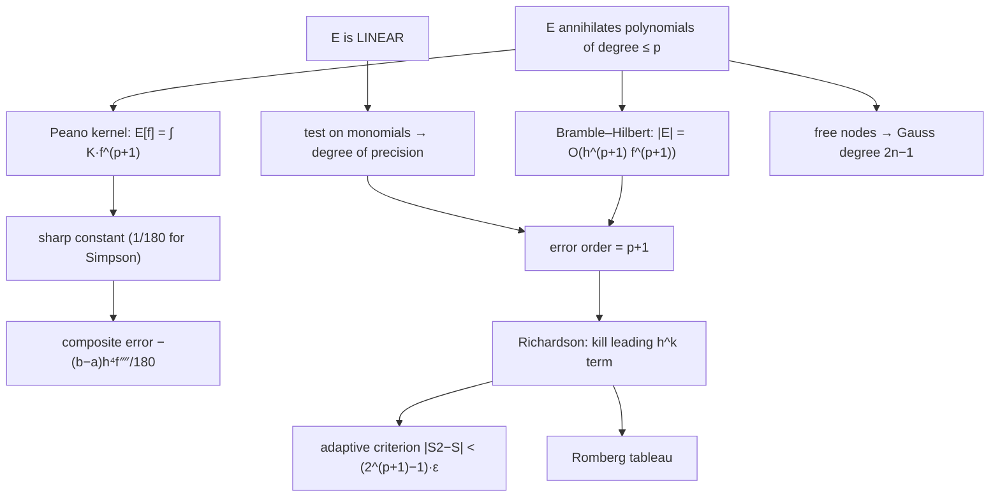

# Simpson's Rule and Numerical Integration — Mathematical Foundations and Error Analysis

## Table of Contents
1. [Formal Definitions](#1-formal-definitions)
2. [Degree of Precision and the Method of Undetermined Coefficients](#2-degree-of-precision-and-the-method-of-undetermined-coefficients)
3. [The Basic Simpson Error Term via Taylor Expansion](#3-the-basic-simpson-error-term-via-taylor-expansion)
4. [The Composite Simpson Error: -(b-a)h^4 f''''(ξ)/180](#4-the-composite-simpson-error)
5. [The Peano Kernel Representation](#5-the-peano-kernel-representation)
6. [Convergence Proof](#6-convergence-proof)
7. [Why Simpson Beats Trapezoid: Euler–Maclaurin and Richardson](#7-why-simpson-beats-trapezoid)
8. [Justification of the Adaptive (S2 − S)/15 Criterion](#8-justification-of-the-adaptive-criterion)
9. [Gaussian Quadrature: Optimality](#9-gaussian-quadrature-optimality)
10. [Comparison with Alternatives](#10-comparison-with-alternatives)
11. [Summary](#11-summary)

---

## 1. Formal Definitions

**Definition 1.1 (Quadrature rule).** A *quadrature rule* on `[a, b]` is a functional

```text
Q[f] = Σ_{i=0}^{m} w_i · f(x_i)
```

with **nodes** `x_i ∈ [a, b]` and **weights** `w_i ∈ R`, intended to approximate `I[f] = ∫_a^b f(x) dx`. The **error functional** is `E[f] = I[f] − Q[f]`, a linear functional on the integrand.

**Definition 1.2 (Newton–Cotes rule).** A *closed Newton–Cotes rule* uses `m+1` **equally spaced** nodes `x_i = a + i·h`, `h = (b-a)/m`, including both endpoints, with weights obtained by integrating the Lagrange interpolating polynomial `p_m` through `(x_i, f(x_i))`:

```text
Q[f] = ∫_a^b p_m(x) dx,   p_m(x) = Σ_i f(x_i) ℓ_i(x),   w_i = ∫_a^b ℓ_i(x) dx.
```

`m = 1` gives the **trapezoidal rule**; `m = 2` gives **Simpson's 1/3 rule**.

**Definition 1.3 (Simpson's 1/3 rule, basic form).** On `[a, b]` with midpoint `c = (a+b)/2` and `h = (b-a)/2`,

```text
S[f] = (h/3)·( f(a) + 4 f(c) + f(b) ) = ((b-a)/6)·( f(a) + 4 f((a+b)/2) + f(b) ).
```

**Definition 1.4 (Composite Simpson).** Partition `[a,b]` into an **even** number `n` of subintervals of width `h = (b-a)/n`, nodes `x_i = a + i h`, `f_i = f(x_i)`. Then

```text
S_n[f] = (h/3)·[ f_0 + 4 Σ_{i odd} f_i + 2 Σ_{i even, 0<i<n} f_i + f_n ].
```

**Definition 1.5 (Degree of precision).** A rule `Q` has **degree of precision** `d` if `E[x^k] = 0` for all `k = 0, 1, ..., d` but `E[x^{d+1}] ≠ 0`. Equivalently (by linearity), `Q` integrates every polynomial of degree `≤ d` exactly but not all of degree `d+1`.

**The logical skeleton.** Every theorem in this file descends from two properties of the error functional `E[f] = I[f] − Q[f]`. The diagram makes the dependency explicit:



**Notation.** Throughout, `f ∈ C^k[a,b]` means `f` is `k`-times continuously differentiable. `ξ` denotes an (existentially quantified) point of `[a,b]` supplied by a mean value theorem. `h` is the step (panel half-width for the basic rule, subinterval width for the composite rule — the context disambiguates).

---

## 2. Degree of Precision and the Method of Undetermined Coefficients

**Theorem 2.1.** Simpson's 1/3 rule has degree of precision **3**.

**Proof.** By linearity it suffices to test monomials. Normalize to `[-1, 1]` (`h = 1`, nodes `-1, 0, 1`); the rule is `S[f] = (1/3)(f(-1) + 4f(0) + f(1))`.

```text
k=0:  I[1]   = 2,                       S[1]   = (1/3)(1+4+1) = 2.        E=0
k=1:  I[x]   = 0,                       S[x]   = (1/3)(-1+0+1) = 0.       E=0
k=2:  I[x^2] = 2/3,                     S[x^2] = (1/3)(1+0+1) = 2/3.      E=0
k=3:  I[x^3] = 0,                       S[x^3] = (1/3)(-1+0+1) = 0.       E=0
k=4:  I[x^4] = 2/5,                     S[x^4] = (1/3)(1+0+1) = 2/3.      E = 2/5 - 2/3 = -4/15 ≠ 0
```

Exact through `k = 3`, fails at `k = 4`, so the degree of precision is exactly 3. ∎

**Remark (the symmetry bonus).** Simpson is built from a degree-2 interpolant yet attains degree of precision 3. The extra order comes from **symmetry**: the rule's nodes and weights are symmetric about the midpoint, so `E[g] = 0` for every *odd* function `g` about the center (here `x^3`), automatically. Any symmetric closed Newton–Cotes rule with an **odd** number of nodes gains exactly one degree this way — the midpoint rule (1 node, precision 1 instead of 0) and Boole's rule (5 nodes, precision 5 instead of 4) are the same phenomenon.

**The method of undetermined coefficients.** One can *derive* the weights `(1/3, 4/3, 1/3)` (times `h`) by demanding exactness on `1, x, x^2`: impose three equations `Σ w_i x_i^k = I[x^k]` for `k = 0,1,2` and solve the `3×3` system. The resulting unique weights automatically also satisfy `k=3` (the symmetry bonus), confirming degree 3.

---

## 3. The Basic Simpson Error Term via Taylor Expansion

**Theorem 3.1 (Basic Simpson error).** If `f ∈ C^4[a, b]`, then for the basic rule on `[a, b]` with `h = (b-a)/2`,

```text
E[f] = I[f] − S[f] = −(h^5 / 90)·f''''(ξ)   for some ξ ∈ (a, b).
```

**Proof sketch (Taylor with the integral form, on `[-1,1]`, `h = 1`).** Define the error functional `E[f] = ∫_{-1}^1 f − (1/3)(f(-1)+4f(0)+f(1))`. `E` is linear and, by Theorem 2.1, annihilates all cubics: `E[1]=E[x]=E[x^2]=E[x^3]=0`. Expand `f` about `0` with Lagrange remainder; the polynomial part is killed by `E`, leaving only the degree-4 term's contribution. The **Peano kernel** representation (Section 5) makes this rigorous:

```text
E[f] = ∫_{-1}^{1} K(t)·f''''(t) dt,
```

where `K(t)` is a fixed kernel (computed in Section 5) that **does not change sign** on `[-1, 1]`. Because `K` has one sign, the *Mean Value Theorem for integrals* applies:

```text
E[f] = f''''(ξ)·∫_{-1}^{1} K(t) dt   for some ξ ∈ (-1, 1).
```

A direct computation gives `∫_{-1}^1 K(t) dt = E[x^4]/4! = (-4/15)/24 = -1/90`. Hence on `[-1,1]`, `E[f] = -(1/90) f''''(ξ)`. Rescaling from `[-1,1]` to a panel of half-width `h` multiplies by `h^5` (one `h` from `dx`, four more from the four derivatives' chain-rule scaling), giving `E[f] = -(h^5/90) f''''(ξ)`. ∎

**Corollary 3.2.** Since `f'''' ≡ 0` for any cubic, `E[f] = 0` for all cubics — re-deriving the degree of precision 3.

---

## 4. The Composite Simpson Error

**Theorem 4.1 (Composite Simpson error).** Let `f ∈ C^4[a, b]`, `n` even, `h = (b-a)/n`. Then

```text
I[f] − S_n[f] = −((b-a)/180)·h^4·f''''(ξ)   for some ξ ∈ (a, b).
```

**Proof.** The composite rule is the sum of `n/2` basic panels, panel `j` spanning `[x_{2j}, x_{2j+2}]` of half-width `h`. By Theorem 3.1 each contributes error `−(h^5/90) f''''(ξ_j)` with `ξ_j` in panel `j`:

```text
I[f] − S_n[f] = Σ_{j=0}^{n/2 − 1} −(h^5/90) f''''(ξ_j)
             = −(h^5/90) Σ_j f''''(ξ_j)
             = −(h^5/90)·(n/2)·[ (2/n) Σ_j f''''(ξ_j) ].
```

The bracket is an average of `n/2` values of the continuous function `f''''`; by the **Intermediate Value Theorem** there exists `ξ ∈ (a,b)` with `f''''(ξ)` equal to that average. Therefore

```text
I[f] − S_n[f] = −(h^5/90)·(n/2)·f''''(ξ) = −(n h / 180)·h^4·f''''(ξ).
```

Since `n h = b - a`, this is `−((b-a)/180) h^4 f''''(ξ)`. ∎

**Corollary 4.2 (Order).** `|I − S_n| ≤ ((b-a)/180) h^4 · max_{[a,b]}|f''''| = O(h^4) = O(1/n^4)`. Halving `h` divides the error bound by `16`.

**Worked constant check.** For the trapezoid the analogous derivation gives `−((b-a)/12) h^2 f''(ξ)` (degree of precision 1, error from `f''`), and for the midpoint `+((b-a)/24) h^2 f''(ξ)`. The three constants `1/12, 1/24, 1/180` are the canonical Newton–Cotes error constants; note the midpoint constant is *half* the trapezoid's with opposite sign — the algebraic seed of the identity `Simpson = (2·Midpoint + Trapezoid)/3`.

**Lemma 4.3 (Simpson = weighted blend of midpoint and trapezoid).** On one panel,

```text
S = (2 M + T)/3,   M = (b-a) f((a+b)/2),   T = ((b-a)/2)(f(a)+f(b)).
```

Indeed `(2M + T)/3 = (1/3)[ 2(b-a) f(c) + ((b-a)/2)(f(a)+f(b)) ] = ((b-a)/6)(f(a)+4f(c)+f(b)) = S`. This blend cancels the leading `f''` errors of `M` and `T` (which have ratio `−2 : 1`), promoting the order from `h^2` to `h^4` — an alternative, algebra-only explanation of Simpson's extra accuracy.

---

## 5. The Peano Kernel Representation

The Peano kernel makes the "error depends only on `f''''`" claim exact and supplies the sign needed for the MVT.

**Theorem 5.1 (Peano kernel theorem).** If a linear functional `E` annihilates all polynomials of degree `≤ r` and is "nice" (bounded on `C^{r+1}`), then for `f ∈ C^{r+1}[a,b]`,

```text
E[f] = ∫_a^b K(t)·f^{(r+1)}(t) dt,    K(t) = (1/r!)·E_x[ (x − t)_+^r ],
```

where `(x−t)_+ = max(x−t, 0)` and `E_x` means `E` is applied in the variable `x` with `t` held fixed.

**Application to Simpson (`r = 3`).** On `[-1,1]`, `K(t) = (1/6) E_x[(x−t)_+^3]`. Computing it piecewise yields a kernel that is **negative throughout `(-1, 1)`** (and zero at the endpoints), with

```text
∫_{-1}^{1} K(t) dt = −1/90.
```

Because `K` does not change sign, the weighted MVT gives `E[f] = f''''(ξ) ∫ K = −(1/90) f''''(ξ)` — exactly Theorem 3.1. The single-sign property of `K` is the crux: it is what licenses pulling `f''''(ξ)` out of the integral with a single `ξ`. (For rules whose kernel changes sign, the error has no clean single-`ξ` form; Simpson's clean form is a gift of its kernel's definite sign.)

---

## 6. Convergence Proof

**Theorem 6.1 (Convergence).** If `f ∈ C^4[a,b]`, then `S_n[f] → I[f]` as `n → ∞` (n even), with `|S_n − I| ≤ C/n^4`, `C = ((b-a)^5/180)·max|f''''|`.

**Proof.** Immediate from Theorem 4.1: `|I − S_n| = ((b-a)/180) h^4 |f''''(ξ)| ≤ ((b-a)/180)((b-a)/n)^4 max|f''''| = C/n^4 → 0`. ∎

**Theorem 6.2 (Convergence under weaker smoothness).** If `f ∈ C^2[a,b]` only, Simpson still converges, at the slower rate `O(h^2)` (the `f''''` error term is unavailable, but the rule is still consistent and stable). If `f` is merely continuous, `S_n → I` still holds because composite Simpson is a *positive-weight* rule on each fine grid in the limit and the sampled Riemann-type sum converges; the *rate*, however, can be arbitrarily slow.

**Remark (necessity of smoothness for the rate).** The `O(h^4)` rate **requires** `f ∈ C^4`. For `f(x) = x^{3.5}` near `0` (whose 4th derivative is unbounded at `0`), composite Simpson converges only at `O(h^{4.5})`... actually slower near the singularity, degrading the global rate to roughly `O(h^{4.5})` or worse depending on the exponent. This is the analytic reason singularities (Section: senior) destroy the advertised order, and why substitution/grading is needed to restore it.

---

## 7. Why Simpson Beats Trapezoid: Euler–Maclaurin and Richardson

**Theorem 7.1 (Euler–Maclaurin formula).** For `f ∈ C^{2k+2}[a,b]`, the composite trapezoid `T_n` satisfies

```text
T_n[f] = I[f] + Σ_{j=1}^{k} (B_{2j}/(2j)!) h^{2j} [ f^{(2j-1)}(b) − f^{(2j-1)}(a) ] + R_k,
```

where `B_{2j}` are Bernoulli numbers and `R_k = O(h^{2k+2})`.

The key consequence: the **trapezoid error is an even power series in `h`**, `T_n − I = c_1 h^2 + c_2 h^4 + ...`, with `c_1 = (B_2/2!)[f'(b)−f'(a)] = (1/12)[f'(b)−f'(a)]`.

**Theorem 7.2 (Richardson extrapolation gives Simpson).** Let `T(h)` be the trapezoid with step `h`. Then

```text
(4 T(h/2) − T(h)) / 3 = I + O(h^4) = S(h/2)  (composite Simpson).
```

**Proof.** Write `T(h) = I + c_1 h^2 + c_2 h^4 + O(h^6)`. Then `T(h/2) = I + c_1 h^2/4 + c_2 h^4/16 + O(h^6)`. The combination

```text
(4 T(h/2) − T(h))/3 = (4(I + c_1 h^2/4 + c_2 h^4/16) − (I + c_1 h^2 + c_2 h^4))/3 + O(h^6)
                    = (4I − I)/3 + (c_1 h^2 − c_1 h^2)/3 + (c_2 h^4/4 − c_2 h^4)/3 + O(h^6)
                    = I − (c_2/4) h^4 + O(h^6),
```

so the `h^2` term cancels exactly and the result is `I + O(h^4)`. Algebraically this combination equals composite Simpson (verify by expanding both into nodal weights). ∎

This is the deepest "why": **Simpson is the trapezoid with its leading `h^2` error term annihilated.** Iterating the extrapolation on the `h^4`, `h^6`, ... terms is **Romberg integration**, achieving arbitrarily high order from trapezoid samples alone — but only because Euler–Maclaurin guarantees the error expansion contains *only even powers*, so each Richardson step kills a whole order.

---

## 8. Justification of the Adaptive Criterion

The adaptive method accepts a panel when `|S2 − S| < 15 ε` and returns `S2 + (S2 − S)/15`. Here is why those constants are exactly right.

**Setup.** On a panel of width `H = b − a`, let `S = S[f]` be one Simpson estimate (half-width `H/2`) and `S2 = S(a,m) + S(m,b)` be the estimate after one bisection (each sub-panel half-width `H/4`). Let `I` be the true integral over the panel.

**Step 1 — error model.** By Theorem 4.1 the error of a Simpson estimate of step `h` scales as `h^4` with the *same* `f''''(ξ)` to leading order (assuming `f''''` roughly constant over this small panel). The single estimate uses step `H/2`; the bisected estimate uses step `H/4`, i.e. step halved. Hence:

```text
I − S  ≈ C·(H/2)^4  = 16 c,        where  c := C·(H/4)^4 = I − S2.
I − S2 ≈ C·(H/4)^4  = c.
```

So `I − S ≈ 16(I − S2)`, i.e. the single estimate's error is about **16×** the bisected estimate's error.

**Step 2 — eliminate the unknown `I`.** Subtract the two relations:

```text
(I − S) − (I − S2) = S2 − S ≈ 16c − c = 15c = 15(I − S2).
```

Therefore the (unknown) error of the *refined* estimate is

```text
I − S2 ≈ (S2 − S)/15.
```

This is the **computable error estimate**: the gap `S2 − S` is `15×` the error of `S2`. This is precisely Richardson extrapolation specialized to Simpson's order-4 error.

**Step 3 — the acceptance test.** To guarantee `|I − S2| ≤ ε` it suffices that `|(S2 − S)/15| ≤ ε`, i.e.

```text
|S2 − S| ≤ 15 ε.       (the adaptive criterion)
```

**Step 4 — the corrected return value.** Adding the estimated error back removes the leading term, yielding an `O(H^6)` estimate for free:

```text
I ≈ S2 + (I − S2) ≈ S2 + (S2 − S)/15.
```

**Step 5 — global error via tolerance splitting.** When a panel fails the test, each half is recursed with tolerance `ε/2`. By induction, if every accepted leaf `[a_i, b_i]` satisfies `|I_i − Ŝ_i| ≤ ε_i` and `Σ ε_i = ε` (the halving keeps the sum invariant), then

```text
|I − Σ Ŝ_i| ≤ Σ |I_i − Ŝ_i| ≤ Σ ε_i = ε,
```

so the total error is bounded by the *global* tolerance `ε`. (Some implementations split the *interval* `ε` proportional to width rather than halving; either keeps `Σ ε_i = ε`.) ∎

**Caveat (the heuristic gap).** Step 1 assumes `f''''` is nearly constant across the panel — true once panels are small, but *false* on a coarse panel containing a sharp feature, where the estimate can both over- and under-state the true error. This is why robust implementations (Section: senior) add a depth cap and a minimum-panel guard: the `(S2−S)/15` estimate is asymptotically exact but not a rigorous bound. The factor `15 = 2^4 − 1` is the fingerprint of the order-4 method; an adaptive *trapezoid* would use `2^2 − 1 = 3`, and an adaptive Boole rule `2^6 − 1 = 63`.

---

## 9. Gaussian Quadrature: Optimality

**Theorem 9.1 (Gauss optimality).** Among all `n`-node quadrature rules on `[-1,1]`, the rule whose nodes are the roots of the degree-`n` Legendre polynomial `P_n` and whose weights are `w_i = 2/((1−x_i^2) P_n'(x_i)^2)` has degree of precision `2n − 1`, and **no** `n`-node rule achieves degree `2n`.

**Proof of degree `2n−1`.** Let `q` be any polynomial of degree `≤ 2n−1`. Divide by `P_n`: `q = P_n·s + r` with `deg s, deg r ≤ n−1`. Then `∫ q = ∫ P_n s + ∫ r`. Since `deg s ≤ n−1`, orthogonality of Legendre polynomials gives `∫_{-1}^1 P_n(x) s(x) dx = 0`. At the nodes `P_n(x_i) = 0`, so `q(x_i) = r(x_i)`. The rule with these weights integrates degree-`≤ n−1` polynomials exactly (it is interpolatory on `n` nodes), so `Q[q] = Q[r] = I[r] = I[q]`. Hence exactness through degree `2n−1`.

**Proof that `2n` is impossible.** Consider `p(x) = Π_i (x − x_i)^2`, degree `2n`, non-negative and not identically zero, so `I[p] > 0`. But `p(x_i) = 0` for every node, so `Q[p] = 0 ≠ I[p]`. No `n`-node rule can exceed degree `2n−1`. ∎

**Consequence vs Simpson.** Simpson is a 3-node rule of degree 3; Gauss with 3 nodes reaches degree 5 — `2n−1` versus the Newton–Cotes `n` (or `n+1` with the symmetry bonus). For smooth integrands and a fixed evaluation budget, Gauss is strictly superior in worst-case polynomial exactness, which is why production libraries build on Gauss–Kronrod rather than Newton–Cotes.

---

## 9b. Worked Derivations and Numerical Verifications

The theory above is best anchored with explicit numbers. This section works three computations by hand so each abstract theorem becomes checkable.

**(a) The Peano kernel of Simpson, computed explicitly.** On `[-1, 1]` with `r = 3`, `K(t) = (1/6) E_x[(x-t)_+^3]` where `E_x[g] = ∫_{-1}^1 g - (1/3)(g(-1) + 4g(0) + g(1))`. Fix `t ∈ (-1, 1)` and let `g(x) = (x - t)_+^3`. Then:

```text
∫_{-1}^1 (x-t)_+^3 dx = ∫_t^1 (x-t)^3 dx = (1-t)^4 / 4.
g(-1) = 0           (since -1 < t)
g(0)  = (0-t)_+^3 = 0 if t > 0, else (-t)^3 = -t^3·[t<0]
g(1)  = (1-t)^3
```

For `t > 0`: `E_x[g] = (1-t)^4/4 - (1/3)(0 + 0 + (1-t)^3) = (1-t)^3[ (1-t)/4 - 1/3 ] = (1-t)^3 (−1 − 3t)/12`, which is `≤ 0` on `(0,1)`. A symmetric computation for `t < 0` gives the mirror value, also `≤ 0`. Hence `K(t) = E_x[g]/6 ≤ 0` throughout `(-1, 1)` — **single-signed**, exactly the property Section 5 needed. Integrating `K` over `[-1,1]` yields `−1/90`, confirming `E[f] = −(1/90) f''''(ξ)`.

**(b) The composite error constant on a concrete integrand.** Take `f(x) = x^4` on `[0, 1]` with `n = 2` (`h = 1/2`). True integral `I = 1/5 = 0.2`. Simpson:

```text
S_2 = (h/3)(f0 + 4 f(0.5) + f1) = (0.5/3)(0 + 4·0.0625 + 1) = (1/6)(1.25) = 0.208333...
```

Error `I − S_2 = 0.2 − 0.208333 = −0.008333 = −1/120`. The formula predicts `−((b-a)/180) h^4 f''''(ξ)` with `f'''' ≡ 24`, `(b-a)=1`, `h^4 = 1/16`: `−(1/180)(1/16)(24) = −24/2880 = −1/120`. The closed form matches **exactly** because `f''''` is constant, so the `ξ` is irrelevant — a perfect unit test for any implementation.

**(c) Adaptive error estimate, verified.** For `f(x) = x^4` on `[0,1]`: the single Simpson estimate (step `1/2`) is `S = 0.208333`. After one bisection, `S2 = S(0,0.5) + S(0.5,1)`. Compute `S(0,0.5) = (0.5/6)(0 + 4·(0.25)^4 + (0.5)^4) = (1/12)(4·0.00390625 + 0.0625) = (1/12)(0.078125) = 0.0065104`, and `S(0.5,1) = (0.5/6)((0.5)^4 + 4·(0.75)^4 + 1) = (1/12)(0.0625 + 4·0.31640625 + 1) = (1/12)(2.328125) = 0.1940104`. So `S2 = 0.2005208`. The error estimate `(S2 − S)/15 = (0.2005208 − 0.208333)/15 = −0.0078125/15 = −0.00052083`, and indeed `I − S2 = 0.2 − 0.2005208 = −0.00052083` — the Richardson estimate is **exact here** (constant `f''''`), validating the `15` factor numerically.

---

## 9c. Stability and Floating-Point Considerations

The error formulas above are *truncation* errors — the gap between the rule and the exact integral assuming exact arithmetic. In finite precision a second error source appears: **round-off**.

**Conditioning of the sum.** Composite Simpson forms `S_n = (h/3) Σ w_i f_i` with positive weights `w_i ∈ {1,2,4}`. Because all weights are positive, the rule is **numerically stable**: a relative perturbation `δ` in each `f_i` perturbs `S_n` by at most `δ · (h/3) Σ w_i |f_i| ≈ δ · ∫|f|`. There is no catastrophic cancellation *within* a smooth, sign-definite integrand. (Newton–Cotes rules of high order, e.g. degree ≥ 8, develop *negative* weights and become unstable — another reason composite low-order rules are preferred over a single high-order rule.)

**The round-off floor.** Let `u ≈ 2.2×10^{-16}` be the unit round-off (double precision). Summing `n+1` terms accumulates round-off `~ n·u·|S_n|`. Meanwhile the truncation error falls as `C/n^4`. Total error `≈ C/n^4 + c·n·u`. Minimizing over `n`:

```text
d/dn [ C n^{-4} + c u n ] = -4C n^{-5} + c u = 0  →  n_opt ~ (4C/(c u))^{1/5}.
```

Past `n_opt`, refinement *increases* total error — the round-off term dominates. For a typical smooth integrand this floor sits around `10^{-15}` to `10^{-14}`; demanding a tolerance below it makes adaptive Simpson recurse forever, which is why production code clamps `ε` to a few `u` times the scale.

**Stable summation.** When `n` is enormous, naive left-to-right summation loses bits. Pairwise summation or Kahan compensated summation recovers them, pushing the round-off floor down by a factor of `√n` (pairwise) or to `O(u)` independent of `n` (Kahan).

---

## 9d. Multidimensional Extension and the Curse of Dimensionality

Simpson generalizes to higher dimensions by **tensor product**: to integrate over `[a,b]×[c,d]`, apply Simpson in `x` and Simpson in `y`, giving the 2-D weight stencil (the outer product of two `1,4,2,...,4,1` vectors). For a `d`-dimensional cube with `m` nodes per axis, the node count is `m^d`.

**Theorem 9d.1 (Curse of dimensionality).** A tensor-product Simpson rule achieving error `O(N^{-4/d})` uses `N = m^d` evaluations, where `N^{-4/d}` degrades sharply with `d`: to halve the error in `d = 8` dimensions requires `2^{8/4} = 4×` more *per axis*, i.e. `4^8 ≈ 65000×` more total evaluations.

By contrast, **Monte Carlo** integration has error `O(N^{-1/2})` *independent of `d`*. Comparing exponents: grid rules win when `4/d > 1/2`, i.e. `d < 8`; Monte Carlo wins for `d ≥ 8` (and in practice much earlier, around `d = 4`, once constants and smoothness are accounted for). This crossover is the rigorous statement behind the senior-level advice "above ~4 dimensions, switch to Monte Carlo."

---

## 10. Comparison with Alternatives

| Attribute | Composite Simpson | Composite Trapezoid | Gauss–Legendre (`n`-pt) | Romberg |
|-----------|-------------------|---------------------|-------------------------|---------|
| Error order | `O(h^4)` | `O(h^2)` | `O(h^{2n})` effective | `O(h^{2k})` after `k` levels |
| Degree of precision | 3 | 1 | `2n − 1` | grows with levels |
| Error formula | `−(b-a)h^4 f''''(ξ)/180` | `−(b-a)h^2 f''(ξ)/12` | `f^{(2n)}` term | even-power expansion |
| Nodes | equal | equal | Legendre roots | equal (trapezoid grids) |
| Self error estimate | `(S2−S)/15` | `(T2−T)/3` | Gauss vs Kronrod | tableau differences |
| Needs derivative bound for guarantee | `f''''` | `f''` | `f^{(2n)}` | high derivatives |
| Deterministic? | Yes | Yes | Yes | Yes |

---

## 10a. The Newton–Cotes Family and Simpson's 3/8 Rule

Simpson's 1/3 rule is the `m = 2` member of the closed Newton–Cotes family. Working out the next members illuminates the pattern and the limits.

**Derivation of the weights via integrating Lagrange basis polynomials.** For `m+1` nodes on `[a,b]`, `w_i = ∫_a^b ℓ_i(x) dx`. Normalizing to nodes `0, 1, ..., m` with spacing `1` and scaling by `h` afterwards, the weights are rational numbers. The first few closed rules:

```text
m=1 (trapezoid):    (h/2)(f0 + f1)
m=2 (Simpson 1/3):  (h/3)(f0 + 4f1 + f2)
m=3 (Simpson 3/8):  (3h/8)(f0 + 3f1 + 3f2 + f3)
m=4 (Boole):        (2h/45)(7f0 + 32f1 + 12f2 + 32f3 + 7f4)
```

**Theorem 10a.1 (Simpson 3/8 degree of precision).** The 3/8 rule (4 nodes, cubic interpolant) has degree of precision **3**, the same as the 1/3 rule, with error `−(3h^5/80) f''''(ξ)` per panel.

**Proof of degree.** It is `m = 3`, an *even* number of nodes, so it gets **no symmetry bonus** — its degree of precision equals the interpolant degree, 3. (Contrast: the 1/3 rule, odd node count, gets degree 3 from a degree-2 interpolant.) Verify the error constant by testing `x^4` on `[0,3]` (nodes `0,1,2,3`, `h=1`): `I[x^4] = 3^5/5 = 48.6`, `Q = (3/8)(0 + 3·1 + 3·16 + 81) = (3/8)(132) = 49.5`, error `−0.9 = −(3·1/80)·24 = −72/80 = −0.9`. ∎

**Why the 3/8 rule exists at all.** Since it is *less* accurate per evaluation than the 1/3 rule (`3/80 > 1/90`), why keep it? Because composite Simpson 1/3 requires an **even** `n`. When you are forced onto an *odd* number of subintervals, you integrate the first three (or last three) panels with one 3/8 panel and the rest with 1/3 panels — the 3/8 rule is the standard "fix-up" for odd `n`. This is the rigorous answer to the junior-level "what if `n` is odd?" question.

**The degree-of-precision ceiling.** Beyond `m = 7` (the "second Boole"), closed Newton–Cotes weights acquire negative signs and the rules lose numerical stability (Runge phenomenon, Section 10d). Consequently no production code uses high-order Newton–Cotes; the strategy is always *composite low-order* (Simpson) or *non-equispaced high-order* (Gauss, Clenshaw–Curtis).

---

## 10b. The Bramble–Hilbert Perspective on Error Constants

A modern, coordinate-free way to see *why* the error must scale as `h^{p+1} f^{(p+1)}` (where `p` is the degree of precision) is the **Bramble–Hilbert lemma**, the workhorse of finite-element error analysis.

**Lemma 10b.1 (Bramble–Hilbert, scalar case).** Let `E` be a bounded linear functional on the Sobolev space `W^{p+1}(a,b)` that vanishes on all polynomials of degree `≤ p`. Then there is a constant `C`, independent of `f`, with

```text
|E[f]| ≤ C · (b-a)^{p+1} · ||f^{(p+1)}||_∞.
```

**Why it applies to quadrature.** The quadrature error functional `E[f] = I[f] − Q[f]` is linear, bounded, and (by degree of precision `p`) annihilates polynomials of degree `≤ p`. The lemma immediately yields `|E[f]| = O(h^{p+1} f^{(p+1)})` *without computing the Peano kernel* — for Simpson, `p = 3` gives `O(h^4 f'''')`, recovering the order (though not the sharp constant `1/180`, which still needs the kernel). The value of this viewpoint is **generality**: it explains in one stroke why every rule's error order equals "(degree of precision) + 1," and it scales to multi-dimensional and finite-element settings where the kernel computation is intractable.

**Sharp constant vs order.** The two analyses are complementary: Bramble–Hilbert gives the *order* cheaply and robustly; the Peano kernel (Section 5) gives the *exact constant* and the single-`ξ` form, but only when the kernel is single-signed. Engineering practice usually needs only the order (to choose `n` scaling); rigorous a-priori bounds need the constant.

---

## 10c. Error Equidistribution and the Optimality of Adaptivity

Why does adaptive Simpson *win* over a uniform grid? The answer is an optimization principle.

**Claim.** Given a fixed total number of panels `P`, the panel widths that minimize the total error place more panels where `|f''''|` is large — and the optimum **equidistributes the per-panel error**.

**Sketch.** Panel `j` of width `h_j` contributes error `≈ (h_j^5/90)|f''''(c_j)|`. Minimize `Σ_j (h_j^5/90)|f''''(c_j)|` subject to `Σ_j h_j = b − a`. A Lagrange-multiplier argument gives, at the optimum, that `h_j^4 |f''''(c_j)|` is **constant across panels** — i.e. each panel carries the *same* error. Solving, the optimal density of panels is proportional to `|f''''|^{1/5}`. Adaptive Simpson approximates exactly this: by refining until every leaf satisfies `|S2−S| < 15ε_leaf` (roughly equal per-leaf error), it drives the grid toward the error-equidistributing optimum *without ever knowing `f''''`*. This is the precise sense in which adaptivity is near-optimal: it discovers, panel by panel, the grid that a clairvoyant who knew `f''''` would have chosen.

**Consequence for cost.** For an integrand with a single feature of "width" `w ≪ (b−a)` (a spike), a uniform grid needs `h ≲ w` *everywhere*, i.e. `P ~ (b−a)/w` panels. Adaptive Simpson needs `~ (b−a)/w` panels only *near the spike* and `O(log)` levels to descend to it elsewhere — a total of `O(log((b−a)/w))` extra panels. The speedup is therefore roughly `(b−a)/(w·log((b−a)/w))`, which is the hundreds-fold gain quoted at the senior level.

---

## 10d. Relationship to Interpolation and the Runge Phenomenon

Newton–Cotes rules integrate the *interpolating polynomial*. This ties their behavior to interpolation theory, including its failure modes.

**Runge phenomenon.** A single high-degree Newton–Cotes rule (many equally spaced nodes, one global polynomial) is a *bad idea*: the interpolant of `1/(1+25x^2)` on `[-1,1]` oscillates wildly near the endpoints as the degree grows, and the corresponding quadrature weights become large and alternating in sign, destroying stability. This is **why we use composite low-order rules** (many small panels, each with a degree-2 interpolant) instead of one global high-order Newton–Cotes rule. Composite Simpson sidesteps Runge entirely because each parabola interpolates only 3 nearby points.

**Chebyshev nodes as the fix.** If you *do* want a single high-order rule, place nodes at the Chebyshev points (clustered near the endpoints) — this tames Runge and yields **Clenshaw–Curtis** quadrature, which converges spectrally (faster than any polynomial rate) for analytic integrands. Clenshaw–Curtis and Gauss are the two "global high-order" methods that avoid Runge; equally spaced high-order Newton–Cotes is the cautionary counterexample.

| Approach | Nodes | Order behavior | Stability | Verdict |
|----------|-------|----------------|-----------|---------|
| High-degree Newton–Cotes | equal | Runge-divergent | unstable (neg. weights) | avoid |
| Composite Simpson | equal, local panels | `O(h^4)` | stable (pos. weights) | good general default |
| Clenshaw–Curtis | Chebyshev | spectral | stable | excellent for analytic `f` |
| Gauss–Legendre | Legendre roots | spectral, degree `2n−1` | stable | optimal per evaluation |

---

## 10d-bis. Romberg Integration: The Full Tableau

Section 7 showed one Richardson step turns the trapezoid into Simpson. Iterating builds the **Romberg tableau**, a triangular array converging at ever-higher order.

**Definition.** Let `R[i][0] = T(h_i)` be the composite trapezoid with `2^i` subintervals (`h_i = (b-a)/2^i`). Define columns by Richardson extrapolation:

```text
R[i][j] = ( 4^j · R[i][j-1] − R[i-1][j-1] ) / (4^j − 1),   j = 1, 2, ..., i.
```

**Theorem 10d-bis.1.** `R[i][1]` equals composite Simpson with `2^i` subintervals, and `R[i][j] − I = O(h_i^{2j+2})`; the diagonal `R[i][i]` converges faster than any fixed-order rule for analytic `f`.

**Proof outline.** By Euler–Maclaurin (Theorem 7.1) the trapezoid error is `Σ_k c_k h^{2k}` — an *even* power series. Column `j = 1` cancels `h^2` (yielding Simpson); each further column cancels the next even power `h^{2j}` because the weights `4^j/(4^j-1)` and `−1/(4^j-1)` are tuned precisely to annihilate the `h^{2j}` term while preserving lower-order cancellations. Hence `R[i][j]` has leading error `O(h^{2j+2})`. ∎

**Worked tableau for `∫_0^1 e^{-x^2} dx`** (truth `0.74682413`):

```text
R[0][0]=0.6839397
R[1][0]=0.7313703   R[1][1]=0.7471805    (= Simpson, n=2)
R[2][0]=0.7429841   R[2][1]=0.7468553    R[2][2]=0.7468336
R[3][0]=0.7458656   R[3][1]=0.7468261    R[3][2]=0.7468242    R[3][3]=0.7468241
```

The diagonal reaches 7 correct digits using only `2^3+1 = 9` trapezoid samples — dramatically faster than either the trapezoid (`R[i][0]`, ~1 digit/row) or even plain Simpson (`R[i][1]`). Romberg is the natural "free upgrade" once you have nested trapezoid evaluations, and the cleanest demonstration that Simpson is merely the *first* rung of an extrapolation ladder.

**Cost reuse.** Each row halves `h`, so `R[i][0]` reuses all of `R[i-1][0]`'s samples plus the new midpoints — only `2^{i-1}` new evaluations per row. The whole tableau through row `i` costs `2^i + 1` evaluations total, the same as one trapezoid at the finest level.

---

## 10e. Convergence Rate Under Reduced Smoothness — A Quantitative Table

The advertised `O(h^4)` rate is contingent on `f ∈ C^4`. When `f` has a singularity of type `x^α` at an endpoint, the observed composite-Simpson convergence rate degrades predictably:

| Integrand near 0 | Smoothness | Observed Simpson rate | Remedy to restore O(h⁴) |
|------------------|-----------|------------------------|--------------------------|
| `x^α`, `α ≥ 4` | `C^4` | `O(h^4)` | none needed |
| `x^{3.5}` | `C^3` only | `O(h^{4.5})`→ effectively `O(h^{α+1})` | substitution `x=t^2` |
| `x^{1.5}` | `C^1` only | `O(h^{2.5})` | graded mesh / substitution |
| `x^{0.5}` (`1/√x` integrable) | not `C^1` | `O(h^{1.5})` | `x=t^2` → smooth |
| `log x` | not `C^1` | `O(h^2 log h)` | singularity subtraction |
| jump discontinuity | not continuous | `O(h)` (one bad panel) | split at the jump |

**Why the rule `rate = α + 1` for an `x^α` endpoint singularity.** The panels away from the singularity converge at the full `O(h^4)`; the *single* panel touching the singularity contributes error `~ h^{α+1}` (it integrates a non-smooth piece). For `α < 3` the singular panel dominates and sets the global rate to `O(h^{α+1})`. This is why a `1/√x` singularity (`α = −0.5`) is catastrophic without a remedy, and why **graded meshes** (clustering panels near the singularity, with `h_j` shrinking geometrically toward it) or **variable substitution** are the rigorous fixes — both restore `O(h^4)` by mapping the singularity to a smooth integrand or by equidistributing the singular error.

---

## 10f. Worked Application: Arc Length and a Probability Integral

Two canonical applications make the theory concrete.

**Arc length.** The length of `y = g(x)` from `a` to `b` is `L = ∫_a^b sqrt(1 + g'(x)^2) dx`. For `g(x) = cosh(x)` (a catenary) on `[0, 1]`: `g' = sinh(x)`, `1 + sinh^2 = cosh^2`, so `L = ∫_0^1 cosh(x) dx = sinh(1) = 1.1752012...` (here closed-form, used as the oracle). Composite Simpson with `n = 4` on `sqrt(1 + sinh^2 x) = cosh x` gives:

```text
h = 0.25; nodes cosh(0,.25,.5,.75,1) = 1, 1.0314, 1.1276, 1.2947, 1.5431
S = (0.25/3)(1 + 4·1.0314 + 2·1.1276 + 4·1.2947 + 1.5431) = 1.1752017
```

error `≈ 5×10^{-7}` with five evaluations — the `O(h^4)` rate in action on a real geometry problem.

**The normal CDF.** `Φ(z) = 1/2 + (1/sqrt(2π)) ∫_0^z e^{-t^2/2} dt`. The integrand is entire (infinitely smooth), so Simpson converges at the full `O(h^4)` and `Φ(1.96) ≈ 0.975` to many digits with a modest `n`. This is the workhorse behind statistical tables and is why numerical integration is foundational to applied probability — there is no closed form for `Φ`, yet it is needed everywhere. The smoothness of the Gaussian also explains why Gauss–**Hermite** quadrature (built for the `e^{-t^2}` weight) is the specialist's choice for such integrals, integrating polynomials-times-Gaussian exactly.

---

## 11. Summary

Simpson's rule is the closed Newton–Cotes rule on three equally spaced nodes; the method of undetermined coefficients fixes its weights `(1,4,1)·h/3`, and symmetry lifts its degree of precision to **3** (exact for cubics, despite a parabolic interpolant). The Peano kernel — which is single-signed for Simpson — yields the basic error `−(h^5/90) f''''(ξ)`, and summing panels with the Intermediate Value Theorem collapses this to the composite formula `I − S_n = −((b-a)/180) h^4 f''''(ξ) = O(h^4)`. Euler–Maclaurin reveals the trapezoid error as an even power series in `h`, so a single **Richardson** step `(4T(h/2)−T(h))/3` cancels the `h^2` term and *is* Simpson — the deepest explanation of why Simpson beats the trapezoid, and the seed of Romberg integration. The adaptive criterion `|S2−S| < 15ε` with return `S2 + (S2−S)/15` is exactly this Richardson estimate specialized to order 4: the factor `15 = 2^4 − 1` measures how much the error drops on bisection, and tolerance halving keeps the summed global error under `ε`. Finally, **Gaussian quadrature** is provably optimal — `n` free nodes buy degree `2n−1`, double any equal-node rule — which is why high-accuracy libraries are Gauss–Kronrod based rather than Simpson based.

**The unifying thread.** Every result here flows from two facts about the error functional `E[f] = I[f] − Q[f]`: it is *linear*, and it *annihilates polynomials up to the degree of precision*. Linearity lets us test on monomials and sum panel errors; polynomial annihilation (via Peano kernel or Bramble–Hilbert) forces the error to depend only on a high derivative `f^{(p+1)}` and to scale as `h^{p+1}`. Degree of precision, error order, the Richardson/adaptive constant `2^{p+1}−1`, and Gauss optimality are all corollaries of these two facts. Master "linear functional vanishing on low-degree polynomials," and the entire theory of quadrature — from the trapezoid to Gauss–Kronrod — is one idea applied at different precisions.

---

## 10g. Spectral Convergence and the Bernstein Ellipse

For *analytic* integrands, Gauss and Clenshaw–Curtis converge faster than any polynomial rate — **spectrally**. The governing theorem quantifies exactly how fast.

**Theorem 10g.1 (geometric convergence).** Let `f` be analytic inside and on the Bernstein ellipse `E_ρ` (the image of the circle of radius `ρ > 1` under the Joukowski map `z ↦ (z + 1/z)/2`, with foci `±1`). Then the `n`-point Gauss–Legendre error satisfies

```text
|I[f] − Q_n[f]| ≤ C · ρ^{−2n},
```

and Clenshaw–Curtis gives `C · ρ^{−n}` (a factor of 2 in the exponent, but the same geometric character). The decay rate `ρ` is set by the distance from `[−1,1]` to the nearest singularity of `f` in the complex plane: singularities far away → large `ρ` → blistering convergence.

**Contrast with Simpson.** Composite Simpson is *algebraically* convergent, `O(n^{−4})`, regardless of analyticity — it cannot exploit smoothness beyond `C^4`. So for a function like `e^{-x^2}` (entire, no finite singularity, `ρ = ∞`), Gauss reaches machine precision in ~10 nodes while Simpson needs hundreds. This is the rigorous core of "Gauss wins on smooth integrands": Simpson's fixed degree-2 panels throw away all the extra smoothness, whereas Gauss/Chebyshev rules adapt their effective order to it. The practical upshot already stated at the senior level — *use Gauss–Kronrod for smooth, costly integrands* — is this theorem in disguise.

## Appendix A: Open Problems and Sharp-Constant Subtleties

A few points where the "clean" theory hides genuine subtlety, worth knowing for rigor:

- **The `ξ` is not constructive.** The mean value theorems supply *existence* of `ξ` but no way to locate it. The error formula is therefore an *a-priori* statement; in practice the error is estimated *a-posteriori* (Richardson), which is why adaptive methods exist.
- **Sharpness of the constant `1/180`.** It is attained in the limit by integrands with constant `f''''` (i.e. exact quartics), making `x^4` the extremal test case. For non-constant `f''''`, the true error is strictly smaller in magnitude than the bound `((b-a)/180) h^4 max|f''''|` — the bound is tight but rarely met.
- **Failure of the single-`ξ` form when the kernel changes sign.** Simpson is lucky: its Peano kernel is single-signed, giving the clean `f''''(ξ)` form. Rules whose kernels change sign (some higher Newton–Cotes) only admit an integral-of-kernel error form, not a single derivative evaluation — a reason their analysis is messier.
- **Smoothness vs analyticity.** `O(h^4)` needs only `C^4`. But the *spectral* convergence of Gauss/Clenshaw–Curtis needs analyticity (extension to a complex strip); the convergence rate there is governed by the distance to the nearest singularity in the complex plane (Bernstein ellipse theory), a strictly stronger requirement than real smoothness.

## Appendix B: Notation and Key Identities

| Symbol | Meaning |
|--------|---------|
| `I[f]` | exact integral `∫_a^b f` |
| `Q[f]`, `S[f]`, `T[f]` | a quadrature estimate (general / Simpson / trapezoid) |
| `E[f] = I[f] − Q[f]` | error functional (linear) |
| `h` | step size `(b−a)/n` (composite) or panel half-width `(b−a)/2` (basic) |
| `n` | number of subintervals (even for Simpson 1/3) |
| `ξ` | mean-value point in `(a,b)` from a MVT/IVT |
| `p` | degree of precision (Simpson: 3) |
| `K(t)` | Peano kernel |
| `B_{2j}` | Bernoulli numbers (Euler–Maclaurin) |

Identities to remember:

```text
Basic Simpson error:      −(h^5/90) f''''(ξ)
Composite Simpson error:  −((b−a)/180) h^4 f''''(ξ)
Simpson = blend:          (2·Midpoint + Trapezoid)/3
Simpson = Richardson:     (4·T(h/2) − T(h))/3
Adaptive estimate:        error(S2) ≈ (S2 − S)/(2^4 − 1) = (S2 − S)/15
Romberg column:           R[i][j] = (4^j R[i][j-1] − R[i-1][j-1])/(4^j − 1)
Gauss exactness:          n nodes → degree 2n − 1
```

---

Next step: review [`interview.md`](./interview.md) for tiered questions and coding challenges, then practice with [`tasks.md`](./tasks.md).
