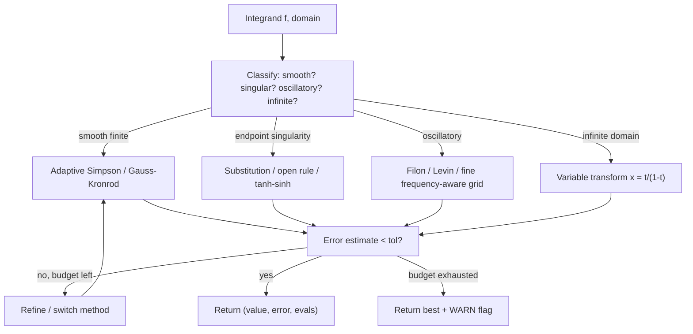
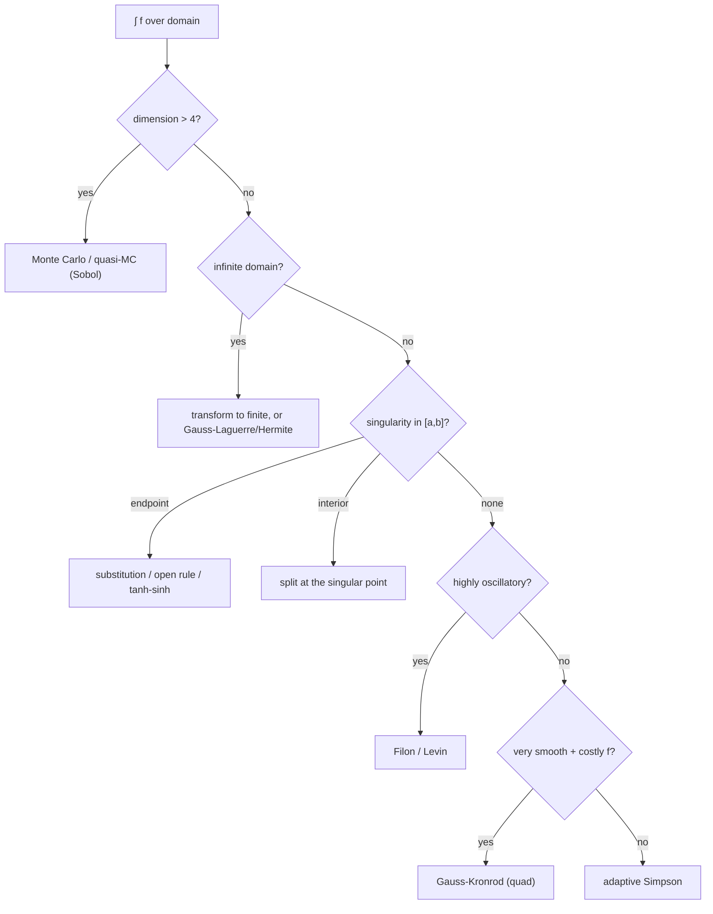

# Simpson's Rule and Numerical Integration — Senior Level

> **One-line summary:** In production, a single Simpson call is rarely the answer. Robust numerical integration is a *system*: it detects and tames singularities (via substitution, open rules, or singularity subtraction), handles oscillatory integrands (with frequency-aware grids or specialized transforms), controls error with both absolute and relative tolerances under a recursion/evaluation budget, and chooses the right tool — adaptive Simpson, **Gaussian quadrature**, Gauss–Kronrod, tanh–sinh — for each integrand class. Senior work is mostly about knowing the failure modes and reaching for the right library routine (QUADPACK, `scipy.integrate.quad`, Apache Commons Math) rather than rolling your own.

---

## Table of Contents

1. [Introduction](#introduction)
2. [Numerical Integration as a System](#numerical-integration-as-a-system)
3. [Singularities and How to Tame Them](#singularities-and-how-to-tame-them)
4. [Oscillatory Integrands](#oscillatory-integrands)
5. [Tolerance Control in Production](#tolerance-control-in-production)
6. [Gaussian Quadrature and Beyond](#gaussian-quadrature-and-beyond)
7. [Comparison with Alternatives](#comparison-with-alternatives)
8. [Code Examples](#code-examples)
9. [Observability](#observability)
10. [Failure Modes](#failure-modes)
11. [Summary](#summary)

---

## Introduction

> Focus: "How do I integrate *robustly*, in real systems, on integrands that fight back?"

The junior and middle levels assumed a smooth, well-behaved function on a finite interval. Production rarely cooperates. You will be handed integrands that blow up at an endpoint (`1/sqrt(x)`), oscillate millions of times (`sin(1000x)·g(x)`), have heavy tails on infinite domains (`e^(-x^2)` from `0` to `∞`), or contain a discontinuity you did not know about. A naive composite or even adaptive Simpson will silently return garbage — or never terminate — on any of these.

The senior mindset is **defensive and selective**. Defensive: assume the integrand is hostile until proven otherwise, guard every loop and recursion, and always carry an error estimate. Selective: Simpson is one tool among many, and the engineer's value is knowing *which* method fits *which* integrand class — and, crucially, knowing when to stop hand-rolling and call a battle-tested library (QUADPACK's `QAGS`, `scipy.integrate.quad`, Apache Commons Math's `SimpsonIntegrator`/`IterativeLegendreGaussIntegrator`). This file maps the failure modes and the toolbox.

---

## Numerical Integration as a System

A production integrator is not "the Simpson formula." It is a pipeline:



Three cross-cutting concerns run through every box: a **function-evaluation budget** (so a pathological input cannot run forever), a **dual tolerance** (absolute *and* relative), and a **returned error estimate** so callers can decide whether to trust the result. A senior integrator never returns a bare number; it returns `(value, estimated_error, evaluations, status)`.

---

## Singularities and How to Tame Them

Simpson samples the endpoints. If `f` is infinite there, the estimate is `Inf` or `NaN`. Even an *integrable* singularity (where the true integral is finite, like `∫_0^1 1/sqrt(x) dx = 2`) destroys the `O(h^4)` convergence because the parabola model fails near the spike. Strategies:

### 1. Variable substitution

Transform the singularity away. For `∫_0^1 g(x)/sqrt(x) dx`, substitute `x = t^2`, `dx = 2t dt`:

```text
∫_0^1 g(x)/sqrt(x) dx = ∫_0^1 g(t^2)/t · 2t dt = 2 ∫_0^1 g(t^2) dt
```

The new integrand is smooth — Simpson recovers full accuracy.

### 2. Open rules (don't sample the endpoint)

The **midpoint rule** and Gauss rules never evaluate the endpoints, so a singularity *exactly at* `a` or `b` is dodged. Adaptive open-rule integration handles many endpoint singularities without any substitution.

### 3. Singularity subtraction

Subtract a known-integrable singular piece. To integrate `f(x) = g(x)/sqrt(x)` where `g` is smooth, write `f = g(0)/sqrt(x) + [g(x)-g(0)]/sqrt(x)`. The first piece integrates in closed form; the second is now bounded (it goes to 0) and Simpson handles it.

### 4. Infinite domains via transform

Map `[0, ∞)` to a finite interval. `x = t/(1-t)`, `dx = dt/(1-t)^2`, sends `t ∈ [0,1)` to `x ∈ [0, ∞)`:

```text
∫_0^∞ f(x) dx = ∫_0^1 f(t/(1-t)) / (1-t)^2 dt
```

For doubly-infinite domains, `x = t/(1-t^2)` over `t ∈ (-1, 1)`. The **tanh–sinh (double exponential)** transform is the gold standard here: it places nodes so the transformed integrand decays double-exponentially, crushing endpoint singularities and infinite tails simultaneously.

| Problem | Symptom | Fix |
|---------|---------|-----|
| `1/sqrt(x)` at 0 | `f(a)` = Inf | substitute `x = t^2`, or open rule |
| `log(x)` at 0 | `f(a)` = -Inf | singularity subtraction or tanh–sinh |
| `1/(1-x)` at 1 | `f(b)` = Inf | substitution / split / tanh–sinh |
| `e^(-x^2)` on `[0, ∞)` | infinite domain | transform `x = t/(1-t)` |
| interior pole `1/(x-c)` | jump inside | split at `c`; consider principal value |

---

## Oscillatory Integrands

For `f(x) = w(x)·sin(ωx)` with large `ω`, the function oscillates rapidly. Simpson aliases: unless `h` is small enough to resolve each oscillation (`h ≲ 1/ω`), the parabola fit averages over peaks and troughs incorrectly, and the error does *not* shrink as `O(h^4)`. Forcing `h ≲ 1/ω` over the whole interval means an enormous number of evaluations.

Specialized approaches:

- **Filon's method** integrates the polynomial part against `sin`/`cos` analytically, so accuracy is independent of `ω`.
- **Levin's method** turns the oscillatory integral into an ODE/collocation problem.
- **Frequency-aware grids** at minimum guarantee several samples per period; combine with adaptive refinement.

The senior takeaway: detect high oscillation (e.g. by sign-change density of `f` over a probe grid) and route to a Filon-type method instead of letting adaptive Simpson thrash.

---

## Tolerance Control in Production

A single `eps` is naive. Real integrators expose **both** absolute and relative tolerances and accept when *either* is met:

```text
accept panel if  error_estimate <= max(epsabs, epsrel * |panel_estimate|)
```

- **`epsabs`** matters when the integral is near zero (relative error is meaningless there).
- **`epsrel`** matters when the integral is huge (absolute error of `1e-9` is absurdly tight on a value of `1e12`).

Other production controls:

| Control | Purpose | Typical value |
|---------|---------|---------------|
| `epsabs` | absolute accuracy floor | `1e-10` |
| `epsrel` | relative accuracy target | `1e-8` |
| `max_evals` | hard cap on function calls | `10^6` |
| `max_depth` | recursion guard | `50` |
| `min_panel` | smallest panel before giving up | a few × `ulp(b-a)` |

When the budget is exhausted before convergence, return the best estimate **with a warning status** — never silently. Round-off sets the ultimate floor: once panels approach machine epsilon, `|S2 - S|` is dominated by noise, not by the modeling error, and further refinement is futile (and can even worsen the result).

---

## Gaussian Quadrature and Beyond

Simpson's nodes are *forced* to be equally spaced. **Gaussian quadrature** asks: if we are free to choose both the nodes *and* the weights, what is the best we can do? The answer is remarkable — an `n`-point Gauss–Legendre rule is **exact for polynomials up to degree `2n-1`**, double the degree of any equal-node Newton–Cotes rule with the same node count. The nodes are the roots of Legendre polynomials; the weights come from those roots.

```text
∫_{-1}^{1} f(x) dx ≈ Σ_{i=1}^{n} w_i · f(x_i)    (exact for deg ≤ 2n-1)
```

For a generic `[a, b]`, linearly remap. For smooth integrands and expensive function evaluations, Gauss obliterates Simpson on accuracy-per-evaluation.

**Gauss–Kronrod** extends a Gauss rule with extra nodes so the difference between the Gauss and Kronrod estimates gives a *free* error estimate — this is the engine inside QUADPACK's `QAG`/`QAGS` and `scipy.integrate.quad`. **Clenshaw–Curtis** uses Chebyshev nodes and an FFT, with nested grids for cheap refinement.

| Method | Nodes | Exact to degree | Error estimate built in? | Best for |
|--------|-------|-----------------|--------------------------|----------|
| Adaptive Simpson | equal | 3 | yes (`(S2-S)/15`) | simple, smooth, self-contained code |
| Gauss–Legendre `n`-pt | optimal | `2n-1` | no (compare two orders) | very smooth, costly `f` |
| Gauss–Kronrod | nested | high | yes (Gauss vs Kronrod) | general-purpose libraries |
| Clenshaw–Curtis | Chebyshev | high | yes (nested) | smooth, FFT-friendly |
| tanh–sinh | double-exp | n/a | yes (level doubling) | singular / infinite |

**The honest senior conclusion:** unless you have a specific reason (no dependency allowed, a teaching context, a trivially smooth integrand), **do not hand-roll** production integration. Use `scipy.integrate.quad` (QUADPACK Gauss–Kronrod under the hood), Apache Commons Math, GSL, or Boost.Math. They handle the failure modes above, return error estimates, and are extensively validated. Reserve your own adaptive Simpson for embedded contexts, hot inner loops with a known-smooth integrand, or when you need a dependency-free implementation.

---

## Comparison with Alternatives

| Attribute | Adaptive Simpson | Gauss–Kronrod (`quad`) | tanh–sinh | Monte Carlo |
|-----------|------------------|------------------------|-----------|-------------|
| Accuracy on smooth `f` | high | very high | very high | low (`O(1/sqrt(N))`) |
| Handles singularities | with help | partially | excellently | yes |
| Handles infinite domains | with transform | yes (`quad` supports) | yes | yes |
| High dimensions | no (curse of dim.) | no | no | **yes** (the only practical choice) |
| Error estimate | yes | yes | yes | statistical |
| Implementation effort | low | use a library | medium | low |
| Production usage | embedded/simple | SciPy, QUADPACK | special-purpose | high-dim integrals, finance |

For dimensions above ~4, *all* grid-based rules (Simpson, Gauss) succumb to the **curse of dimensionality** — the node count grows like `n^d`. There, **Monte Carlo** and quasi–Monte Carlo (Sobol/Halton sequences) are the only viable tools, with error `O(1/sqrt(N))` independent of dimension.

---

## Code Examples

### Production-Grade Adaptive Simpson with Budget, Dual Tolerance, and Status

#### Go

```go
package main

import (
	"fmt"
	"math"
)

type Result struct {
	Value, Error float64
	Evals        int
	Converged    bool
}

func integrate(f func(float64) float64, a, b, epsabs, epsrel float64, maxEvals int) Result {
	evals := 0
	call := func(x float64) float64 { evals++; return f(x) }
	simp := func(fa, fb, fm, lo, hi float64) float64 { return (hi - lo) / 6 * (fa + 4*fm + fb) }

	var rec func(a, b, fa, fb, fm, whole, tol float64, depth int) (float64, float64, bool)
	rec = func(a, b, fa, fb, fm, whole, tol float64, depth int) (float64, float64, bool) {
		m := (a + b) / 2
		flm, frm := call((a+m)/2), call((m+b)/2)
		left := simp(fa, fm, flm, a, m)
		right := simp(fm, fb, frm, m, b)
		diff := left + right - whole
		localTol := math.Max(tol, epsrel*math.Abs(left+right))
		if depth <= 0 || math.Abs(diff) <= 15*localTol || evals >= maxEvals {
			conv := math.Abs(diff) <= 15*localTol
			return left + right + diff/15, math.Abs(diff) / 15, conv
		}
		lv, le, lc := rec(a, m, fa, fm, flm, left, tol/2, depth-1)
		rv, re, rc := rec(m, b, fm, fb, frm, right, tol/2, depth-1)
		return lv + rv, le + re, lc && rc
	}

	fa, fb, fm := call(a), call(b), call((a+b)/2)
	whole := simp(fa, fb, fm, a, b)
	v, e, c := rec(a, b, fa, fb, fm, whole, epsabs, 50)
	return Result{v, e, evals, c}
}

func main() {
	r := integrate(math.Sin, 0, math.Pi, 1e-12, 1e-12, 1_000_000)
	fmt.Printf("value=%.12f err=%.2e evals=%d ok=%v\n", r.Value, r.Error, r.Evals, r.Converged)
	// value≈2.0, the exact integral of sin over [0, pi]
}
```

#### Java

```java
import java.util.function.DoubleUnaryOperator;

public class RobustSimpson {
    static final int[] evals = {0};

    record Result(double value, double error, int evals, boolean converged) {}

    static double simp(double fa, double fb, double fm, double lo, double hi) {
        return (hi - lo) / 6 * (fa + 4 * fm + fb);
    }

    static double[] rec(DoubleUnaryOperator f, double a, double b, double fa, double fb,
                        double fm, double whole, double tol, double epsrel, int depth, int maxEvals) {
        double m = (a + b) / 2;
        evals[0] += 2;
        double flm = f.applyAsDouble((a + m) / 2), frm = f.applyAsDouble((m + b) / 2);
        double left = simp(fa, fm, flm, a, m), right = simp(fm, fb, frm, m, b);
        double diff = left + right - whole;
        double localTol = Math.max(tol, epsrel * Math.abs(left + right));
        if (depth <= 0 || Math.abs(diff) <= 15 * localTol || evals[0] >= maxEvals) {
            double conv = (Math.abs(diff) <= 15 * localTol) ? 1 : 0;
            return new double[]{left + right + diff / 15, Math.abs(diff) / 15, conv};
        }
        double[] l = rec(f, a, m, fa, fm, flm, left, tol / 2, epsrel, depth - 1, maxEvals);
        double[] r = rec(f, m, b, fm, fb, frm, right, tol / 2, epsrel, depth - 1, maxEvals);
        return new double[]{l[0] + r[0], l[1] + r[1], (l[2] == 1 && r[2] == 1) ? 1 : 0};
    }

    static Result integrate(DoubleUnaryOperator f, double a, double b,
                            double epsabs, double epsrel, int maxEvals) {
        evals[0] = 0;
        evals[0] += 3;
        double fa = f.applyAsDouble(a), fb = f.applyAsDouble(b), fm = f.applyAsDouble((a + b) / 2);
        double whole = simp(fa, fb, fm, a, b);
        double[] r = rec(f, a, b, fa, fb, fm, whole, epsabs, epsrel, 50, maxEvals);
        return new Result(r[0], r[1], evals[0], r[2] == 1);
    }

    public static void main(String[] args) {
        Result r = integrate(Math::sin, 0, Math.PI, 1e-12, 1e-12, 1_000_000);
        System.out.printf("value=%.12f err=%.2e evals=%d ok=%b%n",
                r.value(), r.error(), r.evals(), r.converged());
    }
}
```

#### Python

```python
import math
from dataclasses import dataclass


@dataclass
class Result:
    value: float
    error: float
    evals: int
    converged: bool


def integrate(f, a, b, epsabs=1e-12, epsrel=1e-12, max_evals=1_000_000):
    evals = 0

    def call(x):
        nonlocal evals
        evals += 1
        return f(x)

    def simp(fa, fb, fm, lo, hi):
        return (hi - lo) / 6 * (fa + 4 * fm + fb)

    def rec(a, b, fa, fb, fm, whole, tol, depth):
        m = (a + b) / 2
        flm, frm = call((a + m) / 2), call((m + b) / 2)
        left, right = simp(fa, fm, flm, a, m), simp(fm, fb, frm, m, b)
        diff = left + right - whole
        local_tol = max(tol, epsrel * abs(left + right))
        if depth <= 0 or abs(diff) <= 15 * local_tol or evals >= max_evals:
            return left + right + diff / 15, abs(diff) / 15, abs(diff) <= 15 * local_tol
        lv, le, lc = rec(a, m, fa, fm, flm, left, tol / 2, depth - 1)
        rv, re, rc = rec(m, b, fm, fb, frm, right, tol / 2, depth - 1)
        return lv + rv, le + re, lc and rc

    fa, fb, fm = call(a), call(b), call((a + b) / 2)
    v, e, c = rec(a, b, fa, fb, fm, simp(fa, fb, fm, a, b), epsabs, 50)
    return Result(v, e, evals, c)


if __name__ == "__main__":
    r = integrate(math.sin, 0, math.pi)
    print(f"value={r.value:.12f} err={r.error:.2e} evals={r.evals} ok={r.converged}")  # ~2.0
```

**What it does:** an adaptive Simpson that respects dual tolerances, caps function evaluations, and returns `(value, error, evals, converged)` — the production contract.
**Run:** `go run main.go` | `javac RobustSimpson.java && java RobustSimpson` | `python robust.py`

### Comparing Against the Library Oracle

#### Python

```python
from scipy import integrate as si

# Always validate a hand-rolled integrator against the library on known cases.
val, abserr = si.quad(lambda x: math.exp(-x * x), 0, 1)   # Gauss-Kronrod under the hood
print(val, abserr)  # 0.7468241328124271 4.2e-15

# Infinite domain: quad supports it directly.
val2, _ = si.quad(lambda x: math.exp(-x * x), 0, math.inf)
print(val2)  # 0.8862269254527579  (= sqrt(pi)/2)
```

---

## Choosing the Right Method: A Decision Guide

Faced with a real integral, a senior engineer triages it before writing any code. The decision tree below encodes the institutional knowledge that separates "it returned a number" from "it returned the *right* number."



| Integrand trait | First choice | Why |
|-----------------|--------------|-----|
| Smooth, finite, cheap `f` | adaptive Simpson | simple, self-contained, good enough |
| Smooth, finite, costly `f` | Gauss–Kronrod | fewer evaluations for same accuracy |
| Analytic, finite | Clenshaw–Curtis / Gauss | spectral convergence |
| Endpoint singularity | tanh–sinh | crushes singularities + tails |
| Infinite domain | transform or Gauss–Laguerre/Hermite | matched weight functions |
| Oscillatory | Filon / Levin | accuracy independent of frequency |
| High dimension | Monte Carlo / QMC | beats the curse of dimensionality |

The meta-rule: **classify, then route.** A single `quad` call in SciPy already does much of this routing internally (it picks weighted variants based on the `weight=` and `points=` hints), which is the strongest argument for using it over a hand-rolled Simpson.

## Concurrency and Vectorization

When the integrand `f` is expensive (a simulation, a database lookup, a neural-net forward pass), the evaluations dominate wall-clock time, and parallelism pays.

- **Composite rules parallelize trivially.** Composite Simpson evaluates `f` at `n+1` independent nodes; map them across a thread pool or SIMD lanes, then reduce with the `1-4-2-...-4-1` weights. The reduction is associative, so order does not affect correctness (only round-off — use pairwise summation for stability).
- **Adaptive rules parallelize as a task tree.** Each `SPLIT` spawns two independent recursive subproblems — a natural fork/join. A work-stealing pool (Go goroutines, Java `ForkJoinPool`, Python `concurrent.futures`) keeps cores busy on imbalanced trees (the spike region is deep, the flat region shallow). Guard the shared evaluation counter with an atomic, or accumulate per-task and sum at the join.
- **Batch the integrand.** If `f` can evaluate a *vector* of `x` values at once (NumPy, GPU), composite rules win big: build the node array, call `f` once on the whole array, dot with the weight vector. This often beats adaptive recursion for moderate accuracy because it amortizes call overhead.

| Strategy | Parallelism | Best when |
|----------|-------------|-----------|
| Composite + thread pool | data-parallel over nodes | `f` costly, accuracy target known |
| Composite + SIMD/vectorized `f` | data-parallel batch | `f` vectorizable (NumPy/GPU) |
| Adaptive fork/join | task-parallel over panels | `f` costly, error highly non-uniform |

The trade-off: adaptive recursion gives the best *evaluation count* but is harder to parallelize cleanly; vectorized composite gives the best *throughput per evaluation* but may over-sample easy regions. Senior judgment picks based on whether evaluations or scheduling overhead dominates.

## Caching and Memoization of the Integrand

If the same `f` is integrated repeatedly over overlapping intervals (e.g. computing a CDF at many query points `Φ(z_1), Φ(z_2), ...`), recomputing `f` at shared nodes is waste. Two patterns:

- **Cumulative integration:** compute `∫_a^{z} f` once on a fine grid, store the running sums (a prefix-sum of panel contributions), and answer each `Φ(z_i)` by interpolating into the table — `O(1)` per query after `O(n)` setup.
- **Node memoization:** wrap `f` in a memoizing cache keyed by `x` (rounded to a tolerance). Adaptive recursion across nearby query intervals then reuses overlapping samples. Beware floating-point keys: round to a grid or the cache never hits.

The cumulative approach is strictly better when queries are dense and `f` is fixed — it is how statistical libraries precompute the normal CDF table once at startup.

## Observability

A production integrator should be instrumented so failures are diagnosable, not mysterious.

| Metric | Why it matters | Alert / action |
|--------|----------------|----------------|
| `function_evaluations` | proxy for cost; runaway means a pathological integrand | alert if `> 90%` of budget |
| `recursion_depth_max` | deep recursion signals a singularity/discontinuity | log the worst subinterval |
| `estimated_error / tolerance` | did we actually converge? | flag results where ratio `> 1` |
| `converged` flag | non-converged results must not be trusted blindly | surface to caller, never swallow |
| `wall_time_per_call` | catches expensive integrands in hot paths | move off the critical path / cache |
| `nan_inf_count` | endpoint singularities or domain errors | route to a singularity-aware method |

Log the subinterval where the most evaluations were spent — that pinpoints the troublesome region (a peak, a near-singularity) for the next engineer.

---

## Real-World Case Studies

**Quantitative finance — option pricing.** The price of a European option under many models is an integral of a payoff against a (sometimes only numerically known) probability density. These integrands are smooth but have long tails; practitioners transform the domain (or use the option's characteristic function via Fourier methods) and integrate with Gauss–Kronrod. A naive fixed-grid Simpson truncates the tail and misprices deep out-of-the-money options — a textbook failure of ignoring an infinite domain.

**Computer graphics — rendering.** The rendering equation integrates incoming light over the hemisphere at each surface point. The integrand is high-dimensional (paths bounce repeatedly) and discontinuous (shadows, edges). Grid-based Simpson is hopeless here; the field uses Monte Carlo (path tracing) with importance sampling and quasi-random sequences — the curse of dimensionality made vivid.

**Physics/engineering — center of mass, work, flux.** Computing `∫ x ρ(x) dx` for a center of mass or `∫ F·ds` for work along a path are bread-and-butter Simpson applications: low-dimensional, smooth, finite. Here adaptive Simpson or a modest composite Simpson is exactly right, and rolling your own is defensible.

**Statistics — likelihoods and Bayesian evidence.** Marginal likelihoods are integrals over parameter space. In low dimensions, adaptive quadrature; in high dimensions, MCMC or nested sampling. The dimension threshold dictates the entire toolset.

| Domain | Integrand character | Method actually used | Simpson appropriate? |
|--------|--------------------|-----------------------|----------------------|
| Option pricing | smooth, heavy tails | Gauss–Kronrod / Fourier | only after transform |
| Rendering | high-dim, discontinuous | Monte Carlo path tracing | no |
| Mechanics (1-D) | smooth, finite | adaptive Simpson | yes |
| Bayesian evidence | high-dim | MCMC / nested sampling | no (low-dim only) |

The recurring lesson: **the integrand's dimension, smoothness, and domain — not familiarity with Simpson — dictate the method.** Senior engineers earn their keep by reading those traits correctly and reaching for the matching tool.

## Validation Strategy in Production

Numerical results are uniquely treacherous because a wrong answer often *looks* plausible. Defensive validation:

- **Golden cases:** keep a suite of integrals with known closed forms (`∫_0^π sin = 2`, `∫_0^1 4/(1+x^2) = π`, polynomials) and assert your integrator matches within tolerance on every build.
- **Library cross-check:** in tests, compare against `scipy.integrate.quad`; any disagreement beyond the combined tolerances is a bug.
- **Refinement consistency:** the result should not change (beyond tolerance) when you tighten `ε` or change the method — instability signals a singularity or round-off problem.
- **Self-consistency of the error estimate:** the returned error should bracket the true error on golden cases; if it routinely under-reports, the `(S2−S)/15` heuristic is being fooled (coarse panels over a feature) and you need a minimum subdivision.
- **Property checks:** linearity (`∫(αf+βg) = α∫f + β∫g`), additivity (`∫_a^c + ∫_c^b = ∫_a^b`), and sign for known-positive integrands are cheap invariants that catch many bugs.

## Tolerance Tuning in Practice

Choosing tolerances is its own small craft. A few field-tested heuristics:

- **Start loose, tighten if needed.** Run at `epsrel = 1e-6` first; only tighten to `1e-10` if a downstream consumer demands it. Each extra digit roughly doubles the evaluations on a smooth integrand.
- **Match the tolerance to the input precision.** If `f` itself carries `1e-8` relative noise (measured data, a stochastic model), demanding `1e-12` integration accuracy is meaningless — the integrand noise dominates.
- **Scale `epsabs` by the expected magnitude.** If you know the answer is `O(1)`, `epsabs = 1e-10` is fine; if it could be `1e-20`, set `epsabs` accordingly or rely on `epsrel`.
- **Watch the round-off floor.** In double precision, no rule reliably beats `~1e-14` relative; in `float32`, `~1e-6`. Asking below the floor wastes time and can worsen the result.

| Use case | Suggested `epsrel` | Rationale |
|----------|--------------------|-----------|
| Interactive / plotting | `1e-4` | screen resolution; speed matters |
| Engineering estimate | `1e-6` | typical model fidelity |
| Scientific result | `1e-10` | publication-grade |
| Noisy/measured integrand | match noise level | finer is illusory |

A final caution: tolerances interact with the integrand's *scale*. The same routine called on `f` and on `1000·f` should be configured so the *relative* tolerance, not the absolute one, drives acceptance — otherwise the scaled call silently over- or under-refines. Always test your integrator at two scales of the same integrand to confirm the tolerance behaves as intended.

## Failure Modes

- **Silent non-convergence:** budget exhausted, but a bare number is returned. *Fix:* always propagate a `converged`/`status` flag.
- **Endpoint singularity NaN:** `f(a)` or `f(b)` infinite. *Fix:* open rule, substitution, or tanh–sinh.
- **Oscillation aliasing:** rapid `sin(ωx)` undersampled. *Fix:* Filon/Levin or guaranteed samples-per-period.
- **Round-off floor hit:** tolerance below machine epsilon → never converges, refines forever. *Fix:* clamp tolerance, `min_panel` guard.
- **Discontinuity inside interval:** parabola straddles a jump; `(S2-S)/15` never small. *Fix:* split at the jump; depth cap as backstop.
- **Curse of dimensionality:** trying Simpson/Gauss on a 6-D integral. *Fix:* switch to Monte Carlo / quasi-MC.
- **Cancellation:** integrand of huge oscillating magnitude with tiny net integral. *Fix:* reformulate, use higher precision, or analytic cancellation.
- **Rolling your own when a library exists:** subtle bugs in singularity handling. *Fix:* use QUADPACK/`quad`/Commons Math unless there is a hard constraint.

---

## Anti-Patterns to Avoid

- **The single magic `n`.** Hard-coding `n = 1000` "because it's usually enough" produces silent garbage on the day an input needs more. Always refine or use a tolerance.
- **Swallowing non-convergence.** Returning the best estimate without a status flag hides failures until they corrupt a downstream computation. Propagate `converged`.
- **Absolute tolerance only.** A bare `epsabs` is meaningless when the integral spans orders of magnitude across calls. Carry `epsrel` too.
- **Re-implementing QUADPACK.** Subtle singularity and extrapolation logic took experts years to get right. Use the library unless you have a hard constraint, and document *why* if you don't.
- **Ignoring the integrand's class.** Throwing adaptive Simpson at a 6-D or oscillatory integral wastes evaluations and still fails. Classify first.
- **Trusting the error estimate blindly.** `(S2−S)/15` is asymptotic, not a bound; on a coarse panel over a sharp feature it can lie. Enforce a minimum subdivision and a depth cap.
- **Round-off denial.** Demanding `1e-16` accuracy in double precision causes infinite refinement. Clamp tolerance to the precision floor.

- **Document the envelope.** State, in code comments or API docs, the assumed integrand class (smooth, finite domain, no interior singularity). When a caller violates it, the routine's behavior is undefined and they need to know that. An undocumented integrator is a future incident.

## Putting It Together: a Robust Integration Checklist

When you ship an integration routine, walk this list:

1. **Classify** the integrand: dimension, smoothness, domain, oscillation.
2. **Route** to the matching method (the decision tree above) — default to a library `quad`.
3. **Set dual tolerances** `epsabs` and `epsrel`, scaled to the expected magnitude.
4. **Cap** function evaluations and recursion depth.
5. **Return** `(value, error, evals, converged)` — never a bare number.
6. **Validate** against golden cases and a library oracle in tests.
7. **Instrument** evaluations, depth, and the error/tolerance ratio for production monitoring.
8. **Document** the assumptions (smoothness, domain) so the next engineer knows when the routine is out of its envelope.

Each step closes one of the failure modes enumerated above; skipping any one is where production incidents originate.

Treat this checklist as a code-review rubric for any pull request that adds or changes numerical integration — it turns the diffuse "be careful with numerics" advice into concrete, checkable line items.

## Summary

Senior-level numerical integration treats Simpson as one component of a robust system, not the answer. Real integrands bring singularities (tamed by substitution `x = t^2`, open rules, singularity subtraction, or tanh–sinh transforms), infinite domains (mapped to `[0,1)` via `x = t/(1-t)`), and oscillation (handled by Filon/Levin, not by brute-force grids). Production tolerance control uses **both** `epsabs` and `epsrel` with a function-evaluation budget, a recursion-depth cap, and a returned `(value, error, evals, converged)` contract — never a bare number. When function evaluations are costly and `f` is smooth, **Gaussian quadrature** (exact to degree `2n-1` from `n` nodes) and **Gauss–Kronrod** (free error estimate) beat Simpson decisively, which is why libraries like `scipy.integrate.quad` (QUADPACK) and Apache Commons Math are the default; above ~4 dimensions, only **Monte Carlo** survives the curse of dimensionality. The senior judgment call is matching method to integrand class — and, most often, reaching for a validated library rather than hand-rolling.

---

Next step: continue to [`professional.md`](./professional.md) for the formal error-formula derivation `-(b-a)h^4 f''''(ξ)/180`, degree-of-precision theory, convergence proofs, and the justification of the adaptive `(S2-S)/15` criterion.
