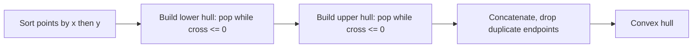
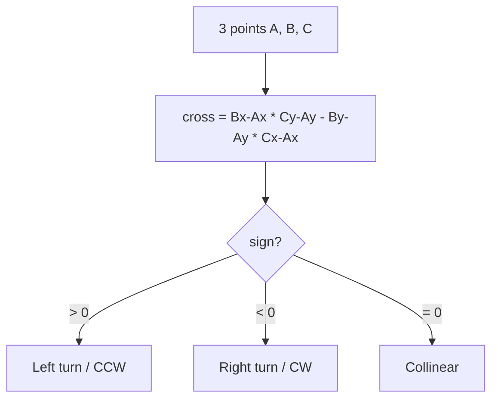

# Convex Hull (2D) — Junior Level

> **One-line summary:** The convex hull of a set of points is the smallest convex polygon that contains all of them — imagine stretching a rubber band around a board of nails. The workhorse algorithm, **Andrew's monotone chain**, sorts the points and sweeps them left-to-right and back, using a single **orientation (cross-product) test** to decide which points form the boundary, running in `O(n log n)`.

---

## Table of Contents

1. [Introduction](#introduction)
2. [Prerequisites](#prerequisites)
3. [Glossary](#glossary)
4. [Geometry Primitives](#geometry-primitives)
5. [Core Concepts](#core-concepts)
6. [Big-O Summary](#big-o-summary)
7. [Real-World Analogies](#real-world-analogies)
8. [Pros & Cons](#pros--cons)
9. [Step-by-Step Walkthrough](#step-by-step-walkthrough)
10. [Code Examples](#code-examples)
11. [Coding Patterns](#coding-patterns)
12. [Error Handling](#error-handling)
13. [Performance Tips](#performance-tips)
14. [Best Practices](#best-practices)
15. [Edge Cases & Pitfalls](#edge-cases--pitfalls)
16. [Common Mistakes](#common-mistakes)
17. [Cheat Sheet](#cheat-sheet)
18. [Visual Animation](#visual-animation)
19. [Summary](#summary)
20. [Further Reading](#further-reading)

---

## Introduction

Drop a handful of nails on a wooden board, then stretch a rubber band so it wraps around all of them and let go. The shape the band snaps into — taut, with no dents — is the **convex hull** of those nails. Every nail is either *on* the band or *inside* it; none pokes out.

Formally, the **convex hull** of a finite set of points `P` in the plane is the smallest convex polygon that contains every point of `P`. "Convex" means the polygon never bends inward: for any two points inside it, the straight line between them stays inside. "Smallest" means no smaller convex shape could still contain all the points.

The convex hull is one of the most fundamental objects in **computational geometry**. It shows up everywhere:

- **Collision detection and bounding** in games and physics — a hull is a cheap "outer shell" you test first.
- **Geographic Information Systems (GIS)** — the smallest region enclosing a set of GPS readings.
- **Pattern recognition** — the outline of a cluster of data points.
- As a **building block** for fancier algorithms: rotating calipers (diameter, width), Minkowski sums, Delaunay triangulation.

This file teaches the *what* and *how*. You will learn the one primitive everything depends on — the **orientation test**, built from a **cross product** — and then the cleanest hull algorithm to implement, **Andrew's monotone chain**. Master those two ideas and you own the topic at a working level.

A key mental anchor for the whole topic:

> **Almost every 2D geometry decision reduces to one question: given three points A, B, C, do you turn *left*, turn *right*, or go *straight* as you walk A → B → C?** That single question is answered by the sign of a cross product, and it is the heartbeat of convex hull algorithms.

---

## Prerequisites

Before reading this file you should be comfortable with:

- **Basic programming** — arrays/slices, loops, functions, and a stack (we use a slice as a stack).
- **Sorting** — we sort points by coordinate; you should know `O(n log n)` sorting exists and how to pass a comparator. (See topic *07-sorting-algorithms*.)
- **Coordinates** — a point is a pair `(x, y)`. A vector is the difference of two points.
- **Big-O notation** — `O(n)`, `O(n log n)`, `O(nh)`.

Optional but helpful:

- A little school geometry: the area of a triangle, what "clockwise" vs "counter-clockwise" means.
- Comfort with integer vs floating-point arithmetic (we will care about this for *exactness*).

You do **not** need trigonometry, calculus, or any heavy math. The cross product we use is just one multiplication-and-subtraction.

---

## Glossary

| Term | Meaning |
|------|---------|
| **Point** | A pair `(x, y)` of coordinates in the plane. |
| **Vector** | A direction-and-length, written as the difference of two points: `B - A = (Bx-Ax, By-Ay)`. |
| **Convex** | A shape with no dents: the segment between any two interior points stays inside. |
| **Convex hull** | The smallest convex polygon containing all input points. |
| **Hull vertex** | An input point that lies on the boundary (a "corner") of the hull. |
| **Cross product (2D)** | The scalar `(B-A) × (C-A) = (Bx-Ax)(Cy-Ay) - (By-Ay)(Cx-Ax)`. Its **sign** tells you the turn direction. |
| **Orientation / CCW test** | Using the cross-product sign to classify three points as a left turn (`>0`), right turn (`<0`), or collinear (`=0`). |
| **Collinear** | Three points lying on one straight line (cross product `= 0`). |
| **Monotone chain** | Andrew's algorithm: sort, then build the lower hull and upper hull in two sweeps. |
| **Lower / upper hull** | The bottom and top boundary chains; concatenated they form the full hull. |
| **Gift wrapping / Jarvis march** | An `O(nh)` hull algorithm that "wraps" point to point like wrapping a present. |
| **`h`** | The number of points on the hull (the output size). `h ≤ n`. |
| **Degeneracy** | A "special" input — duplicate points, all-collinear points, fewer than 3 points. |

---

## Geometry Primitives

This whole section establishes the foundation. **Every algorithm below stands on these three tiny pieces.** Get them right once and reuse them forever.

### 1. Point and Vector

A point is just two numbers. A vector (the difference of two points) is also two numbers but means "displacement / direction."

```text
Point  A = (Ax, Ay)
Vector AB = B - A = (Bx - Ax, By - Ay)
```

In code we represent a point as a small struct/tuple. We rarely need a separate vector type — we compute differences on the fly.

### 2. The Cross Product (the star of the show)

For three points `A`, `B`, `C`, the **2D cross product** of vectors `AB` and `AC` is the single scalar:

```text
cross(A, B, C) = (Bx - Ax) * (Cy - Ay) - (By - Ay) * (Cx - Ax)
```

Geometrically, this equals **twice the signed area** of triangle `A, B, C`. The *magnitude* is the area; the *sign* is what we actually use.

### 3. The Orientation / CCW Test

The sign of `cross(A, B, C)` answers "which way do we turn going A → B → C?":

| `cross(A, B, C)` | Meaning | Turn |
|------------------|---------|------|
| `> 0` | `C` is to the **left** of ray `A→B` | **counter-clockwise (CCW)** / left turn |
| `< 0` | `C` is to the **right** of ray `A→B` | **clockwise (CW)** / right turn |
| `= 0` | `A`, `B`, `C` are **collinear** | straight (no turn) |

```text
   C (left, cross > 0)              A----->B
   ^                                       \
   |        A----->B                        \
   |       (going right turns to C)          C (right, cross < 0)
```

That is the entire geometric vocabulary you need to build a hull. The orientation primitive in code:

```text
function orient(A, B, C):
    return (B.x - A.x) * (C.y - A.y) - (B.y - A.y) * (C.x - A.x)
    # > 0 : CCW (left turn)
    # < 0 : CW  (right turn)
    # = 0 : collinear
```

> **Why a cross product instead of angles?** Angles need trigonometry, division, and floating-point — all slow and error-prone. The cross product is one subtraction of two products. With **integer** coordinates it is **exact**: no rounding, no "almost equal." That exactness is why professionals reach for it first.

---

## Core Concepts

### 1. The hull is a sequence of "left turns" (or all right turns)

Walk around a convex polygon counter-clockwise. At every corner you turn **left** (or go straight on a collinear edge). You never turn right. That is *the definition of convexity expressed with the orientation test*. So building a hull is really: "keep adding points, and whenever the last three make a non-left turn, the middle one is a dent — throw it away."

### 2. Andrew's Monotone Chain — the algorithm to learn first

Monotone chain is the cleanest hull algorithm to code correctly:

1. **Sort** all points by `x`, breaking ties by `y`. (`O(n log n)`.)
2. **Build the lower hull:** sweep left → right. Keep a stack. For each new point, while the last two stack points plus the new one make a **non-left turn (cross ≤ 0)**, pop the stack. Then push.
3. **Build the upper hull:** sweep right → left with the same rule.
4. **Concatenate** lower and upper (dropping the duplicated endpoints).

The two sweeps together cost `O(n)`; the sort dominates at `O(n log n)`. No trigonometry, no angle sorting, just the orientation test.

### 3. Graham scan — the classic cousin

**Graham scan** does the same job a slightly different way: pick the bottom-most point as a pivot, **sort the rest by polar angle** around it, then sweep once, popping right turns. Also `O(n log n)`. It is historically famous (1972) but the angle sort is fiddlier than monotone chain's coordinate sort, so beginners should prefer monotone chain.

### 4. Gift wrapping / Jarvis march — simple but slow

**Gift wrapping** literally wraps the points: start at the leftmost point, then repeatedly pick the next hull point as the one that is "most clockwise" from the current edge, until you return to the start. Each wrap step scans all `n` points, and you do one step per hull vertex, giving `O(nh)`. When the hull is tiny (`h` small) it can be fast; when many points are on the hull it degrades to `O(n²)`.

### 5. QuickHull — divide and conquer

**QuickHull** (named after quicksort) finds the leftmost and rightmost points, splits the rest by which side of that line they fall on, and recursively finds the farthest point to "bulge out" toward. Average `O(n log n)`, worst case `O(n²)`. We mention it for completeness; monotone chain remains the recommended default.

---

## Big-O Summary

| Algorithm | Time | Space | Best for |
|-----------|------|-------|----------|
| **Monotone chain (Andrew)** | **O(n log n)** | O(n) | The default — simple, robust, integer-exact. |
| **Graham scan** | **O(n log n)** | O(n) | Classic; needs careful angle sort. |
| **Gift wrapping (Jarvis)** | **O(nh)** | O(n) | Few hull points (`h` small); simplest idea. |
| **QuickHull** | **O(n log n)** avg, O(n²) worst | O(n) | Good cache behavior on random data. |
| **Chan's algorithm** | **O(n log h)** | O(n) | Output-sensitive optimum (see `professional.md`). |
| `orient` (one test) | **O(1)** | O(1) | The inner primitive. |
| Lower bound (any) | **Ω(n log n)** | — | You cannot beat sorting in general (see `professional.md`). |

> `n` = number of input points, `h` = number of points on the hull. Since `h ≤ n`, gift wrapping's `O(nh)` is `O(n²)` in the worst case but can beat `O(n log n)` when `h` is tiny.

---

## Real-World Analogies

| Concept | Analogy |
|---------|---------|
| The convex hull | A rubber band stretched around a board of nails, snapping taut. |
| Convexity (no dents) | A stretched balloon: it bulges outward, never inward. |
| Orientation test (left/right turn) | Driving and your GPS saying "turn left," "turn right," or "continue straight." |
| Monotone chain's two sweeps | Wiping a window: one stroke along the bottom edge, one along the top. |
| Gift wrapping | Wrapping a present: pulling the paper taut from one corner to the next around the box. |
| Popping a dent | Pulling a slack section of the rubber band tight — the inner nail it skipped is no longer on the boundary. |
| Collinear points | Telephone poles in a straight line: only the two end poles matter for the "outline." |

Where the analogies break: the rubber band is a continuous physical object, while our algorithm only ever looks at three discrete points at a time and never "feels" tension globally.

---

## Pros & Cons

| Pros | Cons |
|------|------|
| Reduces a geometric question to one cheap primitive (the cross product). | Only describes the *outer* shape — loses all interior structure. |
| Monotone chain is short, robust, and `O(n log n)`. | Naive floating-point versions can misjudge near-collinear points. |
| Integer coordinates make the orientation test **exact** — no rounding errors. | Sensitive to degeneracies (duplicates, all-collinear) if you do not handle them. |
| A reusable building block (calipers, Minkowski sum, GIS bounding). | The hull can change drastically when one extreme point moves (not "stable"). |
| Cross product avoids slow, imprecise trigonometry entirely. | In high dimensions (3D+) it gets much harder; this topic is 2D-focused. |
| Output size `h` can be far smaller than `n` (cheap to store/transmit). | Worst case all `n` points are on the hull (e.g., points on a circle). |

**When to use:** computing a tight bounding polygon, the diameter/width of a point set, simplifying a point cloud's outline, as the first stage of many geometry pipelines.

**When NOT to use:** when you need the *interior* shape (use triangulation), when points are streaming and you need exact online updates without recomputation (use a dynamic hull — see `senior.md`), or in dimensions higher than 3 where specialized methods apply.

---

## Step-by-Step Walkthrough

Let us build the hull of these 7 points with **monotone chain**:

```
P = (0,0), (1,1), (2,0.5), (2,2), (3,0), (3,3), (1,2)
```

**Step 0 — Sort by x, then y:**

```
(0,0), (1,1), (1,2), (2,0.5), (2,2), (3,0), (3,3)
```

**Step 1 — Lower hull (sweep left → right).** Push points; whenever the last two plus the new one make a **non-left turn (cross ≤ 0)**, pop.

```
push (0,0)                              lower = [(0,0)]
push (1,1)                              lower = [(0,0),(1,1)]
add (1,2): cross((0,0),(1,1),(1,2)) = (1)(2)-(1)(1) = 1 > 0  left turn -> keep, push
                                        lower = [(0,0),(1,1),(1,2)]
add (2,0.5): cross((1,1),(1,2),(2,0.5)) = (0)(-0.5)-(1)(1) = -1 ≤ 0  pop (1,2)
             cross((0,0),(1,1),(2,0.5)) = (1)(0.5)-(1)(2) = -1.5 ≤ 0  pop (1,1)
             push (2,0.5)                lower = [(0,0),(2,0.5)]
add (2,2):  cross((0,0),(2,0.5),(2,2)) = (2)(2)-(0.5)(2) = 3 > 0  push
                                        lower = [(0,0),(2,0.5),(2,2)]
add (3,0):  cross((2,0.5),(2,2),(3,0)) = (0)(-0.5)-(1.5)(1) = -1.5 ≤ 0  pop (2,2)
            cross((0,0),(2,0.5),(3,0)) = (2)(0)-(0.5)(3) = -1.5 ≤ 0   pop (2,0.5)
            push (3,0)                  lower = [(0,0),(3,0)]
add (3,3):  cross((0,0),(3,0),(3,3)) = (3)(3)-(0)(3) = 9 > 0  push
                                        lower = [(0,0),(3,0),(3,3)]
```

Lower hull: `(0,0) → (3,0) → (3,3)`.

**Step 2 — Upper hull (sweep right → left)** with the same rule, processing in reverse sorted order. It produces:

```
Upper hull: (3,3) → (0,0)
```

(Here the upper boundary is the single long edge from the top-right corner straight back to the origin, because no point pokes above that line.)

**Step 3 — Concatenate**, dropping the repeated endpoints:

```
Hull = (0,0) → (3,0) → (3,3) → back to (0,0)
```

The interior points `(1,1), (1,2), (2,0.5), (2,2)` were all **popped** — they are dents inside the triangle. Notice every popped point failed the "left turn" test. That is the entire algorithm: *sort, sweep, pop non-left turns.*



---

## Code Examples

### Example: Andrew's monotone chain convex hull

We return hull vertices in counter-clockwise order. We use the orientation primitive `cross`. With **integer** coordinates this is exact.

#### Go

```go
package main

import (
	"fmt"
	"sort"
)

// Point is a 2D point with integer coordinates (exact orientation test).
type Point struct {
	X, Y int64
}

// cross returns (B-A) x (C-A): >0 CCW (left), <0 CW (right), 0 collinear.
func cross(a, b, c Point) int64 {
	return (b.X-a.X)*(c.Y-a.Y) - (b.Y-a.Y)*(c.X-a.X)
}

// ConvexHull returns the hull of pts in counter-clockwise order.
func ConvexHull(pts []Point) []Point {
	n := len(pts)
	if n < 3 {
		return append([]Point(nil), pts...) // 0, 1, or 2 points are their own hull
	}

	// Step 1: sort by x, then y.
	sort.Slice(pts, func(i, j int) bool {
		if pts[i].X != pts[j].X {
			return pts[i].X < pts[j].X
		}
		return pts[i].Y < pts[j].Y
	})

	hull := make([]Point, 0, 2*n)

	// Step 2: lower hull (left -> right).
	for _, p := range pts {
		for len(hull) >= 2 && cross(hull[len(hull)-2], hull[len(hull)-1], p) <= 0 {
			hull = hull[:len(hull)-1] // pop non-left turn (dent)
		}
		hull = append(hull, p)
	}

	// Step 3: upper hull (right -> left).
	lower := len(hull) + 1
	for i := n - 2; i >= 0; i-- {
		p := pts[i]
		for len(hull) >= lower && cross(hull[len(hull)-2], hull[len(hull)-1], p) <= 0 {
			hull = hull[:len(hull)-1]
		}
		hull = append(hull, p)
	}

	return hull[:len(hull)-1] // drop the last point (== first point)
}

func main() {
	pts := []Point{{0, 0}, {1, 1}, {2, 1}, {2, 2}, {3, 0}, {3, 3}, {1, 2}}
	hull := ConvexHull(pts)
	fmt.Println("Hull:", hull) // the corner points, CCW
}
```

#### Java

```java
import java.util.*;

public class ConvexHull {
    // Point with long coordinates -> exact integer orientation test.
    record Point(long x, long y) {}

    // cross = (B-A) x (C-A): >0 left/CCW, <0 right/CW, 0 collinear.
    static long cross(Point a, Point b, Point c) {
        return (b.x() - a.x()) * (c.y() - a.y()) - (b.y() - a.y()) * (c.x() - a.x());
    }

    static List<Point> convexHull(List<Point> pts) {
        int n = pts.size();
        if (n < 3) return new ArrayList<>(pts);

        pts = new ArrayList<>(pts);
        pts.sort((p, q) -> p.x() != q.x()
                ? Long.compare(p.x(), q.x())
                : Long.compare(p.y(), q.y()));

        List<Point> hull = new ArrayList<>();

        // Lower hull.
        for (Point p : pts) {
            while (hull.size() >= 2
                    && cross(hull.get(hull.size() - 2), hull.get(hull.size() - 1), p) <= 0) {
                hull.remove(hull.size() - 1);
            }
            hull.add(p);
        }

        // Upper hull.
        int lower = hull.size() + 1;
        for (int i = n - 2; i >= 0; i--) {
            Point p = pts.get(i);
            while (hull.size() >= lower
                    && cross(hull.get(hull.size() - 2), hull.get(hull.size() - 1), p) <= 0) {
                hull.remove(hull.size() - 1);
            }
            hull.add(p);
        }

        hull.remove(hull.size() - 1); // drop duplicate of first point
        return hull;
    }

    public static void main(String[] args) {
        List<Point> pts = List.of(
                new Point(0, 0), new Point(1, 1), new Point(2, 1),
                new Point(2, 2), new Point(3, 0), new Point(3, 3), new Point(1, 2));
        System.out.println("Hull: " + convexHull(pts));
    }
}
```

#### Python

```python
def cross(a, b, c):
    """(B-A) x (C-A): >0 left/CCW, <0 right/CW, 0 collinear."""
    return (b[0] - a[0]) * (c[1] - a[1]) - (b[1] - a[1]) * (c[0] - a[0])


def convex_hull(points):
    """Andrew's monotone chain. Returns hull vertices counter-clockwise."""
    pts = sorted(set(points))  # sort by (x, y); set() drops duplicates
    n = len(pts)
    if n < 3:
        return pts

    # Lower hull (left -> right).
    lower = []
    for p in pts:
        while len(lower) >= 2 and cross(lower[-2], lower[-1], p) <= 0:
            lower.pop()
        lower.append(p)

    # Upper hull (right -> left).
    upper = []
    for p in reversed(pts):
        while len(upper) >= 2 and cross(upper[-2], upper[-1], p) <= 0:
            upper.pop()
        upper.append(p)

    # Concatenate, dropping each chain's last point (it repeats the next start).
    return lower[:-1] + upper[:-1]


if __name__ == "__main__":
    pts = [(0, 0), (1, 1), (2, 1), (2, 2), (3, 0), (3, 3), (1, 2)]
    print("Hull:", convex_hull(pts))
```

**What it does:** sorts the points, builds the lower and upper boundary chains by popping any point that creates a non-left turn, and returns the hull corners.
**Run:** `go run main.go` | `javac ConvexHull.java && java ConvexHull` | `python convex_hull.py`

---

## Coding Patterns

### Pattern 1: The orientation guard (the monotone-chain workhorse)

**Intent:** while the top two stack points plus the new point do **not** turn left, the middle point is a dent — pop it.

```python
while len(hull) >= 2 and cross(hull[-2], hull[-1], p) <= 0:
    hull.pop()
hull.append(p)
```

This three-line loop *is* the algorithm. Internalize it. The `<= 0` includes collinear points (pops them, keeping a minimal hull); use `< 0` if you want to **keep** collinear boundary points.

### Pattern 2: Point-in-which-half-plane test

**Intent:** classify a point relative to a directed line `A→B` — the cross product's sign does it in one shot.

```python
def side(a, b, p):
    c = cross(a, b, p)
    return "left" if c > 0 else "right" if c < 0 else "on-line"
```

This same sign test powers QuickHull's "which side of the line" split and many other geometry routines.

### Pattern 3: Signed area / shoelace (a cross-product cousin)

**Intent:** the cross product summed around a polygon gives twice its signed area — positive if the vertices are CCW. Useful to *verify* your hull came out CCW.

```python
def signed_area2(poly):
    s = 0
    for i in range(len(poly)):
        a, b = poly[i], poly[(i + 1) % len(poly)]
        s += a[0] * b[1] - a[1] * b[0]
    return s  # > 0 means counter-clockwise
```



---

## Error Handling

| Error | Cause | Fix |
|-------|-------|-----|
| Wrong hull on `< 3` points | No guard for 0/1/2 points. | Return the points as-is when `n < 3`. |
| Hull comes out clockwise | Using `>= 0` instead of `<= 0` in the pop test, or wrong sweep order. | Stick to one convention; verify with the signed-area sign. |
| Duplicate points crash / duplicate hull vertices | Repeated coordinates confuse the pop loop. | Deduplicate before building (`sorted(set(points))`). |
| Floating-point "almost collinear" misjudged | `cross` is a tiny float close to 0. | Use **integer** coordinates, or an epsilon, or exact arithmetic. |
| All points collinear returns a polygon | The hull is a segment, not an area. | Decide your contract: return the 2 endpoints (or all collinear points). |
| Integer overflow in `cross` | Coordinates large; product exceeds 32-bit. | Use 64-bit (`int64`/`long`) for the cross product. |

---

## Performance Tips

- **Sort once, sweep twice.** The sort is the only `O(n log n)` part; everything else is linear. Do not re-sort.
- **Use integer coordinates when you can.** The cross product is then exact and you skip epsilon headaches.
- **Use 64-bit for the cross product.** Two coordinate differences multiplied can overflow 32-bit even when inputs fit.
- **Pre-deduplicate** identical points; duplicates waste cross-product comparisons and risk degenerate pops.
- **Avoid trigonometry.** `atan2`-based angle sorting (Graham scan) is slower and less precise than coordinate sorting (monotone chain).
- **Reserve capacity** for the hull stack (`2n` upper bound) to avoid reallocation.

---

## Best Practices

- Write the `cross` / `orient` primitive **once**, test it on hand-checked triples, and reuse it everywhere.
- Default to **monotone chain** — it is the least error-prone hull to implement correctly.
- Decide explicitly whether you keep or drop **collinear** boundary points, and document it (`<= 0` drops, `< 0` keeps).
- Always handle the small cases: 0, 1, 2 points, and all-collinear.
- Keep coordinates as integers through the geometry; only convert to float for display.
- Verify correctness on random inputs against a brute-force `O(n³)` hull (a point is a hull vertex iff some line through it has all other points on one side).

---

## Edge Cases & Pitfalls

- **Fewer than 3 points** — 0, 1, or 2 points are their own hull; guard early.
- **All points collinear** — the "hull" degenerates to a line segment; decide what to return.
- **Duplicate points** — deduplicate first, or the pop loop can misbehave.
- **Collinear points on a hull edge** — your test (`<= 0` vs `< 0`) decides whether the middle ones survive.
- **Many points on the boundary** — points on a circle put *all* `n` on the hull; `h = n`.
- **Large coordinates** — guard the cross product against integer overflow with 64-bit math.
- **Floating-point inputs** — near-collinear triples can flip sign due to rounding; prefer integers or careful tolerances.

---

## Common Mistakes

1. **Using `atan2` and comparing floats for the turn** instead of the integer cross product — slower and imprecise. Use `cross`.
2. **Forgetting the `< 3` guard** — the pop loop assumes at least two points on the stack.
3. **Mixing up `<= 0` and `>= 0`** — one builds a CCW hull, the other reverses orientation or keeps dents.
4. **Not deduplicating** — repeated points create zero-length edges and confuse collinear handling.
5. **32-bit overflow in the cross product** — silently produces a wrong sign; use 64-bit.
6. **Forgetting to drop the duplicated endpoint** when concatenating lower and upper chains — the first point appears twice.
7. **Assuming the hull is unique with collinear points** — it is not; the boundary points you keep depend on your convention.

---

## Cheat Sheet

| Step | What to do |
|------|------------|
| Primitive | `cross(A,B,C) = (Bx-Ax)(Cy-Ay) - (By-Ay)(Cx-Ax)`; `>0` left, `<0` right, `=0` collinear. |
| Guard | If `n < 3`, return points as-is. |
| Sort | By `x`, then `y`. |
| Lower hull | Sweep L→R: while `cross(top2, p) <= 0` pop; then push. |
| Upper hull | Sweep R→L with the same rule. |
| Combine | Concatenate lower + upper, drop the two duplicated endpoints. |
| Verify | Signed area `> 0` ⇒ CCW. |

Complexity:

```
monotone chain : O(n log n)   # sort dominates; default
gift wrapping  : O(n h)       # h = hull size; good when h tiny
quickhull      : O(n log n) avg, O(n^2) worst
lower bound    : Omega(n log n)
```

Hard rule: **use integer coordinates for an exact orientation test whenever possible.**

---

## Visual Animation

> See [`animation.html`](./animation.html) for an interactive visual animation of convex hull construction.
>
> The animation demonstrates:
> - Points scattered on a plane and the hull built by monotone chain / Graham scan
> - The current triple `A, B, C` highlighted with its **cross-product (turn) test**
> - Points being **popped** when they create a non-left turn (a dent)
> - The lower hull and upper hull forming, then concatenating
> - Step / Run / Reset controls, an info panel, a Big-O table, and an operation log

---

## Summary

The convex hull is the smallest convex polygon wrapping a set of points — a rubber band around nails. Everything rests on **one primitive**: the **cross product** `cross(A,B,C)`, whose **sign** tells you whether `A → B → C` turns left, right, or goes straight. With that, **Andrew's monotone chain** sorts the points and sweeps them twice, popping any point that forms a non-left turn, to produce the hull in `O(n log n)`. Learn three things and you own this topic at a working level: the **orientation test**, the **monotone-chain pop loop**, and the habit of using **integer coordinates** so the test is exact.

---

## Further Reading

- Andrew, A. M. (1979). *Another efficient algorithm for convex hulls in two dimensions.* Information Processing Letters 9(5):216–219 — the monotone chain paper.
- Graham, R. L. (1972). *An efficient algorithm for determining the convex hull of a finite planar set.* Information Processing Letters 1(4):132–133.
- *Computational Geometry: Algorithms and Applications* (de Berg, Cheong, van Kreveld, Overmars), Chapter 1.
- *Introduction to Algorithms* (CLRS), Chapter 33 — "Computational Geometry."
- cp-algorithms.com — "Convex Hull (Andrew's monotone chain)" and "Oriented area of a triangle."
- Sibling topics: *02-line-segment-intersection*, *03-closest-pair*, *04-rotating-calipers* (uses the hull as input).

---

**Next step:** [middle.md](./middle.md) — why each algorithm is correct, Graham vs monotone vs Jarvis, collinear handling, and integer-exact orientation.
