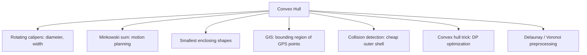

# Convex Hull (2D) — Middle Level

> **Focus:** *Why* each hull algorithm is correct, *when* to choose monotone chain vs Graham scan vs gift wrapping vs QuickHull, how to handle **collinear points and degeneracies** deliberately, and why **integer arithmetic** makes the orientation test exact while floating point quietly betrays you.

---

## Table of Contents

1. [Introduction](#introduction)
2. [Deeper Concepts](#deeper-concepts)
3. [Comparison with Alternatives](#comparison-with-alternatives)
4. [Collinear Points and Degeneracies](#collinear-points-and-degeneracies)
5. [Integer vs Floating-Point Exactness](#integer-vs-floating-point-exactness)
6. [Advanced Patterns](#advanced-patterns)
7. [Geometry Applications](#geometry-applications)
8. [Algorithmic Integration](#algorithmic-integration)
9. [Code Examples](#code-examples)
10. [Error Handling](#error-handling)
11. [Performance Analysis](#performance-analysis)
12. [Best Practices](#best-practices)
13. [Visual Animation](#visual-animation)
14. [Summary](#summary)

---

## Introduction

At junior level the convex hull is "sort, sweep, pop non-left turns." At middle level you start asking the *engineering* questions:

- *Why* does popping non-left turns actually yield the convex hull, and what invariant does the sweep maintain?
- When is **Graham scan** preferable to **monotone chain**, and when does **gift wrapping** (`O(nh)`) actually win?
- How do you *deliberately* handle collinear points — keep them, drop them, and why the choice matters for downstream consumers like rotating calipers?
- Why is the **integer cross product exact** while the same formula in `double` can return the wrong sign, and how do you defend against it?
- How does the hull plug into bigger algorithms (diameter, width, Minkowski sum, polygon area)?

These distinctions decide whether your geometry pipeline is *robust* (never crashes, never produces a self-intersecting "hull") or quietly wrong on adversarial input.

---

## Deeper Concepts

### The invariant behind monotone chain

The lower-hull sweep maintains one invariant:

> **At all times, the stack holds the vertices of the lower convex hull of the points processed so far, in left-to-right order, and every consecutive triple makes a strict left turn (`cross > 0`).**

When a new point `p` arrives, any vertex on top of the stack that would make a non-left turn with `p` cannot possibly be on the final lower hull — there is now a point further right and below the line, so the old vertex is a dent. We pop it. We keep popping until the invariant is restored, then push `p`. Because each point is pushed once and popped at most once, the two sweeps are `O(n)` total — an *amortized* argument identical to the one for the [next-greater-element monotonic stack](../../09-stacks-queues).

The upper-hull sweep is the mirror image (right to left), and concatenating the two chains closes the polygon. The correctness proof in full (induction on the sweep) lives in `professional.md`.

### Why Graham scan is correct

Graham scan picks the bottom-most (then left-most) point `P0` as a pivot, sorts the rest by **polar angle** around `P0`, and sweeps. The key fact: in angle-sorted order, the convex hull is traced by *always turning left*. Any right turn means the previous vertex is interior, so pop it. Same orientation test, same pop loop — only the *ordering* differs (angle vs coordinate). Monotone chain's coordinate sort sidesteps the trickiest part of Graham scan: handling points at the **same angle** from the pivot (ties), which the polar sort must break by distance.

### Why gift wrapping is correct

Gift wrapping starts at a guaranteed hull vertex (the left-most point) and, from the current hull edge, picks the next vertex as the one for which *all other points lie to one side* — equivalently, the "most clockwise" point. Each such selection is one full scan of `n` points; you do one per hull vertex, so the cost is `O(nh)`. It is the most intuitive algorithm (literally wrapping paper) and the only one whose cost is **output-sensitive** without extra machinery — but it degrades to `O(n²)` when the hull is large.

### The output-sensitive idea (preview)

Gift wrapping is fast when `h` is small but slow when `h` is large; monotone chain is always `O(n log n)` regardless of `h`. **Chan's algorithm** combines both to achieve `O(n log h)` — provably optimal output-sensitive time. We only preview it here; the full construction and its proof are in `professional.md`.

### QuickHull intuition (the divide-and-conquer cousin)

QuickHull is worth understanding because it has the best *average* constant factor on real data. The idea, mirroring quicksort:

1. Find the leftmost point `A` and rightmost point `B`. Both are hull vertices.
2. The line `A→B` splits the rest into an upper set (left of `A→B`) and a lower set.
3. In each set, find the point `C` **farthest** from the line — it is a hull vertex (a supporting line parallel to `A→B` touches it).
4. Discard every point *inside* triangle `A,B,C` (they are interior), and recurse on the two outer wedges `A→C` and `C→B`.

Like quicksort, a balanced split gives `O(n log n)`; an adversarial input (points on a slowly curving arc, peeled one at a time) forces `O(n²)`. The discard step is what makes it fast in practice: large chunks of interior points vanish at each level.

### How `h` shows up in the complexity zoo

The hull size `h` is the hidden variable that decides which algorithm wins:

| Input shape | Typical `h` | Fastest in practice |
|-------------|-------------|---------------------|
| Random blob in a box | `O(log n)` | gift wrapping / Chan's (tiny `h`) |
| Random points in a disk | `O(n^{1/3})` | Chan's or monotone chain |
| Points on a circle / convex polygon | `h = n` | monotone chain (gift wrapping is `O(n²)`) |
| Gaussian cloud | `O(√(log n))` | gift wrapping competitive |

The lesson: if you *know* your data produces a small hull (most real geographic and sensor data does), output-sensitive methods pay off. If `h` can be `Θ(n)`, stick with the guaranteed `O(n log n)` of monotone chain.

---

## Comparison with Alternatives

| Algorithm | Strategy | Time | Space | Stable on collinear? | Choose when |
|-----------|----------|------|-------|----------------------|-------------|
| **Monotone chain** | Sort by `(x,y)`, two sweeps | `O(n log n)` | `O(n)` | Easy to control | **Default**; integer-exact, fewest bugs. |
| **Graham scan** | Polar-angle sort, one sweep | `O(n log n)` | `O(n)` | Needs care on ties | You want the classic; teaching. |
| **Gift wrapping (Jarvis)** | Wrap point to point | `O(nh)` | `O(n)` | Naturally skips interior | `h` is tiny (few hull points). |
| **QuickHull** | Divide by side of a line, recurse to farthest | `O(n log n)` avg, `O(n²)` worst | `O(n)` | Recursion handles it | Random data, good cache locality. |
| **Chan's algorithm** | Partition + mini-hulls + wrapping | `O(n log h)` | `O(n)` | Inherits sub-hull behavior | Output-sensitive optimum needed. |
| **Incremental** | Add points one at a time | `O(n log n)` | `O(n)` | Per-insert handling | Online / dynamic settings (see `senior.md`). |

**Choose monotone chain when:** you want the safest, shortest, integer-exact implementation. This is the right default 95% of the time.

**Choose Graham scan when:** you are following a textbook, or you already have points in angular order for another reason.

**Choose gift wrapping when:** you know the hull is small (e.g., a few extreme points among many interior ones), or you need a streaming "next hull vertex" without sorting.

**Choose QuickHull when:** input is large and roughly uniform; its average-case constant factor and cache behavior are excellent, and the `O(n²)` worst case is rare in practice.

**Choose Chan's algorithm when:** you provably need `O(n log h)` — `h` is small relative to `n` and the `log n` of monotone chain is too much.

---

## Collinear Points and Degeneracies

Degeneracies are where naive hull code silently breaks. Handle them on purpose.

### The collinear decision: keep or drop?

When three consecutive points are collinear (`cross == 0`), the middle one lies *on* a hull edge. Do you keep it as a hull vertex or drop it?

| Convention | Pop test | Effect |
|------------|----------|--------|
| **Drop collinear** (minimal hull) | `cross <= 0` | Only true corners survive; edges have exactly 2 endpoints. |
| **Keep collinear** (all boundary points) | `cross < 0` | Every point on the boundary is a hull vertex. |

Which is right depends on the *consumer*:

- **Rotating calipers** (diameter/width) and most geometry usually wants the **minimal** hull — fewer vertices, cleaner edges.
- **Point-on-boundary** queries or rendering may want **all** collinear boundary points.

> **Rule of thumb:** drop collinear points (`<= 0`) by default. Only keep them (`< 0`) if a downstream algorithm explicitly needs every boundary point.

### Other degeneracies and their handling

| Degeneracy | Risk | Handling |
|------------|------|----------|
| `n < 3` points | Pop loop underflows. | Return the points directly. |
| Duplicate points | Zero-length edges, confused pops. | Deduplicate (`sort` + unique) before building. |
| **All points collinear** | "Hull" is a segment, not a polygon. | Detect (every `cross == 0`); return the two extreme endpoints (or all, per convention). |
| Points forming a perfect polygon (all on hull) | `h = n`; nothing pops. | Correct — just the worst case for output size. |
| Coincident extreme points | Tie in the sort key. | Stable tie-break by `y`; dedup handles exact coincidence. |

### Worked collinear example

Points `(0,0), (1,0), (2,0), (2,2), (0,2)` — three collinear along the bottom edge.

- With `cross <= 0` (drop): lower hull is `(0,0) → (2,0)` — the middle `(1,0)` is popped. Hull = `(0,0),(2,0),(2,2),(0,2)` (4 corners).
- With `cross < 0` (keep): `(1,0)` stays. Hull = `(0,0),(1,0),(2,0),(2,2),(0,2)` (5 vertices).

Both are *valid* convex hulls of the same point set; they differ only in whether the collinear boundary point is listed.

---

## Integer vs Floating-Point Exactness

This is the single most important robustness lesson in computational geometry.

### The orientation test must get the *sign* right

The whole hull depends on `cross(A,B,C)` having the **correct sign**. Near-collinear triples produce a cross product close to zero. With floating-point `double`, the subtraction of two nearly equal products suffers **catastrophic cancellation** — the computed value can have the *wrong sign*, which makes the algorithm pop the wrong point, producing a non-convex or self-intersecting "hull," or even an infinite loop.

### Integer coordinates give an exact answer

If coordinates are integers, then `cross(A,B,C) = (Bx-Ax)(Cy-Ay) - (By-Ay)(Cx-Ax)` is a sum/product of integers — **computed exactly** (assuming no overflow). The sign is therefore always correct. This is why competitive programmers and robust geometry libraries snap inputs to an integer grid whenever possible.

### Overflow: the catch

The exactness only holds if the arithmetic does not overflow. If coordinates fit in `[-C, C]`, the differences fit in `[-2C, 2C]` and the products in `[-4C², 4C²]`, so the cross product needs about `log2(8C²)` bits. For `C ≈ 10^9`, that is `~64 bits` — use `int64`/`long`. For larger ranges, use 128-bit or big integers.

| Coordinate range `|x|,|y| ≤` | Bits needed for `cross` | Type |
|------------------------------|--------------------------|------|
| `~10^4` | ~31 | 32-bit risky; use 64-bit to be safe |
| `~10^9` | ~64 | `int64` / `long` |
| `~10^18` | ~125 | 128-bit / big integer |

### When you are stuck with floats

If inputs are genuinely floating point (GPS, sensor data), options in increasing rigor:

1. **Epsilon tolerance:** treat `|cross| < eps` as collinear. Simple but fragile — picking `eps` is a dark art.
2. **Snap to a grid:** multiply by a scale and round to integers, then use exact integer arithmetic.
3. **Exact predicates:** use adaptive-precision orientation predicates (Shewchuk's `orient2d`) that compute the *sign* exactly even for floating inputs. The robust professional answer (see `professional.md`).

```text
Robustness ladder:
  raw double cross  -> fast, can flip sign       (avoid for decisions)
  epsilon compare   -> better, but eps is fragile
  snap to integers  -> exact if it fits the grid
  exact predicate   -> always correct sign       (gold standard)
```

---

## Advanced Patterns

### Pattern: Diameter of a point set via rotating calipers

The farthest pair of points are both **hull vertices**. Build the hull, then walk two "calipers" around it in `O(h)` — total `O(n log n)`. (Full topic: *04-rotating-calipers*.) The hull is the enabling preprocessing.

```python
def hull_diameter_sq(hull):
    # hull is CCW; rotating calipers, O(h)
    h = len(hull)
    if h == 2:
        return dist2(hull[0], hull[1])
    best = 0
    j = 1
    for i in range(h):
        ni = (i + 1) % h
        # advance j while the area (cross) keeps growing
        while cross_vec(hull[ni], hull[i], hull[(j + 1) % h]) > \
              cross_vec(hull[ni], hull[i], hull[j]):
            j = (j + 1) % h
        best = max(best, dist2(hull[i], hull[j]), dist2(hull[ni], hull[j]))
    return best
```

### Pattern: Point inside a convex polygon (`O(log h)`)

With a CCW hull you can binary-search by angle from one vertex to test containment in `O(log h)` per query — far cheaper than `O(h)` ray casting when you have many queries.

### Pattern: Minkowski sum of two convex polygons

The Minkowski sum of two convex polygons is itself convex and computed by **merging their edge vectors in angular order** in `O(h1 + h2)`. The hull (and its CCW edge order) is the prerequisite. Used in motion planning and collision response.

### Pattern: Upper-hull-only (monotone chain trick)

For problems like the *convex hull trick* in DP optimization, you often need only the **upper** (or lower) hull of lines/points. Monotone chain naturally gives you each half separately — reuse just the half you need.

### Pattern: Gift wrapping as a fallback selector

When you only need the **next** hull vertex from a current edge (e.g., in a parallel merge or Chan's algorithm), the gift-wrapping selection step is the primitive:

```python
def next_hull_vertex(points, cur, prev):
    """Pick the most clockwise next vertex from edge prev->cur."""
    nxt = points[0]
    for p in points:
        if p == cur:
            continue
        o = cross(cur, nxt, p)
        # p is more clockwise, or collinear & farther
        if nxt == cur or o < 0 or (o == 0 and dist2(cur, p) > dist2(cur, nxt)):
            nxt = p
    return nxt
```

This single-step "find the next wrap" is reused inside Chan's algorithm (where each candidate comes from a binary-search tangent on a mini-hull) and inside the parallel two-hull merge.

### Worked Graham scan trace (for contrast)

Take `(0,0), (4,0), (4,4), (0,4), (2,2)` with pivot `P0 = (0,0)` (bottom-left). Sort the rest by polar angle about `P0`:

```
angles about (0,0): (4,0) at 0°, (4,4) at 45°, (2,2) at 45°, (0,4) at 90°
tie at 45°: keep the FARTHER point (4,4) after the nearer (2,2) on that ray
sorted: (4,0), (2,2), (4,4), (0,4)
```

Sweep, popping non-left turns:

```
H = [(0,0),(4,0)]
add (2,2): orient((0,0),(4,0),(2,2)) = 8 > 0  push   H=[(0,0),(4,0),(2,2)]
add (4,4): orient((4,0),(2,2),(4,4)) = ... ≤ 0  pop (2,2)
           orient((0,0),(4,0),(4,4)) = 16 > 0  push   H=[(0,0),(4,0),(4,4)]
add (0,4): orient((4,0),(4,4),(0,4)) = 16 > 0  push   H=[(0,0),(4,0),(4,4),(0,4)]
```

Hull = `(0,0),(4,0),(4,4),(0,4)` — the same as monotone chain. Notice the **collinear-tie handling on the 45° ray** (`(2,2)` then `(4,4)`) is the fiddly part monotone chain sidesteps entirely with a plain coordinate sort. This is the concrete reason we default to monotone chain.

---

## Geometry Applications



### Collision detection and bounding

Testing two arbitrary point clouds for collision is expensive. Their convex hulls are cheap proxies: if the hulls do not intersect, the clouds do not either (a fast reject). Hulls feed the **GJK** and **SAT** collision algorithms used in every physics engine.

### GIS

Given a set of GPS readings (a delivery area, a wildfire perimeter sample, a flock of tagged animals), the convex hull is the simplest enclosing region — the "home range" in ecology, the service polygon in logistics.

### As a DP accelerator

The **convex hull trick** maintains the lower/upper envelope of a set of lines to answer "minimum/maximum value at `x`" in `O(log n)`, speeding up a class of dynamic programs from `O(n²)` to `O(n log n)`. It is the same monotone-chain machinery applied to *lines* instead of *points*.

---

## Algorithmic Integration

The hull composes with sorting and divide-and-conquer cleanly. A canonical integration: **finding the farthest pair (diameter)** combines a hull build (`O(n log n)`) with a linear rotating-calipers walk (`O(h)`). Another: the **closest pair** problem (sibling *03-closest-pair*) does *not* use the hull but shares the divide-and-conquer spirit; do not confuse them.

Here is a clean, reusable convex-hull module you can drop into larger geometry programs, with the **collinear convention exposed as a flag**.

#### Go

```go
package main

import (
	"fmt"
	"sort"
)

type Point struct{ X, Y int64 }

func cross(a, b, c Point) int64 {
	return (b.X-a.X)*(c.Y-a.Y) - (b.Y-a.Y)*(c.X-a.X)
}

// ConvexHull builds the hull. If keepCollinear is true, boundary points
// on an edge are retained (test < 0); otherwise dropped (test <= 0).
func ConvexHull(pts []Point, keepCollinear bool) []Point {
	pts = dedup(pts)
	n := len(pts)
	if n < 3 {
		return pts
	}
	sort.Slice(pts, func(i, j int) bool {
		if pts[i].X != pts[j].X {
			return pts[i].X < pts[j].X
		}
		return pts[i].Y < pts[j].Y
	})

	bad := func(o int64) bool {
		if keepCollinear {
			return o < 0 // keep collinear (== 0): only pop strict right turns
		}
		return o <= 0 // drop collinear: pop right turns and straight
	}

	build := func(order []Point) []Point {
		h := make([]Point, 0, len(order))
		for _, p := range order {
			for len(h) >= 2 && bad(cross(h[len(h)-2], h[len(h)-1], p)) {
				h = h[:len(h)-1]
			}
			h = append(h, p)
		}
		return h[:len(h)-1] // drop endpoint shared with the other chain
	}

	rev := make([]Point, n)
	for i, p := range pts {
		rev[n-1-i] = p
	}
	return append(build(pts), build(rev)...)
}

func dedup(pts []Point) []Point {
	sort.Slice(pts, func(i, j int) bool {
		if pts[i].X != pts[j].X {
			return pts[i].X < pts[j].X
		}
		return pts[i].Y < pts[j].Y
	})
	out := pts[:0]
	var last Point
	for i, p := range pts {
		if i == 0 || p != last {
			out = append(out, p)
			last = p
		}
	}
	return out
}

func main() {
	pts := []Point{{0, 0}, {1, 0}, {2, 0}, {2, 2}, {0, 2}}
	fmt.Println("drop collinear:", ConvexHull(append([]Point{}, pts...), false))
	fmt.Println("keep collinear:", ConvexHull(append([]Point{}, pts...), true))
}
```

#### Java

```java
import java.util.*;

public class HullModule {
    record Point(long x, long y) {}

    static long cross(Point a, Point b, Point c) {
        return (b.x() - a.x()) * (c.y() - a.y()) - (b.y() - a.y()) * (c.x() - a.x());
    }

    static List<Point> convexHull(List<Point> input, boolean keepCollinear) {
        TreeSet<Point> set = new TreeSet<>((p, q) ->
                p.x() != q.x() ? Long.compare(p.x(), q.x()) : Long.compare(p.y(), q.y()));
        set.addAll(input);                       // sort + dedup
        List<Point> pts = new ArrayList<>(set);
        int n = pts.size();
        if (n < 3) return pts;

        java.util.function.LongPredicate bad =
                keepCollinear ? (o -> o < 0) : (o -> o <= 0);

        List<Point> hull = new ArrayList<>();
        // lower
        for (Point p : pts) {
            while (hull.size() >= 2 &&
                   bad.test(cross(hull.get(hull.size()-2), hull.get(hull.size()-1), p)))
                hull.remove(hull.size() - 1);
            hull.add(p);
        }
        // upper
        int lower = hull.size() + 1;
        for (int i = n - 2; i >= 0; i--) {
            Point p = pts.get(i);
            while (hull.size() >= lower &&
                   bad.test(cross(hull.get(hull.size()-2), hull.get(hull.size()-1), p)))
                hull.remove(hull.size() - 1);
            hull.add(p);
        }
        hull.remove(hull.size() - 1);
        return hull;
    }

    public static void main(String[] args) {
        List<Point> pts = List.of(new Point(0,0), new Point(1,0), new Point(2,0),
                                  new Point(2,2), new Point(0,2));
        System.out.println("drop: " + convexHull(pts, false));
        System.out.println("keep: " + convexHull(pts, true));
    }
}
```

#### Python

```python
def cross(a, b, c):
    return (b[0]-a[0]) * (c[1]-a[1]) - (b[1]-a[1]) * (c[0]-a[0])


def convex_hull(points, keep_collinear=False):
    pts = sorted(set(points))
    n = len(pts)
    if n < 3:
        return pts

    # bad(o): should we pop the middle point given orientation o?
    if keep_collinear:
        bad = lambda o: o < 0        # keep collinear (o == 0)
    else:
        bad = lambda o: o <= 0       # drop collinear

    def build(seq):
        h = []
        for p in seq:
            while len(h) >= 2 and bad(cross(h[-2], h[-1], p)):
                h.pop()
            h.append(p)
        return h[:-1]

    return build(pts) + build(reversed(pts))


if __name__ == "__main__":
    pts = [(0, 0), (1, 0), (2, 0), (2, 2), (0, 2)]
    print("drop collinear:", convex_hull(pts, keep_collinear=False))
    print("keep collinear:", convex_hull(pts, keep_collinear=True))
```

---

## Error Handling

| Scenario | What goes wrong | Correct approach |
|----------|-----------------|------------------|
| Float cross flips sign near-collinear | Non-convex or self-intersecting hull. | Integer coords, snap-to-grid, or exact predicate. |
| Overflow in cross | Wrong sign, garbage hull. | 64-bit (or 128-bit) for the cross product. |
| Duplicates not removed | Zero-length edges, bad pops. | Dedup before building. |
| All collinear treated as polygon | Degenerate "area" of zero. | Detect and return the segment endpoints. |
| Collinear convention mismatch with consumer | Calipers/containment misbehave. | Expose `keepCollinear` and document it. |
| Reused mutable input array | Caller's data reordered by sort. | Copy before sorting (shown above). |

---

## Performance Analysis

| Algorithm | Sort cost | Sweep / wrap cost | Total | Notes |
|-----------|-----------|-------------------|-------|-------|
| Monotone chain | `O(n log n)` | `O(n)` | `O(n log n)` | One sort, two linear sweeps; cache-friendly. |
| Graham scan | `O(n log n)` (angles) | `O(n)` | `O(n log n)` | Angle sort slower constant than coord sort. |
| Gift wrapping | none | `O(nh)` | `O(nh)` | Wins only when `h` is small. |
| QuickHull | recursion | `O(n)` per level, depth varies | `O(n log n)` avg / `O(n²)` worst | Excellent on random data. |
| Chan's | partition | `O(n log h)` | `O(n log h)` | Output-sensitive optimum. |

```python
# Empirical sketch: monotone chain vs gift wrapping as h varies.
import random, timeit

def make_points_on_circle(n):  # h == n: worst case for gift wrapping
    import math
    return [(round(1000*math.cos(2*math.pi*i/n)),
             round(1000*math.sin(2*math.pi*i/n))) for i in range(n)]

def make_blob(n):              # h small: best case for gift wrapping
    return [(random.randint(0, 100), random.randint(0, 100)) for _ in range(n)]

# On the circle, gift wrapping is O(n^2); monotone chain stays O(n log n).
# On the blob, gift wrapping's O(nh) is competitive because h is tiny.
```

The takeaways: **monotone chain is the safe default** — its `O(n log n)` is independent of `h`. Gift wrapping only beats it when you *know* the hull is small. QuickHull is fastest on average for big uniform inputs but has a quadratic tail.

---

## Best Practices

- **Default to monotone chain.** Reach for Graham scan only for teaching, gift wrapping only when `h` is provably small, QuickHull only after profiling.
- **Keep coordinates integral** through all geometry; the cross product is then exact.
- **Size your cross-product type to the coordinate range** — `int64` for `|coord| ≤ 10^9`.
- **Expose the collinear convention** (`keepCollinear`) and match it to the consumer.
- **Deduplicate and guard `n < 3`** at the top of every hull routine.
- **Test against brute force** (`O(n³)`) on random integer inputs, including all-collinear and duplicate-heavy cases.
- **Never make a decision on a raw `double` cross product** that is close to zero.

---

## Visual Animation

> See [`animation.html`](./animation.html) for the interactive view.
>
> Middle-level relevant features:
> - The current triple `A, B, C` and its cross-product **sign** shown live.
> - Points popped when they form a non-left turn, illustrating the stack invariant.
> - A toggle/demo of collinear points being kept vs dropped.
> - Lower hull and upper hull built separately, then merged.

---

## Summary

Every hull algorithm is the same orientation test in a different order: monotone chain sorts by coordinate, Graham scan by angle, gift wrapping wraps point-to-point, QuickHull splits by side of a line. Monotone chain wins as the default because its `O(n log n)` is independent of `h` and its coordinate sort avoids Graham's angular-tie headaches. The two robustness lessons that separate middle-level from junior understanding: **handle collinear points and degeneracies on purpose** (decide keep-vs-drop, dedup, guard `n < 3`, detect all-collinear), and **use integer arithmetic so the orientation test is exact** — because a floating-point cross product near zero can flip sign and quietly destroy convexity.

---

**Next step:** [senior.md](./senior.md) — large-scale and GIS hulls, robustness in production, online/dynamic hulls, and parallelism.
