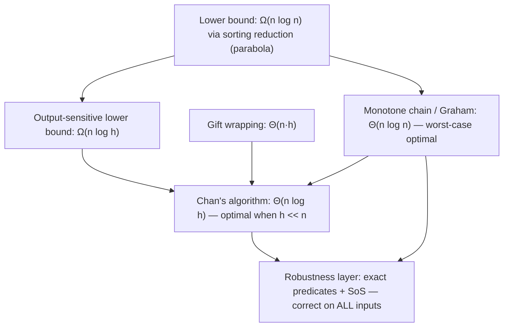

# Convex Hull (2D) — Mathematical Foundations and Complexity Theory

> **Focus:** The formal definition of the convex hull, a rigorous **correctness proof** of Andrew's monotone chain via a loop invariant, the **Ω(n log n) lower bound** (why you cannot beat sorting), the **output-sensitive O(n log h)** optimum (Chan's algorithm) with its analysis, and the **theory of degeneracy and robust geometric predicates**.

---

## Table of Contents

1. [Formal Definition](#formal-definition)
2. [The Orientation Predicate, Formally](#the-orientation-predicate-formally)
3. [Correctness Proof — Monotone Chain Loop Invariant](#correctness-proof--monotone-chain-loop-invariant)
4. [Amortized Linear Sweep Analysis](#amortized-linear-sweep-analysis)
5. [The Ω(n log n) Lower Bound](#the-omega-n-log-n-lower-bound)
6. [Output-Sensitive O(n log h): Chan's Algorithm](#output-sensitive-on-log-h-chans-algorithm)
7. [Graham Scan Correctness and QuickHull Analysis](#graham-scan-correctness-and-quickhull-analysis)
8. [Gift Wrapping Correctness and Antipodal Pairs](#gift-wrapping-correctness-and-antipodal-pairs)
9. [Randomized Incremental Construction](#randomized-incremental-construction)
10. [The Akl–Toussaint Heuristic and Expected Hull Size](#the-akltoussaint-heuristic-and-expected-hull-size)
11. [Point-Line Duality and Half-Plane Intersection](#point-line-duality-and-half-plane-intersection)
12. [Degeneracy and Robustness Theory](#degeneracy-and-robustness-theory)
13. [3D Hulls and the Upper Bound Theorem](#3d-hulls-and-the-upper-bound-theorem)
14. [Comparison with Alternatives](#comparison-with-alternatives)
15. [Summary](#summary)

---

## Formal Definition

```text
Definition (Convex set). A set S ⊆ R² is convex iff
    ∀ p, q ∈ S, ∀ λ ∈ [0,1]:  λp + (1-λ)q ∈ S.
(The segment between any two points of S lies entirely in S.)

Definition (Convex hull). For a finite point set P = {p_1, ..., p_n} ⊆ R²,
the convex hull CH(P) is the intersection of all convex sets containing P:
    CH(P) = ⋂ { S : S convex, P ⊆ S }.
Equivalently, CH(P) is the set of all convex combinations of points of P:
    CH(P) = { Σ λ_i p_i : λ_i ≥ 0, Σ λ_i = 1 }.

For finite P, CH(P) is a convex polygon whose vertices are a subset of P.
The OUTPUT of "the convex hull problem" is the ordered cyclic sequence of
vertices of that polygon (say, counter-clockwise).
```

**Extreme points.** A point `p ∈ P` is a *vertex* (extreme point) of `CH(P)` iff `p ∉ CH(P \ {p})` — removing it shrinks the hull. Equivalently, there exists a directed line through `p` with all other points strictly on one side (a *supporting line*). The hull problem is to report exactly these extreme points in boundary order.

**Carathéodory's theorem** (used implicitly): every point of `CH(P)` in `R²` is a convex combination of at most `3` points of `P` (in `R^d`, at most `d+1`). This is why the 2D hull is a polygon with triangulable interior.

---

### The landscape of bounds



---

## The Orientation Predicate, Formally

```text
Definition (signed area / orientation). For A, B, C ∈ R²:
    orient(A,B,C) = det | Bx - Ax   By - Ay |
                        | Cx - Ax   Cy - Ay |
                 = (Bx - Ax)(Cy - Ay) - (By - Ay)(Cx - Ax).

This equals 2 · (signed area of triangle ABC). Then:
    orient(A,B,C) > 0  ⇔  A,B,C in counter-clockwise order (C left of ray A→B)
    orient(A,B,C) < 0  ⇔  clockwise (C right of ray A→B)
    orient(A,B,C) = 0  ⇔  A,B,C collinear.
```

**Why it is a determinant.** The cross product `(B-A) × (C-A)` in 2D is the `z`-component of the 3D cross product of the lifted vectors `(B-A, 0)` and `(C-A, 0)`. Its magnitude is the parallelogram area; its sign is the right-hand-rule orientation.

**Exactness.** If `A, B, C` have integer coordinates bounded by `|·| ≤ U`, then `orient` is an integer with `|orient| ≤ 2·(2U)² = 8U²`. Representable exactly in `⌈log₂(8U²)⌉ + 1` bits. Hence the *sign* — all the algorithm ever needs — is computed with **zero error**, provided the arithmetic does not overflow. This is the formal basis for "use integers."

---

## Correctness Proof — Monotone Chain Loop Invariant

We prove the lower-hull construction correct; the upper hull is symmetric, and concatenation yields `CH(P)`.

```text
Setup. Let p_1, ..., p_n be P sorted by (x, then y), so px_1 ≤ px_2 ≤ ... ≤ px_n.
The LOWER HULL is the chain of CH(P) from the leftmost point p_1 to the
rightmost point p_n traversed so that all of P lies on or ABOVE it
(equivalently, the chain that turns LEFT — orient > 0 — at every interior vertex
when read left to right).

Algorithm (drop-collinear variant):
    H = []  (a stack, bottom..top)
    for k = 1 to n:
        while |H| ≥ 2 and orient(H[-2], H[-1], p_k) ≤ 0:
            pop H
        push p_k onto H
    return H  (this is the lower hull)
```

**Claim.** After processing all points, `H` is exactly the sequence of lower-hull vertices of `P`, in left-to-right order.

**Loop Invariant `I`.** *At the start of iteration `k`, `H` is the lower hull of the prefix `{p_1, ..., p_{k-1}}`; in particular every consecutive triple in `H` satisfies `orient > 0` (a strict left turn), and `H` is sorted by `x`.*

**Base case (`k = 1`).** `H` is empty; the lower hull of the empty prefix is empty. `I` holds vacuously. After pushing `p_1`, `H = [p_1]` — the lower hull of `{p_1}`.

**Inductive step.** Assume `I` holds at the start of iteration `k`, i.e. `H` is the lower hull `L` of `{p_1,...,p_{k-1}}`. We process `p_k`, the new rightmost point (since input is `x`-sorted). We must show `H` becomes the lower hull of `{p_1,...,p_k}`.

1. *Why pops are correct.* Suppose the top two vertices of `H` are `a = H[-2]`, `b = H[-1]`, and `orient(a, b, p_k) ≤ 0` (a right turn or collinear). Then `b` lies on or above segment `a→p_k`. Because `p_k` is to the right of all prior points and `a` is to the left of `b`, `b` is *not* an extreme point of the lower hull of `{p_1,...,p_k}` — there is now a supporting line below `b` (through `a` and `p_k`) leaving `b` non-extreme. So removing `b` is mandatory and loses no lower-hull vertex. We repeat until `orient(H[-2], H[-1], p_k) > 0`, restoring the strict-left-turn property.

2. *Why pushing `p_k` is correct.* `p_k` is the rightmost point, so it is an extreme point of the lower hull of the prefix including it (it is the right endpoint). After the pops, appending `p_k` keeps `H` sorted by `x` and every consecutive triple a strict left turn. Hence `H` is now the lower hull of `{p_1,...,p_k}`.

3. *No vertex wrongly discarded.* A point popped in iteration `k` is interior to (or on the boundary of, in drop-collinear mode) the convex hull of the points seen so far and `p_k`; by convexity it can never become extreme again when more points are added to the right. So a single pass suffices.

Thus `I` is preserved.

**Termination.** The outer loop runs exactly `n` times. The inner `while` performs pops; over the entire run, each point is pushed once and popped at most once, so the total number of inner iterations is `≤ n`. The algorithm terminates in `O(n)` stack operations.

**Postcondition.** After iteration `n`, `I` says `H` is the lower hull of `{p_1,...,p_n} = P`. The symmetric right-to-left pass yields the upper hull; concatenating (and removing the two shared endpoints) gives the full boundary cycle of `CH(P)` in counter-clockwise order. **QED.**

> The proof's load-bearing fact is step 1's *convexity monotonicity*: a point that becomes non-extreme stays non-extreme as you extend rightward. That is what licenses the single linear sweep.

---

## Amortized Linear Sweep Analysis

```text
Aggregate method. Across the entire lower-hull sweep:
    #pushes  = n            (each point pushed exactly once)
    #pops    ≤ n            (a point can be popped at most once after its push)
Total stack work = #pushes + #pops ≤ 2n = O(n).

Each orient() call is O(1). The inner while-loop's total iteration count over
all k is bounded by #pops ≤ n. Therefore the two sweeps cost O(n) total,
NOT O(n²), despite the nested while inside the for.

Amortized cost per point = O(2n)/n = O(1).
```

**Potential-method view.** Define `Φ(H) = |H|` (stack size, `≥ 0`). A push has actual cost `1` and `ΔΦ = +1`, amortized `2`. A pop has actual cost `1` and `ΔΦ = -1`, amortized `0`. Each iteration does one push plus some pops; amortized cost is `2` per point. Total `≤ 2n`, with `Φ(D_0) = 0`. Hence `Σ actual ≤ Σ amortized + Φ(D_0) = O(n)`.

**Overall.** Sort = `Θ(n log n)`; sweeps = `Θ(n)`. Total **`Θ(n log n)`**, dominated by the sort.

---

## The Ω(n log n) Lower Bound

The convex hull problem cannot be solved faster than `Θ(n log n)` in the comparison/algebraic-decision-tree model. There are two standard proofs.

### Proof 1 — Reduction from sorting

```text
Theorem. Computing the convex hull (reporting vertices in boundary order)
requires Ω(n log n) comparisons in the algebraic decision tree model.

Reduction. Given n real numbers x_1, ..., x_n to SORT:
  1. Map each x_i to the point P_i = (x_i, x_i²)  — points on the parabola y = x².
  2. Every P_i is a VERTEX of the convex hull (the parabola is strictly convex,
     so no point is a convex combination of others).
  3. The lower hull lists these points in order of increasing x.
  4. Reading the hull's lower chain left to right yields x_1,...,x_n SORTED.

The map (3 arithmetic ops per point) is O(n). If convex hull ran in o(n log n),
sorting would too — contradicting the Ω(n log n) sorting lower bound. ∎
```

The choice `y = x²` is deliberate: a strictly convex curve forces *all* `n` points onto the hull and forces their hull order to equal their sorted order. The reduction is the cleanest argument and is the one to give in an interview.

### Proof 2 — Lower bound even for the *unordered* set of vertices

The reduction above produces hull vertices *in order*. A subtler question: is `Ω(n log n)` still required if we only need the *set* of extreme points, unordered? Yes. Via reduction from **set disjointness / element uniqueness**: deciding whether `n` numbers are all distinct (which needs `Ω(n log n)` in the algebraic decision tree by Ben-Or's theorem) reduces to a hull-related membership problem. So even identifying which points are extreme — not ordering them — is `Ω(n log n)` in the worst case.

> **Consequence.** Monotone chain, Graham scan, and QuickHull-average are all *worst-case optimal* up to the sort: you cannot do better than `Θ(n log n)` when `h` may be as large as `n`. This is exactly what motivates *output-sensitive* algorithms when `h ≪ n`.

---

## Output-Sensitive O(n log h): Chan's Algorithm

The lower bound says `Ω(n log n)` *when `h` can be `Θ(n)`*. But if the hull is small, can we do better? **Chan (1996)** achieves **`O(n log h)`** — optimal in the output-sensitive sense, since `Ω(n log h)` is also a lower bound. It brilliantly combines **Graham/monotone chain** with **gift wrapping**.

### The construction

```text
Chan's algorithm (with a guessed h):
  1. Partition the n points arbitrarily into ⌈n/m⌉ groups of size ≤ m.
  2. Compute each group's convex hull by Graham/monotone chain:
        cost = O((n/m) · m log m) = O(n log m).
  3. Run GIFT WRAPPING on the WHOLE point set, but find the next hull vertex
     from each mini-hull in O(log m) via binary-search tangent finding
     (a point's supporting tangent to a convex polygon is found by binary search).
     One wrapping step costs O((n/m) · log m); we do at most h steps.
        wrapping cost = O(h · (n/m) · log m).
  4. If we complete the wrap within m steps, we are done; otherwise FAIL.
```

With `m` chosen as a guess for `h`, one round costs:

```text
T(m) = O(n log m)                 (build mini-hulls)
     + O(m · (n/m) · log m)       (≤ m wrapping steps, each O((n/m) log m))
     = O(n log m).
```

### The doubling trick (removing the need to know `h`)

We do not know `h` in advance. **Guess `m`, and if the wrap does not finish in `m` steps, double the guess and restart**:

```text
for t = 1, 2, 3, ...:
    m = min(n, 2^(2^t))           # m = 2, 4, 16, 256, ... (square each time)
    run one round with group size m, allowing at most m wrapping steps
    if it succeeds (wrap closed in ≤ m steps): return the hull
```

We succeed at the first `t` with `m ≥ h`, i.e. `2^(2^t) ≥ h`, i.e. `2^t ≥ log h`, i.e. `t ≈ log log h` rounds. The cost of round `t` is `O(n log m) = O(n · 2^t)`. The total is a geometric series dominated by its last term:

```text
Σ_{t=1}^{⌈log log h⌉} O(n · 2^t) = O(n · 2^(log log h)) = O(n log h).   ∎
```

| Algorithm | Time | Output-sensitive? | Optimal? |
|-----------|------|-------------------|----------|
| Monotone chain / Graham | `Θ(n log n)` | No | Worst-case optimal (`h = Θ(n)`). |
| Gift wrapping | `Θ(nh)` | Yes (but `O(n²)` worst) | No. |
| **Chan's** | **`Θ(n log h)`** | **Yes** | **Optimal** (matches `Ω(n log h)`). |

> Chan's algorithm is the textbook example of *output-sensitive optimality*: it is never worse than `Θ(n log n)` (since `h ≤ n`) and is strictly better when `h ≪ n`. The doubling-and-restart paradigm reappears across geometry (e.g., Chan also used it for 3D hulls and LP-type problems).

---

## Graham Scan Correctness and QuickHull Analysis

### Graham scan — correctness

```text
Setup. Let P0 be the bottom-most (then left-most) point — provably on the hull.
Sort the remaining points by POLAR ANGLE about P0 (ties broken by distance, the
nearer point first, except the FARTHEST collinear point is kept last on each ray).
Let the sorted order be p_1, ..., p_{n-1}.

Algorithm:
    H = [P0, p_1]
    for k = 2 .. n-1:
        while |H| ≥ 2 and orient(H[-2], H[-1], p_k) ≤ 0: pop H
        push p_k
    return H
```

**Invariant.** After processing `p_1,...,p_k`, `H` is the convex hull of `{P0, p_1,...,p_k}` and is a sequence of strict left turns.

**Why angular order works.** Because the points are sorted CCW about `P0`, the hull boundary is traced by *monotonically increasing angle*; a right turn (`orient ≤ 0`) at the top of the stack means the previous vertex is "swallowed" by the new wider angle, so it is interior. The argument mirrors monotone chain but in *angular* rather than *coordinate* order. The proof of termination and the `O(n)` sweep are identical (each point pushed once, popped at most once); the sort is `O(n log n)`. The subtlety Graham scan must handle and monotone chain avoids is the **collinear tie on a ray from `P0`**: among points at the same angle, only the farthest can be a hull vertex (drop mode), so the polar sort's tie-break must be chosen carefully or the hull is wrong.

### QuickHull — expected and worst-case analysis

```text
QuickHull(S, A, B):   # A,B are extreme points; S = points left of line A→B
    if S empty: return [A]
    C = point in S maximizing distance to line A→B   (farthest = a hull vertex)
    S1 = points left of A→C ;  S2 = points left of C→B
    return QuickHull(S1, A, C) ++ QuickHull(S2, C, B)
```

**Correctness.** The farthest point `C` from the chord `A→B` is necessarily a hull vertex (a supporting line parallel to `A→B` touches it). Points inside triangle `A,B,C` are interior to the hull and discarded. Recursing on the two outer regions builds the boundary between `A` and `B`. Termination: each recursion strictly shrinks the active set (at least `C` is removed and the inside-triangle points are dropped).

**Recurrence.** Let `T(n)` be the work to hull `n` points. The partition costs `O(n)`. If the farthest point splits the set evenly, `T(n) = 2T(n/2) + O(n) = O(n log n)` (Master Theorem, case 2). But an adversary can force `C` to peel off **one point at a time** (points along a slowly curving arc), giving `T(n) = T(n-1) + O(n) = O(n²)` — the quicksort-pivot pathology, hence the name.

```text
Best/expected : T(n) = 2T(n/2) + O(n) = O(n log n)
Worst         : T(n) = T(n-1)  + O(n) = O(n²)
```

For random or roughly uniform inputs the split is balanced with high probability, so QuickHull's *expected* time is `O(n log n)` with excellent cache locality (contiguous partitioning, like quicksort).

---

## Gift Wrapping Correctness and Antipodal Pairs

### Gift wrapping — correctness and cost

```text
Algorithm:
    start = leftmost point (a hull vertex)
    cur = start
    repeat:
        next = any point ≠ cur
        for each point p ≠ cur:
            if next == cur or orient(cur, next, p) < 0  (p is more clockwise)
               or (orient(cur, next, p) == 0 and |cur p| > |cur next|):
                next = p
        emit cur; cur = next
    until cur == start
```

**Correctness.** At each step, `next` is the point such that *all* other points lie to the left of (or on) the directed line `cur → next`. By definition that directed line is a **supporting line** of the point set, so the segment `cur → next` is a hull edge. Starting at a known hull vertex and always taking the supporting edge, the walk traces the boundary exactly once and returns to `start`.

**Cost.** Each `repeat` iteration scans all `n` points (`O(n)`); the loop runs once per hull vertex (`h` iterations). Total `O(nh)`. The collinear tie-break (`> distance`) ensures we take the *farthest* collinear point, avoiding an infinite loop on collinear runs — a degeneracy gift wrapping must handle explicitly.

### Antipodal pairs and rotating calipers

```text
Definition. A pair of hull vertices (p, q) is ANTIPODAL if there exist two
PARALLEL supporting lines of the hull, one through p and one through q.
Theorem (Shamos). A convex polygon with h vertices has O(h) antipodal pairs,
and they can be enumerated in O(h) by rotating calipers.
Theorem. The DIAMETER (farthest pair) of a point set is realized by an
antipodal pair of its hull. Hence diameter = O(n log n): hull + O(h) caliper walk.
```

The rotating-calipers walk maintains two parallel supporting lines and rotates them around the hull; each vertex is "opposite" a bounded number of others, giving the `O(h)` antipodal enumeration. This is the formal justification for the `O(n log n)` diameter algorithm in `middle.md` and `interview.md`, and it generalizes to width, minimum-area enclosing rectangle, and maximum-distance problems — all `O(h)` once the hull exists.

---

## Randomized Incremental Construction

A different `O(n log n)` route — important because it generalizes to higher dimensions and underlies `qhull`.

```text
Randomized incremental hull:
    permute points uniformly at random: p_1, ..., p_n
    H = triangle(p_1, p_2, p_3)
    for k = 4 .. n:
        if p_k inside H: discard
        else: find the "visible" boundary edges from p_k, replace them
              with two new edges to p_k  (a local re-tubing of the hull)
```

**Expected-time analysis (backward analysis).** Consider inserting points in random order. The cost of inserting `p_k` is proportional to the number of hull edges it destroys. By **backward analysis**: fix the set `{p_1,...,p_k}` and ask, "if the *last* inserted point were chosen uniformly at random among these `k`, how many edges would it have touched?" Each point of the current hull touches `O(1)` edges on expectation (the hull has `≤ k` edges total, shared among `k` points), so the expected insertion cost is `O(1)` amortized for the structural change, plus the cost of locating the point.

```text
E[total structural changes] = Σ_{k=4}^{n} E[edges destroyed at step k]
                            = Σ_{k} O(1) = O(n).
```

Point location (deciding inside/outside and finding visible edges) dominates: with a **conflict graph / history DAG** that tracks which not-yet-inserted points "conflict" with each current edge, the expected total is `O(n log n)`. The `log n` arises from the harmonic sum `Σ 1/k` over insertion steps — the same expectation that gives randomized quicksort its `O(n log n)`. This randomized-incremental + conflict-graph paradigm is the workhorse for 3D hulls, Delaunay triangulations, and linear programming in fixed dimension.

> **Why randomization helps.** It defeats the adversary that makes QuickHull `O(n²)`: with a random insertion order, *no* fixed input can force the bad case, so the `O(n log n)` expectation holds for **every** input (the randomness is in the algorithm, not the data).

---

## Degeneracy and Robustness Theory

### Degeneracies are the rule, not the exception

The clean proofs above assume points in "general position": no two coincide, no three are collinear. Real inputs violate this constantly. A *robust* implementation must give a well-defined, correct answer for **all** inputs.

```text
General-position assumptions (often FALSE in practice):
  (G1) no two points coincide
  (G2) no three points collinear
Degeneracies break the "strict left turn" reasoning (orient = 0 cases) and
the uniqueness of the boundary order.
```

### The exact-computation paradigm

```text
Principle (Exact Geometric Computation, EGC). The control flow of a geometric
algorithm is decided by the SIGNS of a small set of PREDICATES (here: orient).
If every predicate sign is evaluated EXACTLY, the algorithm follows the same
branch path as if computed over the reals — so it is provably correct and never
inconsistent — even if numeric COORDINATES are only approximate.
```

This separates two concerns: *constructions* (computing new coordinates, where approximation is tolerable) and *predicates* (sign decisions, which must be exact). Robustness bugs come almost entirely from inexact predicates.

### Shewchuk's adaptive-precision `orient2d`

For floating-point inputs, **Shewchuk's adaptive predicates** compute `sign(orient(A,B,C))` exactly:

```text
- First compute orient with a fast floating-point evaluation and an a-priori
  error bound. If |result| > error bound, the sign is certified — return it.
- Otherwise, recompute with progressively more precision (exact expansion
  arithmetic) until the sign is determined.
The expected cost is near that of the naive float version (the cheap path
almost always certifies), with worst-case exact fallback. Always correct sign.
```

### Symbolic perturbation (Simulation of Simplicity)

To handle `orient = 0` (collinear / coincident) *consistently*, **Simulation of Simplicity (Edelsbrunner–Mücke)** conceptually perturbs each point `p_i` by an infinitesimal `(ε^{2^i}, ε^{2^{2^i}})`. Then no three perturbed points are ever exactly collinear and no two coincide — every predicate is decided by the *first non-zero term* of a polynomial in `ε`. This gives a **consistent, deterministic** tie-breaking rule for all degeneracies without special-casing, and the perturbation is never actually computed — only its sign logic.

```text
Robustness guarantees, layered:
  exact predicate sign  ⇒  no inconsistent branches (no self-intersecting hull)
  + SoS tie-breaking    ⇒  every degeneracy resolved consistently
  ⇒ the algorithm is provably correct on ALL inputs, degenerate or not.
```

### Why naive floating point fails — formally

`orient = (Bx-Ax)(Cy-Ay) - (By-Ay)(Cx-Ax)` subtracts two products of similar magnitude near collinearity. By the standard floating-point error model, the relative error of each product is `≤ ε_mach`, but the subtraction of nearly equal quantities causes **catastrophic cancellation**: the absolute error can exceed the true (tiny) result, so `sign` is unreliable exactly when it matters most. Hence the EGC paradigm: never trust a near-zero floating-point predicate.

---

## The Akl–Toussaint Heuristic and Expected Hull Size

A theoretically and practically important preprocessing result.

```text
Akl–Toussaint discard. Find 4 extreme points: min-x, max-x, min-y, max-y
(or 8: also the 4 corner-extreme points minimizing/maximizing x±y). They form a
convex quadrilateral (octagon). ANY input point strictly inside this polygon
cannot be on the hull and is discarded in a single O(n) pass.
```

For many distributions this removes a `1 − o(1)` fraction of points before the real hull algorithm runs, so the expensive `O(n log n)` sort operates on a tiny residual. It does not change the worst-case bound but slashes the constant for typical data.

### Expected hull size for random inputs

The choice of distribution dramatically changes `h`, and hence which algorithm is optimal:

```text
n points drawn uniformly at random from:
  a CONVEX POLYGON with k sides   ⇒  E[h] = Θ(k log n)
  a DISK (circle)                 ⇒  E[h] = Θ(n^{1/3})
  a SQUARE                        ⇒  E[h] = Θ(log n)
  a GAUSSIAN cloud                ⇒  E[h] = Θ(√(log n))
```

These are classical results (Rényi–Sulanke, and Raynaud). The takeaway for an algorithm designer: for *almost all* natural random models, `h = o(n)` — often poly-logarithmic — which is exactly the regime where Chan's `O(n log h)` and even gift wrapping's `O(nh)` become attractive. The `h = Θ(n)` worst case (points exactly on a circle) is measure-zero under continuous distributions; it arises only from structured/adversarial inputs.

---

## Point-Line Duality and Half-Plane Intersection

The convex hull has a precise *dual* that explains why the same monotone-chain machinery solves several seemingly different problems.

```text
Standard duality. Map a point p = (a, b) to the line p* : y = a·x − b,
and a line ℓ : y = m·x − c to the point ℓ* = (m, c). This map:
  - preserves incidence (p on ℓ  ⇔  ℓ* on p*),
  - reverses above/below (p above ℓ  ⇔  ℓ* above p*).
```

**Consequence.** The **upper hull** of a set of points is dual to the **lower envelope** of the dual lines, and the **lower hull** is dual to the **upper envelope**. So:

```text
convex hull of n points  ≡  envelope of n lines  ≡  intersection of n half-planes
```

This is exactly why the *convex hull trick* (maintaining the lower envelope of lines for DP optimization) is "the same algorithm" as building a hull — it literally is, viewed through duality. The pop-non-left-turn step on points becomes pop-a-redundant-line on the envelope.

```text
Half-plane intersection. The intersection of n half-planes (if bounded) is a
convex polygon, computable in O(n log n): sort half-planes by angle, then run a
monotone-deque sweep that pops a half-plane once it becomes redundant — the
deque analogue of the hull's stack. Lower bound: Ω(n log n) (same sorting
reduction). This is the LP-feasibility region in 2D.
```

> **Why this matters at the professional level.** Recognizing that hull, envelope, and half-plane intersection are one problem under duality lets you transport algorithms, lower bounds, and robustness techniques between them. The `Ω(n log n)` bound, the exact-predicate requirement, and the output-sensitive ideas all carry across the duality unchanged.

---

## 3D Hulls and the Upper Bound Theorem

The 2D analysis generalizes, but the *output size* itself becomes a complexity question in higher dimensions.

### Euler's formula bounds the 3D hull

```text
For a convex polytope in R³ with V vertices, E edges, F faces:
    V - E + F = 2          (Euler's formula)
Each face is bounded by ≥ 3 edges, each edge shared by exactly 2 faces:
    2E ≥ 3F   ⇒   F ≤ 2V - 4   and   E ≤ 3V - 6.
```

So a 3D convex hull of `n` points has `O(n)` faces and edges — **linear output**, like 2D. This is why 3D hulls are still computable in `O(n log n)` (incremental or divide-and-conquer). The orientation predicate becomes the sign of a `4×4` determinant testing which side of a plane (through three points) a fourth point lies on:

```text
orient3d(A,B,C,D) = sign det | Bx-Ax  By-Ay  Bz-Az |
                             | Cx-Ax  Cy-Ay  Cz-Az |
                             | Dx-Ax  Dy-Ay  Dz-Az |
```

### The Upper Bound Theorem (general dimension)

```text
Upper Bound Theorem (McMullen). The convex hull of n points in R^d can have
    Θ(n^{⌊d/2⌋})  faces in the worst case.
    d=2: Θ(n)        (a polygon, h ≤ n edges)
    d=3: Θ(n)        (linear, by Euler)
    d=4: Θ(n²)
    d=5: Θ(n²)  ...   blows up super-linearly.
```

In high dimensions the hull's *output* alone can be super-polynomial in `d`, so no hull algorithm can be fast across all dimensions — the cost is fundamentally tied to the combinatorial explosion of the boundary. This is why hull computation in dimensions beyond `3–4` uses specialized, dimension-aware libraries and why many high-dimensional applications avoid the full hull entirely (using LP-type or sampling methods instead).

---

## Comparison with Alternatives

| Attribute | Monotone chain | Graham scan | Gift wrapping | QuickHull | Chan's |
|-----------|----------------|-------------|---------------|-----------|--------|
| Worst-case time | `Θ(n log n)` | `Θ(n log n)` | `Θ(nh) = O(n²)` | `O(n²)` | **`Θ(n log h)`** |
| Average time | `Θ(n log n)` | `Θ(n log n)` | `Θ(nh)` | `Θ(n log n)` | `Θ(n log h)` |
| Output-sensitive | No | No | Yes | No | **Yes** |
| Space | `O(n)` | `O(n)` | `O(n)` | `O(n)` | `O(n)` |
| Needs sort | Yes (coord) | Yes (angle) | No | Partial | Yes (per group) |
| Integer-exact friendly | **Excellent** | Good | Good | Good | Good |
| Worst-case optimal (`h=Θ(n)`) | Yes | Yes | No | No | Yes |
| Output-sensitive optimal | No | No | No | No | **Yes** |

---

## A Note on Models of Computation

The bounds above are stated in two standard models; mixing them up is a common error in a theory interview.

```text
Algebraic Decision Tree (ADT) model:
  - Each internal node tests the SIGN of a bounded-degree polynomial in the inputs.
  - The orientation predicate is degree 2 — it fits exactly.
  - The Ω(n log n) lower bound (Ben-Or) lives here. This is the right model for
    comparison/geometry lower bounds.

Real-RAM model:
  - Arithmetic on real numbers in O(1) per operation; the standard model for
    STATING geometric algorithm UPPER bounds (e.g., "monotone chain is O(n log n)").
  - It ASSUMES exact real arithmetic — which is precisely the assumption that
    breaks on real hardware (floating point), motivating the EGC paradigm above.

Word-RAM / integer model:
  - Integers in w-bit words, O(1) arithmetic. With bounded-coordinate integers,
    the orientation predicate is EXACT here — bridging the theory (real-RAM bounds)
    and practice (robust implementations).
```

The intellectual arc of the topic: **prove bounds in the ADT/real-RAM model, then implement in the word-RAM/integer model to recover the exactness the real-RAM model only pretended to have.** Robust geometry is the engineering of closing that gap.

---

## Summary

The convex hull is formally the intersection of all convex sets containing `P`, a polygon whose vertices are the *extreme points* of `P`, reported in boundary order. **Monotone chain is provably correct** via a loop invariant ("`H` is the lower hull of the processed prefix"), with the load-bearing fact that a point made non-extreme stays non-extreme; an amortized argument (each point pushed and popped at most once) gives `Θ(n)` sweeps and `Θ(n log n)` total. The **`Ω(n log n)` lower bound** follows by mapping numbers to a parabola so that hull order = sorted order — you cannot beat sorting when `h = Θ(n)`. When `h ≪ n`, **Chan's algorithm** attains the output-sensitive optimum **`O(n log h)`** by wrapping over precomputed mini-hulls and a doubling-and-restart guess for `h`. Finally, real correctness lives or dies on **robust predicates**: the *Exact Geometric Computation* paradigm computes every `orient` sign exactly (integer arithmetic, or Shewchuk's adaptive predicates), and *Simulation of Simplicity* resolves every degeneracy consistently — together guaranteeing a valid, simple hull on all inputs, not just those in general position.

---

**Next step:** [interview.md](./interview.md) — tiered question bank (junior → professional), system-design prompts, and end-to-end coding challenges in Go, Java, and Python.
