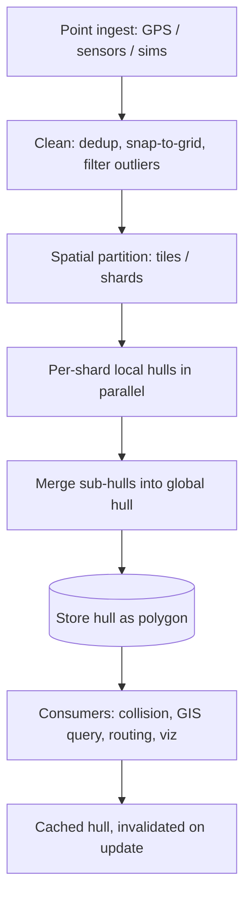
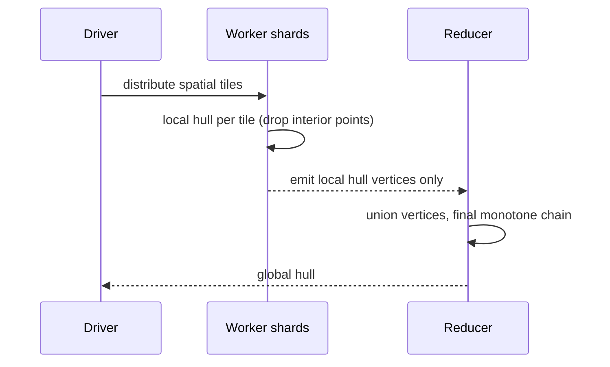

# Convex Hull (2D) — Senior Level

> **Focus:** Architecting hull computation at scale — GIS pipelines on billions of points, **robustness** as a first-class production concern, **online / dynamic** hulls that update as points stream in, and **parallel / distributed** hull construction. The question shifts from "which algorithm?" to "how do I run this reliably under real constraints?"

---

## Table of Contents

1. [Introduction](#introduction)
2. [System Design with Convex Hulls](#system-design-with-convex-hulls)
3. [Large-Scale and GIS Pipelines](#large-scale-and-gis-pipelines)
4. [Robustness in Production](#robustness-in-production)
5. [Online and Dynamic Convex Hulls](#online-and-dynamic-convex-hulls)
6. [Parallel and Distributed Construction](#parallel-and-distributed-construction)
7. [3D Hull Overview](#3d-hull-overview)
8. [Comparison with Alternatives](#comparison-with-alternatives)
9. [Code Examples](#code-examples)
10. [Observability](#observability)
11. [Failure Modes](#failure-modes)
12. [Summary](#summary)

---

## Introduction

A senior engineer rarely writes `convex_hull()` from scratch in production — that part is solved. The senior questions are about everything *around* the algorithm:

- The dataset is **100 million GPS points** that do not fit in memory. How do you compute the hull?
- The input is **noisy floating-point sensor data**. How do you guarantee the output is a valid simple polygon, every time, with no crashes?
- Points **stream in continuously** (live vehicle positions). Do you recompute `O(n log n)` on every update, or maintain a **dynamic hull**?
- You have a **64-core machine** or a **Spark cluster**. Can hull construction be parallelized, and is it worth it?
- The hull feeds a **collision** or **routing** system with a **latency SLA**. Where is the time actually spent?

At this level, "correct" expands to "correct *and* robust *and* fast enough *and* observable."

---

## System Design with Convex Hulls



The architecture mirrors any large geometric computation: **clean → partition → solve locally → merge → serve**. The hull's special property that makes this work is that **the hull of a union equals the hull of the union of sub-hulls** — you can throw away every interior point of each shard before merging, which is a massive data reduction.

---

## Large-Scale and GIS Pipelines

### The out-of-core / sharded strategy

When `n` does not fit in RAM:

1. **Partition** the plane into spatial tiles (a grid, quadtree, or geohash buckets).
2. Compute the **local hull** of each tile independently. Only the local hull vertices survive — interior points are discarded. For a tile with `k` points and hull size `h_tile`, you reduce `k` points to `h_tile`.
3. **Merge** the local hulls. Since the union of all local hull vertices is a far smaller set, you can often fit it in memory and run a single final monotone chain, or merge hulls pairwise.

This is the classic **filter-and-refine** pattern. The key insight again: a point interior to a tile's hull can never be on the global hull, so it is safe to drop early.

### GIS-specific concerns

- **Coordinate systems:** lat/lon is on a sphere. For local/regional hulls, project to a planar CRS (UTM) first; the cross-product orientation test assumes a flat plane. A "convex hull" on lat/lon near the poles or the antimeridian needs spherical geometry, not the 2D algorithm.
- **The convex hull is often *too* convex.** For a coastline or a route, the convex hull over-includes huge empty areas. GIS frequently wants the **concave hull** (alpha shape) instead — a generalization that lets the boundary bend inward. Know when the convex hull is the wrong answer.
- **Scale of `h`:** for real geographic point clouds, `h` is usually tiny relative to `n` (a few dozen hull vertices for millions of points), which makes the filter-and-refine reduction enormous and even makes gift wrapping or Chan's algorithm attractive.

| Dataset | Typical `n` | Typical `h` | Strategy |
|---------|-------------|-------------|----------|
| City delivery points | `10^5–10^6` | tens | In-memory monotone chain. |
| National GPS traces | `10^8–10^9` | hundreds | Sharded local hulls + merge. |
| Continuous sensor stream | unbounded | tens | Dynamic / online hull. |
| Point cloud (LiDAR) | `10^9+` | thousands | Distributed (Spark) + 3D variant. |

### Concave hulls / alpha shapes — when convex is too loose

For a coastline, a road-bounded delivery zone, or any non-convex cluster, the convex hull encloses huge empty regions. GIS practitioners reach for a **concave hull** (alpha shape):

- An **alpha shape** is parameterized by a radius `α`. Conceptually, roll a disk of radius `1/α` around the point set; the boundary it carves out is the alpha shape. `α → 0` gives the convex hull; large `α` gives a tight, possibly disconnected boundary.
- It is built from the **Delaunay triangulation**: keep triangles/edges whose circumradius is below the threshold, discard the rest.
- Trade-off: more faithful outline, but `α` is a tuning knob, the result may be non-simple or multi-component, and it costs a full triangulation (`O(n log n)`).

> Senior judgment: reach for the convex hull when you want a *guaranteed-convex, parameter-free* enclosure (bounding, collision proxy, diameter). Reach for a concave hull when *shape fidelity* matters more than convexity (mapping a region's true extent).

---

## Robustness in Production

Robustness is *the* senior topic for computational geometry. A non-robust hull does not just return a slightly-off answer — it can produce a **self-intersecting polygon**, **loop forever**, or **crash**, and these bugs surface only on rare adversarial inputs.

### The three failure sources

1. **Rounding** — a `double` cross product near zero flips sign → wrong pop decision → invalid hull.
2. **Degeneracy** — collinear runs, duplicate points, all-collinear input → undefined behavior if unhandled.
3. **Overflow** — large integer coordinates overflow the cross product → wrong sign.

### The robustness toolkit

| Technique | What it buys | Cost |
|-----------|--------------|------|
| **Snap to integer grid** | Exact orientation if it fits the grid. | Slight loss of input precision. |
| **Exact predicates** (Shewchuk `orient2d`) | Correct *sign* always, even for floats. | More code; adaptive, usually fast. |
| **64/128-bit cross product** | No overflow up to the chosen range. | Bigger arithmetic. |
| **Symbolic perturbation (SoS)** | Consistent tie-breaking for all degeneracies. | Conceptual complexity. |
| **Validation pass** | Catch a bad hull before it reaches consumers. | One `O(h)` check. |

### Always validate the output

Even with exact predicates, add a cheap `O(h)` post-check that the result is a valid convex polygon (every turn is consistent, area `> 0`, no repeated vertices). Fail loud in a test pipeline; degrade gracefully (e.g., fall back to the bounding box) in production.

```text
validate_hull(poly):
    if len(poly) < 3: handle degenerate (segment/point)
    assert signed_area(poly) > 0               # CCW, non-zero area
    for each consecutive triple A,B,C:
        assert orient(A,B,C) >= 0               # never a right turn
    assert no duplicate vertices
```

---

## Online and Dynamic Convex Hulls

When points arrive over time, recomputing `O(n log n)` per update is wasteful. Use a structure that supports updates.

### Insertion-only (semi-dynamic)

If points are only **added**, an **incremental** hull works: keep the current hull; for each new point, test if it is inside (do nothing) or outside (it becomes a vertex; remove the now-interior vertices it "shadows"). Amortized `O(log n)` per insertion if you keep the hull in a balanced structure ordered by angle, `O(n)` total over `n` insertions in the simplest array form.

### Fully dynamic (insert and delete)

Supporting **deletion** is genuinely hard — removing a hull vertex can re-expose previously interior points. The classic results:

- **Overmars–van Leeuwen** structure: `O(log² n)` per update, maintaining the hull in a balanced tree of upper/lower chains.
- **Chan's dynamic hull**: `O(log^{1+ε} n)` amortized per update — the modern reference.

These are heavyweight; reach for them only when updates truly dominate and recomputation is too slow.

### The pragmatic middle ground

In many real systems the best answer is **batch + rebuild**: buffer updates, and rebuild the hull every `k` updates or every `t` milliseconds. Simpler, cache-friendly, and easy to reason about. Use a true dynamic structure only when the SLA forbids periodic `O(n log n)` rebuilds.

```text
Decision guide:
  insert-only, occasional reads   -> incremental hull
  read after every update         -> dynamic structure (Overmars-vL / Chan)
  high churn, relaxed freshness    -> batch + periodic rebuild  (usually best)
```

---

## Parallel and Distributed Construction

### Shared-memory parallelism

The hull parallelizes along the **divide-and-conquer** seam:

1. **Sort** the points in parallel (`O(n log n / p)` with a parallel sort).
2. **Split** into `p` vertical strips; compute each strip's hull on a separate core.
3. **Merge** adjacent hulls pairwise. Merging two hulls separated by a vertical line is an `O(h1 + h2)` operation that finds the **upper and lower tangent lines** between them.

The merge step is the subtle part: finding the two bridges (tangents) between left and right sub-hulls. It is `O(log h)` per bridge with a walking procedure, `O(h)` total.

### Distributed (MapReduce / Spark)



The distributed pattern exploits the union property: **map** each tile to its local hull (huge data reduction), **reduce** by taking the hull of all local hull vertices. Network traffic is proportional to `Σ h_tile`, not `n`.

### The two-hull merge in detail

The heart of any divide-and-conquer or sharded hull is **merging two hulls that are separated by a vertical line**. You must find the **upper bridge** and **lower bridge** (the two tangent segments connecting them):

```text
merge(leftHull, rightHull):
    # find the upper tangent
    i = index of rightmost point of leftHull
    j = index of leftmost point of rightHull
    repeat:
        while orient(R[j], L[i], L[i-1]) turns the right way: i = i-1   # walk left hull up
        while orient(L[i], R[j], R[j+1]) turns the right way: j = j+1   # walk right hull up
    until neither moves            # (i, j) is the upper tangent
    # symmetric walk downward gives the lower tangent
    # stitch: left hull from upper-i down to lower-i, then right hull from lower-j up to upper-j
```

Each bridge is found by a *gift-wrapping-like* walk that is `O(h_left + h_right)` total. Getting the tangent-walk orientation conditions exactly right is the single trickiest piece of a parallel hull — it is where most bugs live, and where exact predicates matter most.

### Is parallelism worth it?

For most workloads, **no** — monotone chain on a single core handles tens of millions of points in well under a second, and the bottleneck is usually I/O, not the hull. Parallelize only when (a) `n` is genuinely huge, (b) the data is already sharded for other reasons, or (c) you are computing many hulls and can parallelize *across* tasks instead of within one.

### Caching and serving the hull

Once computed, a hull is small (`O(h)`) and cheap to serve. Treat it like any derived artifact:

| Concern | Approach |
|---------|----------|
| **Invalidation** | Mark the cached hull dirty on any insert/delete; rebuild lazily on the next read. |
| **Freshness SLA** | If reads must be fresh, use a dynamic structure; otherwise batch + periodic rebuild. |
| **Serialization** | Store as an ordered vertex list (CCW); `O(h)` bytes, trivial to transmit. |
| **Containment queries** | Precompute the CCW order so point-in-polygon is `O(log h)` per query. |
| **Versioning** | Stamp each hull with the input version so consumers can detect staleness. |

The asymmetry is the whole point: building is `O(n log n)` and occasional; serving the cached hull is `O(h)` or `O(log h)` and constant. Most production systems read the hull far more often than the points change, so caching with lazy invalidation is the dominant pattern.

---

## 3D Hull Overview

The 2D hull generalizes to 3D, but the jump in difficulty is large — a senior should know the landscape:

- **Output:** a 3D convex hull is a *polyhedron* — a set of triangular faces, not an ordered vertex cycle. Output size can be `O(n)` faces (Euler's formula: `V - E + F = 2`).
- **Algorithms:** **incremental** (add points, update visible faces) and **divide-and-conquer** both run in `O(n log n)` expected. **QuickHull 3D** is the most-used in practice (the `qhull` library).
- **The primitive generalizes:** the 2D cross-product orientation becomes a **3×3 (or 4×4) determinant** testing which side of a plane a point lies on — same idea, one dimension up. Robustness gets *harder* (more degeneracies).
- **Beyond 3D:** in dimension `d`, hull complexity can be `O(n^{⌊d/2⌋})` (the *upper bound theorem*) — it blows up. Specialized methods (e.g., `qhull`) handle moderate dimensions.

> Practical rule: for 3D, use a vetted library (`qhull`, CGAL). Do not hand-roll a 3D hull in production — robustness alone will defeat you.

---

## Comparison with Alternatives

| Need | Convex hull | Better alternative |
|------|-------------|--------------------|
| Tight outline that may bend inward | Over-includes empty space | **Concave hull / alpha shape** |
| Just a quick bounding box | Overkill | **Axis-aligned bounding box (AABB)** |
| Smallest enclosing circle | Not the hull directly | **Welzl's algorithm** (uses hull idea) |
| Interior structure / mesh | Loses interior | **Delaunay triangulation** |
| Streaming with deletes | Recompute is costly | **Dynamic hull (Overmars-vL / Chan)** |
| 3D shell | 2D algorithm fails | **QuickHull 3D / qhull** |

| Attribute | Monotone chain | Sharded + merge | Dynamic hull |
|-----------|----------------|------------------|--------------|
| Best `n` range | up to `~10^7` in RAM | `10^8+` out-of-core | streaming |
| Update cost | full rebuild `O(n log n)` | rebuild affected shards | `O(log² n)` per update |
| Memory | `O(n)` | `O(n / p)` per node | `O(n)` structured |
| Complexity to operate | trivial | moderate | high |

---

## Code Examples

### Thread-safe incremental hull with periodic rebuild

A production-pragmatic pattern: a concurrent buffer of incoming points and a hull that rebuilds on demand. This is the "batch + rebuild" strategy made concrete.

#### Go

```go
package main

import (
	"fmt"
	"sort"
	"sync"
)

type Point struct{ X, Y int64 }

func cross(a, b, c Point) int64 {
	return (b.X-a.X)*(c.Y-a.Y) - (b.Y-a.Y)*(c.X-a.X)
}

func monotoneHull(pts []Point) []Point {
	sort.Slice(pts, func(i, j int) bool {
		if pts[i].X != pts[j].X {
			return pts[i].X < pts[j].X
		}
		return pts[i].Y < pts[j].Y
	})
	n := len(pts)
	if n < 3 {
		return pts
	}
	h := make([]Point, 0, 2*n)
	for _, p := range pts { // lower
		for len(h) >= 2 && cross(h[len(h)-2], h[len(h)-1], p) <= 0 {
			h = h[:len(h)-1]
		}
		h = append(h, p)
	}
	lo := len(h) + 1
	for i := n - 2; i >= 0; i-- { // upper
		p := pts[i]
		for len(h) >= lo && cross(h[len(h)-2], h[len(h)-1], p) <= 0 {
			h = h[:len(h)-1]
		}
		h = append(h, p)
	}
	return h[:len(h)-1]
}

// DynamicHull buffers inserts and rebuilds lazily.
type DynamicHull struct {
	mu     sync.Mutex
	points []Point
	hull   []Point
	dirty  bool
}

func (d *DynamicHull) Insert(p Point) {
	d.mu.Lock()
	defer d.mu.Unlock()
	d.points = append(d.points, p)
	d.dirty = true
}

func (d *DynamicHull) Hull() []Point {
	d.mu.Lock()
	defer d.mu.Unlock()
	if d.dirty {
		cp := append([]Point(nil), d.points...)
		d.hull = monotoneHull(cp) // rebuild only when read after a change
		d.dirty = false
	}
	return d.hull
}

func main() {
	d := &DynamicHull{}
	var wg sync.WaitGroup
	for _, p := range []Point{{0, 0}, {4, 0}, {4, 4}, {0, 4}, {2, 2}} {
		wg.Add(1)
		go func(pt Point) { defer wg.Done(); d.Insert(pt) }(p)
	}
	wg.Wait()
	fmt.Println("Hull:", d.Hull())
}
```

#### Java

```java
import java.util.*;
import java.util.concurrent.locks.ReentrantLock;

public class DynamicHull {
    record Point(long x, long y) {}

    static long cross(Point a, Point b, Point c) {
        return (b.x() - a.x()) * (c.y() - a.y()) - (b.y() - a.y()) * (c.x() - a.x());
    }

    static List<Point> monotone(List<Point> pts) {
        pts = new ArrayList<>(pts);
        pts.sort((p, q) -> p.x() != q.x()
                ? Long.compare(p.x(), q.x()) : Long.compare(p.y(), q.y()));
        int n = pts.size();
        if (n < 3) return pts;
        List<Point> h = new ArrayList<>();
        for (Point p : pts) {
            while (h.size() >= 2 && cross(h.get(h.size()-2), h.get(h.size()-1), p) <= 0)
                h.remove(h.size() - 1);
            h.add(p);
        }
        int lo = h.size() + 1;
        for (int i = n - 2; i >= 0; i--) {
            Point p = pts.get(i);
            while (h.size() >= lo && cross(h.get(h.size()-2), h.get(h.size()-1), p) <= 0)
                h.remove(h.size() - 1);
            h.add(p);
        }
        h.remove(h.size() - 1);
        return h;
    }

    private final ReentrantLock lock = new ReentrantLock();
    private final List<Point> points = new ArrayList<>();
    private List<Point> hull = List.of();
    private boolean dirty = false;

    public void insert(Point p) {
        lock.lock();
        try { points.add(p); dirty = true; } finally { lock.unlock(); }
    }

    public List<Point> hull() {
        lock.lock();
        try {
            if (dirty) { hull = monotone(points); dirty = false; }
            return hull;
        } finally { lock.unlock(); }
    }

    public static void main(String[] args) {
        DynamicHull d = new DynamicHull();
        for (Point p : List.of(new Point(0,0), new Point(4,0), new Point(4,4),
                                new Point(0,4), new Point(2,2)))
            d.insert(p);
        System.out.println("Hull: " + d.hull());
    }
}
```

#### Python

```python
import threading


def cross(a, b, c):
    return (b[0]-a[0]) * (c[1]-a[1]) - (b[1]-a[1]) * (c[0]-a[0])


def monotone(points):
    pts = sorted(set(points))
    n = len(pts)
    if n < 3:
        return pts
    lower = []
    for p in pts:
        while len(lower) >= 2 and cross(lower[-2], lower[-1], p) <= 0:
            lower.pop()
        lower.append(p)
    upper = []
    for p in reversed(pts):
        while len(upper) >= 2 and cross(upper[-2], upper[-1], p) <= 0:
            upper.pop()
        upper.append(p)
    return lower[:-1] + upper[:-1]


class DynamicHull:
    """Buffer inserts; rebuild lazily on read (batch + rebuild strategy)."""
    def __init__(self):
        self._lock = threading.Lock()
        self._points = []
        self._hull = []
        self._dirty = False

    def insert(self, p):
        with self._lock:
            self._points.append(p)
            self._dirty = True

    def hull(self):
        with self._lock:
            if self._dirty:
                self._hull = monotone(self._points)
                self._dirty = False
            return self._hull


if __name__ == "__main__":
    d = DynamicHull()
    for p in [(0, 0), (4, 0), (4, 4), (0, 4), (2, 2)]:
        d.insert(p)
    print("Hull:", d.hull())
```

---

## Observability

| Metric | Why it matters | Alert threshold (example) |
|--------|----------------|---------------------------|
| `hull_build_latency_p99` | SLA for downstream collision/routing. | > 50 ms |
| `input_points` / `hull_points` (`n`, `h`) | `h` near `n` ⇒ pathological input or noise. | `h/n > 0.5` for "blob" data |
| `degenerate_input_count` | All-collinear / duplicate-heavy inputs. | any spike |
| `validation_failures` | Output not a valid convex polygon. | > 0 (page immediately) |
| `rebuild_rate` | Dynamic hull thrashing. | rebuilds/sec too high |
| `cross_overflow_guard_hits` | Coordinates exceeding the safe range. | > 0 |

> The most valuable signal is **`validation_failures`** — it is the canary for a robustness bug (rounding, overflow, or an unhandled degeneracy) that would otherwise corrupt consumers silently.

### A worked capacity estimate

Suppose a routing service computes a service-area hull from live driver positions, `n ≈ 5·10^6` points, refreshed every 30 seconds, with a 50 ms p99 SLA for the rebuild.

```text
Sort 5M points:        ~5·10^6 · log2(5·10^6) ≈ 5·10^6 · 22 ≈ 1.1·10^8 comparisons
At ~10^8–10^9 ops/sec: tens of milliseconds — borderline for a 50 ms SLA on one core.

Mitigations, in order of preference:
  1. Akl–Toussaint discard pass (O(n)) drops ~99% of interior points first
     → the sort then runs on ~5·10^4 survivors → well under 1 ms.
  2. Spatial sharding + parallel local hulls if even the discard pass is too slow.
  3. Cache the hull; rebuild only when driver positions move materially.
```

The lesson: the naive `O(n log n)` is *almost* enough, and a single `O(n)` filter (Akl–Toussaint, dropping points inside the extreme quadrilateral) usually closes the gap without any parallelism. Always estimate before reaching for distribution.

---

## Production Checklist

Before shipping a hull component, confirm:

- [ ] **Coordinate model decided** — integer (exact) or float (with a robustness strategy)? Integer preferred.
- [ ] **Overflow-safe arithmetic** — cross-product type sized to the coordinate range (`int64`/128-bit).
- [ ] **Degeneracies handled** — `n < 3`, duplicates, all-collinear, collinear convention documented.
- [ ] **CRS correct** for geographic data — projected to a planar system, antimeridian/poles considered.
- [ ] **Output validated** — `O(h)` check for a valid simple convex polygon before serving.
- [ ] **Right algorithm for `h`** — monotone chain default; output-sensitive only if `h ≪ n` and profiled.
- [ ] **Freshness strategy** — batch-rebuild vs dynamic structure matched to the SLA.
- [ ] **Observability** — build latency, `h/n` ratio, and validation-failure metrics wired up.
- [ ] **Tested against brute force** — random integer inputs including adversarial degenerate cases.
- [ ] **Concave-hull escape hatch** — documented decision on when the convex hull is the wrong shape.

This checklist encodes the difference between "the algorithm works on my laptop" and "the component survives real, adversarial, large-scale input in production."

---

## Failure Modes

- **Self-intersecting "hull"** — caused by sign flips in a floating-point cross product. Fix: exact predicates or integer snapping; add the validation pass.
- **Infinite loop / runaway pop** — degenerate collinear runs with a buggy comparator. Fix: well-defined `<= 0` vs `< 0`, dedup, robust predicate.
- **Overflow on large coordinates** — silent wrong sign. Fix: 64/128-bit cross product, range checks.
- **Wrong CRS** — running planar hull on raw lat/lon near poles/antimeridian. Fix: project to a planar CRS first, or use spherical geometry.
- **Convex hull when a concave hull was wanted** — over-includes empty area in GIS. Fix: alpha shapes / concave hull.
- **Dynamic-hull thrash** — recomputing on every tiny update. Fix: batch + periodic rebuild.
- **OOM on huge `n`** — trying to hold all points in RAM. Fix: shard, compute local hulls, merge.

---

## Summary

At senior level, the convex hull algorithm itself is a solved primitive; the engineering is everything around it. For **scale**, exploit that the hull of a union equals the hull of the sub-hulls — shard, compute local hulls (dropping interior points), and merge, which collapses billions of points to a few hundred. For **robustness**, treat rounding, degeneracy, and overflow as production hazards: prefer integer/exact predicates, and always run a cheap output-validation pass. For **streaming**, choose between an incremental hull, a true dynamic structure (`O(log² n)` updates), or — usually best — a pragmatic batch-and-rebuild. Parallelize along the divide-and-conquer/merge seam only when `n` is genuinely huge. And know when the convex hull is the *wrong* answer (concave hull, AABB, Delaunay, 3D via a vetted library).

---

**Next step:** [professional.md](./professional.md) — correctness proofs, the Ω(n log n) lower bound, output-sensitive O(n log h) (Chan's algorithm), and degeneracy/robustness theory.
