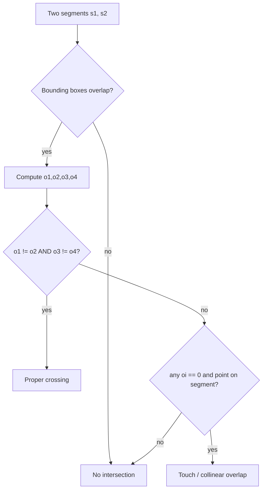

# Line and Segment Intersection — Junior Level

> **One-line summary:** Two line segments cross when the endpoints of each segment lie on **opposite sides** of the other segment's supporting line. You decide "which side" with the **cross-product orientation test** — three multiplications and a subtraction — and you never need trigonometry, slopes, or division to answer "do these two segments intersect?".

---

## Table of Contents

1. [Introduction](#introduction)
2. [Prerequisites](#prerequisites)
3. [Glossary](#glossary)
4. [Core Concepts](#core-concepts)
5. [Big-O Summary](#big-o-summary)
6. [Real-World Analogies](#real-world-analogies)
7. [Pros & Cons](#pros--cons)
8. [Step-by-Step Walkthrough](#step-by-step-walkthrough)
9. [Code Examples](#code-examples)
10. [Coding Patterns](#coding-patterns)
11. [Error Handling](#error-handling)
12. [Performance Tips](#performance-tips)
13. [Best Practices](#best-practices)
14. [Edge Cases & Pitfalls](#edge-cases--pitfalls)
15. [Common Mistakes](#common-mistakes)
16. [Cheat Sheet](#cheat-sheet)
17. [Visual Animation](#visual-animation)
18. [Summary](#summary)
19. [Further Reading](#further-reading)

---

## Introduction

Two of the most common questions in computational geometry are:

1. **Do these two line segments cross each other?** (a yes/no question)
2. **If they cross, at what point?** (a coordinate question)

You meet these everywhere: a game checking whether a bullet's path hits a wall, a mapping tool overlaying two road networks, a CAD program detecting that two drawn lines touch, a robot deciding whether its planned move would clip an obstacle's edge.

The naive instinct is to compute the equation of each line (`y = mx + b`), solve the two equations together, and check whether the solution lands inside both segments. That *works*, but it is fragile: vertical lines have infinite slope, parallel lines make you divide by zero, and floating-point round-off makes "is this point exactly on the segment?" surprisingly hard.

There is a far cleaner tool: the **cross-product orientation test**. Given three points it tells you, with three multiplications, whether you turn **left**, **right**, or go **straight** as you walk from the first through the second to the third. Almost everything about segment intersection — crossing, touching, being collinear — falls out of four such tests. No slopes, no division, no special-casing vertical lines.

> **Mental anchor:** the orientation test is the geometry version of a comparison. Just as sorting needs only "is `a < b`?", segment intersection needs only "do I turn left or right at this corner?".

This file builds the orientation test from scratch, uses it to answer the yes/no crossing question (including the tricky touching and collinear cases), and shows clean code in Go, Java, and Python. Computing the actual intersection *point* — and the floating-point vs exact-integer trade-off — is introduced here and deepened in `middle.md`.

---

## Prerequisites

Before reading this file you should be comfortable with:

- **2-D coordinates** — a point is a pair `(x, y)`. We work entirely in the plane.
- **Vectors** — subtracting two points `B - A = (B.x - A.x, B.y - A.y)` gives the vector "from A to B."
- **Basic arithmetic** — multiplication, subtraction, comparison. That is literally all the orientation test needs.
- **`if`/`else`, loops, functions** in any of Go / Java / Python.
- **The sign of a number** — positive, negative, or zero. This is the whole output of the core test.

Optional but helpful:

- A vague memory of the **cross product** from physics or linear algebra. We re-derive the only piece we need (the scalar 2-D version), so no prior fluency is required.
- Awareness that `float` arithmetic is **not exact** — `0.1 + 0.2 != 0.3`. We will lean on integers when we can.

---

## Glossary

| Term | Meaning |
|------|---------|
| **Point** | A pair `(x, y)` in the plane. |
| **Segment** | A straight piece of line between two endpoints `P` and `Q`, including both ends. Written `PQ`. |
| **Line** | The infinite straight line through two points — a segment extended forever in both directions. |
| **Vector** | A direction-and-length, obtained as `B - A`. Has no fixed position. |
| **Cross product (2-D)** | The scalar `(B - A) × (C - A) = (Bx-Ax)(Cy-Ay) - (By-Ay)(Cx-Ax)`. Its **sign** is what we use. |
| **Orientation** | Whether `A → B → C` turns left (counter-clockwise, CCW), right (clockwise, CW), or is collinear. |
| **Collinear** | Three points lying on one straight line — the cross product is exactly `0`. |
| **Proper intersection** | The segments cross at a single interior point of both. |
| **Improper / boundary intersection** | They merely touch at an endpoint, or overlap along a collinear stretch. |
| **Supporting line** | The infinite line that a segment lies on. |
| **Bounding box** | The smallest axis-aligned rectangle containing a segment; used for a fast pre-check. |
| **Parametric form** | Writing a point on segment `PQ` as `P + t·(Q - P)` for `t ∈ [0, 1]`. |

---

## Core Concepts

### 1. The cross product and what its sign means

Take three points `A`, `B`, `C`. Form two vectors that both start at `A`: `AB = B - A` and `AC = C - A`. The **2-D cross product** is a single number:

```
cross(A, B, C) = (B.x - A.x) * (C.y - A.y) - (B.y - A.y) * (C.x - A.x)
```

Its **magnitude** is twice the signed area of triangle `ABC`, but for intersection we only ever care about its **sign**:

- `cross > 0` → `C` is to the **left** of the directed line `A → B` (counter-clockwise turn).
- `cross < 0` → `C` is to the **right** (clockwise turn).
- `cross == 0` → `A`, `B`, `C` are **collinear** (C lies exactly on the infinite line through A and B).

That is the entire primitive. Everything else is built from it.

### 2. The orientation function

We wrap the sign into a tiny helper that returns `+1`, `-1`, or `0`:

```
orientation(A, B, C):
    val = cross(A, B, C)
    if val > 0: return +1   # CCW / left turn
    if val < 0: return -1   # CW / right turn
    return 0                # collinear
```

Read it as: *"Walking from A toward B, which way do I have to turn to reach C?"*

### 3. The crossing rule (the heart of the topic)

Two segments `P1P2` and `P3P4` **properly cross** when:

> Each segment straddles the other's supporting line.

Concretely, `P3` and `P4` must be on **opposite sides** of line `P1P2`, **and** `P1` and `P2` must be on **opposite sides** of line `P3P4`. In orientation terms:

```
o1 = orientation(P1, P2, P3)
o2 = orientation(P1, P2, P4)
o3 = orientation(P3, P4, P1)
o4 = orientation(P3, P4, P2)

if o1 != o2 AND o3 != o4:  →  they intersect (general case)
```

If `o1` and `o2` have opposite signs, `P3` and `P4` are on opposite sides of `P1P2`. Same idea for `o3`, `o4`. Both conditions together force a crossing.

### 4. The collinear / boundary special cases

The general rule above misses two situations where an orientation is **zero**:

- **Touching at an endpoint or T-junction.** If, say, `o1 == 0`, then `P3` lies *exactly on the line* `P1P2`. It still only counts as an intersection if `P3` actually lands **on the segment** `P1P2` (between the endpoints), not just on the infinite line. We check that with a small **on-segment** test.
- **Collinear overlap.** If all four orientations are zero, the two segments lie on the same line; they intersect iff their `x`/`y` ranges overlap (a 1-D interval-overlap check).

A robust segment-intersection function handles the general case **and** these four `==0` fallbacks. We code both below.

### 5. Computing the intersection point (preview)

For the *yes/no* question you never divide. To get the actual **point**, write each segment parametrically and solve a 2×2 linear system (Cramer's rule). The denominator is exactly a cross product of the two direction vectors:

```
P1 + t·(P2 - P1)  =  P3 + u·(P4 - P3)
```

If that denominator is `0`, the lines are **parallel** (or coincident) and there is no single intersection point. This is the only place division enters, and `middle.md` develops it fully. Junior takeaway: **the denominator being zero is the parallel/degenerate flag.**

### 6. The fast bounding-box pre-check

Before any orientation math, you can reject most non-crossing pairs instantly: if the two segments' bounding boxes don't even overlap, they cannot intersect. This `O(1)` filter is what makes the brute-force "test every pair" loop bearable and is also the first idea behind the sweep-line algorithm (cross-link `05-sweep-line`).

---

## Big-O Summary

| Operation | Complexity | Notes |
|-----------|-----------|-------|
| `cross(A, B, C)` | **O(1)** | 2 subtractions to build vectors, 2 multiplies, 1 subtract. |
| `orientation(A, B, C)` | **O(1)** | Cross product + sign. |
| Do segments `s1`, `s2` intersect? (yes/no) | **O(1)** | 4 orientations (+ on-segment fallbacks). |
| Compute the intersection **point** | **O(1)** | Cross-product denominator + Cramer's rule. |
| Bounding-box overlap pre-check | **O(1)** | 4 comparisons. |
| All-pairs among `n` segments (brute force) | **O(n²)** | Test every pair; fine for small `n`. |
| All intersections via sweep line | **O((n + k) log n)** | `k` = number of intersections. See `05-sweep-line`. |

> The single-pair test is genuinely constant time. The interesting complexity question is the *n*-segment problem, which the sweep line answers — that is the next topic, `05-sweep-line`.

---

## Real-World Analogies

| Concept | Analogy |
|---------|---------|
| Orientation test | Standing at a corner: as you walk from A to B, do you turn left or right to face C? |
| Cross product sign | A compass that only reports "left," "right," or "dead ahead." |
| Opposite-sides rule | Two roads cross only if each road has the other road's town on **both** sides of it. |
| Collinear overlap | Two stretches of the same highway — they "intersect" along a whole shared section, not a point. |
| Endpoint touching | A driveway meeting a road at a T — they touch but don't cross through. |
| Bounding-box pre-check | Glancing at two parcels on a map: if their rectangles don't overlap, no need to survey the boundaries. |
| Parallel lines (zero denominator) | Two train tracks running side by side — they never meet, so "where do they meet?" has no answer. |

Where the analogies break: real roads are wide ribbons; our segments are infinitely thin ideal lines, so "touching" is an exact mathematical condition, not a fuzzy one.

---

## Pros & Cons

| Pros | Cons |
|------|------|
| The orientation test uses only `*` and `-` — **no division, no slopes, no trig**. | The four-orientation rule alone misses endpoint/collinear cases; you must add the on-segment fallbacks. |
| With **integer** coordinates the yes/no test is **exact** — no floating-point error at all. | Computing the actual point needs division and reintroduces floating-point concerns. |
| Constant time per pair; trivial to implement and to reason about. | Brute-force all-pairs is `O(n²)`; large inputs need the sweep line (`05-sweep-line`). |
| Vertical and horizontal segments need no special handling. | Coordinate products can **overflow** 32-bit ints; use 64-bit (or wider) accumulators. |
| Same primitive powers convex hull, point-in-polygon, and area — high reuse. | "Touching counts as intersecting?" is a policy choice you must decide and document. |

**When to use:** collision checks, polygon clipping, map overlay, CAD touch detection, any "do these two straight pieces meet?" question.

**When NOT to use:** curved boundaries (use circle/curve intersection — siblings `13`–`15`), or huge segment counts where you need *all* intersections efficiently (use the sweep line).

---

## Step-by-Step Walkthrough

Let us run the yes/no test on a concrete crossing. Use integer coordinates so the math is exact.

```
Segment 1:  P1 = (1, 1)   P2 = (4, 4)     (going up-right)
Segment 2:  P3 = (1, 4)   P4 = (4, 1)     (going down-right)

These form an X centered at (2.5, 2.5). They should cross.
```

Compute the four orientations. Recall `cross(A,B,C) = (Bx-Ax)(Cy-Ay) - (By-Ay)(Cx-Ax)`.

```
o1 = orientation(P1, P2, P3) = cross((1,1),(4,4),(1,4))
   = (4-1)(4-1) - (4-1)(1-1) = 3*3 - 3*0 = 9   → +1 (left)

o2 = orientation(P1, P2, P4) = cross((1,1),(4,4),(4,1))
   = (4-1)(1-1) - (4-1)(4-1) = 3*0 - 3*3 = -9  → -1 (right)

o3 = orientation(P3, P4, P1) = cross((1,4),(4,1),(1,1))
   = (4-1)(1-4) - (1-4)(1-1) = 3*(-3) - (-3)*0 = -9 → -1 (right)

o4 = orientation(P3, P4, P2) = cross((1,4),(4,1),(4,4))
   = (4-1)(4-4) - (1-4)(4-1) = 3*0 - (-3)*3 = 9    → +1 (left)
```

Check the rule: `o1 (+1) != o2 (-1)` ✓ and `o3 (-1) != o4 (+1)` ✓. **They intersect.**

Now a non-crossing pair:

```
Segment 1:  P1 = (0, 0)   P2 = (2, 0)     (along the x-axis)
Segment 2:  P3 = (3, 1)   P4 = (3, 5)     (a vertical bar far to the right)

o1 = orientation(P1,P2,P3) = cross((0,0),(2,0),(3,1)) = (2)(1)-(0)(3) = 2  → +1
o2 = orientation(P1,P2,P4) = cross((0,0),(2,0),(3,5)) = (2)(5)-(0)(3) = 10 → +1
```

Already `o1 == o2` (both left), so `P3` and `P4` are on the **same side** of segment 1 → no crossing. We can stop early. (The bounding boxes don't overlap either — `x` ranges `[0,2]` and `[3,3]` are disjoint — so the pre-check would have rejected it even faster.)

A boundary case — a T-junction where an endpoint lands on the other segment:

```
Segment 1:  P1 = (0, 0)   P2 = (4, 0)
Segment 2:  P3 = (2, 0)   P4 = (2, 3)     (its bottom endpoint sits ON segment 1)

o1 = orientation(P1,P2,P3) = cross((0,0),(4,0),(2,0)) = (4)(0)-(0)(2) = 0  → collinear!
```

Here `o1 == 0`, so the general rule doesn't fire. We fall back to the on-segment test: is `P3 = (2,0)` actually between `P1` and `P2`? Its `x = 2` is in `[0, 4]` and `y = 0` matches — yes. So they **touch** at `(2, 0)`. Whether you *report* this as an intersection depends on your policy.

---

## Code Examples

### Example: Do two segments intersect? (orientation + on-segment fallbacks)

We use integer coordinates so the yes/no answer is **exact**. `int64` (Go), `long` (Java), and Python's arbitrary-precision ints all avoid overflow on the products.

#### Go

```go
package main

import "fmt"

// Point with integer coordinates (exact arithmetic).
type Point struct{ X, Y int64 }

// cross returns (B-A) x (C-A). Sign tells orientation.
func cross(a, b, c Point) int64 {
	return (b.X-a.X)*(c.Y-a.Y) - (b.Y-a.Y)*(c.X-a.X)
}

// orientation returns +1 (CCW), -1 (CW), or 0 (collinear).
func orientation(a, b, c Point) int {
	v := cross(a, b, c)
	switch {
	case v > 0:
		return 1
	case v < 0:
		return -1
	default:
		return 0
	}
}

// onSegment reports whether collinear point p lies on segment ab.
func onSegment(a, b, p Point) bool {
	return min(a.X, b.X) <= p.X && p.X <= max(a.X, b.X) &&
		min(a.Y, b.Y) <= p.Y && p.Y <= max(a.Y, b.Y)
}

// segmentsIntersect reports whether segments p1p2 and p3p4 share any point.
func segmentsIntersect(p1, p2, p3, p4 Point) bool {
	o1 := orientation(p1, p2, p3)
	o2 := orientation(p1, p2, p4)
	o3 := orientation(p3, p4, p1)
	o4 := orientation(p3, p4, p2)

	// General case: each segment straddles the other's line.
	if o1 != o2 && o3 != o4 {
		return true
	}
	// Special collinear/boundary cases.
	if o1 == 0 && onSegment(p1, p2, p3) {
		return true
	}
	if o2 == 0 && onSegment(p1, p2, p4) {
		return true
	}
	if o3 == 0 && onSegment(p3, p4, p1) {
		return true
	}
	if o4 == 0 && onSegment(p3, p4, p2) {
		return true
	}
	return false
}

func main() {
	a, b := Point{1, 1}, Point{4, 4}
	c, d := Point{1, 4}, Point{4, 1}
	fmt.Println(segmentsIntersect(a, b, c, d)) // true  (the X)

	e, f := Point{0, 0}, Point{2, 0}
	g, h := Point{3, 1}, Point{3, 5}
	fmt.Println(segmentsIntersect(e, f, g, h)) // false (disjoint)
}
```

#### Java

```java
public class SegmentIntersect {

    static long cross(long ax, long ay, long bx, long by, long cx, long cy) {
        return (bx - ax) * (cy - ay) - (by - ay) * (cx - ax);
    }

    static int orientation(long ax, long ay, long bx, long by, long cx, long cy) {
        long v = cross(ax, ay, bx, by, cx, cy);
        if (v > 0) return 1;   // CCW
        if (v < 0) return -1;  // CW
        return 0;              // collinear
    }

    // Is collinear point (px,py) on segment (ax,ay)-(bx,by)?
    static boolean onSegment(long ax, long ay, long bx, long by, long px, long py) {
        return Math.min(ax, bx) <= px && px <= Math.max(ax, bx) &&
               Math.min(ay, by) <= py && py <= Math.max(ay, by);
    }

    static boolean segmentsIntersect(long ax, long ay, long bx, long by,
                                     long cx, long cy, long dx, long dy) {
        int o1 = orientation(ax, ay, bx, by, cx, cy);
        int o2 = orientation(ax, ay, bx, by, dx, dy);
        int o3 = orientation(cx, cy, dx, dy, ax, ay);
        int o4 = orientation(cx, cy, dx, dy, bx, by);

        if (o1 != o2 && o3 != o4) return true; // general crossing

        if (o1 == 0 && onSegment(ax, ay, bx, by, cx, cy)) return true;
        if (o2 == 0 && onSegment(ax, ay, bx, by, dx, dy)) return true;
        if (o3 == 0 && onSegment(cx, cy, dx, dy, ax, ay)) return true;
        if (o4 == 0 && onSegment(cx, cy, dx, dy, bx, by)) return true;
        return false;
    }

    public static void main(String[] args) {
        System.out.println(segmentsIntersect(1, 1, 4, 4, 1, 4, 4, 1)); // true
        System.out.println(segmentsIntersect(0, 0, 2, 0, 3, 1, 3, 5)); // false
    }
}
```

#### Python

```python
def cross(a, b, c):
    """(B - A) x (C - A); sign gives orientation."""
    return (b[0] - a[0]) * (c[1] - a[1]) - (b[1] - a[1]) * (c[0] - a[0])


def orientation(a, b, c):
    v = cross(a, b, c)
    if v > 0:
        return 1   # CCW / left
    if v < 0:
        return -1  # CW / right
    return 0       # collinear


def on_segment(a, b, p):
    """Is collinear point p on segment ab?"""
    return (min(a[0], b[0]) <= p[0] <= max(a[0], b[0]) and
            min(a[1], b[1]) <= p[1] <= max(a[1], b[1]))


def segments_intersect(p1, p2, p3, p4):
    o1 = orientation(p1, p2, p3)
    o2 = orientation(p1, p2, p4)
    o3 = orientation(p3, p4, p1)
    o4 = orientation(p3, p4, p2)

    if o1 != o2 and o3 != o4:            # general crossing
        return True
    if o1 == 0 and on_segment(p1, p2, p3):
        return True
    if o2 == 0 and on_segment(p1, p2, p4):
        return True
    if o3 == 0 and on_segment(p3, p4, p1):
        return True
    if o4 == 0 and on_segment(p3, p4, p2):
        return True
    return False


if __name__ == "__main__":
    print(segments_intersect((1, 1), (4, 4), (1, 4), (4, 1)))  # True (the X)
    print(segments_intersect((0, 0), (2, 0), (3, 1), (3, 5)))  # False
```

**What it does:** answers "do these two segments share any point?" exactly, for integer coordinates, covering proper crossings, endpoint touches, and collinear overlaps.
**Run:** `go run main.go` | `javac SegmentIntersect.java && java SegmentIntersect` | `python segment_intersect.py`

---

## Coding Patterns

### Pattern 1: The orientation primitive

**Intent:** reduce every geometric "which side?" question to the sign of one cross product.

```python
def orientation(a, b, c):
    v = (b[0]-a[0])*(c[1]-a[1]) - (b[1]-a[1])*(c[0]-a[0])
    return (v > 0) - (v < 0)   # → 1, 0, or -1
```

This single function is the geometry analogue of a comparator. You will reuse it in convex hull (`01-convex-hull`), point-in-polygon (`03-point-in-polygon`), and area computation.

### Pattern 2: Bounding-box reject before the math

**Intent:** skip the orientation work for pairs that obviously cannot meet.

```python
def boxes_overlap(p1, p2, p3, p4):
    return (max(p1[0], p2[0]) >= min(p3[0], p4[0]) and
            max(p3[0], p4[0]) >= min(p1[0], p2[0]) and
            max(p1[1], p2[1]) >= min(p3[1], p4[1]) and
            max(p3[1], p4[1]) >= min(p1[1], p2[1]))
```

Call this first in an all-pairs loop; it turns most `O(n²)` comparisons into one cheap rectangle test.

### Pattern 3: The straddle test in one line

**Intent:** the core "opposite sides" check, expressed directly.

```python
def straddles(a, b, c, d):
    # Do c and d lie on opposite sides of line ab?
    return orientation(a, b, c) * orientation(a, b, d) < 0
```

`straddles(p1,p2,p3,p4) and straddles(p3,p4,p1,p2)` is the proper-crossing condition (negative product ⇒ strictly opposite signs).



---

## Error Handling

| Error | Cause | Fix |
|-------|-------|-----|
| Integer overflow in `cross` | Coordinates large; product exceeds 32-bit range. | Use 64-bit (`int64`/`long`); Python ints are unbounded. |
| Missed endpoint touches | Only the `o1!=o2 && o3!=o4` rule, no `==0` fallbacks. | Add the four on-segment checks for collinear cases. |
| Division by zero finding the point | Lines are parallel; denominator cross product is 0. | Test the denominator for 0 **before** dividing; report "parallel." |
| Wrong "side" answer | Swapped argument order in `cross`/`orientation`. | Fix the convention: `cross(A, B, C)` measures C relative to line A→B. |
| Float "almost zero" treated as nonzero | Using floats with `== 0`. | Prefer integers; with floats use an epsilon (`abs(v) < eps`). |
| Collinear overlap reported as single point | Treating overlap like a proper crossing. | Detect "all four orientations 0" and handle as interval overlap. |

---

## Performance Tips

- **Stay in integers** whenever coordinates allow — the yes/no test is then exact and division-free.
- **Pre-filter with bounding boxes** in any all-pairs loop; it removes the vast majority of orientation calls.
- **Short-circuit** the orientation checks: if `o1 == o2` you can return `false` early (subject to the collinear fallback).
- **Avoid recomputing** the four orientations if you already need the intersection point — reuse the cross products.
- For **many** segments, do not stay at `O(n²)`; move to the sweep line (`05-sweep-line`) which is `O((n + k) log n)`.
- Inline the cross product in hot loops; the function-call overhead can dominate such a tiny body.

---

## Best Practices

- Write the orientation helper **once** and reuse it across all geometry topics; keep its argument convention fixed and documented.
- Decide explicitly whether **touching counts as intersecting** for your application, and encode that policy in one place.
- Prefer **integer** coordinates for predicates; only convert to float when you must produce the actual point.
- Test the four canonical cases every time: proper cross, endpoint touch, collinear overlap, and disjoint.
- Guard the intersection-point computation with a **parallel check** (`denominator == 0`).
- Keep the bounding-box pre-check and the exact test in separate functions so each can be tested in isolation.

---

## Edge Cases & Pitfalls

- **Shared endpoint** — two segments meeting at a common endpoint count as intersecting under the on-segment rule. Decide if you want that.
- **One segment is a single point** (`P == Q`) — degenerate; the orientation test still works but the "segment" is a dot.
- **Collinear, no overlap** — both lie on the same line but their intervals are disjoint (e.g. `[0,1]` and `[2,3]` on the x-axis). All orientations are 0 yet there is no intersection; the on-segment checks correctly return false.
- **Collinear, partial overlap** — they share a whole sub-segment, not a point. Report accordingly.
- **Vertical / horizontal segments** — no special case needed; the cross product handles every slope uniformly.
- **Large coordinates** — products of two near-`10^9` values approach `10^18`, near the `int64` limit; keep coordinates within a safe range or use wider types.
- **Floating-point inputs** — exact equality (`== 0`) becomes unreliable; switch to an epsilon comparison and read `professional.md` for the robust-predicate story.

---

## Common Mistakes

1. **Using only the four-orientation rule** and forgetting the `== 0` on-segment fallbacks — silently misses every touch/T-junction case.
2. **Computing slopes** and dividing — breaks on vertical lines and parallel pairs. The cross product never divides.
3. **32-bit overflow** — `(bx-ax)*(cy-ay)` overflows `int` for big coordinates; use 64-bit.
4. **Dividing before the parallel check** — produces NaN/Inf or a crash when finding the point of two parallel lines.
5. **Treating collinear overlap as a single point** — it is a whole shared segment; handle the interval case separately.
6. **Mismatched argument order** in `orientation` — gives the opposite side and inverts every conclusion.
7. **Using `==` on floats** — round-off makes "exactly collinear" almost never true; integers or an epsilon are mandatory.

---

## Cheat Sheet

| Step | What to do |
|------|------------|
| Cross | `cross(A,B,C) = (Bx-Ax)(Cy-Ay) - (By-Ay)(Cx-Ax)`. |
| Orientation | sign of `cross`: `+1` CCW, `-1` CW, `0` collinear. |
| Proper cross | `o1 != o2` **and** `o3 != o4`. |
| Boundary | any `oi == 0` **and** the point is on the segment. |
| Collinear overlap | all four `== 0` → check interval (box) overlap. |
| Point | solve `P1 + t·d1 = P3 + u·d2` via Cramer; denom = `cross(d1, d2)`. |
| Parallel flag | denominator `== 0`. |
| Fast reject | bounding boxes must overlap first. |

Hard rules: **integers stay exact; use 64-bit; check the denominator before dividing.**

```
single-pair test : O(1)
all-pairs brute   : O(n^2)
sweep line        : O((n + k) log n)   # see 05-sweep-line
```

---

## Visual Animation

> See [`animation.html`](./animation.html) for an interactive visual animation of segment intersection.
>
> The animation demonstrates:
> - Two **draggable** segments you can position anywhere
> - The four orientation tests (`o1..o4`) computed live, color-coded left/right/collinear
> - The computed **intersection point** appearing when they cross
> - The **parallel** and **collinear-overlap** cases called out explicitly
> - A log of each test and a Big-O reference table

---

## Summary

The yes/no segment-intersection question reduces to one primitive: the **cross-product orientation test**, which reports left / right / collinear with three multiplications and no division. Two segments properly cross when each straddles the other's supporting line — `o1 != o2 && o3 != o4`. Endpoint touches and collinear overlaps are the `== 0` cases, handled with a small on-segment check. Keep coordinates **integer** and the yes/no answer is exact. Computing the actual intersection *point* is the one place division enters, and the denominator being zero is your parallel-lines flag — the subject of `middle.md`. For *many* segments at once, the brute-force `O(n²)` loop gives way to the sweep line (`05-sweep-line`).

---

## Further Reading

- *Introduction to Algorithms* (CLRS), Chapter 33 — "Computational Geometry," segment intersection and the sweep.
- *Computational Geometry: Algorithms and Applications* (de Berg et al.), Chapter 2 — line segment intersection.
- cp-algorithms.com — "Oriented area of a triangle," "Check if two segments intersect," "Intersection point of lines."
- Sibling topics: `01-convex-hull` (same orientation primitive), `03-point-in-polygon`, `05-sweep-line` (all intersections among `n` segments), `13-circle-line-intersection`.

---

**Next step:** [middle.md](./middle.md) — computing the intersection point with parametric form and Cramer's rule, handling every collinear/boundary case, and the floating-point-vs-exact robustness question.
