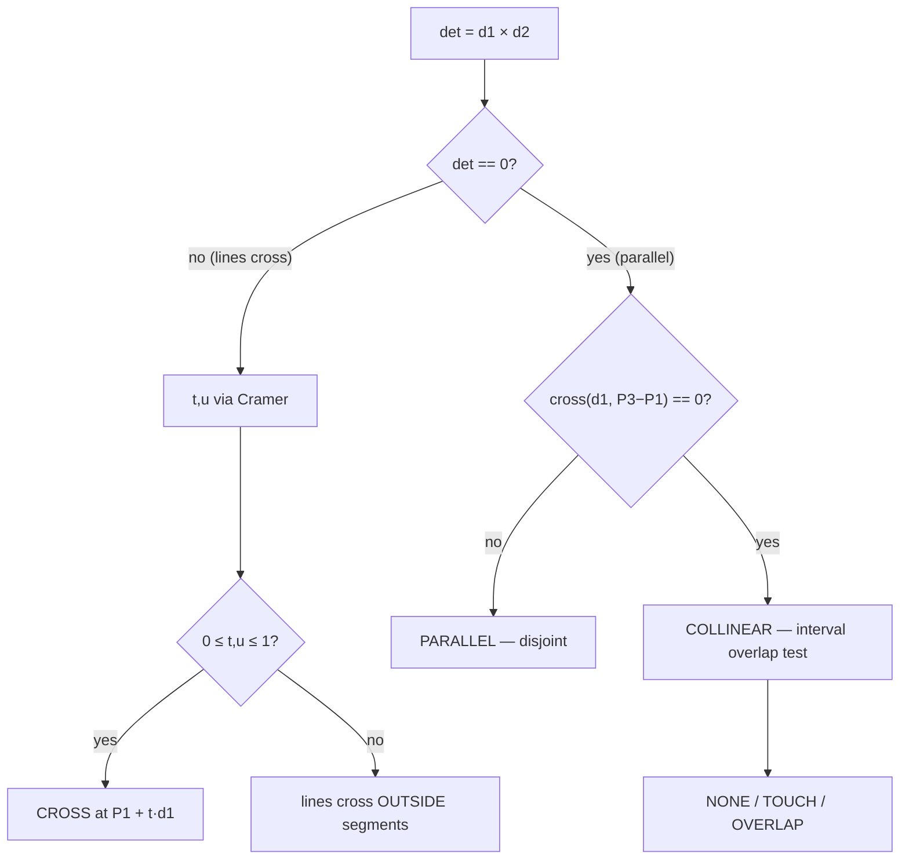

# Line and Segment Intersection — Middle Level

> **Focus:** Computing the actual intersection *point* (parametric form, Cramer's rule, the determinant denominator), classifying every case — proper crossing, endpoint touch, collinear overlap, parallel, coincident — and the central engineering tension: **floating-point speed vs integer/exact correctness**.

---

## Table of Contents

1. [Introduction](#introduction)
2. [Deeper Concepts](#deeper-concepts)
3. [Three Ways to Represent a Line](#three-ways-to-represent-a-line)
4. [Computing the Intersection Point](#computing-the-intersection-point)
5. [Comparison with Alternatives](#comparison-with-alternatives)
6. [Advanced Patterns](#advanced-patterns)
7. [Distance From a Point to a Line and Segment](#distance-from-a-point-to-a-line-and-segment)
8. [Code Examples](#code-examples)
9. [Error Handling](#error-handling)
10. [Performance Analysis](#performance-analysis)
11. [Best Practices](#best-practices)
12. [Visual Animation](#visual-animation)
13. [Summary](#summary)

---

## Introduction

At junior level the question was binary: *do these two segments meet?* The orientation test answered it exactly, with integers and no division. At middle level the questions become quantitative and the failure modes subtle:

- **Where** exactly do they cross? (a coordinate, usually fractional)
- How do you tell **parallel** from **coincident** lines, and segments that **overlap** from ones that merely **touch**?
- When two **infinite lines** are given (not segments), how does the answer differ?
- How far is a point from a line, and from a *segment* (which has endpoints)?
- And the question that quietly breaks production geometry code: **floating-point round-off**. When is `0.0000001` "really zero," and what does that do to your classification?

The mathematical engine for all of this is a 2×2 linear system whose determinant is — once again — a **cross product**. Master that one determinant and you can compute intersection points, detect parallelism, and reason about robustness in a single mental model.

---

## Deeper Concepts

### The parametric viewpoint

Write a point on segment `P1P2` as it slides from `P1` (at `t = 0`) to `P2` (at `t = 1`):

```
A(t) = P1 + t · d1,   where d1 = P2 - P1,   t ∈ [0, 1]
```

Likewise for `P3P4`:

```
B(u) = P3 + u · d2,   where d2 = P4 - P3,   u ∈ [0, 1]
```

The two segments meet where `A(t) = B(u)`. That single vector equation is **two scalar equations** (one for x, one for y) in **two unknowns** (`t`, `u`):

```
P1.x + t·d1.x = P3.x + u·d2.x
P1.y + t·d1.y = P3.y + u·d2.y
```

Rearranged into the standard linear form `M · [t, u]ᵀ = r`:

```
[ d1.x   -d2.x ] [ t ]   [ P3.x - P1.x ]
[ d1.y   -d2.y ] [ u ] = [ P3.y - P1.y ]
```

### The determinant *is* a cross product

The determinant of that 2×2 matrix is:

```
det = d1.x·(-d2.y) - (-d2.x)·d1.y = -(d1.x·d2.y - d1.y·d2.x) = -cross(d1, d2)
```

So up to a sign, **the system's determinant equals the cross product of the two direction vectors**. This unifies everything:

- `det == 0` ⇔ `cross(d1, d2) == 0` ⇔ `d1` and `d2` are **parallel** ⇔ the lines never meet in a single point (they are parallel or coincident).
- `det != 0` ⇒ a unique `(t, u)` exists. Solve it with **Cramer's rule** (next section).

> The orientation test from junior level and the intersection-point determinant here are *the same operation* viewed two ways. There is really only one primitive in this entire topic.

### Classifying the relationship

Once you have `det`, `t`, and `u`, classification is a decision tree:

| `det` | `t` range | `u` range | Result |
|-------|-----------|-----------|--------|
| `!= 0` | `0 ≤ t ≤ 1` | `0 ≤ u ≤ 1` | **Segments cross** at `P1 + t·d1`. |
| `!= 0` | `t < 0` or `t > 1`, or `u` out of `[0,1]` | — | Lines cross, but **outside** one/both segments. |
| `== 0` | — collinear? — | — | **Parallel** (distinct) or **coincident/overlapping** (same line). |

For the `det == 0` branch you still must distinguish *parallel-and-disjoint* from *collinear* (same supporting line): check whether `P3` lies on line `P1P2`, i.e. `cross(d1, P3 - P1) == 0`. If yes, the lines coincide and you do a 1-D interval-overlap test; if no, they are strictly parallel with no intersection.



---

## Three Ways to Represent a Line

A line in the plane has three common encodings; you should be fluent translating between them because different inputs arrive in different forms.

| Form | Notation | Best for | Watch out |
|------|----------|----------|-----------|
| **Two points** | `P, Q` | Geometry from data (segments, polygons). | Direction is `Q - P`; needs `P != Q`. |
| **Point + direction** | `P, d` | Rays, parametric motion, physics. | `d` need not be unit length for intersection. |
| **Implicit `ax + by = c`** | `(a, b, c)` | Half-planes, clipping, distance formulas. | Coefficients not unique (scale-invariant). |

### Converting two-point → implicit

Given `P` and `Q`, the line through them is `a·x + b·y = c` with:

```
a = Q.y - P.y
b = P.x - Q.x          # = -(Q.x - P.x)
c = a·P.x + b·P.y
```

The vector `(a, b)` is the **normal** to the line. The signed value `a·X + b·Y - c` for any point `(X, Y)` is proportional to its distance from the line — and its **sign is exactly the orientation** of `(X,Y)` relative to the directed line `P→Q`. The implicit form and the cross product are, yet again, the same idea.

### Line-line intersection from implicit forms

Two lines `a1·x + b1·y = c1` and `a2·x + b2·y = c2` meet where:

```
det = a1·b2 - a2·b1
x = (c1·b2 - c2·b1) / det
y = (a1·c2 - a2·c1) / det
```

`det == 0` ⇒ parallel (or coincident if the `c` ratios match). This is Cramer's rule on the implicit system, and it is the cleanest formula when your input is already in `ax + by = c` form (e.g. half-plane intersection, `12-half-plane-intersection`).

---

## Computing the Intersection Point

Two equivalent routes. Pick by what your input looks like.

### Route A — Cramer's rule on the parametric system

From the matrix above, with `det = cross(d1, d2)` and `e = P3 - P1`:

```
t = cross(e, d2) / det
u = cross(e, d1) / det
intersection = P1 + t · d1
```

(Sign bookkeeping is absorbed because both numerator and denominator are cross products with the same orientation convention.) Then:

- Both lines intersect at `P1 + t·d1` regardless of `t`, `u`.
- The **segments** intersect iff `0 ≤ t ≤ 1` **and** `0 ≤ u ≤ 1`.

### Route B — implicit determinant

Convert both segments to `ax + by = c` (formulas above), then apply the implicit Cramer formulas. Same result; better when you already hold normals.

### The robustness fork

Computing `t` and `u` requires **division**, so the result is a floating-point number even from integer input. Two strategies:

- **Exact predicate, float coordinate.** Decide *whether* they cross using the integer orientation test (exact), then compute the *coordinate* in floating point only when you know it exists. This separates the fragile (geometry decision) from the inevitable (a fractional coordinate). Strongly recommended.
- **Rational arithmetic.** Keep `t = num/den` as an exact fraction (`big.Rat`, `Fraction`, `BigInteger` pairs) and only round at the very end. Exact but slower; used in CAD kernels and exact-predicate libraries.

`professional.md` proves the determinant formula correct and develops adaptive/exact-arithmetic predicates. The middle-level rule of thumb: **decide with integers, locate with floats, and never divide before checking `det != 0`.**

---

## Comparison with Alternatives

| Method to find the point | Division? | Handles vertical lines? | Exact decision? | Notes |
|--------------------------|-----------|-------------------------|-----------------|-------|
| **Parametric + Cramer** | once (`/det`) | yes (no slopes) | decision via integer orientation | The default; reuses the cross product. |
| **Implicit `ax+by=c` Cramer** | once | yes | yes if integer coeffs | Best when input is already implicit / half-planes. |
| **Slope-intercept solve** | yes, multiple | **no** (∞ slope) | no | Avoid; breaks on vertical/parallel. |
| **Rational (`big.Rat`)** | exact fraction | yes | fully exact | CAD kernels; slowest. |

**Choose parametric + Cramer when:** you have segments as endpoints (the usual case).
**Choose implicit when:** your data is half-planes or you already store line normals.
**Never choose slope-intercept** in production geometry — it is the classic source of "divide by zero on vertical lines" bugs.

---

## Advanced Patterns

### Pattern: Full classification function

**Intent:** return not just yes/no but *which* of the five cases occurred, with the point when one exists.

```text
classify(P1,P2,P3,P4):
    d1, d2 = P2-P1, P4-P3
    det = cross(d1, d2)
    if det == 0:
        if cross(d1, P3-P1) != 0: return PARALLEL          # distinct parallel lines
        else: return collinear_overlap(P1,P2,P3,P4)        # COINCIDENT / OVERLAP / TOUCH / NONE
    t = cross(P3-P1, d2) / det
    u = cross(P3-P1, d1) / det
    if 0 <= t <= 1 and 0 <= u <= 1: return CROSS at P1 + t*d1
    return LINES_CROSS_OUTSIDE_SEGMENTS
```

### Pattern: Collinear overlap as interval intersection

**Intent:** when both segments lie on one line, project onto the dominant axis and intersect 1-D intervals.

```python
def collinear_overlap(p1, p2, p3, p4):
    # Project onto x if the line isn't vertical, else onto y.
    key = 0 if p1[0] != p2[0] else 1
    lo1, hi1 = sorted((p1[key], p2[key]))
    lo2, hi2 = sorted((p3[key], p4[key]))
    lo, hi = max(lo1, lo2), min(hi1, hi2)
    if lo > hi:      return None            # disjoint
    if lo == hi:     return ("touch", lo)   # share one endpoint
    return ("overlap", (lo, hi))            # share a whole sub-segment
```

### Pattern: Ray–segment intersection

**Intent:** same math, but the first object is a ray (`t ≥ 0`, no upper bound). Used in ray casting (point-in-polygon, `03-point-in-polygon`) and graphics.

```python
def ray_hits_segment(origin, direction, p3, p4):
    d2 = (p4[0]-p3[0], p4[1]-p3[1])
    det = direction[0]*d2[1] - direction[1]*d2[0]
    if det == 0:                       # parallel
        return None
    e = (p3[0]-origin[0], p3[1]-origin[1])
    t = (e[0]*d2[1] - e[1]*d2[0]) / det        # along the ray
    u = (e[0]*direction[1] - e[1]*direction[0]) / det
    if t >= 0 and 0 <= u <= 1:
        return (origin[0]+t*direction[0], origin[1]+t*direction[1])
    return None
```

---

## Distance From a Point to a Line and Segment

A close cousin of intersection, and built from the same cross product.

### Point to infinite line

The perpendicular distance from `P` to the line through `A`, `B`:

```
dist = |cross(A, B, P)| / |B - A|
```

The numerator is the (absolute) cross product — twice the triangle area — and dividing by the base length `|B - A|` gives the height, i.e. the perpendicular distance. No trig.

### Point to segment (endpoints matter)

For a *segment* you must clamp to the endpoints: project `P` onto the line, and if the projection falls outside `[A, B]`, the nearest point is the closer endpoint.

```text
t = dot(P - A, B - A) / dot(B - A, B - A)   # projection parameter
t = clamp(t, 0, 1)
nearest = A + t·(B - A)
dist = |P - nearest|
```

This clamped projection is the workhorse of collision response, path smoothing, and "snap to nearest edge" tools.

---

## Code Examples

### Example: Intersection point with full classification (float coordinates, exact-ish decision)

#### Go

```go
package main

import (
	"fmt"
	"math"
)

type Pt struct{ X, Y float64 }

func sub(a, b Pt) Pt        { return Pt{a.X - b.X, a.Y - b.Y} }
func cross(a, b Pt) float64 { return a.X*b.Y - a.Y*b.X }

type Result struct {
	Kind  string // "cross", "outside", "parallel", "collinear"
	Point Pt
}

const eps = 1e-9

// Intersect computes the relationship of segments p1p2 and p3p4.
func Intersect(p1, p2, p3, p4 Pt) Result {
	d1 := sub(p2, p1)
	d2 := sub(p4, p3)
	det := cross(d1, d2) // == -determinant of the linear system, sign cancels below

	if math.Abs(det) < eps {
		// Parallel: distinct or collinear?
		if math.Abs(cross(d1, sub(p3, p1))) < eps {
			return Result{Kind: "collinear"}
		}
		return Result{Kind: "parallel"}
	}

	e := sub(p3, p1)
	t := cross(e, d2) / det
	u := cross(e, d1) / det
	if t >= -eps && t <= 1+eps && u >= -eps && u <= 1+eps {
		return Result{Kind: "cross", Point: Pt{p1.X + t*d1.X, p1.Y + t*d1.Y}}
	}
	return Result{Kind: "outside", Point: Pt{p1.X + t*d1.X, p1.Y + t*d1.Y}}
}

func main() {
	r := Intersect(Pt{1, 1}, Pt{4, 4}, Pt{1, 4}, Pt{4, 1})
	fmt.Printf("%s at (%.2f, %.2f)\n", r.Kind, r.Point.X, r.Point.Y) // cross at (2.50, 2.50)

	p := Intersect(Pt{0, 0}, Pt{1, 1}, Pt{0, 1}, Pt{1, 2})
	fmt.Println(p.Kind) // parallel
}
```

#### Java

```java
public class IntersectPoint {

    record Pt(double x, double y) {}

    static double cross(double ax, double ay, double bx, double by) {
        return ax * by - ay * bx;
    }

    static final double EPS = 1e-9;

    // Returns "cross x y", "outside x y", "parallel", or "collinear".
    static String intersect(Pt p1, Pt p2, Pt p3, Pt p4) {
        double d1x = p2.x() - p1.x(), d1y = p2.y() - p1.y();
        double d2x = p4.x() - p3.x(), d2y = p4.y() - p3.y();
        double det = cross(d1x, d1y, d2x, d2y);

        if (Math.abs(det) < EPS) {
            double col = cross(d1x, d1y, p3.x() - p1.x(), p3.y() - p1.y());
            return Math.abs(col) < EPS ? "collinear" : "parallel";
        }

        double ex = p3.x() - p1.x(), ey = p3.y() - p1.y();
        double t = cross(ex, ey, d2x, d2y) / det;
        double u = cross(ex, ey, d1x, d1y) / det;
        double ix = p1.x() + t * d1x, iy = p1.y() + t * d1y;
        boolean within = t >= -EPS && t <= 1 + EPS && u >= -EPS && u <= 1 + EPS;
        return String.format("%s %.2f %.2f", within ? "cross" : "outside", ix, iy);
    }

    public static void main(String[] args) {
        System.out.println(intersect(new Pt(1,1), new Pt(4,4),
                                     new Pt(1,4), new Pt(4,1))); // cross 2.50 2.50
        System.out.println(intersect(new Pt(0,0), new Pt(1,1),
                                     new Pt(0,1), new Pt(1,2))); // parallel
    }
}
```

#### Python

```python
from fractions import Fraction

EPS = 1e-9


def cross(ax, ay, bx, by):
    return ax * by - ay * bx


def intersect(p1, p2, p3, p4):
    d1 = (p2[0] - p1[0], p2[1] - p1[1])
    d2 = (p4[0] - p3[0], p4[1] - p3[1])
    det = cross(d1[0], d1[1], d2[0], d2[1])

    if abs(det) < EPS:
        col = cross(d1[0], d1[1], p3[0] - p1[0], p3[1] - p1[1])
        return ("collinear", None) if abs(col) < EPS else ("parallel", None)

    e = (p3[0] - p1[0], p3[1] - p1[1])
    t = cross(e[0], e[1], d2[0], d2[1]) / det
    u = cross(e[0], e[1], d1[0], d1[1]) / det
    point = (p1[0] + t * d1[0], p1[1] + t * d1[1])
    kind = "cross" if -EPS <= t <= 1 + EPS and -EPS <= u <= 1 + EPS else "outside"
    return (kind, point)


def intersect_exact(p1, p2, p3, p4):
    """Same logic but with exact rational coordinates — no round-off."""
    d1 = (p2[0] - p1[0], p2[1] - p1[1])
    d2 = (p4[0] - p3[0], p4[1] - p3[1])
    det = d1[0] * d2[1] - d1[1] * d2[0]
    if det == 0:
        return ("parallel_or_collinear", None)
    ex, ey = p3[0] - p1[0], p3[1] - p1[1]
    t = Fraction(ex * d2[1] - ey * d2[0], det)
    px = p1[0] + t * d1[0]
    py = p1[1] + t * d1[1]
    return ("cross" if 0 <= t <= 1 else "outside", (px, py))


if __name__ == "__main__":
    print(intersect((1, 1), (4, 4), (1, 4), (4, 1)))   # ('cross', (2.5, 2.5))
    print(intersect((0, 0), (1, 1), (0, 1), (1, 2)))   # ('parallel', None)
    print(intersect_exact((1, 1), (4, 4), (1, 4), (4, 1)))  # exact (2.5, 2.5) as Fractions
```

**What it does:** classifies two segments and returns the intersection coordinate when one exists; the Python `intersect_exact` shows the rational-arithmetic route with zero round-off.
**Run:** `go run main.go` | `javac IntersectPoint.java && java IntersectPoint` | `python intersect_point.py`

---

## Error Handling

| Scenario | What goes wrong | Correct approach |
|----------|----------------|------------------|
| Dividing by `det == 0` | NaN/Inf coordinate for parallel lines | Check `\|det\| < eps` (float) or `det == 0` (int) first. |
| Float "almost collinear" | `det` tiny but nonzero → wild, unstable point | Treat `\|det\| < eps` as parallel; or use exact integers. |
| Endpoint just inside/outside | `t = 1.0000001` excluded as "outside" | Compare with a small epsilon margin on `t`, `u`. |
| Wrong projection axis (collinear) | Vertical line projected onto x collapses | Project onto the axis with larger spread (or use y if `Δx == 0`). |
| Coincident vs parallel confused | Returning "no intersection" for overlapping segments | After `det == 0`, test `cross(d1, P3-P1)` to split the cases. |
| Mixed int/float input | Silent precision loss | Normalize input type at the boundary; prefer integer predicates. |

---

## Performance Analysis

A single intersection is `O(1)`; the interesting cost is the all-pairs / many-segment regime.

#### Go

```go
import (
	"fmt"
	"time"
)

func benchPairs(n int) {
	segs := make([][4]float64, n)
	for i := range segs {
		segs[i] = [4]float64{float64(i), 0, float64(i) + 1, 1}
	}
	start := time.Now()
	count := 0
	for i := 0; i < n; i++ {
		for j := i + 1; j < n; j++ {
			a, b := segs[i], segs[j]
			if Intersect(Pt{a[0], a[1]}, Pt{a[2], a[3]},
				Pt{b[0], b[1]}, Pt{b[2], b[3]}).Kind == "cross" {
				count++
			}
		}
	}
	fmt.Printf("n=%5d pairs=%d  %v\n", n, count, time.Since(start))
}
```

#### Java

```java
public static void benchPairs(int n) {
    long start = System.nanoTime();
    int count = 0;
    for (int i = 0; i < n; i++)
        for (int j = i + 1; j < n; j++)
            if (intersect(new Pt(i,0), new Pt(i+1,1),
                          new Pt(j,0), new Pt(j+1,1)).startsWith("cross"))
                count++;
    System.out.printf("n=%5d count=%d  %.2f ms%n",
            n, count, (System.nanoTime() - start) / 1e6);
}
```

#### Python

```python
import timeit

def bench_pairs(n):
    segs = [((i, 0), (i + 1, 1)) for i in range(n)]
    def run():
        c = 0
        for i in range(n):
            for j in range(i + 1, n):
                a, b = segs[i], segs[j]
                if intersect(a[0], a[1], b[0], b[1])[0] == "cross":
                    c += 1
        return c
    t = timeit.timeit(run, number=1)
    print(f"n={n:>5}: {t*1000:.2f} ms")
```

The `O(n²)` curve is unmistakable: doubling `n` quadruples the time. The moment that hurts, switch to the **sweep line** (`05-sweep-line`) for `O((n + k) log n)`.

---

## Best Practices

- **Separate decision from coordinate:** use the exact integer orientation test to decide *if* they cross, then compute the point in float only when needed.
- **Never divide before the parallel check** — `det != 0` is a precondition for the Cramer formulas.
- **Pick one epsilon** and use it consistently for float comparisons; document its value and units.
- **Prefer integer or rational** coordinates whenever the input allows it — round-off bugs are the hardest geometry bugs to debug.
- **Project collinear segments onto the dominant axis** to avoid degenerate interval tests on vertical/horizontal lines.
- **Return a rich result** (a small enum/struct), not a bare boolean — callers usually need to know *which* case fired.
- Benchmark against the `O(n²)` baseline before adopting the sweep line; for small `n` the simple loop wins on constant factors.

---

## Visual Animation

> See [`animation.html`](./animation.html) for interactive visualization.
>
> Middle-level highlights:
> - Drag two segments and watch `t`, `u`, and `det` update live
> - The intersection point appears only when `0 ≤ t,u ≤ 1`
> - Parallel (`det = 0`) and collinear-overlap cases are flagged explicitly
> - A side panel shows the parametric equations being solved

---

## Summary

Computing *where* two segments meet reduces to one 2×2 linear system whose determinant is the **cross product of the direction vectors**. Cramer's rule gives `t` and `u`; the segments cross iff both land in `[0, 1]`, and the point is `P1 + t·d1`. A zero determinant means **parallel** — split into distinct-parallel vs collinear with one more cross product, then handle collinear overlap as a 1-D interval intersection. Lines come in three interchangeable forms (two-point, point-direction, implicit `ax+by=c`), and the implicit form's normal *is* the orientation sign. The defining engineering discipline at this level: **decide with exact integers, locate with floats, and never divide before checking the determinant.**

---

**Next step:** [senior.md](./senior.md) — GIS map overlay, CAD kernels, and collision systems at scale: exact predicates, batch all-pairs vs sweep-line trade-offs, and architecting robust geometry pipelines.
