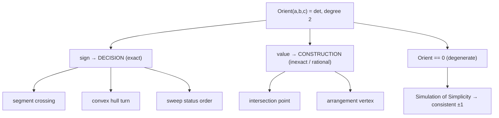

# Line and Segment Intersection — Mathematical Foundations and Robustness Theory

> At this level the questions are not "how do I code it" but "is it *provably* correct, *provably* exact, and *provably* well-defined on degenerate input?" We formalize the orientation predicate, prove the determinant intersection formula, derive the exact error bound that makes adaptive arithmetic possible, and treat degeneracy with the Edelsbrunner–Mücke theory of Simulation of Simplicity.

## Table of Contents

1. [Formal Definitions](#1-formal-definitions)
2. [The Orientation Predicate as a Determinant](#2-the-orientation-predicate-as-a-determinant)
3. [Correctness Proof — The Segment-Intersection Predicate](#3-correctness-proof--the-segment-intersection-predicate)
4. [Correctness Proof — The Intersection-Point Formula (Cramer)](#4-correctness-proof--the-intersection-point-formula-cramer)
5. [Floating-Point Error Analysis and Adaptive Predicates](#5-floating-point-error-analysis-and-adaptive-predicates)
6. [Exact Arithmetic — Bit-Length and Cost](#6-exact-arithmetic--bit-length-and-cost)
7. [Degeneracy and Simulation of Simplicity](#7-degeneracy-and-simulation-of-simplicity)
8. [Complexity, Arrangements, and Lower Bounds](#8-complexity-and-lower-bounds-for-all-intersections)
9. [Comparison of Predicate Strategies](#9-comparison-of-predicate-strategies)
10. [Summary](#10-summary)

> This file assumes the predicate mechanics of `junior.md`/`middle.md` and the systems framing of `senior.md`. It proves what the earlier levels asserted: that the orientation/intersection determinant is correct, exactly evaluable, robust under the right arithmetic, and total under symbolic perturbation.
>
> The structure mirrors a research result: **define** the objects (§1–2), **prove** correctness of the decision and the construction (§3–4), **analyze** the numerics and the exact cost (§5–6), **handle** degeneracy (§7), **bound** the aggregate complexity (§8), and **compare** the practical strategies (§9). Read top to bottom for the argument; jump to §6 for the `int64`-safety rule or §9 for the kernel-selection table.

---

## 1. Formal Definitions

We begin by fixing notation precisely, because every proof below manipulates these objects symbolically. The definitions are deliberately coordinate-based (not abstract) so that the bit-complexity claims of §6 are well-posed.

Work in the affine plane `ℝ²`. A **point** is `p = (p_x, p_y)`. A **segment** is the convex hull of two points, `s = [a, b] = { (1-t)a + t b : t ∈ [0,1] }`. The **supporting line** of `s` is `ℓ(s) = { (1-t)a + t b : t ∈ ℝ }`.

The **2-D cross product** of vectors `u, v` is the scalar

```text
u × v = u_x v_y − u_y v_x.
```

Define the **orientation** of an ordered triple `(a, b, c)`:

```text
Orient(a, b, c) = (b − a) × (c − a)
               = (b_x − a_x)(c_y − a_y) − (b_y − a_y)(c_x − a_x).
```

This equals the determinant

```text
              | b_x − a_x    c_x − a_x |
Orient(a,b,c)=| b_y − a_y    c_y − a_y |
```

and `Orient(a,b,c) = 2 · SignedArea(△abc)`. The objects and questions we answer rigorously:

```text
Predicate  SegInt(s, r) : do segments s, r share at least one point?    (a Boolean)
Function   Cross(ℓ, m)  : the unique point ℓ ∩ m, when the lines meet.   (a coordinate)
Predicate  Orient(a,b,c): is c left / right / on the oriented line a→b?  (a sign)
```

The thesis of this file: `SegInt` and `Cross` are *both* expressible through `Orient`/the determinant; the predicate is exactly evaluable while the construction is not; and degeneracy is tamed by symbolic perturbation.

The sign of `Orient` defines the base predicate:

```text
sign(Orient(a,b,c)) = +1  ⇔  c is strictly left of ray a→b  (counter-clockwise)
                    = −1  ⇔  c is strictly right            (clockwise)
                    =  0  ⇔  a, b, c are collinear.
```

---

## 2. The Orientation Predicate as a Determinant

Everything downstream — the intersection proof, the error analysis, the bit budget, the degeneracy handling — flows from viewing orientation as a determinant rather than a formula. The determinant form exposes the algebraic structure (multilinearity, antisymmetry, degree) that the expanded formula hides, and it is the form that exact-arithmetic libraries actually evaluate.

The homogeneous form makes the determinant structure explicit and is the basis of exact evaluation:

```text
                | a_x  a_y  1 |
Orient(a,b,c) = | b_x  b_y  1 |.
                | c_x  c_y  1 |
```

Expanding along the third column reproduces the formula in §1. Three consequences used everywhere below:

- **Antisymmetry.** Swapping any two rows negates the determinant: `Orient(a,b,c) = −Orient(b,a,c) = −Orient(a,c,b)`. Hence orientation conventions must fix a row order.
- **Translation invariance.** Adding a constant vector to all of `a,b,c` leaves the determinant unchanged (it depends only on differences). This is why we may translate by `−a` (the `(b−a),(c−a)` form) without changing the sign.
- **Degree.** The polynomial in the coordinates has total degree **2** (each term is a product of two coordinate differences). The *bit length* of the exact result is therefore bounded by twice the input bit length plus a small constant — the key fact for exact arithmetic (§6).

**Multilinearity and the determinant axioms.** `Orient` viewed as `det` is **multilinear** in its rows and **alternating** (vanishes when two rows are equal). These two axioms, plus normalization, uniquely characterize the determinant — which is why *every* "which side / how much area / do they cross" question reduces to it: they are all instances of measuring oriented volume in `ℝ²`. The alternating property is precisely the geometric statement "three points on a line span zero area," i.e. collinear ⇒ `Orient = 0`. Recognizing this is what lets a practitioner derive a needed predicate from scratch rather than memorizing formulas.

**Sign-of-determinant as the only output.** Crucially, robust geometry never needs the determinant's *value*, only its *sign*. This is a strictly easier problem: sign can be certified by a filter (§5) long before the exact value is known, and it is invariant under positive scaling of any row. The entire robustness machinery of this file rests on the fact that geometric *decisions* are sign tests, while only geometric *constructions* (the actual point) need values.

---

## 3. Correctness Proof — The Segment-Intersection Predicate

The `junior.md` rule "`o1≠o2 && o3≠o4`" was asserted; here we prove it, isolating the one lemma (straddle) on which the whole predicate rests and showing exactly how the boundary `==0` cases extend it to a total function.

**Claim.** Segments `s = [p₁, p₂]` and `r = [p₃, p₄]` (with `p₁ ≠ p₂`, `p₃ ≠ p₄`) intersect in a single interior-to-both point **iff**

```text
sign Orient(p₁,p₂,p₃) ≠ sign Orient(p₁,p₂,p₄)   AND
sign Orient(p₃,p₄,p₁) ≠ sign Orient(p₃,p₄,p₂),
```

with all four orientations nonzero. (Zero orientations are the boundary cases, handled separately by the on-segment predicate.)

**Proof (general, non-degenerate case).**

Let `o₁ = Orient(p₁,p₂,p₃)`, `o₂ = Orient(p₁,p₂,p₄)`, and assume all four orientations are nonzero.

*Lemma (straddle).* `p₃` and `p₄` lie strictly on opposite sides of line `ℓ(s)` iff `sign o₁ ≠ sign o₂`.

Proof of lemma: parametrize the signed distance of a point `c` from the oriented line through `p₁,p₂` as `f(c) = Orient(p₁,p₂,c) / |p₂ − p₁|`. `f` is an affine function of `c` with `f > 0` on one open half-plane and `f < 0` on the other, vanishing exactly on `ℓ(s)`. Since `|p₂−p₁| > 0`, `sign f(c) = sign Orient(p₁,p₂,c)`. Thus `p₃, p₄` are on opposite open sides iff `o₁, o₂` differ in sign. ∎(lemma)

*(⇐)* Suppose both straddle conditions hold. By the lemma, `r` crosses `ℓ(s)` (its endpoints are strictly separated by `ℓ(s)`), so `r ∩ ℓ(s)` is a single point `x` in the relative interior of `r`. Symmetrically `s` crosses `ℓ(r)` at a single interior point `y`. The intersection `ℓ(s) ∩ ℓ(r)` is a unique point (the lines are not parallel, else some orientation would be zero — see below), and both `x` and `y` equal that unique point; hence `x = y` lies in the relative interior of both segments. So `s ∩ r = {x}`. 

*(Non-parallel justification.)* If `ℓ(s) ∥ ℓ(r)` then `p₃, p₄` lie on a line parallel to `ℓ(s)`, so `Orient(p₁,p₂,p₃) = Orient(p₁,p₂,p₄)` (equal signed distances up to the same constant offset) — they would share a sign, contradicting the straddle hypothesis. So the straddle conditions imply non-parallel lines.

*(⇒)* Suppose `s ∩ r = {x}` with `x` interior to both and all orientations nonzero (no endpoint on the other's line). Then `r` passes from one side of `ℓ(s)` to the other through `x`, so its endpoints are strictly separated: `sign o₁ ≠ sign o₂`. Symmetrically for `s` across `ℓ(r)`. ∎

**Boundary cases.** If some `oᵢ = 0`, the corresponding endpoint lies on the other's *line*; it is an intersection iff it lies on the *segment*, i.e. within the endpoint bounding box (the on-segment predicate, exact for collinear points). If all four are zero, the segments are collinear and intersect iff their 1-D projections onto the dominant axis overlap. These complete the predicate to a total function on all inputs.

**Formal on-segment predicate.** For a point `c` already known to satisfy `Orient(a,b,c) = 0` (collinear), `c ∈ [a,b]` iff

```text
min(a_x,b_x) ≤ c_x ≤ max(a_x,b_x)   AND   min(a_y,b_y) ≤ c_y ≤ max(a_y,b_y).
```

*Correctness.* Collinearity means `c = a + t(b−a)` for some `t ∈ ℝ`. The bounding-box condition is equivalent to `t ∈ [0,1]` on the non-degenerate axis: if `a_x ≠ b_x`, then `min(a_x,b_x) ≤ c_x ≤ max(a_x,b_x) ⇔ 0 ≤ t ≤ 1`; the y-condition is then automatically consistent by collinearity. If `a_x = b_x` (vertical), the x-condition is vacuous and the y-condition decides. So the conjunction is exactly `t ∈ [0,1]`, i.e. `c ∈ [a,b]`. This predicate uses only comparisons — no arithmetic — and is therefore exact for any coordinate type. ∎

**Collinear-overlap predicate.** When all four `oᵢ = 0`, both segments lie on a common line `ℓ`. Pick the axis `α ∈ {x,y}` on which `ℓ` is non-constant (it cannot be constant on both unless a segment is a point). Projection onto `α` is an order-isomorphism on `ℓ`, so `[a,b]` and `[c,d]` map to integer intervals `I₁, I₂`; the segments overlap iff `I₁ ∩ I₂ ≠ ∅`, a 1-D interval test. The intersection is empty, a single point (intervals abut), or a sub-segment (intervals overlap in a range) — exactly the three collinear sub-cases. All exact in integers.

---

## 4. Correctness Proof — The Intersection-Point Formula (Cramer)

§3 proved *whether* two segments meet. This section proves the formula for *where*, and — equally important — proves precisely *which* parts of that computation are exact and which are not. The punchline (the "decide exactly, locate approximately" discipline) is not folklore; it is a theorem about where division enters the algebra.

**Claim.** For non-parallel lines `ℓ(s): p₁ + t d₁` (`d₁ = p₂−p₁`) and `ℓ(r): p₃ + u d₂` (`d₂ = p₄−p₃`), the unique intersection has

```text
t = ( (p₃ − p₁) × d₂ ) / ( d₁ × d₂ ),
u = ( (p₃ − p₁) × d₁ ) / ( d₁ × d₂ ),
```

and the point is `p₁ + t d₁`.

**Proof.** The intersection condition `p₁ + t d₁ = p₃ + u d₂` rearranges to

```text
t d₁ − u d₂ = p₃ − p₁ =: e.
```

In matrix form with columns `d₁` and `−d₂`:

```text
[ d₁ | −d₂ ] [ t ]   = e ,   so   M [t,u]ᵀ = e,   M = [ d₁_x  −d₂_x ; d₁_y  −d₂_y ].
```

`det M = d₁_x(−d₂_y) − (−d₂_x)d₁_y = −(d₁_x d₂_y − d₁_y d₂_x) = −(d₁ × d₂)`. Non-parallel ⇔ `d₁ × d₂ ≠ 0` ⇔ `det M ≠ 0`, so `M` is invertible and the solution is unique.

By **Cramer's rule**, replacing the first column of `M` by `e`:

```text
t = det[ e | −d₂ ] / det M = ( e_x(−d₂_y) − (−d₂_x)e_y ) / −(d₁×d₂)
  = −(e_x d₂_y − e_y d₂_x) / −(d₁×d₂) = (e × d₂)/(d₁ × d₂).
```

Replacing the second column by `e`:

```text
u = det[ d₁ | e ] / det M = ( d₁_x e_y − e_x d₁_y ) / −(d₁×d₂)
  = (d₁ × e)/−(d₁×d₂) = (e × d₁)/(d₁ × d₂),
```

using `d₁ × e = −(e × d₁)`. The two signs cancel, giving the stated formulas. Substituting `t` into `p₁ + t d₁` yields the point. ∎

**Consequence.** The decision (`det M ≠ 0`) is degree-2 and exactly evaluable in integers; the *coordinates* are rationals with degree-2 numerator and denominator, exactly representable as fractions of the input integers. Round-off enters **only** at the final division — never in any decision. This justifies the senior-level discipline "decide exactly, locate approximately."

**Worked exact construction.** Take `p₁=(1,1), p₂=(4,4), p₃=(1,4), p₄=(4,1)` (the X). Then `d₁=(3,3), d₂=(3,−3), e=p₃−p₁=(0,3)`.

```text
det = d₁ × d₂ = 3·(−3) − 3·3 = −9 − 9 = −18.
e × d₂ = 0·(−3) − 3·3 = −9.
t = (e × d₂)/det = −9 / −18 = 1/2.       (exact rational, no round-off)
point = p₁ + t·d₁ = (1,1) + ½·(3,3) = (1 + 3/2, 1 + 3/2) = (5/2, 5/2).
```

The intersection is the exact fraction `(5/2, 5/2)`. A rational kernel stores it as such; a float kernel rounds to `(2.5, 2.5)` — here exactly representable, but in general the rounding is where, and *only* where, error appears. Note `det = −18 ≠ 0` ⇔ non-parallel; `0 < t < 1` ⇔ interior to segment 1; symmetric for `u`.

**Bounding the constructed coordinate.** Since `t = num/det` with `|num|, |det| ≤ 2^{2b+3}`, the point `p₁ + t·d₁` has the exact form `(p₁·det + num·d₁)/det`, numerator and denominator both `O(2^{3b})` — i.e. degree-3 in the inputs once the offset is folded in. This `b → 3b` growth per construction is the seed of the cascading-bit problem analyzed in §6.

---

## 5. Floating-Point Error Analysis and Adaptive Predicates

This is the section that connects the clean algebra above to the messy reality of `senior.md`: floats are fast but not exact, and the predicate must nonetheless be *certified*. The resolution — adaptive precision — is the single most important idea in robust geometric computing, and it applies verbatim to every predicate in §9e.

The orientation determinant `Orient(a,b,c)` evaluated in IEEE-754 double precision suffers **catastrophic cancellation** when the true value is near zero (nearly collinear points) — exactly when the sign matters most. We need a certified error bound.

Let `⊕, ⊖, ⊗` denote floating-point operations with unit round-off `ε = 2⁻⁵³`. For the computed value `Õrient`, standard forward error analysis gives a bound of the form

```text
| Õrient − Orient | ≤ E,   where E = C · ε · (|t₁| + |t₂|),
```

with `t₁ = (b_x−a_x)(c_y−a_y)`, `t₂ = (b_y−a_y)(c_x−a_x)` the two product terms, and `C` a small constant (Shewchuk derives `C = 3ε + O(ε²)` after accounting for the subtractions). **Adaptive exact arithmetic** (Shewchuk, *Adaptive Precision Floating-Point Arithmetic and Fast Robust Geometric Predicates*, 1997) exploits this:

```text
1. Compute Õrient and the error bound E in fast floating point.
2. If |Õrient| > E, the sign is certified correct — return it. (The common case.)
3. Else recompute with the next precision level (error-free transformations,
   two-sum / two-product), tightening E. Repeat.
4. In the worst case fall back to exact arithmetic; the sign is then exact.
```

Because step 2 succeeds for almost all inputs, the predicate runs at near-float speed yet is **provably exact** for every input. The error-free transformations rely on:

- **TwoSum**(a,b): exact `(x, y)` with `x = a⊕b`, `x + y = a + b`.
- **TwoProduct**(a,b): exact `(x, y)` with `x = a⊗b`, `x + y = a·b` (via FMA or Dekker's splitting).

These let a determinant be represented as a sum of non-overlapping floating-point components whose total is the exact value, evaluated only as far as needed to determine the sign.

**Worked adaptive evaluation.** Consider `Orient(a,b,c)` with the two product terms `t₁ = (b_x−a_x)(c_y−a_y)` and `t₂ = (b_y−a_y)(c_x−a_x)`, so `Orient = t₁ − t₂`.

```text
Stage A (float):  d = fl(t₁) ⊖ fl(t₂);   E = C·ε·(|fl(t₁)| + |fl(t₂)|).
  if |d| > E:  sign is certified — return sign(d).      ← ~99% of inputs stop here.

Stage B (TwoProduct): represent t₁ = p₁ + q₁ and t₂ = p₂ + q₂ exactly (4 fp numbers).
  Form the 4-term expansion d' = p₁ ⊕ q₁ ⊖ p₂ ⊖ q₂ via error-free summation; tighten E.
  if |d'| > E':  return sign(d').                        ← nearly all remaining inputs.

Stage C (exact):  expand fully (sum of non-overlapping components); the leading
  nonzero component's sign is the exact sign of Orient.  ← only true degeneracies / ties.
```

The cost is dominated by Stage A in the common case, so the *expected* running time is `Θ(1)` floating-point ops with a tiny constant, while the *worst* case is `Θ(p)` for precision `p` — and even that is bounded because the degree-2 determinant needs at most `~4` exact components for `int`-range inputs. This is the amortized-style argument that makes "always exact" affordable.

**Error-bound derivation sketch.** Each product `b_x⊖a_x` incurs relative error `≤ ε`; the multiply adds another `≤ ε`; the final subtract another `≤ ε`. Composing the first-order terms (and dropping `O(ε²)`), the absolute error of `d` is bounded by `(3ε + O(ε²))·(|t₁| + |t₂|)`, giving the constant `C ≈ 3` used above. When `|d|` exceeds this bound, no accumulation of round-off could have changed the *sign* — the certificate. This is the formal justification for Stage A's early exit.

---

## 6. Exact Arithmetic — Bit-Length and Cost

When adaptive evaluation falls through to its exact stage, *how wide* must the arithmetic be? This section pins down the answer precisely — it is the difference between "use `int64` and you're exact" being true and being a silent bug. The bound is a pure function of the input coordinate range and the predicate's degree.

If input coordinates are integers in `[−2^b, 2^b]`, then:

- Coordinate **differences** lie in `[−2^{b+1}, 2^{b+1}]` — bit length `b+1`.
- Each **product** of two differences has bit length `≤ 2b+2`.
- The orientation **difference of two products** has bit length `≤ 2b+3`.

So `Orient` fits in `2b+3` bits. For `int64` coordinates with `b = 31` (signed 32-bit), the result needs `≤ 65` bits — it **overflows `int64`**, mandating 128-bit or wider arithmetic for the exact integer predicate. For `b = 20` (coords up to ~`10^6`), `43` bits suffice and `int64` is safe. This bit-budget calculation is the precise condition under which "use `int64` and you're exact" holds.

The intersection-*point* numerator/denominator (degree 2) fit in `~2b+3` bits each; the coordinate `p₁ + t·d₁` is a rational whose exact representation as `BigInteger/BigInteger` grows by another factor, which is why rational pipelines periodically renormalize (`gcd`) to bound bit growth.

```text
predicate bit length :  2b + 3            (decision — exact in 128-bit for 32-bit coords)
point numerator/denom:  Θ(b)              (degree-2 rationals)
rational chain growth:  Θ(depth · b)      (renormalize with gcd to control)
```

**Cascading constructions.** The bit-growth problem becomes acute when an intersection *point* feeds a *subsequent* predicate — e.g. in arrangement construction, a new vertex (itself a degree-2 rational) is compared against another segment, raising the predicate's degree. Each layer of construction multiplies the bit length. Without renormalization, a chain of `d` constructions yields coordinates of bit length `Θ(2^d · b)` — exponential. Two countermeasures:

- **gcd renormalization** after each construction caps the rational at its reduced form, keeping growth linear in the *number* of operations rather than exponential.
- **Lazy / filtered constructions** (CGAL's lazy kernel) keep an approximate `double` interval alongside the exact value, and only evaluate the exact (expensive) form when an interval test is inconclusive — bounding the practical cost while preserving exactness.

This is the formal reason the senior-level advice "decide exactly, *construct* approximately" is not merely a speed hack but a *bit-complexity* necessity: exact construction chains are intractable, exact decision chains are not.

### 6a. Degree of geometric predicates

A useful classification: the **arithmetic degree** of a predicate is the maximum total degree, in the input coordinates, of the polynomial whose sign it tests. For the family in this topic:

| Predicate | Polynomial | Degree | Exact in `int64` when |
|-----------|-----------|--------|------------------------|
| Orientation / `sidedness` | `Orient(a,b,c)` | 2 | coords `≤ 2^{30}` |
| Segment-intersection decision | sign products of degree-2 terms | 2 | coords `≤ 2^{30}` |
| Point-on-segment | comparisons only | 1 | always (no arithmetic) |
| In-circle (related, Delaunay) | `4×4` determinant | 4 | coords `≤ 2^{15}` |

The degree directly sets the bit budget (`degree · b + O(1)`), and thus the arithmetic width needed for exactness. Segment intersection is a *degree-2* problem — the lowest non-trivial degree — which is exactly why it is the gateway predicate of computational geometry: cheap to make exact, yet structurally identical to the harder degree-4 predicates (in-circle) that power Delaunay triangulation (`11-voronoi-delaunay`).

---

## 7. Degeneracy and Simulation of Simplicity

If §5 solved *numerical* robustness (getting the sign right), §7 solves *combinatorial* robustness (knowing what to do when the sign is legitimately zero). The two are independent: an exact predicate can still return `0`, and the algorithm must have a defined, consistent behavior for that case. Simulation of Simplicity supplies exactly that.

Degenerate inputs — three concurrent lines, collinear segments, coincident endpoints — are where geometric algorithms crash or produce inconsistent topology. **Simulation of Simplicity (SoS)** (Edelsbrunner & Mücke, 1990) is a systematic, *symbolic* perturbation that removes all degeneracies without changing the (correct) answer on non-degenerate inputs.

**Idea.** Perturb each input coordinate by a distinct, infinitesimally small symbolic amount:

```text
p_{i,x} ← p_{i,x} + ε^{2^{i·d + 0}},   p_{i,y} ← p_{i,y} + ε^{2^{i·d + 1}},
```

where `ε` is a symbolic infinitesimal (`0 < ε ≪` everything) and the exponents are chosen so all perturbations have **strictly different magnitudes**. A predicate that was exactly `0` (degenerate) becomes a polynomial in `ε`; its sign is the sign of its **lowest-order nonzero `ε`-term**, which is always determinate. Concretely, evaluating a predicate under SoS reduces to: compute the ordinary determinant; if it is zero, evaluate a fixed sequence of *smaller* sub-determinants (minors) until one is nonzero, and take its sign.

**Guarantees.**

- **Consistency.** Every predicate returns `+1` or `−1`, never `0`. All degenerate ties are broken *coherently* (the same virtual perturbation is used everywhere), so the algorithm's case analysis is total and the output topology is always valid.
- **Faithfulness.** On non-degenerate input the perturbation is too small to change any sign, so the answer is unchanged.
- **Cost.** Bounded extra work per degenerate evaluation (a fixed number of minor evaluations); zero extra cost in the common non-degenerate case.

SoS is the rigorous answer to "what does the algorithm do when three roads meet at a point?" — it pretends, consistently, that they do not, and the pretense is provably harmless.

**Comparison with alternative tie-breaking schemes.**

| Scheme | Total predicate? | Consistent across call sites? | Changes non-degenerate answers? | Cost |
|--------|------------------|-------------------------------|---------------------------------|------|
| Naive (`0` allowed) | no — leaves `0` | n/a | no | none |
| Ad-hoc rule ("collinear ⇒ left") | yes | **no** (order-dependent) | no | none |
| Random perturbation (jitter coords) | usually | no (non-deterministic) | **yes** (can flip true signs) | none |
| Simulation of Simplicity | **yes** | **yes** | **no** | minors, only when degenerate |
| Exact rational + explicit degeneracy handling | yes | yes | no | high (per-case code) |

Only SoS and explicit handling are both *total* and *faithful*; SoS wins on code economy because the same minor-sequence handles every predicate uniformly, whereas explicit handling requires bespoke logic at each degenerate site.

### 7a. Worked SoS example — breaking a collinear tie

Suppose `Orient(a,b,c) = 0` exactly (three collinear points), and the algorithm needs a definite left/right answer to proceed (e.g. to insert `c` consistently into a sweep status). Under SoS we perturb each coordinate symbolically. Expanding the homogeneous determinant of §2 with perturbed entries, the leading `ε`-term that survives when the constant term is zero is a **minor** of the determinant. The recipe (for the orientation predicate) evaluates, in fixed order, the sub-determinants formed by dropping one perturbed coordinate at a time:

```text
if Orient(a,b,c) ≠ 0: return its sign
else evaluate, in order, the minors:
    M1 = (b_x − a_x)         # coefficient of the first ε-term
    if M1 ≠ 0: return sign(M1)
    M2 = −(c_x − a_x)
    if M2 ≠ 0: return sign(M2)
    M3 = (b_y − a_y)
    return sign(M3)          # guaranteed nonzero unless a=b (excluded)
```

Because the perturbations have *strictly ordered* magnitudes, exactly one minor in this sequence is the lowest-order nonzero term, and its sign is the SoS verdict. The same fixed sequence is used at every call site, so all tie-breaks are mutually consistent — which is precisely what keeps the global topology valid.

### 7b. Why consistency, not just non-zeroness, is the point

It is tempting to "break ties" by an ad-hoc rule like "if collinear, treat `c` as left." This fails: two different call sites comparing the *same* triple in different argument orders can then disagree (antisymmetry, §2), producing a non-orientable arrangement. SoS guarantees a *single global virtual perturbation* of the input, so every predicate is evaluated as if on one fixed perturbed instance. The output is the exact, correct combinatorial structure of *that* perturbed instance — which, by faithfulness, agrees with the original wherever the original was non-degenerate, and supplies a canonical, consistent answer wherever it was degenerate.

---

## 8. Complexity and Lower Bounds for All-Intersections

With the single-pair predicate fully understood, the remaining question is the *aggregate*: how hard is finding *all* intersections among `n` segments, and how large can the answer be? The answers establish that the difficulty is purely combinatorial — the per-pair arithmetic is `Θ(1)` — and that the optimal bound is output-sensitive.

**Problem.** Report all `k` intersecting pairs among `n` segments.

- **Single-pair predicate:** `Θ(1)` arithmetic operations (degree-2 determinant).
- **Brute force:** `Θ(n²)` predicate evaluations.
- **Bentley–Ottmann sweep** (`05-sweep-line`): `O((n + k) log n)` time, `O(n)` space — **output-sensitive**, optimal up to the `log` for sparse output.
- **Chazelle–Edelsbrunner:** `O(n log n + k)` time — removes the `log` from the `k` term, optimal, but with large constants and `O(n + k)` space.
- **Balaban (1995):** `O(n log n + k)` time, `O(n)` space — the theoretically best deterministic algorithm.

**Lower bound.** Any algorithm reporting all intersections needs `Ω(n log n + k)`: the `Ω(k)` is trivial (it must output `k` items), and the `Ω(n log n)` follows from a reduction from **element distinctness** in the algebraic decision-tree model — detecting whether *any* two of `n` segments intersect already requires `Ω(n log n)`. Hence Balaban's bound is optimal.

```text
detect any intersection :  Θ(n log n)              (matches element-distinctness lower bound)
report all k pairs      :  Θ(n log n + k)          (optimal; Balaban / Chazelle–Edelsbrunner)
Bentley–Ottmann         :  O((n + k) log n)         (simple, O(n) space, near-optimal)
```

The takeaway connecting all levels: the *predicate* (this topic) is constant-time and exact; the *combinatorial* difficulty lives entirely in organizing the `n` segments, which is the sweep-line topic.

### Arrangement complexity and Euler's formula

The output of "all intersections" is an **arrangement** `𝒜(S)` — the planar subdivision induced by the `n` segments. Its combinatorial size is governed by Euler's formula for planar graphs, `V − E + F = 2`. With `k` intersection points:

```text
vertices  V = 2n (endpoints) + k (crossings)
edges     E = n + 2k       (each crossing splits two edges)
faces     F = E − V + 2 = (n + 2k) − (2n + k) + 2 = k − n + 2.
```

So the arrangement has `Θ(n + k)` total features, and any algorithm that *builds* it needs `Ω(n + k)` time and space — the output-sensitive floor that Bentley–Ottmann's `O((n+k) log n)` and Balaban's `O(n log n + k)` approach. For `n` *lines* (unbounded), every pair meets, so `k = C(n,2) = Θ(n²)` and the arrangement is `Θ(n²)` — the worst case. This bounds `k ≤ C(n,2)` for segments too, recovering the `O(n²)` brute-force ceiling.

### Average-case analysis

For `n` segments with endpoints drawn uniformly from a unit square, the expected number of intersections is `E[k] = Θ(n²) · p`, where `p` is the probability two random segments cross. For "long" random segments `p` is a constant, giving `E[k] = Θ(n²)` — dense, so brute force is asymptotically optimal in expectation. For "short" random segments of length `ℓ`, `p = Θ(ℓ²)`, so `E[k] = Θ(n²ℓ²)`; when `ℓ = Θ(1/√n)` (segments shrinking as density grows, the realistic GIS regime), `E[k] = Θ(n)` — **sparse**, and the sweep line's `O((n+k) log n) = O(n log n)` strictly beats brute force. This is the formal version of the senior-level guidance: *measure your* `k`*, and let the segment-length distribution decide brute-force vs sweep.*

### 8a. Worked exact-arithmetic trace

To make the bit-budget concrete, trace the orientation predicate on near-collinear integer points. Let

```text
a = (0, 0),  b = (1000000, 1),  c = (2000000, 2).
```

These three points are *exactly collinear* (they satisfy `y = x / 10^6` only approximately — in fact `c` is `(2·10^6, 2)`, and the line through `a,b` has slope `1/10^6`, giving `y(2·10^6) = 2`, so they *are* collinear). The exact orientation is:

```text
Orient(a,b,c) = (b_x − a_x)(c_y − a_y) − (b_y − a_y)(c_x − a_x)
             = (10^6)(2) − (1)(2·10^6)
             = 2·10^6 − 2·10^6 = 0.            ← exactly collinear
```

Now perturb `c` to `(2000000, 3)` (one unit up):

```text
Orient = (10^6)(3) − (1)(2·10^6) = 3·10^6 − 2·10^6 = 10^6 > 0.   ← strictly left
```

The two product terms are each `~2·10^6` (21 bits), their difference is `10^6`. In **double precision**, `2·10^6` is exact, so this particular case computes correctly — but scale the coordinates to `~10^8` and the products reach `~10^{16}`, exceeding the 53-bit mantissa (`~9·10^{15}`), so the subtraction loses bits exactly when the result is small. This is the catastrophic-cancellation regime the adaptive predicate (§5) detects via its error bound `E`. With **`int64`** the products `~10^{16}` still fit (`< 9.2·10^{18}`), so the integer predicate stays exact here — confirming §6's rule that `int64` suffices while `2b+3 ≤ 63`, i.e. coordinates up to `~2^{30} ≈ 10^9`.

### 8b. Projective duality (why lines and points are interchangeable)

A deeper structural fact: in the projective plane, **points and lines are dual**. A point `(a, b)` maps to the line `y = ax − b`, and a line `y = ax − b` maps back to the point `(a, b)`. Under this duality:

- Three points are **collinear** ⇔ their three dual lines are **concurrent** (meet at one point).
- The **intersection of two lines** is dual to the **line through two points**.

This is why the *same* `2×2`/`3×3` determinant answers both "are these points collinear?" and "do these lines meet, and where?". The intersection-point formula (§4) and the orientation predicate (§2) are dual faces of one determinant. Duality also underlies the connection between the **all-intersections** problem and the **arrangement of lines**, whose combinatorial complexity `Θ(n²)` (every pair of `n` lines meets) bounds the worst-case output `k`.

### 8c. Condition number and numerical sensitivity

For the intersection *point* (a construction, not a decision), the relevant question is *conditioning*: how much does the output move per unit input perturbation? The point is `x = (numerator)/det` with `det = d₁ × d₂ = |d₁||d₂| sin θ`, where `θ` is the angle between the two lines. Thus:

```text
‖∂x‖  ∝  1 / |sin θ|.
```

As `θ → 0` (lines nearly parallel), `det → 0` and the intersection point becomes **ill-conditioned** — a tiny coordinate change sends it far away (two near-parallel lines meet "near infinity"). This is the geometric meaning of a small denominator. The condition number `κ ≈ 1/|sin θ|` is the construction analogue of the cancellation problem in the predicate, and it is *unavoidable in any arithmetic*: even exact rational coordinates are *correct* but *large* (huge numerator and denominator) for near-parallel lines. The senior-level fix — snap-rounding, or treating `|det| < threshold` as parallel — is a deliberate, bounded approximation that trades an unbounded coordinate for a controlled one.

---

## 9. Comparison of Predicate Strategies

Theory in hand, this section makes the engineering choice concrete: given a workload, which arithmetic strategy is Pareto-optimal? The columns below are the dimensions a kernel designer actually trades off, and the rows trace the spectrum from "fast and wrong near zero" to "always exact and total."

| Strategy | Exact? | Worst-case cost | Coordinate domain | Reference / use |
|----------|--------|-----------------|-------------------|------------------|
| Naive float | No (fails near 0) | `Θ(1)` | float | games, real-time |
| Float + fixed ε | No (ε mis-tuned both ways) | `Θ(1)` | float | quick tools |
| Exact integer (128-bit) | Yes if `2b+3 ≤ 128` | `Θ(1)` | bounded ints | snapped GIS, CP |
| Adaptive exact (Shewchuk) | Yes, always | `Θ(1)` typical, `Θ(precision)` rare | full float | CGAL, robust kernels |
| Rational (`big.Rat`) | Yes, always | `Θ(b)`–`Θ(b²)` | unbounded | CAD, symbolic |
| Exact + SoS | Yes + total (no degeneracy) | adaptive + minors | any | provably robust pipelines |

The Pareto-optimal choice for *general* continuous input is **adaptive exact predicates + SoS**: float speed in the common case, certified exactness always, and a total predicate with no degenerate branch left undefined. This is precisely what CGAL's `Exact_predicates_inexact_constructions_kernel` provides — exact *decisions*, approximate *coordinates* — matching the theory of §4 that only the final division need be inexact.

### 9a. The predicate inside the sweep line

The sweep-line algorithm (`05-sweep-line`) consumes exactly the predicates proven here, and its correctness *requires* their exactness. Bentley–Ottmann maintains a balanced BST (the "status structure") of segments ordered by their `y`-coordinate **at the current sweep `x`**. Comparing two segments in this order is itself an orientation predicate: segment `s` is below segment `r` at sweep position `x` iff a specific `Orient` sign holds at the relevant event point. If that comparison is computed inexactly and flips sign, the BST's ordering invariant is violated — the tree becomes inconsistent, neighbors are mis-identified, and intersection events are missed or duplicated. This is the concrete mechanism by which a non-robust predicate breaks the *combinatorial* algorithm, not merely the coordinates. Hence robust sweep implementations (CGAL's `Arrangement_2`) build on exact predicates with the exact-decision / inexact-construction split of §4.

```text
sweep status comparison  :  Orient sign at event x   (exact ⇒ valid BST order)
event = intersection      :  this topic's predicate    (exact ⇒ no missed/dup events)
event = endpoint          :  lexicographic point order  (exact ⇒ deterministic processing)
```

### 9b. Open and practical frontiers

- **Constant-time exact predicates without 128-bit hardware.** Filtered predicates (interval arithmetic as a fast filter, exact fallback) match adaptive predicates in spirit and are the production norm; squeezing the fallback rate toward zero on adversarial data is an ongoing engineering concern.
- **Numerically-aware snap-rounding.** Iterated snap-rounding bounds the number of segments through any snapped pixel, controlling the geometric perturbation; tight bounds on the *combined* perturbation across a full arrangement remain subtle.
- **GPU / SIMD batch predicates.** Evaluating millions of orientation determinants in parallel with *consistent* exact results (so the topology is still valid) is an active systems problem, complicated by floating-point reproducibility across hardware.

### 9c. Randomized incremental construction (alternative to sweeping)

Beyond sweeping, arrangements can be built by **randomized incremental construction (RIC)**: insert the `n` segments in random order, maintaining the arrangement (or a trapezoidal decomposition) after each insertion. The expected cost is bounded by **backward analysis**:

```text
Theorem. RIC of the arrangement of n segments with k intersections runs in
         expected  O(n log n + k)  time.

Proof idea (backward analysis). Consider the structure after inserting i segments.
The expected work to insert the i-th is the expected number of trapezoids it
"destroys," which by symmetry equals (total structure size)/i. Summing the
conflict-list updates with linearity of expectation telescopes to O(n log n + k);
the log n is the expected point-location depth, the k is the total feature count
from the arrangement-size analysis above.                                      ∎
```

RIC matches the optimal `O(n log n + k)` *in expectation*, is simpler to make robust than Bentley–Ottmann (fewer ordered comparisons), and underlies CGAL's trapezoidal-map point location. It still consumes exactly this topic's orientation/intersection predicates — the randomization controls the *combinatorial* cost, not the *arithmetic* one.

### 9d. Expected predicate calls vs worst case

Tying the two analyses together, the *number of predicate evaluations* in the optimal algorithms is `Θ(n log n + k)`, and each evaluation is an `O(1)`-arithmetic-op orientation determinant whose *bit cost* is `O(b)` in the worst exact case but `O(1)` floating-point ops in expectation under adaptive evaluation (§5). The total expected arithmetic work is therefore `O((n log n + k) · 1)` machine operations on typical input, degrading gracefully to `O((n log n + k) · b)` on adversarial degenerate input — a clean separation of combinatorial and numerical cost that recurs throughout robust computational geometry.

---

## Further Reading

- Shewchuk, J. R. (1997). *Adaptive Precision Floating-Point Arithmetic and Fast Robust Geometric Predicates.* Discrete & Computational Geometry 18:305–363 — the adaptive predicate of §5.
- Edelsbrunner, H. & Mücke, E. P. (1990). *Simulation of Simplicity.* ACM Transactions on Graphics 9(1):66–104 — the degeneracy theory of §7.
- Bentley, J. L. & Ottmann, T. A. (1979). *Algorithms for reporting and counting geometric intersections.* IEEE Trans. Computers — the sweep (`05-sweep-line`).
- Balaban, I. J. (1995). *An optimal algorithm for finding segments intersections.* SoCG — the `O(n log n + k)`, `O(n)`-space optimum of §8.
- de Berg, van Kreveld, Overmars, Schwarzkopf. *Computational Geometry: Algorithms and Applications*, Ch. 2 (segment intersection) and Ch. 8 (arrangements, duality).
- CGAL manual — `Exact_predicates_inexact_constructions_kernel`, `Arrangement_2`: the exact-decision / inexact-construction split of §4 and §9a in production form.

---

## 9e. The orientation predicate across computational geometry

A final unifying observation: the *same* `Orient` predicate, proven correct and made robust here, is the atom of nearly every other planar algorithm in this section. Recognizing this means the robustness work done once pays off everywhere.

| Algorithm (sibling topic) | Role of `Orient` |
|---------------------------|------------------|
| Convex hull (`01-convex-hull`) | Graham/Andrew keep a turn iff `Orient` is CCW; the whole hull is sign tests. |
| Point in polygon (`03-point-in-polygon`) | Ray casting counts edge crossings via `SegInt`; winding number sums `Orient` signs. |
| Sweep line (`05-sweep-line`) | Status-order comparisons *are* `Orient` signs at the sweep `x` (§9a). |
| Rotating calipers (`06-rotating-calipers`) | Antipodal advance is driven by `Orient`-based area comparisons. |
| Half-plane intersection (`12-half-plane-intersection`) | Each half-plane is a sign of the implicit `ax+by−c`, i.e. an `Orient`. |
| Delaunay (`11-voronoi-delaunay`) | Uses the degree-4 in-circle predicate — `Orient`'s higher-degree sibling. |

The pattern: **every combinatorial decision in planar geometry is a determinant sign**, and the constructions (intersection points, circumcenters) are the determinant *values*. Robustness theory therefore generalizes from this one topic to the entire field — exact signs, approximate values, symbolic tie-breaking.



---

## 10. Summary

The orientation predicate is a `3×3` determinant of degree 2; its sign decides left/right/collinear, and from it the entire segment-intersection predicate is proven correct via the straddle lemma. The intersection point follows from Cramer's rule, with the determinant equal to the cross product of direction vectors — so the *decision* is exactly evaluable in integers and round-off is confined to a single final division. Robustness is a solved problem in theory: an `O(ε·(|t₁|+|t₂|))` error bound enables **adaptive exact predicates** that are float-fast yet always correct, exact arithmetic costs are pinned down by the `2b+3`-bit budget, and **Simulation of Simplicity** turns every degeneracy into a consistently-broken tie. The combinatorial cost of *all* intersections — `Θ(n log n + k)`, optimal — lives not in this predicate but in the sweep-line organization of the segments (`05-sweep-line`).

---

One sentence to carry forward:

> **Decisions are exact determinant signs; constructions are inexact determinant values; degeneracies are consistently-broken ties.**

That triad, proven here for segment intersection, is the template for robust computational geometry everywhere.

---

**Next step:** [interview.md](./interview.md) — tiered question bank (junior → professional), behavioral and system-design prompts, and end-to-end coding challenges in Go, Java, and Python.
